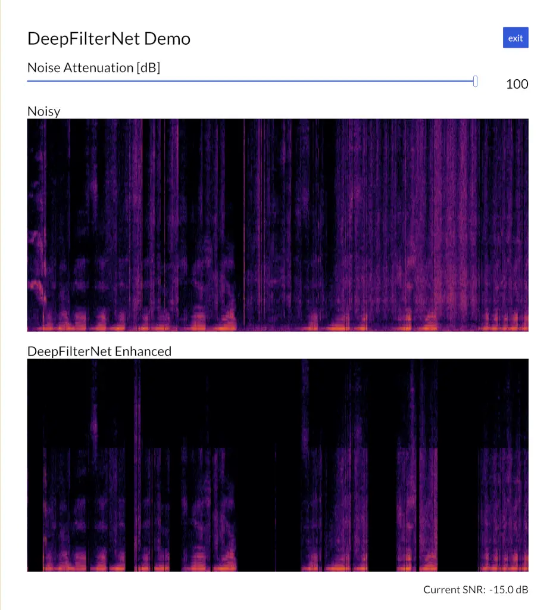

¹Friedrich-Alexander-Universität Erlangen-Nürnberg, Pattern Recognition
Lab  
²WS Audiology, Research and Development, Erlangen, Germany

# DeepFilterNet: Perceptually Motivated Real-Time Speech Enhancement

Hendrik Schröter¹, Alberto N. Escalante-B.², Tobias Rosenkranz², Andreas
Maier¹

###### Abstract

Multi-frame algorithms for single-channel speech enhancement are able to
take advantage from short-time correlations within the speech signal.
Deep Filtering (DF) was proposed to directly estimate a complex filter
in frequency domain to take advantage of these correlations.

In this work, we present a real-time speech enhancement demo using
DeepFilterNet. DeepFilterNet’s efficiency is enabled by exploiting
domain knowledge of speech production and psychoacoustic perception. Our
model is able to match state-of-the-art speech enhancement benchmarks
while achieving a real-time-factor of 0.19 on a single threaded notebook
CPU. The framework as well as pretrained weights have been published
under an open source license.

^(†)^(†)address: ^(†)^(†)email: hendrik.m.schroeter@fau.de

Index Terms: speech enhancement, multi-frame filtering, deep filtering

## 1 Introduction

Recently, various speech enhancement models take advantage of properties
of psychoacoustic perception. That is, a speech model consisting of a
periodic (voiced) and a noisy component is assumed \[1, 2, 3\]. Further,
it can be assumed that the exact phase of the noisy speech component is
not relevant. Rather reconstructing the speech envelope at a course
frequency resolution is sufficient so that the resulting component
sounds like the original speech. For the voiced speech however,
reconstructing the phase, or, improving the periodicity is important in
low signal-to-noise ratio (SNR) conditions. Multi-frame (MF) filtering
in frequency domain was proposed to take advantage of short-time speech
correlations, since speech can be decomposed into a correlated and an
interfering component \[4\]. Deep filtering (DF) \[5, 6\] has been
recently used to directly estimate the complex frequency domain filter
that is able to enhance the periodic component. It has been shown, that
deep filtering outperforms the mostly used complex ratio mask
(CRM) \[3\] and achieves state-of-the-art results \[7\].

In this work, we summarize our proposed DeepFilterNet framework and show
some improved results over previous work \[7\]. Due to its efficiency,
we can use the model for real-time noise reduction e.g. in video-calls.

## 2 Deep Filtering

### 2.1 Signal Model

Let $`x(k)`$ be a mixture signal

```math
x(k)=s(k)+z(k)\text{,}\vskip-1.99997pt \tag{1}
```

where $`s(k)`$ is a clean speech signal and $`z(k)`$ an interfering
background noise. Typically, noise reduction operates in time/frequency
domain:

```math
X(t,f)=S(t,f)+Z(t,f)\text{,}\vskip-1.99997pt \tag{2}
```

where $`X(t,f)`$ is the STFT representation of the time domain signal
$`x(k)`$ and $`t`$, $`f`$ are the time and frequency bins. To simplify
the following, we omit the frequency index $`f`$ since all frequency
bins are processed equivalently. Further, with filter length $`N`$, we
define the noisy multi-frame vector as
$`\bm{\bar{x}}_{t}\in\mathbb{C}^{N}`$:

```math
\bm{\bar{x}}(t)=[X(t+l),X(t-1+l),\dots,X(t-N+1+l)]^{\text{T}}\text{\ ,}\vskip-1.99997pt \tag{3}
```

where $`l`$ is an optional look-ahead parameter. Due to the look-ahead,
the filter will include non-causal taps which introduces additional
latency. And with the complex filter
$`\bm{\bar{w}}(t)\in\mathbb{C}^{N}`$

```math
\bm{\bar{w}}_{\text{DF}}(t)=[W_{0}(t),W_{1}(t),\dots,W_{N-1}(t)]^{\text{T}}\vskip-1.99997pt \tag{4}
```

we define the deep filtering as:

```math
\boxed{Y(t)=\bm{\bar{w}}_{\text{DF}}(t)^{\text{H}}\bm{\bar{x}}(t)}\text{\ ,}\vskip-1.99997pt \tag{5}
```

where $`\circ^{\text{H}}`$ denotes the conjugate transpose operator. As
mentioned above, deep filtering directly estimates the complex filter
$`\bm{\bar{w}}_{\text{DF}}(t)`$.

## 3 DeepFilterNet Framework

Figure 1: DeepFilterNet Framework.

Figure 1 shows a schematic depiction of the DeepFilterNet noise
reduction framework. The model operates in two stage: 1. Enhancing the
speech envelope at a coarse frequency resolution, and 2. enhancing the
speech periodicity using DF.

DeepFilterNet operates in $`48\text{\,}\mathrm{k}\mathrm{H}\mathrm{z}`$
sampling rate on $`20\text{\,}\mathrm{ms}`$ windows with a hop size of
$`10\text{\,}\mathrm{ms}`$. Additionally, a look-ahead of 2 frames is
used resulting in an overall latency of $`40\text{\,}\mathrm{ms}`$. The
first stage operates in real-valued ERB (equivalent rectangular
bandwidth) domain and predicts 32 ERB scaled gains that are pointwise
multiplied with the noisy spectrum, which allows to reconstruct the
overall speech envelope. The second stage predicts a complex filter
$`N=5`$ tap filter in frequency domain. This filter is only applied for
the lowest 96 frequency bins, i.e. up to $`4.8\text{\,}\mathrm{kHz}`$.
The final enhanced output spectrum is then constructed from DF output
for the lower frequencies and the ERB gain output for the higher
frequencies.

We take advantage of several properties of speech production model and
psychoacoustics:

- •
  The speech consists of a noisy and a periodic (short-time correlated)
  component \[8\].
- •
  Loudness perception is logarithmic. This is used in the ERB feature
  calculation and the loss.
- •
  Frequency perception is logarithmic. ERB feature logarithmically
  compress the input spectrum with 481 frequency bins to 32 ERB bands
  which reduces dimensions of the neural network input and output \[9\].
- •
  Most of voiced (periodic) speech energy is below
  $`5\text{\,}\mathrm{kHz}`$.
- •
  Moreover, the human ear is most sensitive around
  $`2\text{\,}\mathrm{kHz}5\text{\,}\mathrm{kHz}`$ \[10\]. Thus, the
  second stage enhancing the speech periodicity via DF is only applied
  up to approx. $`5\text{\,}\mathrm{kHz}`$. This further reduces input
  and output dimension of the neural network.

We further predict the local SNR $`\xi\in[-15,35]`$ $`\mathrm{dB}`$
within the encoder network on frame level. This allows to completely
disable the ERB or the DF decoder depending on the current noise
conditions. That is, we define the following criteria:

1.  $`\xi<$-10\text{\,}\mathrm{dB}$`$:
    Disable both decoders, return silent spectrum.
2.  $`\xi>$20\text{\,}\mathrm{dB}$`$:
    Disable DF decoder. Only low noise condition, enhancing the
    periodicity is not necessary.
3.  else:
    Run all stages for best noise reduction.

We implemented a real-time loop in Rust and use tract¹¹ 1
[https://github.com/sonos/tract](https://github.com/sonos/tract) as DNN
inference framework. DeepFilterNet achieves a single-threaded real-time
factor of 0.19 on a notebook i5-8250U CPU and is published under a
permissive license²² 2
[https://github.com/Rikorose/DeepFilterNet](https://github.com/Rikorose/DeepFilterNet).

## 4 Experiments and Results

We train the slightly modified DeepFilterNet model on the full
multi-lingual DNS4 dataset \[11\], while oversampling the high-quality
PTDB and VCTK datasets by a factor of 10 and evaluate on the unseen
VCTK/DEMAND test set (Table 1).

|                      |          |          |          |           |            |
| -------------------- | -------- | -------- | -------- | --------- | ---------- |
| Model                | PESQ     | CSIG     | CBAK     | COVL      | STOI       |
| DeepFilterNet \[3\]  | $`2.81`$ | $`4.14`$ | $`3.31`$ | $`3.46`$  | $`0.942`$  |
| DeepFilterNet2 \[7\] | $`3.08`$ | $`4.30`$ | $`3.40`$ | $`3.699`$ | $`0.9429`$ |
| DeepFilterNet3       | 3.17     | 4.34     | 3.61     | 3.77      | 0.944      |

Table 1: Objective results on Voicebank+Demand test set

Figure 2 shows the proposed demo for live background noise suppression.
Due to its efficiency, we can listen to the audio in real-time. Further,
we can dynamically configure the noise attenuation and modify thresholds
where the first and second denoising stage are disabled. Moreover, the
DeepFilterNet real-time implementation can also be used for live noise
reduction by adding a virtual microphone on Linux systems with pipewire
via an LADSPA plugin. This allows for real-time noise reduction
e.g. during video calls.



Figure 2: DeepFilterNet Live Demo.

## References

- \[1\] J.-M. Valin, “A hybrid DSP/deep learning approach to real-time
  full-band speech enhancement,” in _2018 IEEE 20th International
  Workshop on Multimedia Signal Processing (MMSP)_. IEEE, 2018, pp. 1–5.
- \[2\] J.-M. Valin, U. Isik, N. Phansalkar, R. Giri, K. Helwani, and
  A. Krishnaswamy, “A Perceptually-Motivated Approach for
  Low-Complexity, Real-Time Enhancement of Fullband Speech,” in
  _INTERSPEECH 2020_, 2020.
- \[3\] H. Schröter, A. N. Escalante-B, T. Rosenkranz, and A. Maier,
  “Deepfilternet: A low complexity speech enhancement framework for
  full-band audio based on deep filtering,” in _ICASSP 2022-2022 IEEE
  International Conference on Acoustics, Speech and Signal Processing
  (ICASSP)_. IEEE, 2022, pp. 7407–7411.
- \[4\] Y. A. Huang and J. Benesty, “A multi-frame approach to the
  frequency-domain single-channel noise reduction problem,” _IEEE
  Transactions on Audio, Speech, and Language Processing_, vol. 20,
  no. 4, pp. 1256–1269, 2011.
- \[5\] H. Schröter, T. Rosenkranz, A. Escalante Banuelos,
  M. Aubreville, and A. Maier, “CLCNet: Deep learning-based noise
  reduction for hearing aids using complex linear coding,” in _ICASSP
  2020-2020 IEEE International Conference on Acoustics, Speech and
  Signal Processing (ICASSP)_, 2020. \[Online\]. Available:
  [https://rikorose.github.io/CLCNet-audio-samples.github.io/](https://rikorose.github.io/CLCNet-audio-samples.github.io/)
- \[6\] W. Mack and E. A. Habets, “Deep Filtering: Signal Extraction and
  Reconstruction Using Complex Time-Frequency Filters,” _IEEE Signal
  Processing Letters_, vol. 27, pp. 61–65, 2020.
- \[7\] H. Schröter, A. Escalante-B, T. Rosenkranz, and A. Maier,
  “Deepfilternet2: Towards real-time speech enhancement on embedded
  devices for full-band audio,” in _2022 International Workshop on
  Acoustic Signal Enhancement (IWAENC)_. IEEE, 2022, pp. 1–5.
- \[8\] T. F. Quatieri, _Discrete-time speech signal processing:
  principles and practice_. Pearson Education India, 2002.
- \[9\] B. C. Moore and B. R. Glasberg, “A comparison of four methods of
  implementing automatic gain control ( agc) in hearing aids,” _British
  Journal of Audiology_, vol. 22, no. 2, pp. 93–104, 1988.
- \[10\] Y. Suzuki and H. Takeshima, “Equal-loudness-level contours for
  pure tones,” _The Journal of the Acoustical Society of America_, vol.
  116, no. 2, pp. 918–933, 2004.
- \[11\] H. Dubey, V. Gopal, R. Cutler, A. Aazami, S. Matusevych,
  S. Braun, S. E. Eskimez, M. Thakker, T. Yoshioka, H. Gamper _et al._,
  “Icassp 2022 deep noise suppression challenge,” in _ICASSP 2022-2022
  IEEE International Conference on Acoustics, Speech and Signal
  Processing (ICASSP)_. IEEE, 2022, pp. 9271–9275.
