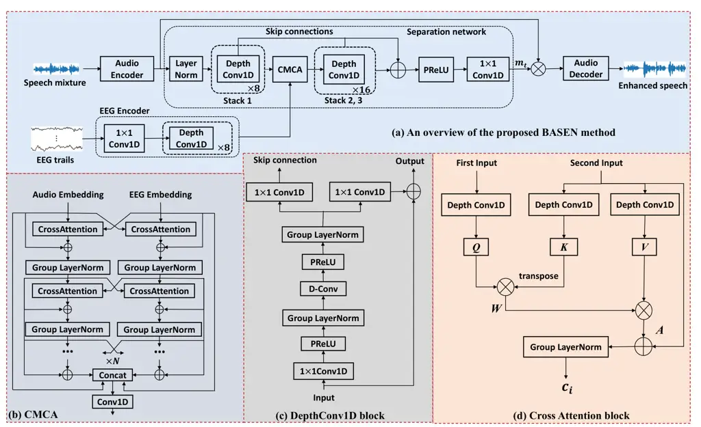

¹NERC-SLIP, University of Science and Technology of China (USTC)  
²School of Electronics and Information Engineering, Sichuan University

# BASEN: Time-Domain Brain-Assisted Speech Enhancement Network with Convolutional Cross Attention in Multi-talker Conditions

Jie Zhang¹, Qing-Tian Xu², Qiu-Shi Zhu¹, Zhen-Hua Ling¹

###### Abstract

Time-domain single-channel speech enhancement (SE) still remains
challenging to extract the target speaker without any prior information
on multi-talker conditions. It has been shown via auditory attention
decoding that the brain activity of the listener contains the auditory
information of the attended speaker. In this paper, we thus propose a
novel time-domain brain-assisted SE network (BASEN) incorporating
electroencephalography (EEG) signals recorded from the listener for
extracting the target speaker from monaural speech mixtures. The
proposed BASEN is based on the fully-convolutional time-domain audio
separation network. In order to fully leverage the complementary
information contained in the EEG signals, we further propose a
convolutional multi-layer cross attention module to fuse the dual-branch
features. Experimental results on a public dataset show that the
proposed model outperforms the state-of-the-art method in several
evaluation metrics. The reproducible code is available at
[https://github.com/jzhangU/Basen.git](https://github.com/jzhangU/Basen.git).

^(†)^(†)address: ^(†)^(†)email: {jzhang6; zhling}@ustc.edu.cn,
xuqingtian@stu.scu.edu.cn, qszhu@mail.ustc.edu.cn

Index Terms: Speech enhancement, EEG signals, Conv-TasNet, end-to-end
network, multi-talker conditions.

## 1 Introduction

It is natural for human auditory systems to extract the auditory
information of the attended speaker while attenuate competing speakers
in multi-talker conditions. This facilitates various applications in
e.g., speech recognition \[1\], hearing aids \[2\], speech
synthesis \[3\], etc. However, speech enhancement (SE) suffers from this
efficacy in such multi-talker scenarios, which is often-used to improve
the speech quality or intelligibility in speech interaction systems. The
focus of this work is on the monaural SE issue, as the single-microphone
setup is more flexible and economic than microphone arrays \[4\] in
configuration. Conventional well-established monaural SE methods mainly
depend on statistical modeling \[5\], which usually can perform well in
stationary noise conditions. But the performance drops rapidly in case
of non-stationary noises (e.g., cocktail parties), as it becomes
difficult to track the noise statistics.

Recently, deep neural networks (DNNs) have been successfully applied in
many fields including SE, which can achieve an even better listening
performance than conventional counterparts, particularly in
non-stationary cases. The DNN-based methods can be generally categorized
into time-domain and time-frequency (T-F) domain designs. The former is
mainly based on the observation that in the short-time Fourier transform
(STFT) domain the speech and noise patterns are more distinguishable,
such that the training target can be learned, which is then multiplied
with the noisy speech representation to recover the speech magnitude.
The training target can be masking-based, e.g., ideal ratio mask \[6\],
phase sensitive mask \[7\], and mapping-based, e.g., spectral magnitude
and log-power spectrum \[8\] corresponding to the spectral
representation of clean speech. However, T-F domain methods only enhance
the spectral magnitude and keep the phase unchanged. In order to
incorporate the phase process complex spectral mapping \[9\] and complex
ratio mask \[10\] were thus proposed, where the magnitude and phase can
be recovered implicitly, but the magnitude distortion might contradict
the phase prediction \[11, 12\].

The time-domain methods can avoid processing the complex spectral and
directly predict the clean speech waveform from the noisy input
mixtures \[13\]. The magnitude and phase are thus jointly optimized. For
example, the fully-convolutional time-domain audio separation network
(Conv-TasNet) was proposed in \[14\] (i.e., an extension of
TasNet \[15\]), which uses a linear encoder to generate a speech
representation optimized for separating individual speakers, applies a
set of weighting functions (masks) to the encoder output and finally
utilizes a linear decoder to recover the speech waveform. In \[16\], a
convolutional neural network (CNN) based time-domain SE framework was
built, while the loss functions are calculated in the STFT domain to
avoid the distortion of the phonetic information in the estimated
speech. It was shown that usually the time-domain methods have a smaller
model size and a much shorter latency, which would be more appropriate
for real-time applications.



Figure 1: The proposed BASEN model: (a) an overview, (b) CMCA, (c)
DepthConv1D block, and (d) cross attention block.

However, these approaches heavily depend on prior information on, e.g.,
the target speaker and/or the number of speakers \[17\]. The remaining
challenge is that how to estimate the target speech signal in
multi-talker conditions without these prior information? It was shown in
\[18, 19, 20, 21, 22, 23, 24\] that in multi-talker conditions, the
attended speaker can be decoded from the brain activity of the listener,
which is known as auditory attention decoding (AAD). This means that
speech separation has to be performed in prior to AAD. It was shown that
the AAD accuracy strongly depends on the length of the decision window,
which decreases drastically with a shorter decision window. Also, this
cascaded scheme requires a large computational cost.

As the speech of the attended speaker is the estimation goal, it is more
natural to directly use the brain activity as an extra modality
similarly to multi-model speech separation \[25, 26, 27, 28\]. Three
brain-based SE methods were thus proposed, e.g., brain-informed speech
separation (BISS) \[29\], brain-enhanced speech denoiser (BESD) and
U-shaped BESD (UBESD) \[30\]. For BISS, the estimated speech envelope is
first estimated from electroencephalography (EEG) signals and then fused
with the speech mixture in a target extraction network to recover the
attended speech signal. The BESD and UBESD methods follow a dual-branch
end-to-end scheme, which was shown to be more effective than BISS.
However, in these methods the binary modalities are mainly fused using
concatenation, and the cross-modal complementary information is
insufficiently leveraged. In this paper, we therefore propose an
end-to-end time-domain brain-assisted SE network (BASEN), which is built
based on the typical Conv-TasNet backbone \[14\]. First, we use two
encoders to extract the speech and EEG embeddings, respectively from the
speech mixture and EEG trials. In order to explore the complementary
information (e.g., the attended speaker), we design a convolutional
multi-layer cross attention (CMCA) module to deeply fuse the embeddings,
which are then fed into the decoder to recover the final speech
waveform. Experimental results on a public dataset show the superiority
of the proposed method over the current state-of-the-art UBESD model.

## 2 Methodology

Problem formulation: The proposed BASEN model is graphically shown in
Figure 1(a), which is based on the popular Conv-TasNet \[14\]. The
original Conv-TasNet basically follows the end-to-end framework,
consisting of an audio encoder, a separation network and a decoder. The
BASEN additionally incorporates an EEG branch and uses the CMCA module
for deep dual-modal feature fusion. Given the noisy speech signal $`x`$,
the audio encoder first transforms it into an embedding sequence
$`w_{x}`$. The EEG branch exploits an EEG encoder to extract the EEG
embedding from the recorded EEG trials. That is,

```math
w_{x}={\rm AudioEncoder}(x),\quad e_{x}={\rm EEGencoder}(e_{t}). \tag{1}
```

Both audio and EEG embeddings are input to the separation network to
estimate the source-specific masks, given by

```math
[m_{0},\cdots,m_{T-1}]={\rm Separator}(w_{x},e_{x}), \tag{2}
```

where $`T`$ denotes the number of existing sources. For SE, $`T`$ = 2,
i.e., the target speech and non-target additive noise, while for the
general speech separation task $`T`$ might be greater than 2. Note that
the audio and EEG features have to be fused in the separator using the
proposed CMCA module. Finally, the reconstructed speech signal is
obtained by mapping the audio embedding using the source-specific masks,
i.e.,

```math
\hat{s}_{t}={\rm Decoder}(w_{x}\odot m_{t}),\forall t\in\{1,\ldots,T\}, \tag{3}
```

where $`\odot`$ denotes the element-wise multiplication.

Audio and EEG encoders: The audio encoder consists of a couple of
1-dimensional (1D) convolutions for downsampling to extract the audio
feature. The corresponding audio decoder exhibits a mirror structure of
the audio encoder, which has the same number of 1D transposed
convolutions with a stride of 8 to perform upsampling.

The EEG encoder at the lower branch of Figure 1(a) is composed of one 1D
convolution with a stride 8 to downsample the EEG trials and a stack of
Depth-wise 1D convolutions proposed in \[14\], which has 8 layers and
each layer has residual connections to help form multi-level features.
The Depth-wise 1D convolution block is shown in Figure 1(c), which
decouples the standard convolution operation into two consecutive
operations, i.e., a Depth-wise convolution followed by a pointwise
convolution. As such, the model size can be largely reduced. Note that
the Depth Conv1D module has eight basic layers and each sets a residual
connection to obtain a multi-level feature output.

Separation network: The separation network aims to predict the target
speaker’s mask $`m_{t}`$ and perform feature fusion for the audio and
EEG embeddings. It mainly consists of three stacks of Depth-wise 1D
convolutional blocks and a CMCA-based cross attention mechanism for
dual-modal feature fusion and synchronization. In each DepthConv1D
stack, there are $`D`$ layers of DepthConv with an exponential growth of
the dilation factor $`2^{d}`$, where $`d\in\{0,...,D-1\}`$.

Letting the output of the first stack be denoted by
$`a_{x}={\rm Stack}_{1}(w_{x})`$, the fused feature output by the CMCA
can be given by $`c_{x}={\rm CMCA}(a_{x},e_{x}),`$ which is then fed
into two sequential DepthConv1D stacks, and the corresponding
transformed feature is
$`d_{x}={\rm Stack}_{3}({\rm Stack}_{2}(c_{x})).`$ Note that this
intermediate feature has to be further summed with the skip connections
from the mentioned three stacks, which will be passed through a
parametric rectified linear unit (PReLU) as well as a $`1\times 1`$
convolution to resolve the final target-specific mask $`m_{t}`$.

CMCA: The CMCA module in Figure 1(b) is designed for feature fusion,
which consists of $`N`$ layers of coupled cross attention blocks with
skip connections and group normalization being placed between two
adjacent layers. The cross attention block is depicted in Figure 1(d).
The left branch of CMCA deals with the audio stream and the right branch
copes with the EEG modality. In layer $`i`$, the inputs of two branches
are denoted by $`e_{i-1}`$ and $`a_{i-1}`$, respectively. Note that in
case $`i=0`$, $`e_{0}=e_{x}`$ and $`a_{0}=a_{x}`$. Let the right cross
attention block be denoted as $`{\rm CrossAtt}_{r}`$ and the left block
as $`{\rm CrossAtt}_{l}`$, respectively. Similarly, we define
$`{\rm GroupN}_{l}`$ and $`{\rm GroupN}_{r}`$. The outputs of layer
$`i,\forall i\geq 1`$ can be represented as

```math
\displaystyle a_{i} \displaystyle={\rm GroupN}_{l}(a_{i-1}+{\rm CrossAtt}_{l}(e_{i-1},a_{i-1},a_{i-1})), \tag{4}
```

```math
\displaystyle e_{i} \displaystyle={\rm GroupN}_{r}(e_{i-1}+{\rm CrossAtt}_{r}(a_{i-1},e_{i-1},e_{i-1})). \tag{5}
```

The audio-related and EEG-related layer-wise features of all layers are
then added together, which will be concatenated with the original
audio-EEG embeddings $`(a_{x},e_{x})`$ over the channel dimension. The
concatenated result will be sent into a 1D convolution to construct the
final fused dual-modal feature.

Similarly to the self-attention mechanism \[31\], the considered cross
attention block includes three key components: query $`Q`$, key $`K`$
and value $`V`$, where $`\{K,Q,V\}\in\mathbb{R}^{C\times L}`$ with $`C`$
and $`L`$ denoting the number of channels and the length of embeddings,
respectively. We first use 3 Depth-wise 1D convolution to transform the
input (i.e., $`a_{i-1}`$ and $`e_{i-1}`$) into $`K`$, $`Q`$ and $`V`$.
From Figure 1(d), it is clear that $`K`$ and $`V`$ come from the same
sequence, while $`Q`$ is from the other. Specifically, the correlation
between $`Q`$ and $`K`$ is first calculated as $`W=QK^{T}`$, where
$`W\in\mathbb{R}^{C\times C}`$ stands for the attention weights. Next,
the correlation scores are converted into probabilities using the
softmax function. Then the attention weight $`W`$ is multiplied with the
value $`V`$ to obtain $`A=WV`$, which is then added with the residual
connections and passed through a group normalization, leading to the
output of the $`i`$-th layer of CMCA.

Loss function: In this work, we use the scale-invariant
signal-to-distortion ratio (SI-SDR) \[32\] to measure the loss function,
which was shown to be a well-performed general-purpose loss function for
the time-domain SE \[33\], defined as

```math
{\rm SI}\text{-}{\rm SDR}=10\log_{10}{\|x_{\rm target}\|^{2}}/{\|x_{\rm res}\|^{2}}, \tag{6}
```

where $`x_{\rm target}=\frac{\hat{s}_{t}^{T}s}{\|s\|^{2}}s`$ and
$`x_{\rm res}=x_{\rm target}-\hat{s}_{t}`$ with $`s`$ and
$`\hat{s}_{t}`$ standing for the target speech and the reconstructed
speech, respectively. Scaling the target speaker ensures that the SI-SDR
is invariant to the scale of the reconstruction, which is important for
the stability of model training as the scale of the target speaker might
be changed after processing. As in general the higher the SI-SDR, the
higher the speech quality, the negative SI-SDR is thus taken as the loss
function for training. In addition, we use the Adam optimizer for model
training.

(a) UBESD \[30\]

(b) Proposed BASEN

Figure 2: The comparison with the state-of-the-art UBESD method, where
the median values are shown at the top of each sub-figure. The white dot
in each plot shows the median. The black bar in the center of the
violins shows the interquartile range (IQR). The thin black lines
stretched from the bar show first quartile $`-1.5\times IQR`$ and third
quartile $`+1.5\times IQR`$, respectively.

## 3 Experimental setup

Dataset: The dataset used in this work was obtained from \[34\]. For
this dataset, all procedures were performed in accordance with the
Declaration of Helsinki and were approved by the Ethics Committees of
Trinity College Dublin. All subjects were native English normal-hearing
speakers without any history of neurological diseases. A total of 33
subjects (28 males and 5 females) with a mean age of 27.3$`\pm`$3.2
years participated in the experiments, but the data from subject \#6 was
not included in the analysis due to the poor quality.

The subjects undertook 30 trials and each contains 60 seconds. During
each trial, they were presented with two stories, one to the left ear
and the other to the right ear. Each story was read by a different male
speaker. Subjects were divided into two groups, and each group was
instructed to pay attention to either the left (17) or the right ear
(16 + 1 excluded subject) with each group instructed to attend to the
story in either the left or right ear throughout the entire 30 trials.
After each trial, subjects were required to answer multiple choice
questions on both stories to test their attention. The storyline was
continuous, that is, for each trial the story began where the last trial
ended.

The stimuli amplitudes were normalized to have the same root mean square
(RMS) level and silent gaps were cut short to a maximum of 0.5 seconds.
Stimuli were presented using Sennheiser HD650 headphones and a
presentation software from Neurobehavioral Systems with a sampling
frequency of 44.1 kHz. Subjects were required to maintain a visual
fixation on a cross hair centered on the screen and to minimize eye
blinking and other motor activities. EEG data were recorded using a
128-channel (plus two mastoids) EEG cap at a rate of 512 Hz using a
BioSemi ActiveTwo system. The EEG recordings were further downsampled to
128 Hz. More details about the experimental setting can be found in
\[34\].

Pre-processing: Our experimental setup is kept the same as that
in \[30\]. In order to reduce the computational complexity, we
downsampled the sound data to a sampling rate of 14.7 kHz. The two
stimuli were normalized to have the same RMS level and then equally
added to synthesize the noisy mixture at a fixed SNR of 0 dB. That is,
the target speaker and the interfering source have the same power, and
the presence of additional background noise or reverberation was not
taken into account. We divided the data into the following three groups:
randomly choosing 5 trials from all subjects as the test data and 2
trials as the validation data, and all the remaining trials were used as
the training data. For the training and validation sets, each trial was
cut into 2-second segments. For the testing set, each 60-second trial
was cut into 20-second segments.

The EEG data were first pre-processed using a bandpass filter with the
pass frequency ranging from 0.1 Hz to 45 Hz, such that only related
frequency bands are preserved and the electrical noise (50 or 60 Hz) and
very low-frequency noise originating from the drift in the recording
environment can be removed. To identify channels with excessive noise,
the standard deviation (SD) of each channel was compared to the SD of
the surrounding channels and each channel was visually inspected.
Channels with excessive noise were recalculated by spline interpolation
of the surrounding channels. The EEGs were re-referenced to the average
of the mastoid channels to avoid introducing noise from the reference
site. To remove artifacts caused by eye blinking and other muscle
movements, we performed independent component analysis (ICA), which was
done in EEGLAB \[35\]. For each subject, the trial that contains too
much noise was excluded from the experiments.

In principle, EEG signals are noisy mixtures of potential existing
sources that are not necessarily related to the target stimuli. It was
shown in \[30\] that using the underlying neural activity more related
to the speech stimuli for the separation network is more beneficial for
the performance than directly using the EEG signals. We therefore
further processed the EEG data using a frequency-band coupling model to
extract the audio related information in the EEG data, which can be
represented by the cortical multiunit neural activity (MUA) from EEG
signals. In \[36, 37\], MUA was shown to be effective for estimating the
neural activity in the visual and auditory systems, given by

```math
N(t)=a_{\gamma}\times P_{\gamma}(t)+a_{\delta}\times\angle\delta(t) \tag{7}
```

where $`P_{\gamma}(t)`$ and $`\angle\delta(t)`$ are the amplitude of the
gamma band and the phase of the delta band, respectively, and in
experiments both $`a_{\gamma}`$ and $`a_{\delta}`$ are set to be 0.5
accordingly.

In addition, we use three objective metrics to evaluate the SE
performance, including SI-SDR \[32\] in dB, perceptual evaluation of
speech quality (PESQ) \[38\] and short-time objective intelligibility
(STOI) \[39\]. For training, the Adam optimizer is set with a momentum
of $`\beta_{1}`$ = 0.9 and a denominator momentum of $`\beta_{2}`$ =
0.999. We use the linear warmup following the cosine annealing learning
rate schedule with a maximum learning rate of $`2\times 10^{-4}`$ and a
warmup ratio of $`5\%`$. The model is trained with around 60 epochs and
a batch size of 8.

(a) Ablation study

(b) Impact of CMCA layers

Figure 3: The SE performance for unknown attended speaker denoising in
terms of SI-SDR , PESQ and STOI.

## 4 Experimental results

In this section, we first conduct several experiments to show the
effectiveness of the designed modules within the proposed BASEN model.
In Figure 3(a), we show the performance of BASEN using the audio-only
signal, simple concatenation and CMCA, respectively. It is clear that
without prior information on the attended speaker, the typical
Conv-TasNet (i.e., BASEN-EEG-prior) cannot improve the speech quality,
since both speakers produce speech signals and no ambient noises are
present in the considered setting. Given the attended speaker,
Conv-TasNet becomes equivalent to the proposed BASEN without EEG trials
but with prior information, which can largely improve the performance.
This shows that the efficacy of Conv-TasNet \[14\] on SE is heavily
dependent on the prior attended speaker information. Including the EEG
branch and simply concatenating the audio and EEG embeddings can achieve
a comparable performance as the ideal Conv-TasNet. Applying the proposed
CMCA module for feature fusion further improves the performance,
particularly the PESQ score.

In order to find out the most appropriate number of cross-attention
layers in the CMCA module, we evaluate the impact of the layer number on
the performance in Figure 3(b), where $`N`$ changes from 1 to 5. It is
clear the choice of $`N`$ = 3 returns the best SE performance in all
metrics, which will be used in the sequel. Note that including more
layers will also increase the parameter amount of the overall BASEN
model, which increases from 0.57M for $`N`$ = 1 to 0.64M for $`N`$ = 3
for example.

Then, we conduct a comparison of the proposed BASEN with the best
published method on the same dataset, i.e., UBESD in \[30\]. The
obtained SI-SDR, PESQ and STOI in terms of the testing subjects are
summarized in Figure 2. We can clearly see that the proposed BASEN
outperforms the state-of-the-art UBESD in all metrics and over all
subjects. More importantly, the performance of BASEN is more subject
invariant, as that of UBESD varies more across subjects, meaning that
BASEN is more robust against listening dynamics. This also shows that
the proposed CMCA module is more effective for feature fusion than the
FiLM strategy in \[30\]. Note that UBESD also has a larger parameter
amount, which is around 1.84M, due to the fact that the adopted FiLM has
four convolutions and each has more channels.

## 5 Conclusion

In this paper, we proposed the BASEN approach for time-domain SE using
the EEG signal of the listener as an additional modality, where the CMCA
module was designed to deeply fuse the audio and EEG embeddings. It was
shown that the EEG trials are helpful for extracting the attended
speaker, and the proposed BASEN method can improve the speech quality
without any prior information on the target speaker. This would be a
useful candidate for realistic applications where no prior information
on the attended speaker is given. Due to the page limitation, more
results will be presented in a future journal version.

## References

- \[1\] J. Li, L. Deng, R. Haeb-Umbach, and Y. Gong, _Robust automatic
  speech recognition: a bridge to practical applications_. Oxford:
  Academic Press, 2016.
- \[2\] Y. Zhao, D. Wang, E. M. Johnson, and E. W. Healy, “A deep
  learning based segregation algorithm to increase speech
  intelligibility for hearing-impaired listeners in reverberant-noisy
  conditions,” _J. of the Acoust. Soc. Am._, vol. 144, no. 3, pp.
  1627–1637, 2018.
- \[3\] G. Krishna, C. Tran, Y. Han, M. Carnahan, and A. H. Tewfik,
  “Speech synthesis using EEG,” in _ICASSP_, 2020, pp. 1235–1238.
- \[4\] J. Benesty, J. Chen, and Y. Huang, _Microphone array signal
  processing_. Springer Science & Business Media, 2008, vol. 1.
- \[5\] P. C. Loizou, _Speech enhancement: theory and practice_, 2007.
- \[6\] Y. Wang, A. Narayanan, and D. Wang, “On training targets for
  supervised speech separation,” _IEEE/ACM Trans. Audio, Speech, Lang.
  Process._, vol. 22, no. 12, pp. 1849–1858, 2014.
- \[7\] H. Erdogan, J. R. Hershey, S. Watanabe, and J. Le Roux,
  “Phase-sensitive and recognition-boosted speech separation using deep
  recurrent neural networks,” in _ICASSP_, 2015, pp. 708–712.
- \[8\] Y. Xu, J. Du, L.-R. Dai, and C.-H. Lee, “A regression approach
  to speech enhancement based on deep neural networks,” _IEEE/ACM Trans.
  Audio, Speech, Lang. Proce._, vol. 23, no. 1, pp. 7–19, 2014.
- \[9\] K. Tan and D. Wang, “Learning complex spectral mapping with
  gated convolutional recurrent networks for monaural speech
  enhancement,” _IEEE/ACM Trans. Audio, Speech, Lang. Process._,
  vol. 28, pp. 380–390, 2019.
- \[10\] D. S. Williamson and D. Wang, “Time-frequency masking in the
  complex domain for speech dereverberation and denoising,” _IEEE/ACM
  Trans. Audio, Speech, Lang. Process._, vol. 25, no. 7, pp.
  1492–1501, 2017.
- \[11\] Z.-Q. Wang, G. Wichern, and J. Le Roux, “On the compensation
  between magnitude and phase in speech separation,” _IEEE Signal
  Process. Letters_, vol. 28, pp. 2018–2022, 2021.
- \[12\] A. Li, S. You, G. Yu, C. Zheng, and X. Li, “Taylor, can you
  hear me now? a taylor-unfolding framework for monaural speech
  enhancement,” in _Proc. IJCAI_, 2022, pp. 4193–4200.
- \[13\] A. Pandey and D. Wang, “Dense cnn with self-attention for
  time-domain speech enhancement,” _IEEE/ACM Trans. Audio, Speech, Lang.
  Process._, vol. 29, pp. 1270–1279, 2021.
- \[14\] Y. Luo and N. Mesgarani, “Conv-TasNet: Surpassing Ideal
  Time-Frequency Magnitude Masking for Speech Separation,” _IEEE/ACM
  Trans. Audio, Speech, Lang. Process._, vol. 27, no. 8, pp.
  1256–1266, 2019.
- \[15\] ——, “Tasnet: time-domain audio separation network for
  real-time, single-channel speech separation,” in _ICASSP_, 2018, pp.
  696–700.
- \[16\] A. Pandey and D. Wang, “A new framework for CNN-based speech
  enhancement in the time domain,” _IEEE/ACM Trans. Audio, Speech, Lang.
  Process._, vol. 27, no. 7, pp. 1179–1188, 2019.
- \[17\] X. Hu, K. Li, W. Zhang, Y. Luo, J. Lemercier, and T. Gerkmann,
  “Speech separation using an asynchronous fully recurrent convolutional
  neural network,” _NIPS_, vol. 34, pp. 22 509–22 522, 2021.
- \[18\] N. Mesgarani and E. F. Chang, “Selective cortical
  representation of attended speaker in multi-talker speech perception,”
  _Nature_, vol. 485, no. 7397, p. 10.1038/nature11020, 2012.
- \[19\] J. A. O’Sullivan, A. J. Power, N. Mesgarani, and et al.,
  “Attentional selection in a cocktail party environment can be decoded
  from single-trial EEG,” _Cerebral Cortex_, vol. 25, no. 7, pp.
  1697–1706, 2015.
- \[20\] A. Aroudi, B. Mirkovic, M. De Vos, and S. Doclo, “Auditory
  attention decoding with EEG recordings using noisy acoustic reference
  signals,” in _ICASSP_, 2016, pp. 694–698.
- \[21\] J. O’Sullivan, Z. Chen, J. Herrero, G. M. McKhann, S. A. Sheth,
  A. D. Mehta, and N. Mesgarani, “Neural decoding of attentional
  selection in multi-speaker environments without access to clean
  sources,” _J. Neural Engineering_, vol. 14, no. 5, p. 056001, 2017.
- \[22\] A. Aroudi, E. Fischer, M. Serman, H. Puder, and S. Doclo,
  “Closed-loop cognitive-driven gain control of competing sounds using
  auditory attention decoding,” _Algorithms_, vol. 14, no. 10, p.
  287, 2021.
- \[23\] S. Geirnaert, S. Vandecappelle, E. Alickovic, and et al.,
  “Electroencephalography-based auditory attention decoding: Toward
  neurosteered hearing devices,” _IEEE Signal Process. Mag._, vol. 38,
  no. 4, pp. 89–102, 2021.
- \[24\] C. Han, J. O’™Sullivan, Y. Luo, J. Herrero, A. D. Mehta, and
  N. Mesgarani, “Speaker-independent auditory attention decoding without
  access to clean speech sources,” _Science advances_, vol. 5, no. 5, p.
  eaav6134, 2019.
- \[25\] Q. Wang, H. Muckenhirn, K. Wilson, Z. Sridhar, P.and Wu,
  J. Hershey, R. A. Saurous, R. J. Weiss, Y. Jia, and I. L. Moreno,
  “Voicefilter: Targeted voice separation by speaker-conditioned
  spectrogram masking,” _arXiv preprint arXiv:1810.04826_, 2018.
- \[26\] T. Ochiai, M. Delcroix, K. Kinoshita, A. Ogawa, and
  T. Nakatani, “Multimodal speakerbeam: Single channel target speech
  extraction with audio-visual speaker clues.” in _ISCA Interspeech_,
  2019, pp. 2718–2722.
- \[27\] C. Li and Y. Qian, “Listen, watch and understand at the
  cocktail party: Audio-visual-contextual speech separation.” in _ISCA
  Interspeech_, 2020, pp. 1426–1430.
- \[28\] D. Michelsanti, Z.-H. Tan, S.-X. Zhang, Y. Xu, M. Yu, D. Yu,
  and J. Jensen, “An overview of deep-learning-based audio-visual speech
  enhancement and separation,” _IEEE/ACM Trans. Audio, Speech, Lang.
  Process._, vol. 29, pp. 1368–1396, 2021.
- \[29\] E. Ceolini, J. Hjortkjær, D. D. Wong, J. O’Sullivan, V. S.
  Raghavan, J. Herrero, A. D. Mehta, S.-C. Liu, and N. Mesgarani,
  “Brain-informed speech separation (BISS) for enhancement of target
  speaker in multitalker speech perception,” _NeuroImage_, vol. 223, p.
  117282, 2020.
- \[30\] M. Hosseini, L. Celotti, and E. Plourde, “End-to-End
  Brain-Driven Speech Enhancement in Multi-Talker Conditions,” _IEEE/ACM
  Trans. Audio, Speech, and Lang. Process._, vol. 30, pp.
  1718–1733, 2022.
- \[31\] A. Vaswani, N. Shazeer, N. Parmar, J. Uszkoreit, L. Jones,
  A. N. Gomez, Ł. Kaiser, and I. Polosukhin, “Attention is all you
  need,” _NIPS_, vol. 30, 2017.
- \[32\] J. Le Roux, S. Wisdom, H. Erdogan, and J. R. Hershey,
  “Sdr–half-baked or well done?” in _ICASSP_, 2019, pp. 626–630.
- \[33\] M. Kolbæk, Z.-H. Tan, S. H. Jensen, and J. Jensen, “On loss
  functions for supervised monaural time-domain speech enhancement,”
  _IEEE/ACM Trans. Audio, Speech, Lang. Process._, vol. 28, pp.
  825–838, 2020.
- \[34\] M. P. Broderick, A. J. Anderson, G. M. Di Liberto, M. J.
  Crosse, and E. C. Lalor, “Electrophysiological correlates of semantic
  dissimilarity reflect the comprehension of natural, narrative speech,”
  _Current Biology_, vol. 28, no. 5, pp. 803–809, 2018.
- \[35\] A. Delorme and S. Makeig, “EEGLAB: an open source toolbox for
  analysis of single-trial EEG dynamics including independent component
  analysis,” _J. Neuroscience Methods_, vol. 134, no. 1, pp. 9–21, 2004.
- \[36\] M. Moinnereau, J. Rouat, K. Whittingstall, and E. Plourde, “A
  frequency-band coupling model of EEG signals can capture features from
  an input audio stimulus,” _Hearing Research_, vol. 393, p.
  107994, 2020.
- \[37\] K. Whittingstall and N. K. Logothetis, “Frequency-band coupling
  in surface EEG reflects spiking activity in monkey visual cortex,”
  _Neuron_, vol. 64, no. 2, pp. 281–289, 2009.
- \[38\] A. W. Rix, J. G. Beerends, M. P. Hollier, and A. P. Hekstra,
  “Perceptual evaluation of speech quality (PESQ)-a new method for
  speech quality assessment of telephone networks and codecs,” in
  _ICASSP_, vol. 2, 2001, pp. 749–752.
- \[39\] C. H. Taal, R. C. Hendriks, R. Heusdens, and J. Jensen, “A
  short-time objective intelligibility measure for time-frequency
  weighted noisy speech,” in _ICASSP_, 2010, pp. 4214–4217.
