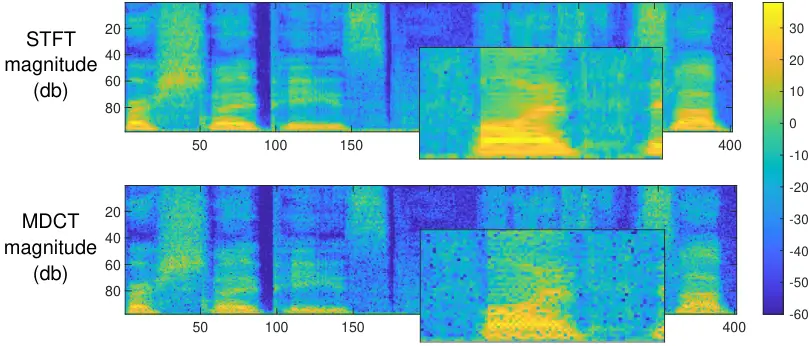
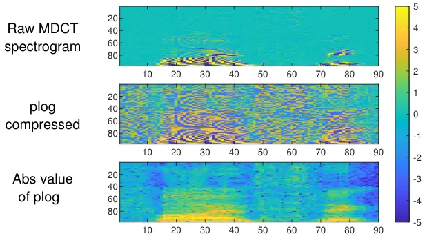
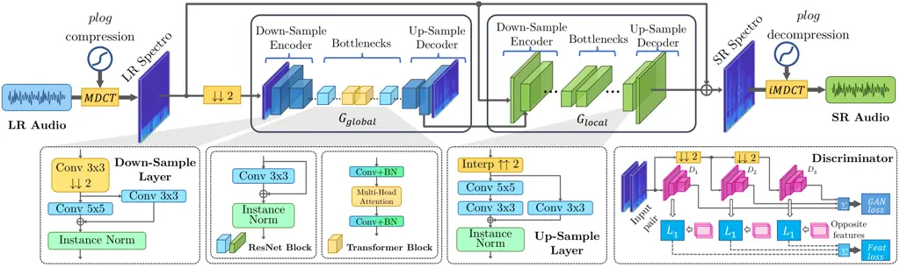

¹Nanyang Technological University, Singapore  ²Xidian University,
China  
³Brunel University London, UK  ⁴Chongqing University of Posts and
Telecommunications, China

# mdctGAN: Taming transformer-based GAN for speech super-resolution with Modified DCT spectra

Chenhao Shuai^(1,3,4)\sthanks Major work done during undergraduate at
CQUPT & Brunel , Chaohua Shi^(2,3,4∗), Lu Gan³, Hongqing
Liu⁴\sthanks Intelligent Speech and Audio Lab, CQUPT

###### Abstract

Speech super-resolution (SSR) aims to recover a high resolution (HR)
speech from its corresponding low resolution (LR) counterpart. Recent
SSR methods focus more on the reconstruction of the magnitude
spectrogram, ignoring the importance of phase reconstruction, thereby
limiting the recovery quality. To address this issue, we propose
mdctGAN, a novel SSR framework based on modified discrete cosine
transform (MDCT). By adversarial learning in the MDCT domain, our method
reconstructs HR speeches in a phase-aware manner without vocoders or
additional post-processing. Furthermore, by learning frequency
consistent features with self-attentive mechanism, mdctGAN guarantees a
high quality speech reconstruction. For VCTK corpus dataset, the
experiment results show that our model produces natural auditory quality
with high MOS and PESQ scores. It also achieves the state-of-the-art
log-spectral-distance (LSD) performance on 48 kHz target resolution from
various input rates. Code is available from
[https://github.com/neoncloud/mdctGAN](https://github.com/neoncloud/mdctGAN)

^(†)^(†)address: ^(†)^(†)email: shua0003@e.ntu.edu.sg,
chshi2004@gmail.com, lu.gan@brunel.ac.uk, hongqingliu@cqupt.edu.cn

Index Terms: speech super-resolution, phase information, GAN

## 1 Introduction

Speech super-resolution (SSR) is the task of recovering high-resolution
(HR) speech from low-resolution (LR) speech. SSR presents many practical
applications in fields such as teleconferencing and speech recognition.
It is crucial to correctly reconstruct the phase information when
recovering the high frequency components. Recent frequency domain-based
SSR research \[1, 2, 3, 4, 5, 6, 7, 8\] has primarily focused on
recovering amplitude information, and it often requires additional steps
to reconstruct the missing phase.

Vocoders \[1, 2, 3\], which recover the phase by discriminating in the
time domain, are frequently used to reconstruct the raw waveform.
Utilizing vocoders, a two-stage speech super-resolution method \[4\] was
proposed to predict high-resolution speech mel-spectrograms at first,
then applying a vocoder for raw waveform reconstruction. Though
inspiring, such a two-stage generation process can lead to instability
during training. Alternatively, recent approaches attempt to model phase
and magnitude (or real and imaginary part of complex-valued
spectrograms) by complex-valued neural networks or fusion modules \[5,
6, 7\]. The waveform can then be reconstructed by simply applying an
inversion. However, the convergence of complex neural networks is not
guaranteed. Separating the treatment of the complex-valued features
leads to implicit modeling of phase and magnitude.

To address these issues, we propose to perform SSR in the modified
discrete cosine transform (MDCT) domain, a real-valued, lossless
transform, which enables a joint magnitude and phase estimation. To that
aim, we propose mdctGAN, a frequency-attentive, phase-aware SSR network
with a transformer-based \[9\] conditional Generative Adversarial
Networks (cGAN) \[10, 11\] architecture. In the network design, we
introduce a transformer bottleneck stack in the generator network for
global attention on frequency-consistent features. Transformer-based
models are inherently data-hungry. However, the current VCTK
dataset \[2\] used for the SSR task is not sufficient to fully exploit
the potential of our model. Hence, we added the HiFi-TTS dataset \[12\],
a large-scale, high-quality speech synthesis corpus, for pre-training.
And we fine-tuned our model on the VCTK corpus \[2\] to achieve an
output sampling rate up to 48 kHz. Specifically, the contributions of
this work are as follows.

- •
  We propose a vocoder-free method that performs speech super-resolution
  with transformer-based cGAN. It outperforms previous works in LSD
  scores. Meanwhile, it also achieves a high score in subjective tests.
- •
  We develop the pseudo-log operation for dynamic compression of MDCT
  coefficients, which is essential to the production of phase-aware,
  high-quality speech.
- •
  We show by experiments that our models can learn and thereby generate
  the phase information encoded in the MDCT coefficients well,
  demonstrating the great potential in producing high-quality speech
  audio.

## 2 Proposed Method

### 2.1 The MDCT-based processing

#### 2.1.1 Basics of the MDCT

The reconstruction of the speech phase is crucial to the quality of the
generated speech. The commonly used mel-spectrograms do not contain the
phase information of the audio signal and therefore require additional
algorithms for phase recovery. For this reason, we propose SSR in the
MDCT domain, which guarantees the phase-aware speech reconstruction with
a real-valued spectrogram. MDCT is widely used in audio compression,
e.g. mp3, ac3 \[13\]. Just as the short-time Fourier transform (STFT),
the audio is first split into blocks, with a 50% overlap between each
block. Then, a forward MDCT is applied to each block, given below:

```math
\displaystyle X_{i}[k]=\sum_{n=0}^{N-1}w[n]x_{i}[n]\cos\left(\frac{2\pi}{N}(n+n_{0})(k+\frac{1}{2})\right) \tag{1}
```

```math
\displaystyle k=0,...,N/2-1,
```

where $`n_{0}=N/4+1/2`$, $`x_{i}[n]`$ is the $`n`$-th sample in the
$`i`$-th block of the audio, and $`w[n]`$ is the window function applied
to each block to reduce spectrum leakage. The corresponding inverse MDCT
(iMDCT) of the $`i`$-th block is:

```math
\displaystyle x^{\prime}_{i}[n]=\frac{4}{N}w[n]\sum_{k=0}^{N/2-1}X_{i}[k]\cos\left(\frac{2\pi}{N}(n+n_{0})(k+\frac{1}{2})\right) \tag{2}
```

```math
\displaystyle n=0,...,N-1.
```

To produce the full audio, each recovered block should be overlap-added
together to eliminate the aliasing. In this paper, $`w[n]`$ was chosen
as the Kaiser-Bessel-derived window \[13\]. And we implemented fast
MDCT/iMDCT modules using FFT.

This time-frequency domain representation is similar to that of the
STFT, as shown in Figure 1, where the resonant peaks of the speech
signal can be observed, indicating that it is also an effective
representation of the frequency component distribution of the signal.
The MDCT has the following advantages:

- •
  It is a real-valued, invertible linear transform so that the output is
  well compatible with existing deep learning neural networks.
- •
  The phase information of raw waveform is encoded into the sign of MDCT
  coefficient, allowing the neural networks to model and reconstruct
  phase and amplitude of signal components with MDCT spectra only.



Figure 1: STFT magnitude vs MDCT magnitude in decibel scale, sampled
from VCTK corpus s225-003. Just as the STFT spectrogram, the MDCT
spectrogram also reveal rich acoustic features, such as resonant peaks
in speech.

#### 2.1.2 Pseudo-log dynamic range compression



Figure 2: Dynamic range compression with pseudo-log. Note that the MDCT
coefficients after pseudo-log compression exhibits similar patterns to
decibel-scaled STFT magnitude.

In a typical speech processing pipeline, small frequency components are
revealed using decibel-scaled STFT magnitudes rather than the raw
spectrogram. However, MDCT encodes the phase information into the sign
of the coefficients, and unfortunately, we cannot perform logarithmic on
negative values. In order to maintain the sign of the coefficients while
compressing the dynamic range of the signal, we introduce a
pseudo-logarithmic operation based on $`\arcsinh(x)`$:

```math
\plog(x)=\frac{\arcsinh(x)}{\ln(10)}=\log_{10}(x+\sqrt{x^{2}+1}). \tag{3}
```

We illustrate the impact of dynamic compression in Figure 2. The
ablation experiments demonstrated that without the $`\plog`$ operation,
the model cannot be trained. The $`\plog`$ function in (3) has the
following desirable properties.

- •
  It is differentiable with respect to $`\mathbb{R}`$ and is oddly
  symmetric. Hence, it preserves the polarity of both positive and
  negative MDCT coefficients.
- •
  By using the asymptotic expansion of $`\arcsinh(x)`$, it can be shown
  that as $`x\rightarrow+\infty`$, $`\plog(x)\rightarrow\log_{10}(2x)`$.
  It compresses the dynamic range similar to decibel-scale of MDCT (or
  STFT) magnitude, as shown in Figure 2.

To make better use of the non-linear interval of the $`\plog`$ function,
we multiply the raw MDCT coefficients with a gain of $`\alpha=10^{3}`$.
We have found that the histogram distributions of the transformed
spectra mostly lie in the interval of $`[-5,5]`$, so we scale them to
$`[-1,1]`$ by dividing 5. Alternating positive and negative patterns are
frequently observed in an MDCT spectrogram, shown in Figure 2. To prompt
the model with magnitude information, we also appended the corresponding
absolute values to the input, which also normalised to the $`[-1,1]`$
interval, guiding the network to produce clearer high-frequency details.

### 2.2 Network architecture



Figure 3: Architecture of the proposed network. Spectrogram generation
is from coarse to fine, $`G_{global}`$ is responsible for modelling
global, large scale features. reduce the computational burden,
$`G_{global}`$ runs on 2x downsampled inputs. To enrich the detail of
the generated spectrogram, $`G_{local}`$ will fuse the features from
$`G_{global}`$ and the original input to reconstruct the detailed high
frequency components. The architecture of the proposed multi-scale
spectrogram discriminator is shown at the bottom right corner.

In this work, we mainly focus on training a network $`G`$ to map the
$`LR`$ spectrogram to $`\hat{\bm{SR}}^{\prime}=G(\bm{LR})`$ by
minimizing the error between $`\hat{\bm{SR}}^{\prime}`$ and
$`\bm{HR-LR}`$. The final output is defined as
$`\hat{\bm{SR}}=\hat{\bm{SR}}^{\prime}+\bm{LR}`$. Figure 3 shows the
overview of the proposed mdctGAN architecture. We want our model to
generate the fine structure of the spectrogram (e.g. the resonant peaks
of speech) while remaining globally consistent with the base frequency
component. Inspired by work on image translation \[11\], we have
designed a transformer-based generator architecture that works from
coarse to fine, as well as a discriminator that judges the spectrogram
from multiple scales.

#### 2.2.1 Generator

As shown in Figure 3, our generator consists of two sub-networks:
$`G_{global}`$ (the global generator network, working on the
$`\downarrow\downarrow 2`$ input) and $`G_{local}`$ (the local enhancer
network, working on the full size spectrogram) achieving coarse-to-fine
spectrogram generation \[11\]. Both sub-networks use Unet-like
architectures, yet differ in size and depth, consisting of three
sub-modules: a spectrogram encoder that extracts features at multiple
scales through cascaded convolution layers, a bottleneck block stack and
a decoder that progressively up-samples features with bilinear
interpolation (denoted by Interp $`\uparrow\uparrow 2`$ in the Up-Sample
Layer). The bottleneck of $`G_{global}`$ also contains Transformer
blocks (yellow boxes in the middle of $`G_{local}`$) for learning
frequency consistent features. Compared with the original $`stride=2`$
transpose-convolution used in \[11\], this upsampling operator can
reduce the checkerboard artefacts more effectively, as demonstrated in
the ablation study of Section 3.5. Finally, the model produces a
full-band SR spectrogram by summing the residual path of the input LR
spectrogram.

#### 2.2.2 Discriminator

To achieve our vocoder-free SSR goal, we only use a multi-scale
discriminator supervised in the MDCT domain. It contains a total of 3
discriminators, and all have the same network structure but operating at
3 different scales by downsampling the input. All discriminators follow
the Patch-GAN’s architecture, with basic blocks of cascaded
Convolution-InstanceNorm-LeakyReLU ($`slope=0.2`$) layers. This design
allows the generator to efficiently produce both globally consistent
spectrograms (coarse-level supervision) and finer detail information
(fine-level supervision).

### 2.3 Loss function

In this work, the total loss function $`L_{t}`$ consists of an
adversarial loss and a feature matching loss, which is similar to that
in \[11\].

```math
\begin{split}L_{t}=\min_{G}&\left[\left(\max_{D_{1},D_{2},D_{3}}\sum_{i=1}^{3}V_{GAN}(G,D_{i}))\right)\right.\\
&+\left.\lambda_{feat}\sum_{i=1}^{3}V_{Feat}(G,D_{i})\right],\end{split}
```

where $`\lambda_{feat}`$ is the gain of feature matching loss. Here,
$`V_{GAN}(G,D_{i})`$ represents the adversarial loss of each $`D_{i}`$

```math
\begin{split}V_{GAN}(G,D_{i})=&\mathbb{E}_{(\bm{LR},\bm{HR})\sim p_{\text{data}}(\bm{LR},\bm{HR})}[\log(D_{i}(\bm{LR},\bm{HR}))]\\
+&\mathbb{E}_{\bm{LR}\sim p_{\text{data}}(\bm{LR})}[\log(1-D_{i}(G(\bm{LR})))].\end{split}
```

As shown in the bottom right corner of Figure 3, $`\{D_{i}\}_{i=1}^{3}`$
process the original signal, down-sampled versions with decimation
factors of 2 and 4, respectively. In this way, the discriminator network
processes inputs from coarse to fine. Each feature loss function
$`V_{Feat}(G,D_{i})`$ takes the following form

```math
\begin{split}&V_{Feat}(G,D_{i})\\
=&\mathbb{E}_{(\bm{LR},\bm{HR})\sim p_{\text{data}}(\bm{LR},\bm{HR})}\frac{1}{N_{k}}\sum_{i=1}^{3}\sum_{k}\left\lVert\bm{F}^{ik}_{pos}-\bm{F}^{ik}_{neg}\right\rVert_{1},\end{split}
```

where $`\bm{F}_{pos}^{ik}=D_{i}^{k}(\bm{LR},\bm{HR})`$ corresponds to
intermediate feature maps at the $`k`$-th layer of the $`i`$-th
discriminator $`D_{i}`$ for the pair $`(\bm{LR},\bm{HR})`$. Likewise,
$`\bm{F}^{ik}_{neg}=D_{i}^{k}(\bm{LR};G(\bm{LR}))`$ represents that of
$`(\bm{LR},G(\bm{LR}))`$, denoted as “Opposite Features” in Figure 3. As
MDCT encodes the phase information, we do not need to design an
additional time domain penalty term.

## 3 Experiments

[TABLE]

Table 1: A comparison of SNR and LSD scores with 48 kHz target.

![[Uncaptioned
image]](arxiv-2305-11104v2--80b79e384c08.figures/figure-4.webp)

Figure 4: Visualised comparison of $`4\times`$ SR. Note that our model
produces richer harmonics (better zoom in).

| Target | Input  | LR      | HR      | SR      |
| ------ | ------ | ------- | ------- | ------- |
| 48 kHz | 8 kHz  | $`2.5`$ | $`4.5`$ | $`3.8`$ |
|        | 12 kHz | $`2.8`$ | $`4.8`$ | $`4.2`$ |
|        | 16 kHz | $`3.0`$ | $`4.8`$ | $`4.5`$ |
|        | 24 kHz | $`4.0`$ | $`4.8`$ | $`4.7`$ |

Table 2: MOS ($`\uparrow`$)

| Target                  | Models    | PESQ-wb |
| ----------------------- | --------- | ------- |
| 16 kHz ($`2\times`$ SR) | UDM+      | 2.93    |
|                         | NU-Wave 2 | 3.38    |
|                         | NVSR      | 3.47    |
|                         | Proposed  | 3.50    |

Table 3: PESQ-wb ($`\uparrow`$)

| Model                  | \# Parameters | $`SNR\uparrow`$ | $`LSD\downarrow`$ |
| ---------------------- | ------------- | --------------- | ----------------- |
| Proposed               | 103M          | 18.92           | 0.81              |
| w/o $`\plog`$          | 103M          | Failed to train |                   |
| w/o pre-train          | 103M          | 11.25 (-7.67)   | 0.84 (+0.03)      |
| w/o Transf blocks      | 143M          | 11.47 (-7.45)   | 1.60 (+0.79)      |
| w/o Interp up-sampling | 72.3M         | 17.55 (-1.37)   | 0.88 (+0.07)      |

Table 4: Ablation studies for 8 kHz to 48 kHz SR.

### 3.1 Dataset & Pre-processing

In this study, we train our model on a dataset composed of the CSTR’s
VCTK speech dataset \[2\] and the Hi-Fi TTS dataset \[12\]. The sampling
rate of this joint dataset is at least 44.1 kHz, and the total duration
is up to 292 hours, ensuring a high-resolution and high-quality speech
corpus.

We randomly select a 32512-point clip from each input $`HR`$ audio. We
construct the $`(\bm{LR},\bm{HR})`$ training pair by filtering out
signal components above the Nyquist frequency of $`\bm{LR}`$ to simulate
the loss of high-frequency components during down-sampling. All
filtering configurations use the default values of
torchaudio.functional.resample(). For the MDCT layer, we set the frame
length $`N=512`$, which yields 256 points per frame after the FFT; the
hop length $`H=256`$, which produces 128 frames for a 32512-point
segment. Thus, a single spectrogram has a size of $`128\times 256`$.

### 3.2 Evaluation metrics

Following previous works \[14, 15, 16, 4\], we use the signal-to-noise
ratio (SNR) and Log-spectral distance (LSD) as evaluation metrics to
assess the proposed model. Specifically, given a reference signal
$`\mathbf{x}`$ and a corresponding approximation $`\mathbf{\hat{x}}`$,
SNR is given by

```math
SNR(\mathbf{\hat{x}},\mathbf{x})=10\log_{10}\frac{||\mathbf{x}||_{2}^{2}}{||\mathbf{x}-\mathbf{\hat{x}}||_{2}^{2}} \tag{4}
```

The LSD is defined as

```math
LSD(\mathbf{x},\mathbf{\hat{x}})=\frac{1}{T}\sum_{t=1}^{T}\sqrt{\frac{1}{F}\sum_{f=1}^{F}\left(\log_{10}\frac{\mathbf{X}^{2}[t,f]}{\hat{\mathbf{X}}^{2}[t,f]}\right)^{2}} \tag{5}
```

where $`T`$ represents the period, $`\mathbf{X}`$ and
$`\hat{\mathbf{X}}`$ represent the magnitude spectra of $`\mathbf{x}`$
and $`\hat{\mathbf{x}}`$, respectively, $`t`$ and $`f`$ are the index of
frame and frequency, respectively. A lower LSD score and higher SNR
value indicate a better SR performance. We use the averaged LSD and SNR
scores of the VCTK-test as the final result of our model.

In addition to objective evaluation metrics, we also used subjective
Mean Opinion Score (MOS) and Wide-band (8k$`\rightarrow`$16k) Perceptual
Evaluation of Speech Quality (PESQ-wb) to assess the quality of
generated SR audio and compared it to that of the original HR audio.

### 3.3 Training methods and techniques

For our proposed model, we first pre-train it on a joint dataset of
HiFi-TTS+VCTK with 120 epochs for learning SSR up to 44.1 kHz. After 60
epochs, the learning rate is linearly reduced to 0. We then fine-tune
the model with 80 epochs to learn SSR up to 48 kHz by using only the
VCTK part of pre-training dataset with 48 kHz audio only. During
fine-tuning, the encoders and bottlenecks in $`G_{global}`$ and
$`G_{local}`$ are frozen. After 40 epochs, the learning rate is linearly
reduced to 0. All models were trained on an Nvidia RTX3090 GPU using an
Adam optimiser \[17\] with $`\beta_{1}=0.5`$, $`\beta_{2}=0.999`$ and
$`\epsilon=10^{-6}`$. And Automatic Mixed Precision (AMP) \[18\] is
enabled.

### 3.4 Results

We chose several state-of-the-art methods as baseline models to compare
with our mdctGAN, including AudioUnet \[19\], MUGAN \[20\],
WSRGlow \[7\], NU-Wave 2 \[21\], NVSR \[4\] and UDM+\[22\]. All models
are using a 48 kHz output target. Here, the performance of these
baseline models on the VCTK dataset \[2\] is measured using the
published models and results of respective authors. Table 4 compares the
mdctGAN with other baseline models at a target of 48 kHz using SNR and
LSD scores with different input sampling rates. Our model achieves the
best LSD scores in all cases, especially for lower input sampling rates.
Specifically, our model is more advantageous at 12 kHz and 8 kHz inputs
that provides gains of 0.07dB and 0.33dB over the second-best models,
respectively. In terms of SNR, our model also yields the best results
for 12 kHz and 8 kHz inputs. Both WSRGlow and NU-Wave 2 exceed our
proposed model at 24 kHz input and NU-Wave 2 is slightly better than
ours at 16 kHz. Note that the mdctGAN is more memory efficient than
WSRGlow in terms of the number of model parameters. Figure 4 compares
our output with others and the ground truth. And our model produces
richer harmonics with greater high-frequency details than competitors.
Table 4 shows that our model achieved high MOS that are consistent with
the ground truth at various input sampling rates. For 16 to 48 kHz SR,
our method are also competitive compared to recent works\[8\], with
Hifi-GAN, WSRGlow, and Dual-Cycle-GAN achieving mean MOS of 4.23, 4.23,
and 4.51, respectively. Moreover, our method outperformed competing
methods in terms of PESQ scores, shown in Table 4. This indicates that
our model is able to generating SR audio that is close to the natural
listening quality.

### 3.5 Ablation Study

To verify the effectiveness of the key components in our model,
different configurations are evaluated as follows: _i_) removing the
$`\plog`$ dynamic compressing ; _ii_) using only VCTK dataset for
network training; _iii_) substituting all Transformer Blocks with ResNet
Blocks; _iv_) using transpose-conv for up-sampling. Table 4 indicates
that without $`\plog`$ compression, the network cannot be trained.
Pre-training on a larger dataset substantially increases the network’s
overall performance. In addition, the addition of Transformer Blocks
results in considerable improvements in both SNR and LSD values.
Furthermore, with interpolation up-sampling, better performance are
obtained at the expense of the increased number of parameters.

## 4 Conclusion and Future work

We present mdctGAN, a novel SSR method adapting a transformer-based GAN
to reconstruct high-quality speech. It works on MDCT domain without
additional phase estimation to recover raw waveforms. By incorporating
MDCT with multiple critical enhancements, including pseudo-log
compression and Transformer blocks, we have successfully proposed an SSR
framework and evaluated it on the VCTK test dataset. mdctGAN
outperformed previous models for 48 kHz target with various input
resolution settings and achieved state-of-the-art LSD scores. The
quality of our model’s results was further validated by subjective
metrics, MOS and PESQ.

Despite the many advantages of our proposed approach, there is still
room for improvement. Our model needs to be trimmed for real-time
processing. Moreover, the SNR is not optimal at low input sampling
rates. In the future, we plan to improve mdctGAN to make it more compact
and enhance its SR quality. We also encourage further research to follow
our proposed MDCT-based approach to achieve better speech enhancement.

## References

- \[1\] K. Kumar, R. Kumar, T. de Boissiere, L. Gestin, W. Z. Teoh,
  J. Sotelo, A. de Brébisson, Y. Bengio, and A. C. Courville, “MelGAN:
  generative adversarial networks for conditional waveform synthesis,”
  in _Advances in Neural Information Processing Systems 32: Annual
  Conference on Neural Information Processing Systems 2019, NeurIPS
  2019, December 8-14, 2019, Vancouver, BC, Canada_, 2019, pp.
  14 881–14 892. \[Online\]. Available:
  [https://proceedings.neurips.cc/paper/2019/hash/6804c9bca0a615bdb9374d00a9fcba59-Abstract.html](https://proceedings.neurips.cc/paper/2019/hash/6804c9bca0a615bdb9374d00a9fcba59-Abstract.html)
- \[2\] A. v. d. Oord, S. Dieleman, H. Zen, K. Simonyan, O. Vinyals,
  A. Graves, N. Kalchbrenner, A. W. Senior, and K. Kavukcuoglu,
  “WaveNet: A generative model for raw audio,” in _The 9th ISCA Speech
  Synthesis Workshop, Sunnyvale, CA, USA, 13-15 September 2016_. ISCA,
  2016, p. 125. \[Online\]. Available:
  [http://www.isca-speech.org/archive/SSW_2016/abstracts/ssw9_DS-4_van_den_Oord.html](http://www.isca-speech.org/archive/SSW_2016/abstracts/ssw9_DS-4_van_den_Oord.html)
- \[3\] J. Kong, J. Kim, and J. Bae, “HiFi-GAN: generative adversarial
  networks for efficient and high fidelity speech synthesis,” in
  _Advances in Neural Information Processing Systems 33: Annual
  Conference on Neural Information Processing Systems 2020, NeurIPS
  2020, December 6-12, 2020, virtual_, 2020. \[Online\]. Available:
  [https://proceedings.neurips.cc/paper/2020/hash/c5d736809766d46260d816d8dbc9eb44-Abstract.html](https://proceedings.neurips.cc/paper/2020/hash/c5d736809766d46260d816d8dbc9eb44-Abstract.html)
- \[4\] H. Liu, W. Choi, X. Liu, Q. Kong, Q. Tian, and D. Wang, “Neural
  vocoder is all you need for speech super-resolution,” in _Interspeech
  2022, 23nd Annual Conference of the International Speech Communication
  Association, Incheon, Korea, 18 - 22 September 2022_. ISCA, 2022, p.
  Forthcoming. \[Online\]. Available:
  [https://doi.org/10.48550/arXiv.2203.14941](https://doi.org/10.48550/arXiv.2203.14941)
- \[5\] Y. Hu, Y. Liu, S. Lv, M. Xing, S. Zhang, Y. Fu, J. Wu, B. Zhang,
  and L. Xie, “DCCRN: deep complex convolution recurrent network for
  phase-aware speech enhancement,” in _Interspeech 2020, 21st Annual
  Conference of the International Speech Communication Association,
  Virtual Event, Shanghai, China, 25-29 October 2020_. ISCA, 2020, pp.
  2472–2476. \[Online\]. Available:
  [https://doi.org/10.21437/Interspeech.2020-2537](https://doi.org/10.21437/Interspeech.2020-2537)
- \[6\] S. Lv, Y. Hu, S. Zhang, and L. Xie, “DCCRN+: channel-wise
  subband DCCRN with SNR estimation for speech enhancement,” in
  _Interspeech 2021, 22nd Annual Conference of the International Speech
  Communication Association, Brno, Czechia, 30 August - 3 September
  2021_. ISCA, 2021, pp. 2816–2820. \[Online\]. Available:
  [https://doi.org/10.21437/Interspeech.2021-1482](https://doi.org/10.21437/Interspeech.2021-1482)
- \[7\] K. Zhang, Y. Ren, C. Xu, and Z. Zhao, “WSRGlow: A glow-based
  waveform generative model for audio super-resolution,” in _Interspeech
  2021, 22nd Annual Conference of the International Speech Communication
  Association, Brno, Czechia, 30 August - 3 September 2021_. ISCA, 2021,
  pp. 1649–1653. \[Online\]. Available:
  [https://doi.org/10.21437/Interspeech.2021-892](https://doi.org/10.21437/Interspeech.2021-892)
- \[8\] R. Yoneyama, R. Yamamoto, and K. Tachibana, “Nonparallel
  High-Quality Audio Super Resolution with Domain Adaptation and
  Resampling CycleGANs,” 2022. \[Online\]. Available:
  [https://arxiv.org/abs/2210.15887](https://arxiv.org/abs/2210.15887)
- \[9\] A. Vaswani, N. Shazeer, N. Parmar, J. Uszkoreit, L. Jones, A. N.
  Gomez, L. Kaiser, and I. Polosukhin, “Attention is all you need,” in
  _Advances in Neural Information Processing Systems 30: Annual
  Conference on Neural Information Processing Systems 2017, December
  4-9, 2017, Long Beach, CA, USA_, 2017, pp. 5998–6008. \[Online\].
  Available:
  [https://proceedings.neurips.cc/paper/2017/hash/3f5ee243547dee91fbd053c1c4a845aa-Abstract.html](https://proceedings.neurips.cc/paper/2017/hash/3f5ee243547dee91fbd053c1c4a845aa-Abstract.html)
- \[10\] I. J. Goodfellow, J. Pouget-Abadie, M. Mirza, B. Xu,
  D. Warde-Farley, S. Ozair, A. C. Courville, and Y. Bengio, “Generative
  Adversarial Nets,” in _Advances in Neural Information Processing
  Systems 27: Annual Conference on Neural Information Processing Systems
  2014, December 8-13 2014, Montreal, Quebec, Canada_, 2014, pp.
  2672–2680. \[Online\]. Available:
  [https://proceedings.neurips.cc/paper/2014/hash/5ca3e9b122f61f8f06494c97b1afccf3-Abstract.html](https://proceedings.neurips.cc/paper/2014/hash/5ca3e9b122f61f8f06494c97b1afccf3-Abstract.html)
- \[11\] T. Wang, M. Liu, J. Zhu, A. Tao, J. Kautz, and B. Catanzaro,
  “High-Resolution Image Synthesis and Semantic Manipulation with
  Conditional GANs,” in _2018 IEEE Conference on Computer Vision and
  Pattern Recognition, CVPR 2018, Salt Lake City, UT, USA, June 18-22,
  2018_. IEEE Computer Society, 2018, pp. 8798–8807. \[Online\].
  Available:
  [http://openaccess.thecvf.com/content_cvpr_2018/html/Wang_High-Resolution_Image_Synthesis_CVPR_2018_paper.html](http://openaccess.thecvf.com/content_cvpr_2018/html/Wang_High-Resolution_Image_Synthesis_CVPR_2018_paper.html)
- \[12\] E. Bakhturina, V. Lavrukhin, B. Ginsburg, and Y. Zhang, “Hi-Fi
  multi-speaker English TTS dataset,” in _Interspeech 2021, 22nd Annual
  Conference of the International Speech Communication Association,
  Brno, Czechia, 30 August - 3 September 2021_. ISCA, 2021, pp.
  2776–2780. \[Online\]. Available:
  [https://doi.org/10.21437/Interspeech.2021-1599](https://doi.org/10.21437/Interspeech.2021-1599)
- \[13\] M. Bosi, R. E. Goldberg, and J. L. Mitchell, “Introduction to
  digital audio coding and standards,” _J. Electronic Imaging_, vol. 13,
  no. 2, pp. 399–400, 2004. \[Online\]. Available:
  [https://doi.org/10.1117/1.1695413](https://doi.org/10.1117/1.1695413)
- \[14\] H. Wang and D. Wang, “Towards robust speech super-resolution,”
  _IEEE ACM Trans. Audio Speech Lang. Process._, vol. 29, pp.
  2058–2066, 2021. \[Online\]. Available:
  [https://doi.org/10.1109/TASLP.2021.3054302](https://doi.org/10.1109/TASLP.2021.3054302)
- \[15\] N. C. Rakotonirina, “Self-attention for audio
  super-resolution,” in _2021 IEEE 31st International Workshop on
  Machine Learning for Signal Processing (MLSP), Gold Coast, Australia,
  October 25-28, 2021_. IEEE, 2021, pp. 1–6. \[Online\]. Available:
  [https://doi.org/10.1109/MLSP52302.2021.9596082](https://doi.org/10.1109/MLSP52302.2021.9596082)
- \[16\] J. Lee and S. Han, “Nu-wave: A diffusion probabilistic model
  for neural audio upsampling,” in _Interspeech 2021, 22nd Annual
  Conference of the International Speech Communication Association,
  Brno, Czechia, 30 August - 3 September 2021_. ISCA, 2021, pp.
  1634–1638. \[Online\]. Available:
  [https://doi.org/10.21437/Interspeech.2021-36](https://doi.org/10.21437/Interspeech.2021-36)
- \[17\] D. P. Kingma and J. Ba, “Adam: A method for stochastic
  optimization,” in _3rd International Conference on Learning
  Representations, ICLR 2015, San Diego, CA, USA, May 7-9, 2015,
  Conference Track Proceedings_, 2015. \[Online\]. Available:
  [http://arxiv.org/abs/1412.6980](http://arxiv.org/abs/1412.6980)
- \[18\] P. Micikevicius, S. Narang, J. Alben, G. F. Diamos, E. Elsen,
  D. García, B. Ginsburg, M. Houston, O. Kuchaiev, G. Venkatesh, and
  H. Wu, “Mixed precision training,” in _6th International Conference on
  Learning Representations, ICLR 2018, Vancouver, BC, Canada, April 30 -
  May 3, 2018, Conference Track Proceedings_. OpenReview.net, 2018.
  \[Online\]. Available:
  [https://openreview.net/forum?id=r1gs9JgRZ](https://openreview.net/forum?id=r1gs9JgRZ)
- \[19\] V. Kuleshov, S. Z. Enam, and S. Ermon, “Audio super-resolution
  using neural networks,” in _5th International Conference on Learning
  Representations, ICLR 2017, Toulon, France, April 24-26, 2017,
  Workshop Track Proceedings_. OpenReview.net, 2017. \[Online\].
  Available:
  [https://openreview.net/forum?id=S1gNakBFx](https://openreview.net/forum?id=S1gNakBFx)
- \[20\] S. E. Eskimez and K. Koishida, “Speech super resolution
  generative adversarial network,” in _IEEE International Conference on
  Acoustics, Speech and Signal Processing, ICASSP 2019, Brighton, United
  Kingdom, May 12-17, 2019_. IEEE, 2019, pp. 3717–3721. \[Online\].
  Available:
  [https://doi.org/10.1109/ICASSP.2019.8682215](https://doi.org/10.1109/ICASSP.2019.8682215)
- \[21\] S. Han and J. Lee, “Nu-wave 2: A general neural audio
  upsampling model for various sampling rates,” in _Interspeech 2022,
  23nd Annual Conference of the International Speech Communication
  Association, Incheon, Korea, 18 - 22 September 2022_. ISCA, 2022, p.
  Forthcoming. \[Online\]. Available:
  [https://doi.org/10.21437%2Finterspeech.2022-45](https://doi.org/10.21437%2Finterspeech.2022-45)
- \[22\] C.-Y. Yu, S.-L. Yeh, G. Fazekas, and H. Tang, “Conditioning and
  sampling in variational diffusion models for speech super-resolution,”
  _arXiv preprint arXiv:2210.15793_, 2022. \[Online\]. Available:
  [https://arxiv.org/abs/2210.15793](https://arxiv.org/abs/2210.15793)
