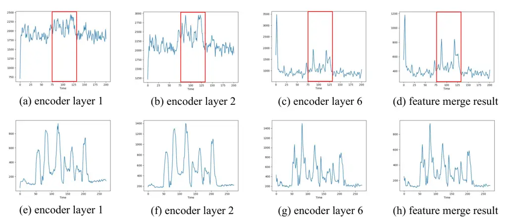
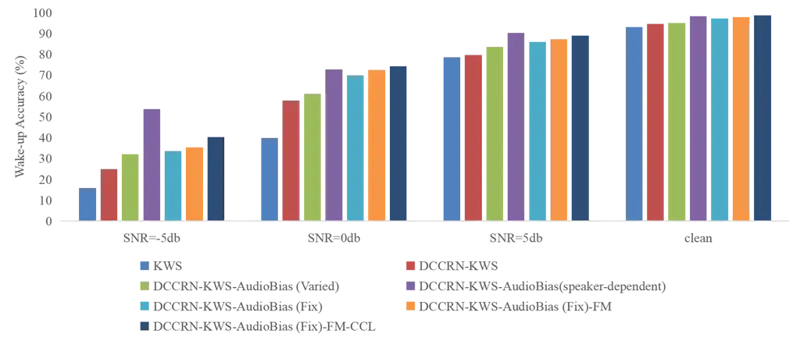

¹Audio, Speech and Language Processing Group (ASLP@NPU)  
²Tencent Technology Co., Ltd, Beijing, China

# DCCRN-KWS: An Audio Bias Based Model for Noise Robust Small-Footprint Keyword Spotting

Shubo Lv^(1,2∗), Xiong Wang^(2∗), Sining Sun¹, Long Ma², Lei Xie^(1†)
^(†)^(†)thanks: \* Equal contribution. \$†\$ Lei Xie is the
corresponding author.

###### Abstract

Real-world complex acoustic environments especially the ones with a low
signal-to-noise ratio (SNR) will bring tremendous challenges to a
keyword spotting (KWS) system. Inspired by the recent advances of neural
speech enhancement and context bias in speech recognition, we propose a
robust audio context bias based DCCRN-KWS model to address this
challenge. We form the whole architecture as a multi-task learning
framework for both denoising and keyword spotting, where the DCCRN
encoder is connected with the KWS model. Helped with the denoising task,
we further introduce an audio context bias module to leverage the real
keyword samples and bias the network to better discriminate keywords in
noisy conditions. Feature merge and complex context linear modules are
also introduced to strengthen such discrimination and to effectively
leverage contextual information respectively. Experiments on an internal
challenging dataset and the HIMIYA public dataset show that DCCRN-KWS is
superior in performance, while the ablation study demonstrates the good
design of the whole model.

^(†)^(†)address: ^(†)^(†)email: shblv@npu-aslp.org,
chnxwang@tencent.com, ssning2013@gmail.com, malonema@tencent.com,
lxie@nwpu.edu.cn

Index Terms: Speech enhancement, keyword spotting, audio context bias,
DCCRN-KWS

## 1 Introduction

Keyword Spotting (KWS) is a task to detect whether the input speech
signal contains preset keywords. Accordingly, as a typical KWS task,
wake-up word (WuW) detection is the first step in voice interaction
between the user and smart devices \[1\]. However, there is usually a
certain interaction distance between the user and the device, whereas
speech signal decay, environmental noise, and room reverberation will
seriously affect the performance of the system.

To improve speech quality, a signal enhancement front-end is usually
adopted. When multi-channel signals can be collected from a microphone
array, beamforming or multi-channel signal enhancement technologies can
be adopted. Traditional signal processing based speech enhancement
methods usually apply a spectral suppression gain (or filter) to the
noisy signal under the statistical signal processing theory \[2\]. With
the help of deep learning (DL), speech enhancement has been recently
formulated as a supervised learning problem and has become the
mainstream because of their strong noise reduction abilities (especially
for non-stationary noise) learned from simulated clean-noisy speech
pairs \[3, 4\]. More recently, advanced network structures such as
SDD-Net \[5\] and DCCRN \[6\], which explicitly model the complex
spectrum of speech with particularly designed optimization metrics, have
shown outstanding performance in recent noise suppression
challenges \[7, 8\].

The advances of neural speech enhancement have triggered its downstream
applications in speech recognition \[9\]. The front-end speech
enhancement module can be optimized independently in prior \[10\] or
jointly with the acoustic model \[11\] to improve the noise robustness
of ASR. In \[12\], the architecture of deep complex Unet (DCUnet) \[12\]
is incorporated with a multichannel acoustic model by multi-task
learning. The advantages of front- and back-end integration can be
directly applied to KWS which specifically aims to recognize predefined
keywords \[13\]. However, specifically for the KWS task, while
considering the integration, we can better leverage the constrained
linguistic and acoustic information as keywords are fixed or limited in
number. In this direction, a neural network based text-dependent speech
enhancement (TDSE) method was proposed in \[14\] for recovering the
original clean speech signal of a specific keyword. In the
open-vocabulary KWS approach in \[15\], an attention-based text-audio
cross-modal matching approach was proposed, where a denoising loss for
the acoustic embedding network is specifically used to improve noise
robustness.

Aiming to improve the KWS performance under noisy conditions and make
full use of the prior information of keywords, we propose a novel audio
context bias based front-end and back-end integrated KWS model. Inspired
by \[12\], we cascade the DCCRN encoder with a dilated temporal
convolution (DTC) based  \[16\] KWS model, resulting in the DCCRN-KWS
model learned under multi-task learning framework. To further bias the
model to learn specific keywords, inspired by the advances in context
bias in ASR  \[17\], we further introduce an audio bias encoder which
extracts specific keyword embedding from keyword audio samples. The
keyword embedding, subsequently concatenated with the DCCRN encoder
output, is fed into the KWS module. Based on the observation that each
DCCRN encoder layer output has clear discrimination between keywords and
non-keywords, we further introduce a feature merge module to aggregate
the outputs from each layer to further strengthen such discrimination.
Finally, we propose a complex context linear module to better integrate
the bias embedding with the DCCRN encoder output, improving KWS
performance further and avoiding model complexity explosion. Experiments
on two challenging datasets clearly show the advantages of the proposed
approach with superior performance and reasonable complexity. Ablation
studies further demonstrate the good design of different modules.

## 2 Audio Context Bias for DCCRN-KWS

In this section, we first introduce our back-end KWS module and then
detail the proposed DCCRN-KWS architecture, followed by the design of
audio context bias module, feature merge module and complex context
linear module respectively.

### 2.1 Architecture of KWS module

As shown in Fig. 1, our KWS module consists of multiple Dilated Temporal
Convolutional (DTC) blocks, which has achieved impressive performance
recently \[16\]. In detail, a dilated depthwise 1D-convolution layer is
first used to obtain temporal context, followed by two layers of
pointwise convolution to integrate the latent features from different
channels. Finally, we use a fully connected (FC) layer with softmax
function to estimate the posterior probability of the keyword.

Figure 1: Architecture of KWS module.

### 2.2 Network structure of DCCRN-KWS

We choose DCCRN \[6\] as our front-end speech enhancement model. Shaped
with an encoder-decoder Unet structure, a deep complex convolution
recurrent network was updated from the CRN network by introducing
complex convolution and LSTM, leading to superior performance in noise
suppression. A straightforward way to unify the DCCRN model with the KWS
model is to directly compose them in a cascaded structure. In this way,
we expect the DCCRN front-end to learn the latent representation that
benefits KWS without signal supervision on enhancement and fully depends
on the optimization of the KWS back-end. However, besides the increased
complexity of the whole model, previous work \[12\] has shown that this
direct composition framework is not as good as the multi-task learning
(MTL) framework with two explicit optimization targets. Therefore, we
shape our architecture in Fig. 2 in an MTL manner \[12\], where the main
task is keyword spotting and the auxiliary task is speech enhancement.
Specifically, we make the DCCRN encoder shared by the enhancement
decoder and the KWS network in order to extract the latent
representation of the input signals that can benefit both tasks. The
whole architecture is optimized during training and the speech
enhancement part is simply discarded during inference. Based on this
architecture, we introduce several important modules, including audio
context bias, feature merge and complex context linear, detailed in the
following subsections.

Figure 2: Audio Context Bias based DCCRN-KWS architecture.

### 2.3 Audio Context Bias

Inspired by the context bias strategy in ASR \[17\], we introduce a
novel audio context bias module into our DCCRN-KWS model. Different from
extracting text embedding in \[15\], we apply an audio encoder to
extract keyword audio embedding directly. The main reason is twofold.
First, measuring audio-audio similarity is more straightforward than
audio-text similarity; text bias is more flexible for customizing
keywords but it is not the purpose of this paper. Second, such audio
bias can better leverage real audio samples, further helping with the
speech enhancement task to improve robustness in keyword discrimination
in noisy conditions.

In detail, we first make a keyword audio list that is selected from the
keyword corpus. The list can be fixed (once chosen from the corpus, it
is not changed anymore) or varied (randomly selected from the corpus
every time). Then we feed the keyword samples on the list to an
embedding extractor to extract the bias embedding. Here we adopt
ECAPA-TDNN \[18\] as the embedding extractor because this network shows
superior ability in information aggregation from short audio clips and
leads to SOTA performance in speaker verification. Finally, we average
all the bias embedding vectors on the list and concatenate the average
embedding with the last layer output of the DCCRN encoder. The
concatenated final embedding is used as the input of the KWS module.
Please note that when the keyword audio list is fixed, the keyword bias
embedding is fixed accordingly during the inference time. Therefore, in
this case, the additional complexity of the audio context bias module is
negligible at run-time as the embedding extractor is not in use. In our
case, the dimension of the keyword embedding is set to 192 and
ECAPA-TDNN is implemented by SpeechBrain toolkit \[19\]. The
ECAPA-TDNN-based embedding extractor is jointly trained with the whole
DCCRN-KWS structure.

### 2.4 Feature Merge

As we adopt the DCCRN encoder output as the feature for KWS, the purpose
of each encoder layer should be analyzed. To this end, we visualize
different encoder layer’s output via frame level energy $`{m_{t}}`$:

```math
\vskip-8.5359pt\begin{cases}m_{t}&=\sum_{c}\sum_{f}M_{c,f,t}\\
M_{c,f,t}&=\sqrt{\Re{(E)}_{c,f,t}^{2}+\Im{(E)}_{c,f,t}^{2}}\par\end{cases} \tag{1}
```

where $`{E_{c,f,t}\in\mathbb{R}^{C\times F\times T}}`$ denotes each
encoder layer and $`{C,F,T}`$ denote the channel number, frequency bins,
and time frames respectively. $`\Re{(E)}`$ and $`\Im{(E)}`$ represent
the real and imaginary parts of the encoder output respectively. Using a
keyword sample and a non-keyword sample as input, we visualize the
layer-wise energy in Fig 3. We can see that the keyword part shows
relatively higher energy as compared with the rest part, and this
phenomenon is more salient for higher encoder layers. In contrast, this
phenomenon is not the case for the non-keyword sample, where the energy
distribution has a similar pattern for different layers. Whereas, we can
conclude that the DCCRN encoder aims to enhance the energy of the
keyword part which can subsequently benefit the KWS module to better
distinguish the keyword from other audio parts.

Motivated by this phenomenon, we develop a feature merge module to
increase the discrimination between keywords and others. Specifically,
we first initialize a group of feature merge ratio $`w_{i}`$, where the
last layer’s ratio is 1 and other layers are 0. Then as the dimension of
the previous encoder layer is twice than that of the final layer, we
downsample the output of these layers. Finally, we weighted-average the
outputs of the encoder layers to obtain the feature merge output
$`E^{\prime}`$. The process can be summarized as

```math
\vskip-8.5359ptE^{\prime}=\sum_{i}w_{i}\ast\text{downsample}(E_{i})/\sum_{i}|w_{i}| \tag{2}
```

where $`w_{i}`$ is learnable weights during training and fixed during
inference. From Fig 3 (d) and (h), we can see that the keyword segment
becomes more salient after the feature merge while the non-keyword is
almost unchanged.



Figure 3: The energy of different encoder layers and the feature merge
output for a keyword sample (up row) and a non-keyword sample (bottom
row).

### 2.5 Complex Context Linear

A common strategy of combining the bias embedding and encoder output is
simply concatenating them together and subsequently going through a
fully connected layer. As we know, contextual information is essential
for the KWS task. To better model context, another strategy is
concatenating several history frames of temporal features of the encoder
and the bias embedding as the input of the fully connected layer.
However, this simple concatenation will lead to a computational
complexity explosion.

In order to better take the encoder context into account and avoid the
complexity explosion, we specifically modify the fully connected layer
shown in Fig 4. We first split the encoder’s output into real/imag parts
separately and then concatenate the real/imag parts with bias embedding
respectively. Finally, the context features of current ($`t`$) and
previous frames ($`t-1,t-2`$) are combined together as the fully
connected layer’s input. Similar to the group convolution, the
complexity is almost halved as compared with simple context
concatenation.

Figure 4: Complex context linear module.

### 2.6 Loss Function

We adopt the typical time-domain SI-SNR \[20\] loss function for the
speech enhancement task, while binary cross entropy (BCE) loss is used
as the KWS loss. The final loss can be formulated as

```math
\vskip-2.84544pt\begin{cases}\mathcal{L}_{\textbf{BCE}}&=-y_{i}*ln(y_{i})-(1-y*)ln(1-y_{i})\\
\mathcal{L}&=\mathcal{L}_{\textbf{SI-SNR}}+\mathcal{L}_{\textbf{BCE}}\end{cases}\vskip-2.84544pt \tag{3}
```

where $`{y_{i}=H(x_{i};\theta)\in\{0,1\}}`$ is the posterior predicted
by the KWS model $`H`$ with parameter $`\theta`$, $`{y*_{i}\in\{0,1\}}`$
is the ground-truth class label for frame $`i`$.

## 3 Experiment

### 3.1 Dataset

We first conduct ablation experiments to prove the effectiveness of each
proposed sub-modules on a large internal training set and the task is to
detect the keyword “ding1-dang2-ding1-dang2” in Mandarin. Specifically,
a 158-hour keyword-specific speech dataset is used as positive training
data, and a 139-hour speech dataset collected from Youtube is served as
negative training data. The test is recorded in far-field noisy
conditions, where the number of positive and negative samples are 239
and 12,480 respectively with SNR ranging from -6 to -2 dB.

Besides the internal task, we further validate our approach on the
publicly available HIMIA dataset \[21\] recorded from a high-fidelity
microphone with spoken keywords “ni2-hao3-mi1-ya4” in Mandarin. The
training set contains 10 hours of keyword samples from 254 speakers and
the test set is composed of 3,520 keyword samples from another 44
speakers. As speaker labels are known, speaker-dependent audio lists for
keyword bias can be further studied. In this task, we adopt 90 hours of
negative samples selected from the librivox speech corpus. For testing,
besides the above positive testing samples, another 3,600 negative
samples are randomly selected from librivox, in total 7,120 audio
samples.

During the training for both tasks, the training data are generated on
the fly with SNR ranging from 0 to 15 dB and the image method is used to
simulate RIR with RT60 ranging from 0.05s to 0.95s. For the internal
set, the noises are selected from both an internal noise set and
freesound,174 hours in total. As for the HIMIYA public set, 56 hours of
noise are selected from freesound. During training, we randomly add 1 to
4 types of noise to each speech utterance. Particularly, the speakers
and noises have no overlap between training and testing. Furthermore,
particularly for the HIMIYA set, we randomly clip the negative examples
to short clips with a duration of 1 to 3 s for both training and testing
in order to avoid the model overfitting to a specific time duration
since the length of positive examples ranges from 1 to 3 s. To test our
model’s performance on different SNR conditions, we add noise to the
HIMIYA testing samples under SNR of -5, 0, and 5 dB respectively.

### 3.2 Training setup and baselines

For the proposed model, the window length and frame shift are 25ms and
10ms respectively while the STFT length is 512. Our model is a causal
one without considering future frames. For both datasets, all models are
trained for 17,500 iterations. And we use 8 NVIDIA V100 32GB GPUs for
the internal dataset and 1 for the public one. Adam optimizer is used
with a Noam-based scheduler \[22\], where the Noam factor is 5 and the
warm-up step is 1,000. During training, the number of the audio bias
list is set to 50 and the input dimensions of the KWS module are 128.
Furthermore, the fully connected layer between the final encoder output
and the KWS module for DCCRN-KWS (w/o audio context bias), DCCRN-KWS
(w/o complex context linear) and DCCRN-KWS (w complex context linear)
are 1024 $`\times`$ 128, 1216 $`\times`$ 128, 608 $`\times`$ 64
$`\times`$ 3 separately. For the complex context linear module, the
context number is set to 3 (the previous two frames with the current
frame). The model details are described as follows.

- •
  KWS module: The number of DTC layers is 16, and the kernel size and
  dilation are 5 and 1-2-4-8-1-2-4-8-1 respectively. To achieve
  streaming inference, all convolutions are causal ones.
- •
  DCCRN: The number of channels for the DCCRN is {16,32,64,128,256,256},
  and the convolution kernel and step are set to (5,2) and (2,1)
  respectively. Two 256-dimensional LSTM layers are adopted with a
  256-dimensional project layer. Each encoder/decoder module handles the
  current frame and one previous frame.

During training, we select up to 10 frames around the last frame of a
keyword audio clip as positive training samples and assign 1 to them,
while other frames in the keyword audio clip are discarded as ambiguous
and are not used in training. For negative training utterances, all
frames are regarded as negative training samples and assigned to 0
accordingly.

### 3.3 Experimental results and discussion

#### 3.3.1 Results on internal dataset

As shown in Fig 5, ablation is conducted to evaluate the effectiveness
of different model components of our system, including a) DCCRN module,
b) Audio context bias module (Fix / not Fix), c) Feature merge module
(FM), and d) Complex context linear module (CCL). To show the
effectiveness of audio context bias, we replace the bias embedding with
a learnable bias embedding as a sanity check. For this learnable bias
embedding, we first initialize a group of parameters as the bias
embedding, then we send the bias embedding into the DCCRN-KWS module to
update the value with the model training. Performance is measured by
plotting the receiver operating curve (ROC), which calculates the false
reject (FR) rate per false alarm (FA) rate. The lower the FR per FA
rate, the better the system.

Figure 5: Results of comparison models and ablation of the proposed
model on the internal dataset. FM: Feature Merge; CCL: Complex Context
Linear.

It can be seen from Fig 5(a) that after applying the DCCRN module, the
performance becomes obviously better. This indicates that the use of an
explicit speech enhancement module under multi-task learning framework
is helpful to assist the KWS module to improve performance. From
Fig 5(b), adding audio context bias module yields a lower false reject
rate when the false alarm rate kept the same with the system without the
bias module, which shows the effectiveness of keyword audio embedding.
We notice that fixed keyword audio list (Fix) performs better than
varied list during training. This is probably because the model can be
more easily trained and optimized better with a fixed list during
training.

By comparing the learnable embedding with the embedding extracted by
ECAPA-TDNN, we can see that the embedding extracted by keyword audio
list is more effective than the learnable embedding. We can explain this
phenomenon from several aspects. First, the embedding extracted from
keyword audio contains more structure information of keywords than the
learnable embedding. Second, we extract the bias embedding from real
audio samples, which is easy to calculate the similarity with the
DCCRN-KWS model compared with the learnable embedding. Furthermore, as
shown in Fig 5(c), when the feature merge module is applied, the
performance is further improved. This is because the feature merge
module can emphasize the discrimination of the keyword part as plotted
in Fig 3, which can help the KWS module to distinguish the keyword from
others. Finally, when the complex context linear module is adopted, our
system achieves the best performance. This indicates that combining the
context information and bias embedding can better discriminate the
keyword. In summary, the overall comparison on all methods is shown in
Fig 5(d).



Figure 6: Results of different models and ablation of the proposed model
on public HIMIYA dataset.

#### 3.3.2 Results on HIMIYA dataset

We further evaluate our models trained on the HIMIYA dataset. Fig 6
shows the KWS performance measured by wake-up accuracy under the setup
that up to one time false alarm triggered in 10 hours’ exposure to
continuous noisy speech. In low SNR, high SNR and even clean scenarios,
our contributions show their effectiveness according to the results.
Please note that when speaker-dependent audio samples are applied as the
audio list, the performance is better than the use of the
speaker-independent audio list. This is because, for the
speaker-dependent audio list, the extracted embedding contains both
keyword information and speaker information. Furthermore, we notice that
the improvements achieved from the proposed methods are less on the
HIMIYA dataset than the internal dataset. The main reason is that the
duration of the enrollment audio in the HIMIYA dataset is relatively
shorter than that in the internal dataset, while empirically a longer
bias keyword will lead to a more robust keyword embedding.

### 3.4 Inference Time

As shown in Table 1, we evaluate the RTF and CPU usage on RK3326
Cortex-A35@1.5GHz low-resource platform. Inference precision is set at
float32 with ONNX runtime engine. We also implement a comparison system,
named DCCRN-KWS-joint-train in Table 1. In this comparison system, we
jointly train a cascaded DCCRN-KWS system with the two losses, where the
enhanced speech by DCCRN is fed to the DTC-based KWS system. We can see
that the CPU usage and RTF for this system are not acceptable. In
contrast, the proposed DCCRN-KWS has reasonable CPU usage and RTF.
Importantly, based on the DCCRN-KWS framework, the components we
introduced yield only a small increase in RTF.

|                       |               |      |
| --------------------- | ------------- | ---- |
| Model                 | CPU Usage (%) | RTF  |
| KWS                   | 16            | 0.27 |
| DCCRN-KWS             | 35            | 0.67 |
| + AudioBias           | 36            | 0.69 |
|       + FM            | 36            | 0.70 |
|         + CCL         | 38            | 0.72 |
| DCCRN-KWS-joint-train | 94            | 2.85 |
|                       |               |      |

Table 1: RTF and CPU usage on low resource platform.

## 4 Conclusion

This paper introduces a front-end and back-end integration framework for
KWS in noisy conditions, named DCCRN-KWS. Specifically, we shape the
integration in a multi-task learning manner, while DCCRN is adopted for
speech enhancement and its encoder output is coupled with the KWS model
for keyword spotting. Based on this MTL architecture, we propose an
audio bias module that aims to better learn the discrimination between
keywords and non-keywords. Feature merge and complex context linear
modules are also introduced to strengthen such discrimination and to
effectively leverage contextual information respectively. Experiments on
two datasets show the effectiveness of the proposed approach.

## References

- \[1\] D. R. Miller, M. Kleber, C.-L. Kao, O. Kimball, T. Colthurst,
  S. A. Lowe, R. M. Schwartz, and H. Gish, “Rapid and accurate spoken
  term detection,” in _Interspeech_, 2007.
- \[2\] D. Wang and G. J. Brown, _Computational auditory scene analysis:
  Principles, algorithms, and applications_. Wiley-IEEE press, 2006.
- \[3\] D. S. Williamson, Y. Wang, and D. Wang, “Complex ratio masking
  for monaural speech separation,” _IEEE/ACM transactions on audio,
  speech, and language processing_, vol. 24, no. 3, pp. 483–492, 2015.
- \[4\] K. Tan and D. Wang, “A convolutional recurrent neural network
  for real-time speech enhancement.” in _Interspeech_, 2018, pp.
  3229–3233.
- \[5\] A. Li, W. Liu, X. Luo, G. Yu, C. Zheng, and X. Li, “A
  Simultaneous Denoising and Dereverberation Framework with Target
  Decoupling.” in _Interspeech_, 2021, pp. 2801–2805.
- \[6\] Y. Hu, Y. Liu, S. Lv, M. Xing, S. Zhang, Y. Fu, J. Wu, B. Zhang,
  and L. Xie, “DCCRN: Deep complex convolution recurrent network for
  phase-aware speech enhancement.” in _Interspeech_, 2020, pp.
  2472–2476.
- \[7\] C. K. Reddy, V. Gopal, R. Cutler, E. Beyrami, R. Cheng,
  H. Dubey, S. Matusevych, R. Aichner, A. Aazami, S. Braun, P. Rana,
  S. Srinivasan, and J. Gehrke, “The INTERSPEECH 2020 Deep Noise
  Suppression Challenge: Datasets, Subjective Testing Framework, and
  Challenge Results,” in _Interspeech_, 2020, pp. 2492–2496.
- \[8\] C. K. Reddy, H. Dubey, K. Koishida, A. Nair, V. Gopal,
  R. Cutler, S. Braun, H. Gamper, R. Aichner, and S. Srinivasan,
  “INTERSPEECH 2021 Deep Noise Suppression Challenge.” in _Interspeech_,
  2021, pp. 2796–2800.
- \[9\] T. O’Malley, A. Narayanan, Q. Wang, A. Park, J. Walker, and
  N. Howard, “A conformer-based asr frontend for joint acoustic echo
  cancellation, speech enhancement and speech separation,” in
  _ASRU_. IEEE, 2021, pp. 304–311.
- \[10\] Z. Nian, J. Du, Y. T. Yeung, and R. Wang, “A time domain
  progressive learning approach with snr constriction for single-channel
  speech enhancement and recognition,” in _ICASSP_. IEEE, 2022, pp.
  6277–6281.
- \[11\] C. Li, J. Shi, W. Zhang, A. S. Subramanian, X. Chang, N. Kamo,
  M. Hira, T. Hayashi, C. Boeddeker, Z. Chen _et al._, “Espnet-se:
  end-to-end speech enhancement and separation toolkit designed for asr
  integration,” in _SLT_. IEEE, 2021, pp. 785–792.
- \[12\] Y. Kong, J. Wu, Q. Wang, P. Gao, W. Zhuang, Y. Wang, and
  L. Xie, “Multi-channel automatic speech recognition using deep complex
  unet,” in _SLT_. IEEE, 2021, pp. 104–110.
- \[13\] Y. Gu, Z. Du, H. Zhang, and X. Zhang, “An efficient joint
  training framework for robust small-footprint keyword spotting,” in
  _International Conference on Neural Information Processing_. Springer,
  2020, pp. 12–23.
- \[14\] M. Yu, X. Ji, Y. Gao, L. Chen, J. Chen, J. Zheng, D. Su, and
  D. Yu, “Text-dependent speech enhancement for small-footprint robust
  keyword detection.” in _Interspeech_, 2018, pp. 2613–2617.
- \[15\] H.-K. Shin, H. Han, D. Kim, S.-W. Chung, and H.-G. Kang,
  “Learning audio-text agreement for open-vocabulary keyword spotting,”
  _arXiv preprint arXiv:2206.15400_, 2022.
- \[16\] J. Hou, L. Zhang, Y. Fu, Q. Wang, Z. Yang, Q. Shao, and L. Xie,
  “The npu system for the 2020 personalized voice trigger challenge,”
  _arXiv preprint arXiv:2102.13552_, 2021.
- \[17\] G. Pundak, T. N. Sainath, R. Prabhavalkar, A. Kannan, and
  D. Zhao, “Deep context: end-to-end contextual speech recognition,” in
  _SLT_. IEEE, 2018, pp. 418–425.
- \[18\] B. Desplanques, J. Thienpondt, and K. Demuynck, “Ecapa-tdnn:
  Emphasized channel attention, propagation and aggregation in tdnn
  based speaker verification,” _arXiv preprint arXiv:2005.07143_, 2020.
- \[19\] M. Ravanelli, T. Parcollet, P. Plantinga, A. Rouhe, S. Cornell,
  L. Lugosch, C. Subakan, N. Dawalatabad, A. Heba, J. Zhong, J.-C. Chou,
  S.-L. Yeh, S.-W. Fu, C.-F. Liao, E. Rastorgueva, F. Grondin, W. Aris,
  H. Na, Y. Gao, R. D. Mori, and Y. Bengio, “SpeechBrain: A
  general-purpose speech toolkit,” 2021, arXiv:2106.04624.
- \[20\] Y. Luo and N. Mesgarani, “Conv-tasnet: Surpassing ideal
  time–frequency magnitude masking for speech separation,” _IEEE/ACM
  transactions on audio, speech, and language processing_, vol. 27,
  no. 8, pp. 1256–1266, 2019.
- \[21\] X. Qin, H. Bu, and M. Li, “Hi-mia: A far-field text-dependent
  speaker verification database and the baselines,” in _ICASSP_. IEEE,
  2020, pp. 7609–7613.
- \[22\] L. Dong, S. Xu, and B. Xu, “Speech-transformer: a no-recurrence
  sequence-to-sequence model for speech recognition,” in _ICASSP_. IEEE,
  2018, pp. 5884–5888.
