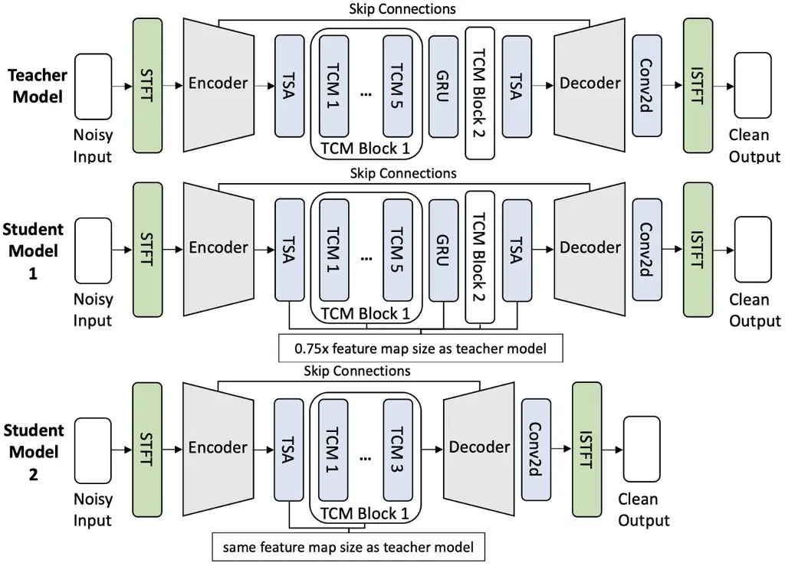
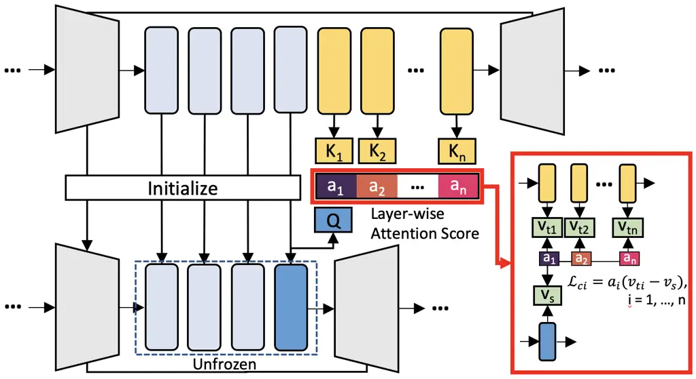

¹ Microsoft Research Asia  
² Computer Science Department, University of California, Los Angeles

# ABC-KD: Attention-Based-Compression Knowledge Distillation for Deep Learning-Based Noise Suppression

Yixin Wan^(1,2) , Yuan Zhou¹, Xiulian Peng¹, Kai-Wei Chang², Yan Lu¹
^(†)^(†)thanks: This work was completed during Yixin Wan’s internship at
Microsoft Research Asia.

###### Abstract

Noise suppression (NS) models have been widely applied to enhance speech
quality. Recently, Deep Learning-Based NS, which we denote as Deep Noise
Suppression (DNS), became the mainstream NS method due to its excelling
performance over traditional ones. However, DNS models face $`2`$ major
challenges for supporting the real-world applications. First,
high-performing DNS models are usually large in size, causing deployment
difficulties. Second, DNS models require extensive training data,
including noisy audios as inputs and clean audios as labels. It is often
difficult to obtain clean labels for training DNS models. We propose the
use of knowledge distillation (KD) to resolve both challenges. Our study
serves $`2`$ main purposes. To begin with, we are among the first to
comprehensively investigate mainstream KD techniques on DNS models to
resolve the two challenges. Furthermore, we propose a novel
Attention-Based-Compression KD method that outperforms all investigated
mainstream KD frameworks on DNS task.

^(†)^(†)address: ^(†)^(†)email: elaine1wan@g.ucla.edu, {zhouyuan, xipe,
yanlu}@microsoft.com, kwchang@cs.ucla.edu

Index Terms: Deep Learning-Based Noise Suppression, Knowledge
Distillation

## 1 Introduction

Deep Learning-based Noise Suppression models, which we refer to as Deep
Noise Suppression (DNS) models, have achieved outstanding performance
over traditional models. However, while DNS models have become the new
mainstream in speech enhancement, they also face $`2`$ new challenges.
On the one hand, the enormous size of large state-of-the-art DNS models
hinders their applications in low-resource settings \[5\], such as
device-end deployment. On the other hand, training a DNS model requires
supervision from a large amount of training data, which is unrealistic
in real world scenarios. For noise suppression task, the training data
constitutes of noisy audio data as the training input and clean audio
data as the training target or training label. In real world situations,
noisy audios can be easily retrieved, but it is often much more
difficult to obtain the corresponding clean audio labels, resulting in
the challenge of low-supervision-data in real-world training scenarios.

Our study proposes the use of Knowledge distillation (KD) \[9, 24\] to
resolve the two challenges. KD is a model compression technique that
utilizes knowledge from a strong and larger teacher model to supervise a
smaller student model. The method has gained increasing attention in
various fields of research \[2, 4, 3, 1, 25, 26, 10\] to decrease model
size while maintaining satisfactory performance. We believe that KD is
promising in producing smaller and even more powerful DNS models that
can be easily deployed onto edge devices. What’s more, KD is capable of
resolving the challenge of low-supervision-data in real-world situations
with the help of teacher model’s output supervision. For instance, for a
vanilla KD framework on noise suppression task, responses or outputs of
the stronger teacher DNS model, which are de-noised clean audios, can be
used as pseudo-labels to supervise a student DNS model during training.
Despite being a promising research direction, the application of KD on
DNS models has not been systematically studied in previous works.
Recognizing the potential of KD techniques in DNS, we propose our work
with $`3`$ main contributions:

- •
  We are amongst the first to systematically examine mainstream
  1-teacher-1-student KD techniques on DNS task in a
  low-supervision-data setting.
- •
  We propose a novel Attention-Based-Compression KD (ABC-KD) framework
  that utilizes both response-based distillation and a layer-wise cross
  attention framework to compress knowledge across multiple teacher
  model layers onto a single layer of the student model.
- •
  We examine the effectiveness of ABC-KD through extensive experiments,
  showing that the method 1) outperforms the supervised student model,
  and 2) outperforms all investigated mainstream KD frameworks across 2
  noise suppression benchmarks.

## 2 Background

### 2.1 Deep Noise Suppression

Noise Suppression (NS) is a speech enhancement task for improving
quality and intelligibility of speech. NS models aim at reducing
background noise in speech and audios, and are often programmed onto
edge devices such as laptops, tablets, and cellphones as part of a
function or an application. DNS models further incorporated DNN for this
task and achieved outstanding performance, thus becoming a major field
of research in audio signal processing \[6, 7, 31\]. While large-scale
DNS models are pushing the boundary of traditional NS methods, they also
bring $`2`$ new challenges:

- •
  Large model size. The size of state-of-the-art DNS models causes
  deployment difficulties on resource limited devices.
- •
  Lack of training labels in real-world situations. In real world
  scenarios, while it is often easy to retrieve noisy audios as training
  inputs, it is much more difficult to obtain the corresponding clean
  audios as training labels or targets.

In order to resolve both challenges, this work propose a
1-teacher-1-student KD framework that succeeds in producing smaller and
better DNS models with limited training labels.

### 2.2 Knowledge Distillation

KD \[9, 24\] is a model compression technique that utilizes knowledge
from a larger teacher model to supervise a smaller student model. It has
gained increasing attention in different fields to significantly reduce
model size while maintaining satisfactory performance \[4, 2, 3, 1, 25,
26, 10\]. Researchers have also studied KD for DNS models \[25, 26,
30\]. However, the previous studies have $`2`$ major drawbacks: 1) they
fail to establish a comprehensive study on KD methods for DNS, and 2)
none of them explore KD’s potential in resolving the challenge of low
supervision data faced by DNS models in real-world situations.

Our work first investigates different categories of KD methods. Based on
the type of supervised knowledge from the teacher model, KD methods can
be mainly categorized into Response-Based KD \[9, 15\], Feature-Based KD
\[20, 16, 17\] and Relation-Based KD \[18, 8\]. We will briefly
introduce these traditional KD methods, as well as introduce $`2`$ more
recent state-of-the-art KD techniques.

Response-Based KD Response-Based KD trains the student model to directly
mimic the output or response of the teacher model \[9, 25, 26\].
However, Response-Based KD ignores information in the intermediate
layers of the teacher that could be helpful for learning the final
prediction task.

Feature-Based KD Feature-based KD further utilizes information from
intermediate feature maps of the teacher model to supervise the student
model. \[20, 19\]. However, teacher model usually has more intermediate
layers or larger feature map than that of the student. This results in
difficulties in supervision using feature representations, as we would
need to manually construct the links between the layers of student and
teacher to resolve differences in layer number or feature sizes.

Relation-Based KD Relation-based KD explores relations between
distributions of different model layers or data samples \[8\]. However,
it assumes a distribution from the data or output logits. Since DNS
models take continuous signals that do not belong to distributions as
input and output, relation-based KD is not suitable for the task.
Therefore, relation-based KD is not investigated in this paper.

Attention-Based KD Traditional feature-based KD utilized manually
constructed links between student and teacher knowledge for supervision,
which might be ineffective. \[4\] proposed an attention-based feature
distillation method that allows the student to learn from all teacher
features without manually pre-defining knowledge links. Their
attention-based meta-network utilizes relative similarities between
pairs of student and teacher features to control distillation intensity
of all pairs.

DistilHuBERT framework Another recent state-of-the-art KD method is the
DistilHuBERT framework \[10\]. In this framework, the student model
directly copies the teacher model’s encoder as the initialization of the
training. Similar to the feature-based distillation, some of the teacher
model’s intermediate layers are manually selected for feature
supervision of the student model’s intermediate layers. The main
objective is for a student model layer to learn compact representations
from different teacher model layers through multiple prediction heads.



Figure 1: Structures of teacher and student models.

## 3 Methodology

### 3.1 Model Structure

Following state-of-the-art models in previous works \[29, 27, 28\], we
use an encoder-decoder structure for all teacher and student models in
our study. We would like to stress, however, that our proposed ABC-KD
method is promising to be extended for application on different DNS
model structures. Noisy audio inputs first go through a Short Time
Fourier Transform (STFT) block into the encoder with $`6`$ convolution
layers. At encoder output, frequency and channel-wise dimensions of the
data are combined. Intermediate layers consist of building blocks
including Temporal Self-Attention (TSA) layers, Temporal Convolution
Modules (TCM), and Gated Recurrent Unit (GRU) layers. The decoder
consists of $`6`$ gated de-convolution blocks \[14\] with skip
connections from each encoder layer. It is followed by a convolution
layer and an Inverse STFT block to output the clean audio.

Figure 1 illustrates structures of the teacher and student models. Note
that we use $`2`$ student models with different structures to adapt to
different KD methods in experiments. The teacher model consists of
$`14`$ intermediate layers with $`5.144`$M parameters. Student model 1
has the same intermediate layer structure as the teacher model, but its
feature map is only $`.75`$ the size of the teacher’s. Student model 2
has $`10`$ less intermediate layers and the same size of feature map as
the teacher model. In order to ensure soundness of experiment results,
the two student models are designed to have comparable model sizes.
Student model $`1`$ has $`1.558`$M parameters and student model $`2`$
has $`1.497`$M parameters, both more than $`3`$ times less than the
number of parameters of the teacher model.

### 3.2 ABC-KD Framework

We propose Attention-Based-Compression Knowledge Distillation (ABC-KD),
a KD framework that specifically targets DNS task. ABC-KD trains the
student model’s last intermediate layer to adaptively learn compressed
knowledge across multiple teacher model layers, through a layer-wise
attention mechanism. Our distillation pipeline involves $`3`$ stages:
initialization stage, attention stage, and compression stage. The $`3`$
stages of our ABC-KD method are illustrated as follows.



Figure 2: Structure of the proposed ABC-KD mechanism.

Initialization Stage Using the structure of Student Model 2 as the
student model, we initialize the parameters for its encoder and all of
its intermediate layers with parameters from the corresponding layers of
the pre-trained teacher model. The decoder is left uninitialized. Note
that we can directly initialize student model layers because they have
the same feature map size as the teacher model layers. We then freeze
only the initialized encoder throughout the distillation process.
Initialized parameters in the student’s intermediate layers are left
optimize-able.

Attention Stage The attention stage aims at letting the student model’s
last intermediate layer choose how much knowledge it wishes to learn
from each teacher model layer in the compression stage. We do so by
training the last intermediate layer of student model to predict the
weighted summation of hidden representation from each teacher model
layers. Instead of manually designing the weights, or how much
information the student model should learn from each teacher model
layer, we propose the incorporation of a layer-wise attention mechanism
to determine the intensity of knowledge distillation.

Let $`h_{s}\in{\mathbb{R}}^{T\times C}`$ be the hidden representation
from the last intermediate layer of the student model, and
$`h_{t}\in{\mathbb{R}}^{n\times T\times C}`$ be hidden representations
from teacher model layers, where $`T`$ is the number of time frames,
$`C`$ is the number of channels, and $`n`$ is the total number of layers
to be distilled. ABC-KD utilizes a layer-wise attention mechanism to
determine the intensity of distillation between each pair of
teacher-student layers by their level of similarity. Feature from the
last intermediate layer of student generates a query
$`Q\in{\mathbb{R}}^{T\times C}`$, and feature from each of the teacher
model layers generates a key $`K_{i}\in{\mathbb{R}}^{T\times C}`$, where
$`i`$ denotes the $`i_{th}`$ teacher model layer to be distilled.
Specifically,

```math
\displaystyle Q \displaystyle=W^{Q}_{s}\cdot h_{s},
```

```math
\displaystyle K_{i} \displaystyle=W^{K}_{t,i}\cdot h_{t,i}, \displaystyle i=1,2,...,n,
```

where $`W^{Q}_{s}\in{\mathbb{R}}^{T\times T}`$ and
$`W^{K}_{t,i}\in{\mathbb{R}}^{T\times T}`$ are linear weight matrices
for the student layer’s query and the $`i_{th}`$ teacher layer’s key. We
use distinct weight matrices for teacher model layers.

Then, we calculate the layer-wise attention score $`a_{i}`$ calculated
by $`Q`$ and each of the $`K_{i}`$,

```math
\displaystyle a_{i} \displaystyle=softmax(Q\cdot K_{i}^{\top}), \displaystyle i=1,2,...,n.
```

$`a_{s}=[a_{1},a_{2},...,a_{n}]\in{\mathbb{R}}^{n}`$ is then the
layer-wise attention score vector that indicates the affinity between
the last intermediate layer of student model and each teacher model
layer.

Compression Stage We then use the layer-wise attention scores to
determine the intensity of knowledge distillation between each pair of
student-teacher model layers. We formulate the
Attention-Based-Compression distill term as,

```math
\displaystyle\mathcal{L}_{abc} \displaystyle=\sum^{n}_{i=1}a_{i}||W^{V}_{t,i}\cdot h_{t,i}-W^{V}_{s}\cdot h_{s}||_{2},
```

where $`W^{V}_{t,i}\in{\mathbb{R}}^{T\times T}`$ and
$`W^{V}_{s}\in{\mathbb{R}}^{T\times T}`$ are weight matrices to generate
values of the last intermediate layer of student model and the
$`i_{th}`$ teacher model layer to be distilled.

We jointly optimize the distillation loss and the response-based loss
with the final loss function

```math
\displaystyle\mathcal{L} \displaystyle=\mathcal{L}_{abc}+\mathcal{L}_{output},
```

where $`\mathcal{L}_{output}`$ is the response-based loss that
supervises the student model to mimic final outputs of the teacher
model. Through the attention and compression mechanisms, student model
is able to adaptively decide how to learn compact representation
knowledge from teacher model layers.

## 4 Experiments

### 4.1 Dataset

For the supervised training dataset, we synthesize 890 hours of 16 kHz
noisy audio with clean speech, noises and room impulse responses from
the Interspeech 2021 Deep Noise Suppression Challenge \[11\].
Speech-to-noise ratio (SNR) and speech level are randomly chosen between
-5dB to 20dB and -40dB to -10dB, respectively. Each audio is cut into
3-second segments for training. For the distillation dataset, we
randomly remove 50% of clean speech targets, which we denote as “data
labels”, and use outputs of the supervised teacher model as the
pseudo-labels instead. We evaluate outcomes of our experiments on $`2`$
test datasets: the VoiceBank+DEMAND testset \[12\], and the clips with
the tag “Primary” from the blind test set of Track-1 non-personalized
DNS at DNS Challenge ICASSP 2022 \[13\]. All test clips are re-sampled
to 16 kHz.

|                             |            |                  |          |          |          |                           |           |           |
| --------------------------- | ---------- | ---------------- | -------- | -------- | -------- | ------------------------- | --------- | --------- |
| Model / KD Framework        | Params     | VoiceBank+DEMAND |          |          |          | DNS Challenge ICASSP-2022 |           |           |
|                             |            | PESQ             | CSIG     | CBAK     | COVL     | SIG                       | BAK       | OVL       |
| Unprocessed                 | -          | $`1.97`$         | $`3.35`$ | $`2.44`$ | $`2.63`$ | $`3.972`$                 | $`2.043`$ | $`2.344`$ |
| Supervised Teacher (Full)   | $`5.144`$M | $`3.25`$         | $`4.28`$ | $`3.75`$ | $`3.78`$ | $`3.639`$                 | $`4.274`$ | $`3.320`$ |
| Supervised Student 1 (Full) | $`1.558`$M | $`3.09`$         | $`4.02`$ | $`3.58`$ | $`3.45`$ | $`3.320`$                 | $`4.126`$ | $`3.055`$ |
| Supervised Student 2 (Full) | $`1.497`$M | $`3.02`$         | $`4.05`$ | $`3.42`$ | $`3.34`$ | $`3.325`$                 | $`4.107`$ | $`3.029`$ |
| Supervised Teacher (50%)    | $`5.144`$M | $`3.12`$         | $`4.20`$ | $`3.65`$ | $`3.52`$ | $`3.602`$                 | $`4.211`$ | $`3.285`$ |
| Supervised Student 1 (50%)  | $`1.558`$M | $`2.95`$         | $`3.99`$ | $`3.35`$ | $`3.23`$ | $`3.287`$                 | $`4.110`$ | $`3.024`$ |
| Supervised Student 2 (50%)  | $`1.497`$M | $`2.89`$         | $`4.00`$ | $`3.29`$ | $`3.19`$ | $`3.310`$                 | $`4.085`$ | $`2.987`$ |
| Response-Based KD-1         | $`1.558`$M | $`2.92`$         | $`3.96`$ | $`3.33`$ | $`3.20`$ | $`3.298`$                 | $`4.105`$ | $`2.989`$ |
| Feature-Based KD            | $`1.558`$M | $`2.85`$         | $`3.93`$ | $`3.19`$ | $`3.11`$ | $`3.265`$                 | $`4.078`$ | $`2.942`$ |
| Attention-Based KD          | $`1.558`$M | $`3.10`$         | $`4.04`$ | $`3.50`$ | $`3.40`$ | $`3.329`$                 | $`4.109`$ | $`3.031`$ |
| Response-Based KD-2         | $`1.497`$M | $`2.83`$         | $`3.91`$ | $`3.15`$ | $`3.08`$ | $`3.267`$                 | $`4.066`$ | $`2.939`$ |
| DistilHuBERT framework      | $`1.497`$M | $`2.89`$         | $`3.94`$ | $`3.22`$ | $`3.15`$ | $`3.302`$                 | $`4.088`$ | $`3.018`$ |
| ABC-KD                      | $`1.497`$M | 3.12             | 4.08     | 3.51     | 3.42     | 3.331                     | 4.112     | 3.032     |

Table 1: Results of Supervised Training and Knowledge Distillation
Methods with 50% Data Labels

| KD Framework   | DNS Challenge ICASSP-2022 |           |           |
| -------------- | ------------------------- | --------- | --------- |
|                | SIG                       | BAK       | OVL       |
| ABC-KD         | 3.331                     | 4.112     | 3.032     |
| no Attention   | $`3.295`$                 | $`4.092`$ | $`3.019`$ |
| no Compression | $`3.327`$                 | $`4.106`$ | $`3.030`$ |

Table 2: Ablation Study on ABC-KD’s Components

### 4.2 Implementation Details

We use the Adam optimizer \[32\] with learning rate $`3\times 10^{-4}`$
for all experiments. We first train the teacher model and the $`2`$
student models with full real-labeled data. Each model is trained for
$`150`$ epochs with a batch size of $`400`$. The pre-trained teacher
model is then used for further experiments.

We compare our proposed ABC-KD framework with $`4`$ mainstream KD
methods through experiments: Response-Based KD, Feature-Based KD,
Attention-Based KD, and DistilHuBERT framework. Note that for
DistlHuBERT framework, we only reproduce the distillation method, not
the model itself. We establish Response-Based KD on Student Model 1
(Response-Based KD-1) and on Student Model 2 (Response-Based KD-2) as
baselines for KD methods. For Feature-Based KD, we implement the most
vanilla framework with layer-to-layer correspondence between student and
teacher models. In Attention-Based KD, we explore the effectiveness of
incorporating attention mechanism to improve KD performance. Therefore,
we use Student Model 1, which has the same number of intermediate layers
as the teacher model, in experiments of the above 3 KD methods. For
experiments on Response-Based KD-2 and DistilHuBERT framework, we use
Student Model 2, which has only $`4`$ intermediate layers, to explore KD
on student models with smaller depth. Note that due to the intrinsic
differences in structures, Student Model 1 has slightly more (0.061M)
parameters than Student Model 2. For each KD framework, we train for
$`150`$ epochs with batch size $`400`$.

On the VoiceBank+DEMAND testset, $`4`$ evaluation metrics are being
used: PESQ, Perceptual Evaluation of Speech Quality \[22\]; CSIG, CBAK,
and COVL, mean opinion score (MOS) predictor of signal distortion,
background-noise intrusiveness, and overall signal quality, respectively
\[21\]. On the “Primary” blind test set of DNS Challenge ICASSP-2022
Track-1, 3 similar MOS metrics provided by the DNSMOS tool are used for
evaluation: SIG, BAK, and OVL \[23\].

### 4.3 Results and Analysis

Evaluation results are shown in Table 1. Rows $`1`$ to $`4`$ are the
baselines, including the unprocessed audio and supervised training of
models with full-supervision-data. Rows $`5`$ to $`13`$ show results of
supervised training and KD methods in a low-supervision-data setting,
i.e. only with 50% data labels available. Rows $`8`$ to $`10`$ and rows
$`11`$ to $`12`$ show results of the investigated mainstream KD methods
on Student Models 1 and 2, respectively. The last row shows our proposed
ABC-KD method.

From the results of the $`3`$ mainstream KD methods on Student Model 1
that we experiment with, we observe that: 1) all KD methods fail to
outperform supervised training in a low-supervision-data setting. 2)
Attention-Based KD (Row $`10`$) gives best KD results while
Feature-Based KD (Row $`9`$) performs worst. This shows that the student
model learns better by adaptively obtaining knowledge from each teacher
model layer through attention, instead of forcing feature knowledge in a
layer-to-layer manner. However, we also note that 3) the above-mentioned
KD methods have significant drawbacks: Feature-Based KD requires the
student to have the same model structure as the teacher, while
Attention-Based KD suffers from large training cost due to the attention
mechanism.

From the results of the 2 mainstream KD methods on Student Model 2, we
observe that: 1) DistilHuBERT framework (Row $`12`$) outperforms
Response-Based KD-2 (Row $`11`$), demonstrating that the
compression-based feature distillation is effective to boost student
model knowledge. 2) Performance of the DistilHuBERT framework on student
model 2 also surpasses Feature-Based KD on student model 1, showing that
student model can learn compact feature knowledge across teacher layers,
and that aligning depth of student and teacher models is not necessary
for improving KD performance. However, we also note that 3) the
DistilHuBERT framework still fail to outperform supervised training in a
low-supervision-data setting.

From observations in previous experiments, we propose the ABC-KD
framework that allows the student model to learn compact feature
knowledge from teacher model layers. We further utilize a layer-wise
cross-attention scheme that lets the student model adaptively decide how
much knowledge to learn from each teacher layer. Experiments show that
ABC-KD framework (Row $`13`$) outperforms all investigated KD methods on
both testsets. Additionally, we observe that ABC-KD achieves better
performance than both student model 1 and student model 2 under
supervised training in a low-supervision-data setting (Rows $`6`$ and
$`7`$) and achieves comparable results under full-supervision data
setting (Rows $`3`$ and $`4`$), while all other KD methods fail to
outperform these baselines. This shows that ABC-KD can help student
model maintain satisfactory performance with significantly less training
labels.

To further prove the effectiveness of each component of ABC-KD, we
construct ablation experiments as shown in Table 2. Row $`2`$ shows
results when the attention mechanism is not used, with all teacher
layers giving equal contribution to each student layer. Row $`3`$ shows
results when compression is not used, i.e. instead of only the last
intermediate layer, each middle layer of student gets explicit
attention-based supervision from the teacher model. We observe that
model performance drops significantly when taking out any component,
indicating that both are valid, crucial and effective to our ABC-KD
method. Additionally, attention mechanism has larger impact than
compression, though at the cost of much higher training complexity.

## 5 Conclusion

In this work, we propose the use of 1-teacher-1-student KD methods to
resolve $`2`$ challenges that DNS models currently face: 1) large model
size and 2) lack of training labels in real-world scenario. We first
comprehensively investigate mainstream KD methods on this task.
Observing the advantages and problems of current KD methods, we propose
ABC-KD, a novel KD framework that succeeds in resolving both challenges
on DNS task. With ABC-KD, the student model can 1) use response of
teacher model as output supervision, and 2) adaptively learn compact
feature knowledge across multiple teacher layers through
attention-based-compression. This allows the student model to maintain
satisfactory performance while having a smaller depth and in a
low-supervision-data setting with significantly less available training
labels. Besides surpassing all investigated mainstream KD methods,
ABC-KD also outperforms supervised training when less training labels
are available. Strong results of ABC-KD demonstrate great potential of
KD methods for DNS models as a promising alternative to supervised
training in a low-supervision-data setting.

## References

- \[1\] M. A. Haidar, N. Anchuri, M. Rezagholizadeh, A. Ghaddar,
  P. Langlais, and P. Poupart, “RAIL-KD: random intermediate layer
  mapping for knowledge distillation,” _CoRR_, vol.
  abs/2109.10164, 2021. \[Online\]. Available:
  [https://arxiv.org/abs/2109.10164](https://arxiv.org/abs/2109.10164)
- \[2\] V. Sanh, L. Debut, J. Chaumond, and T. Wolf, “Distilbert, a
  distilled version of bert: smaller, faster, cheaper and lighter,”
  _ArXiv_, vol. abs/1910.01108, 2019.
- \[3\] X. Jiao, Y. Yin, L. Shang, X. Jiang, X. Chen, L. Li, F. Wang,
  and Q. Liu, “TinyBERT: Distilling BERT for natural language
  understanding,” in _Findings of the Association for Computational
  Linguistics: EMNLP 2020_. Online: Association for Computational
  Linguistics, Nov. 2020, pp. 4163–4174. \[Online\]. Available:
  [https://aclanthology.org/2020.findings-emnlp.372](https://aclanthology.org/2020.findings-emnlp.372)
- \[4\] M. Ji, B. Heo, and S. Park, “Show, attend and distill: Knowledge
  distillation via attention-based feature matching,” in _AAAI_, 2021.
- \[5\] S. Braun, H. Gamper, C. K. A. Reddy, and I. Tashev, “Towards
  efficient models for real-time deep noise suppression,” _ICASSP 2021 -
  2021 IEEE International Conference on Acoustics, Speech and Signal
  Processing (ICASSP)_, pp. 656–660, 2021.
- \[6\] P. C. Loizou, _Speech Enhancement: Theory and Practice_,
  2nd ed. USA: CRC Press, Inc., 2013.
- \[7\] D. Wang and J. Chen, “Supervised speech separation based on deep
  learning: An overview,” _IEEE/ACM Trans. Audio, Speech and Lang.
  Proc._, vol. 26, no. 10, p. 1702–1726, oct 2018. \[Online\].
  Available:
  [https://doi.org/10.1109/TASLP.2018.2842159](https://doi.org/10.1109/TASLP.2018.2842159)
- \[8\] J. Gou, B. Yu, S. J. Maybank, and D. Tao, “Knowledge
  distillation: A survey,” _Int. J. Comput. Vision_, vol. 129, no. 6, p.
  1789–1819, jun 2021. \[Online\]. Available:
  [https://doi.org/10.1007/s11263-021-01453-z](https://doi.org/10.1007/s11263-021-01453-z)
- \[9\] G. E. Hinton, O. Vinyals, and J. Dean, “Distilling the knowledge
  in a neural network,” _ArXiv_, vol. abs/1503.02531, 2015.
- \[10\] H.-J. Chang, S.-w. Yang, and H.-y. Lee, “Distilhubert: Speech
  representation learning by layer-wise distillation of hidden-unit
  bert,” in _ICASSP 2022 - 2022 IEEE International Conference on
  Acoustics, Speech and Signal Processing (ICASSP)_, 2022, pp.
  7087–7091.
- \[11\] C. K. A. Reddy, H. Dubey, K. Koishida, A. A. Nair, V. Gopal,
  R. Cutler, S. Braun, H. Gamper, R. Aichner, and S. Srinivasan,
  “Interspeech 2021 deep noise suppression challenge,” _CoRR_, vol.
  abs/2101.01902, 2021. \[Online\]. Available:
  [https://arxiv.org/abs/2101.01902](https://arxiv.org/abs/2101.01902)
- \[12\] C. Valentini-Botinhao, X. Wang, S. Takaki, and J. Yamagishi,
  “Investigating rnn-based speech enhancement methods for noise-robust
  text-to-speech,” in _SSW_, 2016.
- \[13\] H. Dubey, V. Gopal, R. Cutler, A. Aazami, S. Matusevych,
  S. Braun, S. E. Eskimez, M. Thakker, T. Yoshioka, H. Gamper, and
  R. Aichner, “Icassp 2022 deep noise suppression challenge,” 2022.
  \[Online\]. Available:
  [https://arxiv.org/abs/2202.13288](https://arxiv.org/abs/2202.13288)
- \[14\] C. Zheng, X. Peng, Y. Zhang, S. Srinivasan, and Y. Lu,
  “Interactive speech and noise modeling for speech enhancement,” in
  _AAAI_, 2021.
- \[15\] Z. Meng, J. Li, Y. Zhao, and Y. Gong, “Conditional
  teacher-student learning,” _ICASSP 2019 - 2019 IEEE International
  Conference on Acoustics, Speech and Signal Processing (ICASSP)_, pp.
  6445–6449, 2019.
- \[16\] N. Passalis and A. Tefas, “Learning deep representations with
  probabilistic knowledge transfer,” in _ECCV_, 2018.
- \[17\] S. Lee, D. H. Kim, and B. C. Song, “Self-supervised knowledge
  distillation using singular value decomposition,” in _ECCV_, 2018.
- \[18\] J. Kim, S. Park, and N. Kwak, “Paraphrasing complex network:
  network compression via factor transfer,” in _Proceedings of the 32nd
  International Conference on Neural Information Processing Systems_,
  2018, pp. 2765–2774.
- \[19\] D. Chen, J.-P. Mei, Y. Zhang, C. Wang, Z. Wang, Y. Feng, and
  C. Chen, “Cross-layer distillation with semantic calibration,” in
  _AAAI_, 2021.
- \[20\] A. Romero, S. E. Kahou, P. Montréal, Y. Bengio, U. D. Montréal,
  A. Romero, N. Ballas, S. E. Kahou, A. Chassang, C. Gatta, and
  Y. Bengio, “Fitnets: Hints for thin deep nets,” in _in International
  Conference on Learning Representations (ICLR_, 2015.
- \[21\] Y. Hu and P. C. Loizou, “Evaluation of objective quality
  measures for speech enhancement,” _IEEE Transactions on Audio, Speech,
  and Language Processing_, vol. 16, no. 1, pp. 229–238, 2008.
- \[22\] I. Union, “Wideband extension to recommendation p. 862 for the
  assessment of wideband telephone networks and speech codecs,”
  _International Telecommunication Union, Recommendation P_, vol.
  862, 2007.
- \[23\] C. K. A. Reddy, V. Gopal, and R. Cutler, “Dnsmos p.835: A
  non-intrusive perceptual objective speech quality metric to evaluate
  noise suppressors,” in _ICASSP 2022 - 2022 IEEE International
  Conference on Acoustics, Speech and Signal Processing (ICASSP)_, 2022,
  pp. 886–890.
- \[24\] C. Buciluundefined, R. Caruana, and A. Niculescu-Mizil, “Model
  compression,” ser. KDD ’06. New York, NY, USA: Association for
  Computing Machinery, 2006, p. 535–541. \[Online\]. Available:
  [https://doi.org/10.1145/1150402.1150464](https://doi.org/10.1145/1150402.1150464)
- \[25\] X. Hao, X. Su, Z. Wang, Q. Zhang, H. Xu, and G. Gao, “Snr-based
  teachers-student technique for speech enhancement,” in _2020 IEEE
  International Conference on Multimedia and Expo (ICME)_, 2020, pp.
  1–6.
- \[26\] X. Hao, S.-X. Wen, X. Su, Y. Liu, G. Gao, and X. Li, “Sub-band
  knowledge distillation framework for speech enhancement,” _ArXiv_,
  vol. abs/2005.14435, 2020.
- \[27\] C. Zheng, X. Peng, Y. Zhang, S. Srinivasan, and Y. Lu,
  “Interactive speech and noise modeling for speech enhancement,” in
  _AAAI Conference on Artificial Intelligence_, 2020.
- \[28\] Q. Li, F. Gao, H. Guan, and K. Ma, “Real-time monaural speech
  enhancement with short-time discrete cosine transform,” _ArXiv_, vol.
  abs/2102.04629, 2021.
- \[29\] S. Zhao, T. H. Nguyen, and B. Ma, “Monaural speech enhancement
  with complex convolutional block attention module and joint time
  frequency losses,” in _ICASSP 2021 - 2021 IEEE International
  Conference on Acoustics, Speech and Signal Processing (ICASSP)_, 2021,
  pp. 6648–6652.
- \[30\] M. Thakker, S. E. Eskimez, T. Yoshioka, and H. Wang, “Fast
  real-time personalized speech enhancement: End-to-end enhancement
  network (e3net) and knowledge distillation,” in _Interspeech 2022_,
  September 2022.
- \[31\] N. L. Westhausen and B. T. Meyer, “Dual-Signal Transformation
  LSTM Network for Real-Time Noise Suppression,” in _Proc. Interspeech
  2020_, 2020, pp. 2477–2481. \[Online\]. Available:
  [http://dx.doi.org/10.21437/Interspeech.2020-2631](http://dx.doi.org/10.21437/Interspeech.2020-2631)
- \[32\] D. P. Kingma and J. Ba, “Adam: A method for stochastic
  optimization,” _CoRR_, vol. abs/1412.6980, 2014.
