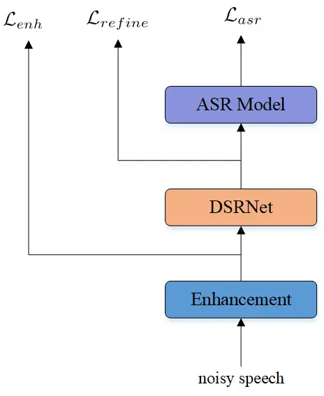
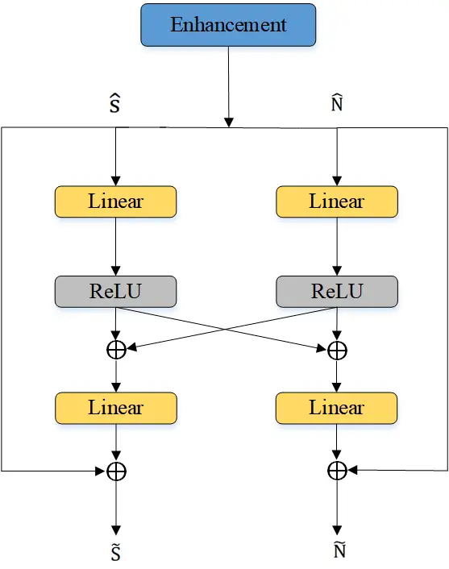
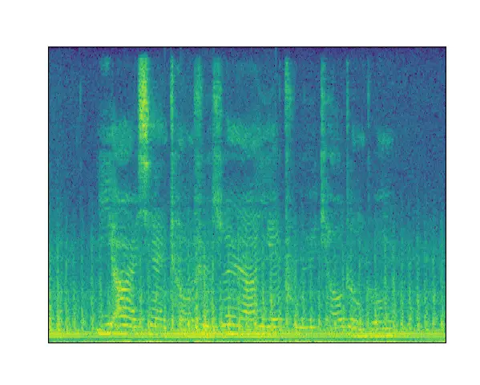
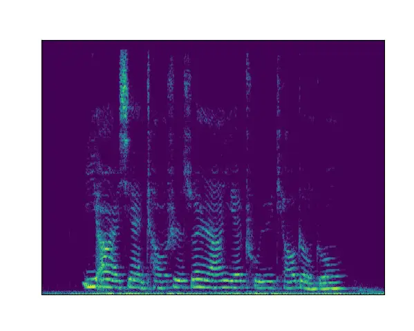
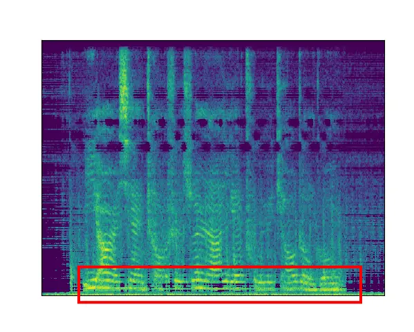
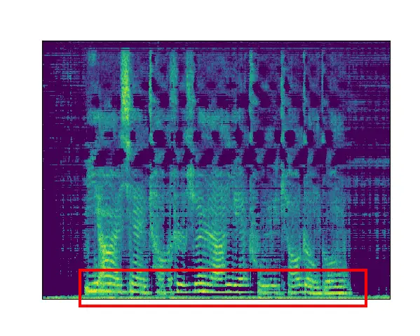
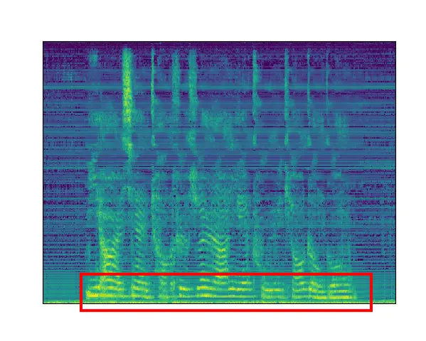

# speech and noise dual-stream spectrogram refine network with speech distortion loss for robust speech recognition

Haoyu Lu    Nan Li ^(†)^(†)thanks: \*Corresponding author    Tongtong
Song    Longbiao Wang    Jianwu Dang    Xiaobao Wang    Shiliang Zhang

###### Abstract

In recent years, the joint training of speech enhancement front-end and
automatic speech recognition (ASR) back-end has been widely used to
improve the robustness of ASR systems. Traditional joint training
methods only use enhanced speech as input for the back-end. However, it
is difficult for speech enhancement systems to directly separate speech
from input due to the diverse types of noise with different intensities.
Furthermore, speech distortion and residual noise are often observed in
enhanced speech, and the distortion of speech and noise is different.
Most existing methods focus on fusing enhanced and noisy features to
address this issue. In this paper, we propose a dual-stream spectrogram
refine network to simultaneously refine the speech and noise and
decouple the noise from the noisy input. Our proposed method can achieve
better performance with a relative 8.6$`\%`$ CER reduction.

###### Index Terms: 

robust speech recognition, residual noise, speech distortion, refine
network, joint training

^(†)^(†)address: ¹Tianjin Key Laboratory of Cognitive Computing and
Application,  
College of Intelligence and Computing, Tianjin University, Tianjin,
China

## 1 Introduction

Automatic speech recognition system has been widely applied on mobile
devices for human-machine communication. Recently, ASR systems with
end-to-end neural network architectures have developed rapidly \[1, 2\]
and achieved promising performance. Although significant progress has
been achieved in ASR on clean speech, the performance of ASR systems is
still far from desired in realistic scenarios. There are various types
of noise with different Signal-to-Noise Ratios(SNRs), which will sharply
degrade the performance of the ASR systems. Thus, speech recognition in
realistic scenarios remains a considerable challenge

Robust speech recognition has been widely studied to improve the
performance of ASR under complex scenes \[3, 4, 5\]. In \[6\], they made
an investigation of end-to-end models for robust speech recognition.
There are two mainstream methods for robust speech recognition. One
method is to augment the input data with various noises and
reverberation to generate multi-condition data \[7, 8\]. Subsequently,
the augmented data is fed to the end-to-end model. Another method is to
preprocess the input speech with speech enhancement techniques. The
existing works mainly use a two-stage approach to train a robust speech
recognition model. The input speech is first passed through a speech
enhancement (SE) module, and the enhanced speech is subsequently passed
through an end-to-end speech recognition model.



Figure 1: Block diagram of joint training framework.

Existing work \[9\] has shown that Long Short-Term Memory (LSTM) RNNs
can be used as a front-end for improving the noise robustness of robust
ASR system.

Joint training of the SE front-end and ASR back-end has been
investigated to improve ASR performance \[10\]. However, the speech
enhancement based on deep neural network often introduces speech
distortion and remains residual noise which may degrade the performance
of ASR models. In \[11\], they investigate the causes of ASR performance
degradation by decomposing the SE errors into noise and artifacts. To
alleviate the speech distortion, \[12, 13, 14\] dynamically combined the
noisy and enhanced features during training. In \[15\], they investigate
the over-suppression problem. \[16\] presents a technique to scale the
mask to limit speech distortion using an ASR-based loss in an end-to-end
fashion. In \[17\], they propose a spectrogram fusion (SF)-based
end-to-end robust ASR system, in which the mapping-based and
masking-based SE is simultaneously used as the front end. In \[18\],
they provide insight into the advantage of magnitude regularization in
the complex compressed spectral loss to trade off speech distortion and
noise reduction.

Although the existing joint training methods have greatly improved the
robustness of ASR, there are still some problems. Specifically, the
performance of ASR is affected by distortion or residual noise generated
in SE. Few existing works have investigated effective methods for
reducing distortion or residual noise. The main existing methods only
fuse the distorted spectrogram with the original noisy speech features.
There is still some residual noise in the fused features. In this paper,
we propose a speech and noise dual-stream spectrogram refine network
(DSRNet) to estimate speech distortion and residual noise. We build the
DSRNet to post-process the enhanced speech. Instead of only predicting
the source speech and ignoring the noise features, we reuse the
predicted features to refine the speech and noise simultaneously and
decouple the noise features from the noisy input. We introduce a
weighted MSE-based loss function that controls speech distortion and
residual noise separately.

[TABLE]

Table 1: The data structure of our dataset.

## 2 PROBLEM FORMULATION

Speech enhancement aims to remove the noise signals and estimate the
target speech from noisy input. The noisy speech can be represented as:

```math
{\rm y(t)=s(t)+n(t)} \tag{1}
```

where y(t), s(t), and n(t) denote the observed noisy signals, source
signals and noise signals, respectively. We use the X (t, f), S(t, f)
and N(t, f) as the corresponding magnitude spectrogram of noisy, source
and noise signals, which still satisfy this relation:

```math
{\rm Y(t,f)=S(t,f)+N(t,f)} \tag{2}
```

where (t,f) denotes the index of time-frequency(T-F) bins. We omit the
(t,f) in the rest of this paper. The noisy magnitude spectrogram Y is
used as the input of speech enhancement network. We formulate speech
enhancement task as predicting a time frequency masks between noisy and
clean spectrogram. The conventional speech enhancement can be
represented as follows:

```math
\displaystyle\rm{\displaystyle M=SE(Y)} \tag{3}
```

```math
\displaystyle\rm{\displaystyle\hat{S}=M\odot Y}
```

```math
\mathcal{L}_{enh}={\rm MSE(\hat{S},S)} \tag{4}
```

where M is the estimated mask, $`{\rm\hat{S}}`$ is the estimated
magnitude spectrogram of source signals and $`\odot`$ denotes
element-wise multiplication. Speech distortion or residual noise are
often observed in the enhanced speech. We assume that there are still
high correlations between the enhanced speech and predicted noise
features. We consider the predicted magnitude spectrogram of noise
signal $`{\rm\hat{N}}`$ is obtained by subtracting the enhanced signal
$`{\rm\hat{S}}`$ from the noisy signal Y. The predicted spectrogram
$`{\rm\hat{S}}`$ is composed of the source signal and the prediction
error $`{\rm E_{s}}`$ which is caused by speech distortion and residual
noise. And the predicted spectrogram $`{\rm\hat{N}}`$ is composed of
noise signal and the prediction error which may contain the missing
information from source signal.

```math
{\rm\hat{N}}={\rm Y-\hat{S}} \tag{5}
```

```math
{\rm\hat{S}}={\rm S+E_{s}} \tag{6}
```

```math
{\rm\hat{N}}={\rm N+E_{n}} \tag{7}
```

## 3 PROPOSED METHODS

### 3.1 Network Architecture

In this section, we discuss the details of the proposed method. We
propose a speech and noise dual-stream spectrogram refine network
(DSRNet) with a joint training framework to reduce speech distortion and
residual noise as shown in Figure 1. First, we feed noisy magnitude
spectrogram features to the LSTM mask-based SE module. Then the
estimated magnitude spectrogram $`{\rm\hat{S}}`$ and the predicted noise
magnitude spectrogram $`{\rm\hat{N}}`$ are fed to the DSRNet to generate
the refined magnitude spectrogram. We then extract 80-dim Fbank features
from the refined spectrograms as input to the ASR model.



Figure 2: Block diagram of spectrogram refine network.

### 3.2 Spectrogram Refine

| Model         | Joint Training | CER($`\%`$) |      |      |      |       |        | $`\alpha`$ | $`\beta`$ | $`\lambda`$ | Paras(M) |
| ------------- | -------------- | ----------- | ---- | ---- | ---- | ----- | ------ | ---------- | --------- | ----------- | -------- |
|               |                | -10dB       | -5dB | 0dB  | 5dB  | Avg   | Random |            |           |             |          |
| Transformer   |                | 39.7        | 26.7 | 19.3 | 14.8 | 25.13 | 23.9   | —          | —         | —           | 16.67    |
| SE+Trans      | No             | 46.2        | 30.5 | 21.3 | 15.4 | 28.35 | 26.3   | —          | —         | —           | 30.59    |
| SE+Trans      | Yes            | 35.0        | 23.1 | 16.6 | 13.0 | 21.93 | 20.8   | 300        | —         | —           | 30.59    |
| SE+DSRN+Trans | Yes            | 32.6        | 21.4 | 16.0 | 12.7 | 20.68 | 19.7   | 300        | 0         | —           | 30.85    |
| SE+DSRN+Trans | Yes            | 31.8        | 21.2 | 15.6 | 12.6 | 20.30 | 19.6   | 300        | 100       | 0.5         | 30.85    |
| SE+DSRN+Trans | Yes            | 31.4        | 20.7 | 15.4 | 12.6 | 20.03 | 19.2   | 300        | 100       | Eq.11       | 30.85    |

Table 2: CER results of the different methods on different test sets.

Figure 2 shows the block diagram of the proposed speech and noise
dual-stream spectrogram refine network. One stream computes the residual
value for speech, and the other stream computes the residual value for
noise. Then we use the residual values to refine the enhanced speech and
predicted noise, respectively.

#### 3.2.1 Dual-stream Spectrogram Refine Network

The dual-stream spectrogram refine network have two streams, one stream
refines the enhanced speech and the other stream refines the predicted
noise. They share the same network structure but have separate network
parameters. We use DSRNet to compute the residual values, denoted as
$`\Theta`$, which may contain over-suppression and missing information.
The residual values are added back to the spectrograms to counteract the
undesired noise or speech and recover the distorted part. The structure
of the DSRNet is shown in Figure 2. We can obtain the formulations as
follows:

```math
\displaystyle\rm{\displaystyle\Theta_{s}=W_{\hat{s}}(W_{s}\hat{S}+W_{n}\hat{N})+b_{\hat{s}}} \tag{8}
```

```math
\displaystyle\rm{\displaystyle\Theta_{n}=W_{\hat{n}}(W_{s}\hat{S}+W_{n}\hat{N})+b_{\hat{n}}}
```

```math
\displaystyle\rm{\displaystyle\tilde{S}=\hat{S}+\Theta_{s}} \tag{9}
```

```math
\displaystyle\rm{\displaystyle\tilde{N}=\hat{N}+\Theta_{n}}
```

where $`\rm\Theta_{s}`$ and $`\rm\Theta_{n}`$ are the residual values.
$`\rm W_{\hat{s}}`$, $`\rm W_{\hat{n}}`$, $`\rm W_{s}`$, and
$`\rm W_{n}`$ are the linear transformations, $`\rm b_{\hat{s}}`$ and
$`\rm b_{\hat{n}}`$ are the bias terms.

#### 3.2.2 Weighted Speech Distortion Loss

The distortion of the spectrogram is different for speech and noise.
Therefore, we propose a novel weighted speech distortion loss function
in which both speech estimation error and noise prediction error are
considered to overcome the distortion problem. The loss function
includes speech error term and noise error term. When the speech error
is greater, we focus more on the speech. When the noise error is
greater, we focus more on the noise.

```math
\displaystyle\rm{\displaystyle E_{\tilde{s}}=\sum\nolimits_{t,f}|S-\tilde{S}|} \tag{10}
```

```math
\displaystyle\rm{\displaystyle E_{\tilde{n}}=\sum\nolimits_{t,f}|N-\tilde{N}|}
```

Therefore, the proposed mean-squared-error based loss function enables
control of speech distortion and residual noise simultaneously. And the
weighting $`\lambda`$ of loss function is time-varying between batches.
Therefore, the loss function can be formulated as:

```math
\lambda={\rm\frac{E_{\tilde{s}}}{E_{\tilde{s}}+E_{\tilde{n}}}} \tag{11}
```

```math
\mathcal{L}_{refine}={\rm\lambda MSE(\tilde{S},S)+(1-\lambda)MSE(\tilde{N},N)} \tag{12}
```

#### 3.2.3 Joint training

We use a multi-task learning approach to jointly optimize the front-end
and back-end to improve speech recognition performance. The loss
function includes three terms. The weightings of speech enhancement and
refine network loss are $`\alpha`$ and $`\beta`$, respectively.

```math
\mathcal{L}=\mathcal{L}_{asr}+\alpha\mathcal{L}_{enh}+\beta\mathcal{L}_{refine} \tag{13}
```

## 4 EXPERIMENTS

### 4.1 Dataset

Our experiments are conducted on the open-source Mandarin speech corpus
AISHELL-1\[19\]. AISHELL-1 contains 400 speakers and more than 170 hours
of Mandarin speech data. The training set contains 120,098 utterances
from 340 speakers. The development set contains 14,326 utterances from
40 speakers. The test set contains 7176 utterances from 20 speakers. We
manually simulate noisy speech on the AISHELL-1 with 100 Nonspeech
Sounds noise dataset. We use the noise dataset to mix with the clean
data of AISHELL-1 with 4 different SNRs each -10dB, -5dB, 0dB and 5dB.
And we generate four SNRs test sets, and a random SNR test set. The
simulated data and noise data are released on Github¹¹ 1
https://github.com/manmushanhe/DSRNet-data for reference. The details
are shown in Table 1.

### 4.2 Experimental Setup

In the experiments, we implemented a joint training system using the
recipe in ESPnet\[20\] for AISHELL. The input waveform is converted into
STFT domain using a 512 window length with 128 hop length. The learning
rate is set to 0.001 and the warm-up step size is set to 30, 000. In the
SE module, the number of layers in the LSTM is two and the hidden size
is 1024. In the DSRNet, the input and output sizes of the linear layers
are 257. We use a Transformer based ASR model with 80-dim Log-Mel
features as input to the back-end. Hyperparameters $`\alpha`$ and
$`\beta`$ are 300 and 100 respectively. For fair comparison, the
training epoch is set to 70 for all experiments. When the strategy of
joint training is not used, we first pre-train the speech enhancement
model, and then freeze the parameters of the SE model to train the ASR
back-end with the ASR loss.

### 4.3 Results

#### 4.3.1 Evaluate the effectiveness of the proposed method

We first compare our method with different models, and the results are
shown in Table 2. In Table 2, “DSRN” denotes our proposed speech and
noise dual-stream spectrogram refine network. “SE+Trans” denotes the SE
front-end and ASR back-end model. As we can see, the performance of the
jointly trained model can be significantly improved. When there is no
joint training, we first train a SE model using the magnitude spectral
loss, and then freeze its parameters to train the ASR system. The final
objective of SE training and ASR training are different. SE is trained
on the magnitude spectral loss and ASR is trained on the classification
loss. There is a mismatch between SE and ASR. In the absence of joint
training, the SE parameters cannot be tuned according to the ASR loss.
The performance is bad. In the joint training, the SE network is not
only learned to produce more intelligible speech, it is also aimed to
generate features that is beneficial to recognition.

We conduct experiments to see how the result is affected by the
weighting of SE loss in the joint training. Table 3 reports the average
CER results on four SNRs test sets with different weightings of SE loss.
And we find that the weighting of SE loss has a significant impact on
the result. This may be because the loss of ASR is considerably greater
than that of SE. Experiments demonstrate that the performance of joint
training model strongly depends on the relative weighting between each
task’s loss. When we continue to increase the value of $`\alpha`$, we
find that the performance is no longer improving. There is an upper
bound on the performance of using only SE networks with magnitude
spectral loss. Therefore, we use the DSRNet with speech distortion loss
to counteract the distortions and artifacts that are generated during
SE.

Meanwhile, to evaluate the contribution of the DSRNet, we use the
SE+Trans joint training model as baseline. We set $`\beta`$ to 0 to
investigate the impact of the speech distortion loss function. The
results show that both the DSRNet and the loss function contribute to
the performance. And we set $`\rm\lambda`$ to 0.5 to investigate the
impact of the weight $`\lambda`$ in Eq.11. The results show that the
method of $`\lambda`$ computed based on Eq.11 is also effective.
Compared to the baseline approach, we achieve better performance with an
average relative 8.6$`\%`$ CER reduction on four SNRs test sets, only at
the cost of 0.26M parameters. The increase in model parameters and
computations is slight. We experimented with other values of $`\beta`$,
and in general, $`\beta`$ equal to 100 worked best, so we didn’t show it
in the table.

| Model    | loss weightings($`\alpha`$) | CER_Avg(%) |
| -------- | --------------------------- | ---------- |
| SE+Trans | 1                           | 41.53      |
|          | 50                          | 22.10      |
|          | 100                         | 22.15      |
|          | 200                         | 21.98      |
|          | 300                         | 21.93      |
|          | 400                         | 21.90      |

Table 3: CER results with different weightings.

#### 4.3.2 Visualization of Spectrograms

In order to further understand how the DSRNet works, we visualize the
spectrograms from different model, as shown in Figure 3. (a) is the
noisy spectrogram of simulated speech. (b) is the clean spectrogram of
clean speech. (c), (d) is the enhanced spectrogram in the baseline
system and the enhanced spectrogram in our method, respectively. And (e)
is the refined spectrogram in our method.

Existing studies show that speech content is mainly concentrated in the
low-frequency band of spectrograms. From (c) and (d), we see that part
information in the low-frequency band of enhanced spectrograms is
missing and distorted, which means an over-suppression problem caused by
SE. Comparing (d) and (e), we can observe that the low-frequency band of
the spectrogram is refined. The enhanced spectrograms could recover some
information in the low-frequency band with the help of the DSRNet. This
may mean the low-frequency band of spectrograms is more important for
the ASR. These results show that the DSRNet indeed helps improve ASR
performance and demonstrate the effectiveness of our method.

#### 4.3.3 Reference Systems

To evaluate the performance of the proposed method, we conduct
experiments on four different systems for comparison. Table 4 shows the
results of reference systems.

Cascaded SE and ASR System\[21\]: this paper jointly optimizes SE and
ASR only with ASR loss. They investigate how a system optimized based on
the ASR loss improves the speech enhancement quality on various
signal-level metrics. However, the results show that the cascaded system
tend to degrade the ASR performance.

GRF ASR System\[14\]: they propose a gated recurrent fusion (GRF) method
with a joint training framework for robust ASR. The GRF unit is used to
combine the noisy and enhanced features dynamically. We find that it
performs worse in our experiments.

Specaug ASR System\[7\]: they present a data augmentation method on the
spectrogram for robust speech recognition. The frequency mask and time
mask are applied to the input of the ASR model, which help the network
improve its modeling ability.

Conv-TasNet and ASR System\[22\]: this paper propose to combine a
separation front-end based on Convolutional Time domain Audio Separation
Network (Conv-TasNet) with an end-to-end ASR model. They jointly
optimize the network with the Scale-Invariant-Signal-to-Noise Ratio
(SI-SNR) loss and a multi-target loss for the ASR system.

| Model                      | CER_Avg(%) |
| -------------------------- | ---------- |
| Cascaded SE and ASR System | 29.05      |
| GRF ASR System             | 29.01      |
| Specaug ASR System         | 23.50      |
| Convtasnet and ASR System  | 22.35      |
| Our proposed System        | 20.03      |

Table 4: CER results of different methods.



(a) noisy



(b) clean



(c) baseline



(d) enhanced-our



(e) refined-our

Figure 3: Spectrograms from different methods. (a)noisy spectrogram.
(b)clean spectrogram. (c)enhanced spectrogram from baseline. (d)enhanced
spectrogram from our method. (e)refined spectrogram from our method.

## 5 CONCLUSION

In this paper, we explored the effect of weights of loss function on ASR
performance. Experiment results show that the performance of joint
training systems highly depends on the relative weights of each loss and
the speech enhancement network will introduce speech distortion. We
proposed a lightweight speech and noise dual-stream spectrogram refine
network with a joint training framework for reducing speech distortion.
The DSRNet estimate the residual values by reusing the enhanced speech
and predicted noise, which can counteract the undesired noise and
recover the distorted speech. We designed a weighted speech distortion
loss to control of speech distortion and residual noise simultaneously.
Moreover, the proposed method is simple to implement and introduces a
few computational overheads. Final results show that the proposed method
performs better with a relative 8.6$`\%`$ CER reduction.

## 6 ACKNOWLEDGEMENTS

This work was supported in part by the National Natural Science
Foundation of China under Grant 62176182 and Alibaba Group through the
Alibaba Innovative Research Program.

## References

- \[1\] Linhao Dong, Shuang Xu, and Bo Xu, “Speech-transformer: a
  no-recurrence sequence-to-sequence model for speech recognition,” in
  2018 IEEE International Conference on Acoustics, Speech and Signal
  Processing (ICASSP). IEEE, 2018, pp. 5884--5888.
- \[2\] Shinji Watanabe, Takaaki Hori, Suyoun Kim, John R Hershey, and
  Tomoki Hayashi, “Hybrid ctc/attention architecture for end-to-end
  speech recognition,” IEEE Journal of Selected Topics in Signal
  Processing, vol. 11, no. 8, pp. 1240–1253, 2017.
- \[3\] Wangyou Zhang, Christoph Boeddeker, Shinji Watanabe, Tomohiro
  Nakatani, Marc Delcroix, Keisuke Kinoshita, Tsubasa Ochiai, Naoyuki
  Kamo, Reinhold Haeb-Umbach, and Yanmin Qian, “End-to-end
  dereverberation, beamforming, and speech recognition with improved
  numerical stability and advanced frontend,” in ICASSP 2021-2021 IEEE
  International Conference on Acoustics, Speech and Signal Processing
  (ICASSP). IEEE, 2021, pp. 6898–6902.
- \[4\] Chen Chen, Nana Hou, Yuchen Hu, Shashank Shirol, and Eng Siong
  Chng, “Noise-robust speech recognition with 10 minutes unparalleled
  in-domain data,” in ICASSP 2022-2022 IEEE International Conference on
  Acoustics, Speech and Signal Processing (ICASSP). IEEE, 2022, pp.
  4298–4302.
- \[5\] Valentin Mendelev, Tina Raissi, Guglielmo Camporese, and Manuel
  Giollo, “Improved robustness to disfluencies in rnn-transducer based
  speech recognition,” in ICASSP 2021-2021 IEEE International Conference
  on Acoustics, Speech and Signal Processing (ICASSP). IEEE, 2021, pp.
  6878–6882.
- \[6\] Archiki Prasad, Preethi Jyothi, and Rajbabu Velmurugan, “An
  investigation of end-to-end models for robust speech recognition,” in
  ICASSP 2021-2021 IEEE International Conference on Acoustics, Speech
  and Signal Processing (ICASSP). IEEE, 2021, pp. 6893–6897.
- \[7\] Daniel S. Park, William Chan, Yu Zhang, Chung-Cheng Chiu, Barret
  Zoph, Ekin D. Cubuk, and Quoc V. Le, “SpecAugment: A Simple Data
  Augmentation Method for Automatic Speech Recognition,” in Proc.
  Interspeech 2019, 2019, pp. 2613–2617.
- \[8\] Pablo Peso Parada, Agnieszka Dobrowolska, Karthikeyan Saravanan,
  and Mete Ozay, “pmct: Patched multi-condition training for robust
  speech recognition,” arXiv e-prints, pp. arXiv–2207, 2022.
- \[9\] Felix Weninger, Hakan Erdogan, Shinji Watanabe, Emmanuel
  Vincent, Jonathan Le Roux, John R Hershey, and Björn Schuller, “Speech
  enhancement with lstm recurrent neural networks and its application to
  noise-robust asr,” in International conference on latent variable
  analysis and signal separation. Springer, 2015, pp. 91–99.
- \[10\] Duo Ma, Nana Hou, Haihua Xu, Eng Siong Chng, et al.,
  “Multitask-based joint learning approach to robust asr for radio
  communication speech,” in 2021 Asia-Pacific Signal and Information
  Processing Association Annual Summit and Conference (APSIPA ASC).
  IEEE, 2021, pp. 497–502.
- \[11\] Kazuma Iwamoto, Tsubasa Ochiai, Marc Delcroix, Rintaro
  Ikeshita, Hiroshi Sato, Shoko Araki, and Shigeru Katagiri, “How bad
  are artifacts?: Analyzing the impact of speech enhancement errors on
  ASR,” in Proc. Interspeech 2022, 2022, pp. 5418–5422.
- \[12\] Yuchen Hu, Nana Hou, Chen Chen, and Eng Siong Chng,
  “Interactive feature fusion for end-to-end noise-robust speech
  recognition,” in ICASSP 2022-2022 IEEE International Conference on
  Acoustics, Speech and Signal Processing (ICASSP). IEEE, 2022, pp.
  6292–6296.
- \[13\] Xuyi Zhuang, Lu Zhang, Zehua Zhang, Yukun Qian, and Mingjiang
  Wang, “Coarse-grained attention fusion with joint training framework
  for complex speech enhancement and end-to-end speech recognition,”
  Proc. Interspeech 2022, pp. 3794–3798, 2022.
- \[14\] Cunhang Fan, Jiangyan Yi, Jianhua Tao, Zhengkun Tian, Bin Liu,
  and Zhengqi Wen, “Gated recurrent fusion with joint training framework
  for robust end-to-end speech recognition,” IEEE/ACM Transactions on
  Audio, Speech, and Language Processing, vol. 29, pp. 198–209, 2020.
- \[15\] Quan Wang, Ignacio Lopez Moreno, Mert Saglam, Kevin Wilson,
  Alan Chiao, Renjie Liu, Yanzhang He, Wei Li, Jason Pelecanos, Marily
  Nika, et al., “Voicefilter-lite: Streaming targeted voice separation
  for on-device speech recognition,” arXiv preprint
  arXiv:2009.04323, 2020.
- \[16\] Arun Narayanan, James Walker, Sankaran Panchapagesan, Nathan
  Howard, and Yuma Koizumi, “Mask scalar prediction for improving robust
  automatic speech recognition,” arXiv preprint arXiv:2204.12092, 2022.
- \[17\] Hao Shi, Longbiao Wang, Sheng Li, Cunhang Fan, Jianwu Dang, and
  Tatsuya Kawahara, “Spectrograms fusion-based end-to-end robust
  automatic speech recognition,” in 2021 Asia-Pacific Signal and
  Information Processing Association Annual Summit and Conference
  (APSIPA ASC). IEEE, 2021, pp. 438–442.
- \[18\] Sebastian Braun and Hannes Gamper, “Effect of noise suppression
  losses on speech distortion and asr performance,” in ICASSP 2022-2022
  IEEE International Conference on Acoustics, Speech and Signal
  Processing (ICASSP). IEEE, 2022, pp. 996–1000.
- \[19\] Hui Bu, Jiayu Du, Xingyu Na, Bengu Wu, and Hao Zheng,
  “Aishell-1: An open-source mandarin speech corpus and a speech
  recognition baseline,” in 2017 20th conference of the oriental chapter
  of the international coordinating committee on speech databases and
  speech I/O systems and assessment (O-COCOSDA). IEEE, 2017, pp. 1–5.
- \[20\] Shinji Watanabe, Takaaki Hori, Shigeki Karita, Tomoki Hayashi,
  Jiro Nishitoba, Yuya Unno, Nelson Enrique Yalta Soplin, Jahn Heymann,
  Matthew Wiesner, Nanxin Chen, et al., “Espnet: End-to-end speech
  processing toolkit,” arXiv preprint arXiv:1804.00015, 2018.
- \[21\] Aswin Shanmugam Subramanian, Xiaofei Wang, Murali Karthick
  Baskar, Shinji Watanabe, Toru Taniguchi, Dung Tran, and Yuya Fujita,
  “Speech enhancement using end-to-end speech recognition objectives,”
  in 2019 IEEE Workshop on Applications of Signal Processing to Audio
  and Acoustics (WASPAA). IEEE, 2019, pp. 234–238.
- \[22\] Thilo von Neumann, Keisuke Kinoshita, Lukas Drude, Christoph
  Boeddeker, Marc Delcroix, Tomohiro Nakatani, and Reinhold Haeb-Umbach,
  “End-to-end training of time domain audio separation and recognition,”
  in ICASSP 2020-2020 IEEE International Conference on Acoustics, Speech
  and Signal Processing (ICASSP). IEEE, 2020, pp. 7004–7008.
