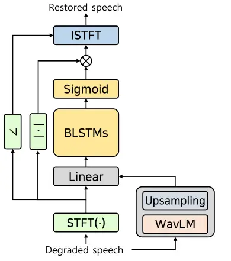
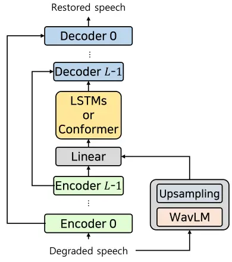
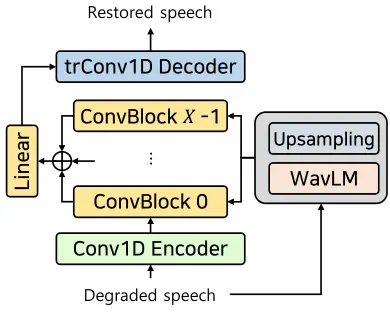
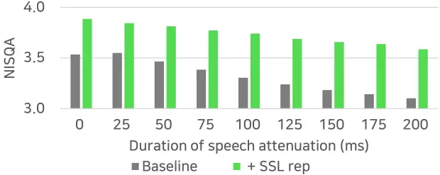
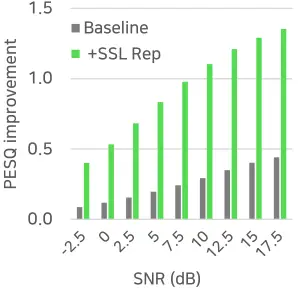
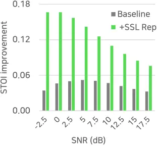

# An empirical study on speech restoration guided by self-supervised speech representation

Jaeuk Byun    Youna Ji    Soo-Whan Chung    Soyeon Choe    Min-Seok Choi

###### Abstract

Enhancing speech quality is an indispensable yet difficult task as it is
often complicated by a range of degradation factors. In addition to
additive noise, reverberation, clipping, and speech attenuation can all
adversely affect speech quality. Speech restoration aims to recover
speech components from these distortions. This paper focuses on
exploring the impact of self-supervised speech representation learning
on the speech restoration task. Specifically, we employ speech
representation in various speech restoration networks and evaluate their
performance under complicated distortion scenarios. Our experiments
demonstrate that the contextual information provided by the
self-supervised speech representation can enhance speech restoration
performance in various distortion scenarios, while also increasing
robustness against the duration of speech attenuation and mismatched
test conditions.

###### Index Terms: 

Speech restoration, self-supervised learning, speech representation,
speech enhancement, bandwidth extension

^(†)^(†)address: NAVER Cloud Corporation, Seongnam, South Korea

## 1 Introduction

Speech is an intuitive and efficient means of human communication.
However, the speech signal is often affected by various environmental
factors, such as noise, interference, room reverberation, low-quality
devices, interruptions in acoustic channels, packet loss, and jitters.
To mitigate these degradation factors, numerous studies have attempted
to address single-distortion issues, such as denoising \[1, 2\],
dereverberation \[3\], declipping \[4\], and bandwidth extension \[5,
6\]. Nevertheless, scenarios with multiple simultaneous distortions have
received less attention, despite being the most practical case.

Speech restoration is a challenging task that aims to recover speech
components from various degradation factors. Recent approaches employing
deep learning techniques, such as adversarial training \[7, 8, 9\] and
diffusion methods \[10, 11\], have gradually addressed this problem by
considering multiple distortion scenarios. Another approach to speech
restoration is to leverage additional information from different
modalities. Many methods have utilized linguistic representations from
text and visual cues to predict missing speech components \[12, 13\].
However, these methods typically require text transcriptions or video
recordings corresponding to speech signals, which are often
inaccessible. In recent years, self-supervised learning (SSL) methods
have shown promising results on various recognition tasks by leveraging
speech representations from a massive amount of unlabelled data \[14,
15, 16\]. Several studies have adopted this representation for speech
enhancement tasks, indicating the potential to improve enhancement
performance, primarily targeting the denoising task \[17, 18, 19\].

This paper examines the impact of SSL representation on speech
restoration. We assume that SSL models, pre-trained for masked
prediction, provide well-contextualized features that can be used as
conditioning signals to restore speech. We evaluate the performance of
these features on speech restoration tasks under various lengths of
speech attenuation, out-of-domain generalization, and signal-to-noise
(SNR) conditions. Our results demonstrate that incorporating SSL
features dramatically improves the performance of existing generation
networks, especially for long attenuation and unseen test conditions.

## 2 Speech restoration with SSL representations

(a) BLSTM

(b) DEMUCS and SE-Conformer

(c) Conv-TasNet

Figure 1: Structures for backbone network utilizing SSL representation.

### 2.1 SSL based speech representation models

Self-supervised learning methods aim to learn useful data
representations without relying on human annotations. Recently, these
methods have demonstrated remarkable results on various speech-related
tasks such as automatic speech recognition \[16\], speaker
recognition \[15\], and emotion recognition \[14\]. One prominent
example is the work by \[14\], where the model is trained to predict the
pseudo-labels of masked regions using unmasked speech parts. By
leveraging this pre-training task, the model learns to capture the
global structure and long-term dependencies of speech signals. Another
noteworthy approach is WavLM \[15\], a variant of HuBERT \[20\] that
jointly learns masked speech prediction and denoising during
pre-training. This method has achieved remarkable performance on the
SUPERB challenge \[21\].

### 2.2 Problem formulation

We expect that incorporating contextualized information into speech
restoration, particularly in recovering speech components lost due to
various degradation factors such as clipping, limited bandwidth, and
attenuation, will be beneficial since training objectives in \[15, 16,
22\] encourage models to capture the global structure of the signal
\[17, 18\]. We define the degraded speech signal $`x`$ as
$`x=f\left(s\right)+n\in{\mathbb{R}^{T}}`$, where $`f`$ represents
various degradation factors, and $`s`$ and $`n`$ are the original speech
and noise signals, respectively. The goal of speech restoration is to
find a mapping function $`g:{\mathbb{R}^{T}}\to{\mathbb{R}^{T}}`$ that
transforms the degraded speech signal $`x`$ into a high-quality restored
speech signal $`\hat{s}`$. To achieve this, we utilize the SSL
representation as a conditioning signal for the speech restoration
network $`g`$, and we formulate the problem as
$`\hat{s}=g\left({x|h\left(x\right)}\right)`$, where $`h`$ represents
the SSL network.

## 3 Network structures utilizing SSL representation

In this section, we present various approaches that utilize SSL
representations for speech restoration. We focus on the most prominent
models and provide detailed explanations in the following subsections.
We evaluate their effectiveness in the experiments and conduct a
comprehensive analysis of their performance in the next section.

### 3.1 Spectral mask estimation

In speech enhancement, spectral mask estimation in the time-frequency
domain is a common approach that attenuates the magnitude spectrogram
using the estimated ratio mask but neglects the distorted phase
information. This method is effective for noise and interference that
are modeled as additive relationships. In \[17\], SSL representations
are incorporated into this mask estimation method as shown in Figure
 1(a). A simple bi-directional recurrent neural network (BLSTM) is
designed where the SSL representation is injected before the BLSTM layer
to integrate the degraded speech feature and its corresponding SSL
feature. The model’s noise suppression performance has improved compared
to previous models.

### 3.2 Raw waveform estimation

In recent years, deep learning has enabled the restoration of signals in
the waveform domain. These methods typically involve a 1-dimensional
convolution layer with a large kernel and stride to simulate spectral
analysis in STFT, while a transposed convolution layer is used to
synthesize acoustic embedding into the waveform. This approach reduces
the artifacts caused by STFT, resulting in signals with improved
perceptual quality.

In \[19\], the authors used SSL representations on the DEMUCS structure
to improve the overall quality of speech enhancement, demonstrating
superiority over phonetic representations. We applied the conditioning
method from \[19\] to both DEMUCS and SE-Conformer models as shown in
Figure  1(b). Both models have the same U-Net-like structure except for
the Conformer bottleneck in SE-Conformer. SSL representations are
incorporated with distorted speech features before the bottleneck for
both models, as this approach showed the best performance among
methodologies. In addition, we investigated the Conv-TasNet model for
speech enhancement in the waveform, with several modifications for
speech restoration based on \[23\]. In our approach, the SSL embedding
is integrated with the inputs of the first convolution layer in every
ConvBlock of Conv-TasNet, as illustrated in Figure  1(c), where a
ConvBlock is comprised of a point-wise convolution, a depth-wise
convolution, and a residual connection.

## 4 Experiments

### 4.1 Dataset

We used the VCTK-DEMAND dataset \[24\], which is a widely used benchmark
for speech enhancement. The dataset comprises premixed noisy speech and
includes a training set of 11,572 utterances from 28 speakers mixed with
noise samples at 4 SNRs (0, 5, 10, and 15 dB). The test set contains 824
utterances from 1 male and 1 female speaker with 4 SNRs (2.5, 7.5, 12.5,
and 17.5 dB). Speakers p286 and p287 were separated from the training
set and used for validation as in \[1\]. We degraded the VCTK-DEMAND
test set by simultaneously applying several speech degradation factors,
which are described in the next subsection. We evaluated speech quality
using PESQ¹¹ 1 https://github.com/schmiph2/pysepm \[25\] and NISQA²² 2
https://github.com/gabrielmittag/NISQA \[26\], and intelligibility using
STOI1 \[27\] with open-source toolkits.

### 4.2 Speech degradation factors

We evaluated 4 types of speech degradation factors: background noise,
audio clipping, limited bandwidth, and speech attenuation. All these
factors were applied simultaneously in all evaluations, unless otherwise
stated.

Background Noise We followed the specifications of the VCTK-DEMAND
dataset described in Sec. 4.1.

Clipping It occurs when the input signal has excessive energy causing
the audio codec to be unable to represent the amplitude adequately. To
simulate clipping, we randomly limited the dynamic range of the
amplitude from 0.06 to 0.9 in ratio.

Limited bandwidth It is often caused by coding protocols, transmission
channels, or room acoustics, leading to significant spectral corruption
and a restricted frequency band range. To simulate limited bandwidth, we
applied a low-pass filter with a random cutoff frequency between 2 to 8
kHz.

Attenuation It can occur when the power of the speech signal is suddenly
and significantly reduced, potentially due to interruptions in the
acoustic channels. In our experiments, we attenuated speech amplitude by
applying random gains ranging from 0 to 0.01 and random durations
ranging from 10 to 50 ms to several (maximum 20) random regions.

### 4.3 Implementation detail

We trained all the compared models within our speech restoration
framework, ensuring that our models obtained similar scores to those
reported in \[1, 17, 19\] using the original configurations. In our
experiments, we adjusted the depth ($`L`$) of the U-Net structure to 4
to align the temporal resolution with SSL representations and set the
number of channels in the first convolution layer to 48. For the
remaining model parameters, we followed the original configurations.

To utilize SSL representation, we used the pre-trained WavLM-Large
model \[15\], which has shown good results among compared SSL methods
in \[18\]. We followed the setup of SUPERB \[21\] and froze the
parameters of the SSL model. We took the weighted average of
representations from all transformer encoder layers with learnable
weights to yield the final SSL embedding. To match the frame rates of
SSL with those of the intermediate representation of the backbone
network, we repeated frames. For conditioning with SSL, we simply
concatenated the intermediate features with the SSL representation, as
we found no significant difference compared to applying \[28\].

### 4.4 Results

| Model        | Settings |     | PESQ | NISQA | STOI  |
| ------------ | -------- | --- | ---- | ----- | ----- |
|              | Aug      | SSL |      |       |       |
| BLSTM        |          |     | 1.64 | 2.18  | 0.869 |
|              | ✓        |     | 1.86 | 2.42  | 0.882 |
|              | ✓        | ✓   | 2.00 | 2.50  | 0.892 |
| DEMUCS       |          |     | 1.65 | 2.11  | 0.870 |
|              | ✓        |     | 2.52 | 3.66  | 0.926 |
|              | ✓        | ✓   | 2.59 | 3.51  | 0.930 |
| SE-Conformer |          |     | 1.64 | 2.22  | 0.868 |
|              | ✓        |     | 2.61 | 3.66  | 0.929 |
|              | ✓        | ✓   | 2.90 | 3.86  | 0.943 |
| Conv-TasNet  |          |     | 1.74 | 2.26  | 0.876 |
|              | ✓        |     | 2.60 | 3.60  | 0.930 |
|              | ✓        | ✓   | 2.79 | 3.87  | 0.936 |

Table 1: Speech restoration results on VCTK-DEMAND with several
degradation factors (noise, clipping, LPF, and attenuation). Various
network structures are compared according to the additional augmentation
and the use of SSL representation.

|           |         |       |       |       |       |       |
| --------- | ------- | ----- | ----- | ----- | ----- | ----- |
|           | Measure | Noise | Clip  | LPF   | Att.  | All   |
| Base      | PESQ    | 2.88  | 3.61  | 3.81  | 3.76  | 2.61  |
|           | STOI    | 0.944 | 0.971 | 0.982 | 0.981 | 0.929 |
| +SSL rep. | PESQ    | 3.08  | 3.77  | 3.96  | 3.93  | 2.90  |
|           | STOI    | 0.952 | 0.978 | 0.988 | 0.987 | 0.943 |

Table 2: Speech restoration results of SE-Conformer for
single-distortion cases with and without SSL representation.

#### 4.4.1 Effect of model structure

Table 1 summarizes the speech restoration performance on VCTK-DEMAND
with several degradation factors. For each model, we compared three
progressive settings: 1) baseline configuration, 2) additional
augmentation of training data with the speech degradation factors
(clipping, limited bandwidth, and attenuation) described in Section 4.2,
with probabilities of 0.25, 0.5, and 0.8, respectively, and 3) adding
the condition to 2) with SSL representation. The results show that the
baseline configuration is ineffective in dealing with unseen types of
degradation factors, while it performs well when the degradation factors
are given as additional augmentations during training, except for the
masking-based BLSTM. This is because the masking approach only
suppresses components in the input speech signal, mainly for denoising
tasks, and is limited in recovering missing components. The other three
waveform-generation models show moderate results, which are further
improved when applied with SSL representation in most cases. Among the
various model structures, SE-Conformer showed the most significant
improvements, with PESQ improvement of 0.29, NISQA improvement of 0.20,
and STOI improvement of 0.014 when using SSL representation. A possible
explanation is that the global context captured by SSL representation
may help to provide a better attention map in the Conformer blocks than
the intermediate representation of the convolutional encoder alone,
resulting in better signal estimation.

We also evaluated SE-Conformer with and without SSL representation under
single distortion scenarios, each containing only one individual
degradation factor, as shown in Table. 2. The results show that the use
of SSL representation improves both PESQ and STOI for all individual
degradation factors. Furthermore, the improvement is most pronounced in
the scenario with multiple simultaneous distortions.

#### 4.4.2 Effect of duration for speech attenuation

Figure 2: Performance comparison in terms of NISQA using SE-Conformer
with and without SSL representation according to the length of speech
attenuation.

We hypothesized that the SSL representation trained for masked
prediction contains contextualized speech information, which could
enhance the restoration network’s robustness against longer duration of
speech attenuation. To verify this hypothesis, we evaluated the
SE-Conformer models with various lengths of attenuation from 0 to 200
ms, while keeping all other degradation parameters fixed. The NISQA
scores are compared in Figure 2. The results suggest that the
performance improvement by SSL representation becomes greater for longer
speech attenuation. It is noteworthy that the models were trained using
a database with only 10-50 ms of attenuation, and the test condition is
harder and does not match the training data.

#### 4.4.3 Performance on mismatched data

(a) PESQ

(b) STOI

Figure 3: Speech restoration performance on TIMIT-MUSAN (out of domain)
dataset at various unseen SNRs using SE-Conformer models trained on
VCTK-DEMAND dataset.

SSL’s generalization ability is a strong point, as it can be trained on
a large amount of data without labels \[18\]. We evaluated the
generalization ability of SSL representations for speech restoration by
testing VCTK-trained SE-Conformer models on 1000 degraded mixtures from
unseen data domains, using TIMIT \[29\] and MUSAN \[30\] datasets. The
signals were mixed at 9 equally spaced SNR conditions in
$`\left[-2.5,17.5\right]`$. The evaluation focused on the PESQ and STOI
improvements from the noisy mixture, which are summarized in Figure 3.

In our experiments, we observed that incorporating SSL representation
leads to more robust performance in mismatched conditions, as indicated
by larger improvements in both PESQ and STOI compared to the baseline.
The STOI improvements were particularly pronounced for lower SNRs. We
found that many of the severely distorted samples in the baseline result
were recovered by incorporating SSL representation, possibly due to
better preservation of the phonetic structure with contextual
information from SSL. However, the trend for PESQ was the opposite, with
larger improvements in high SNR. This is likely because SSL
representation lacks local and fine structure information that is
necessary for high-quality restoration, as pointed out in \[17, 18\].

## 5 Conclusions

We investigated the effectiveness of SSL representation on speech
restoration problem with multiple simulated distortions. We compared one
spectral mask estimation and three waveform generation models
conditioned on SSL representation and provided analysis from multiple
perspectives. The experimental results show that incorporating SSL
representation can improve the performance of existing speech
restoration systems on various quality measures in most cases. The
waveform generation networks with SSL representation exhibit robust
performance for various duration of speech attenuation and better
intelligibility recovery for out-of-domain data at low SNRs. Dramatic
improvements in speech quality can also be found when finer local
structures are provided. In the future, we plan to further investigate
ways to maximize generalization capability in real recording
environments.

## References

- \[1\] A. Defossez et al., “Real time speech enhancement in the
  waveform domain,” in Proc. Interspeech 2020, 2020, pp. 3291--3295.
- \[2\] E. Kim and H. Seo, “Se-conformer: Time-domain speech
  enhancement using conformer,” in Proc. Interspeech 2021, 2021, pp.
  2736–2740.
- \[3\] K. Kinoshita et al., “Neural network-based spectrum estimation
  for online wpe dereverberation,” in Proc. Interspeech 2017, 2017, pp.
  384–388.
- \[4\] P. Záviška et al., “A survey and an extensive evaluation of
  popular audio declipping methods,” IEEE Journal of Selected Topics in
  Signal Processing, vol. 15, no. 1, pp. 5–24, 2020.
- \[5\] A. Gupta et al., “Speech bandwidth extension with wavenet,” in
  Proc. of WASPAA. 2019, IEEE.
- \[6\] S. Han and J. Lee, “Nu-wave 2: A general neural audio
  upsampling model for various sampling rates,” in Proc. Interspeech
  2022, 2022, pp. 4401–4405.
- \[7\] H. Liu et al., “Voicefixer: A unified framework for
  high-fidelity speech restoration,” in Proc. Interspeech 2022, 2022,
  pp. 4232–4236.
- \[8\] P. Andreev et al., “Hifi++: a unified framework for neural
  vocoding, bandwidth extension and speech enhancement,”
  arXiv:2203.13086, 2022.
- \[9\] S.-W. Fu et al., “Metricgan: Generative adversarial networks
  based black-box metric scores optimization for speech enhancement,” in
  Proc. of ICML, 2019.
- \[10\] J. Serrà et al., “Universal speech enhancement with
  score-based diffusion,” arXiv:2206.03065, 2022.
- \[11\] J. Richter et al., “Speech enhancement and dereverberation
  with diffusion-based generative models,” arXiv:2208.05830, 2022.
- \[12\] Z. Borsos et al., “Speechpainter: Text-conditioned speech
  inpainting,” in Proc. Interspeech 2022, 2022, pp. 431–435.
- \[13\] G. Morrone et al., “Audio-visual speech inpainting with deep
  learning,” in Proc. of ICASSP, 2021, pp. 6653–6657.
- \[14\] A. Baevski et al., “wav2vec 2.0: A framework for
  self-supervised learning of speech representations,” in NeurIPS, 2020.
- \[15\] S. Chen et al., “Wavlm: Large-scale self-supervised
  pre-training for full stack speech processing,” IEEE Journal of
  Selected Topics in Signal Processing, vol. 16, no. 6, pp.
  1505–1518, 2022.
- \[16\] A. Baevski et al., “Data2vec: A general framework for
  self-supervised learning in speech, vision and language,” in Proc. of
  ICML, 2022.
- \[17\] K.-H. Hung et al., “Boosting self-supervised embeddings for
  speech enhancement,” in Proc. Interspeech 2022, 2022, pp. 186–190.
- \[18\] Z. Huang et al., “Investigating self-supervised learning for
  speech enhancement and separation,” in Proc. of ICASSP, 2022, pp.
  6837–6841.
- \[19\] O. Tal et al., “A systematic comparison of phonetic aware
  techniques for speech enhancement,” in Proc. Interspeech 2022, 2022,
  pp. 1193–1197.
- \[20\] W.-N. Hsu et al., “Hubert: Self-supervised speech
  representation learning by masked prediction of hidden units,”
  IEEE/ACM Transactions on Audio Speech and Language Processing, vol.
  29, pp. 3451–3460, 2021.
- \[21\] T.-h. Feng et al., “Superb@ slt 2022: Challenge on
  generalization and efficiency of self-supervised speech representation
  learning,” arXiv:2210.08634, 2022.
- \[22\] S. Schneider et al., “wav2vec: Unsupervised pre-training for
  speech recognition,” in Proc. Interspeech 2019, 2019, pp. 3465–3469.
- \[23\] J. Chen et al., “On synthesis for supervised monaural speech
  separation in time domain,” in Proc. Interspeech 2020, 2020, pp.
  2627–2631.
- \[24\] C. Valentini-Botinhao et al., “Noisy speech database for
  training speech enhancement algorithms and tts models,” University of
  Edinburgh. School of Informatics. Centre for Speech Technology
  Research (CSTR), 2017.
- \[25\] A. W. Rix et al., “Perceptual evaluation of speech quality
  (pesq)-a new method for speech quality assessment of telephone
  networks and codecs,” in Proc. of ICASSP, 2001, pp. 749–752 vol.2.
- \[26\] G. Mittag et al., “Nisqa: A deep cnn-self-attention model for
  multidimensional speech quality prediction with crowdsourced
  datasets,” in Proc. Interspeech, 2021.
- \[27\] C. H. Taal et al., “A short-time objective intelligibility
  measure for time-frequency weighted noisy speech,” in Proc. of ICASSP,
  2010, pp. 4214–4217.
- \[28\] E. Perez et al., “Film: Visual reasoning with a general
  conditioning layer,” in AAAI, 2018.
- \[29\] J. S. Garofolo, “Timit acoustic phonetic continuous speech
  corpus,” Linguistic Data Consortium, 1993.
- \[30\] D. Snyder et al., “Musan: A music, speech, and noise corpus,”
  arXiv:1510.08484, 2015.
