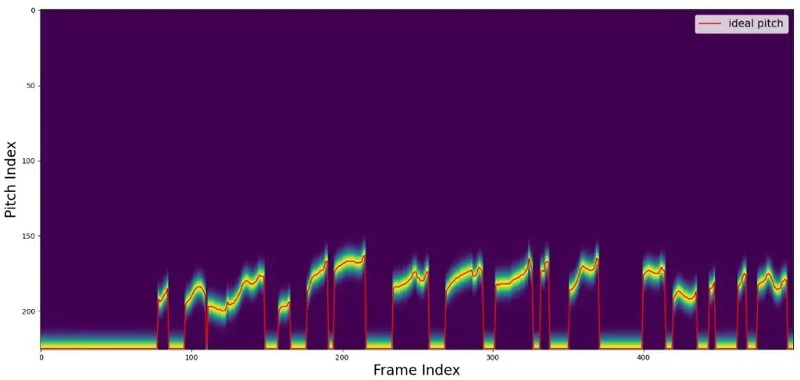
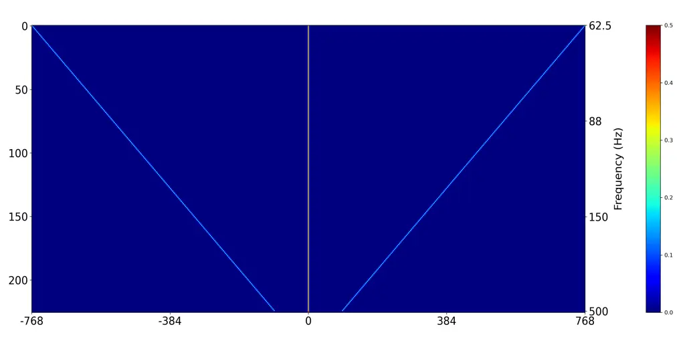
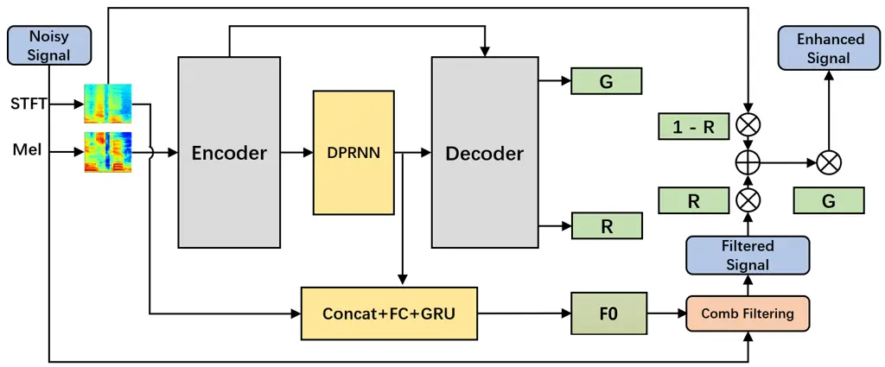
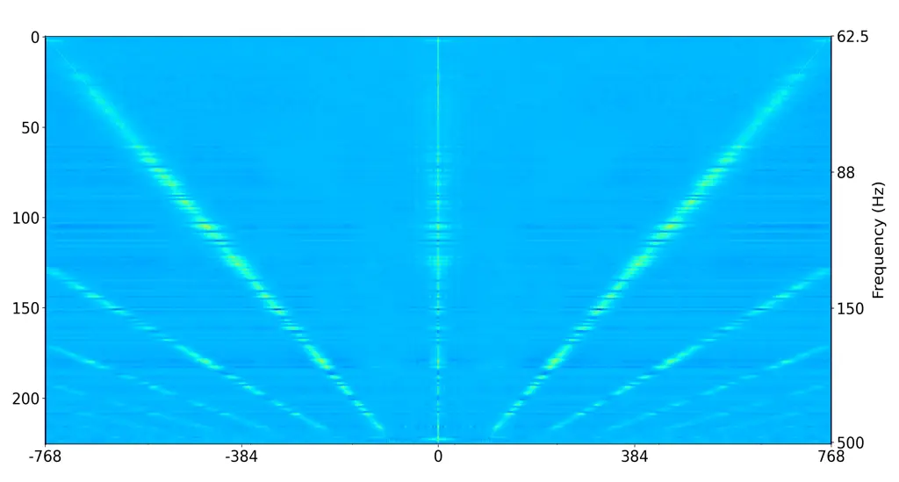

# Harmonic enhancement using learnable comb filter for light-weight full-band speech enhancement model

Xiaohuai Le^(1,2), Tong Lei^(1,3), Li Chen², Yiqing Guo², Chao He²,
Cheng Chen²,  
Xianjun Xia², Hua Gao², Yijian Xiao², Piao Ding², Shenyi Song², Jing
Lu^(1,3)

###### Abstract

With fewer feature dimensions, filter banks are often used in
light-weight full-band speech enhancement models. In order to further
enhance the coarse speech in the sub-band domain, it is necessary to
apply a post-filtering for harmonic retrieval. The signal
processing-based comb filters used in RNNoise and PercepNet have limited
performance and may cause speech quality degradation due to inaccurate
fundamental frequency estimation. To tackle this problem, we propose a
learnable comb filter to enhance harmonics. Based on the sub-band model,
we design a DNN-based fundamental frequency estimator to estimate the
discrete fundamental frequencies and a comb filter for harmonic
enhancement, which are trained via an end-to-end pattern. The
experiments show the advantages of our proposed method over PecepNet and
DeepFilterNet.

^(†)^(†)address: ¹Key Laboratory of Modern Acoustics, Nanjing
University, Nanjing 210093, China  
²RTC Lab, ByteDance, China  
³NJU-Horizon Intelligent Audio Lab, Horizon Robotics, Beijing 100094,
China^(†)^(†)email: {xiaohuaile, tonglei}@smail.nju.edu.cn,
{chenli.cloud, guoyiqing, hechao.12345678, chencheng.c, gaohua.karl,
lindanfeng, dingpiao, songshenyi}@bytedance.com,
xxjpjj@mail.ustc.edu.cn, lujing@nju.edu.cn

Index Terms: Comb filter, Speech enhancement, PercepNet, DeepFilterNet

## 1 Introduction

Due to the development of high-quality real-time communication,
DNN-based full-band speech enhancement (SE) algorithms have attracted
extensive attention \[1\] in both academic researches and industrial
applications. Compared with wide-band SE models \[2\], full-band models
are inevitably more complex due to the higher feature dimension.

Besides the straightforward way to design a light-weight model, it is
common to use pruning \[3\], quantization \[4\], grouping \[5\] and
skipping \[6\] techniques to reduce the computational complexity.
Multi-stage learning \[7\] is also a popular method for full-band
spectrogram processing. As for the feature compression in full-band SE,
the most widely used method is applying filter banks taking human
perception into account. However, the loss of spectrum details (e.g. the
phase and harmonics) caused by the compression limits the performance
and results in deteriorated enhanced speech, so that a dedicated
post-processing is necessary in order to further suppress the residual
noise and improve speech quality \[8\].

Harmonic enhancement is a useful post-processing method that removes the
residual noise between harmonics. RNNoise \[9\] introduced a comb filter
to strengthen the harmonics, where a heuristic algorithm is used to
estimate the filtering strength. The filtering strength represents the
proportion of harmonic-enhanced spectrum. PercepNet \[10\] further
improves the comb-filtering algorithm by increasing the denoising depth
in the stopbands and using a DNN to estimate the filtering strength.
However, the labels of the filtering strength are still derived from
harmonic coherence and cannot be optimized end-to-end. Under a
multi-task training framework, DeepFilterNet \[11\] uses a convolutional
filter called DeepFiltering \[12\] in the time-frequency domain and the
coefficients are learned end-to-end without explicit fundamental
frequency (F0) information. In Harmonic Gated Compensation Network
(HGCN) \[13\], both F0 estimation and harmonic enhancement are realized
by neural networks. However, the spectral resolution is limited due to
the frame length of 32 ms, resulting in inferior harmonic enhancement
performance than the comb filters.

To take into account both the spectral resolution and the end-to-end
optimization, we propose a DNN-based implementation of comb filter. The
candidate fundamental frequencies are discretized and estimated
utilizing a neural network. On this basis, we use a convolutional neural
network (CNN) to realize the comb filtering algorithm. Experiments on a
high-performance speech enhancement model, dual-path convolutional
recurrent network (DPCRN) \[14\], show that the proposed method
estimates the filtering strength more accurately than PercepNet. With
the same latency, the proposed model shows advantages over PercepNet and
DeepFilterNet. Meanwhile, the filtering algorithm is aligned with
PercepNet during inference with low computational complexity.

## 2 Models

### 2.1 Signal model

The clean speech in the time domain can be expressed following the
signal model in PercepNet:

```math
x\left(t\right)=p\left(t\right)+u\left(t\right) \tag{1}
```

where $`x(t)`$ denotes the signal at time step $`t`$. The $`p(t)`$ and
$`u(t)`$ respectively represent the periodic and the aperiodic
components of speech. The aperiodic component can be estimated by ideal
ratio mask (IRM). On the basis of IRM, the comb filtering is applied for
periodic component estimation. As PercepNet, we use the following
symmetric non-causal comb filter for harmonic enhancement:

```math
W_{M}\left(Z\right)=\sum_{k=-M}^{M}{w_{k}z^{-kT}} \tag{2}
```

where $`T`$ is the period of the F0. The order of the filter is
$`2MT+1`$ and in this paper $`M=1`$. The $`w_{k}`$ is set as the
normalized Hanning window coefficient to reduce the spectral leakage of
the stopband.

### 2.2 Fundamental frequency estimation

Accurate fundamental frequency estimation is essential for harmonic
enhancement. To enable the end-to-end estimation, we discretize the
target fundamental frequency range. Compared with estimating a
continuous value of the F0, predicting the discrete frequencies by the
multi-classification network is more feasible and there is no
significant error if the frequency is sufficiently densely sampled.
Similar to CREPE \[15\] and HGCN, the target F0 range is discretized
into $`N`$ target frequencies. An extra dimension is also added for
unvoiced frames. The output of the F0 estimator and the target F0 label
at the time step $`t`$, are respectively denoted as
$`\widehat{\mathbf{f}_{t}}`$ and $`\mathbf{f}_{t}`$, both with dimension
$`N+1`$. Assuming that the index of a target F0 is $`n`$, and then the
$`i`$-th term of the Gaussian smoothed F0 label vector \[15\]
$`\mathbf{f}_{t}`$ can be calculated by

```math
\mathbf{f}_{t}\left[i\right]=\text{exp}\left(-\left(i-n\right)^{2}/50\right) \tag{3}
```

An example of the Gaussian smoothed label is shown in Figure 1. Compared
with the one-hot label, the above label is smoother for training. The
target F0 are obtained from pYIN \[16\], which adopts autocorrelation
function and HMM and achieves excellent performance on clean speech. The
binary cross entropy (BCE) is used to train the F0 estimator, which can
be expressed as

```math
L_{pitch}=-\sum_{i}{\left(\mathbf{f}_{t}\left[i\right]\text{log}\widehat{\mathbf{f}_{t}}\left[i\right]+\left(1-\mathbf{f}_{t}\left[i\right]\right)\text{log}\left(1-\widehat{\mathbf{f}_{t}}\left[i\right]\right)\right)} \tag{4}
```

In this paper, the target F0 range is set as \[62.5Hz, 500Hz\], and
divided into $`N=225`$ subintervals by an equal spacing of periods (any
reasonable discretization principal such as equipartition of octaves can
be used). The 225-th term represents the unvoiced frame.



Figure 1: The ideal F0 label. The red line denotes the target F0 and the
yellow area is the smoothed label.

### 2.3 Learnable comb filter

For each candidate F0 in the target frequencies range, we design the
comb filter according to Eq. (2). Note that the unvoiced frames are not
processed. At the training stage, the model chooses a filter
corresponding to the ideal F0 for filtering. The comb filtering
algorithm is implemented by using a 2-dimensional convolutional Layer
(Conv2D) to take advantage of its parallelism thus speeding up the
computation. The kernel size and the stride of the Conv2D are
$`\left(K,1\right)`$ and $`\left(1,1\right)`$, respectively. The numbers
of the input and output channels are 1 and $`N+1`$, respectively. As
visualized in Figure 2, the weights can be denoted as a 4D tensor
$`\mathbf{W}\in{\mathbb{R}}^{\left(N+1\right)\times 1\times K\times 1}`$,
where $`K=2MT_{max}+1`$ depends on the longest period of the F0s,
denoted as $`T_{max}=\frac{f_{s}}{f_{min}}`$. The weight of the Conv2D
is initialized using the comb filter coefficients, which can be
expressed as

```math
\mathbf{W}\left[i,0,j,0\right]=\begin{cases}w_{\pm k},&{\text{if}}\ j=MT_{max}\pm kT\\
{0,}&{\text{otherwise.}}\end{cases} \tag{5}
```

where $`w_{k}`$ represents the filter coefficient as in Eq. (2) and
$`k\in\left[0,1,2,...,M\right]`$. $`T`$ is the period of the $`i`$-th
F0. The weight is fixed during training.



Figure 2: The visualization of the weight of the Conv2D. The vertical
and horizontal axes respectively represent the channel and the kernel
size.

The detailed filtering processing is described below. We denote the
input speech as $`x\left(t\right)`$, and it is split into overlapped
frames with the frame size $`N_{f}`$ and the hop size $`N_{h}`$, denoted
as $`\mathbf{X}\in\mathbb{R}^{N_{f}\times N_{t}}`$, where $`N_{t}`$ is
the number of the frames. At the same time, we split $`x(t)`$ with the
frame size $`N_{f}+2MT_{max}`$ and the hop size $`N_{h}`$ and obtain the
chunked signal
$`\mathbf{X}_{in}\in\mathbb{R}^{1\times\left({N_{f}+2MT_{max}}\right)\times N_{t}}`$
for filtering. Note that we pad $`MT_{max}`$ points on each side of the
audio and $`\mathbf{X}_{in}`$ have the same total frame number as
$`\mathbf{X}`$. The filtering process is expressed as the calculation of
2-dimensional convolution, expressed as

```math
\mathbf{X}_{c}=\text{Conv2D}\left(\mathbf{W},\mathbf{X}_{in}\right) \tag{6}
```

where $`\mathbf{X}_{c}\in{\mathbb{R}}^{(N+1)\times N_{f}\times N_{t}}`$
is the output of the Conv2D. During training, we firstly get the one-hot
tensor
$`\mathbf{f}_{one-hot}\in{\mathbb{R}}^{(N+1)\times 1\times N_{t}}`$ from
the ideal F0 label $`\mathbf{f}_{t}`$. If the index of the F0 at time
$`t`$ is $`n`$, $`\mathbf{f}_{one-hot}[n,:,t]=1`$ and 0 elsewhere. The
filtering result $`\mathbf{X}_{cf}`$ is then calculated by the
multiplication at the F0 dimension as

```math
\mathbf{X}_{cf}=\sum_{i}{\mathbf{X}_{c}[i,:,:]\mathbf{f}_{one-hot}[i,:,:]} \tag{7}
```

where $`\mathbf{X}_{cf}\in{\mathbb{R}}^{N_{f}\times N_{t}}`$. In order
to apply different filter strength in different bands, the noisy
spectrogram $`\mathbf{Y}`$ is added to the filtered spectrogram
$`\mathbf{Y}_{cf}`$ with the filter strength $`\mathbf{R}`$:

```math
\mathbf{Y}_{out}=(\mathbf{R}\circ\mathbf{Y}_{cf}+(\mathbbm{1}-\mathbf{R})\circ\mathbf{Y})\circ\mathbf{G} \tag{8}
```

where $`\mathbf{Y}=\text{FFT}(\mathbf{X})`$,
$`\ \mathbf{Y}_{cf}=\text{FFT}(\mathbf{X}_{cf})\in\mathbb{C}^{{(N}_{f}/2+1)\times N_{t}}`$.
The interpolated gain $`\mathbf{G}`$ and the filter strength
$`\mathbf{R}`$ both in $`{\mathbb{R}}^{{(N}_{f}/2+1)\times N_{t}}`$ are
estimated by the DNN and $`\circ`$ indicates element-wise
multiplication.
$`\mathbbm{1}\in{\mathbb{R}}^{{(N}_{f}/2+1)\times N_{t}}`$ is a tensor
of ones. To further strengthen the harmonics, we also propose a
heuristic rescaling strategy to adjust the range of $`\mathbf{R}`$,
which is implemented by an element-wise power exponent with the
coefficient $`\gamma`$, expressed as

```math
\mathbf{Y}_{out}=(\mathbf{R}^{\gamma}\circ\mathbf{Y}_{cf}+(\mathbbm{1}-\mathbf{R}^{\gamma})\circ\mathbf{Y})\circ\mathbf{G} \tag{9}
```

The enhanced signal in the time domain is obtained by inverse Fourier
transform and overlap-add from the enhanced spectrogram
$`\mathbf{Y}_{out}`$.

Note that the Conv2D computes the filtering results of all the candidate
F0s at the same time during training, leading to a huge amount of
computational cost. However, only a little computational load is
required for inference because there is only one F0 at each time step.
Assuming that the period of the voiced speech at time step $`t`$ is
$`T`$. The filtered spectrum $`\mathbf{Y}_{cf}[:,t]`$ can be calculated
by a frequency-domain convolution during inference, expressed as:

```math
\mathbf{Y}_{cf}[:,t]=\sum_{k}{w_{k}\left(\mathbf{X}[:,t]e^{-j\omega kT}\right)} \tag{10}
```

where
$`(\mathbf{X}[:,t]e^{-j\omega kT})=\text{FFT}(\mathbf{X}_{in}[0,(MT_{max}-kT):(MT_{max}+N_{f}-kT),t])`$.
Therefore, the proposed method is suitable for real-time implementation.



Figure 3: The structure diagram of DPCRN model.

### 2.4 DNN model

We use DPCRN \[14\] as the core structure of the DNN model. DPCRN
combines the dual-path RNN (DPRNN) \[17\] and CRN \[18\] in an effective
way and ranked at the 3rd place in DNS-3 challenge with significantly
lower computational burden than the top two models. To further reduce
the computational load in its full-band implementation, we make the
following modifications and the final model structure is shown in
Figure 3.

(a) We use the 80-dimensional Mel-spectrogram as the input feature. The
outputs are the sub-band gain (mask), sub-band filtering strength
$`\mathbf{R}`$ and the estimated F0. Two parallel decoders are used to
get the sub-band gain and $`\mathbf{R}`$ respectively, which are
connected to the encoder by skip-connections.

(b) There are five convolutional layers in the encoder with the channels
of {32,32,32,64,64}. The first convolutional layer has a frame
look-ahead.

(c) The depth-separable convolution \[19\] is used to reduce the
computational complexity of the encoder and decoders. To alleviate the
performance loss caused by the depth-separable CNNs, the gated CNN
\[20\] structure is added, in which an extra parallel CNN is used as a
gate. With the above adjustments, the computational cost of the
convolutional layers is reduced by 69% (141 M MACs).

(d) The F0 estimator is trained under a multi-task learning framework.
The output of the last DPRNN is compressed to 128 dimensions by a
fully-connected layer. Then it is concatenated with the features of the
original logarithmic spectrogram below 2 kHz. The concatenated feature
is then processed by a GRU and a fully-connected layer with a sigmoid
activation to obtain the final F0 estimation.

We use the complex compressed spectrum MSE \[5\] as the loss function,
which is the weighted sum of the magnitude loss and the complex loss,
expressed as

```math
\displaystyle L_{se}= \displaystyle\frac{\left(1-\lambda\right)}{2}\left(MSE_{a}\left(\left|S\right|^{c},\left|{\hat{S}}_{0}\right|^{c}\right)+MSE_{a}\left(\left|S\right|^{c},\left|\hat{S}\right|^{c}\right)\right) \tag{11}
```

```math
\displaystyle+\lambda MSE\left(S^{c},{\hat{S}}^{c}\right)
```

where $`S`$ and $`\hat{S}`$ denote the clean and the output spectrogram,
$`S^{c}`$ and $`{\hat{S}}^{c}`$ denote the complex spectrogram after
magnitude compression with an exponent of $`c`$ \[21\].
$`{\hat{S}}_{0}`$ denotes the enhanced audio only by sub-band gains. As
for the magnitude loss, the asymmetric MSE loss \[22\] is used for
better speech preservation, denoted as $`MSE_{a}(\cdot,\cdot)`$.
$`\lambda`$ represents the weight of the magnitude loss. The final loss
function can be expressed as a weighted sum of $`L_{se}`$ and
$`L_{pitch}`$:

```math
L=L_{se}+\alpha L_{pitch} \tag{12}
```

where $`c`$, $`\lambda`$ and $`\alpha`$ are set to 0.3, 0.3 and 0.1
respectively.

## 3 Experiments

### 3.1 Datasets and evaluation metrics

We conduct the experiments on the DNS4 dataset \[1\] and the VCTK-DEMAND
\[23\] dataset. For the DNS4 dataset, we select 60000 clean utterances
and pre-clean them. During training, the audio is randomly clipped into
5-second segments, 20% of which are convolved with room impulse
responses (RIRs) generated by the image method to simulate the real
reverberation scenarios. After adding reverberation, the audio will be
mixed with noises and the signal-to-noise ratio (SNR) of the mixture is
randomly sampled between -5 and 30 dB. Finally, level rescaling is
applied for augmentation. As for VCTK datasets, we use the data of 84
speakers (about 27 h) for training, in which 3 hours audio is selected
for validation. The DNS-4 blind test set and VCTK-DEMAND test set is
used for comparison. All the audio used is sampled at $`f_{s}=`$ 48kHz.

We use DNSMOS P.835 \[24\] for evaluation, and add additional objective
metrics for the VCTK test set, including SDR \[25\], PESQ \[26\] and
STOI \[27\].

### 3.2 Parameter settings

In our model, the frame size $`N_{f}`$ and hop size $`N_{h}`$ are 32 ms
and 8 ms respectively. The lowest candidate F0 $`f_{min}=`$ 62.5 Hz, and
the longest period $`T_{max}=`$16 ms, leading to a total latency of 48
ms. The dimensions of the hidden states of DPRNN and GRU are set to 64
and 128, respectively. The comb filtering brings the computational load
of 53G MACs per sample during training and 0.53 M MACs in inference. For
the whole model, the number of parameters is 0.43 M and the
computational cost is 300M MACs. As for rescaling strategy, $`\gamma`$
is set to 0.5.

### 3.3 Models for comparison

In this paper, DPCRN denotes the model with only the decoder of sub-band
gains, and DPCRN-CF is the model with the learnable comb filter. We
compare the proposed models with PercepNet \[10\], DeepFilterNet \[11\]
and DeepFilterNet2¹¹ 1 Hendrik Schröter and Alberto N. Escalante,
“Deepfilternet2: Towards real-time speech enhancement on embedded
devices for full-band audio,” arXiv preprint ArXiv:2205.05474, 2022..
Taking the model structure and the latency into account, we also
construct DPCRN-PN and DPCRN-DF, which are the DPCRN versions of
PercepNet and DeepFilterNet. As for DPCRN-PN, the same MSE loss of the
filtering strength as \[10\] is utilized. In DPCRN-DF, the sub-band
gains and the coefficients of DeepFiltering are adopted as the outputs
from the two decoders. The order of the DeepFiltering is set to 5.

We also conducte the ablation experiments on the F0 estimator, in which
pYIN algorithm is used for comparison. As for the ablation on the comb
filter, we build a model with the filter weights are initialized as
Figure 2 and is learnable during training. Note that a regularization
term is added to ensure the symmetry of the filter weights.

| Model                           | SDR (dB) | STOI  | PESQ | MACs (M) |
| ------------------------------- | -------- | ----- | ---- | -------- |
| Noisy                           | 8.39     | 0.921 | 1.97 | \-       |
| PercepNet \[10\]                | \-       | \-    | 2.73 | 800      |
| DeepFilterNet \[11\]            | 16.6     | 0.942 | 2.81 | 350      |
| DeepFilterNet2¹                 | \-       | 0.943 | 3.08 | 360      |
| DPCRN                           | 17.9     | 0.947 | 3.03 | 299      |
| DPCRN-PN                        | 18.3     | 0.945 | 3.06 | 300      |
| DPCRN-PN + ideal $`\mathbf{R}`$ | 18.5     | 0.949 | 3.10 | 300      |
| DPCRN-DF                        | 18.1     | 0.944 | 3.06 | 310      |
| DPCRN-CF                        | 18.5     | 0.949 | 3.12 | 300      |
| DPCRN-CF + rescaling            | 18.4     | 0.948 | 3.13 | 300      |

Table 1: The objective results on VCTK-DEMAND test set and the
computational cost of the models.

|                      |      |      |      |     |
| -------------------- | ---- | ---- | ---- | --- |
| Model                | SIG  | BAK  | OVL  |     |
| Noisy                | 4.14 | 2.94 | 3.29 |     |
| DeepFilterNet \[11\] | 4.14 | 4.18 | 3.75 |     |
| DPCRN                | 4.04 | 4.28 | 3.67 |     |
| DPCRN-PN             | 4.05 | 4.34 | 3.73 |     |
| DPCRN-DF             | 4.04 | 4.30 | 3.70 |     |
| DPCRN-CF             | 4.10 | 4.36 | 3.77 |     |
| DPCRN-CF+rescaling   | 4.10 | 4.37 | 3.79 |     |

Table 2: The DNSMOS results on DNS-4 blind test set.

### 3.4 Results

The objective results on the VCTK-DEMAND test set are presented in
Table 1, where the multiply-accumulate operations per second (MACs) of
the models are also presented. It can be seen that our baseline DPCRN
outperform the original PercepNet and DeepFilterNet with fewer
computational cost because of longer frame size and latency. Even under
the same model structure and latency, DPCRN-CF exceeds DPCRN-PN and
DPCRN-DF in terms of all three metrics. DPCRN-CF also outperforms
DPCRN-PN using ideal filtering strength in terms of PESQ, demonstrating
that the end-to-end training paradigm gets better performance than the
upper bound of the rule-based method.

In Table 2, we compare the proposed model with others on the DNS blind
test set. The learnable comb filter significantly improves the OVLMOS of
the baseline DPCRN by 0.1. DPCRN-CF also exceeds all the other models,
which is consistent with the results in Table 1. Besides, compared with
the original DeepFilterNet in DNS4, the proposed model shows better
performance in terms of BAKMOS and OVRMOS. Furthermore, by comparing
Table 1 and Table 2, although rescaling strategy reduces objective
metrics, it can further reduce the inter-harmonic noise and improve
BAKMOS while maintaining SIGMOS.

As the results of the ablation experiments shown in Table 3, our
proposed DNN-based method achieves better performance than the
rule-based YIN-based F0 estimation method. It can also be seen that the
learnable filter weights bring a small improvement over the fixed
weights. The visualization of the learned coefficients are shown in
Figure 4, we can find that compared with the initial coefficients,
higher order coefficients are learned, which leads to higher BAK scores.
Integrating the results of the ablation study, the advantages of the
end-to-end optimization paradigm are demonstrated

Although the OVLMOS is significantly improved compared to noisy samples
in our experiment, the over suppression caused by the error of the F0
estimation will obviously affect the voice quality in practice. Through
the bad case analysis of the enhanced audio, we find that the
interference speakers are the main reason for misestimations of the F0s.

|                              |      |      |      |     |
| ---------------------------- | ---- | ---- | ---- | --- |
| Model                        | SIG  | BAK  | OVL  |     |
| Noisy (DNS-4 blind)          | 4.14 | 2.94 | 3.29 |     |
| DPCRN-CF                     | 4.10 | 4.36 | 3.77 |     |
| DPCRN-CF (pYIN)              | 4.09 | 4.37 | 3.75 |     |
| DPCRN-CF (Learnable weights) | 4.12 | 4.40 | 3.80 |     |

Table 3: The results of the ablation experiments on the F0 estimator and
learnable the comb filter.



Figure 4: The visualization of the weights of the learnable comb filter.

## 4 Conclusions

Inspired by the end-to-end training paradigm, we propose a learnable
comb filter for harmonic enhancement, which is implemented by using a
2-dimensional convolutional layer. Furthermore, the end-to-end training
framework is realized by combining the DNN-based fundamental frequency
estimator and the comb-filtering algorithm. Experiments show that the
learnable comb filter outperforms the comb filter derived from coherence
function. With only 300 M MACs of computational complexity, our model
achieves better results than PecepNet and DeepFilterNet in full-band SE.
The personalized harmonic enhancement and more filtering forms will be
explored in our future work.

## 5 Acknowledgement

This work was supported in part by the National Natural Science
Foundation of China (Grants No. 12274221).

## References

- \[1\] H. Dubey, V. Gopal, R. Cutler _et al._, “Icassp 2022 deep noise
  suppression challenge,” in _2022 IEEE International Conference on
  Acoustics, Speech and Signal Processing (ICASSP)_, 2022, pp.
  9271–9275.
- \[2\] C. K. A. Reddy, H. Dubey, V. Gopal _et al._, “Icassp 2021 deep
  noise suppression challenge,” in _2021 IEEE International Conference
  on Acoustics, Speech and Signal Processing (ICASSP)_, 2021, pp.
  6623–6627.
- \[3\] P. Molchanov, S. Tyree, T. Karras, _et al._, “Pruning
  convolutional neural networks for resource efficient inference,” in
  _Proc. Int. Conf. Lear. Represent._, 2017. \[Online\]. Available:
  [https://arxiv.org/pdf/1611.06440](https://arxiv.org/pdf/1611.06440)
- \[4\] B. Jacob, S. Kligys, B. Chen _et al._, “Quantization and
  training of neural networks for efficient integer-arithmetic-only
  inference,” in _2018 IEEE/CVF Conference on Computer Vision and
  Pattern Recognition_, 2018, pp. 2704–2713.
- \[5\] S. Braun, H. Gamper, C. K. Reddy _et al._, “Towards efficient
  models for real-time deep noise suppression,” in _2021 IEEE
  International Conference on Acoustics, Speech and Signal Processing
  (ICASSP)_, 2021, pp. 656–660.
- \[6\] X. Le, T. Lei, K. Chen _et al._, “Inference skipping for more
  efficient real-time speech enhancement with parallel rnns,” _IEEE/ACM
  Transactions on Audio, Speech, and Language Processing_, vol. 30, pp.
  2411–2421, 2022.
- \[7\] X. Zhang, L. Chen, X. Zheng _et al._, “A two-step backward
  compatible fullband speech enhancement system,” in _2022 IEEE
  International Conference on Acoustics, Speech and Signal Processing
  (ICASSP)_, 2022, pp. 7762–7766.
- \[8\] Y. Ke, A. Li, C. Zheng _et al._, “Low-complexity artificial
  noise suppression methods for deep learning-based speech enhancement
  algorithms,” _EURASIP Journal on Audio, Speech, and Music Processing_,
  vol. 2021, no. 1, pp. 1–15, 2021.
- \[9\] J.-M. Valin, “A hybrid dsp/deep learning approach to real-time
  full-band speech enhancement,” in _2018 IEEE 20th International
  Workshop on Multimedia Signal Processing (MMSP)_, 2018, pp. 1–5.
- \[10\] J.-M. Valin, U. Isik, N. Phansalkar _et al._, “A
  Perceptually-Motivated Approach for Low-Complexity, Real-Time
  Enhancement of Fullband Speech,” in _Proc. Interspeech 2020_, 2020,
  pp. 2482–2486.
- \[11\] H. Schroter, A. N. Escalante-B, T. Rosenkranz _et al._,
  “Deepfilternet: A low complexity speech enhancement framework for
  full-band audio based on deep filtering,” in _2022 IEEE International
  Conference on Acoustics, Speech and Signal Processing (ICASSP)_, 2022,
  pp. 7407–7411.
- \[12\] W. Mack and E. A. P. Habets, “Deep filtering: Signal extraction
  and reconstruction using complex time-frequency filters,” _IEEE Signal
  Processing Letters_, vol. 27, pp. 61–65, 2020.
- \[13\] T. Wang, W. Zhu, Y. Gao _et al._, “Hgcn: Harmonic gated
  compensation network for speech enhancement,” in _2022 IEEE
  International Conference on Acoustics, Speech and Signal Processing
  (ICASSP)_, 2022, pp. 371–375.
- \[14\] X. Le, H. Chen, K. Chen _et al._, “DPCRN: Dual-Path Convolution
  Recurrent Network for Single Channel Speech Enhancement,” in _Proc.
  Interspeech 2021_, 2021, pp. 2811–2815.
- \[15\] J. W. Kim, J. Salamon, P. Li _et al._, “Crepe: A convolutional
  representation for pitch estimation,” in _2018 IEEE International
  Conference on Acoustics, Speech and Signal Processing (ICASSP)_, 2018,
  pp. 161–165.
- \[16\] M. Mauch and S. Dixon, “Pyin: A fundamental frequency estimator
  using probabilistic threshold distributions,” in _2014 IEEE
  International Conference on Acoustics, Speech and Signal Processing
  (ICASSP)_, 2014, pp. 659–663.
- \[17\] Y. Luo, Z. Chen, and T. Yoshioka, “Dual-path rnn: Efficient
  long sequence modeling for time-domain single-channel speech
  separation,” in _2020 IEEE International Conference on Acoustics,
  Speech and Signal Processing (ICASSP)_, 2020, pp. 46–50.
- \[18\] H. Zhao, S. Zarar, I. Tashev _et al._, “Convolutional-recurrent
  neural networks for speech enhancement,” in _2018 IEEE International
  Conference on Acoustics, Speech and Signal Processing (ICASSP)_, 2018,
  pp. 2401–2405.
- \[19\] L. Sifre and S. Mallat, “Rigid-motion scattering for texture
  classification,” _Computer Science_, vol. 3559, pp. 501–515, 2014.
- \[20\] K. Tan and D. Wang, “Learning complex spectral mapping with
  gated convolutional recurrent networks for monaural speech
  enhancement,” _IEEE/ACM Transactions on Audio, Speech, and Language
  Processing_, vol. 28, pp. 380–390, 2020.
- \[21\] A. Li, C. Zheng, R. Peng _et al._, “On the importance of power
  compression and phase estimation in monaural speech dereverberation,”
  _JASA Express Letters_, vol. 1, no. 1, p. 014802, 2021.
- \[22\] S. E. Eskimez, T. Yoshioka, H. Wang _et al._, “Personalized
  speech enhancement: new models and comprehensive evaluation,” in _2022
  IEEE International Conference on Acoustics, Speech and Signal
  Processing (ICASSP)_, 2022, pp. 356–360.
- \[23\] C. Valentini-Botinhao, X. Wang, S. Takaki _et al._,
  “Investigating rnn-based speech enhancement methods for noise-robust
  text-to-speech.” in _SSW_, 2016, pp. 146–152.
- \[24\] C. K. A. Reddy, V. Gopal, and R. Cutler, “Dnsmos p.835: A
  non-intrusive perceptual objective speech quality metric to evaluate
  noise suppressors,” in _2022 IEEE International Conference on
  Acoustics, Speech and Signal Processing (ICASSP)_, 2022, pp. 886–890.
- \[25\] E. Vincent, R. Gribonval, and C. Fevotte, “Performance
  measurement in blind audio source separation,” _IEEE Transactions on
  Audio, Speech, and Language Processing_, vol. 14, no. 4, pp.
  1462–1469, 2006.
- \[26\] A. Rix, J. Beerends, M. Hollier _et al._, “Perceptual
  evaluation of speech quality (pesq)-a new method for speech quality
  assessment of telephone networks and codecs,” in _2001 IEEE
  International Conference on Acoustics, Speech, and Signal Processing.
  Proceedings_, vol. 2, 2001, pp. 749–752 vol.2.
- \[27\] C. H. Taal, R. C. Hendriks, R. Heusdens _et al._, “A short-time
  objective intelligibility measure for time-frequency weighted noisy
  speech,” in _2010 IEEE International Conference on Acoustics, Speech
  and Signal Processing_, 2010, pp. 4214–4217.
