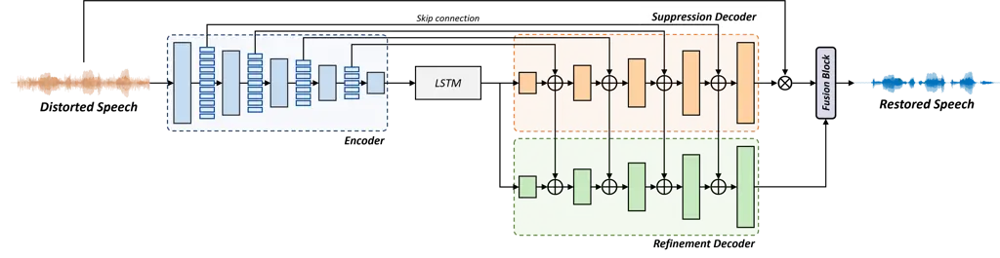
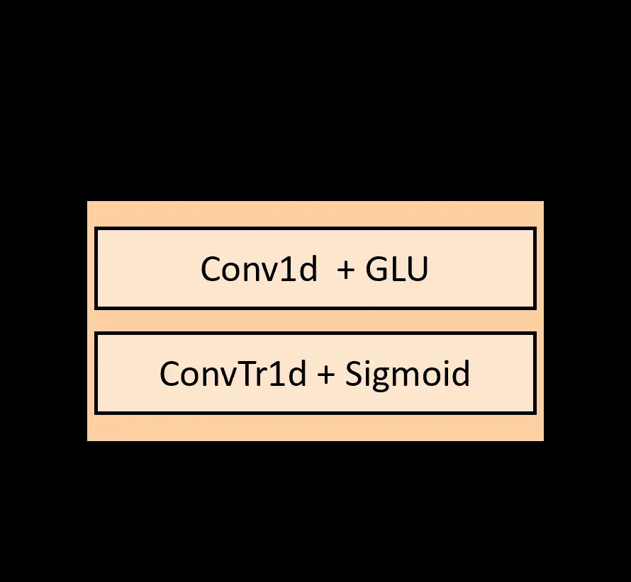
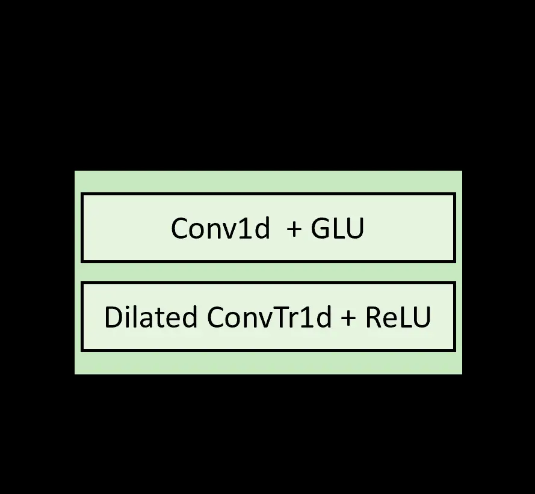
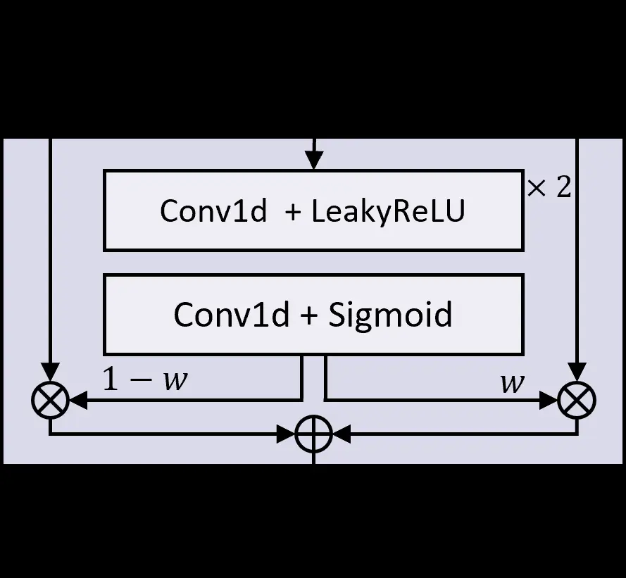
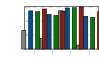

¹Department of Electrical and Electronic Engineering, Yonsei University,
South Korea  
²NAVER Cloud, South Korea

# HD-DEMUCS: General Speech Restoration with Heterogeneous Decoders

Doyeon Kim¹, Soo-Whan Chung², Hyewon Han¹, Youna Ji², Hong-Goo Kang¹

###### Abstract

This paper introduces an end-to-end neural speech restoration model,
HD-DEMUCS, demonstrating efficacy across multiple distortion
environments. Unlike conventional approaches that employ cascading
frameworks to remove undesirable noise first and then restore missing
signal components, our model performs these tasks in parallel using two
heterogeneous decoder networks. Based on the U-Net style encoder-decoder
framework, we attach an additional decoder so that each decoder network
performs noise suppression or restoration separately. We carefully
design each decoder architecture to operate appropriately depending on
its objectives. Additionally, we improve performance by leveraging a
learnable weighting factor, aggregating the two decoder output
waveforms. Experimental results with objective metrics across various
environments clearly demonstrate the effectiveness of our approach over
a single decoder or multi-stage systems for general speech restoration
task.

Index Terms: general speech restoration, speech enhancement

^(†)^(†)address: ^(†)^(†)email: ehyeon24@dsp.yonsei.ac.kr,
soowhan.chung@navercorp.com, hwhan@dsp.yonsei.ac.kr,
youna.ji@navercorp.com, hgkang@yonsei.ac.kr

## 1 Introduction

Speech signal is a fundamental and intuitive medium for human
interaction. However, various distortions are often present in observed
speech, including background noise, reverberation, and cross-talk from
other speakers. These distortions can severely degrade the perceptual
quality of input signals, posing challenges for understanding the target
speech. Additionally, acoustic responses such as room impulse response
and transmission channel distortions can alter the spectral composition
of speech signal, resulting in poor clarity and intelligibility. To
address these issues, speech enhancement has become a crucial
pre-processing step that aims to improve the perceptual quality and
intelligibility of input speech by mitigating undesirable distortion
effects. By enhancing speech signals, speech-based applications, such as
automatic speech recognition \[1, 2, 3\] and speaker verification \[4,
5, 6\], can provide more accurate and reliable results, leading to
improved user experiences.

Recent deep learning-based methods have shown remarkable performance in
speech enhancement, primarily by reducing noise and reverberation \[7,
8, 9\]. In \[10, 11, 12\], the authors have predicted a spectrogram or
spectral mask to suppress distortions. In \[13, 14, 15\], they have
attempted to generate missing components, including spectral bands or
temporal occlusions, leveraging the impressive predictive capability of
neural networks. Furthermore, some works have produced more realistic
speech from distorted inputs by introducing generative models such as
generative adversarial network \[16, 17\] and diffusion-based
score-matching method \[18, 19\].

In real-world scenarios, speech degradation factors do not occur in
isolation but rather in correlation with each other, incurring
challenges in speech enhancement tasks. However, most speech enhancement
methods have traditionally focused on processing a single distortion and
have dealt with multiple distortions by cascading several task-oriented
models \[20, 21\], neglecting correlations between various distortions.
This fact raises concerns that artifacts (e.g., musical noise, remaining
distortions) caused by the front-end speech enhancement method are
propagated downstream, resulting in severe degradation of
post-enhancement modules. In \[20\], the authors have defined the task
of handling multiple distortions as general speech restoration, which
refers to speech restoration task in this paper, solving the problem by
training neural enhancement models with adversarial training. They have
designed their methods based on the analysis-and-synthesis point of
view, i.e., restoring mel-spectrograms by a residual U-Net
structure \[22\] and generating waveforms from mel-spectrograms using an
extra vocoder. In \[23\], the authors have introduced a generative
diffusion-based method that produces high-quality speech waveforms from
distorted inputs, beyond eliminating complex distortions. Although
various authors have exhibited impressive restoration performance,
further improvements are possible by designing a neural network that
considers the characteristics of various distortion types present in the
input signals.

In this paper, we propose a novel end-to-end speech restoration network,
Heterogeneous Decoders-DEMUCS (HD-DEMUCS). Unlike traditional methods
that combine separate models to address different restoration tasks, our
model achieves improved efficiency with two parallel decoder networks.
Our approach leverages the well-known encoder-decoder framework,
DEMUCS \[24\], which has demonstrated its effectiveness in suppressing
noise and reverberation. The novelty of HD-DEMUCS mainly comes from the
modification of the decoder network, it includes two heterogeneous
decoders that are designed to perform different restoration tasks
efficiently. Specifically, one decoder, a suppression decoder, focuses
on distortion removal by suppressing additive and convolution
distortions, rather than generating clean speech. In contrast, another
decoder, a refinement decoder, is responsible for generating clean
speech with fine perceptual quality, by restoring missing components on
input speech. They collaborate by providing latent features from the
suppression to the refinement decoder, as the refinement process can be
addressed more efficiently with enhanced features rather than solely
encoded features. Additionally, we customize the configuration of the
decoders based on their respective restoration tasks. The final restored
speech waveforms are obtained by summing the outputs of the two decoders
through a fusion module. Our experiments and ablation studies
demonstrate the effectiveness of our proposed method and highlight the
importance of the submodules in processing multiple distortions
simultaneously.



Figure 1: Illustration of the proposed speech restoration network,
HD-DEMUCS.

## 2 DEMUCS

The most relevant work to ours is DEMUCS, which was proposed for speech
enhancement task using a U-Net-based encoder-decoder architecture. The
encoder receives upsampled time-domain distorted input speech and
analyzes it through the stack of convolutional blocks, producing a
latent embedding. The encoder and the decoder each have five convolution
and de-convolution blocks. They benefit from the large receptive fields
of strided convolution layers, resulting in improved contextual analysis
and representation capability, followed by Gated Linear Units (GLUs)
\[25\]. Additionally, a Long Short-Term Memory (LSTM) layer between the
encoder and decoder strengthens the sequential modeling that cannot be
achieved in the encoder convolution layers. The encoder and decoder
blocks are connected using U-Net skip connections \[26\] to preserve
information during network propagation. The final enhanced speech is
obtained by downsampling the decoder output and multiplying it by the
standard deviation of the input speech.



(a)



(b)



(c)

Figure 2: Detailed structures of the modular blocks in HD-DEMUCS: (a)
Suppression; (b) Generation; (c) Fusion.

## 3 Proposed model

### 3.1 Problem formulation

In this paper, we aim to restore speech in cases where input speech
includes background noise, reverberation, and frequency band distortion.
Here, we can formulate the input speech $`y`$ as:

```math
y=h(x*r)+n,\vskip-3.0pt \tag{1}
```

where $`x`$ and $`n`$ are a clean speech and background noise
respectively, $`*`$ is the convolution symbol, and $`r`$ reflects the
room impulse response. Specifically, $`h`$ creates spectral distortions,
modeled by a high-pass, low-pass, and band-pass filter.

| Methods      | \# of Params. | WV-MOS | PESQ  | ESTOI | COVL  | CSIG  | CBAK  | SRMR   | SI-SDR  |
| ------------ | ------------- | ------ | ----- | ----- | ----- | ----- | ----- | ------ | ------- |
| Noisy        | -             | 2.042  | 1.808 | 0.648 | 2.148 | 2.615 | 1.806 | -7.282 | -       |
| DEMUCS48^(∗) | 18M           | 3.911  | 2.216 | 0.774 | 2.894 | 2.565 | 2.640 | 8.470  | 5.793   |
| DEMUCS64^(∗) | 33M           | 3.842  | 2.310 | 0.782 | 2.998 | 3.696 | 2.699 | 8.633  | 6.022   |
| VoiceFixer   | 122M          | 3.954  | 2.122 | 0.685 | 2.554 | 3.095 | 2.167 | 9.301  | -20.268 |
| MetricGAN+   | 2.7M          | 2.963  | 2.379 | 0.669 | 2.551 | 2.852 | 2.254 | 8.258  | -6.743  |
| HD-DEMUCS    | 24M           | 4.205  | 2.393 | 0.792 | 3.067 | 3.747 | 2.740 | 8.999  | 6.243   |

Table 1: Objective measurements of speech restoration performance on
$`\mathcal{A}`$ testset. \* indicates re-implementation.

### 3.2 Overall architecture

We propose a novel end-to-end speech enhancement network, HD-DEMUCS,
which simultaneously processes multiple distortions of diverse
characteristics in input speech. We design the overall architecture with
an analysis and synthesis approach; thus, we focus more on the
functionality of decoders rather than that of the encoder which takes
the analysis stage. Therefore, we have integrated a new decoder
framework to handle the encoded representations. We categorize the
speech restoration task into two perspectives: suppression and
refinement. Following these perspectives, we allocate two heterogeneous
decoders to address distinct distortion types. Figure 1 illustrates the
overall architecture of HD-DEMUCS, comprising 4 submodules: an encoder
$`\mathbf{E}`$, a suppression decoder $`\mathbf{D_{s}}`$, a refinement
decoder $`\mathbf{D_{r}}`$, and a fusion block $`\mathbf{F}`$.

#### Encoder

The encoder follows the well-designed architecture of the causal DEMUCS
with convolution layers of 48 hidden channels and an LSTM layer. The
encoder block consists of five blocks, and each block consists of the
convolutional layer with a kernel size of 8 and stride of 4 followed by
the GLU activation function. Before the encoder block, an upsampling
layer increases the sampling rate by a factor of 4. The encoder provides
its intermediate embeddings to the suppression decoder with skip
connections
($`\mathbf{S_{\text{$\mathbf{E}$}\rightarrow\text{$\mathbf{D*{s}}$}}}`$).
Furthermore, the suppression decoder provides its latent embeddings,
summed up with the skip connection, to the refinement decoder
($`\mathbf{S*{\text{$\mathbf{D_{s}}$}\rightarrow\text{$\mathbf{D_{r}}$}}}`$).

#### Suppression decoder

The objective of the suppression decoder is to eliminate unwanted
additive or convolutive distortions, such as noise and reverberation
tails, from the speech signal. To accomplish this, the decoder receives
the latent embedding of the encoder and computes a time-domain mask to
suppress the input signal distortions rather than estimating the
enhanced speech directly. There exist five suppression blocks with skip
connections from the encoder to prevent information leakage. Each block
of the suppression decoder, as illustrated in Figure 2(2(a)), consists
of a series of 1-dimensional strided convolutional layers followed by
the GLU function and transposed convolutional layers followed by the
sigmoid activation function. The kernel size and stride of the
suppression block are identical to those of the encoder. The output of
the suppression decoder, where the range is limited between 0 and 1, is
multiplied with the input signal, suppressing unwanted components.

#### Refinement decoder

The purpose of the refinement decoder is to improve the perceptual
quality and intelligibility of speech signals by refining or generating
missing components. Therefore, the output of the refinement decoder is a
time-domain speech signal, in contrast to the suppression decoder which
estimates the mask. The refinement decoder in Figure 2(2(b)) utilizes
two representations, one from the encoder output and the other from the
intermediate representations of the suppression decoder. Compared to the
encoder output, the intermediate representation is expected to contain
more refined information on additive distortions, which improves the
refinement task efficiency. Although the architectural composition of
the refinement block is similar to that of the suppression block, there
poses a critical difference in the transposed convolution layer. The
dilation factor in the transposed convolution layer is set to a value
greater than one to increase the receptive field, as motivated by \[27\]
for bandwidth extension. We used a dilation factor of (1, 3, 5, 7, 9) on
the layers of each block, with the kernel size and stride set to match
those of the encoder. It allows the refinement decoder to effectively
enlarge the contextual information and estimate missing components
caused by the distortions.

#### Fusion block

To integrate the outputs of each decoder, we utilize a fusion block
instead of simply adding the two decoder outputs. The fusion block,
inspired by \[28\], employs a learnable weight to scale the outputs of
the decoders for an effective combination. As depicted in
Figure 2(2(c)), the two decoder outputs are stacked in the channel axis
and passed through three convolutional layers. Each convolution layer
has a kernel size of 3 with stride of 1. The fusion block employs a
LeakyReLU activation function and a Sigmoid output function, to
constrain the weight $`w`$ to a value lower than 1. The suppression and
refinement decoder outputs are scaled by $`w`$ and $`(1-w)`$
respectively, and then combined to produce the fusion block output as
follows:

```math
\hat{x}_{up}=w\text{$\mathbf{D_{r}}$}(y_{up})+(1-w)y_{up}\text{$\mathbf{D_{s}}$}(y_{up}),\vskip-3.0pt \tag{2}
```

where $`\hat{x}_{up}`$ and $`y_{up}`$ indicate the (upsampled) restored
and distorted speech signal, respectively. Subsequently, the output is
downsampled by an equivalent amount as the upsampling performed before
the encoder, as in DEMUCS.

### 3.3 Training criterion

For a fair comparison with baseline methods, we adopted the same
training criteria as in DEMUCS \[24\]. Both our proposed model and
DEMUCS are trained by minimizing the distance between the estimated
speech $`\hat{x}`$ and the reference speech $`x`$ in both the time and
frequency domains. In the time domain, we minimize the Euclidean
distance between waveforms as follows:

```math
\mathcal{L}_{T}=\lVert x-\hat{x}\rVert_{1},\vskip-3.0pt \tag{3}
```

For the frequency domain, we employ a multi-resolution short-time
Fourier Transform (MR-STFT) loss \[29, 30\]. First, the estimated and
reference waveforms are transformed into magnitude spectra using various
STFT configurations. Then, we minimize the distance between spectra by
considering both spectral convergence loss ($`\mathcal{L}_{sc}`$) and
log-magnitude loss ($`\mathcal{L}_{mag}`$) for each STFT resolution. The
training loss on the frequency domain can be formulated as below:

```math
\mathcal{L}_{F}=\sum_{i=1}^{M}\left(\mathcal{L}^{i}_{sc}+\frac{1}{T}\mathcal{L}^{i}_{mag}\right),\vskip-3.0pt \tag{4}
```

where $`M`$ is the number of STFT configurations, and $`T`$ defines the
length of the speech. For each resolution, $`\mathcal{L}_{sc}`$ and
$`\mathcal{L}_{mag}`$ are defined as:

```math
\mathcal{L}_{sc}={\lVert\mathbf{X}-\mathbf{\hat{X}}\rVert}_{F}/{\lVert\mathbf{X}\rVert}_{F},\vskip-3.0pt \tag{5}
```

```math
\mathcal{L}_{mag}=\lVert\log\mathbf{X}-\log\mathbf{\hat{X}}\rVert_{1},\vskip-3.0pt \tag{6}
```

where $`\mathbf{X}`$ and $`\mathbf{\hat{X}}`$ are the magnitude spectra
of $`x`$ and $`\hat{x}`$, $`\lVert\cdot\rVert_{F}`$ is Frobenius norm.
We utilize three different configurations for the STFT, with the
following parameters: number of FFT bins of (512, 1024, 2048), hop size
of (50, 120, 240), and window length of (240, 600, 1200).


(a) WB-PESQ


   (b) ESTOI


   (c) SRMR



   (d) WV-MOS

Figure 3: Objective measurements on various distortion test sets of
input, baseline, and proposed models. $`\mathcal{N}`$, $`\mathcal{R}`$,
$`\mathcal{B}`$, $`\mathcal{A}`$ indicate tests sets for noisy,
noisy-reverberant, bandlimited, and all three distortions, respectively.
Gray, Blue, Green, and Red bars represent distorted inputs, DEMUCS48
outputs, DEMUCS64 outputs, and HD-DEMUCS outputs, respectively.

## 4 Experiments

### 4.1 Experimental settings

#### Datasets

We utilized the Valentini dataset \[31\], consisting of the VCTK corpus
with 28 English speakers \[32\] and the DEMAND noise dataset \[33\].
Consistent with \[31\], we reserved one male and one female speaker,
which were not included in the training set, and five distinct, unseen
background noises for the test set. The signal-to-noise ratio (SNR) was
randomly selected between (0, 5, 10, 15) dB for the training set and
(2.5, 7.5, 12.5, 17.5) dB for the test set. For the training and test
sets, we simulated reverberations using 243 and 27 types of room impulse
responses, respectively, from the MIT Impulse Response Survey
dataset \[34\]. We simulated the spectral distortions on input speech
using a low pass, high pass, and band pass filter, and frequency drop by
randomly selecting a type of filter within Butterworth, Bessel, and
elliptic types. The cut-off frequencies of the low and high pass filters
were randomly selected from the range of 4k-7.5kHz and 10-100 Hz,
respectively and use the same range of cut-off frequencies for the
bandpass filters. For the bandlimited test sets, only the low pass
filters were applied, where cut-off frequencies are set uniformly in (4,
5, 6, 7) kHz. We constructed 4 different subsets to exhibit the
effectiveness of our model on each distortion: $`\mathcal{N}`$ (noisy
speech), $`\mathcal{R}`$ (noisy and reverberant speech), $`B`$
(band-limited speech), and $`\mathcal{A}`$ (speech with all
distortions).


Figure 4: Qualitative results. Spectrogram of (a) clean speech, (b)
input speech, (c) HD-DEMUCS output, (d) $`\mathbf{D_{s}}`$ output, and
(e) $`\mathbf{D_{r}}`$ output

#### Evaluation metrics

We assessed the performance of the speech restoration task using various
metrics. The speech quality is evaluated with the wide-band Perceptual
Evaluation of Speech Quality (PESQ) \[35\], while the speech
intelligibility was measured in extended Short-Time Objective
Intelligibility (ESTOI) \[36\]. To evaluate speech dereverberation
performance, we used the Speech-to-Reverberation Modulation Energy Ratio
(SRMR) metric \[37\]. For the waveform reconstruction, we measured the
scale-invariant signal-to-distortion ratio (SI-SDR) \[38\], while the
restoration performance, including bandwidth extension, was evaluated
using the Wideband Voice Mean-Opinion-Score (WV-MOS) \[39\]. We also
utilized composite measurements to analyze the overall quality (COVL),
signal distortion (CSIG), and background noise (CBAK) \[40\]. A higher
score on all evaluation metrics indicates an improved performance.

#### Training configuration

We trained the encoder-decoder network first, then added a fusion block
for joint training. Before attaching the fusion block, the outputs were
combined with a 0.5 weight value. We used Adam optimizer \[41\] with a
learning rate of 0.0003, a cosine annealing scheduler for training.

### 4.2 Results

#### Comparison with baselines

We re-implemented two baseline models, DEMUCS48 and DEMUCS64, using 48
and 64 hidden channels, for the fair performance comparison by training
in an identical environmental setting with the proposed model.
Additionally, we brought the pre-trained parameters of VoiceFixer \[20\]
and MetricGAN+ \[11\] for comparisons. Table 1 displays the experimental
results of comparing the baseline models with the $`\mathcal{A}`$ test
set. The proposed model outperformed the baseline models in terms of
speech quality (PESQ), intelligibility (ESTOI), and, particularly speech
restoration (WV-MOS). Furthermore, the composite metrics and SI-SDR
results demonstrate the effectiveness of HD-DEMUCS in the suppression
task. We conducted a detailed analysis by comparing the scores of input,
DEMUCS48, DEMUCS64, and HD-DEMUCS across subsets in Figure 3. For the
SRMR metric, we evaluated against $`\mathcal{R}`$ and $`\mathcal{A}`$
subsets, which contain reverberation distortions. These demonstrate the
proposed model exhibits robustness across various distortions and that
it offers superior performances in harsh conditions such as test sets
$`\mathcal{R}`$ and $`\mathcal{A}`$.

| Methods                   | WV-MOS | PESQ  | COVL  | CSIG  | CBAK  |
| ------------------------- | ------ | ----- | ----- | ----- | ----- |
| Noisy                     | 2.042  | 1.808 | 2.148 | 2.615 | 1.806 |
| HD-DEMUCS                 | 4.205  | 2.393 | 3.067 | 3.747 | 2.740 |
| $`\mathbf{D_{r}}`$ output | 4.198  | 2.279 | 3.035 | 3.719 | 2.486 |
| $`\mathbf{D_{s}}`$ output | 2.536  | 1.428 | 1.497 | 1.666 | 2.040 |

Table 2: Analysis of the each HD-DEMUCS decoders outputs on
$`\mathcal{A}`$ testset.

#### Analysis of decoders

In Table 2, we report the quality of output waveforms of each decoder to
investigate their individual contributions to the proposed model. The
results demonstrate that the superior performance of the model is
attributed to the $`\mathbf{D_{r}}`$ module. The
‘$`\mathbf{D_{s}}`$ output’ result indicates the suppression decoder
does not produce high-quality speech signals but exhibits its ability to
suppress background noise in terms of the CBAK metric. Figure 4 supports
the findings of Table 2 by presenting the spectrograms of the reference,
distorted input, and outputs of the decoders and HD-DEMUCS. The figures
clearly demonstrate that each decoder performs properly for its designed
restoration task without additional training loss to each module.
Consistent with the ‘$`\mathbf{D_{s}}`$ output’ results, Figure 4(d)
confirms that the poor quality of the suppression decoder results from
the over-suppression issue associated with powerful suppression of
various distortions.

| Methods                                                                                        | WV-MOS | PESQ  | COVL  | CSIG  | CBAK  |
| ---------------------------------------------------------------------------------------------- | ------ | ----- | ----- | ----- | ----- |
| Noisy                                                                                          | 2.042  | 1.808 | 2.148 | 2.615 | 1.806 |
| HD-DEMUCS                                                                                      | 4.205  | 2.393 | 3.067 | 3.747 | 2.740 |
| w/o $`\mathbf{F}`$                                                                             | 4.167  | 2.379 | 3.052 | 3.731 | 2.726 |
| w/o $`\mathbf{F}`$, $`\mathbf{S_{\text{$\mathbf{D*{s}}$}\rightarrow\text{$\mathbf{D*{r}}$}}}`$ | 3.985  | 2.188 | 2.867 | 3.566 | 2.606 |
| w/o $`\mathbf{F}`$, $`\mathbf{D_{r}}`$                                                         | 3.281  | 1.510 | 2.435 | 3.154 | 2.222 |
| w/o $`\mathbf{F}`$, $`\mathbf{D_{s}}`$                                                         | 4.111  | 2.235 | 3.034 | 3.719 | 2.710 |

Table 3: Ablation study for the strategy in the proposed model on
$`\mathcal{A}`$ testset.

#### Ablation studies

To investigate the contribution of each module in HD-DEMUCS, we trained
several models with specific modules selectively removed, and the
results are presented in Table 3. “w/o $`\mathbf{F}`$” model summed up
the outputs of both decoders without learnable weights of the fusion
block. “w/o $`\mathbf{F,S_{D_{s}\rightarrow D_{r}}}`$” model removed the
skip connection between the two decoders, but kept the skip connections
$`\mathbf{S_{E\rightarrow D_{s}}}`$. “w/o $`\mathbf{F,D_{r}}`$” model
used only the suppression decoder with the skip connections
$`\mathbf{S_{E\rightarrow D_{s}}}`$. “w/o $`\mathbf{F,D_{s}}`$” used
only the refinement decoder with the skip connections
$`\mathbf{S_{E\rightarrow D_{r}}}`$. The fusion block $`\mathbf{F}`$,
aggregating the outputs of heterogeneous decoders using learnable
weights, improves overall performance compared to using a fixed weight
of 0.5. Moreover, the absence of
$`\mathbf{S_{\text{$\mathbf{D*{s}}$}\rightarrow\text{$\mathbf{D*{r}}$}}}`$ revealed
a noticeable drop in speech quality compared to the suppression
performance, confirming the importance of the enhanced features to the
refinement decoder. Notably, the removal of the refinement decoder
$`\mathbf{D_{r}}`$ led to significant performance degradation compared
to other models, highlighting its effectiveness in high-quality speech
restoration with various distortion present. On the other hand, while
there was minor performance degradation in the absence of the
suppression decoder $`\mathbf{D_{s}}`$, it still demonstrated its
capability to suppress distortions when it was used solely, without the
refinement decoder.

## 5 Conclusions

In this paper, we proposed an end-to-end speech restoration model,
Heterogeneous Decoders-DEMUCS (HD-DEMUCS), that utilizes two
heterogeneous decoders for two different perspectives of restoration:
suppression and refinement. HD-DEMUCS demonstrated powerful suppression
performance through a mask estimation approach of suppression decoder
and the effectiveness of refinement decoder with dilated convolution
layers. Additionally, we incorporated a fusion block to combine
effectively the outputs of the two decoders by predicting a learnable
weighting value. We evaluated the proposed model and baselines in the
presence of various distortions with objective measurements,
demonstrating the superiority of HD-DEMUCS. Specifically, we analyzed
the contributions of each module in HD-DEMUCS with ablation studies and
qualitative results and confirmed the intended functionality of each
module. Further improvements could be achieved using a larger dataset or
by incorporating speech-related features such as pitch during training.

## References

- \[1\] S. Schneider, A. Baevski, R. Collobert, and M. Auli, “wav2vec:
  Unsupervised Pre-Training for Speech Recognition,” in
  _INTERSPEECH_, 2019.
- \[2\] A. Baevski, Y. Zhou, A. Mohamed, and M. Auli, “wav2vec 2.0: A
  framework for self-supervised learning of speech representations,”
  _NeurIPS_, 2020.
- \[3\] S. Kim, T. Hori, and S. Watanabe, “Joint ctc-attention based
  end-to-end speech recognition using multi-task learning,” in
  _ICASSP_, 2017.
- \[4\] B. Desplanques, J. Thienpondt, and K. Demuynck, “Ecapa-tdnn:
  Emphasized channel attention, propagation and aggregation in tdnn
  based speaker verification,” in _INTERSPEECH_, 2020.
- \[5\] R. Wang, Z. Wei, H. Duan, S. Ji, Y. Long, and Z. Hong,
  “Efficienttdnn: Efficient architecture search for speaker
  recognition,” _IEEE/ACM Transactions on Audio Speech and Language
  Processing_, vol. 30, pp. 2267–2279, 2022.
- \[6\] M. Ravanelli and Y. Bengio, “Speaker recognition from raw
  waveform with sincnet,” in _SLT_, 2018.
- \[7\] M. Tagliasacchi, Y. Li, K. Misiunas, and D. Roblek, “SEANet: A
  Multi-Modal Speech Enhancement Network,” in _INTERSPEECH_, 2020.
- \[8\] J. Kim, M. El-Khamy, and J. Lee, “T-gsa: Transformer with
  gaussian-weighted self-attention for speech enhancement,” in
  _ICASSP_, 2020.
- \[9\] S.-W. Fu, C. Yu, K.-H. Hung, M. Ravanelli, and Y. Tsao,
  “Metricgan-u: Unsupervised speech enhancement/ dereverberation based
  only on noisy/ reverberated speech,” in _ICASSP_, 2022.
- \[10\] S.-W. Fu, C.-F. Liao, Y. Tsao, and S.-D. Lin, “Metricgan:
  Generative adversarial networks based black-box metric scores
  optimization for speech enhancement,” in _ICML_, 2019.
- \[11\] S.-W. Fu, C. Yu, T.-A. Hsieh, P. Plantinga, M. Ravanelli,
  X. Lu, and Y. Tsao, “MetricGAN+: An Improved Version of MetricGAN for
  Speech Enhancement,” in _INTERSPEECH_, 2021.
- \[12\] J. Lee and H.-G. Kang, “A joint learning algorithm for
  complex-valued t-f masks in deep learning-based single-channel speech
  enhancement systems,” _IEEE/ACM Transactions on Audio Speech and
  Language Processing_, vol. 27, no. 6, pp. 1098–1108, 2019.
- \[13\] M. Kegler, P. Beckmann, and M. Cernak, “Deep speech inpainting
  of time-frequency masks,” in _INTERSPEECH_, 2020.
- \[14\] Z. Borsos, M. Sharifi, and M. Tagliasacchi, “Speechpainter:
  Text-conditioned speech inpainting,” in _INTERSPEECH_, 2022.
- \[15\] E. Moliner and V. Välimäki, “Behm-gan: Bandwidth extension of
  historical music using generative adversarial networks,” _IEEE/ACM
  Transactions on Audio Speech and Language Processing_, vol. 31, pp.
  943–956, 2023.
- \[16\] S. Pascual, A. Bonafonte, and J. Serrà, “SEGAN: Speech
  Enhancement Generative Adversarial Network,” in _INTERSPEECH_, 2017.
- \[17\] J. Su, Z. Jin, and A. Finkelstein, “HiFi-GAN: High-Fidelity
  Denoising and Dereverberation Based on Speech Deep Features in
  Adversarial Networks,” in _INTERSPEECH_, 2020.
- \[18\] Y.-J. Lu, Z.-Q. Wang, S. Watanabe, A. Richard, C. Yu, and
  Y. Tsao, “Conditional diffusion probabilistic model for speech
  enhancement,” in _ICASSP_, 2022.
- \[19\] S. Welker, J. Richter, and T. Gerkmann, “Speech enhancement
  with score-based generative models in the complex stft domain,” in
  _INTERSPEECH_, 2022.
- \[20\] H. Liu, X. Liu, Q. Kong, Q. Tian, Y. Zhao, D. Wang, C. Huang,
  and Y. Wang, “VoiceFixer: A Unified Framework for High-Fidelity Speech
  Restoration,” in _INTERSPEECH_, 2022.
- \[21\] M. Strake, B. Defraene, K. Fluyt, W. Tirry, and T. Fingscheidt,
  “Separated noise suppression and speech restoration: Lstm-based speech
  enhancement in two stages,” in _WASPAA_, 2019.
- \[22\] Q. Kong, Y. Cao, H. Liu, K. Choi, and Y. Wang, “Decoupling
  magnitude and phase estimation with deep resunet for music source
  separation,” in _ISMIR_, 2021.
- \[23\] J.-M. Lemercier, J. Richter, S. Welker, and T. Gerkmann,
  “Analysing diffusion-based generative approaches versus discriminative
  approaches for speech restoration,” in _ICASSP_, 2023.
- \[24\] A. Defossez, G. Synnaeve, and Y. Adi, “Real time speech
  enhancement in the waveform domain,” in _INTERSPEECH_, 2020.
- \[25\] Y. N. Dauphin, A. Fan, M. Auli, and D. Grangier, “Language
  modeling with gated convolutional networks,” in _ICML_, 2017.
- \[26\] O. Ronneberger, P. Fischer, and T. Brox, “U-net: Convolutional
  networks for biomedical image segmentation,” in _MICCAI_, 2015.
- \[27\] A. van den Oord, S. Dieleman, H. Zen, K. Simonyan, O. Vinyals,
  A. Graves, N. Kalchbrenner, A. Senior, and K. Kavukcuoglu, “WaveNet: A
  Generative Model for Raw Audio,” in _SSW_, 2016.
- \[28\] Z. Lai and Y. Fu, “Mixed attention network for hyperspectral
  image denoising,” _arXiv preprint arXiv:2301.11525_, 2023.
- \[29\] S. Ã. Arık, H. Jun, and G. Diamos, “Fast spectrogram inversion
  using multi-head convolutional neural networks,” _IEEE Signal
  Processing Letters_, vol. 26, no. 1, pp. 94–98, 2019.
- \[30\] R. Yamamoto, E. Song, and J.-M. Kim, “Parallel wavegan: A fast
  waveform generation model based on generative adversarial networks
  with multi-resolution spectrogram,” in _ICASSP_, 2020.
- \[31\] C. Valentini-Botinhao, X. Wang, S. Takaki, and J. Yamagishi,
  “Speech Enhancement for a Noise-Robust Text-to-Speech Synthesis System
  Using Deep Recurrent Neural Networks,” in _INTERSPEECH_, 2016.
- \[32\] J. Yamagishi, C. Veaux, K. MacDonald _et al._, “Cstr vctk
  corpus: English multi-speaker corpus for cstr voice cloning toolkit
  (version 0.92),” _University of Edinburgh. The Centre for Speech
  Technology Research (CSTR)_, 2019.
- \[33\] J. Thiemann, N. Ito, and E. Vincent, “The diverse environments
  multi-channel acoustic noise database (demand): A database of
  multichannel environmental noise recordings,” in _ICA_, 2013.
- \[34\] J. Traer and J. H. McDermott, “Statistics of natural
  reverberation enable perceptual separation of sound and space,”
  _Proceedings of the National Academy of Sciences_, vol. 113, no. 48,
  pp. E7856–E7865, 2016.
- \[35\] I. Union, “Wideband extension to recommendation p. 862 for the
  assessment of wideband telephone networks and speech codecs,”
  _International Telecommunication Union, Recommendation P_, vol.
  862, 2007.
- \[36\] J. Jensen and C. H. Taal, “An algorithm for predicting the
  intelligibility of speech masked by modulated noise maskers,”
  _IEEE/ACM Transactions on Audio Speech and Language Processing_,
  vol. 24, no. 11, pp. 2009–2022, 2016.
- \[37\] T. H. Falk and W.-Y. Chan, “Temporal dynamics for blind
  measurement of room acoustical parameters,” _IEEE Transactions on
  Instrumentation and Measurement_, vol. 59, no. 4, pp. 978–989, 2010.
- \[38\] J. Le Roux, S. Wisdom, H. Erdogan, and J. R. Hershey,
  “Sdr–half-baked or well done?” in _ICASSP_, 2019.
- \[39\] P. Andreev, A. Alanov, O. Ivanov, and D. Vetrov, “Hifi++: a
  unified framework for neural vocoding, bandwidth extension and speech
  enhancement,” _arXiv preprint arXiv:2203.13086_, 2022.
- \[40\] Y. Hu and P. C. Loizou, “Evaluation of objective quality
  measures for speech enhancement,” _IEEE/ACM Transactions on Audio
  Speech and Language Processing_, vol. 16, no. 1, pp. 229–238, 2008.
- \[41\] D. P. Kingma and J. Ba, “Adam: A method for stochastic
  optimization,” in _ICLR_, 2015.
