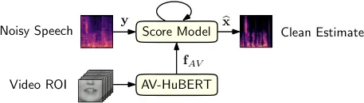
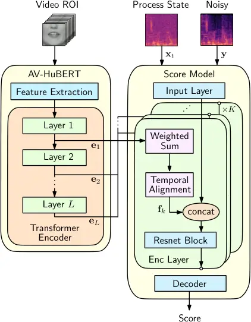

SGM  
score-based generative model

SNR  
signal-to-noise ratio

GAN  
generative adversarial network

VAE  
variational autoencoder

DDPM  
denoising diffusion probabilistic model

STFT  
short-time Fourier transform

iSTFT  
inverse short-time Fourier transform

SDE  
stochastic differential equation

ODE  
ordinary differential equation

OU  
Ornstein-Uhlenbeck

VE  
Variance Exploding

DNN  
deep neural network

PESQ  
Perceptual Evaluation of Speech Quality

SE  
speech enhancement

T-F  
time-frequency

ELBO  
evidence lower bound

WPE  
weighted prediction error

PSD  
power spectral density

RIR  
room impulse response

LSTM  
long short-term memory

POLQA  
Perceptual Objectve Listening Quality Analysis

SDR  
signal-to-distortion ratio

ESTOI  
Extended Short-Term Objective Intelligibility

ELR  
early-to-late reverberation ratio

TCN  
temporal convolutional network

DRR  
direct-to-reverberant ratio

NFE  
number of function evaluations

RTF  
real-time factor

MOS  
mean opinion scores

ASR  
automatic speech recognition

WER  
word error rate

AVSE  
audio-visual speech enhancement

SSL  
self-supervised learning

DL  
deep learning

ROI  
region-of-interest

# Audio-Visual Speech Enhancement with Score-Based Generative Models

Julius Richter    Simone Frintrop    Timo Gerkmann

###### Abstract

This paper introduces an audio-visual speech enhancement system that
leverages score-based generative models, also known as diffusion models,
conditioned on visual information. In particular, we exploit
audio-visual embeddings obtained from a self-supervised learning model
that has been fine-tuned on lipreading. The layer-wise features of its
transformer-based encoder are aggregated, time-aligned, and incorporated
into the noise conditional score network. Experimental evaluations show
that the proposed audio-visual speech enhancement system yields improved
speech quality and reduces generative artifacts such as phonetic
confusions with respect to the audio-only equivalent. The latter is
supported by the word error rate of a downstream automatic speech
recognition model, which decreases noticeably, especially at low input
signal-to-noise ratios.

¹Signal Processing Group, ²Computer Vision Group, Department of
Informatics, Universität Hamburg, Germany  
Email: {julius.richter,simone.frintrop,timo.gerkmann}@uni-hamburg.de

Index Terms— audio-visual speech enhancement, diffusion models,
self-supervised learning.

^(†)^(†) This work has been funded by the German Research Foundation
(DFG) in the transregio project Crossmodal Learning (TRR 169). We would
like to thank J. Berger and Rohde&Schwarz SwissQual AG for their support
with POLQA.

## 1 Introduction

Robust speech processing, e.g. in telecommunications or for asr (asr),
often requires improved speech quality and intelligibility. For this
purpose, speech enhancement aims at estimating clean speech signals from
noisy audio recordings \[1\]. However, in various real-world scenarios,
such as in negative snr, speech enhancement systems may face
limitations, typically resulting in speech distortions and impaired
speech recognition.

To mitigate these limitations, promising approaches have been proposed
that leverage both audio and video information which is referred to as
avse (avse) \[2\]. In fact, incorporating visual information into
audio-based systems becomes an emerging research direction and improves
both the robustness and the overall performance \[3\]. The principle is
in general twofold: first, the visual information (e.g. lip movements)
is usually not affected by the acoustic environment, and second, it has
been proven that visual information is able to provide additional speech
and speaker-related cues \[4, 5\].

Prevailing deep learning approches proposed for avse typically involve
models with modality-specific encoders, feature fusion, and a decoder,
all trained end-to-end in a supervised fashion \[6, 7\]. Their goal is
to learn audio-visual representations suitable for speech enhancement
which is usually defined as a predictive regression task. Another
approach to speech enhancement is to use generative models which follow
a different learning paradigm. They aim to model the underlying
statistical distribution of clean speech and do not directly estimate
the mapping from noisy input to clean output.

Recently, score-based generative models have been proposed for speech
enhancement \[8, 9\]. The idea is to corrupt clean speech with slowly
increasing levels of noise and train a dnn (dnn) to reverse this
corruption iteratively. This exciting new research direction provides an
alternative to other generative approaches and differs from predictive
approaches in its methodology and results. Since the models are trained
to generate clean speech conditioned on the noisy input, they tend to
hallucinate for signals with low snr \[9\]. This can lead to speech-like
sounds with poor articulation and no linguistic meaning or cause
phonetic confusions, which may be problematic in many practical
applications.

In this paper, we build upon our previous work on score-based generative
models for speech enhancement \[9\] and develop an audio-visual
extension of the generative approach. We condition the noise conditional
score network on audio-visual embeddings, that are obtained from
AV-HuBERT \[10\], a ssl (ssl) model fine-tuned on lipreading (see Fig.
1). This follows a recent trend in deep learning-based speech processing
to leverage powerful representations from pre-trained models, which have
been trained on large-scale datasets using ssl techniques.

Experimental evaluations show that the proposed avse system provides
better speech quality and reduces generative artifacts, such as phonetic
confusions, compared to its audio-only counterpart. This observation is
supported by the reduction of the wer (wer) of a downstream asr model,
which is particularly evident at low input snr.



Figure 1: Proposed audio-visual speech enhancement system. The score
model iteratively refines noisy speech $`\mathbf{y}`$ to obtain a clean
estimate $`\widehat{\mathbf{x}}`$ and is conditioned on audio-visual
embeddings $`\mathbf{f}_{AV}`$ obtained from AV-HuBERT.

## 2 Related Work

### 2.1 Score-based Generative Models

Score-based generative models, also known as diffusion models, have
recently gained attention due to their ability to generate high-quality
samples and provide flexible and efficient training procedures.
Originally inspired by non-equilibrium thermodynamics \[11\], they exist
in several variants \[12, 13\]. All of them share the idea of gradually
turning data into noise, and training a dnn that learns to invert this
diffusion process for different noise scales. In an iterative refinement
procedure, the dnn is evaluated multiple times to generate data,
achieving a trade-off between computational complexity and sample
quality.

Song et al. \[14\] showed that the diffusion process can be expressed as
a solution of a sde (sde), establishing a continuous-time formulation
for diffusion models. The forward sde can be inverted in time, resulting
in a corresponding reverse sde which depends only on the score function
of the perturbed data \[15\].

### 2.2 Audio-Visual Speech Enhancement

Early works on avse can be traced back to the 1990s \[16\]. More
recently, a number of interesting algorithms have been developed in the
context of deep learning, including methods based on spectral
mapping/masking that are trained in a supervised fashion \[6, 7\]. These
methods typically consist of two modality-specific encoders, one for
processing noisy speech and another for processing video information.
The resulting audio and visual features are then concatenated and
processed to obtain an audio-visual embedding that is fed into a decoder
to predict the clean speech.

Alternatively, Sadeghi et al. \[17\] proposed a generative approach to
avse using a conditional variational autoencoder trained on clean speech
only. The model learns a clean speech prior that is conditioned on
visual information. At inference, this prior is combined with a noise
model based on nonnegative matrix factorization to estimate a
probabilistic Wiener filter for denoising.

Other approaches consider avse as a speech resynthesis task, i.e., to
create an output that closely resembles the original signal in terms of
sound quality, prosody, and other acoustic characteristics \[18\]. Yang
et al. \[19\] developed a speaker-dependent model that generates clean
speech codes of a neural audio codec conditioned on noisy audio and
visual inputs. The discrete codes obtained are used to reconstruct a
mel-spectrogram which is then fed into a neural vocoder. Hsu et al.
\[20\] break avse into audio-visual speech recognition and
text-to-speech exploiting hidden units from a pre-trained ssl-model.
Mira et al. \[21\] proposed a two-stage approach that predicts clean
mel-spectrograms from audio-visual speech and converts them into
waveform audio using a neural vocoder.

### 2.3 Self-Supervised Learning

Recently, ssl has gained significant attention in the speech community,
with well-known models such as wav2vec 2.0 \[22\] and HuBERT \[23\] for
audio-only and AV-HuBERT \[10\] for audio-visual speech representation
learning. In contrast to supervised learning, which involves direct
optimization of models for a specific task, ssl adopts a two-step
approach. First, the model undergoes pre-training on large-scale
unlabeled data to extract task-agnostic representations. Then, these
learned representations are either used as input to a supervised model,
or the model itself is fine-tuned for a particular downstream task. The
expected outcome is to either improve the downstream task’s performance
or reduce the amount of labeled data required for training.

Pasad et al. \[24\] have analyzed the layer-wise features of wav2vec 2.0
and found that the transformer layers follow an autoencoder-like
behavior in which the representation deviates from the input speech
features as the depth of the model increases, followed by a reverse
trend in which even deeper layers become more similar to the input.
Furthermore, the evolution of the representations follows an
acoustic-linguistic hierarchy. The shallowest layers encode acoustic
features, followed by phonetic, word identity, and word meaning
information \[24\]. Huang et al. \[25\] have investigated ssl model for
speech enhancement and separation and concluded although they are not
designed for waveform generation tasks like enhancement and separation,
some of them achieve remarkable improvements over spectrogram
magnitudes. Interestingly, instead of extracting representations from
the last hidden layer, they proposed to aggregate embeddings from all
layers with a learnable weighted sum.

## 3 Method

In this section, we describe the proposed avse system, which we name
_AV-Gen_. Fig. 1 shows an overview of AV-Gen which consists of a score
model and a pre-trained AV-HuBERT model as an upstream video processor.

### 3.1 Score Model

Following the work in \[9\], we cast speech enhancement as a conditional
generation task using score-based generative models. For a pair of clean
and noisy spectrograms $`\mathbf{x}_{0},\mathbf{y}\in\mathbb{C}^{d}`$
with $`d`$ denoting the number of time-frequency bins, we define a
stochastic diffusion process $`\{\mathbf{x}_{t}\}_{t=0}^{T}`$, called
_forward process_, as the solution to the sde,

```math
\mathrm{d}{\mathbf{x}_{t}}=\gamma(\mathbf{y}-\mathbf{x}_{t})\mathrm{d}t+g(t)\mathrm{d}\mathbf{w}\,, \tag{1}
```

where $`\mathbf{x}_{t}`$ denotes the process state at time
$`t\in[0,T]`$, $`\gamma\in\mathbb{R}`$ controls the transition from
$`\mathbf{x}_{0}`$ to $`\mathbf{y}`$, and $`g(t)\in\mathbb{R}`$ is the
diffusion coefficient that controls the amount of Gaussian white noise
induced by a standard Wiener process $`\mathbf{w}`$.

The forward process has an associated _reverse process_ which is given
by the reverse sde \[15, 14\],

```math
\begin{split}\mathrm{d}\mathbf{x}_{t}=[-\gamma(\mathbf{y}-\mathbf{x}_{t})+g(t)^{2}\underbrace{\nabla_{\mathbf{x}_{t}}\log p_{t}(\mathbf{x}_{t}|\mathbf{y})}_{\approx\,\mathbf{s}_{\theta}(\mathbf{x}_{t},\mathbf{y},\mathbf{f}_{AV},t)}]\mathrm{d}t+g(t)\mathrm{d}\bar{\mathbf{w}}\,,\end{split} \tag{2}
```

where the score function
$`\nabla_{\mathbf{x}_{t}}\log p_{t}(\mathbf{x}_{t}|\mathbf{y})`$ is
intractable and therefore approximated by the score model
$`\mathbf{s}_{\theta}`$ with learnable parameters $`\theta`$. As in
\[9\], we use the Noise Conditional Score Network (NCSN++) \[14\] as the
score model. The training objective is denoising score matching, as
defined in \[9, Eq. (15)\]. Note, however, that in contrast to \[9\],
the score model is additionally conditioned on the video modality by
taking conditional features $`\mathbf{f}_{AV}`$ as input.

At inference, we can generate a clean speech estimate
$`\widehat{\mathbf{x}}`$ by solving the reverse sde in Eq. (2). For this
purpose, a numerical sde solver is employed which solves the task of
speech enhancement iterating through the reverse process starting at
$`t=T`$ and ending at $`t=t_{\epsilon}`$, where $`t_{\epsilon}`$ is a
small minimum process time to avoid numerical instabilities.

### 3.2 AV-HuBERT as Conditional Model



Figure 2: Network architecture: Each encoder layer $`k`$ of the score
model is conditioned on a conditional feature $`\mathbf{f}_{k}`$ which
is a weighted sum of the layerwise embedding $`\mathbf{e}_{l}`$ of the
AV-HuBERT’s transformer encoder.

As an upstream video processor for the score model, we use a pre-trained
AV-HuBERT model consisting of a hybrid ResNet-transformer architecture
for which we freeze the parameters at training. In particular, we
exploit audio-visual embeddings from each layer of its transformer
encoder, as visualized in Fig. 2. For each encoder layer $`k`$ of the
score model, we learn a conditional feature $`\mathbf{f}_{k}`$ by
aggregating the layer-wise embeddings $`\mathbf{e}_{l}`$ of AV-HuBERT’s
transformer encoder, as

```math
\mathbf{f}_{k}=\operatorname{TempAlign}_{k}\left(\sum_{l=1}^{L}w_{kl}\,\mathbf{e}_{l}\right),\hskip 10.00002ptk=1,\dots,K\,, \tag{3}
```

with trainable weights $`w_{kl}`$ with the properties $`w_{kl}\geq 0`$
and $`\sum_{l}w_{kl}=1`$ for all $`k`$. The operation
$`\operatorname{TempAlign}_{k}(\cdot)`$ ensures that the features are
temporally aligned to the feature rates of the score model’s embeddings
for different resolutions. In particular, we use linear interpolation
for upsampling and trainable Conv1D layers with kernel size and stride
$`d`$ for downsampling with factor $`d`$. The features are broadcasted
over the frequency dimension to match the feature maps of the score
model and the number of channels is adopted in the temporal alignment
operation. Finally, the conditional features
$`\mathbf{f}_{AV}=\{\mathbf{f}_{1},\dots,\mathbf{f}_{K}\}`$ have the
same shapes as the embeddings of the score model before concatenation.

## 4 Experimental Setup

### 4.1 Dataset

For audio-visual speech data, we use the LRS3 dataset \[26\], a
large-scale dataset primarily designed for the task of audio-visual
speech recognition. Besides the audio tracks sampled at
$`16\,\text{kHz}`$, it includes face tracks sampled at $`25\,\text{Hz}`$
from over 400 hours of TED and TEDx videos. Note that recording
conditions vary among the files and the data sometimes contain
reverberant speech and is not as clean as data recorded in controlled
environments such as a recording studio. For practical reasons, we limit
the size of training data and use the low-resource 30 hours subset
introduced in \[10\]. To meet the requirements for evaluating speech
quality \[27\], we only consider files from the test set with a minimum
length of $`3.2\,\text{s}`$ resulting in 244 test files in total.

We generate pairs of clean and noisy speech by mixing the audio tracks
of LRS3 with noise signals from the CHiME3 dataset \[28\] at snr sampled
uniformly between -6 and 12 dB for the training, validation, and test.
Consequently, we name the resulting data set LRS3-CHiME3.

### 4.2 Baselines

The primary objective of this paper is to investigate the impact of
incorporating visual information into SGMSE+ \[9\], our previous work on
score-based generative models for speech enhancement. To accomplish
this, we train SGMSE+ using identical settings as those employed for
AV-Gen. This encompasses the input representation, sde parameters, and
matching training configurations, including batch size and learning
rate. Considering that both methods employ the same dnn as the score
model, with the only distinction being the visual conditioning, it is
reasonable to regard SGMSE+ as the audio-only counterpart to AV-Gen.

Furthermore, we consider VisualVoice \[29\] as an audio-visual baseline,
a method originally proposed for audio-visual speech separation. This
method learns a direct mapping from noisy to clean speech conditioned on
visual information. To this end, it utilizes an encoder-decoder
architecture (54,7M parameters) for complex mask prediction, in which
the audio features are combined with visual features extracted from a
lip motion analysis network. Here, we only use the mask prediction loss
and omit the facial analysis network, as we adopt the method for avse.

| Method             | AV  | POLQA                     | PESQ                      | ESTOI                     | SI-SDR \[dB\]            | WER                       | S                | D                | I                |
| ------------------ | --- | ------------------------- | ------------------------- | ------------------------- | ------------------------ | ------------------------- | ---------------- | ---------------- | ---------------- |
| Mixture            |     | $`1.68\pm 0.55`$          | $`1.20\pm 0.20`$          | $`0.77\pm 0.13`$          | $`\>\>2.6\pm 5.1`$       | $`0.28\pm 0.30`$          | $`2.2`$          | $`1.5`$          | $`\mathbf{0.1}`$ |
| SGMSE+ \[9\]       |     | $`2.73\pm 0.61`$          | $`2.08\pm 0.56`$          | $`0.89\pm 0.08`$          | $`10.6\pm 4.8`$          | $`0.22\pm 0.25`$          | $`2.3`$          | $`0.6`$          | $`0.2`$          |
| VisualVoice \[29\] | ✓   | $`2.78\pm 0.60`$          | $`2.11\pm 0.57`$          | $`0.89\pm 0.07`$          | $`11.0\pm 4.0`$          | $`0.15\pm 0.18`$          | $`1.5`$          | $`\mathbf{0.3}`$ | $`0.2`$          |
| AV-Gen (ours)      | ✓   | $`\mathbf{2.87\pm 0.55}`$ | $`\mathbf{2.23\pm 0.53}`$ | $`\mathbf{0.90\pm 0.06}`$ | $`\mathbf{11.4\pm 3.9}`$ | $`\mathbf{0.11\pm 0.14}`$ | $`\mathbf{1.1}`$ | $`\mathbf{0.3}`$ | $`0.2`$          |

Table 1: Average speech enhancement performance obtained for the
LRS3+CHiME3 test set. Values indicate mean and standard deviation for
the 244 test files.

### 4.3 Hyperparameter Setting

#### 4.3.1 Input Representation

The complex spectrogram is computed with the stft (stft) using a Hann
window of length 510 and a hop size of length 160 resulting in 256
unique frequency bins and an audio frame rate of $`100\,\text{Hz}`$.
Consequently, the audio frame rate is a multiple of the video frame
rate, which provides simple temporal alignment for feature fusion to
ensure audio-visual synchronization. We use the same spectrogram
transformation as in \[9\]. Unlike the original work, we do not
normalize the signal in the time domain, which should make the score
model more robust to varying input conditions.

For video pre-processing, we follow the protocol in \[10\] which stems
from prior works in lipreading \[30, 31\]. However, instead of using
dlib for facial landmark detection, we use the Face Alignment Network
\[32\] because we found better robustness when inspecting the processed
data. Using the 68 facial landmarks, each video clip is aligned to a
reference face frame via affine transformation and cropped to a
$`88\times 88`$ roi (roi) centered on the mouth.

#### 4.3.2 Score model and training configuration

We parameterize the sde in Eq. (1) and the NCSN++ architecture with the
same configuration as in \[9\], resulting in 76M learnable parameters.
We train the score model with variable length sequences (between $`2`$
and $`12`$ seconds), using the MaxTokenBucketizer from TorchData, which
forms batches of variable batch size. We utilize four Quadro RTX 6000
(24 GB memory each) and train for 60 epochs using the distributed
data-parallel (DDP) approach in PyTorch Lightning, which takes about
$`2.5`$ days. We use the Adam optimizer \[33\] with a learning rate of
$`5\cdot 10^{-4}`$.

#### 4.3.3 AV-HuBERT

We use AV-HuBERT Base with $`L=12`$ transformer layers. We use the
fine-tuned model for visual speech recognition that used LRS3 as
pretraining data and LRS3-433h as finetuning data. This model takes only
the video modality as input. We also experimented with the pre-trained
model trained on LRS3 using both modalities as input, which resulted in
inferior performance.

### 4.4 Metrics

For an instrumental evaluation of speech quality and intelligibility, we
use standard metrics, including POLQA \[34\], PESQ \[27\], ESTOI \[35\],
and SI-SDR \[36\].

To evaluate the effect of speech enhancement on asr, we use QuartzNet
(QuartzNet15x5Base-En) from the NeMo toolkit \[37\] as a downstream asr
system. We measure the wer, which is defined as

```math
\operatorname{WER}=\frac{S+D+I}{N}\,, \tag{4}
```

where $`S`$ is the number of substitutions, $`D`$ is the number of
deletions, $`I`$ is the number of insertions needed to get from the
predicted to the target sequence, and $`N`$ is the number of words in
the target sequence.

## 5 Results

In Tab. 1, we report the speech enhancement performance obtained for the
LRS3-CHiME3. Comparing AV-Gen to its audio-only counterpart SGMSE+, we
see that the inclusion of video information improves the speech quality,
indicated by an improvement of $`0.14`$ in POLQA and $`0.15`$ in PESQ.
ESTOI is only marginally better, suggesting that both methods are fairly
similar in terms of intelligibility. However, the evaluation on asr
shows an improved wer of 0.11 on average. We argue that this is mainly
because SGMSE+ tends to produce generative artifacts like phonetic
confusions at low input snr \[9\], which is alleviated by using video
information. In fact, the reduced number of substitutions and deletions
on average reveals a stronger robustness with respect to generative
hallucinations, which is also verified by informal listening. Moreover,
AV-Gen seems to be competitive with the audio-visual baseline
VisualVoice, outperforming it in all metrics.

Figure 3: Mean performance in PESQ evaluated for different ranges of
input snr.

Figure 4: Mean performance in WER evaluated for different ranges of
input snr

In informal listening, we find that AV-Gen occasionally generates a more
reverberant output compared to the noisy input. This could be due to the
generative behavior of the proposed model, as the data used for training
was recorded in the wild and also contains reverberant speech. To
prevent this effect, the training data could be cleaned beforehand.

To gain more insights into the effect of exploiting video information in
AV-Gen as opposed to SGMSE+, we evaluate PSEQ and wer at different input
snr. Fig. 3 shows the mean performance in PESQ, and Fig. 4 for WER, when
evaluated at specific ranges of input snr. As expected, both metrics
degrade for decreasing input snr. However, the proposed audio-visual
method shows stronger robustness, indicated by larger relative
improvements. This is particularly evident for wer, with drastic
degradations for SGMSE+ at negative input snr, at which AV-Gen remains
fairly robust. Please find some listening examples on our project
page^(†)^(†)
[https://uhh.de/inf-sp-av-gen](https://uhh.de/inf-sp-av-gen).

## 6 Conclusion

In this paper, we presented an avse system that utilizes score-based
generative models conditioned on visual information. To this end, we
leverage audio-visual embeddings obtained from AV-HuBERT, a
self-supervised learning model that was fine-tuned on lipreading. The
experimental evaluations demonstrated that the proposed method improves
speech quality and noticeably reduces generative artifacts, such as
phonetic confusions, in comparison to its audio-only counterpart. The
effectiveness of the system is further supported by the significant
reduction in wer, as observed in a downstream asr model, particularly
for low input snr.

## References

- \[1\] T. Gerkmann and E. Vincent, “Spectral masking and filtering,”
  in Audio Source Separation and Speech Enhancement (E. Vincent, T.
  Virtanen, and S. Gannot, eds.), John Wiley & Sons, 2018.
- \[2\] D. Michelsanti, Z.-H. Tan, S.-X. Zhang, Y. Xu, M. Yu, D. Yu,
  and J. Jensen, “An overview of deep-learning-based audio-visual speech
  enhancement and separation,” IEEE Trans. on Audio, Speech, and
  Language Proc. (TASLP), vol. 29, pp. 1368–1396, 2021.
- \[3\] H. Zhu, M.-D. Luo, R. Wang, A.-H. Zheng, and R. He, “Deep
  audio-visual learning: A survey,” Int. Journal of Automation and
  Computing, vol. 18, pp. 351–376, 2021.
- \[4\] W. H. Sumby and I. Pollack, “Visual contribution to speech
  intelligibility in noise,” The Journal of the Acoustical Society of
  America, vol. 26, no. 2, pp. 212–215, 1954.
- \[5\] H. McGurk and J. MacDonald, “Hearing lips and seeing voices,”
  Nature, vol. 264, no. 5588, pp. 746–748, 1976.
- \[6\] J.-C. Hou, S.-S. Wang, Y.-H. Lai, Y. Tsao, H.-W. Chang, and
  H.-M. Wang, “Audio-visual speech enhancement using multimodal deep
  convolutional neural networks,” IEEE Transactions on Emerging Topics
  in Computational Intelligence, vol. 2, no. 2, pp. 117–128, 2018.
- \[7\] T. Afouras, J. S. Chung, and A. Zisserman, “The conversation:
  Deep audio-visual speech enhancement,” Proc. Interspeech 2018, pp.
  3244–3248, 2018.
- \[8\] S. Welker, J. Richter, and T. Gerkmann, “Speech enhancement
  with score-based generative models in the complex STFT domain,” ISCA
  Interspeech, pp. 2928–2932, 2022.
- \[9\] J. Richter, S. Welker, J.-M. Lemercier, B. Lay, and T.
  Gerkmann, “Speech enhancement and dereverberation with diffusion-based
  generative models,” IEEE Trans. on Audio, Speech, and Language Proc.
  (TASLP), 2023.
- \[10\] B. Shi, W.-N. Hsu, K. Lakhotia, and A. Mohamed, “Learning
  audio-visual speech representation by masked multimodal cluster
  prediction,” in Int. Conf. on Learning Repr. (ICLR), 2022.
- \[11\] J. Sohl-Dickstein, E. Weiss, N. Maheswaranathan, and S.
  Ganguli, “Deep unsupervised learning using nonequilibrium
  thermodynamics,” Int. Conf. on Machine Learning (ICML), pp.
  2256–2265, 2015.
- \[12\] J. Ho, A. Jain, and P. Abbeel, “Denoising diffusion
  probabilistic models,” Advances in Neural Inf. Proc. Systems
  (NeurIPS), vol. 33, pp. 6840–6851, 2020.
- \[13\] Y. Song and S. Ermon, “Generative modeling by estimating
  gradients of the data distribution,” Advances in Neural Inf. Proc.
  Systems (NeurIPS), vol. 32, 2019.
- \[14\] Y. Song, J. Sohl-Dickstein, D. P. Kingma, A. Kumar, S. Ermon,
  and B. Poole, “Score-based generative modeling through stochastic
  differential equations,” Int. Conf. on Learning Repr. (ICLR), 2021.
- \[15\] B. D. Anderson, “Reverse-time diffusion equation models,”
  Stochastic Processes and their Applications, vol. 12, no. 3, pp.
  313–326, 1982.
- \[16\] L. Girin, G. Feng, and J.-L. Schwartz, “Noisy speech
  enhancement with filters estimated from the speaker’s lips.,” in
  Eurospeech, 1995.
- \[17\] M. Sadeghi, S. Leglaive, X. Alameda-Pineda, L. Girin, and R.
  Horaud, “Audio-visual speech enhancement using conditional variational
  auto-encoders,” IEEE Trans. on Audio, Speech, and Language Proc.
  (TASLP), vol. 28, pp. 1788–1800, 2020.
- \[18\] A. Mehrish, N. Majumder, R. Bhardwaj, and S. Poria, “A review
  of deep learning techniques for speech processing,” arXiv preprint
  arXiv:2305.00359, 2023.
- \[19\] K. Yang, D. Marković, S. Krenn, V. Agrawal, and A. Richard,
  “Audio-visual speech codecs: Rethinking audio-visual speech
  enhancement by re-synthesis,” in Proceedings of the IEEE/CVF
  Conference on Computer Vision and Pattern Recognition, pp.
  8227–8237, 2022.
- \[20\] W.-N. Hsu, T. Remez, B. Shi, J. Donley, and Y. Adi, “ReVISE:
  Self-supervised speech resynthesis with visual input for universal and
  generalized speech regeneration,” in Proceedings of the IEEE/CVF
  Conference on Computer Vision and Pattern Recognition, pp.
  18795–18805, 2023.
- \[21\] R. Mira, B. Xu, J. Donley, A. Kumar, S. Petridis, V. K.
  Ithapu, and M. Pantic, “LA-VocE: Low-SNR audio-visual speech
  enhancement using neural vocoders,” in IEEE International Conference
  on Acoustics, Speech and Signal Processing (ICASSP), pp. 1–5, 2023.
- \[22\] A. Baevski, Y. Zhou, A. Mohamed, and M. Auli, “wav2vec 2.0: A
  framework for self-supervised learning of speech representations,”
  Advances in Neural Inf. Proc. Systems (NeurIPS), vol. 33, 2020.
- \[23\] W.-N. Hsu, B. Bolte, Y.-H. H. Tsai, K. Lakhotia, R.
  Salakhutdinov, and A. Mohamed, “Hubert: Self-supervised speech
  representation learning by masked prediction of hidden units,” IEEE
  Trans. on Audio, Speech, and Language Proc. (TASLP), vol. 29, pp.
  3451–3460, 2021.
- \[24\] A. Pasad, J.-C. Chou, and K. Livescu, “Layer-wise analysis of
  a self-supervised speech representation model,” in 2021 IEEE Automatic
  Speech Recognition and Understanding Workshop (ASRU), pp. 914–921,
  IEEE, 2021.
- \[25\] Z. Huang, S. Watanabe, S.-w. Yang, P. García, and S.
  Khudanpur, “Investigating self-supervised learning for speech
  enhancement and separation,” in IEEE Int. Conf. on Acoustics, Speech
  and Signal Proc. (ICASSP), pp. 6837–6841, 2022.
- \[26\] T. Afouras, J. S. Chung, and A. Zisserman, “Lrs3-ted: a
  large-scale dataset for visual speech recognition,” arXiv preprint
  arXiv:1809.00496, 2018.
- \[27\] A. Rix, J. Beerends, M. Hollier, and A. Hekstra, “Perceptual
  evaluation of speech quality (PESQ) - a new method for speech quality
  assessment of telephone networks and codecs,” IEEE Int. Conf. on
  Acoustics, Speech and Signal Proc. (ICASSP), vol. 2, pp.
  749–752, 2001.
- \[28\] J. Barker, R. Marxer, E. Vincent, and S. Watanabe, “The third
  ’CHiME’ speech separation and recognition challenge: Dataset, task and
  baselines,” IEEE Workshop on Automatic Speech Recognition and
  Understanding (ASRU), pp. 504–511, 2015.
- \[29\] R. Gao and K. Grauman, “Visualvoice: Audio-visual speech
  separation with cross-modal consistency,” in 2021 IEEE/CVF Conference
  on Computer Vision and Pattern Recognition (CVPR), pp. 15490–15500,
  IEEE, 2021.
- \[30\] B. Martinez, P. Ma, S. Petridis, and M. Pantic, “Lipreading
  using temporal convolutional networks,” in IEEE International
  Conference on Acoustics, Speech and Signal Processing (ICASSP), pp.
  6319–6323, 2020.
- \[31\] P. Ma, S. Petridis, and M. Pantic, “End-to-end audio-visual
  speech recognition with conformers,” in IEEE International Conference
  on Acoustics, Speech and Signal Processing (ICASSP), pp.
  7613–7617, 2021.
- \[32\] A. Bulat and G. Tzimiropoulos, “How far are we from solving
  the 2D & 3D face alignment problem? (and a dataset of 230,000 3D
  facial landmarks),” in International Conference on Computer
  Vision, 2017.
- \[33\] D. P. Kingma and J. Ba, “Adam: A method for stochastic
  optimization,” Int. Conf. on Learning Repr. (ICLR), 2015.
- \[34\] ITU-T Rec. P.863, “Perceptual objective listening quality
  prediction,” Int. Telecom. Union (ITU), 2018.
- \[35\] J. Jensen and C. H. Taal, “An algorithm for predicting the
  intelligibility of speech masked by modulated noise maskers,” IEEE
  Trans. on Audio, Speech, and Language Proc. (TASLP), vol. 24, no. 11,
  pp. 2009–2022, 2016.
- \[36\] J. Le Roux, S. Wisdom, H. Erdogan, and J. R. Hershey,
  “SDR–half-baked or well done?,” IEEE Int. Conf. on Acoustics, Speech
  and Signal Proc. (ICASSP), pp. 626–630, 2019.
- \[37\] O. Kuchaiev, J. Li, H. Nguyen, O. Hrinchuk, R. Leary, B.
  Ginsburg, S. Kriman, S. Beliaev, V. Lavrukhin, J. Cook, et al., “NeMo:
  a toolkit for building AI applications using neural modules,” arXiv
  preprint arXiv:1909.09577, 2019.
