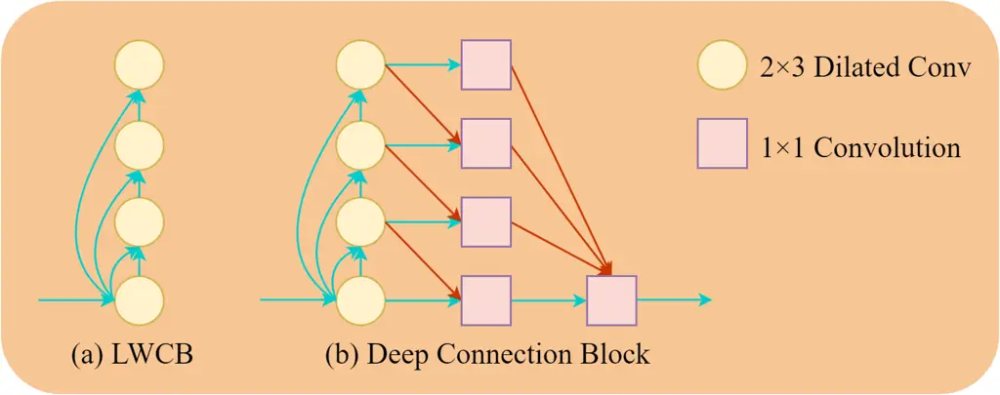
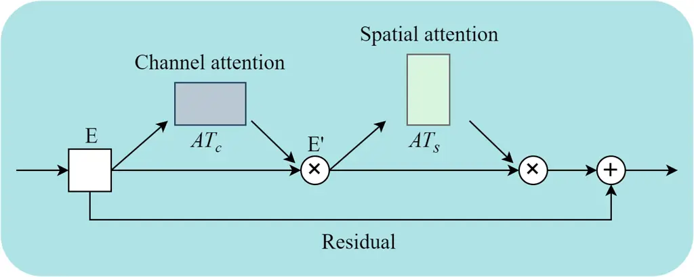
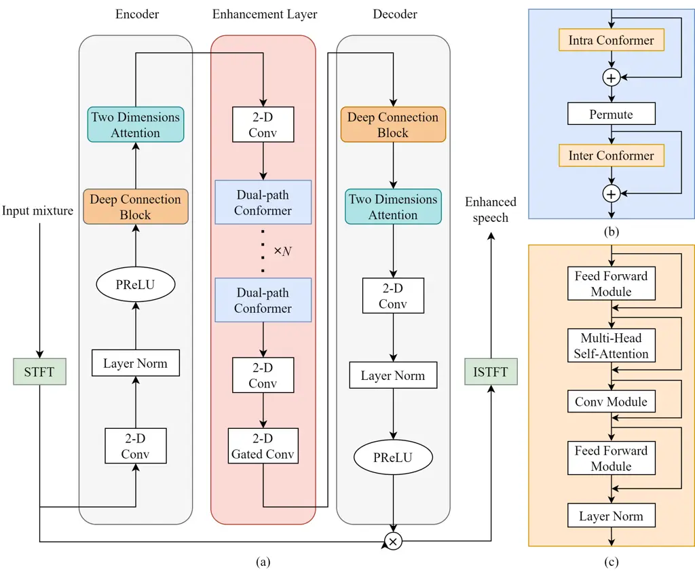

School of Electronic Information, Sichuan University, China

# Efficient Encoder-Decoder and Dual-Path Conformer for Comprehensive Feature Learning in Speech Enhancement

Junyu Wang

###### Abstract

Current speech enhancement (SE) research has largely neglected channel
attention and spatial attention, and encoder-decoder architecture-based
networks have not adequately considered how to provide efficient inputs
to the intermediate enhancement layer. To address these issues, this
paper proposes a time-frequency (T-F) domain SE network (DPCFCS-Net)
that incorporates improved densely connected blocks, dual-path modules,
convolution-augmented transformers (conformers), channel attention, and
spatial attention. Compared with previous models, our proposed model has
a more efficient encoder-decoder and can learn comprehensive features.
Experimental results on the VCTK+DEMAND dataset demonstrate that our
method outperforms existing techniques in SE performance. Furthermore,
the improved densely connected block and two dimensions attention module
developed in this work are highly adaptable and easily integrated into
existing networks.

^(†)^(†)address: ^(†)^(†)email: junyu_wang@stu.scu.edu.cn

Index Terms: speech enhancement, channel and spatial attention, densely
connected block, dual-path, conformer

## 1 Introduction

Speech enhancement (SE) is crucial in many speech processing systems,
including but not limited to speaker verification, hearing aids, and
automatic speech recognition. Single-channel SE remains a challenging
issue due to its reliance on a single speech signal for separation and
enhancement. Traditional signal-processing-based SE methods struggle to
effectively separate and eliminate interference in actual speech
signals, such as noise and reverberation, resulting in poor enhancement
results. In light of the recent success of deep learning in diverse
domains \[1, 2\], SE employing deep neural networks (DNNs) has emerged
as the prevailing approach. Based on the processing of the input signal,
the technique can typically be divided into time-frequency (T-F) domain
methods and time-domain methods. This paper mainly focuses on the T-F
domain single-channel SE.

Specifically, the time-domain approach focuses on estimating clean
speech samples directly from the original data of noisy speech samples.
Instead of fixed T-F domain transformations, this approach employs a
trainable encoder and decoder to avoid computation related to converting
between the time and frequency domains \[3, 4, 5\]. Nevertheless, the
simplicity of time-domain features may lead to a lack of
interpretability in the generated features, which limits the performance
of time-domain methods to some extent.

Most methods in the T-F domain utilize the STFT to extract input
features and training targets. Compared to the encoder and decoder that
work on a short signal window in the time-domain approach, T-F domain
models typically use a larger window size and stride size and have
stronger robustness. However, the current SE methods primarily focus on
enhancing the spectrum magnitude and utilizing the phase of the noise
mixture for signal reconstruction \[6, 7, 8\], limiting the upper limit
of enhancement performance. Some recent studies have considered complex
spectra features that maximize the preservation of phase information,
achieving better performance \[9, 10\].

Dual-path network (DPN) is a widely utilized mechanism in various areas
of speech signal processing, for example, in speech separation \[11\]
and speech recognition \[12\]. It was initially introduced in \[11\] and
has demonstrated exceptional performance by alternately learning local
and global features of sequences. In recent years, numerous studies
\[13, 14, 15\] have integrated the DPN with the transformer
architecture, enabling direct interaction between input elements and
facilitating the modelling of longer speech sequences, thereby further
enhancing the performance of the DPN. However, these studies primarily
focus on local and global information of input signals without
considering the integration of channel and spatial information with the
existing DPN. Furthermore, we observe that most of these methods fail to
consider how to provide adequate inputs to the enhancement layer in the
network. \[13\] attempted to extend the encoder and decoder functions by
introducing densely connected blocks \[16\], but the resulting
performance improvement is modest.

In light of the issues above, we present a T-F domain SE network
(DPCFCS-Net) based on deep connection blocks (DCBs), dual-path modules,
convolution-augmented transformers (conformers) \[17, 18\], channel
attention, and spatial attention. The network is composed of an encoder,
an enhancement layer, and a decoder. The encoder and decoder are based
on our proposed DCB and two dimensions attention module, aimed at
providing efficient input feature space to the enhancement layer. The
enhancement layer comprises dual-path modules and conformers. Using the
input enhanced with the representation of specific regions through the
two dimensions attention module, the dual-path conformer (DPCF) can
better alternate learning of sub-band and full-band information. In
general, our contributions are as follows:

- •
  We design a DCB to extract rich and accurate features, which
  outperforms the densely connected block in performance under lower
  computational complexity.
- •
  We introduce a module combining spatial and channel attention to
  improve the feature learning ability of the network, which can easily
  integrate into existing networks.
- •
  We propose a T-F domain SE network by integrating dual-path modules,
  conformers, DCBs, and channel and spatial attention to enable the
  model to learn comprehensive features.
- •
  Extensive experiments on the VCTK+DEMAND dataset \[19\] demonstrate
  that the SE performance of our proposed model outperforms all current
  models.

## 2 Deep connection block and two dimensions attention module

### 2.1 Deep connection block

The existing densely connected block is an improvement derived from
ResNets \[2\], which enhances the flow of information between layers by
introducing direct connections from all previous to subsequent layers,
allowing the $`n^{th}`$ layer to receive information from all preceding
layers in total $`n-1`$. However, with the increasing number of network
layers, the amount of input information received by later layers
increases greatly, significantly increasing the training burden.

To address this issue, we present a light-weighted connection block
(LWCB) and a DCB to replace the densely connected block. By utilizing
direct connections from the initial layer to all successive layers
instead of from all previous layers to subsequent layers, the proposed
LWCB not only improves the flow of information within the network but
also avoids an exponential increase in computational complexity with
increasing network layers, as shown in Figure 1(a). Inspired by the
U-Net structure \[20\] and multi-scale fusion \[21\], we appropriately
combine \[20, 21\] with the LWCB to generate the DCB, as shown in Figure
1(b). The information initially flows from bottom to top through the
various stages of the LWCB, then fuses with the adjacent blocks above to
facilitate the mutual learning of adjacent stages, and finally merges at
the bottom layer with skip connections. Compared to the single
transmission of information from bottom to top in the densely connected
block, the information transmission in the DCB starts from the bottom,
reaches the top, returns to the bottom, and merges information from
different stages, which is more conducive to learning comprehensive
features.

### 2.2 Two dimensions attention module

The attention mechanism has emerged as a crucial component of modern
deep learning models, enabling selective focus on specific portions of
the input data instead of treating the entire input uniformly.
Appropriate utilization of attention mechanisms can result in reduced
computational complexity and improved network performance. Inspired by
the successful utilization of channel and spatial attention in computer
vision \[22, 23\], we propose a two dimensions attention module for SE,
as depicted in Figure 2.

We first aggregate speech information by applying 2-D max pooling and
2-D average pooling. Subsequently, a 1-D convolution operation is
employed to generate the mapping of channel attention, which can be
represented as:

```math
\displaystyle AT_{c}(E) \displaystyle=\delta(C_{1d}(MP_{2d}(E))+C_{1d}(AP_{2d}(E))) \tag{1}
```

where $`AT_{c}()`$ is the mapping of channel attention, $`\delta`$
denotes the sigmoid activation function, $`C_{1d}()`$ represents a 1-D
convolution, and $`MP_{2d}()`$ and $`AP_{2d}()`$ denote 2-D max pooling
and 2-D average pooling, respectively.

The output $`E^{\prime}`$ of channel attention first aggregates speech
channel information through 1-D max pooling and 1-D average pooling,
followed by using a 2-D convolution layer to generate the mapping of
spatial attention, which can be represented as:

```math
\displaystyle AT_{s}(E^{\prime}) \displaystyle=\delta(C_{2d}([MP_{1d}(E^{\prime});AP_{1d}(E^{\prime})])) \tag{2}
```

where $`AT_{s}()`$ is the mapping of spatial attention, $`\delta`$
denotes the sigmoid activation function, $`C_{2d}()`$ represents a 2-D
convolution, and $`MP_{1d}()`$ and $`AP_{1d}()`$ denote 1-D max pooling
and 1-D average pooling, respectively.



Figure 1: Deep connection block and light-weighted connection block.



Figure 2: Two dimensions attention module.



Figure 3: Structure diagram of DPCFCS-Net. (a) Overall illustration. (b)
Dual-path conformer module. (c) Conformer block.

## 3 DPCFCS-Net

Our proposed model, as illustrated in Figure 3, comprises three phases:
encoder, decoder, and enhancement layer. During the encoder phase, the
mixed waveform segments are transformed into corresponding features in
the intermediate feature space. The enhancement layer then receives the
features and constructs masks for both the clean speech and noise
sources. Finally, in the decoder phase, the masked features are
transformed back into the source waveform \[14\].

### 3.1 Encoder

The encoder comprises a DCB, a two dimensions attention module, and a
1$`\times`$1 convolutional layer. Initially, the input complex
spectrogram generated by STFT undergoes convolutional layer processing
to boost the channel count from 2 to 128. Then it passed through the DCB
for adequate feature extraction. Finally, the two dimensions attention
module provides a more efficient representation of the input features to
the following enhancement layer. The inputs and outputs of the encoder
are denoted as $`X\in\mathbb{R}^{2\times T\times F}`$ and
$`U\in\mathbb{R}^{128\times T\times F}`$, respectively.

### 3.2 Enhancement layer

The enhancement layer comprises two 1$`\times`$1 convolutional layers,
$`N`$ DPCFs, and a 1$`\times`$1 gated convolutional layer. Both
convolutional layers are followed by layer normalization and SMU
activation \[24\]. The output of the encoder through the first
convolutional layer is halved in channel dimension to obtain
$`P\in\mathbb{R}^{64\times T\times F}`$, which is used as input for the
DPCF. The DPCF comprises an intra-conformer and an inter-conformer,
which respectively model sub-band and full-band information \[25\]. The
conformer block, as depicted in Figure 3(c), consists of feedforward
(FFN) modules, convolution module, multi-head self-attention (MHSA)
module, and layer normalization \[18\].

The intra-conformer block first processes the input $`P`$ to model the
sub-band features in the block length dimension $`T`$. Then, the
inter-conformer block aggregates all sub-bands information output from
the intra-conformer to learn full-band information, which acts on the
dimension of the number of blocks $`F`$. Subsequently, the last
1$`\times`$1 convolutional layer doubles the channel dimension of the
output of the DPCF to obtain $`D\in\mathbb{R}^{128\times T\times F}`$.
Finally, the 2-D gated convolutional layer smooths the enhancement layer
output value.

### 3.3 Decoder

The decoder comprises the same DCB and two dimensions attention module
as the encoder, as well as a 1$`\times`$1 convolution layer. After
passing through the enhancement layer, the output is fed into the
decoder to obtain the decoded mask features. To restore the channel
dimension of the mask, a 1$`\times`$1 convolution layer is employed. The
enhanced complex spectrogram of the speech is computed by element-wise
multiplication of the STFT output and the mask, and the final speech
waveform is obtained through the application of ISTFT.

### 3.4 Loss function

The loss function comprises both speech $`x`$ and noise $`n`$ losses
\[26\], defined as follows:

```math
\displaystyle loss_{total}(x,n) \displaystyle=\alpha loss(x,\hat{x})+(1-\alpha)loss(n,\hat{n}) \tag{3}
```

where $`\hat{x}`$ and $`\hat{n}`$ represent the estimated speech and
noise, respectively, and $`\alpha`$ is defined as
$`\alpha=\|x\|^{2}/(\|x\|^{2}+\|n\|^{2})`$.

We also apply both time-domain loss (MSE) and T-F domain loss (L1)
\[25\] to optimize the model, as described by the following formula:

```math
\displaystyle loss(x,\hat{x}) \displaystyle=\beta loss(x,\hat{x})_{T}+(1-\beta)loss(x,\hat{x})_{F} \tag{4}
```

```math
\displaystyle l \displaystyle oss(x,\hat{x})_{T}=\frac{1}{M}\sum\limits_{v=0}^{M-1}(x_{v}-\hat{x}_{v})^{2}
```

```math
\displaystyle loss(x,\hat{x})_{F} \displaystyle=\frac{1}{TF}\sum\limits_{t=0}^{T-1}\sum\limits_{f=0}^{F-1}|(|X_{r}(t,f)|-|\hat{X}_{r}(t,f)|)
```

```math
\displaystyle+(|X_{i}(t,f)|-|\hat{X}_{i}(t,f)|)|
```

where hyperparameter $`\beta`$ is set to 0.4. $`T`$ and $`F`$ represent
the number of frames and frequency bins. $`X`$ and $`\hat{X}`$ represent
the spectrogram of the clean speech and enhanced speech. $`r`$ and $`i`$
refer to the real and imaginary components. $`M`$ denotes the number of
samples in the waveform.

| Model               | Domain | PESQ | CSIG | CBAK | COVL | STOI | Params.(M) |
| ------------------- | ------ | ---- | ---- | ---- | ---- | ---- | ---------- |
| Noisy               | \-     | 1.97 | 3.35 | 2.44 | 2.63 | 0.91 | \-         |
| SEGAN \[3\]         | T      | 2.16 | 3.48 | 2.94 | 2.80 | 0.92 | 97.47      |
| MetricGAN \[8\]     | T      | 2.86 | 3.99 | 3.18 | 3.42 | \-   | \-         |
| PHASEN \[27\]       | F      | 2.99 | 4.21 | 3.55 | 3.62 | \-   | 8.76       |
| TSTNN \[13\]        | T      | 2.96 | 4.10 | 3.77 | 3.52 | 0.95 | 0.92       |
| MSSA-TCN \[28\]     | F      | 3.02 | 4.29 | 3.50 | 3.67 | 0.94 | 9.91       |
| DEMUCS \[5\]        | T      | 3.07 | 4.31 | 3.40 | 3.63 | 0.95 | 33.5       |
| SE-Conformer \[18\] | T      | 3.13 | 4.45 | 3.55 | 3.82 | 0.95 | \-         |
| DPT-FSNet \[25\]    | F      | 3.33 | 4.58 | 3.72 | 4.00 | 0.96 | 0.91       |
| DB-AIAT \[10\]      | F      | 3.31 | 4.61 | 3.75 | 3.96 | 0.96 | 2.81       |
| DPCFCS-Net          | F      | 3.42 | 4.71 | 3.88 | 4.15 | 0.96 | 2.86       |

Table 1: Performance comparison with other baseline models on the VCTK
dataset. ”-” represents the data not provided in the paper

## 4 Experiments

### 4.1 Dataset

To assess the efficacy of the presented model for SE under different
noise conditions, we use the widely used VCTK+DEMAND dataset \[19\]. The
dataset is a mixture of the DEMAND dataset \[29\] and the VoickBank
corpus \[30\]. The clean speech data comprises 12396 utterances from 30
speakers (15 male and 15 female) in the VoickBank corpus, with 28
speakers utilized for training and 2 speakers utilized for testing. The
training set for the noise set comprises 10 types of noise, including 2
artificially generated noise types and 8 from the DEMAND dataset, with
SNRs of 15, 10, 5, and 0 dB. The test set includes 5 different types of
noise, with SNRs of 17.5, 12.5, 7.5, and 2.5 dB. All speech samples are
downsampled to 16kHz.

### 4.2 Experimental setup

The window length and hop size are 25 ms and 6.25 ms, with the FFT
length of 512. In the DCB, layer normalization and SMU activation are
applied after all convolution operations, and there are four dilated
convolutions with the dilation rate increases by a multiple of two from
low to high. The number of DPCFs is 4 ($`N=4`$), and each conformer
block has four attention heads. During training, we randomly slice
speech samples into 4-second segments. The proposed model undergoes 150
epochs of training, optimized by AdamW \[31\], with an initial learning
rate of $`5e^{-4}`$ that decays by a factor of 0.95 every four epochs.

### 4.3 Evaluation metrics

We assess the effectiveness of the presented model using several
subjective and objective metrics. STOI is used to measure speech
intelligibility \[32\], with a rating of 0 to 1. PESQ is used to
evaluate speech quality \[33\], which scores from -0.5 to 4.5. For the
mean opinion score (MOS) rating scales, the CSIG score is the MOS
predictor for signal distortion, the CBAK score is the MOS predictor for
background noise interference, and the COVL score is the MOS predictor
for overall speech quality, with all MOS scores range from 1 to 5.

## 5 Results

### 5.1 Performance comparison on VCTK

Table 1 presents the performance comparison of our proposed model
DPCFCS-Net with previous models. The results indicate that our approach
outperforms all other models in all evaluation metrics with fewer model
parameters.

### 5.2 Ablation study

We conduct three experiments for comparison, among which DPCFN
represents the model without the DCB and two dimensions attention
module. The results in Table 2 show that correctly applying the DCB and
two dimensions attention module can improve the performance of the
network.

| Model      | PESQ | CSIG | CBAK | COVL | STOI |
| ---------- | ---- | ---- | ---- | ---- | ---- |
| DPCFN      | 3.25 | 4.53 | 3.67 | 3.95 | 0.95 |
| DPCFN+DCB  | 3.37 | 4.66 | 3.83 | 4.09 | 0.96 |
| DPCFCS-Net | 3.42 | 4.71 | 3.88 | 4.15 | 0.96 |

Table 2: Comparison of ablation experiment results

### 5.3 The influence of deep connection block and two dimensions attention module

To further validate the advantage of the proposed DCB and two dimensions
attention module in feature learning, we choose the DDAEC model proposed
in \[4\] as a baseline, which consists of multiple densely connected
blocks as the backbone network. Based on DDAEC, we design a comparison
model that only replaces the densely connected blocks used in DDAEC with
the proposed DCBs and two dimensions attention modules. Except for using
the VCTK dataset, all other model parameters and experimental settings
are kept the same as in \[4\]. Table 3 shows that the comparison model
outperforms DDAEC in all evaluation metrics while having a smaller model
size. This further demonstrates the effectiveness of the DCB and two
dimensions attention module.

| Model      | PESQ | CSIG | CBAK | COVL | STOI | Par.(M) |
| ---------- | ---- | ---- | ---- | ---- | ---- | ------- |
| DDAEC      | 2.23 | 3.80 | 2.57 | 3.01 | 0.90 | 4.82    |
| Comparison | 2.32 | 3.91 | 2.64 | 3.10 | 0.92 | 3.55    |

Table 3: Performance of comparison model and DDAEC

## 6 Conclusions

This paper presents a novel DPCFCS-Net for speech enhancement based on
dual-path conformers, deep connection blocks, and two dimensions
attention modules. Experiments on the VCTK dataset demonstrate that the
presented model outperforms other baselines on various performance
evaluation metrics. Additionally, we show that our deep connection block
and two dimensions attention module have the advantages of fewer
parameters and better performance compared to the widely used densely
connected block in speech enhancement. In the future, our research will
consider expanding to other tasks, such as multi-channel and
dereverberation.

## References

- \[1\] Y. Luo and N. Mesgarani, “Conv-tasnet: Surpassing ideal
  time-frequency magnitude masking for speech separation,” _IEEE/ACM
  Transactions on Audio, Speech, and Language Processing_, vol. 27,
  no. 8, pp. 1256–1266, 2019.
- \[2\] K. He, X. Zhang, S. Ren, and J. Sun, “Deep residual learning for
  image recognition,” in _IEEE Conference on Computer Vision and Pattern
  Recognition (CVPR)_, Las Vegas, NV, USA, 2017, pp. 770–778.
- \[3\] S. Pascual, A. Bonafonte, and J. Serrà, “Segan: Speech
  enhancement generative adversarial network,” in _Proc. INTERSPEECH
  2017 – 18^(th) Annual Conference of the International Speech
  Communication Association_, Stockholm, Sweden, 2017, pp. 3642–3646.
- \[4\] A. Pandey and D. L. Wang, “Densely connected neural network with
  dilated convolutions for real-time speech enhancement in the time
  domain,” in _IEEE International Conference on Acoustics, Speech and
  Signal Processing (ICASSP)_, Barcelona, Spain, 2020, pp. 6629–6633.
- \[5\] A. Defossez, G. Synnaeve, and Y. . Adi, “Real time speech
  enhancement in the waveform domain,” in _Proc. INTERSPEECH 2020 –
  21^(st) Annual Conference of the International Speech Communication
  Association_, Shanghai, China, 2020, pp. 3291–3295.
- \[6\] Y. Xu, J. Du, L.-R. Dai, and C.-H. Lee, “A regression approach
  to speech enhancement based on deep neural networks,” _IEEE/ACM
  Transactions on Audio, Speech, and Language Processing_, vol. 23,
  no. 1, pp. 7–19, 2015.
- \[7\] K. Tan, J. Chen, and D. L. Wang, “Gated residual networks with
  dilated convolutions for supervised speech separation,” in _IEEE
  International Conference on Acoustics, Speech and Signal Processing
  (ICASSP)_, Calgary, Canada, 2018, pp. 21–25.
- \[8\] S.-W. Fu, C.-F. Liao, Y. Tsao, and S.-D. Lin, “Metricgan:
  Generative adversarial networks based black-box metric scores
  optimization for speech enhancement,” in _International Conference on
  Machine Learning (ICML)_, 2019, pp. 2031–2041.
- \[9\] A. Li _et al._, “Two heads are better than one: A two-stage
  complex spectral mapping approach for monaural speech enhancement,”
  _IEEE/ACM Transactions on Audio, Speech, and Language Processing_,
  vol. 29, pp. 1829–1843, 2021.
- \[10\] G. Yu _et al._, “Dual-branch attention-in-attention transformer
  for single-channel speech enhancement,” in _IEEE International
  Conference on Acoustics, Speech and Signal Processing (ICASSP)_,
  Singapore, 2022, pp. 7847–7851.
- \[11\] Y. Luo, Z. Chen, and T. Y. oshioka, “Dual-path rnn: efficient
  long sequence modeling for time-domain single-channel speech
  separation,” in _IEEE International Conference on Acoustics, Speech
  and Signal Processing (ICASSP)_, Barcelona, Spain, 2020, pp. 46–50.
- \[12\] K. Hu, R. Pang, T. N. Sainath, and T. Strohman, “Transformer
  based deliberation for two-pass speech recognition,” in _IEEE Spoken
  Language Technology Workshop (SLT)_, Shenzhen, China, 2021, pp. 68–74.
- \[13\] K. Wang, B. He, and W.-P. Zhu, “Tstnn: Two-stage transformer
  based neural network for speech enhancement in the time domain,” in
  _IEEE International Conference on Acoustics, Speech and Signal
  Processing (ICASSP)_, 2021, pp. 7098–7102.
- \[14\] Z. Zhang, B. He, and Z. Zhang, “Transmask: A compact and fast
  speech separation model based on transformer,” in _IEEE International
  Conference on Acoustics, Speech and Signal Processing (ICASSP)_, 2021,
  pp. 5764–5768.
- \[15\] L. Yang, W. Liu, and W. Wang, “Tfpsnet: Time-frequency domain
  path scanning network for speech separation,” in _IEEE International
  Conference on Acoustics, Speech and Signal Processing (ICASSP)_,
  Singapore, 2022, pp. 6842–6846.
- \[16\] G. Huang, Z. Liu, L. Van Der Maaten, and K. Q. Weinberger,
  “Densely connected convolutional networks,” in _IEEE Conference on
  Computer Vision and Pattern Recognition (CVPR)_, Honolulu, HI, USA,
  2017, pp. 2261–2269.
- \[17\] A. Gulati _et al._, “Conformer: Convolution-augmented
  transformer for speech recognition,” in _Proc. INTERSPEECH 2020 –
  21^(st) Annual Conference of the International Speech Communication
  Association_, Shanghai, China, 2020, pp. 5036–5040.
- \[18\] E. Kim and H. Seo, “Se-conformer: Time-domain speech
  enhancement using conformer,” in _Proc. INTERSPEECH 2021 – 22^(nd)
  Annual Conference of the International Speech Communication
  Association_, Brno, Czech, 2021, pp. 2736–2740.
- \[19\] C. V. alentini Botinhao, X. Wang, S. Takaki, and J. Yamagishi,
  “Investigating rnn-based speech enhancement methods for noise-robust
  text-to-speech,” in _Proc. SSW 9^(th) ISCA Workshop on Speech
  Synthesis Workshop_, 2016, pp. 146–152.
- \[20\] O. Ronneberger, P. Fischer, and T. Brox, “U-net: Convolutional
  networks for biomedical image segmentation,” in _International
  Conference on Medical Image Computing and Computer Assisted
  Intervention (MICCAI)_, Munich, Germany, 2015, pp. 234–241.
- \[21\] X. Hu _et al._, “Speech separation using an asynchronous fully
  recurrent convolutional neural network,” in _Advances in Neural
  Information Processing Systems (NeurIPS)_, 2021, pp. 22 509–22 522.
- \[22\] S. Woo, J. Park, J.-Y. Lee, and I. S. Kweon, “Cbam:
  Convolutional block attention module,” in _Proceedings of the European
  Conference on Computer Vision (ECCV)_, Munich, Germany, 2018, pp.
  3–19.
- \[23\] J. Hu _et al._, “Squeeze-and-excitation networks,” _IEEE
  Transactions on Pattern Analysis and Machine Intelligence_, vol. 42,
  no. 8, pp. 2011–2023, 2020.
- \[24\] K. Biswas, S. Kumar, S. Banerjee, and A. K. Pandey, “Smooth
  maximum unit: Smooth activation function for deep networks using
  smoothing maximum technique,” in _IEEE Conference on Computer Vision
  and Pattern Recognition (CVPR)_, New Orleans, USA, 2022, pp. 784–793.
- \[25\] F. Dang, H. Chen, and P. Zhang, “Dpt-fsnet: Dual-path
  transformer based full-band and sub-band fusion network for speech
  enhancement,” in _IEEE International Conference on Acoustics, Speech
  and Signal Processing (ICASSP)_, Singapore, 2022, pp. 6857–6861.
- \[26\] W. Shin _et al._, “Multi-view attention transfer for efficient
  speech enhancement,” in _Proc. INTERSPEECH 2022 – 23^(rd) Annual
  Conference of the International Speech Communication Association_,
  Incheon, Korea, 2022, pp. 1198–1202.
- \[27\] D. Yin, C. Luo, Z. Xiong, and W. Zeng, “Phasen: A
  phase-and-harmonics-aware speech enhancement network,” in _Proceedings
  of the AAAI Conference on Artificial Intelligence_, vol. 34, no. 05,
  New York, USA, 2020, pp. 9458–9465.
- \[28\] J. Lin, A. J. d. L. van Wijngaarden, K.-C. Wang, and M. C.
  Smith, “Speech enhancement using multi-stage self-attentive temporal
  convolutional networks,” _IEEE/ACM Transactions on Audio, Speech, and
  Language Processing_, vol. 29, pp. 3440–3450, 2021.
- \[29\] J. Thiemann, N. Ito, and E. Vincent, “The diverse environments
  multi-channel acoustic noise database (demand): A database of
  multichannel environmental noise recordings,” in _Proceedings of
  Meetings on Acoustics_, vol. 19, no. 1, Acoustical Society of America,
  2013, p. 035081.
- \[30\] C. Veaux, J. Yamagishi, and S. King, “The voice bank corpus:
  Design, collection and data analysis of a large regional accent speech
  database,” in _2013 International Conference Oriental COCOSDA held
  jointly with 2013 Conference on Asian Spoken Language Research and
  Evaluation (O-COCOSDA/CASLRE)_, 2013, pp. 1–4.
- \[31\] I. Loshchilov and F. Hutter, “Decoupled weight decay
  regularization,” in _International Conference on Learning
  Representations (ICLR)_, New Orleans, USA, 2019, pp. 1–14.
- \[32\] C. H. Taal _et al._, “An algorithm for intelligibility
  prediction of time-frequency weighted noisy speech,” _IEEE/ACM
  Transactions on Audio, Speech, and Language Processing_, vol. 19,
  no. 7, pp. 2125–2136, 2011.
- \[33\] A. Rix, J. Beerends, M. Hollier, and A. Hekstra, “Perceptual
  evaluation of speech quality (pesq)-a new method for speech quality
  assessment of telephone networks and codecs,” in _IEEE International
  Conference on Acoustics, Speech and Signal Processing (ICASSP)_, Salt
  Lake City, Utah, USA, 2001, pp. 749–752.
