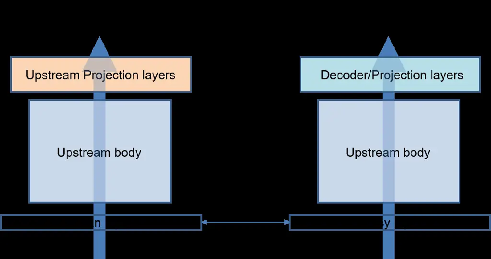
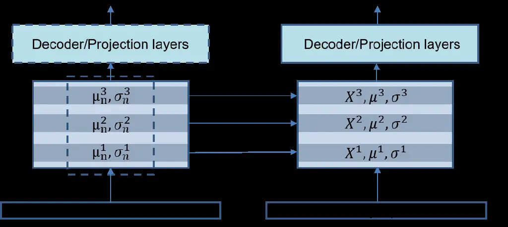
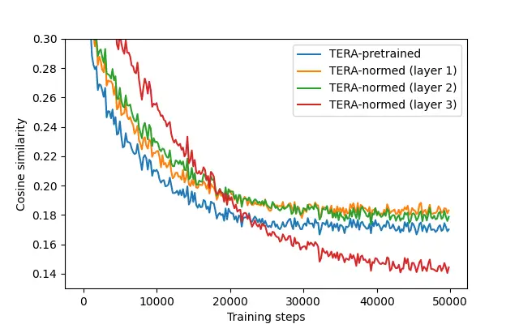

Dept. of Electrical and Electronic Engineering, Yonsei University, South
Korea

# Feature Normalization for Fine-tuning Self-Supervised Models in Speech Enhancement

Hejung Yang, Hong-Goo Kang

###### Abstract

Large, pre-trained representation models trained using self-supervised
learning have gained popularity in various fields of machine learning
because they are able to extract high-quality salient features from
input data. As such, they have been frequently used as base networks for
various pattern classification tasks such as speech recognition.
However, not much research has been conducted on applying these types of
models to the field of speech signal generation. In this paper, we
investigate the feasibility of using pre-trained speech representation
models for a downstream speech enhancement task. To alleviate mismatches
between the input features of the pre-trained model and the target
enhancement model, we adopt a novel feature normalization technique to
smoothly link these modules together. Our proposed method enables
significant improvements in speech quality compared to baselines when
combined with various types of pre-trained speech models.

^(†)^(†)address: ^(†)^(†)email: hejung.yang@dsp.yonsei.ac.kr,
hgkang@yonsei.ac.kr

Index Terms: speech enhancement, self-supervised model, feature
normalization

## 1 Introduction

Large, pre-trained models trained using self-supervised learning have
become popular in various speech processing tasks \[1, 2\]. Due to their
ability to leverage representations learned from large amounts of
unlabeled data, these models have been successfully applied to a wide
variety of downstream tasks such as automatic speech recognition (ASR),
speaker verification (SV) \[3\], and audio scene classification \[4\].

Depending on the characteristics of their training objectives, these
pre-trained models can be categorized into either generative models or
contrastive models \[5\]. In generative models, decoders are trained to
reconstruct masked frames or future frames; they include models such as
APC \[6\], Mockingjay \[7\], and TERA \[8\]. Contrastive models are
trained by utilizing similarities and differences between latent
embeddings. A representative example is wav2vec 2.0 \[2\], and several
variants such as HuBERT \[9\] and WavLM \[10\] have been proposed that
adopt various types of regularizers for each target objective.
Meanwhile, some models utilize both generative and contrastive
objectives, such as PASE+ \[11\]. Most upstream models adopting
self-supervised pre-training for speech applications have focused on
solving discriminative tasks \[12\]. Recently, several attempts \[13,
14\] have been made to apply these models for speech enhancement (SE) or
speech separation tasks.



Figure 1: Domain mismatch when using pre-trained upstream body trained
on clean data for speech enhancement task.

When pre-trained speech models are used for SE, it is inevitable that
they encounter a domain mismatch problem. This is because most of these
pre-trained models are trained on clean data, while the SE task
fundamentally requires corrupted or noisy speech inputs (Fig. 1).
Although this domain mismatch problem can be relieved by pre-training
the upstream models with both noisy and clean data \[15\], this requires
a huge amount of data and additional training time, which takes much
longer than fine-tuning a downstream model with labeled data. Another
drawback is that this precludes the use of well-trained upstream models
that have been made publicly available online.

In this paper, we propose an effective feature normalization technique
that facilitates the use of representations from pre-trained speech
models on a downstream SE task. To alleviate the dissonance between the
noisy inputs fed into the downstream model in the fine-tuning phase and
the initial weight distribution of the upstream body trained with clean
speech, we normalize the latent features from the noisy input with its
clean referential statistics, which can be estimated by feeding clean
targets to the frozen upstream model. By adjusting the degree of
normalization during training, the model can smoothly change its input
domain from clean to noisy, thereby improving SE performance in the end.
More generally, it can be applied to any type of downstream task that
utilizes such pre-trained models.

Our contributions are as follows: 1) With our proposed feature
normalization technique applied during training, we show that it is
possible to achieve better SE performance when using the representations
from pre-trained speech models without introducing any additional
parameters or training losses. 2) We can directly utilize these
pre-trained models without the need for any additional domain-adaptation
to calibrate the pre-trained models or to train them from scratch.

The rest of the paper is organized as follows. After describing the
related works in section 2, base downstream models trained on top of
different upstream architectures are introduced in section 3. Section 4
depicts feature normalization algorithm, and results are presented in
section 5 and 6.

## 2 Related work

Previous works have shown that the domain mismatch between the
pre-training and fine-tuning phases degrades the performance of the
downstream models that utilize pre-trained speech representations \[15,
16\]. Utilizing target-domain data in the pre-training stage can
mitigate the degradation \[15, 17\], but this requires additional
training which removes the efficiency we can obtain by using existing
pre-trained models.

One algorithm for domain adaptation is Domain Adversarial Training
(DAT), where the domain classifier is trained adversarially so that the
representation cannot be identified by the domain context \[18\]. DAT
has been applied to various supervised tasks including domain-specific
ASR, SV and SE \[19, 20, 21\]. However, it requires multi-task learning
for training the domain classifier with a categorization of domain
classes. Other methods include residual adapters \[22\] or auxiliary
contrastive loss \[23\]. However, injection of new parameters dedicated
for domain adaptation or training paths for multi-task training
complicates the base model training.

While most previous works focus on more generic cases of domain
mismatch, we focus specifically on the domain mismatch between the
domain on which the pre-trained models were trained and the domain on
which they are fine-tuned in the context of SE. SE models utilize pairs
of clean and noisy speech for training. Under the assumption that
pre-trained speech models are trained using clean data, the paired
fine-tuning data can be treated as a pair consisting of source-domain
data (clean speech) and target-domain data (noisy speech). Thus, during
fine-tuning, we can extract both source- and target-domain statistics.
Our proposed method is related to utilizing these estimated statistics
without requiring any additional trainable variables or pre-training
phases. Our method shifts the distribution of the latent features from
the target-domain to the source-domain to alleviate domain conflicts
during fine-tuning. To smoothly adjust the model from source-domain
features to target-domain features, we decrease the shifting factor
during the fine-tuning phase.

## 3 Base model

For our experiments, we used several Mockingjay variants (Mockingjay,
TERA) and wav2vec 2.0 variants (wav2vec 2.0, WavLM, HuBERT) as the base
upstream models. The Mockingjay variants use generative learning methods
and the wav2vec 2.0 variants use contrastive learning methods. We
followed the BASE setups for all of the models, and implemented
appropriate SE networks depending on their architectures and the
structure of the projection layers.

### 3.1 Base Mockingjay downstream

Mockingjay is a speech representation network which consists of a
multi-layer transformer encoder \[7\]. During the pre-training phase,
the output of the transformer encoder is fed to feed-forward projection
layers to predict masked frames. Given this, we implemented an SE
network by adding a single convolutional layer on top of the body, which
is trained to generate the real and imaginary parts of cIRM masks
\[24\]. In other words, our downstream model is trained to predict the
complex masks of each time-frequency bin, and the estimated complex
masks are multiplied with the complex noisy inputs to obtain noise
suppressed outputs.

### 3.2 Base wav2vec 2.0 downstream

Wav2vec 2.0 consists of a multi-layer feature encoder followed by a
transformer encoder \[2\]. In the pre-training phase, latent features
extracted from the feature encoder are quantized, and they are used as a
target for training with a BERT-style objective \[25\]. To implement the
downstream SE model, we added a U-Net style decoder \[26\] that would
utilize representations from the transformer encoder and the feature
encoder. Specifically, we used the output of the first layer of the
transformer encoder as the bottleneck feature of our SE model. This took
into account prior work that found lower layers to contribute more
informative features for the SE task \[13\]. From the bottleneck
feature, a stack of deconvolution layers are paired with the output of
the feature encoder layers in reverse order. The features from the
feature encoders are passed into point-wise convolutions for dimension
reduction, concatenated with the corresponding decoder features and
passed to the next deconvolution layers.

## 4 Feature normalization

|                         |           |          |          |          |          |
| ----------------------- | --------- | -------- | -------- | -------- | -------- |
|   Methods               |   WB-PESQ |   STOI   |   CSIG   |   CBAK   |   COVL   |
|   Mockingjay(TERA)-base |   2.3872  |   0.9077 |   3.7864 |   2.9504 |   3.0675 |
|   Mockingjay-pretrained |   2.9349  |   0.9440 |   4.3145 |   2.7592 |   3.6241 |
|   Mockingjay-normed     |   3.0096  |   0.9401 |   4.3500 |   3.4208 |   3.6810 |
|   TERA-pretrained       |   2.9909  |   0.9439 |   4.3539 |   2.6352 |   3.6738 |
|   TERA-normed           |   3.0729  |   0.9438 |   4.3915 |   2.6941 |   3.7336 |
|   wav2vec2.0-base       |   2.6646  |   0.9399 |   4.1113 |   2.9734 |   3.3905 |
|   wav2vec2.0-pretrained |   2.7223  |   0.9394 |   4.1793 |   3.0136 |   3.4556 |
|   wav2vec2.0-normed     |   2.7861  |   0.9437 |   4.2531 |   3.0497 |   3.5290 |
|   wavlm-pretrained      |   2.6687  |   0.9418 |   4.1187 |   3.2075 |   3.3973 |
|   wavlm-normed          |   2.7796  |   0.9440 |   4.2485 |   3.2924 |   3.5222 |
|   HuBERT-pretrained     |   2.7106  |   0.9436 |   4.1905 |   3.2420 |   3.4572 |
|   HuBERT-normed         |   2.7838  |   0.9447 |   4.2474 |   3.2513 |   3.5241 |
|   DEMUCS \[27\]         |   3.0700  |   0.9500 |   4.3100 |   3.4000 |   3.6300 |
|   SE-Conformer \[28\]   |   3.1300  |   0.9500 |   4.4500 |   3.5500 |   3.8200 |

Table 1: Performance of various models. For generative models
(Mockingjay, TERA), the first layer is normalized. Second layer is
normalized in case of wav2vec 2.0 variants.



Figure 2: Visualization of the normalization of latent features with
accumulated statistics across the training corpus.

Consider a latent feature $`X\in\mathcal{R}^{d}`$ from the upstream body
of the network under dimension $`d`$. Given its mean
$`\mu\in\mathcal{R}^{d}`$ and standard deviation (std)
$`\sigma\in\mathcal{R}^{d}`$, we can calculate the normalized feature
$`X_{n}`$ with new target mean $`\mu_{n}`$ and std $`\sigma_{n}`$ as
follows:

```math
\displaystyle X_{n} \displaystyle=\frac{X-{\mu}}{\sigma}{\sigma}_{n}+{\mu}_{n} \tag{1}
```

```math
\displaystyle=\frac{{\sigma}_{n}}{\sigma}X+({\mu}_{n}-\frac{{\sigma}_{n}}{\sigma}{\mu}) \tag{2}
```

```math
\displaystyle={r_{n}}X+({\mu}_{n}-r_{n}{\mu}),\text{ where }{r_{n}}={\sigma}_{n}/{\sigma}. \tag{3}
```

Fig. 2 shows the proposed feature normalization method that maintains
latent statistics $`r_{n}`$, $`{\mu}_{n}`$ and $`{\mu}`$ required when
normalizing the latent feature. Through normalization, the (noisy) input
features follow the same statistics as the corresponding clean features.
We used the exponentially moving average (EMA) method for each feature
to recursively estimate the statistics of the features in the training
corpus.

We gradually decrease the normalization effect by controlling a scale
factor $`k`$. $`k`$ becomes zero when the model is close to reaching
convergence, which means that normalization is barely done at this
stage. This factor scheduling method means that the model does not
require additional statistical parameters $`r_{n}`$, $`{\mu}_{n}`$ and
$`{\mu}`$ during evaluation. The re-normalized feature $`\hat{X}_{n}`$
with the scale factor can be calculated as follows:

```math
\displaystyle\delta_{n} \displaystyle=k(X_{n}-X) \tag{4}
```

```math
\displaystyle=k\left(\frac{{\sigma}_{n}}{\sigma}-1\right)X+k\left({\mu}_{n}-\frac{{\sigma}_{n}}{\sigma}{\mu}\right), \tag{5}
```

```math
\displaystyle\hat{X}_{n} \displaystyle=X+\delta_{n} \tag{6}
```

```math
\displaystyle=\frac{k{\sigma}_{n}+(1-k){\sigma}}{\sigma}X+k\left({\mu}_{n}-\frac{{\sigma}_{n}}{\sigma}{\mu}\right). \tag{7}
```

The detailed process can be found in Algorithm 1.

Input: pair of noisy input $`x`$ and clean output $`y`$, factor $`k`$,
momentums $`beta_{m}`$ and $`beta_{r}`$

$`x_{0},y_{0}=x,y`$;

for _each layer $`l`$ in upstream body_ do

   if _normalize layer $`l`$_ then

      extract statistics $`\hat{\mu},\hat{\sigma}`$ from $`x_{l}`$;

      extract statistics $`\hat{\mu_{n}},\hat{\sigma_{n}}`$ from
$`y_{l}`$;

      $`\hat{r}=\hat{\sigma_{n}}/\hat{\sigma}`$ ;

      $`\mu^{l}\leftarrow beta^{l}_{m}*\mu^{l}+(1-beta^{l}_{m})*\hat{\mu}`$
;

      $`\mu^{l}_{n}\leftarrow beta^{l}_{m}*\mu^{l}_{n}+(1-beta^{l}_{m})*\hat{\mu_{n}}`$
;

      $`r^{l}\leftarrow beta^{l}_{r}*r^{l}+(1-beta^{l}_{r})*\hat{r}`$ ;

      $`\hat{x_{l}}=x_{l}+k(r^{l}*x_{l}+(\mu^{l}_{n}-r^{l}\mu^{l})-x_{l})`$;

      $`x_{l+1}=layer(\hat{x_{l}})`$;

      $`y_{l+1}=layer_{frozen}(y_{l})`$;

   end if

   else

      $`x_{l+1}=layer(x_{l})`$;

   end if

end for

Algorithm 1 single step of feature normalization

From an implementation point of view, a frozen duplicate of the upstream
body, ranging from the first layer to the layer in which the last
normalization occurs, must be maintained, as denoted by
$`layer_{frozen}`$ in Algorithm 1. The frozen layer is used for
extracting clean latent features not affected by the training status.
The number of additional frozen parameters retained during training is
negligible from the fact that the normalization occurs at the very
beginning of each layer.

## 5 Experimental Setup

### 5.1 Data

We used pre-trained Mockingjay, TERA, wav2vec 2.0, WavLM, and HuBERT
trained using the Librispeech-960hr dataset \[29\]. For the training and
evaluation of the downstream models, we used the Voicebank-DEMAND corpus
\[30\] after downsampling to 16kHz. Training data was cropped to
correspond to 2 seconds or 1 second for the Mockingjay variants and
wav2vec 2.0 variants, respectively. The Mockingjay variants were trained
for 50k iterations with a batch size of 8, while wav2vec 2.0 variants
were trained for 100k iterations with a batch size of 8. For evaluation,
we used WB-PESQ, a wideband version of PESQ \[31\], and STOI \[32\].

### 5.2 Model details

For Mockingjay variants, training was performed with cIRM loss,
time-domain MSE loss, and MSTFT loss \[33\]. For cIRM loss, $`K=10`$ and
$`C=0.1`$ are used. For MSTFT loss, we set three sub-losses
$`L^{(1)}_{s}`$, $`L^{(2)}_{s}`$ and $`L^{(3)}_{s}`$ with FFT size,
window size, and frame shift (1024, 400, 80), (2048, 800, 160), and
(512, 160, 32), respectively. For wav2vec 2.0 variants, training was
performed with time-domain MSE loss and MSTFT loss following the same
configurations as above.

We linearly decreased the scaling factor $`k`$ towards zero during
training. $`k`$ was initially set to 0.5 for the wav2vec 2.0 variants,
0.8 for TERA, and 1.0 for Mockingjay. Experiments on different factor
scheduling schemes besides linear decay showed no significant
differences in output performance. Momentum for $`\mu`$ and $`r`$ were
set to 0.99 and 0.999 respectively.

|                               |           |          |          |          |          |
| ----------------------------- | --------- | -------- | -------- | -------- | -------- |
|   Methods                     |   WB-PESQ |   STOI   |   CSIG   |   CBAK   |   COVL   |
|   TERA-pretrained             |   2.9909  |   0.9439 |   4.3539 |   2.6352 |   3.6738 |
|   TERA-normed (layer 1)       |   3.0729  |   0.9438 |   4.3915 |   2.6941 |   3.7336 |
|   TERA-normed (layer 2)       |   3.0318  |   0.9440 |   4.3717 |   2.7316 |   3.7031 |
|   TERA-normed (layer 3)       |   3.0028  |   0.9415 |   4.3587 |   2.6455 |   3.6825 |
|   wav2vec2.0-pretrained       |   2.7223  |   0.9394 |   4.1793 |   3.0136 |   3.4556 |
|   wav2vec2.0-normed (layer 1) |   2.7692  |   0.9441 |   4.2330 |   2.5209 |   3.5099 |
|   wav2vec2.0-normed (layer 2) |   2.7861  |   0.9437 |   4.2531 |   3.0497 |   3.5290 |
|   wav2vec2.0-normed (layer 3) |   2.3002  |   0.9219 |   3.7291 |   2.8974 |   3.0007 |
|   wav2vec2.0-normed (layer 4) |   2.6417  |   0.9376 |   4.1099 |   2.9611 |   3.3756 |

Table 2: Performance of TERA and wav2vec 2.0 based downstream models
with different normalization layers.

## 6 Results

### 6.1 Results on downstream models

Table 1 shows the results of applying our proposed feature normalization
to several upstream models. Methods with the suffix “base” refer to a
model with random weight initialization. Models are tagged as
“pretrained” if they are initialized with pre-trained weights, and
further noted as “normed” if feature normalization is applied during
training. The results show that feature normalization improves both
WB-PESQ and STOI for almost every type of model, demonstrating that the
feature normalization scheme is effective and model agnostic. We also
note that for the generative models, performance nearly matches that of
other SE-specific architectures including DEMUCS \[27\] and SE-Conformer
\[28\].

One interesting aspect of the results is the improvement ratios between
the generative and contrastive models. For generative models, initial
baseline performance tends to be lower than that of the contrastive
models, but their performance improves significantly after loading
pre-trained weights. This is possibly due to the generative models being
trained to fill in masked frames, which causes them to capture more
local information between frames, whereas contrastive models tend to
learn high-level semantics which capture global-level dependencies.

### 6.2 Effect of normalization layer

Table 2 shows the results when normalizing each layer of TERA and
wav2vec 2.0. We can see that the improvement rate increases when
normalization is applied to the lower layers. This is perhaps
unsurprising, given that domain mismatch has the greatest impact on
performance at lower layers. Additionally, we hypothesize that the
non-linearities introduced by stacking multiple layers with non-linear
activations contributes to these results. Instead of linear
normalization, non-linear smoothing that takes into account the
non-linearities in the overall network may help improve results in later
layers.



Figure 3: Cosine similarities between the clean feature from and the
noisy features with different layer normalizations.

To further inspect the effect of normalization in each layer, we
evaluated cosine similarities of the encoder output features between
clean and noisy inputs. Figure 3 shows the similarities between the
clean reference features and the features from the noisy input with
normalization applied to each of the layers over the course of training.
The features have higher similarities when lower layers are normalized
during training. This implies that normalization in the lower layers
helps the upstream body maintain the clean feature semantics and avoid
catastrophic forgetting, which can occur when domain adaptation is done
during fine-tuning. Conversely, applying normalization to the highest
layer led to higher similarities in the early stages of training, but a
rapid drop later on. This suggests that choosing proper normalization
layers can either make the upstream body maintain its good
representative power from the pre-training phase or confuse the network
and cause it to lose its ability to generalize.

## 7 Conclusions

We introduced a feature normalization method for representations from
pre-trained speech models that facilitate the use of these
representations for downstream speech enhancement. By normalizing the
features from noisy inputs to have the same statistics as clean
reference inputs, we were able to significantly improve enhancement
performance when fine-tuning several different pre-trained speech
models. Our results showed that meaningful improvements occur the most
when feature normalization is applied only to the lower layers of the
pre-trained model. This implies that, for features from higher layers,
more sophisticated normalization methods may need to be designed to deal
with the various non-linearities in the network.

For future work, we will study more generic feature normalization that
can be applied to representations from multiple layers within a network.
Additionally, domain mismatch can arise in speech separation tasks.
Speech separation model needs to be trained on input with multiple
speakers, but a pre-trained upstream model may have been trained on
single-speaker data. To further explore the use of pre-trained models in
downstream tasks, we aim to extend our feature normalization approach to
speech separation and gain additional insights.

## References

- \[1\] A. v. d. Oord _et al._, “Representation learning with
  contrastive predictive coding,” _arXiv preprint
  arXiv:1807.03748_, 2018.
- \[2\] A. Baevski _et al._, “wav2vec 2.0: A framework for
  self-supervised learning of speech representations,” _Advances in
  Neural Information Processing Systems_, vol. 33, pp.
  12 449–12 460, 2020.
- \[3\] W. Xia _et al._, “Self-supervised text-independent speaker
  verification using prototypical momentum contrastive learning,” in
  _ICASSP 2021-2021 IEEE International Conference on Acoustics, Speech
  and Signal Processing (ICASSP)_. IEEE, 2021, pp. 6723–6727.
- \[4\] A. M. Tripathi and A. Mishra, “Self-supervised learning for
  environmental sound classification,” _Applied Acoustics_, vol. 182, p.
  108183, 2021.
- \[5\] X. Liu _et al._, “Self-supervised learning: Generative or
  contrastive,” _IEEE Transactions on Knowledge and Data
  Engineering_, 2021.
- \[6\] Y.-A. Chung _et al._, “An unsupervised autoregressive model for
  speech representation learning,” in _Proc. Interspeech 2019_, 2019,
  pp. 146–150.
- \[7\] A. T. Liu _et al._, “Mockingjay: Unsupervised speech
  representation learning with deep bidirectional transformer encoders,”
  in _ICASSP 2020-2020 IEEE International Conference on Acoustics,
  Speech and Signal Processing (ICASSP)_. IEEE, 2020, pp. 6419–6423.
- \[8\] ——, “Tera: Self-supervised learning of transformer encoder
  representation for speech,” _IEEE/ACM Transactions on Audio, Speech,
  and Language Processing_, vol. 29, pp. 2351–2366, 2021.
- \[9\] W.-N. Hsu _et al._, “Hubert: Self-supervised speech
  representation learning by masked prediction of hidden units,”
  _IEEE/ACM Transactions on Audio, Speech, and Language Processing_,
  vol. 29, pp. 3451–3460, 2021.
- \[10\] S. Chen _et al._, “Wavlm: Large-scale self-supervised
  pre-training for full stack speech processing,” _IEEE Journal of
  Selected Topics in Signal Processing_, 2022.
- \[11\] M. Ravanelli _et al._, “Multi-task self-supervised learning for
  robust speech recognition,” in _ICASSP 2020-2020 IEEE International
  Conference on Acoustics, Speech and Signal Processing (ICASSP)_. IEEE,
  2020, pp. 6989–6993.
- \[12\] S.-w. Yang _et al._, “Superb: Speech processing universal
  performance benchmark,” in _Proc. Interspeech 2021_, 2021, pp.
  1194–1198.
- \[13\] Z. Huang _et al._, “Investigating self-supervised learning for
  speech enhancement and separation,” in _ICASSP 2022-2022 IEEE
  International Conference on Acoustics, Speech and Signal Processing
  (ICASSP)_. IEEE, 2022, pp. 6837–6841.
- \[14\] K.-H. Hung _et al._, “Boosting self-supervised embeddings for
  speech enhancement,” in _Proc. Interspeech 2022_, 2022, pp. 186–190.
- \[15\] W.-N. Hsu _et al._, “Robust wav2vec 2.0: Analyzing domain shift
  in self-supervised pre-training,” in _Proc. Interspeech 2021_, 2021,
  pp. 721–725.
- \[16\] Y. Meng _et al._, “Don’t speak too fast: The impact of data
  bias on self-supervised speech models,” in _ICASSP 2022-2022 IEEE
  International Conference on Acoustics, Speech and Signal Processing
  (ICASSP)_. IEEE, 2022, pp. 3258–3262.
- \[17\] D. Hwang _et al._, “Large-scale asr domain adaptation using
  self-and semi-supervised learning,” in _ICASSP 2022-2022 IEEE
  International Conference on Acoustics, Speech and Signal Processing
  (ICASSP)_. IEEE, 2022, pp. 6627–6631.
- \[18\] Y. Ganin _et al._, “Domain-adversarial training of neural
  networks,” _The journal of machine learning research_, vol. 17, no. 1,
  pp. 2096–2030, 2016.
- \[19\] S. Sun _et al._, “Domain adversarial training for accented
  speech recognition,” in _2018 IEEE International Conference on
  Acoustics, Speech and Signal Processing (ICASSP)_. IEEE, 2018, pp.
  4854–4858.
- \[20\] Q. Wang _et al._, “Unsupervised domain adaptation via domain
  adversarial training for speaker recognition,” in _2018 IEEE
  International Conference on Acoustics, Speech and Signal Processing
  (ICASSP)_. IEEE, 2018, pp. 4889–4893.
- \[21\] C.-F. Liao _et al._, “Noise adaptive speech enhancement using
  domain adversarial training,” in _Proc. Interspeech 2019_, 2018, pp.
  3148–3152.
- \[22\] R. Fan and A. Alwan, “Draft: A novel framework to reduce domain
  shifting in self-supervised learning and its application to children’s
  asr,” in _Proc. Interspeech 2022_, 2022, pp. 4900–4904.
- \[23\] Z. Chen _et al._, “Self-supervised learning based domain
  adaptation for robust speaker verification,” in _ICASSP 2021-2021 IEEE
  International Conference on Acoustics, Speech and Signal Processing
  (ICASSP)_. IEEE, 2021, pp. 5834–5838.
- \[24\] D. S. Williamson _et al._, “Complex ratio masking for monaural
  speech separation,” _IEEE/ACM transactions on audio, speech, and
  language processing_, vol. 24, no. 3, pp. 483–492, 2015.
- \[25\] J. D. M.-W. C. Kenton and L. K. Toutanova, “Bert: Pre-training
  of deep bidirectional transformers for language understanding,” in
  _Proceedings of NAACL-HLT_, 2019, pp. 4171–4186.
- \[26\] D. Stoller _et al._, “Wave-u-net: A multi-scale neural network
  for end-to-end audio source separation,” in _Proceedings of the 19th
  International Society for Music Information Retrieval
  Conference_. ISMIR, 2018, pp. 334–340.
- \[27\] A. Defossez _et al._, “Real time speech enhancement in the
  waveform domain,” in _Proc. Interspeech 2020_, 2020, pp. 3291–3295.
- \[28\] E. Kim _et al._, “Se-conformer: Time-domain speech enhancement
  using conformer.” in _Interspeech_, 2021, pp. 2736–2740.
- \[29\] V. Panayotov _et al._, “Librispeech: an asr corpus based on
  public domain audio books,” in _2015 IEEE international conference on
  acoustics, speech and signal processing (ICASSP)_. IEEE, 2015, pp.
  5206–5210.
- \[30\] C. Valentini-Botinhao _et al._, “Noisy speech database for
  training speech enhancement algorithms and tts models,” 2017.
- \[31\] A. W. Rix _et al._, “Perceptual evaluation of speech quality
  (pesq)-a new method for speech quality assessment of telephone
  networks and codecs,” in _2001 IEEE international conference on
  acoustics, speech, and signal processing. Proceedings (Cat. No.
  01CH37221)_, vol. 2. IEEE, 2001, pp. 749–752.
- \[32\] C. H. Taal _et al._, “A short-time objective intelligibility
  measure for time-frequency weighted noisy speech,” in _2010 IEEE
  international conference on acoustics, speech and signal
  processing_. IEEE, 2010, pp. 4214–4217.
- \[33\] R. Yamamoto _et al._, “Parallel wavegan: A fast waveform
  generation model based on generative adversarial networks with
  multi-resolution spectrogram,” in _ICASSP 2020-2020 IEEE International
  Conference on Acoustics, Speech and Signal Processing (ICASSP)_. IEEE,
  2020, pp. 6199–6203.
