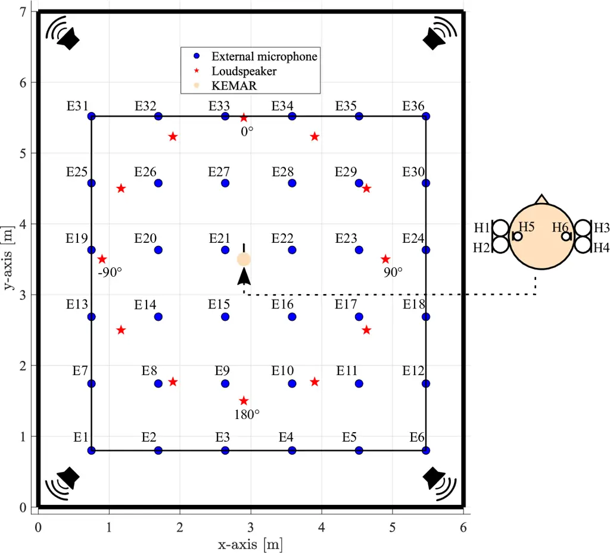
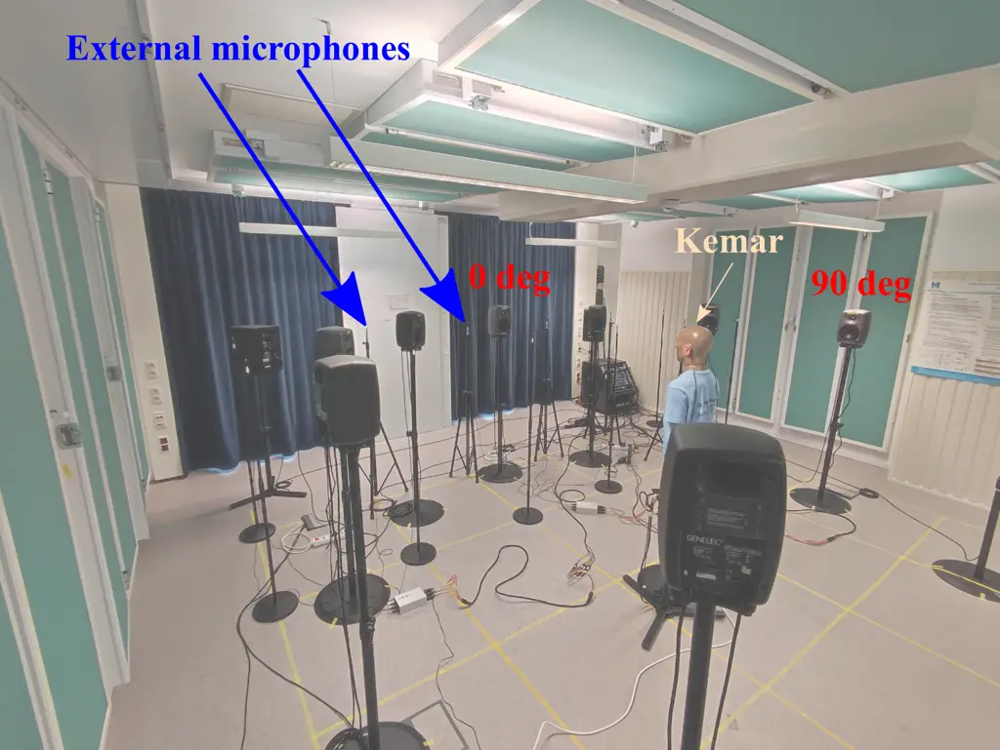
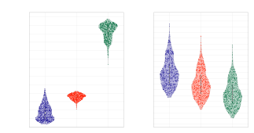
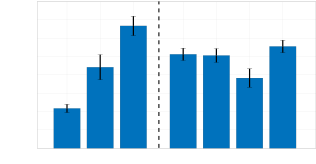

# BRUDEX Database: Binaural Room Impulse Responses with Uniformly Distributed External Microphones

Daniel Fejgin^(\*)    Wiebke Middelberg^(\*)    Simon Doclo

###### Abstract

There is an emerging need for comparable data for multi-microphone
processing, particularly in acoustic sensor networks. However, commonly
available databases are often limited in the spatial diversity of the
microphones or only allow for particular signal processing tasks. In
this paper, we present a database of acoustic impulse responses and
recordings for a binaural hearing aid setup, 36 spatially distributed
microphones spanning a uniform grid of
$`5\text{\times}5\text{\,}\mathrm{m}`$ and 12 source positions. This
database can be used for a variety of signal processing tasks, such as
(multi-microphone) noise reduction, source localization, and
dereverberation, as the measurements were performed using the same setup
for three different reverberation conditions
($`\mathrm{T}_{\mathrm{60}}\approx\{310,510,1300\}`$ $`\mathrm{ms}`$).
The usability of the database is demonstrated for a noise reduction task
using a minimum variance distortionless response beamformer based on
relative transfer functions, exploiting the availability of spatially
distributed microphones.

^(†)^(†) ^(∗)Equal contribution. This work was funded by the Deutsche
Forschungsgemeinschaft (DFG, German Research Foundation) - Project ID
352015383 (SFB 1330 B2) and Project ID 390895286 (EXC 2177/1).

University of Oldenburg, Department of Medical Physics and Acoustics and
Cluster of Excellence Hearing4all, Oldenburg, Germany  
Email: {[daniel.fejgin](mailto:daniel.fejgin@uni-oldenburg.de),
[wiebke.middelberg](mailto:wiebke.middelberg@uni-oldenburg.de),
simon.doclo}@uni-oldenburg.de  
Web:
[www.sigproc.uni-oldenburg.de](https://uol.de/en/mediphysics-acoustics/sigproc)

## 1 Introduction

Signal processing for acoustic sensor networks is a field of increasing
interest \[1, 2, 3, 4, 5, 6\] as spatially distributed microphones allow
for a more diverse spatial sampling of the sound field than compact
microphone arrays. To enable reproducible and comparable research,
publicly available databases that allow for different signal processing
tasks, such as speech enhancement or sound source localization, are of
utmost importance. Despite the availability of simulation tools for the
generation of room impulse responses (RIRs), e.g., \[7, 8\], measured
RIRs and real-world recordings are indispensable to evaluate the
performance of algorithms. Nowadays, there is a variety of
multi-microphone RIR databases available, e.g., considering linear
arrays \[9\], widely distributed microphones \[10, 11\], head-mounted
devices like hearing aids \[12, 13\], and head-mounted or body-worn
microphones together with distributed microphones \[14, 15, 16\].

In this paper, we present a new, complementary database, referred to as
Binaural Room Impulse Responses with Uniformly Distributed External
microphones (BRUDEX). It consists of a total of about 1500 measured RIRs
for three different reverberation conditions, 12 source positions,
binaural hearing aids on a dummy head (four hearing aid microphones and
two in-ear microphones), and spatially distributed microphones at 36
uniformly distributed positions (see Figure 1). To distinguish between
the head-mounted microphones (i.e., hearing aid and in-ear microphones)
and the spatially distributed microphones, we will refer to the latter
as external microphones (eMics). The database was recorded in an
acoustic laboratory at the University of Oldenburg (see Figure 2). The
reverberation condition in the laboratory can be set by means of
curtains and absorber panels, which are mounted to the walls and the
ceiling. The RIRs were measured for three reverberation conditions,
keeping the microphone and loudspeaker configuration unchanged while
varying the reverberation condition. Besides measured RIRs, the database
contains recordings of speech and noise signals for all mentioned
conditions. A summary of the content of the database is presented in
Table 1.



Figure 1: Placement of external microphones ( $`\bullet`$ ),
loudspeakers ( $`\star`$ ) and KEMAR dummy head with four hearing aid
microphones and two in-ear microphones (see close-up) in a laboratory
with variable reverberation time.

[TABLE]

Table 1: Content of the BRUDEX database.

The BRUDEX database allows for a variety of signal processing tasks
using spatially distributed microphones: First, the database obviously
allows for multi-microphone noise reduction and speech enhancement, as
both measured RIRs as well as separate speech and noise recordings are
available. Second, the database allows for dereverberation in different
acoustic conditions, as measurements for different reverberation
conditions are available. Third, the database allows for source
localization, as all microphone and loudspeaker positions are
calibrated.

In Sections 2 and 3, we provide details on the setup, the measurement
conditions and the calibration and measurement procedures. In Section 4,
we provide practical information about the accessibility. To demonstrate
the usability of the BRUDEX database and the compatibility with the
database in \[12\], in Section 5 we construct an acoustic scenario
consisting of a target speech source and diffuse-like background noise
using recordings from the four hearing aid microphones and three
external microphones. We consider a binaural minimum variance
distortionless response beamformer steered by the relative transfer
function vector \[17\], which is either estimated blindly from the
microphone signals or obtained from database RIRs. The simulation
results show a good accordance with the results from recent literature.

## 2 Setup and Spatial Configurations

In this section, we provide an overview of the acoustic setup and the
calibration procedure for the BRUDEX database. In Section 2.1, we
describe the laboratory and its acoustic properties and in Section 2.2,
we describe the configuration of the loudspeakers and microphones.

### 2.1 Acoustic Properties of the Laboratory

All measurements were performed in the Variable Acoustics Laboratory at
the University of Oldenburg that has dimensions of about
$`7\text{\times}6\text{\times}2.7\text{\,}\mathrm{m}`$. The measurements
were performed for three reverberation conditions referred to as low,
medium and high. To quantify the amount of reverberation, we consider
the reverberation time $`\mathrm{T}_{\mathrm{60}}`$ as well as the
direct-to-reverberation ratio (DRR). The reverberation time of each RIR
was determined by extrapolating the decay time from
$`-5\text{\,}\mathrm{dB}`$ to $`-35\text{\,}\mathrm{dB}`$ on the
logarithmic energy decay curve, obtained using Schroeder’s backward
integration method \[18\]. The DRR of each RIR was obtained as the ratio
of the power of the direct-path component and the power of the early and
late reflections \[19\]. For each reverberation condition, Figure 3
depicts violin plots of the distribution of $`\mathrm{T}_{\mathrm{60}}`$
and DRR, obtained from the measured RIRs of all loudspeaker-microphone
pairs (see Sections 2.2 and 3). For each reverberation condition, the
distributions of $`\mathrm{T}_{\mathrm{60}}`$ and DRR clearly show
strong variations for different loudspeaker-microphone pairs, mainly
depending on their distance and their positions relative to the walls.
The median values for these reverberation parameters are
$`\mathrm{T}_{\mathrm{60}}\approx\{310,510,1300\}`$ $`\mathrm{ms}`$ and
$`{\rm DRR}\approx\{3.5,-0.5,-4.0\}`$ $`\mathrm{dB}`$.



Figure 2: Variable Acoustics Laboratory in the low reverberation
condition, with all absorber panels open and curtains closed. The
picture shows external microphones located on the positions E25-E36 (see
Figure 1).

### 2.2 Microphone and Loudspeaker Configuration

As mentioned above, Figure 1 depicts the positions of the microphones,
the loudspeakers, and the dummy head. We considered head-mounted
microphones as well as spatially distributed microphones, which we refer
to as eMics. The six head-mounted microphones consist of four
microphones of a binaural hearing aid (two microphones on each hearing
aid with an an inter-microphone distance of about
$`15\text{\,}\mathrm{mm}`$) mounted on a G.R.A.S. KEMAR 45 BM dummy head
with anthropometric pinnae and two low noise in-ear microphones. It
should be noted that the used hearing aids are the same as the hearing
aids in the database \[12\], where we considered the front and rear
microphones. The dummy head was located approximately in the center of
the laboratory, with its ears at an approximate height of
$`1.5\text{\,}\mathrm{m}`$.

Besides the head-mounted microphones, a total of 36 eMic positions were
considered in this database. Omnidirectional microphones (type:
Sennheiser KE 4-211-2) were placed on a uniform
$`5\text{\times}5\text{\,}\mathrm{m}`$ grid around the dummy head with
an inter-microphone spacing of $`95\pm 2\text{\,}\mathrm{cm}`$ in x- and
y-direction at a height of about $`1.5\text{\,}\mathrm{m}`$. The
positions of the eMics were manually calibrated by means of a cross-line
laser and a laser distance meter, resulting in a positioning error of
about $`2\text{\,}\mathrm{cm}`$.

For the measurement of the RIRs and the recording of the speech signals,
12 loudspeakers (types GENELEC 8030A, 8030B and 8330 APM) were placed at
a distance of about $`200\pm 2\text{\,}\mathrm{cm}`$ at angles
$`-180(2.5)\text{\,}\mathrm{\SIUnitSymbolDegree}`$,
$`-150(2.5)\text{\,}\mathrm{\SIUnitSymbolDegree}`$,$`\dotsc`$,$`150(2.5)\text{\,}\mathrm{\SIUnitSymbolDegree}`$,
relative to the dummy head. Each loudspeaker was set to a height of
approximately $`1.5\text{\,}\mathrm{m}`$. The distance between the
loudspeakers and the dummy head was verified using a laser distance
meter. Based on three procedures with a resolution of
$`5\text{\,}\mathrm{\SIUnitSymbolDegree}`$, the angles between the
loudspeakers relative to the dummy head were verified \[20, 21, 22\].

For the recording of the noise signals, four loudspeakers (M-Audio BX8
D2) were placed at about $`170\text{\,}\mathrm{cm}`$ from (and facing)
the corners of the room.



Figure 3: Violin plots of the distribution of the reverberation time
$`\mathrm{T}_{\mathrm{60}}`$ (left) and the direct-to-reverberation
ratio (right) for the three considered reverberation conditions. Median
values are shown on top of the figure.

## 3 Measurement Procedure

All measurements were performed at a sampling rate of
$`48\text{\,}\mathrm{kHz}`$ using an RME MADIface XT audio interface and
RME ADI-8 QS and RME OctaMic XTC analog-digital-converters. For all
recordings, the input-output delay due to the buffering of the audio
interface was compensated. For the RIR measurements, we used the
exponential sine sweep technique \[23\] using synchronized swept sine
signals \[24\] as excitation signals. The excitation signal had a
duration of about $`5\text{\,}\mathrm{s}`$ and the frequency increased
exponentially in the range $`20\text{\,}\mathrm{Hz}`$ –
$`24\text{\,}\mathrm{kHz}`$. Playing back the excitation signal with
each of the loudspeakers separately, the excitation signal was recorded
10 times with all available microphones simultaneously and averaged. By
convolving this average recording with the inverse sweep and considering
only the linear part of the resulting set of higher-order impulse
responses, the RIRs between the loudspeaker and the microphones were
obtained. To smoothen and truncate the RIRs to a duration of
$`2\text{\,}\mathrm{s}`$, Hanning windows with a duration of
$`0.38\text{\,}\mathrm{ms}`$ and $`50\text{\,}\mathrm{ms}`$ for the
fade-in and the fade-out, respectively, were applied.

As only 12 identical microphones were available for the spatially
distributed microphones, for each reverberation condition we performed
three separate recordings to cover all eMic positions E1 - E36. We refer
to each separate recording as a run. We only changed the position of
these 12 eMics after performing all measurements for all reverberation
conditions (since changing the reverberation condition is more
reproducible than changing the microphone position). In each run we
recorded 18 channels simultaneously, i.e., the six head-mounted
microphones (at the same position for all runs) and 12 eMics (run 1:
positions E1 - E12, run 2: positions E13 - E24, and run 3: positions
E25 - E36). Since due to scattering effects the positioning of the eMics
may affect the signals recorded at the head-mounted microphones, the
database provides two types of RIRs for the head-mounted microphones,
which we refer to as individual and average. For the individual
head-mounted RIRs the measured responses were considered for each run
individually. For the average head-mounted RIRs the measured recordings
were averaged over the three runs, (i.e. run-averaged) before performing
the convolution with the inverse sweep.

The multi-channel speech recordings correspond to two female and two
male English speech signals (duration: 20 or $`30\text{\,}\mathrm{s}`$)
from the SQAM and VCTK corpus \[25, 26\]. Similarly as for the RIRs,
each speech signal was played back with each of the loudspeakers
separately, and recorded with all available microphones simultaneously.
The multi-channel noise recordings correspond to babble noise, cafeteria
noise, and white noise (duration: $`20\text{\,}\mathrm{s}`$). The noise
was generated with the four loudspeakers facing the corners of the
laboratory, playing back different (uncorrelated) versions of the
respective noise. Similarly as for the RIRs, for the speech and noise
recordings we also distinguish the individual and run-averaged
recordings for the head-mounted microphones.

## 4 Database

The BRUDEX database is available under
[https://doi.org/10.5281/zenodo.7986447](https://doi.org/10.5281/zenodo.7986447)
under a Creative Commons Attribution Non Commercial 4.0 International
License. The measured RIRs and the speech and noise recordings are
located in sub-directories organized by the reverberation condition. The
file names encode the DOA of the used loudspeaker (not applicable for
noise recordings) and indicate whether the head-mounted microphone
signals are obtained as individual recordings (18 channel signals) or as
run-averaged recordings (42 channel signals). For the former case, the
data contains 18 channels corresponding to the six head-mounted
microphones and the 12 eMics. For the latter case, the data contains 42
channels corresponding to the six head-mounted microphones and the eMics
at the 36 positions. The content of the database is organized in
separate uncompressed binary MAT-files. To facilitate usage of the
database, we provide MATLAB and Python scripts for accessing the
multi-channel data.

## 5 Application to MVDR Beamforming

To demonstrate the usability of the BRUDEX database, in this section we
consider an exemplary multi-microphone noise reduction application. More
particularly, we consider a binaural minimum variance distortionless
response (MVDR) beamformer using the hearing aid microphones and three
external microphones. Besides using estimated relative transfer function
vectors to steer the MVDR beamformer, we furthermore investigate the
performance of different database RIRs to investigate the robustness
against non-matching RIRs. We briefly review the used algorithms in
Section 5.1, the considered acoustic scenario and the implementation in
Section 5.2, and the simulation results in Section 5.3.

### 5.1 Algorithms

We consider an acoustic scenario with a single target speaker and
quasi-diffuse background noise and $`M`$ microphones composed of
$`M_{\rm H}=4`$ hearing aid microphones and $`M_{\rm E}=3`$ external
microphones. In the short-time Fourier transform (STFT) domain, with
$`k`$ denoting the frequency bin index and $`l`$ denoting the frame
index, the $`M`$-dimensional noisy signal vector $`\mathbf{y}(k,l)`$ can
be written as

```math
\mathbf{y}(k,l)=\mathbf{x}(k,l)+\mathbf{n}(k,l)=\mathbf{h}(k,l)X_{\mathrm{ref}}(k,l)+\mathbf{n}(k,l)\,, \tag{1}
```

where $`\mathbf{x}(k,l)`$ and $`\mathbf{n}(k,l)`$ denote the speech and
noise component, respectively. We assume a multiplicative transfer
function model \[27\] such that the speech component can be written in
terms of its relative transfer function (RTF) vector
$`\mathbf{h}(k,l)`$, which relates the speech component in a reference
microphone $`X_{\mathrm{ref}}(k,l)`$ to the speech components in all
other microphones. In the following, the indices $`k`$ and $`l`$ are
omitted wherever possible. By assuming uncorrelated speech and noise
components, the noisy covariance matrix
$`\mathbf{R}_{y}=\mathcal{E}\{\mathbf{y}\mathbf{y}^{H}\}`$ can be
decomposed into the speech covariance matrix $`\mathbf{R}_{x}`$ and the
noise covariance matrix $`\mathbf{R}_{n}`$, i.e.,

```math
\mathbf{R}_{y}=\mathbf{R}_{x}+\mathbf{R}_{n}\,, \tag{2}
```

where $`\mathcal{E}\{\cdot\}`$ denotes the expectation operator and
$`\{\cdot\}^{H}`$ denotes the Hermitian transpose operator. The MVDR
beamformer \[28, 29, 30\] aims at minimizing the noise power spectral
density (PSD) while preserving the speech component in the reference
microphone. It was shown in \[28, 29\] that the MVDR beamformer is given
by

```math
\mathbf{w}=\frac{\hat{\mathbf{R}}_{n}^{-1}\hat{\mathbf{h}}}{\hat{\mathbf{h}}^{H}\hat{\mathbf{R}}_{n}^{-1}\hat{\mathbf{h}}}\,, \tag{3}
```

which requires estimates of the RTF vector $`\hat{\mathbf{h}}`$ and the
noise covariance matrix $`\hat{\mathbf{R}}_{n}`$.

To estimate the RTF vector for the MVDR beamformer in (3), in \[31\] and
\[6\] methods were proposed that exploit one or multiple external
microphones, assuming that the noise component in each external
microphone signal is uncorrelated with the noise components in all other
microphone signals. This assumption holds quie well, e.g., for a diffuse
noise field where the external microphones are spatially separated from
each other and from the hearing aid microphones \[31\]. The so-called
spatial coherence (SC) method proposed in \[31\] estimates the RTF
vector using the $`m_{\rm E}`$-th eMic by simply selecting the
$`M_{\mathrm{H}}\!+\!m_{\rm E}`$-th column of the noisy covariance
matrix and dividing it by the reference entry, i.e.,

```math
\hat{\mathbf{h}}^{{\rm SC}}_{m_{\rm E}}=\frac{\hat{\mathbf{R}}_{y}\mathbf{e}_{m_{\rm E}}}{\mathbf{e}_{\mathrm{ref}}^{T}\hat{\mathbf{R}}_{y}\mathbf{e}_{m_{\rm E}}} \tag{4}
```

where $`\mathbf{e}_{m_{\rm E}}`$ denotes a selection vector for the
$`m_{\rm E}`$-th eMic and $`\mathbf{e}_{\mathrm{ref}}`$ denotes a
selection vector for the reference microphone(s), i.e., one for the left
and right hearing aid each to allow for binaural processing. Since for
each of the $`M_{\rm E}`$ available eMics a different RTF vector
estimate $`\hat{\mathbf{h}}^{\rm SC}_{m_{\rm E}}`$ is obtained, it was
proposed in \[6\] to linearly combine them as
$`\hat{\mathbf{h}}=\hat{\mathbf{H}}\bm{\alpha}`$, where
$`\hat{\mathbf{H}}`$ is a matrix containing all estimates, i.e.,

```math
\hat{\mathbf{H}}=[\hat{\mathbf{h}}^{{\rm SC}}_{1},\dots,\hat{\mathbf{h}}^{{\rm SC}}_{M_{\rm E}}]\,. \tag{5}
```

with $`\bm{\alpha}`$ denoting a weight vector. A particular linear
combination proposed in \[6\] aims at maximizing the output SNR of the
MVDR beamformer by means of the weight vector
$`\bm{\alpha}^{{\rm mSNR}}`$. The weight vector of the so-called mSNR
method is given by \[6\]

```math
\bm{\alpha}^{{\rm mSNR}}=\frac{\mathcal{P}\{\mathbf{B}^{-1}\mathbf{A}\}}{\mathbf{1}_{M_{\rm E}\times 1}^{T}\mathcal{P}\{\mathbf{B}^{-1}\mathbf{A}\}}\,, \tag{6}
```

where $`\mathcal{P}\{\cdot\}`$ denotes the principal eigenvector
operator, $`\mathbf{1}_{M_{\rm E}\times 1}`$ denotes an
$`M_{\rm E}`$-dimensional vector of ones and
$`\mathbf{B}=\hat{\mathbf{H}}^{H}\hat{\mathbf{R}}_{n}^{-1}\hat{\mathbf{H}}`$
and
$`\mathbf{A}=\hat{\mathbf{H}}^{H}\hat{\mathbf{R}}_{n}^{-1}\hat{\mathbf{R}}_{y}\hat{\mathbf{R}}_{n}^{-1}\hat{\mathbf{H}}`$.
The RTF vector estimate using the mSNR method is obtained as
$`\hat{\mathbf{h}}^{\rm mSNR}=\hat{\mathbf{H}}\bm{\alpha}^{\rm mSNR}`$.
For further details, we refer the reader to the literature mentioned
above.

### 5.2 Acoustic Scenario and Implementation

To evaluate the performance of different MVDR beamformers, we consider
an acoustic scenario with a female target speaker (SQAM) at
$`-60\text{\,}\mathrm{\SIUnitSymbolDegree}`$ relative to the dummy head
and quasi-diffuse babble noise in the medium reverberation condition. In
addition to the four hearing aid microphones (H1-H4), we considered
three eMics at the positions E14, E27 and E28. For the hearing aid
microphones, we used the run-averaged RIRs and recordings.

All microphone signals were generated by using the recorded speech and
noise components from the database at a broadband input signal-to-noise
ratio (SNR) of $`0\text{\,}\mathrm{dB}`$ in the front microphone on the
left hearing aid by scaling the noise components accordingly. The
resulting input SNR in the front microphone on the right hearing aid was
$`-1\text{\,}\mathrm{dB}`$ and in the eMics about
$`0\text{\,}\mathrm{dB}`$ to $`1\text{\,}\mathrm{dB}`$.

The processing was implemented in the STFT domain using a
square-root-Hann window for analysis and synthesis with a frame length
of 2048 samples (corresponding to about $`42\text{\,}\mathrm{ms}`$ at a
sampling rate of $`48\text{\,}\mathrm{kHz}`$) and
$`50\text{\,}\mathrm{\%}`$ overlap. The covariance matrices were
estimated using recursive smoothing, i.e.,

```math
\hat{\mathbf{R}}_{y}(k,l)=\alpha_{y}\hat{\mathbf{R}}_{y}(k,l-1)+(1-\alpha_{y})\mathbf{y}(k,l)\mathbf{y}^{H}(k,l)\,, \tag{7}
```

```math
\hat{\mathbf{R}}_{n}(k,l)=\alpha_{n}\hat{\mathbf{R}}_{n}(k,l-1)+(1-\alpha_{n})\mathbf{y}(k,l)\mathbf{y}^{H}(k,l)\,, \tag{8}
```

where the parameters $`\alpha_{y}`$ and $`\alpha_{n}`$ correspond to
smoothing times of $`500\text{\,}\mathrm{ms}`$ and
$`1000\text{\,}\mathrm{ms}`$, respectively. The noisy covariance matrix
$`\hat{\mathbf{R}}_{y}`$ was estimated during speech activity, i.e., if
$`{\rm\overline{SPP}}(k,l)>0.5`$, whereas the noise covariance matrix
$`\hat{\mathbf{R}}_{n}`$ was estimated during speech pauses, i.e., if
$`{\rm\overline{SPP}}(k,l)<0.5`$. $`{\rm\overline{SPP}}`$ denotes the
average estimated speech presence probability \[32\] in the eMics.

In the evaluation, we compare the individual RTF vector estimates
obtained from the SC method in (4) (denoted as SC-E14, SC-E27 and
SC-E28, respectively) and the mSNR estimate obtained using the weight
vector in (6). To investigate the robustness against non-matching RTFs,
we additionally consider the RTF vector obtained from the following
database RIRs:

- •
  RIR (medium): RIRs for all used microphones for
  $`\mathrm{DOA}=$-60\text{\,}\mathrm{\SIUnitSymbolDegree}$`$ in the
  medium reverberation condition, i.e., matching the generated
  microphone signals.
- •
  RIR (low): RIRs for all used microphones for
  $`\mathrm{DOA}=$-60\text{\,}\mathrm{\SIUnitSymbolDegree}$`$ in the low
  reverberation condition, i.e., not matching the generated microphone
  signals.
- •
  RIR (anechoic): anechoic RIRs from \[12\] for the hearing aid
  microphones for
  $`\mathrm{DOA}=$-60\text{\,}\mathrm{\SIUnitSymbolDegree}$`$, i.e., an
  approximation with no reverberation. It should be noted that in this
  case only the RIRs of the hearing aid microphones and not for the
  eMics are available, such that the MVDR beamforming is only using the
  hearing aid microphones.

The RTFs were computed from the RIRs by convolving the RIRs with white
Gaussian noise and computing the principal eigenvector of the resulting
covariance matrix in the STFT domain.

To assess the performance of the different beamformers, we consider the
broadband binaural SNR improvement ($`\Delta\rm BSNR`$) of the binaural
MVDR beamformer compared to the unprocessed noisy reference microphone
signals. The SNRs are computed in overlapping segments of
$`1\text{\,}\mathrm{s}`$ length (overlapping by 85%) during speech
activity and averaged over time. To allow for a suitable initialization
of the covariance matrices, the first $`1.5\text{\,}\mathrm{s}`$ of the
signal are not taken into account in the computation of the SNR.

### 5.3 Simulation Results



Figure 4: Improvement of the BSNR for the RTF-vector-steered binaural
MVDR beamformer using different RTF vector estimation methods. Left:
computed from database RIRs, right: estimated from microphone signals.

Figure 4 depicts the BSNR improvement (along with the variance as error
bars) for the different considered RTF vectors.

For the RTF vectors computed from database RIRs, i.e., RIR (anechoic),
RIR (low) and RIR (medium), the following observations can be made:
Using the RIRs from the matching reverberation condition yields the best
performance (about $`7\text{\,}\mathrm{dB}`$ improvement in BSNR), while
using the RIRs from the low reverberation condition still yields a
rather good performance (about $`4\text{\,}\mathrm{dB}`$ improvement in
BSNR). Yet, the performance decreases compared to the true RIRs (RIR
(medium)), as RIR (low) does not account for all reflections. Using the
anechoic RIRs yields a rather low BSNR improvement of only
$`2\text{\,}\mathrm{dB}`$. This can be explained by the fact that on the
one hand only the head-mounted microphones are used in the beamformer
and on the other hand by the limitation of the anechoic RIRs to only
approximate the direct path but no reflections.

Using the RTF vectors estimated with the SC method (SC-E14, SC-E27 and
SC-E28), results in a BSNR improvement of about
$`45\text{\,}\mathrm{dB}`$. The mSNR approach yields a BSNR improvement
of about $`5.5\text{\,}\mathrm{dB}`$, slightly but consistently
outperforming the single SC-based RTF vector estimates, but yielding a
lower BSNR improvement than using the true RIRs (RIR (medium)). These
results correspond well with prior results from literature \[33, 6\],
which indicates a good accordance of the BRUDEX database with
established simulation paradigms.

## 6 Summary

In this paper, we presented the BRUDEX database, a novel database of
RIRs and speech and noise recordings for binaural hearing aids and
uniformly spaced distributed microphones. We presented the used
measurement and calibration procedures and characterized the resulting
RIRs in terms of $`\mathrm{T}_{\mathrm{60}}`$ and $`\mathrm{DRR}`$. The
applicability of the database was demonstrated by means of an MVDR
beamformer where the underlying acoustic scenario was generated from the
database. The RTF vectors for steering the beamformer were either
estimated using two recently proposed methods that exploit external
microphones or using RIRs from the database. The database can be used
for many other signal processing tasks such as source localization,
dereverberation, and noise reduction.

## References

- \[1\] S. Markovich-Golan, A. Bertrand, M. Moonen, and S. Gannot,
  “Optimal distributed minimum-variance beamforming approaches for
  speech enhancement in wireless acoustic sensor networks,” Signal
  Processing, vol. 107, pp. 4–20, Feb. 2015.
- \[2\] V. M. Tavakoli, J. R. Jensen, M. G. Christensen, and J.
  Benesty, “A framework for speech enhancement with ad hoc microphone
  arrays,” IEEE/ACM Trans. on Audio, Speech, and Language Processing,
  vol. 24, pp. 1038–1051, Mar. 2016.
- \[3\] M. Cobos, F. Antonacci, A. Alexandridis, A. Mouchtaris, and B.
  Lee, “A survey of sound source localization methods in wireless
  acoustic sensor networks,” Wireless Communications and Mobile
  Computing, vol. 2017, pp. 1–24, Aug. 2017.
- \[4\] A. I. Koutrouvelis, T. W. Sherson, R. Heusdens, and R. C.
  Hendriks, “A low-cost robust distributed linearly constrained
  beamformer for wireless acoustic sensor networks with arbitrary
  topology,” IEEE/ACM Trans. on Audio, Speech, and Language Processing,
  vol. 26, pp. 1434–1448, Apr. 2018.
- \[5\] J. Zhang, R. Heusdens, and R. C. Hendriks, “Relative acoustic
  transfer function estimation in wireless acoustic sensor networks,”
  IEEE/ACM Trans. on Audio, Speech, and Language Processing, vol. 27,
  pp. 1507–1519, Jun. 2019.
- \[6\] N. Gößling, W. Middelberg, and S. Doclo, “RTF-steered binaural
  MVDR beamforming incorporating multiple external microphones,” in
  Proc. IEEE Workshop on Applications of Signal Processing to Audio and
  Acoustics (WASPAA), (New Paltz, USA), pp. 368–372, Oct. 2019.
- \[7\] J. B. Allen and D. A. Berkley, “Image method for efficiently
  simulating small-room acoustics,” The Journal of the Acoustical
  Society of America, vol. 65, pp. 943–950, Apr. 1979.
- \[8\] D. P. Jarrett, E. A. P. Habets, M. R. P. Thomas, and P. A.
  Naylor, “Rigid sphere room impulse response simulation: Algorithm and
  applications,” The Journal of the Acoustical Society of America, vol.
  132, pp. 1462–1472, Sep. 2012.
- \[9\] E. Hadad, F. Heese, P. Vary, and S. Gannot, “Multichannel audio
  database in various acoustic environments,” in Proc. International
  Workshop on Acoustic Signal Enhancement (IWAENC), (Juan-les-Pins,
  France), pp. 313–317, Sep. 2014.
- \[10\] R. Stewart and M. Sandler, “Database of omnidirectional and
  B-format room impulse responses,” in Proc. International Conference on
  Acoustics, Speech and Signal Processing (ICASSP), pp. 165–168,
  Mar. 2010.
- \[11\] S. Koyama, T. Nishida, K. Kimura, T. Abe, N. Ueno, and J.
  Brunnström, “Meshrir: A dataset of room impulse responses on meshed
  grid points for evaluating sound field analysis and synthesis
  methods,” in Proc. IEEE Workshop on Applications of Signal Processing
  to Audio and Acoustics (WASPAA), pp. 1–5, Oct. 2021.
- \[12\] H. Kayser, S. D. Ewert, J. Anemüller, T. Rohdenburg, V.
  Hohmann, and B. Kollmeier, “Database of multichannel In-Ear and
  Behind-The-Ear Head-Related and Binaural Room Impulse Responses,”
  Eurasip Journal on Advances in Signal Processing, vol. 2009, pp. 1–10,
  Jul. 2009.
- \[13\] F. Denk, S. M. Ernst, S. D. Ewert, and B. Kollmeier, “Adapting
  hearing devices to the individual ear acoustics: Database and target
  response correction functions for various device styles,” Trends in
  hearing, vol. 22, p. 2331216518779313, Jun. 2018.
- \[14\] W. S. Woods, E. Hadad, I. Merks, B. Xu, S. Gannot, and T.
  Zhang, “A real-world recording database for ad hoc microphone arrays,”
  in Proc. IEEE Workshop on Applications of Signal Processing to Audio
  and Acoustics (WASPAA), pp. 1–5, Oct. 2015.
- \[15\] R. M. Corey, M. D. Skarha, and A. C. Singer, “Massive
  distributed microphone array dataset,” 2019. \[Online\]. Available:
  [https://doi.org/10.13012/B2IDB-6216881_V1](https://doi.org/10.13012/B2IDB-6216881_V1).
- \[16\] T. Dietzen, R. Ali, M. Taseska, and T. van Waterschoot,
  “MYRiAD: a multi-array room acoustic database,” EURASIP Journal on
  Audio, Speech, and Music Processing, vol. 2023, pp. 1–14, Apr. 2023.
- \[17\] S. Doclo, S. Gannot, D. Marquardt, and E. Hadad, “Binaural
  speech processing with application to hearing devices,” in Audio
  Source Separation and Speech Enhancement (E. Vincent, T. Virtanen,
  and S. Gannot, eds.), pp. 413–442, Hoboken, NJ, USA: John Wiley &
  Sons, Ltd., 2018.
- \[18\] M. R. Schroeder, “New method of measuring reverberation time,”
  The Journal of the Acoustical Society of America, vol. 37, pp.
  419–412, Jun. 1965.
- \[19\] P. A. Naylor, E. A. P. Habets, J. Y.-C. Wen, and N. D.
  Gaubitch, “Models, measurement and evaluation,” in Speech
  Dereverberation (P. A. Naylor and N. D. Gaubitch, eds.), pp. 21–56,
  London, Great Britain: Springer, 2010.
- \[20\] R. Schmidt, “Multiple emitter location and signal parameter
  estimation,” IEEE Trans. on Antennas and Propagation, vol. 34, pp.
  276–280, Mar. 1986.
- \[21\] H. Kayser and J. Anemüller, “A discriminative learning
  approach to probabilistic acoustic source localization,” in Proc.
  International Workshop on Acoustic Signal Enhancement (IWAENC),
  (Juan-les-Pins, France), pp. 99–103, Sep. 2014.
- \[22\] D. Fejgin and S. Doclo, “Comparison of binaural
  RTF-vector-based direction of arrival estimation methods exploiting an
  external microphone,” in Proc. European Signal Processing Conference
  (EUSIPCO), (Dublin, Ireland), pp. 241–245, Aug. 2021.
- \[23\] A. Farina, “Simultaneous measurement of impulse response and
  distortion with a swept-sine technique,” in Proc. Audio Engineering
  Society (AES), (Paris, France), Feb. 2000.
- \[24\] A. Novák, L. Simon, F. Kadlec, and P. Lotton, “Nonlinear
  system identification using exponential swept-sine signal,” IEEE
  Trans. on Instrumentation and Measurement, vol. 59, pp. 2220–2229,
  Aug 2010.
- \[25\] European Broadcasting Union, “Sound quality assessment
  material - recordings for subjective tests: User’s handbook for the
  EBU SQUAM CD,” 2008. \[Online\]. Available:
  https://tech.ebu.ch/publications/sqamcd.
- \[26\] C. Veaux, J. Yamagishi, and K. MacDonald, “CSTR VCTK corpus:
  English multi-speaker corpus for CSTR voice cloning toolkit,”
  University of Edinburgh. The Centre for Speech Technology Research
  (CSTR), 2017.
- \[27\] Y. Avargel and I. Cohen, “On multiplicative transfer function
  approximation in the short-time Fourier transform domain,” IEEE Signal
  Processing Letters, vol. 14, no. 5, pp. 337–340, 2007.
- \[28\] S. Doclo, W. Kellermann, S. Makino, and S. E. Nordholm,
  “Multichannel signal enhancement algorithms for assisted listening
  devices: Exploiting spatial diversity using multiple microphones,”
  IEEE Signal Processing Magazine, vol. 32, pp. 18–30, Mar. 2015.
- \[29\] S. Gannot, E. Vincent, S. Markovich-Golan, and A. Ozerov, “A
  consolidated perspective on multi-microphone speech enhancement and
  source separation,” IEEE/ACM Trans. on Audio, Speech, and Language
  Processing, vol. 25, pp. 692–730, Apr. 2017.
- \[30\] B. D. Van Veen and K. M. Buckley, “Beamforming: A versatile
  approach to spatial filtering,” IEEE ASSP Magazine, vol. 5, pp. 4–24,
  Apr. 1988.
- \[31\] N. Gößling and S. Doclo, “Relative transfer function
  estimation exploiting spatially separated microphones in a diffuse
  noise field,” in Proc. International Workshop on Acoustic Signal
  Enhancement (IWAENC), (Tokyo, Japan), pp. 146–150, Sep. 2018.
- \[32\] T. Gerkmann and R. C. Hendriks, “Unbiased MMSE-Based Noise
  Power Estimation With Low Complexity and Low Tracking Delay,” IEEE
  Trans. on Audio, Speech, and Language Processing, vol. 20, pp.
  1383–1393, May 2012.
- \[33\] N. Gößling and S. Doclo, “[RTF-Steered Binaural MVDR
  Beamforming Incorporating an External Microphone for Dynamic Acoustic
  Scenarios](https://uol.de/f/6/dept/mediphysik/ag/sigproc/download/papers/SP2018_38.pdf),”
  in Proc. IEEE International Conference on Acoustics, Speech and Signal
  Processing (ICASSP), (Brighton, UK), pp. 416–420, May 2019.
