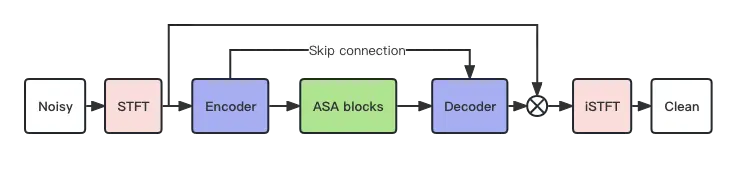
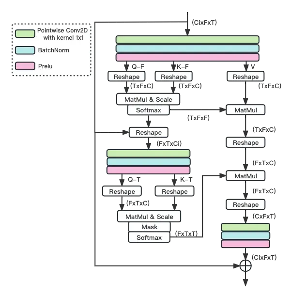
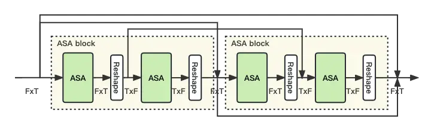

# Multi-Loss Convolutional Network with Time-Frequency Attention for Speech Enhancement

1^(st) Liang Wan Affiliation: School of Communication and Information
Engineering  
Chongqing University of Posts and Telecommunications  
Chongqing, China  
Email:s210131221@stu.cqupt.edu.cn    2^(nd) Hongqing Liu
Affiliation: School of Communication and Information Engineering  
Chongqing University of Posts and Telecommunications  
Chongqing, China  
Email:hongqingliu@outlook.com    3^(rd) Yi Zhou Affiliation: School of
Communication and Information Engineering  
Chongqing University of Posts and Telecommunications  
Chongqing, China  
Email:zhouy@cqupt.edu.cn    4^(rd) Jie Jia Affiliation: vivo Mobile
Commun co Ltd  
China  
Email:jie.jia@vivo.com

###### Abstract

The Dual-Path Convolution Recurrent Network (DPCRN) was proposed to
effectively exploit time-frequency domain information. By combining the
DPRNN module with Convolution Recurrent Network (CRN), the DPCRN
obtained a promising performance in speech separation with a limited
model size. In this paper, we explore self-attention in the DPCRN module
and design a model called Multi-Loss Convolutional Network with
Time-Frequency Attention(MNTFA) for speech enhancement. We use
self-attention modules to exploit the long-time information, where the
intra-chunk self-attentions are used to model the spectrum pattern and
the inter-chunk self-attention are used to model the dependence between
consecutive frames. Compared to DPRNN, axial self-attention greatly
reduces the need for memory and computation, which is more suitable for
long sequences of speech signals. In addition, we propose a joint
training method of a multi-resolution STFT loss and a WavLM loss using a
pre-trained WavLM network. Experiments show that with only 0.23M
parameters, the proposed model achieves a better performance than DPCRN.

###### Index Terms: 

Speech enhancement, axial self-attention, multiple losses,
time-frequency domain

## I Introduction

Excessive noise and reverberation can significantly impair the
performance of automatic speech recognition (ASR) systems and reduce
speech intelligibility during communication. To improve speech
intelligibility and perceptual quality, speech enhancement techniques
are generally employed to separate clean speech from background
interferences. This separation helps eliminate the effects of noise and
reverberation, resulting in clearer and more understandable speech.

Deep neural networks (DNNs) have become increasingly popular in audio
processing applications, and have been shown to be highly effective in
speech enhancement tasks. In terms of domain used, DNN-based speech
enhancement methods can be broadly divided into two categories:
time-frequency (TF) domain\[1, 2, 3, 4, 5\] and time domain\[6, 7, 8\]
methods. Methods operating in the time domain directly predict clean
speech waveforms by end-to-end training, avoiding the challenge of
estimating phase information in the TF domain. Conv-Tasnet\[9\], as a
representative time-domain method, employs a 1-D convolutional neural
network to encode the waveform into effective representations for
accurate speech estimation, and then recovers the waveform by a decoder
consisting of transposed convolutional layers. However, modeling
extremely long sequences is challenging in the time domain, hence deep
convolutional layers such as wave-u-net\[7\] are often needed for
feature compression. TF-domain methods operate on the spectrogram, under
the assumption that the detailed structures of speech and noise can be
more easily distinguished and separated through time-frequency
representations. In TF-domain methods, training targets can be broadly
categorized into two groups: masking-based targets and mapping-based
targets. Masking-based targets such as ideal binary mask (IBM)\[10\],
ideal ratio mask (IRM)\[2\], and spectral magnitude mask (SMM)\[11\],
only consider the magnitude differences between clean speech and mixture
speech while ignoring phase information. Subsequently, complex ratio
mask (CRM)\[12\] was proposed as a masking-based target, which enhances
both the real and imaginary components of the division between clean
speech and mixture speech spectrograms, allowing for a better speech
reconstruction.

For TF domain method, Dual-Path Convolution Recurrent Network
(DPCRN)\[13\] combining DPRNN\[14\] and CRN\[15\], it is possible to
obtain a well-behaved model. On the basis of DPCRN, in this work, a new
model called Multi-Loss Convolutional Network with Time-Frequency
Attention(MNTFA) for speech enhancement is proposed. It replace DPRNN
with an Axial Self-Attention (ASA)\[16\] block consisting of two ASAs.
ASA improves network ability to capture long-range relations between
features in time domain and frequency domain, respectively. Compared to
DPRNN, ASA greatly reduces the need for memory and computation, which is
more suitable for long sequences of speech signals. The high-level
features extracted by encoder are fed into ASA blocks for further
processing. Subsequently, the decoder reconstructs the low-resolution
features to the output.

While DNN-based speech enhancement has made rapid progress, it still
faces challenges in real-world applications due to low signal-to-noise
ratio (SNR), high reverberation, and far-field pickup. These issues
remain significant obstacles to achieving high-quality speech
enhancement in practical settings. Previous studies have found that
blindly feeding the output of a speech enhancement system (SE) to an ASR
system can result in degraded performance. However, incorporating a
pre-trained ASR system during the SE model training stage has been shown
to improve ASR performance. For the proposed model, we employ a
multi-loss strategy formed by SE loss and an ASR loss to simultaneously
ensure good SE and ASR performance. The SE loss consists by a mean
square error (MSE) loss for noise suppression and multi-resolution STFT
loss\[17\] for speech preservation. The ASR loss\[18\] is formed by a
pretrained WavLM\[19\] network.

The proposed system is evaluated using PESQ and STOI for SE performance
and word error rate (WER) for ASR performance. On the test datasets, our
model achieves competitive results as DPCRN while having a smaller
number of parameters and computational complexity.



Fig. 1: Architecture of the proposed MNTFA

## II Network

### II-A Problem formulation

The observed noisy speech can be represented as a sum of the clean
speech and noise signals in the time domain, which is
$`y(t)=s(t)+n(t)`$, where $`y(t)`$, $`s(t)`$, and $`n(t)`$ refer to the
noisy, clean, and noise signals, respectively. The equation can be
converted to the time-frequency domain by utilizing the Short-Time
Fourier Transform (STFT), given by

```math
Y(t,f)=S(t,f)+N(t,f), \tag{1}
```

where $`Y(t,f)`$, $`S(t,f)`$, and $`N(t,f)`$ represent the
time-frequency bins of the noisy, clean, and noise speech spectrograms,
respectively, at time frame $`t`$ and frequency index $`f`$. To recover
clean speech from a noisy mixture, a mask $`M(t,f)`$ is typically
estimated and multiplied with the noisy speech spectrogram
$`Y(t,f)`$\[20\]. To better utilize phase information, we adopt complex
ratio mask (CRM), denoted by $`M(t,f)=M_{r}(t,f)+iM_{i}(t,f)`$, where
$`M_{r}(t,f)`$ and $`M_{i}(t,f)`$ represent the real and imaginary parts
of the mask. CRM better reconstructs speech by enhancing both real and
imaginary spectrogram\[21\] simultaneously. The denoising process can be
represented as the complex product of mask and noisy speech in the form
of:

```math
\widetilde{S}(t,f)=Y(t,f)\bigodot M(t,f), \tag{2}
```

where $`\bigodot`$ denotes element-wise multiplication and
$`\widetilde{S}(t,f)`$ is the enhanced speech.

### II-B Model architecture

The Dual-Path Convolution Recurrent Network combining DPRNN and CRN
achieves a state-of-the-art (SOTA) performance in single-channel speech
separation task. Similar to the original DPRNN, DPCRN consists of an
encoder, a dual-path RNN module, and a decoder. The structure of the
encoder and decoder is similar to CRN. DPCRN replaces the RNN part of
the CRN with the DPRNN modules. It is believed that modeling the
dependence of frequency is beneficial to speech enhancement due to the
harmonic structures of speech. Instead of learning the dependence in the
time domain, the intra-chunk RNNs are applied to model the spectral
patterns in a single frame and inter-chunk RNNs model the time
dependence of a certain frequency.

However, the DPCRN suffers from a high computational complexity. In this
paper, we propose a novel model with an Axial Self-Attention block
consisting of two ASAs to model long-time dependencies. Figure 1 shows
the overall network structure of the proposed model. Axial
Self-Attention (ASA) was introduced in \[16\] as a more efficient
approach that reduces the demand for memory and computation resources.
ASA is particularly useful for processing lengthy speech signal
sequences. The ASA structure, illustrated in Figure 2, consists of input
channels represented by $`C_{i}`$ and attention channels represented by
$`C`$. ASA calculates attention scores along the frequency and time
axis, which are referred to as F-attention and T-attention,
respectively. These attention score matrices enhance the model’s ability
to capture long-range dependencies in both the time and frequency
domains simultaneously. Similar to DPCRN, we construct an ASA block by
combining two ASAs. Figure 3 shows the structure of ASA block, and as
shown in figure 3, the input and output dimensions of the first ASA are
T, F. We rearrange the output dimensions of the first ASA to F, T, and
pass it to the second ASA. In MNTFA, we use two ASA blocks to capture
long-range relations between features. To alleviate the problem of
gradient vanishing, a residual connection\[22\] was utilized between the
intra-chunk ASA and inter-chunk ASA. We found that this development
enables the model to better learn both temporal and spectral contextual
information simultaneously, which is particularly relevant in the
context of speech processing.

### II-C Training target

When training, MNTFA estimates CRM and is optimized by signal
approximation (SA)\[23\]. Given the complex-valued STFT spectrogram of
clean speech S and noisy speech $`Y`$, CRM is defined as

```math
CRM=\frac{Y_{r}S_{r}+Y_{i}S_{i}}{{Y_{r}}^{2}+{Y_{i}}^{2}}+j\frac{Y_{r}S_{i}-Y_{i}S_{r}}{{Y_{r}}^{2}+{Y_{i}}^{2}}, \tag{3}
```

where $`Y_{r}`$ and $`Y_{i}`$ denote the real and imaginary parts of the
noisy complex spectrogram, respectively. The real and imaginary parts of
the clean complex spectrogram are represented by $`S_{r}`$ and
$`S_{i}`$. By multiplying the spectrogram of noisy speech
$`Y=Y_{r}+Y_{i}`$ with the estimated mask $`M=M_{r}+M_{i}`$, we obtain
the enhanced spectrogram in the form of:
$`\widetilde{S}=Y_{r}M_{r}–Y_{i}M_{i}+i(Y_{r}M_{i}+X_{i}M_{r})`$, which
is converted back to the waveform using inverse STFT (iSTFT), given by

```math
\widetilde{s}=iSTFT(\widetilde{S}). \tag{4}
```

### II-D Loss function

We use three loss functions to measure the estimation error from the
signal, perceptual, and ASR aspects, respectively. To suppress the noise
for the low-SNR time-frequency bins, we employ a metric called mean
square error (MSE) of the spectrogram, which is

```math
\begin{split}L_{MSE}=&\log(MSE(S_{r},\widetilde{S_{r}})+MSE(S_{i},\widetilde{S_{i}})\\
&+MSE(|S|,|\widetilde{S}|)).\end{split} \tag{5}
```

The MSE loss is composed of three components that individually quantify
the differences in the real part, imaginary part, and magnitude between
the predicted spectrogram and the ground truth.

To enhance the clarity and intelligibility of speech following the
denoising process, we used a multi-resolution STFT auxiliary loss\[17\].
Similar to prior research\[24\], we define a single Short-Time Fourier
Transform (STFT) loss as

```math
L_{s}=L_{sc}(s,\hat{s})+L_{mag}(s,\hat{s}), \tag{6}
```

where $`s`$, $`\hat{s}`$ are the clean and estimated time-domain
waveform. $`L_{sc}`$ and $`L_{mag}`$ denote spectral convergence and log
STFT magnitude loss, respectively, which are \[25\]

```math
L_{sc}(s,\hat{s})=\frac{\lVert\left|STFT(s)\right|-\left|STFT(\hat{s})\right|\rVert_{F}}{\lVert\left|STFT(s)\right|\rVert_{F}}, \tag{7}
```

```math
L_{mag}(s,\hat{s})=\frac{1}{N}\lVert\log\left|STFT(s)\right|-\log\left|STFT(\hat{s})\right|\rVert_{1}, \tag{8}
```

where $`\lVert.\rVert_{F}`$ and $`\lVert.\rVert_{1}`$ denote the
Frobenius and $`L_{1}`$ norms, respectively; $`|STFT(.)|`$ and N denote
the STFT magnitudes and number of elements in the magnitude,
respectively. The multi-resolution STFT loss is obtained by summing the
STFT losses computed with different analysis parameters such as FFT
size, window size, and frame shift. If there are $`M`$ STFT losses, the
multi-resolution STFT auxiliary loss ($`L_{aux}`$) is

```math
L_{aux}=\frac{1}{M}\sum_{m=1}^{M}L_{s}^{(m)}. \tag{9}
```

When using STFT for time-frequency representation of signals, the
balance between time and frequency resolution is crucial. Increasing the
window size improves the frequency resolution but reducing the temporal
resolution. By using multiple STFT losses with different analysis
parameters, the model can better learn the time-frequency
characteristics of speech and avoid becoming overfit to a fixed STFT
representation, which could result in suboptimal performance in the
waveform-domain.

Moreover, an ASR-oriented loss $`L_{ASR}`$ is used to reduce the speech
distortion of enhanced speech and reduce WER for a given ASR system.
More specifically, KL divergence distance between clean speech ASR
embedding and estimated speech ASR embedding is employed as our ASR
loss. The ASR embeddings are extracted by the pre-trained WavLM.

Our final loss function for the model is defined as a linear combination
of the MSE loss, Multi-resolution STFT auxiliary loss, and ASR loss,
with a equal weighting, given by

```math
L=L_{MSE}+L_{aux}+L_{ASR}, \tag{10}
```



Fig. 2: Axial self attention module



Fig. 3: ASA blocks

Metrics PESQ STOI (%) SNR(dB) -5 0 5 Avg. -5 0 5 Avg. Noisy 1.58 1.84
2.14 1.85 65.50 73.25 79.53 72.76 DCCRN 2.30 2.68 3.02 2.67 74.52 81.32
86.53 80.79 DPCRN 2.36 2.67 2.91 2.65 75.08 81.60 86.28 80.98 MNTFA 2.42
2.72 3.02 2.72 75.64 81.97 86.78 81.46

TABLE I: PESQs and STOI of different methods.

## III Experiments

### III-A Datasets

The clean speech and noise datasets from the DNS Challenge (ICASSP
2022)\[26\] are used for our experiments. By randomly pairing speech and
noise signals, we synthesize a training set with 500 hours samples and a
validation set with 50 hours, in both of which the signal-to-noise ratio
(SNR) is randomly sampled between -5 dB and 5 dB. Note that all speech
and noise signals are randomly truncated to 10 seconds before mixing. We
additionally use the synthetic test set released by DNS Challenge for
testing. All the audios used is sampled at 16 kHz.

| Model | Para.(M) | MACs(GFLOPS) | WER   |
| ----- | -------- | ------------ | ----- |
| Noisy |          |              | 13.12 |
| DCCRN | 3.67     | 14.38        | 15.23 |
| DPCRN | 0.8      | 8.45         | 13.71 |
| MNTFA | 0.23     | 1.89         | 12.55 |

TABLE II: The model size, MACS and WER of different models.

### III-B Result

Multiple metrics are employed to measure the speech enhancement
performance, including perceptual evaluation speech quality
(PESQ)\[27\], short-time objective intelligibility (STOI)\[28\] and word
error rate (WER). A pretrained model based on the conformer
architectures\[29\] are used to compute the WER.

We compare MNTFA with DCCRN and DPCRN on the test set. From the
comparison results shown in Table I, our approach produces a superior
performance to DCCRN and DPCRN in terms of PESQ and STOI. In table II,
”Para.”, ”MACs”, and ”WER” respectively represent the parameter amount
of the model, computation complexity, and word error rate for ASR
performance. With 0.23 M parameters, 1.89 Giga floating-point operations
per second (GFLOPs) and without any future information, our model
outperform DPCRN with 0.8M parameters.

| System | Loss                        | PESQ | STOI  | WER   |
| ------ | --------------------------- | ---- | ----- | ----- |
| Noisy  | \-                          | 1.85 | 72.76 | 13.13 |
| MNTFA  | $`L_{MSE}`$                 | 2.67 | 81.15 | 13.79 |
| MNTFA  | $`L_{MSE}+L_{ASR}`$         | 2.66 | 81.27 | 12.74 |
| MNTFA  | $`L_{MSE}+L_{aux}`$         | 2.77 | 81.64 | 14.35 |
| MNTFA  | $`L_{MSE}+L_{ASR}+L_{aux}`$ | 2.72 | 81.46 | 12.55 |

TABLE III: Ablation study on test set.

At the same time, we conducted ablation experiments on the proposed
model to show the importance of the different losses. Table III shows
the ablation results. After removing ASR loss, PESQ, STOI, WER increased
by 0.05, 0.18, and 1.8, respectively. After removing multi-resolution
STFT auxiliary loss, PESQ and STOI decreased by 0.06 and 0.37,
respectively, but WER increased 0.19. The results show that MNTFA with
MSE loss and multi-resolution STFT auxiliary loss improved the
performance in PESQ and STOI, but not the WER. We found that there is no
absolute direct correlation between PESQ and WER, as a higher PESQ score
does not necessarily guarantee a lower WER, which means the higher PESQ
should not always be the final goal.

## CONCLUSION

In this paper, we propose a multi-loss network with Time-Frequency
attention for speech enhancement. In the proposed method, the
self-attention blocks are utilized to model the long-time relations, and
we exploit the T-attention and F-attention to model the temporal and
frequency decencies. With 0.23 M parameters, our model achieves
competitive results and we also found that there is no absolute direct
correlation between PESQ and WER, as a higher PESQ score does not
necessarily guarantee a lower WER. In the future, we will investigate a
better way to ensure that speech recognition accuracy while also
preserving a good noise reduction performance.

## References

- \[1\] S. Srinivasan, N. Roman, and D. Wang, “Binary and ratio
  time-frequency masks for robust speech recognition,” _Speech
  Communication_, vol. 48, no. 11, pp. 1486–1501, 2006, robustness
  Issues for Conversational Interaction. \[Online\]. Available:
  https://www.sciencedirect.com/science/article/pii/S0167639306001129
- \[2\] A. Narayanan and D. Wang, “Ideal ratio mask estimation using
  deep neural networks for robust speech recognition,” in _2013 IEEE
  International Conference on Acoustics, Speech and Signal Processing_,
  2013, pp. 7092–7096.
- \[3\] Y. Zhao, D. Wang, I. Merks, and T. Zhang, “Dnn-based enhancement
  of noisy and reverberant speech,” in _2016 IEEE International
  Conference on Acoustics, Speech and Signal Processing (ICASSP)_, 2016,
  pp. 6525–6529.
- \[4\] Y. Xu, J. Du, L.-R. Dai, and C.-H. Lee, “An experimental study
  on speech enhancement based on deep neural networks,” _IEEE Signal
  Processing Letters_, vol. 21, no. 1, pp. 65–68, 2014.
- \[5\] D. Yin, C. Luo, Z. Xiong, and W. Zeng, “Phasen: A
  phase-and-harmonics-aware speech enhancement network,” _Proceedings of
  the AAAI Conference on Artificial Intelligence_, vol. 34, no. 05, pp.
  9458–9465, Apr. 2020. \[Online\]. Available:
  https://ojs.aaai.org/index.php/AAAI/article/view/6489
- \[6\] S.-W. Fu, T.-W. Wang, Y. Tsao, X. Lu, and H. Kawai, “End-to-end
  waveform utterance enhancement for direct evaluation metrics
  optimization by fully convolutional neural networks,” _IEEE/ACM
  Transactions on Audio, Speech, and Language Processing_, vol. 26,
  no. 9, pp. 1570–1584, 2018.
- \[7\] S. Daniel, E. Sebastian, and D. Simon, “Wave-u-net: A
  multi-scale neural network for end-to-end audio source separation,”
  _arXiv preprint arXiv:1806.03185_, 2018.
- \[8\] L. Zhang, Z. Shi, J. Han, A. Shi, and D. Ma, “Furcanext:
  End-to-end monaural speech separation with dynamic gated dilated
  temporal convolutional networks,” in _MultiMedia Modeling: 26th
  International Conference, MMM 2020, Daejeon, South Korea, January 5–8,
  2020, Proceedings, Part I 26_. Springer, 2020, pp. 653–665.
- \[9\] Y. Luo and N. Mesgarani, “Conv-tasnet: Surpassing ideal
  time-frequency magnitude masking for speech separation,” _IEEE
  Transactions on Audio, Speech, and Language Processing_, pp.
  1–1, 2019.
- \[10\] D. Wang, “On ideal binary mask as the computational goal of
  auditory scene analysis,” _Speech separation by humans and machines_,
  pp. 181–197, 2005.
- \[11\] Y. Wang, A. Narayanan, and D. Wang, “On training targets for
  supervised speech separation,” _IEEE/ACM transactions on audio,
  speech, and language processing_, vol. 22, no. 12, pp.
  1849–1858, 2014.
- \[12\] K. Tan and D. Wang, “Complex spectral mapping with a
  convolutional recurrent network for monaural speech enhancement,” in
  _ICASSP 2019 - 2019 IEEE International Conference on Acoustics, Speech
  and Signal Processing (ICASSP)_, 2019, pp. 6865–6869.
- \[13\] X. Le, H. Chen, K. Chen, and J. Lu, “Dpcrn: Dual-path
  convolution recurrent network for single channel speech enhancement,”
  _arXiv preprint arXiv:2107.05429_, 2021.
- \[14\] Y. Luo, Z. Chen, and T. Yoshioka, “Dual-path rnn: efficient
  long sequence modeling for time-domain single-channel speech
  separation,” in _ICASSP 2020-2020 IEEE International Conference on
  Acoustics, Speech and Signal Processing (ICASSP)_. IEEE, 2020, pp.
  46–50.
- \[15\] T. Ke and W. DeLiang, “A convolutional recurrent neural network
  for real-time speech enhancement,” _Interspeech_, pp. 3229–3233, 2018.
- \[16\] G. Zhang, C. Wang, L. Yu, and J. Wei, “Multi-scale temporal
  frequency convolutional network with axial attention for multi-channel
  speech enhancement,” in _ICASSP 2022-2022 IEEE International
  Conference on Acoustics, Speech and Signal Processing (ICASSP)_. IEEE,
  2022, pp. 9206–9210.
- \[17\] R. Yamamoto, E. Song, and J.-M. Kim, “Parallel wavegan: A fast
  waveform generation model based on generative adversarial networks
  with multi-resolution spectrogram,” in _ICASSP 2020-2020 IEEE
  International Conference on Acoustics, Speech and Signal Processing
  (ICASSP)_. IEEE, 2020, pp. 6199–6203.
- \[18\] T.-A. Hsieh, C. Yu, S.-W. Fu, X. Lu, and Y. Tsao, “Improving
  perceptual quality by phone-fortified perceptual loss using
  wasserstein distance for speech enhancement,” _arXiv preprint
  arXiv:2010.15174_, 2020.
- \[19\] S. Chen, C. Wang, Z. Chen, Y. Wu, S. Liu, Z. Chen, J. Li,
  N. Kanda, T. Yoshioka, X. Xiao _et al._, “Wavlm: Large-scale
  self-supervised pre-training for full stack speech processing,” _IEEE
  Journal of Selected Topics in Signal Processing_, vol. 16, no. 6, pp.
  1505–1518, 2022.
- \[20\] D. Wang and J. Chen, “Supervised speech separation based on
  deep learning: An overview,” _IEEE/ACM Transactions on Audio, Speech,
  and Language Processing_, vol. 26, no. 10, pp. 1702–1726, 2018.
- \[21\] Y. Hu, Y. Liu, S. Lv, M. Xing, S. Zhang, Y. Fu, J. Wu,
  B. Zhang, and L. Xie, “Dccrn: Deep complex convolution recurrent
  network for phase-aware speech enhancement,” _arXiv preprint
  arXiv:2008.00264_, 2020.
- \[22\] K. He, X. Zhang, S. Ren, and J. Sun, “Deep residual learning
  for image recognition,” in _Proceedings of the IEEE conference on
  computer vision and pattern recognition_, 2016, pp. 770–778.
- \[23\] ——, _Delving deep into rectifiers: Surpassing human-level
  performance on imagenet classification_. Proceedings of the IEEE
  international conference on computer vision 1026–1034, 2015.
- \[24\] R. Yamamoto, E. Song, and J.-M. Kim, “Probability density
  distillation with generative adversarial networks for high-quality
  parallel waveform generation,” _arXiv preprint
  arXiv:1904.04472_, 2019.
- \[25\] S. Ö. Arık, H. Jun, and G. Diamos, “Fast spectrogram inversion
  using multi-head convolutional neural networks,” _IEEE Signal
  Processing Letters_, vol. 26, no. 1, pp. 94–98, 2018.
- \[26\] C. K. Reddy, V. Gopal, R. Cutler, E. Beyrami, R. Cheng,
  H. Dubey, S. Matusevych, R. Aichner, A. Aazami, S. Braun _et al._,
  “The interspeech 2020 deep noise suppression challenge: Datasets,
  subjective testing framework, and challenge results,” _arXiv preprint
  arXiv:2005.13981_, 2020.
- \[27\] A. W. Rix, J. G. Beerends, M. P. Hollier, and A. P. Hekstra,
  “Perceptual evaluation of speech quality (pesq)-a new method for
  speech quality assessment of telephone networks and codecs,” in _2001
  IEEE international conference on acoustics, speech, and signal
  processing. Proceedings (Cat. No. 01CH37221)_, vol. 2. IEEE, 2001, pp.
  749–752.
- \[28\] C. H. Taal, R. C. Hendriks, R. Heusdens, and J. Jensen, “An
  algorithm for intelligibility prediction of time–frequency weighted
  noisy speech,” _IEEE Transactions on Audio, Speech, and Language
  Processing_, vol. 19, no. 7, pp. 2125–2136, 2011.
- \[29\] D. Wu, B. Zhang, C. Yang, Z. Peng, W. Xia, X. Chen, and X. Lei,
  “U2++: Unified two-pass bidirectional end-to-end model for speech
  recognition,” _arXiv preprint arXiv:2106.05642_, 2021.
