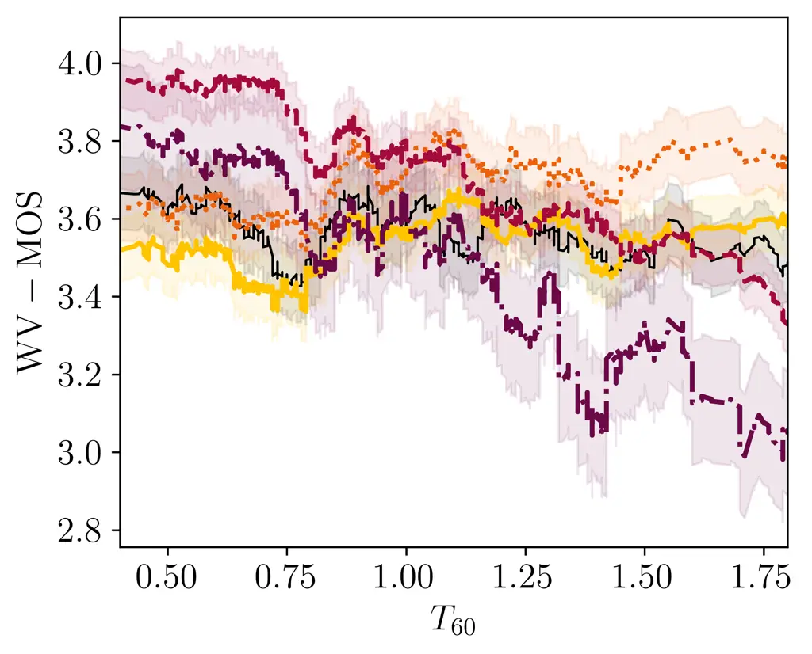
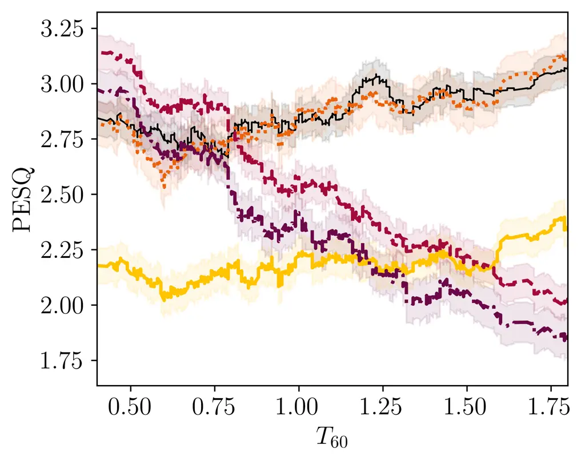
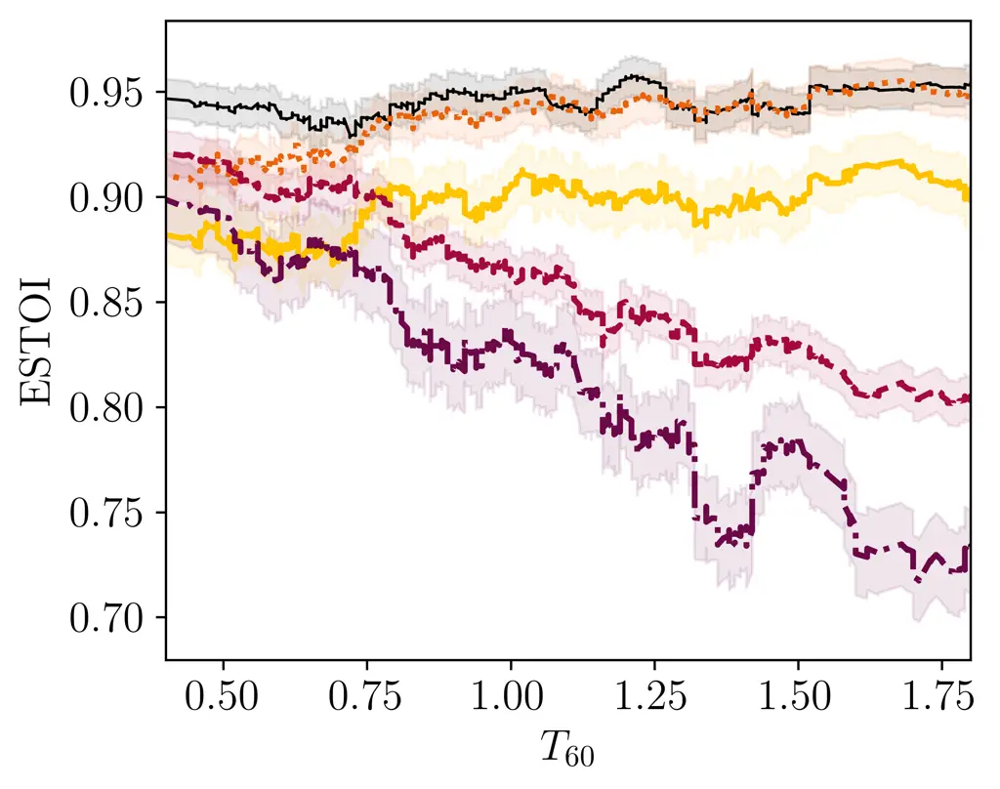

STFT  
short-time Fourier transform

iSTFT  
inverse short-time Fourier transform

DNN  
deep neural network

PESQ  
Perceptual Evaluation of Speech Quality

POLQA  
perceptual objectve listening quality analysis

WPE  
weighted prediction error

PSD  
power spectral density

RIR  
room impulse response

SNR  
signal-to-noise ratio

LSTM  
long short-term memory

POLQA  
Perceptual Objectve Listening Quality Analysis

SDR  
signal-to-distortion ratio

ESTOI  
Extended Short-Term Objective Intelligibility

ELR  
early-to-late reverberation ratio

TCN  
temporal convolutional network

RLS  
recursive least squares

ASR  
automatic speech recognition

HA  
hearing aid

CI  
cochlear implant

MAC  
multiply-and-accumulate

VAE  
variational auto-encoder

GAN  
generative adversarial network

T-F  
time-frequency

SDE  
stochastic differential equation

ODE  
ordinary differential equation

DRR  
direct to reverberant ratio

LSD  
log spectral distance

SI-SDR  
scale-invariant signal to distortion ratio

MOS  
mean opinion score

MAP  
maximum a posteriori

RTF  
real-time factor

# Diffusion Posterior Sampling for Informed Single-Channel Dereverberation

Funded by the Federal Ministry for Economic Affairs and Climate Action,
project 01MK20012S, AP380. Corresponding author:
jeanmarie.lemercier@uni-hamburg.deFunded by DASHH (Data Science in
Hamburg Hemholtz Graduate School for the Structure of Matter) with the
Grant No. HIDSS-0002.

###### Abstract

We present in this paper an informed single-channel dereverberation
method based on conditional generation with diffusion models. With
knowledge of the room impulse response, the anechoic utterance is
generated via reverse diffusion using a measurement consistency
criterion coupled with a neural network that represents the clean speech
prior. The proposed approach is largely more robust to measurement noise
compared to a state-of-the-art informed single-channel dereverberation
method, especially for non-stationary noise. Furthermore, we compare to
other blind dereverberation methods using diffusion models and show
superiority of the proposed approach for large reverberation times. We
motivate our algorithm by introducing an extension for blind
dereverberation allowing joint estimation of the room impulse response
and anechoic speech. Audio samples and code can be found
online^(\*)^(\*) \* https://uhh.de/inf-sp-derev-dps.

| Jean-Marie Lemercier¹, Simon Welker^(1,2), Timo Gerkmann¹        |
| ---------------------------------------------------------------- |
| ¹ Signal Processing (SP), Universität Hamburg, Germany           |
| ² Center for Free-Electron Laser Science, DESY, Hamburg, Germany |

Index Terms—  Informed dereverberation, diffusion models, posterior
sampling, inverse problems

## 1 Introduction

Reverberation is a natural phenomenon occurring in most spaces of our
daily life, where sound waves get reflected and attenuated by the
enclosure walls. It degrades speech intelligibility and quality for
normal listeners, and dramatically so for hearing-impaired listeners
\[1\]. Therefore, modern communication devices and listening setups are
equipped with dereverberation algorithms which aim to recover the
anechoic component of speech \[1\]. We will denote as informed the
methods that exploit prior knowledge of the rir (rir) and as blind the
methods that try to recover anechoic speech without knowing the rir.

Traditional blind dereverberation methods exploit the statistical
properties of the anechoic and reverberant signals, typically in the
time, spectral or cepstral domain \[2\]. Machine learning techniques try
to learn these statistical properties directly from data \[3\].
Typically, supervised predictive models for blind dereverberation
include tf (tf) maskers \[4\], time domain methods \[5\] and direct
spectro-temporal mapping \[6\]. Generative models, that aim to learn the
posterior distribution of clean speech conditioned on corrupted speech,
have also been introduced for blind dereverberation and speech
enhancement. In particular, conditional diffusion-based generative
models (or simply diffusion models) \[7, 8\] have been successfully
applied to blind dereverberation \[9, 10, 11\].

Though informed dereverberation may seem an easier task in comparison to
blind dereverberation, knowing the rir does not guarantee to find a
stable and causal inverse filter in the single-channel case, as typical
real-world RIRs are mixed-phase signals \[12\]. Using multiple
microphones may mend such issues to some extent \[13\], but may also
suffer from limited robustness \[14\]. Single-channel informed methods
include least-squares and $`\mathcal{L}^{p}`$-based optimization rules
\[15, 16, 17\], frequency-domain methods such as homomorphic inverse
filtering \[15\] , and hybrid techniques such as \[18\] where a
regularized inverse filter is used to avoid non-causality artifacts and
a speech enhancement scheme is used as a post-processing step to
attenuate residual pre-echoes.

In this paper, we present a single-channel informed dereverberation
technique using diffusion models, with two variants for reverse
sampling. We show that the proposed method retrieves high-quality
anechoic speech samples for all reverberant conditions without the need
for post-processing. We also demonstrate the robustness of the proposed
method to measurement noise. We compare our results with a
state-of-the-art frequency-domain informed dereverberation method \[18\]
as well as recently introduced diffusion models for blind
dereverberation \[9, 10\]. Code and audio examples are provided in the
supplementary material.

## 2 Diffusion-based generative models

In this section we introduce diffusion models, a class of generative
models that has recently showed impressive abilities to learn natural
data distributions in the image \[7, 8\] and speech domains \[11, 19,
9\]. Score-based diffusion models in the framework by Song et al. \[8\]
are defined by three components: a forward diffusion process
parameterized by a sde (sde), a score estimator implemented by a dnn
(dnn) and a sampling method for inference.

As in \[19, 9, 20, 10\], here the processes are defined in the complex
spectrogram domain, independently for each tf bin. In the following, the
variables in uppercase bold are assumed to be vectors $`\mathbb{C}^{D}`$
containing coefficients of a flattened complex spectrogram— with $`D`$
the product of the time and frequency dimensions— whereas variables in
lowercase bold are time vectors in $`\mathbb{R}^{L}`$ (unless specified)
and variables in regular font are scalars in $`\mathbb{C}`$. The
stochastic forward process $`\{\mathbf{X}_{\tau}\}_{\tau=0}^{T}`$ slowly
transforms clean speech into a tractable noise distribution . It is
modeled as the solution to the following Variance-Exploding sde \[8\]:

```math
\mathrm{d}{\mathbf{X}_{\tau}}=g(\tau)\mathrm{d}{\mathbf{W}_{\tau}}, \tag{1}
```

```math
g(\tau)=\sigma_{\mathrm{min}}\left(\frac{\sigma_{\mathrm{max}}}{\sigma_{\mathrm{min}}}\right)^{\tau}\sqrt{2\log\frac{\sigma_{\mathrm{max}}}{\sigma_{\mathrm{min}}}}, \tag{2}
```

where $`\mathbf{X}_{\tau}`$ is the current state of the process indexed
by a continuous time variable $`\tau\in[0,T]`$. The stochastic process
$`\mathbf{W}_{\tau}`$ is a standard $`D`$-dimensional Brownian motion,
which implies that $`\mathrm{d}{\mathbf{W}_{\tau}}`$ is a zero-mean
Gaussian random variable with infinitesimal standard deviation for each
tf bin. The initial condition $`\mathbf{X}_{0}=\mathbf{X}`$ represents
clean speech and the diffusion coefficient $`g`$ controls the amount of
white noise injected at each step, with $`\sigma_{\mathrm{min}}`$ and
$`\sigma_{\mathrm{max}}`$ being hyperparameters representing extremal
noise levels.

The reverse process $`\{\mathbf{X}_{\tau}\}_{\tau=T}^{0}`$ turning noise
into clean speech is another diffusion process also defined as the
solution of a sde \[21, 8\], with $`\tau`$ flowing in reverse (i.e.
$`\mathrm{d}{\tau}<0`$). Here, we will use the corresponding probability
flow ode (ode), since its solution has the same marginal distribution as
its sde counterpart \[8\]:

```math
\mathrm{d}{\mathbf{X}_{\tau}}=-\frac{1}{2}g(\tau)^{2}\nabla_{\mathbf{X}_{\tau}}\log p(\mathbf{X}_{\tau})\mathrm{d}{\tau}. \tag{3}
```

The quantity $`\nabla_{\mathbf{X}_{\tau}}\log p(\mathbf{X}_{\tau})`$ is
the score function, i.e. the gradient of the logarithm distribution for
the current state $`\mathbf{X}_{\tau}`$. At inference time, this score
function is not available, and therefore a neural network
$`s_{\theta}(\mathbf{X}_{\tau},\sigma(\tau))`$, called score model, is
used to estimate the score of the current state $`\mathbf{X}_{\tau}`$
given the current Gaussian noise standard deviation $`\sigma(\tau)`$.
The latter encodes how much Gaussian noise is left to remove before
getting in the vicinity of clean speech $`\mathbf{X}_{0}`$. It must
therefore be fed to the score network as conditioning, and is obtained
in closed-form for the Variance-Exploding SDE\[8\]. The score model
$`s_{\theta}`$ is trained via denoising score matching \[22\].

## 3 Diffusion Posterior Sampling for Dereverberation

### 3.1 Diffusion Posterior Sampling for Inverse Problems

Inverse problems consist in finding the state $`\mathbf{X}`$ given a
observation $`\mathbf{Y}=\mathcal{A}(\mathbf{X})`$ with $`\mathcal{A}`$
being a measurement operator. We consider the non-blind noisy linear
inverse problem of informed single-channel dereverberation. That is, we
wish to retrieve the anechoic version of some reverberant speech under
measurement noise $`\mathbf{n}`$ when the rir
$`\mathbf{k}\in\mathbb{R}^{K}`$ is known. We define the mixing process
in the time-domain, with $`\mathbf{x}:=\mathrm{iSTFT}(\mathbf{X})`$ and
$`\mathbf{y}:=\mathrm{iSTFT}(\mathbf{Y})`$, as:

```math
\mathbf{y}=\mathbf{k}\ast\mathbf{x}+\mathbf{n}\text{ with }\mathbf{n}\sim\mathcal{N}(0,\eta^{2}), \tag{4}
```

where iSTFT denotes inverse short-time Fourier transformation and
$`\ast`$ is the time-domain linear convolution resulting in
$`\mathbf{y}\in\mathbb{R}^{L+K-1}`$.

Diffusion posterior sampling (DPS) is a technique based on diffusion
models that was proposed for solving inverse problems \[23\] and was
recently applied to music restoration tasks \[24\]. The score function
is used as a surrogate speech prior and a log-likelihood term is added
to the reverse diffusion, so that the output sample belongs to the
posterior $`p(\mathbf{X}|\mathbf{Y})`$. The unconditional score
$`\nabla_{\mathbf{X}_{\tau}}\log p(\mathbf{X}_{\tau})`$ in (3) is then
replaced by the score of the posterior, in order to include the
measurement model in the sampling process:

```math
\nabla_{\mathbf{X}_{\tau}}\log p(\mathbf{X}_{\tau}|\mathbf{Y})=\nabla_{\mathbf{X}_{\tau}}\log p(\mathbf{X}_{\tau})+\nabla_{\mathbf{X}_{\tau}}\log p(\mathbf{Y}|\mathbf{X}_{\tau}). \tag{5}
```

For sampling, a trained score model
$`s_{\theta}(\mathbf{X}_{\tau},\sigma(\tau))\approx\nabla_{\mathbf{X}_{\tau}}\log p(\mathbf{X}_{\tau})`$
is needed, as well as an approximation of the log-likelihood gradient
$`\nabla_{\mathbf{X}_{\tau}}\log p(\mathbf{Y}|\mathbf{X}_{\tau})`$,
since it is generally intractable.

Input: Corrupted $`\mathbf{Y}`$, rir $`\mathbf{k}`$, Reverse step size
$`\Delta\tau=-\frac{T}{N}`$  
   Output: Clean speech estimate $`\widehat{X}`$

1: Sample initial reverse state
$`\mathbf{X}_{T}\sim\mathcal{N}(0,\mathbf{I})`$

2: for $`n\in\{N,\dots,1\}`$ do

3:   Get diffusion time $`\tau=n\frac{T}{N}`$

4:  Phase 1 – Corrector

5:    

6:   Estimate score $`s_{\theta}(\mathbf{X}_{\tau},\sigma(\tau))`$

7:   Sample correction noise
$`\mathbf{W}_{c}\sim\mathcal{N}(0,\mathbf{I})`$

8:   Correct estimate:

```math
\mathbf{X}_{\tau}\leftarrow\mathbf{X}_{\tau}+2r^{2}\sigma(\tau)^{2}s_{\theta}(\mathbf{X}_{\tau},\sigma(\tau))+2r\sigma(\tau)\mathbf{W}_{c}
```

9:  Phase 2 – Predictor

10:    

11:   Estimate score $`s_{\theta}(\mathbf{X}_{\tau},\sigma(\tau))`$

12:   Predict next Euler step:

```math
\mathbf{X}_{\tau}\leftarrow\mathbf{X}_{\tau}-\frac{1}{2}g(\tau)^{2}s_{\theta}(\mathbf{X}_{\tau},\sigma(\tau))\Delta\tau
```

13:  Phase 3 – Posterior

14:    

15:   if StateDPS then use state approximation (11):

```math
{\color[rgb]{1,0.7656,0}\mathbf{x}^{(\mathrm{int})}=\mathrm{iSTFT}(\mathbf{X}_{\tau})}
```

16:   if DPS then use posterior mean approximation (9):

```math
{\color[rgb]{0.9258,0.3789,0.0391}\mathbf{x}^{(\mathrm{int})}=\mathrm{iSTFT}\left(\widehat{\mathbf{M}}(\mathbf{X}_{\tau})\right)}
```

17:   Add log-likelihood gradient:

```math
\mathbf{X}_{\tau}\leftarrow\mathbf{X}_{\tau}+\zeta(\tau,\eta)\nabla_{\mathbf{X}_{\tau}}||\mathbf{y}-\mathbf{k}\ast\mathbf{x}^{(\mathrm{int})}||_{2}^{2}\Delta\tau
```

18: Output estimate: $`\widehat{\mathbf{X}}=\mathbf{X}_{0}`$

Algorithm 1 Posterior Sampling Scheme

### 3.2 Log-likelihood approximation

a) Posterior mean approximation:

In \[23\], the log-likelihood approximation is carried by transferring
the outer marginalization with regard to $`\mathbf{X}_{0}`$ inside the
conditioning, thereby assuming that the posterior mean
$`\mathbb{E}[\mathbf{X}_{0}|\mathbf{X}_{\tau}]`$ is a sufficient
statistic for $`\mathbf{X}_{\tau}`$ when modelling the likelihood
function:

```math
\displaystyle p(\mathbf{Y}|\mathbf{X}_{\tau}) \displaystyle=\int p(\mathbf{Y}|\mathbf{X}_{0})p(\mathbf{X}_{0}|\mathbf{X}_{\tau})\mathrm{d}{\mathbf{X}_{0}}
```

```math
\displaystyle\approx p(\mathbf{Y}|\underbrace{\int\mathbf{X}_{0}p(\mathbf{X}_{0}|\mathbf{X}_{\tau})\mathrm{d}{\mathbf{X}_{0}}}_{\mathbb{E}[\mathbf{X}_{0}|\mathbf{X}_{\tau}]}). \tag{6}
```

The posterior mean is obtained via the Tweedie formula \[25\], and can
be approximated using our score function estimator :

```math
\displaystyle\widehat{\mathbf{M}}(\mathbf{X}_{\tau}) \displaystyle=\mathbf{X}_{\tau}+\sigma^{2}(\tau)\nabla_{\mathbf{X}_{\tau}}\log p(\mathbf{X}_{\tau}) \tag{7}
```

```math
\displaystyle\approx\mathbf{X}_{\tau}+\sigma^{2}(\tau)s_{\theta}(\mathbf{X}_{\tau},\sigma(\tau)). \tag{8}
```

Our measurement model (4) yields the following posterior mean
approximation for the log-likelihood gradient:

```math
\nabla_{\mathbf{X}_{\tau}}\log p(\mathbf{Y}|\mathbf{X}_{\tau})\approx-\frac{1}{\eta^{2}}\nabla_{\mathbf{X}_{\tau}}||\mathbf{y}-\mathbf{k}\ast\widehat{\mathbf{m}}(\mathbf{X}_{\tau})||_{2}^{2}, \tag{9}
```

where
$`\widehat{\mathbf{m}}(\mathbf{X}_{\tau}):=\mathrm{iSTFT}(\widehat{\mathbf{M}}(\mathbf{X}_{\tau}))`$
and $`\eta`$ is the measurement noise level. The resulting reverse
probability flow ODE is:

```math
\mathrm{d}{\mathbf{X}_{\tau}}=-\frac{1}{2}g(\tau)^{2}s_{\theta}(\mathbf{X}_{\tau},\sigma(\tau))\mathrm{d}{\tau}+\zeta(\tau,\eta)\nabla_{\mathbf{X}_{\tau}}||\mathbf{y}-\mathbf{k}\ast\widehat{\mathbf{m}}(\mathbf{X}_{\tau})||_{2}^{2}\mathrm{d}{\tau} \tag{10}
```

with $`\zeta(\tau,\eta)>0`$ a hyperparameter controlling the importance
of the measurement error term. According to (5), its theoretical value
should be $`\zeta(\tau,\eta)=g(\tau)^{2}/(2\eta^{2})`$. In \[23\]
however, this hyper-parameter is empirically set to
$`\zeta(\tau,\eta)=\zeta^{{}^{\prime}}(\tau)/||\mathbf{y}-\mathbf{k}\ast\widehat{\mathbf{m}}(\mathbf{X}_{\tau})||_{2}`$
so that the measurement error magnitude itself does not influence the
importance of the gradient step, and $`\zeta^{{}^{\prime}}(\tau)`$ is a
schedule which we will describe later in Section 4.2.

b) State approximation:

In \[26\], a different approximation is used, where the measurement
model (4) takes as clean speech reference the current state
$`\mathbf{X}_{\tau}`$ itself, rather than the posterior mean
$`\widehat{\mathbf{M}}(\mathbf{X}_{\tau})`$. This yields the following
state approximation for the log-likelihood gradient:

```math
\nabla_{\mathbf{X}_{\tau}}\log p(\mathbf{Y}|\mathbf{X}_{\tau})\approx-\frac{1}{\eta^{2}}\nabla_{\mathbf{X}_{\tau}}||\mathbf{y}-\mathbf{k}\ast\mathbf{x}_{\tau}||_{2}^{2}, \tag{11}
```

with $`\mathbf{x}_{\tau}:=\mathrm{iSTFT}(\mathbf{X}_{\tau})`$. In turn,
this results in the following reverse probability flow ODE:

```math
\mathrm{d}{\mathbf{X}_{\tau}}=-\frac{1}{2}g(\tau)^{2}s_{\theta}(\mathbf{X}_{\tau},\sigma(\tau))\mathrm{d}{\tau}+\zeta(\tau,\eta)\nabla_{\mathbf{X}_{\tau}}||\mathbf{y}-\mathbf{k}\ast\mathbf{x}_{\tau}||_{2}^{2}\mathrm{d}{\tau} \tag{12}
```

this time with
$`\zeta(\tau,\eta)=\zeta^{{}^{\prime}}(\tau)/||\mathbf{y}-\mathbf{k}\ast\mathbf{x}_{\tau}||_{2}`$.
This approximation becomes less valid as the noise level
$`\sigma(\tau)`$ increases, since for large noise levels, the state
$`\mathbf{x}_{\tau}`$ is a much worse estimate of $`\mathbf{x}_{0}`$
compared to the posterior mean
$`\widehat{\mathbf{m}}(\mathbf{X}_{\tau})`$. In practice, the reverse
probability flow ODEs (10) and (12) are solved using a
predictor-corrector numerical scheme \[8\] (see Section 4.2).








Figure 1: Speech metrics as a function of the $`T_{\mathrm{60}}`$
reverberation time. Colored areas cover half a standard deviation range.


Figure 2: Dereverberation performance under zero-mean Gaussian
measurement noise. Input SNR indicated on the horizontal axis in
$`\mathrm{dB}`$.

## 4 Experimental Setup

### 4.1 Data

We generate the WSJ0+Reverb dataset as in \[9\] in a fashion resembling
the WHAMR! dataset recipe \[27\] by using clean speech data from the
WSJ0 dataset and convolving each utterance with a simulated rir. We use
the pyroomacoustics package \[28\] to simulate rir. For each utterance,
a reverberant room is modeled by sampling uniformly a
$`T_{\mathrm{60}}`$ between 0.4 and 1.0 seconds and room dimensions in
\[5,15\]$`\times`$\[5,15\]$`\times`$\[2,6\] m. This results in an
average drr (drr) of -9 dB and average _measured_ $`T_{\mathrm{60}}`$ of
0.91 s. An anechoic (but auralized) version of the room is used to
generate the reference clean speech, created using the same geometric
parameters as the reverberant room but with the absorption coefficient
set to 0.99.

### 4.2 Hyperparameters and training configuration

#### 4.2.1 Data representation

When training the unconditional score model, we use only the anechoic
part of the generated WSJ0+Reverb data, as the model is supposed to
learn the score over clean speech. Utterances are transformed using a
stft (stft) with a window size of 510 points, a hop length of 128 points
and a square-root Hann window, at a sampling rate of $`16`$kHz. In
contrast to \[19, 9\], no compression of the magnitude is used, in order
to avoid instabilities when backpropagating small measurement errors
through a non-linearity not differentiable around 0. For training,
segments of 256 stft frames ($`\approx`$2s) are randomly extracted from
the utterances and normalized by the maximum absolute value of the
segment before feeding them to the network. Using publicly available
code, the blind diffusion models SGMSE+ \[9\] and StoRM \[10\] are
trained on the reverberant and anechoic speech datasets, as these
methods are trained in a supervised setting. In comparison, the proposed
method does not need any reverberant speech during training.

#### 4.2.2 Forward and reverse diffusion

We set the extremal noise levels for the diffusion schedule $`g`$ in (1)
to $`\sigma_{\mathrm{min}}=`$ 0.05 and $`\sigma_{\mathrm{max}}=`$ 0.5,
and the terminal diffusion time to $`T=1`$. $`50`$ time steps are used
for reverse diffusion with Algorithm 1, which is adapted from the
predictor-corrector scheme \[8\] with probability flow ODE sampling and
one step of annealed Langevin dynamics correction with step size of
$`r=`$ 0.4.

Tuning $`\zeta^{{}^{\prime}}(\tau)`$ is quite difficult, as setting a
high $`\zeta^{{}^{\prime}}`$ leads to pre-echoes, feedback tones and
other non-causality artifacts generated by the log-likelihood gradient.
Using a low $`\zeta^{{}^{\prime}}`$, however, puts too much emphasis on
unconditional generation, therefore increasing the difference between
the estimate and the original clean speech. We notice that using the
Annealed Langevin Dynamics corrector proposed in \[8\] helps reduce the
aforementioned artifacts and thus provides a more flexible tuning of
$`\zeta^{{}^{\prime}}`$. We propose a saw-tooth schedule for
$`\zeta^{{}^{\prime}}(\tau)`$ where unconditional speech generation is
promoted in the beginning of the reverse process and measurement
importance is low towards the end of the process to avoid instabilities:

```math
\zeta^{{}^{\prime}}(\tau)=\begin{cases}&\frac{2500\tau}{0.9}\text{ if }\tau\leq 0.9\\
&\frac{2500(1-\tau)}{0.1}\text{ if }\tau\geq 0.9\\
\end{cases} \tag{13}
```

#### 4.2.3 Network architecture

The unconditional score network architecture is NCSN++M\[20, 10\], a
lighter variant of the NCSN++ \[8\] which uses $`\sim`$ 27.8M parameters
instead of the original 65M. At each step $`\tau`$, the current state
$`\mathbf{X}_{\tau}`$ real and imaginary channels are stacked and fed to
the network, and the noise level $`\sigma(\tau)`$ is provided as a
conditioner.

#### 4.2.4 Training configuration

For training the unconditional score model, we use the Adam optimizer
with a learning rate of $`10^{-4}`$ and an effective batch size of 16
for 300 epochs. We track an exponential moving average of the DNN
weights with a decay of 0.999 to be used for sampling as in \[9\]. A
minimal diffusion time is set to $`\tau_{\epsilon}=0.03`$ during
training to avoid singularities very close to $`\tau=0`$.

#### 4.2.5 Evaluation metrics

For instrumental evaluation of the speech dereverberation performance,
we use the intrusive pesq (pesq) \[29\] and estoi (estoi) \[30\] for
assessment of speech quality and intelligibility respectively. We also
use the non-intrusive WV-MOS \[31\]^(†)^(†) †
https://github.com/AndreevP/wvmos, a DNN-based mos (mos) approximation
used in \[20, 10, 31\] for reference-free assessment of bandwidth
extension and speech enhancement performance.

## 5 Results and Discussion

### 5.1 Comparison to baselines

In Figure 1, we compare the proposed informed diffusion-based sampling
schemes to the informed regularized inverse filtering plus
post-processing baseline \[18\], denoted in the following as RIF+Post.
We further add comparisons to the blind dereverberation diffusion
methods \[9, 10\]. Instrumental results are shown as a function of the
input $`T_{\mathrm{60}}`$ reverberation time. While the performance of
the blind dereverberation methods decreases as $`T_{\mathrm{60}}`$
increases, making the task more difficult, we observe that the informed
methods exhibit consistent performance for all considered reverberation
times. We notice that the proposed DPS method achieves better or
comparable instrumental performance compared to the RIF+Post method
\[18\], while StateDPS performs overall poorer. This shows that using a
denoised estimate to match the measurement model, as in the posterior
mean approximation (9), increases the dereverberation performance as
compared to the state approximation (11). Furthermore, the proposed DPS
performed better in terms of subjective quality in informal listening
tests: we refer the reader to the audio examples provided in our demo
website (see link in abstract). As most diffusion schemes, the proposed
(State)DPS methods and the baselines SGMSE+M and StoRM require multiple
calls to the score network. Therefore, their computational burden is
substantially superior to that of RIF+Post, which is a simple inverse
filtering method with real-time capable post-processing.

### 5.2 Robustness to measurement error

In Figure 2, we investigate the robustness of the informed
dereverberation approaches to Gaussian measurement noise, added on top
of the reverberant speech $`\mathbf{y}`$. We notice that the proposed
DPS is significantly more robust to the introduced noise than the
RIF+Post method. This is likely because the prior learned over clean
speech by the score model helps gain robustness to mismatches in the
measurement model. Informal experiments also show that the degradation
of RIF+Post performance to real recorded environmental noise is
dramatic, while DPS maintains a very high dereverberation performance
and simply lets noise pass through. This shows that the proposed method
is much more reliable in realistic scenarios where various noise sources
arise, as the remaining noise after DPS dereverberation can easily be
removed by a post-processing stage.

### 5.3 Extension to blind dereverberation

An important aspect of the presented work is that the proposed diffusion
posterior sampling technique for informed dereverberation can be
extended to blind dereverberation using \[32\]. In \[32\] a framework
for joint estimation of the blurring kernel and target image is
developed using parallel diffusion processes. Our work lays the ground
for future adaptation of \[32\] to jointly estimate the rir and clean
speech in subsequent work. The method we have presented here is
interpretable due to the explicit forward model, in contrast to blind
dereverberation approaches such as \[9, 10\]. If successfully
implemented, the future method would combine this interpretability with
a generative estimation of rir. This would furthermore dispose of the
need for plug-in rir estimators in blind scenarios, which the baseline
method \[18\] in contrast requires.

## 6 Conclusions and Future Work

We have presented a single-channel informed dereverberation method based
on diffusion models. The proposed method uses a clean speech prior
parameterized by a score model as well as a log-likelihood approximation
to generate anechoic speech that fits the measurement model. The
approach outperforms an existing state-of-the-art frequency-domain
method in terms of robustness to both white Gaussian and real
environmental measurement noises. One of the introduced sampling schemes
also largely outperforms existing diffusion-based blind dereverberation
methods for long reverberation times. The work at hand lays ground to an
interpretable extension to blind dereverberation using joint estimation
of the rir and anechoic speech with diffusion models.

## References

- \[1\] P. A. Naylor and N. D. Gaubitch, _Speech
  Dereverberation_. Springer, 2011, vol. 59.
- \[2\] T. Gerkmann and E. Vincent, _Spectral Masking and
  Filtering_. John Wiley & Sons, 2018.
- \[3\] D. Wang and J. Chen, “Supervised speech separation based on deep
  learning: An overview,” _IEEE Trans. Audio, Speech, Language Proc._,
  vol. 26, no. 10, pp. 1702–1726, 2018.
- \[4\] D. S. Williamson and D. Wang, “Time-frequency masking in the
  complex domain for speech dereverberation and denoising,” _IEEE/ACM
  Trans. Audio, Speech, Language Proc._, vol. 25, no. 7, pp.
  1492–1501, 2017.
- \[5\] O. Ernst, S. E. Chazan, S. Gannot, and J. Goldberger, “Speech
  dereverberation using fully convolutional networks,” in _Proc. Euro.
  Signal Proc. Conf. (EUSIPCO)_, Sept. 2019.
- \[6\] K. Han, Y. Wang, D. Wang, W. S. Woods, I. Merks, and T. Zhang,
  “Learning spectral mapping for speech dereverberation and denoising,”
  _IEEE/ACM Trans. Audio, Speech, Language Proc._, vol. 23, no. 6, pp.
  982–992, 2015.
- \[7\] J. Ho, A. Jain, and P. Abbeel, “Denoising diffusion
  probabilistic models,” in _Neural Information Proc. Systems (NIPS)_,
  Dec. 2020.
- \[8\] Y. Song, J. Sohl-Dickstein, D. P. Kingma, A. Kumar, S. Ermon,
  and B. Poole, “Score-based generative modeling through stochastic
  differential equations,” in _Int. Conf. Learning Repr. (ICLR)_,
  May 2021.
- \[9\] J. Richter, S. Welker, J.-M. Lemercier, B. Lay, and T. Gerkmann,
  “Speech enhancement and dereverberation with diffusion-based
  generative models,” _IEEE Trans. Audio, Speech, Language Proc._, pp.
  1–13, 2023.
- \[10\] J.-M. Lemercier, J. Richter, S. Welker, and T. Gerkmann,
  “StoRM: A diffusion-based stochastic regeneration model for speech
  enhancement and dereverberation,” _arXiv_, Dec. 2022.
- \[11\] Y.-J. Lu, Z.-Q. Wang, S. Watanabe, A. Richard, C. Yu, and
  Y. Tsao, “Conditional diffusion probabilistic model for speech
  enhancement,” in _IEEE Int. Conf. Acoustics, Speech, Signal Proc.
  (ICASSP)_, June 2022.
- \[12\] S. T. Neely and J. B. Allen, “Invertibility of a room impulse
  response,” _The Journal of the Acoustical Society of America_,
  vol. 66, no. 1, pp. 165–169, 07 1979.
- \[13\] M. Miyoshi and Y. Kaneda, “Inverse filtering of room
  acoustics,” _IEEE Trans. Audio, Speech, Language Proc._, vol. 36,
  no. 2, pp. 145–152, 1988.
- \[14\] T. Hikichi, M. Delcroix, and M. Miyoshi, “Inverse filtering for
  speech dereverberation less sensitive to noise and room transfer
  function fluctuations,” _EURASIP J. Adv. Sig. Proc._, vol. 2007,
  Dec. 2007.
- \[15\] J. Mourjopoulos, P. Clarkson, and J. Hammond, “A comparative
  study of least-squares and homomorphic techniques for the inversion of
  mixed phase signals,” in _IEEE Int. Conf. Acoustics, Speech, Signal
  Proc. (ICASSP)_, June 1982.
- \[16\] A. Mertins, T. Mei, and M. Kallinger, “Room impulse response
  shortening/reshaping with infinity- and $`p`$-norm optimization,”
  _IEEE Trans. Audio, Speech, Language Proc._, vol. 18, no. 2, pp.
  249–259, 2010.
- \[17\] H. Schepker, F. Denk, B. Kollmeier, and S. Doclo, “Robust
  single- and multi-loudspeaker least-squares-based equalization for
  hearing devices,” _EURASIP J. Aud. Speech and Mus. Proc._, vol. 2022,
  pp. 1–14, 06 2022.
- \[18\] I. Kodrasi, T. Gerkmann, and S. Doclo, “Frequency-domain
  single-channel inverse filtering for speech dereverberation: Theory
  and practice,” in _IEEE Int. Conf. Acoustics, Speech, Signal Proc.
  (ICASSP)_, May 2014.
- \[19\] S. Welker, J. Richter, and T. Gerkmann, “Speech enhancement
  with score-based generative models in the complex STFT domain,” in
  _Interspeech_, Sept. 2022.
- \[20\] J.-M. Lemercier, J. Richter, S. Welker, and T. Gerkmann,
  “Analysing discriminative versus diffusion generative models for
  speech restoration tasks,” in _IEEE Int. Conf. Acoustics, Speech,
  Signal Proc. (ICASSP)_, June 2023.
- \[21\] B. D. Anderson, “Reverse-time diffusion equation models,”
  _Stochastic Processes and their Applications_, vol. 12, no. 3, pp.
  313–326, 1982.
- \[22\] P. Vincent, “A connection between score matching and denoising
  autoencoders,” _Neural Computation_, vol. 23, no. 7, pp.
  1661–1674, 2011.
- \[23\] H. Chung, J. Kim, M. T. Mccann, M. L. Klasky, and J. C. Ye,
  “Diffusion posterior sampling for general noisy inverse problems,”
  _Int. Conf. Learning Repr. (ICLR)_, May 2023.
- \[24\] E. Moliner, J. Lehtinen, and V. Välimäki, “Solving audio
  inverse problems with a diffusion model,” in _IEEE Int. Conf.
  Acoustics, Speech, Signal Proc. (ICASSP)_, June 2023.
- \[25\] B. Efron, “Tweedie’s formula and selection bias,” _Journal of
  the American Statistical Association_, vol. 106, no. 496, pp.
  1602–1614, 2011.
- \[26\] S. Shoushtari, J. Liu, and U. S. Kamilov, “DOLPH: Diffusion
  models for phase retrieval,” _arXiv_, Nov. 2022.
- \[27\] M. Maciejewski, G. Wichern, E. McQuinn, and J. L. Roux,
  “WHAMR!: Noisy and reverberant single-channel speech separation,” in
  _IEEE Int. Conf. Acoustics, Speech, Signal Proc. (ICASSP)_, 2020.
- \[28\] R. Scheibler, E. Bezzam, and I. Dokmanic, “Pyroomacoustics: A
  python package for audio room simulation and array processing
  algorithms,” in _IEEE Int. Conf. Acoustics, Speech, Signal Proc.
  (ICASSP)_, Apr. 2018.
- \[29\] A. Rix, J. Beerends, M. Hollier, and A. Hekstra, “Perceptual
  evaluation of speech quality (PESQ)-a new method for speech quality
  assessment of telephone networks and codecs,” in _IEEE Int. Conf.
  Acoustics, Speech, Signal Proc. (ICASSP)_, May 2001.
- \[30\] J. Jensen and C. Taal, “An algorithm for predicting the
  intelligibility of speech masked by modulated noise maskers,”
  _IEEE/ACM Trans. Audio, Speech, Language Proc._, vol. 24, no. 11, pp.
  2009–2022, 2016.
- \[31\] P. Andreev, A. Alanov, O. Ivanov, and D. Vetrov, “Hifi++: a
  unified framework for bandwidth extension and speech enhancement,” in
  _IEEE Int. Conf. Acoustics, Speech, Signal Proc. (ICASSP)_, June 2023.
- \[32\] H. Chung, J. Kim, S. Kim, and J. C. Ye, “Parallel diffusion
  models of operator and image for blind inverse problems,” _IEEE/CVF
  Conf. on Computer Vision and Pattern Recognition (CVPR)_, June 2023.
