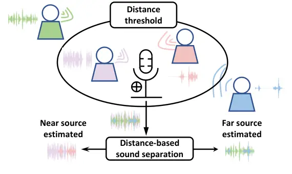
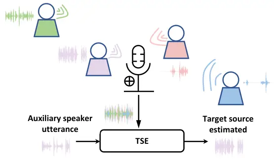
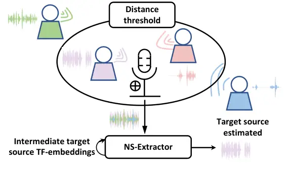
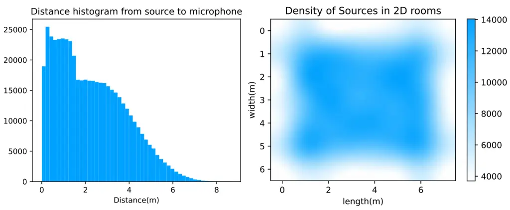

# Focus the Sound around You: Monaural Target Speaker Extraction via Distance and Speaker Information

Jiuxin Lin^(1,∗), Peng Wang^(2,∗), Heinrich Dinkel², Jun Chen¹, Zhiyong
Wu^(1,†),  
Yongqing Wang², Zhiyong Yan², Junbo Zhang², Yujun Wang² ^(†)^(†)thanks:
\$ˆ\*\$ Equal contribution.^(†)^(†)thanks: \$ˆ†\$ Corresponding author.

###### Abstract

Previously, Target Speaker Extraction (TSE) has yielded outstanding
performance in certain application scenarios for speech enhancement and
source separation. However, obtaining auxiliary speaker-related
information is still challenging in noisy environments with significant
reverberation. Inspired by the recently proposed distance-based sound
separation, we propose the near sound (NS) extractor, which leverages
distance information for TSE to reliably extract speaker information
without requiring previous speaker enrolment, called speaker embedding
self-enrollment (SESE). Full- & sub-band modeling is introduced to
enhance our NS-Extractor’s adaptability towards environments with
significant reverberation. Experimental results on several
cross-datasets demonstrate the effectiveness of our improvements and the
excellent performance of our proposed NS-Extractor in different
application scenarios.

^(†)^(†)address: ¹Shenzhen International Graduate School, Tsinghua
University, Shenzhen, China  
²Xiaomi Inc., Beijing, China^(†)^(†)email:
linjx21@mails.tsinghua.edu.cn, zywu@sz.tsinghua.edu.cn

Index Terms: target speaker extraction, distance-based sound separation

## 1 Introduction

Target Speaker Extraction (TSE) \[1\], also known as Target Speech
Extraction, is an essential task in the field of audio processing that
involves separating a speech signal of a specific speaker from an audio
mixture containing multiple speakers. This task has become increasingly
important in recent years with the rise of various speech-based
applications such as speech recognition \[2\], speaker
verification \[3\], and audio conferencing. While blind speech
separation (BSS) is limited by permutation invariant training
(PIT) \[4\], TSE methods face no such restriction. Moreover, while TSE
can extract the desired speaker’s speech directly, BSS outputs several
speech signals from different speakers, which requires manual selection.
Nevertheless, TSE has a disadvantage: auxiliary information related to
the target speaker such as enrolled voice \[5, 6, 7\] or lip
movements \[8, 9, 10\] are required in advance. Typically, this
necessitates allocating additional resources and encroaching upon the
privacy of the information involved.

Recently, \[11\] proposed distance-based sound separation (DSS), which
can separate monaural audio sources by the perceived distance (due to
reverberation) between a listener and a sound emitter. DSS produces two
audio signals, one from within a fixed threshold distance (“near”) and
another from outside the distance (“far”). Currently, DSS may face
certain limitations in practical applications. First, the threshold
distance for separation cannot be arbitrarily changed during inference,
which might result in having multiple “near” sources due to an intrusive
sound source coming into the threshold distance range. As an example,
within a meeting, multiple sources might be of equal distance to the
microphone, which the approach in \[11\] is unable to separate.
Furthermore, due to the heavy reliance on the reverberation effect,
distance-based separation is limited to smaller rooms with a longer
reverberation time (RT60), while many offices are in large rooms with a
faint reverberation effect. Lastly, previous works based on LSTM \[12\]
can be further optimized to use more modern separation models, which
could significantly enhance the user experience. Our work is inspired by
the human perception of the cocktail party problem, where humans can
selectively focus on a specific sound source (i.e., speaker) if it is
closer to them, while still filtering noise from far away sources. Thus
we believe that if we incorporate this distance-based source separation
into TSE, we can achieve a more potent separation performance.

Although separating mixed audio signals with and without reverberation
may appear to be similar tasks, there are significant differences
between the two in practice. Reverberation can cause several issues in
speech modeling \[13\], including: (a) Create echoes that overlap with
the original speech signal; (b) Dampen the high-frequency components of
the speech signal; (c) Introduce a delay between the original speech
signal and the reverberant sound. All these may lead to a more difficult
understanding of speech. Therefore, when conducting TSE in a reverberant
environment, a different approach must be taken compared to regular TSE.

While time-domain approaches have seen success on commonly used
benchmark datasets such as WSJ0-2mix \[14\], some of them such as
Conv-TasNet \[15\] generally perform poorly when faced with reverberant
audio \[16\]. This performance decay has been analysed in \[17\], where
time-frequency (spectral) domain frameworks have been seen to offer
superior separation performance. Additionally, it was indicated that a
sub-band model is capable of modelling the reverberation effect by
focusing on the temporal evolution of the narrow-band spectrum in the
results of \[18\].

In this work, we propose the Near Sound Extractor (NS-Extractor), a TSE
model combing full-, sub-band modeling and speaker embedding
self-enrollment (SESE). NS-Extractor utilizes the perceived distance to
the target speaker as a cue to extract a self-enrolled speaker embedding
that represents the voice print of the target speaker, which is then
used for further extraction. Full- and sub-band modeling are integrated
to attain greater stability in extraction performance. Experimental
results show that our proposed NS-Extractor not only outperforms the
baseline in terms of signal and perceptual quality but also exhibits
superior performance in more complex scenarios.



(a) Distance-based sound separation



(b) TSE



(c) Proposed NS-Extractor

Figure 1: Illustrations of distance-based sound separation, TSE and our
proposed NS-Extractor.

## 2 Methodology

### 2.1 Problem description

Assuming a $`K`$-speaker mixture recorded in anechoic conditions, one
can formulate the physical model in the time domain as
$`\bm{x}[t]=\sum_{k=1}^{K}\bm{s}^{(k)}[t]`$, where $`\bm{x}`$ represents
the mixture and $`\bm{s}^{(k)}`$ source $`k`$ in this mixture, and $`t`$
indexes $`T`$ time samples. The sound envisioned in our work is emitted
in a confined space, where each source can be formulated as
$`\bm{s}^{(k)}=\bm{d}^{(k)}\star\bm{r}^{(k)}`$. $`\bm{d}^{(k)}`$ and
$`\bm{r}^{(k)}`$ represent the direct-path signal and reverberation,
respectively and convolution is denoted by $`\star`$.

In order to provide a clearer exposition of our work, we provide a
comparative analysis between our approach, traditional TSE techniques,
and distance-based sound separation, highlighting all their
discrepancies. Illustrated in Figure 1(a), distance-based sound
separation in \[11\] separates mixed audio based on the distance of
sound sources in space, which can be expressed as:

```math
\bm{x}\longrightarrow\sum_{k_{i}}^{K_{\text{near}}}\bm{s}^{(k_{i})}+\sum_{k_{j}}^{K_{\text{far}}}\bm{s}^{(k_{j})},\vskip-4.2679pt
```

where the two terms are the sum of near and far targets’ sounds
respectively. This modeling approach also indicates that the estimated
targets (near, or far) may contain more than one sound (multiple
speakers). By leveraging the auxiliary speaker-related information
provided, TSE (Figure 1(b)) is capable of extracting the target speech
from mixed audio. The process can be depicted as follows:

```math
\bm{x}\stackrel{{\scriptstyle\bm{a}}}{{\longrightarrow}}\bm{s}^{(k_{g})},
```

where $`\bm{a}`$ is the auxiliary speaker-related information,
$`\bm{s}^{(k_{g})}`$ represents the target speech of one single speaker
who indexs $`k_{g}`$. As illustrated in Figure 1(c), our proposed
NS-Extractor possesses the ability to exclusively extract a single
target speech within close proximity using an enrolled speaker
embedding, which is obtained from the intermediate target source T-F
embeddings. Thus, additional auxiliary speaker information is not
required. The detailed process will be described in Section 2.2.1.

### 2.2 NS-Extractor

Our extractor model is based on performing complex spectral
mapping \[19, 20, 21\], whereby the real and imaginary (RI) components
of $`\mathbf{X}\in\mathbb{R}^{2\times F\times T}`$ are concatenated to
form the input features, which are then utilized to predict the RI
components of each speaker
$`\mathbf{S^{(c)}}\in\mathbb{R}^{2\times F\times T}`$. Adhering to the
methodology of TF-GridNet \[22\], our proposed NS-Extractor first
employs 2D Convolution (Conv2D) with a $`3\times 3`$ kernel and global
layer normalization (gLN) to compute $`D`$-dimensional embeddings for
each T-F unit
$`\mathbf{H_{x}^{(\text{1})}}\in\mathbb{R}^{D\times F\times T}`$.
$`\mathbf{H_{x}^{(\text{1})}}`$ is then fed into $`C`$ stacks of
extractor blocks, with each consisting of SESE and full- & sub-band
modeling to refine the T-F embeddings progressively. The extractor
outputs $`\mathbf{\widehat{H_{x}}}`$, a 2D deconvolution (Deconv2D) with
2 output channels and a $`3\times 3`$ kernel followed by linear
activation is then used to obtain the predicted RI components
$`\mathbf{Y}\in\mathbb{R}^{2\times F\times T}`$ from
$`\mathbf{\widehat{H_{x}}}`$.

#### 2.2.1 Speaker embedding self-enrollment

Each SESE step includes both speaker encoding and speaker embedding
fusion. At each block of the extractor, the input
$`\mathbf{H_{x}^{(\text{c})}}`$ is chained to the output of the
preceding block, while $`\mathbf{H_{x}^{(\text{1})}}`$ is directly
obtained by encoding the original mixed input spectrum $`\mathbf{X}`$.
The input of speaker encoder
$`\mathbf{R^{\text{(c)}}}\in\mathbb{R}^{F\times T}`$ is derived from
$`\mathbf{H_{x}^{(\text{c})}}`$ through a $`1\times 1`$ Conv2D. The
speaker encoder consists of a stack of 3 residual blocks followed by an
adaptive average pooling layer (AvgPool) \[6\]. The 1D-AvgPool layer,
with a kernel size of 3, compresses the temporal dimension of speaker
embeddings in extractor block $`c`$. The resulting single vector
$`\mathbf{E^{(\text{c})}}\in\mathbb{R}^{1\times F}`$, serves as an
speaker identity encoding.

Prior to the speaker embedding fusion, a concatenation of speaker
embeddings $`\mathbf{E^{(\text{c})}}`$ and T-F embeddings
$`\mathbf{H_{x}^{(\text{c})}}`$ is required. $`\mathbf{E^{(\text{c})}}`$
is replicated across temporal dimension and concatenated with
$`\mathbf{H_{x}^{(\text{c})}}`$ along dimension $`D`$ to form a tensor
with shape $`(D+1)\times T\times F`$. Conv2D with a $`1\times 1`$ kernel
is employed to restore the dimension to $`D\times T\times F`$.

```math
\mathbf{\dot{H}_{X}^{(\text{c})}}=\operatorname{Conv2D}(\operatorname{Concat}(\mathbf{H_{x}^{(\text{c})}},\mathbf{E^{(\text{c})}}),D+1,D)\in\mathbb{R}^{D\times T\times F},
```

where $`D+1`$ and $`D`$ represent the number of input and output
channels respectively.

The speaker embedding fusion block is employed to model the internal
relationship inside $`\mathbf{\dot{H}_{X}^{(\text{c})}}`$. The input
tensor
$`\mathbf{\dot{H}_{X}^{(\text{c})}}\in\mathbb{R}^{D\times T\times F}`$
is viewed as $`T`$ separate sequences, each with length $`F`$. To model,
the local relationship between a speaker and spectral information at the
frame level, a single-layer bidirectional LSTM (BLSTM) architecture is
utilized. The unfold and layer normalization (LN) operation in \[22\]
are employed as follows:

```math
\begin{split}&\mathbf{U^{(\text{c})}}=\left[\operatorname{Unfold}(\mathbf{\dot{H}_{x}^{(\text{c})}}[:,t,:]),\text{for }t=1,\ldots,T\right]\in\mathbb{R}^{(I\times D)\times T\times\frac{F}{J}},\\
&\mathbf{\dot{U}^{(\text{c})}}=[\operatorname{BLSTM}(\operatorname{LN}(\mathbf{U^{(\text{c})}})[:,t,:]),\text{ for }t=1,\ldots,T]\in\mathbb{R}^{2H\times T\times\frac{F}{J}},\end{split}
```

Figure 2: Detailed structure of proposed NS-Extractor. The whole
extraction process consists of three steps: self-enroll speaker encoder,
speaker embedding fusion and full- & sub-band modeling.

where $`I`$ and $`J`$ represent kernel size and stride size
respectively, $`H`$ denotes the number of hidden units in BLSTMs in each
direction. Subsequently, a 1D deconvolution (Deconv1D) layer with kernel
size $`I`$, stride size $`J`$, input channel $`2H`$ and output channel
$`D`$ is applied to the hidden embeddings of the BLSTM:

```math
\mathbf{\ddot{U}^{(\text{c})}}=[\operatorname{Deconv}1\mathrm{D}(\mathbf{\dot{U}^{(\text{c})}}[:,t,:]),\text{ for }t=1,\ldots,T]\in\mathbb{R}^{D\times T\times F}.
```

Finally, $`\mathbf{\ddot{U}^{(\text{c})}}`$ is added to the input tensor
via a residual connection to produce the output tensor:
$`\mathbf{\ddot{H}_{X}^{(\text{c})}}=\mathbf{\dot{H}_{x}^{(\text{c})}}+\mathbf{\ddot{U}^{(\text{c})}}`$.

#### 2.2.2 Full- & sub-band modeling

In the full- & sub-band modeling block, time-dimension and
frequency-dimension attention are employed to guide the models to focus
on position (time frames) and content (frequency channel)
respectively \[23\]. Noteworthy, the attention module in our work shares
the same network architecture as in \[22\] to reduce the number of
parameters of the proposed NS-Extractor.

More specifically, taking ‘Time-MHA’ in the sub-band modeling as an
example, the input tensor $`\mathbf{\ddot{H}_{X}^{(\text{c})}}`$ is fed
into a Conv2D with kernel $`1\times 1`$ followed by PReLU and LN along
the channel and time dimensions (denoted as ctLN), then reshape
operation is applied to form
$`\mathbf{Q_{\ell,t}}\in\mathbb{R}^{F\times(T\times E)}`$,
$`\mathbf{K_{\ell,t}}\in\mathbb{R}^{F\times(T\times E)}`$,
$`\mathbf{V_{\ell,t}}\in\mathbb{R}^{F\times(T\times D/L)}`$:

```math
\ \vskip-5.0pt\begin{split}&\mathbf{Q_{\ell,t}^{(\text{c})}}=\operatorname{ctLN}(\operatorname{PReLU}(\operatorname{Conv2D}(\mathbf{\ddot{H}_{X}^{(\text{c})}},D,E))),\\
&\mathbf{K_{\ell,t}^{(\text{c})}}=\operatorname{ctLN}(\operatorname{PReLU}(\operatorname{Conv2D}(\mathbf{\ddot{H}_{X}^{(\text{c})}},D,E))),\\
&\mathbf{V_{\ell,t}^{(\text{c})}}=\operatorname{ctLN}(\operatorname{PReLU}(\operatorname{Conv2D}(\mathbf{\ddot{H}_{X}^{(\text{c})}},D,D/L))),\end{split}
```

where $`E`$ is an embedding dimension that can be manually designated,
$`L`$ is the number of heads in “MHA”. After that, attention output
$`\mathbf{A_{\ell,t}}\in\mathbb{R}^{F\times(T\times D/L)}`$ is computed
as:

```math
\vskip-5.0pt\mathbf{A_{\ell,t}}=\operatorname{softmax}\left(\frac{\mathbf{Q_{\ell,t}}\mathbf{K_{\ell,t}^{\top}}}{\sqrt{T\times E}}\right)\mathbf{V_{\ell,t}}.
```

We then concatenate the attention of all heads along the second
dimension and reshape it back to $`D\times T\times F`$. At last,
$`1\times 1`$ Conv2D with fixed input and output channels $`D`$ followed
by PReLU and ctLN is applied to aggregate cross-head information, add it
to the input tensor $`\mathbf{\ddot{H}_{X}^{(\text{c})}}`$ via a
residual connection to produce the output tensor
$`\mathbf{\dddot{H}_{X}^{(\text{c})}}`$.

The full-band modeling block and ‘Freq-MHA’ contained within it share
almost the same architecture as that in sub-band modeling block. The
difference is that the modeling is processed within each temporal unit
along the frequency dimensions, we need to change ctLN to cfLN (LN along
the channel and frequency dimensions) and the reshaped dimensions of
$`\mathbf{Q_{\ell,f}}`$, $`\mathbf{K_{\ell,f}}`$,
$`\mathbf{V_{\ell,f}}`$ are $`T\times(F\times E)`$,
$`T\times(F\times E)`$ and $`T\times(F\times D/L)`$ respectively.

#### 2.2.3 Multi-task learning

To ensure the proposed NS-Extractor optimizes both discriminative
speaker embedding and the target speech, a multi-task learning framework
with two objectives is introduced. To be specific, the scale-invariant
signal-to-noise ratio (SI-SDR) \[24\] loss measuring the quality between
the extracted and clean target speech and the cross-entropy (CE) loss
used for speaker classification is combined to optimize the network:

```math
\vskip-5.0pt\mathcal{L}=\mathcal{L}_{\text{SI-SDR}}(\mathbf{\hat{s}},\mathbf{s})+\gamma\sum_{c=1}^{C}\mathcal{L}_{\text{CE}}(\mathbf{{\hat{y}^{(\text{c})}}},\mathbf{y^{(\text{c})}}),
```

where $`\mathbf{\hat{s}}`$ and $`\mathbf{s}`$ denote the estimated and
ground truth target speech, $`\mathbf{\hat{y}^{(\text{c})}}`$ and
$`\mathbf{{y^{(\text{c})}}}`$ are the estimated and ground truth target
speaker label. $`\gamma`$ is a scaling factor and set to $`0.1`$ in this
paper.

```math
\vskip-5.0pt\mathbf{\hat{y}^{(\text{c})}}=\operatorname{Linear}({\mathbf{E^{(\text{c})}}})\in\mathbb{R}^{(1,N)},
```

where $`N`$ is the number of speakers in the training dataset.

## 3 Experiments

### 3.1 Datasets

Each utterance in the datasets is simulated to be emitted from a
specific location within a confined space. Therefore, the datasets
include two parts: room impulse responses (RIRs) and speech.

##### RIRs generation

We use the randomized image method (RIM) \[25\] to generate RIRs¹¹ 1
https://github.com/LCAV/pyroomacoustics. Room dimensions in the RIR
dataset are randomly generated, ranging from $`3\times 4\times 2.13`$
meters to $`7\times 8\times 3`$ meters. RT60 is also randomly generated
and ranges from $`0.1`$ to $`0.5`$ seconds. In each room, one microphone
position and five speaker positions are randomly generated, with each
position being at least $`0.5`$ meters away from the walls and floor and
no higher than $`1.8`$ meters for increased realism. To balance the
number of near and far sources, two of the speakers are placed near the
microphone while the other three are placed far away. Near and far
sources are distinguished based on a fixed threshold of $`1.5`$ meters.



Figure 3: Training data distributions for RIRs dataset. Distance
distribution from microphone (left), spatial distribution (right)

##### Speech

We use the small subset of LibriLight \[26\] containing about 577 hours
of untranscribed speech from 489 speakers for training. Regarding
validation and test datasets, we employ the “dev-clean” and “test-clean”
subsets of Librispeech \[27\], each of which comprises 5.4 hours of
speech from 40 speakers. The speech in the dataset is recorded at a
sampling rate of 16kHz.

##### Sample creation

Applying randomization to the loudness of the speech is necessary.
Specifically, the root mean square (RMS) energy of each speech signal is
randomly set between $`(-30,-20)`$ dB before summing up all sources. For
the ablations in  Section 3.4, RMS of the speech beyond the threshold
distance is randomization between $`(-30,-10)`$ dB to simulate more
challenging scenarios, where speakers who are situated far away may
potentially raise their voices in speech. When discussing the n-Spkr
dataset, the typical reference is to the presence of one speaker
situated within the threshold distance, while there exist (n-1) speakers
positioned beyond the threshold distance. Finally, a sample is obtained
by convolving the RIR with the respective speech signal.

### 3.2 Setup

The number of the layers of extractor $`C`$ is set to $`6`$, while
embedding dimensions of TF-units $`D`$ is $`24`$. Inside the ‘Time-MHA’
and ‘Freq-MHA’ blocks, embedding dimensions $`E`$ and the number of
heads $`L`$ are both set to 4. For STFT, the window length is $`16`$ ms
and hop length $`8`$ ms, a $`256`$-point discrete Fourier transform
(DFT) is applied to extract $`129`$-dimensional complex STFT spectra at
each frame.

Training runs with a batch size of 16 for at most 100 epochs using AdamW
optimization \[28\] with a starting learning rate of 0.001, which is
then gradually decreased using cosine annealing. Training stops when no
improvement has been seen for more than 5 epochs.

| Dataset | Network      | SI-SDR | SI-SDRi | PESQ  |
| ------- | ------------ | ------ | ------- | ----- |
| 2-Spkr  | Mixture      | 5.02   | \-      | 1.541 |
|         | LSTM         | 10.02  | 5.00    | 1.917 |
|         | U-Net        | 11.13  | 6.11    | 2.088 |
|         | NS-Extractor | 13.77  | 8.75    | 2.520 |
| 3-Spkr  | Mixture      | 0.34   | \-      | 1.280 |
|         | LSTM         | 3.99   | 3.65    | 1.463 |
|         | U-Net        | 5.21   | 4.87    | 1.570 |
|         | NS-Extractor | 7.16   | 6.82    | 1.759 |
| 4-Spkr  | Mixture      | -2.48  | \-      | 1.196 |
|         | LSTM         | 0.29   | 2.77    | 1.305 |
|         | U-Net        | 1.63   | 4.11    | 1.380 |
|         | NS-Extractor | 2.86   | 5.34    | 1.486 |

Table 1: NS-Extractor shows consistent improvement over LSTM and U-Net
implementations on LibriSpeech dataset.

### 3.3 Comparison with other baseline models

We first compare the objective performance of NS-Extractor with the
baseline speech separation model, where LSTM follows the configuration
from \[11\]. Also, we use a standard U-Net \[29\] model as another
baseline model, which is a lightweight 10-layer model with five encoder
and five decoder layers, the number of filters for a layer for the
encoder/decoder is $`16,32,64,128,256`$. Note that the training and
validation set only contains two speakers (2-Spkr) while testing
involves multiple speakers. Use SI-SDR as the loss function for the
baseline model, as shown in Table 1, NS-Extractor outperforms other
baselines on all of the 2-, 3-, and 4-Speaker datasets.

| Network      | 2-Spkr |         |       | 3-Spkr |         |       |
| ------------ | ------ | ------- | ----- | ------ | ------- | ----- |
|              | SI-SDR | SI-SDRi | PESQ  | SI-SDR | SI-SDRi | PESQ  |
| Mixture      | -0.04  | \-      | 1.218 | -3.40  | \-      | 1.104 |
| NS-Extractor | 10.84  | 10.88   | 2.103 | 3.07   | 6.47    | 1.332 |
| \- w/o SE    | 10.28  | 10.32   | 1.927 | 0.04   | 3.44    | 1.182 |
| \- w/o T-Att | 9.78   | 9.82    | 1.930 | 1.88   | 5.28    | 1.287 |
| \- w/o F-Att | 9.97   | 10.01   | 2.088 | 2.03   | 5.43    | 1.308 |

Table 2: Ablation study, “SE”, “T-Att” and “F-Att” refer to speaker
encoder, the sub-band modeling block consisting of ‘Time-MHA‘ and the
full-band modeling block consisting of ‘Freq-MHA’ respectively. Results
in bold denote the best-achieved performance.

### 3.4 Ablation studies

To determine the effectiveness of the improved method proposed in this
paper, we study variants of NS-Extractor. In this section, the training
and validation set both contain two speakers (2-Spkr dataset) with and
without an intruded speaker within the threshold distance. The duration
of the intrusive speech is between 1 and 3 seconds, while the intruder
appears at the end of the 5-second audio mixture. Table 2 shows the
performance of these variants, which demonstrates that the absence of
any module results in a decrease in the overall performance of
NS-Extractor. It is worth noting that the variant without a speaker
encoder shows a relatively significant decrease in performance on the
3-Spkr dataset, which suggests that the speaker encoder plays a
significant role in multi-speaker scenarios.

We carried out further ablation experiments on the cross-dataset to
better understand the impact of the speaker encoder. Three intricate
scenarios are designed, the first involved interfering speakers within
the extraction threshold distance, the second has speakers in a room
with fainter reverberation (RT60 $`\subseteq[0.1,0.2]`$s), and the third
blends the characteristics of the former two scenes, namely the
intrusion of the speaker and fainter reverberation. Results in Table 3
demonstrate that the introduction of a speaker encoder can effectively
mitigate such interference in the presence of interfering speakers
within the threshold distance. Moreover, the NS-Extractor’s performance
remains strong even in rooms with shorter RT60.

| Dataset |            | Use SE? | SI-SDR | SI-SDRi | PESQ  |
| ------- | ---------- | ------- | ------ | ------- | ----- |
| RIRs    | Speech     |         |        |         |       |
| Normal  | Unintruded | ✔      | 10.84  | 10.88   | 2.103 |
|         |            | ✗       | 10.28  | 10.32   | 1.927 |
| Normal  | Intruded   | ✔      | 8.40   | 11.84   | 1.628 |
|         |            | ✗       | 0.09   | 3.53    | 1.323 |
| Faint   | Unintruded | ✔      | 13.78  | 7.79    | 2.592 |
|         |            | ✗       | 13.38  | 7.39    | 2.275 |
| Faint   | Intruded   | ✔      | 7.16   | 10.02   | 1.900 |
|         |            | ✗       | -1.20  | 1.39    | 1.428 |

Table 3: Ablation study of speaker encoder in various complex scenarios.
“SE” denotes speaker encoder, “Faint” RIRs mean that RT60 is shorter,
“Intruded” speech means there are interfering speakers within the
extraction threshold distance.

## 4 Conclusions

This work²² 2 Demo:
https://thuhcsi.github.io/interspeech2023-NS-Extractor/ introduced
NS-Extractor, a joint speaker and distance separation model for monaural
TSE. NS-Extractor is a carefully designed model, based on the previously
introduced TF-GridNet, optimized towards usage within different meeting
scenarios. Experimental results on several datasets that closely
resemble real-life scenarios such as faint reverberation and unexpected
intrusive speech demonstrate the efficacy of NS-Extractor in complex
scenarios.

Acknowledgements: This work is supported by National Natural Science
Foundation of China (62076144), the Major Key Project of PCL
(PCL2021A06, PCL2022D01) and Shenzhen Science and Technology Program
(WDZC20220816140515001).

## References

- \[1\] M. Delcroix, K. Zmolikova, K. Kinoshita, A. Ogawa, and
  T. Nakatani, “Single channel target speaker extraction and recognition
  with speaker beam,” in _2018 IEEE International Conference on
  Acoustics, Speech and Signal Processing (ICASSP)_, 2018, pp.
  5554–5558.
- \[2\] Z. Zhang, J. Geiger, J. Pohjalainen, A. E.-D. Mousa, W. Jin, and
  B. Schuller, “Deep learning for environmentally robust speech
  recognition: An overview of recent developments,” _ACM Transactions on
  Intelligent Systems and Technology (TIST)_, vol. 9, no. 5, pp.
  1–28, 2018.
- \[3\] D. Michelsanti and Z.-H. Tan, “Conditional generative
  adversarial networks for speech enhancement and noise-robust speaker
  verification,” in _Interspeech 2017_. ISCA, 2017, pp. 2008–2012.
- \[4\] D. Yu, M. Kolbæk, Z.-H. Tan, and J. Jensen, “Permutation
  invariant training of deep models for speaker-independent multi-talker
  speech separation,” in _2017 IEEE International Conference on
  Acoustics, Speech and Signal Processing (ICASSP)_. IEEE, 2017, pp.
  241–245.
- \[5\] C. Xu, W. Rao, E. S. Chng, and H. Li, “Spex: Multi-scale time
  domain speaker extraction network,” _IEEE/ACM transactions on audio,
  speech, and language processing_, vol. 28, pp. 1370–1384, 2020.
- \[6\] M. Ge, C. Xu, L. Wang, E. S. Chng, J. Dang, and H. Li, “Spex+: A
  complete time domain speaker extraction network,” _Proc. Interspeech
  2020_, pp. 1406–1410, 2020.
- \[7\] ——, “Multi-stage speaker extraction with utterance and
  frame-level reference signals,” in _ICASSP 2021-2021 IEEE
  International Conference on Acoustics, Speech and Signal Processing
  (ICASSP)_. IEEE, 2021, pp. 6109–6113.
- \[8\] Z. Pan, R. Tao, C. Xu, and H. Li, “Muse: Multi-modal target
  speaker extraction with visual cues,” in _ICASSP 2021-2021 IEEE
  International Conference on Acoustics, Speech and Signal Processing
  (ICASSP)_. IEEE, 2021, pp. 6678–6682.
- \[9\] Z. Pan, M. Ge, and H. Li, “Usev: Universal speaker extraction
  with visual cue,” _IEEE/ACM Transactions on Audio, Speech, and
  Language Processing_, vol. 30, pp. 3032–3045, 2022.
- \[10\] Z. Pan, R. Tao, C. Xu, and H. Li, “Selective listening by
  synchronizing speech with lips,” _IEEE/ACM Transactions on Audio,
  Speech, and Language Processing_, vol. 30, pp. 1650–1664, 2022.
- \[11\] K. Patterson, K. Wilson, S. Wisdom, and J. R. Hershey,
  “Distance-Based Sound Separation,” in _Proc. Interspeech 2022_, 2022,
  pp. 901–905.
- \[12\] S. Hochreiter and J. Schmidhuber, “Long short-term memory,”
  _Neural Computation_, vol. 9, no. 8, pp. 1735–1780, 1997.
- \[13\] T. Yoshioka, A. Sehr, M. Delcroix, K. Kinoshita, R. Maas,
  T. Nakatani, and W. Kellermann, “Making machines understand us in
  reverberant rooms: Robustness against reverberation for automatic
  speech recognition,” _IEEE Signal Processing Magazine_, vol. 29,
  no. 6, pp. 114–126, 2012.
- \[14\] J. R. Hershey, Z. Chen, J. Le Roux, and S. Watanabe, “Deep
  clustering: Discriminative embeddings for segmentation and
  separation,” in _2016 IEEE International Conference on Acoustics,
  Speech and Signal Processing (ICASSP)_, 2016, pp. 31–35.
- \[15\] Y. Luo and N. Mesgarani, “Conv-tasnet: Surpassing ideal
  time–frequency magnitude masking for speech separation,” _IEEE/ACM
  transactions on audio, speech, and language processing_, vol. 27,
  no. 8, pp. 1256–1266, 2019.
- \[16\] M. Maciejewski, G. Wichern, E. McQuinn, and J. Le Roux,
  “Whamr!: Noisy and reverberant single-channel speech separation,” in
  _ICASSP 2020-2020 IEEE International Conference on Acoustics, Speech
  and Signal Processing (ICASSP)_. IEEE, 2020, pp. 696–700.
- \[17\] J. Han, Y. Long, L. Burget, and J. Černockỳ, “Dpccn:
  Densely-connected pyramid complex convolutional network for robust
  speech separation and extraction,” in _ICASSP 2022-2022 IEEE
  International Conference on Acoustics, Speech and Signal Processing
  (ICASSP)_. IEEE, 2022, pp. 7292–7296.
- \[18\] X. Hao, X. Su, R. Horaud, and X. Li, “Fullsubnet: A full-band
  and sub-band fusion model for real-time single-channel speech
  enhancement,” in _ICASSP 2021-2021 IEEE International Conference on
  Acoustics, Speech and Signal Processing (ICASSP)_. IEEE, 2021, pp.
  6633–6637.
- \[19\] D. S. Williamson, Y. Wang, and D. Wang, “Complex ratio masking
  for monaural speech separation,” _IEEE/ACM transactions on audio,
  speech, and language processing_, vol. 24, no. 3, pp. 483–492, 2015.
- \[20\] K. Tan and D. Wang, “Learning complex spectral mapping with
  gated convolutional recurrent networks for monaural speech
  enhancement,” _IEEE/ACM Transactions on Audio, Speech, and Language
  Processing_, vol. 28, pp. 380–390, 2019.
- \[21\] Z.-Q. Wang, P. Wang, and D. Wang, “Multi-microphone complex
  spectral mapping for utterance-wise and continuous speech separation,”
  _IEEE/ACM transactions on audio, speech, and language processing_,
  vol. 29, pp. 2001–2014, 2021.
- \[22\] Z.-Q. Wang, S. Cornell, S. Choi, Y. Lee, B.-Y. Kim, and
  S. Watanabe, “Tf-gridnet: Integrating full-and sub-band modeling for
  speech separation,” _arXiv preprint arXiv:2211.12433_, 2022.
- \[23\] Q. Zhang, Q. Song, Z. Ni, A. Nicolson, and H. Li,
  “Time-frequency attention for monaural speech enhancement,” in _ICASSP
  2022-2022 IEEE International Conference on Acoustics, Speech and
  Signal Processing (ICASSP)_. IEEE, 2022, pp. 7852–7856.
- \[24\] J. Le Roux, S. Wisdom, H. Erdogan, and J. R. Hershey,
  “Sdr–half-baked or well done?” in _ICASSP 2019-2019 IEEE International
  Conference on Acoustics, Speech and Signal Processing (ICASSP)_. IEEE,
  2019, pp. 626–630.
- \[25\] E. De Sena, N. Antonello, M. Moonen, and T. Van Waterschoot,
  “On the modeling of rectangular geometries in room acoustic
  simulations,” _IEEE/ACM Transactions on Audio, Speech, and Language
  Processing_, vol. 23, no. 4, pp. 774–786, 2015.
- \[26\] J. Kahn, M. Riviere, W. Zheng, E. Kharitonov, Q. Xu, P.-E.
  Mazaré, J. Karadayi, V. Liptchinsky, R. Collobert, C. Fuegen _et al._,
  “Libri-light: A benchmark for asr with limited or no supervision,” in
  _ICASSP 2020-2020 IEEE International Conference on Acoustics, Speech
  and Signal Processing (ICASSP)_. IEEE, 2020, pp. 7669–7673.
- \[27\] V. Panayotov, G. Chen, D. Povey, and S. Khudanpur,
  “Librispeech: an asr corpus based on public domain audio books,” in
  _2015 IEEE international conference on acoustics, speech and signal
  processing (ICASSP)_. IEEE, 2015, pp. 5206–5210.
- \[28\] D. P. Kingma and J. Ba, “Adam: A method for stochastic
  optimization,” _arXiv preprint arXiv:1412.6980_, 2014.
- \[29\] O. Ronneberger, P. Fischer, and T. Brox, “U-net: Convolutional
  networks for biomedical image segmentation,” in _Medical Image
  Computing and Computer-Assisted Intervention–MICCAI 2015: 18th
  International Conference, Munich, Germany, October 5-9, 2015,
  Proceedings, Part III 18_. Springer, 2015, pp. 234–241.
