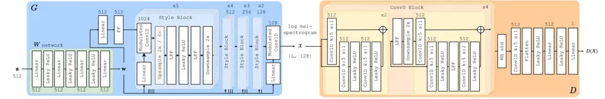
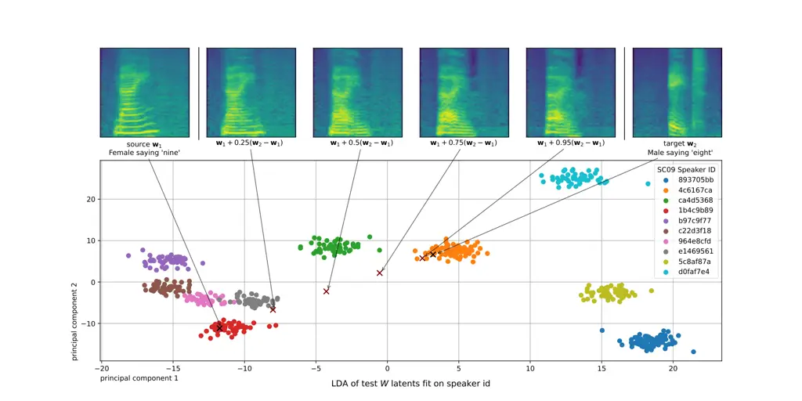
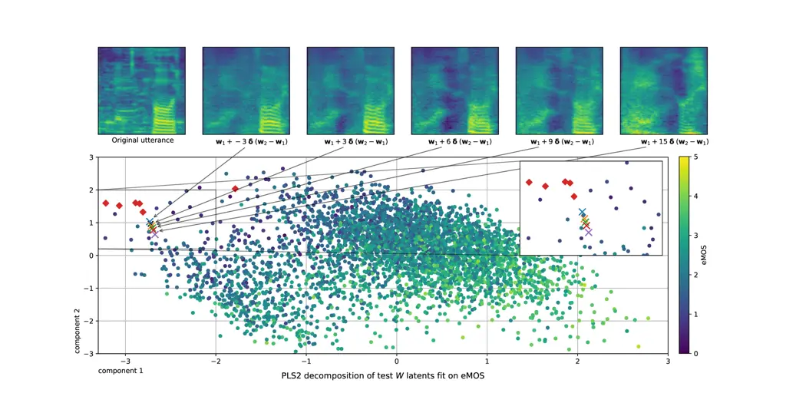
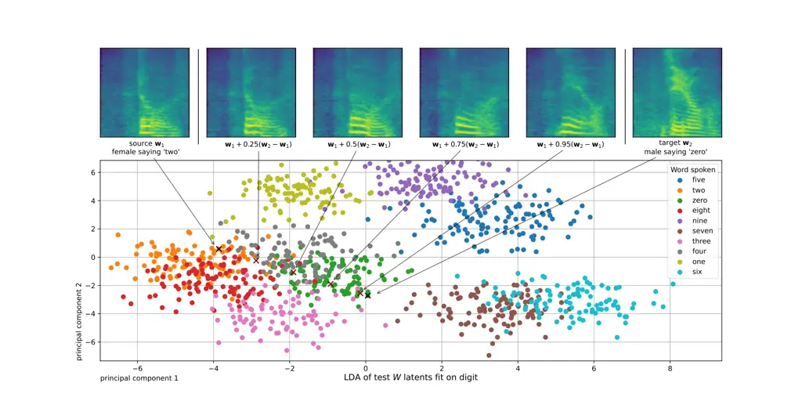

# Disentanglement in a GAN for Unconditional Speech Synthesis

PubID: pubid: © 2024 IEEE

Matthew Baas    Herman Kamper ^(†)^(†)thanks: Matthew Baas and Herman
Kamper are with the Department of Electrical and Electronic Engineering,
Stellenbosch University, South Africa (email:
[20786379@sun.ac.za](mailto:20786379@sun.ac.za);
[kamperh@sun.ac.za](mailto:kamperh@sun.ac.za)).^(†)^(†)thanks: All
experiments were performed on Stellenbosch University’s High Performance
Computing (HPC) GPU cluster. ^(†)^(†)thanks: Manuscript accepted to IEEE
TASLP, 2024.

###### Abstract

Can we develop a model that can synthesize realistic speech directly
from a latent space, without explicit conditioning? Despite several
efforts over the last decade, previous adversarial and diffusion-based
approaches still struggle to achieve this, even on small-vocabulary
datasets. To address this, we propose AudioStyleGAN (ASGAN) – a
generative adversarial network for unconditional speech synthesis
tailored to learn a disentangled latent space. Building upon the
StyleGAN family of image synthesis models, ASGAN maps sampled noise to a
disentangled latent vector which is then mapped to a sequence of audio
features so that signal aliasing is suppressed at every layer. To
successfully train ASGAN, we introduce a number of new techniques,
including a modification to adaptive discriminator augmentation which
probabilistically skips discriminator updates. We apply it on the
small-vocabulary Google Speech Commands digits dataset, where it
achieves state-of-the-art results in unconditional speech synthesis. It
is also substantially faster than existing top-performing diffusion
models. We confirm that ASGAN’s latent space is disentangled: we
demonstrate how simple linear operations in the space can be used to
perform several tasks unseen during training. Specifically, we perform
evaluations in voice conversion, speech enhancement, speaker
verification, and keyword classification. Our work indicates that GANs
are still highly competitive in the unconditional speech synthesis
landscape, and that disentangled latent spaces can be used to aid
generalization to unseen tasks. Code, models, samples:
[https://github.com/RF5/simple-asgan/](https://github.com/RF5/simple-asgan/).

###### Index Terms: 

Unconditional speech synthesis, generative adversarial networks, speech
disentanglement.

## I Introduction

Unconditional speech synthesis systems aim to produce coherent speech
without conditioning inputs such as text or speaker labels \[1\]. In
this work we are specifically interested in learning to map noise from a
known continuous distribution into spoken utterances \[2\]. A model that
could do this would have several useful downstream applications: from
latent interpolations between utterances and fine-grained tuning of
properties of the generated speech, to audio compression and better
probability density estimation of speech. Some of these advances from
latent generative modelling have already been realized in the image
modality \[3, 4\]; our goal is to bring these developments to the speech
domain.

Direct speech synthesis from a latent space is a very challenging
problem, with prior efforts only able to model speech in a restricted
setting \[1, 5, 6\]. We therefore also restrict ourselves to the
small-vocabulary case here.

In this problem setting, recent studies on diffusion models \[7\] for
images \[8, 9, 10\] has led to major improvements in unconditional
speech synthesis. The current best-performing approaches are all based
on diffusion modelling \[6, 5\], which iteratively de-noise a sampled
signal into a waveform through a Markov chain \[7\]. Before this, many
studies used generative adversarial networks (GANs) \[11\] that map a
latent vector to a sequence of speech features with a single forward
pass through the model. However, performance was limited \[1, 2\],
leading to GANs falling out of favour for this task.

Motivated by the recent developments in the StyleGAN literature \[12,
13, 3\] for image synthesis, we aim to reinvigorate GANs for
unconditional speech synthesis, where we are particularly interested in
their ability for learning continuous, disentangled latent spaces
\[13\]. To this end, we propose AudioStyleGAN (ASGAN): a convolutional
GAN which maps a single latent vector to a sequence of audio features,
and is designed to have a disentangled latent space. The model is based
in large part on StyleGAN3 \[3\], which we adapt for audio synthesis.
Concretely, we adapt the style layers to remove signal aliasing caused
by the non-linearities in the network. This is accomplished with
anti-aliasing filters to ensure that the Nyquist-Shannon sampling limits
are met in each layer. We also propose a modification to adaptive
discriminator augmentation \[14\] to stabilize training by randomly
dropping discriminator updates based on a guiding signal.

In unconditional speech synthesis experiments, we measure the quality
and diversity of the generated samples using objective metrics. We show
that ASGAN sets a new state-of-the-art in unconditional speech synthesis
on the Google Speech Commands digits dataset \[15\]. Objective metrics
that measure latent space disentanglement indicate that ASGAN has a more
disentangled latent representation compared to existing diffusion
models. It not only outperforms the best existing models but is also
faster to train and faster in inference. Subjective mean opinion scores
(MOS) indicate that ASGAN’s generated utterances sound more natural
(MOS: 3.68) than the existing best model (SaShiMi \[6\], MOS: 3.33). We
also perform ablation experiments showing intrinsically that our
proposed anti-aliasing and adaptive discriminator augmentation
techniques are necessary for high-quality and diverse synthesis.

This work is an extension of the conference paper \[16\], where (apart
from the ablation experiments) many of the above intrinsic evaluations
were already presented. Here, for the first time, we profile the
generalization benefits of a disentangled latent space. Through an
evaluation of ASGAN’s abilities we show that its disentangled latent
space allows us to perform several tasks unseen during training through
simple linear operations in its latent space. Concretely, we demonstrate
compelling zero-shot performance on voice conversion, speech
enhancement, speaker verification and keyword classification on the
Google Speech Commands digits dataset. While not matching the
performance of state-of-the-art task-specific systems on all these
tasks, our experiments show that a single model designed for
disentanglement can achieve reasonable performance across a range of
tasks that it hasn’t seen in training. Our work shows the continued
competitive nature of GANs compared to diffusion models, and the
generalization benefits of designing for disentanglement.

The paper is organized as follows. We discuss related work in Sec. II
and then go on to propose ASGAN in Sec. III. The main unconditional
speech synthesis experiments and their results are given in Sec. IV
and V. This is followed by the experiments on the unseen tasks that
ASGAN can be used for in Sec. VI, VII, and VIII.

## II Related Work

Since we focus on the proposed generalization abilities provided by a
continuous latent space, we first distinguish what we call unconditional
speech synthesis to the related but different task of generative spoken
language modelling (GSLM) \[17\]. In GSLM, a large autoregressive
language model is typically trained on discovered discrete units (e.g.
HuBERT \[18\] clusters or clustered spectrogram features), similar to
how a language model is trained on text \[19, 20\]. While this also
enables the generation of speech without any conditioning input, GSLM
implies a model structure consisting of an encoder to discretize speech,
a language model, and a decoder to convert the discrete units back into
a waveform \[17\]. By using discrete units, GSLM approaches can produce
long sequences while retaining good performance. The downside of this
discrete approach is that, during generation, you are bound by the
discrete units in the model. E.g. it is not possible to interpolate
between two utterances in a latent space or to directly control speaker
characteristics during generation. If this is desired, additional
components must be explicitly built into the model \[20\].

In contrast, in unconditional speech synthesis we do not assume any
knowledge of particular aspects of speech beforehand. Instead of using
some intermediate discretization step, such models use noise to directly
generate speech, often via some latent representation. The latent space
should ideally be disentangled, allowing for better control of the
generated speech. In contrast to GSLM, the synthesis model should learn
to disentangle without being explicitly designed to control specific
speech characteristics. In some sense this is a more challenging task
than GSLM, which is why most unconditional speech synthesis models are
still evaluated on short utterances of isolated spoken words \[1\] (as
we also do here). In more structured conditional synthesis tasks such as
text-to-audio or text-to-video, recent studies \[21, 22\] have
demonstrated the benefits of modelling a continuous latent space from
noise, and then performing synthesis from that latent space. We aim to
apply this reasoning to the unconditional speech synthesis domain in an
attempt to realize similar benefits.

Within unconditional speech synthesis, a substantial body of work
focuses on either autoregressive models \[23\] – generating a current
sample based on previous outputs – or diffusion models \[5\]. Diffusion
models iteratively denoise a sampled signal into a waveform through a
Markov chain according to a specified inference schedule \[7\]. At each
inference step, the original noise signal is slightly denoised until, in
the last step, it resembles coherent speech. Autoregressive and
diffusion models are relatively slow because they require repeated
forward passes through the model during inference.

Earlier studies \[1, 2\] attempted to use GANs \[11\] for unconditional
speech synthesis, which has the advantage of requiring only a single
pass through the model. While results showed some initial promise,
performance was poor in terms of speech quality and diversity, with the
more recent diffusion models performing much better \[6\]. However,
there have been substantial improvements in GAN-based modelling for
image synthesis in the intervening years \[14, 12, 13\].

Palkama et. al. \[24\] made initial inroads in applying techniques from
the earlier StyleGAN models for unconditional speech synthesis. Their
main focus, however, was to improve conditional speech synthesis using
the digit label to guide generation, with the ultimate goal of building
a GAN-based text-to-speech model. Our focus instead is on unconditional
speech synthesis, particularly in how a GAN-based approach leads to a
disentangled latent space.

In a very related research direction, Beguš et al. \[25, 2, 26\] and
Chen and Elsner \[27\] have been studying how GAN-based unconditional
speech synthesis models internally perform lexical and phonological
learning, and how this relates to human learning. Most of these studies,
however, rely on older GAN synthesis models. We hope that by developing
better performing GANs for unconditional speech synthesis, we can
contribute to improving such investigations. Recently, \[28\] attempted
to directly use StyleGAN2 for conditional and unconditional synthesis of
emotional vocal bursts. This further motivates a reinvestigation of
GANs, but here we look specifically at the generation of speech rather
than paralinguistic sounds.

## III Audio Style GAN



Fig. 1: The ASGAN generator $`G`$ (left) and discriminator $`D`$
(right). FF, LPF, Conv1D indicate Fourier feature \[3\], low-pass
filter, and 1D convolution layers, respectively. The number of output
features/channels are indicated above linear and convolutional layers.
Stacked blocks indicate a layer repeated sequentially.

Our model is based on the StyleGAN family of models \[12\] for image
synthesis. We adapt and extend the approach to audio, and therefore dub
our model AudioStyleGAN (ASGAN).

The model follows the setup of a standard GAN with a single generator
network $`G`$ and discriminator network $`D`$ \[11\]. The generator
$`G`$ accepts a vector $`\mathbf{z}`$ sampled from a normal distribution
and processes it into a sequence of speech features $`X`$. In this work,
we restrict the sequence of speech features $`X`$ to always have a fixed
pre-specified duration. The discriminator $`D`$ accepts a sequence of
speech features $`X`$ and yields a scalar output. The model uses a
non-saturating logistic loss \[11\] whereby $`D`$ is optimized to raise
its output for $`X`$ sampled from real data and minimize its output for
$`X`$ produced by the generator. Meanwhile, the generator $`G`$ is
optimized to maximize $`D(X)`$ for $`X`$ sampled from the generator,
i.e. when $`X=G(\mathbf{z})`$. The speech features $`X`$ are converted
to a waveform using a pretrained HiFiGAN vocoder \[29\]. During
training, a new adaptive discriminator updating technique is added to
ensure stability and convergence. Each component is described in detail
below.

### III-A Generator

The architecture of the generator $`G`$ is shown on the left of Fig. 1.
It consists of a latent mapping network $`W`$ that converts
$`\mathbf{z}`$ to a disentangled latent space, a special Fourier feature
layer which converts a single vector from this latent space into a
sequence of cosine features of fixed length, and finally a convolutional
encoder which iteratively refines the cosine features into the final
speech features $`X`$.

#### III-A1 Mapping network

The mapping network $`W`$ is a simple multi-layer perceptron consisting
of several linear layers with leaky ReLU activations between them. As
input, it takes in a normally distributed vector
$`\mathbf{z}\sim Z=\mathcal{N}(\mathbf{0},\mathbf{I})`$; in all our
experiments we use a 512-dimensional multivariate normal vector,
$`\mathbf{z}\in\mathbb{R}^{512}`$. Passing this vector through the
mapping network produces a latent vector $`\mathbf{w}=W(\mathbf{z})`$ of
the same dimensionality as $`\mathbf{z}`$. As explained in \[12\], the
primary purpose of $`W`$ is learn to map noise to a linearly
disentangled $`W`$ space, as ultimately this will allow for more
controllable and understandable synthesis. $`W`$ is coaxed into learning
such a disentangled representation because it can only linearly modulate
channels of the cosine features in each layer of the convolutional
encoder (see details below). So, if $`\mathbf{w}`$ is to linearly shape
the speech features, $`W`$ should ideally learn a mapping that organizes
the random normal space $`\mathbf{z}`$ into one which linearly
disentangles common factors of speech variation.

#### III-A2 Convolutional encoder

The convolutional encoder begins by linearly projecting $`\mathbf{w}`$
as the input to a Fourier feature layer \[30\] as shown in Fig. 1.
Concretely, we use the Gaussian Fourier feature mapping from \[30\] and
incorporate the transformation proposed in StyleGAN3 \[3\]. This layer
samples a frequency and phase from a Gaussian distribution for each
output channel (fixed at initialization). The layer then linearly
projects the input vector to a vector of phases which are added to the
initial random phases. The output sequence is obtained as the plot of a
cosine function with these frequencies and phases, one frequency/phase
for each output channel. Intuitively, the layer provides a way to learn
a mapping between a single vector ($`\mathbf{w}`$) into a sequence of
vectors at the output of the Fourier feature layer, which provides the
base from which the rest of the model can iteratively operate on the
feature sequence to eventually arrive at a predicted mel-spectrogram.

The sequence produced by the Fourier feature layer is iteratively passed
through 14 Style Blocks, which are based on the encoder layers of the
StyleGAN family of models. In each layer, the input sequence and style
vector $`\mathbf{w}`$ are passed through a modulated convolution
layer \[13\]: the final convolution kernel is computed by multiplying
the layer’s learnt kernel with the style vector derived from
$`\mathbf{w}`$, broadcasted over the length of the kernel. In this way,
the latent vector $`\mathbf{w}`$ linearly modulates the kernel in each
convolution.

To ensure the signal does not experience aliasing due to the
non-linearity, the leaky ReLU layers are surrounded by layers
responsible for anti-aliasing (explained below). All these layers
comprise a single Style Block, which is repeated in groups of 5, 4, 3,
and finally 2 blocks. The last block in each group upsamples by
$`4\times`$ instead of $`2\times`$, thereby increasing the sequence
length by a factor of 2 for each group. A final 1D convolution layer
projects the output from the last group into the audio feature space
(e.g. log mel-spectrogram or HuBERT features), as illustrated in the
middle of Fig. 1.

#### III-A3 Anti-aliasing filters

From image synthesis with GANs \[3\], we know that the generator must
include anti-aliasing filters for the signal propagating through the
network to approximately satisfy the Nyquist-Shannon sampling theorem.
This is why, before and after a non-linearity, we include upsampling,
low-pass filter (LPF), and downsampling layers in each Style Block. The
motivation from \[3\] is that non-linearities introduce arbitrarily
high-frequency information into the output signal. The signal we are
modelling (speech) is continuous, and the internal discrete-time
features that are passed through the network is therefore a digital
representation of this continuous signal. From the Nyquist-Shannon
sampling theorem, we know that for such a discrete-time signal to
accurately reconstruct the continuous signal, it must be bandlimited to
$`0.5\text{\,}\text{cycles/sample}`$. If not, \[3\] showed that the
generator learns to use aliasing artefacts to fool the discriminator, to
the detriment of quality and control of the final output. To address
this, we follow \[3\]: we approximate an ideal continuous LPF by first
upsampling to a higher sample rate, applying a discrete LPF as a 1D
convolution, and only then applying the non-linearity. This
high-frequency signal is then passed through an anti-aliasing discrete
LPF before being downsampled again to the original sampling rate.

Because of the practical imperfections in this anti-aliasing scheme, the
cutoff frequencies for the LPFs must typically be much lower than the
Nyquist frequency of $`0.5\text{\,}\text{cycles/sample}`$. We reason
that the generator should ideally first focus on generating coarse
features before generating good high-frequency details, which will
inevitably contain more trace aliasing artifacts. So we design the
filter cutoff to begin at a small value in the first Style Block, and
increase gradually to near the critical Nyquist frequency in the final
block. In this way, aliasing is kept fairly low throughout the network,
with very high frequency information near the Nyquist frequency only
being introduced in the last few layers.

### III-B Discriminator

The discriminator $`D`$ has a convolutional architecture similar
to \[13\]. It takes a sequence of speech features $`X`$ as input and
predicts whether it is generated by $`G`$ or sampled from the dataset.
Concretely, $`D`$ consists of four ConvD Blocks and a network head, as
show in Fig. 1. Each ConvD Block consists of 1D convolutions with skip
connections, and a downsampling layer with an anti-aliasing LPF in the
last skip connection. The LPF cutoff is set to the Nyquist frequency for
all layers. The number of layers and channels are chosen so that $`D`$
has roughly the same number of parameters as $`G`$. $`D`$’s head
consists of a minibatch standard deviation \[31\] layer and a 1D
convolution layer before passing the flattened activations through a
final linear projection head to arrive at the logits. Both $`D`$ and
$`G`$ are trained using the non-saturating logistic loss \[11\].

### III-C Vocoder

The generator $`G`$ and discriminator $`D`$ operate on sequences of
speech features and not on raw waveform samples. Once both $`G`$ and
$`D`$ are trained, we need a way at convert these speech features back
to waveforms. For this we use a pretrained HiFi-GAN vocoder \[29\] that
vocodes either log mel-scale spectrograms \[32\] or HuBERT
features \[18\]. HuBERT is a self-supervised speech representation model
that learns to encode speech in a 50 Hz vector sequence using a masked
token prediction task. These learnt features are linearly predictive of
several high-level characteristics of speech such as phone identity,
making it useful as a feature extractor when trying to learn
disentangled representations.

### III-D Implementation

We train two variants of our model: a log mel-spectrogram model and a
HuBERT model. And, extending our initial investigation in \[16\], we
train additional variants of the HuBERT-based model to understand key
design choices.

#### III-D1 ASGAN variants

The log mel-spectrogram model architecture is shown in Fig. 1, where
mel-spectrograms are computed with 128 mel-frequency bins at a hop and
window size of 10 ms and 64 ms, respectively. Each 10 ms frame of the
mel-scale spectrograms is scaled by taking the natural logarithm of the
spectrogram magnitude. The HuBERT-based model is identical except that
it only uses only half the sequence length (since HuBERT features are
20 ms instead of the 10 ms spectrogram frames) and has a different
number of output channels in the four groups of Style Blocks: \[1024,
768, 512, 512\] convolution channels instead of the \[1024, 512, 256,
128\] used for the mel-spectrogram model. This change causes the HuBERT
variant to contain 51M parameters, as opposed to the 38M parameters in
the mel-spectrogram model.

#### III-D2 Vocoder variants

The HiFi-GAN vocoder for both HuBERT and mel-spectrogram features is
based on the original author’s implementation \[29\]. The HuBERT feature
HiFi-GAN is trained on the LibriSpeech train-lean-100 multispeaker
speech dataset \[33\] to vocode activations extracted from layer 6 of
the pretrained HuBERT Base model provided with fairseq \[34\]. The
mel-spectrogram HiFiGAN is trained on the Google Speech Commands
dataset. Both are trained using the original V1 HiFi-GAN configuration
(number of updates, learning and batch size parameters) from \[29\].

#### III-D3 Optimization

Both ASGAN variants are trained with Adam \[35\]
($`\beta_{1}=0,\beta_{2}=0.99`$), clipping gradient norms at 10, and a
learning rate of $`3\cdot 10^{-3}`$ for 520k iterations with a batch
size of 32. Several critical tricks are used to stabilize GAN training:
(i) equalized learning rate is used for all trainable parameters \[31\];
(ii) leaky ReLU activations with $`\alpha=0.1`$; (iii) exponential
moving averaging for the generator weights (for use during evaluation)
\[31\]; (iv) $`R_{1}`$ regularization \[36\]; and (v) a 0.01-times
smaller learning rate for the mapping network $`W`$, since it needs to
be updated slower compared to the convolution layers in the main network
branch \[3\].

#### III-D4 Adaptive discriminator updates

We also introduce a new technique for updating the discriminator.
Concretely, we first scale $`D`$’s learning rate by 0.1 compared to the
generator as otherwise we find it overwhelms $`G`$ early on in training.
Additionally we employ a dynamic method for updating $`D`$, inspired by
adaptive discriminator augmentation \[14\]: during each iteration, we
skip $`D`$’s update with probability $`p`$. The probability $`p`$ is
initialized at 0.1 and is updated every 16th generator step or whenever
the discriminator is updated. We keep a running average $`r_{t}`$ of the
proportion of $`D`$’s outputs on real data $`D(X)`$ that are positive
(i.e. that $`D`$ can confidently identify as real). Then, if $`r_{t}`$
is greater than 0.6 we increase $`p`$ by 0.05 (capped at 1.0), and if
$`r_{t}`$ is less than 0.6 we decrease $`p`$ by 0.05 (limited at 0.0).
In this way, we adaptively skip discriminator updates. When $`D`$
becomes too strong, both $`r_{t}`$ and $`p`$ rise, and so $`D`$ is
updated less frequently. Conversely, when $`D`$ becomes too weak, it is
updated more frequently. We found this new modification to be critical
for ensuring that $`D`$ does not overwhelm $`G`$ during training.

We also use the traditional adaptive discriminator augmentation \[14\]
where we apply the following transforms to the model input with the same
probability $`p`$: (i) adding Gaussian noise with $`\sigma=0.05`$; (ii)
random scaling by a factor of $`1\pm 0.05`$; and (iii) randomly
replacing a subsequence of frames from the generated speech features
with a subsequence of frames taken from a real speech feature sequence.
This last augmentation is based on the fake-as-real GAN method \[37\]
and is important to prevent gradient explosion later in training.

#### III-D5 Anti-aliasing filters

For the anti-aliasing LPF filters we use windowed sinc filters with a
width-9 Kaiser window \[38\]. For the generator (all variants), the
first Style Block has a cutoff at $`f_{c}=0.125\ \text{cycles/sample}`$
which is increased in an even logarithmic scale to
$`f_{c}=0.45\ \text{cycles/sample}`$ in the second-to-last layer,
keeping this value for the last two layers to fill in the last high
frequency detail. Even in these last layers we use a cutoff below the
Nyquist frequency to ensure the imperfect LPF still sufficiently
suppresses aliased frequencies. For the discriminator we are less
concerned about aliasing as it does not generate a continuous signal, so
we use a $`f_{c}=0.5\ \text{cycles/sample}`$ cutoff for all ConvD
Blocks.

All models are trained using mixed FP16/FP32 precision on a single
NVIDIA Quadro RTX 6000 using PyTorch 1.11. Trained models and code are
available at
[https://github.com/RF5/simple-asgan/](https://github.com/RF5/simple-asgan/).

## IV Experimental Setup: Unconditional Speech Synthesis

### IV-A Data

To compare to existing unconditional speech synthesis models, we use the
Google Speech Commands dataset of isolated spoken words \[15\]. As in
other studies \[6, 5, 1\], we use the subset corresponding to the ten
spoken digits “zero” to “nine” (called SC09). The digits are spoken by
various speakers under different channel conditions. This makes it a
challenging benchmark for unconditional speech synthesis. All utterances
are roughly a second long and are sampled at 16 kHz, where utterances
less than a second are padded to a full second.

### IV-B Evaluation metrics

We train and validate our models on the official
training/validation/test split from SC09. We then evaluate unconditional
speech synthesis quality by seeing how well newly generated utterances
match the distribution of the SC09 test split. We use metrics similar to
those for image synthesis; they try to measure either the quality of
generated utterances (realism compared to actual audio in the test set),
or the diversity of generated utterances (how varied the utterances are
relative to the test set), or a combination of both.

These metrics require extracting features or predictions from a
supervised speech classifier network trained to classify the utterances
from SC09 by what digit is spoken. While there is no consistent
pretrained classifier used for this purpose, we opt to use a ResNeXT
architecture \[39\], similar to previous studies \[6, 5\]. The trained
model has a 98.1% word classification accuracy on the SC09 test set, and
we make the model code and checkpoints available for future
comparisons.¹¹ 1
[https://github.com/RF5/simple-speech-commands](https://github.com/RF5/simple-speech-commands)
Using either the classification output or 1024-dimensional features
extracted from the penultimate layer in the classifier, we consider the
following metrics.

- •
  Inception score (IS) measures the diversity and quality of generated
  samples by evaluating the Kullback-Leibler (KL) divergence between the
  label distribution from the classifier output and the mean label
  distribution over a set of generated utterances \[40\].
- •
  Modified Inception score (mIS) extends the diversity measurement
  aspect of IS by incorporating a measure of intra-class diversity (in
  our case over the ten digits) to reward models with higher intra-class
  entropy \[41\].
- •
  Fréchet Inception distance (FID) computes a measure of how well the
  distribution of generated utterances matches the test-set utterances
  by comparing the classifier features of generated and real data
  \[42\].
- •
  Activation maximization (AM) measures generator quality by comparing
  the KL divergence between the classifier class probabilities from real
  and generated data, while penalizing high classifier entropy samples
  produced by the generator \[43\]. Intuitively, this attempts to
  account for possible class imbalances in the training set and
  intra-class diversity by incorporating a term for the entropy of the
  classifier outputs for generated samples.

A major motivation for ASGAN’s design is latent-space disentanglement.
In the experiments proceeding from Sec. VIII and onwards, we show this
property allows the model to be applied to extrinsic tasks that it is
not explicitly trained for. But before this (Sec. V), we intrinsically
evaluate disentanglement using two metrics on the $`Z`$ and $`W`$ latent
spaces.

- •
  Path length measures the mean $`L_{2}`$ distance moved by the
  classifier features when the latent point ($`\mathbf{z}`$ or
  $`\mathbf{w}`$) is randomly perturbed slightly, averaged over many
  perturbations \[12\]. A lower value indicates a smoother latent space.
- •
  Linear separability utilizes a linear support vector machine (SVM) to
  classify the digit of a latent point. The metric is computed as the
  additional information (in terms of mean entropy) necessary to
  correctly classify an utterance given the class prediction from the
  linear SVM \[12\]. A lower value indicates a more linearly
  disentangled latent space.

These metrics are averaged over 5000 generated utterances for each
model. As in \[12\], for linear separability we exclude half the
generated utterances for which the ResNeXT classifier is least confident
in its prediction.

To give an indication of naturalness, we compute an estimated mean
opinion score (eMOS) using a pretrained Wav2Vec2 small baseline from the
VoiceMOS challenge \[44\]. This model is trained to predict the
naturalness score that a human would assign to an utterance from 1
(least natural) to 5 (most natural). We also perform an actual
subjective MOS evaluation using Amazon Mechanical Turk to obtain 240
opinion scores for each model with 12 speakers listening to each
utterance. Finally, the speed of each model is also evaluated to
highlight the benefit that GANs can produce utterances in a single
inference call, as opposed to the many inference calls necessary with
autoregressive or diffusion models.

### IV-C Baseline systems

We compare to the following unconditional speech synthesis methods
(Sec. II): WaveGAN \[1\], DiffWave \[5\], autoregressive SaShiMi and
SaShiMi+DiffWave \[6\]. Last-mentioned is the current best-performing
model on SC09. For WaveGAN we use the trained model provided by the
authors \[1\], while for DiffWave we use an open-source pretrained
model.²² 2
[https://github.com/RF5/DiffWave-unconditional](https://github.com/RF5/DiffWave-unconditional)
For the autoregressive SaShiMi model, we use the code provided by the
authors to train an unconditional SaShiMi model on SC09 for 1.1M updates
\[6\].³³ 3
[https://github.com/RF5/simple-sashimi](https://github.com/RF5/simple-sashimi)
Finally, for the SaShiMi+DiffWave diffusion model, we modify the
autoregressive SaShiMi code and combine it with DiffWave according
to \[6\]; we train it on SC09 for 800k updates with the hyperparameters
in the original paper \[6\].³³footnotemark: 3

ASGAN is a two-stage model (it generates a feature representation, then
vocodes the result), while WaveGAN, SaShiMi, and DiffWave are one-stage
models (they directly generate the output waveform). Despite
SaShiMi+DiffWave being the current top-performing model, our two-stage
approach may have an advantage over one-stage approaches because it
separates the vocoding task to a separate model.

Lastly, the autoregressive SaShiMi is originally evaluated using a form
of rejection sampling \[6\] to retain only high probability generated
samples for evaluation. But, when sampling from a GAN using
$`\mathbf{z}\sim\mathcal{N}(\mathbf{0},\mathbf{I})`$, we also have the
exact density value for this sampled $`\mathbf{z}`$. So, we could
perform various sampling tricks on all the models (since both diffusion
and GAN models also have tractable likelihood measures). However, in the
interest of an fair and simple comparison of the inherent performance of
each model, we opt to keep the same and most general sampling method for
each model (including ASGAN). So, in all experiments, we perform direct
sampling from the latent space for the GAN and diffusion models
according to the original papers. For the autoregressive models, we
directly sample from the predicted distribution for each time-step.

## V Results: Unconditional Speech Synthesis

### V-A Comparison to baselines

|                   |                  |                    |                     |                    |                    |                   |
| ----------------- | ---------------- | ------------------ | ------------------- | ------------------ | ------------------ | ----------------- |
| Model             | IS$`\ \uparrow`$ | mIS $`\ \uparrow`$ | FID$`\ \downarrow`$ | AM$`\ \downarrow`$ | eMOS$`\ \uparrow`$ | MOS$`\ \uparrow`$ |
| Train set         | $`9.37`$         | $`237.6`$          | $`0`$               | $`0.20`$           | $`2.41`$           | $`3.74\pm 12`$    |
| Test set          | $`9.36`$         | $`242.3`$          | $`0.01`$            | $`0.20`$           | $`2.43`$           | $`3.88\pm 12`$    |
| WaveGAN \[1\]     | $`4.45`$         | $`34.6`$           | $`1.77`$            | $`0.81`$           | $`1.06`$           | $`2.88\pm 16`$    |
| DiffWave \[5\]    | $`5.13`$         | $`49.6`$           | $`1.68`$            | $`0.68`$           | $`1.66`$           | $`3.43\pm 14`$    |
| SaShiMi \[6\]     | $`3.74`$         | $`18.9`$           | $`2.11`$            | $`0.99`$           | $`1.58`$           | $`3.19\pm 15`$    |
| SaShiMi+DiffWave  | $`5.44`$         | $`60.8`$           | $`1.01`$            | $`0.61`$           | $`1.89`$           | $`3.33\pm 12`$    |
| ASGAN (mel-spec.) | $`7.02`$         | $`162.8`$          | $`0.56`$            | $`0.36`$           | $`1.76`$           | $`3.51\pm 13`$    |
| ASGAN (HuBERT)    | 7.67             | 226.7              | 0.14                | 0.26               | 1.99               | 3.68(13)          |

TABLE I: Results measuring the quality and diversity of generated
samples from unconditional speech synthesis models together with
train/test set toplines for the SC09 dataset. Subjective MOS values with
95% confidence intervals are shown. IS, mIS, FID, AM are averaged over
5000 generated utterances generated from each model (or drawn from the
train/test set for topline scores).

|                   |                                              |                                              |                             |       |                    |
| ----------------- | -------------------------------------------- | -------------------------------------------- | --------------------------- | ----- | ------------------ |
|                   | Path length $`\downarrow`$                   |                                              | Separability $`\downarrow`$ |       |                    |
| Model             | $`Z`$                                        | $`W`$                                        | $`Z`$                       | $`W`$ | Speed $`\uparrow`$ |
| WaveGAN \[1\]     | 1.03                                         | —                                            | 4.86                        | —     | 2214.71            |
| DiffWave \[5\]    | 2.72$`\cdot\text{10}^{\text{6}}`$            | 7.27$`\cdot\text{10}^{\text{5}}`$            | 6.09                        | 6.58  | 0.83               |
| SaShiMi \[6\]     | —                                            | —                                            | —                           | —     | 0.14               |
| SaShiMi+DiffWave  | 2.89$`\cdot\text{10}^{\text{6}}`$            | 1.24$`\cdot\text{10}^{\text{6}}`$            | 4.07                        | 2.34  | 0.47               |
| ASGAN (mel-spec.) | 6.77$`\cdot\text{10}^{\hphantom{\text{1}}}`$ | 3.21$`\cdot\text{10}^{\hphantom{\text{1}}}`$ | 1.81                        | 1.01  | 875.45             |
| ASGAN (HuBERT)    | 3.50$`\cdot\text{10}^{\hphantom{\text{1}}}`$ | 1.84$`\cdot\text{10}^{\hphantom{\text{1}}}`$ | 1.40                        | 1.00  | 816.27             |

TABLE II: Latent-space disentanglement and speed metrics. Speed is
measured as the number of samples that can be generated per unit time on
a single NVIDIA Quadro RTX 6000 using a batch size of 1, given in
ksamples/sec. Some models do not have a $`W`$-space (WaveGAN) or any
continuous latent space (SaShiMi).

We present our headline results in Table I, where we compare previous
state-of-the-art unconditional speech synthesis approaches to the
proposed ASGAN model. As a reminder, IS, mIS, FID and AM measure
generated speech diversity and quality relative to the test set; eMOS
and MOS are measures of generated speech naturalness. We see that both
variants of ASGAN outperform the other models on most metrics. The
HuBERT variant of ASGAN in particular performs best across all metrics.
The improvement of the HuBERT ASGAN over the mel-spectrogram variant is
likely because the high-level HuBERT speech representations make it
easier for the model to disentangle common factors of speech variation.
The previous best unconditional synthesis model, SaShiMi+DiffWave, still
outperforms the other baseline models, and it appears to have comparable
naturalness (similar eMOS and MOS) to the mel-spectrogram ASGAN variant.
However, it appears to match the test set more poorly than either ASGAN
variant on the other diversity metrics.

The latent space disentanglement metrics and generation speed of each
model are compared in Table II. These results are more mixed, with
WaveGAN being the fastest model and the one with the shortest latent
path length in the $`Z`$-space. However, this is somewhat misleading
since WaveGAN’s samples have low quality (naturalness, as measured by
eMOS/MOS) and poor diversity compared to the other models (Table I).
This means that WaveGAN’s latent space is a poor representation of the
true distribution of speech in the SC09 dataset, allowing it to have a
very small path length as most paths do not span a diverse set of speech
variation.

In terms of linear separability, ASGAN again yields substantial
improvements over existing models. The results confirm that ASGAN has
indeed learned a disentangled latent space – a primary motivation for
the model’s design. Specifically, this shows that the idea from image
synthesis of using the latent $`\mathbf{w}`$ vector to linearly modulate
convolution kernels can also be applied to speech. This level of
disentanglement allows ASGAN to be applied to tasks unseen during
training, evaluated later in Sec. VIII. Regardless of performance, the
speed of all the convolutional GAN models (WaveGAN and ASGAN) is
significantly better than the diffusion and autoregressive models, as
reasoned in Sec. IV-B.

### V-B Ablation experiments

|                                 | Quality & diversity |                     |                    | Path length $`\downarrow`$ |          |
| ------------------------------- | ------------------- | ------------------- | ------------------ | -------------------------- | -------- |
| Variant                         | mIS $`\ \uparrow`$  | FID$`\ \downarrow`$ | eMOS$`\ \uparrow`$ | $`Z`$                      | $`W`$    |
| ASGAN (HuBERT)                  | 226.7               | 0.14                | 1.99               | $`35.0`$                   | $`18.4`$ |
| w/o adaptive $`D`$ updates      | $`1.4`$             | $`19.27`$           | $`0.69`$           | $`10.8`$                   | $`7.6`$  |
| w/o adaptive $`D`$ augmentation | $`2.3`$             | $`13.72`$           | $`0.68`$           | 8.4                        | 5.0      |
| w/o anti-aliasing filters       | $`102.7`$           | $`3.31`$            | $`1.81`$           | $`75.8`$                   | $`63.1`$ |
| w/o modulated convolution       | $`2.4`$             | $`10.96`$           | $`0.63`$           | $`111.4`$                  | $`48.5`$ |

TABLE III: Ablations of model design choices, comparing quality,
diversity, and latent-space disentanglement of several ASGAN variants.

While the previous comparisons demonstrated the overall success of
ASGAN’s design, we are still not certain which specific decisions from
Sec. III are responsible for its performance. So, we perform several
ablations of the HuBERT ASGAN model with specific components removed
from the full model. Concretely, we ablate four key design choices: we
train a variant without adaptive discriminator updates (Sec. III-D4), a
variant without adaptive discriminator augmentation (Sec. III-D4), and a
variant without any anti-aliasing filters (Sec. III-A3). Finally, we
also train a variant without modulated convolutions (Sec. III-A2) such
that $`\mathbf{w}`$ only controls the initial features passed to the
generator’s convolutional encoder.

Table III shows the results for the ablated ASGAN approaches on a subset
of the metrics. We see that on the quality and diversity metrics, the
base ASGAN is best, while the models without adaptive discriminator
updates and augmentation have better latent space disentanglement.
However, recall that the main reason for including these was not to
optimize disentanglement, but rather to ensure training stability and
performance. As reasoned in Sec. III, without either adaptive updates or
augmentation, the discriminator has a much easier task and begins to
dominate the generator, confidently distinguishing between real and
generated samples. So, while this makes optimization easier (leading to
a smoother latent space), it means that the generator does not
effectively learn from the adversarial task. A similar phenomenon can be
seen with WaveGAN in Table II, where it scored well on the
disentanglement metrics but had poor output quality in Table I.

When anti-aliasing filters are removed, both latent space
disentanglement and synthesis quality are reduced, being slightly worse
in all metrics compared to the full model. This validates our design
motivation for the inclusion of low-pass filters to suppress aliased
high-frequency content in the layer activations in Fig 1. Finally, the
variant without the linear influence of $`\mathbf{w}`$ on each layer’s
activations (i.e. without the modulated convolutions) is also worse than
the baseline model in all metrics considered.

Overall, we can see from Table III that each of the key design aspects
from Sec. III are necessary to achieve both high latent space
disentanglement and synthesis quality in a single model – the main
requirement for it to be performant on unseen downstream tasks, which we
look at next.

## VI Solving Unseen Tasks Through Linear Latent Operations

We have now shown intrinsically that ASGAN leads to a disentangled
latent space. In this section and the ones that follow we show that
ASGAN can also be used extrinsically to perform tasks unseen during
training through linear manipulations of its latent space. From this
point onwards we the HuBERT ASGAN variant.

As a reminder, the key aspect of ASGAN’s design is that the latent space
associated with the vector $`\mathbf{w}`$ is linearly disentangled. The
idea is that, since the $`\mathbf{w}`$ vector can only linearly affect
the output of the model through the Fourier feature layer and modulated
convolutions (Fig. 1), $`W`$ should ideally learn to linearly
disentangle common factors of speech variation. If this turns out to be
true – i.e. the space is indeed disentangled – then these factors should
correspond to linear directions in the $`W`$ latent space. As originally
motivated in studies on image synthesis \[12, 13\], this would mean that
linear operations in the latent space should correspond to meaningful
edits in the generated output. In our case, this would mean that if we
know the relationship between two utterances, then the linear distance
between the latent vectors $`\mathbf{w}`$ of those utterances should
reflect that relationship. E.g. consider a collection of utterances
differing only in noise level but otherwise having the same properties.
If the space disentangles noise levels, then we should expect the latent
points of these utterances to lie in the same linear subspace,
reflective of the level of noise.

### VI-A Projecting to the latent space

Before defining how unseen tasks can be phrased as latent operations, we
first need to explain how we invert a provided utterance to a latent
vector $`\mathbf{w}`$. We use a method similar to \[13\] where we
optimize a $`\mathbf{w}`$ vector while keeping $`G`$ and the speech
feature sequence $`X`$ fixed. Concretely, $`\mathbf{w}`$ is initialized
to the mean $`\bar{\mathbf{w}}=\mathbb{E}[W(\mathbf{z})]`$ vector over
100k samples and then fed through the network to produce a candidate
sequence $`\tilde{X}`$. An $`L_{2}`$ loss is then formed as the mean
square distance between each feature in the candidate sequence
$`\tilde{X}`$ and the target sequence $`X`$. Optimization
follows \[13\], using Adam for 1000 iterations with a maximum learning
rate of 0.1, and with Gaussian noise added to $`\mathbf{w}`$ in the
first 750 iterations. The variance of this noise is set to be
proportional to the average square $`L_{2}`$ distance between the mean
$`\bar{\mathbf{w}}`$ and the sampled $`\mathbf{w}`$ vectors.

### VI-B Downstream tasks

We look at several downstream tasks, each of which can be phrased as
linear operations in the latent $`W`$-space.

#### VI-B1 Style mixing

We can perform voice conversion or speech editing by using style mixing
of the latent vectors $`\mathbf{w}`$. Style mixing is a technique
proposed in \[12\], where they find that StyleGAN models encode coarse
information (e.g. facial type, frame positioning) using the
$`\mathbf{w}`$ vector passed to earlier layers, and finer details (e.g.
hair color, lighting) using the $`\mathbf{w}`$ vector passed to later
layers. We will qualitatively show that this also applies to speech in
ASGAN, where earlier layers control coarse aspects of speech (e.g. digit
class) while later layers control finer aspects of speech (e.g. speaker
identity).

Concretely, we can project two utterances $`X_{1}`$ and $`X_{2}`$ to
their latent representations $`\mathbf{w}_{1}`$ and $`\mathbf{w}_{2}`$.
Then – recalling the architecture in Fig. 1 – we can use different
$`\mathbf{w}`$ vectors as input into each Style Block. According to our
design motivation of the anti-aliasing filters in Sec. III-D5, the
coarse styles are captured in the earlier layers, and the fine styles
are introduced in later layers. So we can perform voice conversion from
$`X_{1}`$’s speaker to $`X_{2}`$’s speaker by conditioning later layers
with $`\mathbf{w}_{2}`$ while still using $`\mathbf{w}_{1}`$ in earlier
layers. This causes the generated utterance to inherent the speaking
style (fine) from the target utterance $`X_{2}`$, but retain the word
identity (coarse) from $`X_{1}`$. By doing the opposite we can also do
speech editing: having the speaker from $`X_{1}`$ say the word in
$`X_{2}`$ by conditioning earlier layers with $`\mathbf{w}_{2}`$ while
keeping $`\mathbf{w}_{1}`$ in later layers. Furthermore, because the
$`W`$ latent space is continuous, we can interpolate between retaining
and replacing the coarse and fine styles to achieve varying degrees of
voice conversion or speech editing. We do these style mixing experiments
in Sec. VIII-A. In preliminary experiments we found it optimal to use
the first 11 Style Blocks for coarse styles and the remaining 5 Style
Blocks for fine styles.

#### VI-B2 Speech enhancement

Speech enhancement is the task of removing noise from an
utterance \[45\]. Intuitively, if ASGAN’s $`W`$-space is linearly
disentangled, there should be a single direction corresponding to
increasing or decreasing the background noise in an utterance. Given
several utterances only varying in degrees of noise, we can project them
to the $`W`$-space and compute the direction in which to move to change
the noise level. Concretely, to denoise an utterance $`X_{0}`$, we can
generate $`N`$ additional utterances by adding increasingly more
Gaussian noise, providing a list of utterances
$`X_{0},X_{1},...,X_{N}`$, with
$`X_{n}=X_{0}+\mathcal{N}(\mathbf{0},n\sigma^{2}\mathbf{I})`$. We then
project each utterance to the latent space, yielding
$`\mathbf{w}_{0},\mathbf{w}_{1},...,\mathbf{w}_{N}`$. To get a single
vector corresponding to the direction of decreasing noise, we compute
the average unit vector from the higher-noise vectors to the original
latent vector:

```math
\boldsymbol{\delta}=\frac{1}{N}\sum_{n=1}^{N}\frac{\mathbf{w}_{0}-\mathbf{w}_{n}}{||\mathbf{w}_{0}-\mathbf{w}_{n}||_{2}}
```

Now we can denoise the original utterance $`X_{0}`$ by moving in the
direction of $`\boldsymbol{\delta}`$ in the latent space. In Sec. VIII
we evaluate this method and investigate how far we can move in the
$`\boldsymbol{\delta}`$-direction.

#### VI-B3 Speaker verification and keyword classification

The previous downstream tasks were generative in nature. The $`W`$
latent space also allows us to perform discriminative tasks such as
speaker verification and keyword classification: determining which
speaker or word is present in a given utterance, respectively. For both
tasks we use the linear nature of disentanglement: given enrollment
utterances containing labelled speakers (for speaker verification) or
words (for keyword classification), we invert them to their
$`\mathbf{w}`$ vectors. Then we find the linear projection within the
$`W`$ latent space that maximizes the separation of the labeled
characteristic using linear discriminant analysis (LDA). For inference
on new data, we invert the input, project it along the LDA axes, and
make a decision based on linear distances to other points in the
LDA-projected latent space. The idea is to perform a linear projection
that maximizes separation based on the chosen characteristic (e.g.
speaker identity), otherwise the linear distance could be influenced
more by other factors (e.g. noise).

In speaker verification, we need to predict a score corresponding to
whether two utterances are spoken by the same speaker \[46\]. The
speakers are both unseen during training. So, we project all enrollment
and test utterances to the $`W`$ latent space and then to the LDA axes
(with axes fit on training data to maximize speaker separation). The
speaker similarity score is then computed as the cosine distance between
two vectors in this space. For evaluation, these scores can be used to
compute an equal error rate (EER) \[46\]. Similarly, for keyword
classification, we project everything to the LDA axes maximizing content
(i.e. what digit is spoken), compute the centroids of points associated
with each digit (since we know the word labels beforehand), and then
assign new utterances and their corresponding projected points to the
label of the closest centroid by cosine distance. We compare our
latent-space LDA-based speaker verification and keyword classification
approaches to task-specific models in Sec. VIII.

## VII Experimental Setup: Unseen Tasks

### VII-A Evaluation metrics

To evaluate ASGAN’s performance in each unseen task, we use the standard
objective metrics from the literature:

- •
  Voice conversion: We measure conversion intelligibility
  following \[47, 48\], whereby we perform voice conversion and then
  apply a speech recognition system to the output and compute a
  character error rate (CER) and $`F_{1}`$ classification score to the
  word spoken in the original utterance. Speaker similarity is measured
  as described in \[47\] whereby we find similarity scores between
  real/generated utterance pairs using a trained speaker classifier, and
  then compute an EER with real/generated scores assigned a label of 0
  and real/real pair scores assigned a label of 1.
- •
  Speech enhancement: Given a series of original clean and noisy
  utterances, and the models’ denoised output, we compute standard
  measures of denoising performance: narrow-band perceptual evaluation
  of speech quality (PESQ) \[49\] and short term objective
  intelligibility (STOI) scores \[50\].
- •
  Speaker verification: Using the similarity scores on randomly sampled
  pairs of utterances from matching and non-matching speakers, we
  compute an EER as the measure of performance. We pair each evaluation
  utterance with another utterance from the same or different speaker
  with equal probability.
- •
  Keyword classification: We use the standard classification metrics of
  accuracy and $`F_{1}`$ score.



Fig. 2: Voice conversion interpolation in the $`W-`$latent space. Given
a source (top left) and target utterance (top right), we smoothly
convert the speaker from the source to the reference by linearly
interpolating the projected $`\mathbf{w}`$ vectors from
$`\mathbf{w}_{1}`$ (source) to $`\mathbf{w}_{2}`$ (target) for use in
the fine styles. The $`W`$-space interpolation is illustrated as a 2D
linear discriminant analysis (LDA) decomposition of the SC09 test set.

### VII-B Baseline systems

For each downstream task, we compare ASGAN to a strong task-specific
baseline trained on the SC09 dataset. For voice conversion, we compare
against AutoVC \[51\] – a well-known voice conversion model.
Specifically, we use the model and training setup defined in \[51\] and
trained on the SC09 dataset⁴⁴ 4
[https://github.com/RF5/simple-autovc](https://github.com/RF5/simple-autovc).
For speech enhancement, we compare to MANNER \[52\], a recent
high-performing speech enhancement model operating in the time-domain.
Since we have no paired clean/noisy utterances for the SC09 dataset, we
follow the technique from \[53\] to construct a speech enhancement
dataset. Concretely, we assume each utterance in the SC09 dataset is a
clean utterance and randomly add additional Gaussian noise to each
utterance corresponding to a signal-to-noise ratio of 0 to 10 dB,
sampled uniformly. We then train MANNER using the settings and code
provided by the original authors⁵⁵ 5
[https://github.com/winddori2002/MANNER](https://github.com/winddori2002/MANNER)
on this constructed dataset. For speaker verification, we use an
x-vector model from \[54\], trained using the code and optimization
settings from an open-source implementation⁶⁶ 6
[https://github.com/RF5/simple-speaker-embedding](https://github.com/RF5/simple-speaker-embedding)
on the SC09 training set, taking the final checkpoint with best
validation performance. Finally, for keyword classification we, use the
same ResNeXT classifier described in Sec. IV-B.

## VIII Results: Unseen Tasks

We apply ASGAN to a range of tasks that it didn’t see during training,
comparing it to established baselines. Note, however, that the goal
isn’t to outperform these tailored systems on every task, but rather to
show that a single model, ASGAN, can provide robust performance across a
range of tasks that it was never trained on.

### VIII-A Voice conversion

Following Sec. VI-B1, we use ASGAN for voice conversion. We compare its
performance to that of AutoVC (Sec. VII-B). To test the models, we
sample reference utterance from a different target speaker for each
utterance in the SC09 test set, yielding 4107 utterance pairs on which
we perform inference. Through initial validation experiments, we found
that the optimal interpolation amount for the fine styles was to set the
input to the later Style Blocks as
$`\mathbf{w}_{1}+1.75(\mathbf{w}_{2}-\mathbf{w}_{1})`$ for
$`\mathbf{w}_{1}`$ from the source utterance and $`\mathbf{w}_{2}`$ from
the reference.

The results are shown in Table IV. In terms of similarity to the target
speaker, AutoVC is superior to ASGAN, while ASGAN is superior in terms
of intelligibility. Recall that our goal is not to outperform
specialized models trained for specific tasks, but to demonstrate that
ASGAN can generalize to diverse tasks unseen during training. While not
superior to AutoVC, the scores in Table IV are competitive in voice
conversion.

To give better intuition to the linear nature of the latent space, we
show an example of interpolating the fine styles smoothly from one
speaker to another in Fig. 2: we project the latent $`\mathbf{w}`$
points from many utterances in the test set using LDA fit on the speaker
label. The figure raises two interesting observations. First, we see
that speaker identity is largely a linear subspace in the latent space
because of the strong LDA clustering observed. Second, as we interpolate
from one point to another in the latent space, the intermediary points
are still intelligible and depict realistic mixing of the source and
target speakers, while leaving the content unchanged. We encourage the
reader to listen to audio samples at
[https://rf5.github.io/slt2022-asgan-demo](https://rf5.github.io/slt2022-asgan-demo).

|                        |                      |                      |                   |                    |                    |
| ---------------------- | -------------------- | -------------------- | ----------------- | ------------------ | ------------------ |
|                        | Voice conversion (%) |                      |                   | Speech enhancement |                    |
| Model                  | EER $`\ \uparrow`$   | CER $`\ \downarrow`$ | F1 $`\ \uparrow`$ | PESQ$`\ \uparrow`$ | STOI$`\ \uparrow`$ |
| Task-specific baseline | 32.3                 | $`64.8`$             | $`29.1`$          | 2.13               | 81.4               |
| ASGAN (HuBERT)         | $`29.7`$             | 37.6                 | 61.3              | $`0.95`$           | $`21.2`$           |

TABLE IV: Unseen generative task performance of ASGAN compared to
task-specific systems (AutoVC \[51\] for voice conversion, MANNER \[52\]
for speech enhancement).

### VIII-B Speech enhancement



Fig. 3: Speech enhancement in the $`W`$-latent space. Given an input
utterance (top left) we add noise to it several times and find average
direction of decreasing noise. Denoising or increasing noise is then
performed by traversing in the latent space by varying amounts in the
denoising direction $`\boldsymbol{\delta}`$ (top). The $`W`$-space
interpolation is illustrated as a 2D partial least-squares regression
(PLS2) of all the latent points from the SC09 test set fit on eMOS value
as a indication of noise level. Latent variables corresponding to added
noisy utterances used to estimate $`\boldsymbol{\delta}`$ are shown in
red ($`\color[rgb]{1,0,0}\blacklozenge`$).

Following Sec. VI-B1, we use ASGAN for speech enhancement, with
$`N=10`$, $`\sigma^{2}=0.001`$. Using the process described in
Sec. VII-B, we evaluate both ASGAN and the task-specific MANNER system
on the SC09 test set in Table IV. From the results we see that ASGAN
performs worse than MANNER. As was the case in voice conversion, this
isn’t unexpected, given that MANNER is a specialized task-specific
model, trained specifically for speech enhancement. Meanwhile, ASGAN is
only trained to accurately model the density of utterances in the SC09
dataset. The performance of ASGAN on this task indicates some level of
denoising. We suspect some of the performance limitations are due to the
relatively simple inversion method of Sec. VI-A, which allows for only a
crude approximation of the ideal vector $`\mathbf{w}`$ corresponding to
a speech utterance $`X`$. Using a more sophisticated latent projection
method such as pivot tuning inversion \[55\] would likely reduce the
discrepancy between $`\tilde{X}`$ and $`X`$. Our goal here, however, was
simply to illustrate ASGAN’s denoising capability without any additional
fine-tuning of ASGAN’s generator.

In a qualitative analysis, the process of moving along the
$`\boldsymbol{\delta}`$ direction (Sec. VI) is graphically illustrated
in Fig. 3, where traversing certain amounts corresponds to a denoising
action. The figure shows the original utterance together with
spectrograms where we subtract multiples of $`\boldsymbol{\delta}`$
(ideally increasing noise) or add multiples of $`\boldsymbol{\delta}`$
(ideally decreasing noise). Alongside this, we find a 2D decomposition
using partial least-squares regression (PSL2) fit on eMOS of utterances
in the test set as a proxy for amount of noise present. The key aspect
of Fig. 3 is that we can see our motivation validated: the utterances
constructed by adding more Gaussian noise (shown as
$`\color[rgb]{1,0,0}\blacklozenge`$ in Fig. 3) broadly lie in the
direction of decreasing eMOS in the PSL2 projection. In the 2D
projection, we see that moving in the $`\boldsymbol{\delta}`$ direction
roughly corresponds to an increase in eMOS (a proxy for decreasing
noise). And, from the associated spectrograms in Fig. 3, we see that we
can increase and decrease noise to a moderate degree without
significantly distorting the content of the utterance. A caveat of this
method is that we cannot keep moving in the $`\boldsymbol{\delta}`$
direction indefinitely – beyond $`9\boldsymbol{\delta}`$ we start to see
extreme distortions including changes to the digit and speaker identity
(remember the 2D plot in Fig. 3 contains all SC09 test points). So, for
the metrics computed in Table IV we fix the denoising operation as
interpolating with $`9\boldsymbol{\delta}`$.

### VIII-C Speaker verification

|                        |                      |                         |                   |
| ---------------------- | -------------------- | ----------------------- | ----------------- |
|                        | Speaker verification | Keyword classification  |                   |
| Model                  | EER $`\ \downarrow`$ | Accuracy $`\ \uparrow`$ | F1 $`\ \uparrow`$ |
| Task-specific baseline | 8.43                 | 98.20                   | 98.20             |
| ASGAN (HuBERT)         | $`41.54`$            | $`72.58`$               | $`72.78`$         |
| ASGAN (HuBERT) + LDA   | $`30.96`$            | $`90.82`$               | $`90.82`$         |

TABLE V: Unseen discriminative task performance of ASGAN compared to
task-specific systems (GE2E RNN \[54\] for speaker verification, ResNeXT
classifier \[39\] for keyword classification).



Fig. 4: Keyword classification and speech editing in the $`W`$-latent
space. Given a source (top left) and target utterance (top right), we
smoothly convert the content from the source to the reference by
linearly interpolating the projected $`\mathbf{w}`$ vectors from
$`\mathbf{w}_{1}`$ (source) to $`\mathbf{w}_{2}`$ (target) for use in
the coarse styles. The $`W`$-space interpolation is illustrated as a 2D
LDA decomposition on the SC09 test set fit on spoken digits, showing its
usefulness for keyword classification.

We next consider a discriminative task: speaker verification, as
outlined in Sec. VI-B3. Using the evaluation protocol of Sec. IV-B, we
obtain the results in Table V on the SC09 test set. The first ASGAN
entry performs the naive cosine comparison, while the ‘+ LDA’ entry
compares distances after first applying LDA as described in Sec. VI-B3.
As with the generative tasks above, we see that ASGAN is competitive,
but not superior to the task-specific GE2E model \[54\]. The naive
comparison in the regular latent space achieves fairly poor results.
However, comparing the naive comparison method to the LDA projection
approach, we see an over 10% EER improvement, with ASGAN achieving an
EER of 30.96% despite never seeing any of the speakers in the test set.
This reinforces the observations from Fig. 2, where we can see that the
LDA projection of latent $`\mathbf{w}`$ vectors disentangles speaker
identity from other aspects of speech. And, because LDA is a linear
operation, we have not discarded any content information. The speaker
verification performance could likely be improved if a deep model was
trained to cluster speakers in the latent space. But, again, our goal is
not state-of-the-art performance on this task, but to show that ASGAN
can achieve reasonable accuracy on a task for which it was not
trained—owing to its linearly disentangled latent space.

### VIII-D Keyword classification

Finally we apply ASGAN to keyword classification. We fit LDA on digit
spoken using the SC09 validation set as enrollment, and compute
predictions following Sec. VI-B3. The results compared to the ResNeXT
classifier are given in Table V using both the naive and LDA comparison
method. As before, we see a large performance jump when using the LDA
projection, with the best ASGAN method only performing roughly 7% worse
than the specialized classification model. A graphical illustration of
how word classes are disentangled through LDA is given in Fig. 4. We
show both the LDA projection of latent points (colored by their ground
truth labels) and also how this disentanglement can be used to perform
speech editing using the fine styles described in Sec. VI-B1, where we
replace the word spoken but leave the speaker identity and other
characteristics of the utterance intact. It allows us to smoothly
interpolate between one spoken word and another. This could potentially
be useful, e.g., for perceptual speech experiments. From both the LDA
plot in Fig. 4 and Table V, we again observe strong evidence that our
design for disentanglement is successful.

## IX Conclusion

We introduced ASGAN, a model for unconditional speech synthesis designed
to learn a disentangled latent space. We adapted existing and
incorporated new GAN design and training techniques to enable ASGAN to
learn a continuous, linearly disentangled latent space in order to
outperform existing autoregressive and diffusion models. Experiments on
the SC09 dataset demonstrated that ASGAN outperforms previous
state-of-the-art models on most unconditional speech synthesis metrics,
while also being substantially faster. Further experiments also
demonstrated the benefit of the disentangled latent space: ASGAN can,
without any additional training, perform several speech processing tasks
in a zero-shot fashion through linear operations in its latent space,
showing reasonable performance in voice conversion, speech enhancement,
speaker verification, and keyword classification.

One major limitation of our work is scale: once trained, ASGAN can only
generate utterances of a fixed length, and the model struggles to
generate coherent full sentences on datasets with longer utterances (a
limitation shared by existing unconditional synthesis models \[1, 5,
6\]). Furthermore, the method used to project utterances to the latent
space could be improved by incorporating recent inversion
methods \[55\]. Future work will aim to address these shortcomings.

## References

- \[1\] C. Donahue, J. McAuley, and M. Puckette, “Adversarial audio
  synthesis,” in _ICLR_, 2018.
- \[2\] G. Beguš, “Generative adversarial phonology: Modeling
  unsupervised phonetic and phonological learning with neural networks,”
  _Frontiers in artificial intelligence_, vol. 3, 2020.
- \[3\] T. Karras, M. Aittala, S. Laine, E. Härkönen, J. Hellsten
  _et al._, “Alias-free generative adversarial networks,” in
  _NeurIPS_, 2021.
- \[4\] X. Pan, A. Tewari, T. Leimkühler, L. Liu, A. Meka _et al._,
  “Drag your GAN: Interactive point-based manipulation on the generative
  image manifold,” in _SIGGRAPH_, 2023.
- \[5\] Z. Kong, W. Ping, J. Huang, K. Zhao, and B. Catanzaro,
  “Diffwave: A versatile diffusion model for audio synthesis,” _arXiv
  preprint arXiv:2009.09761_, 2020.
- \[6\] K. Goel, A. Gu, C. Donahue, and C. Ré, “It’s raw! Audio
  generation with state-space models,” _arXiv preprint
  arXiv:2202.09729_, 2022.
- \[7\] J. Sohl-Dickstein, E. Weiss, N. Maheswaranathan, and S. Ganguli,
  “Deep unsupervised learning using nonequilibrium thermodynamics,” in
  _ICML_, 2015.
- \[8\] A. Ramesh, M. Pavlov, G. Goh, S. Gray, C. Voss _et al._,
  “Zero-shot text-to-image generation,” in _ICML_, 2021.
- \[9\] A. Ramesh, P. Dhariwal, A. Nichol, C. Chu, and M. Chen,
  “Hierarchical text-conditional image generation with CLIP latents,”
  _arXiv preprint arXiv:2204.06125_, 2022.
- \[10\] C. Saharia, W. Chan, S. Saxena, L. Li, J. Whang _et al._,
  “Photorealistic text-to-image diffusion models with deep language
  understanding,” _arXiv preprint arXiv:2205.11487_, 2022.
- \[11\] I. Goodfellow, J. Pouget-Abadie, M. Mirza, B. Xu,
  D. Warde-Farley _et al._, “Generative adversarial nets,” in
  _NeurIPS_, 2014.
- \[12\] T. Karras, S. Laine, and T. Aila, “A style-based generator
  architecture for generative adversarial networks,” in _CVPR_, 2019.
- \[13\] T. Karras, S. Laine, M. Aittala, J. Hellsten, J. Lehtinen
  _et al._, “Analyzing and improving the image quality of StyleGAN,” in
  _CVPR_, 2020.
- \[14\] T. Karras, M. Aittala, J. Hellsten, S. Laine, J. Lehtinen
  _et al._, “Training generative adversarial networks with limited
  data,” in _NeurIPS_, 2020.
- \[15\] P. Warden, “Speech commands: A dataset for limited-vocabulary
  speech recognition,” _arXiv preprint arXiv:1804.03209_, 2018.
- \[16\] M. Baas and H. Kamper, “GAN you hear me? reclaiming
  unconditional speech synthesis from diffusion models,” in _SLT_, 2023.
- \[17\] K. Lakhotia, E. Kharitonov, W.-N. Hsu, Y. Adi, A. Polyak
  _et al._, “Generative spoken language modeling from raw audio,” _arXiv
  preprint arXiv:2102.01192_, 2021.
- \[18\] W.-N. Hsu, B. Bolte, Y.-H. H. Tsai, K. Lakhotia,
  R. Salakhutdinov _et al._, “HuBERT: Self-supervised speech
  representation learning by masked prediction of hidden units,” _arXiv
  preprint arXiv:2106.07447_, 2021.
- \[19\] A. Polyak, Y. Adi, J. Copet, E. Kharitonov, K. Lakhotia
  _et al._, “Speech resynthesis from discrete disentangled
  self-supervised representations,” in _Interspeech_, 2021.
- \[20\] E. Kharitonov, A. Lee, A. Polyak, Y. Adi, J. Copet _et al._,
  “Text-free prosody-aware generative spoken language modeling,” in
  _ACL_, 2022.
- \[21\] H. Liu, Z. Chen, Y. Yuan, X. Mei, X. Liu _et al._, “AudioLDM:
  Text-to-audio generation with latent diffusion models,” _arXiv
  preprint arXiv:2301.12503_, 2023.
- \[22\] A. Blattmann, R. Rombach, H. Ling, T. Dockhorn, S. W. Kim
  _et al._, “Align your latents: High-resolution video synthesis with
  latent diffusion models,” _arXiv preprint arXiv:2304.08818_, 2023.
- \[23\] A. v. d. Oord, S. Dieleman, H. Zen, K. Simonyan, O. Vinyals
  _et al._, “WaveNet: A generative model for raw audio,” _arXiv preprint
  arXiv:1609.03499_, 2016.
- \[24\] K. Palkama, L. Juvela, and A. Ilin, “Conditional spoken digit
  generation with StyleGAN,” in _Interspeech_, 2020.
- \[25\] G. Beguš, “Local and non-local dependency learning and
  emergence of rule-like representations in speech data by deep
  convolutional generative adversarial networks,” _Computer Speech &
  Language_, vol. 71, 2022.
- \[26\] G. Beguš, T. Lu, and Z. Wang, “Basic syntax from speech:
  Spontaneous concatenation in unsupervised deep neural networks,”
  _arXiv preprint arXiv:2305.01626_, 2023.
- \[27\] J. Chen and M. Elsner, “Exploring how generative adversarial
  networks learn phonological representations,” _arXiv preprint
  arXiv:2305.12501_, 2023.
- \[28\] M. Jiralerspong and G. Gidel, “Generating diverse vocal bursts
  with StyleGAN2 and mel-spectrograms,” in _ICML ExVo Generate_, 2022.
- \[29\] J. Kong, J. Kim, and J. Bae, “HiFi-GAN: Generative adversarial
  networks for efficient and high fidelity speech synthesis,” in
  _NeurIPS_, 2020.
- \[30\] M. Tancik, P. P. Srinivasan, B. Mildenhall, S. Fridovich-Keil,
  N. Raghavan _et al._, “Fourier features let networks learn high
  frequency functions in low dimensional domains,” in _NeurIPS_, 2020.
- \[31\] T. Karras, T. Aila, S. Laine, and J. Lehtinen, “Progressive
  growing of GANs for improved quality, stability, and variation,” in
  _ICLR_, 2018.
- \[32\] S. S. Stevens, J. Volkmann, and E. B. Newman, “A scale for the
  measurement of the psychological magnitude pitch,” _The Journal of the
  Acoustical Society of America_, vol. 8, no. 3, pp. 185–190, 1937.
- \[33\] V. Panayotov, G. Chen, D. Povey, and S. Khudanpur,
  “Librispeech: An ASR corpus based on public domain audio books,” in
  _ICASSP_, 2015.
- \[34\] M. Ott, S. Edunov, A. Baevski, A. Fan, S. Gross _et al._,
  “fairseq: A fast, extensible toolkit for sequence modeling,” in
  _NAACL-HLT_, 2019.
- \[35\] D. P. Kingma and J. Ba, “Adam: A method for stochastic
  optimization,” in _ICLR_, 2015.
- \[36\] L. Mescheder, A. Geiger, and S. Nowozin, “Which training
  methods for GANs do actually converge?” in _ICML_, 2018.
- \[37\] S. Tao and J. Wang, “Alleviation of gradient exploding in GANs:
  Fake can be real,” in _CVPR_, 2020.
- \[38\] J. F. Kaiser, “Digital filters,” in _System analysis by digital
  computer_. Wiley New York, NY, 1966, pp. 218–285.
- \[39\] S. Xie, R. B. Girshick, P. Dollár, Z. Tu, and K. He,
  “Aggregated residual transformations for deep neural networks,” in
  _CVPR_, 2017.
- \[40\] T. Salimans, I. Goodfellow, W. Zaremba, V. Cheung, A. Radford
  _et al._, “Improved techniques for training GANs,” in _NeurIPS_, 2016.
- \[41\] S. Gurumurthy, R. Kiran Sarvadevabhatla, and R. Venkatesh Babu,
  “DeLiGAN: Generative adversarial networks for diverse and limited
  data,” in _CVPR_, 2017.
- \[42\] M. Heusel, H. Ramsauer, T. Unterthiner, B. Nessler, and
  S. Hochreiter, “GANs trained by a two time-scale update rule converge
  to a local Nash equilibrium,” in _NeurIPS_, 2017.
- \[43\] Z. Zhou, H. Cai, S. Rong, Y. Song, K. Ren _et al._, “Activation
  maximization generative adversarial nets,” in _ICLR_, 2018.
- \[44\] W.-C. Huang, E. Cooper, Y. Tsao, H.-M. Wang, T. Toda _et al._,
  “The VoiceMOS challenge 2022,” _arXiv preprint
  arXiv:2203.11389_, 2022.
- \[45\] J. Benesty, S. Makino, and J. Chen, _Speech
  Enhancement_. Springer Science & Business Media, 2006.
- \[46\] S.-w. Yang, P.-H. Chi, Y.-S. Chuang, C.-I. J. Lai, K. Lakhotia
  _et al._, “Superb: Speech processing universal performance benchmark,”
  in _Interspeech_, 2021.
- \[47\] B. van Niekerk, M.-A. Carbonneau, J. Zaïdi, M. Baas, H. Seuté
  _et al._, “A comparison of discrete and soft speech units for improved
  voice conversion,” in _ICASSP_, 2022.
- \[48\] K. Lakhotia, E. Kharitonov, W.-N. Hsu, Y. Adi, A. Polyak
  _et al._, “Generative spoken language modeling from raw audio,” _arXiv
  preprint arXiv:2102.01192_, 2021.
- \[49\] A. Rix, J. Beerends, M. Hollier, and A. Hekstra, “Perceptual
  evaluation of speech quality (PESQ) - a new method for speech quality
  assessment of telephone networks and codecs,” in _ICASSP_, 2001.
- \[50\] C. H. Taal, R. C. Hendriks, R. Heusdens, and J. Jensen, “A
  short-time objective intelligibility measure for time-frequency
  weighted noisy speech,” in _ICASSP_, 2010.
- \[51\] K. Qian, Y. Zhang, S. Chang, X. Yang, and M. Hasegawa-Johnson,
  “AutoVC: Zero-shot voice style transfer with only autoencoder loss,”
  in _ICML_, 2019.
- \[52\] H. J. Park, B. H. Kang, W. Shin, J. S. Kim, and S. W. Han,
  “MANNER: Multi-view attention network for noise erasure,” in
  _ICASSP_, 2022.
- \[53\] M. M. Kashyap, A. Tambwekar, K. Manohara, and S. Natarajan,
  “Speech denoising without clean training data: A Noise2Noise
  approach,” in _Interspeech_, 2021.
- \[54\] L. Wan, Q. Wang, A. Papir, and I. L. Moreno, “Generalized
  end-to-end loss for speaker verification,” in _ICASSP_, 2018.
- \[55\] D. Roich, R. Mokady, A. H. Bermano, and D. Cohen-Or, “Pivotal
  tuning for latent-based editing of real images,” in _CVPR_, 2021.
