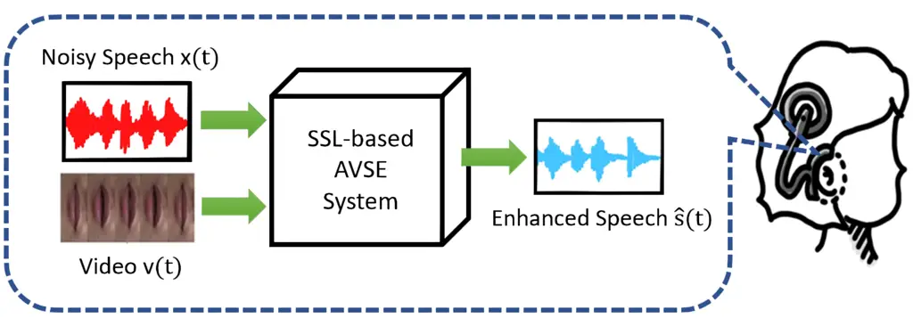
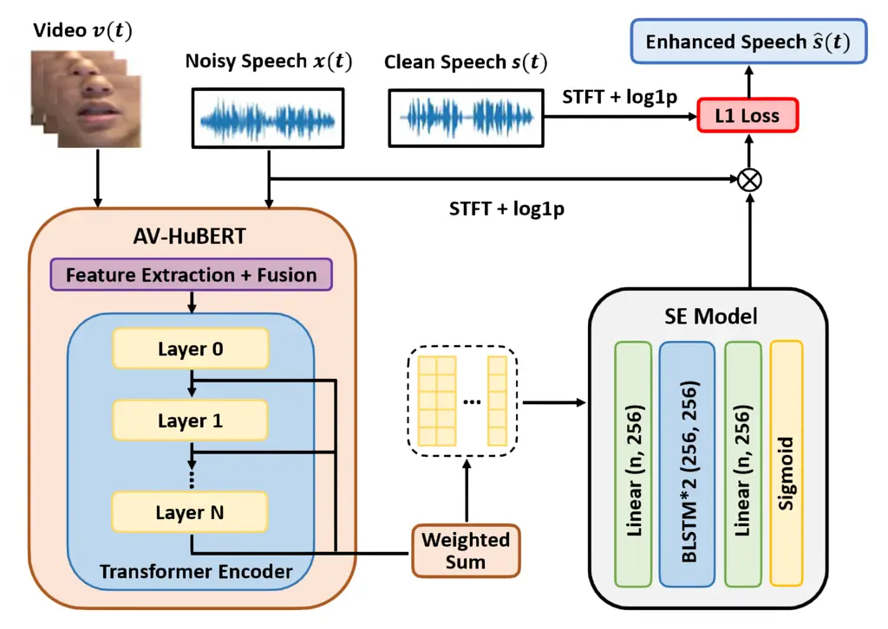
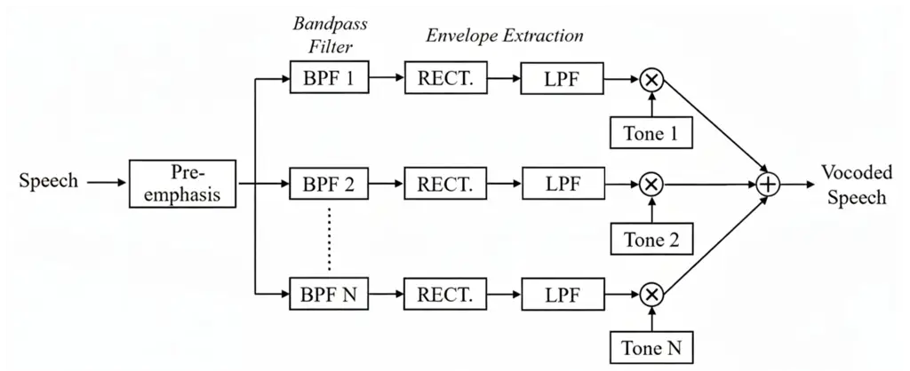
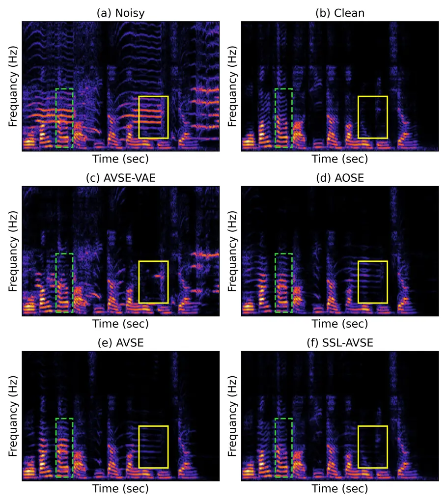
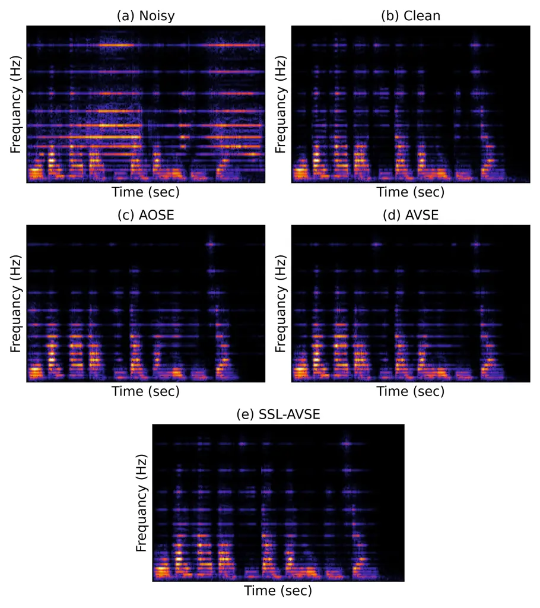
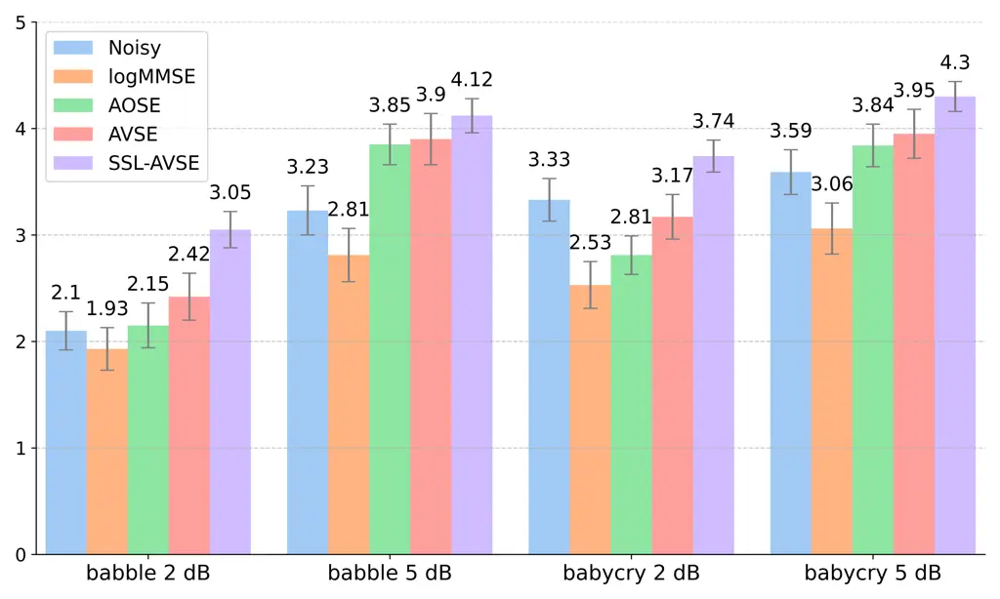
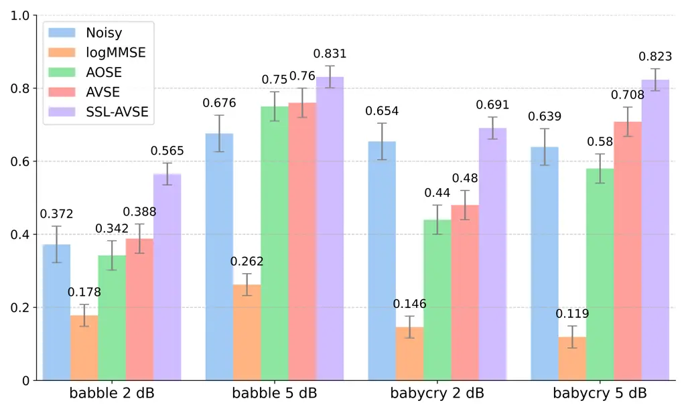
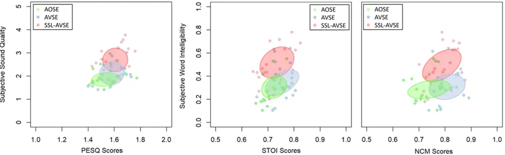

# Leveraging Self-Supervised Audio-Visual Pretrained Models to Improve Vocoded Speech Intelligibility in Cochlear Implant SimulationThanks: Richard Lee Lai, Jen-Cheng Hou, I-Chun Chern, Yi-Ting Chen and Yu Tsao are with the Research Center for Information Technology Innovation, Academia Sinica, Taiwan.Thanks: Mandar Gogate and Amir Hussain are with the School of Computing, Edinburgh Napier University, Scotland, United Kingdom.Thanks: Tughrul Arslan is with the School of Computing, University of Edinburgh, United Kingdom.Thanks: Kuo-Hsuan Hung and Chii-Wann Lin are with the Department of Biomedical Engineering, National Taiwan University, Taiwan. corresponding e-mail: (cwlinx@ntu.edu.tw)Thanks: \* This work involved human subjects or animals in its research. Approval of all ethical and experimental procedures and protocols was granted by Institutional Review Board (IRB) on Biomedical Science Research, Academia Sinica under Application No. AS-IRB-BM-21031, and performed in line with the “Study on the Effect of Speech Enhancement to Auditory Perception Under Normal Hearing and Cochlear Implant Simulations”.

Richard Lee Lai    Jen-Cheng Hou    I-Chun Chern    Kuo-Hsuan Hung   
Yi-Ting Chen    Mandar Gogate Affiliation: Tughrul Arslan, Amir Hussain,
Chii-Wann Lin, and Yu Tsao, .

###### Abstract

Objective: Individuals with hearing impairments face challenges in their
ability to comprehend speech, particularly in noisy environments. This
study explores the effectiveness of audio-visual speech enhancement
(AVSE) in improving the intelligibility of vocoded speech in cochlear
implant (CI) simulations. Methods: We propose a speech enhancement
framework called Self-Supervised Learning-based AVSE (SSL-AVSE), which
uses visual cues such as lip and mouth movements along with
corresponding speech. Features are extracted using the AV-HuBERT model
and refined through a bidirectional LSTM. Experiments were conducted
using the Taiwan Mandarin speech with video (TMSV) dataset. Results:
Objective evaluations showed improvements in PESQ from 1.43 to 1.67 and
in STOI from 0.70 to 0.74. NCM scores increased by up to 87.2% over the
noisy baseline. Subjective listening tests further demonstrated maximum
gains of 45.2% in speech quality and 51.9% in word intelligibility.
Conclusion: SSL-AVSE consistently outperforms AOSE and conventional AVSE
baselines. Listening tests with statistically significant results
confirm its effectiveness. In addition to its strong performance,
SSL-AVSE demonstrates cross-lingual generalization: although it was
pretrained on English data, it performs effectively on Mandarin speech.
This finding highlights the robustness of the features extracted by a
pretrained foundation model and their applicability across languages.
Significance: To the best of our knowledge, no prior work has explored
the application of AVSE to CI simulations. This study provides the first
evidence that incorporating visual information can significantly improve
the intelligibility of vocoded speech in CI scenarios.

###### Index Terms: 

Audio-visual speech enhancement, cochlear implants, self-supervised
learning, cross-lingual generalization.

## I Introduction

Voice is essential for communication and psychological blending with
society \[1\]. The advancement of digital technologies has led to the
emergence of various voice-related applications in the field of
information and communications technology. According to the World Health
Organization (WHO), one in four adults over 60 years of age and 15$`\%`$
of the general adult population experience hearing loss. Untreated
hearing loss can lead to feelings of loneliness and result in isolation
for the elderly while severely impairing learning ability in young
children \[2, 3\]. Research on hearing loss and the development of
innovative techniques to support those affected has become a significant
area of focus. According to the WHO’s classification of hearing
impairment \[4\], cochlear implants (CIs) are groundbreaking devices
that restore hearing in individuals with severe-to-profound hearing loss
\[5, 6, 7, 8\] and may also contribute to improved cognitive functioning
\[9, 10\]. CIs comprise an external sound processor and an internal
component that delivers precisely timed electrical pulses to stimulate
the auditory nerve. They have significantly improved the quality of life
for hundreds of thousands of individuals with severe to profound hearing
loss. Approved by the Food and Drug Administration (FDA) for individuals
aged 12 months and older, CIs provide a highly effective means of
restoring auditory perception.

Previous studies have confirmed that under quiet conditions, CI can
effectively enhance the hearing capability of recipients, especially for
speech recognition \[5, 11, 12, 13\]. However, it has been reported that
speech recognition performance degraded considerably when the target
speech signals are distorted \[14, 15, 16, 17\]. In real-world
scenarios, there are several distortion sources, including background
noise, reverberation, and interfering speech. To address speech
distortion issues, a speech enhancement (SE) unit is usually adopted as
a front-end processing unit in CI devices \[18, 19\]. Various
techniques, including single-channel SE algorithms like spectral
subtraction \[20, 21\], subspace methods \[22\], optimized gain
functions \[23\], and commercial solutions \[24, 25\], have all been
applied to improve CI performance. Furthermore, multi-microphone and
beamforming approaches have been explored for SE in CI users, taking
advantage of spatial filtering to better isolate speech signals from
background noise \[26, 27, 28, 29\].

In recent years, SE techniques have improved significantly thanks to
advances in machine learning algorithms. Notable examples include
non-negative matrix factorization \[30, 31\], sparse coding \[32, 33\],
compressive sensing \[34\], and robust principal component analysis
\[35\]. More recently, further advancements have been achieved through
the powerful regression capabilities of deep learning–based models \[36,
37, 38, 39, 40, 41, 42, 43, 44, 45, 46, 47, 48, 49, 50, 51, 52\]. For
these approaches, deep neural networks are often used as a mapping
function to carry out enhancement filtering on noisy input to attain
high-quality speech signals. Several extensions have been made to these
deep-learning models. One direction is to use a more suitable objective
function to train the SE system. In \[53, 54, 55, 56, 57, 58, 42\],
speech metric-oriented objective functions are derived, which can be
divided into two categories. The first category directly considers a
particular metric to form the objective function, such as \[53, 54, 55,
59\]. The second uses another neural network model to form the objective
function, such as \[56, 57, 58, 42\]. Experimental results confirm that
when a speech-metric oriented objective function is used, the SE system
can be guided to achieve desirable output with optimal speech metric
scores. In addition to designing more suitable objective functions, some
researchers have attempted to incorporate information from other
modalities as auxiliary inputs to the SE model, enabling exploitation of
additional contextual information. Visual clues are one important
modality that carries complementary information to speech signals during
everyday communication. Numerous audio-visual multi-modal SE approaches,
termed AVSE, have been proposed \[60, 61, 62, 63, 64, 65, 66, 67, 68,
69\]. These studies clearly show that visual cues can successfully
enhance the performance of audio-only speech enhancement (AOSE).

Developing an efficient AVSE system with limited training data is a
critical challenge in real-world applications. Following \[68\], we
address this issue by leveraging self-supervised learning (SSL) in AVSE.
SSL models are trained by reconstructing the original input at the
output, thereby learning to effectively analyze and resynthesize the
data without requiring labels. Across numerous tasks, SSL has
demonstrated its ability to extract more representative features,
thereby boosting performance in downstream classification and regression
tasks \[70, 71\]. For example, the well-known Bidirectional Encoder
Representations from Transformers (BERT) model generates contextual
language representations from large text corpora. As a versatile AI
pretraining model originally developed for Natural Language Processing
(NLP), BERT has demonstrated substantial performance improvements over
previous supervised approaches across a wide range of tasks, including
language understanding and speech recognition \[72, 73, 74\]. In speech
processing, HuBERT—a BERT-derived model based on hidden units \[75\]—has
shown strong effectiveness for the SE task \[76, 77\]. Building on these
advances, we propose a novel SSL-AVSE framework that leverages AV-HuBERT
\[78\], an audio-visual extension of HuBERT.

In the past decade, deep learning-based SE techniques have been applied
to CI systems \[79, 80, 81, 82, 83, 84\], enabling more adaptive and
robust processing methods tailored to the diverse auditory environments
experienced by CI users. While the benefits of incorporating visual cues
into the SE process are well-established, their specific advantages for
CI devices have, to our knowledge, not yet been explored. In this study,
we aim to evaluate the effectiveness of the proposed SSL-AVSE system for
CI, with the implementation and user test scenario illustrated in
Fig. 1. As shown in the figure, the SSL-AVSE system processes the
combined noisy speech and video as inputs and outputs enhanced speech,
which is then provided to a CI device. In this study, we employ a
16-channel speech vocoder to process enhanced utterances, simulating CI
audio and calculating relevant performance metrics. Additionally, a
listening test with 80 subjects is conducted to assess subjective speech
quality and word intelligibility. Results indicate that the proposed
SSL-AVSE model achieves maximum improvements of over 45% in speech
quality and 50% in intelligibility compared with the original noisy
signals, and over 25% and 45% improvements, respectively, compared with
the baseline AVSE system.



Fig. 1: Overview of our proposed system: Noisy speech and video are
input into our SSL-based AVSE model, which outputs enhanced speech for
CI users.

## II Methods

In this section, we first formulate our problem and then present the
SSL-AVSE network used in this study. We then demonstrate our training
criteria and inference procedures, including the mathematical theories
involved.

### II-A Problem Formulation

Given a speech signal $`s(t)`$ and a noise signal $`n(t)`$, the noisy
signal $`x(t)`$ can then be denoted as:

```math
x(t)=s(t)+n(t) \tag{1}
```

The noisy signal $`x(t)`$ is transformed into the spectral feature
$`X`$. The model predicts a ratio mask $`M`$ to extract the clean speech
signal for the corresponding target speaker from $`X`$. $`M`$ is
estimated from our SSL-AVSE model, which uses the noisy signal $`x(t)`$
and additional visual cues $`v(t)`$ composed of the lip image sequence.
The enhanced speech can then be obtained by the following formula:

```math
\hat{S}=X\otimes M \tag{2}
```

where “$`\otimes`$” indicates an element-wise multiplication. From the
above, we can then use the enhanced representation, $`\hat{S}`$, to
reconstruct the waveform signal $`\hat{s}(t)`$, also known as enhanced
speech.

### II-B Audio-Visual Speech Enhancement Networks

In this paper, we propose a novel SSL-AVSE framework, as illustrated in
Fig. 2. Specifically, SSL-AVSE integrates a Transformer-based AV-HuBERT
network, a pretrained audio-visual foundation model, with the SE model.

#### II-B1 Data Preprocessing

The model takes the visual stream of detected lip images from the target
speaker $`v(t)`$, the noisy speech $`x(t)`$ as input, and outputs the
enhanced speech $`\hat{s}(t)`$ for the target speaker while suppressing
noise signals.

Audio Preprocessing. In this study, the noisy speech signal $`x(t)`$ is
first transformed into spectrograms using the Short-Time Fourier
Transform (STFT) with an FFT size of 512, a window length of 400, and a
hop size of 160. Subsequently, the $`log1p`$ function ($`log1p(z)`$ =
log(1+$`z`$)) is applied to these spectrograms to extract $`log1p`$
spectral features. It has been demonstrated in our prior research that
these $`log1p`$ spectral features outperform conventional log power
spectral features in terms of SE performance \[77, 85\]. As shown in
Fig. 2, the noisy $`log1p`$ spectral features are multiplied by the
estimated mask to produce enhanced speech. The mask is generated by the
SSL-AVSE system, which is based on AV-Hubert and takes the video signal,
$`v(t)`$, along with the noisy speech signal, $`x(t)`$, as input.

Video Preprocessing. The video signal, $`v(t)`$, is comprised of
sequential images sampled at 50 frames per second (fps), cropped around
the target speaker’s mouth region of interest (ROI). The ROI is detected
using a facial landmark detector based on a two-dimensional Face
Alignment Network (FAN) \[86\], center-cropped to 88 × 88 pixels, and
normalized using \[0, 255\] scaling followed by standardization with
mean 0 and standard deviation 1.

#### II-B2 Model

The representations of each Transformer-encoder layer are denoted as
$`H^{l}`$, where $`0\leq l\leq L-1`$ and $`L`$ is the number of layers.
A trainable function $`w(\cdot)`$ is then applied to all of the layer
representations as follows:

```math
H_{WS}=\sum_{l=0}^{L-1}w^{l}H^{l},\  \tag{3}
```

where $`w^{l}`$ is the weight of the $`l`$-th layer and has the
properties $`w^{l}\geq 0`$ and $`\sum_{l}w^{l}=1`$.

The extracted features are then passed to the SE model, which consists
of a two-layer bidirectional long short-term memory (BLSTM) module
positioned between two linear layers. The output of the SE module is a
soft mask and is multiplied by the magnitude of the noisy speech
spectra. This is then compared with the clean speech spectra to
determine the L1 (absolute) loss.

While the video segment length used for learning SSL-AVSE is fixed, at
the inference stage, our audio-visual extraction model can be applied to
process videos of arbitrary length. This is done by applying a sliding
window technique, which shifts the proposed window along the video
segment until its entire length is covered.



Fig. 2: The proposed SSL-AVSE model includes AV-HuBERT and SE modules.
The AV-HuBERT model, consisting of multiple Transformer layers, is used
to extract key features from noisy speech and lip images. An SE model
then performs enhancement using them.

### II-C CI Vocoded Speech

We passed voice signals through a vocoder to simulate CI sounds. These
simulations were then played to normal hearing (NH) people to conduct a
listening test \[87, 88\]. Compared with ordinary speech, vocoded speech
is more difficult to understand by NH listeners due to the loss of
spectral detail. Several studies have examined CI vocoder simulated
speech on NH subjects in order to understand the associations between
specific factors and CI users \[89, 90, 91, 80\]. Because accurate CI
sounds are not always readily available, vocoder simulations can avoid
the manifestation of patient-specific confounding factors, such as
neural survival patterns \[92\]. Therefore, the CI vocoder can serve as
an invaluable tool in related research.

To simulate CI audio in this study, a tone vocoder was used to process
the speech signals following the procedure illustrated in Fig. 3. As
shown in the figure, there are four steps: (1) 16 Butterworth band-pass
filters were used to process an input temporal sequence to produce
bandpass signals. (2) For each band waveform, a full-wave rectification
function was leveraged to smooth the signal and to generate the
corresponding envelope wave. (3) We added a tonal signal to the envelope
to produce the modulated band voice. (4) We summed all modulated voice
and performed a normalization operation to generate the vocoded speech,
which has the identical root-mean-square value to the original input
signal.



Fig. 3: Block diagram of the tone vocoder used in this study. The system
consists of a set of band-pass filters, an envelope extractor, and
sinewave carriers. The results of each band are then summed and combined
to form vocoded speech.

### II-D Measures of Speech Quality and Intelligibility

In this study, we employed four objective metrics to evaluate both
non-vocoded and vocoded speech, namely: (1) for non-vocoded speech: the
Perceptual Evaluation of Speech Quality (PESQ) \[93\], the Short Time
Objective Intelligibility (STOI) \[94\], and the Levenshtein Phone
Similarity (LPS) \[95\]; for vocoded speech: the Normalized Covariance
Metric (NCM) \[96\]. PESQ is a metric designed to predict subjective
opinion scores of degraded speech samples, providing numerical values
ranging from –0.5 to 4.5. To compute PESQ, the distorted speech sample
must be paired with its corresponding clean reference signal, making
PESQ an intrusive approach \[97\]. STOI is a widely used measure of
speech intelligibility in SE tasks. It has been shown to correlate well
with the intelligibility of degraded speech signals and accounts for the
effects of non-linear processing on noisy speech \[94\]. STOI scores
range from 0 to 1. LPS measures the Levenshtein distance between phoneme
sequences extracted from the enhanced and clean speech. Higher values
denote stronger preservation of the intended phone sequence and are
useful for detecting hallucinated \[98\]. NCM is a speech transmission
index (TI)-related metric, estimated from the covariance of the
envelopes between clean and processed signals. Prior studies have shown
that NCM correlates well with the intelligibility of vocoded speech,
largely because its calculation resembles CI processing strategies—both
rely on envelope information across multiple frequency bands while
discarding fine-structure details. NCM scores range from 0 to 1, with
higher values indicating better intelligibility. Further details on the
NCM measure can be found in \[96\]. To evaluate the effectiveness of the
proposed SSL-AVSE, we used PESQ, STOI, and LPS to assess the SE results
for non-vocoded speech. For CI-vocoded speech, performance was measured
using NCM, as recommended in \[99\].

Subjective measures used in this study include overall speech quality
and word intelligibility. The former was evaluated following the ITU-T
P.808 protocol \[100\], where subjects were asked to rate the quality of
an entire utterance on a 5-point scale. The higher the score, the better
the perceived quality of the recorded sentence. The latter is based on
whether subjects could clearly understand individual words in the given
sentence. Since each utterance contains a total of 10 Chinese
characters, a score of 1.0 (= 10/10) indicates a complete understanding
of each character in the given target sentence.

### II-E Implementation Details

#### II-E1 Ablation Studies

To validate the effectiveness of incorporating a pretrained AV
foundation model, we first built an AOSE system using a BLSTM network.
We then added a ResNet-18 module to process visual cues and integrated
it with the AOSE system to establish a baseline AVSE model.

#### II-E2 Model Training

We optimized the SSL-AVSE model using partial fine-tuning (PF). In this
setup, the convolutional layer weights in AV-HuBERT, used for feature
extraction, are kept fixed, while the transformer encoder weights are
fine-tuned from the pretrained checkpoint. Training was conducted using
the Adam optimizer with a weight decay of $`10^{-4}`$, a batchsize of
32, and an initial learning rate of $`10^{-4}`$. In addition, the
learning rate is halved when errors are encountered. The proposed model
was trained on the Taiwan Mandarin speech with video (TMSV) dataset ¹¹ 1
https://bio-asplab.citi.sinica.edu.tw/Opensource.html#TMSV for 50
epochs. We avoid overfitting on the training set by employing
early-stopping techniques.

## III Experiments

### III-A Experimental Setup

Noise can be roughly categorized into stationary and non-stationary
based on the acoustic properties in the frequency domain. For example,
monotonic background noises would fall under the category of stationary
noise, while highly varied ones would be considered non-stationary. The
removal of non-stationary noise is particularly challenging due to the
substantial overlap and interference between speech and noise signals.
To assess the effectiveness of our models, five non-stationary noise
conditions were considered in the test set: “babycry” (sound of a baby
crying), “babble” (multiple people talking simultaneously in a crowd),
“one talker”, “two talkers”, and “three talkers”. All these types are
associated with human sounds or utterances. The amount of noise used to
corrupt the input signal is measured by the signal-to-noise ratio (SNR)
and expressed in decibels (dB).

The SE models were trained on the TMSV dataset, which includes video
recordings of 18 native Mandarin speakers (13 male and 5 female), each
contributing 320 utterances. Eight speakers (four male and four female)
were used for training, while an additional unseen male speaker was
reserved for testing. Each utterance consists of 10 Chinese characters
and lasts between 2 to 4 seconds. The video was recorded with a
resolution of 1,920 pixels $`\times`$ 1,080 pixels at 50 fps while the
audio was recorded at a sampling rate of 48 KHz. The first 200 sentences
were used to form the training set, while the last 120 sentences were
used to form the test set. To create noisy–clean speech pairs, the
training utterances were artificially corrupted with 100 types of noise
at five SNR levels ranging from –12 to 12 dB in 6 dB increments,
yielding approximately 600 hours of noisy speech. Instead of using all
generated utterances, the training set was constructed from 12,000
randomly selected noisy–clean pairs drawn from the full dataset. Testing
was conducted on clean speech mixed with the five non-stationary noise
types as mentioned earlier at SNRs ranging from -7 dB to 8 dB at
increments of 3 dB.

### III-B Experimental Results

#### III-B1 Effect of Fine-tuning the SSL Pretrained Model

First, we present the speech quality (in terms of PESQ) and speech
intelligibility (in terms of STOI) of SSL-AVSE with different pretrained
AV-HuBERT models and verify the effectiveness of fine-tuning these
models for AVSE. Table I shows the PESQ and STOI scores of SSL-AVSE
using several AV-HuBERT models pretrained on different datasets,
including LRS3 \[101\] and VoxCeleb2 \[102\], and noise augmentation,
provided by the authors in \[75\]. From the table, we can observe that
fine-tuning a pretrained AV-HuBERT model with more diverse data leads to
enhanced results. Since both LRS3 and VoxCeleb2 are English datasets,
while the testing data consists of Mandarin speech, the results in
Table I demonstrate the potential of the proposed SSL-AVSE method to
leverage high-resource languages for applications in low-resource
languages. Furthermore, the results in Table I confirm the effectiveness
of fine-tuning AV-HuBERT within our method. In the following
experiments, SSL-AVSE denotes the one fine-tuning the AV-HuBERT
pretrained on LRS3, VoxCeleb2, and noise augmentation, which is the best
setup in Table I.

|                                   | PESQ  | STOI  |
| --------------------------------- | ----- | ----- |
| Noisy                             | 1.434 | 0.695 |
| SSL-AVSE (L/V/N. w/o fine-tuning) | 1.565 | 0.719 |
| SSL-AVSE (L)                      | 1.615 | 0.728 |
| SSL-AVSE (L/V)                    | 1.651 | 0.737 |
| SSL-AVSE (L/V/N)                  | 1.665 | 0.738 |

TABLE I: Objective scores of the speech enhanced by fine-tuning
pretrained AV-HuBERT models. L, V, and N represent LRS3, VoxCeleb2, and
noise augmentation, respectively, and w/o denotes without fine-tuning
the AV-HuBERT model.

#### III-B2 Objective Results

|                     |          |       |       |       |       |       |       |
| ------------------- | -------- | ----- | ----- | ----- | ----- | ----- | ----- |
|                     | modality | -7dB  | -4dB  | -1dB  | 2dB   | 5dB   | 8dB   |
| Noisy               | N/A      | 1.214 | 1.260 | 1.344 | 1.449 | 1.586 | 1.771 |
| AOSE                | A        | 1.227 | 1.296 | 1.403 | 1.540 | 1.713 | 1.934 |
| ConvTasNet \[103\]  | A        | 1.242 | 1.311 | 1.424 | 1.569 | 1.764 | 2.001 |
| VisualVoice \[104\] | AV       | 1.283 | 1.349 | 1.416 | 1.486 | 1.667 | 1.792 |
| AVSE-VAE \[105\]    | AV       | 1.217 | 1.285 | 1.388 | 1.511 | 1.677 | 1.890 |
| AVSE                | AV       | 1.226 | 1.324 | 1.453 | 1.591 | 1.773 | 2.002 |
| SSL-AVSE            | AV       | 1.271 | 1.353 | 1.474 | 1.619 | 1.801 | 2.020 |

TABLE II: Objective PESQ scores for non-vocoded speech. We can see that
the lower the SNR, the greater the difference between the PESQ scores of
SSL-AVSE-enhanced speech and those enhanced by either AVSE or AOSE. At
higher SNRs, the differences between enhancement methods become less
pronounced. ”A” stands for audio-only, while ”AV” stands for
audio-visual.

|                     |          |       |       |       |       |       |       |
| ------------------- | -------- | ----- | ----- | ----- | ----- | ----- | ----- |
|                     | modality | -7dB  | -4dB  | -1dB  | 2dB   | 5dB   | 8dB   |
| Noisy               | N/A      | 0.536 | 0.598 | 0.644 | 0.731 | 0.794 | 0.848 |
| AOSE                | A        | 0.523 | 0.590 | 0.663 | 0.733 | 0.797 | 0.854 |
| ConvTasNet \[103\]  | A        | 0.549 | 0.611 | 0.682 | 0.753 | 0.808 | 0.859 |
| VisualVoice \[104\] | AV       | 0.591 | 0.635 | 0.687 | 0.729 | 0.767 | 0.810 |
| AVSE-VAE \[105\]    | AV       | 0.516 | 0.580 | 0.647 | 0.714 | 0.774 | 0.827 |
| AVSE                | AV       | 0.549 | 0.616 | 0.685 | 0.751 | 0.809 | 0.860 |
| SSL-AVSE            | AV       | 0.582 | 0.636 | 0.695 | 0.753 | 0.809 | 0.858 |

TABLE III: Objective STOI scores for non-vocoded speech. We can see that
the lower the SNR, the greater the difference between the STOI scores of
SSL-AVSE-enhanced speech and those enhanced by either AVSE or AOSE. For
higher SNRs, the results for different enhancement methods converge. ”A”
stands for audio-only, while ”AV” stands for audio-visual.

|                  |          |       |       |       |       |       |       |
| ---------------- | -------- | ----- | ----- | ----- | ----- | ----- | ----- |
|                  | modality | -7dB  | -4dB  | -1dB  | 2dB   | 5dB   | 8dB   |
| Noisy            | N/A      | 0.146 | 0.187 | 0.244 | 0.322 | 0.417 | 0.528 |
| AOSE             | A        | 0.196 | 0.235 | 0.281 | 0.349 | 0.444 | 0.555 |
| AVSE-VAE \[105\] | AV       | 0.167 | 0.197 | 0.246 | 0.322 | 0.405 | 0.495 |
| AVSE             | AV       | 0.204 | 0.254 | 0.311 | 0.38  | 0.483 | 0.587 |
| SSL-AVSE         | AV       | 0.275 | 0.32  | 0.387 | 0.463 | 0.559 | 0.639 |

TABLE IV: Objective LPS scores for non-vocoded speech. We can see that
the lower the SNR, the greater the difference between the LPS scores of
SSL-AVSE-enhanced speech and those enhanced by either AVSE or AOSE. At
higher SNRs, the differences between enhancement methods become less
pronounced. ”A” stands for audio-only, while ”AV” stands for
audio-visual.

|          |       |       |       |       |       |       |
| -------- | ----- | ----- | ----- | ----- | ----- | ----- |
|          | -7dB  | -4dB  | -1dB  | 2dB   | 5dB   | 8dB   |
| Noisy    | 0.226 | 0.321 | 0.416 | 0.519 | 0.600 | 0.671 |
| AOSE     | 0.354 | 0.441 | 0.553 | 0.630 | 0.724 | 0.811 |
| AVSE     | 0.387 | 0.482 | 0.581 | 0.681 | 0.773 | 0.849 |
| SSL-AVSE | 0.423 | 0.507 | 0.598 | 0.690 | 0.777 | 0.846 |

TABLE V: Objective NCM scores for vocoded speech. Similar to the results
of STOI scores, We can see that the lower the SNR, the greater the
difference between the NCM scores of SSL-AVSE-enhanced speech and those
enhanced by either AVSE or AOSE. However, unlike the STOI results, there
is no marked convergence between the absolute amount of improvement
between the NCM scores of the noisy baseline and that of utterances
enhanced by SSL-AVSE.

As shown in Tables II–V, the proposed SSL-AVSE consistently outperformed
the baseline AOSE and AVSE systems, achieving higher objective measures
of speech quality, intelligibility, and LPS across most noise
conditions. The difference was particularly notable for low SNRs. For an
SNR of -7 dB, the PESQ, STOI, LPS and NCM values of SSL-AVSE were 3.7%
(from 1.226 to 1.271), 6.0% (from 0.549 to 0.582), 34.8% (from 0.204 to
0.275), and 9.3% (from 0.387 to 0.423) higher than those of AVSE,
respectively, while they were 3.6% (from 1.227 to 1.271), 11.3% (from
0.523 to 0.582), 40.3% (from 0.196 to 0.275), and 19.5% (from 0.354 to
0.423) higher than those of AOSE, respectively. The results were even
more striking when compared with the noisy baseline; PESQ, STOI, LPS,
and NCM values increased by 4.7% (from 1.214 to 1.271), 8.6% (from 0.536
to 0.582), 88.4% (from 0.146 to 0.275), and 87.2% (from 0.226 to 0.423),
respectively. At higher SNRs, the differences in PESQ, STOI, and NCM
scores between SSL-AVSE and AVSE are less pronounced, indicating that
the pretrained AV-HuBERT model provides greater benefits for SE under
challenging conditions. The results also show smaller improvements
across all three metrics for speech enhanced by SSL-AVSE compared to
AOSE at higher SNR levels, indicating that visual cues provide
relatively less benefit for AVSE performance under these conditions.

|          |             |             |             |             |              |             |              |             |
| -------- | ----------- | ----------- | ----------- | ----------- | ------------ | ----------- | ------------ | ----------- |
|          | babble 2 dB |             | babble 5 dB |             | babycry 2 dB |             | babycry 5 dB |             |
|          | t-value     | $`p`$-value | t-value     | $`p`$-value | t-value      | $`p`$-value | t-value      | $`p`$-value |
| AOSE     | 1.571       | $`<`$0.05   | 1.746       | $`<`$0.05   | 1.191        | $`<`$0.05   | 3.145        | $`<`$0.05   |
| AVSE     | 1.337       | $`<`$0.01   | 0.883       | $`<`$0.01   | 1.047        | $`<`$0.01   | 2.732        | $`<`$0.05   |
| SSL-AVSE | 2.743       | $`<`$0.001  | 1.402       | $`<`$0.001  | 1.031        | $`<`$0.001  | 1.433        | $`<`$0.01   |

TABLE VI: Paired t-tests of speech quality results were used to compare
AOSE, AVSE, and SSL-AVSE against the noisy baseline for each specific
noise type and SNR condition. The degree of freedom for all values is 19. A p-value of less than 0.05 implies statistical significance.

|          |             |             |             |             |              |             |              |             |
| -------- | ----------- | ----------- | ----------- | ----------- | ------------ | ----------- | ------------ | ----------- |
|          | babble 2 dB |             | babble 5 dB |             | babycry 2 dB |             | babycry 5 dB |             |
|          | t-value     | $`p`$-value | t-value     | $`p`$-value | t-value      | $`p`$-value | t-value      | $`p`$-value |
| AOSE     | 2.518       | $`<`$0.05   | 3.452       | $`<`$0.05   | 2.346        | $`<`$0.05   | 2.128        | $`<`$0.05   |
| AVSE     | 1.664       | $`<`$0.01   | 3.683       | $`<`$0.05   | 2.038        | $`<`$0.05   | 3.038        | $`<`$0.01   |
| SSL-AVSE | 2.842       | $`<`$0.001  | 4.535       | $`<`$0.01   | 1.406        | $`<`$0.01   | 4.406        | $`<`$0.01   |

TABLE VII: Paired t-tests of speech intelligibility results were used to
compare AOSE, AVSE, and SSL-AVSE against the noisy baseline for each
specific noise type and SNR condition. The degree of freedom for all
values is 19. A p-value of less than 0.05 implies statistical
significance.

#### III-B3 Spectrogram Analysis

A spectrogram plot is frequently employed to visually represent the
time–frequency characteristics of a speech signal. In Fig. 4, we present
spectrograms of a noisy speech signal at a 2 dB SNR, enhanced using four
methods: AVSE-VAE \[105\], AOSE, AVSE, and SSL-AVSE. Additionally, the
spectra of the corresponding clean speech are included for comparison.
Two regions of interest are highlighted in the spectrograms: a
noise-only segment (yellow box) and a mixed speech–noise region (green
dashed box). In the noise-only regions (yellow box), SSL-AVSE shows
significant improvements over the baseline methods by effectively
reducing noise. In the mixed speech–noise regions (green dashed box),
SSL-AVSE introduces fewer distortions in the reconstructed speech
compared with the other approaches. In Fig. 5, we showcase spectra of
vocoded speech. From the figure, it is evident that the spectra of
vocoded speech processed by SSL-AVSE preserve much clearer speech
structures compared with AOSE and AVSE.



Fig. 4: Spectrograms of noisy, clean, AVSE-VAE enhanced, AOSE enhanced,
AVSE enhanced, and SSL-AVSE-enhanced speech signals for “babycry 2 dB”
noise. Note that SSL-AVSE enhanced speech preserves speech structures
within the range of human speech more than those of other enhancement
methods.



Fig. 5: Spectrograms of vocoded speech for noisy, clean, AOSE enhanced,
AVSE enhanced, and SSL-AVSE-enhanced speech signals for “babycry 2 dB”
noise. Note that SSL-AVSE enhanced speech has clearer structures
compared with those of other enhancement methods.

#### III-B4 Subjective Results

We conducted listening tests under four conditions, comprising two noise
types (“babycry” and “babble”) and two SNRs (2 dB and 5 dB). Each
condition contained 120 utterances, with 20 drawn from each of six
categories: AOSE, AVSE, SSL-AVSE, clean, logarithm minimum mean squared
error (logMMSE), and noisy speech. The logMMSE is a traditional SE
method that enhances speech by minimizing the mean-square error in the
logarithmic spectral domain \[106\]. Similar to \[80\], we also include
logMMSE as part of our benchmark. Since our objective is to maximize SE
in CI devices, we conducted our experiment using vocoded speech. A total
of 80 participants (mean age: 35.7 years) took part in the study, with
20 individuals assigned to each noise type at a specific SNR condition
to minimize cross-referencing bias. The listening tests were conducted
in a quiet room, while the utterances were uploaded onto a listening
test system that presented them randomly to the users.

As shown in Fig. 6 and Fig. 7, results show that for both speech quality
and word intelligibility, SSL-AVSE outperformed both AVSE and AOSE. For
speech quality scores, when subjected to the most challenging “babble 2
dB” noise condition, the SSL-AVSE model exhibited a 26.0% increase (from
2.42 to 3.05) for the former and a 41.9% increase (from 2.15 to 3.05)
for the latter, respectively. For word intelligibility scores, the
improvement over the former and the latter were 45.6% (from 0.388 to
0.565) and 65.2% (from 0.342 to 0.565), respectively.



Fig. 6: Subjective speech quality scores for vocoded speech enhanced
with different models. The x-axis represents the noise type, while the
y-axis represents the speech quality score. For all noise types,
SSL-AVSE is shown to perform notably better than other methods, with the
greatest improvements occurring for noises with an SNR of 2 dB.



Fig. 7: Subjective character intelligibility scores of speech enhanced
using different models. The x-axis represents the noise type, while the
y-axis represents the word intelligibility score. As in the case of
speech quality, SSL-AVSE is also shown to perform notably better than
other methods, with the greatest improvements occurring for noises with
an SNR of 2 dB.



Fig. 8: Relationship between the subjective and objective scores of
speech enhanced using different models. We choose utterances corrupted
with “babble 2 dB” noise. The y-axis represents the subjective score,
while the x-axis represents the objective score. The centers of the
ovals represent the mean objective and subjective scores. There is clear
segregation between utterances enhanced using the three different
methods, with SSL-AVSE having the best effect.

We further conducted paired t-tests on the quality and intelligibility
results of listening tests under SSL-AVSE, AVSE, and AOSE conditions to
verify their statistical significance. Results shown in Tables VI
and VII indicate that speech enhanced by all three methods differ
statistically from noisy speech, with $`p`$-values all less than 0.001
for the “babble” noise and $`p`$-values all less than 0.05 for the
“babycry” noise. Since the “babble” noise condition results in smaller
$`p`$-values than those of “babycry”, this demonstrates that our model
actually performs better under more challenging noise conditions,
especially those with multiple talkers. Further comparisons between
speech enhanced by SSL-AVSE and that enhanced by AVSE or AOSE revealed
significant statistical differences, reinforcing the promising
capability of the proposed method.

#### III-B5 Comparison between Objective and Subjective Results

Both objective and subjective evaluations demonstrated that SSL-AVSE
yielded improved performance across different SNR levels. Moreover,
speech signals with lower SNRs exhibited greater improvements in quality
and intelligibility, underscoring the strong capability of SSL-AVSE in
challenging noisy environments. The subjective results further validate
the effectiveness of our model for vocoded speech, showing notable
improvements compared with the noisy baseline. To more explicitly
explore the relationship between objective and subjective results, three
panels are presented in Fig. 8, focusing on utterances corrupted with
“babble 2 dB” noise. For all three panels, the x-axis represents the
subjective score, while the y-axis represents the objective score.
Analyzing the left panel of Fig. 8, it is evident that SSL-AVSE
outperforms AVSE and AOSE notably in terms of both objective and
subjective speech quality scores, as indicated by the score
distributions located towards the top-right side. Furthermore, examining
the center and right panels of Fig. 8, it is evident that SSL-AVSE
achieves the best performance for both objective and subjective speech
intelligibility scores, as indicated by the score distributions also
located towards the top-right side.

## IV Discussion

In this paper, we propose a novel SSL-AVSE approach that leverages
AV-HuBERT and evaluate its effectiveness in improving speech perception
in CI simulations. As shown in Table V, SSL-AVSE yielded higher NCM
scores, with relative improvements ranging from 26.1$`\%`$ (0.671 to
0.846 at 8 dB) to 87.2$`\%`$ (0.226 to 0.423 at –7 dB) compared with the
noisy baseline. This demonstrates the effectiveness of our model on
vocoded speech signals. From Figs. 6 and 7, subjective results also
showed improvements of between 19.8% and 45.2% for speech quality (from
3.59 to 4.30 for “babycry 5dB” and from 2.10 to 3.05 for “babble 2dB”)
and improvements of between 5.7% and 51.9% for word intelligibility
(from 0.654 to 0.691 for “babycry 2dB” and from 0.372 to 0.565 for
“babble 2dB”) when compared with the noisy baseline, further confirming
the effectiveness of the proposed SSL-AVSE approach.

Our experimental results also indicate that the proposed SSL-AVSE model,
although leveraging an audio-visual foundation model pretrained on
English corpora, can still achieve strong performance on Mandarin AVSE
tasks. We believe that this cross-lingual transferability is partly due
to two factors. First, regression tasks such as speech enhancement and
separation tend to be less language-dependent because they primarily
focus on improving acoustic properties rather than modeling linguistic
content. Prior work has shown that models trained exclusively on English
can generalize well to other languages (e.g., Spanish and German) for SE
without additional adaptation \[107\]. Second, audio-visual alignment in
models like AV-HuBERT is largely based on shared phoneme-level features,
which are relatively consistent across languages. This allows the
learned correlations between phonemes and visual articulations (e.g.,
lip shapes) to transfer more effectively. Recent studies \[68, 108\]
have shown that English-pretrained models (e.g., AV-HuBERT, U-Net) can
improve Mandarin AVSE performance even without retraining the visual
front-end, whereas word-level tasks such as lip reading often require
language-specific mechanisms \[109\]. These observations suggest why the
SSL-AVSE system can generalize effectively to Mandarin tasks despite
being pretrained on English corpora.

| Metric     | Value                                                                                     |
| ---------- | ----------------------------------------------------------------------------------------- |
| Parameters | 106 M (103 M for AV-HuBERT)                                                               |
| FLOPs      | 27.5 GFLOPs                                                                               |
| Model Size | 423 MB (FP32) / 107 MB (INT8)                                                             |
| Latency    | – 5 ms per 10 ms audio frame (measured on NVIDIA GeForce RTX 2080 Ti)                     |
|            | – 66 ms per 10 ms audio frame (measured on 4-core Intel Xeon Gold 6152 CPU, ONNX Runtime) |

TABLE VIII: Model complexity and inference latency of the proposed
SSL-AVSE system.

|               |            |              |                 |             |              |                 |
| ------------- | ---------- | ------------ | --------------- | ----------- | ------------ | --------------- |
|               | PESQ(Orig) | PESQ (8-bit) | $`\Delta`$ PESQ | STOI (Orig) | STOI (8-bit) | $`\Delta`$ STOI |
| AVSE          | 1.245      | 1.237        | -0.009          | 0.605       | 0.604        | -0.001          |
| SSL-AVSE (WF) | 1.299      | 1.253        | -0.046          | 0.630       | 0.641        | +0.011          |
| SSL-AVSE (EF) | 1.374      | 1.339        | -0.036          | 0.661       | 0.664        | +0.003          |
| SSL-AVSE (PF) | 1.396      | 1.361        | -0.035          | 0.682       | 0.686        | +0.004          |

TABLE IX: Performance comparison of different model setups before and
after 8-bit quantization. WF, PF, and EF denote without fine-tuning,
partial fine-tuning, and entire fine-tuning, respectively, on AV-HuBERT.
Quantization introduces only minor degradation in PESQ, while STOI
scores slightly improve across all SSL-based models.

It is important to note that the performance of our system was evaluated
using a vocoder-based CI simulation framework. In CI research,
vocoder-based CI simulation has become a widely used method, as
supported by prior studies \[88, 110, 91\]. Although such simulations
cannot fully capture the auditory experience of actual CI users, they
have been shown to reproduce similar behavioral performance trends. This
approach offers several key advantages. First, it reduces variability
caused by individual factors in CI users, such as etiology of hearing
loss, duration of deafness, and electrode placement. Second, it reduces
the fatigue and discomfort that CI users may experience during extended
testing sessions, thereby preventing inaccurate or biased results.
Third, using vocoded speech with normal-hearing participants allows
researchers to isolate and evaluate the effects of signal processing
algorithms without confounds from CI hardware differences or
user-specific neural adaptation. Given recent advances in CI technology,
many studies now use 16-channel tone vocoders \[111, 112\]. Accordingly,
we adopt the same configuration in this study.

To evaluate the feasibility of deploying the proposed SSL-AVSE system in
real-world applications, we conducted a detailed analysis of its model
complexity and computational efficiency. As summarized in Table VIII,
the SSL-AVSE system comprises 106 million (M) parameters (103 M for the
AV-HuBERT encoder) and requires 27.5 GFLOPs per inference. Profiling
results further indicate that the model achieves 5 ms processing time
per 10 ms audio frame on the GPU and 66 ms per frame on a 4-core CPU. In
addition, we investigated the impact of post-training 8-bit
quantization, which reduced the overall model size from 423 MB to 107
MB. As shown in Table IX, quantization introduced only negligible
degradation in PESQ, while STOI scores improved slightly across all
SSL-based models. We hypothesize that this effect may stem from
quantization discarding non-essential variations, thereby sharpening
intelligibility-related representations.

These findings collectively demonstrate that the quantized SSL-AVSE
system is already well-suited for deployment on more powerful external
computing platforms, such as personal computers, smartphones, smart
glasses, or tablets, which can readily accommodate the required
computational resources. In the context of CI, such devices could act as
intermediate processing units to deliver enhanced speech signals to CI
sound processors. Existing commercial solutions already support this
type of integration. For instance, the Cochlear Wireless PhoneClip
streams Bluetooth audio to the Nucleus 6 (CP910) sound processor
\[113\], whereas AudioLink serves as a universal wireless streamer,
transmitting audio from external devices (e.g., phones, tablets, TVs,
and remote microphones) directly to MED-EL sound processors \[114\].
More recent CI processors, such as the Nucleus 7 (CP1000), are capable
of directly interfacing with compatible Apple devices (Made for iPhone,
MFi) and Android devices (Android Streaming for Hearing Aids, ASHA)
\[115\]. These established integration pathways suggest that the
proposed system could feasibly be incorporated into current CI user
ecosystems in the near term.

Looking ahead, further model compression strategies, including pruning
and knowledge distillation, are expected to significantly reduce the
computational cost and memory footprint of the SSL-AVSE system. These
advances would open the possibility of directly deploying the system on
CI processors with stringent resource constraints, thereby eliminating
the reliance on external edge devices. Ultimately, such developments
would extend the benefits of advanced SE technologies to CI users in a
wider range of real-world acoustic environments.

## V Conclusion

We propose a novel AVSE model, SSL-AVSE, which leverages a pretrained
audio-visual foundation model to enhance speech quality and
intelligibility in CI scenarios. Although the model was pretrained using
an English corpus, it performed well on SE tasks involving Mandarin
datasets, demonstrating the ability to generalize to different target
languages. Compared with other state-of-the-art AVSE methods, our
proposed model resulted in a notable increase in speech quality and word
intelligibility. Although many previous studies have demonstrated the
effectiveness of pretrained models on various downstream tasks, this
work is the first to apply a pretrained audio-visual model to enhance SE
performance and demonstrate its potential benefits for CI users. We
believe that this study represents a promising direction for advancing
AVSE technologies across a range of assistive listening devices,
including hearing aids, CIs, and personal sound amplification products
(PSAPs). Moving forward, we aim to reduce the model size of the proposed
SSL-AVSE system through techniques such as parameter pruning and
knowledge distillation. As modern devices increasingly incorporate
sensors to capture multimodal data, we also plan to explore the
integration of additional modalities, such as tactile and textual
information, to further improve SE performance. This represents another
important avenue for future research.

## References

- \[1\] James C McCroskey, John A Daly, Michael J Beatty, and Matthew M
  Martin, Communication and personality: Trait perspectives, Hampton
  Press (NJ), 1998.
- \[2\] Stig Arlinger, “Negative consequences of uncorrected hearing
  loss-a review,” International Journal of Audiology, vol. 42, pp.
  2S17–2S20, 2003.
- \[3\] M Kathleen Pichora-Fuller, Kate Dupuis, Marilyn Reed, and Ulrike
  Lemke, “Helping older people with cognitive decline communicate:
  Hearing aids as part of a broader rehabilitation approach,” Seminars
  in Hearing, vol. 34, no. 04, pp. 308–330, 2013.
- \[4\] Wen-Huei Liao, Shuenn-Tsong Young, Chiang-Feng Lien, and
  Shyh-Jen Wang, “An audiometer to monitor progressive hearing change in
  school-aged children,” Journal of Medical Screening, vol. 18, no. 1,
  pp. 8–11, 2011.
- \[5\] Fan-Gang Zeng, Stephen Rebscher, William Harrison, Xiaoan Sun,
  and Haihong Feng, “Cochlear implants: system design, integration, and
  evaluation,” IEEE reviews in biomedical engineering, vol. 1, pp.
  115–142, 2008.
- \[6\] Graeme M Clark, “The multi-channel cochlear implant:
  Multi-disciplinary development of electrical stimulation of the
  cochlea and the resulting clinical benefit,” Hearing research, vol.
  322, pp. 4–13, 2015.
- \[7\] Blake S Wilson, “Getting a decent (but sparse) signal to the
  brain for users of cochlear implants,” Hearing research, vol. 322, pp.
  24–38, 2015.
- \[8\] Fan-Gang Zeng, “Challenges in improving cochlear implant
  performance and accessibility,” IEEE Transactions on Biomedical
  Engineering, vol. 64, no. 8, pp. 1662–1664, 2017.
- \[9\] Aaron C Moberly, Karl Doerfer, and Michael S Harris, “Does
  cochlear implantation improve cognitive function?,” The Laryngoscope,
  vol. 129, no. 10, pp. 2208–2209, 2019.
- \[10\] Fidaa Almomani, Murad O Al-Momani, Soha Garadat, Safa Alqudah,
  Manal Kassab, Shereen Hamadneh, Grant Rauterkus, and Richard Gans,
  “Cognitive functioning in deaf children using cochlear implants,” BMC
  pediatrics, vol. 21, pp. 1–13, 2021.
- \[11\] Fan-Gang Zeng, “Celebrating the one millionth cochlear
  implant,” JASA Express Letters, vol. 2, no. 7, pp. 077201, 2022.
- \[12\] Ria Ghosh and John HL Hansen, “Bilateral cochlear implant
  processing of coding strategies with cci-mobile, an open-source
  research platform,” IEEE/ACM Transactions on Audio, Speech, and
  Language Processing, 2023.
- \[13\] Ria Ghosh, Hussnain Ali, and John HL Hansen, “Cci-mobile: A
  portable real time speech processing platform for cochlear implant and
  hearing research,” IEEE Transactions on Biomedical Engineering, vol.
  69, no. 3, pp. 1251–1263, 2021.
- \[14\] Fei Chen, Yi Hu, and Meng Yuan, “Evaluation of noise reduction
  methods for sentence recognition by mandarin-speaking cochlear implant
  listeners,” Ear and hearing, vol. 36, no. 1, pp. 61–71, 2015.
- \[15\] Tobias Goehring, Federico Bolner, Jessica JM Monaghan, Bas
  Van Dijk, Andrzej Zarowski, and Stefan Bleeck, “Speech enhancement
  based on neural networks improves speech intelligibility in noise for
  cochlear implant users,” Hearing research, vol. 344, pp.
  183–194, 2017.
- \[16\] Ram CMC Shekar and John HL Hansen, “A convolutional neural
  network-based framework for analysis and assessment of non-linguistic
  sound classification and enhancement for normal hearing and cochlear
  implant listeners,” The Journal of the Acoustical Society of America,
  vol. 152, no. 5, pp. 2720–2734, 2022.
- \[17\] Juliana N Saba and John HL Hansen, “The effects of lombard
  perturbation on speech intelligibility in noise for normal hearing and
  cochlear implant listeners,” The Journal of the Acoustical Society of
  America, vol. 151, no. 2, pp. 1007–1021, 2022.
- \[18\] Fergal Henry, Martin Glavin, and Edward Jones, “Noise reduction
  in cochlear implant signal processing: A review and recent
  developments,” IEEE reviews in biomedical engineering, vol. 16, pp.
  319–331, 2021.
- \[19\] Dongmei Wang and John HL Hansen, “Speech enhancement for
  cochlear implant recipients,” The Journal of the Acoustical Society of
  America, vol. 143, no. 4, pp. 2244–2254, 2018.
- \[20\] Carl Verschuur, Mark Lutman, and Nor Haniza Abdul Wahat,
  “Evaluation of a non-linear spectral subtraction noise suppression
  scheme in cochlear implant users,” Cochlear implants international,
  vol. 7, no. 4, pp. 193–6, 2006.
- \[21\] Kostas Kokkinakis, Christina Runge, Qudsia Tahmina, and Yi Hu,
  “Evaluation of a spectral subtraction strategy to suppress reverberant
  energy in cochlear implant devices,” The Journal of the Acoustical
  Society of America, vol. 138, no. 1, pp. 115–124, 2015.
- \[22\] Philipos C Loizou, Arthur Lobo, and Yi Hu, “Subspace algorithms
  for noise reduction in cochlear implants,” The Journal of the
  Acoustical Society of America, vol. 118, no. 5, pp. 2791–2793, 2005.
- \[23\] Stefan J Mauger, Pam W Dawson, and Adam A Hersbach,
  “Perceptually optimized gain function for cochlear implant
  signal-to-noise ratio based noise reduction,” The Journal of the
  Acoustical Society of America, vol. 131, no. 1, pp. 327–336, 2012.
- \[24\] Pam W Dawson, Stefan J Mauger, and Adam A Hersbach, “Clinical
  evaluation of signal-to-noise ratio–based noise reduction in nucleus®
  cochlear implant recipients,” Ear and hearing, vol. 32, no. 3, pp.
  382–390, 2011.
- \[25\] J Gertjan Dingemanse and André Goedegebure, “Optimising the
  effect of noise reduction algorithm clearvoice in cochlear implant
  users by increasing the maximum comfort levels,” International Journal
  of Audiology, vol. 57, no. 3, pp. 230–235, 2018.
- \[26\] Adam A Hersbach, David B Grayden, James B Fallon, and Hugh J
  McDermott, “A beamformer post-filter for cochlear implant noise
  reduction,” The Journal of the Acoustical Society of America, vol.
  133, no. 4, pp. 2412–2420, 2013.
- \[27\] Kostas Kokkinakis and Philipos C Loizou, “Using blind source
  separation techniques to improve speech recognition in bilateral
  cochlear implant patients,” The Journal of the Acoustical Society of
  America, vol. 123, no. 4, pp. 2379–2390, 2008.
- \[28\] Kostas Kokkinakis and Philipos C Loizou, “Multi-microphone
  adaptive noise reduction strategies for coordinated stimulation in
  bilateral cochlear implant devices,” The Journal of the Acoustical
  Society of America, vol. 127, no. 5, pp. 3136–3144, 2010.
- \[29\] H Christiaan Stronks, Jeroen J Briaire, and Johan HM Frijns,
  “Beamforming and single-microphone noise reduction: effects on
  signal-to-noise ratio and speech recognition of bimodal cochlear
  implant users,” Trends in Hearing, vol. 26, pp.
  23312165221112762, 2022.
- \[30\] Kevin W Wilson, Bhiksha Raj, Paris Smaragdis, and Ajay
  Divakaran, “Speech denoising using nonnegative matrix factorization
  with priors,” in Proc. ICASSP, 2008.
- \[31\] Nasser Mohammadiha, Paris Smaragdis, and Arne Leijon,
  “Supervised and unsupervised speech enhancement using nonnegative
  matrix factorization,” IEEE Transactions on Audio, Speech, and
  Language Processing, vol. 21, no. 10, pp. 2140–2151, 2013.
- \[32\] Mikkel N Schmidt, Jan Larsen, and Fu-Tien Hsiao, “Wind noise
  reduction using non-negative sparse coding,” in Proc. MLSP, 2007.
- \[33\] Christian D Sigg, Tomas Dikk, and Joachim M Buhmann, “Speech
  enhancement with sparse coding in learned dictionaries,” in Proc.
  ICASSP, 2010.
- \[34\] Jia-Ching Wang, Yuan-Shan Lee, Chang-Hong Lin, Shu-Fan Wang,
  Chih-Hao Shih, and Chung-Hsien Wu, “Compressive sensing-based speech
  enhancement,” IEEE/ACM Transactions on Audio, Speech, and Language
  Processing, vol. 24, no. 11, pp. 2122–2131, 2016.
- \[35\] Po-Sen Huang, Scott Deeann Chen, Paris Smaragdis, and Mark
  Hasegawa-Johnson, “Singing-voice separation from monaural recordings
  using robust principal component analysis,” in Proc. ICASSP, 2012.
- \[36\] Xugang Lu, Yu Tsao, Shigeki Matsuda, and Chiori Hori, “Speech
  enhancement based on deep denoising autoencoder.,” in Proc.
  Interspeech, 2013.
- \[37\] Bingyin Xia and Changchun Bao, “Wiener filtering based speech
  enhancement with weighted denoising auto-encoder and noise
  classification,” Speech Communication, vol. 60, pp. 13–29, 2014.
- \[38\] DeLiang Wang and Jitong Chen, “Supervised speech separation
  based on deep learning: An overview,” IEEE/ACM Transactions on Audio,
  Speech, and Language Processing, vol. 26, no. 10, pp. 1702–1726, 2018.
- \[39\] Yong Xu, Jun Du, Li-Rong Dai, and Chin-Hui Lee, “A regression
  approach to speech enhancement based on deep neural networks,”
  IEEE/ACM Transactions on Audio, Speech and Language Processing, vol.
  23, no. 1, pp. 7–19, 2015.
- \[40\] Xiao-Lei Zhang and DeLiang Wang, “A deep ensemble learning
  method for monaural speech separation,” IEEE/ACM Transactions on
  Audio, Speech, and Language Processing, vol. 24, no. 5, pp.
  967–977, 2016.
- \[41\] H. Erdogan, J. R. Hershey, S. Watanabe, and J. Le Roux,
  “Phase-sensitive and recognition-boosted speech separation using deep
  recurrent neural networks,” in Proc. ICASSP, 2015.
- \[42\] Tsun-An Hsieh, Cheng Yu, Szu-Wei Fu, Xugang Lu, and Yu Tsao,
  “Improving perceptual quality by phone-fortified perceptual loss using
  wasserstein distance for speech enhancement,” in Proc. Interspeech,
  2021, pp. 196–200.
- \[43\] F. Weninger, H. Erdogan, S. Watanabe, E. Vincent, J. Le Roux,
  J. R. Hershey, and B. Schuller, “Speech enhancement with lstm
  recurrent neural networks and its application to noise-robust asr,” in
  Proc. LVA/ICA, 2015.
- \[44\] Muqiao Yang, Joseph Konan, David Bick, Anurag Kumar, Shinji
  Watanabe, and Bhiksha Raj, “Improving speech enhancement through
  fine-grained speech characteristics,” in Proc. Interspeech, 2022, pp.
  2953–2957.
- \[45\] Jun Qi, Jun Du, Sabato Marco Siniscalchi, and Chin-Hui Lee, “A
  theory on deep neural network based vector-to-vector regression with
  an illustration of its expressive power in speech enhancement,”
  IEEE/ACM Transactions on Audio, Speech, and Language Processing, vol.
  27, no. 12, pp. 1932–1943, 2019.
- \[46\] Jun Qi, Hu Hu, Yannan Wang, Chao-Han Huck Yang, Sabato Marco
  Siniscalchi, and Chin-Hui Lee, “Tensor-to-vector regression for
  multi-channel speech enhancement based on tensor-train network,” in
  ICASSP 2020-2020 IEEE International Conference on Acoustics, Speech
  and Signal Processing (ICASSP). IEEE, 2020, pp. 7504–7508.
- \[47\] Asutosh Kar, Shoba Sivapatham, and Himavanth Reddy, “Improved
  monaural speech enhancement via low-complexity fully connected neural
  networks: A performance analysis,” Circuits, Systems, and Signal
  Processing, vol. 44, no. 5, pp. 3258–3287, 2025.
- \[48\] Himavanth Reddy, Asutosh Kar, and Jan Østergaard, “Performance
  analysis of low complexity fully connected neural networks for
  monaural speech enhancement,” Applied Acoustics, vol. 190, pp.
  108627, 2022.
- \[49\] Devi Sowjanya, Shoba Sivapatham, Asutosh Kar, and Vladimir
  Mladenovic, “Mask estimation using phase information and inter-channel
  correlation for speech enhancement,” Circuits, Systems, and Signal
  Processing, vol. 41, no. 7, pp. 4117–4135, 2022.
- \[50\] Shoba Sivapatham, Asutosh Kar, Roshan Bodile, Vladimir
  Mladenovic, and Pitikhate Sooraksa, “A deep neural network-correlation
  phase sensitive mask based estimation to improve speech
  intelligibility,” Applied Acoustics, vol. 212, pp. 109592, 2023.
- \[51\] Maja Lutovac Banduka, Vladimir Mladenović, Danijela Milosević,
  Vladimir Orlić, and Asutosh Kar, “Delay probability in adaptive
  systems based on activation function of classical neural networks,”
  Egyptian Informatics Journal, vol. 28, pp. 100555, 2024.
- \[52\] Shoba Sivapatham, Asutosh Kar, and Mads Græsbøll Christensen,
  “Gammatone filter bank-deep neural network-based monaural speech
  enhancement for unseen conditions,” Applied Acoustics, vol. 194, pp.
  108784, 2022.
- \[53\] Morten Kolbæk, Zheng-Hua Tan, and Jesper Jensen, “Speech
  intelligibility potential of general and specialized deep neural
  network based speech enhancement systems,” IEEE/ACM Transactions on
  Audio, Speech and Language Processing, vol. 25, no. 1, pp.
  153–167, 2017.
- \[54\] Szu-Wei Fu, Tao-Wei Wang, Yu Tsao, Xugang Lu, and Hisashi
  Kawai, “End-to-end waveform utterance enhancement for direct
  evaluation metrics optimization by fully convolutional neural
  networks,” IEEE/ACM Transactions on Audio, Speech, and Language
  Processing, vol. 26, no. 9, pp. 1570–1584, 2018.
- \[55\] Morten Kolbæk, Zheng-Hua Tan, Søren Holdt Jensen, and Jesper
  Jensen, “On loss functions for supervised monaural time-domain speech
  enhancement,” IEEE/ACM Transactions on Audio, Speech, and Language
  Processing, vol. 28, pp. 825–838, 2020.
- \[56\] François G. Germain, Qifeng Chen, and Vladlen Koltun, “Speech
  denoising with deep feature losses,” in Proc. Interspeech, 2019, pp.
  2723–2727.
- \[57\] Szu-Wei Fu, Chien-Feng Liao, Yu Tsao, and Shou-De Lin,
  “Metricgan: Generative adversarial networks based black-box metric
  scores optimization for speech enhancement,” in Proc. ICML, 2019.
- \[58\] Szu-Wei Fu, Cheng Yu, Tsun-An Hsieh, Peter Plantinga, Mirco
  Ravanelli, Xugang Lu, and Yu Tsao, “Metricgan+: An improved version of
  metricgan for speech enhancement,” in Proc. Interspeech, 2021, pp.
  201–205.
- \[59\] Shoba Sivapatham, Asutosh Kar, and Rajavel Ramadoss,
  “Performance analysis of various training targets for improving speech
  quality and intelligibility,” Applied Acoustics, vol. 175, pp.
  107817, 2021.
- \[60\] Aviv Gabbay, Asaph Shamir, and Shmuel Peleg, “Visual speech
  enhancement,” in Proc. Interspeech, 2018, pp. 1170–1174.
- \[61\] Ariel Ephrat, Inbar Mosseri, Oran Lang, Tali Dekel, Kevin
  Wilson, Avinatan Hassidim, William T Freeman, and Michael Rubinstein,
  “Looking to listen at the cocktail party: a speaker-independent
  audio-visual model for speech separation,” ACM Transactions on
  Graphics, vol. 37, no. 4, pp. 1–11, 2018.
- \[62\] Jen-Cheng Hou, Syu-Siang Wang, Ying-Hui Lai, Yu Tsao, Hsiu-Wen
  Chang, and Hsin-Min Wang, “Audio-visual speech enhancement using
  multimodal deep convolutional neural networks,” IEEE Transactions on
  Emerging Topics in Computational Intelligence, vol. 2, no. 2, pp.
  117–128, 2018.
- \[63\] Daniel Michelsanti, Zheng-Hua Tan, Sigurdur Sigurdsson, and
  Jesper Jensen, “Deep-learning-based audio-visual speech enhancement in
  presence of lombard effect,” Speech Communication, vol. 115, pp.
  38–50, 2019.
- \[64\] Michael L Iuzzolino and Kazuhito Koishida, “Av (se) 2:
  Audio-visual squeeze-excite speech enhancement,” in Proc.
  ICASSP, 2020.
- \[65\] Mostafa Sadeghi, Simon Leglaive, Xavier Alameda-Pineda, Laurent
  Girin, and Radu Horaud, “Audio-visual speech enhancement using
  conditional variational auto-encoders,” IEEE/ACM Transactions on
  Audio, Speech, and Language Processing, vol. 28, pp. 1788–1800, 2020.
- \[66\] Daniel Michelsanti, Zheng-Hua Tan, Shi-Xiong Zhang, Yong Xu,
  Meng Yu, Dong Yu, and Jesper Jensen, “An overview of
  deep-learning-based audio-visual speech enhancement and separation,”
  IEEE/ACM Transactions on Audio, Speech, and Language Processing, vol.
  29, pp. 1368–1396, 2021.
- \[67\] Shang-Yi Chuang, Hsin-Min Wang, and Yu Tsao, “Improved lite
  audio-visual speech enhancement,” IEEE/ACM Transactions on Audio,
  Speech, and Language Processing, vol. 30, pp. 1345–1359, 2022.
- \[68\] I-Chun Chern, Kuo-Hsuan Hung, Yi-Ting Chen, Tassadaq Hussain,
  Mandar Gogate, Amir Hussain, Yu Tsao, and Jen-Cheng Hou, “Audio-visual
  speech enhancement and separation by utilizing multi-modal
  self-supervised embeddings,” in 2023 IEEE International Conference on
  Acoustics, Speech, and Signal Processing Workshops (ICASSPW). IEEE,
  2023, pp. 1–5.
- \[69\] Sivasubramanian Balasubramanian, R Rajavel, and Asutosh Kar,
  “Estimation of ideal binary mask for audio-visual monaural speech
  enhancement,” Circuits, Systems, and Signal Processing, vol. 42, no.
  9, pp. 5313–5337, 2023.
- \[70\] Alexander Kolesnikov, Xiaohua Zhai, and Lucas Beyer,
  “Revisiting self-supervised visual representation learning,” in Proc.
  CVPR, 2019.
- \[71\] Carl Doersch, Abhinav Gupta, and Alexei A Efros, “Unsupervised
  visual representation learning by context prediction,” in Proc.
  ICCV, 2015.
- \[72\] Jacob Devlin Ming-Wei Chang Kenton and Lee Kristina Toutanova,
  “Bert: Pre-training of deep bidirectional transformers for language
  understanding,” in Proc. NAACL-HLT, 2019.
- \[73\] Joonbo Shin, Yoonhyung Lee, and Kyomin Jung, “Effective
  sentence scoring method using bert for speech recognition,” in Proc.
  ACML, 2019.
- \[74\] Wen-Chin Huang, Chia-Hua Wu, Shang-Bao Luo, Kuan-Yu Chen,
  Hsin-Min Wang, and Tomoki Toda, “Speech recognition by simply
  fine-tuning bert,” in Proc. ICASSP, 2021.
- \[75\] Wei-Ning Hsu, Benjamin Bolte, Yao-Hung Hubert Tsai, Kushal
  Lakhotia, Ruslan Salakhutdinov, and Abdelrahman Mohamed, “Hubert:
  Self-supervised speech representation learning by masked prediction of
  hidden units,” IEEE/ACM Transactions on Audio, Speech, and Language
  Processing, vol. 29, pp. 3451–3460, 2021.
- \[76\] Zili Huang, Shinji Watanabe, Shu-wen Yang, Paola García, and
  Sanjeev Khudanpur, “Investigating self-supervised learning for speech
  enhancement and separation,” in ICASSP 2022-2022 IEEE International
  Conference on Acoustics, Speech and Signal Processing (ICASSP). IEEE,
  2022, pp. 6837–6841.
- \[77\] Kuo-Hsuan Hung, Szu wei Fu, Huan-Hsin Tseng, Hsin-Tien Chiang,
  Yu Tsao, and Chii-Wann Lin, “Boosting self-supervised embeddings for
  speech enhancement,” in Proc. Interspeech, 2022, pp. 186–190.
- \[78\] Bowen Shi, Wei-Ning Hsu, Kushal Lakhotia, and Abdelrahman
  Mohamed, “Learning audio-visual speech representation by masked
  multimodal cluster prediction,” in The Tenth International Conference
  on Learning Representations, ICLR 2022, Virtual Event, April 25-29, 2022. 2022, OpenReview.net.
- \[79\] Federico Bolner, Tobias Goehring, Jessica Monaghan, Bas
  Van Dijk, Jan Wouters, and Stefan Bleeck, “Speech enhancement based on
  neural networks applied to cochlear implant coding strategies,” in
  2016 IEEE International Conference on Acoustics, Speech and Signal
  Processing (ICASSP). IEEE, 2016, pp. 6520–6524.
- \[80\] Ying-Hui Lai, Fei Chen, Syu-Siang Wang, Xugang Lu, Yu Tsao, and
  Chin-Hui Lee, “A deep denoising autoencoder approach to improving the
  intelligibility of vocoded speech in cochlear implant simulation,”
  IEEE Transactions on Biomedical Engineering, vol. 64, no. 7, pp.
  1568–1578, 2016.
- \[81\] Ying-Hui Lai, Yu Tsao, Xugang Lu, Fei Chen, Yu-Ting Su,
  Kuang-Chao Chen, Yu-Hsuan Chen, Li-Ching Chen, Lieber Po-Hung Li, and
  Chin-Hui Lee, “Deep learning–based noise reduction approach to improve
  speech intelligibility for cochlear implant recipients,” Ear and
  hearing, vol. 39, no. 4, pp. 795–809, 2018.
- \[82\] Yuyong Kang, Nengheng Zheng, and Qinglin Meng, “Deep
  learning-based speech enhancement with a loss trading off the speech
  distortion and the noise residue for cochlear implants,” Frontiers in
  Medicine, vol. 8, pp. 740123, 2021.
- \[83\] Nursadul Mamun and John HL Hansen, “Speech enhancement for
  cochlear implant recipients using deep complex convolution transformer
  with frequency transformation,” IEEE/ACM Transactions on Audio,
  Speech, and Language Processing, 2024.
- \[84\] S Balasubramanian, R Rajavel, and Asuthos Kar, “Ideal ratio
  mask estimation based on cochleagram for audio-visual monaural speech
  enhancement,” Applied Acoustics, vol. 211, pp. 109524, 2023.
- \[85\] Szu-Wei Fu, Chien-Feng Liao, Tsun-An Hsieh, Kuo-Hsuan Hung,
  Syu-Siang Wang, Cheng Yu, Heng-Cheng Kuo, Ryandhimas E Zezario,
  You-Jin Li, Shang-Yi Chuang, et al., “Boosting objective scores of
  speech enhancement model through metricgan post-processing,” in Proc.
  APSIPA, 2020.
- \[86\] Adrian Bulat and Georgios Tzimiropoulos, “How far are we from
  solving the 2d & 3d face alignment problem?(and a dataset of 230,000
  3d facial landmarks),” in Proc. ICCV, 2017.
- \[87\] Bruce L Fetterman and Elizabeth H Domico, “Speech recognition
  in background noise of cochlear implant patients,” Otolaryngology-Head
  and Neck Surgery, vol. 126, no. 3, pp. 257–263, 2002.
- \[88\] Robert V Shannon, Fan-Gang Zeng, Vivek Kamath, John Wygonski,
  and Michael Ekelid, “Speech recognition with primarily temporal cues,”
  Science, vol. 270, no. 5234, pp. 303–304, 1995.
- \[89\] Ginger S Stickney, Fan-Gang Zeng, Ruth Litovsky, and Peter
  Assmann, “Cochlear implant speech recognition with speech maskers,”
  The Journal of the Acoustical Society of America, vol. 116, no. 2, pp.
  1081–1091, 2004.
- \[90\] Qian-Jie Fu, Robert V Shannon, and Xiaosong Wang, “Effects of
  noise and spectral resolution on vowel and consonant recognition:
  Acoustic and electric hearing,” The Journal of the Acoustical Society
  of America, vol. 104, no. 6, pp. 3586–3596, 1998.
- \[91\] Lendra M Friesen, Robert V Shannon, Deniz Baskent, and Xiaosong
  Wang, “Speech recognition in noise as a function of the number of
  spectral channels: Comparison of acoustic hearing and cochlear
  implants,” The Journal of the Acoustical Society of America, vol. 110,
  no. 2, pp. 1150–1163, 2001.
- \[92\] Philipos C Loizou, “Introduction to cochlear implants,” IEEE
  Engineering in Medicine and Biology Magazine, vol. 18, no. 1, pp.
  32–42, 1999.
- \[93\] Antony W Rix, John G Beerends, Michael P Hollier, and Andries P
  Hekstra, “Perceptual evaluation of speech quality (pesq)-a new method
  for speech quality assessment of telephone networks and codecs,” in
  2001 IEEE international conference on acoustics, speech, and signal
  processing. Proceedings (Cat. No. 01CH37221). IEEE, 2001, vol. 2, pp.
  749–752.
- \[94\] Cees H Taal, Richard C Hendriks, Richard Heusdens, and Jesper
  Jensen, “An algorithm for intelligibility prediction of time–frequency
  weighted noisy speech,” IEEE Transactions on audio, speech, and
  language processing, vol. 19, no. 7, pp. 2125–2136, 2011.
- \[95\] Jan Pirklbauer, Marvin Sach, Kristoff Fluyt, Wouter Tirry,
  Wafaa Wardah, Sebastian Moeller, and Tim Fingscheidt, “Evaluation
  metrics for generative speech enhancement methods: Issues and
  perspectives,” in Speech Communication; 15th ITG Conference, 2023, pp.
  265–269.
- \[96\] Jianfen Ma, Yi Hu, and Philipos C Loizou, “Objective measures
  for predicting speech intelligibility in noisy conditions based on new
  band-importance functions,” The Journal of the Acoustical Society of
  America, vol. 125, no. 5, pp. 3387–3405, 2009.
- \[97\] Steven Van Kuyk, W Bastiaan Kleijn, and Richard Christian
  Hendriks, “An evaluation of intrusive instrumental intelligibility
  metrics,” IEEE/ACM Transactions on Audio, Speech, and Language
  Processing, vol. 26, no. 11, pp. 2153–2166, 2018.
- \[98\] Kohei Saijo, Wangyou Zhang, Samuele Cornell, Robin Scheibler,
  Chenda Li, Zhaoheng Ni, Anurag Kumar, Marvin Sach, Yihui Fu, Wei Wang,
  Tim Fingscheidt, and Shinji Watanabe, “Interspeech 2025 URGENT Speech
  Enhancement Challenge,” in Proc. Interspeech, 2025, pp. 858–862.
- \[99\] Fei Chen and Philipos C Loizou, “Predicting the intelligibility
  of vocoded speech,” Ear and hearing, vol. 32, no. 3, pp. 331, 2011.
- \[100\] Babak Naderi and Ross Cutler, “An open source implementation
  of itu-t recommendation p.808 with validation,” in Proc. Interspeech,
  2020, pp. 2862–2866.
- \[101\] Triantafyllos Afouras, Joon Son Chung, and Andrew Zisserman,
  “Lrs3-ted: a large-scale dataset for visual speech recognition,” arXiv
  preprint arXiv:1809.00496, 2018.
- \[102\] Joon Son Chung, Arsha Nagrani, and Andrew Zisserman,
  “Voxceleb2: Deep speaker recognition,” in Proc. Interspeech, 2018, pp.
  1086–1090.
- \[103\] Yi Luo and Nima Mesgarani, “Conv-tasnet: Surpassing ideal
  time–frequency magnitude masking for speech separation,” IEEE/ACM
  Transactions on Audio, Speech, and Language Processing, vol. 27, no.
  8, pp. 1256–1266, Aug. 2019.
- \[104\] Ruohan Gao and Kristen Grauman, “Visualvoice: Audio-visual
  speech separation with cross-modal consistency,” in 2021 IEEE/CVF
  Conference on Computer Vision and Pattern Recognition (CVPR). IEEE,
  2021, pp. 15490–15500.
- \[105\] Mostafa Sadeghi and Xavier Alameda-Pineda, “Mixture of
  inference networks for vae-based audio-visual speech enhancement,”
  IEEE Transactions on Signal Processing, vol. 69, pp. 1899–1909, 2021.
- \[106\] Yariv Ephraim and David Malah, “Speech enhancement using a
  minimum mean-square error log-spectral amplitude estimator,” IEEE
  transactions on acoustics, speech, and signal processing, vol. 33, no.
  2, pp. 443–445, 2003.
- \[107\] Yu Zhang, Ron J. Weiss, Heiga Zen, Yonghui Wu, Zhifeng Chen,
  R.J. Skerry-Ryan, Ye Jia, Andrew Rosenberg, and Bhuvana Ramabhadran,
  “Learning to speak fluently in a foreign language: Multilingual speech
  synthesis and cross-language voice cloning,” in Proc. Interspeech,
  2019, pp. 2080–2084.
- \[108\] Kia K. Dashtipour, Mandar Gogate, Shafique Ahmed, Adeel
  Hussain, Tassadaq Hussain, Jen-Cheng Hou, Tughrul Arslan, Yu Tsao, and
  Amir Hussain, “Towards cross-lingual audio-visual speech enhancement,”
  in 3rd COG-MHEAR Workshop on Audio-Visual Speech Enhancement (AVSEC),
  2024, pp. 30–32.
- \[109\] Minsu Kim, Jeong Hun Yeo, Jeongsoo Choi, and Yong Man Ro, “Lip
  reading for low-resource languages by learning and combining general
  speech knowledge and language-specific knowledge,” in Proceedings of
  the IEEE/CVF international conference on computer vision, 2023, pp.
  15359–15371.
- \[110\] Michael F Dorman, Philipos C Loizou, and Dawne Rainey, “Speech
  intelligibility as a function of the number of channels of stimulation
  for signal processors using sine-wave and noise-band outputs,” The
  Journal of the Acoustical Society of America, vol. 102, no. 4, pp.
  2403–2411, 1997.
- \[111\] Fei Yu, Hai Li, Xiaoqing Zhou, XiaoLin Tang, John J
  Galvin III, Qian-Jie Fu, and Wei Yuan, “Effects of training on
  lateralization for simulations of cochlear implants and single-sided
  deafness,” Frontiers in human neuroscience, vol. 12, pp. 287, 2018.
- \[112\] Joseph D Crew, John J Galvin, and Qian-Jie Fu, “Channel
  interaction limits melodic pitch perception in simulated cochlear
  implants,” The Journal of the Acoustical Society of America, vol. 132,
  no. 5, pp. EL429–EL435, 2012.
- \[113\] M. E. Huth, R. L. Boschung, M. D. Caversaccio, W. Wimmer, and
  M. Georgios, “The effect of internet telephony and a cochlear implant
  accessory on mobile phone speech comprehension in cochlear implant
  users,” European Archives of Otorhinolaryngology, vol. 279, no. 12,
  pp. 5547–5554, 2022.
- \[114\] S. Muck, A. Magele, B. Wirthner, P. Schoerg, and G. M.
  Sprinzl, “Effects of auditory training on speech recognition in
  children with single-sided deafness and cochlea implants using a
  direct streaming device: A pilot study,” Journal of Personalized
  Medicine, vol. 13, no. 12, pp. 1688, 2023.
- \[115\] Linda M Thibodeau, “Advanced practices: assistive technology
  in the age of smartphones and tablets,” Adult Audiologic
  Rehabilitation. 3rd ed. San Diego: Plural Publishing, pp.
  403–425, 2021.
