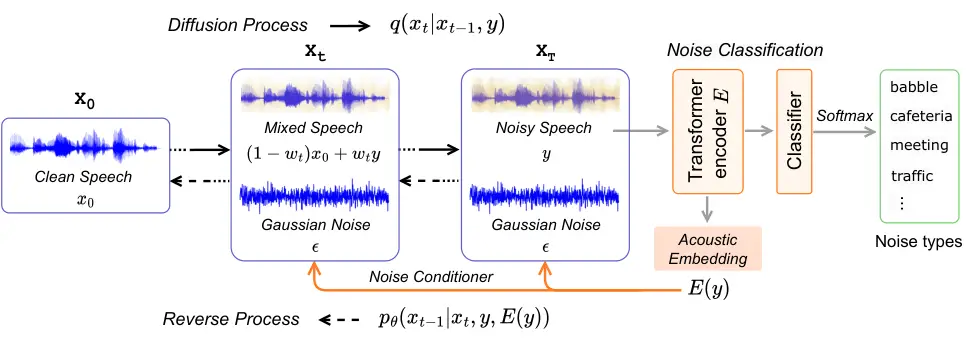
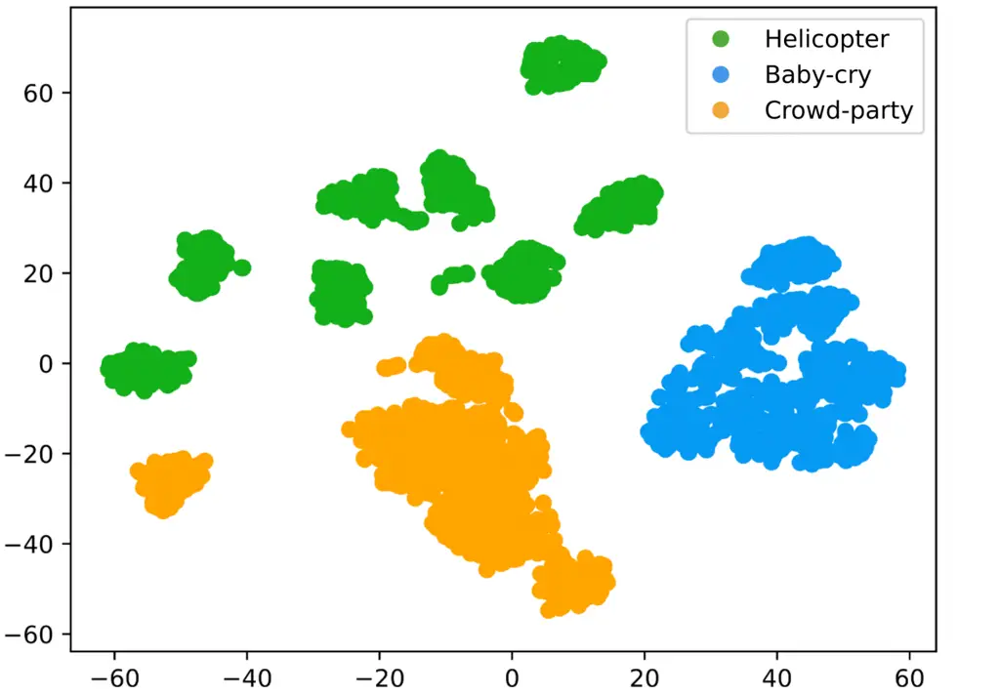

# Noise-aware Speech Enhancement using Diffusion Probabilistic Model

Yuchen Hu¹, Chen Chen¹, Ruizhe Li², Qiushi Zhu³, Eng Siong Chng¹

###### Abstract

With recent advances of diffusion model, generative speech enhancement
(SE) has attracted a surge of research interest due to its great
potential for unseen testing noises. However, existing efforts mainly
focus on inherent properties of clean speech, underexploiting the
varying noise information in real world. In this paper, we propose a
noise-aware speech enhancement (NASE) approach that extracts
noise-specific information to guide the reverse process in diffusion
model. Specifically, we design a noise classification (NC) model to
produce acoustic embedding as a noise conditioner to guide the reverse
denoising process. Meanwhile, a multi-task learning scheme is devised to
jointly optimize SE and NC tasks to enhance the noise specificity of
conditioner. NASE is shown to be a plug-and-play module that can be
generalized to any diffusion SE models. Experiments on VB-DEMAND dataset
show that NASE effectively improves multiple mainstream diffusion SE
models, especially on unseen noises¹¹ 1 Code, model and processed audio
files are publicly available at: https://github.com/YUCHEN005/NASE.

###### keywords

Diffusion probabilistic model, speech enhancement, unseen test noise,
noise conditioner, multi-task learning

^(†)^(†)address: ¹Nanyang Technological University, Singapore
 ²University of Aberdeen, UK  
³University of Science and Technology of China, China^(†)^(†)email:
yuchen005@e.ntu.edu.sg

## 1 Introduction

Speech enhancement (SE) aims to estimate clean speech signals from audio
recordings that are corrupted by acoustic noises \[1\], which usually
serves as a front-end processor in many real-world applications,
including speech recognition \[2, 3\], hearing aids \[4\] and speaker
recognition \[5\]. With advances of deep learning in the past decade,
significant progress has been made.

Deep learning based SE can be roughly divided into two categories, based
on the criteria used to estimate the transformation from noisy speech to
clean speech. The first category trains discriminative models to
minimize the distance between noisy and clean speech. However, as
supervised methods are inevitably trained on a finite set of training
data with limited model capacity for practical reasons, they may not
generalize well to unseen situations, e.g., different noise types,
different signal-to-noise ratios (SNR) and reverberations. Additionally,
some discriminative methods have been shown to result in undesirable
speech distortions \[6\].

The second category trains generative models to learn the distribution
of clean speech as a prior for speech enhancement, instead of learning a
direct noisy-to-clean mapping. Several approaches have employed deep
generative models for speech enhancement, including generative
adversarial network (GAN) \[7, 8\], variational autoencoder (VAE) \[9,
10\] and flow-based models \[11, 12\]. Recent advances of diffusion
probabilistic model have launched a new surge of research interest in
generative SE \[13, 14, 15, 16, 17, 18\]. The main principle of these
approaches is to learn the inherent properties of clean speech, such as
its temporal and spectral structure, which then serve as prior knowledge
to infer clean speech from noisy input. Therefore, they focus on
generating clean speech and are thus considered more robust to varying
acoustic conditions in the real world. Existing studies \[9, 10, 14\]
have showed better performance of generative SE on unseen testing noises
than discriminative counterparts. However, these approaches fail to
fully exploit the noise information inside input noisy speech \[19\],
which could be instructive to the denoising process of SE, especially in
unseen test conditions.

In this paper, we propose a noise-aware speech enhancement (NASE)
approach that extracts noise-specific information to guide the reverse
process of diffusion model. Specifically, we design a noise
classification (NC) model and extract its acoustic embedding as a noise
conditioner for guiding the reverse denoising process \[20\]. With such
noise-specific information, the diffusion model can target at the noise
component in noisy input and thus remove it more effectively. Meanwhile,
a multi-task learning scheme is devised to jointly optimize SE and NC
tasks, which aims to enhance the noise specificity of extracted noise
conditioner. Our NASE is shown to be a plug-and-play module that can be
generalized to any diffusion SE models for improvement. Experiments
verify its effectiveness on multiple diffusion backbones, especially on
unseen testing noises.

## 2 Diffusion Probabilistic Model

In this section, we briefly introduce the vanilla diffusion
probabilistic model in terms of its _diffusion_ and _reverse_ processes.
To formulate speech enhancement task, we define the input noisy speech
as $`y`$ and its corresponding clean speech as $`x_{0}`$. Generally
speaking, SE aims to learn a transformation $`f`$ that converts the
noisy input to clean signal:
$`x_{0}=f(y),\ \{x_{0},y\}\in\mathbb{R}^{L}`$, $`L`$ is signal length in
samples.

Diffusion process is defined as a $`T`$-step Markov chain that gradually
adds Gaussian noise to original clean signal $`x_{0}`$:

```math
q(x_{1},\cdots,x_{T}|x_{0})=\prod_{t=1}^{T}q(x_{t}|x_{t-1}),\vskip-2.84544pt \tag{1}
```

with a Gaussian model $`q(x_{t}|x_{t-1})=\mathcal{N}(x_{t};`$
$`\sqrt{1-\beta_{t}}x_{t-1},\beta_{t}I)`$, where $`\beta_{t}`$ is a
small positive constant serving as a pre-defined schedule. After
sufficient diffusion steps $`T`$, the clean $`x_{0}`$ is finally
converted to a latent variable $`x_{T}`$ with an isotropic Gaussian
distribution $`p_{\text{latent}}(x_{T})=\mathcal{N}(0,I)`$. Therefore,
conditioned on $`x_{0}`$, the sampling distribution of step $`t`$ in the
Markov chain can be derived as:

```math
q(x_{t}|x_{0})=\mathcal{N}(x_{t};\sqrt{\bar{\alpha}_{t}}x_{0},(1-\bar{\alpha}_{t})I), \tag{2}
```

where $`\alpha_{t}=1-\beta_{t}`$ and
$`\bar{\alpha}_{t}=\prod_{s=1}^{t}\alpha_{s}`$.

Reverse process aims to restore $`x_{0}`$ from the latent variable
$`x_{T}`$ based on the following Markov chain:

```math
p_{\theta}(x_{0},\cdots,x_{T-1}|x_{T})=\prod_{t=1}^{T}p_{\theta}(x_{t-1}|x_{t}), \tag{3}
```

where $`p_{\theta}(\cdot)`$ is a distribution of reverse process with
learnable parameters $`\theta`$. As marginal likelihood
$`p_{\theta}(x_{0})=\int p_{\theta}(x_{0},\cdots,x_{T-1}|x_{T})\cdot p_{\text{latent}}(x_{T})dx_{1:T}`$
is intractable for calculation, the ELBO \[21\] is employed to
approximate the objective function for model training. Consequently, the
equation of reverse process can be formulated as:

```math
\begin{split}\begin{aligned} p_{\theta}(x_{t-1}|x_{t})&=\mathcal{N}(x_{t-1};\mu_{\theta}(x_{t},t),\tilde{\beta}_{t}I),\\
\text{where}\quad\mu_{\theta}(x_{t},t)&=\frac{1}{\sqrt{\alpha_{t}}}(x_{t}-\frac{\beta_{t}}{\sqrt{1-\bar{\alpha}_{t}}}\epsilon_{\theta}(x_{t},t))\end{aligned}\end{split} \tag{4}
```

The $`\mu_{\theta}(x_{t},t)`$ predicts the mean of $`x_{t-1}`$ by
removing the estimated Gaussian noise $`\epsilon_{\theta}(x_{t},t)`$ in
$`x_{t}`$, and the variance of $`x_{t}`$ is fixed to a constant
$`\tilde{\beta}_{t}=\frac{1-\bar{\alpha}_{t-1}}{1-\bar{\alpha}_{t}}\beta_{t}`$.

## 3 Methodology

In this section, we introduce our proposed NASE approach, which
integrates a noise conditioner from classification module into the
reverse process of conditional diffusion model for guidance. The overall
framework of NASE is shown in Fig 1.



Figure 1: The overall framework of our proposed NASE approach.

### 3.1 Conditional Diffusion Probabilistic Model

Considering that real-world noises usually does not obey the Gaussian
distribution, recent study \[14\] propose conditional diffusion
probabilistic model that incorporates the noisy data $`y`$ into both
diffusion and reverse processes. Specifically, a dynamic weight
$`w_{t}\in[0,1]`$ is employed for linear interpolation from $`x_{0}`$ to
$`x_{t}`$. As shown in Fig. 1, each latent variable $`x_{t}`$ contains
three terms: clean component $`(1-w_{t})x_{0}`$, noisy component
$`w_{t}y`$ and Gaussian Noise $`\epsilon`$. Therefore, the diffusion
process in Eq. (2) can be rewritten as:

```math
\begin{split}\begin{aligned} q(x_{t}|x_{0},y)&=\mathcal{N}(x_{t};(1-w_{t})\sqrt{\bar{\alpha}_{t}}x_{0}+w_{t}\sqrt{\bar{\alpha}_{t}}y,\delta_{t}I),\\
\text{where}\quad\delta_{t}&=(1-\bar{\alpha}_{t})-w_{t}^{2}\bar{\alpha}_{t}\end{aligned}\end{split} \tag{5}
```

Here $`w_{t}`$ starts from $`w_{0}=0`$ and gradually increases to
$`w_{T}\approx 1`$, turning the mean of $`x_{t}`$ from clean speech
$`x_{0}`$ to noisy speech $`y`$.

Starting from $`x_{T}`$ with distribution
$`\mathcal{N}(x_{T},\sqrt{\bar{\alpha}_{T}}y,\delta_{T}I)`$, the
conditional reverse process can be formulated from Eq. (4) as:

```math
p_{\theta}(x_{t-1}|x_{t},y)=\mathcal{N}(x_{t-1};\mu_{\theta}(x_{t},y,t),\tilde{\delta}_{t}I), \tag{6}
```

where $`\mu_{\theta}(x_{t},y,t)`$ predicts the mean of $`x_{t-1}`$. In
contrast to vanilla reverse process, here the neural model $`\theta`$
considers both $`x_{t}`$ and noisy speech $`y`$ for prediction. Thus,
similar to Eq. (4), the mean $`\mu_{\theta}`$ is defined as a linear
combination of $`x_{t}`$, $`y`$, and $`\epsilon_{\theta}`$:

```math
\mu_{\theta}(x_{t},y,t)=c_{xt}x_{t}+c_{yt}y-c_{\epsilon t}\epsilon_{\theta}(x_{t},y,t), \tag{7}
```

where the coefficients $`c_{xt},c_{yt},`$ and $`c_{\epsilon t}`$ are
derived from the ELBO optimization criterion in \[14\]. Finally, the
Gaussian noise $`\epsilon`$ and non-Gaussian noise $`y-x_{0}`$ are
combined as ground-truth $`C_{t}`$ to supervise the predicted
$`\epsilon_{\theta}`$ from neural model:

```math
\displaystyle C_{t}(x_{0},y,\epsilon)=\frac{m_{t}\sqrt{\bar{\alpha}_{t}}}{\sqrt{1-\bar{\alpha}_{t}}}{(y-x_{0})}+\frac{\sqrt{\delta_{t}}}{\sqrt{1-\bar{\alpha}_{t}}}\epsilon \tag{8}
```

```math
\displaystyle\mathcal{L}_{\text{diff}}=\parallel\epsilon_{\theta}(x_{t},y,t)-C_{t}(x_{0},y,\epsilon)\parallel_{1}, \tag{9}
```

### 3.2 Noise Conditioner from Classification Module

Based on conditional diffusion probabilistic model, we propose to fully
exploit the noise-specific information inside noisy speech $`y`$ to
guide the reverse denoising process. In particular, inspired by prior
work \[20\], we design a noise classification module to produce acoustic
embedding as conditioner, which informs the diffusion model about what
kind of noise to remove.

As shown in Fig. 1, the noisy speech $`y`$ is sent into a Transformer
Encoder $`E`$ as well as a linear classifier for noise type
classification, where the output acoustic embedding $`E(y)`$ of encoder
are extracted out as a noise conditioner. Furthermore, in order to ease
the training of noise classification module and extract better acoustic
embedding with rich noise-specific information, we load an audio
pre-trained model called BEATs from prior work \[22\] for encoder $`E`$.
It is pre-trained on large-scale AudioSet \[23\] dataset and thus can
provide rich prior knowledge of audio noise for classification.

After extracting out the acoustic embedding, we send it to guide the
reverse process as an extra conditioner. Specifically, the Eq. (6) and
(7) can be re-written as:

```math
\begin{split}\begin{aligned} p_{\theta}(x_{t-1}|x_{t},y,E(y))=\mathcal{N}(x_{t-1};\mu_{\theta}(x_{t},y,t,E(y)),\tilde{\delta}_{t}I),\\
\mu_{\theta}(x_{t},y,t,E(y))=c_{xt}x_{t}+c_{yt}y-c_{\epsilon t}\epsilon_{\theta}(x_{t},y,t,E(y)),\end{aligned}\end{split} \tag{10}
```

The predicted noise $`\epsilon_{\theta}`$ is also conditioned on
acoustic embedding $`E(y)`$, which contains noise-specific information
and thus enables more effective denosing in reverse process.
Specifically, we select three techniques to inject the noise conditioner
into $`\epsilon_{\theta}`$, i.e., addition, concatenation and
cross-attention fusion with original inputs $`x_{t}`$ and $`y`$. The
$`\epsilon_{\theta}`$ in Eq. (9) should also be re-written accordingly.

### 3.3 Multi-task Learning

To further enhance the noise specificity of acoustic embedding $`E(y)`$,
we perform noise classification as an auxiliary task:

```math
\begin{split}\begin{aligned} \mathcal{L}_{\text{NC}}&=\text{CrossEntropy}(\hat{C},C)\\
\text{where}\quad\hat{C}&=\text{Softmax}(P(E(y)))\end{aligned}\end{split} \tag{11}
```

Here the $`\hat{C}`$ and $`C`$ denote the predicted probability
distribution and noise class label respectively. $`P`$ is a linear
classifier.

Multi-task learning scheme is employed to optimize SE and NC tasks
simultaneously for better generalization:

```math
\mathcal{L}=\mathcal{L}_{\text{diff}}+\lambda_{\text{NC}}\cdot\mathcal{L}_{\text{NC}} \tag{12}
```

where $`\lambda_{\text{NC}}`$ is a weighting hyper-parameter to balance
two tasks.

## 4 Experiments and Results

### 4.1 Experimental Setup

Dataset. We evaluate the proposed approach on public VoiceBank-DEMAND
(VBD) dataset \[24\]. In particular, the training set contains 11,572
noisy utterances from 28 speakers in VoiceBank corpus \[25\], which are
recorded at a sampling rate of 16 kHz and mixed with 10 different noise
types at SNR levels of 0, 5, 10, and 15 dB. The test set contains 824
noisy utterances from 2 speakers, which are mixed with 5 types of unseen
noise at SNR levels of 2.5, 7.5, 12.5, and 17.5 dB. For further
evaluation on unseen noise, we also simulated noisy test data with three
types of noise from prior work \[26\], i.e., “Helicopter”, “Baby-cry”
and “Crowd-party”.

Configurations. We select three various types of open-sourced diffusion
SE models as our backbone, including one conditional diffusion model:
CDiffuSE²² 2 https://github.com/neillu23/CDiffuSE \[14\], and two
score-based diffusion models: StoRM³³ 3
https://github.com/sp-uhh/storm \[16\] and SGMSE+⁴⁴ 4
https://github.com/sp-uhh/sgmse \[17\], and we follow their best
configurations as our backbone. The pre-trained BEATs⁵⁵ 5
https://github.com/microsoft/unilm/tree/master/beats model contains 12
Transformer \[27\] encoder layers, with 12 attention heads and 768
embedding units. The number of noise types for classification is set to
10, following the training data. The weight $`\lambda_{\text{NC}}`$ is
set to 0.3.

Metric. We use perceptual evaluation of speech quality (PESQ) \[28\],
extended short-time objective intelligibility (ESTOI) \[29\] and
scale-invariant signal-to-distortion ratio (SI-SDR) \[30\] as evaluation
metrics. Higher scores mean better performance for all the metrics.

### 4.2 Results

#### 4.2.1 Comparison with competitive baselines

|                    |          |      |       |        |
| ------------------ | -------- | ---- | ----- | ------ |
| System             | Category | PESQ | ESTOI | SI-SDR |
| Unprocessed        | \-       | 1.97 | 0.79  | 8.4    |
| Conv-TasNet \[31\] | D        | 2.84 | 0.85  | 19.1   |
| GaGNet \[32\]      | D        | 2.94 | 0.86  | 19.9   |
| MetricGAN+ \[33\]  | D        | 3.13 | 0.83  | 8.5    |
| SEGAN \[7\]        | G        | 2.16 | \-    | \-     |
| SE-Flow \[12\]     | G        | 2.28 | \-    | \-     |
| RVAE \[10\]        | G        | 2.43 | 0.81  | 16.4   |
| CDiffuSE \[14\]    | G        | 2.52 | 0.79  | 12.4   |
| MOSE \[34\]        | G        | 2.54 | \-    | \-     |
| UNIVERSE\*\[35\]   | G        | 2.91 | 0.84  | 10.1   |
| StoRM \[16\]       | G        | 2.93 | 0.88  | 18.8   |
| SGMSE+ \[17\]      | G        | 2.93 | 0.87  | 17.3   |
| GF-Unified \[18\]  | G        | 2.97 | 0.87  | 18.3   |
| NASE (CDiffuSE)    | G        | 2.57 | 0.80  | 12.8   |
| NASE (StoRM)       | G        | 2.98 | 0.88  | 18.9   |
| NASE (SGMSE+)      | G        | 3.01 | 0.87  | 17.6   |

Table 1: NASE _vs._ other methods. “G” and “D” denote generative and
discriminative categories. \* means self-reproduced results. We select
the top-3 open-sourced diffusion SE models as our backbone.

Table 1 illustrates the comparison of our proposed NASE with competitive
baselines, especially the three diffusion SE models that we select as
backbones, i.e., CDiffuSE, StoRM and SGMSE+. Our proposed NASE is shown
to be a plug-and-play module and can generalize to various diffusion
models for improvement (2.52$`\rightarrow`$2.57,
2.93$`\rightarrow`$2.98, 2.93$`\rightarrow`$3.01), where we have
achieved the most 0.08 PESQ improvement on SGMSE+ backbone. As a result,
our NASE has achieved the state-of-the-art among generative SE
approaches, though still lagging behind the state-of-the-art
discriminative counterparts. Apart from PESQ metric, our NASE also
improves the ESTOI and SI-SDR metrics to some extent.

#### 4.2.2 Generalization to unseen testing noises

|                           |                         |      |      |      |      |             |
| ------------------------- | ----------------------- | ---- | ---- | ---- | ---- | ----------- |
| System                    | Noise level, SNR (dB) = |      |      |      |      |             |
|                           | -5                      | 0    | 5    | 10   | 15   | Avg.        |
| _Noise type: Helicopter_  |                         |      |      |      |      |             |
| Unprocessed               | 1.06                    | 1.09 | 1.16 | 1.33 | 1.62 | 1.25 +0%    |
| SGMSE+                    | 1.08                    | 1.22 | 1.49 | 1.88 | 2.33 | 1.60 +28.0% |
| NASE (SGMSE+)             | 1.09                    | 1.25 | 1.57 | 2.01 | 2.42 | 1.67 +33.6% |
| _Noise type: Baby-cry_    |                         |      |      |      |      |             |
| Unprocessed               | 1.09                    | 1.12 | 1.18 | 1.30 | 1.50 | 1.24 +0%    |
| SGMSE+                    | 1.21                    | 1.44 | 1.85 | 2.34 | 2.83 | 1.93 +55.6% |
| NASE (SGMSE+)             | 1.24                    | 1.49 | 1.94 | 2.43 | 2.92 | 2.00 +61.3% |
| _Noise type: Crowd-party_ |                         |      |      |      |      |             |
| Unprocessed               | 1.13                    | 1.14 | 1.21 | 1.34 | 1.58 | 1.28 +0%    |
| SGMSE+                    | 1.26                    | 1.58 | 2.02 | 2.42 | 2.83 | 2.02 +57.8% |
| NASE (SGMSE+)             | 1.28                    | 1.63 | 2.07 | 2.49 | 2.89 | 2.07 +61.7% |

Table 2: PESQ results on on unseen noise with different SNRs. “Avg.”
denotes the average of all SNR levels.

We also evaluate our proposed NASE on three unseen testing noises \[26\]
with a wide range of SNR levels from -5dB to 15dB, where the best SGMSE+
backbone is selected for this study. Table 2 shows the performance
comprison in terms of PESQ metric. Despite the outstanding performance
on matched VBD test set, we observe that the PESQ result of SEMSE+
baseline on unseen noises dramatically degrades due to noise domain
mismatch. In comparison, our NASE significantly outperforms SGMSE+ in
different noise types and SNR levels (1.60$`\rightarrow`$1.67,
1.93$`\rightarrow`$2.00, 2.02$`\rightarrow`$2.07), thanks to the
noise-specific information provided by extracted noise conditioner.

In addition, we also find that NASE achieves higher relative PESQ
improvement over SGMSE+ on unseen noises, which indicates its
effectiveness under varying real-world conditions. Another interesting
fact is that, among the three unseen noises, NASE shows larger relative
improvement over SGMSE+ on non-stationary “Helicopter” and “Baby-cry”
noises than stationary “Crowd-party” noise, implying the strong
robustness of NASE in adverse conditions.

#### 4.2.3 Effect of audio pre-training in noise classification

|     |               |     |        |      |       |        |
| --- | ------------- | --- | ------ | ---- | ----- | ------ |
| ID  | System        | PT  | Freeze | PESQ | ESTOI | SI-SDR |
| 1   | Unprocessed   | \-  | \-     | 1.97 | 0.79  | 8.4    |
| 2   | SGMSE+        | \-  | \-     | 2.93 | 0.87  | 17.3   |
| 3   | NASE (SGMSE+) | ✗   | ✗      | 2.95 | 0.86  | 17.3   |
| 4   |               | ✓   | ✓      | 2.97 | 0.86  | 17.4   |
| 5   |               | ✓   | ✗      | 3.01 | 0.87  | 17.6   |

Table 3: Effect of audio pre-training in noise classification module.
“PT” denotes loading pre-trained BEATs, “Freeze” denotes freezing the
model parameters of BEATs.

Table 3 illustrates the effect of audio pre-training from BEATs. First,
comparing system 2 and 3, we can observe limited PESQ improvement
brought by NASE when without audio pre-training, where the ESTOI and
SI-SDR metrics even degrade. System 4 load the pre-trained BEATs but
freeze its parameters during training, which can bring some PESQ
improvement (2.95$`\rightarrow`$2.97). It indicates that the pre-trained
BEATs can produce high-quality but not optimal noise conditioner to
improve the reverse process. In comparison, unfreezing the pre-trained
BEATs for training can produce better noise conditioner to guide the
reverse denoising process, which thus yields the best SE performance in
terms of all three metrics, i.e., system 5.

#### 4.2.4 Effect of the weight of noise classification

|     |               |                         |          |      |       |        |
| --- | ------------- | ----------------------- | -------- | ---- | ----- | ------ |
| ID  | System        | $`\lambda_{\text{NC}}`$ | Acc. (%) | PESQ | ESTOI | SI-SDR |
| 6   | Unprocessed   | \-                      | \-       | 1.97 | 0.79  | 8.4    |
| 7   | SGMSE+        | \-                      | \-       | 2.93 | 0.87  | 17.3   |
| 8   | NASE (SGMSE+) | 0                       | \-       | 2.98 | 0.86  | 17.3   |
| 9   |               | 0.1                     | 71.3     | 3.00 | 0.88  | 17.4   |
| 10  |               | 0.3                     | 77.4     | 3.01 | 0.87  | 17.6   |
| 11  |               | 0.5                     | 81.8     | 2.96 | 0.86  | 17.6   |
| 12  |               | 1.0                     | 83.6     | 2.92 | 0.86  | 17.2   |

Table 4: Effect of the weight of noise classification in multi-task
learning. “Acc.” denotes the classification accuracy on training data.

Table 4 analyzes the effect of the weight of noise classification in
multi-task learning, which all follow the settings of system 5. First,
system 8 sets $`\lambda_{\text{NC}}`$ to 0, which means the Transformer
encoder $`E`$ would be optimized by $`\mathcal{L}_{\text{diff}}`$ only.
However, this operation seems insufficient to improve noise conditioner,
as compared with system 4 (2.97$`\rightarrow`$2.98). On top of that, we
start to increase $`\lambda_{\text{NC}}`$ to incorporate noise
classification into multi-task learning. System 9 and 10 achieve
promising improvements over system 8 in terms of all three metrics,
where $`\lambda_{\text{NC}}=0.3`$ yields the best SE performance.
Meanwhile, they also perform well in the auxiliary noise classification
task, with up to 77.4% in accuracy. Further increasing the weight of
noise classification task produces higher accuracy up to 83.6%, but the
PESQ performance significantly degrades
(3.01$`\rightarrow`$2.96$`\rightarrow`$2.92). This phenomenon indicates
that the auxiliary NC task can benefit the diffusion SE with a
relatively small weight, by enhancing the conditioner’s
noise-specificity. However, when the weight increases, the training of
encoder would be dominated by NC task and thus degrade the performance
of our targeted SE task \[3\].

#### 4.2.5 Effect of different techniques to inject noise conditioner

|     |               |              |      |       |        |
| --- | ------------- | ------------ | ---- | ----- | ------ |
| ID  | System        | Inject       | PESQ | ESTOI | SI-SDR |
| 13  | Unprocessed   | \-           | 1.97 | 0.79  | 8.4    |
| 14  | SGMSE+        | \-           | 2.93 | 0.87  | 17.3   |
| 15  | NASE (SGMSE+) | _addition_   | 3.01 | 0.87  | 17.6   |
| 16  |               | _concat_     | 2.99 | 0.87  | 17.5   |
| 17  |               | _cross-attn_ | 2.96 | 0.86  | 17.5   |

Table 5: Effect of different techniques to inject the conditioner,
including addition, concatenation and cross-attention fusion.

Table 5 presents the results of different techniques to inject noise
conditioner $`E(y)`$ into reverse process. As introduced in
Section. 3.2, we inject the noise conditioner into $`\epsilon_{\theta}`$
by combining it with original inputs, i.e., $`x_{t}`$ and $`y`$. Here we
select three common techniques for feature fusion, i.e., simple
addition, feature concatenation and cross-attention fusion. Our results
indicate that all three techniques are effective, where the simple
addition yields surprisingly the best performance. One possible
explanation is, in fact the noisy speech $`y`$ inherently contains
noise-related information but not noise-specific, and our extracted
noise conditioner exactly serves to complement and highlight the
noise-specific information. Therefore, simple addition or concatenation
seems enough to achieve good improvement, while cross-attention may
wrongly discard some noise-specific parts and thus leads to sub-optimal
performance.

#### 4.2.6 Visualization of noise conditioners



Figure 2: The t-SNE visualization of noise conditioners from three
unseen noise types, i.e., “Helicopter”, “Baby-cry” and “Crowd-party”.

Fig. 2 visualizes the noise conditioners from three types of unseen
noises. We observe that different noise conditioners are well separated
with clear boundaries, indicating their strong noise-specificity. It
guides the reverse process to target at the noise component in $`x_{t}`$
for more effective denoising, which is exactly the key to the
performance improvement of our NASE.

## 5 Conclusion

In this paper, we propose a noise-aware speech enhancement (NASE)
approach that extracts noise-specific information to guide the reverse
process of diffusion model. Specifically, we design a noise
classification model and extract its acoustic embedding as a noise
conditioner for guiding the reverse process. Meanwhile, a multi-task
learning scheme is devised to jointly optimize SE and NC tasks, aiming
to enhance the noise specificity of extracted conditioner. Our NASE is a
plug-and-play module that can generalize to any diffusion SE models.
Experiments verify its effectiveness on multiple diffusion backbones,
especially on unseen testing noises.

## References

- \[1\] R. C. Hendriks, T. Gerkmann, and J. Jensen, _DFT-domain based
  single-microphone noise reduction for speech
  enhancement_. Springer, 2013.
- \[2\] Y. Hu, N. Hou, C. Chen, and E. S. Chng, “Interactive feature
  fusion for end-to-end noise-robust speech recognition,” in _2022 IEEE
  ICASSP_. IEEE, 2022, pp. 6292–6296.
- \[3\] Y. Hu, C. Chen, R. Li, Q. Zhu, and E. S. Chng, “Gradient remedy
  for multi-task learning in end-to-end noise-robust speech
  recognition,” in _2023 IEEE ICASSP_. IEEE, 2023, pp. 1–5.
- \[4\] I. Fedorov, M. Stamenovic, C. Jensen, L.-C. Yang, A. Mandell,
  Y. Gan, M. Mattina, and P. N. Whatmough, “Tinylstms: Efficient neural
  speech enhancement for hearing aids,” _arXiv preprint
  arXiv:2005.11138_, 2020.
- \[5\] J. H. Hansen and T. Hasan, “Speaker recognition by machines and
  humans: A tutorial review,” _IEEE Signal processing magazine_,
  vol. 32, no. 6, pp. 74–99, 2015.
- \[6\] P. Wang, K. Tan _et al._, “Bridging the gap between monaural
  speech enhancement and recognition with distortion-independent
  acoustic modeling,” _IEEE/ACM TASLP_, vol. 28, pp. 39–48, 2019.
- \[7\] S. Pascual, A. Bonafonte, and J. Serra, “Segan: Speech
  enhancement generative adversarial network,” _arXiv preprint
  arXiv:1703.09452_, 2017.
- \[8\] D. Baby and S. Verhulst, “Sergan: Speech enhancement using
  relativistic generative adversarial networks with gradient penalty,”
  in _2019 IEEE ICASSP_. IEEE, 2019, pp. 106–110.
- \[9\] H. Fang, G. Carbajal, S. Wermter, and T. Gerkmann, “Variational
  autoencoder for speech enhancement with a noise-aware encoder,” in
  _2021 IEEE ICASSP_. IEEE, 2021, pp. 676–680.
- \[10\] X. Bie, S. Leglaive, X. Alameda-Pineda, and L. Girin,
  “Unsupervised speech enhancement using dynamical variational
  autoencoders,” _IEEE/ACM TASLP_, vol. 30, pp. 2993–3007, 2022.
- \[11\] A. A. Nugraha, K. Sekiguchi, and K. Yoshii, “A flow-based deep
  latent variable model for speech spectrogram modeling and
  enhancement,” _IEEE/ACM TASLP_, vol. 28, pp. 1104–1117, 2020.
- \[12\] M. Strauss and B. Edler, “A flow-based neural network for time
  domain speech enhancement,” in _2021 IEEE ICASSP_. IEEE, 2021, pp.
  5754–5758.
- \[13\] Y.-J. Lu, Y. Tsao, and S. Watanabe, “A study on speech
  enhancement based on diffusion probabilistic model,” in _2021 APSIPA
  ASC_. IEEE, 2021, pp. 659–666.
- \[14\] Y.-J. Lu, Z.-Q. Wang, S. Watanabe, A. Richard, C. Yu, and
  Y. Tsao, “Conditional diffusion probabilistic model for speech
  enhancement,” in _2022 IEEE ICASSP_. IEEE, pp. 7402–7406.
- \[15\] S. Welker, J. Richter, and T. Gerkmann, “Speech enhancement
  with score-based generative models in the complex STFT domain,” in
  _Proc. Interspeech 2022_, 2022, pp. 2928–2932.
- \[16\] J.-M. Lemercier, J. Richter, S. Welker, and T. Gerkmann,
  “Storm: A diffusion-based stochastic regeneration model for speech
  enhancement and dereverberation,” _arXiv preprint
  arXiv:2212.11851_, 2022.
- \[17\] J. Richter, S. Welker, J.-M. Lemercier, B. Lay, and
  T. Gerkmann, “Speech enhancement and dereverberation with
  diffusion-based generative models,” _IEEE/ACM TASLP_, vol. 31, pp.
  2351–2364, 2023.
- \[18\] H. Shi, K. Shimada, M. Hirano, T. Shibuya, Y. Koyama, Z. Zhong,
  S. Takahashi, T. Kawahara, and Y. Mitsufuji, “Diffusion-based speech
  enhancement with joint generative and predictive decoders,” _arXiv
  preprint arXiv:2305.10734_, 2023.
- \[19\] Z. Zhang, C. Chen, X. Liu, Y. Hu, and E. S. Chng, “Noise-aware
  speech separation with contrastive learning,” _arXiv preprint
  arXiv:2305.10761_, 2023.
- \[20\] P. Dhariwal and A. Nichol, “Diffusion models beat gans on image
  synthesis,” _NeurIPS 2021_, vol. 34, pp. 8780–8794, 2021.
- \[21\] J. Ho, A. Jain, and P. Abbeel, “Denoising diffusion
  probabilistic models,” _NeurIPS 2020_, vol. 33, pp. 6840–6851, 2020.
- \[22\] S. Chen, Y. Wu, C. Wang, S. Liu, D. Tompkins, Z. Chen, and
  F. Wei, “Beats: Audio pre-training with acoustic tokenizers,” _arXiv
  preprint arXiv:2212.09058_, 2022.
- \[23\] J. F. Gemmeke, D. P. Ellis, D. Freedman, A. Jansen,
  W. Lawrence, R. C. Moore, M. Plakal, and M. Ritter, “Audio set: An
  ontology and human-labeled dataset for audio events,” in _2017 IEEE
  ICASSP_. IEEE, 2017, pp. 776–780.
- \[24\] C. Valentini-Botinhao, X. Wang, S. Takaki, and J. Yamagishi,
  “Investigating rnn-based speech enhancement methods for noise-robust
  text-to-speech.” in _SSW_, 2016, pp. 146–152.
- \[25\] C. Veaux, J. Yamagishi, and S. King, “The voice bank corpus:
  Design, collection and data analysis of a large regional accent speech
  database,” in _2013 O-COCOSDA/CASLRE_, pp. 1–4.
- \[26\] H.-Y. Lin, H.-H. Tseng, X. Lu, and Y. Tsao, “Unsupervised noise
  adaptive speech enhancement by discriminator-constrained optimal
  transport,” _NeurIPS 2021_, vol. 34, pp. 19 935–19 946, 2021.
- \[27\] A. Vaswani, N. Shazeer, N. Parmar, J. Uszkoreit, L. Jones,
  A. N. Gomez, L. Kaiser, and I. Polosukhin, “Attention is all you
  need,” _NeurIPS 2017_, vol. 30, 2017.
- \[28\] A. W. Rix, J. G. Beerends, M. P. Hollier, and A. P. Hekstra,
  “Perceptual evaluation of speech quality (pesq)-a new method for
  speech quality assessment of telephone networks and codecs,” in _2001
  IEEE ICASSP. Proceedings (Cat. No. 01CH37221)_, vol. 2. IEEE, 2001,
  pp. 749–752.
- \[29\] J. Jensen and C. H. Taal, “An algorithm for predicting the
  intelligibility of speech masked by modulated noise maskers,”
  _IEEE/ACM TASLP_, vol. 24, no. 11, pp. 2009–2022, 2016.
- \[30\] J. Le Roux, S. Wisdom, H. Erdogan, and J. R. Hershey,
  “Sdr–half-baked or well done?” in _2019 IEEE ICASSP_. IEEE, 2019, pp.
  626–630.
- \[31\] Y. Luo and N. Mesgarani, “Conv-tasnet: Surpassing ideal
  time–frequency magnitude masking for speech separation,” _IEEE/ACM
  TASLP_, vol. 27, no. 8, pp. 1256–1266, 2019.
- \[32\] A. Li, C. Zheng, L. Zhang, and X. Li, “Glance and gaze: A
  collaborative learning framework for single-channel speech
  enhancement,” _Applied Acoustics_, vol. 187, p. 108499, 2022.
- \[33\] S.-W. Fu, C. Yu, T.-A. Hsieh, P. Plantinga, M. Ravanelli,
  X. Lu, and Y. Tsao, “Metricgan+: An improved version of metricgan for
  speech enhancement,” _arXiv preprint arXiv:2104.03538_.
- \[34\] C. Chen, Y. Hu, W. Weng, and E. S. Chng, “Metric-oriented
  speech enhancement using diffusion probabilistic model,” in _2023 IEEE
  ICASSP_. IEEE, 2023, pp. 1–5.
- \[35\] J. Serrà, S. Pascual, J. Pons, R. O. Araz, and D. Scaini,
  “Universal speech enhancement with score-based diffusion,” _arXiv
  preprint arXiv:2206.03065_, 2022.
