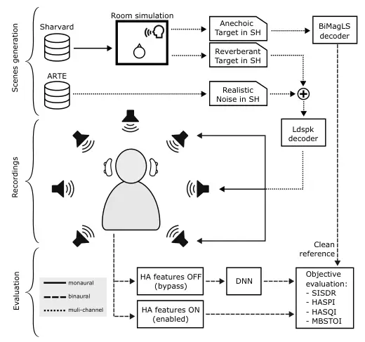

# An objective evaluation of Hearing Aids and DNN-based binaural speech enhancement in complex acoustic scenes

###### Abstract

We investigate the objective performance of five high-end commercially
available Hearing Aid (HA) devices compared to DNN-based speech
enhancement algorithms in complex acoustic environments. To this end, we
measure the HRTFs of a single HA device to synthesize a binaural dataset
for training two state-of-the-art causal and non-causal DNN enhancement
models. We then generate an evaluation set of realistic speech-in-noise
situations using an Ambisonics loudspeaker setup and record with a KU100
dummy head wearing each of the HA devices, both with and without the
conventional HA algorithms, applying the DNN enhancers to the latter. We
find that the DNN-based enhancement outperforms the HA algorithms in
terms of noise suppression and objective intelligibility metrics.

|                                                                               |
| ----------------------------------------------------------------------------- |
| Enric Gusó,^(1,2) Joanna Luberadzka,² Martí Baig,³ Umut Sayin,² Xavier Serra¹ |
| ¹ Universitat Pompeu Fabra, Music Technology Group, Barcelona                 |
| enric.guso@upf.edu, xavier.serra@upf.edu                                      |
| ² Eurecat, Centre Tecnològic de Catalunya, Tecnologies Multimèdia, Barcelona  |
| joanna.luberadzka@eurecat.org, umut.sayin@eurecat.org                         |
| ³ Microson, Amplifon Group, Barcelona, marti.baig@amplifon.com                |

Index Terms—  hearing aids, speech enhancement, denoising,
dereverberation

## 1 Introduction

^(†)^(†) The research leading to these results has received funding from
the European union’s Horizon Europe programme under grant agreement No
101017884 - GuestXR project.

Hearing Aids are electronic devices that attempt to compensate for
hearing loss by means of frequency-dependent amplification and dynamic
range compression among other techniques. Traditionally, in order to
improve the signal-to-noise (SNR) ratio, HAs make use of directional
microphones \[1\] or adaptive beamformers \[2\], usually evaluated with
stationary noises under laboratory conditions \[3\]. However, real-life
scenarios can be much more challenging due to the possible presence of
non-stationary noises, interfering speech and/or several competing
talkers.

Beyond the research in HA field, end-to-end deep neural networks (DNNs)
have proven to be very successful in such challenging scenarios, even
without exploiting spatial cues and focusing on the monaural case \[4\],
but these models are not directly suitable for HA use due to being
non-causal (i.e. requiring future samples) or needing lots of
computational power. Therefore, causal adaptations have been proposed in
\[5\] and further explored in \[6\], while in \[7\] Han et al. have
adapted them to the binaural case while preserving spatial cues. In
addition, \[8\] have achieved very low algorithmic latency that is
comparable to HA processing \[9\] which, together with advances in the
miniaturization of DNNs \[10\], methods that offload the processing to
other devices \[11\], and the outcomes of the Clarity Challenge \[12\]
constitute major steps towards more powerful DNN-based HA processing.

In fact, some HA manufacturers already use DNN processing as part of a
post-filtering step in their products \[13, 14, 15\], although they do
not disclose any details of the actual architecture and implementation,
nor ablation studies that quantify the performance gain from the DNNs.
This work focuses precisely on evaluating this gap by using an
experimental setup that is controlled but also as realistic and
ecologically-valid as possible. Our approach has been to record several
HAs in realistic noisy environments and to compare their performance
with the same recordings post-processed by the DNNs. We have chosen
Sudo-RM-RF \[5\], an already developed, well-tested state of the art DNN
originally designed for speech separation that has also shown good
performance in the HA speech enhancement case \[16, 12\]. The main
contribution of this study is an objective evaluation which suggests
that hearing aid signal enhancement has difficulties under challenging
acoustic conditions and that DNN-based speech enhancement methods have
the potential of improving current hearing devices. Furthermore, we
provide the following research materials:

- •
  An Ambisonics to binaural decoder, built from a set of measured HRTFs
  from the KU100 wearing an audifon lewi R —a commercially-available HA
  Receiver-In-Canal (RIC) device.
- •
  A new, synthetic and binaural (two-channel) HA speech enhancement
  training dataset built with that decoder.
- •
  A reverberant speech-in-noise test set in Ambisonics and binaural
  formats, with the corresponding recordings for each HA device.

## 2 HA MEASUREMENT SETUP

Our measurement setup (depicted in Figure 1) was designed to capture the
signals processed by various HA devices within complex acoustic scenes.
We recorded with five high-end RIC HAs available in the market at the
time of writing: GN ONE 961-DRWC, GN ONE 561-DRWC, Phonak Audéo P90-R,
Phonak Audéo P70-R, and Signia Pure C$`\&`$G 3x. In total, we have
tested fifteen combinations of HA and receiver, recording with low, mid
and high power receivers for each device.



Figure 1: Hearing aid measurement setup. Scenes generation: complex
acoustic scenes are generated by combining existing databases (Sharvard,
ARTE) with room acoustic simulation. Recordings: audio material is
played back in an Ambisonics-based reproduction system and the signals
processed by the HA are captured with the microphones of a dummy head.
HA are recorded with and without signal-enhancing features. Evaluation:
HA-enhanced recordings are compared with DNN-processed recordings using
a range of objective metrics.

Scenes generation — To ensure that the sound processed by the tested
hearing devices closely resembled real-life scenarios, we used an
Ambisonics-based spatial sound reproduction system. All HA devices were
exposed to three different acoustic scenes of speech in noise. To create
these scenes we used three noise recordings from the ARTE database
\[17\] representing common sound environments: party, restaurant and
office. Recordings come from real environments captured with a
62-channel microphone array, and are available as 31-channel mixed-order
Ambisonics signals which we zero-padded up to 10th order. The target
speech consisted of nine randomly selected sentences spoken by a female
speaker from the Sharvard database \[18\]. To simulate room acoustics,
we used an adaptation of the Multichannel Acoustic Signal Processing
Library¹¹ 1 https://github.com/andresperezlopez/masp (MASP): a shoebox
room impulse response simulator based on the Image Source Method that
allows for Spherical Harmonics expansion (SH, i.e. Ambisonics). We used
10th-order Ambisonics, which provide sufficient spatial resolution and
generated two sets of sound fields at the left ear, right ear, and
$`head`$ positions: one set where we only simulated sound propagation
(the direct sound field w/o reflections) and the other one being the
actual reverberation. We used 17.5cm of ear distance for computing the
left and right ear coordinates from the $`head`$ origin to match the
KU100 ear distance. We simulated three rooms with dimensions set to
15x10x3.5m, 28x17x4.2m, and 5x2x2.5m for the party, restaurant, and
office environments respectively. All targets where placed at 1m from
the $`head`$ with two different angles: 0 degrees or 30 degrees to the
right (relative to the head horizontal orientation $`head_{\theta}`$).
We adjusted the RT60 parameter using informal listening by comparing
with the ARTE recordings. We chose RT60s that were $`60\%`$ of the ones
reported in ARTE to account for furniture and people absorption.

Decoding — Despite in \[19\] Thiemann et al. published HRTFs of the
microphones of a BTE HA placed at a head and torso simulator, no
recordings were made with KU100 dummy which was available for our
evaluation. Besides, in this study, we had no access to the microphone
signals due to evaluating commercially-available HA. Hence, we decided
to measure our own set of HRTFs in a setup as close as possible to the
intended HA recording setup (i.e. in the same room, with a HA coupled to
the dummy head ear canal, w/o signal enhancement features and only
providing a linear gain). We used a pair of audifon lewi R HA devices
and the HRTF sets were measured using the sweep method with a single
Genelec 8020 loudspeaker following a 50-point Lebedev grid. Impulse
responses were cropped before the arrival of the first wall reflection
and low frequencies were extended by LFE algorithm \[20\]. This set of
HRTFs was then used to build the 10-th order Ambisonics to binaural
decoder following the Bilateral Magnitude Least Squares method (BiMagLS)
\[21\], applying high order tapering with a cutoff frequency of 6239Hz
—which is the theoretical cutoff frequency for correct representation in
10-th order Ambisonics. To obtain the clean anechoic reference signal
needed for the objective evaluation we took the left and right ear
anechoic sound fields simulated in MASP and applied the BiMagLS decoder.
We weighted the Ambisonics signals so that SNR was +5dB when decoded to
binaural. Finally, we added the weighted speech and noise sound fields
simulated at the $`head`$ center position, and decoded the resulting
Ambisonics mixture into the loudspeaker signals using a fifth order
in-phase decoder optimized with IDHOA \[22\], particularly tailored to
our specific loudspeaker setup. We also normalized all sets of speaker
signals to have the same energy (sum of squares) for ease of
calibration.

Recordings — The KU100 dummy head was positioned at the center of a
three-dimensional irregular loudspeaker array comprising 25 Genelec
8040s loudspeakers. We calibrated the system so all scenes were at 70dB
SPL. For each recording, we placed the hearing aids behind the ears of
the KU100 dummy head and inserted the receiver into the ear canal. To
minimize the influence of direct sound, we occluded the entrance to the
ear canal with adhesive putty material in addition to the HA’s power
dome.

We recorded each hearing device in two modes: bypass and enabled. In
bypass mode all the HA algorithms were deactivated except for the
feedback canceller and a linear amplification of approximately 20dB.
Hearing aid models chosen for this study are commercially available HA.
For such devices it is not straightforward to record directly from the
HA microphone. Instead, we used signals recorded in bypass mode at the
KU100 as an approximation of the HA microphone signals. The bypass
recordings were used as the input to the offline DNN-based speech
enhancement methods. In contrast to the bypass recordings, in the
enabled mode the HA applied the signal enhancement algorithms present in
the default factory settings. In all tested devices, these settings
included at least some form of adaptive beamforming and single-channel
noise reduction. No hearing correction was applied.

In a preliminary round of recordings we employed the phase-inversion
procedure \[23\] commonly used to estimate the SNR at the output of a
linear hearing aid. However, we noticed that for some of the HA and for
all DNN-based algorithms the linearity assumption of the method could
not be met, making the SNR estimates obtained with this method
unreliable. Therefore, we decided to rely on intrusive, reference-based
metrics instead.

|     |      |       |       |       |                     |                       |         |
| --- | ---- | ----- | ----- | ----- | ------------------- | --------------------- | ------- |
| set | MLSS |       | WHAM! |       | noise augmentations |                       |         |
|     | \#   | hours | \#    | hours | $`\Phi inv`$        | L$`\Leftrightarrow`$R | stretch |
| tr  | 221k | 245.6 | 52k   | 57.8  | ✗                   | ✗                     | ✗       |
|     |      |       | 52k   | 57.8  | ✓                   | ✗                     | ✗       |
|     |      |       | 52k   | 57.8  | ✗                   | ✓                     | ✗       |
|     |      |       | 52k   | 57.8  | ✓                   | ✓                     | ✗       |
|     |      |       | 6.5k  | 7.2   | ✗                   | ✗                     | ✓       |
|     |      |       | 6.5k  | 7.2   | ✓                   | ✓                     | ✓       |
| cv  | 2.4k | 2.67  | 2.4k  | 2.67  | ✗                   | ✗                     | ✗       |
| tt  | 2.4k | 2.67  | 2.4k  | 2.67  | ✗                   | ✗                     | ✗       |

Table 1: Training data splits and augmentations, where tr stands for the
training set, cv for validation, tt for the test set, \# for the number
of utterances, $`\Phi inv`$ for changing the sign of the noise signal,
L$`\Leftrightarrow`$R for permuting the noise channels, and stretch for
applying time stretching with a random factor.

Evaluation — Objective evaluation compared the conventional HA
enhancement algorithms with the DNNs. We evaluated four sets of
recordings: bypass, enabled, bypass post-processed with DNN and bypass
post-processed with DNN-C. The first set represents recordings without
signal enhancement and the remaining three sets represent the different
signal enhancement strategies. For each set we computed four objective
metrics: Hearing-Aid Speech Quality Index (HASQI) \[24\], Hearing-Aid
Speech Perception Index (HASPI) \[25\], Modified Binaural Short-Time
Objective Intelligibility (MBSTOI) \[26\] and Scale-invariant
signal-to-distortion ratio (SISDR) as in \[5\]. Given the clean anechoic
target binaural speech signal $`y`$, the DNN or HA estimate
$`\tilde{y}`$ and a baseline recording with the HA in bypass $`\hat{y}`$
(all $`\tau`$ samples long) SISDR is described in Equation 1. $`y`$ was
used as common reference for all metrics. Reference and estimate pairs
were time-aligned using the cross-correlation method. We took the best
ear for the non-binaural measures (SISDR, HASPI, HASQI) and normalized
the signals as in \[12\]. We used a flat normal-hearing audiogram as an
input to HASPI and HASQI metrics. We define the signal enhancement
benefit as the difference in objective metrics between the non-enhanced
and enhanced signals. For example,
$`\Delta\text{SISDR}=\text{SISDR}(\tilde{y}_{t},y_{t})-\text{SISDR}(\hat{y}_{t},y_{t})`$.
The rest of metrics expressing the signal enhancement benefit are
denoted as $`\Delta`$HASQI, $`\Delta`$HASPI, $`\Delta`$MBSTOI and
computed in the same fashion.

```math
{\text{SISDR}(\tilde{y}_{t},y_{t})}=\frac{10}{\scalebox{1.5}{$\tau$}}\sum_{t}\log_{10}\left(\frac{\left|\frac{\tilde{y}_{t}^{\text{T}}y_{t}}{|y_{t}|^{2}}y_{t}\right|^{2}}{\left|\frac{\tilde{y}_{t}^{T}y_{t}}{|y_{t}|^{2}}y_{t}-\tilde{y}_{t}\right|^{2}}\right) \tag{1}
```

## 3 DNN DATASET AND TRAINING SETUP

Task — We approach supervised binaural speech enhancement with DNNs,
which requires a large number of noisy and reverberant mixtures, as well
as the corresponding targets (clean speech) also in binaural to preserve
spatial cues. Both inputs and targets have to resemble the ones that
would be recorded with the two frontal omnidirectional microphones in a
Behind The Ear (BTE) HA. To accomplish this, we simulate reverberation
in the Ambisonics spatial audio domain and then decode to binaural
signals by using a decoder specifically-tailored for HA.

Datasets — As in \[4, 5\], we relied on speech recordings from
audiobooks, in this case using the Spanish subset from Multilingual
LibriSpeech (MLSS) dataset \[27\] for the clean signals. We used a
sampling rate of 16kHz and took four seconds chunks, selecting the chunk
that presented more energy in order to avoid silence, obtaining
$`22\cdot 10^{5}`$ utterances for the training set, 2408 for validation
and 2385 for testing, which add up to 251 hours of clean speech.
Regarding noise, we used the WHAM! \[28\] binaural dataset which
contains babble speech, cafeteria noise and background music. We kept
the original data splits from both datasets, preserving gender balance
and avoiding contamination between sets. We augmented WHAM! training set
to match the length of MLSS by following three main strategies: i) we
flipped the phase, ii) we swapped left and right channels as a rough
approximation of a 180º rotation in the horizontal plane and iii) we
randomly time-stretched from 90% to 110% of the noise duration. For
validation and testing we randomly picked from WHAM! validation and test
splits respectively. Details on the data splits is shown in Table 1.

Room simulation — MLSS contains close-mic studio recordings, so we have
considered them to be a fair approximation of anechoic signals. The
random room configuration details are shown in Table 2. We used MASP and
our Ambisonics to binaural HA decoder as in Section 2. In an attempt to
make our models agnostic to our particular HA and dummy combination, the
response of the RIC coupling was compensated by taking the
direction-independent frequency response between KU100 and KU100 wearing
the HA HRTFs and approximating it with an IIR filter that was applied to
all utterances in the dataset.

|                                            |                                                                |
| ------------------------------------------ | -------------------------------------------------------------- | ----------- | --- | --------------------- | ------------------------------------- |
| $`r_{x}=\mathcal{U}(3,30)`$                | $`head_{x}=\mathcal{U}(0.35r_{x},0.65r_{x})`$                  |
| $`r_{y}=r_{x}\cdot\mathcal{U}(0.5,1)`$     | $`head_{y}=\mathcal{U}(0.35r_{y},0.65r_{y})`$                  |
| $`r_{z}=\mathcal{U}(2.5,5)`$               | $`head_{z}=\mathcal{U}(1,2)`$                                  |
| $`                                         |                                                                | head-target |     | =\mathcal{U}(0.5,3)`$ | $`head_{\theta}=\mathcal{U}(-45,45)`$ |
| $`\angle head,target=\mathcal{U}(-45,45)`$ | $`head_{\psi}=\mathcal{U}(-10,10)`$                            |
| $`\text{SNR}=\mathcal{U}(0,6)`$            | $`\text{RT60}=\mathcal{U}(0.1,0.5)\frac{\text{SNR}+0.3}{5.3}`$ |

Table 2: Random room configuration, sampled from uniform distribution
$`\mathcal{U}`$. Room $`r`$ and $`head`$ dimensions and distances are in
meters, SNR in dBs, RT60 in seconds and $`head`$ azimuth $`\theta`$,
elevation $`\psi`$ and angle with target in degrees. $`r_{y}`$ depends
on $`r_{x}`$ to avoid corridor-like spaces, and RT60 depends on the SNR
because the more noisy a situation, the less reverberant it should be
due to the crowd’s absorption.

Training Setup — Regarding the DNN topology, we did not make any
modifications to SuDo-RM-RF on top of configuring its encoder for
receiving stereo audio. All network topology details can be found in
\[5\]. We trained two different models: DNN (which corresponds to
SuDoRM-RF++GC in their paper), a non-causal improved version that serves
us as upper baseline, and DNN-C (the causal, HA oriented version that
corresponds to C-SuDoRM-RF++ in their paper). All hyperparameters are
shared between DNN and DNN-C except for the batch size —which had to be
reduced from 12 for DNN-C to 2 for DNN to fit into VRAM. We used 256
input and 512 output channels on 16 successive blocks with five
upsampling/downsampling layers each, an encoder and decoder kernel size
of 21 generating embeddings with a length of 512, four attention heads
with 256 depth and 0.1 dropout (applied only during training) and an
Adam optimizer. Learning rate was $`10^{-3}`$ and was divided by 3 every
8 epochs. We trained the whole dataset for 25 epochs. New mixtures and
targets were generated every epoch by permuting the reverberant speech
and the noise in every batch, and were normalized to zero mean and unit
variance. We used SISDR as loss function and also as evaluation metric
and obtained a test set performance of 11.7dB.

## 4 RESULTS

Figure 3 displays SISDR, HASPI, HASQI, and MBSTOI metrics obtained for
each hearing device averaged across receiver types. In the bypass
condition metrics range from -12.63dB to -8.01dB for SISDR, 0.57 to 0.73
for HASPI, 0.14 to 0.16 for HASQI, and 0.39 to 0.49 for MBSTOI. Enabling
signal enhancement features in hearing aids can have a different effect
on their performance depending on the specific device. For example,
device 4 demonstrates improvement of 0.73dB on SISDR, 0.14 on HASPI 0.02
on HASQI and 0.01 on MBSTOI while device 2 presents -0.54dB SISDR, -0.17
HASPI, -0.07 HASQI and -0.05 MBSTOI. Apart from these slight deviations,
the overall impact of HA features is typically insignificant. In
contrast, significant change can be observed in recordings processed
with the DNNs. For the non-causal DNN, values reach -6.89dB to -1.21dB
for SISDR, 0.60 to 0.77 HASPI, 0.14 to 0.21 for HASQI and 0.57 to 0.69
for MBSTOI.

Figure 2 depicts the signal enhancement benefit. Violin plots summarize
the values obtained from the 15 hearing devices averaged along all
scenes. For hearing aid features the benefit is on average 0.014 dB for
SISDR, -0.02 for HASQI, -0.01 for HASPI, and -0.01 for MBSTOI. A much
larger improvement could be observed for DNN-based enhancement. For a
causal model, the mean benefit was 4.96 dB for SISDR, -0.01 for HASQI,
0.02 for HASPI, and 0.15 for MBSTOI. The largest benefit was achieved by
the non-causal DNN model, with mean values reaching 6.09 dB for SISDR,
0.02 for HASQI, 0.07 for HASPI, and 0.17 for MBSTOI.

Figure 2: Signal enhancement benefit for hearing aids (HA), non-causal
DNN model (DNN) and causal DNN model (DNN-C).

Figure 3: Objective metrics across devices, anonymized for avoiding any
drawal of inappropriate interdevice conclusions.

## 5 DISCUSSION

In this paper we have presented a setup which allows to quantify the
performance gap between the current hearing aid signal enhancement
strategies and DNN-based approaches. On the one hand, HA processing
seems to struggle in these complex situations, even performing worse
than in bypass for some devices, perhaps because beamformers cannot
estimate the direction of the target speech due to the noise and
competing talkers being non-stationary. On the other hand, this does not
seem to affect DNNs, which improve SISDR and MBSTOI consistently.

Interestingly, differences between devices in bypass are still observed
after being processed by the DNNs, suggesting that DNN models are
sensitive to the quality of the inputs. It would be interesting to study
the concatenation of DNN and traditional strategies in future work.

We acknowledge that using the binaural decoding of the anechoic signal
as reference can seem counter-intuitive because HA are not designed to
provide anechoic estimates yet. However, this reference was the one that
matched better with our informal listening. Another limitation of the
present study is that we are comparing real time HA processing with DNNs
applied as a post-processing, because we found it difficult to obtain
signal insert points in consumer HA devices and also because no real
time implementations of these models are publicly available yet.
However, the slight performance difference between DNN and DNN-C and
both being far better than the HA in terms of SISDR and MBSTOI should
additionally encourage this research direction.

## 6 conclusions

We have shown that HA enhancement algorithms struggle in eco- logically
valid complex situations reproduced at the studio, even to the point of
damaging performance compared to not applying any algorithm at all. We
have also shown that DNN-based approaches have the potential of
outperforming them in terms of denoising and intelligibility at the
expense of quality, encouraging future work on optimization and pruning
this kind of algorithms.

## References

- \[1\] T. Ricketts and S. Dhar, “Comparison of performance across three
  directional hearing aids,” _Journal of the American Academy of
  Audiology_, vol. 10, no. 04, pp. 180–189, 1999.
- \[2\] H. Gode and S. Doclo, “Adaptive dereverberation, noise and
  interferer reduction using sparse weighted linearly constrained
  minimum power beamforming,” in _2022 30th European Signal Processing
  Conference (EUSIPCO)_. IEEE, 2022, pp. 95–99.
- \[3\] “Electroacoustics –- hearing aids –- part 16: Definition and
  verification of hearing aid features,” International Electrotechnical
  Commission, Geneva, CH, Standard, Mar. 2022.
- \[4\] C. K. Reddy, H. Dubey, V. Gopal, R. Cutler, S. Braun, H. Gamper,
  R. Aichner, and S. Srinivasan, “Icassp 2021 deep noise suppression
  challenge,” in _ICASSP 2021-2021 IEEE International Conference on
  Acoustics, Speech and Signal Processing (ICASSP)_. IEEE, 2021, pp.
  6623–6627.
- \[5\] E. Tzinis, Z. Wang, X. Jiang, and P. Smaragdis, “Compute and
  memory efficient universal sound source separation,” _Journal of
  Signal Processing Systems_, vol. 94, no. 2, pp. 245–259, 2022.
- \[6\] M. N. Ali, F. Paissan, D. Falavigna, and A. Brutti, “Scaling
  strategies for on-device low-complexity source separation with
  conv-tasnet,” _arXiv preprint arXiv:2303.03005_, 2023.
- \[7\] C. Han, Y. Luo, and N. Mesgarani, “Real-time binaural speech
  separation with preserved spatial cues,” in _ICASSP 2020-2020 IEEE
  International Conference on Acoustics, Speech and Signal Processing
  (ICASSP)_. IEEE, 2020, pp. 6404–6408.
- \[8\] Z.-Q. Wang, S. Cornell, S. Choi, Y. Lee, B.-Y. Kim, and
  S. Watanabe, “Neural speech enhancement with very low algorithmic
  latency and complexity via integrated full- and sub-band
  modeling,” 2023.
- \[9\] M. A. Stone, B. C. Moore, K. Meisenbacher, and R. P. Derleth,
  “Tolerable hearing aid delays. v. estimation of limits for open canal
  fittings,” _Ear and hearing_, vol. 29, no. 4, pp. 601–617, 2008.
- \[10\] C. Banbury, C. Zhou, I. Fedorov, R. Matas, U. Thakker, D. Gope,
  V. Janapa Reddi, M. Mattina, and P. Whatmough, “Micronets: Neural
  network architectures for deploying tinyml applications on commodity
  microcontrollers,” _Proceedings of machine learning and systems_,
  vol. 3, pp. 517–532, 2021.
- \[11\] Z. Sun, Y. Li, H. Jiang, F. Chen, X. Xie, and Z. Wang, “A
  supervised speech enhancement method for smartphone-based binaural
  hearing aids,” _IEEE Transactions on Biomedical Circuits and Systems_,
  vol. 14, no. 5, pp. 951–960, 2020.
- \[12\] M. A. Akeroyd, W. Bailey, J. Barker, T. J. Cox, J. F. Culling,
  S. Graetzer, G. Naylor, Z. Podwińska, and Z. Tu, “The 2nd clarity
  enhancement challenge for hearing aid speech intelligibility
  enhancement: Overview and outcomes,” in _ICASSP 2023-2023 IEEE
  International Conference on Acoustics, Speech and Signal Processing
  (ICASSP)_. IEEE, 2023, pp. 1–5.
- \[13\] A. H. Andersen, S. Santurette, M. S. Pedersen, E. Alickovic,
  L. Fiedler, J. Jensen, and T. Behrens, “Creating clarity in noisy
  environments by using deep learning in hearing aids,” in _Seminars in
  Hearing_, vol. 42, no. 03. Thieme Medical Publishers, Inc., 2021, pp.
  260–281.
- \[14\] M. Brændgaard, “Tech paper: An introduction to moresound
  intelligence,” Centre for Applied Audiology Research, Oticon A/S,
  Tech. Rep., 2020.
- \[15\] S. Santurette, L. Xia, C. A. Ermert, and B. Man Kai Loong,
  “Whitepaper: Oticon more competitive benchmark - part 1 – technical
  evidence,” Centre for Applied Audiology Research, Oticon A/S, Tech.
  Rep., 2021.
- \[16\] C.-C. Lee, H.-W. Chen, R. Chao, T.-T. Liu, and Y. Tsao,
  “Citear: A two-stage end-to-end system for noisy-reverberant
  hearing-aid processing,” in _Proc. Clarity-CEC2-2022_, 2022.
- \[17\] A. Weisser, J. M. Buchholz, C. Oreinos, J. Badajoz-Davila,
  J. Galloway, T. Beechey, and G. Keidser, “The ambisonic recordings of
  typical environments (arte) database,” _Acta Acustica United With
  Acustica_, vol. 105, no. 4, pp. 695–713, 2019.
- \[18\] V. Aubanel, M. L. G. Lecumberri, and M. Cooke, “The sharvard
  corpus: A phonemically-balanced spanish sentence resource for
  audiology,” _International journal of audiology_, vol. 53, no. 9, pp.
  633–638, 2014.
- \[19\] J. Thiemann and S. van de Par, “A multiple model
  high-resolution head-related impulse response database for aided and
  unaided ears,” _EURASIP Journal on Advances in Signal Processing_,
  vol. 2019, pp. 1–9, 2019.
- \[20\] B. Bernschütz, “A spherical far field hrir/hrtf compilation of
  the neumann ku 100,” in _Proceedings of the 40th Italian (AIA) annual
  conference on acoustics and the 39th German annual conference on
  acoustics (DAGA) conference on acoustics_. German Acoustical Society
  (DEGA) Berlin, 2013, p. 29.
- \[21\] I. Engel, D. Goodman, and L. Picinali, “Improving binaural
  rendering with bilateral ambisonics and magls,” in _Annual German
  Conference on Acoustics_, vol. 99, no. 1, 2021, p. 10.
- \[22\] D. Scaini and D. Arteaga, “Decoding of higher order ambisonics
  to irregular periphonic loudspeaker arrays,” in _Audio Engineering
  Society Conference: 55th International Conference: Spatial
  Audio_. Audio Engineering Society, 2014.
- \[23\] B. Hagerman and Å. Olofsson, “A method to measure the effect of
  noise reduction algorithms using simultaneous speech and noise,” _Acta
  Acustica United with Acustica_, vol. 90, no. 2, pp. 356–361, 2004.
- \[24\] J. M. Kates and K. H. Arehart, “The hearing-aid speech quality
  index (hasqi) version 2,” _Journal of the Audio Engineering Society_,
  vol. 62, no. 3, pp. 99–117, 2014.
- \[25\] ——, “The hearing-aid speech perception index (haspi) version
  2,” _Speech Communication_, vol. 131, pp. 35–46, 2021.
- \[26\] A. H. Andersen, J. M. de Haan, Z.-H. Tan, and J. Jensen,
  “Refinement and validation of the binaural short time objective
  intelligibility measure for spatially diverse conditions,” _Speech
  Communication_, vol. 102, pp. 1–13, 2018.
- \[27\] V. Pratap, Q. Xu, A. Sriram, G. Synnaeve, and R. Collobert,
  “MLS: A Large-Scale Multilingual Dataset for Speech Research,” in
  _Proc. Interspeech 2020_, 2020, pp. 2757–2761.
- \[28\] G. Wichern, J. Antognini, M. Flynn, L. R. Zhu, E. McQuinn,
  D. Crow, E. Manilow, and J. L. Roux, “WHAM!: Extending Speech
  Separation to Noisy Environments,” in _Proc. Interspeech 2019_, 2019,
  pp. 1368–1372.
