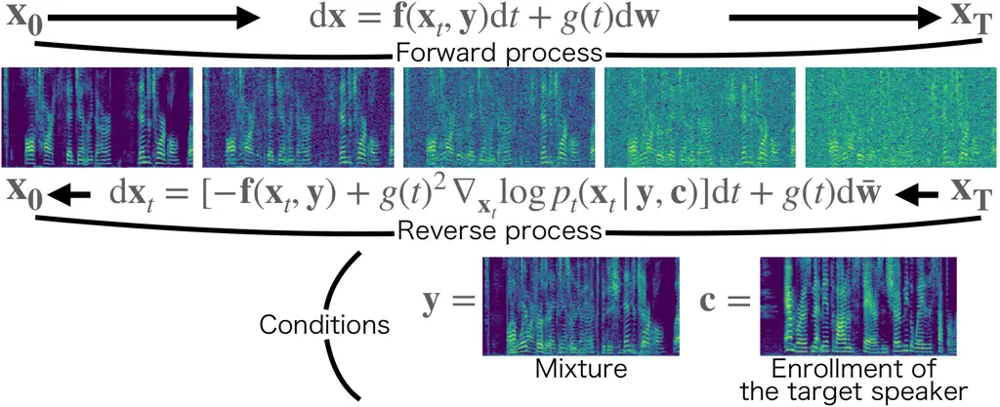
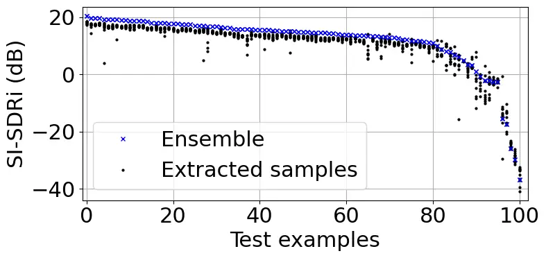
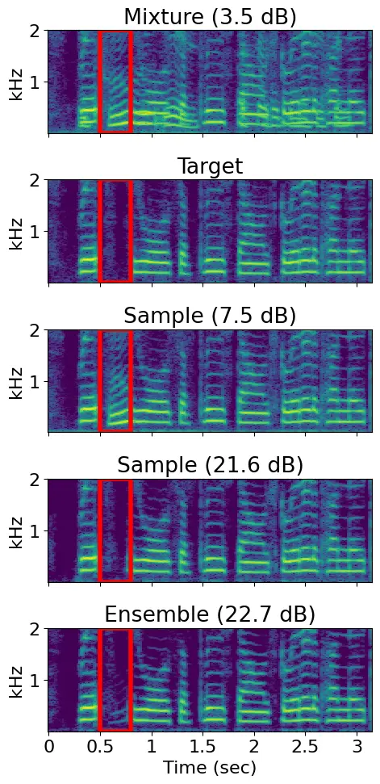
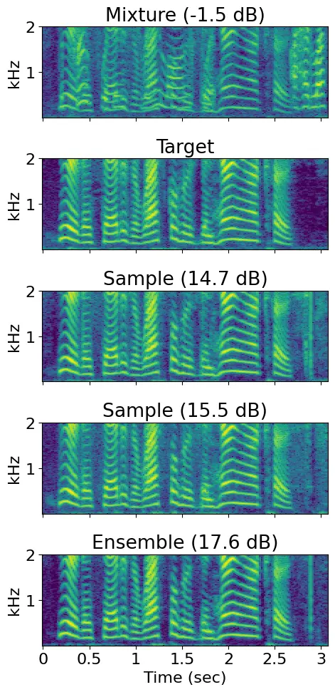

NTT Corporation, Japan

# Target Speech Extraction with Conditional Diffusion Model

Naoyuki Kamo, Marc Delcroix, Tomohiro Nakatani

###### Abstract

Diffusion model-based speech enhancement has received increased
attention since it can generate very natural enhanced signals and
generalizes well to unseen conditions. Diffusion models have been
explored for several sub-tasks of speech enhancement, such as speech
denoising, dereverberation, and source separation. In this paper, we
investigate their use for target speech extraction (TSE), which consists
of estimating the clean speech signal of a target speaker in a mixture
of multi-talkers. TSE is realized by conditioning the extraction process
on a clue identifying the target speaker. We show we can realize TSE
using a conditional diffusion model conditioned on the clue. Besides, we
introduce ensemble inference to reduce potential extraction errors
caused by the diffusion process. In experiments on Libri2mix corpus, we
show that the proposed diffusion model-based TSE combined with ensemble
inference outperforms a comparable TSE system trained discriminatively.

^(†)^(†)address: ^(†)^(†)email: naoyuki.kamo.ka@hco.ntt.co.jp,
marc.delcroix@ieee.org, tnak@ieee.org

Index Terms: target speech extraction, diffusion model, speech
enhancement

## 1 Introduction

Speech enhancement consists of estimating clean speech signals from
noisy recordings, which covers many sub-tasks such as noise reduction,
dereverberation, speech separation, and target speech extraction (TSE).
Speech enhancement research has made rapid progress with the advent of
deep learning, leading to two main directions that differ by using
discriminative or generative deep neural networks.

Discriminative approaches use a neural network trained to directly map
noisy speech to clean speech by optimizing a signal level metric between
the enhanced signal and a clean speech reference \[1\]. These approaches
are very powerful but sometimes lead to unpleasant artifacts and tend to
be sensitive to mismatched conditions between training and testing.

Generative approaches aim to model the distribution of clean speech
using deep generative models \[2, 3, 4, 5, 6\], and exploit such speech
priors to infer the clean speech from the noisy observation. Various
deep generative models have been explored for speech enhancement,
following their success in other fields. Among them, diffusion models
have recently received increased attention since they have been shown to
produce enhanced speech with high perceptual quality \[7\]. Moreover,
they appear more robust to mismatch conditions between training and
inference than discriminative models \[8\].

A diffusion model consists of a forward and reverse process \[9\]. The
_forward process_ transforms a data distribution into a known prior by
adding noise to the data. The _reverse process_ reverses this
transformation by gradually removing noise. It can be implemented using
a neural network to predict scores (score model) and an iterative
inference procedure called Langevin dynamics to generate samples.
Diffusion model-based speech enhancement has been used to reduce various
types of acoustic distortions such as background noise, reverberation,
clipping, or codec artifacts \[7\]. More recently, diffusion models have
also been used for speech separation \[10\]. However, diffusion models
have not been explored yet for TSE.

TSE aims at extracting the speech of a target speaker in a multi-talker
mixture\[11\]. Unlike other speech enhancement techniques, TSE
conditions the enhancement process on a clue that identifies the target
speaker in the mixture, such as a pre-recorded enrollment utterance of
the target speaker \[12, 13, 14, 15\] or a video of the target speaker’s
lip movements \[16, 17, 18\]. TSE is related to speech separation.
However, unlike separation, which estimates all the speakers in a
mixture, TSE outputs only the speech of the target speakers. This
difference implies that TSE does not require estimating the number of
speakers in the mixture and avoids any speaker permutation ambiguity at
the output. It is thus a practical alternative to source separation for
processing speech mixtures when target speaker clues are available.

In this paper, we propose a diffusion model-based TSE. Using diffusion
models for TSE requires conditioning the score model on the mixture and
the target speaker clue, which can be realized using a conditional
diffusion model introduced for image generation \[9, 19, 20, 21\]. We
explore two options to implement the score model, 1) a direct extension
of the discriminative TSE, called _Diff-TSE_ and 2) a multi-task (MT)
model that combines discriminative and Diff-TSE, called _Diff-TSE-MT_.
We show experimentally that the proposed Diff-TSE and Diff-TSE-MT can
extract the target speech in a mixture. However, we observe that
extraction performance depends on the samples, and the system sometimes
confuses the target and the interference. To resolve this issue, we
exploit the generative property of the model and propose performing
ensemble over multiple samples during inference. This simple approach
leads to a significant extraction performance improvement. In
particular, the proposed Diff-TSE-MT with ensemble inference outperforms
a comparable discriminative system by a large margin.

## 2 Proposed conditional diffusion model-based TSE

### 2.1 Target speech extraction (TSE)



Figure 1: Conditional diffusion process conditioned on the mixture and
the enrollment of the target speaker.

Let $`\mathbf{y}\in\mathbb{C}^{F\times L}`$ be a mixture of speech
signals in the complex spectral domain, where $`F`$ and $`L`$ are the
numbers of frequencies and time frames. TSE aims to extract the speech
signal uttered by a target speaker, $`\mathbf{x}_{0}`$, (target speech)
from the mixture, $`\mathbf{y}`$, based on a clue, $`\mathbf{c}`$,
associated with that speaker. Mathematically, TSE is defined as:

```math
\displaystyle\hat{\mathbf{x}}_{0}=\mbox{TSE}(\mathbf{y},\mathbf{c}). \tag{1}
```

where $`\hat{\mathbf{x}}_{0}`$ is the estimated target speech. In this
paper, we use an enrollment utterance by the target speaker recorded
independently of the mixture as the clue. TSE should be able to extract
any speaker in the mixture associated with the clue.

Conventionally, TSE has been performed using a neural network trained in
a discriminative way to minimize the errors between clean and estimated
target speech signals.

### 2.2 Conditional diffusion model for TSE

This paper proposes to perform TSE in a generative way with a
conditional diffusion model. The model is characterized by two
stochastic differential equations (SDEs), respectively, modeling the
forward and reverse processes \[9, 5, 6\] shown in Fig. 1. The forward
process transforms a clean speech, $`\mathbf{x}_{0}`$, to a speech
mixture corrupted with Gaussian noise. We here assume that
$`\mathbf{x}_{0}`$ follows a certain initial distribution conditioned by
a speech mixture and a clue,
$`p(\mathbf{x}_{0}|\mathbf{y},\mathbf{c})`$. The reverse process
reversely transforms a speech mixture with Gaussian noise to a clean
speech that follows the initial distribution,
$`p(\mathbf{x}_{0}|\mathbf{y},\mathbf{c})`$. To realize TSE, we use the
forward and reverse processes, respectively, for training and inference
of a TSE system.

We adopt an SDE proposed for speech enhancement \[6\] for the forward
process:

```math
\displaystyle\hskip-1.42262pt\text{d}\mathbf{x}_{t}=\underbrace{\gamma(\mathbf{y}-\mathbf{x}_{t})}_{\mathbf{f}(\mathbf{x}_{t},\mathbf{y})}{\text{d}}t+\underbrace{\left[\sigma_{0}\left(\frac{\sigma_{1}}{\sigma_{0}}\right)^{t}\sqrt{2\log\left(\frac{\sigma_{1}}{\sigma_{0}}\right)}\right]}_{g(t)}\text{d}\mathbf{w}, \tag{2}
```

where $`\mathbf{x}_{t}`$ is the state of the process at time
$`t\in[0,T]`$, $`\mathbf{f}`$ and $`g`$ are drift and diffusion
coefficient functions, and $`\mathbf{w}`$ is a standard Wiener process.
$`\gamma`$ ($`>0`$) is a stiffness parameter, and $`\sigma_{0}`$ and
$`\sigma_{1}`$ ($`>0`$) are noise scheduling parameters. This model is
conditioned on the speech mixture, $`\mathbf{y}`$, by including it in
the drift function. This causes the forward process to move from
$`\mathbf{x}_{0}`$ towards the mixture $`\mathbf{y}`$ by adding noise
with an increased variance governed by the noise scheduling parameters.

The solution to Eq. (2) for $`\mathbf{x}_{t}`$ follows the complex
Gaussian distribution, called perturbation kernel:

```math
\displaystyle p_{t}(\mathbf{x}_{t}|\mathbf{x}_{0},\mathbf{y}) \displaystyle={\cal N}_{c}({\bm{\mu}}(\mathbf{x}_{0},\mathbf{y},t),\sigma(t)^{2}\mathbf{I}), \tag{3}
```

```math
\displaystyle{\bm{\mu}}(\mathbf{x}_{0},\mathbf{y},t) \displaystyle=e^{-\gamma t}\mathbf{x}_{0}+(1-e^{-\gamma t})\mathbf{y}, \tag{4}
```

```math
\displaystyle\sigma(t)^{2} \displaystyle=\textstyle\frac{\sigma_{0}^{2}\left((\sigma_{1}/\sigma_{0})^{2t}-e^{-2\gamma t}\right)\log(\sigma_{1}/\sigma_{0})}{\gamma+\log(\sigma_{1}/\sigma_{0})}. \tag{5}
```

To use the above model for TSE, this paper newly introduces an important
assumption that differentiates the model from the conventional method
\[6\]. We assume that the initial distribution of $`\mathbf{x}_{0}`$
follows $`p(\mathbf{x}_{0}|\mathbf{y},\mathbf{c})`$, i.e., dependent not
only on the speech mixture but also on the clue. It makes the two SDEs
aware of the distribution of the clean speech dependent on the target
speaker’s clue and allows us to identify which is the target speech in
the mixture. It is essential for TSE.

With this assumption, we can derive the reverse SDE using Anderson’s
theorem \[22, 9\]:

```math
\displaystyle\hskip-2.84526pt\text{d}\mathbf{x}_{t}=[-{\mathbf{f}}(\mathbf{x}_{t},\mathbf{y})+g(t)^{2}\nabla_{\mathbf{x}_{t}}\log p_{t}(\mathbf{x}_{t}|\mathbf{y},\mathbf{c})]{\text{d}}t+g(t)\text{d}\bar{\mathbf{w}}, \tag{6}
```

where $`\bar{\mathbf{w}}`$ is a standard Wiener process in reverse time
and
$`\nabla_{\mathbf{x}_{t}}\log p_{t}(\mathbf{x}_{t}|\mathbf{y},\mathbf{c})`$
is the gradient of $`\log p_{t}(\mathbf{x}_{t}|\mathbf{y},\mathbf{c})`$
with respect to $`\mathbf{x}_{t}`$, called a conditional score.

To perform TSE with this model, we solve the reverse SDE in Eq. (6) from
$`T`$ to $`0`$ given $`\mathbf{x}_{T}`$, $`\mathbf{y}`$, and
$`\mathbf{c}`$. Here, following \[6\], we start from $`\mathbf{x}_{T}`$
sampled from the distribution shown in Eq. (3) assuming
$`{\bm{\mu}}(\mathbf{x}_{0},\mathbf{y},T)=\mathbf{y}`$ instead of
Eq. (4) because $`\mathbf{x}_{0}`$ is not available for the inference.
For realizing TSE, the condition $`\mathbf{c}`$ plays a crucial role in
constraining the estimated speech to follow the distribution conditioned
by the target speaker’s clue $`p(\mathbf{x}_{0}|\mathbf{y},\mathbf{c})`$
and not by that of the interference speech.

The conditional score
$`\nabla_{\mathbf{x}_{t}}\log p_{t}(\mathbf{x}_{t}|\mathbf{y},\mathbf{c})`$
is not readily available in general, but we can use a neural network
(score model) to approximate it \[9\]. Ideally, the score model should
minimize the following loss:

```math
\displaystyle\mathbb{E}_{t,(\mathbf{x}_{t},\mathbf{y},\mathbf{c})}\left[\|\nabla_{\mathbf{x}_{t}}\log p_{t}(\mathbf{x}_{t}|\mathbf{y},\mathbf{c})-s_{\theta}(\mathbf{x}_{t},\mathbf{y},\mathbf{c},t)\|_{2}^{2}\right], \tag{7}
```

where $`s_{\theta}(\mathbf{x}_{t},\mathbf{y},\mathbf{c},t)`$ is the
score model with a parameter set $`\theta`$,
$`\mathbb{E}_{t,(\mathbf{x}_{t},\mathbf{y},\mathbf{c})}`$ denotes the
expectation over $`t`$ and
$`\mathbf{x}_{t},\mathbf{y},\mathbf{c}\sim p_{t}(\mathbf{x}_{t},\mathbf{y},\mathbf{c})`$.
There are several techniques to train such a score model for a
conditional score \[9, 19, 20, 21\]. Here, we use a theorem showing that
minimizing the loss of Eq. (7) is equivalent to minimizing the following
loss \[23\]:

```math
\displaystyle\mathbb{E}_{t,(\mathbf{x}_{0},\mathbf{y},\mathbf{c}),(\mathbf{x}_{t}|\mathbf{x}_{0},\mathbf{y})}\left[\|\nabla_{\mathbf{x}_{t}}\log p_{t}(\mathbf{x}_{t}|\mathbf{x}_{0},\mathbf{y})-s_{\theta}(\mathbf{x}_{t},\mathbf{y},\mathbf{c},t)\|_{2}^{2}\right], \tag{8}
```

where $`\mathbb{E}_{(\mathbf{x}_{t}|\mathbf{x}_{0},\mathbf{y})}`$
denotes expectation over
$`\mathbf{x}_{t}\sim p_{t}(\mathbf{x}_{t}|\mathbf{x}_{0},\mathbf{y})`$.
The advantage of using the loss Eq. (8) is that we can calculate
$`\nabla_{\mathbf{x}_{t}}\log p_{t}(\mathbf{x}_{t}|\mathbf{x}_{0},\mathbf{y})`$
in a closed form similar to conventional diffusion models \[9, 6\].

### 2.3 Training of score model

Using Eq. (3), the conditional score in Eq. (8) becomes:

```math
\displaystyle\nabla_{\mathbf{x}_{t}}\log p_{t}(\mathbf{x}_{t}|\mathbf{x}_{0},\mathbf{y})=-\frac{\mathbf{x}_{t}-{\bm{\mu}}(\mathbf{x}_{0},\mathbf{y},t)}{\sigma(t)^{2}}. \tag{9}
```

Then, setting
$`\mathbf{x}_{t}={\bm{\mu}}(\mathbf{x}_{0},\mathbf{y},t)+\sigma(t)\mathbf{z}`$
where $`\mathbf{z}\sim{\cal N}(0,\mathbf{I})`$ based on the
reparameterization trick \[9\], we can derive the score matching
objective for $`0\leq t<T`$ from the loss (8):

```math
\displaystyle{\cal J}^{\text{score}}(\theta)=\mathbb{E}_{t,(\mathbf{x}_{0},\mathbf{y},\mathbf{c}),\mathbf{z}}\left[\left\|{s_{\theta}(\mathbf{x}_{t},\mathbf{y},\mathbf{c},t)+\frac{\mathbf{z}}{\sigma(t)}}\right\|_{2}^{2}\right]. \tag{10}
```

For $`t=T`$, because we approximate
$`{\bm{\mu}}(\mathbf{x}_{0},\mathbf{y},\mathbf{c},T)=\mathbf{y}`$ for
inference, we obtain a slightly modified objective:

```math
\displaystyle{\cal J}^{\text{score}}(\theta)=
```

```math
\displaystyle\mathbb{E}_{(\mathbf{x}_{0},\mathbf{y},\mathbf{c}),\mathbf{z}} \displaystyle\left[\left\|{s_{\theta}(\mathbf{x}_{T},\mathbf{y},\mathbf{c},T)+\frac{\mathbf{z}}{\sigma(T)}}{+\frac{e^{-\gamma T}(\mathbf{x}_{0}-\mathbf{y})}{\sigma(T)^{2}}}\right\|_{2}^{2}\right], \tag{11}
```

which corresponds to adding loss minimizing the distance between
$`{\bm{\mu}}(\mathbf{x}_{0},\mathbf{y},\mathbf{c},T)`$ obtained with
Eq. (4) and $`\mathbf{y}`$. A similar objective was introduced for
diffusion model-based source separation \[10\] except that we do not
need to consider permutation errors in the loss for TSE.

In practice, we calculate the expectation of the above objectives by
their average over data randomly sampled from a training dataset. At
each sampling, we first sample a target speaker and then sample the data
fixing the target speaker, implicitly assuming that $`\mathbf{c}`$
uniquely determines the target speaker. We set the probability to sample
$`t=T`$ and $`0\leq t<T`$ at $`\delta_{T}`$ and $`1-\delta_{T}`$ to put
a relatively large weight to Eq. (11).

### 2.4 Configurations for the score model

Figure 2: Schematic diagrams of (a) a discriminative TSE system, the
score model of the proposed (b) Diff-TSE and (c) Diff-TSE-MT. Resblock
indicates the residual block defined in NCSN++. We use an enrollment
utterance as the clue, $`\mathbf{c}`$.

We explore different configurations for the score model,
$`s_{\theta}(\mathbf{x}_{t},\mathbf{y},\mathbf{c},t)`$. These
configurations are related to the network architecture of discriminative
TSE systems and differ mainly by how we implement the conditioning on
the clue.

First, we briefly review a typical discriminative TSE system, consisting
of a clue encoder network and a speech extraction network, as shown in
Fig. 2-(a). The clue encoder network computes a target speaker embedding
vector, $`\mathbf{e}`$, from an enrollment utterance, $`\mathbf{c}`$,
using a simple network with an average pooling layer as the output
layer. The extraction network accepts the mixture and controls the
extraction on the target speaker embedding, using a fusion layer
internally. It consists of a stack of residual blocks. We use here the
multiplication fusion layer \[24\]. The output of the extraction network
is the estimated target speech, $`\hat{\mathbf{x}}_{0}`$. We train a
discriminative TSE system by optimizing the SNR between clean and
estimated target speech, i.e.,
$`{\cal J}^{\text{SNR}}(\theta^{\text{TSE}})=-\text{SNR}(\mathbf{x}_{0},\hat{\mathbf{x}}_{0})`$.

We can use a similar configuration to the TSE system for the score
model. We call this approach _Diff-TSE_. It is shown in Fig. 2-(b). We
use a similar clue encoder network to process the enrollment utterance
as discriminative TSE. The differences with the discriminative TSE
system are that the input of the extraction network consists of the
concatenation of $`\mathbf{x}_{t}`$ and the mixture $`\mathbf{y}`$, and
the output is the score. Besides, it is trained using the loss of
Eqs. (10) and (11).

As an alternative, we also explore an MT model combining discriminative
TSE and Diff-TSE shown in Fig. 2-(c). We call it _Diff-TSE-MT_. The
input of the score model is the same as that of Diff-TSE (i.e.,
$`\mathbf{x}_{t}`$, $`\mathbf{y}`$, $`\mathbf{c}`$), but we put
$`\mathbf{y}`$ and $`\mathbf{c}`$ into the discriminative TSE model to
estimate the target speech $`\hat{\mathbf{x}}_{0}`$ internally. We then
concatenate $`\hat{\mathbf{x}}_{0}`$ with $`\mathbf{x}_{t}`$ and put it
into a subsequent network to estimate the score. The score model,
including the discriminative TSE model, is trained using an MT
objective:

```math
\displaystyle{\cal J}^{\text{MT}}(\theta^{\text{TSE}},\theta^{\text{score}})=\alpha{\cal J}^{\text{SNR}}(\theta^{\text{TSE}})+\beta{\cal J}^{\text{score}}(\theta^{\text{TSE}},\theta^{\text{score}}), \tag{12}
```

where $`\alpha`$ and $`\beta`$ are multi-task weights.
$`{\cal J}^{\text{SNR}}(\theta^{\text{TSE}})`$ is computed on the output
of the discriminative TSE model. $`\theta^{\text{TSE}}`$ and
$`\theta^{\text{score}}`$ are the parameters of the TSE module and the
extraction network, respectively. Note that we train all network
parameters jointly from scratch, as for the other configurations.

### 2.5 Inference with ensemble

The inference process consists of running the reverse diffusion process
of Eq. (6), approximating the conditional score
$`\nabla_{\mathbf{x}_{t}}\log p_{t}(\mathbf{x}_{t}|\mathbf{y},\mathbf{c})`$
by the output of the score model
$`s_{\theta}(\mathbf{x}_{t},\mathbf{y},\mathbf{c},t)`$. It is solved by
the reverse sampling based on the Predictor-Corrector sampler \[9\],
starting from
$`\mathbf{x}_{T}\sim{\cal N}_{c}(\mathbf{y},\sigma(T)^{2}\mathbf{I})`$,
to $`t\approx 0`$. Note that, unlike discriminative TSE, Diff-TSE
provides access to the distribution of the target speech given the
enrollment and the mixture. We propose to exploit this property of
Diff-TSE to improve extraction performance.

In our preliminary experiments, we observed that some extracted samples
had segments where the interference speaker was extracted instead of the
target. We hypothesize that these samples may be outliers from the
posterior distribution. Therefore, to mitigate their impact, we propose
performing ensemble over several extracted samples obtained by repeating
the inference process several times with different random seeds. We
obtain the extracted speech after ensemble as,
$`\hat{\mathbf{x}}_{0}^{\text{Ens}}=\sum_{j}^{J}\hat{\mathbf{x}}_{0}^{j},`$
where $`j`$ is the sample index.

## 3 Related work

Recently, researchers have proposed techniques to condition diffusion
model-based speech enhancement on a pre-processed speech obtained by
another speech enhancement method. For example, Universal Speech
Enhancement (USE) \[7\] uses pre-processed speech as a condition of the
score model to decide what signal to generate from Gaussian noise.
Stochastic Regeneration Model (StoRM) \[25\] regenerates an improved
enhanced speech from a pre-processed one using a reverse SDE similar to
Eq. (6).

In contrast, our proposed method, Diff-TSE-MT, provides a different way
to use the pre-processed speech in the model. While our method
internally estimates and uses the pre-processed speech, it still uses
the observed speech to condition the diffusion model. An advantage of
our method is that the model can use not only the pre-processed speech
but also the observed speech to generate the target speech, which can
cover information that may be missed in the pre-processed speech. Future
work should include an experimental comparison of our method with USE
and StoRM-like conditioning schemes.

## 4 Experiments

We perform experiments using the openly available LibriMix-2spk
dataset \[26\]. We use the 100 version of the data and follow the openly
available recipe¹¹ 1
[https://github.com/butspeechfit/speakerbeam](https://github.com/butspeechfit/speakerbeam),
which defines the enrollment utterances used for each mixture in the
test set.

### 4.1 Settings

We based our implementation of Diff-TSE on the publicly available code
for diffusion-based speech enhancement,²² 2
[https://github.com/sp-uhh/sgmse](https://github.com/sp-uhh/sgmse) which
we adapted for the TSE task. We use the Noise Conditional Score Network
(NCSN++) architecture \[9, 8\] for TSE, Diff-TSE, and Diff-TSE-MT
models. The main difference is that the TSE and Diff-TSE insert the
fusion layer after the first residual block of the NSCN++ network. We
use three BLSTM layers with 1024 hidden units followed by an average
pooling layer for the clue encoder network. We use short-time Fourier
transform (STFT) coefficients with transformed amplitude as in \[8\].

We train all networks using the Adam optimizer with a learning rate
$`lr=$1\text{\times}{10}^{-4}$`$ and exponential averaging of the
network weights \[8\]. For Diff-TSE and Diff-TSE-MT training, we use
$`\delta*{T}=0.1`$ for sampling $`t=T`$. We use $`\alpha=\beta=1.0`$ for
multi-task loss in Eq. (12). For the parameters of SDE in Eq. (2), we
set $`\gamma=2`$, $`\sigma*{0}=0.05`$, and $`\sigma\_{1}=0.5`$.

For inference, we use a number of prediction steps $`N=30`$ and a step
size $`r=0.5`$. We use ten samples, i.e., $`J=10`$, when performing
ensemble inference. We measure the performance in terms of the
perceptual evaluation of speech quality (PESQ) \[27\], the extended
short-time objective intelligibility (ESTOI) \[28\], and the
scale-invariant signal-to-distortion ratio (SI-SDR) \[29\].

### 4.2 Results

|     |             |     |      |       |        |
| --- | ----------- | --- | ---- | ----- | ------ |
|     | Model       | D/G | PESQ | ESTOI | SI-SDR |
| 0   | Mixture     | \-  | 1.60 | 0.54  | 0.03   |
| 1   | TSE         | D   | 2.58 | 0.75  | 10.01  |
| 2   | Diff-TSE    | G   | 2.56 | 0.74  | 7.85   |
| 3   | +Ensemble   | G   | 2.90 | 0.76  | 9.49   |
| 4   | Diff-TSE-MT | D   | 2.60 | 0.76  | 10.71  |
| 5   | Diff-TSE-MT | G   | 2.79 | 0.77  | 9.40   |
| 6   | +Ensemble   | G   | 3.08 | 0.80  | 11.28  |

Table 1: TSE performance for different models. D/G indicates if the
model is discriminative or generative.

Table 1 compares the performance of the discriminative and
diffusion-based TSE systems. The results demonstrate that performing TSE
with a diffusion model is possible. Diff-TSE without ensemble inference
(system 2) achieves comparable PESQ and ESTOI but much lower SI-SDR than
the discriminative TSE system (system 1). However, the performance of
Diff-TSE improves with the ensemble inference (system 3).

The Diff-TSE-MT systems (systems 5 and 6) achieves superior performance
than the Diff-TSE model (system 2 and 3). Interestingly, the
discriminative TSE module within Diff-TSE-MT (system 4) outperforms the
generative Diff-TSE-MT (system 5 ) in terms of SI-SDR but performs
slightly worse in terms of PESQ and ESTOI. Diff-TSE-MT with ensemble
inference (system 6) outperforms all other systems for all metrics.

These numbers are not necessarily state-of-the-art. For example,
time-domain SpeakerBeam1 achieves PESQ, ESTOI, and SI-SDR values of
2.76, 0.81, and 12.84 dB, respectively, on the same task. In this
preliminary study, we employed the NSCN++ architecture, which was
successful for diffusion model-based noise reduction and dereverberation
but may not be optimal for speech separation\[10\] or TSE. The current
implementation of Diff-TSE-MT+Ensemble performs thus worse in terms of
SI-SDR, but better in terms of PESQ. These results demonstrate the
potential of using diffusion models for TSE and the importance of the
proposed ensemble inference. Our future work will investigate better
network architectures for Diff-TSE.

### 4.3 Analysis of the ensemble inference method



Figure 3: SI-SDRi for 100 randomly selected test examples, showing the
results of 10 extracted samples with Diff-TSE-MT (black dots), and the
ensemble inference (blue crosses).





Figure 4: Spectrogram for two representative test examples showing the
worst and best of the 10 samples generated with Diff-TSE-MT, and the
results of ensemble inference. The numbers in parentheses are the
SI-SDR.

Figure 3 shows the SI-SDR improvement (SI-SDRi) for 100 randomly
selected test examples processed with Diff-TSE-MT. We generated 10
extracted samples for each test example and computed the ensemble.
Interestingly, the ensemble inference often performs better than all of
the individual extracted samples, even when all samples had high SI-SDR
(above 10 dB).

Figure 4 shows the spectrograms of two representative text examples,
showing samples with the worst and best SI-SDR and the ensemble result.
In the left figure, the worst sample includes extraction errors shown in
the red box. However, other samples perform better. With ensemble
inference, we can mitigate the impact of the extraction error. The right
figure shows an example where all samples had high SI-SDR. Still, even
in this case, ensemble inference reveals to be effective in further
improving extraction performance by mitigating relatively minor
artifacts.

These results indicate that ensemble inference does not only mitigate
the influence of obvious extraction errors but also improves performance
in general. However, unsurprisingly, ensemble inference does not help
when all samples have a low SI-SDR (below 0 dB). These samples are often
complete extraction failures, where TSE extracts mostly the interference
speaker.

## 5 Conclusions

In this paper, we proposed a diffusion model-based TSE system
implemented using a conditional diffusion model. We presented two
approaches for implementing the score model and introduced an ensemble
inference scheme to mitigate extraction errors. We showed that the
proposed diffusion model-based TSE outperforms a comparable
discriminative TSE model in terms of PSEQ, ETOI, and SI-SDR.

In our future work, we will investigate approaches to reduce extraction
failures of Diff-TSE by exploring other network configurations \[15\]
and generating more discriminative speaker embeddings \[30, 31\].

## References

- \[1\] D. Wang and J. Chen, “Supervised speech separation based on deep
  learning: An overview,” _IEEE/ACM Transactions on Audio, Speech, and
  Language Processing_, vol. 26, no. 10, pp. 1702–1726, 2018.
- \[2\] S. Pascual, A. Bonafonte, and J. Serrà, “SEGAN: Speech
  Enhancement Generative Adversarial Network,” in _Proc. Interspeech_,
  2017, pp. 3642–3646.
- \[3\] Y. Bando, M. Mimura, K. Itoyama, K. Yoshii, and T. Kawahara,
  “Statistical speech enhancement based on probabilistic integration of
  variational autoencoder and non-negative matrix factorization,” in
  _Proc. IEEE International Conference on Acoustics, Speech and Signal
  Processing (ICASSP)_, 2018, pp. 716–720.
- \[4\] J. Zhang, S. Jayasuriya, and V. Berisha, “Restoring Degraded
  Speech via a Modified Diffusion Model,” in _Proc. Interspeech_, 2021,
  pp. 221–225.
- \[5\] Y.-J. Lu, Z.-Q. Wang, S. Watanabe, A. Richard, C. Yu, and
  Y. Tsao, “Conditional diffusion probabilistic model for speech
  enhancement,” in _Proc. IEEE International Conference on Acoustics,
  Speech and Signal Processing (ICASSP)_, 2022, pp. 7402–7406.
- \[6\] S. Welker, J. Richter, and T. Gerkmann, “Speech enhancement with
  score-based generative models in the complex STFT domain,” in _Proc.
  Interspeech_, 2022, pp. 2928–2932.
- \[7\] J. Serrà, S. Pascual, J. Pons, R. O. Araz, and D. Scaini,
  “Universal speech enhancement with score-based diffusion,”
  _arXiv:2206.03065v2_, 2022.
- \[8\] J. Richter, S. Welker, J.-M. Lemercier, B. Lay, and T. Gerkmann,
  “Speech enhancement and dereverberation with diffusion-based
  generative models,” _arXiv:2208.05830v1_, 2022.
- \[9\] Y. Song, J. Sohl-Dickstein, D. P. Kingma, A. Kumar, S. Ermon,
  and B. Poole, “Score-based generative modeling through stochastic
  differential equations,” in _Proc. International Conference on
  Learning Representations (ICLR)_, 2021.
- \[10\] R. Scheibler, Y. Ji, S.-W. Chung, J. Byun, S. Choe, and M.-S.
  Choi, “Diffusion-based generative speech source separation,”
  _arXiv:2210.17327v2_, 2022.
- \[11\] K. Žmolíková, M. Delcroix, T. Ochiai, K. Kinoshita,
  J. Černockỳ, and D. Yu, “Neural target speech extraction: An
  overview,” _arXiv:2301.13341_, 2023.
- \[12\] K. Žmolíková, M. Delcroix, K. Kinoshita, T. Higuchi, A. Ogawa,
  and T. Nakatani, “Speaker-aware neural network based beamformer for
  speaker extraction in speech mixtures,” in _Proc. Interspeech_, 2017,
  pp. 2655–2659.
- \[13\] Q. Wang, H. Muckenhirn, K. Wilson, P. Sridhar, Z. Wu, J. R.
  Hershey, R. A. Saurous, R. J. Weiss, Y. Jia, and I. L. Moreno,
  “VoiceFilter: Targeted Voice Separation by Speaker-Conditioned
  Spectrogram Masking,” in _Proc. Interspeech_, 2019, pp. 2728–2732.
- \[14\] K. Žmolíková, M. Delcroix, K. Kinoshita, T. Ochiai,
  T. Nakatani, L. Burget, and J. Černockỳ, “SpeakerBeam: Speaker aware
  neural network for target speaker extraction in speech mixtures,”
  _IEEE Journal of Selected Topics in Signal Processing_, vol. 13,
  no. 4, pp. 800–814, 2019.
- \[15\] M. Ge, C. Xu, L. Wang, E. S. Chng, J. Dang, and H. Li, “SpEx+:
  A Complete Time Domain Speaker Extraction Network,” in _Proc.
  Interspeech_, 2020, pp. 1406–1410.
- \[16\] A. Ephrat, I. Mosseri, O. Lang, T. Dekel, K. Wilson,
  A. Hassidim, W. T. Freeman, and M. Rubinstein, “Looking to listen at
  the cocktail party: a speaker-independent audio-visual model for
  speech separation,” _ACM Transactions on Graphics (TOG)_, vol. 37,
  no. 4, pp. 1–11, 2018.
- \[17\] T. Afouras, J. S. Chung, and A. Zisserman, “The Conversation:
  Deep Audio-Visual Speech Enhancement,” in _Proc. Interspeech_, 2018,
  pp. 3244–3248.
- \[18\] A. Owens and A. A. Efros, “Audio-visual scene analysis with
  self-supervised multisensory features,” in _Proc. the European
  Conference on Computer Vision (ECCV)_, 2018, pp. 631–648.
- \[19\] Y. Tashiro, J. Song, Y. Song, and S. Ermon, “CSDI: Conditional
  score-based diffusion models for probabilistic time series
  imputation,” in _Advances in Neural Information Processing Systems_,
  vol. 34. Curran Associates, Inc., 2021, pp. 24 804–24 816.
- \[20\] P. Dhariwal and A. Nichol, “Diffusion models beat gans on image
  synthesis,” in _Advances in Neural Information Processing Systems_,
  vol. 34. Curran Associates, Inc., 2021, pp. 8780–8794.
- \[21\] J. Ho and T. Salimans, “Classifier-free diffusion guidance,” in
  _NeurIPS workshop on Deep Generative Models and Downstream
  Applications_, 2021.
- \[22\] B. D. Anderson, “Reverse-time diffusion equation models,”
  _Stochastic Processes and their Applications_, no. 3, pp.
  313–326, 1982.
- \[23\] G. Batzolis, J. Stanczuk, C.-B. Schönlieb, and C. Etmann,
  “Conditional image generation with score-based diffusion models,”
  _arXiv:2111.13606v1_, 2021.
- \[24\] M. Delcroix, K. Žmolíková, T. Ochiai, K. Kinoshita, S. Araki,
  and T. Nakatani, “Compact network for SpeakerBeam target speaker
  extraction,” in _Proc. IEEE International Conference on Acoustics,
  Speech and Signal Processing (ICASSP)_, 2019.
- \[25\] J.-M. Lemercier, J. Richter, S. Welker, and T. Gerkmann,
  “StoRM: A diffusion-based stochastic regeneration model for speech
  enhancement and dereverberation,” _arXiv:2212.11851v1_, 2022.
- \[26\] J. Cosentino, M. Pariente, S. Cornell, A. Deleforge, and
  E. Vincent, “Librimix: An open-source dataset for generalizable speech
  separation,” _arXiv:2005.11262v1_, 2020.
- \[27\] A. W. Rix, J. G. Beerends, M. P. Hollier, and A. P. Hekstra,
  “Perceptual evaluation of speech quality (PESQ)-a new method for
  speech quality assessment of telephone networks and codecs,” in _Proc.
  IEEE International Conference on Acoustics, Speech and Signal
  Processing (ICASSP)_, vol. 2, 2001, pp. 749–752.
- \[28\] A. H. Andersen, J. M. de Haan, Z.-H. Tan, and J. Jensen,
  “Refinement and validation of the binaural short time objective
  intelligibility measure for spatially diverse conditions,” _Speech
  Communication_, vol. 102, pp. 1–13, 2018.
- \[29\] J. Le Roux, S. Wisdom, H. Erdogan, and J. R. Hershey, “SDR –
  half-baked or well done?” in _Proc. IEEE International Conference on
  Acoustics, Speech and Signal Processing (ICASSP)_, 2019, pp. 626–630.
- \[30\] M. Delcroix, T. Ochiai, K. Žmolíková, K. Kinoshita, N. Tawara,
  T. Nakatani, and S. Araki, “Improving speaker discrimination of target
  speech extraction with time-domain speakerbeam,” in _Proc. IEEE
  International Conference on Acoustics, Speech and Signal Processing
  (ICASSP)_, 2020, pp. 691–695.
- \[31\] S. Mun, S. Choe, J. Huh, and J. S. Chung, “The sound of my
  voice: Speaker representation loss for target voice separation,” in
  _Proc. IEEE International Conference on Acoustics, Speech and Signal
  Processing (ICASSP)_, 2020, pp. 7289–7293.
