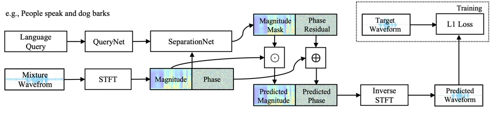
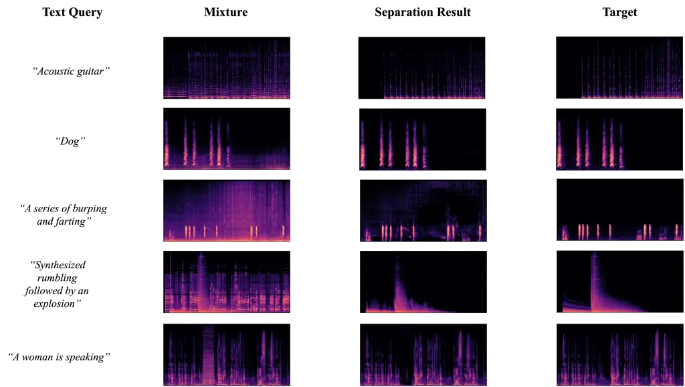
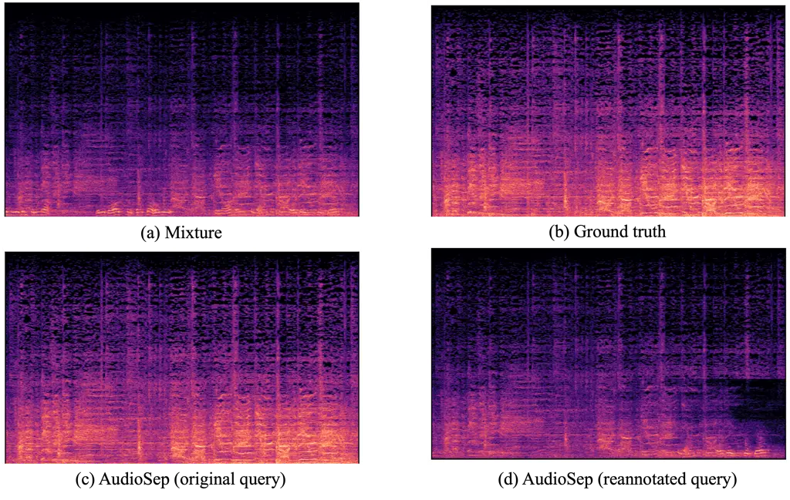
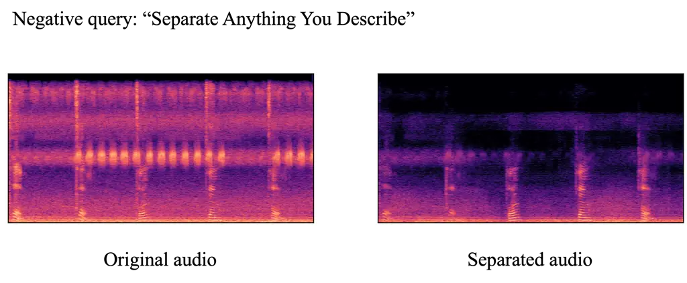

# Separate Anything You DescribeThanks: Xubo Liu, Haohe Liu, Yi Yuan, Mark D. Plumbley, and Wenwu Wang are with the Centre for Vision, Speech and Signal Processing (CVSSP), University of Surrey, Guilford, UK. Email: {xubo.liu, haohe.liu, yi.yuan, m.plumbley, w.wang}@surrey.ac.uk.Thanks: Qiuqiang Kong, Yan Zhao, Yuzhuo Liu, Rui Xia, and Yuxuan Wang: are with the Speech, Audio & Music Intelligence (SAMI) Group, ByteDance Inc. Email: {kongqiuqiang, zhao.yan, liuyuzhuo.999, rui.xia, wangyuxuan.11}@bytedance.com.

Xubo Liu    Qiuqiang Kong    Yan Zhao    Haohe Liu    Yi Yuan    Yuzhuo
Liu Affiliation: Rui Xia, Yuxuan Wang, Mark D. Plumbley, Wenwu Wang
Affiliation: [https://audio-agi.github.io/Separate-Anything-You-Describe](https://audio-agi.github.io/Separate-Anything-You-Describe)

###### Abstract

Language-queried audio source separation (LASS) is a new paradigm for
computational auditory scene analysis (CASA). LASS aims to separate a
target sound from an audio mixture given a natural language query, which
provides a natural and scalable interface for digital audio
applications. Recent works on LASS, despite attaining promising
separation performance on specific sources (e.g., musical instruments,
limited classes of audio events), are unable to separate audio concepts
in the open domain. In this work, we introduce AudioSep, a foundation
model for open-domain audio source separation with natural language
queries. We train AudioSep on large-scale multimodal datasets and
extensively evaluate its capabilities on numerous tasks including audio
event separation, musical instrument separation, and speech enhancement.
AudioSep demonstrates strong separation performance and impressive
zero-shot generalization ability using audio captions or text labels as
queries, substantially outperforming previous audio-queried and
language-queried sound separation models. Specifically, AudioSep
achieved strong results including a Signal-to-Distortion Ratio
Improvement (SDRi) of 7.74 dB across 527 sound classes of the AudioSet;
9.14 dB on the VGGSound dataset; 8.22 dB on the AudioCaps dataset; 6.85
dB on the Clotho dataset; 10.51 dB on the MUSIC dataset; 10.04 dB on the
ESC-50 dataset; 8.16 dB on the DCASE 2024 Task 9 dataset; and an SSNR of
9.21 dB on the Voicebank-Demand dataset. For reproducibility of this
work, we released the source code, evaluation benchmark and pre-trained
model at:
[https://github.com/Audio-AGI/AudioSep](https://github.com/Audio-AGI/AudioSep).

###### Index Terms: 

sound separation, language-queried audio source separation (LASS),
natural language processing.

## I Introduction

Computational auditory scene analysis (CASA) \[1\] aims to design
machine listening systems that perceive complex sound environments in a
similar way to the human auditory system. As a fundamental research task
for CASA, sound separation aims to separate real-world sound recordings
into individual source tracks, also known as the “cocktail party
problem” \[2\]. Sound separation has a wide range of applications,
including audio event separation \[3, 4\], music source separation
\[5\], and speech enhancement \[6, 7\].

Many previous works on sound separation mainly focus on separating one
or a few sources, such as in speech enhancement \[6, 7\], speech
separation \[8, 9\], and music source separation \[5\]. Recently,
universal sound separation (USS) \[4\] has attracted many research
interests. USS aims to separate arbitrary sounds in real-world sound
recordings. Separating every sound source from a mixture is challenging
due to the wide variety of sound sources existing in the world. As an
alternative, query-based sound separation (QSS) has been proposed which
aims to separate specific sound sources conditioned on a piece of query
information. QSS allows users to extract desired audio sources which
could be useful in many applications such as automatic audio editing
\[10\] and multimedia content retrieval \[11\]. Using the query of
different modalities such as vision \[12, 13, 14\], audio \[15, 16, 17,
18\] or event labels \[19, 20, 21, 22\] for sound separation has been
investigated in the literature.

Recently, a new paradigm of QSS has been proposed, known as
language-queried audio source separation (LASS) \[3\]. LASS is the task
of separating arbitrary sound sources using natural language
descriptions of the desired source. LASS provides a potentially useful
tool for future digital audio applications, allowing users to extract
desired audio sources via natural language instructions. The use of
natural language queries offers significant advantages, compared to
previous audio-visual \[12, 13, 14\] or audio-queried \[15, 16, 17, 18\]
methods, such as flexible and convenient acquisition of query
information. Compared to label-queried \[19, 20, 21, 22\] methods that
usually pre-define a fixed set of label categories, LASS does not limit
the scope of input queries and can be seamlessly generalized to open
domain.

The challenge of learning a LASS system is associated with the
complexity and variability of natural language expressions. The text
query description could range from sophisticated descriptions of
multiple sound sources, such as “people speaking followed by music
playing with a rhythmic beat” to simple and compact phrases such as
“speech, music”. In addition, the same audio source can be delivered
with diverse language expressions, such as “music is being played with a
rhythmic beat” or “an upbeat music melody is playing over and over
again”. LASS not only requires these phrases and their relationships to
be captured in the language description but also that one or more sound
sources that match the language query should be separated from the audio
mixture.

Our original approach \[3\] for LASS relies on supervised learning with
labeled audio-text paired data. However, such annotated audio-text data
is limited in size. To overcome the data scarcity issue, recent
advancements have investigated training LASS with multimodal supervision
\[23, 24, 25\]. The key idea behind this approach is to leverage
multimodal contrastive pre-training models such as the contrastive
language-image pretraining (CLIP) model, as the query encoder. As
contrastive learning is capable of aligning text embedding with other
modalities (e.g., vision), it enables the training of the LASS system
using data-rich modalities and facilitates inference with text in a
zero-shot mode. However, existing LASS methods leverage small-scale data
for training and focus on separating restricted source types, such as
musical instruments and a limited set of sound events. The potential to
generalize LASS to open-domain scenarios, such as hundreds of real-world
sound sources, has not yet been fully explored. Furthermore, previous
works on LASS evaluate model performance on each domain-specific test
set, which makes future comparison and reproduction inconvenient and
inconsistent.

In this work, our goal is to establish a foundation model for sound
separation with natural language descriptions. Our focus is on the
development of a sound separation model, leveraging large-scale
datasets, to enable robust generalization in open-domain scenarios. With
this model, we aim to holistically address the separation of a diverse
range of sound sources. This work constitutes an extension of our
previous research, as presented in the Interspeech proceeding \[3\]. The
contribution of this work includes:

- •
  We introduce AudioSep, a foundation model for open-domain, universal
  sound separation with natural language queries. AudioSep is trained
  with large-scale audio datasets and has shown strong separation
  performance and impressive zero-shot generalization capabilities.
  LASS-Net model presented in the Interspeech work did not perform well
  in open-domain scenarios.
- •
  We extensively evaluate AudioSep. We construct a comprehensive
  evaluation benchmark for LASS research, involving numerous sound
  separation tasks such as audio event separation, musical instrument
  separation, and speech enhancement. We show that AudioSep
  substantially outperforms off-the-shelf audio-queried sound separation
  and state-of-the-art LASS models. AudioSep delivered strong results,
  such as an SDRi of $`7.74`$ dB over $`527`$ sound classes of the
  AudioSet; $`9.14`$ dB on the VGGSound dataset; $`8.22`$ dB on the
  AudioCaps dataset; $`6.85`$ dB on the Clotho dataset; $`10.51`$ dB on
  the MUSIC dataset; $`10.04`$ dB on the ESC-50 dataset; $`8.16`$ dB on
  the DCASE 2024 Task 9 dataset; and an SSNR of $`9.21`$ dB on the
  Voicebank-Demand dataset.
- •
  We conduct in-depth ablation studies to investigate the impact of
  scaling up AudioSep using large-scale multimodal supervision \[23, 24,
  25\]. Our findings provide valuable insights for future research.
- •
  We released the source code, evaluation benchmark, and pre-trained
  model at:
  [https://github.com/Audio-AGI/AudioSep](https://github.com/Audio-AGI/AudioSep)
  to promote research in this area.

## II Related Work

### II-A Audio Source separation

Audio source separation \[26\] is a fundamental technique in signal
processing, aimed at extracting independent source signals from their
mixtures without prior knowledge of the mixing process. In recent years,
audio source separation has shown significant advancements through
integrating deep learning models \[8\]. Most deep learning-based source
separation systems adopt the supervised learning approach, which usually
requires the creation of simulated target and mixture sources and the
developing of audio-to-audio mapping models. These mapping models
generally fall into two categories: time domain-based and frequency
domain-based approaches. Time domain-based methods focus on mapping
directly onto the audio waveform, such as WaveUNet \[27\],
ConvTasNet \[9\], and Demucs \[28\]. Frequency domain-based approaches
conduct source separation within the spectral domain. While direct
mapping on the audio spectrogram for audio source separation has
demonstrated success \[29\], the mask-estimation-based methods, such as
the estimation of ideal ratio masks \[30\], is still the most widely
used approach in the frequency domain source separation. Recent work has
also explored the integration of both time and frequency
supervisions \[31\] to further enhance the performance and robustness
systems. Besides the mapping-based approach, deep clustering-based
methods \[32, 33\] have also shown promising results on speech
separation based on the learning of a representation space with
contrastive objectives.

### II-B Universal sound separation

A substantial amount of source separation research has been concentrated
on domain-specific sound separation, focusing primarily on areas such as
speech \[8, 9\] or music \[5\]. Universal sound separation (USS) \[4\]
aims to separate a mixture of arbitrary sound sources in terms of their
classes. The challenge inherent in USS is the diversity of sound classes
in real-world scenarios, which increases the difficulty of separating
all of these sound sources with a single sound separation system. The
work in \[4\] reported promising results on separating arbitrary sounds
using permutation invariant training (PIT) \[34\], a supervised method
initially designed for speech separation. The PIT method uses synthetic
training mixtures simulated from single-source ground truth, performing
sub-optimally due to a mismatch in the distribution between these
synthetic mixtures and real-world sound recordings. Furthermore, it is
not feasible to record a large database of single sources for PIT, as
such sound recordings are often tainted by cross-talk. An unsupervised
method called mixture invariant training (MixIT) \[35\] was proposed for
sound separation using noisy audio mixtures. MixIT has achieved
competitive performance compared to supervised methods (e.g., PIT),
showing substantial improvements in reverberant sound separation
performance. Both PIT and MixIT methods need a post-selection process to
classify separated sources into specific sound classes.

### II-C Query-based sound separation

Query-based sound separation (QSS), also known as target source
extraction, aims to separate a specific source from an audio mixture
given some query information. Existing QSS approaches could be divided
into three categories: audio-visual, audio-queried, and label-queried.

#### II-C1 Audio-visual sound separation

In the computer vision community, there has been active research
focusing on utilizing visual information to extract target sounds in
speech \[36, 37\], music \[12\], and acoustic events \[13\]. AudioScope
\[14\] has been recently proposed to perform on-screen sound separation
based on the MixIT method. Such vision-queried approaches are beneficial
for automatically decomposing sound sources from audio-visual video
data. However, their performance is affected by the dynamic visibility
conditions of visual objects, and can be degraded in environments with
visual occlusion or low-light conditions. In addition, video data often
contains off-screen sounds. Learning from noisy video data is a key
challenge for audio-visual sound separation systems \[14, 23\].

#### II-C2 Audio-queried sound separation

Another line of research leverages the audio modality as a query to
separate acoustically similar sounds. Recent studies \[17, 18, 38\] have
addressed the problem of using one or a few examples of a target source
as the query to separate a particular sound source: this is known as
one-shot or few-shot sound separation. These methods separate the target
sound conditioned on the average audio embedding of a few audio examples
of the target source, which requires labeled single sources for
calculating query embedding during training. The work in \[15, 16\]
proposes to train the audio-queried sound separation system with
large-scale weakly labeled data (e.g., AudioSet \[39\]), by first using
a sound event detection model \[40\] to detect the anchor segment of
sound events which are further used to constitute the artificial
mixtures for the training of audio-queried sound separation models.
These audio-queried sound separation approaches have shown great
potential in the separation of unseen sound sources. However, during
test time, the preparation of reference audio samples for the desired
sound is often a time-consuming process.

#### II-C3 Label-queried sound separation

An intuitive way to query a specific sound source is to use the label of
its sound class \[19, 20, 21, 22\]. Although acquiring a label query
involves less effort than acquiring an audio or visual query, the label
set is often pre-defined and is limited to a finite set of source
categories. This imposes a challenge when attempting to generalize the
separation system into an open-domain scenario, which may require
re-training the sound separation model, or the use of continual learning
methods \[20, 41\]. Label lacks the capability to describe the
relationship between multiple sound events, such as their spatial
relation and temporal order. This poses a challenge when the user
intends to separate multiple sources rather than a single sound event.

### II-D Language-queried audio source separation

Language-queried audio source separation (LASS) is a recently proposed
new paradigm of QSS. LASS uses a natural language description of an
arbitrary target source to separate the source from an audio mixture.
Such natural language descriptions can include auxiliary information for
describing the target source, such as spatial and temporal relationships
of sound events, for example “a dog barks in the background” or “people
applaud followed by a woman speaking”.

LASS-Net \[3\] was our first attempt to perform end-to-end
language-queried sound separation. LASS-Net consists of a language query
encoder and a separation model. The separation model performs target
source separation in the frequency domain and the target waveform is
reconstructed using the noisy phase and inverse short-time Fourier
transform (iSTFT). LASS-Net is trained on a subset ($`\sim`$$`17.3`$
hours, $`33`$ sound categories) of the AudioCaps \[42\] dataset and has
shown great success in separating a wide range of sounds using audio
caption queries. Kilgour et al. \[24\] proposed a similar model that
accepts audio or text queries in a hybrid manner. Tzinis et al. \[43\]
propose an optimal condition training (OCT) strategy for LASS. OCT
performs greedy optimization toward the highest-performing condition
among multiple conditions (e.g., signal energy, harmonicity) associated
with a given target source, to improve the separation performance.

These LASS methods \[3, 24, 43\] require labeled text-audio paired data
for supervised training, while such labeled data is often limited in
practice. Recent work \[23, 25\] has investigated the potential of a
self-supervised approach for LASS, including leveraging the visual
modality as a bridge to learn the desired audio-textual correspondence.
Instead of using a pre-trained language model (e.g., BERT \[44\]) \[3\],
Dong et al. \[23\] use the contrastive language-image pretraining (CLIP)
\[45\] model as the query encoder and train a LASS model conditioned on
the visual context of unlabeled noisy videos. Thanks to the aligned
embedding space learned by the CLIP model, at the inference time, the
separation model can be queried with text inputs in a zero-shot setting.
Experimental results show that combining text and image conditions for
hybrid training leads to better text-queried sound separation
performance on musical instrument separation. Although preliminary
studies have been undertaken into LASS, existing approaches work under
the constraints of limited-source scenarios, such as musical instruments
and a restricted set of universal sound classes. As such, these
approaches have not met the expectation of LASS for zero-shot,
open-domain sound separation.

### II-E Multimodal audio-language learning

Recently, the field of multi-modal audio-language has emerged as an
important research area in audio signal processing and natural language
processing. Audio-language tasks hold potential in various application
scenarios. For instance, automatic audio captioning \[46, 47\] aims to
provide meaningful language descriptions of audio content, benefiting
the hearing-impaired in comprehending environmental sounds.
Language-based audio retrieval \[48, 49\] facilitates efficient
multimedia content retrieval and sound analysis for security
surveillance. Text-to-audio generation \[50, 51, 52, 53, 54, 55\] aims
to synthesize audio content based on language descriptions, serving as
sound synthesis tools for film-making, game design, virtual reality, and
digital media, and aiding text understanding for the visually impaired.
Contrastive language-audio pre-training (CLAP) \[56\] aims to learn an
aligned audio-text embedding space via contrastive learning. CLAP
facilitates downstream audio-text multimodal tasks (e.g., zero-shot
audio classification) \[57, 50\]. In this work, we focus on the
intersection between audio source separation and natural language
processing, which is an important field for CASA research but less
explored.

## III Method



Fig. 1: Framework of AudioSep. AudioSep has two key components: a
QueryNet and a SeparationNet. The QueryNet is the text encoder of CLIP
\[45\] or CLAP \[56\] model. The SeparationNet is a frequency-domain
ResUNet \[5, 15\] model.

We introduce AudioSep, a foundation model for open-domain sound
separation with natural language queries. AudioSep has two key
components: a QueryNet and a SeparationNet, as illustrated in Figure 1.
We will introduce the details of each component below.

### III-A QueryNet

For QueryNet, we use the text encoder of the contrastive language-audio
pre-training model (CLAP) \[56\]. The QueryNet is used to extract the
text embedding of the natural language query. The input text query is
denoted as $`q=\{q_{n}\}_{n=1}^{N}`$, consisting of a sequence of $`N`$
word tokens. The sequence is processed by a text encoder to obtain the
text embedding for the input language query. The text encoder encodes
the input text tokens via a stack of Transformer blocks. After passing
through the transformer layers, the output representations are
aggregated, resulting in a fixed-length $`D`$-dimensional vector
representation, where $`D`$ corresponds to the latent dimension of the
CLAP model. The text encoder is frozen during training.

### III-B SeparationNet

For SeparationNet, we apply the frequency-domain ResUNet model \[5, 15\]
as the separation backbone. The input to the ResUNet model is a mixture
of audio clips. First, we apply a short-time Fourier transform (STFT) on
the waveform to extract the complex spectrogram
$`X\in\mathbb{C}^{T\times F}`$, the magnitude spectrogram and phase of
$`X`$ are denoted as $`|X|`$ and $`e^{j{\angle}X}`$, where
$`X=|X|e^{j{\angle}X}`$. Then, we follow the same setting of \[15\], and
we construct an encoder-decoder network to process the magnitude
spectrogram. The ResUNet encoder-decoder comprises $`6`$ encoder blocks,
$`4`$ bottleneck blocks, and $`6`$ decoder blocks. In each encoder
block, the spectrogram is downsampled into a bottleneck feature using
$`4`$ residual convolutional blocks, while each decoder block utilizes
$`4`$ residual deconvolutional blocks to upsample the feature and obtain
the separation components. A skip connection is established between each
encoder block and the corresponding decoder block, operating at the same
downsampling/upsampling rate. The residual block consists of $`2`$ CNN
layers, $`2`$ batch normalization layers, and $`2`$ Leaky-ReLU
activation layers. Furthermore, we introduce an additional residual
shortcut connecting the input and output of each residual block. The
ResUNet model inputs the complex spectrogram $`X`$ and outputs the
magnitude mask $`|M|`$ and the phase residual $`{\angle}M`$ conditioned
on the text embedding $`e_{q}`$. $`|M|`$ controls how much the magnitude
of $`|X|`$ should be scaled, and the angle $`\angle{M}`$ controls how
much the angle of $`\angle{X}`$ should be rotated. The separated complex
spectrogram can be obtained by multiplying the STFT of the mixture and
the predicted magnitude mask $`|M|`$ and phase residual $`\angle{X}`$:

```math
\hat{S}=|M|\odot|X|e^{j(\angle{X}+\angle{M})}, \tag{1}
```

where $`\odot`$ is the Hadamard product. The SeparationNet performs
time-frequency masking in the magnitude domain, supplemented by phase
correction relative to the noisy phase. An alternative approach is
complex spectral mapping (CSM) \[29\], which predicts the real and
imaginary spectrograms jointly and has been shown to perform better than
time-frequency masking in speech enhancement task. However, in this
work, we focus on the time-frequency masking-based approach.

To bridge the text encoder and the separation model, we use a
Feature-wise Linearly modulated (FiLm) layer \[58\] after each ConvBlock
deployed in the ResUNet. Specifically, let
$`H^{(l)}\in\mathbb{R}^{m\times h\times w}`$ denote the output feature
map produced by ConvBlock $`l`$ with $`m`$ channels, here $`h`$ and
$`w`$ are the height and width of the feature map $`H^{(l)}`$,
respectively. The modulation parameters are applied per feature map
$`H^{(l)}_{i}`$ with the FiLm layer as follows:

```math
\operatorname{FiLM}(H^{(l)}_{i}|\gamma^{(l)}_{i},\beta^{(l)}_{i})=\gamma^{(l)}_{i}H^{(l)}_{i}+\beta^{(l)}_{i} \tag{2}
```

where $`H^{(l)}_{i}\in\mathbb{R}^{h\times w}`$, and
$`\gamma^{(l)},\beta^{(l)}\in\mathbb{R}^{m}`$ are the modulation
parameters from $`g(.)`$, i.e., $`(\gamma,\beta)=g(e_{q})`$, such that
$`g(.)`$ is a neural network and $`e_{q}`$ is the text embedding
obtained from the text encoder. In this work, we model $`g(\cdot)`$ with
two fully connected layers followed by ReLU activation, which is jointly
trained with the ResUNet separation model.

### III-C Loss and training

During training, we use the loudness augmentation method proposed in
\[15\]. When constituting the mixture $`x`$ with $`s_{1}`$ and
$`s_{2}`$, we first calculate the energy of $`s_{1}`$ and $`s_{2}`$ as
$`E_{1}`$ and $`E_{2}`$ by $`E=\left\lVert s\right\lVert_{2}^{2}`$. We
then determine a desired Signal-to-Noise Ratio (SNR) in decibels (dB),
denoted as $`\text{SNR}_{\text{dB}}`$, which is randomly chosen from the
range $`[-15,15]`$ dB. The scaling factor $`\alpha`$ is then calculated
using the formula:

```math
\alpha=\sqrt{\frac{E_{1}}{E_{2}}\cdot 10^{\text{SNR}_{\text{dB}}/10}}
```

This scaling factor ensures that the mixture $`x`$ has the specified
SNR. The mixture $`x`$ is then formed as follows:

```math
x=s_{1}+\alpha s_{2}. \tag{3}
```

We train AudioSep end-to-end using an L1 loss function between the
predicted and target waveforms. Since waveform-based L1 loss is simple
to implement and has shown good performance on universal sound
separation tasks \[15\].

```math
\operatorname{Loss}_{L1}=\left\lVert s-\hat{s}\right\lVert_{1} \tag{4}
```

The lower L1 loss value indicates that the separated signal $`\hat{s}`$
is closer to the ground truth signal $`s`$.

### III-D Connections to the prior works

The design of the AudioSep model is extended from our previous works,
LASS-Net \[3\] and USS-ResUNet \[15\]. LASS-Net is a model for
language-queried sound separation, while USS-ResNet is a model for
audio-queried sound separation. The separation network, ResUNet, is the
same across AudioSep, LASS-Net, and USS-ResNet. For the text encoder in
AudioSep, we use CLAP \[56\], which connects language and audio through
an audio encoder and a text encoder via a contrastive learning
objective. The CLAP model brings audio and text descriptions into a
joint audio-text latent space, which facilitates effective audio-text
representation learning.

## IV Datasets and Evaluation Benchmark

In this section, we provide a detailed description of the training
dataset used for AudioSep, along with the established evaluation
benchmark. The statistics of the dataset are presented in Tables I and
II.

### IV-A Training datasets

#### IV-A1 AudioSet

AudioSet \[39\] is a large-scale, weakly-labelled audio dataset with
$`2`$ million $`10`$-second audio snippets sourced from YouTube. Each
clip in the collection is categorised by the presented sound classes,
without the timing information of sound events. AudioSet includes an
ontology¹¹ 1
[https://research.google.com/audioset/ontology/index.html](https://research.google.com/audioset/ontology/index.html)
of $`527`$ distinct sound classes, such as “Human sounds”, “Music”,
“Natural Sounds”, among others. The training set comprises
$`2\,063\,839`$ clips, including a balanced subset of $`22\,160`$ audio
clips. For each sound class in the balanced subset, there are at least
$`50`$ audio clips. After accounting for unavailable YouTube links, we
were able to download $`1\,934\,187`$ audio clips with their
corresponding video streams, equating to $`94`$% of the complete
training set. All the clips are either padded with silence or cut short
to a duration of $`10`$ seconds. Since a large amount of YouTube audio
recordings have a sampling rate below $`32`$ kHz, we have converted all
audio recordings to a mono format and resampled them at $`32`$ kHz. All
audio clips within the training set are used as training data.

#### IV-A2 VGGSound

VGGSound \[59\] is a large-scale audio-visual dataset sourced from
YouTube. VGGSound contains nearly $`200\,000`$ video clips each of
length $`10`$ seconds, annotated across $`309`$ sound classes consisting
of human actions, sound-emitting objects, and human-object interactions.
The creation process of VGGSound has ensured that the object producing
each sound is also discernible in the corresponding video clip. We
utilize the original version of the VGGSound dataset, which includes
$`183\,727`$ audio-visual clips for training and $`15\,449`$ for
testing. We resample all audio clips at $`32`$ kHz. All data within the
training split are used for training.

#### IV-A3 AudioCaps

AudioCaps \[42\] is the largest publicly available audio captioning
dataset, with $`50\,725`$ $`10`$-second audio clips sourced from
AudioSet. AudioCaps is divided into three splits: training, validation,
and testing sets. The audio clips are annotated by humans with natural
language descriptions through the Amazon Mechanical Turk crowd-sourced
platform. Each audio clip in the training sets has a single
human-annotated caption, while each clip in the validation and test set
has five human-annotated captions. We retrieved AudioCaps based on the
AudioSet we downloaded. The AudioCaps dataset we obtained consists of
$`49\,274`$ out of $`49\,837`$ audio clips ($`98`$%) in the training
set, $`494`$ out of $`495`$ clips ($`99`$%) in the validation set, and
$`957`$ out of $`975`$ clips ($`98`$%) in the test set. All audio clips
within the training and validation sets are used for our training
process.

#### IV-A4 Clotho v2

Clotho v2 \[60\] is an audio captioning dataset that comprises sound
clips obtained from the FreeSound platform²² 2
[https://freesound.org/](https://freesound.org/). Each audio clip in
Clotho has been human-annotated via the Amazon Mechanical Turk
crowd-sourced platform. Particular attention was paid to fostering
diversity in the captions during the annotation process. In this work,
we use Clotho v2 which was released for Task $`6`$ of the DCASE $`2021`$
Challenge³³ 3
[https://dcase.community/challenge2021](https://dcase.community/challenge2021).
Clotho v2 contains $`3839`$, $`1045`$, and $`1045`$ audio clips for the
development, validation, and evaluation split respectively. The sampling
rate of all audio clips in the Clotho dataset is $`44\,100`$ Hz, each
with five captions. Audio clips are of $`15`$ to $`30`$ seconds in
duration and captions are $`8`$ to $`20`$ words long. We merge the
development and validation split, forming a new training set with
$`4884`$ audio clips. All audio clips within the new training set and
evaluation set are resampled at $`32`$ kHz.

#### IV-A5 WavCaps

WavCaps \[61\] is a recently released large-scale weakly-labeled audio
captioning dataset, comprising $`403\,050`$ audio clips with paired
captions, totaling approximately $`7568`$ hours. The audio clips
constituting WavCaps originate from diverse sources, including
FreeSound, BBC Sound Effects⁴⁴ 4
[https://sound-effects.bbcrewind.co.uk/](https://sound-effects.bbcrewind.co.uk/),
SoundBible⁵⁵ 5 [https://soundbible.com/](https://soundbible.com/), and
AudioSet. The audio captions are filtered and generated using the
assistance of ChatGPT⁶⁶ 6
[https://openai.com/blog/chatgpt](https://openai.com/blog/chatgpt) based
on the online-harvested raw audio descriptions. The average duration of
audio clips is $`67.59`$ seconds and the average text length of captions
is $`7.8`$ words. We resampled all audio clips within WavCaps at $`32`$
kHz for training.

|           |            |            |            |                 |          |
| --------- | ---------- | ---------- | ---------- | --------------- | -------- |
|           | Caption    | Label      | Video      | Num. clips      | Hours    |
| AudioSet  | $`\times`$ | ✓          | ✓          | $`2\,063\,839`$ | $`5800`$ |
| VGGSound  | $`\times`$ | ✓          | ✓          | $`183\,727`$    | $`550`$  |
| AudioCaps | ✓          | ✓          | ✓          | $`49\,768`$     | $`145`$  |
| Clotho v2 | ✓          | $`\times`$ | $`\times`$ | $`4884`$        | $`37`$   |
| WavCaps   | ✓          | $`\times`$ | $`\times`$ | $`40\,350`$     | $`7568`$ |

TABLE I: AudioSep training datasets.

### IV-B Evaluation benchmark

#### IV-B1 AudioSet

The evaluation set of AudioSet \[39\] contains $`20\,317`$ audio clips
with $`527`$ sound classes. We downloaded $`18\,887`$ audio clips from
the evaluation set ($`93`$%) out of $`20\,317`$ audio clips. Source
separation on AudioSet presents a considerable challenge, given that
AudioSet contains a diverse range of sounds within a hierarchical
ontology. To create evaluation data, we adopt the pipeline proposed in
\[15\], which uses a sound event detection system \[40\] to analyze each
$`10`$-second audio clip to pinpoint anchor segments. Subsequently, two
anchor segments from different sound classes are selected and combined
to form a mixture with a SNR of $`0`$ dB. We generate $`10`$ mixtures
for each sound class, leading to $`5270`$ mixtures for all $`527`$ sound
classes in total.

#### IV-B2 VGGSound

In a similar way to \[23\], we manually selected $`100`$ clean samples
that each contain a distinct target sound event from the VGGSound test
set. We refer to this set of $`100`$ samples as VGGSound-Clean. For each
audio sample from VGGSound-Clean, we randomly selected 10 audio samples
from the remaining VGGSound test set to generate mixtures. Specifically,
following \[62\], we first uniformly sampled the loudness of the two
audio samples between -$`35`$ dB and -$`25`$ dB LUFS (Loudness Units
Full Scale); then we mixed the signals together. The mixtures were
scaled to $`0.9`$ if clipping occurred. Finally, we constructed an
evaluation set with $`1000`$ samples. The average SNR of the evaluation
set is around $`0`$ dB.

#### IV-B3 AudioCaps

Our downloaded test set of the AudioCaps dataset \[42\] includes $`957`$
audio clips, each annotated with five captions. To generate audio
mixtures, we initially select an audio clip from the test set to serve
as the target source, followed by a random selection of another audio
clip as the background source, considering that the sound event tag⁷⁷ 7
The sound event tags of each audio clip in AudioCaps can be retrieved
from its corresponding AudioSet annotations. of the background source
does not coincide with that of the target source. For the test mixtures,
each test audio is mixed with five randomly chosen background sources
with an SNR at 0 dB. Each mixture is assigned one of the five audio
captions of the target source. Consequently, $`4785`$ test mixtures are
created.

#### IV-B4 Clotho v2

The Clotho v2 \[60\] evaluation set includes $`1045`$ audio clips, each
provided with five human-annotated captions. The duration of audio clips
varies between $`15`$ and $`30`$ seconds. For the creation of test
mixtures, we designate each audio clip in the evaluation set as a target
source. Subsequently, we select two audio clips at random from the
evaluation set, concatenate them, and then truncate it to match the
length of the target source, thereby producing the interference source.
Applying this pipeline, each audio clip in the evaluation set is mixed
with five audio clips at an SNR of 0 dB. Each created mixture is then
assigned one of the five audio captions of the target source. This
procedure culminates in a total of $`5225`$ mixtures for evaluation.

#### IV-B5 ESC-50

The ESC-50 dataset \[63\] contains $`2000`$ environmental audio
recordings evenly arranged into $`50`$ semantic classes including
natural sounds, non-speech human sounds, domestic sounds, and urban
noise. Each class contains $`40`$ examples, with each audio clip having
a duration of 5 seconds and with a sampling rate of $`44.1`$ kHz. To
make a consistent evaluation, we first downsample all audio clips at
$`32`$ kHz. Then, we randomly mix two audio clips from different sound
classes with an SNR at $`0`$ dB to form a pair. We constitute $`40`$
mixtures for each sound class. This leads to a total of $`2000`$
evaluation pairs, which are used to evaluate the zero-shot performance
of our model on environmental sound separation with text label queries.

#### IV-B6 MUSIC

The MUSIC dataset \[12\] is a collection of $`536`$ video recordings of
people playing a musical instrument from $`11`$ instrument classes such
as accordion, acoustic guitar, and cello. These video clips are crawled
from YouTube and are relatively clean. Following the previous work
\[23\], we downloaded the 46 video recordings in the test split. We
further segmented all test videos into non-overlapping $`10`$-second
clips and resampled them at $`32`$ kHz. For each video segment, we
randomly select one segment from each of the other instrument classes to
create a mixture with an SNR at $`0`$ dB, resulting in a total of
$`5004`$ evaluation pairs, which are used to evaluate the zero-shot
performance of our model on musical instrument separation with text
label queries.

#### IV-B7 DCASE 2024 T9

This is a new dataset⁸⁸ 8 https://zenodo.org/records/10886481 collected
for evaluating the performance of LASS systems for DCASE 2024 Task 9:
Language-Queried Audio Source Separation⁹⁹ 9
https://dcase.community/challenge2024/task-language-queried-audio-source-separation.
Specifically, $`1000`$ audio files were sourced from the Freesound
platform, uploaded between April and October 2023. Each audio file has
been manually annotated with three captions. In the annotation guidance,
annotators were instructed to describe the content of audio clips using
five to twenty words. The tags of each audio file were verified and
revised according to the FSD50K \[64\] sound event categories. Each
audio file has been chunked into a $`10`$-second clip and downsampled to
$`16`$ kHz. $`3000`$ synthetic audio mixtures with signal-to-noise
ratios (SNR) ranging from $`-15`$dB to $`15`$dB are generated for
evaluation. The revised tag information is used to ensure that the two
audio clips used in each mix do not share overlapping sound source
classes. We use this dataset to evaluate the zero-shot performance of
our model on universal sound separation with natural language queries.
For models trained with $`32`$ kHz audio, we first upsample all audio
clips to $`32`$ kHz for separation and then downsample the separated
audio clips to $`16`$ kHz for evaluation.

#### IV-B8 Voicebank-DEMAND

The Voicebank-DEMAND dataset \[65\] integrates the Voicebank dataset
\[65\], which includes clean speech, and the DEMAND \[66\] dataset,
which encompasses a variety of background sounds that are used to create
noisy speech. The noisy utterances are created by mixing the Voicebank
dataset and the DEMAND dataset under signal-to-noise ratios of $`15`$,
$`10`$, $`5`$, and $`0`$ dB. The test set of the Voicebank-DEMAND
dataset includes a total of $`824`$ utterances, which is used to
evaluate the zero-shot performance of our model on speech enhancement.
To make a fair comparison with previous speech enhancement systems \[6,
7, 67, 68\], we resample all audio clips to $`16`$ kHz. We use “Speech”
as the input text query to perform speech enhancement.

|                  |               |          |            |     |
| ---------------- | ------------- | -------- | ---------- | --- |
|                  | Num. mixtures | Sr (Hz)  | Query Type |     |
| AudioSet         | $`5270`$      | $`32`$ k | text label |     |
| VGGSound         | $`1000`$      | $`32`$ k | text label |     |
| AudioCaps        | $`4785`$      | $`32`$ k | caption    |     |
| Clotho v2        | $`5225`$      | $`32`$ k | caption    |     |
| ESC-50           | $`2000`$      | $`32`$ k | text label |     |
| MUSIC            | $`5004`$      | $`32`$ k | text label |     |
| DCASE 2024 T9    | $`3000`$      | $`16`$ k | caption    |     |
| Voicebank-DEMAND | $`824`$       | $`16`$ k | text label |     |

TABLE II: The evaluation benchmark for open-domain sound separation with
natural language queries.

### IV-C Evaluation metrics

We utilize signal-to-distortion ratio improvement (SDRi) \[20, 15\] and
scale-invariant SDR (SI-SDR) \[69\] to evaluate the performance of sound
separation systems. For the speech enhancement task, following previous
works \[6, 7, 67, 68\], we apply the perceptual evaluation of speech
quality (PESQ) \[70\], mean opinion score (MOS) predictor of signal
distortion (CSIG), MOS predictor of background-noise intrusiveness
(CBAK), MOS predictor of overall signal quality (COVL) \[71\] and
segmental signal-to-ratio noise (SSNR) \[72\] for evaluation. For each
evaluation metric, higher values indicate better performance.

## V Experiments and Results

### V-A Training details

We randomly sample two audio segments from two audio clips from the
training set and mix them together to constitute a training mixture. The
length of the audio segment is $`5`$ seconds. We extract the complex
spectrogram from the waveform signal with a Hann window size of $`1024`$
and a hop size of $`320`$. For the CLAP model, we use the
publicly-available state-of-the-art checkpoint
‘music_speech_audioset_epoch_15_esc_89.98.pt’, which is trained on
music, and speech datasets in addition to the original LAION-Audio-630k
dataset \[56\]. For the separation model, we use a $`30`$-layer ResUNet
consisting of $`6`$ encoder and $`6`$ decoder blocks, which is the same
as the previous work \[15\] on universal sound separation. Each encoder
block consists of two convolutional layers with kernel sizes of
$`3\times 3`$. The number of output feature maps of the encoder blocks
is $`32`$, $`64`$, $`128`$, $`256`$, $`512`$, and $`1024`$,
respectively. The decoder blocks are symmetric to the encoder blocks. We
apply an Adam optimizer with a learning rate of
$`1\text{\times}{10}^{-3}`$ to train the AudioSep with the batch size of
$`96`$. We train the AudioSep model for $`4`$M steps on $`8`$ Tesla V100
GPU cards.

### V-B Comparison systems

#### V-B1 LASS models

We employ two state-of-the-art publicly available LASS models as the
comparison systems. The first one is LASS-Net \[3\], which uses a
pre-trained BERT and ResUNet as the text query encoder and the
separation model, respectively. LASS-Net is trained on a subset
($`\sim`$$`17`$ hours) of AudioCaps including universal sounds of
categories such as human sounds, animal, sounds of things, natural
sounds, and environmental sounds. The second one is CLIPSep, which uses
CLIP \[45\] as the query encoder and a model based on Sound-of-Pixels
(SOP) \[12\] for separation. CLIPSep \[23\] is trained with noisy
audio-visual videos ($`\sim`$$`500`$ hours) from VGGSound \[59\] dataset
using hybrid vision and text supervision signal. In addition, CLIPSep
employs a training strategy called noise invariant training (NIT),
designed to enable robust learning from noisy video data. As the CLIPSep
model is trained with $`16`$ kHz sampling rate, for $`32`$ kHz audio
clips in the evaluation sets, we downsample the audio clips to $`16`$
kHz for evaluation. Both LASS-Net and CLIPSep are frequency domain
separation models, the noisy phase is used to reconstruct the waveform
in the test time. Differences between the AudioSep and others in terms
of the model size, architecture, training data are described in Table
III. AudioSep benefits from being trained on a significantly larger
dataset, totaling $`14\,100`$ hours, compared to the smaller datasets
used by LASS-Net ($`17.3`$ hours) and CLIPSep ($`550`$ hours). We
further show that the data scaling enables AudioSep to generalize better
across various sound separation tasks.

|                     | Training Data (hrs) | Parameters  | Architecture   |
| ------------------- | ------------------- | ----------- | -------------- |
| LASSNet \[3\]       | $`17`$              | $`63.4`$ M  | BERT + ResUNet |
| CLIPSep \[23\]      | $`550`$             | $`181.6`$ M | CLIP + UNet    |
| USS-ResNet30 \[15\] | $`5800`$            | $`121`$ M   | CNN + ResUNet  |
| AudioSep            | $`14\,100`$         | $`238.6`$ M | CLAP + ResUNet |

TABLE III: Differences between the AudioSep and others in terms of the
model size, architecture, training data.

#### V-B2 Audio-queried sound separation models

We use audio-queried separation models as comparison systems. Kong et
al. \[15\] proposed a universal sound separation system trained on
AudioSet ($`\sim`$$`5800`$ hours). This system performs query-based
sound separation by using the average audio embedding calculated from
query examples from the training set as the condition and can separate
hundreds of sound classes using a single model. Empirical studies \[15\]
conducted by Kong et al. have assessed the effectiveness of various
sound separation systems such as ConvTasNet \[9\], UNet \[73\], and
ResUNet \[5\], along with different audio embedding extractors such as
PANNs \[40\] and HTSAT \[74\]. The results indicate that a system
combining PANNs and ResUNet achieved the best performance. As a result,
we adopt the PANN-ResUNet separation model with $`30`$ and $`60`$ layers
of the ResUNet as the comparison systems, denoted as USS-ResUNet30 and
USS-ResUNet60, respectively.

#### V-B3 Speech enhancement models

Following \[7\], we adopt four off-the-shelf speech enhancement models
as the comparison systems including Wiener filter \[67\], SEGAN \[6\],
AudioSet-UNet \[7\], Wave-U-Net \[68\], CCMGAN \[75\] and MP-SENet
\[76\]. Wiener filter \[67\] is a method based on signal processing
methods. SEGAN is designed with the generative adversarial network
\[77\]. AudioSet-UNet is a frequency-domain UNet-based model trained
with weakly labeled AudioSet \[39\] data. Wave-U-Net is a time-domain
UNet-based speech enhancement model. CMGAN \[75\] and MP-SENet \[76\]
are two recently developed state-of-the-art models for speech
enhancement. CMGAN \[75\] is a Conformer-based speech enhancement model
optimized with MetricGAN \[78\]. MP-SENet \[76\] is an encoder-decoder
architecture combining convolution-augmented transformers, designed to
denoise magnitude and phase spectra simultaneously.

|                |           |          |           |          |           |          |            |          |           |          |               |          |
| -------------- | --------- | -------- | --------- | -------- | --------- | -------- | ---------- | -------- | --------- | -------- | ------------- | -------- |
|                | VGGSound  |          | AudioCaps |          | Clotho    |          | MUSIC      |          | ESC-50    |          | DCASE 2024 T9 |          |
|                | SI-SDR    | SDRi     | SI-SDR    | SDRi     | SI-SDR    | SDRi     | SI-SDR     | SDRi     | SI-SDR    | SDRi     | SI-SDR        | SDRi     |
| LASSNet \[3\]  | $`-4.50`$ | $`1.17`$ | $`-0.96`$ | $`3.32`$ | $`-3.42`$ | $`2.24`$ | $`-13.55`$ | $`0.13`$ | $`-2.11`$ | $`3.69`$ | $`-4.01`$     | $`1.93`$ |
| CLIPSep \[23\] | $`1.22`$  | $`3.18`$ | $`-0.09`$ | $`2.95`$ | $`-1.48`$ | $`2.36`$ | $`-0.37`$  | $`2.50`$ | $`-0.68`$ | $`2.64`$ | $`-1.09`$     | $`1.90`$ |
| AudioSep       | 9.04      | 9.14     | 7.19      | 8.22     | 5.24      | 6.85     | 9.43       | 10.51    | 8.81      | 10.04    | 6.71          | 8.16     |

TABLE IV: Benchmark evaluation results of AudioSep and comparison with
the state-of-the-art LASS systems.

### V-C Evaluation results on seen datasets

We first assess the performance of AudioSep on datasets seen during
training including AudioSet, VGGSound, AudioCaps, and Clotho, as shown
in Table IV and V. AudioSep shows strong sound separation performance
using text labels or audio captions as input queries. On the AudioSet,
AudioSep achieved an SI-SDR of $`6.90`$ dB and an SDRi of $`7.74`$ dB.
For the VGGSound dataset, the AudioSep model demonstrated an SI-SDR of
$`9.04`$ dB and an SDRi of $`9.14`$ dB. On the AudioCaps and Clotho
datasets, the AudioSep achieved an SI-SDR of $`7.19`$ dB and $`5.24`$
dB, respectively, along with SDRi values of $`8.22`$ dB and $`6.85`$ dB,
respectively.

Two state-of-the-art models, LASS-Net and CLIPSep, perform poorly in
separating target sounds on our benchmarks. Audio-queried sound
separation baseline systems USS-ResUNet30 and USS-ResUNet60 have
achieved an SDRi of $`5.57`$ dB and $`5.7`$ dB, respectively, which
underperformed AudioSep by around $`2`$ dB. In the inference stage,
AudioSep only requires the text description of the target source, which
is more convenient to obtain, as compared with anchor audio required in
the audio-queried methods. Evaluation results on seen datasets indicate
the strong performance of AudioSep compared with previous
state-of-the-art LASS models and off-the-shelf audio-queried sound
separation models.

### V-D Zero-shot evaluation results

We conducted further evaluations to assess the zero-shot separation
performance of AudioSep on unseen datasets, including MUSIC, ESC-50,
DCASE 2024 T9, and Voicebank-DEMAND. AudioSep achieved promising
zero-shot separation results as shown in Table IV. Specifically, for the
MUSIC dataset, AudioSep achieved an SI-SDR of $`9.43`$ dB and an SDRi of
$`10.51`$ dB. For the ESC-50 dataset, AudioSep obtained an SI-SDR of
$`8.81`$ dB and an SDRi of $`10.04`$ dB. For the DCASE 2024 Task 9
dataset, AudioSep reached an SI-SDR of $`6.71`$ dB and an SDRi of
$`8.16`$ dB. Although CLIPSep achieved good performance in separating
musical instruments from background noise \[23\], its performance
degrades when faced with musical instrument mixtures. Both CLIPSep and
LASS-Net perform poorly in these evaluation datasets.

Table VI shows the results of Voicebank-DEMAND speech enhancement. Noisy
speech without enhancement has PESQ, CSIG, CBAK, COVL, and SSNR of
$`1.97`$ dB, $`3.35`$ dB, $`2.44`$ dB, $`2.63`$ dB and $`1.68`$ dB
respectively. AudioSep achieves PESQ, CSIG, CBAK, COVL, and SSNR of
$`2.43`$ dB, $`3.37`$ dB, $`3.17`$ dB, $`2.88`$ dB and $`9.21`$ dB
respectively. AudioSep surpasses all the speech enhancement baselines in
the PESQ metric and performs on par with traditional speech enhancement
models including SEGAN \[6\] and Wave-U-Net \[68\]. While the results
achieved by AudioSep in speech enhancement are far from the
state-of-the-art methods such as CMGAN \[75\] and MP-SENet \[76\], this
discrepancy may be attributed to the presence of large-scale noisy
speech signals (e.g., AudioSet) in the training data. This noise can
hinder the model’s ability to effectively learn and separate clean
speech signals, particularly in scenarios with an SNR range of $`0`$ to
$`15`$ dB.

|                          |          |          |                |
| ------------------------ | -------- | -------- | -------------- |
|                          | SI-SDR   | SDRi     | Query Modality |
| USS-ResUNet$`30`$ \[15\] | \-       | $`5.57`$ | Audio          |
| USS-ResUNet$`60`$ \[15\] | \-       | $`5.70`$ | Audio          |
| AudioSep                 | $`6.90`$ | $`7.74`$ | Text           |

TABLE V: Evaluation results of AudioSep and comparison with
audio-queried sound separation systems on AudioSet.

|                     | PESQ     | CSIG     | CBAK     | COVL     | SSNR      |
| ------------------- | -------- | -------- | -------- | -------- | --------- |
| Noisy               | $`1.97`$ | $`3.35`$ | $`2.44`$ | $`2.63`$ | $`1.68`$  |
| Wiener \[67\]       | $`2.22`$ | $`3.23`$ | $`2.68`$ | $`2.67`$ | $`5.07`$  |
| SEGAN \[6\]         | $`2.16`$ | $`3.48`$ | $`2.94`$ | $`2.80`$ | $`7.73`$  |
| AudioSet-UNet \[7\] | $`2.28`$ | $`2.43`$ | $`2.96`$ | $`2.30`$ | $`8.75`$  |
| Wave-U-Net \[68\]   | $`2.40`$ | $`3.52`$ | $`3.24`$ | $`2.96`$ | $`9.97`$  |
| CMGAN \[75\]        | $`3.41`$ | $`4.63`$ | $`3.94`$ | $`4.12`$ | $`11.10`$ |
| MP-SENet \[76\]     | $`3.50`$ | $`4.73`$ | $`3.95`$ | $`4.22`$ | $`10.64`$ |
| AudioSep            | $`2.43`$ | $`3.37`$ | $`3.17`$ | $`2.88`$ | $`9.21`$  |

TABLE VI: Speech enhancement results on Voicebank-DEMAND dataset.

### V-E Visualization of separation results

We visualized spectrograms for audio mixtures, target audio sources, and
separated sources using text queries of diverse synthetic mixtures
(e.g., musical instruments, audio events, speech) with the AudioSep
model, as shown in Figure 2. The spectrogram patterns of the separated
sources closely resemble those of the target sources, aligning with our
objective experimental results. Additionally, we conducted several case
studies using real audio clips sourcing from Freesound. The results
demonstrated clear isolation of target audio components, highlighting
the model’s robustness and effectiveness. Audio samples are available on
our project page¹⁰¹⁰ 10
[https://audio-agi.github.io/Separate-Anything-You-Describe](https://audio-agi.github.io/Separate-Anything-You-Describe).



Fig. 2: Visualization of separation results obtained by AudioSep.

## VI Ablation Studies

### VI-A Learning with Multimodal Supervision

Recent research has explored the potential of using multimodal
supervision \[23, 24, 25\] to enhance the scalability of training LASS
models. For example, Contrastive Language-Image Pre-training (CLIP)
model is pre-trained on large-scale image-text paired data using
contrastive learning, where its text encoder learns to map textual
descriptions into the same semantic space as visual representations. The
key advantage of using the CLIP text encoder for LASS is that it enables
us to train or scale up the LASS model using large-scale unlabeled
audio-visual data \[39, 59\], leveraging visual embeddings as a
substitute for annotated audio-text paired data. However, these works
mainly focused on small-scale training sets (e.g., VGGSound \[59\]). In
this section, we present ablation studies to investigate the efficacy of
using large-scale multimodal supervision with CLIP and CLAP models to
scale up AudioSep. We aim to gain insights into the applicability and
performance of leveraging large-scale multimodal supervision for LASS.

|                      |           |          |           |          |           |          |           |          |           |          |           |           |               |          |
| -------------------- | --------- | -------- | --------- | -------- | --------- | -------- | --------- | -------- | --------- | -------- | --------- | --------- | ------------- | -------- |
|                      | AudioSet  |          | VGGSound  |          | AudioCaps |          | Clotho    |          | MUSIC     |          | ESC-50    |           | DCASE 2024 T9 |          |
|                      | SI-SDR    | SDRi     | SI-SDR    | SDRi     | SI-SDR    | SDRi     | SI-SDR    | SDRi     | SI-SDR    | SDRi     | SI-SDR    | SDRi      | SI-SDR        | SDRi     |
| AudioSep-CLIP-TR0.0  | $`0.45`$  | $`2.91`$ | $`-3.84`$ | $`0.78`$ | $`-0.02`$ | $`3.29`$ | $`-1.50`$ | $`2.42`$ | $`-0.21`$ | $`2.97`$ | $`-0.24`$ | $`3.67`$  | $`-2.49`$     | $`0.95`$ |
| AudioSep-CLIP-TR0.5  | $`6.48`$  | $`7.28`$ | $`7.01`$  | $`7.27`$ | $`5.84`$  | $`7.25`$ | $`4.32`$  | $`6.10`$ | $`7.40`$  | $`9.05`$ | $`8.74`$  | $`9.97`$  | $`3.68`$      | $`5.18`$ |
| AudioSep-CLIP-TR0.75 | $`6.52`$  | $`7.31`$ | 7.46      | 7.67     | $`5.98`$  | $`7.41`$ | $`4.38`$  | $`6.16`$ | $`8.00`$  | $`9.35`$ | $`8.92`$  | $`10.10`$ | $`3.94`$      | $`5.52`$ |
| AudioSep-CLIP-TR1.0  | 6.60      | 7.37     | $`7.24`$  | $`7.50`$ | $`5.95`$  | $`7.45`$ | $`4.54`$  | $`6.28`$ | 9.14      | 10.45    | $`8.90`$  | $`10.03`$ | $`3.96`$      | $`5.46`$ |
| AudioSep-CLAP-TR0.0  | $`-0.34`$ | $`3.32`$ | $`-1.64`$ | $`2.96`$ | $`2.12`$  | $`5.09`$ | $`0.63`$  | $`4.22`$ | $`4.42`$  | $`6.93`$ | $`1.24`$  | $`5.68`$  | $`0.65`$      | $`3.77`$ |
| AudioSep-CLAP-TR0.5  | $`5.94`$  | $`6.88`$ | $`7.04`$  | $`7.24`$ | $`6.31`$  | $`7.62`$ | $`4.19`$  | $`6.13`$ | $`8.16`$  | $`9.65`$ | $`8.36`$  | $`9.63`$  | $`3.92`$      | $`5.38`$ |
| AudioSep-CLAP-TR0.75 | $`5.94`$  | $`6.90`$ | $`7.20`$  | $`7.39`$ | $`6.28`$  | $`7.60`$ | $`4.29`$  | $`6.16`$ | $`8.42`$  | $`9.80`$ | $`8.83`$  | $`10.03`$ | $`3.65`$      | $`5.27`$ |
| AudioSep-CLAP-TR1.0  | 6.58      | 7.30     | 7.38      | 7.55     | 6.45      | 7.68     | 4.84      | 6.51     | 8.45      | 9.75     | 9.16      | 10.24     | 4.47          | 5.86     |

TABLE VII: Ablation study of scaling up AudioSep with multimodal
supervision.

|                                      |          |          |
| ------------------------------------ | -------- | -------- |
|                                      | SI-SDR   | SDRi     |
| AudioSep-CLIP (text label)           | $`6.39`$ | $`7.70`$ |
| AudioSep-CLIP (original caption)     | $`7.27`$ | $`8.25`$ |
| AudioSep-CLIP (re-annotated caption) | $`6.44`$ | $`7.75`$ |
| AudioSep-CLAP (text label)           | $`6.32`$ | $`7.65`$ |
| AudioSep-CLAP (original caption)     | $`7.73`$ | $`8.47`$ |
| AudioSep-CLAP (re-annotated caption) | $`6.59`$ | $`7.80`$ |

TABLE VIII: Experimental results of comparison of different text queries
on AudioCaps-Mini dataset. The suffix of TR1.0 is ignored.

|                       |                                    |
| --------------------- | ---------------------------------- |
|                       | Text Description                   |
| Text label            | “Vibration”                        |
| Original caption      | “Clicking followed by vibrations”  |
| Re-annotated caption1 | “Gear change, moving vehicle”      |
| Re-annotated caption2 | “The distant engine sound”         |
| Re-annotated caption3 | “The engine is running in distant” |
| Re-annotated caption4 | “The engine is starting”           |

TABLE IX: An example from AudioCaps-Mini.

Following \[23\], we trained the proposed model using either CLIP or
CLAP text encoders with a hyperparameter to control the training text
rate (TR). The TR controls the percentage of training examples
conditioned with text instead of audio or visual modality. For example,
at $`0`$% TR, the AudioSep model is trained exclusively with audio
conditions from CLAP or visual conditions from CLIP. Conversely, at
$`100`$% TR, the model is trained solely with text conditions. Following
\[23\], we used the ‘ViT-B-32’ checkpoint for the CLIP model. For video
data processing, frames were uniformly extracted at one-second
intervals, and their averaged CLIP embeddings were computed to serve as
the query embeddings. Each model in this study was trained for $`1`$M
steps on $`8`$ Tesla V100 GPU cards. The model training applied a data
augmentation method from \[15\], which first augments the audio clips
with the same energy level before mixing them together to create the
mixture.

For the CLIP-based models, we experiment with TRs of $`0`$%, $`50`$%,
$`75`$%, and $`100`$%. The resulting models are referred to as
AudioSep-CLIP-TR0.0, AudioSep-CLIP-TR0.5, AudioSep-CLIP-TR0.75, and
AudioSep-CLIP-TR1.0, respectively. The visual condition is exclusively
adopted for the training using AudioSet \[39\] and VGGSound \[59\]
datasets that have video stream information. For datasets that solely
consist of audio and text, such as WavCaps \[61\], we use text
condition. This training configuration allows us to leverage the
available modalities of each dataset. Experimental results are shown in
the upper part of Table VII. When training AudioSep-CLIP-TR0.0 without
text supervision from the AudioSet and VGGsound datasets, we observed
clearly inadequate performance across all evaluation datasets. As
large-scale video data may contain irrelevant audio contexts, this
experimental result highlights the significance of text supervision from
audio event labels provided by AudioSet and VGGSound in effectively
training the LASS model. When training using text ratios of 50% and 75%,
the overall performance is comparable to that of AudioSep-CLIP-TR1.0,
which is trained exclusively with text supervision. This finding
suggests that additional supervision from the visual modality does not
improve separation performance in large-scale training settings, likely
due to the inherent noise present in large-scale video data.

For the CLAP-based models, we use TRs of $`0`$%, $`50`$%, $`75`$%, and
$`100`$%. The resulting models are denoted as AudioSep-CLAP-TR0.0,
AudioSep-CLAP-TR0.5, AudioSep-CLAP-TR0.75, and AudioSep-CLAP-TR1.0.
Experimental results are shown in the bottom part of Table VII. At 0%
TR, where only audio modalities are used without text conditioning, the
model underperforms, showing negative SI-SDR values on datasets like
AudioSet and VGGSound, with only slightly better but still inadequate
performance on others. For example, it achieves an SDRi of $`4.22`$ dB
on Clotho and $`6.93`$ dB on MUSIC. This limited performance indicates
that audio-only conditioning struggles in separating sources when text
conditions are used during inference. However, as text supervision
increases to 50% and 75% TR, the model’s performance improves
substantially, indicating the important role of text conditioning during
training. The separation performance continues to improve up to the
TR1.0 setting, where the model is trained exclusively with text,
achieving optimal results across all CLAP variants and demonstrating
that text conditioning is crucial for effective representation learning
in audio separation tasks. Overall, we observed that using additional
audio supervision to scale AudioSep did not lead to improvements in our
experiments, likely due to the modality gap phenomenon \[79\]: the
embedding spaces in the CLAP models may not be well aligned. A recent
study \[80\] demonstrated that it is possible to further improve the
performance of AudioSep-CLAP model by including audio modality as
supervision. However, this approach requires embedding manipulation
techniques, such as applying dropout to the audio embeddings or adding
Gaussian noise. While these techniques provide some improvement, the
gains are not significant, we leave further exploration of this approach
for future work.

Comparing the optimal results of CLIP-based and CLAP-based models, we
observed that the CLAP-based model has better performance on audio
datasets with natural language queries, such as AudioCaps, Clotho, and
DCASE 2024 T9. This suggests that CLAP models may be more adept at
learning representations from natural language queries. Both CLIP-based
and CLAP-based models show comparable results on datasets where simple
text labels serve as queries, including AudioSet, VGGSound, and ESC-50.
This indicates that both models are equally effective when dealing with
straightforward textual information (e.g., text labels). The CLIP model
performs better on the MUSIC dataset, likely because its text embeddings
capture distinctions between musical instruments more effectively than
those of the CLAP model. Although CLIP was not trained on instrumental
audio data, it was trained on a potentially vast amount of music-related
image-text data¹¹¹¹ 11 OpenAI has not released the training data for the
CLIP model, so we are unable to verify its contents., enabling it to
form clear distinctions in its text embedding space and achieve good
performance in text-queried music instrument separation tasks. This
observation is consistent with findings from the CLIPSep \[23\]
experiments.

|              |                                                 |
| ------------ | ----------------------------------------------- |
|              | Text Description                                |
| DIY          | “Separate Anything You Describe”                |
| ESC-50       | “Church bells”                                  |
| AudioCaps    | “Clicking followed by vibrations”               |
| Ground truth | “A man is laughing and then he says something.” |

TABLE X: Examples of different invalid text queries.

| Negative Caption | SI-SDR    | SDRi     |
| ---------------- | --------- | -------- |
| DIY              | $`-6.56`$ | $`1.79`$ |
| ESC-50           | $`-7.68`$ | $`1.48`$ |
| AudioCaps        | $`-8.51`$ | $`1.35`$ |

TABLE XI: Experimental results of using different invalid text queries
on DCASE 2024 T9 dataset.



Fig. 3: Case studies of (a) an audio mixture; (b) the ground truth
target source; (c) the separated source queried by AudioCaps’s original
caption: “People laugh followed by people singing while music plays”;
(d) the separated source queried by our reannotated caption: “A music
show is presenting to the public”. Results are obtained using the
AudioSep-CLAP-TR1.0 model.



Fig. 4: An example of performing separation using AudioSep with an
invalid query: ”Separate Anything You Describe”.

### VI-B Studies of using various text queries

In practice, human descriptions of an audio source are generally
personalized, which poses a challenge to develop LASS models that can
handle a variety of natural language queries well. In this section, we
conduct an ablation study to investigate how does our proposed model
perform when using various text queries. Specifically, we randomly
selected $`50`$ audio clips from the test set of the AudioCaps dataset
and engaged four English native speakers from the University of Surrey
to individually re-annotate the selected clips. Each annotator provided
a single description per audio clip without any specific hints or
restrictions. Consequently, we obtained a set of six descriptions for
each audio clip. This set included one caption sourced from AudioCaps,
four captions provided by the annotators, and the AudioSet audio event
text labels. To create test mixtures, each audio clip was mixed with ten
background sources randomly selected with an SNR at $`0`$ dB,
considering that the sound event labels of the background source do not
overlap with that of the target source. We denote this test dataset as
AudioCaps-Mini.

We evaluate the performance of AudioSep-CLIP-TR1.0 and
AudioSep-CLAP-TR1.0 on AudioCaps-Mini. To investigate the effects of
various text queries, we utilize the retrieved AudioSet event labels,
the original AudioCaps audio captions, and our re-annotated natural
language descriptions, which are referred to as the “text label”
“original caption” and “re-annotated caption”, respectively. An example
of AudioCaps-Mini can be found in Table IX. Experimental results are
shown in Table VIII. For both the CLIP-based and CLAP-based models, we
have observed a considerable performance improvement when using the
“original caption” as text queries instead of using the “text label”.
This may be attributed to the fact that human-annotated captions provide
more comprehensive and accurate descriptions of the source of interest
compared to audio event labels. Despite the personalized nature and
different word distribution of our re-annotated captions, the results
obtained using the “re-annotated caption” are slightly worse than those
using the “original caption”, while still marginally outperforming the
results obtained with the “text label”. These experimental findings
demonstrate the promising generalization performance and robustness of
AudioSep in real-world cases with diverse text queries.

We further investigated how the model’s performance degrades when using
reannotated queries compared to the original queries. We observed
several instances where the model’s performance degrades slightly as
distortion increases. An example could be found in Figure 3.

### VI-C Studies of using invalid text queries

In this section, we perform an ablation study to investigate the effect
of using invalid queries, i.e., queries that do not match any sources
presented in the audio mixtures, on the performance of audio source
separation. We used three different types of invalid queries: one
randomly sampled caption from the AudioCaps test set, another from the
ESC-50 event class labels, and a DIY text query labeled “Separate
Anything You Describe.” Examples of these different invalid queries are
presented in Table X. We conducted this ablation study on DCASE 2024
Task 9 evaluation set and using the pre-trained AudioSep model.

The separation results are presented in Table XI. For all three types of
invalid queries, the SI-SDR values are negative. Through manual
inspection, we observed that the AudioSep model tends to suppress some
signals randomly when presented with invalid queries. An example can be
found in Figure 4. As potential optimizations, we could consider
supervising the model to generate silence in response to invalid queries
or leveraging novel methods proposed in the OCT \[43\]. We leave these
for our future work.

## VII Conclusion and Future Work

We have introduced AudioSep, a foundation model for open-domain
universal sound separation with natural language descriptions. AudioSep
can perform zero-shot separation using text labels or audio captions as
queries. We have presented a comprehensive evaluation benchmark
including numerous sound separation tasks such as audio event
separation, musical instrument separation, and speech enhancement.
AudioSep outperforms state-of-the-art text-queried separation systems
and off-the-shelf audio-queried sound separation models. We show that
AudioSep is a promising approach to flexibly address the CASA problem
with strong sound separation performance. In future work, we will
improve the separation performance of AudioSep via unsupervised learning
techniques \[14, 35\] and extend AudioSep to support audio-visual sound
separation, audio-queried sound separation, and text-guided speaker
separation \[81\] tasks.

## Acknowledgments

This work is partly supported by UK Engineering and Physical Sciences
Research Council (EPSRC) Grant EP/T019751/1 “AI for Sound”, British
Broadcasting Corporation Research and Development (BBC R&D), and a PhD
scholarship from the Centre for Vision, Speech and Signal Processing,
Faculty of Engineering and Physical Science, University of Surrey. For
the purpose of open access, the authors have applied a Creative Commons
Attribution (CC-BY) license to any Author Accepted Manuscript version
arising. We thank the reviewers and associate editor for their
constructive comments to further improve the paper.

## References

- \[1\] D. Wang and G. J. Brown, _Computational auditory scene analysis:
  Principles, algorithms, and applications_. Wiley-IEEE press, 2006.
- \[2\] S. Haykin and Z. Chen, “The cocktail party problem,” _Neural
  Computation_, vol. 17, no. 9, pp. 1875–1902, 2005.
- \[3\] X. Liu, H. Liu, Q. Kong, X. Mei, J. Zhao, Q. Huang, M. D.
  Plumbley, and W. Wang, “Separate what you describe: Language-queried
  audio source separation,” in _INTERSPEECH_, 2022.
- \[4\] I. Kavalerov, S. Wisdom, H. Erdogan, B. Patton, K. Wilson,
  J. Le Roux, and J. R. Hershey, “Universal sound separation,” in _2019
  IEEE Workshop on Applications of Signal Processing to Audio and
  Acoustics (WASPAA)_, 2019, pp. 175–179.
- \[5\] Q. Kong, Y. Cao, H. Liu, K. Choi, and Y. Wang, “Decoupling
  magnitude and phase estimation with deep ResUNet for music source
  separation.” in _ISMIR_, 2021.
- \[6\] S. Pascual, A. Bonafonte, and J. Serra, “SEGAN: Speech
  enhancement generative adversarial network,” in _INTERSPEECH_, 2017.
- \[7\] Q. Kong, H. Liu, X. Du, L. Chen, R. Xia, and Y. Wang, “Speech
  enhancement with weakly labelled data from AudioSet,” in _IEEE
  International Conference on Acoustics, Speech, and Signal Processing
  (ICASSP)_, 2021.
- \[8\] D. Wang and J. Chen, “Supervised speech separation based on deep
  learning: An overview,” _IEEE/ACM Transactions on Audio, Speech, and
  Language Processing_, vol. 26, no. 10, pp. 1702–1726, 2018.
- \[9\] Y. Luo and N. Mesgarani, “Conv-TasNet: Surpassing ideal
  time–frequency magnitude masking for speech separation,” _IEEE/ACM
  transactions on Audio, Speech, and Language Processing_, vol. 27,
  no. 8, pp. 1256–1266, 2019.
- \[10\] S. Rubin, F. Berthouzoz, G. J. Mysore, W. Li, and M. Agrawala,
  “Content-based tools for editing audio stories,” in _Proceedings of
  the 26th Annual ACM Symposium on User Interface Software and
  Technology_, 2013, pp. 113–122.
- \[11\] Y. Peng, X. Huang, and Y. Zhao, “An overview of cross-media
  retrieval: Concepts, methodologies, benchmarks, and challenges,” _IEEE
  Transactions on Circuits and Systems for Video Technology_, vol. 28,
  no. 9, pp. 2372–2385, 2017.
- \[12\] H. Zhao, C. Gan, A. Rouditchenko, C. Vondrick, J. McDermott,
  and A. Torralba, “The sound of pixels,” in _Proceedings of the
  European Conference on Computer Vision (ECCV)_, 2018, pp. 570–586.
- \[13\] M. Chatterjee, J. Le Roux, N. Ahuja, and A. Cherian, “Visual
  scene graphs for audio source separation,” in _Proceedings of the
  IEEE/CVF International Conference on Computer Vision (ICCV)_, 2021,
  pp. 1204–1213.
- \[14\] E. Tzinis, S. Wisdom, A. Jansen, S. Hershey, T. Remez, D. P.
  Ellis, and J. R. Hershey, “Into the wild with AudioScope: Unsupervised
  audio-visual separation of on-screen sounds,”
  _arXiv:2011.01143_, 2020.
- \[15\] Q. Kong, K. Chen, H. Liu, X. Du, T. Berg-Kirkpatrick,
  S. Dubnov, and M. D. Plumbley, “Universal source separation with
  weakly labelled data,” _arXiv:2305.07447_, 2023.
- \[16\] K. Chen, X. Du, B. Zhu, Z. Ma, T. Berg-Kirkpatrick, and
  S. Dubnov, “Zero-shot audio source separation through query-based
  learning from weakly-labeled data,” in _Proceedings of the AAAI
  Conference on Artificial Intelligence (AAAI)_, vol. 36, no. 4, 2022,
  pp. 4441–4449.
- \[17\] B. Gfeller, D. Roblek, and M. Tagliasacchi, “One-shot
  conditional audio filtering of arbitrary sounds,” in _IEEE
  International Conference on Acoustics, Speech and Signal Processing
  (ICASSP)_, 2021, pp. 501–505.
- \[18\] Y. Wang, D. Stoller, R. M. Bittner, and J. P. Bello, “Few-shot
  musical source separation,” in _IEEE International Conference on
  Acoustics, Speech and Signal Processing (ICASSP)_, 2022, pp. 121–125.
- \[19\] B. Veluri, J. Chan, M. Itani, T. Chen, T. Yoshioka, and
  S. Gollakota, “Real-time target sound extraction,” in _IEEE
  International Conference on Acoustics, Speech and Signal Processing
  (ICASSP)_, 2023, pp. 1–5.
- \[20\] M. Delcroix, J. B. Vázquez, T. Ochiai, K. Kinoshita, Y. Ohishi,
  and S. Araki, “Soundbeam: Target sound extraction conditioned on
  sound-class labels and enrollment clues for increased performance and
  continuous learning,” _IEEE/ACM Transactions on Audio, Speech, and
  Language Processing_, vol. 31, pp. 121–136, 2022.
- \[21\] T. Ochiai, M. Delcroix, Y. Koizumi, H. Ito, K. Kinoshita, and
  S. Araki, “Listen to what you want: Neural network-based universal
  sound selector,” _arXiv:2006.05712_, 2020.
- \[22\] H. Wang, D. Yang, C. Weng, J. Yu, and Y. Zou, “Improving target
  sound extraction with timestamp information,”
  _arXiv:2204.00821_, 2022.
- \[23\] H.-W. Dong, N. Takahashi, Y. Mitsufuji, J. McAuley, and
  T. Berg-Kirkpatrick, “CLIPSep: Learning text-queried sound separation
  with noisy unlabeled videos,” in _Proceedings of International
  Conference on Learning Representations (ICLR)_, 2023.
- \[24\] K. Kilgour, B. Gfeller, Q. Huang, A. Jansen, S. Wisdom, and
  M. Tagliasacchi, “Text-driven separation of arbitrary sounds,” in
  _INTERSPEEH_, 2022.
- \[25\] R. Tan, A. Ray, A. Burns, B. A. Plummer, J. Salamon, O. Nieto,
  B. Russell, and K. Saenko, “Language-guided audio-visual source
  separation via trimodal consistency,” _arXiv:2303.16342_, 2023.
- \[26\] A. J. Bell and T. J. Sejnowski, “An information-maximization
  approach to blind separation and blind deconvolution,” _Neural
  computation_, vol. 7, no. 6, pp. 1129–1159, 1995.
- \[27\] D. Stoller, S. Ewert, and S. Dixon, “Wave-u-net: A multi-scale
  neural network for end-to-end audio source separation,” _arXiv
  preprint arXiv:1806.03185_, 2018.
- \[28\] A. Défossez, N. Usunier, L. Bottou, and F. Bach, “Demucs: Deep
  extractor for music sources with extra unlabeled data remixed,” _arXiv
  preprint arXiv:1909.01174_, 2019.
- \[29\] Z.-Q. Wang, P. Wang, and D. Wang, “Complex spectral mapping for
  single-and multi-channel speech enhancement and robust asr,” _IEEE/ACM
  Transactions on Audio, Speech, and Language Processing_, vol. 28, pp.
  1778–1787, 2020.
- \[30\] A. Narayanan and D. Wang, “Ideal ratio mask estimation using
  deep neural networks for robust speech recognition,” in _International
  Conference on Acoustics, Speech and Signal Processing_. IEEE, 2013,
  pp. 7092–7096.
- \[31\] L. Wan, H. Liu, Y. Zhou, and J. Jia, “Multi-loss convolutional
  network with time-frequency attention for speech enhancement,” in
  _International Conference on Information Communication and Signal
  Processing_. IEEE, 2023, pp. 629–633.
- \[32\] J. R. Hershey, Z. Chen, J. Le Roux, and S. Watanabe, “Deep
  clustering: Discriminative embeddings for segmentation and
  separation,” in _International Conference on Acoustics, Speech and
  Signal Processing_. IEEE, 2016, pp. 31–35.
- \[33\] Z.-Q. Wang, J. Le Roux, and J. R. Hershey, “Multi-channel deep
  clustering: Discriminative spectral and spatial embeddings for
  speaker-independent speech separation,” in _International Conference
  on Acoustics, Speech and Signal Processing_. IEEE, 2018, pp. 1–5.
- \[34\] D. Yu, M. Kolbæk, Z.-H. Tan, and J. Jensen, “Permutation
  invariant training of deep models for speaker-independent multi-talker
  speech separation,” in _IEEE International Conference on Acoustics,
  Speech and Signal Processing (ICASSP)_, 2017, pp. 241–245.
- \[35\] S. Wisdom, E. Tzinis, H. Erdogan, R. Weiss, K. Wilson, and
  J. Hershey, “Unsupervised sound separation using mixture invariant
  training,” _Advances in Neural Information Processing Systems
  (NeurIPS)_, vol. 33, pp. 3846–3857, 2020.
- \[36\] R. Gao and K. Grauman, “VisualVoice: Audio-visual speech
  separation with cross-modal consistency,” in _IEEE/CVF Conference on
  Computer Vision and Pattern Recognition (CVPR)_, 2021, pp.
  15 490–15 500.
- \[37\] J. Wu, Y. Xu, S.-X. Zhang, L.-W. Chen, M. Yu, L. Xie, and
  D. Yu, “Time domain audio visual speech separation,” in _IEEE
  Automatic Speech Recognition and Understanding Workshop (ASRU)_, 2019,
  pp. 667–673.
- \[38\] J. H. Lee, H.-S. Choi, and K. Lee, “Audio query-based music
  source separation,” _arXiv preprint arXiv:1908.06593_, 2019.
- \[39\] J. F. Gemmeke, D. P. Ellis, D. Freedman, A. Jansen,
  W. Lawrence, R. C. Moore, M. Plakal, and M. Ritter, “Audio set: An
  ontology and human-labeled dataset for audio events,” in _IEEE
  International Conference on Acoustics, Speech and Signal Processing
  (ICASSP)_, 2017, pp. 776–780.
- \[40\] Q. Kong, Y. Cao, T. Iqbal, Y. Wang, W. Wang, and M. D.
  Plumbley, “PANNs: Large-scale pretrained audio neural networks for
  audio pattern recognition,” _IEEE/ACM Transactions on Audio, Speech,
  and Language Processing_, vol. 28, pp. 2880–2894, 2020.
- \[41\] Y. Xiao, X. Liu, J. King, A. Singh, E. S. Chng, M. D. Plumbley,
  and W. Wang, “Continual learning for on-device environmental sound
  classification,” in _Proceedings of the 7th Detection and
  Classification of Acoustic Scenes and Events (DCASE) Workshop_, 2022.
- \[42\] C. D. Kim, B. Kim, H. Lee, and G. Kim, “Audiocaps: Generating
  captions for audios in the wild,” in _Proceedings of the 2019
  Conference of the North American Chapter of the Association for
  Computational Linguistics: Human Language Technologies, Volume 1 (Long
  and Short Papers)_, 2019, pp. 119–132.
- \[43\] E. Tzinis, G. Wichern, P. Smaragdis, and J. Le Roux, “Optimal
  condition training for target source separation,” in _IEEE
  International Conference on Acoustics, Speech and Signal Processing
  (ICASSP)_, 2023, pp. 1–5.
- \[44\] J. Devlin, M.-W. Chang, K. Lee, and K. Toutanova, “BERT:
  Pre-training of deep bidirectional transformers for language
  understanding,” _arXiv:1810.04805_, 2018.
- \[45\] A. Radford, J. W. Kim, C. Hallacy, A. Ramesh, G. Goh,
  S. Agarwal, G. Sastry, A. Askell, P. Mishkin, J. Clark _et al._,
  “Learning transferable visual models from natural language
  supervision,” in _International Conference on Machine Learning_, 2021,
  pp. 8748–8763.
- \[46\] X. Mei, X. Liu, Q. Huang, M. D. Plumbley, and W. Wang, “Audio
  captioning transformer,” in _Proceedings of the 6th Detection and
  Classification of Acoustic Scenes and Events (DCASE) Workshop_, 2021,
  pp. 211–215.
- \[47\] K. Drossos, S. Adavanne, and T. Virtanen, “Automated audio
  captioning with recurrent neural networks,” in _IEEE Workshop on
  Applications of Signal Processing to Audio and Acoustics (WASPAA)_,
  2017, pp. 374–378.
- \[48\] X. Mei, X. Liu, J. Sun, M. Plumbley, and W. Wang, “On metric
  learning for audio-text cross-modal retrieval,” in _Proc.
  Interspeech_, 2022, pp. 4142–4146.
- \[49\] A.-M. Oncescu, A. Koepke, J. F. Henriques, Z. Akata, and
  S. Albanie, “Audio retrieval with natural language queries,”
  _arXiv:2105.02192_, 2021.
- \[50\] H. Liu, Z. Chen, Y. Yuan, X. Mei, X. Liu, D. Mandic, W. Wang,
  and M. D. Plumbley, “AudioLDM: Text-to-audio generation with latent
  diffusion models,” _arXiv:2301.12503_, 2023.
- \[51\] D. Ghosal, N. Majumder, A. Mehrish, and S. Poria,
  “Text-to-audio generation using instruction-tuned llm and latent
  diffusion model,” _arXiv:2304.13731_, 2023.
- \[52\] J. Huang, Y. Ren, R. Huang, D. Yang, Z. Ye, C. Zhang, J. Liu,
  X. Yin, Z. Ma, and Z. Zhao, “Make-An-Audio 2: Temporal-enhanced
  text-to-audio generation,” _arXiv:2305.18474_, 2023.
- \[53\] D. Yang, J. Yu, H. Wang, W. Wang, C. Weng, Y. Zou, and D. Yu,
  “Diffsound: Discrete diffusion model for text-to-sound generation,”
  _IEEE/ACM Transactions on Audio, Speech, and Language
  Processing_, 2023.
- \[54\] F. Kreuk, G. Synnaeve, A. Polyak, U. Singer, A. Défossez,
  J. Copet, D. Parikh, Y. Taigman, and Y. Adi, “AudioGen: Textually
  guided audio generation,” _arXiv preprint arXiv:2209.15352_, 2022.
- \[55\] X. Liu, T. Iqbal, J. Zhao, Q. Huang, M. D. Plumbley, and
  W. Wang, “Conditional sound generation using neural discrete
  time-frequency representation learning,” in _2021 IEEE 31st
  International Workshop on Machine Learning for Signal Processing
  (MLSP)_, 2021, pp. 1–6.
- \[56\] Y. Wu, K. Chen, T. Zhang, Y. Hui, T. Berg-Kirkpatrick, and
  S. Dubnov, “Large-scale contrastive language-audio pretraining with
  feature fusion and keyword-to-caption augmentation,” in _IEEE
  International Conference on Acoustics, Speech and Signal Processing
  (ICASSP)_, 2023, pp. 1–5.
- \[57\] J. Liang, X. Liu, H. Liu, H. Phan, E. Benetos, M. D. Plumbley,
  and W. Wang, “Adapting language-audio models as few-shot audio
  learners,” in _INTERSPEEH_, 2023.
- \[58\] E. Perez, F. Strub, H. De Vries, V. Dumoulin, and A. Courville,
  “FiLm: Visual reasoning with a general conditioning layer,” in
  _Proceedings of the AAAI Conference on Artificial Intelligence_,
  vol. 32, no. 1, 2018.
- \[59\] H. Chen, W. Xie, A. Vedaldi, and A. Zisserman, “VGGSound: A
  large-scale audio-visual dataset,” in _IEEE International Conference
  on Acoustics, Speech and Signal Processing (ICASSP)_, 2020, pp.
  721–725.
- \[60\] K. Drossos, S. Lipping, and T. Virtanen, “Clotho: An audio
  captioning dataset,” in _IEEE International Conference on Acoustics,
  Speech and Signal Processing (ICASSP)_, 2020, pp. 736–740.
- \[61\] X. Mei, C. Meng, H. Liu, Q. Kong, T. Ko, C. Zhao, M. D.
  Plumbley, Y. Zou, and W. Wang, “WavCaps: A ChatGPT-assisted
  weakly-labelled audio captioning dataset for audio-language multimodal
  research,” _arXiv:2303.17395_, 2023.
- \[62\] J. Cosentino, M. Pariente, S. Cornell, A. Deleforge, and
  E. Vincent, “Librimix: An open-source dataset for generalizable speech
  separation,” _arXiv:2005.11262_, 2020.
- \[63\] K. J. Piczak, “ESC: Dataset for environmental sound
  classification,” in _Proceedings of the 23rd ACM International
  Conference on Multimedia_, 2015, pp. 1015–1018.
- \[64\] E. Fonseca, X. Favory, J. Pons, F. Font, and X. Serra, “Fsd50k:
  an open dataset of human-labeled sound events,” _IEEE/ACM Transactions
  on Audio, Speech, and Language Processing_, vol. 30, pp.
  829–852, 2021.
- \[65\] C. Veaux, J. Yamagishi, and S. King, “The voice bank corpus:
  Design, collection and data analysis of a large regional accent speech
  database,” in _International Conference Oriental COCOSDA with
  Conference on Asian Spoken Language Research and Evaluation
  (O-COCOSDA/CASLRE)_, 2013, pp. 1–4.
- \[66\] J. Thiemann, N. Ito, and E. Vincent, “DEMAND: a collection of
  multi-channel recordings of acoustic noise in diverse environments,”
  in _Proceedings of Meetings on Acoustics_, 2013, pp. 1–6.
- \[67\] P. Scalart _et al._, “Speech enhancement based on a priori
  signal to noise estimation,” in _IEEE International Conference on
  Acoustics, Speech, and Signal Processing (ICASSP)_, vol. 2, 1996, pp.
  629–632.
- \[68\] C. Macartney and T. Weyde, “Improved speech enhancement with
  the Wave-U-Net,” _arXiv:1811.11307_, 2018.
- \[69\] J. Le Roux, S. Wisdom, H. Erdogan, and J. R. Hershey,
  “SDR–half-baked or well done?” in _IEEE International Conference on
  Acoustics, Speech and Signal Processing (ICASSP)_, 2019, pp. 626–630.
- \[70\] A. W. Rix, J. G. Beerends, M. P. Hollier, and A. P. Hekstra,
  “Perceptual evaluation of speech quality (PESQ) - a new method for
  speech quality assessment of telephone networks and codecs,” in _IEEE
  International Conference on Acoustics, Speech, and Signal Processing
  (ICASSP)._, vol. 2, 2001, pp. 749–752.
- \[71\] Y. Hu and P. C. Loizou, “Evaluation of objective quality
  measures for speech enhancement,” _IEEE Transactions on Audio, Speech,
  and Language Processing_, vol. 16, no. 1, pp. 229–238, 2007.
- \[72\] S. R. Quackenbush, T. P. Barnwell, and M. A. Clements,
  “Objective measures of speech quality,” _Prentice Hall_, 1988.
- \[73\] O. Ronneberger, P. Fischer, and T. Brox, “U-Net: Convolutional
  networks for biomedical image segmentation,” in _Medical Image
  Computing and Computer-Assisted Intervention–MICCAI 2015: 18th
  International Conference, Munich, Germany, October 5-9, 2015,
  Proceedings, Part III 18_, 2015, pp. 234–241.
- \[74\] K. Chen, X. Du, B. Zhu, Z. Ma, T. Berg-Kirkpatrick, and
  S. Dubnov, “HTS-AT: A hierarchical token-semantic audio transformer
  for sound classification and detection,” in _IEEE International
  Conference on Acoustics, Speech and Signal Processing (ICASSP)_, 2022,
  pp. 646–650.
- \[75\] R. Cao, S. Abdulatif, and B. Yang, “Cmgan: Conformer-based
  metric gan for speech enhancement,” _arXiv preprint
  arXiv:2203.15149_, 2022.
- \[76\] Y.-X. Lu, Y. Ai, and Z.-H. Ling, “Mp-senet: A speech
  enhancement model with parallel denoising of magnitude and phase
  spectra,” _arXiv preprint arXiv:2305.13686_, 2023.
- \[77\] I. Goodfellow, J. Pouget-Abadie, M. Mirza, B. Xu,
  D. Warde-Farley, S. Ozair, A. Courville, and Y. Bengio, “Generative
  adversarial networks,” _Communications of the ACM_, vol. 63, no. 11,
  pp. 139–144, 2020.
- \[78\] S.-W. Fu, C.-F. Liao, Y. Tsao, and S.-D. Lin, “Metricgan:
  Generative adversarial networks based black-box metric scores
  optimization for speech enhancement,” in _International Conference on
  Machine Learning_. PMLR, 2019, pp. 2031–2041.
- \[79\] V. W. Liang, Y. Zhang, Y. Kwon, S. Yeung, and J. Y. Zou, “Mind
  the gap: Understanding the modality gap in multi-modal contrastive
  representation learning,” _Advances in Neural Information Processing
  Systems_, vol. 35, pp. 17 612–17 625, 2022.
- \[80\] K. Saijo, J. Ebbers, F. G. Germain, S. Khurana, G. Wichern, and
  J. L. Roux, “Leveraging audio-only data for text-queried target sound
  extraction,” _arXiv preprint arXiv:2409.13152_, 2024.
- \[81\] X. Hao, J. Wu, J. Yu, C. Xu, and K. C. Tan, “Typing to listen
  at the cocktail party: Text-guided target speaker extraction,” _arXiv
  preprint arXiv:2310.07284_, 2023.
