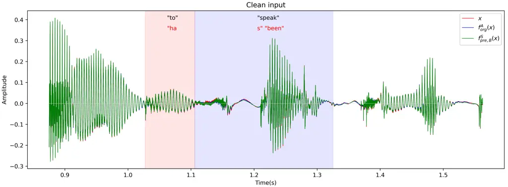
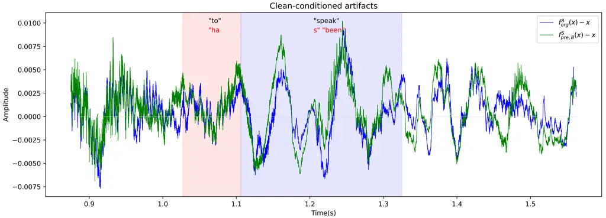
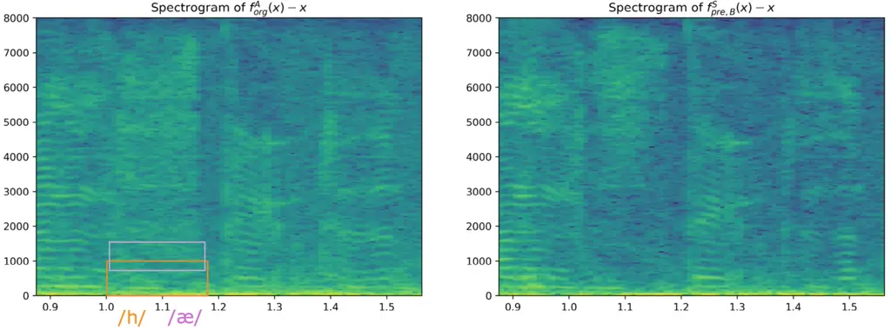
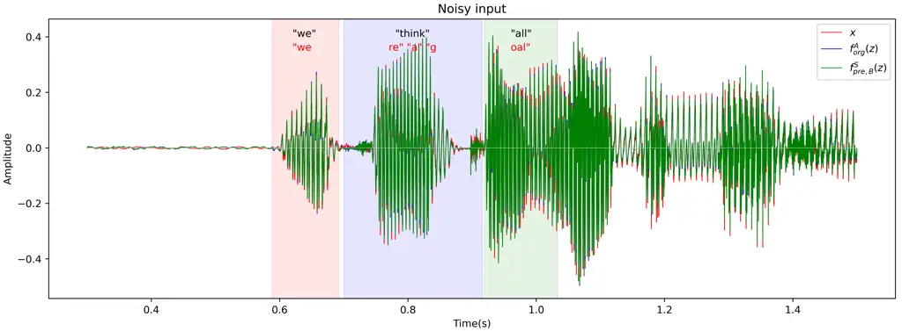
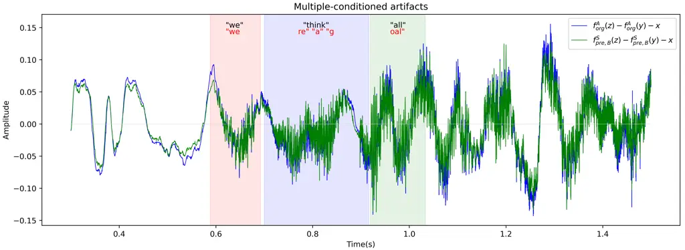
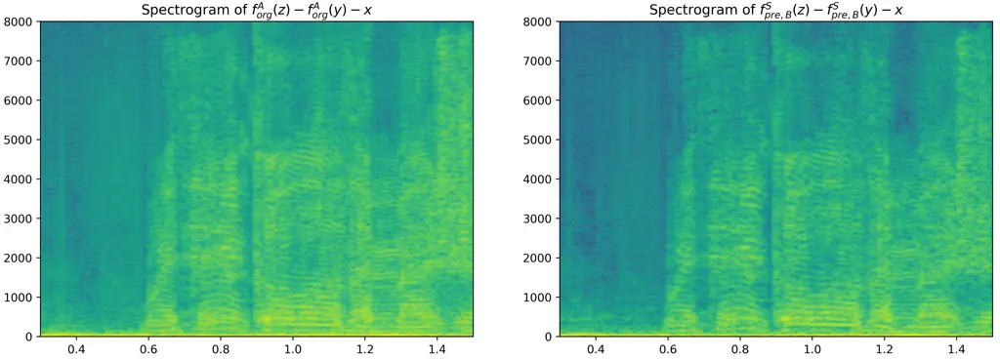
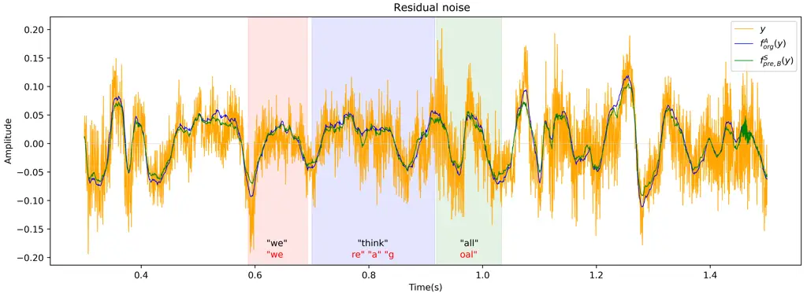

# NAaLoss: Rethinking the Objective of Speech Enhancement

###### Abstract

Reducing noise interference is crucial for automatic speech recognition
(ASR) in a real-world scenario. However, most single-channel speech
enhancement (SE) generates ”processing artifacts” that negatively affect
ASR performance. Hence, in this study, we suggest a Noise- and
Artifacts-aware loss function, NAaLoss, to ameliorate the influence of
artifacts from a novel perspective. NAaLoss considers the loss of
estimation, de-artifact, and noise ignorance, enabling the learned SE to
individually model speech, artifacts, and noise. We examine two SE
models (simple/advanced) learned with NAaLoss under various input
scenarios (clean/noisy) using two configurations of the ASR system
(with/without noise robustness). Experiments reveal that NAaLoss
significantly improves the ASR performance of most setups while
preserving the quality of SE toward perception and intelligibility.
Furthermore, we visualize artifacts through waveforms and spectrograms,
and explain their impact on ASR.

| Kuan-Hsun Ho^(†)  En-Lun Yu^(†)   Jeih-weih Hung^(⋆)  Berlin Chen^(†)                                              |
| ------------------------------------------------------------------------------------------------------------------ |
| ^(†) Department of Computer Science and Information Engineering, National Taiwan Normal University, Taipei, Taiwan |
| ^(⋆) Department of Electrical Engineering, National Chi Nan University, Nantou, Taiwan                             |

Index Terms—  single-channel speech enhancement, noise-robust speech
enhancement, processing artifacts

## 1 Introduction

The goal of speech enhancement (SE) is to enhance the quality and
intelligibility of a speech signal contaminated by various kinds of
noise. Recent advances in machine learning and deep neural networks have
shown promise in improving SE performance by learning to model the
complex statistical relationships between clean speech and noise. In
particular, many studies have shown that multi-channel SE behaves well,
even if cascaded with automatic speech recognition (ASR) systems \[1,
2\]. However, multiple-array microphones are still uncommon, and
single-channel SE is essential in real-world scenarios such as mobile
devices and hearing aids.

It is noteworthy that while single-channel SE help reduces the impact of
noise on speech signals, it may also introduce unnatural artifacts and
distortions \[3, 4, 5, 6\]. These issues could result in mistakes during
the feature extraction stage of the ASR system, which relies on accurate
representations of the speech signal for classification. For example,
suppose an SE algorithm introduces artifacts that alter the timing or
duration of speech sounds. It could lead to misaligned words or
phonemes, which lowers ASR performance. The discrepancy in training
objectives between SE and ASR could be a reason for the presence of
artifacts. Although joint training \[4, 7\] or data-augmentation
techniques \[5, 8\] have been proposed to address this issue, revising
the ASR system is not always practical. For SE-based robust ASR, it is
crucial to eliminate the detrimental artifacts that hinder recognition.

Since artifacts differ depending on the SE models used, finding an
explicit expression that formulates artifacts is arduous. One endeavor
along this direction is orthogonal projection-based error decomposition
\[6, 9\], which analyzes signals by projecting them into the space
occupied by speech and noise. However, these formulations are somewhat
inaccurate because noise and source signals may not be orthogonal, as in
the babble noise scenario.

Is there a facile way to train an SE model that not only maintains the
already established enhancement quality but also improves recognition
accuracy? We reckon that the solution lies in the employed objective
function. Typically, the loss function in SE minimizes the distance
between the estimated and target clean speech \[10, 11\]. However, the
learning scheme that distinguishes between speech and noise signals has
yet to be comprehensively considered, making SE models unable to discern
between the speech and noise components of a noisy speech. In
particular, the mapping-based SE methods tend to produce false alarms or
fake speech¹¹ 1 as shown in supplementary file
[https://reurl.cc/01aOYY](https://reurl.cc/01aOYY), under directory
”wavs/false_alarm”., as their initial design is not meant to separate
speech and noise. Consequently, we only focus on masking-based SE and
attempts to upgrade them.

We rethink the goal of SE and outline four expectations. For a
masking-based SE front-end with a noisy input:

- 1.  the output should not include artifacts;
- 2.  the noise component should be masked out while retaining clean speech;
- 3.  speech quality and intelligibility should be optimized;
- 4.  the SE should benefit the subsequent ASR of any form.

Accordingly, we present a Noise- and Artifact-aware loss function,
NAaLoss, to learn the SE framework, aiming to bridge the gap between
reality and the above expectations. An extensive set of experiments
exhibit that the presented NAaLoss benefits the SE method by providing
significant improvement toward ASR, demonstrating its superiority.

## 2 Formulation

### 2.1 Problem

To propose a comprehensive solution, we must first identify the problem.
Despite their diversity and unpredictability, artifacts can be
characterized as signals that 1) degrade the Word Error Rate (WER), 2)
are ignored in perception/intelligibility metrics, 3) are produced by
the SE module, and 4) are distortions to natural signals.\[6\] We can
then narrow down how the artifacts can be formulated using these
characteristics.

A noisy speech $`z\in\mathbb{R}^{T}`$ can be modeled through a single
microphone as $`z=x+y`$, where $`x\in\mathbb{R}^{T}`$ is the clean
speech, and $`y\in\mathbb{R}^{T}`$ is the noise. Let $`f`$ denote a SE
model, and $`\theta`$ denotes artifacts. We hold three hypotheses:

- 1.  $`f(x)=\theta_{c}+x`$; an SE model $`f`$ consumes clean speech $`x`$
      and outputs a combination of clean-conditioned artifacts
      $`\theta_{c}`$ and clean speech $`x`$.
- 2.  $`f(z)=\theta_{m}+\tilde{y}+x`$; an SE model $`f`$ consumes noisy
      speech $`z`$ and outputs a mixture of multi-conditioned artifacts
      $`\theta_{m}`$, residual noise $`\tilde{y}`$, and clean speech $`x`$.
- 3.  $`f(y)=\tilde{y}`$; residual noise $`\tilde{y}`$ is the outcome of an
      SE model $`f`$ fed with pure noise $`y`$.

Inspecting previous works, most do not explicitly define artifacts
introduced by non-linear transformations in SE models. From these
hypotheses above, we can formulate artifacts using two options:

- $`\alpha`$.
  $`\theta=\frac{1}{2}(f(z)+f(x)-f(y)-2x)`$, referred to as
  condition-invariant artifacts by assuming
  $`\theta_{c}=\theta_{m}=\theta`$.
- $`\beta`$.
  $`\theta_{c}=f(x)-x`$ and $`\theta_{m}=f(z)-f(y)-x`$, which models
  clean- and multiple-conditioned artifacts individually.

While option $`\alpha`$ is straightforward and the artifact term can be
determined by merely solving the equations in the three hypotheses, it
may not always be feasible. Contrarily, option $`\beta`$ asserts that
artifacts are case-sensitive, and that is more realistic. Moreover, the
characteristics of the received signal always change in a real
environment, making it necessary to model artifacts created by an SE
module from a multi-aspect perspective.

### 2.2 Proposed solution

Generally, the loss function utilized in an SE module is the distance
between the enhanced and target speech representations\[11\]. However,
as previously indicated, artifacts generated by SE regarding different
inputs have yet to be considered. As a consequence, we propose the
Noise- and Artifacts-aware Loss function (NAaLoss), which contains three
components as follows:

- 1.  Loss of estimation, $`L_{\text{estim}}=\text{dist}(f(z),x)`$, which
      calculates the distance between the enhanced speech $`f(z)`$ and
      target clean speech $`x`$. This loss is employed in the learning of
      most SE models.
- 2.  Loss of de-artifact, $`L_{\text{deatf}}`$. In particular,
      $`L_{\text{deatf}}=\text{dist}(\theta,\mathbf{0})`$ if we use option
      $`\alpha`$, which treats artifacts to be condition-invariant. On the
      contrary,
      $`L_{\text{deatf}}=\sum_{i}\text{dist}(\theta_{i},\mathbf{0}),i\in\{c,m\}`$
      to consider artifacts coming from different conditions as in option
      $`\beta`$. This loss considers artifacts to learn an SE model.
- 3.  Loss of noise ignorance,
      $`L_{\text{ignor}}=\text{dist}(f(y),\mathbf{0})`$, which measures the
      magnitude of residual noise $`\tilde{y}`$. This loss reflects SE’s
      capacity for noise reduction.

Here, the symbol $`\mathbf{0}`$ indicates a tensor filled with zeros,
and the function $`\text{dist}(\cdot)`$ can be any type of distance
metric, such as L1 or L2, performed on any feature domain of signals.
Afterward, we build the NAaLoss as a weighted sum of these three
components:

```math
L_{\text{NAa}}=(1-\alpha-\beta)L_{\text{estim}}+\alpha L_{\text{deatf}}+\beta L_{\text{ignor}},
```

where $`\alpha=0.1`$ and $`\beta=0.1`$ are designated empirically.

We evaluate our proposed loss function on two SE models, one simple and
one advanced. Each model is either pre-trained ($`pre`$) or
trained-from-scratch ($`scr`$). The pre-trained type, in particular,
implies that the initial parameter set has been pre-optimized for
gaining the best speech quality and intelligibility. As for the two SE
models, the simple one is set to be the example recipe in Speechbrain
\[12\], whereas MANNER \[13\] is chosen as the advanced one. Both models
are masking-based. However, the former operates in the time-frequency
domain, and the latter directly handles time signals. With this setting,
we can also test the generalizability of the proposed loss function.

Finally, we generate 7 combinations of models. The original
simple/advanced SE models without further learning are denoted as
$`f^{S/A}_{org}`$, and the simple/advanced models further learned
through NAaLoss option $`\alpha`$/$`\beta`$ from pre-trained
parameters/trained-from-scratch are denoted in the form of
$`f^{S/A}_{pre/scr,\alpha/\beta}`$. For example, $`f^{A}_{pre,\alpha}`$
describes the advanced model with pre-trained parameters that is further
learned with NAaLoss using option $`\alpha`$.

## 3 Experiments

### 3.1 Experimental Settings

To validate the effectiveness of our proposed solution, we conduct a
series of experiments on the VoiceBank-DEMAND \[14\] benchmark dataset,
a widely-adopted and open-source benchmark corpus for SE. In the
training set, 11,572 utterances (from 28 speakers) are pre-synthesized
with 10 types of noise from the DEMAND database \[15\] at four different
signal-to-noise ratio (SNR) values: 0, 5, 10, and 15 dB, while the test
set contains 824 utterances (from 2 speakers) contaminated by five types
of noise at SNR values of 2.5, 7.5, 12.5, and 17.5 dB. In addition to
training, we set aside around 200 utterances from the training set for
validation. All speech data have a sample rate of 16 kHz.

The configuration of simple SE remains unchanged, as provided in the
repository²² 2
[https://github.com/speechbrain/speechbrain/tree/develop/recipes/Voicebank/enhance/spectral_mask](https://github.com/speechbrain/speechbrain/tree/develop/recipes/Voicebank/enhance/spectral_mask).
On the other hand, we use MANNER-small for advanced SE along with the
configuration default in the repository³³ 3
[https://github.com/winddori2002/MANNER](https://github.com/winddori2002/MANNER).
We optimize SE models using the Adam optimizer \[16\] with past momentum
loaded.

To see whether NAaLoss alleviates artifacts under any form of subsequent
ASR, as outlined in Section 1, we prepare two ASR systems, CCT-AM and
MCT-AM, to recognize the enhanced speech. The CCT-AM denotes the
acoustic model (AM) trained in the clean condition mode using all the
clean utterances. MCT-AM, on the other hand, indicates the AM trained
with utterances corrupted by multi-condition noises. Both AMs are
Kaldi-based hybrid DNN-HMM acoustic models \[17\] trained with
lattice-free MMI objective function, and their DNN components utilize
time-delay neural networks.

### 3.2 Baselines

|         |       |                    |                    |                    |                    |       |
| ------- | ----- | ------------------ | ------------------ | ------------------ | ------------------ | ----- |
|         | $`x`$ | $`f^{S}_{org}(x)`$ | $`f^{S}_{org}(z)`$ | $`f^{A}_{org}(x)`$ | $`f^{A}_{org}(z)`$ | $`z`$ |
| CCT-AM  | 5.04  | 5.97               | 10.21              | 5.28               | 7.37               | 23.76 |
| MCT-AM  | 4.86  | 5.10               | 7.21               | 4.91               | 6.62               | 8.32  |
| PESQ    | \-    | 4.47               | 2.69               | 4.22               | 3.11               | 1.97  |
| STOI(%) | \-    | 99.6               | 93.8               | 98.8               | 94.9               | 92.0  |

Table 1: The baselines. The header indicates the input to ASR, while the
first and second rows show the WERs (lower is better) using the ASR
first column indicated. The PESQ and STOI scores (greater is better) are
in the third and fourth rows. CCT/MCT-AM denotes the acoustic model
trained in the clean/multi condition mode.

Tab. 1 shows the results of various SE and ASR baselines, including
clean speech $`x`$, noisy speech $`z`$, and enhanced speech with respect
to simple or advanced SE models. It is important to realize that the
WERs for clean speech $`x`$ are supposed to be the best possible ASR
results for any SE model output, regardless of input type. In addition,
the perception (Perceptual Evaluation of Speech Quality, PESQ) and
intelligibility (Short-Time Objective Intelligibility, STOI) scores of
various SE are also reported.

Ideally, a well-designed SE model should not introduce significant
changes to clean speech inputs. However, observing the CCT-AM WERs of
$`x`$, $`f^{S}_{org}(x)`$, and $`f^{A}_{org}(x)`$, we can identify the
presence of clean-conditioned artifacts $`\theta_{c}`$ introduced by the
SE models. Comparing the CCT-AM WERs of $`z`$, $`f^{S}_{org}(z)`$, and
$`f^{A}_{org}(z)`$, on the other hand, can show that the SE models
reduce WERs when confronted with noisy input, yet further tweaking on SE
can lead to improved outcomes. In this case, it is difficult to
determine whether artifacts or residual noise undermines the WERs of
each SE output by merely reading the statistics. As a remedy, Section 4
will showcase the impact of artifacts through visualization. These
observations apply to MCT-AM as well, but with a shorter performance
range due to its robustness.

Furthermore, something interesting is that $`f^{S}_{org}(x)`$ exhibits
worse WERs but higher PESQ than $`f^{A}_{org}(x)`$. This could
demonstrate two points: 1) an SE module may not always handle a clean
input appropriately, hindering its potential to adapt to new scenarios; 2) exceeding a certain level of PESQ/STOI (contribution by denoising), a
higher PESQ/STOI does not fully translate to a lower WER (deterioration
by artifacts).

### 3.3 Simple enhancement

|         |                           |                           |                          |                          |                          |                          |
| ------- | ------------------------- | ------------------------- | ------------------------ | ------------------------ | ------------------------ | ------------------------ |
|         | $`f^{S}_{pre,\alpha}(x)`$ | $`f^{S}_{pre,\alpha}(z)`$ | $`f^{S}_{pre,\beta}(x)`$ | $`f^{S}_{pre,\beta}(z)`$ | $`f^{S}_{scr,\beta}(x)`$ | $`f^{S}_{scr,\beta}(z)`$ |
| CCT-AM  | 5.44                      | 9.63                      | 5.33                     | 9.53                     | 6.36                     | 14.12                    |
| MCT-AM  | 5.00                      | 7.08                      | 4.99                     | 7.03                     | 6.22                     | 9.03                     |
| PESQ    | 4.43                      | 2.66                      | 4.43                     | 2.68                     | 3.50                     | 2.41                     |
| STOI(%) | 99.5                      | 93.8                      | 99.5                     | 93.8                     | 95.1                     | 89.2                     |

Table 2: The results on simple SE. The performance superior and equal to
the baseline ($`f^{S}_{org}`$) are in blue and green, respectively.

Tab. 2 shows the results of employing NAaLoss on simple SE. As we can
see, except for the trained-from-scratch model $`f^{S}_{scr,\beta}`$,
further learning with NAaLoss makes the model outperforms the baseline
$`f^{S}_{org}`$ (scores in blue) with a cost of trivial degradation in
perception/intelligibility metrics. In particular, using option $`beta`$
with pre-trained parameters leads to the best result among various
settings, approving its effectiveness of reducing artifacts in a
multi-conditioned perspective.

Furthermore, we calculate the relative WER reduction (WERR) rate to
provide more insight, which is defined as:

```math
\text{WERR}=(1-\frac{\text{WER}_{NAa}-\text{WER}_{uc}}{\text{WER}_{org}-\text{WER}_{uc}})\times 100\%,
```

where $`\text{WER}_{uc}`$, $`\text{WER}_{org}`$, and
$`\text{WER}_{NAa}`$ are the WERs of unprocessed clean speech, the
speech enhanced with the original SE model, and the speech enhanced with
the NAaLoss-adopted SE. A higher WERR score signifies that applying
NAaLoss can further reduce the noise and artifacts left over from the
original SE model.

When the input is $`x`$, using the WERs of $`x`$, $`f^{S}_{org}(x)`$,
and $`f^{S}_{pre,\beta}(x)`$ to compute WERRs gives 33.3% and 51.2% for
CCT-AM and MCT-AM, respectively. The WERRs of the input $`z`$ for CCT-AM
and MCT-AM are 61.4% and 53.9%, respectively, using the WERs of $`x`$,
$`f^{S}_{org}(z)`$, and $`f^{S}_{pre,\beta}(z)`$. We have found that the
presented NAaLoss helps the simple SE achieve better ASR results, and
even helps more with noisy speech $`z`$ than with clean speech $`x`$
(33.3% to 61.4% and 51.2% to 53.9% in WERR). This attributes to
individual modeling of speech, artifacts, and noise in NAaLoss.
Furthermore, since MCT-AM outperforms CCT-AM in ASR, using NAaLoss to
reduce artifacts in enhanced clean speech $`f^{S}_{pre,\beta}(x)`$ can
achieve higher WERR in MCT-AM than in CCT-AM (51.2% vs. 33.3% in WERR).

### 3.4 Advanced enhancement

|         |                           |                           |                          |                          |                          |                          |
| ------- | ------------------------- | ------------------------- | ------------------------ | ------------------------ | ------------------------ | ------------------------ |
|         | $`f^{A}_{pre,\alpha}(x)`$ | $`f^{A}_{pre,\alpha}(z)`$ | $`f^{A}_{pre,\beta}(x)`$ | $`f^{A}_{pre,\beta}(z)`$ | $`f^{A}_{scr,\beta}(x)`$ | $`f^{A}_{scr,\beta}(z)`$ |
| CCT-AM  | 5.16                      | 7.06                      | 5.17                     | 6.83                     | 5.02                     | 7.45                     |
| MCT-AM  | 4.89                      | 6.39                      | 4.88                     | 6.41                     | 4.81                     | 6.46                     |
| PESQ    | 4.18                      | 3.13                      | 4.22                     | 3.11                     | 4.21                     | 2.97                     |
| STOI(%) | 98.6                      | 94.6                      | 98.8                     | 94.8                     | 99.0                     | 94.6                     |

Table 3: The results on advanced SE. While the color settings are the
same in Tab. 2, those WERs better than the performance of clean speech
$`x`$ are in red.

The results of employing NAaLoss on advanced SE can be seen in Tab. 3.
Excluding the case of CCT-AM for $`f^{A}_{scr,\beta}(z)`$, the advanced
SE consistently achieves lower WERs (scores in blue) if it is further
adopted by NAaLoss. Again, using option $`\beta`$ with pre-trained
parameters guides to the best result on average (blue in WER, green in
PESQ/STOI), confirming the stability of this arrangement. Additionally,
we spot that some enhanced versions of speech get higher
perception/intelligibility scores than the baseline, e.g., PESQ of
$`f^{A}_{pre,\alpha}(z)`$ and STOI of $`f^{A}_{scr,\beta}(x)`$, hinting
at the synergistic capacity of integrating MANNER and NAaLoss in SE.
Interestingly, $`f^{A}_{scr,\beta}(x)`$ obtains lower WERs than clean
speech $`x`$ (5.02% vs. 5.04% under CCT-AM and 4.81% vs. 4.86% under
MCT-AM), showing that this SE setup can further benefit clean speech in
ASR.

Similarly, we use the WERR metric to evaluate the effect of NAaLoss on
advanced SE. The WERRs for CCT-AM and MCT-AM are 45.8% and 60.0% in
input $`x`$, and 23.2% and 11.9% in input $`z`$. Again, for the clean
speech input $`x`$, using NAsLoss can decrease the artifacts caused by
the advanced SE, resulting in a more significant reduction in WERs for
MCT-AM than for CCT-AM (60% vs. 50%), a tendency also found in the
simple SE case. However, NAaLoss contributes less to noisy speech input
$`z`$ than to clean speech $`x`$ in WERR (23.2% vs. 50.0% for CCT-AM and
13.1% vs. 60.0% for MCT-AM), particularly for MCT-AM. The underlying
explanation could be that MCT-AM can deal with the artifact and residual
noise left by advanced SE to some extent, and the effect of utilizing
NAaLoss is less significant.

### 3.5 Comparison

|        |                         |                          |                         |                          |
| ------ | ----------------------- | ------------------------ | ----------------------- | ------------------------ |
|        | $`f^{S}_{org}(z)+0.5z`$ | $`f^{S}_{pre,\beta}(z)`$ | $`f^{A}_{org}(z)+0.5z`$ | $`f^{A}_{pre,\beta}(z)`$ |
| CCT-AM | 15.01                   | 9.53                     | 8.84                    | 6.83                     |
| MCT-AM | 7.09                    | 7.03                     | 6.92                    | 6.41                     |

Table 4: The comparison between OA and NAaLoss.

Here, we evaluate the observation-adding (OA) method \[6\] and compare
it with our presented NAaLoss-wise framework, which WER results are
listed in Tab. 4. OA is utilized in multiple research fields \[18, 19\],
with the intuition to lessen nonlinear audio distortion, such as
artifacts. Simply adding a portion of the noisy speech $`z`$ to the
enhanced speech $`f(z)`$ defines the OA method. What we have observed in
Tab. 4 is fourfold: 1) NAaLoss outperforms OA in each circumstance; 2)
for CCT-AM, which is sensitive to noise, adding back noise as in OA is
destructive (causing WER from 10.21% to 15.01% for simple SE and from
7.37% to 8.84% for advanced SE); 3) the effectiveness of OA is
counterproductive on advanced SE, compared to baselines (8.84% v.s.
7.37% for CCT-AM, and 6.92% v.s. 6.62% for MCT-AM); 4) in the instance
of $`f^{S}_{org}(z)+0.5z`$ with MCT-AM, OA performs closest to NAaLoss
(7.09% vs. 7.03% in WER), which coheres with the experiments in \[6\].
Although OA is beneficial to a noise-robust ASR, it may not serve as a
SE front-end since it could deteriorate the quality and intelligibility
of enhanced speech. In comparison, NAaLoss fine-tunes the SE model
parameters with the objective of minimizing artifacts while maintaining
enhancement quality in various scenarios, accentuating its
comprehensiveness.

## 4 Discussion



(a) Overall waveform of clean input. Clean speech $`x`$ are in red.



(b) Clean-conditioned artifacts $`\theta_{c}`$.



(c) Spectrogram of $`\theta_{c}`$ in $`f^{A}_{org}(x)`$ (left), and in
$`f^{A}_{pre,\beta}(x)`$ (right).

Fig. 1: Case studies on Hypothesis 1. This is an example of the ground
truth ”to speak” recognized correctly in $`f^{A}_{pre,\beta}(x)`$ but
falsely as ”has been” in $`f^{A}_{org}(x)`$. Blue and green lines denote
production related to $`f^{A}_{org}(x)`$ and $`f^{A}_{pre,\beta}(x)`$,
respectively. For sub-figure (a) and (b), we underline the timeline of
the respective phoneme, and the false recognitions are in red. The
bounding boxes in (c) indicate the frequency range of the specified
phoneme.



(a) Overall waveform of noisy input.



(b) Multi-conditioned artifacts $`\theta_{m}`$.



(c) Spectrogram of $`\theta_{m}`$ in $`f^{A}_{org}(z)`$ (left), and in
$`f^{A}_{pre,\beta}(z)`$ (right).



(d) Residual noise $`\tilde{y}`$. The waveform of pure noise $`y`$ is in
yellow.

Fig. 2: Case studies on Hypothesis 2 and 3. This is an example of the
ground truth ”we think all” recognized correctly in
$`f^{A}_{pre,\beta}(z)`$ but falsely as ”were a goal” in
$`f^{A}_{org}(z)`$. The color settings are identical to that of Fig. 1.

This section seeks to further analyze the characteristics of the
presented NAaLoss in light of the evaluation results offered in the
previous section. Regarding the outcomes of simple and advanced SE, it
appears necessary to compromise on some perception/intelligibility
scores in order to achieve a higher ASR result (a lower WER). However,
since NAaLoss considers multiple aspects within three constituent losses
described in Section 2, the resulting SE model is supposed to provide a
better trade-off between SE and ASR performance. Moreover, it is widely
accepted that perceptually degraded speech has little effect on human
recognition, albeit the human auditory system is susceptible to noise.
Furthermore, we find that the perception/intelligibility scores of
$`f^{A}_{pre,\beta}(x)`$ are lower than that of
$`f^{S}_{pre,\beta}(x)`$, implying that a more complicated SE model
tends to be less capable of handling clean speech input. To mitigate
this problem, we suggest tuning the weight for the loss of de-artifact
($`L_{\text{deatf}}`$) in NAaLoss, especially in the clean-conditioned
scenario, whereas we leave this to future works.

Regarding the transcription results, we further analyze some instances
of wrong-recognized words in $`f^{A}_{org}`$ and explicitly reveal the
impact of artifacts on ASR. First, in the case of input $`x`$,
$`f^{A}_{org}`$ tends to wipe out or change the consonants, e.g.,
”hores” misrecognized as ”ores” or ”if” misrecognized as ”is.” Second,
in the case of input $`z`$, multiple samples have reported misaligned
and thus misrecognized words because of the artifacts that alter the
timing of speech. For example, ”the same” is misaligned by timing
artifacts, leading to misrecognition as ”\*\*\* plain,” where ”\*\*\*”
denotes an unknown symbol.

Since enumerating all the WERs is impossible, we visualize two samples,
one analyzing hypothesis 1 and another analyzing hypotheses 2 and 3, as
shown in Fig. 1 and Fig. 2, respectively. As Fig. 1 (a) displays, the
waveforms of $`x`$, $`f^{A}_{org}(x)`$, and $`f^{A}_{pre,\beta}(x)`$ are
too close to tell the difference; however, plotting the
clean-conditioned artifacts, as in Fig. 1 (b), it is evident that both
signals have distinct characteristics. We then draw the respective
spectrogram in Fig. 1 (c) to better identify their frequency components
and annotate the misrecognized part. Because some artifacts
(1.1$`\sim`$1.3 s) distribute on the primary frequency ranges of
consonant /h/ (0$`\sim`$1000 Hz) and vowel /æ/ (800$`\sim`$1500 Hz)
\[20, 21\], they interfere with the ASR to choose ”has” rather than
”to.” This also affects the language model in ASR to select the next
word, ”been,” which is reasonable but wrong. Additionally, we can
observe that artifacts distribute widely and densely in Fig. 1 (c) and
Fig. 2 (c), which may give rise to the false transcription. Last, we
plot the residual noise in Fig. 2 (d) and show that NAaLoss is also
better in noise reduction as $`f^{A}_{pre,\beta}(y)`$ contains smaller
residual noise than $`f^{A}_{org}(y)`$.

## 5 Conclusion

This study proposes a novel objective function NAaLoss adapting SE
models toward ideal performance. We experimentally reveal the
effectiveness of NAaLoss in 1) eliminating artifacts, 2) enhancing noisy
speech, 3) preserving perceptual quality and intelligibility, and 4)
generalizing to subsequent ASR of any form. The waveforms and their
corresponding spectral visualizations to show the effectiveness of
NAaLoss can be found in supplementary files. In the future, we plan on
creating an automatic mechanism to determine the weights of the three
constituent losses in NAaLoss. We also intend to encourage more
instantiations in future research that studies single-channel SE
front-ends considering the specific requirements and constraints of the
ASR task.

## References

- \[1\] J. Heymann, L. Drude, and R. Haeb-Umbach, “Neural network based
  spectral mask estimation for acoustic beamforming,” in ICASSP, 2016.
- \[2\] J. Barker, S. Watanabe, E. Vincent, and J. Trmal, “The fifth
  ’CHiME’ speech separation and recognition challenge: Dataset, task and
  baselines,” in Interspeech, 2018.
- \[3\] T. Menne, R. Schlüter, and H. Ney, “Investigation into joint
  optimization of single channel speech enhancement and acoustic
  modeling for robust asr,” in ICASSP, 2019.
- \[4\] S.-J. Chen, A. S. Subramanian, H. Xu, and S. Watanabe, “Building
  state-of-the-art distant speech recognition using the chime-4
  challenge with a setup of speech enhancement baseline,” in
  Interspeech, 2018.
- \[5\] M. Fujimoto and H. Kawai, “One-pass single-channel noisy speech
  recognition using a combination of noisy and enhanced features.” in
  Interspeech, 2019.
- \[6\] K. Iwamoto, T. Ochiai, D. Marc, R. Ikeshita, H. Sato, S. Araki,
  and S. Katagiri, “How bad are artifacts?: Analyzing the impact of
  speech enhancement errors on asr,” in ICASSP, 2022.
- \[7\] T. Menne, R. Schlüter and H. Ney, “Investigation into joint
  optimization of single channel speech enhancement and acoustic
  modeling for robust ASR,” in ICASSP, 2019.
- \[8\] K. Tan and D. Wang, “Improving robustness of deep learning
  based monaural speech enhancement against processing artifacts,” in
  ICASSP, 2020.
- \[9\] E. Vincent, R. Gribonval, and C. Févotte, ”Performance
  measurement in blind audio source separation,” IEEE Transactions on
  Audio, Speech, and Language Processing, vol. 14, no. 4, pp.
  1462–1469, 2006.
- \[10\] Y. Xu, J. Du, L.-R. Dai, and C.-H. Lee, “An experimental study
  on speech enhancement based on deep neural networks,” IEEE Signal
  Processing Letters, vol. 21, no. 1, pp. 65–68, 2014.
- \[11\] S. Braun and I. Tashev, “A consolidated view of loss functions
  for supervised deep learning-based speech enhancement,” in TSP, 2021.
- \[12\] M. Ravanelli et al., ”SpeechBrain: A General-Purpose Speech
  Toolkit,” arXiv preprint arXiv:2106.04624, 2021.
- \[13\] H. J. Park, B. H. Kang, W. Shin, J. S. Kim, and S. W. Han,
  “Manner: Multiview attention network for noise erasure,” in
  ICASSP, 2022.
- \[14\] C. Valentini-Botinhao, X. Wang, S. Takaki, and J. Yamagishi,
  ”Investigating RNN-based speech enhancement methods for noise-robust
  Text-to-Speech,” in SSW, 2016.
- \[15\] J. Thiemann, N. Ito, and E. Vincent, “The diverse environments
  multi-channel acoustic noise database: A database of multichannel
  environmental noise recordings,” Journal of the Acoustical Society of
  America, vol. 133, no. 5, pp. 3591–3591, 2013.
- \[16\] D. P. Kingma and J. Ba, “Adam: A Method for Stochastic
  Optimization,” in ICLR, 2015.
- \[17\] D. Povey et al.“The Kaldi speech recognition toolkit,” in
  ASRU, 2011.
- \[18\] O. Cappe, “Elimination of the musical noise phenomenon with
  the ephraim and malah noise suppressor,” IEEE transactions on Speech
  and Audio Processing, vol. 2, no. 2, pp. 345–349, 1994.
- \[19\] R. Lyon, “A computational model of binaural localization and
  separation,” in ICASSP, 1983.
- \[20\] H. C. Chen et al., ”3.2. Acoustic Aspects of Consonants ”
  EdUHK.
  [https://corpus.eduhk.hk/english_pronunciation/index.php/3-2-acoustic-aspects-of-consonants/](https://corpus.eduhk.hk/english_pronunciation/index.php/3-2-acoustic-aspects-of-consonants/)
  (accessed May. 10, 2023).
- \[21\] J. M. Hillenbrand, L. A. Getty, M. J. Clark, and K. Wheeler,
  “Acoustic characteristics of American English vowels,” Journal of the
  Acoustical Society of America, vol. 97, no. 5, pp. 3099-3111, 1995.
