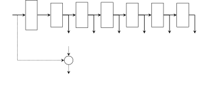
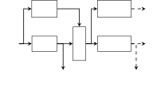
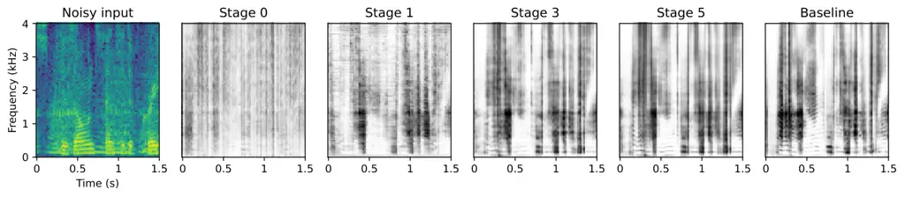

# Dynamic nsNet2: Efficient Deep Noise Suppression with Early Exiting

###### Abstract

Although deep learning has made strides in the field of deep noise
suppression, leveraging deep architectures on resource-constrained
devices still proved challenging. Therefore, we present an early-exiting
model based on nsNet2 that provides several levels of accuracy and
resource savings by halting computations at different stages. Moreover,
we adapt the original architecture by splitting the information flow to
take into account the injected dynamism. We show the trade-offs between
performance and computational complexity based on established metrics.

|                                                                                                                                                                                   |
| --------------------------------------------------------------------------------------------------------------------------------------------------------------------------------- |
| Riccardo Miccini^(⋆†) Alaa Zniber^(§) Clément Laroche^(⋆) Tobias Piechowiak^(⋆) Martin Schoeberl^(†) Luca Pezzarossa^(†) Ouassim Karrakchou^(§) Jens Sparsø^(†) Mounir Ghogho^(§) |
| ^(⋆) GN Audio     ^(†) Technical University of Denmark     ^(§) International University of Rabat                                                                                 |

Index Terms—  Deep Noise Suppression, Dynamic Neural Networks,
Early-exiting

^(†)^(†) This research has received funding from the European Union’s
Horizon research and innovation programme under grant agreement No 101070374.

\bstctlcite

IEEEexample:BSTcontrol

## 1 Introduction

In recent years, audio products such as earbuds, headsets, and hearing
aids have become increasingly popular and are driving the demand for
real-time solutions capable of improving speech quality. Noise
suppression techniques based on deep learning — also referred to as Deep
Noise Suppression (DNS) — are superseding conventional speech
enhancement techniques based on digital signal processing. This is
thanks to their ability to effectively reduce non-stationary noise and
deal with diverse background sounds. Several DNS models, in particular
those capable of real-time causal inference, rely on Recurrent Neural
Networks (RNNs) \[1, 2, 3\]. Such approaches usually involve feeding a
frequency-domain signal — in the form of Short-time Fourier Transform
(STFT) or Mel spectrograms — one frame at a time, into an encoding layer
and one or more recurrent layers such as Gated Recurrent Units (GRU),
thereby providing temporal sequence modelling abilities. This internal
representation is then decoded to form a time-varying filter, which is
applied to the noisy input to obtain a clean speech estimate.

Unfortunately, such architectures are not particularly suited for
resource-constrained devices due to the large amount of computation
required by the recurrent units. On that note, several efforts have been
put in trying to optimise and deploy recurrent models on embedded
hardware \[4, 5\] with techniques such as quantization. Nevertheless,
one fundamental aspect remains unaddressed, i.e., the model requires the
same amount of computation irrespective of energy/power requirements,
initial speech quality of the input signal, and desired output speech
quality.

To address this issue, Dynamic Neural Networks (DyNNs), also known as
conditional neural networks, are one path to undergo \[6\]. DyNNs can
adaptively adjust their parameters as well as their computational graph,
based on the input they receive. This dynamism grants the network more
flexibility and efficiency in handling various resource budgets,
real-time requirements, and device capacities while maintaining a good
performance trade-off. Amongst the most promising techniques for DyNNs
that appear suitable for addressing limited hardware resources, we find
early exiting \[7, 8, 9\]. Early exiting was introduced in the context
of image classification \[10, 11\]. It appends the architecture with
decision blocks (e.g., internal classifiers) that decide when to halt
the computations based on the output of each exit stage (e.g., image
class probability). This paradigm helps avoid using the full-fledged
network, but various challenging aspects emerge from these new types of
architectures. For instance, the absence of feature sharing between
internal decision blocks can lead to computational waste \[12, 13\].
Another challenge lies in the optimal placement of the decision blocks
in the architecture based on either performance gain or loss
minimisation \[14, 15\]. Moreover, convergence is also subject to
instability due to the accumulation of gradients coming from the
different decision blocks, which can be mitigated by gradient re-scaling
\[16\] or a mixture of training strategies \[17\].

In this work, we introduce a novel application of DyNNs to noise
suppression. We adapt nsNet2 \[1\], a popular architecture for noise
suppression, into a model capable of early exiting given user-predefined
constraints. We then demonstrate that the resulting architecture
achieves a monotonic increase in its denoising capabilities with each
consecutive exit stage. Our architecture allows the user to choose the
denoising/computational cost trade-off that best suits their needs. Due
to the additional challenges associated with unintrusively modelling
speech quality in real-time, automatic exiting is beyond the scope of
this work. In this paper:

- •
  We convert nsNet2 into an early-exiting model and explore several
  architectural adaptations aimed at maintaining its denoising
  capabilities at each stage;
- •
  We investigate the impact of different early exit training strategies
  (layer-wise or joint) on the denoising performance of the models;
- •
  We evaluate the speech quality and computational efficiency of our
  models for each exit stage and show that our architectural adaptations
  decrease computational cost without degrading baseline performances.

## 2 Deep noise suppression

We assume that the observed signal $`X(k,n)`$ — defined in the
STFT-domain where $`k`$ and $`n`$ are the frequency and time frame
indices, respectively — is modelled as an additive mixture of the
desired speech $`S(k,n)`$ and interfering noise $`N(k,n)`$, expressed
as:

```math
X(k,n)=S(k,n)+N(k,n) \tag{1}
```

To obtain the clean speech estimate $`\widehat{S}(k,n)`$, we compute a
real-valued suppression gain spectral mask $`\widehat{M}`$ such that:

```math
\widehat{S}(k,n)=X(k,n)\cdot\widehat{M}(k,n) \tag{2}
```

This can be formulated as a supervised learning task, where a mask
$`\widehat{M}(k,n)`$ is learned to minimise the distance between $`S`$
and $`\widehat{S}`$.

### 2.1 Dynamic Architecture



Fig. 1: nsNet2 architecture with exit stages (dotted lines show an
example of full inference path)

As our baseline, we use nsNet2 \[1\], an established DNS model with the
following architecture comprising recurrent and fully-connected (FC)
layers: FC-GRU-GRU-FC-FC-FC. Each fully-connected layer is followed by a
ReLU activation, except for the last one, which features a sigmoid
nonlinearity. The model operates on real-valued log-power spectrograms,
computed as $`\log({|X|^{2}+\varepsilon})`$, for a small
$`\varepsilon`$.

We introduce exit stages after each layer, as shown in Fig. 1. Each exit
outputs a mask $`\widehat{M}_{i}`$, which is a subset of that layer’s
activations with size given by the number of frequency bins, to be
applied to the noisy input (chosen, in our case, as the first 257
features). Since the suppression gains are bound between 0 and 1, we use
the sigmoid function to clamp our FC activations — i.e., the outputs of
layers FC₁, FC₂, FC₃ — similarly to how the baseline model implements
its last activation (i.e., the output of layer FC₄). For the GRU layer
activations, which are inherently bound between $`-1`$ and $`1`$ due to
the final $`\tanh`$ activation, we employ the simple scaling function
$`0.5\cdot(1+\text{GRU}_{i}(x))`$. Note that these extra steps are only
performed when there is a need to extract the mask at the early stage,
otherwise, we use the activations mentioned earlier. This results in an
architecture able to recover the signal with up to 6 different denoising
abilities.

Given the significant differences between the masks and the model’s
internal representation, forcing our model to derive the former at each
layer may degrade its performance. We address this by reducing the
number of intermediate exit stages to promote the emergence of richer
internal feature representations in non-exiting layers. Thus, we
introduced a version of our dynamic model with only the 4 exits marked
with $`\mathbf{\widehat{M}_{0}}`$, $`\mathbf{\widehat{M}_{1}}`$,
$`\mathbf{\widehat{M}_{3}}`$, $`\mathbf{\widehat{M}_{5}}`$ in Fig. 1. We
decided to remove later-occurring exits because, during our experimental
observations, they were more prone to performance degradation.

### 2.2 Split Layers


(a) Regular split layer



(b) With concatenated inputs

Fig. 2: Different styles of split layer adaptations

As mentioned earlier, when dealing with early exiting, a degradation in
performance in the deepest exit stages is often observed, when comparing
the model against its non-dynamic analogous. This is due to the
emergence of task-specialized features that prevent useful information
to flow further \[6\]. Therefore, we attempt to mitigate the issue by
introducing additional data paths in the form of duplicate layers. These
act as ancillary feature extractors, tasked with deriving an
increasingly refined internal representation that proves useful for the
downstream layers. This configuration also avoids subsetting the layers’
activations to yield a mask.

As shown in Fig. 2, two alternative split-layer topologies have been
formulated. In both cases, the layers $`\Phi_{i}`$ generate mask
estimates, while layers $`\Phi_{i}^{*}`$ propagate features. The main
difference between the two variants is whether a given $`\Phi_{i}^{*}`$
layer receives only the output from $`\Phi_{i-1}^{*}`$ or the
concatenated output from both previous layers, i.e.,
$`concat(\Phi_{i-1},\Phi_{i-1}^{*})`$. The former variant assumes that
previous masks do not contain features that are useful for the model’s
internal representation. Conversely, the latter lifts this assumption at
the expense of computational complexity, which is increased as a result
of the larger input size for $`\Phi_{i}^{*}`$ layers.

## 3 Training

Our model is trained on the loss function shown in Eq. 3 that was
initially proposed in \[18\] and subsequently adapted in \[1\]. The loss
comprises two terms: the first term computes the mean-squared error
between the clean and estimated complex spectra, whereas the second term
corresponds to the mean-squared error of the magnitude spectra. The two
terms are weighted by a factor of $`\alpha`$ and $`(1-\alpha)`$,
respectively, with $`\alpha=0.3`$. The spectra are power-law compressed
with $`c=0.3`$:

```math
\displaystyle\mathcal{L}\left(S,\widehat{S}\right)={} \displaystyle\alpha\sum_{k,n}\left||S|^{c}e^{j\angle S}-|\widehat{S}|^{c}e^{j\angle\widehat{S}}\right|^{2}+ \tag{3}
```

```math
\displaystyle(1-\alpha)\sum_{k,n}\left||S|^{c}-|\widehat{S}|^{c}\right|^{2}
```

To avoid the impact of large signals dominating the loss and creating
unbalanced training in a batch of several samples, we normalise $`S`$
and $`\widehat{S}`$ by the standard deviation of the target signal
$`\sigma_{S}`$ before computing the loss, as per \[1\].

In general, training early-exit models can fall into two categories
\[7\]: layer-wise training and joint training. Since each has its
advantages and drawbacks, we have adopted both strategies to challenge
them against each other.

### 3.1 Layer-wise Training

Layer-wise training is a straightforward way to train early exiting
models with or without pre-trained backbones (i.e., non-dynamic
architectures). The idea is to train the first sub-model, from input
$`X`$ and target $`S`$ to the first exit stage that outputs an estimate
$`\widehat{S}_{0}=X\odot\widehat{M}_{0}`$. Once the training reaches an
optimum, the sub-model’s weights are frozen. The subsequent sub-models
are afterwards trained iteratively taking as inputs their previous
sub-model’s last feature vector. This strategy is helpful for mitigating
vanishing gradients as it allows the training of smaller parts of a
bigger network. However, its main drawback is its shortsightedness as
early freezing might degrade later feature representations, and thus,
impede the model’s expressivity.

### 3.2 Joint Training

Joint training inherits from multi-objective optimisation the idea of
minimising a weighted sum of the competing objective functions at play
(a practice known as linear scalarisation). For each sub-model, we
attribute a loss function $`\mathcal{L}_{i}`$ as defined in Eq. 3. Thus,
for $`N`$ exit stages (i.e., $`N`$ sub-models), the total loss can be
written as a linear combination of $`\mathcal{L}_{i}`$:

```math
\mathcal{L}_{tot}=\sum_{i=0}^{N-1}\alpha_{i}\mathcal{L}_{i}\left(S,X\odot\widehat{M}_{i}\right) \tag{4}
```

where $`\alpha_{i}`$ are weighting factors applied to each respective
sub-model loss. Since we do not want to prioritise any specific exit
stage, we set each $`\alpha_{i}`$ to 1.

By definition, joint training establishes information sharing between
the different exit stages. The model is optimised in a multiplayer-game
setting since each exit (player) strives to minimise its loss along with
the best internal representations for its task. Nonetheless, the loss
complexity imposed on the model leads to an accumulation of gradients
from the different sub-models which may result in unstable convergence
\[16\].

## 4 Experimental setup

Our input and target signals are 4 seconds long and pre-processed using
an STFT with a window of $`512`$ samples ($`32`$ ms) and 50% overlap,
resulting in $`257`$ features per time frame. Baseline and joint
trainings were allowed to run for up to $`400`$ epochs whereas
layer-wise training was capped at $`50`$ epochs per exit stage for
pre-trained models or $`50\cdot(i+1)`$ epochs, where $`i`$ is the exit
stage, for the split-layer cases. We set the learning rate to
$`10^{-4}`$ and batch size to $`512`$. To prevent overfitting, we
implemented early stopping with patience of $`25`$ epochs and decreased
the learning rate by $`0.9`$ every $`5`$ epochs if there was no
improvement.

### 4.1 Dataset

We trained and evaluated our models using data from the 2020 DNS
Challenge \[19\]. This is a synthetic dataset, composed of several other
datasets (clean speech, noises, room impulse responses) that are
processed so as to introduce reverberation and background noises at
different SNRs and target levels, thereby allowing for arbitrary amounts
of noisy-clean training examples. Similarly, the challenge provides
evaluation sets — here, we use the synthetic non-reverberant test set.

### 4.2 Evaluation Metrics

For this study, we are interested in assessing the performance of our
models from two perspectives: speech quality and computational
efficiency. To gauge the denoised speech quality, we utilise two
commonly adopted metrics, namely PESQ and DNSMOS \[20\]. For evaluating
the computational efficiency of the models, we consider three measures:
Floating Point Operations (FLOPs), Multiply-Accumulate Operations
(MACs), and Inference Time.

FLOPs and MACs are computed using DeepSpeed’s built-in profiler¹¹ 1
[https://github.com/microsoft/DeepSpeed](https://github.com/microsoft/DeepSpeed)
and the TorchInfo library²² 2
[https://github.com/TylerYep/torchinfo](https://github.com/TylerYep/torchinfo),
respectively. Inference time was computed on CPU for a single frame and
averaged out over $`1000`$ samples. In all cases, we normalise the
metrics to 1 second of input data, corresponding to $`63`$ STFT frames.

### 4.3 Model Configurations

| Model class           | Trainable params. | Size (FP32) |
| --------------------- | ----------------- | ----------- |
| pretrain and baseline | 2.78 M            | 11.13 MB    |
| split_layers          | 1.62 M            | 6.48 MB     |
| concat_layers         | 1.88 M            | 7.54 MB     |

Table 1: Model complexity for different configurations

We experimented with several configurations, all derived from the
baseline. These comprise the baseline itself, which has been replicated
and trained accordingly, as well as combinations of the techniques and
adaptations mentioned earlier, and can be subdivided into the following
three dimensions:

- •
  Exit stages: we trained both the 6-exit and 4-exit variants introduced
  in Section 2.1;
- •
  Split layers: we trained both the straightforward early-exiting model
  described in Section 2.1, starting from a checkpoint of the
  pre-trained baseline, as well as both split-layer variants described
  in Section 2.2;
- •
  Training strategies: we employ both the layer-wise and joint training
  schemes described in Section 3 to determine the most suitable
  strategy.

To isolate the impact of each adaptation, we fix our architectural
hyperparameters to the following values: for baseline and simple
pre-trained early-exiting models, we adhered to the original feature
sizes of $`400`$ units for FC₁, GRU₁, and GRU₂, $`600`$ units for FC₂
and FC₃, and $`257`$ units for FC₄ — i.e., the number of frequency bins
in the suppression mask. In split-layers models, the number of features
in each $`\Phi_{i}`$ must also match the size of the suppression mask.
To avoid introducing any unfair advantage into our evaluation, we picked
$`128`$ as the size of $`\Phi_{i}^{*}`$ layers, so that the overall
number of propagated features per layer is less than in the baseline.
This results in models with sizes described in Table 1.

## 5 Results

|           |                                           |      |      |      |      |      |      |        |      |      |      |      |      |
| --------- | ----------------------------------------- | ---- | ---- | ---- | ---- | ---- | ---- | ------ | ---- | ---- | ---- | ---- | ---- |
|           |                                           | PESQ |      |      |      |      |      | DNSMOS |      |      |      |      |      |
| training  | model $`\downarrow`$ exit $`\rightarrow`$ | 0    | 1    | 2    | 3    | 4    | 5    | 0      | 1    | 2    | 3    | 4    | 5    |
| —         | noisy                                     | 1.58 |      |      |      |      |      | 3.16   |      |      |      |      |      |
| —         | baseline                                  | 2.75 |      |      |      |      |      | 3.88   |      |      |      |      |      |
| layerwise | pretrain_6exits                           | 1.73 | 2.20 | 2.32 | 2.29 | 2.27 | 2.21 | 3.27   | 3.57 | 3.68 | 3.67 | 3.66 | 3.63 |
| layerwise | pretrain_4exits                           | 1.73 | 2.17 |      | 2.38 |      | 2.38 | 3.27   | 3.56 |      | 3.72 |      | 3.71 |
| layerwise | split_layers_6exits                       | 1.71 | 2.08 | 2.36 | 2.39 | 2.37 | 2.37 | 3.26   | 3.48 | 3.65 | 3.69 | 3.68 | 3.67 |
| layerwise | split_layers_4exits                       | 1.73 | 2.10 |      | 2.51 |      | 2.45 | 3.27   | 3.50 |      | 3.75 |      | 3.75 |
| layerwise | concat_layers_6exits                      | 1.72 | 2.08 | 2.38 | 2.43 | 2.44 | 2.44 | 3.27   | 3.49 | 3.72 | 3.73 | 3.73 | 3.74 |
| layerwise | concat_layers_4exits                      | 1.71 | 2.09 |      | 2.54 |      | 2.55 | 3.26   | 3.49 |      | 3.77 |      | 3.78 |
| joint     | pretrain_6exits                           | 1.72 | 2.18 | 2.40 | 2.47 | 2.53 | 2.56 | 3.27   | 3.45 | 3.67 | 3.73 | 3.77 | 3.80 |
| joint     | pretrain_4exits                           | 1.70 | 2.22 |      | 2.51 |      | 2.58 | 3.26   | 3.54 |      | 3.72 |      | 3.78 |
| joint     | split_layers_6exits                       | 1.71 | 2.13 | 2.43 | 2.50 | 2.52 | 2.52 | 3.26   | 3.45 | 3.73 | 3.76 | 3.75 | 3.76 |
| joint     | split_layers_4exits                       | 1.69 | 2.02 |      | 2.41 |      | 2.42 | 3.26   | 3.42 |      | 3.66 |      | 3.68 |
| joint     | concat_layers_6exits                      | 1.71 | 2.14 | 2.44 | 2.53 | 2.55 | 2.54 | 3.26   | 3.45 | 3.74 | 3.77 | 3.78 | 3.78 |
| joint     | concat_layers_4exits                      | 1.71 | 2.13 |      | 2.63 |      | 2.64 | 3.26   | 3.51 |      | 3.80 |      | 3.81 |

Table 2: Results of all the models at different exit stages (in bold,
best score for each training strategy and exit stage).

A full overview of the different configurations is shown in Table 2.
Here, we observe a monotonous performance increase along the exit stages
until asymptotically approaching the baseline, showing that deeper
layers develop more expressive representations. Predictably, this trend
is observed across all model variants and applies to both PESQ and
DNSMOS scores, with the notable advantage of smaller model size in
split-layer configurations.

Split-layer designs trained in a layer-wise fashion were demonstrably
effective at reducing the performance gap with the baseline, despite
using fewer trainable parameters and operations than the straightforward
variants. Indeed, the features encoded by the auxiliary layers are
beneficial to the denoising tasks, especially at later exit stages (see
bold figures in Table 2) where we derive richer features. Layer
concatenation (Fig. 2.b) presents the highest scores, confirming that
the auxiliary pipeline benefits from mask-related features.

Overall, joint training accounts for the most impact on performance. As
presented in Section 3.2, here we allow the model to take full advantage
of the freedom given by all its parameters to find the best
representations for all exit stages. Here we also notice that later exit
stages benefit more from this training strategy, which could be
addressed by using different $`\alpha_{i}`$ in Eq. 4.

Fig. 3: Boxplot of quality metrics at different exit stages.

In Fig. 3, it is interesting to observe that PESQ scores exhibit
heteroskedasticity with respect to the exit stage; this can be seen as a
generalisation of the baseline behaviour, which shows the largest
variance, hinting that very low-quality input data are harder to
recover. Bizarrely enough, the opposite phenomenon is observed when
considering DNSMOS, where values are more stable around the mean.

Fig. 4: Comparison of performance/efficiency trade-off at different exit
stages, relative to 1 second of data.

Fig. 4 shows the different computational demands imposed by each layer,
in terms of both operations and processing time. Expectedly, the GRU
layers occupy the majority of the computational budget. Although
splitting the layers into main and ancillary paths requires less
computation than the baseline, we notice a slight increase in inference
time. This could be caused by how Pytorch schedules computations across
the layers, or by additional retrieval and copy operations. The GRU
layers also take up the majority of the inference time, due to the
sequential nature of their computation. This also causes the split-layer
variation to be moderately slower since they feature more GRU layers.
However, exiting at a given stage $`i`$ will spare the computational
cost of the following layers as well as that of its respective ancillary
layer $`\Phi_{i}^{*}`$. Moreover, as mentioned earlier, the layers
$`\Phi_{i}^{*}`$ are of small dimensions by design, thus presenting
negligible overhead (see Table 1).



Fig. 5: Comparison of example noisy input (in color), suppression masks
(in grayscale) at different exits, and baseline.

The incremental improvements provided by each processing block can be
fully appreciated in Fig. 5. Most noticeably, stage 0 extracts a coarse
spectral envelope of the noise, while later stages refine the contour of
speech features such as formats, their harmonics, and high-frequency
unvoiced components. When comparing against the baseline, a small but
noticeable compression in dynamic range is also observed; this could be
a symptom of the conflicting objectives that joint training aims to
optimise — indeed, models trained layer-wise exhibit more contrast.

Fig. 6: Improvement in PESQ caused by each exit stage, over a range of
input SNR values.

Finally, in Fig. 6 we provide an overview of how each model stage
improves the output PESQ over different input SNR ranges. Here, we
notice that the model is most effective at higher input SNRs, and that
each stage’s contribution to the denoising task is almost equal for each
SNR bracket.

## 6 Conclusion

In this work, we proposed an efficient and dynamic version of nsNet2,
built upon early-exiting. The models presented herein provide a diverse
range of performance/efficiency trade-offs, that could benefit embedded
devices with computational and power constraints such as headphones or
hearing aids. Our best-performing models can achieve 96% and 98% of
baseline performance on PESQ and DNSMOS metrics, respectively, on the
last exit stage. When considering the second exit stage, we are able to
reach 77% and 90% of baseline performances with 62% savings in
multiply-accumulate operations.

Our future work will advance the current proposed model by automatically
selecting the optimal exit stage based on the properties of the current
input signal as well as a non-intrusive quality assessment module.

## References

- \[1\] S. Braun and I. Tashev, “Data Augmentation and Loss
  Normalization for Deep Noise Suppression,” in _Proc. of International
  Conference on Speech and Computer (SPECON), Lecture Notes in Computer
  Science, vol. LNCS12335_. Springer, 2020, pp. 79–86.
- \[2\] K. Tan and D. Wang, “A Convolutional Recurrent Neural Network
  for Real-Time Speech Enhancement,” in _Interspeech 2018_. ISCA, Sep.
  2018, pp. 3229–3233.
- \[3\] S. Braun _et al._, “Towards Efficient Models for Real-Time Deep
  Noise Suppression,” in _ICASSP 2021 - 2021 IEEE International
  Conference on Acoustics, Speech and Signal Processing (ICASSP)_, 2021,
  pp. 656–660.
- \[4\] M. Rusci _et al._, “Accelerating RNN-Based Speech Enhancement on
  a Multi-core MCU with Mixed FP16-INT8 Post-training Quantization,”
  _Communications in Computer and Information Science_, vol. 1752, pp.
  606–617, 2023.
- \[5\] I. Fedorov _et al._, “TinyLSTMs: Efficient Neural Speech
  Enhancement for Hearing Aids,” _Proceedings of the Annual Conference
  of the International Speech Communication Association, Interspeech_,
  vol. 2020-, pp. 4054–4058, 2020.
- \[6\] Y. Han _et al._, “Dynamic Neural Networks: A Survey,” _IEEE
  Transactions on Pattern Analysis and Machine Intelligence_, vol. 44,
  pp. 7436–7456, 2021.
- \[7\] S. Scardapane _et al._, “Why Should We Add Early Exits to Neural
  Networks?” _Cogn Comput_, vol. 12, no. 5, pp. 954–966, Sep. 2020.
- \[8\] S. Laskaridis, A. Kouris, and N. D. Lane, “Adaptive Inference
  through Early-Exit Networks: Design, Challenges and Directions,” in
  _Proceedings of the 5th International Workshop on Embedded and Mobile
  Deep Learning_. Association for Computing Machinery, Jun. 2021, pp.
  1–6.
- \[9\] X. Tan _et al._, “Empowering Adaptive Early-Exit Inference with
  Latency Awareness,” _Proceedings of the AAAI Conference on Artificial
  Intelligence_, vol. 35, no. 11, pp. 9825–9833, May 2021.
- \[10\] G. Huang _et al._, “Multi-Scale Dense Networks for Resource
  Efficient Image Classification,” in _International Conference on
  Learning Representations_, Feb. 2018.
- \[11\] Y. Kaya, S. Hong, and T. Dumitras, “Shallow-Deep Networks:
  Understanding and Mitigating Network Overthinking,” in _Proceedings of
  the 36th International Conference on Machine Learning_, May 2019, pp.
  3301–3310.
- \[12\] W. Zhou _et al._, “BERT Loses Patience: Fast and Robust
  Inference with Early Exit,” in _Advances in Neural Information
  Processing Systems_, vol. 33. Curran Associates, Inc., 2020, pp.
  18 330–18 341.
- \[13\] M. Wołczyk _et al._, “Zero Time Waste: Recycling Predictions in
  Early Exit Neural Networks,” in _Advances in Neural Information
  Processing Systems_, vol. 34. Curran Associates, Inc., 2021, pp.
  2516–2528.
- \[14\] P. Panda, A. Sengupta, and K. Roy, “Energy-Efficient and
  Improved Image Recognition with Conditional Deep Learning,” _ACM
  Journal on Emerging Technologies in Computing Systems_, vol. 13,
  no. 3, pp. 33:1–33:21, Feb. 2017.
- \[15\] E. Baccarelli _et al._, “Optimized training and scalable
  implementation of Conditional Deep Neural Networks with early exits
  for Fog-supported IoT applications,” _Information Sciences_, vol. 521,
  pp. 107–143, Jun. 2020.
- \[16\] H. Li _et al._, “Improved Techniques for Training Adaptive Deep
  Networks,” in _International Conference on Computer Vision_, 2019, pp.
  1891–1900.
- \[17\] A. Brock _et al._, “FreezeOut: Accelerate Training by
  Progressively Freezing Layers: NIPS 2017 Workshop on Optimization,” in
  _NIPS Workshop on Optimization for Machine Learning_, Dec. 2017.
- \[18\] K. W. Wilson _et al._, “Exploring Tradeoffs in Models for
  Low-Latency Speech Enhancement,” in _International Workshop on
  Acoustic Signal Enhancement_, 2018, pp. 366–370.
- \[19\] C. K. Reddy _et al._, “The INTERSPEECH 2020 Deep Noise
  Suppression Challenge: Datasets, Subjective Testing Framework, and
  Challenge Results,” _Proceedings of the Annual Conference of the
  International Speech Communication Association, Interspeech_, vol.
  2020-, pp. 2492–2496, 2020.
- \[20\] C. K. A. Reddy, V. Gopal, and R. Cutler, “DNSMOS: A
  Non-Intrusive Perceptual Objective Speech Quality Metric to Evaluate
  Noise Suppressors,” _IEEE International Conference on Acoustics,
  Speech and Signal Processing_, pp. 6493–6497, 2021.
