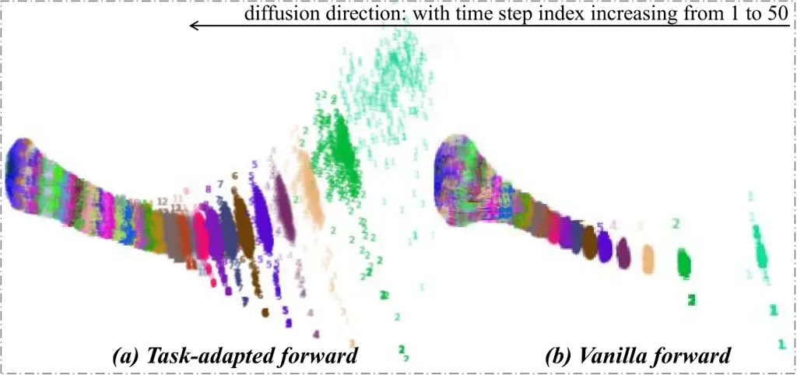
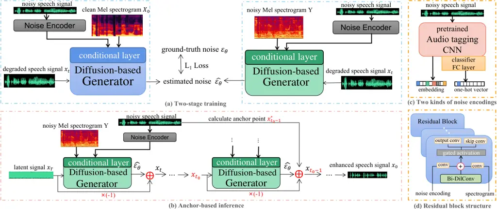
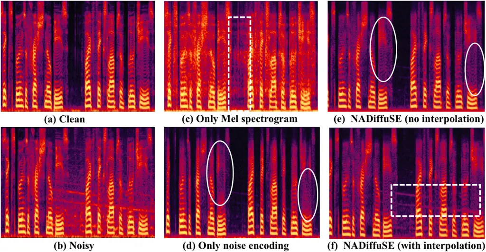
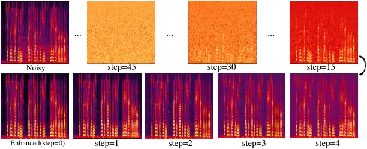

# NADiffuSE: Noise-aware Diffusion-based Model for Speech Enhancement

\authorblockN Wen Wang, Dongchao Yang, Qichen Ye, Bowen Cao and Yuexian
Zou^(∗) \authorblockA the School of Electronic and Computer Engineering,
Peking University, Shenzhen, 518055, China  
E-mail: {wangw, 2001212832, yeeeqichen, cbw2021}@stu.pku.edu.cn,
zouyx@pku.edu.cn ^(†)^(†)thanks: \*Corresponding author

###### Abstract

The goal of speech enhancement (SE) is to eliminate the background
interference from the noisy speech signal. Generative models such as
diffusion models (DM) have been applied to the task of SE because of
better generalization in unseen noisy scenes. Technical routes for the
DM-based SE methods can be summarized into three types: task-adapted
diffusion process formulation, generator-plus-conditioner (GPC)
structures and the multi-stage frameworks. We focus on the first two
approaches, which are constructed under the GPC architecture and use the
task-adapted diffusion process to better deal with the real noise.
However, the performance of these SE models is limited by the following
issues: (a) Non-Gaussian noise estimation in the task-adapted diffusion
process. (b) Conditional domain bias caused by the weak conditioner
design in the GPC structure. (c) Large amount of residual noise caused
by unreasonable interpolation operations during inference. To solve the
above problems, we propose a noise-aware diffusion-based SE
model (NADiffuSE) to boost the SE performance, where the noise
representation is extracted from the noisy speech signal and introduced
as a global conditional information for estimating the non-Gaussian
components. Furthermore, the anchor-based inference algorithm is
employed to achieve a compromise between the speech distortion and noise
residual. In order to mitigate the performance degradation caused by the
conditional domain bias in the GPC framework, we investigate three model
variants, all of which can be viewed as multi-stage SE based on the
preprocessing networks for Mel spectrograms. Experimental results show
that NADiffuSE outperforms other DM-based SE models under the GPC
infrastructure. Audio samples are available at:
https://square-of-w.github.io/NADiffuSE-demo/.

¹¹footnotetext: Corresponding author.

## 1 Introduction

In the last decade, deep learning (DL) methods \[2, 3\] have become the
mainstream for speech enhancement (SE), which can be divided into two
categories: the discriminative and generative ones \[4\]. The
discriminative methods learn nonlinear mappings\[5\] or estimate
time-frequency masks \[6, 7, 8\] through annotated speech data pairs,
but suffer from non-linear artifacts and poor generalizations \[9\]. The
generative approaches \[10, 11, 12\] employ different infrastructures
such as Generative Adversarial Networks (GANs) \[13\], Variational
Autoencoders (VAEs) \[14\] and flow-based models \[15\] to learn the
distribution of clean speech signals, which can be more robust to
complex and varying noise scenarios \[16\].

Diffusion Denoising Probabilistic Models (DDPM) \[18\] is a new kind of
generative model inspired by the nonequilibrium thermodynamics \[17\].
DDPM corrupts the data to the pre-defined Gaussian distribution by
gradually adding noise at the forward process, and the random noise is
progressively denoised and finally restored to the original data at the
reverse stage. Many works \[24, 23, 25\] have employed the DDPM to
generate natural and high-quality human voice from the given text or Mel
spectrogram. Recently, DDPM-based SE methods \[31, 32, 30, 28, 29, 27,
33, 35, 34\] have also been explored for the promising result in speech
generation.



Figure 1: To demonstrate the effect of non-Gaussian noise in
diffusion-based SE, we visualize the vanilla and task-adapted diffusion
process: we randomly selected 2000 utterances, which are first converted
into Mel spectrograms, then cropped to 62 frames (same as the training
settings), and finally visualized in two dimensions using the t-SNE
algorithm. We use different colors and indexes to label the data at
different time steps.

Current diffusion-based SE models can be categorized into three types.
The first \[30, 31, 32\] is to change the mathematical form of the
diffusion process to adapt to the task of SE, in which the mean of clean
speech signals is gradually pulled towards the noisy ones by
interpolating the asymptotically increasing noisy signal, so that the
reverse stage is directly the speech enhancement process. The second
\[28, 29, 27, 30\] is to train a conditional network based on a
well-trained pure speech generation network (Generator-plus-Conditioner,
GPC). Under this setting, the enhanced speech signal is generated with
the acoustic feature produced by the conditioner, which can be expressed
as output = generator(conditioner(noisy input)). The last is to develop
a multi-stage SE  where the diffusion model aims to learn the
fine-grained or residual speech signal based on the coarsely enhanced
one \[33, 35, 34\]. This study focuses on the first two lines, and
leverages a task-adapted diffusion process under the GPC architecture to
deal with the real noise.

However, there exists three problems in the existing works: (1)
Non-Gaussian Estimation. As shown in Fig. 1, incorporating the noisy
signal into the forward process makes the data no longer satisfies the
tight Gaussian distribution at each step, which we attribute to the
effect of background noise. Noise interference varies in realistic
scenarios, hence it is challenging for SE models to understand the
patterns of various noise and to adaptively learn the ability of
denoising in real situations \[44, 45, 46, 47\]. Moreover, the
estimation target changes from the added Gaussian noise to a combination
of Gaussian noise and non-Gaussian background noise, which makes
training the model harder \[31\]. (2) Conditional domain bias. In the
GPC framework, the generator and conditioner determine the upper and
lower bounds for the SE performance: If a conditioner can ideally map
the noisy features completely to the pure ones, the best performance of
SE is then obtained (upper bound). Otherwise, if the conditioner does
not work at all, the worst performance is obtained (lower bound). Table
1 records the SE performance bounds of \[30\]. We observe that current
conditioner is not sufficient to compensate for the gap between lower
and upper bounds. We define it as conditional domain bias, which results
from the change in the dimension, type and purity of the acoustic
features (usually Mel spectrogram). (3) Under-explained interpolation.
In the original inference algorithm (_cf._ Line 11, Alg. 1), the linear
interpolation operation \[27, 30, 31\] is commonly used in the last step
with a certain percentage ($`r=0.2`$), which serves as an implicit
post-processing method to supplement the lost speech details. Although
the interpolation does improve the objective evaluation metrics (_cf._
Table 3 row 4 and 5), its validity is limited due to the introduced
large amount of additional noise. We give a comparison between with and
without the interpolation in Fig. 4 as an example of evidence: the white
dashed box in (f) indicates the presence of the significant noise
components.

To address the above issues, our improvements are refined into a
noise-aware diffusion-based SE model (NADiffuSE). The main contributions
of this work are summarized as follows:

- 1.  To more accurately estimate the non-Gaussian noise component in the
      task-adapted diffusion process, we propose to use noise encodings to
      guide the diffusion model for adaptive noise reduction in real noisy
      situations.
- 2.  To further reduce the conditional domain bias under the GPC
      architecture, we design three network variants based on the additional
      pre-processor network to improve the quality of regenerated speech
      signals.
- 3.  To reduce the additional noise introduced by the interpolation
      operation, we construct a relatively accurate data anchor point from
      noisy speech signals at specified time steps, based on which we use
      iterative interpolation operations to refine the speech details.

## 2 Related Work

### 2.1 Diffusion Model

The diffusion model \[18, 37, 36\] contains a forward and a backward
process. In the mathematical form of DDPM \[18\], each process is
represented by a first-order Markov chain with fixed time steps. In the
forward process, a series of corrupted data
$`x_{1:T}=x_{1},x_{2},...,x_{T}`$ can be obtained from the original
clean data $`x_{0}`$ through the transfer distribution
$`q(x_{t}|x_{0})=\sqrt{\bar{a}_{t}}x_{0}+\sqrt{1-\bar{a}_{t}}\epsilon`$,
where $`\bar{a}_{t}=\prod\limits_{i=1}^{T}a_{i}`$,
$`a_{t}=1-\beta_{t}`$, $`\epsilon\sim\mathcal{N}(0,I)`$ and
$`\beta_{t}`$ is a constant defined in advance. In the reverse process,
the original data $`x_{0}`$ can be recovered from the latent
distribution $`x_{T}`$ by iteratively performing the backward transfer
step
$`p_{\theta}(x_{t-1}|x_{\text{t}})=\mu_{\theta}(x_{t})+\widetilde{\beta_{t}}I`$,
where $`\widetilde{\beta_{t}}`$ is a constant and
$`\mu_{\theta}(x_{t})=\frac{1}{\sqrt{a_{t}}}(x_{t}-(\beta_{t}/\sqrt{1-\bar{a}_{t}})\epsilon_{\theta}(x_{t}))`$.

### 2.2 Diffusion-based SE Methods

The current technical routes of diffusion-based SE mothods can be
divided into three categories: Task-adapted diffusion formula, GPC
structures and multi-stage frameworks.

Task-adapted diffusion formula \[30, 31, 32\] adapt the task of SE by
incorporating the noisy sigal $`y`$ into the diffusion process: the mean
of $`x_{t}`$ is progressively pulled from the $`x_{0}`$ to $`y`$. The
data degradation in \[30\] is formulated as Eq. 1, where
$`m_{t}=\sqrt{(1-\bar{\alpha_{t}})/\sqrt{\bar{\alpha_{t}}}}`$ denotes
the asymptotic coefficient and
$`\bar{\delta_{t}}=1-(1+m_{t}^{2})\bar{\alpha_{t}}`$ is the variance for
added Gaussian noise.

```math
x_{t}=\sqrt{\bar{a_{t}}}((1-m_{t})x_{0}+m_{t}\cdot y)+\sqrt{\bar{\delta_{t}}}\epsilon \tag{1}
```

While \[31, 32\] have the closed-form solution for the mean value as
$`\mu(x_{0},y,t)=e^{-\gamma t}x_{0}+(1-e^{-\gamma t})y`$.

|                                                       |       |      |      |      |      |
| ----------------------------------------------------- | ----- | ---- | ---- | ---- | ---- |
| \(a\) Evaluation results on new VoiceBank-Demand      |       |      |      |      |      |
| Model                                                 | Mode  | CSIG | CBAK | COVL | PESQ |
| Unprocessed                                           | /     | 3.65 | 3.16 | 2.91 | 2.13 |
| CDiffuSE                                              | /     | 3.83 | 3.13 | 3.19 | 2.55 |
| DiffWave                                              | Upper | 4.41 | 3.57 | 3.84 | 3.26 |
|                                                       | Lower | 3.45 | 2.68 | 2.78 | 2.16 |
| DiffWave-Cls                                          | Upper | 4.65 | 3.67 | 4.05 | 3.44 |
|                                                       | Lower | 3.55 | 2.73 | 2.86 | 2.20 |
| DiffWave-Emb                                          | Upper | 4.34 | 3.54 | 3.79 | 3.22 |
|                                                       | Lower | 3.59 | 2.78 | 2.89 | 2.22 |
| \(b\) Evaluation results on original VoiceBank-Demand |       |      |      |      |      |
| Model                                                 | Mode  | CSIG | CBAK | COVL | PESQ |
| Unprocessed                                           | /     | 3.35 | 2.44 | 2.63 | 1.97 |
| CDiffuSE                                              | /     | 3.66 | 2.83 | 3.03 | 2.44 |
| DiffWave                                              | Upper | 4.34 | 3.53 | 3.79 | 3.21 |
|                                                       | Lower | 3.40 | 2.55 | 2.71 | 2.08 |
| DiffWave-Emb                                          | Upper | 4.36 | 3.42 | 3.78 | 3.19 |
|                                                       | Lower | 3.41 | 2.47 | 2.74 | 2.15 |

Table 1: Evaluation results of the GPC structure \[27\] on new (a) and
original (b) VoiceBank-Demand; For WaveNet\[39\]-based generator we
evaluated the SE performance’s Upper (generator with clean Mel
spectrograms) and Lower (with noisy Mel spectrograms) bounds.
Task-adapted diffusion process \[30\] is adopted here.



Figure 2: An overview of the proposed NADiffuSE: (a) pre-training (left)
and fine-tuning (right), both of which are conditioned on Mel
spectrograms and noise encodings; (b) improved inference process where
the iterative interpolation operates in the last $`t_{0}`$ steps based
on the anchor point; (c) latent embedding (left) and category classifier
(right) of noise encoding in proposed noise-aware training; (d)
bi-conditional Residual blocks.

GPC structures consist of a generator which can generate the clean
speech signal based on the clean conditions and a conditioner, i.e.
network designs or training methods. One kind of conditioner \[27, 30\]
works through two-stage training: the first stage uses the 80-dim pure
Mel spectrogram as a condition (pre-training), and the second one
adjusts the weights using the 513-dim noisy amplitude
spectrogram (fine-tuning). The other \[29\] is replacing the submodule
in the generator with a newly trained one to alter the degraded
conditions to match the original ones.

Multi-stage frameworks take full advantage of the nature that the
diffusion model is more suitable for detail refinement. The coarsely
enhanced result is obtained through a discriminative model or also a
diffusion-based mothod. And then conditioned on the coarsely enhanced
signal, the diffusion model is used to generate the fine-grained
enhanced signal \[34, 35\] or the residual signal \[33\] against the
clean one.

## 3 Proposed Method

We make improvements to address the above issues and give an overview
diagram in Fig. 2. The training process in (a) follows the same
two-stage paradigm as \[30\], where both noise encodings and
spectrograms are used as conditional information. The inference process
in (b) is iterative and improved using noisy speech signals $`y`$ in the
last steps.

### 3.1 Noise encodings

We propose to additionally use noise coding as global conditional
information in an aim to mine the priori information of the acoustic
noise to guide the diffusion model for accurate combine noise
estimation. We explore two different types of noise encodings as drawn
in (c).

#### 3.1.1 Category classifier

We first use the categorical properties of the background noise, in
which the noise type labels are fed into the learnable embedding layer
in the form of one-hot vectors. In order to get the ground truth noise
label during training, we only consider a fixed number of closed sets of
noise scenes. At the inference stage, a noise classifier is required to
predict the noise type of the noisy speech signal. The background noise
is usually labeled using the the keywords of the acoustic scene where
the noise is collected, like living room, street, bathroom and etc. The
concept of noise semantics is difficult to define and we propose to
describe the background noise with acoustic events. We observe a
one-to-many relationship between noise scenes and sound events, for
example, keyboard tapping, TV background and babble noise may exist
simultaneously in a living scene. Therefore, we perform transfer
learning based on a large-scale pre-trained network structure \[43\] for
the audio tagging task. We load the pre-trained weights as
initialization and add a linear classification into the original
structure. As described above, we build a noise classifier whose input
is the noisy speech signal and output is a value belonging to a
predefined set of noisy scene labels $`\left\{0,1,...,N-1\right\}`$,
with $`N`$ being the total number of noise categories.

#### 3.1.2 Latent embedding

In order to extend the noise encodings to the open domain, we further
explore to characterize the noise properties in a latent embedding
mechanism. We directly use the output of the classifier’s (described
above) last hidden layer as a noise feature. The 2048-dimensional
embedding is extracted from the noisy speech signal and aligned with the
hidden dimension of the residual block through MLP structure. It is
worth noting that we still fine-tune the convolutional feature extractor
using the classification task in order to make it more relevant to the
background noise characterization.

1: Sample $`x_{T}\sim p_{latent}`$

2: for $`t=T-1,T-2,...,0`$ do

3:   Compute $`\mu_{\theta}(x_{t+1},y)`$ and $`\bar{\delta_{t}}`$ as in
Eq. (3)

4:   Sample $`x_{t}=\mu_{\theta}(x_{t+1},y)+\bar{\delta_{t}}I`$ from
$`p_{\theta}(x_{t}|x_{t+1},y)`$

5:   if select Improved Sampling and $`t<t_{0}`$: then

6:    Calculate the anchor point $`x_{t}^{*}`$ using Eq. (2)

7:    Do interpolation
$`x_{t}=r_{t}\cdot x_{t}^{*}+(1-r_{t})\cdot x_{t}`$

8:   end if

9: end for

10: if select Original Sampling: then

11:   $`x_{0}=r\cdot x_{0}+(1-r)\cdot y`$

12: end if

13: return $`x_{0}`$

Algorithm 1 Anchor-based Inference algorithm

### 3.2 Anchor-based inference algorithm

The ideal case of inference is that the reverse data distribution fits
the forward one exactly. We use the same conditional diffusion process
as in Eq. 1, where the mean value is determined partly by $`x_{0}`$ and
partly by $`y`$. Thus we can use the noisy signal $`y`$ (known during
inference) to construct a relatively accurate anchor point for the
reverse process in Eq 2, where $`\bar{\alpha_{t}}`$ and
$`\bar{\delta_{t}}`$ follow the previous definition.

```math
x_{t}^{*}=m_{t}\sqrt{\bar{a_{t}}}y+\sqrt{\bar{\delta_{t}}}\epsilon \tag{2}
```

Anchors contain both useful clean speech details and degraded background
noise. We have described in Section 1 the pros and cons of the current
interpolation operation used in the inference process. Rather than
directly interpolating the result using noisy speech at the final step,
We use anchors for the interpolation to decrease the extra noise. We use
the anchor-based interpolation repeatedly in and only in the last few
steps, because the data will be more sensitive to the slight
inaccuracies as inference finishes. Therefore, we have used iterative
interpolation operations to remove some of the noise residules contained
in the anchor points by stepwise refinement. To further weaken the
effect of noise, we linearly anneal the interpolation coefficients at
the rate of $`1/t_{0}`$ (other annealing options are worth exploring).
Our improved anchor-based inference algorithm is given in Alg. 1: we
follow Eq. (3) at each step to sample $`x_{t-1}`$ from the reverse
probability distribution, and in the last $`t_{0}`$ steps perform an
interpolation with the anchor point. The mean is a linear combination of
$`x_{t}`$, $`y`$ and the estimated noise term $`\epsilon`$, where
$`c_{xt}`$,$`c_{yt}`$ and $`c_{\epsilon t}`$ are constants and the
detailed derivation follows \[30\].

```math
\begin{split}\mu_{\theta}(x_{t+1},y)=&c_{xt}x_{t}+x_{yt}y_{t}+c_{\epsilon t}\epsilon_{\theta}\\
\bar{\delta_{t}}=&\delta_{t-1}-\frac{1-m_{t}}{1-m_{t-1}}^{2}\alpha_{t}\frac{\delta_{t-1}^{2}}{\delta_{t}}\end{split} \tag{3}
```

### 3.3 Model variants in the conditioner design

Figure 3: Training (dashed line) and inference  (solid line) pipelines
of three conditioners based on the preprocessor: (a) preprocessor used
for enhancing the noisy Mel spectrograms (known as coarse) (b)
coarse-and-refine only needs one training stage in which the generator
is trained with clean Mel spectrograms and inferenced with enhanced ones
(c) coarse-and-finetune stills goes through the second training stage
where the generator is finetuned with enhanced Mel spectrograms (d)
coarse-and-scratch also needs only one training stage where the
generator uses enhanced Mel spectrograms in both the training and
inference phases.

In the section 1 we give a definition of the conditional domain bias, a
problem that exists under the generator-plus-conditioner (GPC)
structure. Following the similar conditioner design in \[30\], we first
consider using the 80-dimensional Mel spectrogram as conditional
information in both training stages to reduce the difficulty of aligning
the conditional domain in the fine-tuning phase. Given that the current
conditional mapping layer contains only a simple up-sampling layer and a
shallow MLP structure, we are inspired by \[38\] to additionally train a
preprocessing network (preprocessor) for enhancing the Mel spectrogram.
Thus we can get the pre-enhanced Mel spectrogram and name this process
as coarse. Given the pre-enhanced Mel spectrogram: on the one hand it
can be directly used as the initial result of the enhancement and then
refined using the generator (coarse-and-refine). On the other, compared
to the noisy speech signal’s Mel spectrogram, it is less difficult to
perform fine-tuning with the pre-enhanced one (coarse-and-finetune).
Last, the pre-enhanced Mel spectrogram is available in both training and
testing phases, which can be used to directly train a generator from
scratch, without further fine-tuning. In conclusion, three feasible
conditioner designs are illustrated in Fig. 3 (b), (c) and (d).

- 1.  Coarse-and-refine: The generator which is only trained with clean Mel
      spectrograms can be directly used to generate the speech with the
      pre-enhanced Mel spectrograms.
- 2.  Coarse-and-finetune: After training with clean Mel spectrograms, the
      generator is then fine-tuned with enhanced Mel spectrograms instead of
      the noisy ones.
- 3.  Coarse-and-scratch: The generator is trained from scratch using the
      pre-enhanced Mel spectrograms.

All three network variants use the pre-enhanced Mel spectrogram as a
condition for inference, and Gaussian-like speech signal sampled from
latent distribution $`N(x_{T};\sqrt{\bar{\alpha}_{T}}y,\delta_{T}I)`$ as
signal input. The above proposed conditioner mechanism is applicable for
all SE models under the GPC structure.

[TABLE]

Table 2: Comparative results of the proposed NADiffuSE on Auxialiary
information. All results adopted the original interpolation operation
where 20% noisy signal is added at the end of the reverse process. Sign \* means reproduced results.

## 4 Experiment

### 4.1 Experimental Setup

#### 4.1.1 Dataset

We evaluated above all methods on the original and newly simulated
VoiceBank-DEMAND \[40\] dataset. The new one follows the same setting
which consists of 30 speakers from the VoiceBank \[41\] corpus and was
mixed with 12 noise types^(\*)^(\*) \* TCAR, PSTATION, DLIVING, TBUS,
TMETRO, OMEETING, SPSQUARE, STRAFFIC, PRESTO, OOFFICE, PCAFETER, NFIELD.
from the DEMAND \[42\] database. It was then divided into a training,
validation and test set with 26, 2 and 2 speakers, containing 10792, 770
and 824 synthesized utterances, respectively. The signal-to-Noise (SNR)
range of the training and validation set is
$`\left\{0,5,10,15\right\}`$, and the test set is
$`\left\{2.5,7.5,12.5,17.5\right\}`$. All of the utterances were
resampled to 16KHz sampling rates. We use PESQ, CSIG, CBAK and COVL as
evaluation metrics for enhanced speech, with higher scores indicating
better performance.

#### 4.1.2 Model infrastructure

Our proposed model follows the generator-plus-conditioner architecture
mentioned in the previous section. The generator is constructed based on
DiffWave \[24\], which is a diffusion model based vocoder and has been
extended to the task of SE by \[27, 30, 29\]. The network in above works
constructs from WaveNet \[39\] which has 30 layers of residual blocks
with dilated convolution (conv) and gated activation. As shown in Fig. 2
(d), each residual block has two 1x1 conv layers for Mel spectrograms
and noise encodings.

#### 4.1.3 Training settings

All of experiments are based on the same training configurations as
CDiffuSE-base \[30\] in which 50-step linear noise scheduler
$`\beta_{t}\in[1\times 10^{-4},0.035]`$ is used. The learning rate is
$`2\times 10^{-4}`$ and the batch size is 16 for both training stages.
The dimension for the Mel spectrogram is 80, which is transformed by
STFT with the window size of 1024 and the shift of 256. We uniformly
train 100w iterations in the first training stage and 30w in the second
stage. The full sampling scheme is used in the reverse process.

### 4.2 Evaluation results for noise encodings

To resolve the non-Gaussian estimation problem proposed in the Section
1, two types of noise encodings, namely category classifier (Cls) and
latent embedding (Emb) were explored in Table 1. Among them, the latent
embedding form cannot obtain good performance gain in upper bound
probably because it contains too much redundant information about audio
events in the background noise that does not need to be considered.
Therefore, our following proposed model uses the noise representation in
the form of one hot vectors by default. In order to get the ground-truth
background noise labels, we conducted experiments on the new simulated
dataset. The ablation studies are done to validate the effectiveness of
noise encodings. From Table 2 we can observe: (1) Under the GPC
archietecture, mel-spectrogram works as an important condition to
improve the metric scores of restored speech signals when compared with
row 3 and 4; (2) Metrics in row 5 increase a little compared to row 3,
showing that the noise embeddings can improve the enhancement
performance to some extent, but slightly lacks in speech detail
fidelity; (3) The best performance is obtained when two conditions are
both used as NADiffuSE (row 6) reach the highest scores among all
combination of auxiliary information. It can be explained that the noise
embedding provides the priori information about noise patterns, and thus
viewed as an implicit multi-branch switch that guides the model for
adaptive noise reduction. We also visualized the effects in in Fig. 4:
when inference only with Mel spectrograms, more details in the input
noisy speech signal are reserved, but also including residual background
noise components according to the dashed box in (c); when only using
noise encodings, the noise is removed more completely, owing to the
explicit use of noise characteristics, but some speech details are lost
as shown by the solid ellipse in (d). Another point of interest is that
the difference between Table 2 row 2 and 4 is only in the spectral
information used in the second training phase. The results show that row
4 can achieve comparable (or even a little better) results than row 2,
which validates our view that there is no need to change the type and
dimensionality of spectrograms before and after the two training phases,
and lays the foundation for our proposal of a preprocessing network for
the Mel spectrogram later on.

### 4.3 Evaluation results for the improved inference



Figure 4: Mel spectrograms of (a) clean speech, (b) noisy speech, (c)
enhanced speech only using the mel-spectrogram as condition, (d)
enhanced speech only using noise encodings, (e) NADiffuSE’s enhanced
speech without the interpolation and (f) NADiffuSE’s enhanced speech
with the interpolation. The dashed box indicates noise residuals and the
solid ellipse indicates speech distortion.

[TABLE]

Table 3: Comparative results of the the anchor-based inference
algorithm. For the sampling option, ”$`t=0`$” with ”$`r=0.2`$” means the
original interpolation during inference (denoted by ”-”). Sign ”+” means
our improved inference algorithm. All baseline are reproduced on the new
dataset.

| Row-Id | Method              | CSIG | CBAK | COVL | PESQ |
| ------ | ------------------- | ---- | ---- | ---- | ---- |
| 0      | gt-NADiffuSE+       | 3.95 | 3.22 | 3.31 | 2.69 |
| 1      | 92%-NADiffuSE+      | 3.94 | 3.18 | 3.29 | 2.66 |
| 2      | 96%-NADiffuSE+      | 3.94 | 3.18 | 3.31 | 2.69 |
| 3      | Coarse-and-refine   | 4.06 | 3.22 | 3.44 | 2.84 |
| 4      | Coarse-and-finetune | 3.93 | 3.20 | 3.24 | 2.54 |
| 5      | Coarse-and-scratch  | 3.98 | 3.19 | 3.35 | 2.74 |

Table 4: Evaluation Results of NADiffuSE+ and its variants. For the
needed noise labels, we need an accurate noise classifier. We denote the
ground-truth noise label as gt. Models with the 92% and 96% accuracy
classifier are abbreviated as 92%-NADiffuSE+ and 96%-NADiffuSE+.

To evaluate the anchor-based inference algorithm, we first analyze the
original interpolation operation in the inference algorithm and further
investigate different parameter settings for the improved inference
algorithm. We can first summarize from Table 3 that without any
interpolation operation, the performance will significantly degrade
because there is a big gap between NADiffuSE- and NADiffuSE. As we have
analyzed in Section 3.2, we only use iterative interpolation operations
in a limited number of time steps because of the increasing sensitivity
to extra noise during the inference. In Fig. 5, we give an example of
visualization on the inference process where the last five steps play an
important role in restoring the speech signal. Therefore, we empirically
choose $`t=5`$ first and explore the effect of different interpolation
coefficients on the final performance in the row 8, and we can find that
the smaller the coefficient is, the higher the performance gain can be
obtained. Specially, we degrade the coefficients linearly on average
with the time step, e.g. for $`t=5,r=0.1`$, we would apply coefficients
of $`[0.1,0.08,0.06,0.04,0.02]`$ for the last five steps respectively.
After we experimentally selected r = 0.1, we did a validation test in
row 10 and the results showed that the final performance indeed
decreases as the time step t increases. Ovarally, we have some
conclusions: (1) Our proposed inference algorithm is more effective than
the original one. (2) $`r=0.1,t=5`$ is the best parameter setting.

### 4.4 Evaluation results for the proposed model and its variants



Figure 5: Visualization of the iterative reverse stage. The spectrograms
of specific time steps are given, showing the importance of the last
five steps for speech restoration.

| Method      | CSIG | CBAK | COVL | PESQ |
| ----------- | ---- | ---- | ---- | ---- |
| Unprocessed | 2.84 | 2.75 | 2.21 | 1.59 |
| DiffuSE     | 2.92 | 2.69 | 2.40 | 1.89 |
| CDiffuSE    | 2.97 | 2.72 | 2.42 | 1.91 |
| NADiffuSE+  | 3.04 | 2.73 | 2.46 | 1.92 |

Table 5: Results of unseen noise scenes from the simulated dataset with
VoiceBank and Noisex-92.

#### 4.4.1 Overal model

Through the previous experiments, our proposed model is identified as a
time-domain diffusion model that uses Mel specrograms and the category
classifier form of noise encodings as conditional information in both
training stages. For inference, we need to train a noise
classifier (detail in Section 3.1.1) to get the estimated noise type
from the given noisy speech signal. The experimental results in Table 4
show that the convergence of the noisy classifier on our newly simulated
dataset is not difficult and there is no significant difference in the
final SE performance between the two trained classifiers with 92% and
96% accuracy (row 1 v.s. 2). This can be interpreted as redundancy in
the current category labeling of background noise, which inspires us to
explore more fine-grained noise encoding. Our proposed NADiffuSE and
NADiffuSE+ both perform better than DiffuSE \[27\] and CDiffuSE \[30\].
But this way of diffusion-based SE models still lag behind spectral
domain methods such as \[32\], which uses the stochastic differential
equation to formulate the diffusion process. Furthermore, we also
conduct out-of-domain experiments to validate NADiffuSE’s generalization
ability for unseen noise scenes compared with baselines. We simulated
the new dataset using VoiceBank \[41\] and Noisex-92 with the same
setting in Section 4.1.1. Results in Table 5 show that our method
achieves better scores than other time-domain models under the GPC
structure.

#### 4.4.2 Variants

We compare the performance of the three network variants described in
the previous paper and all our inferences are based on the improved
algorithm with the best parameter setting, $`r=0.1,t=5`$. All variants
are based on 96%-NADiffuSE+. As shown in Table 4, the coarse-and-refine
approach achieves the best performance. The coarse-and-scratch can get a
small performance gain with only one training stage required. The
coarse-and-finetune performs comparably to the originally proposed
model, with no significant performance gains, which may further need a
well-selected pre-trainig checkpoint and fine-tuning strategy. We can
gain insight from row 3 that multi-stage iterative speech enhancement
can help recover speech details better, and generative diffusion models
have great potential for detail refinement in data reconstruction. All
above network variants essentially rely on the training of respective
sub-modules, so the quality of the pre-enhanced spectrogram feature
would limit the final SE performance.

## 5 Conclusions

We summarize and analyze the current diffusion-based speech enhancement
methods, where in the setting of generator-plus-conditional
architecture (GPC), we propose a noise-aware diffusion-based SE
model (NADiffuSE), which conducts denoising under the global guidance of
noise encodings to help the non-Gaussian noise estimation. To reduce the
additional noise introduced by the original interpolation operation, we
propose the anchor-based inference algorithm to to complement speech
details and reduce the residual noise. Plus, we investigate three
variants of NADiffuSE which use the preprocessing network to enhance the
Mel spectrogram in advance, to further bridge the gap in the performance
bounds. Through experiments, we have shown that our model performs
better than other diffusion-based SE models under the GPC structure.

## Acknowledgment

This paper was partially supported by NSFC (No:62176008) and Shenzhen
Science&Technology Research Program (No:
GXWD20201231165807007-20200814115301001).

## References

- \[1\] P. C. Loizou, _Speech enhancement: theory and practice_. CRC
  press, 2007.
- \[2\] Y. Xu, J. Du, L. Dai, and C. Lee, “An experimental study on
  speech enhancement based on deep neural networks,” _IEEE Signal
  processing letters_, vol. 21, no. 1, pp. 65–68, 2013.
- \[3\] Y. Xu, J. Du, Z. Huang, L. Dai, and C. Lee, “Multi-objective
  learning and mask-based post-processing for deep neural network based
  speech enhancement,” _arXiv preprint arXiv:1703.07172_, 2017.
- \[4\] Z. Zhou, _Machine learning_. Springer Nature, 2021.
- \[5\] Y. Xu, J. Du, L. Dai, and C. Lee, “A regression approach to
  speech enhancement based on deep neural networks,” _IEEE/ACM
  Transactions on Audio, Speech, and Language Processing_, vol. 23,
  no. 1, pp. 7–19, 2014.
- \[6\] D. Wang, “On ideal binary mask as the computational goal of
  auditory scene analysis,” in _Speech separation by humans and
  machines_. Springer, 2005, pp. 181–197.
- \[7\] A. Narayanan and D. Wang, “Ideal ratio mask estimation using
  deep neural networks for robust speech recognition,” in _2013 IEEE
  International Conference on Acoustics, Speech and Signal
  Processing_. IEEE, 2013, pp. 7092–7096.
- \[8\] D. Williamson, Y. Wang, and D. Wang, “Complex ratio masking for
  monaural speech separation,” _IEEE/ACM Transactions on Audio, Speech,
  and Language processing_, vol. 24, no. 3, pp. 483–492, 2015.
- \[9\] P. Loizou and G. Kim, “Reasons why current speech-enhancement
  algorithms do not improve speech intelligibility and suggested
  solutions,” _IEEE Transactions on Audio, Speech, and Language
  Processing_, vol. 19, no. 1, pp. 47–56, 2010.
- \[10\] S. Pascual, A. Bonafonte, and J. Serra, “Segan: Speech
  enhancement generative adversarial network,” _Proc. Interspeech 2017_,
  pp. 3642–3646, 2017.
- \[11\] Y. Bando, M. Mimura, K. Itoyama, . Yoshii, and T. Kawahara,
  “Statistical speech enhancement based on probabilistic integration of
  variational autoencoder and non-negative matrix factorization,” in
  _2018 IEEE International Conference on Acoustics, Speech and Signal
  Processing (ICASSP)_. IEEE, 2018, pp. 716–720.
- \[12\] M. Strauss and B. Edler, “A flow-based neural network for time
  domain speech enhancement,” in _ICASSP 2021-2021 IEEE International
  Conference on Acoustics, Speech and Signal Processing (ICASSP)_. IEEE,
  2021, pp. 5754–5758.
- \[13\] A. Creswell, T. White, V. Dumoulin, K. Arulkumaran, and
  A. Sengupta, B.and Bharath, “Generative adversarial networks: An
  overview,” _IEEE signal processing magazine_, vol. 35, no. 1, pp.
  53–65, 2018.
- \[14\] D. Kingma and M. Welling, “Auto-encoding variational bayes,”
  _arXiv preprint arXiv:1312.6114_, 2013.
- \[15\] D. Kingma and P. Dhariwal, “Glow: Generative flow with
  invertible 1x1 convolutions,” _Advances in neural information
  processing systems_, vol. 31, 2018.
- \[16\] L. Ruthotto and E. Haber, “An introduction to deep generative
  modeling,” _GAMM-Mitteilungen_, vol. 44, no. 2, p. e202100008, 2021.
- \[17\] J. Sohl-Dickstein, E. Weiss, N. Maheswaranathan, and
  S. Ganguli, “Deep unsupervised learning using nonequilibrium
  thermodynamics,” in _International Conference on Machine
  Learning_. PMLR, 2015, pp. 2256–2265.
- \[18\] J. Ho, A. Jain, and P. Abbeel, “Denoising diffusion
  probabilistic models,” _Advances in Neural Information Processing
  Systems_, vol. 33, pp. 6840–6851, 2020.
- \[19\] J. Ho, C. Saharia, W. Chan, D. Fleet, and e. a. Norouzi, M,
  “Cascaded diffusion models for high fidelity image generation.” _J.
  Mach. Learn. Res._, vol. 23, no. 47, pp. 1–33, 2022.
- \[20\] A. Lugmayr, M. Danelljan, A. Romero, F. Yu, and e. a. Timofte,
  R, “Repaint: Inpainting using denoising diffusion probabilistic
  models,” in _Proceedings of the IEEE/CVF Conference on Computer Vision
  and Pattern Recognition_, 2022, pp. 11 461–11 471.
- \[21\] X. Li, J. Thickstun, I. Gulrajani, P. Liang, and T. Hashimoto,
  “Diffusion-lm improves controllable text generation,” _Advances in
  Neural Information Processing Systems_, vol. 35, pp. 4328–4343, 2022.
- \[22\] Z. He, T. Sun, K. Wang, X. Huang, and X. Qiu, “Diffusionbert:
  Improving generative masked language models with diffusion models,”
  _arXiv preprint arXiv:2211.15029_, 2022.
- \[23\] N. Chen, Y. Zhang, H. Zen, R. Weiss, and e. a. Norouzi, M,
  “Wavegrad: Estimating gradients for waveform generation,” _arXiv
  preprint arXiv:2009.00713_, 2020.
- \[24\] Z. Kong, W. Ping, J. Huang, K. Zhao, and B. Catanzaro,
  “Diffwave: A versatile diffusion model for audio synthesis,” _arXiv
  preprint arXiv:2009.09761_, 2020.
- \[25\] D. Yang, J. Yu, H. Wang, W. Wang, and e. a. Weng, C,
  “Diffsound: Discrete diffusion model for text-to-sound generation,”
  _IEEE/ACM Transactions on Audio, Speech, and Language
  Processing_, 2023.
- \[26\] M. Xu, L. Yu, Y. Song, C. Shi, and e. a. Ermon, S, “Geodiff: A
  geometric diffusion model for molecular conformation generation,”
  _arXiv preprint arXiv:2203.02923_, 2022.
- \[27\] Y. Lu, Y. Tsao, and S. Watanabe, “A study on speech enhancement
  based on diffusion probabilistic model,” in _2021 Asia-Pacific Signal
  and Information Processing Association Annual Summit and Conference
  (APSIPA ASC)_. IEEE, 2021, pp. 659–666.
- \[28\] J. Serrà, S. Pascual, J. Pons, R. Araz, and D. Scaini,
  “Universal speech enhancement with score-based diffusion,” _arXiv
  preprint arXiv:2206.03065_, 2022.
- \[29\] J. Zhang, S. Jayasuriya, and V. Berisha, “Restoring degraded
  speech via a modified diffusion model,” in _22nd Annual Conference of
  the International Speech Communication Association, INTERSPEECH
  2021_. International Speech Communication Association, 2021, pp.
  2753–2757.
- \[30\] Y. Lu, Z. Wang, S. Watanabe, A. Richard, and e. a. Yu, C,
  “Conditional diffusion probabilistic model for speech enhancement,” in
  _ICASSP 2022-2022 IEEE International Conference on Acoustics, Speech
  and Signal Processing (ICASSP)_. IEEE, 2022, pp. 7402–7406.
- \[31\] S. Welker, J. Richter, and T. Gerkmann, “Speech enhancement
  with score-based generative models in the complex stft domain,” _arXiv
  preprint arXiv:2203.17004_, 2022.
- \[32\] J. Richter, S. Welker, J. Lemercier, B. Lay, and T. Gerkmann,
  “Speech enhancement and dereverberation with diffusion-based
  generative models,” _arXiv preprint arXiv:2208.05830_, 2022.
- \[33\] Z. Qiu, M. Fu, Y. Yu, L. Yin, and e. a. Sun, F, “Srtnet: Time
  domain speech enhancement via stochastic refinement,” in _ICASSP
  2023-2023 IEEE International Conference on Acoustics, Speech and
  Signal Processing (ICASSP)_. IEEE, 2023, pp. 1–5.
- \[34\] R. Sawata, N. Murata, Y. Takida, T. Uesaka, and e. a. Shibuya,
  T, “A versatile diffusion-based generative refiner for speech
  enhancement,” _arXiv preprint arXiv:2210.17287_, 2022.
- \[35\] J. Lemercier, J. Richter, S. Welker, and T. Gerkmann, “Storm: A
  diffusion-based stochastic regeneration model for speech enhancement
  and dereverberation,” _arXiv preprint arXiv:2212.11851_, 2022.
- \[36\] Y. Song, J. Sohl-Dickstein, D. Kingma, A. Kumar, and e. a.
  Ermon, S, “Score-based generative modeling through stochastic
  differential equations,” _arXiv preprint arXiv:2011.13456_, 2020.
- \[37\] A. Nichol and P. Dhariwal, “Improved denoising diffusion
  probabilistic models,” in _International Conference on Machine
  Learning_. PMLR, 2021, pp. 8162–8171.
- \[38\] J. Su, Z. Jin, and A. Finkelstein, “Hifi-gan-2: Studio-quality
  speech enhancement via generative adversarial networks conditioned on
  acoustic features,” in _2021 IEEE Workshop on Applications of Signal
  Processing to Audio and Acoustics (WASPAA)_. IEEE, 2021, pp. 166–170.
- \[39\] A. Oord, S. Dieleman, H. Zen, K. Simonyan, and e. a. Vinyals,
  O, “Wavenet: A generative model for raw audio,” _arXiv preprint
  arXiv:1609.03499_, 2016.
- \[40\] C. Valentini Botinhao, X. Wang, S. Takaki, and J. Yamagishi,
  “Investigating rnn-based speech enhancement methods for noise-robust
  text-to-speech,” in _SSW_, 2016, pp. 146–152.
- \[41\] C. Veaux, J. Yamagishi, and S. King, “The voice bank corpus:
  Design, collection and data analysis of a large regional accent speech
  database,” in _2013 International Conference Oriental COCOSDA held
  jointly with 2013 Conference on Asian Spoken Language Research and
  Evaluation (O-COCOSDA/CASLRE)_. IEEE, 2013, pp. 1–4.
- \[42\] J. Thiemann, N. Ito, and E. Vincent, “The diverse environments
  multi-channel acoustic noise database (demand): A database of
  multichannel environmental noise recordings,” in _Proceedings of
  Meetings on Acoustics ICA2013_, vol. 19, no. 1. Acoustical Society of
  America, 2013, p. 035081.
- \[43\] Q. Kong, Y. Cao, T. Iqbal _et al._, “Panns: Large-scale
  pretrained audio neural networks for audio pattern recognition,”
  _IEEE/ACM Transactions on Audio, Speech, and Language Processing_,
  vol. 28, pp. 2880–2894, 2020.
- \[44\] Y. Xu, J. Du, L. Dai, and C. Lee, “Dynamic noise aware training
  for speech enhancement based on deep neural networks,” in _Fifteenth
  Annual Conference of the International Speech Communication
  Association_, 2014.
- \[45\] F. Deng, T. Jiang, X. Wang _et al._, “Naagn: Noise-aware
  attention-gated network for speech enhancement.” in _Interspeech_,
  2020, pp. 2457–2461.
- \[46\] H. Fang, G. Carbajal, S. Wermter, and T. Gerkmann, “Variational
  autoencoder for speech enhancement with a noise-aware encoder,” in
  _ICASSP 2021-2021 IEEE International Conference on Acoustics, Speech
  and Signal Processing (ICASSP)_. IEEE, 2021, pp. 676–680.
- \[47\] J. Lee, Y. Jung, M. Jung, and H. Kim, “Dynamic noise embedding:
  Noise aware training and adaptation for speech enhancement,” in _2020
  Asia-Pacific Signal and Information Processing Association Annual
  Summit and Conference (APSIPA ASC)_. IEEE, 2020, pp. 739–746.
- \[48\] S. Liu, D. Su, and D. Yu, “Diffgan-tts: High-fidelity and
  efficient text-to-speech with denoising diffusion gans,” _arXiv
  preprint arXiv:2201.11972_, 2022.
- \[49\] E. Perez, F. Strub, H. De Vries, V. Dumoulin, and A. Courville,
  “Film: Visual reasoning with a general conditioning layer,” in
  _Proceedings of the AAAI Conference on Artificial Intelligence_,
  vol. 32, no. 1, 2018.
