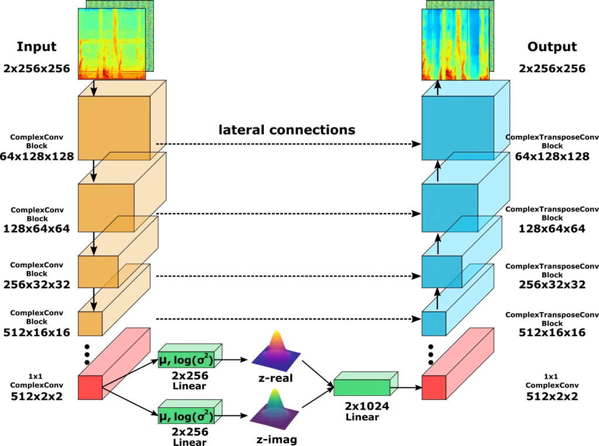
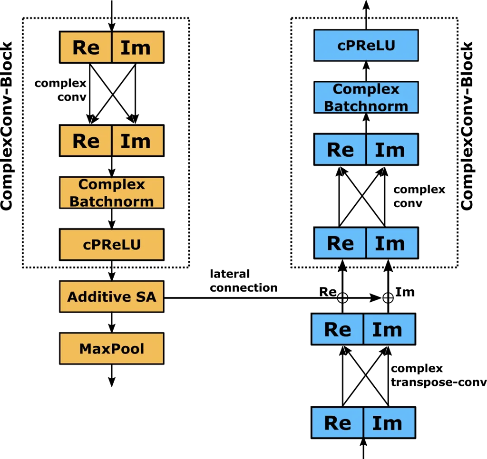
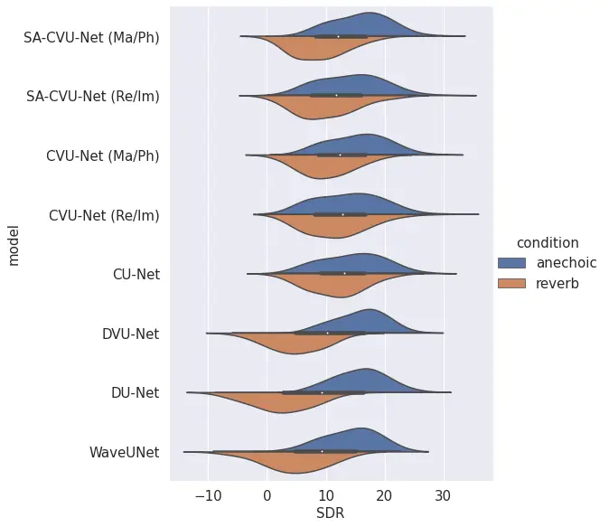

# SINGLE-CHANNEL SPEECH ENHANCEMENT WITH DEEP COMPLEX U-NETWORKS AND PROBABILISTIC LATENT SPACE MODELS

Eike J. Nustede    Jörn Anemüller ^(†)^(†)thanks: Copyright ©2023 IEEE.
Personal use of this material is permitted. Permission from IEEE must be
obtained for all other uses, in any current or future media, including
reprinting/republishing this material for advertising or promotional
purposes, creating new collective works, for resale or redistribution to
servers or lists, or reuse of any copyrighted component of this work in
other works. Funded by Deutsche Forschungsgemeinschaft (DFG, German
Research Foundation) under project ID 352015383, SFB 1330/B3.

###### Abstract

In this paper, we propose to extend the deep, complex U-Network
architecture for speech enhancement by incorporating a probabilistic
(i.e., variational) latent space model. The proposed model is evaluated
against several ablated versions of itself in order to study the effects
of the variational latent space model, complex-value processing, and
self-attention. Evaluation on the MS-DNS 2020 and Voicebank+Demand
datasets yields consistently high performance. E.g., the proposed model
achieves an SI-SDR of up to 20.2 dB, about 0.5 to 1.4 dB higher than its
ablated version without probabilistic latent space, 2–2.4 dB higher than
WaveUNet, and 6.7 dB above PHASEN. Compared to real-valued magnitude
spectrogram processing with a variational U-Net, the complex U-Net
achieves an improvement of up to 4.5 dB SI-SDR. Complex spectrum
encoding as magnitude and phase yields best performance in anechoic
conditions whereas real and imaginary part representation results in
better generalization to (novel) reverberation conditions, possibly due
to the underlying physics of sound.

###### Index Terms: 

Deep learning, U-Networks, speech enhancement, latent space models,
variational models

^(†)^(†)address: Carl von Ossietzky University Oldenburg, Computational
Audition Group,  
Dept. med. Physics & Acoustics and Cluster of Excellence Hearing4all,  
Oldenburg, Germany  
{eike.jannik.nustede, joern.anemueller}@uol.de

## 1 INTRODUCTION

Speech enhancement algorithms are a necessity for tasks involving
distorted audio signals at low signal-to-noise-ratio (SNR), such as
automatic speech recognition \[1\], voice over IP applications \[2\],
and speaker verification \[3\]. Current algorithms focus on denoising by
increasing signal quality via improved SNR, consequently increasing
speech intelligibility for listeners.  
State-of-the-art approaches leverage various architectures of denoising
deep neural networks, differentiated by their general architecture and
the type of input used, mainly split into processing either time-domain
or spectral features. Recurrent neural networks (RNNs) focus on
real-time application \[4\], while fully convolutional networks often
yield better SNRs \[5\] with frame-based processing. Generative models
\[6\] and, more recently, attention-based networks \[7\] were adapted
for speech enhancement. The U-Network architecture \[8\] has
successfully been adapted by several authors for speech enhancement.
Dilated convolutions \[9\] and attention models \[10\] have been shown
to be beneficial for denoising distorted speech signals. A
complex-valued U-Net was proposed \[11\], causing attention to shift to
phase-aware networks \[12\]. Showing state-of-the-art performance,
complex-valued approaches were further developed \[13\], including
transformer-based U-Networks \[14\]. The U-Network structure is similar
to an autoencoder, yet the use of probabilistic latent space models
similar to variational autoencoders, was previously only used for image
segmentation tasks \[15\].  
In our previous work \[16\], we showed that including a probabilistic
latent space model in a U-Network increases its generalization ability
by introducing noise to the latent space, thereby indirectly increasing
the processed feature variety of the network during training. Here, we
extend our previous work to model the latent space of a complex-valued
U-Network by introducing two separate latent spaces for real and
imaginary part, respectively. The network is evaluated and compared
against several ablated versions, as well as WaveUNet \[17\] and PHASEN
\[12\]. Additionally, we compare combinations of log-scaled power and
phase spectra with an input containing real and imaginary parts of the
underlying complex signal, including a suitable loss function. A
weighted loss function with emphasis on the phase/imaginary part is
proposed to train both model variations.

## 2 METHODS

### 2.1 Complex U-Network model

An overview of the proposed system is shown in Fig. 1. Encoder and
decoder paths each consist of seven convolution blocks, while the
bottleneck starts and ends with a 1-by-1 convolution coupled with a
complex parametric ReLU activation (cPReLU). In each encoder and decoder
block, as depicted in Fig. 2, a convolution block consists of a dilated
complex convolution followed by complex batch normalization and cPReLU
activation. One complex convolution is composed of two real-valued
convolution operations, i.e., one determines the real, the other the
imaginary part of the next layer. Both convolutions use the combined
real and imaginary parts of the previous layer as input, as described by
Hu et al. \[13\]. When included, self-attention (SA) is applied after
each encoder block, prior to activation being relayed to the decoder via
lateral connections. Convolutions in the decoder path are transpose
convolutions that perform learned upsampling of signal representations
towards the spectrogram resolution at the output.



Figure 1: Schematic overview of the complex variational U-Net. The
latent space (bottom) adapts a Gaussian model each for the real and
imaginary parts. Vertical dots indicate two convolutional blocks (size
$`512\times 8\times 8`$ and $`512\times 4\times 4`$) that reduce
dimensionality towards the latent space layer.



Figure 2: Detailed view of a pair of encoder (left) and decoder (right)
blocks at one U-Net level. Weights in the self-attention block are
computed individually for real and imaginary parts. The “$`\bigoplus`$”
symbol in the decoder denotes the concatenation of respective feature
matrices.

### 2.2 Probabilistic model and loss function

The standard probabilistic model for the latent space in variational
autoencoders (VAEs) is a Gauss distribution \[18\], which we adopt for
the complex variational U-Net by modeling complex feature values through
two Gauss distributions in the latent space layer. The standard loss
function for VAEs combines a reconstruction term, often chosen as a
mean-squared error (MSE) function, with a Kullback-Leibler (KL)
divergence that regularizes the latent space model. Our loss function
$`L_{\theta,\phi}`$ follows the same approach and combines three
reconstruction loss MSE terms, for magnitude, real and imaginary part
reconstruction, respectively, as well as the average KL divergence for
both Gaussian models in our latent space, and the scale-invariant
signal-to-distortion-ratio (SI-SDR) \[19\]:

```math
\begin{split}L_{\theta,\phi}=&MSE_{\text{mag}}+MSE_{\text{real}}+MSE_{\text{imag}}\\
&+\beta\,D_{\text{KL}}-\text{SI-SDR}.\end{split} \tag{1}
```

Encoder and decoder parameters are denoted as $`\phi`$ and $`\theta`$,
respectively. Each MSE reconstruction term for the respective quantity
is computed according to

```math
MSE=\frac{1}{N}\sum_{i}^{N}{(y_{i}-\hat{y_{i}})^{2}}, \tag{2}
```

where $`\hat{y}`$ denotes the reconstruction and $`y`$ the true value.
Since the complex U-Net’s output are complex-valued spectral
representations, direct time-domain waveform reconstruction and
inclusion of the SI-SDR,

```math
\text{SI-SDR}=10\log_{10}\left(\frac{\|\frac{\hat{{\mathbf{y}}}^{T}{\mathbf{y}}}{\|{\mathbf{y}}\|^{2}}{\mathbf{y}}\|^{2}}{\|\frac{\hat{{\mathbf{y}}}^{T}{\mathbf{y}}}{\|{\mathbf{y}}\|^{2}}{\mathbf{y}}-\hat{{\mathbf{y}}}\|^{2}}\right), \tag{3}
```

into the loss function is straightforward. Tests indicated that uniform
weighting of the MSE and SI-SDR terms, and a weighting with factor
$`\beta=10`$ of the KL adequately balance the different terms in the
$`L_{\theta,\phi}`$ loss function.

## 3 EXPERIMENTS

|                      | Anechoic |      |               | Reverberant |      |               |
| -------------------- | -------- | ---- | ------------- | ----------- | ---- | ------------- |
| Model                | PESQ     | STOI | SI-SDR \[dB\] | PESQ        | STOI | SI-SDR \[dB\] |
| SA-CVU-Net (_Ma/Ph_) | 2.90     | 0.94 | 15.95         | 2.52        | 0.84 | 8.86          |
| SA-CVU-Net (_Re/Im_) | 2.61     | 0.94 | 14.23         | 2.52        | 0.86 | 9.92          |
| CVU-Net (_Ma/Ph_)    | 2.83     | 0.94 | 15.49         | 2.67        | 0.85 | 10.09         |
| CVU-Net (_Re/Im_)    | 2.55     | 0.93 | 13.87         | 2.67        | 0.88 | 11.60         |
| CU-Net               | 2.67     | 0.93 | 14.52         | 2.71        | 0.87 | 11.57         |
| DVU-Net              | 3.03     | 0.94 | 12.53         | 2.39        | 0.79 | 10.77         |
| DU-Net               | 3.08     | 0.94 | 12.62         | 2.44        | 0.80 | 10.98         |
| WaveUNet             | 2.75     | 0.94 | 13.83         | 2.28        | 0.78 | 6.67          |

Table 1: Model performance on MS-DNS dataset in anechoic and reverberant
test conditions.

### 3.1 Datasets

Models are trained and evaluated on two different speech enhancement
corpora. All data are resampled to 16 kHz where applicable. The MS-DNS
2020 Challenge dataset \[20\] is used to generate 100 hours of anechoic
audio data with SNR distributed uniformly in the range of 0 to 20 dB for
training, as well as one hour of validation data for monitoring during
training. Two evaluation sets, anechoic and reverberant, are included
with an SNR of 0 to 20 dB containing 20 unknown speakers and noise
types, excluding speech-like noise. Note that we train exclusively on
anechoic data, while evaluation uses anechoic as well as reverberant
data and, thus, intentionally includes a train-test mismatch. The
Voicebank+Demand corpus \[21\] includes speech-like and babble noise.
The evaluation set has an SNR ranging from 2.5 dB to 17.5 dB compared to
the training set of 0 to 15 dB relative to target speech. We train on
the 19 hour long 56 speaker subset, utilizing one hour of the 28 speaker
subset for validation. The 34 minute long evaluation set contains two
unknown speakers and five (different) noise types.

### 3.2 Network configuration

The input to our model consists of short-term Fourier transform (STFT)
spectrograms of length 1.6 s with 256 time frames and 256 feature
(frequency) bins. Two encoding schemes for the complex-valued STFT
values are considered in our experiments: For real-imaginary part
(“Re/Im”) encoding, the STFTs’ real part forms the first input channel
and their imaginary part the second channel. For magnitude-phase
(“Ma/Ph”) encoding, the log-scaled magnitude spectrum and phase in
radians form the first and second input channel, respectively. In either
case, input and output size is (2 $`\times`$ 256 $`\times`$ 256)
representing (channel $`\times`$ time $`\times`$ feature).
Encoder-decoder blocks on each U-Net level contain the same size of
features, starting at the input/output (2 $`\times`$ 256 $`\times`$ 256)
and increasing in channels (64, 128, 256, 512, 512, 512, 512) while
decreasing in time and feature dimension by half in every subsequent
layer. The input of the bottleneck (512 $`\times`$ 2 $`\times`$ 2) is
downsampled again as variance and mean of the two diagonal Gaussians
have 256 parameters each, resulting in two latent space models after
reparameterization. Both are projected by linear layers (2 $`\times`$
1024), then combined to recreate the input size (512 $`\times`$ 2
$`\times`$ 2). The dilation rate scales inversely with the channel size
(16, 8, 4, 2, 1, 1, 1). For reference, WaveUNet and PHASEN models are
employed with input and output features as described in the respective
publications \[12, 17\].

### 3.3 Evaluation setup

Performance evaluation of speech enhancement models is carried out with
three state-of-the-art metrics, the ITU-T P.862 speech quality standard
(PESQ) \[22\], the short-time objective intelligibility measure (STOI)
\[23\], and, representing a non-perceptual measure, the scale-invariant
signal-to-distortion-ratio (SI-SDR) \[19\]. We compare several versions
of the complex U-Network architecture, which differ by degree of
ablation as well as by feature encoding. Specifically, we compare the
proposed model using real and imaginary part encoding of audio signals
(“_Re/Im_”) with an identical model working on log-scaled magnitude and
phase information (“_Ma/Ph_”). Model ablations, to study relevance of
its components, are introduced by successively removing from the full
(SA-CVU-Net) model its self-attention component (resulting in CVU-Net)
and by replacing the variational latent layer with a deterministic
bottleneck layer (resulting in CU-Net with magnitude/phase encoding).
Our previously proposed denoising variational U-Net (DVU-Net) and its
non-variational version (DU-Net) are compared, as well. DVU-Net uses
log-scaled magnitude spectra inputs without phase information. DU-Net
has a deterministic latent space.

## 4 RESULTS

Model performance for both datasets is reported in Tab. 1 for the DNS
Challenge dataset and Tab. 2 for Voicebank+Demand. Distribution of
SI-SDR values for all evaluation samples of the DNS challenge is
depicted in Fig. 3, directly comparing anechoic and reverberant
conditions. In the anechoic scenario, the SA-CVU-Net _(Ma/Ph)_ achieves
the highest SI-SDR score of 15.95 dB, followed by the CVU-Net _(Ma/Ph)_.
Both _(Re/Im)_ variants score 1.62 to 1.72 dB lower. In both cases,
self-attention increases SI-SDR by 0.36 to 0.46 dB, with similar
improvements in PESQ and STOI. In reverberant conditions, the _(Re/Im)_
models perform significantly better than their counterparts, by up to
1.51 dB for the CVU-Net with a final score of 11.60 dB, while only
losing about 2 dB compared to anechoic conditions. Here, self-attention
is detrimental to model performance, reducing it by 1.68 dB SI-SDR. The
CU-Net shows similar numbers to CVU-Net _(Re/Im)_, about 3 dB less than
in anechoic scenarios, followed by DVU-Net, DU-Net, and WaveUNet. For
the Voicebank+Demand corpus, CVU-Net _(Mag/Ph)_ scores the best SI-SDR
of 20.21 dB, followed by SA-CVU-Net with 19.88 dB. CU-Net shows the
third highest SI-SDR at 19.70 dB, followed by the corresponding
_(Re/Im)_ models. In comparison, using real and imaginary part input
encoding yields a 0.66 and 0.39 dB lower SI-SDR, for CVU-Net and
SA-CVU-Net, respectively. Self-attention diminishes achieved scores for
both input variations. WaveUNet achieves 17.83 dB SI-SDR, followed by
DVU-Net at 15.62 dB, PHASEN with 13.49 dB, and DU-Net with 11.44 dB
SI-SDR. Although low in SI-SDR, PHASEN reports the highest PESQ score of
3.73, the second highest being 3.37 by CVU-Net _(Ma/Ph)_.



Figure 3: Distribution of SI-SDR scores (dB) for all models on the
DNS-Challenge 2020 dataset. The evaluation compares the performance on
unknown noise types and speakers in anechoic and reverberant conditions.

## 5 DISCUSSION & CONCLUSION

Single-channel speech enhancement benefits heavily from incorporating
phase information into the signal processing chain in one way or
another, which has been shown in \[12, 13\], and also holds in our
experiments. E.g., for the Voicebank+Demand corpus, DU-Net and DVU-Net
achieve the lowest scores of all models. The results also show that the
probabilistic bottleneck model improves performance, comparing DU-Net
with DVU-Net and CU-Net with CVU-Net. Similarly, on the anechoic DNS
challenge evaluation set, the _(Ma/Ph)_-based CVU-Nets yield higher
SI-SDR scores than CU-Net. Processing the real and imaginary parts is
significantly better than using the log-magnitude and phase spectra in
reverberant conditions, but worse in anechoic. Considering that training
is only done in anechoic conditions, we hypothesize that using real and
imaginary parts results in less overfitting on the room acoustics. The
physical sound generation process can be viewed as inducing a
semi-independence between magnitude and phase, e.g., permitting signal
level amplification without affecting phase and permitting time-shifts
that affect only phase but not magnitude. Thus, network training with a
magnitude-phase encoding is faster and yields better performance under
anechoic conditions. Reverberation, however, partially removes this
semi-independence of magnitude and phase through the superposition of
phase-shifted signal components, largely caused by room reflections. It
therefore poses a generalization problem to a trained network with
magnitude-phase representation. Real and imaginary part network
training, in contrast, is slower, presumably because the network learns
to implicitly model the non-linear dependence between real and imaginary
parts. Generalization to reverberant conditions is more robust with this
learned non-linear dependence model. The decreased efficiency in
reverberant conditions for self-attention models might plausibly be due
to overfitting, too, as self-attention nearly doubles network size and
increases the focus on salient features which are present during
training, i.e., in anechoic conditions.

| Model                | PESQ | STOI | SI-SDR \[dB\] |
| -------------------- | ---- | ---- | ------------- |
| SA-CVU-Net (_Ma/Ph_) | 3.36 | 0.95 | 19.88         |
| SA-CVU-Net (_Re/Im_) | 3.31 | 0.95 | 19.49         |
| CVU-Net (_Ma/Ph_)    | 3.37 | 0.95 | 20.21         |
| CVU-Net (_Re/Im_)    | 3.23 | 0.95 | 19.55         |
| CU-Net               | 3.34 | 0.95 | 19.70         |
| DVU-Net              | 3.32 | 0.93 | 15.62         |
| DU-Net               | 2.86 | 0.87 | 11.44         |
| WaveUNet             | 3.03 | 0.72 | 17.83         |
| PHASEN               | 3.73 | 0.95 | 13.49         |

Table 2: Evaluation results on Voicebank-Demand corpus.

In conclusion, processing representations of complex spectra increases
model performance considerably. Adding probabilistic latent space models
can improve performance, but depends on the architecture and selected
test conditions. Specifically, the probabilistic latent space model
successfully increases performance tested against unknown noise types
and speakers, without significant impact for severe differences in room
acoustics like reverberation. Further, evidence is obtained that direct
processing of real and imaginary parts of a signal can increase the
adaptability in reverberant conditions compared to selecting
magnitude-phase features. Consequently, we should be able to combine
both features to achieve high performance in anechoic conditions with
strong adaptability for differing room conditions like reverberation.

## References

- \[1\] J. Li, L. Deng, Y. Gong, and R. Haeb-Umbach, “An overview of
  noise-robust automatic speech recognition,” vol. 22, 2014, pp.
  745–777.
- \[2\] N. Harte, E. Gillen, and A. Hines, “TCD-VoIP, a research
  database of degraded speech for assessing quality in VoIP
  applications,” in _International Workshop on Quality of Multimedia
  Experience (QoMEX)_, 2015, pp. 1–6.
- \[3\] S. Shon, H. Tang, and J. Glass, “VoiceID Loss: Speech
  Enhancement for Speaker Verification,” in _Interspeech 2019_, 2019,
  pp. 2888–2892.
- \[4\] Y. Xia, S. Braun, C. K. Reddy, H. Dubey, R. Cutler, and
  I. Tashev, “Weighted Speech Distortion Losses for Neural-Network-Based
  Real-Time Speech Enhancement,” in _IEEE International Conference on
  Acoustics, Speech and Signal Processing (ICASSP)_, 2020, pp. 871–875.
- \[5\] Y. Luo and N. Mesgarani, “Conv-TasNet: Surpassing Ideal
  Time-Frequency Magnitude Masking for Speech Separation,” _IEEE/ACM
  Transactions on Audio, Speech, and Language Processing (TASLP)_,
  vol. 27, no. 8, pp. 1256–1266, 2019.
- \[6\] S. Pascual, A. Bonafonte, and J. Serrà, “SEGAN: Speech
  Enhancement Generative Adversarial Network,” in _Interspeech 2017_,
  2017, pp. 3642–3646.
- \[7\] Y. Koizumi, K. Yatabe, M. Delcroix, Y. Masuyama, and
  D. Takeuchi, “Speech Enhancement using Self-Adaptation and Multi-Head
  Self-Attention,” in _IEEE International Conference on Acoustics,
  Speech and Signal Processing (ICASSP)_, 2020, pp. 181–185.
- \[8\] O. Ronneberger, P. Fischer, and T. Brox, “U-Net: Convolutional
  networks for biomedical image segmentation,” _Lecture Notes in
  Computer Science (LNCS)_, vol. 9351, pp. 234–241, 2015.
- \[9\] A. Bosca, A. Guérin, L. Perotin, and S. Kitić, “Dilated u-net
  based approach for multichannel speech enhancement from first-order
  ambisonics recordings,” in _2020 28th European Signal Processing
  Conference (EUSIPCO)_, 2021, pp. 216–220.
- \[10\] B. Tolooshams, R. Giri, A. H. Song, U. Isik, and
  A. Krishnaswamy, “Channel-attention dense u-net for multichannel
  speech enhancement,” in _IEEE International Conference on Acoustics,
  Speech and Signal Processing (ICASSP)_, 2020, pp. 836–840.
- \[11\] H.-S. Choi, J. Kim, J. Huh, A. Kim, J.-W. Ha, and K. Lee,
  “Phase-Aware Speech Enhancement with Deep Complex U-Net,” in
  _International Conference on Learning Representations (ICLR)_, 2019.
  \[Online\]. Available:
  [https://openreview.net/forum?id=SkeRTsAcYm](https://openreview.net/forum?id=SkeRTsAcYm)
- \[12\] D. Yin, C. Luo, Z. Xiong, and W. Zeng, “PHASEN: A
  Phase-and-Harmonics-Aware Speech Enhancement Network,” in _AAAI
  Conference on Artificial Intelligence_, vol. 34, no. 05, Apr. 2020,
  pp. 9458–9465.
- \[13\] Y. Hu, Y. Liu, S. Lv, M. Xing, S. Zhang, Y. Fu, J. Wu,
  B. Zhang, and L. Xie, “DCCRN: Deep Complex Convolution Recurrent
  Network for Phase-Aware Speech Enhancement,” in _Interspeech 2020_,
  2020, pp. 2472–2476.
- \[14\] Y. Fu, Y. Liu, J. Li, D. Luo, S. Lv, Y. Jv, and L. Xie,
  “Uformer: A unet based dilated complex & real dual-path conformer
  network for simultaneous speech enhancement and dereverberation,” in
  _IEEE International Conference on Acoustics, Speech and Signal
  Processing (ICASSP)_, 2022, pp. 7417–7421.
- \[15\] S. A. A. Kohl, B. Romera-Paredes, K. H. Maier-Hein, D. J.
  Rezende, S. M. A. Eslami, P. Kohli, A. Zisserman, and O. Ronneberger,
  “A Hierarchical Probabilistic U-Net for Modeling Multi-Scale
  Ambiguities,” _Conference on Neural Information Processing Systems
  (NeurIPS): Medical Imaging meets NeurIPS Workshop._, 2019.
- \[16\] E. J. Nustede and J. Anemüller, “Towards speech enhancement
  using a variational u-net architecture,” in _European Signal
  Processing Conference (EUSIPCO)_, 2021, pp. 481–485.
- \[17\] D. Stoller, S. Ewert, and S. Dixon, “Wave-U-Net: A multi-scale
  neural network for end-to-end audio source separation,” in
  _International Society for Music Information Retrieval Conference
  (ISMIR)_, 2018, pp. 334–340.
- \[18\] D. P. Kingma and M. Welling, “An introduction to variational
  autoencoders,” _Foundations and Trends in Machine Learning_, vol.
  Volume 12, Issue 4, pp. 307–392, 2019.
- \[19\] J. L. Roux, S. Wisdom, H. Erdogan, and J. R. Hershey, “SDR -
  Half-baked or Well Done?” in _IEEE International Conference on
  Acoustics, Speech and Signal Processing (ICASSP)_, 2019, pp. 626–630.
- \[20\] C. K. Reddy, V. Gopal, R. Cutler, E. Beyrami, R. Cheng,
  H. Dubey, S. Matusevych, R. Aichner, A. Aazami, S. Braun _et al._,
  “The Interspeech 2020 Deep Noise Suppression Challenge: Datasets,
  Subjective Testing Framework, and Challenge Results,” 2020.
- \[21\] C. Valentini-Botinhao, “Noisy speech database for training
  speech enhancement algorithms and TTS models,” _University of
  Edinburgh. School of Informatics. Centre for Speech Technology
  Research (CSTR)_, 2017.
- \[22\] A. Rix, J. Beerends, M. Hollier, and A. Hekstra, “Perceptual
  evaluation of speech quality (pesq)-a new method for speech quality
  assessment of telephone networks and codecs,” in _IEEE International
  Conference on Acoustics, Speech and Signal Processing (ICASSP)_,
  vol. 2, 2001, pp. 749–752 vol.2.
- \[23\] C. H. Taal, R. C. Hendriks, R. Heusdens, and J. Jensen, “An
  algorithm for intelligibility prediction of time–frequency weighted
  noisy speech,” _IEEE/ACM Transactions on Audio, Speech, and Language
  Processing (TASLP)_, vol. 19, no. 7, pp. 2125–2136, 2011.
