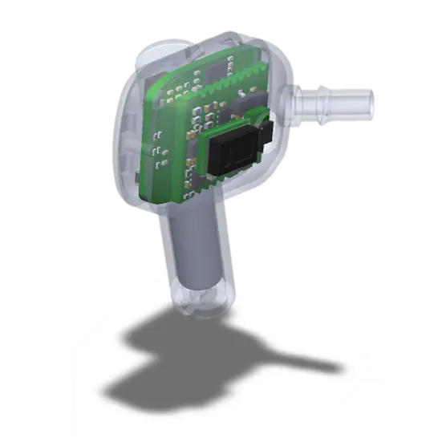
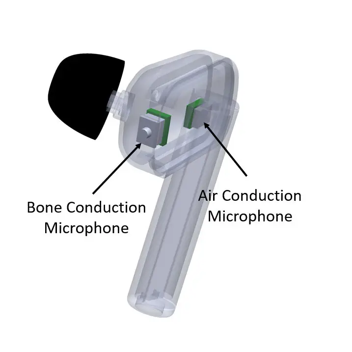
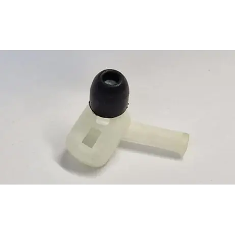
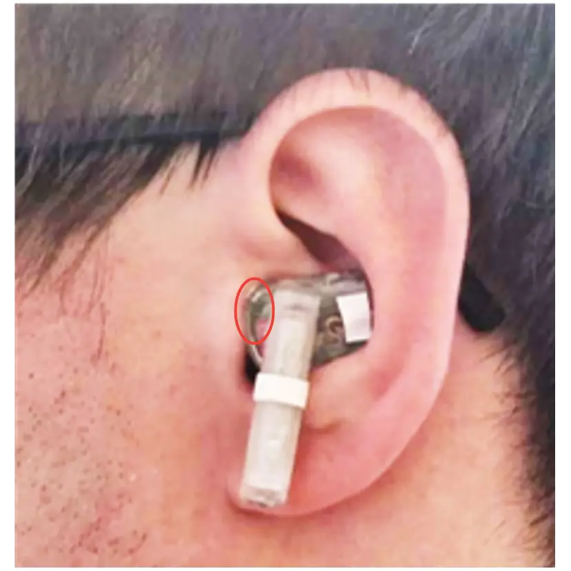
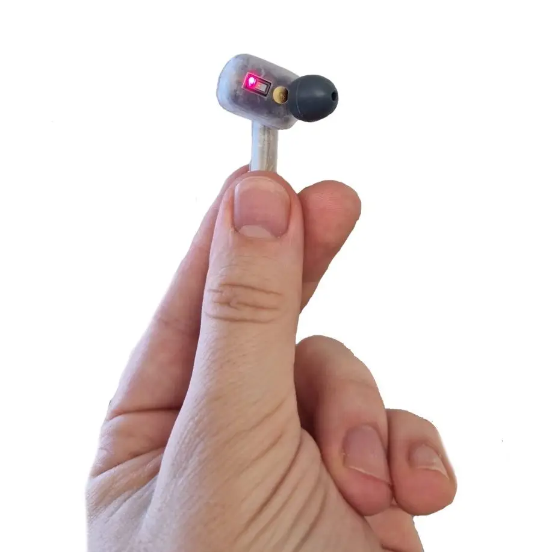
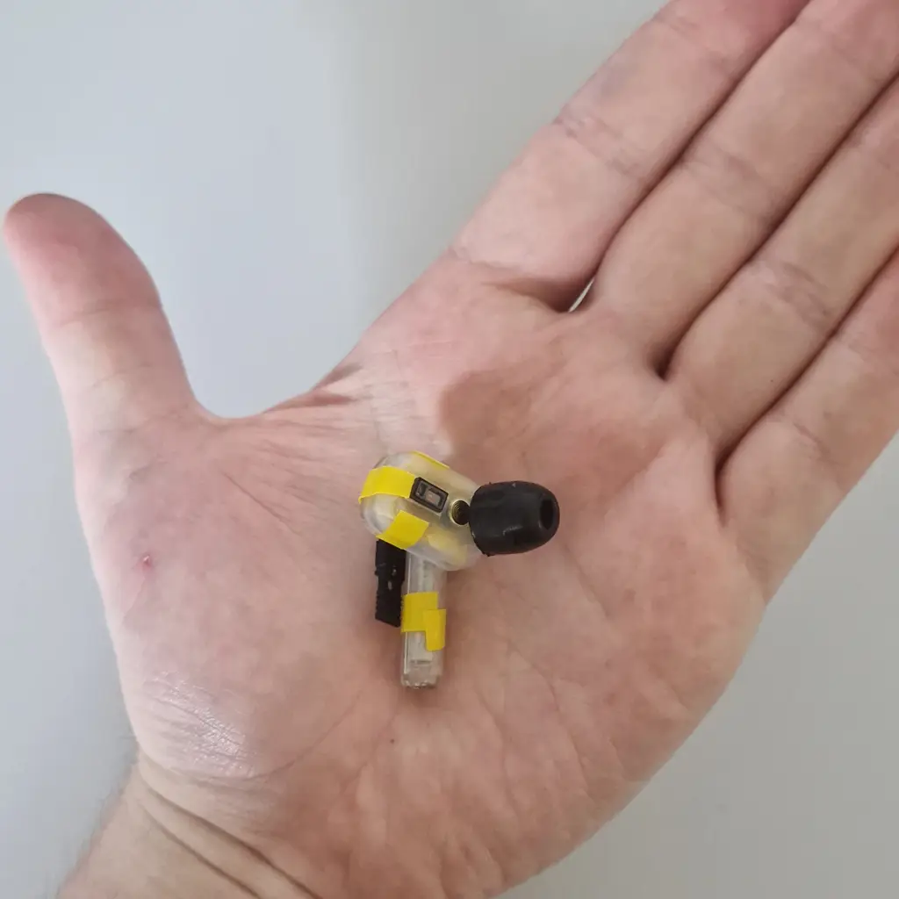
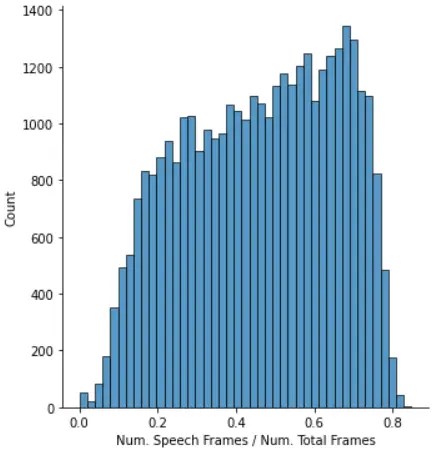

# In-Ear-Voice: Towards Milli-Watt Audio Enhancement With Bone-Conduction Microphones for In-Ear Sensing Platforms

Conference: International Conference on Internet-of-Things Design and
Implementation; May 9–12, 2023; San Antonio, TX, USAInternational
Conference on Internet-of-Things Design and Implementation (IoTDI ’23),
May 9–12, 2023, San Antonio, TX,
USAPrice: 15.00DOI: [10.1145/3576842.3582365](https://doi.org/10.1145/3576842.3582365)ISBN: 979-8-4007-0037-8/23/05Conference: ACM/IEEE
Conference on Internet of Things Design and Implementation; May 09–12,
2023; San Antonio, Texas

Philipp Schilk
[](https://orcid.org/0000-0002-0487-9513)
Note: Both authors contributed equally to this research.
Affiliation: Eidgenössische Technische Hochschule Zürich (ETHZ), Zürich,
Switzerland email: <schilkp@ethz.ch> , Niccolò Polvani
[](https://orcid.org/0000-0003-0720-050X)
Affiliation: École polytechnique fédérale  
de Lausanne (EPFL), Lausanne, Switzerland Affiliation: Logitech Europe,
Lausanne, Switzerland email: <npolvani@logitech.com> , Andrea Ronco
[](https://orcid.org/0000-0003-1672-8672)
Affiliation: Eidgenössische Technische Hochschule Zürich (ETHZ), Zürich,
Switzerland email: <andrea.ronco@pbl.ee.ethz.ch> , Milos Cernak
[](https://orcid.org/0000-0002-5569-9491)
Affiliation: Logitech Europe, Lausanne, Switzerland email:
<mcernak@logitech.com> and Michele Magno
[](https://orcid.org/0000-0003-0368-8923)
Affiliation: Eidgenössische Technische Hochschule Zürich (ETHZ), Zürich,
Switzerland email: <michele.magno@pbl.ee.ethz.ch>

© acmlicensed

###### Abstract.

The recent ubiquitous adoption of remote conferencing has been
accompanied by omnipresent frustration with distorted or otherwise
unclear voice communication. Audio enhancement can compensate for
low-quality input signals from, for example, small true wireless
earbuds, by applying noise suppression techniques. Such processing
relies on voice activity detection (VAD) with low latency and the added
capability of discriminating the wearer’s voice from others - a task of
significant computational complexity. The tight energy budget of devices
as small as modern earphones, however, requires any system attempting to
tackle this problem to do so with minimal power and processing overhead,
while not relying on speaker-specific voice samples and training due to
usability concerns.

This paper presents the design and implementation of a custom research
platform for low-power wireless earbuds based on novel, commercial, MEMS
bone-conduction microphones. Such microphones can record the wearer’s
speech with much greater isolation, enabling personalized voice activity
detection and further audio enhancement applications. Furthermore, the
paper accurately evaluates a proposed low-power personalized speech
detection algorithm based on bone conduction data and a recurrent neural
network running on the implemented research platform. This algorithm is
compared to an approach based on traditional microphone input. The
performance of the bone conduction system, achieving detection of speech
within 12.8ms at an accuracy of 95% is evaluated. Different SoC choices
are contrasted, with the final implementation based on the cutting-edge
Ambiq Apollo 4 Blue SoC achieving 2.64mW average power consumption at
14uJ per inference, reaching 43h of battery life on a miniature 32mAh
li-ion cell and without duty cycling.

## 1. Introduction

In the last two decades, a significant transformation in remote vocal
interaction has occurred. The world is getting more connected and
globalized, creating more opportunities for people at a distance to
interact. In addition, the diffusion of consumer electronics and
increase in bandwidth availability enables more frequent calls and video
conferences, with little limitations on physical location (Klinefelter
et al., 2021). The COVID-19 pandemic further accelerated the natural
adoption of such technologies, making them a fundamental organizational
resource in many businesses today (Das Swain et al., 2020). For this
reason, a lot of resources are being spent by both industry and academia
attempting to increase the quality of the user’s experience during
remote conferencing. However, audio quality is still a common challenge,
with distorted audio making communication ineffective, frustrating, or
even impossible (Skowronek et al., 2022).

Simultaneously, small true-wireless earbuds have become more and more
ubiquitous, further exacerbating the problem: Their small microphone is
placed indirectly and at a substantial distance from the wearer’s mouth,
reducing the audio quality and increasing the amount of extraneous noise
captured, including both other nearby speakers and common environmental
noise. While audio enhancement and filtering is a well-studied field,
this new generation of miniaturized devices entail extremely challenging
boundary conditions for any attempt at audio improvement (Sugiyama
et al., 2019). Such "Hearable" devices are usually based on rather
limited hardware, providing low computational resources in exchange for
low power consumption in the range of a few milli-watts - a necessity,
given the tiny amount of battery capacity that can be feasibly packaged
in such small devices (Crum, 2019).

Data transmission is also very pricey in these systems (Polonelli
et al., 2022a), with wireless interfaces characterized by the usual
trade-off between power consumption and bandwidth. This means that
offloading data is very expensive, and puts the generous computational
resources of the host devices, be that a laptop or a smartphone, at an
unreachable distance. Furthermore, such transmission would introduce
additional delay, worsening the user experience.

For this reason, data transmission is usually avoided unless strictly
necessary, and the processing is kept local, requiring the processing
algorithms to be implemented on constraint devices with limited storage
and run-time memory, basic processing capabilities, and low clock speeds
(Polonelli et al., 2022b). These challenges are even more critical when
machine learning techniques are employed as a part of the signal
processing pipeline. With traditional models designed to run on powerful
hardware spanning from personal computers to data centers, many
state-of-the-art processing methods are simply viable in this domain
(Wang et al., 2021).

Tiny Machine Learning (TinyML) attempts to address the issue of
deploying machine learning solutions on embedded hardware. TinyML models
are developed with a different mindset, considering the hardware
limitations from the beginning and reflecting these constraints in the
network architecture (Ray, 2022). A lot of effort is also put into
appropriate pre-processing and feature extraction, which can
significantly benefit the performance of the models with a lower
computational cost. In addition, different techniques are used to
improve the hardware utilization and efficiency, by the means of
Quantization (Lin et al., 2016), Network Pruning (Chong et al., 2022),
Transfer-Learning (Hinton et al., 2015), and Compression (Han et al.,
2016). This enables an application-specific model small enough for
hearable platforms to be developed.

The recent emergence of low-power MEMS bone conduction microphones (Wang
et al., 2022) provides an exciting opportunity for novel enhancement
approaches. Their inherent improved isolation from external noise and
different recording characteristics provide another representation of
the same signal. In combination with TinyML techniques, this has the
potential to greatly reduce the processing required by providing
information that previously had to be learned from much less expressive
features at great computational cost.

The main contributions of this paper are:

- •
  Design and implementation of a hardware platform for in-ear sensing
  research featuring novel sensing and cutting-edge signal processing
  capabilities.
- •
  Development and evaluation of an ultra-low-power, bone-conduction
  based, Personalized Voice Activity Detection (pVAD) module with an
  exploration of further possible power savings.
- •
  Comparison of the industry-standard Nordic NRF5340 to the cutting edge
  Ambiq Apollo 4 Blue for ultra-low-power edge processing.

## 2. Related Work

Reliable Voice Activity Detection (VAD) is a core step toward speech
enhancement. It provides an essential data point for further processing
and can be employed as a gating mechanism for more intensive processing,
saving precious computing and power resources.

### 2.1. Low power VAD

Ultra-low power VAD is a well-studied application and has been attempted
with an extensive array of techniques. FPGA-based solutions have been
demonstrated with 560$`\mu`$W of power consumption (Meoni et al., 2018)
(Noguchi et al., 2009), while neuromorphic implementations have achieved
power consumption as low as 30$`\mu`$W (Martinelli et al., 2020) and
4$`\mu`$W (Dellaferrera et al., 2020), when disregarding the
power-intensive support hardware required to run such inferences. A Deep
Neural Network approach supported by custom silicon has been shown to
require only 22.3$`\mu`$W (Price et al., 2018). State-of-the-art
implementations relying on analog pre-processing and feature extraction
followed by a deep neural network are reaching power consumptions as low
as 1$`\mu`$W and 142nW (Yang et al., 2018) (Cho et al., 2019).

The applicability of such general-purpose VAD to speech enhancements for
hearables is, however, questionable. Voice communication is not only
plagued by general environmental noise but also by the nearby speech
from other people. VAD that detects speech but cannot discriminate a
target speaker from others, such as the examples above, would be
ineffective in applications attempting to enhance only the voice of the
wearer of a given earbud.

### 2.2. Personalized VAD (pVAD)

Personalized voice activity detection (pVAD) has also been the subject
of in-depth research. Attempts commonly utilize a generic VAD module
followed by speaker diarization in the form of a model trained on sample
target speech or train a VAD module on samples of target speech directly
(Ding et al., 2020) (Ding et al., 2022) (Wang et al., 2018). Such
approaches tend to be very complex, some requiring networks with up to
130K parameters. Furthermore, they require sufficient speech samples
from the target voice (enrollment data). Other novel approaches propose
methods that enable training without such enrollment data. This is
achieved by developing a model which, given a sample of target speech
and noisy audio, can detect if the target speaker is present in the
noisy audio (Makishima et al., 2021). Requiring only a small sample of
target speech is much more practical but still requires active
interaction from the user. While effective, these models are necessarily
very complex, making them impractical for edge computing. This could be
overcome via the offloading of computation to a more capable device, but
the power required to transmit the raw audio data and the latency
introduced makes this impractical.

### 2.3. Bone Conduction Microphones

MEMS-based bone conduction microphones provide a possible avenue for
innovation. By relying on a direct coupling to the wearer’s head, they
are capable of capturing speech with a much higher level of isolation at
the cost of somewhat unnatural sounding recordings (Rahman and
Shimamura, 2011). Using this unique property, they have already been
employed in applications such as audio enhancement by fusion with a
standard air conduction signal (Wang et al., 2022), human sound
classification (Xu et al., 2022), and pitch detection (Rahman and
Shimamura, 2016). While they require direct physical contact to be
effective, the ear has been shown to be an effective site for bone
conduction microphone placement (Tran et al., 2008), making them a
natural fit for integration in tiny earbuds. Furthermore, the different
frequency response imparted on the bone-conducted signal, while somewhat
detrimental to applications targeting speech enhancement and
reconstruction, provides a valuable differentiation between the wearer’s
voice and adjacent speakers, enabling personalized voice activity
detection without enrollment data and significantly less processing
overhead.

This paper presents the design of an energy-efficient and low-power
earbud that exploits novel bone conduction sensors. Moreover, we design
and implement a tiny machine learning algorithm for speech detection
that can run on a state-of-art ARM Cortex-M4F core embedded in a
Bluetooth low energy system on chip (SoC). The paper accurately presents
the quality of the implementation and energy efficiency. To the best of
our knowledge, this is the first paper that presents the design and
implementation of such a device combining the bone conduction microphone
and tiny machine learning to have a truly wireless and intelligent
wearable in-ear device.

## 3. System Design

With no off-the-shelf development platform available for in-ear sensing
research, a custom earbud was developed. It is a modular design, with a
central module housing power infrastructure, the main SoC, and some
sensors, with additional sensors placed on small external modules which
can be freely installed inside an earphone case. This enables
flexibility during development, as the exact type and location of
sensors can easily be adjusted. A system overview is shown in figure 1.
All components are integrated on custom, miniaturized PCBs. Uniquely,
this platform provides a modular and flexible platform for fast in-ear
sensing research at a level of integration usually reserved for
commercial products.

Figure 1. System architecture.



(a)



(b)



(c)

Figure 2. Design renders showing internal circuitry (2), microphone
placement (2), and the 3D-printed case (2).



(a)



(b)



(c)

Figure 3. The finished device. The position of the bone conduction
microphone is indicated in figure 3.

#### Case:

The earbud is housed in a plastic case, shown in figures 2 - 2. Designed
to accommodate all sensors and electronics while being comfortable, the
main corpus measures 13 mm $`\times`$ 9.5 mmm $`\times`$ 21 mm. The stem
housing the battery is 28 mm long. The case was designed and
manufactured in-house using a resin-based 3D printing process.

#### SoCs:

Two main modules were developed, identical in all but the central SoC.
The first is based around the Nordic NRF5340, a dual-core Cortex-M33
processor featuring an application core with a maximum clock speed of
128 MHz, 1 MB Flash, 512 kB RAM, and an integrated BLE5.3 transceiver
managed by a dedicated network processor. It is one of the few SoCs
models available with software support for BLE LE Audio, and reasonably
representative of processors found in comparable consumer devices.

While the NRF5340 is very power efficient, developments in sub-threshold
CMOS techniques have seen a new class of devices with best-in-class
power consumption specifications become available (Chevallier, 2015).
One such device is the cutting-edge Ambiq Apollo 4, kindly provided by
Ambiq before their public release. Previous generations of the Apollo
have already proven themselves to be excellent in power-efficient neural
network inference (Giordano et al., 2022), but no concrete evaluation of
the new device exists. For this reason, a second main module was
developed based on this SoC.

The Apollo 4 Blue is a dual-core SoC with a Cortex-M4 application core
running at a clock speed of up to 196 MHz, 2 MB non-volatile storage,
and over 2 MB RAM. It features a BLE5.1 transceiver with a dedicated
Cortex-M0 network core and is specified at an impressive 5
$`\mu A`$/MHz.

#### Microphones:

The earbud features both an air-conduction and bone-conduction
microphone. The air conduction microphone is an ICS41341 low-power MEMS
microphone, facing outwards on the back of the device. The bone
conduction microphone is a VPU14DB01 MEMS-based VPU microphone, kindly
provided by Sonion. By the manufacturer’s recommendations, it was placed
facing forward towards the wearer’s tragus. The exact location of both
microphones is shown in figure 2, and the position of the bone
conduction microphone again highlighted in figure 2.

#### Other Sensors:

Earbuds are in automatic intimate contact with the wearer. Therefore,
they provide a unique opportunity for continuous, ubiquitous vital sign
monitoring without wearing additional, possibly uncomfortable, sensors.
The earbud developed here also serves as an in-ear vital sign monitoring
research platform. For this reason, a collection of other health sensors
are also available, including body temperature, optical blood oxygen
concentration, and heart rate sensing. These are the focus of a separate
publication (Schilk et al., 2022).

#### Battery and Power Management:

The earbud is powered by a modern Panasonic CG-425A 32mAh pin-type
Li-Ion battery housed in the stem of the case, chosen for its high
energy density and convenient form factor. Battery charging, monitoring,
and voltage regulation are handled by a highly efficient and integrated
MAX77651 power management IC.

#### Firmware:

Custom, Real-Time-Operating-System (RTOS) based firmware was developed
for both SoCs, using FreeRTOS and Zephyr RTOS for the Apollo and NRF,
respectively. This simplifies software development and enables the
processor to be automatically put into a low-power sleep mode during
periods of inactivity.

## 4. Personalised VAD Algorithm

A recurrent neural network-based binary classifier operating in the
frequency domain is used to detect the presence of target speech.

### 4.1. Input

The bone conduction microphone features a Pulse-Density Modulation (PDM)
interface, which was filtered and decimated using dedicated hardware
peripherals inside the microcontroller. This yields a 16bit, 16kHz
uncompressed mono audio stream.

### 4.2. Feature generation

The proposed model operates in the frequency domain. To facilitate this,
the input stream was first separated into 20ms frames with 50% overlap,
yielding frames of 320 samples in length. An appropriate hamming window
(20ms at 16kHz sample rate) was applied to each frame, which was then
zero-padded to 512 samples - a requirement for later processing steps to
be optimized using hardware acceleration.

A Fast-Fourier-Transform (FFT) was applied, and the magnitude of the
output spectrum warped to 32 frequency bin features using a Mel-scale
mapping. This is similar to the method proposed in (Braun and Tashev, 2021) and illustrated in figure 5. The reduction in input size
significantly reduces model complexity, while the Mel-scale limits the
amount of information lost during this transformation.

Figure 4. Scheme for Mel-scale feature extraction. RFFT refers to a
hardware-optimized FFT implementation with purely real-valued inputs.

### 4.3. Model Architecture

The model is a recurrent neural net with the following sequential
architecture:

- •
  Two 1D Convolutional Layers in the frequency domain with kernel size
  3, stride 2, and respectively 16 and 32 output channels.
- •
  Two Gated Recurrent Units with four activation units each.
- •
  One fully connected hidden layer with 16 ReLU-activated output
  features.
- •
  One fully connected layer with a single Sigmoid-activated output.

Such model architectures have been demonstrated to be very effective in
similar applications (Braun and Tashev, 2021). The two Gated Recurrent
Units (GRUs) (Cho et al., 2014) enable the model to learn and recognize
time-dependent information within the input signal.

The model has only approximately 5000 parameters, making it suitable for
inference even in performance and memory constraint environments. As is
usual for binary classification, the output $`y\in]0,1[`$ of the network
can be converted to a binary label using a threshold.

## 5. Dataset Acquisition, Data Augmentation, and Model Training

### 5.1. Data Acquisition

Many datasets both for VAD and speaker identification (Przybocki and
Alvin, 2001) (Beyan et al., 2020), including some with common background
noise samples (Dean et al., 2010), exist. However, these feature speech
recorded solely via air-conduction microphones. Similarly, while some
bone conduction datasets have been published (Inc, 2021), no data
featuring interference from adjacent speakers and other environmental
noise recorded by the bone conduction microphone is available.

This necessitated the creation of an in-house dataset, with the
additional benefit of having all testing and training data collected
using the same bone conduction microphone model that would later be
installed in the final device.

Three datasets were recorded, each featuring parallel recordings of
in-ear bone conduction (BC) microphones, in-ear air conduction (AC)
microphones, and a reference external air conduction microphone
(AC-REF). Sonion VPU demo kits were used to record the two in-ear
microphones, with the left earbud recording the air conduction and the
right earbud recording the bone conduction signal. A Rode M5 cardioid
condenser microphone served as the reference air conduction recording.
All microphones were recorded using a MOTU 4 audio interface.

In each dataset, the participant acts as the target speaker, whose voice
activity is to be detected, while simulated external speech and noise
are to be rejected.

1.  (1)
    Target Speech Dataset: Contains the target speaker’s voice only.
    Speech from 20 participants (10 male, 10 female), reading text in 5
    languages (English 8, French 8, Italian 2, Spanish 1, Portuguese 1).
    In total approximately 2 hours of speech was collected.
2.  (2)
    External Speech Dataset: Contains external speech only. 10
    participants each listened to a total of 5 minutes of speech clips
    (~3 to 10 seconds long) taken from the DNS challenge dataset (Dubey
    et al., 2022), without speaking. The speaker clips were played using
    two loudspeakers, placed approximately 1.5 m away from the
    participant.
3.  (3)
    External Noise Dataset: Contains external noise only. 10
    participants each listened to a total of 5 minutes of noise clips
    (~3 to 10 seconds long) taken from the DNS challenge dataset (Dubey
    et al., 2022), without speaking. The noise clips were played using
    two loudspeakers, placed approximately 1.5 m away from the
    participant.

For dataset 1, the reference microphone was placed facing the
participant, while for dataset 2 and 3 the reference microphone was
placed to the right of the participant.

### 5.2. Data Pre-Processing

#### Data Augmentation:

To generate sufficient training samples, a procedure similar to (Dean
et al., 2010) was employed, generating 30-second clips containing both
target speech, external speech and noise.

First, all recordings were re-sampled to 16 kHz to match the sample rate
of the microphones available in the final device.  
Next, the final bone conduction waveform that an earbud would capture,
$`y_{BC}(t)`$, was modeled as the sum of target speech $`s_{BC}(t)`$ and
noise $`\eta_{BC}(t)`$, consisting of external speech, $`e_{BC}(t)`$,
and external noise, $`\tilde{\eta}_{BC}(t)`$:

```math
\displaystyle y_{BC}(t)=s_{BC}(t)+\gamma\cdot\eta_{BC}(t) \tag{1}
```

```math
\displaystyle\eta_{BC}(t)=e_{BC}(t)+\tilde{\eta}_{BC}(t) \tag{2}
```

with scaling factor $`\gamma`$ determining the relative signal and noise
volumes.

For each clip, $`s_{BC}`$ was generated by randomly selecting a target
speaker from data set 1, and randomly cropping and concatenating without
separating intervals of continuous speech to form a 30-second sample.
Clips from dataset 2 and 3 were concatenated to form 30-second samples
of $`e_{BC}`$ and $`\tilde{\eta}_{BC}`$ respectively. These signals were
then combined (as per equation 1), selecting $`\gamma`$ to achieve a
random target $`SNR\sim\mathcal{N}(15,5)`$:

```math
SNR_{BC,dB}=10\log_{10}\left(\frac{||s_{BC}||^{2}}{||\gamma\cdot\eta_{BC}||^{2}}\right) \tag{3}
```

The final $`y_{BC}`$ was re-scaled to signal levels with
$`\mathcal{N}(-28,10)`$ dBFS to train for level-independent detection.
The training dataset created in this matter contains 160 hours of
simulated speech generated from 16 speakers and 160 hours of noise and
external speech generated from 8 participants. The test dataset includes
5 hours of speech generated from the remaining four speakers, and five
hours of noise and external speech generated using the recordings of 2
participants.

Figure 5 illustrates that the obtained dataset is evenly divided between
clips with low $`(<25\%)`$, medium $`(25\%-60\%)`$ and high speech
content $`(>60\%)`$.



Figure 5. Distribution of active (speech) frames per total number of
frames per file, obtained after processing the Speech Dataset.

#### Label generation:

The target voice activity labels $`VAD(n)`$ were generated from the
reference air conduction microphone recording $`s_{AC,REF}`$,
corresponding to the $`s_{BC}`$ segments in each clip:

```math
\displaystyle VAD(n)=\begin{cases}1,&\mbox{if }||S_{AC,REF}(n)||>T\\
0,&\mbox{otherwise }\end{cases} \tag{4}
```

```math
\displaystyle T=\min_{n}(||S_{AC,REF}(n)||)+\alpha\cdot\underset{n}{\mathrm{avg}}(||S_{AC,REF}(n)||) \tag{5}
```

Where $`\alpha`$ was set to 0.3 by experimentation, and the vector
$`S_{AC,REF}(n)`$ obtained by the STFT (Short-time Fourier Transform) of
$`s_{AC,REF}(t)`$ with 20 ms frame size and $`50\%`$ overlap. A causal
averaging filter of 0.2 seconds was used to smooth the target labels. It
should be noted that the use of an air-conduction microphone with
thresholding to generate voice activity labels was only possible because
all noise was recorded separately, and the air conduction microphone was
facing the speaker. An ear-worn air conduction microphone, with its
placement away from the speaker’s mouth, records too much noise to
reliably generate labels with such a simplistic scheme.

### 5.3. Training Procedure

This being a binary classification task, Binary Cross Entropy (BCE) was
used as the loss function during training:

```math
\mathcal{L}_{BCE}(z)=-\frac{1}{N}\sum_{n}z_{n}\log(\hat{z}_{n})+(1-\hat{z}_{n})\log(z_{n}) \tag{6}
```

where $`z_{n}`$ and $`\hat{z}_{n}`$ are the VAD labels and model’s
prediction respectively, and $`N`$ is the number of input frames. An
Adam optimizers (Kingma and Ba, 2014) was used to update the model’s
weights, with an initial learning rate of 1e-3. Each training epoch
consisted of 2000 update steps, with batch size 8. The learning rate was
halved after three epochs without improvement on the test set, and
training was stopped after five epochs without improvement.

## 6. Results

Figure 6. Visualization of an isolated target speech recording, noisy
target speech recording, and model output.

### 6.1. pVAD Evaluation

To demonstrate not only the effectiveness of the proposed model
(henceforth BC-pVAD) but also the benefit a bone conduction microphone
provides in this application, a second model, AC-pVAD, was created.
AC-pVAD employs precisely the same feature extraction, network
architecture, and training policy as BC-pVAD, but was instead trained on
noisy air conduction waveforms $`y_{AC}`$:

```math
\displaystyle y_{AC}(t)=s_{AC}(t)+\eta_{AC}(t) \tag{7}
```

```math
\displaystyle\eta_{AC}(t)=e_{AC}(t)+\tilde{\eta}_{AC}(t) \tag{8}
```

where $`y_{AC}(t)`$ is the noisy mixture, $`s_{AC}(t)`$ is the target
user’s speech, $`e_{AC}(t)`$ is external speech and
$`\tilde{\eta}_{AC}(t)`$ is external noise, all recorded by the
air-conduction microphone worn by the participants during the creation
of the datasets described in section 5.2. Training data was again
generated using the procedure in section 5.2, and the model trained as
described in section 5.3.

Both models will be evaluated against the following metrics, as proposed
in (NIST, 2015b) (NIST, 2015a).

1.  (1)
    Area under the receiver operating characteristic curve (AUC), which
    is threshold independent.
2.  (2)
    Detection Cost Function (DCF), defined as:

    ```math
    \displaystyle DCF=0.75\cdot\textrm{Miss Rate}+0.25\cdot\textrm{False Alarm Rate} \tag{9}
    ```

    ```math
    \displaystyle\textrm{Miss Rate}=\dfrac{\textrm{total false negative time}}{\textrm{total speech time}} \tag{10}
    ```

    ```math
    \displaystyle\textrm{False Alarm Rate}=\dfrac{\textrm{total false positive time}}{\textrm{total non-speech time}} \tag{11}
    ```

    where speech time refers only to the target speech $`s_{AC}`$.

3.  (3)
    Binary Accuracy (ACC) with a threshold of 0.5.

#### Evaluation in Equal Environments:

In general, a bone conduction microphone will be able to pick up target
speech with a much higher $`SNR`$ than what an air conduction microphone
could achieve in the same environment. The exact difference, however, is
not constant: The fit of the earpiece, and hence the coupling of target
speech to the bone conduction microphone, varies between different
users, and even between different usage sessions by the same user. To
evaluate how both models would perform in an equivalent situation, the
following testing procedure was employed:

Given test clips of target speech and noise recorded simultaneously via
the air conduction and bone conduction microphone, a certain
$`SNR_{AC,dB}`$ was fixed and the air conduction speech and noise
rescaled to this target SNR by selecting the coefficients $`\alpha`$ and
$`\beta`$ accordingly:

```math
\displaystyle y_{AC}(t)=\alpha\cdot s_{AC}(t)+\beta\cdot\eta_{AC}(t) \tag{12}
```

```math
\displaystyle SNR_{AC,dB}=10\log_{10}\left(\frac{||\alpha\cdot s_{AC}||^{2}}{||\beta\cdot\eta_{AC}||^{2}}\right) \tag{13}
```

The same coefficients were then applied to the bone conduction data:

```math
y_{BC}(t)=\alpha\cdot s_{BC}(t)+\beta\cdot\eta_{BC}(t) \tag{14}
```

Using this method, both models were tested on a total of 5 hours of test
data. The results of this evaluation are shown in table 1 and figure 7.

| $`\boldsymbol{SNR_{AC,dB}}`$ | AUC         | DCF(%)    | ACC         |
| ---------------------------- | ----------- | --------- | ----------- |
| -10                          | 0.69 / 0.98 | 43 / 5.6  | 0.63 / 0.94 |
| -5                           | 0.83 / 0.98 | 24 / 4.6  | 0.75 / 0.94 |
| 0                            | 0.92 / 0.98 | 13 / 4.5  | 0.84 / 0.95 |
| 5                            | 0.96 / 0.99 | 9.2 / 4.5 | 0.89 / 0.95 |
| 10                           | 0.97 / 0.99 | 7.6 / 4.5 | 0.92 / 0.95 |
| 15                           | 0.98 / 0.99 | 7.0 / 4.5 | 0.93 / 0.95 |

Table 1. Performance of AC-pVAD / BC-pVAD in terms of AUC, DCF, and
Binary Accuracy at a set $`SNR_{AC,dB}`$.

(a)

(b)

(c)

Figure 7. Performance of BC-pVAD and AC-pVAD in terms of AUC (7), DCF
(7), and Binary Accuracy (7) at a set $`SNR_{AC,dB}`$.

(a)

(b)

(c)

Figure 8. Performance of BC-pVAD and AC-pVAD in terms of AUC (8), DCF
(8), and Binary Accuracy (8) at a given $`SNR_{both,dB}`$.

BC-pVAD achieves a binary accuracy of 94% or better, at 0.98 AUC with a
detection cost function of 5.6%, with all metrics effectively
independent of the surrounding noise. BC-pVAD continues to be highly
effective at levels of interference where AC-pVAD ceases to be
operational.

#### SNR Differences

Table 2 shows the difference in SNR between the air conduction and bone
conduction data generated for the fixed $`SNR_{AC,dB}`$ evaluation of
section 6.1. On average, the bone-conduction microphone is capable of
capturing the wearer’s speech with an additional 15.01dB of SNR.

| $`\boldsymbol{SNR_{AC,dB}}`$ | $`\boldsymbol{SNR_{BC,dB}}`$ | $`\boldsymbol{SNR_{\Delta,dB}}`$ |
| ---------------------------- | ---------------------------- | -------------------------------- |
| -10                          | 5.17                         | 15.17                            |
| -5                           | 10.09                        | 15.09                            |
| 0                            | 15.01                        | 15.01                            |
| 5                            | 19.92                        | 14.92                            |
| 10                           | 24.84                        | 14.84                            |

Table 2. Bone conduction SNR at different air conduction SNRs.

#### Evaluation at Equal SNR:

To quantify how much of BC-pVAD’s advantage is solely based on the
higher SNR recording capabilities of the bone conduction microphone, the
same analysis was repeated with both BC-pVAD and AC-pVAD being fed
signals of equal SNR:

```math
\displaystyle y_{AC}(t)=\alpha_{AC}\cdot s_{AC}(t)+\beta_{AC}\cdot\eta_{AC}(t) \tag{15}
```

```math
\displaystyle y_{BC}(t)=\alpha_{BC}\cdot s_{BC}(t)+\beta_{BC}\cdot\eta_{BC}(t) \tag{16}
```

```math
\displaystyle SNR_{both,dB} \displaystyle=10\log_{10}\left(\frac{||\alpha_{AC}\cdot s_{AC}||^{2}}{||\beta_{AC}\cdot\eta_{AC}||^{2}}\right) \tag{17}
```

```math
\displaystyle=10\log_{10}\left(\frac{||\alpha_{BC}\cdot s_{BC}||^{2}}{||\beta_{BC}\cdot\eta_{BC}||^{2}}\right) \tag{18}
```

| $`\boldsymbol{SNR_{both,dB}}`$ | AUC         | DCF(%)    | ACC         |
| ------------------------------ | ----------- | --------- | ----------- |
| -10                            | 0.69 / 0.90 | 43 / 49   | 0.63 / 0.66 |
| -5                             | 0.83 / 0.96 | 24 / 14   | 0.75 / 0.88 |
| 0                              | 0.92 / 0.98 | 13 / 7.4  | 0.84 / 0.93 |
| 5                              | 0.96 / 0.98 | 9.2 / 6.2 | 0.89 / 0.94 |
| 10                             | 0.97 / 0.98 | 7.6 / 5.6 | 0.92 / 0.94 |
| 15                             | 0.98 / 0.99 | 7.0 / 5.0 | 0.93 / 0.95 |

Table 3. Performance of AC-pVAD / BC-pVAD in terms of AUC, DCF, and
Binary Accuracy at a given $`SNR_{both,dB}`$.

These results are shown in table 3 and figure 8. With a significant
amount of additional noise to cope with, BC-pVAD’s performance has been,
as one would expect, significantly reduced. While most metrics maintain
comparable above $`0dB`$, performance below this point is reduced. At an
SNR of -10dB, BC-pVAD is, capable of 0.9AUC, sees up to 49% DCF, and
achieves 66% binary accuracy. In light of previous results showing a
typical SNR difference of up to 15dB between the two microphones types,
it should be noted that an $`-10`$dB $`SNR_{BC,dB}`$ roughly corresponds
to a $`-25`$dB $`SNR_{AC,dB}`$, an impressively noisy environment.

Still, it outperforms AC-pVAD in almost every instance and metric,
demonstrating that the network is still able to discern differences in
the direct bone-conducted coupling of target speech and indirect
coupling of external noise to the bone conduction microphone.

### 6.2. Quantization and Porting

After the offline validation described in section 6.1, the pVAD model
was ported to run in real time on both the custom NRF5340 and custom
Apollo 4 Blue platform described in section 3.

Both SoCs can interface with the Sonion VPU sensor using a standard PDM
interface, which is converted to 16bit samples at 16kHz using hardware
based PDM-to-PCM filters.

The pre-processing, as described in section 5.2, was implemented using
CMSIS-DSP, a highly optimized ARM-specific library, capable of
exploiting features such as the core’s SIMD (Single Instruction Multiple
Data) instructions to parallelize computation heavy operations such as
the FFT. This has been shown to be up three times faster than a general
purpose software FFT (Marciniak et al., 2020).

The BC-pVAD model developed in section 4.3 and 5.3, while small, is
still too computationally intensive to be evaluated in real time on a
small embedded platform, due to its usage of floating point precision
for all inputs, internal states, and outputs. Using Tensorflow, the
model was quantized to 8bit precision, with a representative data set
used to set internal gains and limit quantization error. Post
quantization, the network lost at most 4% of its original binary
accuracy.

The inference is performed using TFlite Micro, a Tensorflow version
targeted at edge computing, on both SoCs. TFlite is also able to utilize
CMSIS-NN, another ARM-provided library for hardware accelerated
calculations which has been shown to provide up to 4.6x improvement in
throughput and 4.9x improvements in energy efficiency(Lai et al., 2018).

### 6.3. Real-time Execution Analysis

The processing time for the whole pVAD platform, averaged over 1024
executions is detailed in table 4.

Figure 9. Power consumption of the NRF platform.

Figure 10. Power consumption of the Apollo platform.

|                 |                |           |               |
| --------------- | -------------- | --------- | ------------- | --- | --- | -------- | -------- |
| Processing Step |                | NRF5340   | Apollo 4 Blue |
| Setup           | memset         | 224.40us  | 24.66us       |
|                 | memcpy         | 60.22us   | 12.81us       |
| Pre-Processing  | Hamming Window | 29.92us   | 28.41us       |
|                 | RFFT           | 249.03us  | 419.34us      |
|                 | $`             |           | \cdot         |     | `$  | 100.40us | 100.60us |
| Inference       | memcpy         | 16.48us   | 31.72us       |
|                 | Inference      | 2313.90us | 2134.21us     |
| Total:          |                | 2994.35us | 2803.40us     |

Table 4. Processing time analysis and breakdown, averaged over 1024
inferences.

#### NRF5340:

Running at 128MHz, the NRF5340 takes 2.99ms to process a single 320
sample frame. It spends 70.1% of it’s time in a low power sleep mode,
and 29.9% processing, with DMA-based data acquisition happening
continuously at all times. Averaged over 1024 frames, 2.065mW are
consumed during sleep while acquiring microphone data. Of this, 1.97mW
are consumed by the NRF, while 0.10mW are consumed by the microphone.
During computation the NRF’s power consumption increases to 24.64mW, for
a total consumption of 24.74mW. This power profile is shown in figure 10. On average the NRF platform consumes 9.20mW. With the installed
32mAh battery, this enables a theoretical battery life of 12.04h.

It should be noted that the NRF PDM-to-PCM converter’s power consumption
is very significant, making up a large proportion of the power consumed
during sleep.

#### Apollo 4 Blue:

The Apollo, at 96MHz, requires 2.80ms to process a frame. Due to the 50%
overlap of 20ms frames, the platform has a maximum delay of 12.8ms
between physical speech being recorded by the microphone and the next
pVAD prediction becoming available. Averaged over 1024 frames, 1.21mW
are consumed during sleep, 1.01mW of which are consumed by the Apollo.
During computation the Apollo requires an additional 5.01mW, for a total
consumption of 5.11mW. This power profile is again shown in figure 10.
On average the Apollo platform consumes 2.64mW. On a 32mAh battery this
enables a theoretical battery life of 43.10h.

This average battery current of 694 $`\mu A`$ at 3.8V corresponds to,
assuming 95% conversion efficiency, an average of 1.393mA of SoC supply
current at 1.8V.

Notably, this is significantly more than the 5$`\mu A`$/MHz or 0.48mA at
96MHz specified as best-case operating current by the manufacturer for
the Apollo 4 Blue. While this optimal operating current was achievable
while running a manufacturer-provided benchmark firmware, it is not
realistic to operate at such power levels with a more general purpose
firmware. The relatively large size of the model requires the usage of
the far less power efficient SRAM region instead of solely relying on
the smaller TCM (tightly-coupled memory) as the benchmark does. This
constant access to a substantially larger memory region also negatively
impacts the cache hit-rate, for which the optimal benchmark was tuned.
Nevertheless, the performance of the Apollo SoC is far superior to the
NRF5340.

Figure 11. Power consumption profile of the Apollo platform.

### 6.4. Frame Qualification

With the inference responsible for more than half of the total power
consumed, much is to be gained by not only optimizing the power per
inference, but also the number of inferences required.

While an inference is the most precise way of analyzing a given frame, a
heuristic rejecting frames with a very high probability of not
containing any target speech has the potential of saving large amounts
of power while having only a very negligible impact on pVAD performance.
An implementation of such a frame pre-qualification scheme could be as
simplistic as basic thresholding.

Due to the recurrent structure of the network used, such methodologies
have to be carefully validated: Since the network bases its prediction
not only on the frame containing target speech, but also it’s
potentially very long perceptive field of previous frames, skipping
frames may have an adverse impact on the model’s performance. The
(quantized) network’s performance with a basic thresholding scheme in
place was evaluated on an input dataset with an SNR of 10 dB, with each
clip normalized to a maximum amplitude of -15 dBFS. With frames ignored
if their’ energy fell below a set threshold, the number of frames
rejected and the overall accuracy of the network was recorded. This data
is shown in figure 13.

Figure 12. Relationship between percentage of inferences saved versus
detection accuracy.

Figure 13. Changes in accuracy and percentage of inferences skipped at
different basic thresholds.

Figure 14. Projection of total battery life on the NRF and Apollo
platform at different percentages of inferences skipped.

While high thresholds expectedly resulted in degraded performance as
frames with important information were lost, a low threshold was capable
of rejecting a significant number of frames with little to no impact on
pVAD performance. A conservative threshold, at best, is capable of
preserving a large amount power in an environment with little noise,
while, at worst, incurring only a small performance penalty at no extra
cost power cost.

This motivates an evaluation of the estimated battery life of the device
given a certain number of inferences that have been skipped based on
some heuristic. While the actual number of skipped frames will certainly
vary based both on the heuristic used and environment the user finds
themselves in, it is not unrealistic to expect the device to experience
intervals of silence in which many frames can be ignored.

This analysis, assuming that a frame can either be accepted or rejected
after the FFT calculations, is shown in figure 14 for both platforms. At
20% of frames skipped, the Apollo platform gains another 4h of battery
life, while 40% of frames skipped lead to 8h of additional battery life.

## 7. Conclusions

Bone conduction microphones enable many potential avenues in improving
the quality of speech recorded using small true wireless headsets. This
paper quantifies some of the advantages that such microphones provide,
demonstrating around 15dB of additional SNR over air conduction
microphones mounted in the same earbud.

Furthermore, a personalized voice activity detection algorithm is
present, able to achieve 95% binary accuracy consistently - even in
exceedingly noisy environments leaving the air conduction microphone
with only -10dB of SNR and unable to perform. The size of only
approximately 5000 parameters makes this one of the smallest
personalized voice activity detection networks available, especially
compared to other models that do not require enrollment speech. This
enables the developed algorithm to be run directly within the highly
constrained environment of true wireless earbuds, a first, removing the
need for slow and power-intensive data transfer. In this way, the
complete system achieves an unprecedented high energy efficiency and
fast response time for personalized VAD, at only 2.64mW consumed and
12.8ms between a speech event being recorded and predicted.

Motivated by the significant performance improvements seen by the use of
bone conduction microphones, and the availability of energy-efficient,
integrated, and flexible in-ear sensing research platform developed in
this paper, many more exciting bone conduction microphone applications
can be explored in the future:

The personalized voice activity detection demonstrated may enable the
energy-efficient removal of not only random environmental noise, but
also distractor speech that previously could not have been identified as
interference.

While their tendency to impart an unnatural frequency response to the
speech of the wearer makes them unattractive as a direct source of voice
recording, their isolated perspective provides incredibly potent
auxiliary data points. A combination of recent work in audio de-noising,
such as RNNoise (Valin, 2017) and PercepNet (Valin et al., 2020), with
the bone conduction methods presented in this paper may enable a new
generation of highly effective noise removal with minimal power
requirements.

## References

- Beyan et al. (2020) Cigdem Beyan, Muhammad Shahid, and Vittorio
  Murino. 2020. _RealVAD: A Real-world Dataset for Voice Activity
  Detection_. IEEE.
  [https://doi.org/10.5281/zenodo.3928151](https://doi.org/10.5281/zenodo.3928151)
- Braun and Tashev (2021) Sebastian Braun and Ivan Tashev. 2021. On
  training targets for noise-robust voice activity detection. (2021).
  [https://doi.org/10.48550/ARXIV.2102.07445](https://doi.org/10.48550/ARXIV.2102.07445)
- Chevallier (2015) Christophe Chevallier. 2015. Low power design:
  Ramping to production. In _2015 IEEE SOI-3D-Subthreshold
  Microelectronics Technology Unified Conference (S3S)_. 1–4.
  [https://doi.org/10.1109/S3S.2015.7333548](https://doi.org/10.1109/S3S.2015.7333548)
- Cho et al. (2014) Kyunghyun Cho, Bart van Merrienboer, Caglar
  Gulcehre, Dzmitry Bahdanau, Fethi Bougares, Holger Schwenk, and Yoshua
  Bengio. 2014. Learning Phrase Representations using RNN
  Encoder-Decoder for Statistical Machine Translation.
  [https://doi.org/10.48550/ARXIV.1406.1078](https://doi.org/10.48550/ARXIV.1406.1078)
- Cho et al. (2019) Minchang Cho, Sechang Oh, Zhan Shi, Jongyup Lim,
  Yejoong Kim, Seokhyeon Jeong, Yu Chen, David Blaauw, Hun-Seok Kim, and
  Dennis Sylvester. 2019. 17.2 A 142nW Voice and Acoustic Activity
  Detection Chip for mm-Scale Sensor Nodes Using Time-Interleaved
  Mixer-Based Frequency Scanning. In _2019 IEEE International Solid-
  State Circuits Conference - (ISSCC)_. 278–280.
  [https://doi.org/10.1109/ISSCC.2019.8662540](https://doi.org/10.1109/ISSCC.2019.8662540)
- Chong et al. (2022) Y. S. Chong, W. L. Goh, V. P. Nambiar, and A. T.
  Do. 2022. A 2.5 muW KWS Engine With Pruned LSTM and Embedded MFCC for
  IoT Applications. _IEEE Transactions on Circuits and Systems II:
  Express Briefs_ 69, 3 (2022), 1662–1666.
  [https://doi.org/10.1109/TCSII.2021.3113259](https://doi.org/10.1109/TCSII.2021.3113259)
- Crum (2019) Poppy Crum. 2019. Hearables: Here come the: Technology
  tucked inside your ears will augment your daily life. _IEEE Spectrum_
  56, 5 (2019), 38–43.
  [https://doi.org/10.1109/MSPEC.2019.8701198](https://doi.org/10.1109/MSPEC.2019.8701198)
- Das Swain et al. (2020) Vedant Das Swain, Koustuv Saha, Gregory D.
  Abowd, and Munmun De Choudhury. 2020. Social Media and Ubiquitous
  Technologies for Remote Worker Wellbeing and Productivity in a
  Post-Pandemic World. In _2020 IEEE Second International Conference on
  Cognitive Machine Intelligence (CogMI)_. 121–130.
  [https://doi.org/10.1109/CogMI50398.2020.00025](https://doi.org/10.1109/CogMI50398.2020.00025)
- Dean et al. (2010) David Dean, Sridha Sridharan, Robert Vogt, and
  Michael Mason. 2010. _The QUT-NOISE-TIMIT corpus for the evaluation of
  voice activity detection algorithms_.
  [https://doi.org/10.21437/Interspeech.2010-774](https://doi.org/10.21437/Interspeech.2010-774)
- Dellaferrera et al. (2020) Giorgia Dellaferrera, Flavio Martinelli,
  and Milos Cernak. 2020. A Bin Encoding Training Of A Spiking Neural
  Network Based Voice Activity Detection. _2020 Ieee International
  Conference On Acoustics, Speech, And Signal Processing_, 3207–3211.
  [https://doi.org/10.1109/ICASSP40776.2020.9054761](https://doi.org/10.1109/ICASSP40776.2020.9054761)
- Ding et al. (2022) Shaojin Ding, Rajeev Rikhye, Qiao Liang, Yanzhang
  He, Quan Wang, Arun Narayanan, Tom O’Malley, and Ian McGraw. 2022.
  Personal VAD 2.0: Optimizing Personal Voice Activity Detection for
  On-Device Speech Recognition. arXiv.
  [https://doi.org/10.48550/ARXIV.2204.03793](https://doi.org/10.48550/ARXIV.2204.03793)
- Ding et al. (2020) Shaojin Ding, Quan Wang, Shuo-Yiin Chang, Li Wan,
  and Ignacio Lopez Moreno. 2020. Personal VAD: Speaker-Conditioned
  Voice Activity Detection. In _Proc. The Speaker and Language
  Recognition Workshop (Odyssey 2020)_. 433–439.
  [https://doi.org/10.21437/Odyssey.2020-62](https://doi.org/10.21437/Odyssey.2020-62)
- Dubey et al. (2022) Harishchandra Dubey, Vishak Gopal, Ross Cutler,
  Ashkan Aazami, Sergiy Matusevych, Sebastian Braun, Sefik Emre Eskimez,
  Manthan Thakker, Takuya Yoshioka, Hannes Gamper, and Robert
  Aichner. 2022. _ICASSP 2022 Deep Noise Suppression Challenge_. IEEE.
  [https://doi.org/10.48550/ARXIV.2202.13288](https://doi.org/10.48550/ARXIV.2202.13288)
- Giordano et al. (2022) Marco Giordano, Luigi Piccinelli, and Michele
  Magno. 2022. Survey and Comparison of Milliwatts Micro controllers for
  Tiny Machine Learning at the Edge. In _2022 IEEE 4th International
  Conference on Artificial Intelligence Circuits and Systems (AICAS)_.
  94–97.
  [https://doi.org/10.1109/AICAS54282.2022.9870017](https://doi.org/10.1109/AICAS54282.2022.9870017)
- Han et al. (2016) Song Han, Huizi Mao, and William J. Dally. 2016.
  Deep Compression: Compressing Deep Neural Network with Pruning,
  Trained Quantization and Huffman Coding. In _4th International
  Conference on Learning Representations, ICLR 2016, San Juan, Puerto
  Rico, May 2-4, 2016, Conference Track Proceedings_, Yoshua Bengio and
  Yann LeCun (Eds.).
  [http://arxiv.org/abs/1510.00149](http://arxiv.org/abs/1510.00149)
- Hinton et al. (2015) Geoffrey Hinton, Oriol Vinyals, and Jeff
  Dean. 2015. Distilling the Knowledge in a Neural Network.
  [https://doi.org/10.48550/ARXIV.1503.02531](https://doi.org/10.48550/ARXIV.1503.02531)
- Inc (2021) Elevotec Inc. 2021. _Elevoc Simultaneously-recorded
  Microphone/Bone-sensor_. Elevotec.
  [https://github.com/elevoctech/ESMB-corpus](https://github.com/elevoctech/ESMB-corpus)
- Kingma and Ba (2014) Diederik P. Kingma and Jimmy Ba. 2014. Adam: A
  Method for Stochastic Optimization.
  [https://doi.org/10.48550/ARXIV.1412.6980](https://doi.org/10.48550/ARXIV.1412.6980)
- Klinefelter et al. (2021) Alicia Klinefelter, Huichu Liu, Luca Benini,
  Yvain Thonnart, Keith Bowman, Kathy Wilcox, David Bol, Alvin Loke, and
  Ofer Shacham. 2021. SE2: Going Remote: Challenges and Opportunities to
  Remote Learning, Work, and Collaboration. In _2021 IEEE International
  Solid- State Circuits Conference (ISSCC)_, Vol. 64. 539–540.
  [https://doi.org/10.1109/ISSCC42613.2021.9365845](https://doi.org/10.1109/ISSCC42613.2021.9365845)
- Lai et al. (2018) Liangzhen Lai, Naveen Suda, and Vikas Chandra. 2018.
  CMSIS-NN: Efficient Neural Network Kernels for Arm Cortex-M CPUs.
  _ArXiv_ abs/1801.06601 (2018).
- Lin et al. (2016) Darryl Lin, Sachin Talathi, and Sreekanth
  Annapureddy. 2016. Fixed Point Quantization of Deep Convolutional
  Networks. In _Proceedings of The 33rd International Conference on
  Machine Learning_ _(Proceedings of Machine Learning Research,
  Vol. 48)_, Maria Florina Balcan and Kilian Q. Weinberger (Eds.). PMLR,
  New York, New York, USA, 2849–2858.
  [https://proceedings.mlr.press/v48/linb16.html](https://proceedings.mlr.press/v48/linb16.html)
- Makishima et al. (2021) Naoki Makishima, Mana Ihori, Tomohiro Tanaka,
  Akihiko Takashima, Shota Orihashi, and Ryo Masumura. 2021.
  Enrollment-less training for personalized voice activity detection.
  _CoRR_ abs/2106.12132 (2021). arXiv:2106.12132
  [https://arxiv.org/abs/2106.12132](https://arxiv.org/abs/2106.12132)
- Marciniak et al. (2020) Tomasz Marciniak, Kacper Podbucki, Jakub
  Suder, and Adam Dąbrowski. 2020. Analysis of Digital Filtering with
  the Use of STM32 Family Microcontrollers. In _Advanced, Contemporary
  Control_, Andrzej Bartoszewicz, Jacek Kabziński, and Janusz Kacprzyk
  (Eds.). Springer International Publishing, Cham, 287–295.
- Martinelli et al. (2020) Flavio Martinelli, Giorgia Dellaferrera,
  Pablo Mainar, and Milos Cernak. 2020. Spiking Neural Networks Trained
  With Backpropagation For Low Power Neuromorphic Implementation Of
  Voice Activity Detection. _2020 Ieee International Conference On
  Acoustics, Speech, And Signal Processing_, 8544–8548.
  [https://doi.org/10.1109/ICASSP40776.2020.9053412](https://doi.org/10.1109/ICASSP40776.2020.9053412)
- Meoni et al. (2018) Gabriele Meoni, Luca Pilato, and Luca
  Fanucci. 2018. A low power Voice Activity Detector for portable
  applications. In _2018 14th Conference on Ph.D. Research in
  Microelectronics and Electronics (PRIME)_. 41–44.
  [https://doi.org/10.1109/PRIME.2018.8430328](https://doi.org/10.1109/PRIME.2018.8430328)
- NIST (2015a) NIST 2015a. Evaluation Plan for the NIST Open Evaluation
  of Speech Activity Detection (OpenSAD15).
  [https://www.nist.gov/system/files/documents/itl/iad/mig/Open_SAD_Eval_Plan_v10.pdf](https://www.nist.gov/system/files/documents/itl/iad/mig/Open_SAD_Eval_Plan_v10.pdf)
- NIST (2015b) NIST 2015b. NIST Open Speech-Activity-Detection
  Evaluation.
  [https://www.nist.gov/itl/iad/mig/nist-open-speech-activity-detection-evaluation](https://www.nist.gov/itl/iad/mig/nist-open-speech-activity-detection-evaluation)
- Noguchi et al. (2009) Hiroki Noguchi, Tomoya Takagi, Masahiko
  Yoshimoto, and Hiroshi Kawaguchi. 2009. An ultra-low-power VAD
  hardware implementation for intelligent ubiquitous sensor networks. In
  _2009 IEEE Workshop on Signal Processing Systems_. 214–219.
  [https://doi.org/10.1109/SIPS.2009.5336254](https://doi.org/10.1109/SIPS.2009.5336254)
- Polonelli et al. (2022a) Tommaso Polonelli, Andrea Bentivogli, Guido
  Comai, and Michele Magno. 2022a. Self-sustainable IoT Wireless Sensor
  Node for Predictive Maintenance on Electric Motors. In _2022 IEEE
  Sensors Applications Symposium (SAS)_. 1–6.
  [https://doi.org/10.1109/SAS54819.2022.9881349](https://doi.org/10.1109/SAS54819.2022.9881349)
- Polonelli et al. (2022b) Tommaso Polonelli, Julien Deparday, Hanna
  Müller, Raphael Fischer, Luca Benini, Sarah Barber, and Michele Magno.
  2022b. Aerosense: Long-Range Bluetooth Wireless Sensor Node for
  Aerodynamic Monitoring on Wind Turbine Blades. _Journal of Physics:
  Conference Series_ 2265, 2 (may 2022), 022074.
  [https://doi.org/10.1088/1742-6596/2265/2/022074](https://doi.org/10.1088/1742-6596/2265/2/022074)
- Price et al. (2018) Michael Price, James Glass, and Anantha P.
  Chandrakasan. 2018. A Low-Power Speech Recognizer and Voice Activity
  Detector Using Deep Neural Networks. _IEEE Journal of Solid-State
  Circuits_ 53, 1 (2018), 66–75.
  [https://doi.org/10.1109/JSSC.2017.2752838](https://doi.org/10.1109/JSSC.2017.2752838)
- Przybocki and Alvin (2001) Mark Przybocki and Martin Alvin. 2001.
  _2000 NIST Speaker Recognition Evaluation_. NIST.
  [https://doi.org/10.35111/ex24-j205](https://doi.org/10.35111/ex24-j205)
- Rahman and Shimamura (2016) M. Rahman and Tetsuya Shimamura. 2016.
  Pitch Determination from Bone Conducted Speech. _IEICE Transactions on
  Information and Systems_ E99.D (01 2016), 283–287.
  [https://doi.org/10.1587/transinf.2015EDL8134](https://doi.org/10.1587/transinf.2015EDL8134)
- Rahman and Shimamura (2011) M. Shahidur Rahman and Tetsuya
  Shimamura. 2011. Intelligibility enhancement of bone conducted speech
  by an analysis-synthesis method. In _2011 IEEE 54th International
  Midwest Symposium on Circuits and Systems (MWSCAS)_. 1–4.
  [https://doi.org/10.1109/MWSCAS.2011.6026374](https://doi.org/10.1109/MWSCAS.2011.6026374)
- Ray (2022) Partha Pratim Ray. 2022. A review on TinyML:
  State-of-the-art and prospects. _Journal of King Saud University -
  Computer and Information Sciences_ 34, 4 (2022), 1595–1623.
  [https://doi.org/10.1016/j.jksuci.2021.11.019](https://doi.org/10.1016/j.jksuci.2021.11.019)
- Schilk et al. (2022) Philipp Schilk, Kanika Dheman, and Michele
  Magno. 2022. VitalPod: A Low Power In-Ear Vital Parameter Monitoring
  System. In _2022 18th International Conference on Wireless and Mobile
  Computing, Networking and Communications (WiMob)_. 94–99.
  [https://doi.org/10.1109/WiMob55322.2022.9941646](https://doi.org/10.1109/WiMob55322.2022.9941646)
- Skowronek et al. (2022) Janto Skowronek, Alexander Raake, Gunilla H.
  Berndtsson, Olli S. Rummukainen, Paolino Usai, Simon N. B. Gunkel,
  Mathias Johanson, Emanuël A. P. Habets, Ludovic Malfait, David
  Lindero, and Alexander Toet. 2022. Quality of Experience in
  Telemeetings and Videoconferencing: A Comprehensive Survey. _IEEE
  Access_ 10 (2022), 63885–63931.
  [https://doi.org/10.1109/ACCESS.2022.3176369](https://doi.org/10.1109/ACCESS.2022.3176369)
- Sugiyama et al. (2019) Akihiko K. Sugiyama, Ryoji Miyahara, and Kouji
  Oosugi. 2019. A Noise Robust Hearable Device with an Adaptive Noise
  Canceller and Its DSP Implementation. In _2019 IEEE International
  Conference on Consumer Electronics (ICCE)_. 1–2.
  [https://doi.org/10.1109/ICCE.2019.8662113](https://doi.org/10.1109/ICCE.2019.8662113)
- Tran et al. (2008) Phuong Tran, Tomasz Letowski, and Maranda
  McBride. 2008. Bone conduction microphone: Head sensitivity mapping
  for speech intelligibility and sound quality. _Proceedings of the 2008
  International Conference on Audio, Language, and Image Processing_ (01
  2008), 107–111.
- Valin (2017) Jean-Marc Valin. 2017. A Hybrid DSP/Deep Learning
  Approach to Real-Time Full-Band Speech Enhancement.
  [https://doi.org/10.48550/ARXIV.1709.08243](https://doi.org/10.48550/ARXIV.1709.08243)
- Valin et al. (2020) Jean-Marc Valin, Umut Isik, Neerad Phansalkar,
  Ritwik Giri, Karim Helwani, and Arvindh Krishnaswamy. 2020. A
  Perceptually-Motivated Approach for Low-Complexity, Real-Time
  Enhancement of Fullband Speech.
  [https://doi.org/10.48550/ARXIV.2008.04259](https://doi.org/10.48550/ARXIV.2008.04259)
- Wang et al. (2021) Ang Wang, Lina Yu, Yuyan Lan, Weixin Zhou, and
  Wan’Ang Xiao. 2021. Analysis and Low-power Hardware Implementation of
  a Noise Reduction Algorithm. In _2021 International Conference on High
  Performance Big Data and Intelligent Systems (HPBD&IS)_. 22–26.
  [https://doi.org/10.1109/HPBDIS53214.2021.9658477](https://doi.org/10.1109/HPBDIS53214.2021.9658477)
- Wang et al. (2022) Heming Wang, Xueliang Zhang, and DeLiang
  Wang. 2022. Attention-Based Fusion for Bone-Conducted and
  Air-Conducted Speech Enhancement in the Complex Domain. In _ICASSP
  2022 - 2022 IEEE International Conference on Acoustics, Speech and
  Signal Processing (ICASSP)_. 7757–7761.
  [https://doi.org/10.1109/ICASSP43922.2022.9746374](https://doi.org/10.1109/ICASSP43922.2022.9746374)
- Wang et al. (2018) Quan Wang, Carlton Downey, Li Wan, Philip Andrew
  Mansfield, and Ignacio Lopz Moreno. 2018. Speaker Diarization with
  LSTM. In _2018 IEEE International Conference on Acoustics, Speech and
  Signal Processing (ICASSP)_. 5239–5243.
  [https://doi.org/10.1109/ICASSP.2018.8462628](https://doi.org/10.1109/ICASSP.2018.8462628)
- Xu et al. (2022) Liang Xu, Jing Wang, Lizhong Wang, Sijun Bi, Jianqian
  Zhang, and Qiuyue Ma. 2022. Human Sound Classification based on
  Feature Fusion Method with Air and Bone Conducted Signal. In _Proc.
  Interspeech 2022_. 1506–1510.
  [https://doi.org/10.21437/Interspeech.2022-348](https://doi.org/10.21437/Interspeech.2022-348)
- Yang et al. (2018) Minhao Yang, Chung-Heng Yeh, Yiyin Zhou, Joao P.
  Cerqueira, Aurel A. Lazar, and Mingoo Seok. 2018. A 1uW voice activity
  detector using analog feature extraction and digital deep neural
  network. In _2018 IEEE International Solid - State Circuits
  Conference - (ISSCC)_. 346–348.
  [https://doi.org/10.1109/ISSCC.2018.8310326](https://doi.org/10.1109/ISSCC.2018.8310326)
