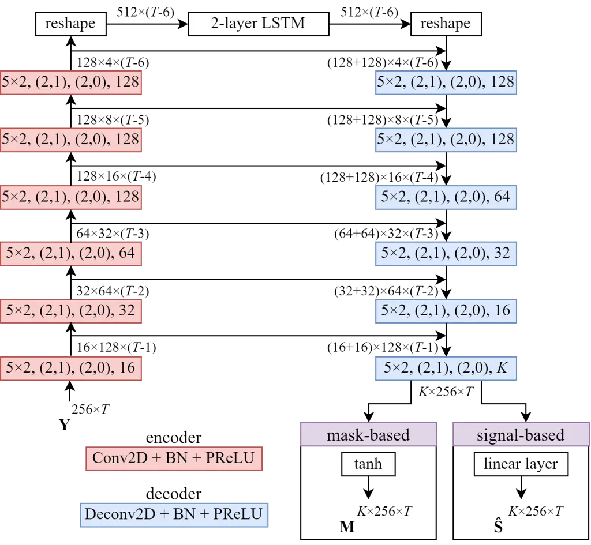
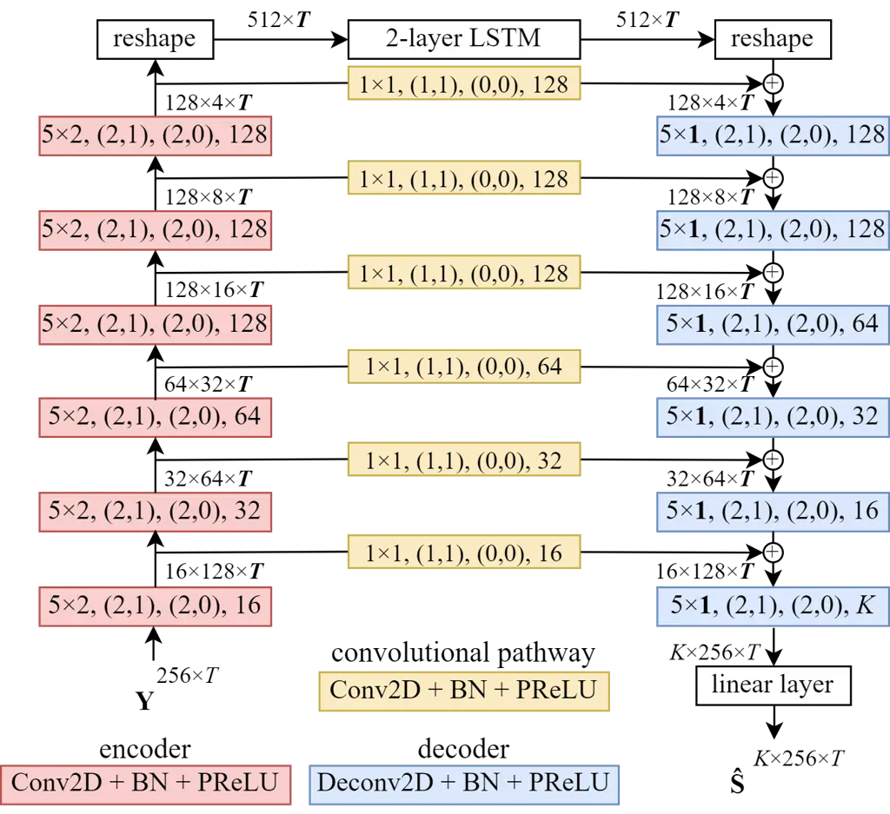
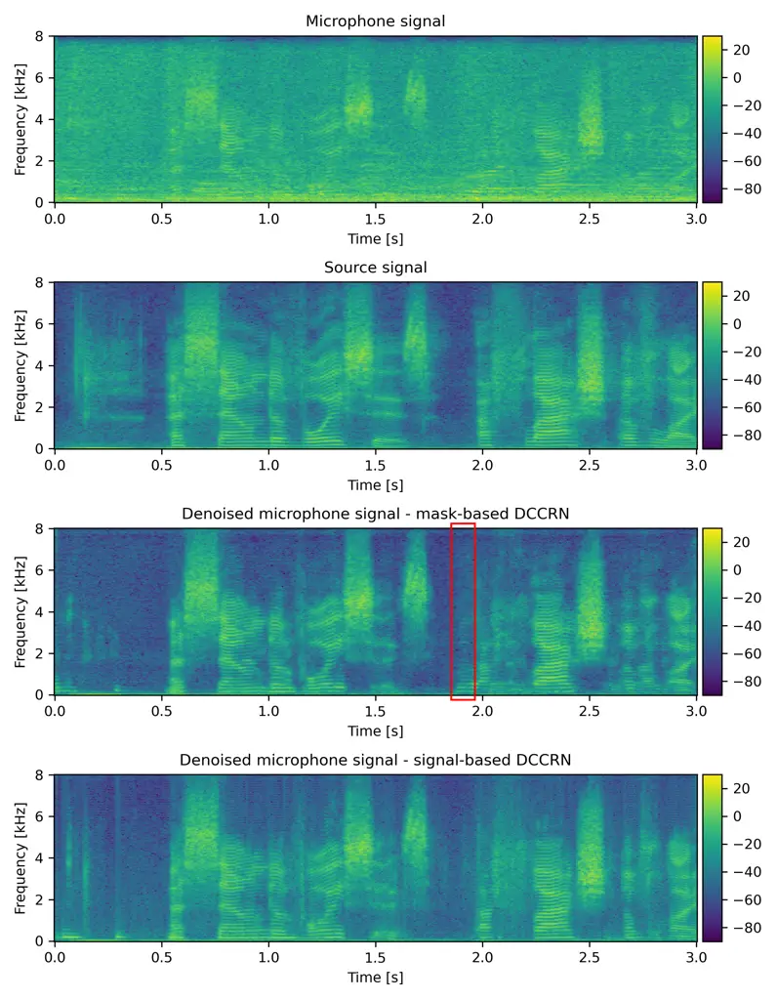

# Causal Signal-Based DCCRN with Overlapped-Frame Prediction for Online Speech Enhancement

Julitta Bartolewska, Stanisław Kacprzak, Konrad Kowalczyk

###### Abstract

The aim of speech enhancement is to improve speech signal quality and
intelligibility from a noisy microphone signal. In many applications, it
is crucial to enable processing with small computational complexity and
minimal requirements regarding access to future signal samples
(look-ahead). This paper presents signal-based causal DCCRN that
improves online single-channel speech enhancement by reducing the
required look-ahead and the number of network parameters. The proposed
modifications include complex filtering of the signal, application of
overlapped-frame prediction, causal convolutions and deconvolutions, and
modification of the loss function. Results of performed experiments
indicate that the proposed model with overlapped signal prediction and
additional adjustments, achieves similar or better performance than the
original DCCRN in terms of various speech enhancement metrics, while it
reduces the latency and network parameter number by around $`30\%`$.

^(†)^(†)address: AGH University of Science and Technology, Institute of
Electronics, 30-059 Krakow, Poland^(†)^(†)email: {bartolew, skacprza,
konrad.kowalczyk}@agh.edu.pl

Index Terms: speech enhancement, noise suppression, online processing,
deep neural network

## 1 Introduction

Intelligibility and quality of the speech signal diminishes in presence
of background noise. The aim of speech enhancement is to reduce this
undesired effects and extract clean speech signal from a noisy mixture.
Over the years, speech enhancement methods (both single- and
multi-channel) based on deep learning turned out to be very effective
for this task \[1, 2\], and nowadays are considered state-of-art. Those
approaches can be broadly categorized into time and time-frequency
domain methods. Time domain methods try to map noisy speech to clean
speech directly \[3, 4\], while the ones operating in time-frequency
domain usually define a learning target as clean speech spectogram or
the desired mask (e.g., an ideal power ratio mask). Many of them are
based only on magnitude features (and re-use phase of a noisy
signal) \[5, 6\], however, methods that try to reconstruct phase using
e.g. complex ratio mask have recently gained on popularity \[7, 8, 9\].

Speech enhancement has many real-life applications, but the most desired
ones require low processing latency, so that enhancement can be
performed in real-time (without breaking the human communication process
with unnatural delays). The low-computational cost is a property desired
in all systems, but most crucial for on-device deployment on smartphones
or hearing aids. These translate into _algorithmic latency_ and
_hardware latency_ that both add up to the overall _processing latency_
\[10, 11\]. The implementation aspects of speech enhancement are
important parts of current research. Reduction of _hardware latency_ can
be achieved by decreasing the number of network parameters (either by
specific network (re-)design \[12\], by performing pruning \[13\] or
knowledge distillation \[14\]) or their quantization \[15\]. The main
impact on _algorithmic latency_ has the length of speech frame that the
system aims to predict, as single-frame prediction is the most popular
approach for online speech enhancement. The frame is predicted based on
current and previous inputs and overlap-added with previous predictions
for final enhanced speech signal generation. The recent challenges that
focus on real-time speech enhancement, such as Interspeech 2020 Deep
Noise Suppression (DNS) challenge \[16\] and Clarity \[17\], put tight
requirements on the maximum processing time and allowed look-ahead
limited to respectively 40 ms and 5 ms. A comprehensive survey on recent
advancements in low-latency speech enhancement can be found in \[11\].

In this work, we focus on a single architecture, namely Deep Complex
Convolutional Recurrent Network (DCCRN) \[8\] (that has already shown
impressive performance at DNS challenge), which originally estimates the
so-called Complex Ratio Mask (CRM). In original DCCRN formulation, the
estimated mask is applied to both real and imaginary parts, which can
lead to improved signal enhancement due to phase information
preservation. We analyze in-depth different modifications to the network
architecture, which are aimed to improve speech enhancement performance
in an online scenario. To this end we explore signal-based filtering
instead of a mask-based approach, overlapped-frame prediction algorithm
with partial and full sub-frames summation \[18\], causal architecture
design (causal convolutions and deconvolutions), as well as loss
modification and other subtle changes in the neural network architecture
(described in detail in Sec. 2).

The proposed causal signal-based filtering using DCCRN with full
overlapped-frame prediction offers significant reductions in the number
of neural network parameters, as well as in the relative latency over
the original mask-based DCCRN \[8\]. Furthermore, the results of
experimental evaluations performed using Librimix and DNS datasets
indicate similar yet often slightly better speech enhancement
performance in terms of classical evaluation metrics.

## 2 Proposed Causal DCCRN with Overlapped-Frame Prediction

### 2.1 Problem formulation

In this paper, we address the problem of single-channel speech
enhancement performed in the short-time Fourier transform (STFT) domain.
We assume an additive signal model in which the microphone mixture is
given by

```math
Y^{(f,t)}=S^{(f,t)}+N^{(f,t)}\,, \tag{1}
```

where $`Y^{(f,t)}=[\mathbf{Y}]_{f,t}`$ denotes the $`(f,t)`$-th element
of the matrix with a complex spectrum of the microphone signal
$`\mathbf{Y}\in\mathbb{C}^{F\times T}`$, with the frequency and time
indices given by $`f=0,1,\ldots,F-1`$ and $`t=0,1,\ldots,T-1`$,
respectively. $`S^{(f,t)}=[\mathbf{S}]_{f,t}`$ and
$`N^{(f,t)}=[\mathbf{N}]_{f,t}`$ are defined similarly and denote the
source and noise signal spectra in the $`(f,t)`$-th time-frequency bin.

The goal of speech enhancement is to extract the desired source signal
$`\mathbf{s}`$ in the time domain. In this work, it is obtained via
inverse STFT of the source spectrum estimated by direct filtering of the
complex STFT representation of the microphone signal by a complex-valued
neural network, which can be written as

```math
\mathbf{\hat{s}}=\mathcal{F}^{-1}\{\mathbf{\hat{S}}=H(\mathbf{Y})\}\,, \tag{2}
```

where $`H(\cdot)`$ represents neural network complex filtering and
$`\mathcal{F}^{-1}\{\cdot\}`$ denotes an inverse STFT (ISTFT). Note that
the proposed direct filtering differs from the existing DCCRN-based
approaches \[8\] which estimate complex time-frequency masks.

### 2.2 Direct signal filtering vs mask-based approach

The original DCCRN \[8\] is a complex-valued network with
encoder-decoder U-shaped architecture. Encoder and decoder are composed
of six Conv2D/Deconv2D blocks, each consists of
convolutional/deconvolutional layer followed by batch normalization and
PReLU activation. It is designed with a 2-layer complex LSTM between
encoder and decoder, with 128 hidden units, followed by a single linear
layer with 512 units. Note that the provided layer dimensions (including
those depicted in Fig. 1) are the same for the real and imaginary parts.
Moreover, the Nyquist frequency is omitted in DNN-based processing.

State-of-the-art DCCRN \[8\] estimates the so-called Complex Ratio Mask
(CRM) $`\mathbf{M}\in\mathbb{C}^{F\times T}`$, which is next subject to
complex multiplication with the complex spectrum of the microphone
signal in the STFT domain.

In contrast, in this work, we directly perform complex filtering of the
microphone signal spectrum by the DCCRN. As shown in Fig. 1, this can be
achieved by minor modifications to the original network architecture. In
particular, in comparison with the mask-based processing, the
$`\tanh(\cdot)`$ activation function that limits the mask magnitude to
the range $`[0,1]`$ is removed, and instead, a linear (i.e. fully
connected) layer is added at the decoder output.

### 2.3 Processing of overlapped time frames

For both mask-based and signal-based DCCRN, we apply the
overlapped-frame prediction algorithm recently proposed in \[18\], which
allows to better leverage the future context without affecting their
algorithmic latency. For each STFT frame, it assumes the prediction of
$`K=W/P`$ frames, where $`W`$ and $`P`$ denote the frame length and the
hop-size in samples, respectively. The predicted $`K-1`$ immediate past
frames and the current one are then utilized within the ISTFT algorithm.
After calculating, for each of $`K`$ predicted frames, the inverse
transform, and applying the synthesis window, the resulting $`K`$
predictions for the frame in the time domain are finally appropriately
overlap-added in order to produce the particular sub-frame of the output
signal. This way, the so-called partial sub-frame summation is
performed. In order to leverage all frame predictions, which involve a
particular sub-frame, the so-called full sub-frame summation can be
used. Note that the standard single-frame prediction is equivalent to
the standard overlap-add method, which results as a special case of the
full sub-frame summation for $`K=1`$.

To ensure perfect reconstruction we employ the synthesis window design
as presented in \[18\]. In particular, for partial sub-frame summation,
it is the same as the regular synthesis window used for single-frame
prediction (since the summation process is mathematically equivalent),
hence it follows

```math
l[n]=\frac{g[n]}{\sum_{e=0}^{W/P-1}g[eP+(n\,\mathrm{mod}\,P)]^{2}}\,, \tag{3}
```

where $`g`$ is the analysis window and $`0\leq n<W`$. However, for full
sub-frame summation, it is modified to

```math
l[n]=\frac{g[n]}{\sum_{e=0}^{W/P-1}\bigl((e+1)\times g[eP+(n\,\mathrm{mod}\,P)]^{2}\bigr)}\,. \tag{4}
```



Figure 1: Original mask-based DCCRN architecture \[8\] and proposed
signal-based, presented for overlapped-frame prediction. Tensor shapes
are presented in the format: Features$`\times`$Freq$`\times`$Time, while
Conv2D and Deconv2D blocks are shown as: kernelFreq$`\times`$kernelTime,
(strideFreq, strideTime), (padFreq, padTime), features.



Figure 2: Proposed causal DCCRN with convolution pathways.

### 2.4 Causal architecture design

In order to avoid reliance on future frames, non-causal layers are
replaced with their respective causal counterparts. In particular,
performed modifications include: (i) using causal two-dimensional (2D)
convolutions in the encoder, achieved by the appropriate left
zero-padding along the time dimension, and (ii) using causal
two-dimensional deconvolutions in the decoder achieved by reducing the
kernel size along the time dimension to the value of $`1`$.

Note that as a result, in contrast to the original DCCRN \[8\], in both
encoder and decoder, the size of the time dimension $`T`$ remains
unchanged, as marked in Fig. 2. Furthermore, algorithmic latency, due to
the overlap-add procedure from the ISTFT operation, equals to the frame
length (e.g. 4 sub-frames for $`25\%`$ overlap, as used in this paper).
In case of the original DCCRN, which also uses $`25\%`$ overlap, look
ahead amounted to 6 sub-frames. Thus the baseline system requires
relative $`50\%`$ algorithmic latency increase in reference to our
proposed model.

### 2.5 Further modifications to the network architecture and loss function

Further modification include an introduction of convolutional pathways,
with filter kernel of $`1\times 1`$, between the encoder and decoder
through skip-connections, which is a similar idea to the DCCRN+
presented in \[19\]. However, instead of performing concatenation along
the feature dimension, we propose to sum the output from the convolution
path with the output of the preceding deconvolutional layer, before
feeding it to the next deconvolutional layer.

In the majority of experiments, we apply the typically used loss
function \[8\], known as the scale-invariant signal-to-noise ratio
(SI-SNR), which is defined as follows

```math
\mathcal{L}_{\textrm{SI-SNR}}=20\log_{10}\frac{{\lVert s\rVert}_{2}}{{\lVert\hat{s}-s\rVert}_{2}}\,, \tag{5}
```

where $`s`$ is scaled during training according to
$`s=(\hat{s}^{T}s)s/(s^{T}s)`$ to normalize signal gain before loss
computation. Note that the negative SI-SNR loss is minimized.

In the final experiments, we also modify the loss function as follows
(based on the magnitude of the re-synthesized signal):

```math
\mathcal{L}_{\textrm{SI-SNR+Mag}}=\gamma\mathcal{L}_{\textrm{SI-SNR}}+(1-\gamma){\lVert\lvert\textrm{STFT}(\hat{s})\rvert-\lvert\textrm{STFT}(s)\rvert\rVert}_{1}\,, \tag{6}
```

where hyperparameter $`\gamma`$ enables to weight the impact of both
loss terms. Note that the STFT used in the loss function differs from
the one used to transform the input signal into the STFT domain. In
particular, we apply the rectangular window, whilst all STFT parameters
(such as frame length and hop-size) remain the same as in the processing
path.

## 3 Experimental Evaluation and Results

### 3.1 Datasets and training setup

As a main dataset for the performed experiments, we used LibriMix
(Libri2Mix) \[20\], precisely _train-360_ (50k utterances), _dev_ (3k
utterances) and _test_ (3k utterances) splits in the _min_ mode. The
training data consists of short (3 s long) signals with 16 kHz sampling
frequency that undergo 512-point STFT with 32 ms Hann window and 25%
(8 ms) hop-size. We base our implementation on the one available in the
Asteroid toolkit \[21\]. We share most of the configuration and
hyperparameters with Asteroid implementation¹¹ 1
[https://github.com/asteroid-team/asteroid/tree/master/egs/librimix/DCCRNet](https://github.com/asteroid-team/asteroid/tree/master/egs/librimix/DCCRNet),
i.e Adam optimizer with weight decay set to 10e-5 and the maximum number
of epochs set to 200 (using early stopping optimization with patience
parameter equal 30). However, we increase the learning rate to 10e-2 and
number of batches to 64, to fully utilize DDP training on 4 GPUs. In the
preliminary experiments, we analyze training stability by performing
four independent trainings for different seeds (that influenced
parameters initialization and shuffling of batches), obtaining $`0.024`$
standard error for the SI-SDR measure \[22\] for model without any
modifications.

In addition to the evaluation on the _test_ (3k utterances) split of
LibriMix (Libri2Mix) \[20\], evaluation was also performed on synthetic
test split (without reverb) from the Deep Noise Suppression (DNS) 2020
Challenge \[16\], which consisted of 150 pairs of clean and noisy audio
samples. Finally, as the values of the two losses in (6) are not in the
same scale, we empirically set $`\gamma=0.995`$.

### 3.2 Performed experiments and evaluation metrics

In experimental evaluation, we focus primarily on (i) the performance
comparison between the mask-based and signal-based DCCRN, as well as
(ii) comparison between two versions of the overlapped-frame prediction
algorithm (with partial and full sub-frame summation) against the
popular single-frame processing, and (iii) comparison between non-causal
and causal architecture design. For the final setup, i.e. signal-based
DCCRN with overlapped-frame prediction performing full-sub-frame
summation and operating in a causal manner, we assess the model
performance for the added convolutional pathways and the modified loss
function given by (6).

We used standard speech enhancement evaluation metrics such as the
Scale-Invariant Signal-to-Distortion Ratio (SI-SDR) \[22\], Perceptual
Evaluation of Speech Quality (PESQ) \[23\], and Short-Time Objective
Intelligibility (STOI) \[24\]. Table 1 presents the improvements
(denoted as $`\Delta`$) of these measures between the processed (speech
enhanced) and unprocessed (noisy) signals, for the evaluations performed
on the Librimix and DNS datasets.

|              |                                       |               |              |                |       |       |                |       |       |
| ------------ | ------------------------------------- | ------------- | ------------ | -------------- | ----- | ----- | -------------- | ----- | ----- |
|              |                                       |               |              | Librimix       |       |       | DNS            |       |       |
|              | Processing type                       | Causal        | \#Params (M) | ΔSI-SDR \[dB\] | ΔSTOI | ΔPESQ | ΔSI-SDR \[dB\] | ΔSTOI | ΔPESQ |
|              |                                       | no            | 3.7          | 10.0           | 0.121 | 1.04  | 7.2            | 0.046 | 1.02  |
|              | single-frame pred.                    | yes           | 2.8          | 9.7            | 0.116 | 0.95  | 7.0            | 0.045 | 0.96  |
|              |                                       | no            | 3.7          | 10.1           | 0.123 | 1.07  | 7.3            | 0.048 | 1.04  |
|              | overlapped-frame pred. (partial sum.) | yes           | 2.8          | 9.7            | 0.117 | 1.00  | 7.0            | 0.045 | 1.00  |
|              |                                       | no            | 3.7          | 10.1           | 0.120 | 1.10  | 7.3            | 0.048 | 1.07  |
| mask-based   | overlapped-frame pred. (full sum.)    | yes           | 2.8          | 9.7            | 0.114 | 1.03  | 7.0            | 0.045 | 1.03  |
|              |                                       | no            | 3.8          | 10.2           | 0.123 | 1.06  | 7.3            | 0.047 | 0.99  |
|              | single-frame pred.                    | yes           | 2.9          | 10.1           | 0.120 | 0.96  | 7.3            | 0.046 | 0.98  |
|              |                                       | no            | 3.8          | 10.6           | 0.128 | 1.10  | 7.6            | 0.049 | 1.06  |
|              | overlapped-frame pred. (partial sum.) | yes           | 2.9          | 10.0           | 0.120 | 0.97  | 7.0            | 0.045 | 0.94  |
|              |                                       | no            | 3.8          | 10.5           | 0.127 | 1.10  | 7.4            | 0.048 | 1.04  |
|              |                                       | yes           | 2.9          | 10.3           | 0.123 | 1.02  | 7.4            | 0.046 | 1.00  |
|              |                                       | \+ CP         | 2.6          | 10.2           | 0.122 | 1.00  | 7.3            | 0.047 | 0.99  |
| signal-based | overlapped-frame pred. (full sum.)    | \+ SI-SNR+Mag | 2.6          | 10.2           | 0.126 | 1.14  | 7.4            | 0.050 | 1.17  |

Table 1: Comparison of the original mask-based DCCRN with the proposed
signal-based DCCRN for causal and non-causal single-frame and
overlapped-frame prediction with full and partial summation. Results are
presented for the LibriMix and DNS test datasets, with the reference
values of ΔSI-SDR \[dB\], ΔSTOI, and ΔPESQ metrics (which are averaged
over unprocessed signals for all datasets) equal to 3.4 dB, 0.796, 1.16
for Librimix, and 9.2 dB, 0.915, and 1.58 for DNS. Note that the
algorithmic latency of causal vs non-causal cases is equal to 32 ms (4
sub-frames of 8 ms) vs 48 ms (6 sub-frames of 8 ms), respectively.

### 3.3 Discussion of results

The results presented in Table 1 for the Librimix dataset indicate that
slight yet consistent improvement in SI-SDR and STOI is obtained by the
proposed signal-based processing over the respective mask-based
counterpart; improvement in terms of PESQ is also observed for the
counterpart models. For the DNS dataset, we can similarly observe
improvement or at least the same gain for SI-SDR and STOI in the
signal-based processing over the mask-based processing for the proposed
causal as well as non-causal cases.

As expected, in general, switching from non-causal to causal processing,
typically results in slight performance drop in terms of the evaluation
metrics’ values. On the other hand, it also significantly reduces the
number of network parameters, by around $`24\%`$.

Comparing the processing type for the proposed causal signal-based
processing, the presented overlapped-frame prediction with full
sub-frame summation, consistently outperforms the standard single-frame
prediction. Interestingly, partial summation notably outperforms the
reference single-frame prediction for the non-causal processing. It
should be noted, that comparing popular single-frame prediction in
mask-based processing with the proposed signal-based processing with
overlapped-frame prediction, in general performance gain is observed for
the vast majority of cases, while at times minor hearable artifacts may
also occur \[10\].



Figure 3: Example spectrograms of unprocessed microphone signal (top),
source signal, source signal estimated by mask-based DCCRN, and
signal-based causal DCCRN with convolutional pathways and applied
overlapped-frame prediction using full sub-frame summation (bottom).

The proposed causal signal-based processing with full summation in
overlapped-frame prediction, is next modified by adding convolutional
pathways (CP). Such CP modification reduces the number of network
parameters, while the evaluation metrics remain at very similar levels.
Further modification of the loss function yields significant performance
gain in STOI and PESQ, which is superior to the original mask-based
DCCRN across all performance measures and both datasets. Note that this
impressive results are obtained for the model with a reduced number of
network parameters (from 3.7M to 2.6M).

Finally, Fig. 3 compares example spectrograms of the original mask-based
processing with single-frame prediction, and the proposed signal-based
causal processing with overlapped-frame prediction using full sub-frame
summation. As can be observed, spectrograms obtained with the proposed
and state-of-the-art models are very similar. They are also similar to
the spectrogram of the clean source signal, which indicates very good
noise reduction. Nonetheless, some differences can be observed, e.g. in
the time period just before 2 s, in which the existing mask-based
approach estimates the signal which is not present in the original
source signal. In contrast, spectrogram of the proposed model resembles
more closely the spectrogram of the clean source in this time period.

## 4 Conclusions

This paper presents causal signal-based DCCRN for improved online
single-channel speech enhancement. The proposed model performs direct
complex filtering of the microphone signal with overlapped-frame
prediction using full sub-frame summation. The results of experimental
evaluation indicate that the proposed model achieves similar or even
better speech enhancement than the original DCCRN with mask-based
single-frame prediction, while it decreases the algorithmic latency and
reduces the number of neural network parameters.

## 5 Acknowledgements

This research was funded in part by the National Science Centre, Poland
DEC-2021/42/E/ST7/00452, by program ‘Excellence initiative – research
university’ for the AGH University of Science and Technology, and by the
Foundation for Polish Science under grant number First TEAM/2017-3/23
(POIR.04.04.00-00-3FC4/17-00). For the purpose of Open Access, the
author has applied a CC-BY public copyright licence to any Author
Accepted Manuscript (AAM) version arising from this submission. The
support of Poland’s high-performance computing infrastructure PLGrid is
acknowledged.

## References

- \[1\] S. A. Nossier, J. Wall, M. Moniri, C. Glackin, and N. Cannings,
  “An experimental analysis of deep learning architectures for
  supervised speech enhancement,” _Electronics_, vol. 10, no. 1, 2021.
  \[Online\]. Available:
  [https://www.mdpi.com/2079-9292/10/1/17](https://www.mdpi.com/2079-9292/10/1/17)
- \[2\] D. Wang and J. Chen, “Supervised speech separation based on deep
  learning: An overview,” 2017. \[Online\]. Available:
  [https://arxiv.org/abs/1708.07524](https://arxiv.org/abs/1708.07524)
- \[3\] D. Rethage, J. Pons, and X. Serra, “A Wavenet for speech
  denoising,” in _2018 IEEE International Conference on Acoustics,
  Speech and Signal Processing (ICASSP)_. IEEE, 2018, pp. 5069–5073.
- \[4\] A. Pandey and D. Wang, “TCNN: Temporal convolutional neural
  network for real-time speech enhancement in the time domain,” in
  _ICASSP 2019-2019 IEEE International Conference on Acoustics, Speech
  and Signal Processing (ICASSP)_. IEEE, 2019, pp. 6875–6879.
- \[5\] J. Heymann, L. Drude, and R. Haeb-Umbach, “Neural network based
  spectral mask estimation for acoustic beamforming,” in _2016 IEEE
  International Conference on Acoustics, Speech and Signal Processing
  (ICASSP)_, 2016, pp. 196–200.
- \[6\] S. Chakrabarty and E. A. P. Habets, “Time–frequency masking
  based online multi-channel speech enhancement with convolutional
  recurrent neural networks,” _IEEE Journal of Selected Topics in Signal
  Processing_, vol. 13, no. 4, pp. 787–799, 2019.
- \[7\] H.-S. Choi, J.-H. Kim, J. Huh, A. Kim, J.-W. Ha, and K. Lee,
  “Phase-aware speech enhancement with deep complex U-Net,” in
  _International Conference on Learning Representations_, 2018.
- \[8\] Y. Hu, Y. Liu, S. Lv, M. Xing, S. Zhang, Y. Fu, J. Wu, B. Zhang,
  and L. Xie, “DCCRN: Deep Complex Convolution Recurrent Network for
  Phase-Aware Speech Enhancement,” in _Proc. Interspeech 2020_, 2020,
  pp. 2472–2476.
- \[9\] X. Hao, X. Su, R. Horaud, and X. Li, “FullSubNet: A full-band
  and sub-band fusion model for real-time single-channel speech
  enhancement,” in _ICASSP 2021 - 2021 IEEE International Conference on
  Acoustics, Speech and Signal Processing (ICASSP)_, 2021, pp.
  6633–6637.
- \[10\] Z.-Q. Wang, G. Wichern, S. Watanabe, and J. Le Roux,
  “STFT-Domain Neural Speech Enhancement with Very Low Algorithmic
  Latency,” _IEEE/ACM Transactions on Audio, Speech, and Language
  Processing_, vol. 31, pp. 397–410, 2022.
- \[11\] S. Drgas, “A Survey on Low-Latency DNN-Based Speech
  Enhancement,” _Sensors_, vol. 23, no. 3, p. 1380, 2023.
- \[12\] M. Romaniuk, P. Masztalski, K. Piaskowski, and M. Matuszewski,
  “Efficient Low-Latency Speech Enhancement with Mobile Audio Streaming
  Networks,” in _Proc. Interspeech 2020_, 2020, pp. 3296–3300.
- \[13\] K. Tan and D. Wang, “Compressing deep neural networks for
  efficient speech enhancement,” in _ICASSP 2021-2021 IEEE International
  Conference on Acoustics, Speech and Signal Processing (ICASSP)_. IEEE,
  2021, pp. 8358–8362.
- \[14\] M. Thakker, S. E. Eskimez, T. Yoshioka, and H. Wang, “Fast
  Real-time Personalized Speech Enhancement: End-to-End Enhancement
  Network (E3Net) and Knowledge Distillation,” in _Proc. Interspeech
  2022_, 2022, pp. 991–995.
- \[15\] Y.-C. Lin, C. Yu, Y.-T. Hsu, S.-W. Fu, Y. Tsao, and T.-W. Kuo,
  “SEOFP-NET: Compression and acceleration of deep neural networks for
  speech enhancement using sign-exponent-only floating-points,”
  _IEEE/ACM Transactions on Audio, Speech, and Language Processing_,
  vol. 30, pp. 1016–1031, 2021.
- \[16\] C. K. Reddy, V. Gopal, R. Cutler, E. Beyrami, R. Cheng,
  H. Dubey, S. Matusevych, R. Aichner, A. Aazami, S. Braun _et al._,
  “The interspeech 2020 deep noise suppression challenge: Datasets,
  subjective testing framework, and challenge results,” in
  _INTERSPEECH_, 2020.
- \[17\] S. Graetzer, J. Barker, T. J. Cox, M. Akeroyd, J. F. Culling,
  G. Naylor, E. Porter, R. Viveros Munoz _et al._, “Clarity-2021
  challenges: Machine learning challenges for advancing hearing aid
  processing,” in _INTERSPEECH_, vol. 2. International Speech
  Communication Association (ISCA), 2021, pp. 686–690.
- \[18\] Z.-Q. Wang and S. Watanabe, “Improving frame-online neural
  speech enhancement with overlapped-frame prediction,” _IEEE Signal
  Processing Letters_, vol. 29, pp. 1422–1426, 2022. \[Online\].
  Available:
  [https://doi.org/10.1109%2Flsp.2022.3183473](https://doi.org/10.1109%2Flsp.2022.3183473)
- \[19\] S. Lv, Y. Hu, S. Zhang, and L. Xie, “DCCRN+: Channel-wise
  Subband DCCRN with SNR Estimation for Speech Enhancement,” 2021.
  \[Online\]. Available:
  [https://arxiv.org/abs/2106.08672](https://arxiv.org/abs/2106.08672)
- \[20\] J. Cosentino, M. Pariente, S. Cornell, A. Deleforge, and
  E. Vincent, “LibriMix: An open-source dataset for generalizable speech
  separation,” 2020.
- \[21\] M. Pariente, S. Cornell, J. Cosentino, S. Sivasankaran,
  E. Tzinis, J. Heitkaemper, M. Olvera, F.-R. Stöter, M. Hu, J. M.
  Martín-Doñas, D. Ditter, A. Frank, A. Deleforge, and E. Vincent,
  “Asteroid: the PyTorch-based audio source separation toolkit for
  researchers,” in _Proc. Interspeech_, 2020.
- \[22\] J. L. Roux, S. Wisdom, H. Erdogan, and J. R. Hershey, “SDR –
  half-baked or well done?” _ICASSP 2019 - 2019 IEEE International
  Conference on Acoustics, Speech and Signal Processing (ICASSP)_, pp.
  626–630, 2018.
- \[23\] A. Rix, J. Beerends, M. Hollier, and A. Hekstra, “Perceptual
  evaluation of speech quality (PESQ)-a new method for speech quality
  assessment of telephone networks and codecs,” in _IEEE International
  Conference on Acoustics, Speech and Signal Processing (ICASSP)_,
  vol. 2, 2001, pp. 749–752.
- \[24\] C. H. Taal, R. C. Hendriks, R. Heusdens, and J. Jensen, “An
  algorithm for intelligibility prediction of time–frequency weighted
  noisy speech,” _IEEE Transactions on Audio, Speech, and Language
  Processing_, vol. 19, no. 7, pp. 2125–2136, 2011.
