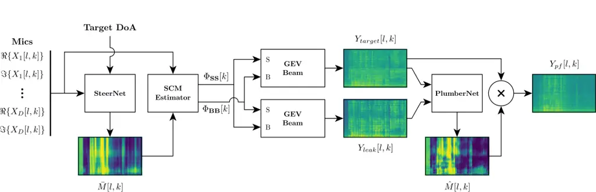
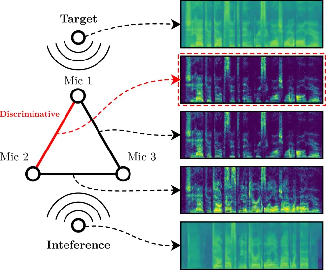

# PLUMBERNET: FIXING INTERFERENCE LEAKAGE AFTER GEV BEAMFORMING

François Grondin    Caleb Rascón

###### Abstract

Spatial filters can exploit deep-learning-based speech enhancement
models to increase their reliability in scenarios with multiple speech
sources scenarios. To further improve speech quality, it is common to
perform postfiltering on the estimated target speech obtained with
spatial filtering. In this work, Generalized Eigenvalue (GEV)
beamforming is employed to provide the leakage estimation, along with
the estimation of the target speech, to be later used for postfiltering.
This improves the enhancement performance over a postfilter that uses
the target speech and a reference microphone signal. This work also
demonstrates that the spatial covariance matrices (SCMs) can be
accurately estimated from the direction of arrival (DoA) of the target
and a discriminative selection amongst the pairwise estimated
time-frequency masks.

###### Index Terms: 

Beamforming, speech, postfilter, leakage

^(†)^(†)address: ¹Université de Sherbrooke, Sherbrooke (Québec),
Canada,  
²Universidad Nacional Autónoma de México, Ciudad de México, México

## 1 Introduction

In real-world case scenarios, speech is captured in conjunction with
background noise and other interferences. Speech enhancement aims to
eliminate both noise and interferences from the captured signal to only
keep the target speech. This field has gained significant attention
lately, largely due to the impressive advancements in deep learning
models \[1\]. Most approaches rely on single-channel input \[2, 3\],
though multi-microphone solutions can improve performances as they also
exploit the spatial information. While end-to-end multichannel models
can achieve high quality speech enhancement, they rely on
multi-microphone device-specific datasets, which makes data collection
challenging \[4\]. For these reasons, a two-stage strategy that involves
multi-channel spatial beamforming followed by single channel speech
enhancement makes the processing agnostic to the microphone array shape
\[5, 6\]. Beamforming methods often exploit deep neural networks that
generate time-frequency mask to estimate accurate spatial covariance
matrices (SCMs) \[7, 8\].

Recently, a Guided Speech Enhancement Network was introduced as a
dual-input speech enhancement neural network that uses the Minimum
Variance Distortionless Response (MVDR) beamformer output and a
reference microphone \[9\]. Results demonstrate the effectiveness of the
method when the target speech is competing with interfering speech.
However, this method requires _a priori_ knowledge of the MVDR
coefficients, that are estimated from short utterances played at each
desired direction of interest, which makes the approach less suitable
for dynamic environments.

This paper presents two contributions: 1) we propose a microphone array
geometry agnostic method to estimate the SCMs using the target direction
of arrival and the former SteerNet model \[10\]; and 2) inspired by
classical microphone array post-filtering strategies that use leakage
estimate \[11, 12\], we demonstrate that using the estimated
interference signal (i.e. ‘leakage’) rather than a reference microphone
as the second input to the neural network improves target speech
enhancement performances when using the same neural network architecture
and size.

## 2 Proposed Method



Figure 1: Proposed method. SteerNet with discriminative selection
generates a mask to isolate the target based on its DoA. The generated
mask and its complement are used to estimate the target and covariance
matrices. A GEV beamformer generates the estimated target signal, and a
second one produces the leakage signal. These two signals are fed to
PlumberNet, which estimates a fine-grain mask to further improve the
target speech quality.

We consider two speech point sound sources, denoted as
$`s[n]\in\mathbb{R}`$ for the target and $`b[n]\in\mathbb{R}`$ for the
interference, where $`n\in\mathbb{N}`$ is the sample index. The
expressions $`h_{m}[n]\in\mathbb{R}`$ and
$`h^{\prime}_{m}[n]\in\mathbb{R}`$ denote the room impulse responses
between the sources (target and interference, respectively), where
$`m\in\{1,2,\dots,D\}`$ is the microphone index and $`D\in\mathbb{N}`$
is the number of microphones. The measured signal at each microphone is
given by:

```math
x_{m}[n]=h_{m}[n]*s[n]+h^{\prime}_{m}[n]*b[n], \tag{1}
```

where $`*`$ stands for the linear convolution operator.

A Short-Time Fourier Transform (STFT) with frames of
$`N\in 2\mathbb{N}`$ samples and a hop size of $`\Delta N\in\mathbb{N}`$
samples generates a time-frequency representation
$`X_{m}[l,k]\in\mathbb{C}`$ for each microphone signal $`x_{m}[m]`$,
where $`l\in\{0,1,\dots,L-1\}`$ is the frame index (out of
$`L\in\mathbb{N}`$ frames) and $`k\in\{0,1,\dots,N/2\}`$ is the
frequency bin index. This can be combined in a single vector
$`\mathbf{X}[l,k]\in\mathbb{C}^{D\times 1}`$:

```math
\mathbf{X}[l,k]=\left[\begin{array}[]{cccc}X_{1}[l,k]&X_{2}[l,k]&\dots&X_{D}[l,k]\end{array}\right]^{T}, \tag{2}
```

where $`\{\dots\}^{T}`$ denotes the transpose operator.

As previously demonstrated in \[10\], a neural network (e.g. SteerNet)
can generate a coarse time-frequency ideal ratio mask
$`\bar{M}[l,k]\in[0,1]`$ from a set of pairs of microphones, based on
the direction of arrival of the target sound source, denoted by
$`\theta`$.

```math
\bar{M}[l,k]=f(\theta,\mathbf{X}[l,k]) \tag{3}
```

The estimated mask $`\bar{M}[l,k]\in[0,1]`$ emphasizes the
time-frequency regions dominated by the target speech. In the former
paper \[10\], a mask is estimated for each pair of microphones and all
masks are averaged to produce $`\bar{M}[l,k]`$. However, it is common
that some pairs of microphones will perceive both the target and
interference sources with the same time difference of arrival (TDoA),
and the neural network generates masks that capture both signals. To
overcome this limitation, the mask $`\bar{M}[l,k]`$ is set to
corresponds to the pair of microphones that generate the most
discriminative mask, i.e. the mask with the smallest number of active
time-frequency bins. This method is illustrated at figure 2.



Figure 2: Mask estimation using the most discriminative pair of
microphones. SteerNet estimates a mask for each pair, and then the
instance with the least amount of time-frequency bin close to a value of
$`1`$ is chosen. In this example, the pair of microphones $`2`$ and
$`3`$ show an ambiguity as the target and interference have the same
time difference of arrival, and the resulting mask shows more
time-frequency bins with a value close to $`1`$ compared to pairs
$`(1,2)`$, and $`(1,3)`$.

This mask is used to estimate the SCMs at each frequency bin $`k`$ for
target speech ($`\Phi_{\mathbf{SS}}[k]\in\mathbb{C}^{D\times D}`$) and
interference speech
($`\Phi_{\mathbf{BB}}[k]\in\mathbb{C}^{D\times D}`$):

```math
\Phi_{\mathbf{SS}}[k]=\sum_{l=1}^{L}{\bar{M}[l,k]\mathbf{X}[l,k]\mathbf{X}[l,k]^{H}}, \tag{4}
```

```math
\Phi_{\mathbf{BB}}[k]=\sum_{l=1}^{L}{(1-\bar{M}[l,k])\mathbf{X}[l,k]\mathbf{X}[l,k]^{H}}, \tag{5}
```

where $`\{\dots\}^{H}`$ stands for the Hermitian operator.

The weights $`\mathbf{w}_{target}[k]\in\mathbb{C}^{D\times 1}`$ of the
Generalized Eigenvalue (GEV) beamformer that estimates the target speech
at each $`k`$, can be calculated using these SCMs by:

```math
\mathbf{w}_{target}[k]=\mathcal{P}\{\Phi^{-1}_{\mathbf{BB}}[k]\Phi_{\mathbf{SS}}[k]\}, \tag{6}
```

with the principal component operator $`\mathcal{P}\{\dots\}`$ that
extracts the eigenvector associated to the highest eigenvalue. Note that
in case the positive semi-definite matrix $`\Phi_{\mathbf{BB}}`$ is
singular, it can be made positive definite by diagonal loading.

The estimated target speech signal $`Y_{target}[l,k]\in\mathbb{C}`$ is
calculated by:

```math
Y_{target}[l,k]=(\mathbf{w}_{target}[k])^{H}\mathbf{X}[l,k]. \tag{7}
```

Although beamforming estimates the target source, there usually remains
a part of the undesirable interfering speech (i.e. leakage). A common
strategy consists in predicting another mask from the estimated target
signal produced by the beamformer, and in applying this mask as a last
postfiltering step. This approach may however suffer from the source
permutation ambiguity, which makes target mask prediction challenging.
In fact, the post-filter neural network can easily confuse both sources
if the estimated speech target source has a similar power level than the
remaining interfering speech source. In \[9\], an arbitrary microphone
signal is used as a reference to differentiate the target source from
the mixture. In this work, we demonstrate that using another set of
weights to estimate the leakage signal and use it as the reference
signal provides better results. To achieve this, the SCMs are swapped
from how they are used in (6), and the weights that estimate the leakage
are similarly computed by:

```math
\mathbf{w}_{leak}[k]=\mathcal{P}\{\Phi^{-1}_{\mathbf{SS}}[k]\Phi_{\mathbf{BB}}[k]\}. \tag{8}
```

Here, the same diagonal loading strategy as in (6) can be applied to
$`\Phi_{\mathbf{SS}}`$ to ensure the matrix is invertible. The leakage
signal $`Y_{leak}[l,k]\in\mathbb{C}`$ can be then calculated by:

```math
Y_{leak}[l,k]=(\mathbf{w}_{leak}[k])^{H}\mathbf{X}[l,k]. \tag{9}
```

A neural network denoted by $`g(\dots)`$ is used to estimate the
postfilter ideal ratio mask $`\hat{M}[l,k]\in[0,1]`$ using both the
estimated target and leakage signals:

```math
\hat{M}[l,k]=g(Y_{target}[l,k],Y_{leak}[l,k]). \tag{10}
```

This network estimates the ideal ratio mask for postfiltering, which
corresponds to:

```math
M[l,k]=\frac{|Y_{ref}[l,k]|}{|Y_{target}[l,k]|}, \tag{11}
```

with

```math
Y_{ref}[l,k]=(\mathbf{w}_{target}[k])^{H}\mathbf{X}_{ref}[l,k], \tag{12}
```

where the expression $`\mathbf{X}_{ref}[l,k]`$ is obtained applying the
STFT to (1), and then using (2) without the interference signal
($`b[n]=0\ \forall\ n`$).

By using both $`Y_{target}`$ and $`Y_{leak}`$, the network should be
able to solve the possible permutation between target and interference
sources. For this application, a recurrent neural network (RNN) is fed a
tensor made up of $`L`$ frames and $`2(N/2+1)`$ frequency bins, which
holds the concatenated frames $`\log|Y_{target}[l,k]|`$ and
$`\log|Y_{leak}[l,k]|`$. The RNN, implemented using a Gated Recurrent
Unit (GRU) with two layers, consists of 256 hidden units at each layer.
The output of the RNN is then fed to a fully connected layer and a
sigmoid function. A dropout layer is also added to the RNN and between
the output of the RNN and the fully connected layer, with a dropout
probability of $`p=0.2`$ to reduce overfitting.

The employed loss function is presented in (13), where $`\beta=0.25`$
ensures proper weighting across all frequencies:

```math
loss=(M[l,k]-\hat{M}[l,k])|Y_{target}[l,k]|^{\beta}. \tag{13}
```

Finally, the estimated mask is applied to the magnitude of the GEV
beamformer output spectrum:

```math
Z[l,k]=\hat{M}[l,k]Y_{target}[l,k], \tag{14}
```

and the inverse STFT is applied to $`Z[l,k]\in\mathbb{C}`$ to generate
the time-domain output $`z[n]\in\mathbb{R}`$. Figure 1 shows the
complete pipeline previously described, and the full implementation can
be accessed online¹¹ 1 https://github.com/balkce/plumbernet.

## 3 RESULTS AND DISCUSSION

We compare the performance of the proposed method formerly introduced in
\[9\], where the covariance matrices are pre-computed offline during a
calibration step. This makes the system less suitable for dynamic
environments, whereas here we estimate the covariance matrices based on
the direction of arrival of the target. This makes our approach more
convenient to unknown environments as the DoA can be obtained from a
video feed or _a priori_ knowledge of the target source position.
Moreover, our approach uses the leakage signal as a reference signal, as
opposed to an arbitrary microphone signal as in \[9\].

We created a dataset based on the clean sub-set of the Interspeech 2022
deep noise suppression challenge corpus \[13\]. Rooms of different sizes
are simulated with a target speech source and an interference source.
Room impulse responses (RIRs) are generated using the image method
\[14\] to simulate sound propagation between the target and interference
sources and a pair of microphones spaced randomly between $`4`$ and
$`20`$ cm, as in \[10\]. We then use SteerNet to predict a
time-frequency mask to obtain the SCM and the GEV beamformer weights. In
one case, we train a neural network to post-filter the target based on
the beamformed signal and a reference microphone. In the second case, we
train the same neural network, but using the beamformed signal and the
leakage signal.

A similar dataset is generated for validation, using two microphones
randomly spaced in a simulated room with a target source and an
interfering source. A two-microphone GEV beamformer based on the
estimated SCM using SteerNet enhances the target source, and the result
is fed as the input to the trained neural network for further
enhancement. Table 1 compares the improvement between the ideal target
signal and the estimated signal in terms of Scale-Invariant
Signal-to-Distortion Ratio (SI-SDR) \[15\], Perceptual Evaluation of
Speech Quality (PESQ) \[16\] and Short-Time Objective Intelligibility
(STOI) \[17\] scores. Results clearly demonstrate that using the leakage
signal rather than an arbitrary reference microphone improves all
metrics. Note that the goal here is to demonstrate that using a neural
network that takes the beamformed signal and the leakage signal (rather
than a reference microphone) produces better results with a simple
neural network architecture. This suggests that the information
contained in the leakage signal is easier to manipulate than a reference
microphone, a mix of target and interference signals.

| Metrics | Reference mic |       |            | Proposed leakage |       |            |
| ------- | ------------- | ----- | ---------- | ---------------- | ----- | ---------- |
|         | In            | Out   | $`\Delta`$ | In               | Out   | $`\Delta`$ |
| SDR     | 11.02         | 15.21 | 4.19       | 11.32            | 15.85 | 4.53       |
| PESQ    | 1.765         | 2.611 | .846       | 1.854            | 2.804 | .950       |
| STOI    | 86.0          | 92.2  | 6.2        | 87.0             | 93.5  | 6.5        |

Table 1: SI-SDR, PESQ and STOI with two microphones, with a reference
microphone and the proposed PlumberNet that uses the leakage signal as a
reference. Results demonstrate the proposed method PlumberNet offers
better enhancement for the same neural network architecture.

To evaluate with unseen array geometries, another validation set is
created with RIRs estimated for randomly selected commercially-available
geometries (shown in Fig. 3).

(a) ReSpeaker USB\[18\]

(b) ReSpeaker Core

(c) Matrix Creator \[19\]

(d) Matrix Voice

(e) MiniDSP UMA \[20\]

(f) MS Kinect \[21\]

Figure 3: Microphone array geometries used for testing \[10\].

Since the SCM is usually unknown in practical scenarios, it should be
estimated online from the target DoA. The proposed SteerNet in \[10\]
estimates a mask for each pair of microphones, and these are averaged to
produce a single mask used to compute the SCM. Here, we also explore the
use of the most discriminative mask as illustrated in Fig. 2. Table 2
shows that using a discriminative mask improves performances. This
suggests that averaging all pairwise masks introduces leakage during SCM
estimation, whereas the discriminative mask leads to a SCM closer to the
oracle value.

It is expected that the results shown in Table 2 are lower than those
shown in Table 1, since unseen array geometries are used, instead of the
trained pair geometry.

| Metrics | Averaging pairs |       |            | Discriminative |       |            |
| ------- | --------------- | ----- | ---------- | -------------- | ----- | ---------- |
|         | In              | Out   | $`\Delta`$ | In             | Out   | $`\Delta`$ |
| SDR     | 11.23           | 12.74 | 1.51       | 13.07          | 14.93 | 1.86       |
| PESQ    | 2.046           | 2.521 | .475       | 2.203          | 2.772 | .569       |
| STOI    | 87.0            | 89.0  | 2.0        | 89.9           | 92.4  | 2.5        |

Table 2: SI-SDR, PESQ and STOI with arbitrary microphone array shapes,
with the proposed PlumberNet, using masks obtained from averaging or
using the most discriminative pair of microphones. Results demonstrate
using the most discriminative pair of microphones improves the overall
enhancement performances.

The results shown here are for a simple RNN architecture, rather than a
more fine-tuned and dedicated model such as GSENet \[9\]. However, it is
worth mentioning that the average SI-SDR reported in \[9\] at the
beamforming stage (with a speech interference) was 7.5 dB, and at the
final stage it was 11.8 dB. Compared to the SDR obtained using the most
discriminative mask, shown in Table 2, it can be observed that GSENet
was outperformed by the proposed approach, which uses a smaller network,
and without the need of oracle SCMs.

## 4 CONCLUSION

Deep-learning-based speech enhancement has recently grown in interest,
as beamforming-based techniques tend to leak interferences in the
resulting audio output. Thus, hybrid solutions have now been applied
that use a spatial filter as the input of neural network that serves as
a post-filter. Some of these solutions also employ a second channel to
inform the neural network of what is the source of interest and what is
the leaked interference. A recent work uses an arbitrarily chosen
microphone input as the second channel, while still being beholden to a
priori knowledge of the spatial filter coefficients.

In this work, a leakage signal is used as the second channel, which is
calculated using a swapped version of spatial correlation matrices
which, in turn, are estimated from the microphones using the SteerNet
approach. Results show that the performance increase between the spatial
filter output and the trained model is greater when using the leakage
signal than when using an arbitrarily chosen microphone. Additionally,
results also showed that using the spatial correlation matrix from the
most discriminative microphone pair provides a greater increase in
performance than when using the average spatial correlation matrix from
all microphone pairs.

For future work, other types of spatial filters are to be explored, as
well as other calculations of the final spatial correlation matrix, such
as averaging the most discriminant pairs.

## References

- \[1\] N. Das, S. Chakraborty, J. Chaki, N. Padhy, and N. Dey,
  “Fundamentals, present and future perspectives of speech enhancement,”
  Int. J. Speech Technol., vol. 24, pp. 883–901, 2021.
- \[2\] Y.-X. Lu, Y. Ai, and Z.-H. Ling, “MP-SENet: A speech enhancement
  model with parallel denoising of magnitude and phase spectra,” in
  Proc. Interspeech, 2023, pp. 3834–3838.
- \[3\] Z. Kong, W. Ping, A. Dantrey, and B. Catanzaro, “CleanUNet 2: A
  hybrid speech denoising model on waveform and spectrogram,” in Proc.
  Interspeech, 2023, pp. 790–794.
- \[4\] W. Kraaij, T. Hain, M. Lincoln, and W. Post, “The ami meeting
  corpus,” in Proc. Measuring Behavior, 2005, pp. 1–4.
- \[5\] Z.-Q. Wang, H. Erdogan, S. Wisdom, K. Wilson, D. Raj,
  S. Watanabe, Z. Chen, and J.R. Hershey, “Sequential multi-frame neural
  beamforming for speech separation and enhancement,” in Proc. IEEE SLT
  Workshop, 2021, pp. 905–911.
- \[6\] C. Rascon and G. Fuentes-Pineda, “Target selection strategies
  for demucs-based speech enhancement,” Applied Sciences, vol. 13, no.
  13, pp. 7820, 2023.
- \[7\] H. Erdogan, J.R. Hershey, S. Watanabe, M.I. Mandel, and
  J. Le Roux, “Improved MVDR beamforming using single-channel mask
  prediction networks,” in Proc. Interspeech, 2016, pp. 1981–1985.
- \[8\] J. Heymann, L. Drude, A. Chinaev, and R. Haeb-Umbach, “BLSTM
  supported GEV beamformer front-end for the 3rd CHiME challenge,” in
  Proc. IEEE Workshop ASRU, 2015, pp. 444–451.
- \[9\] Y. Yang, S.-F. Shih, H. Erdogan, J. M. Lin, C. Lee, Y. Li,
  G. Sung, and M. Grundmann, “Guided speech enhancement network,” in
  Proc. IEEE ICASSP, 2023, pp. 1–5.
- \[10\] F. Grondin, J.-S. Lauzon, J. Vincent, and F. Michaud, “GEV
  beamforming supported by DOA-based masks generated on pairs of
  microphones,” in Proc. Interspeech, 2020, pp. 3341–3345.
- \[11\] J.-M. Valin, J. Rouat, and F. Michaud, “Microphone array
  post-filter for separation of simultaneous non-stationary sources,” in
  Proc. IEEE ICASSP, 2004, vol. 1, pp. 221–224.
- \[12\] A. Maldonado, C. Rascon, and I. Velez, “Lightweight online
  separation of the sound source of interest through blstm-based binary
  masking,” Computación y Sistemas, vol. 24, no. 3, pp. 1257–1270, 2020.
- \[13\] C. Reddy, V. Gopal, R. Cutler, E. Beyrami, R. Cheng, H. Dubey,
  S. Matusevych, R. Aichner, A. Aazami, S. Braun, P. Rana,
  S. Srinivasan, and J. Gehrke, “The interspeech 2020 deep noise
  suppression challenge: Datasets, subjective testing framework, and
  challenge results,” in Proc. Interspeech, 2020, pp. 2492–2496.
- \[14\] E.A.P. Habets, “Room impulse response generator,” Technische
  Universiteit Eindhoven, Tech. Rep, vol. 2, no. 2.4, pp. 1, 2006.
- \[15\] J. Le Roux, S. Wisdom, H. Erdogan, and J.R. Hershey,
  “SDR–half-baked or well done?,” in Proc. IEEE ICASSP, 2019, pp.
  626–630.
- \[16\] A.W. Rix, J.G. Beerends, M.P. Hollier, and A.P. Hekstra,
  “Perceptual evaluation of speech quality (PESQ)-a new method for
  speech quality assessment of telephone networks and codecs,” in Proc.
  IEEE ICASSP, 2001, vol. 2, pp. 749–752.
- \[17\] C.H. Taal, R.C. Hendriks, R. Heusdens, and J. Jensen, “An
  algorithm for intelligibility prediction of time–frequency weighted
  noisy speech,” IEEE Trans Audio Speech Lang Process, vol. 19, no. 7,
  pp. 2125–36, 2011.
- \[18\] B. Sudharsan, S.P. Kumar, and R. Dhakshinamurthy, “AI vision:
  Smart speaker design and implementation with object detection custom
  skill and advanced voice interaction capability,” in Proc. ICoAC,
  2019, pp. 97–102.
- \[19\] F. Haider and S. Luz, “A system for real-time privacy
  preserving data collection for ambient assisted living,” in Proc.
  INTERSPEECH, 2019, pp. 2374–2375.
- \[20\] A. Agarwal, M. Jain, P. Kumar, and S. Patel, “Opportunistic
  sensing with MIC arrays on smart speakers for distal interaction and
  exercise tracking,” in Proc. IEEE ICASSP, 2018, pp. 6403–6407.
- \[21\] L. Pei, L. Chen, R. Guinness, J. Liu, H. Kuusniemi, Y. Chen,
  R. Chen, and S. Söderholm, “Sound positioning using a small-scale
  linear microphone array,” in Proc. IPIN, 2013, pp. 1–7.
