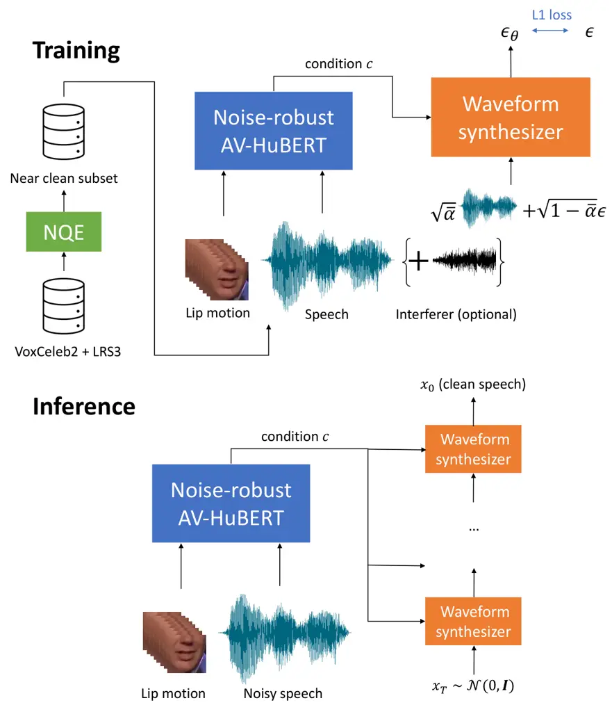

# AV2Wav: Diffusion-based re-synthesis from continuous self-supervised features for audio-visual speech enhancement

Ju-Chieh Chou    Chung-Ming Chien    Karen Livescu

###### Abstract

Speech enhancement systems are typically trained using pairs of clean
and noisy speech. In audio-visual speech enhancement (AVSE), there is
not as much ground-truth clean data available; most audio-visual
datasets are collected in real-world environments with background noise
and reverberation, hampering the development of AVSE. In this work, we
introduce AV2Wav, a resynthesis-based audio-visual speech enhancement
approach that can generate clean speech despite the challenges of
real-world training data. We obtain a subset of nearly clean speech from
an audio-visual corpus using a neural quality estimator, and then train
a diffusion model on this subset to generate waveforms conditioned on
continuous speech representations from AV-HuBERT with noise-robust
training. We use continuous rather than discrete representations to
retain prosody and speaker information. With this vocoding task alone,
the model can perform speech enhancement better than a masking-based
baseline. We further fine-tune the model on clean/noisy utterance pairs
to improve the performance. Our approach outperforms a masking-based
baseline in terms of both automatic metrics and a human listening test
and is close in quality to the target speech in the listening test. ¹¹ 1
Audio samples can be found at
[https://home.ttic.edu/~jcchou/demo/avse/avse_demo.html](https://home.ttic.edu/~jcchou/demo/avse/avse_demo.html).

###### Index Terms: 

speech enhancement, diffusion models

^(†)^(†)address: Toyota Technological Institute at Chicago

## 1 Introduction



Figure 1: Overview of our approach. We obtain a nearly clean subset of
the AV training set (VoxCeleb2 + LRS3) using a neural quality estimator
(NQE) and use noise-robust AV-HuBERT to encode the AV speech. These
representations are used as conditioning input to a diffusion-based
waveform synthesizer.

Speech enhancement aims to improve the audio quality and intelligibility
of noisy speech. Audio-visual speech enhancement (AVSE) uses visual
cues, specifically video of the speaker, to improve the performance of
speech enhancement. Visual cues can provide auxiliary information, such
as the place of articulation, which is especially useful when the
signal-to-noise ratio is low.

Conventionally, audio-visual speech enhancement is formulated as a mask
regression problem. Given a noisy utterance and its corresponding video,
masking-based models attempt to recover the clean speech by multiplying
the noisy signal with a learned mask \[1, 2, 3, 4\]. However, some
signals are difficult or even impossible to reconstruct via masking.
Masking operations tend to allow noise to bleed through, and they cannot
effectively address unrecoverable distortion, such as frame dropping.

Some work has proposed to formulate SE and AVSE as a synthesis or
re-synthesis problem \[5, 6, 7, 8, 9\]. Re-synthesis based approaches
learn discrete audio-visual representations from clean speech and train
models to generate the discrete representations of the clean speech
given the corresponding noisy speech. An off-the-shelf vocoder trained
on clean speech is then used to produce clean speech signals. This
formulation can better handle unrecoverable distortion and synthesize
speech with better audio quality. However, such discrete representations
often lose much of the speaker and prosody information \[10\].

Another challenge in AVSE is the suboptimal audio quality of
audio-visual (AV) datasets. In contrast to studio-recorded speech-only
datasets, clean AV datasets (e.g., \[11\]) are much smaller, so many
researchers (including ourselves) resort to more plentiful but less
clean AV data collected “in the wild” \[12, 13\].

In this work, we propose AV2Wav, a re-synthesis-based approach to AVSE
that addresses the challenges of noisy training data and lossy discrete
representations (see Fig 1). Instead of discrete representations, we use
continuous features from a pre-trained noise-robust AV-HuBERT \[14\], a
self-supervised audio-visual speech model, to condition a
diffusion-based waveform synthesizer \[15\]. The noise-robust training
enables AV-HuBERT to generate similar representations given clean or
mixed (containing noise or a competing speaker) speech.

In addition, we train the synthesizer on a nearly clean subset of an
audio-visual dataset filtered by a neural quality estimator (NQE) to
exclude low-quality utterances. Finally, we further fine-tune the model
on clean/noisy utterance pairs and studio-recorded clean speech.

The contributions of this work include: (i) the AV2Wav framework for
re-synthesis based AVSE conditioned on noise-robust AV-HuBERT
representations; (ii) a demonstration that an NQE can be used for
training data selection to improve AVSE performance; and (iii) a study
on the effect of fine-tuning diffusion-based waveform synthesis on
clean/noisy data and studio-recorded data. The resulting enhancement
model outperforms a baseline masking-based approach, and comes close in
quality to the target speech in a listening test.

## 2 Method

### 2.1 Background: AV-HuBERT

Self-supervised models are increasingly being used for speech
enhancement \[16, 17, 18\]. For AVSE, several approaches have used
AV-HuBERT. However, unlike our work, this prior work has used AV-HuBERT
either for mask prediction \[2\], for synthesis of a single speaker’s
voice \[6\], or with access to transcribed speech for
fine-tuning \[19\].

AV-HuBERT \[14, 20\] is a self-supervised model trained on speech and
lip motion video sequences. The model is trained to predict a
discretized label for a masked region of the audio feature sequence
$`Y^{a}_{1:L}\in\mathbb{R}^{F_{s}\times L}`$ and video sequence
$`Y^{v}_{1:L}\in\mathbb{R}^{F_{l}\times L}`$ with $`L`$ frames and
feature dimensionalities $`F_{s}`$, $`F_{l}`$. The resulting model
$`\mathcal{M}`$ produces audio-visual representations

```math
f^{av}_{1:L}=\mathcal{M}(Y^{a}_{1:L},Y^{v}_{1:L}) \tag{1}
```

AV-HuBERT uses modality dropout during training \[21\], i.e. it drops
one of the modalities with some probability, to learn modality-agnostic
representations

```math
\begin{split}f^{a}_{1:L}=\mathcal{M}(Y^{a}_{1:L},\mathbf{0}),\\
f^{v}_{1:L}=\mathcal{M}(\mathbf{0},Y^{v}_{1:L}),\end{split} \tag{2}
```

Some versions of AV-HUBERT use noise-robust training \[20\] , where an
interferer (noise or competing speech) is added while the model must
still predict cluster assignments learned from clean speech. In this
case the model outputs the representation

```math
f^{avn}_{1:L}=\mathcal{M}(\synth(Y^{a}_{1:L},Y^{n}_{1:L}),Y^{v}_{1:L}), \tag{3}
```

where $`\synth(\cdot)`$ is a function that synthesizes noisy speech
given noise $`Y^{n}_{1:L}`$ and speech $`Y^{a}_{1:L}`$. Noise-robust
AV-HuBERT is trained to predict the same clustering assignment given
$`f^{a},f^{v},f^{av}`$ and $`f^{avn}`$, in order to learn modality- and
noise-invariant features. As AV-HuBERT already learns to remove noise
through the noise-invariant training, it is a natural choice as a
conditioning input to our AVSE model.

### 2.2 Diffusion waveform synthesizer

Our diffusion-based waveform synthesizer is based on WaveGrad \[15\]. We
summarize the formulation here; for details see \[15\]. For speech
waveform $`x_{0}\in\mathbb{R}^{L_{w}}`$ with length $`L_{w}`$, the
diffusion forward process is formulated as a Markov chain to generate
$`T`$ latent variables $`x_{1},\dots,x_{T}`$ with the same
dimensionality as $`x_{0}`$,

```math
q(x_{1},x_{2},\dots,x_{T}|x_{0})=\prod_{t=1}^{T}q(x_{t}|x_{t-1}), \tag{4}
```

where $`q(x_{t}|x_{t-1})`$ is a Gaussian distribution:

```math
q(x_{t}|x_{t-1})=\mathcal{N}(x_{t};\sqrt{1-\beta_{t}}x_{t-1},\beta_{t}\mathbf{I}) \tag{5}
```

with a pre-defined noise schedule
$`0<\beta_{1}<\beta_{2}\dots<\beta_{T}<1`$. The idea is to gradually add
noise to the data distribution, until $`P(x_{T})`$ is close to a
multivariate Gaussian distribution with zero mean and unit variance:
$`p(x_{T})\approx\mathcal{N}({\color[rgb]{0,0,0}{x_{T};}}0,\mathbf{I})`$.
We can also directly sample from $`q(x_{t}|x_{0})`$ by
reparameterization,

```math
q(x_{t}|x_{0})=\mathcal{N}(x_{t};\sqrt{\bar{\alpha_{t}}}x_{0},(1-\bar{\alpha_{t}})\mathbf{I}) \tag{6}
```

where $`\alpha_{t}=1-\beta_{t}`$ and
$`\bar{\alpha}_{t}=\prod_{i=1}^{t}\alpha_{i}`$.

The reverse process is parameterized by a neural network
$`\epsilon_{\theta}(\cdot)`$, which takes the noised waveform drawn from
Eq. 6, the conditioning input (here, the AV-HuBERT features), and a
noise level, and outputs a prediction of the added Gaussian noise in
Eq. 6. In training, we first sample AV-HuBERT features

```math
c=\begin{cases}f^{av}_{l:l+S}&\text{with probability }p_{av}\\
f^{a}_{l:l+S}&\text{with probability }p_{a}\\
f^{v}_{l:l+S}&\text{with probability }p_{v}\\
f^{avn}_{l:l+S}&\text{with probability }p_{avn}\\
\end{cases} \tag{7}
```

where $`l=\Uniform(1,L-S+1)`$, $`p_{av}+p_{a}+p_{v}+p_{avn}=1`$ and
$`f^{a},f^{v},f^{av},f^{avn}`$ are as defined in Eq. 1, 2, 3.

We then sample a continuous noise level $`\sqrt{\bar{\alpha}}`$:

```math
s\sim\Uniform(\{1\dots T\}), \tag{8}
```

```math
\sqrt{\bar{\alpha}}\sim\Uniform(\sqrt{\bar{\alpha}_{s-1}},\sqrt{\bar{\alpha}_{s}}), \tag{9}
```

and minimize

```math
{\mathbb{E}}_{x_{0},c,\sqrt{\bar{\alpha}}}[\|\epsilon-\epsilon_{\theta}(\sqrt{\bar{\alpha}}x_{0}+\sqrt{1-\bar{\alpha}}\epsilon,c,\sqrt{\bar{\alpha}})\|_{1}] \tag{10}
```

where $`x_{0}`$ is the waveform segment corresponding to $`c`$, as
in \[15\] and $`\epsilon\sim\mathcal{N}(0,\textbf{I})`$. After training
$`\epsilon_{\theta}`$, we can sample from $`p_{\theta}(x_{0}|c)`$ by
re-parameterizing $`\epsilon_{\theta}`$:

```math
p_{\theta}(x_{0}|c)=p(x_{T}|c)\prod_{t=1}^{T}p_{\theta}(x_{t-1}|x_{t},c) \tag{11}
```

```math
p_{\theta}(x_{t-1}|x_{t},c)=\mathcal{N}(x_{t-1};\mu_{\theta}(x_{t},t),\tilde{\beta_{t}}) \tag{12}
```

where
$`\mu_{\theta}(x_{t},t)=\frac{1}{\sqrt{\bar{\alpha}_{t}}}(x_{t}-\frac{1-\alpha_{t}}{\sqrt{1-\bar{\alpha}_{t}}}\epsilon_{\theta}(x_{t},c,\sqrt{\bar{\alpha}_{t}}))`$,
$`\tilde{\beta}_{t}=\frac{1-\bar{\alpha}_{t-1}}{1-\bar{\alpha}_{t}}\beta_{t}`$,
and $`p_{(}x_{T}|c)\approx\mathcal{N}(x_{T};0,\textbf{I})`$.

### 2.3 Data filtering with a neural quality estimator (NQE)

We propose to use a NQE to select a relatively clean subset from the
training set. Conventional quality metrics (e.g., SI-SDR \[22\]) require
a reference signal, which our training data lacks. NQE predicts an audio
quality metric without a reference using a neural network. Specifically,
we use the predicted scale-invariant signal-to-distortion ratio
(P-SI-SDR) of \[23\], and retain those utterances with P-SI-SDR above
some threshold.

## 3 Experiments

### 3.1 Datasets and baseline

In the first training stage of our models, we use the combination of
LRS3 \[13\] and an English subset (selected using
Whisper-large-v2 \[24\]) of VoxCeleb2 \[12\] (total 1967 hours). In this
stage, we train the waveform synthesizer to synthesize waveforms from
AV-HuBERT features. In the second stage, we fine-tune the model on
noisy/clean paired data from the AVSE challenge \[25\], containing 113
hours of speech. The AV-HuBERT model is frozen unless stated explicitly.
Interferers include noise and speech from a competing speaker. The noise
sources are sampled as in \[25\]. Competing speakers are sampled from
LRS3 \[13\].

For evaluation, we follow the recipe provided by the AVSE
challenge \[25\] to synthesize a test set of clean/noisy pairs based on
the LRS3 test set. We sample 30 speakers from the LRS3 test set as
competing speakers. Noise interferers are sampled from the same noise
datasets as in \[25\] (but excluding the files used in training/dev).
The SNR is uniformly sampled as in \[25\].

As a baseline, we use the open-source masking-based baseline trained on
the AVSE dataset provided in \[25\]. For the case of overlapping
speakers, we also compare to VisualVoice \[4\], the most competitive
publicly available audio-visual speaker separation model. Finally, as a
topline, we compare to the target speech.²² 2 Other prior work we are
aware of is on either removal of competing speech or removal of noise,
whereas our setting combines both; and some models are trained and
evaluated on less diverse data, so are difficult to compare with.

### 3.2 Architecture and training

We use the WaveGrad \[15\] architecture, but adjust the upsampling rate
sequence to (5,4,4,2,2,2), resulting in a total upsampling rate of 640,
to convert the 25Hz AV-HuBERT features to a 16kHz waveform. We use the
features from the last layer of noise-robust AV-HuBERT-large
(specifically the model checkpoint “Noise-Augmented AV-HuBERT
Large”) \[20, 14\]. In training, we uniformly sample $`S=24`$ frames
from the AV-HuBERT features of each utterance and apply layer
normalization to them \[26\]. In the first stage, we train AV2Wav with
$`(p_{av},p_{a},p_{v},p_{avn})=(1/3,1/3,1/3,0)`$ on the filtered dataset
(LRS3 + VoxCeleb2) without adding interferers for 1M steps. We use the
Adam optimizer \[27\] with a learning rate of $`0.0001`$ and a cosine
learning rate schedule for 10k warm-up steps using a batch size of
$`32`$. In the second stage of training, we fine-tune the model on
audio-visual clean/noisy speech pairs with
$`(p_{av},p_{a},p_{v},p_{avn})=(0,0,0,1)`$ for 500k steps. To understand
the effect of fine-tuning, we also fine-tune AV2Wav on VCTK \[28\],
which is a studio-recorded corpus, with
$`(p_{av},p_{a},p_{v},p_{avn})=(0,1,0,0)`$.

### 3.3 Evaluation

Signal-level metrics are not ideal for generative models because
perceptually-similar generated and reference speech may be dissimilar on
the signal level. In addition to objective metrics—P-SI-SDR \[23\] and
word error rate (WER)³³ 3 We use Whisper-small-en \[24\] as the ASR
model. as a proxy for intelligibility—we use subjective human-rated
comparison mean opinion scores (CMOS) on a scale of +3 (much better), +2
(better), +1 (slightly better), 0 (about the same), -1 (slightly
worse), - 2 (worse), and -3 (much worse) as in \[29\]. We sample 20
pairs for each system and collect at least 8 ratings for each utterance
pair. To help listeners better distinguish the quality, we only use
utterances longer than 4 seconds and provide the transcription. We use
the same instructions as in \[9\]. Listeners are proficient (not
necessarily native) English speakers.

### 3.4 Results

We show the objective evaluation in Table 1, subjective evaluation in
Table 2, and WER analysis for multiple SNR ranges and interferer types
in Table 3.

|                          |                    |                       |
| ------------------------ | ------------------ | --------------------- |
|                          | WER $`\downarrow`$ | P-SI-SDR $`\uparrow`$ |
| Target re-synthesis      |                    |                       |
| (1) Target               | 6.72               | 21.56                 |
| (2) AV2Wav-23            | 3.15               | 21.36                 |
| (3) AV2Wav-23-long       | 2.71               | 22.24                 |
| (4) AV2Wav-25            | 3.00               | 21.76                 |
| (5) AV2Wav-random        | 2.94               | 19.79                 |
| Mixed speech             |                    |                       |
| (6) Mixed input          | 48.45              | 0.12                  |
| (7) Baseline \[25\]      | 26.40              | 13.79                 |
| (8) AV2Wav-23            | 18.17              | 19.41                 |
| (9) AV2Wav-23-long       | 17.20              | 20.09                 |
| (10) AV2Wav-25           | 17.36              | 20.07                 |
| (11) AV2Wav-random       | 19.69              | 14.57                 |
| After fine-tuning        |                    |                       |
| (12) AV2Wav-23-avse      | 15.85              | 20.65                 |
| (13) AV2Wav-23-long-avse | 16.76              | 21.21                 |
| (14) AV2Wav-23-long-avse | 12.77              | 21.23                 |
| (fine-tune AV-HuBERT)    |                    |                       |
| (15) AV2Wav-23-vctk      | 16.71              | 21.79                 |
| Fast inference           |                    |                       |
| (16) AV2Wav-cont-100     | 17.46              | 18.43                 |
| (17) AV2Wav-ddim-100     | 16.21              | 18.17                 |
| (18) AV2Wav-ddim-50      | 15.73              | 18.15                 |
| (19) AV2Wav-ddim-25      | 16.41              | 17.58                 |

Table 1: Objective evaluation in terms of WER (%) and SI-SDR (P-SI-SDR)
(dB) . Target re-synthesis refers to re-synthesis of the target (clean)
speech using AV2Wav. The remaining parts (Mixed speech, After
fine-tuning, Fast inference) take mixed speech as input and synthesize
the predicted clean speech (performing AVSE). Mixed speech refers to the
first stage of AV2Wav training. After fine-tuning refers to further
fine-tuning the synthesizer on AVSE, VCTK. The model name is given as
AV2Wav-{filter criterion}-{fine-tuned dataset}. Fast inference compares
fast inference approaches, using AV2Wav-23-long-avse (line 13).

| Tested                | Other           | CMOS               |
| --------------------- | --------------- | ------------------ |
| AV2Wav-23-long-avse   | Baseline \[25\] | 2.22 $`\pm`$ 0.16  |
| AV2Wav-23-long-avse   | AV2Wav-23-long  | 0.21 $`\pm`$ 0.18  |
| AV2Wav-23-long-avse   | Target          | -0.45 $`\pm`$ 0.24 |
| AV2Wav-23-long re-syn | Target          | -0.06 $`\pm`$ 0.22 |

Table 2: Comparison mean opinion scores (CMOS) for several model
comparisons. A positive CMOS indicates that the ”Tested” model is better
than the ”Other” model. The ”re-syn” model simply re-synthesizes the
target (clean) signal.

|                        |            |          |            |           |      |
| ---------------------- | ---------- | -------- | ---------- | --------- | ---- |
| interferer             | speech     |          | noise      |           | Avg. |
| SNR (dB)               | \[-15,-5\] | \[-5,5\] | \[-10, 0\] | \[0, 10\] |      |
| Mixed speech (input)   | 102.4      | 64.4     | 24.8       | 7.6       | 48.4 |
| Baseline \[25\]        | 40.3       | 24.1     | 30.6       | 11.6      | 26.4 |
| VisualVoice \[4\]      | 38.9       | 22.8     | N/A        | N/A       | N/A  |
| AV2Wav-23-long         | 43.4       | 12.0     | 11.6       | 4.0       | 17.2 |
| AV2Wav-23-long         | 105.0      | 66.7     | 26.7       | 6.7       | 49.9 |
| with audio-only input  |            |          |            |           |      |
| AV2Wav-23-long-avse    | 43.0       | 11.7     | 9.8        | 5.3       | 16.8 |
| Baseline \[25\]        | 19.8       | 11.4     | 17.2       | 7.4       | 13.9 |
| \+ AV2Wav-23-long-avse |            |          |            |           |      |
| AV2Wav-23-long-avse    | 21.7       | 9.7      | 14.6       | 5.8       | 12.8 |
| (fine-tune AV-HuBERT)  |            |          |            |           |      |
| Baseline               | 29.3       | 12.4     | 26.1       | 10.2      | 19.4 |
| \+ AV2Wav-23-long-avse |            |          |            |           |      |
| (fine-tune AV-HuBERT)  |            |          |            |           |      |

Table 3: WER (%) for each interferer type (speech, noise) and SNR range.
Baseline + AV2Wav denotes that the speech is processed by the baseline
first, then re-synthesized using AV2Wav.

#### 3.4.1 The effect of data filtering

To study the effect of data filtering using NQE, we compare the
following models: (1) AV2Wav-23: trained on the filtered subset with
P-SI-SDR $`>23`$ (616 hours) (2) AV2Wav-23-long: same as (1) but trained
for 2M steps with a batch size of $`64`$ (3) AV2Wav-25: model trained on
the filtered subset with P-SI-SDR $`>25`$ (306 hours) (4) AV2Wav-random:
same as (3), but trained on a randomly sampled 306 hours from the
training set. The objective and subjective evaluation results can be
found in Tables 1 and 2, respectively. AV2Wav-random (Table 1 line 11)
has a much lower P-SI-SDR than AV2-Wav-25 (10) on mixed speech,
providing support for NQE-based filtering.

#### 3.4.2 The importance of visual cues

One natural question to ask is how much improvement we can get from
adding visual cues. When comparing We compare AV2Wav-23-long and
AV2Wav-23-long with audio-only input (conditioning on $`f^{a}_{1:L}`$ in
eq. 2) in Table 3, and find that AV2Wav is not able to improve over the
input mixed speech without access to the visual cues. For low SNR noise
interferers, AV2Wav without visual cues performs significantly worse
than that with visual cues. For high SNR noise interferers, with visual
cues, it still performs better than that without visual cues. It shows
that visual cues are useful speech enhancement in the AV2Wav framework.

#### 3.4.3 Fine-tuning on AVSE / VCTK

We fine-tune the waveform synthesizer on AVSE or VCTK. By default, the
AV-HuBERT model is frozen. The objective evaluation can be found in
Table 1. We can see that fine-tuning on AVSE (AV2Wav-23-avse (line 12))
or VCTK (AV2Wav-23-vctk (15)) provides some improvement on WER and
P-SI-SDR (comparing to AV2Wav-23 line 8). For the subjective experiments
in Table 2, after fine-tuning on AVSE (AV2Wav-23-long-avse (13)), the
CMOS improves slightly over the model trained solely on the near-clean
subset (AV2Wav-23-long (9)).

We also fine-tune the noise-robust AV-HuBERT together with the waveform
synthesizer (line 14 in Table 1 and AV2Wav-23-long-avse (fine-tune
AV-HuBERT) in Table 3), which may improve performance by exposing
AV-HuBERT to AVSE data. Indeed, the overall WER decreases significantly
in this setting, although in the case of low-SNR noise interferers the
WER increases. From informal listening, fine-tuning AV-HuBERT sometimes
results in muffled words, which we hypothesize could be the cause of the
WER increase.

#### 3.4.4 Comparing to the masking-based baselines

In Table 1, AV2Wav-23-long-avse (line 13) outperforms the baseline (7)
and the original mixed input (6) in terms of WER and P-SI-SDR. In the
subjective evaluation (Table 2), AV2Wav-23-long-avse outperforms the
baseline by a large margin.

In Table 3 we compare our model to the masking-based baseline and
VisualVoice for source separation \[4\] in different SNR ranges. Our
model outperforms the baseline for most speech and noise interferers. It
is slightly worse than the baseline for low-SNR speech interferers. In
such cases, the AV-HuBERT model can not recognize the target speech from
the mixed speech and the lip motion sequence. However, Fine-tuning
AV-HuBERT jointly with the synthesizer helps in addressing this issue.

We also find that our approach combines well with the masking-based
baseline: By first applying the baseline and then re-synthesizing the
waveform using AV2Wav given the output from the baseline, we observe an
improvement for speech interferers, especially at lower SNR, over either
model alone. However, fine-tuning AV-HuBERT jointly can achieve lower
WER than baseline + AV2Wav.

#### 3.4.5 Comparing audio quality to target speech

From the target re-synthesis experiments in Table 1, we can see that the
re-synthesized speech (line 2-4) is generally more intelligible (has
lower WERs) than the target speech (line 1), while maintaining similar
estimated audio quality (similar P-SI-SDR). From the subjective
evaluation (Table 2), the re-synthesized speech (AV2Wav-23-long re-syn)
is also on par with the original target in terms of CMOS. Both show that
AV2Wav can re-synthesize natural-sounding speech. When comparing the
enhanced speech (AV2Wav-23-long-avse) with the target speech (target) in
the listening test (Table 2), our model is close but slightly worse
(CMOS = -0.45).

#### 3.4.6 Fast inference

A major disadvantage of diffusion models is their slow inference. As we
train the model using continuous noise levels, we can use fewer steps at
different noise levels as in \[15\] (line 16). Empirically, we find that
$`100`$ steps can provide good quality speech. We also compare
DDIM \[30\] (line 17-19), a sampling algorithm for diffusion models that
uses fewer steps of non-Markovian inference. We can see that the WER is
similar, while P-SI-SDR is worse, when using the fast inference
algorithms (line 15-17) compared to the larger number of inference steps
(AV2Wav-23-long-avse line 13). From informal listening, we find that
AV2Wav-cont-100 tends to miss some words while AV2Wav-ddim tends to
produce some white background noise.

## 4 Conclusion

AV2Wav is a simple framework for AVSE based on noise-robust AV-HuBERT
and a diffusion waveform synthesizer. By training on a subset of
relatively clean speech, along with noise-robust AV-HuBERT, AV2Wav
learns to perform speech enhancement without explicitly training it to
de-noise. Further fine-tuning the model on clean/noisy pairs further
improves its performance. Our model outperforms a masking-based baseline
in a human listening test, and comes close in quality to the target
speech. Potential directions for improvement include futher noise-robust
training of AV2Wav on a larger-scale dataset, extension to other
languages, and additional work on fast inference.

## 5 Acknowledgement

This work is partially supported by AFOSR grant FA9550-18-1-0166.

## References

- \[1\] Jen-Cheng Hou et.al., “Audio-visual speech enhancement using
  multimodal deep convolutional neural networks,” IEEE Transactions on
  Emerging Topics in Computational Intelligence, 2018.
- \[2\] I-Chun Chern et al., “Audio-visual speech enhancement and
  separation by utilizing multi-modal self-supervised embeddings,” in
  IEEE ICASSP Workshops (ICASSPW), 2023.
- \[3\] Triantafyllos Afouras et.al., “The conversation: Deep
  audio-visual speech enhancement,” Interspeech, 2018.
- \[4\] Ruohan Gao and Kristen Grauman, “VisualVoice: Audio-visual
  speech separation with cross-modal consistency,” in CVPR, 2021.
- \[5\] Karren Yang et al., “Audio-visual speech codecs: Rethinking
  audio-visual speech enhancement by re-synthesis,” in CVPR, 2022.
- \[6\] Wei-Ning Hsu et al., “ReVISE: Self-supervised speech resynthesis
  with visual input for universal and generalized speech regeneration,”
  in CVPR, 2023.
- \[7\] Santiago Pascual, Antonio Bonafonte, and Joan Serra, “Segan:
  Speech enhancement generative adversarial network,” arXiv preprint
  arXiv:1703.09452, 2017.
- \[8\] Julius Richter, Simon Welker, Jean-Marie Lemercier, Bunlong Lay,
  and Timo Gerkmann, “Speech enhancement and dereverberation with
  diffusion-based generative models,” IEEE/ACM Transactions on Audio,
  Speech, and Language Processing, 2023.
- \[9\] Joan Serrà, Santiago Pascual, Jordi Pons, R Oguz Araz, and
  Davide Scaini, “Universal speech enhancement with score-based
  diffusion,” arXiv preprint arXiv:2206.03065, 2022.
- \[10\] Adam Polyak et.al., “Speech Resynthesis from Discrete
  Disentangled Self-Supervised Representations,” in Interspeech, 2021.
- \[11\] Martin Cooke et.al., “An audio-visual corpus for speech
  perception and automatic speech recognition,” The Journal of the
  Acoustical Society of America, 2006.
- \[12\] Joon Son Chung, Arsha Nagrani, and Andrew Zisserman,
  “VoxCeleb2: Deep speaker recognition,” Interspeech, 2018.
- \[13\] Triantafyllos Afouras, Joon Son Chung, and Andrew Zisserman,
  “LRS3-TED: a large-scale dataset for visual speech recognition,” arXiv
  preprint arXiv:1809.00496, 2018.
- \[14\] Bowen Shi et al., “Learning audio-visual speech representation
  by masked multimodal cluster prediction,” in ICLR, 2021.
- \[15\] Nanxin Chen et al, “WaveGrad: Estimating gradients for waveform
  generation,” in ICLR, 2020.
- \[16\] Bryce Irvin et.al., “Self-supervised learning for speech
  enhancement through synthesis,” in ICASSP, 2023.
- \[17\] Kuo-Hsuan Hung et.al., “Boosting self-supervised embeddings for
  speech enhancement,” Interspeech, 2022.
- \[18\] Zili Huang et.al., “Investigating self-supervised learning for
  speech enhancement and separation,” in ICASSP, 2022.
- \[19\] Julius Richter, Simone Frintrop, and Timo Gerkmann,
  “Audio-visual speech enhancement with score-based generative models,”
  arXiv preprint arXiv:2306.01432, 2023.
- \[20\] Bowen Shi, Wei-Ning Hsu, and Abdelrahman Mohamed, “Robust
  Self-Supervised Audio-Visual Speech Recognition,” in
  Interspeech, 2022.
- \[21\] Natalia Neverova et al., “ModDrop: adaptive multi-modal gesture
  recognition,” IEEE Transactions on Pattern Analysis and Machine
  Intelligence, 2015.
- \[22\] Jonathan Le Roux et.al., “SDR–half-baked or well done?,” in
  ICASSP, 2019.
- \[23\] Anurag Kumar et al., “TorchAudio-Squim: Reference-less speech
  quality and intelligibility measures in torchaudio,” in ICASSP, 2023.
- \[24\] Alec Radford et al., “Robust speech recognition via large-scale
  weak supervision,” in ICML, 2023.
- \[25\] Andrea Lorena Aldana Blanco et al., “AVSE challenge:
  Audio-visual speech enhancement challenge,” in IEEE Spoken Language
  Technology Workshop (SLT), 2023.
- \[26\] Jimmy Ba et al., “Layer normalization,” arXiv preprint
  arXiv:1607.06450, 2016.
- \[27\] Diederik P Kingma and Jimmy Ba, “Adam: A method for stochastic
  optimization,” ICLR, 2015.
- \[28\] Christophe Veaux, Junichi Yamagishi, Kirsten MacDonald, et al.,
  “CSTR VCTK corpus: English multi-speaker corpus for cstr voice cloning
  toolkit,” University of Edinburgh. The Centre for Speech Technology
  Research (CSTR), 2017.
- \[29\] Philipos C Loizou, “Speech quality assessment,” in Multimedia
  analysis, processing and communications, pp. 623–654. 2011.
- \[30\] Jiaming Song, Chenlin Meng, and Stefano Ermon, “Denoising
  diffusion implicit models,” in ICLR, 2020.
