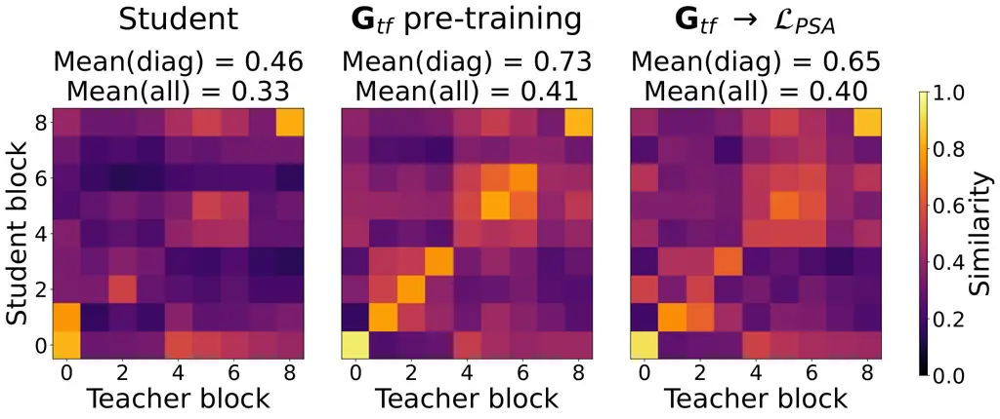

# Two-Step Knowledge Distillation for Tiny Speech Enhancement

Rayan Daod Nathoo\sthanksThese authors contributed equally to this work
   Mikolaj Kegler^(\*)    Marko Stamenovic

###### Abstract

Tiny, causal models are crucial for embedded audio machine learning
applications. Model compression can be achieved via distilling knowledge
from a large teacher into a smaller student model. In this work, we
propose a novel two-step approach for tiny speech enhancement model
distillation. In contrast to the standard approach of a weighted mixture
of distillation and supervised losses, we firstly pre-train the student
using only the knowledge distillation (KD) objective, after which we
switch to a fully supervised training regime. We also propose a novel
fine-grained similarity-preserving KD loss, which aims to match the
student’s intra-activation Gram matrices to that of the teacher. Our
method demonstrates broad improvements, but particularly shines in
adverse conditions including high compression and low signal to noise
ratios (SNR), yielding signal to distortion ratio gains of 0.9 dB and
1.1 dB, respectively, at -5 dB input SNR and 63$`\times`$ compression
compared to baseline.

###### Index Terms: 

speech enhancement, knowledge distillation, tinyML, model compression

^(†)^(†)address: Bose Corporation, USA

## 1 Introduction

In recent years, deep neural network (DNN) models have become a common
approach to the speech enhancement (SE) problem, due to their
performance \[1, 2, 3\]. However, large, powerful models are often
unsuitable for resource-constrained platforms, like hearing aids or
wearables, because of their memory footprint, computational latency, and
power consumption \[2, 4, 5, 6\]. To meet these constraints, audio
TinyML research tends to focus on designing model architectures with
small numbers of parameters, using model compression techniques to
reduce the size of large models, or both \[4, 5, 6, 7\].

Pruning is a popular method for reducing the size of DNN models for
SE \[4, 5, 6, 8\]. The goal of pruning is to remove weights least
contributing to model performance. In its simplest form, this can be
performed post-training by removing weights with the lowest magnitudes.
Online pruning, where the model is trained and pruned concurrently,
builds on post-training pruning by exposing the model to pruning errors
while training, allowing it to adapt to this form of compression
noise \[4\]. Unstructured pruning of individual weights can yield
impressive model size reduction with little performance sacrifice, but
corresponding savings in computational throughput are not possible
without hardware support for sparse inference, which is unusual in
embedded hardware. Structured pruning of blocks of weights and/or
neurons is often designed with broader hardware compatibility in mind,
but the performance drop tends to be larger than for the unstructured
case \[6\].

In contrast to pruning, knowledge distillation (KD) adopts a different
framework. The goal of KD is to utilize a strong pre-trained teacher
model to guide the training of the smaller student \[9, 10, 11\]. The
underlying assumption is that the pre-trained teacher network offers
additional useful context compared to the ground truth data by itself.
Unlike pruning, this process does not involve modifying the student
network from its original dense form, which reduces the complexity of
the deployment process. In this work, we focus on KD due to its
above-outlined benefits over pruning.

KD methods have been applied to various classification tasks in the
audio domain \[12, 13\]. However, KD has not been extensively explored
for causal low-latency SE, which often requires tiny networks (sub-100k
parameters) optimized for low-resource wearable devices, such as hearing
aids \[5, 6\]. So-called response-based KD approaches use the
pre-trained teacher model’s outputs to train a student network \[14,
15\]. However, distillation can be further facilitated by taking
advantage of intermediate representations of the two models, not just
their outputs \[10\]. One common obstacle in such feature-based KD is
the dimensionality mismatch between teacher and student activations due
to the model size difference. To alleviate this issue, \[16\] proposed
aligning intermediate features, while \[17\] used attention maps to do
so. The latter was applied in the context of SE in \[18\] using
considerably large, non-causal student models intended for offline
applications. In \[19\], the authors addressed the dimensionality
mismatch problem for the causal SE models by using frame-level
Similarity Preserving KD \[20\] (SPKD). SPKD captures the similarity
patterns between network activations for different training examples and
aims to match those patterns between the student and the frozen
pre-trained teacher models. The authors of \[19\] also introduced fusion
blocks, analogous to \[21\], to distill relationships between
consecutive layers.

Here, we show that the efficacy of conventional KD methods is limited
for tiny, causal SE models. To improve distillation efficacy, we first
extend the method from \[19\] by computing SPKD for each bin of the
latent representations, corresponding to the time frame (as in \[19\])
but also the frequency bin of the input, thus providing more resolution
for KD loss optimization. The proposed extension outperforms other
similarity-based KD methods which we also explore. Second, we
hypothesize that matching a large teacher model might be challenging for
small student models and thus may lead to suboptimal performance.
Inspired by \[22\], we propose a novel two-step framework for distilling
tiny SE models. In the first step, the student is pre-trained using only
the KD criterion to match the activation patterns of the teacher, with
no additional ground truth supervision. The goal of this unsupervised KD
pre-training is to make the student similar to the teacher prior to the
main training. Then, the pre-trained student model is further optimized
in a supervised fashion and/or using KD routines. We find that
pre-training using the proposed SPKD method at the level of the
individual bin of the latent representation, followed by fully
supervised training yields superior performance compared to other
distillation approaches utilizing weighted mixtures of KD and supervised
losses. We report the performance of our method across various student
model sizes, input mixture signal-to-noise ratios (SNRs), and finally,
assess the similarity between the activation patterns of the teacher and
distilled student.

Figure 1: (a) Distillation process overview (b) Self-Similarity Gram
matrices computation. (c) Flow matrices computation ($`\bigotimes`$
denotes matrix multiplication). Note that, for clarity, transpositions
and matrix multiplications are applied only to the last two dimensions
of each tensor.

## 2 Methods

### 2.1 Model architecture

Our backbone architecture for the exploration of tiny SE KD is the
Convolutional Recurrent U-Net for SE (CRUSE) topology \[7\]. However,
note that the methodology developed here can, in principle, be applied
to any other architecture. The CRUSE model operates in the
time-frequency domain and takes power-law compressed log-mel
spectrograms (LMS) as input. The LMS is obtained by taking the magnitude
of the complex short-time Fourier transform (STFT, 512/256 samples
frame/hop size), processing it through a Mel-space filterbank (80 bins,
covering 50-8k Hz range) and finally compressing the result by raising
it to the power of $`0.3`$. The model output is a real-valued
time-frequency mask bounded within the range $`(0,1)`$ through the
sigmoid activation of the final block. The mask is applied to the noisy
model input and reconstituted into the time domain using the inverse
STFT and the noisy input phase.

The model comprises four encoder/decoder blocks and a bottleneck with
grouped GRU units (4 groups), reducing the computational complexity
compared to a conventional GRU layer with the same number of
units \[23\]. The encoder/decoder blocks are composed of 2D
convolution/transpose convolution layers with (2, 3) kernels (time,
frequency) and (1, 2) strides, followed by cumulative layer
normalization \[24\] and leaky ReLU activation ($`\alpha`$ = 0.2). To
further reduce the model complexity, skip connections between the
encoder and decoder used in classic U-Net are replaced with 1x1
convolutions, whose outputs are summed into the decoder inputs. We
enforce the model’s frame-level causality by using causal convolutions
and causal cumulative layer norms. The total algorithmic latency of the
model is 32 ms (single STFT frame) \[2\].

In our experiments, both teacher and student are CRUSE models and their
sizes are adjusted by changing the number of units in each block. In
particular, the teacher uses {32, 64, 128, 192} encoder/decoder channels
and 960 bottleneck GRU units, resulting in 1.9M parameters, and 13.34
MOps/frame (i.e. the number of operations required to process a single
STFT frame). Our default student uses {8, 16, 32, 32} encoder/decoder
channels and 160 bottleneck GRU units resulting in 62k parameters (3.3%
of the teacher), and 0.84 MOps/frame (6.3% of the teacher).

### 2.2 Self-similarity local knowledge distillation

Inspired by previous work \[19, 20\], we address the issue of
dimensionality mismatch between teacher and student models by computing
similarity-based distillation losses. The method captures and compares
the relationship between batch items at each layer output, between
teacher and student (Fig. 1a, $`{\cal L}_{KD}^{local}`$). We refer to
this relationship as the self-similarity Gram matrix $`\textbf{G}_{x}`$.

Self-similarity matrices (Fig. 1b) can be computed for an example
network latent activation X of shape \[$`b`$, $`c`$, $`t`$, $`f`$\],
where $`b`$ - batch size, $`c`$ - channel, $`t`$ - activation width
(corresponding to the input time dimension), $`f`$ - activation height
(corresponding to the input frequency dimension), as shown in Fig. 1b.
The original implementation from \[20\] involves reshaping X to \[$`b`$,
$`ctf`$\] and matrix multiplying it by its transpose $`\textbf{X}^{T}`$
to obtain the \[$`b`$, $`b`$\] symmetric self-similarity matrix G.
Analogously, this operation can be performed for each $`t`$ or $`f`$
dimension independently with resulting $`\textbf{G}_{t/f}`$ matrices of
size \[$`t/f`$, $`b`$, $`b`$\]. Such an increase in granularity improved
the KD performance in \[19\]. Here, we obtain even more detailed
intra-activation Gram matrices by considering each $`(t,f)`$ bin
separately, resulting in the $`\textbf{G}_{tf}`$ self-similarity matrix
with shape \[$`t`$, $`f`$, $`b`$, $`b`$\].

Finally, the local KD loss is computed using self-similarity matrices
$`\textbf{G}_{x}`$ of any kind $`x`$ obtained from teacher $`T`$ and
student $`S`$ as:

```math
{\cal L}_{KD}^{local}=\frac{1}{b^{2}}\sum_{i}\left\lVert\textbf{G}_{x}^{T_{i}}-\textbf{G}_{x}^{S_{i}}\right\rVert^{2}_{F}, \tag{1}
```

where $`i`$ is the layer index and $`\left\lVert\right\rVert^{2}_{F}`$
is the Frobenius $`l_{2}`$ norm.

### 2.3 Information flow knowledge distillation

The above-outlined local similarity losses can be extended to capture
relationships between activations of subsequent layers of the teacher
and student models (Fig. 1a, $`{\cal L}_{KD}^{flow}`$). The method is
inspired by the Flow of Solution Procedure (FSP) matrices introduced
in \[22\] and aims to not only match local similarity between the
teacher and student in the corresponding layers but also global
inter-layer relations.

We propose two versions of flow matrices between layers $`i`$ and $`j`$
in our model (Fig. 1c). The first one,
$`\textbf{G}_{t}^{i\rightarrow j}`$, leverages $`\textbf{G}_{t}`$
self-similarity matrices. Thereby each self-similarity block shares the
$`t`$-dimension and thus the interaction between the layers’
self-similarity can be captured by performing matrix multiplication of
$`\textbf{G}_{t}^{i}`$ and transposed $`\textbf{G}_{t}^{j}`$ (both sized
\[$`t`$, $`b`$, $`b`$\]) for each time frame $`t`$.

The second version leverages $`\textbf{G}_{tf}`$ self-similarity
matrices. However, the $`f`$ dimension in our model changes for each
block due to the strided convolutions. To quantify the relationship
between layers $`i`$ and $`j`$ of different dimensions we reshaped
$`\textbf{G}_{tf}^{i/j}`$ to the size of \[$`t`$, $`b`$, $`f_{i/j}`$,
$`b`$\]. Then for each time-batch-item pair ($`t`$,$`b`$), we obtain a
\[$`f_{i/j}`$, $`b`$\] sub-matrix, which can be matrix multiplied with
its transpose to obtain the flow matrix
$`\textbf{G}_{tf}^{i\rightarrow j}`$ of size \[$`t`$, $`b`$, $`f_{i}`$,
$`f_{j}`$\].

We define the loss similarly to Eq. 1 by comparing the teacher
$`\textbf{G}^{T_{i\rightarrow j}}_{x}`$ flow matrix with the student
$`\textbf{G}^{S_{i\rightarrow j}}_{x}`$ flow matrix, of the same kind
$`x`$, for every 2-layer-combination ($`i`$, $`j`$):

```math
{\cal L}_{KD}^{flow}=\frac{1}{b^{2}}\sum_{i}\sum_{j>i}\left\lVert\textbf{G}^{T_{i\rightarrow j}}_{x}-\textbf{G}^{S_{i\rightarrow j}}_{x}\right\rVert^{2}_{F} \tag{2}
```

### 2.4 Training objective and two-step KD

We use phase-sensitive spectrum approximation (PSA) \[25\], with clean
speech as a target, as the supervised portion $`{\cal L}_{PSA}`$ of the
total loss. The KD portion $`{\cal L}_{KD}`$ of the total loss does not
use the ground truth objective but instead, features obtained from the
pre-trained, frozen teacher model. In particular, $`{\cal L}_{KD}`$ can
match model outputs (i.e. response distillation, analogous to \[15\]),
$`\textbf{G}_{x}`$ ($`{\cal L}_{KD}^{local}`$), or
$`\textbf{G}^{i\rightarrow j}_{x}`$ ($`{\cal L}_{KD}^{flow}`$) matrices
introduced in Sections 2.2 and 2.3, respectively. $`{\cal L}_{PSA}`$ and
$`{\cal L}_{KD}`$ are mixed using $`\gamma`$ coefficient to form the
total loss:

```math
{\cal L}=\gamma{\cal L}_{KD}+(1-\gamma){\cal L}_{PSA} \tag{3}
```

Inspired by \[22\], we propose a two-step KD approach by separating the
student distillation process into two distinct parts. Step 1: In the
first step, $`\gamma=1`$ for a fixed set of epochs to solely minimize
$`{\cal L}_{KD}`$. While excluding the supervised $`{\cal L}_{PSA}`$
does not contribute to the optimal objective performance, this step
provides strong initial weights for further student model training. Step
2: After this pre-training step, the student is further optimized to
maximize its objective performance using a fully supervised loss by
setting $`\gamma=0`$, ($`{\cal L}_{PSA}`$ only) or a weighted
$`{\cal L}_{KD}`$/$`{\cal L}_{PSA}`$ loss obtained by setting
$`\gamma=0.5`$. For one-step KD using a weighted
$`{\cal L}_{KD}`$/$`{\cal L}_{PSA}`$ loss, we set $`\gamma=0.5`$.

### 2.5 Training setup

During training, each epoch consists of 5,000 training steps, with each
step being a 32-item batch of 2-second-long audio clips. We used the
Adam optimizer with $`6\cdot 10^{-5}`$ learning rate. The teacher model
is trained till convergence to ensure the best performance for
subsequent distillations. We train each student model for a total of 400
epochs (2M steps, 35.5k+ hours of audio). For student model pre-training
(Step 1, Section 2.4), we use 100 epochs with $`\gamma=1`$, thus
excluding supervised term $`{\cal L}_{PSA}`$ (Eq. 3).

## 3 Results

We use the dataset from the Interspeech 2020 Deep Noise Suppression
(MS-DNS) Challenge \[1\] for experimentation, which consists of 500+
hours of clean speech and 100+ hours of noise, all mono clips sampled at
16 kHz. For model training, we mix the speech and noise at various SNR
levels, sampled from a uniform distribution between -5 and 15 dB. We
employ a LUFS-based SNR calculation for more perceptually relevant
mixtures and to de-emphasize the effects of impulsive noises \[26\]. To
evaluate the trained models we use the non-reverberant evaluation set
consisting of 150 clips of noisy speech samples and their respective
clean references.

We quantify the performance of each model via Signal-to-Distortion
ratio (SDR) \[27\], wide-band Perceptual Evaluation of Speech
Quality (PESQ) \[28\], and extended Short-Time Objective
Intelligibility (eSTOI) \[29\]. We also report scores obtained from
DNS-MOS P.835 \[30\], a DNN mean opinion score (MOS) estimator showing a
good correlation with subjective ratings. All of our results are
reported as improvements over unprocessed noisy inputs ($`\Delta`$).

|                            |                             |                               |                              |                            |      |       |
| -------------------------- | --------------------------- | ----------------------------- | ---------------------------- | -------------------------- | ---- | ----- |
|                            |                             |                               |                              | $`\Delta\textbf{DNS-MOS}`$ |      |       |
| Model                      | $`\Delta\textbf{SDR}`$ (dB) | $`\Delta\textbf{PESQ}`$ (MOS) | $`\Delta\textbf{eSTOI}`$ (%) | BAK                        | OVRL | SIG   |
| Teacher                    | 8.65                        | 1.25                          | 10.07                        | 1.44                       | 0.69 | 0.06  |
| Student                    | 6.34                        | 0.75                          | 5.82                         | 1.27                       | 0.55 | -0.02 |
| Distillation               |                             |                               |                              |                            |      |       |
| Output \[15\]              | 6.35                        | 0.75                          | 5.59                         | 1.33                       | 0.56 | -0.03 |
| G \[20\]                   | 6.32                        | 0.75                          | 5.70                         | 1.29                       | 0.56 | -0.02 |
| $`\textbf{G}_{t}`$ \[19\]  | 6.50                        | 0.77                          | 5.95                         | 1.33                       | 0.55 | -0.04 |
| $`\textbf{G}_{f}`$         | 6.47                        | 0.74                          | 6.03                         | 1.29                       | 0.56 | -0.02 |
| $`\textbf{G}_{tf}`$ (ours) | 6.68                        | 0.77                          | 5.99                         | 1.36                       | 0.57 | -0.04 |

Table 1: One-step KD for tiny SE. Output: $`{\cal L}_{KD}`$ comparing
teacher and student outputs (similar to \[15\]). $`\textbf{G}_{x}`$:
Feature-based $`{\cal L}_{KD}`$ using self-similarity matrix of type
$`x`$ (Fig. 1b). All models are initialized with the same random weights
and use $`\gamma=0.5`$ (Eq. 3).

### 3.1 Self-similarity local KD

Table 1 shows the efficacy of local similarity-based one-step KD
approaches when training student models from scratch. Using teacher
output as $`{\cal L}_{KD}`$ in Eq. 3 or G similarity \[20\] does not
improve, or even deteriorates the student performance.
$`\textbf{G}_{t}`$ similarity proposed in \[19\] provides 0.16 dB SDR
improvement over the student alone, alongside the best PESQ score. Our
proposed time-frequency similarity calculation method
$`\textbf{G}_{tf}`$ outperforms $`\textbf{G}_{t}`$ by doubling its SDR
improvement (+0.34 dB, w.r.t. the student alone) and increasing all
other scores. This suggests that increasing the granularity of the
similarity matrix in the $`{\cal L}_{KD}^{local}`$ calculation
facilitates the KD process and overall improves the performance of the
distilled student model.

|                                      |                     |                             |                               |                              |                            |      |       |
| ------------------------------------ | ------------------- | --------------------------- | ----------------------------- | ---------------------------- | -------------------------- | ---- | ----- |
|                                      |                     |                             |                               |                              | $`\Delta\textbf{DNS-MOS}`$ |      |       |
| Model                                |                     | $`\Delta\textbf{SDR}`$ (dB) | $`\Delta\textbf{PESQ}`$ (MOS) | $`\Delta\textbf{eSTOI}`$ (%) | BAK                        | OVRL | SIG   |
| Teacher                              |                     | 8.65                        | 1.25                          | 10.07                        | 1.44                       | 0.69 | 0.06  |
| Student                              |                     | 6.34                        | 0.75                          | 5.82                         | 1.27                       | 0.55 | -0.02 |
| Step 1                               | Step 2              |                             |                               |                              |                            |      |       |
| None                                 | $`\textbf{G}_{tf}`$ | 6.68                        | 0.77                          | 5.99                         | 1.36                       | 0.57 | -0.04 |
|                                      | $`{\cal L}_{PSA}`$  | 6.46                        | 0.78                          | 6.07                         | 1.29                       | 0.56 | -0.02 |
| $`\textbf{G}^{i\rightarrow j}_{t}`$  | $`\textbf{G}_{tf}`$ | 6.54                        | 0.78                          | 5.88                         | 1.33                       | 0.56 | -0.04 |
|                                      | $`{\cal L}_{PSA}`$  | 6.54                        | 0.79                          | 5.87                         | 1.33                       | 0.57 | -0.02 |
| $`\textbf{G}^{i\rightarrow j}_{tf}`$ | $`\textbf{G}_{tf}`$ | 6.76                        | 0.80                          | 6.06                         | 1.33                       | 0.57 | -0.03 |
|                                      | $`{\cal L}_{PSA}`$  | 6.77                        | 0.81                          | 6.38                         | 1.34                       | 0.59 | -0.01 |
| $`\textbf{G}_{tf}`$                  | $`\textbf{G}_{tf}`$ | 6.75                        | 0.80                          | 6.34                         | 1.32                       | 0.57 | -0.02 |

Table 2: Two-step KD. Step 1 - Student pre-training using only
$`{\cal L}_{KD}`$ ($`\gamma=1`$) or no pre-training (None). Step 2 -
$`{\cal L}_{PSA}`$: student training with only PSA loss ($`\gamma=0`$;
supervised), $`\textbf{G}_{tf}`$: Loss from Eq. 3 using
$`\textbf{G}_{tf}`$-based $`{\cal L}_{KD}`$ and $`\gamma=0.5`$ (best
from Table 1).

### 3.2 Two-step KD

Table 2 presents the results of the proposed two-step distillation
process described in Section 2.4. We find that using time-preserving
flow matrices $`\textbf{G}^{i\rightarrow j}_{t}`$as the
$`{\cal L}_{KD}`$ pre-training objective (Step 1) yields comparable or
worse performance than using local similarity $`\textbf{G}_{tf}`$ with
no pre-training. However, changing the pre-training objective to
$`\textbf{G}^{i\rightarrow j}_{tf}`$, which captures interactions
between latent representations in greater detail, yields improvement
across nearly all the metrics when paired with $`\textbf{G}_{tf}`$-based
KD as Step 2. Most interestingly, pre-training the student with
$`\textbf{G}_{tf}`$ criterion and continuing with only the supervised
loss $`{\cal L}_{PSA}`$ provides substantial improvements across all the
metrics, especially SDR (+0.44 dB, w.r.t. the student alone) and eSTOI
(+0.56%), suggesting improved intelligibility.



Figure 2: Block-wise CKA similarity between students and teacher
networks, averaged over the MS-DNS test set. Mean(diag) and Mean(all)
denote the average similarity for the corresponding blocks (diagonal) or
all the block combinations, respectively.

We further investigate our best two-stage KD approach by performing
Central Kernel Alignment (CKA) \[31\] analysis. In principle, CKA allows
us to compare the similarity between activation patterns across
different models in response to a set of inputs. We use the entire
evaluation dataset to probe the models and compute CKA similarities for
each pair of layers (averaged over all the audio clips). Fig. 2-left
presents CKA similarity between the teacher and student trained
independently. Fig. 2-middle compares the teacher to the student
pre-trained with $`\textbf{G}_{tf}`$ criterion (only Step 1). As
expected, the first step alone increases the similarity between the
corresponding teacher and student layers (diagonal). Finally,
Fig. 2-right shows the best student from Table 2, namely Step 1:
$`\textbf{G}_{tf}`$ $`{\cal L}_{KD}`$-only pre-training, and Step 2:
fully-supervised $`{\cal L}_{PSA}`$. The overall similarity to the
teacher decreases but remains much higher than for the student trained
independently. This suggests that a brief pre-training distillation
($`\gamma=1`$, no $`{\cal L}_{PSA}`$) allows the student to develop its
unique solution starting from strong prior knowledge inherited from the
teacher.

|          |          |                             |                               |                              |                            |      |       |
| -------- | -------- | --------------------------- | ----------------------------- | ---------------------------- | -------------------------- | ---- | ----- |
|          |          |                             |                               |                              | $`\Delta\textbf{DNS-MOS}`$ |      |       |
| SNR (dB) | Model    | $`\Delta\textbf{SDR}`$ (dB) | $`\Delta\textbf{PESQ}`$ (MOS) | $`\Delta\textbf{eSTOI}`$ (%) | BAK                        | OVRL | SIG   |
|          | Teacher  | 14.05                       | 0.62                          | 19.12                        | 2.16                       | 1.02 | 0.64  |
|          | Student  | 10.82                       | 0.30                          | 10.07                        | 1.86                       | 0.79 | 0.51  |
| - 5      | Proposed | 11.73                       | 0.35                          | 11.61                        | 1.98                       | 0.81 | 0.47  |
|          | Teacher  | 12.30                       | 0.92                          | 17.83                        | 1.99                       | 0.98 | 0.40  |
|          | Student  | 9.65                        | 0.49                          | 10.56                        | 1.75                       | 0.75 | 0.26  |
| 0        | Proposed | 10.23                       | 0.56                          | 11.51                        | 1.84                       | 0.79 | 0.25  |
|          | Teacher  | 10.27                       | 1.21                          | 13.98                        | 1.65                       | 0.78 | 0.02  |
|          | Student  | 7.97                        | 0.69                          | 8.58                         | 1.44                       | 0.59 | -0.10 |
| 5        | Proposed | 8.43                        | 0.76                          | 9.32                         | 1.51                       | 0.62 | -0.09 |

Table 3: Evaluation of the two-step KD approach on the MS-DNS dataset
remixed at fixed SNRs. Proposed: two-step KD using $`\textbf{G}_{tf}`$
pre-training followed by fully-supervised training (best in Table 2).

### 3.3 Impact of the student model size and mixture SNR

The MS-DNS evaluation dataset consists of relatively high SNRs between 0
and 19 dB (mean 9.07 dB). To assess the SNR-dependent benefit of the
proposed two-step KD approach, we remix the entire evaluation set to
obtain mixtures of the same speech and noise clips but at fixed SNRs of
-5, 0 and 5 dB. In Table. 3, we observe the inverse relationship between
the benefit of our approach and SNR of the noisy mixtures. In
particular, for -5 dB SNR mixtures, our KD approach improves student
performance by approximately 1 dB SDR, 1.5% eSTOI, and 0.1 DNS-MOS BAK.
This is an important observation as tiny SE models (here, 3.3% teacher
size) tend to exhibit the most significant performance drop in the
low-SNR cases, compared to their larger counterparts \[5\].

In Table 4 we showcase the efficacy of the proposed KD framework for
various student sizes using the same teacher. We observe that the
smaller the downstream model, the larger benefit our KD method provides
over the student trained alone. In particular, for the 30k-parameter
student ($`\sim`$1.5% teacher size), the improvements are the largest
with over 1 dB SDR, 0.1 PESQ, and nearly 2% eSTOI. For model sizes above
200k ($`\sim`$15% teacher size), the improvements start to plateau.
These findings indicate that our method provides the largest performance
boost for the most resource-constrained cases, usually deemed as the
most challenging \[4, 5, 6\].

## 4 Conclusions

This work proposes a novel two-step KD protocol for distilling tiny,
causal SE models. No previous KD work has investigated this class of
embedded-scale SE. Our framework consists of two distinct steps: 1.
Distilling the student model using only KD objective using only our
proposed fine-grained self-similarity matrix $`\textbf{G}_{tf}`$ for
computing distillation loss; 2. Training the model obtained in Step 1
via supervised loss. Our results show that tiny SE models distilled in
this fashion perform better than KD methods utilizing weighted loss
between supervised and distillation objectives. Our experimental
evaluation shows that the proposed two-step KD provides the largest
benefits for low-SNR mixtures and smaller student models. Future work
should explore integrating the proposed two-step KD with pruning and/or
quantization to achieve SE models of even lower complexity and apply the
method to other audio-to-audio problems such as source separation,
bandwidth extension, or signal improvement.

|          |                  |                             |                               |                              |      |                            |       |
| -------- | ---------------- | --------------------------- | ----------------------------- | ---------------------------- | ---- | -------------------------- | ----- |
|          |                  |                             |                               |                              |      | $`\Delta\textbf{DNS-MOS}`$ |       |
| Model    | Params / OPS (M) | $`\Delta\textbf{SDR}`$ (dB) | $`\Delta\textbf{PESQ}`$ (MOS) | $`\Delta\textbf{eSTOI}`$ (%) | BAK  | OVRL                       | SIG   |
| Teacher  | 1.9 / 13.34      | 8.65                        | 1.25                          | 10.07                        | 1.44 | 0.69                       | 0.06  |
| Student  |                  | 4.42                        | 0.50                          | 2.59                         | 1.21 | 0.47                       | -0.07 |
| Proposed | 0.03 / 0.42      | 5.52                        | 0.61                          | 4.55                         | 1.18 | 0.47                       | -0.05 |
| Student  |                  | 6.34                        | 0.75                          | 5.82                         | 1.27 | 0.55                       | -0.02 |
| Proposed | 0.06 / 0.84      | 6.77                        | 0.81                          | 6.38                         | 1.34 | 0.59                       | -0.01 |
| Student  |                  | 7.24                        | 0.93                          | 7.53                         | 1.38 | 0.62                       | 0.00  |
| Proposed | 0.24 / 2.48      | 7.60                        | 0.97                          | 7.71                         | 1.41 | 0.64                       | 0.01  |
| Student  |                  | 7.51                        | 0.99                          | 7.97                         | 1.39 | 0.63                       | 0.01  |
| Proposed | 0.35 / 3.08      | 7.54                        | 1.01                          | 8.22                         | 1.38 | 0.64                       | 0.02  |

Table 4: Impact of the student model size on the two-step KD
performance. OPS: number of operations per frame at inference time.
Proposed: two-step KD using $`\textbf{G}_{tf}`$ pre-training followed by
fully-supervised training (best in Table 2).

## References

- \[1\] Chandan K. A. Reddy et al., “The interspeech 2020 deep noise
  suppression challenge: Datasets, subjective testing framework, and
  challenge results,” in Proc. Interspeech. ISCA, 2020, pp. 2492–2496.
- \[2\] Zhong-Qiu Wang, Gordon Wichern, Shinji Watanabe, and Jonathan
  Le Roux, “Stft-domain neural speech enhancement with very low
  algorithmic latency,” IEEE TASLP, vol. 31, pp. 397–410, 2022.
- \[3\] Bryce Irvin, Marko Stamenovic, Mikolaj Kegler, and Li-Chia Yang,
  “Self-supervised learning for speech enhancement through synthesis,”
  in ICASSP. IEEE, 2023, pp. 1–5.
- \[4\] Jiasi Chen and Xukan Ran, “Deep learning with edge computing: A
  review,” Proceedings of the IEEE, vol. 107, no. 8, pp.
  1655–1674, 2019.
- \[5\] Igor Fedorov et al., “TinyLSTMs: Efficient neural speech
  enhancement for hearing aids,” in Proc. Interspeech. ISCA, 2020, pp.
  4054–4058.
- \[6\] Marko Stamenovic, Nils Westhausen, Li-Chia Yang, Carl Jensen,
  and Alex Pawlicki, “Weight, block or unit? exploring sparsity
  tradeoffs for speech enhancement on tiny neural accelerators,” in
  NeurIPS ENLSP, 2021.
- \[7\] Sebastian Braun, Hannes Gamper, Chandan KA Reddy, and Ivan
  Tashev, “Towards efficient models for real-time deep noise
  suppression,” in ICASSP. IEEE, 2021, pp. 656–660.
- \[8\] Zeyuan Wei, Li Hao, and Xueliang Zhang, “Model Compression by
  Iterative Pruning with Knowledge Distillation and Its Application to
  Speech Enhancement,” in Proc. Interspeech. ISCA, 2022, pp. 941–945.
- \[9\] Geoffrey Hinton, Oriol Vinyals, and Jeffrey Dean, “Distilling
  the knowledge in a neural network,” in NIPS Deep Learning and
  Representation Learning Workshop, 2015.
- \[10\] Jianping Gou, Baosheng Yu, Stephen J. Maybank, and Dacheng Tao,
  “Knowledge distillation: A survey,” International Journal of Computer
  Vision, vol. 129, no. 6, pp. 1789–1819, 2021.
- \[11\] Chuanguang Yang, Xinqiang Yu, Zhulin An, and Yongjun Xu,
  “Categories of response-based, feature-based, and relation-based
  knowledge distillation,” in Advancements in Knowledge Distillation:
  Towards New Horizons of Intelligent Systems, pp. 1–32. Springer, 2023.
- \[12\] Florian Schmid, Shahed Masoudian, Khaled Koutini, and Gerhard
  Widmer, “Knowledge distillation from transformers for low-complexity
  acoustic scene classification,” in DCASE workshop, 2022.
- \[13\] Ji Won Yoon, Beom Jun Woo, Sunghwan Ahn, Hyeonseung Lee, and
  Nam Soo Kim, “Inter-kd: Intermediate knowledge distillation for
  ctc-based automatic speech recognition,” in SLT workshop. IEEE, 2023,
  pp. 280–286.
- \[14\] Xiang Hao, Shixue Wen, Xiangdong Su, Yun Liu, Guanglai Gao, and
  Xiaofei Li, “Sub-band knowledge distillation framework for speech
  enhancement,” in Proc. Interspeech. ISCA, 2020, pp. 2687–2691.
- \[15\] Sotaro Nakaoka, Li Li, Shota Inoue, and Shoji Makino,
  “Teacher-student learning for low-latency online speech enhancement
  using wave-u-net,” in ICASSP. IEEE, 2021, pp. 661–665.
- \[16\] Adriana Romero, Nicolas Ballas, Samira Ebrahimi Kahou, Antoine
  Chassang, Carlo Gatta, and Yoshua Bengio, “Fitnets: Hints for thin
  deep nets,” arXiv preprint arXiv:1412.6550, 2014.
- \[17\] Sergey Zagoruyko and Nikos Komodakis, “Paying more attention to
  attention: Improving the performance of convolutional neural networks
  via attention transfer,” in ICLR, 2017.
- \[18\] Wooseok Shin, Hyun Joon Park, Jin Sob Kim, Byung Hoon Lee, and
  Sung Won Han, “Multi-view attention transfer for efficient speech
  enhancement,” in Proc. Interspeech. ISCA, 2022.
- \[19\] Jiaming Cheng, Ruiyu Liang, Yue Xie, Li Zhao, Björn Schuller,
  Jie Jia, and Yiyuan Peng, “Cross-Layer Similarity Knowledge
  Distillation for Speech Enhancement,” in Proc. Interspeech. ISCA,
  2022, pp. 926–930.
- \[20\] Frederick Tung and Greg Mori, “Similarity-preserving knowledge
  distillation,” in CVPR. IEEE, 2019, pp. 1365–1374.
- \[21\] Pengguang Chen, Shu Liu, Hengshuang Zhao, and Jiaya Jia,
  “Distilling knowledge via knowledge review,” in CVPR. IEEE, 2021, pp.
  5008–5017.
- \[22\] Junho Yim, Donggyu Joo, Jihoon Bae, and Junmo Kim, “A gift from
  knowledge distillation: Fast optimization, network minimization and
  transfer learning,” in CVPR. IEEE, 2017, pp. 7130–7138.
- \[23\] Ke Tan and DeLiang Wang, “Learning complex spectral mapping
  with gated convolutional recurrent networks for monaural speech
  enhancement,” IEEE TASLP, vol. 28, pp. 380–390, 2020.
- \[24\] Yi Luo and Nima Mesgarani, “Conv-TasNet: Surpassing ideal
  time–frequency magnitude masking for speech separation,” IEEE TASLP,
  vol. 27, no. 8, pp. 1256–1266, 2019.
- \[25\] Hakan Erdogan, John R Hershey, Shinji Watanabe, and Jonathan
  Le Roux, “Phase-sensitive and recognition-boosted speech separation
  using deep recurrent neural networks,” in ICASSP. IEEE, 2015, pp.
  708–712.
- \[26\] ITU-R, “ITU-R BS.1770-4: Algorithms to measure audio programme
  loudness and true-peak audio level,” 2015.
- \[27\] Jonathan Le Roux, Scott Wisdom, Hakan Erdogan, and John R
  Hershey, “Sdr–half-baked or well done?,” in ICASSP. IEEE, 2019, pp.
  626–630.
- \[28\] ITU-R, “P.862 : Perceptual evaluation of speech quality (PESQ):
  An objective method for end-to-end speech quality assessment of
  narrow-band telephone networks and speech codecs,” 2015.
- \[29\] Jesper Jensen and Cees H Taal, “An algorithm for predicting the
  intelligibility of speech masked by modulated noise maskers,” IEEE
  TASLP, vol. 24, no. 11, pp. 2009–2022, 2016.
- \[30\] Chandan K. A. Reddy, Vishak Gopal, and Ross Cutler, “Dnsmos
  p.835: A non-intrusive perceptual objective speech quality metric to
  evaluate noise suppressors,” in ICASSP. IEEE, 2022, pp. 886–890.
- \[31\] Simon Kornblith, Mohammad Norouzi, Honglak Lee, and Geoffrey
  Hinton, “Similarity of neural network representations revisited,” in
  ICML, 2019, pp. 3519–3529.
