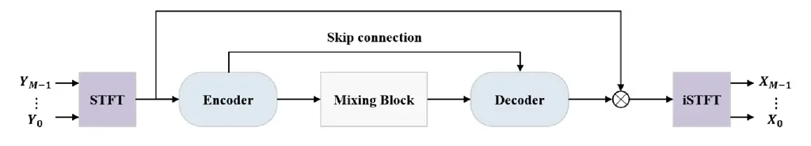
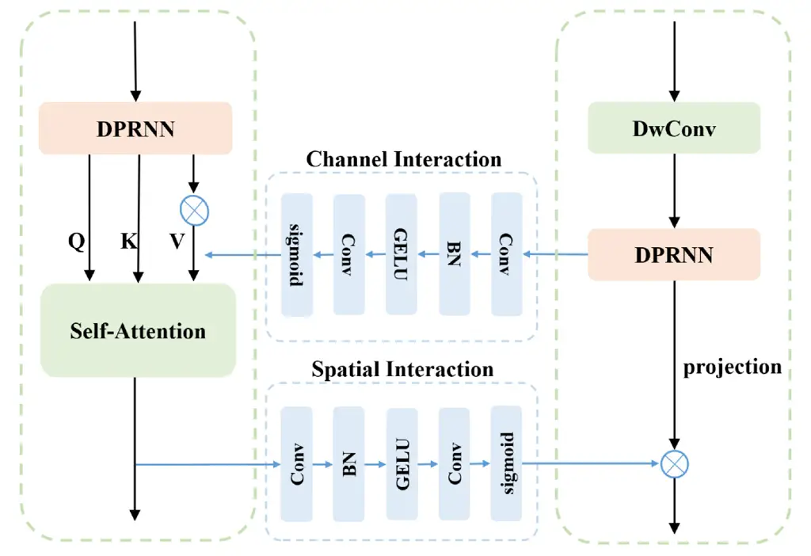
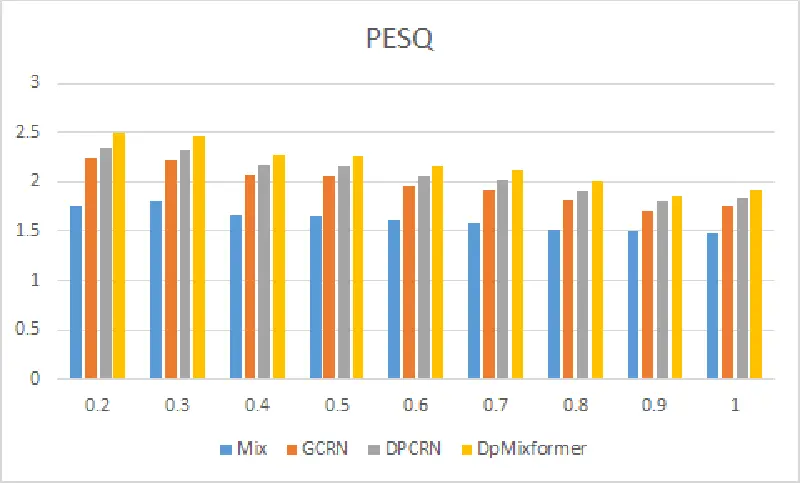
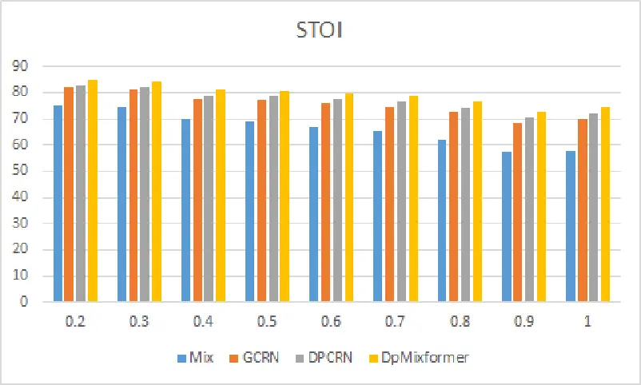

# PDPCRN: Parallel Dual-Path CRN with Bi-directional Inter-Branch Interactions for Multi-Channel Speech Enhancement

Jiahui Pan^(\*)    Shulin He^(\*) ^(†)^(†)thanks: \*: Equal
Contribution.    TianciWu    Hui Zhang ^(†)^(†)thanks: †: Corresponding
author.    Xueliang Zhang

###### Abstract

Multi-channel speech enhancement seeks to utilize spatial information to
distinguish target speech from interfering signals. While deep learning
approaches like the dual-path convolutional recurrent network (DPCRN)
have made strides, challenges persist in effectively modeling
inter-channel correlations and amalgamating multi-level information. In
response, we introduce the Parallel Dual-Path Convolutional Recurrent
Network (PDPCRN). This acoustic modeling architecture has two key
innovations. First, a parallel design with separate branches extracts
complementary features. Second, bi-directional modules enable
cross-branch communication. Together, these facilitate diverse
representation fusion and enhanced modeling. Experimental validation on
TIMIT datasets underscores the prowess of PDPCRN. Notably, against
baseline models like the standard DPCRN, PDPCRN not only outperforms in
PESQ and STOI metrics but also boasts a leaner computational footprint
with reduced parameters.

###### Index Terms: 

multi-channel speech enhancement, dual-path, DPCRN, inter-channel,
bi-directional interaction

^(†)^(†)address: College of Computer Science, Inner Mongolia University,
China  
panjiahui@mail.imu.edu.cn, {cszh,cszxl}@imu.edu.cn

## 1 Introduction

Multi-channel speech enhancement aims to extract a clean speech signal
from background noise using multiple microphone recordings. Effectively
exploiting the spatial and inter-channel information is critical for
enhancing clean speech. Multi-channel signal provides spatial diversity
\[1\], enabling the capture of useful spatial cues encoded in the phase
and amplitude relationships between microphones. This additional spatial
information can lead to significant performance improvements over
single-channel approaches. However, efficiently modeling the
inter-channel correlations and integrating multi-level contextual
information continue to be significant hurdles in the field.

Traditional approaches for multi-microphone speech enhancement utilize
spatial filtering methods \[2, 3\] that leverage spatial information
from the acoustic environment, including the angular position of the
target speech and microphone array geometry. These methods, commonly
termed beamforming, these techniques apply linear processing to weight
the individual microphone channels in the time-frequency domain, with
the goal of suppressing signal components that do not originate from the
desired source. Classic beamforming algorithms such as the delay-and-sum
beamformer \[4\], minimum variance distortionless response (MVDR) \[5\]
beamformer, and super-directivity beamformer \[6\] can yield strong
performance. However, they rely heavily on accurate estimation of
spatial information, which remains a challenging task under noisy
conditions.

With the emergence of deep learning, various deep neural network (DNN)
architectures have been developed for multi-channel speech enhancement.
Typical neural networks, including convolutional neural networks (CNNs)
\[7\], recurrent neural networks (RNNs) \[8\], and more recently
attention mechanisms \[9\], have been successfully applied to
time-frequency \[10, 11\] and time-domain \[12, 13\] speech enhancement.
Leveraging both CNN and RNN strengths, the proposed convolutional
recurrent network (CRN) \[14\] with its convolutional encoder-decoder
structure and recurrent bottleneck has become popular for real-time
speech enhancement \[15\]. To address long sequence modeling challenges,
the dual-path recurrent neural network (DPRNN) \[16\] was proposed,
where long sequential features are divided into smaller chunks and
recursively processed by intra-chunk and inter-chunk RNNs, thereby
reducing the sequence length handled per RNN. While the dual-path
convolutional recurrent neural network (DPCRN) proposed by Le et al.
\[17\] aims to integrate the strengths of CNNs for local pattern
modeling and DPRNNs for long-term modeling, it relies solely on spectral
input without explicit spatial features.

The spatial information is vital for multi-channel scenarios. However,
without explicit spatial features, the above approaches only use
multi-channel spectra as input, relying on implicit learning of spatial
information. To address this gap, we present PDPCRN to effectively model
inter-channel correlations and incorporate multi-level information via
two key innovations. Parallel Structure with Dual Branches: This design
seeks to harness complementary features from the input. The first branch
(DPRNN + Self-Attention): The self-attention mechanism \[18\] is pivotal
in recognizing and weighting critical portions of the input,
facilitating the model to prioritize salient features and downplay less
pertinent ones. By integrating self-attention with the DPRNN’s known
capabilities in modeling long-term temporal dependencies, this branch
specializes in highlighting the most relevant speech components. The
second branch (Depthwise Convolutions + DPRNN): Depthwise convolutions
\[19\] are pivotal for feature extraction. Unlike standard convolutions,
depthwise convolutions operate on individual channels, making them adept
at capturing spatial localization cues from multi-channel data.
Importantly, they achieve this without substantially incrementing model
parameters, ensuring computational efficiency. Bi-directional
Interaction Module: This component is the cornerstone for mutual
learning. By allowing branch outputs to be reciprocally passed, the two
branches inform and refine each other’s feature representations. This
approach addresses the limitations of existing architectures that lack
interaction between channel and spatial information. It ensures that the
inter-channel correlations and multi-level information are seamlessly
integrated, with the branches complementing each other’s strengths.
Evaluations on TIMIT under varying noise and reverberation show our
model outperforms established benchmarks. Remarkably, this is achieved
with fewer computations and parameters. By modeling of inter-channel
correlations and integration of multi-level information, our model
efficiently improves the performance of the multi-channel speech
enhancement.

## 2 PROPOSED METHODS

The proposed PDPCRN architecture, as illustrated in Fig.1 and Fig.2,
comprises two primary novel components: (1) A parallel structure with
distinct DPRNN branches complemented by self-attention and depthwise
convolution to extract hierarchical features. (2) Bi-directional
connections between the branches to enable cross-branch feature sharing
and representation enhancement in both pathways. The dual-branch design
with tailored modules extracts multi-level representations, while the
inter-branch interactions further enrich the learned features in each
branch. Together, these innovations in the proposed PDPCRN model
facilitate advanced inter-channel correlation modeling and integration
of multi-level information for speech enhancement.

We adopt a Multiple Input Multiple Output (MIMO) architecture as
illustrated in Fig.1. The input comprises mixed speech signals from M
microphone channels. The model predicts M target speech outputs, one
corresponding to each of the M input channels. We consider an array with
M microphones. The sound captured at the $`m`$-th microphone signal can
be decomposed as:

```math
y_{m}(n)=h_{m}(n)*x_{m}(n)+v_{m}(n), \tag{1}
```

where $`x_{m}(n)`$ denotes the direct speech component in the $`m`$-th
microphone signal corresponding to speech, $`v_{m}(n)`$ denotes the
noise component representing reverberation, background noise and any
remaining components and $`n`$ denotes the discrete time index. By
N-point short-time Fourier transform(STFT), the $`y_{m}(n)`$ in the T-F
domain can be recorded as $`Y_{m}(t,f)`$:

```math
Y_{m}(t,f)=H_{m}(t,f)X_{m}(t,f)+V_{m}(t,f), \tag{2}
```

where $`t`$ and $`f`$ are the frame index and the frequency index.
$`X_{m}(t,f)`$ is the STFT of $`x_{m}(n)`$, $`V_{m}(t,f)`$ denotes the
noise component. Considering the symmetry of $`Y_{m}(t,f)`$ in
frequency.



Figure 1: The architecture of the proposed PDPCRN system.



Figure 2: The detail of Mixing Block.

### 2.1 The Parallel Design.

In this work, we propose a parallel design for hierarchical feature
learning. As depicted in Fig.2, this parallel design enables
interweaving of features across branches for enhanced representation
learning, with self-attention and depthwise convolutions in separate
pathways. The first branch employs a DPRNN module combined with a
self-attention mechanism. DPRNN divides the long input sequence into
smaller chunks, with an intra-chunk RNN and inter-chunk RNN applied
recursively to model local and global dependencies. The self-attention
mechanism highlights salient parts of the input to focus on extracting
speech components. The second branch utilizes depthwise convolutions
followed by DPRNN. Depthwise convolutions efficiently learn spatial
localization cues from the multi-channel input without substantially
increasing parameters. The lightweight convolutions extract
inter-channel features before DPRNN models temporal dependencies.

Enhanced Hierarchical Feature Representation. The presented parallel
architecture presents advantages concerning hierarchical feature
representation. The branching structure synergizes self-attention and
depthwise convolutions to intricately connect spatial and temporal
dependencies across different tiers. Specifically, self-attention models
longer-range dependencies and global context at higher layers of the
hierarchy. Conversely, depthwise convolutions provide more localized
spatial patterns at lower layers The interleaving of these dual pathways
amalgamates localized features with global context, culminating in a
more intricate hierarchical representation. This approach facilitates
the encapsulation of meticulous spatial cues alongside comprehensive
temporal significance, operating at diverse levels of abstraction.

Computational Efficiency. The DPRNN modules partition the input sequence
into segments, mitigating computational demands associated with modeling
extensive sequences. This enhancement bolsters efficiency during the
handling of prolonged inputs. Furthermore, the utilization of
lightweight depthwise convolutions curbs computation by circumventing
excessive parameter expansion. In synergy, these pathways strike a
harmonious equilibrium between computational expense and
representational prowess. DPRNN efficiently manages memory and
computation for temporal modeling, while streamlined spatial
convolutions extract localized patterns without substantially increasing
model size. The collaborative architecture allows comprehensive
exploration of spatial and temporal interdependencies within a
computationally efficient framework, enabled by the hierarchical
parallel design.

### 2.2 Bi-directional Interactions.

We introduce a bi-directional interactions module that facilitates the
exchange of outputs between the two branches. This interaction enables
mutual learning and reinforcement between branches, augmenting their
representations. This process is visually depicted in Fig.2. Notably,
the channel interaction mechanism transmits information from the right
branch to the left one, thereby amplifying channel modeling.
Simultaneously, spatial interactions propagate spatial relationships
from the left branch to the right one. This integration injects speech
context, thereby assisting in the inter-channel feature learning of the
second branch.

Within the bi-directional interaction module, both channel and spatial
components are incorporated. The channel module encompasses a pair of
$`2\times 2`$ convolutional layers, succeeded by batch normalization
(BN) \[20\] and GELU \[21\] activation. This configuration yields
channel attention maps, which in turn facilitate the dissemination of
information, thereby enriching channel modeling. The spatial module
adheres to the same architectural design. It is important to highlight
two key aspects:

- •
  The flow of information from both the DPRNN and self-attention
  branches is directed towards the right branch through spatial
  interaction, a process that occurs subsequent to the module’s output.
- •
  Information originating from the deep convolution and DPRNN branches
  is directed to the self-attention value of the left branch through
  channel interaction.

## 3 EXPERIMENTS

### 3.1 Datasets and Evaluation Metrics

The training data are synthesized by convolving multi-channel room
impulse responses (RIRs) \[22\] with diverse speech signals extracted
from the TIMIT \[23\] dataset. The clean segments in the TIMIT database
are categorized into three exclusive subsets: training, validation, and
testing. Noise segments from the DNS-Challenge corpus are employed for
both training and validation, whereas the testing set utilizes NOISEX-92
\[24\] and cafe noises from CHiME3 \[25\]. In the data generation phase,
relying on a uniform circular array comprising 16 omnidirectional
microphones. The array radius is 0.035 m, with a random placement inside
the room, while maintaining a source-to-array center distance of 1 m.
The generated RIRs pertain to a room with dimensions of
$`6\times 5\times 4\mathrm{~m}^{3}`$, characterized by a variety of SNR
and reverberation time RT60 values. SNR values range from -10 dB to 10
dB, while RT60 values span from 0.2 seconds to 1.0 second. Overall,
around 24,000 and 2,600 multichannel reverberant noisy mixtures are
generated for training and validation, respectively. For the purpose of
evaluation, we define five distinct SNR levels: -10dB, -5dB, 0dB, 5dB,
and 10dB. In addition, we explore nine distinct T60 values, ranging from
0.2s to 1.0s, with intervals of 0.1s. This comprehensive configuration
results in the generation of 350 pairs for each specific case.

The study used two primary metrics to evaluate model performance:
perceptual evaluation of speech quality (PESQ) \[26\] and short-time
objective intelligibility (STOI) \[27\]. PESQ rates speech quality on a
scale from -0.5 to 4.5, while STOI gauges speech intelligibility on a
scale of 0 to 100. Improved scores in both metrics reflect better
performance.

### 3.2 Experiment Setup

In our model, the encoder is composed of convolutional layers with
channel configurations:{32, 32, 32, 64, 80}. The kernel size and the
stride are respectively set to {(2,5),(2,3),(2,3),(2,3),(2,3)} and
{(1,2),(1,2),(1,1),(1,1),(1,1)} in frequency and time dimension. Causal
computation is utilized across all Conv-2D and transposed Conv-2D
layers. The architecture involves the utilization of two Mixing Blocks,
with each block encompassing two DPRNNs, a multi-head self-attention
mechanism, and a depthwise convolution. Specifically, the self-attention
mechanism employs 50 heads, and the depthwise convolution is
characterized by a kernel size of $`1\times 3`$. To ensure comparable
computational complexity and parameter volume, each DPRNN module is
equipped with RNNs featuring a hidden dimension of 80. Likewise, the
input feature dimension of the depthwise convolution is set to 80.

All the utterances are sampled at 16 kHz, we have configured the window
length as 25 ms and the hop size as 12.5 ms. An FFT length of 400 is
employed, with the application of a sine window prior to the execution
of FFT and overlap-add operations. The input to the model comprises a
201-dimensional complex spectrum. Adam optimizer is applied with the
initial learning rate set to 1e-3. If validation loss does not decrease
for consecutive two epochs, the learning rate will be halved. All models
are trained for 60 epochs.

| Method | \#Params(K) | FLOPs(G) |
| ------ | ----------- | -------- |
| DPCRN  | 814.60      | 3.09     |
| PDPCRN | 790.78      | 3.05     |

Table 1: Comparisoins if different approaches in Params and FLOPs.

### 3.3 Results and analysis

In this study, the proposed PDPCRN is compared with GCRN \[28\] and
DPCRN architectures. The GCRN employs convolutional recurrent networks
for complex spectral mapping. It is designed to map from real and
imaginary spectrograms of noisy speech to their clean counterparts,
consequently enhancing both magnitude and phase responses of speech. On
the other hand, DPCRN is a speech enhancement model in the
time-frequency domain. This model combines the local pattern modeling
capability of CNNs with the long-term sequence modeling capacity of
DPRNNs.

#### 3.3.1 Performance for Proposed System

Table 2 delineates the performance across varying SNRs. Our PDPCRN model
showcases enhancements over both baselines across different
signal-to-noise ratios. Specifically, in comparison to GCRN, there is a
7.5% relative improvement in the PESQ average column and a 4.6%
advancement in the STOI average column. When contrasted with DPCRN, the
relative gains are 3.9% for the PESQ average and 3.4% for the STOI
average. Furthermore, Table 1 presents a comparison between the
computational load and parameter count of the proposed model and DPCRN.
Notably, while our model requires fewer computations and has a smaller
parameter count than DPCRN, it still delivers superior performance.

| Methods     | PESQ   |       |      |      |       |      | STOI (in %) |       |       |       |       |       |
| ----------- | ------ | ----- | ---- | ---- | ----- | ---- | ----------- | ----- | ----- | ----- | ----- | ----- |
|             | -10 dB | -5 dB | 0 dB | 5 dB | 10 dB | Avg. | -10 dB      | -5 dB | 0 dB  | 5 dB  | 10 dB | Avg.  |
| Unprocessed | 1.25   | 1.30  | 1.42 | 1.62 | 1.85  | 1.49 | 39.14       | 47.64 | 56.95 | 66.39 | 75.02 | 57.03 |
| GCRN        | 1.33   | 1.50  | 1.68 | 1.97 | 2.21  | 1.74 | 43.72       | 56.34 | 66.57 | 75.57 | 82.04 | 64.85 |
| DPCRN       | 1.34   | 1.54  | 1.76 | 2.07 | 2.29  | 1.80 | 43.19       | 56.39 | 67.72 | 77.04 | 83.71 | 65.61 |
| PDPCRN      | 1.36   | 1.57  | 1.84 | 2.17 | 2.41  | 1.87 | 45.20       | 59.00 | 70.33 | 79.23 | 85.32 | 67.82 |

Table 2: Comparisoins of different approaches in PESQ and STOI.



Figure 3: PESQ Comparison of Models at -5dB SNR Across Different RT60
Values.



Figure 4: STOI Comparison of Models at -5dB SNR Across Different RT60
Values.

We extended our comparison to assess the performance of the proposed
model under various reverberation conditions. As illustrated in Fig.3
and Fig.4, evaluations were conducted at SNR levels of -5dB, with RT60
ranging from 0.2s to 1.0s. The findings indicate that our method
surpasses the baseline approach, particularly excelling in scenarios
with lower SNR and higher reverberation. Specifically, at RT60 of 1.0s,
our model yielded a 5.8% relative improvement in STOI when compared to
DPCRN.

#### 3.3.2 Ablation Study

We further evaluate the influence of the bi-directional interactions
module through ablation experiments. As shown in Table 3, PDPCRN without
bi-directional interactions (PDPCRN w/o BI) exhibits degraded
performance. Experiments were conducted with RT60 of 0.2s and SNR levels
of \[-10, -5, 0, 5, 10\] dB. Notably, PESQ scores decrease at -10, 0,
and 10 dB without bi-directional interactions, with the largest drop
from 1.41 to 1.39 at -10 dB. Similarly, STOI results confirm the
importance of bi-directional interactions, with performance declining in
its absence. When evaluated at an SNR of -10 dB, STOI drops from 50.62%
to 49.88% without the module. Overall, the results demonstrate the
significance of bi-directional interactions for representation learning.

| Methods | PESQ            |        | STOI (in %)     |        |
| ------- | --------------- | ------ | --------------- | ------ |
|         | PDPCRN (w/o BI) | PDPCRN | PDPCRN (w/o BI) | PDPCRN |
| -10dB   | 1.39            | 1.41   | 49.88           | 50.62  |
| -5dB    | 1.67            | 1.67   | 64.05           | 64.30  |
| 0dB     | 2.02            | 2.03   | 75.50           | 76.12  |
| 5dB     | 2.49            | 2.49   | 82.69           | 84.77  |
| 10dB    | 2.86            | 2.87   | 90.47           | 90.80  |

Table 3: Comparisons of different approaches in STOI and PESQ at 0.2s
RT60.

## 4 CONCLUSION

In this paper, we propose a Parallel Dual-Path Convolutional Recurrent
Network (PDPCRN) for multi-channel speech enhancement. The key novelty
lies in the parallel dual-path architecture integrated with
bi-directional interaction modules. This enables efficient extraction of
spatial information and fusion of multi-level information. Experiments
demonstrate the PDPCRN effectively enhances both spectral and spatial
attributes of speech, highlighting the importance of joint
spectral-spatial optimization. Moreover, analysis of the bi-directional
interaction module reveals its critical role in facilitating efficient
cross-branch information fusion, leading to improved model performance.
In summary, the parallel dual-path structure with bi-directional
interactions allows combined spectral-spatial optimization for effective
multi-channel speech enhancement.

## 5 Acknowledgements

This work was partly supported by the China National Nature Science
Foundation (No. 61876214, No. 61866030).

## References

- \[1\] Monica L Hawley, Ruth Y Litovsky, and John F Culling, “The
  benefit of binaural hearing in a cocktail party: Effect of location
  and type of interferer,” The Journal of the Acoustical Society of
  America, vol. 115, no. 2, pp. 833–843, 2004.
- \[2\] Jacob Benesty, Jingdong Chen, and Yiteng Huang, Microphone array
  signal processing, vol. 1, Springer Science & Business Media, 2008.
- \[3\] Sharon Gannot, Emmanuel Vincent, Shmulik Markovich-Golan, and
  Alexey Ozerov, “A consolidated perspective on multimicrophone speech
  enhancement and source separation,” IEEE/ACM Transactions on Audio,
  Speech, and Language Processing, vol. 25, no. 4, pp. 692–730, 2017.
- \[4\] M Klemm, IJ Craddock, JA Leendertz, A Preece, and R Benjamin,
  “Improved delay-and-sum beamforming algorithm for breast cancer
  detection,” International Journal of Antennas and Propagation, vol.
  2008, 2008.
- \[5\] Mehrez Souden, Jacob Benesty, and Sofiene Affes, “On optimal
  frequency-domain multichannel linear filtering for noise reduction,”
  IEEE Transactions on audio, speech, and language processing, vol. 18,
  no. 2, pp. 260–276, 2009.
- \[6\] Joerg Bitzer and K Uwe Simmer, “Superdirective microphone
  arrays,” in Microphone arrays, pp. 19–38. Springer, 2001.
- \[7\] Andong Li, Wenzhe Liu, Chengshi Zheng, Cunhang Fan, and Xiaodong
  Li, “Two heads are better than one: A two-stage complex spectral
  mapping approach for monaural speech enhancement,” IEEE/ACM
  Transactions on Audio, Speech, and Language Processing, vol. 29, pp.
  1829–1843, 2021.
- \[8\] Lei Sun, Jun Du, Li-Rong Dai, and Chin-Hui Lee, “Multiple-target
  deep learning for lstm-rnn based speech enhancement,” in 2017
  Hands-free Speech Communications and Microphone Arrays (HSCMA). IEEE,
  2017, pp. 136–140.
- \[9\] Jaeyoung Kim, Mostafa El-Khamy, and Jungwon Lee, “T-gsa:
  Transformer with gaussian-weighted self-attention for speech
  enhancement,” in ICASSP 2020-2020 IEEE International Conference on
  Acoustics, Speech and Signal Processing (ICASSP). IEEE, 2020, pp.
  6649–6653.
- \[10\] Yong Xu, Jun Du, Li-Rong Dai, and Chin-Hui Lee, “A regression
  approach to speech enhancement based on deep neural networks,”
  IEEE/ACM Transactions on Audio, Speech, and Language Processing, vol.
  23, no. 1, pp. 7–19, 2014.
- \[11\] DeLiang Wang and Jitong Chen, “Supervised speech separation
  based on deep learning: An overview,” IEEE/ACM Transactions on Audio,
  Speech, and Language Processing, vol. 26, no. 10, pp. 1702–1726, 2018.
- \[12\] Santiago Pascual, Antonio Bonafonte, and Joan Serra, “Segan:
  Speech enhancement generative adversarial network,” arXiv preprint
  arXiv:1703.09452, 2017.
- \[13\] Szu-Wei Fu, Tao-Wei Wang, Yu Tsao, Xugang Lu, and Hisashi
  Kawai, “End-to-end waveform utterance enhancement for direct
  evaluation metrics optimization by fully convolutional neural
  networks,” IEEE/ACM Transactions on Audio, Speech, and Language
  Processing, vol. 26, no. 9, pp. 1570–1584, 2018.
- \[14\] Han Zhao, Shuayb Zarar, Ivan Tashev, and Chin-Hui Lee,
  “Convolutional-recurrent neural networks for speech enhancement,” in
  2018 IEEE International Conference on Acoustics, Speech and Signal
  Processing (ICASSP). IEEE, 2018, pp. 2401–2405.
- \[15\] Ke Tan and De Liang Wang, “Learning complex spectral mapping
  with gated convolutional recurrent networks for monaural speech
  enhancement,” IEEE/ACM Transactions on Audio, Speech, and Language
  Processing, 2020.
- \[16\] Pavlo Molchanov, Stephen Tyree, Tero Karras, Timo Aila, and Jan
  Kautz, “Pruning convolutional neural networks for resource efficient
  inference,” arXiv preprint arXiv:1611.06440, 2016.
- \[17\] Xiaohuai Le, Hongsheng Chen, Kai Chen, and Jing Lu, “Dpcrn:
  Dual-path convolution recurrent network for single channel speech
  enhancement,” arXiv preprint arXiv:2107.05429, 2021.
- \[18\] Peter Shaw, Jakob Uszkoreit, and Ashish Vaswani,
  “Self-attention with relative position representations,” arXiv
  preprint arXiv:1803.02155, 2018.
- \[19\] Qi Han, Zejia Fan, Qi Dai, Lei Sun, Ming-Ming Cheng, Jiaying
  Liu, and Jingdong Wang, “Demystifying local vision transformer: Sparse
  connectivity, weight sharing, and dynamic weight,” arXiv preprint
  arXiv:2106.04263, vol. 2, no. 3, 2021.
- \[20\] Sergey Ioffe and Christian Szegedy, “Batch normalization:
  Accelerating deep network training by reducing internal covariate
  shift,” in International conference on machine learning. pmlr, 2015,
  pp. 448–456.
- \[21\] Dan Hendrycks and Kevin Gimpel, “Gaussian error linear units
  (gelus),” arXiv preprint arXiv:1606.08415, 2016.
- \[22\] Jont B Allen and David A Berkley, “Image method for efficiently
  simulating small-room acoustics,” The Journal of the Acoustical
  Society of America, vol. 65, no. 4, pp. 943–950, 1979.
- \[23\] Victor Zue, Stephanie Seneff, and James Glass, “Speech database
  development at mit: Timit and beyond,” Speech communication, vol. 9,
  no. 4, pp. 351–356, 1990.
- \[24\] Andrew Varga and Herman JM Steeneken, “Assessment for automatic
  speech recognition: Ii. noisex-92: A database and an experiment to
  study the effect of additive noise on speech recognition systems,”
  Speech communication, vol. 12, no. 3, pp. 247–251, 1993.
- \[25\] Jon Barker, Ricard Marxer, Emmanuel Vincent, and Shinji
  Watanabe, “The third ‘chime’speech separation and recognition
  challenge: Dataset, task and baselines,” in 2015 IEEE Workshop on
  Automatic Speech Recognition and Understanding (ASRU). IEEE, 2015, pp.
  504–511.
- \[26\] Antony W Rix, John G Beerends, Michael P Hollier, and Andries P
  Hekstra, “Perceptual evaluation of speech quality (pesq)-a new method
  for speech quality assessment of telephone networks and codecs,” in
  2001 IEEE international conference on acoustics, speech, and signal
  processing. Proceedings (Cat. No. 01CH37221). IEEE, 2001, vol. 2, pp.
  749–752.
- \[27\] Cees H Taal, Richard C Hendriks, Richard Heusdens, and Jesper
  Jensen, “An algorithm for intelligibility prediction of time–frequency
  weighted noisy speech,” IEEE Transactions on Audio, Speech, and
  Language Processing, vol. 19, no. 7, pp. 2125–2136, 2011.
- \[28\] Ke Tan and DeLiang Wang, “Learning complex spectral mapping
  with gated convolutional recurrent networks for monaural speech
  enhancement,” IEEE/ACM Transactions on Audio, Speech, and Language
  Processing, vol. 28, pp. 380–390, 2019.
