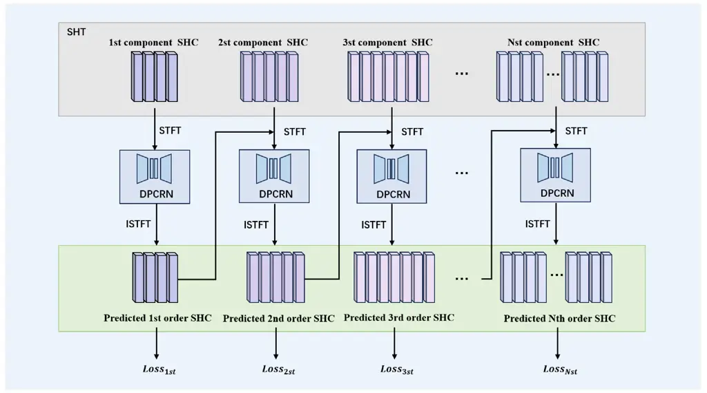

# Hierarchical Modeling of Spatial Cues via Spherical Harmonics for Multi-Channel Speech Enhancement

Jiahui Pan    Shulin He    Hui Zhang    Xueliang Zhang

###### Abstract

Multi-channel speech enhancement utilizes spatial information from
multiple microphones to extract the target speech. However, most
existing methods do not explicitly model spatial cues, instead relying
on implicit learning from multi-channel spectra. To better leverage
spatial information, we propose explicitly incorporating spatial
modeling by applying spherical harmonic transforms (SHT) to the
multi-channel input. In detail, a hierarchical framework is introduced
whereby lower order harmonics capturing broader spatial patterns are
estimated first, then combined with higher orders to recursively predict
finer spatial details. Experiments on TIMIT demonstrate the proposed
method can effectively recover target spatial patterns and achieve
improved performance over baseline models, using fewer parameters and
computations. Explicitly modeling spatial information hierarchically
enables more effective multi-channel speech enhancement.

###### Index Terms: 

Multi-channel, spatial information, spherical harmonic transforms,
hierarchical framework

^(†)^(†)address: College of Computer Science, Inner Mongolia University,
China  
panjiahui@mail.imu.edu.cn, {cszh,cszxl}@imu.edu.cn

## 1 Introduction

Multi-channel speech enhancement is the process of enhancing a target’s
speech corrupted by background interference using multiple microphones.
It is crucial to many applications including, but not limited to,
human-machine interfaces \[1\], mobile communication \[2\], and hearing
aids \[3\]. While the problem has been studied extensively, effectively
integrating and processing spatial cues remains an open challenge.

Traditional approaches include spatial filtering methods \[4, 5\] that
often utilize spatial information from the sound scene, such as the
angular position of the target speech and microphone array
configuration. These approaches are commonly termed beamforming. Classic
beamforming algorithms such as the delay-and-sum beamformer \[6\],
minimum variance distortionless response (MVDR) \[5\] beamformer, and
super-directivity beamformer \[7\] can perform well, but their
performance depends on reliable estimation of spatial information, which
can be challenging to accurately estimate in noisy conditions.

Recently, with the tremendous success of deep learning, speech
enhancement has been formulated as a supervised learning problem \[8,
9\]. In order to effectively utilize spatial information, a common
strategy is to combine DNNs with traditional beamforming techniques.
Examples include FasNet \[10\], EabNet \[11\], and MIMO-Unet \[12\],
which have achieved state-of-the-art performance by exploiting the
complementary strengths of data-driven deep learning and array signal
processing. Specifically, time-frequency (TF) masks can first be
predicted by DNNs, then used to determine beamforming weights based on
statistical theories such as MVDR \[13\] and generalized eigenvalue
(GEV) \[14\]. However, as the second stage relies purely on statistical
theory without considering the mask estimation, pre-estimation errors
may severely degrade subsequent beamforming performance \[12\]. Spatial
information is vital for multichannel scenarios. However, without
explicit spatial features as input, the above approaches only use
multi-channel spectra, relying on networks to learn spatial information
implicitly. Other strategies adopt the reference channel magnitude and
inter-channel phase differences (IPD) as network inputs \[15\]. However,
using only phase information to convey channel correlation leads to
significant information loss.

Fortunately, the spherical harmonic domain representation offers an
innovative approach to decompose the soundfield into spatial basis
functions defined on a sphere, concisely depicting its spatial
characteristics \[16, 17\]. Recent advancements have incorporated
spherical harmonic domain processing in various applications including
DOA estimation \[18\], \[19\] and localization \[20\]. The spherical
harmonic coefficients(SHCs) can be deduced from microphone signals via
the SHT. This separation of spatial and spectral components provides
benefits including \[21\]: enabling detailed spatial analysis,
circumventing issues with covariance matrices, and allowing soundfield
rotation. If fully utilizing the spatial cues encoded in SHCs, this may
compensate for the limited spatial modeling in mainstream multichannel
speech enhancement approaches, thereby improving performance and
robustness.

In this paper, we propose hierarchical modeling of spatial cues via
spherical harmonics for multi-channel speech enhancement. The approach
structurally estimates clean SHCs from noisy SHCs. Lower order harmonics
capturing broader patterns are estimated first, then recursively
combined with higher orders to predict finer spatial details.
Experiments demonstrate the proposed method can effectively recover
target spatial patterns and achieve improved performance over baseline
models, while using fewer parameters and computations. The results
highlight the benefits of leveraging spherical harmonic domain
processing and hierarchical prediction to improve multi-channel speech
enhancement performance. Our main contributions are:

- •
  Introducing SHT to enable structured spatial soundfield analysis for
  multi-channel speech enhancement.
- •
  Proposing a divide-and-conquer framework to hierarchically predict
  coefficient orders, providing gains in both accuracy and efficiency.



Figure 1: Overview of hierarchical modeling of spatial cues via
spherical harmonics.

## 2 Method

The proposed method leverages the hierarchical nature of SHCs to
progressively model the spatial information (as illustrated in Fig.1).
Spherical harmonics enable spectral decomposition into coarser
components characterized by lower-order coefficients, with finer details
encoded in higher orders. The method incrementally predicts SHCs of
increasing order from the multi-channel mixed input using a neural
network. Specifically, given the SHCs up to order N, we separate them
into orders 1 to N-1 and the Nth order component. First, the first-order
SHC components are input to a neural network to predict the first-order
SHCs of the target speech. The predicted first-order SHCs are then
combined with the second-order SHC components to form mixed second-order
SHCs. These are input to a second neural network to predict the
second-order SHCs. This progressive process continues, with each
subsequent neural network predicting the SHCs of its order. The inputs
to each network are the predicted lower-order SHCs combined with the
original SHCs of the same order. In this way, each network leverages
both the original and predicted low-order SHC components to estimate the
higher-order SHCs in a hierarchical manner. This allows the model to
capitalize on the interdependencies between low- and high-order SHCs for
improved prediction performance.

### 2.1 Spherical Harmonic Representations

By calculating the coefficients of spherical harmonics, the received
speech signal at a specific point on the sphere surface can be
estimated. The SHT enables a Fourier-related spectral analysis on the
sphere or in 3D space, expressing signals in terms of SHCs at different
orders. In this work, the input multichannel mixed speech is first
transformed into the SH domain up to order N, yielding the SHCs. Let
$`\mathbf{r}_{i}=(r_{i}\cos\phi_{i}\sin\theta_{i},r_{i}\sin\phi_{i}\sin\theta_{i},r_{i}\cos\theta_{i})^{T}`$
denote the position of the $`i`$-th microphone of the array, where
$`r_{i}`$ represents the distance of the $`i`$-th microphone to the
center of the array. The azimuth $`\phi_{i}`$ is measured
counterclockwise from the x-axis, and the elevation angle $`\theta_{i}`$
is measured downward from the z-axis. The signal received by the
$`i`$-th microphone in the frequency domain can then be expressed as:

```math
p_{i}(k)=\sum_{l=1}^{L}v_{i}\left(k,\Psi_{l}\right)s_{l}(k)+n_{i}(k), \tag{1}
```

where $`v_{i}\left(k,\Psi_{l}\right)`$ denotes the steering vector of
the $`i`$-th microphone associated with the $`l`$-th plane wave;
$`s_{l}(k)`$ is the complex amplitude of the $`l`$-th plane wave, and
$`n_{i}(k)`$ is the noise received by the $`i`$-th microphone.

According to the Fourier acoustic principle, the sampled sound pressure
$`{p}(k,r)`$ and its spherical harmonic domain representation
$`{p}_{nm}(k,r)`$ at angle $`(\theta,\phi)`$ can be expressed as:

```math
p(k,r)=\sum_{n=0}^{\infty}\sum_{m=-n}^{n}p_{nm}(k,r)Y_{n}^{m}(\theta,\phi), \tag{2}
```

```math
Y_{n}^{m}(\theta,\phi)=\sqrt{\frac{(2n+1)}{4\pi}\frac{(n-m)!}{(n+m)!}}P_{n}^{m}(\cos\theta)e^{im\phi}, \tag{3}
```

where $`(.)!`$ represents the factorial function.
$`Y_{n}^{m}(\theta,\phi)`$ denotes the spherical harmonic functions of
order $`n`$ and degree $`m`$, and $`P_{n}^{m}`$ is the normalized
associated Legendre polynomial. The spherical harmonic function
$`P_{n}^{m}(\cos\theta)`$ captures the dependency on the elevation angle
$`\theta`$, while the complex exponential term $`e^{im\phi}`$ captures
the dependency on the azimuth angle $`\phi`$.

As explained in \[21\], the coefficients $`p_{nm}`$ diminish for $`kr`$
in a range smaller than N and can therefore be neglected. Hence, Eq.2
can be approximated for an appropriate finite order N:

```math
p(k,r)\cong\sum_{n=0}^{N}\sum_{m=-n}^{n}p_{nm}(k,r)Y_{n}^{m}(\theta,\phi), \tag{4}
```

where N is the truncation order, $`p(k,r)`$ denotes the time-dependent
amplitude of the sound pressure in free three-dimensional space,
$`Y_{n}^{m}=\left[Y_{0}^{0},Y_{1}^{-1},Y_{1}^{0},Y_{1}^{1},\cdots,Y_{N}^{N}\right]`$,
$`p_{nm}(k,r)`$ are the weights known as coefficients of the SHT,
$`k=2\pi f/c`$ is the wave number, $`f`$ is the frequency, and $`c`$ is
the speed of sound in air. The spherical harmonic coefficients
$`p_{nm}(k,r)`$ are defined as \[21\]:

```math
p_{nm}(k,r)=\int_{0}^{2\pi}\int_{0}^{\pi}p(k,\mathbf{r})\left[Y_{n}^{m}(\theta,\phi)\right]^{*}\sin(\theta)\mathrm{d}\theta\mathrm{d}\phi, \tag{5}
```

where $`(.)^{*}`$ denotes complex conjugation. To satisfy the far-field
condition, the distance $`d`$ between the sound source and the center of
the microphone array must exceed $`8r^{2}f/c`$\[22\], where r is the
array radius. This ensures negligible wavefront curvature effects. For
$`n\leq N`$, the spherical harmonic coefficients $`p_{nm}(k,r)`$ can be
obtained as:

```math
p_{nm}(k,r)\cong\frac{4\pi}{I}\sum_{i=1}^{I}p\left(k,\mathbf{r}_{i}\right)\left[Y_{n}^{m}\left(\theta_{i},\phi_{i}\right)\right]^{*}, \tag{6}
```

where $`\mathbf{r}_{i}=\left(r,\theta_{i},\phi_{i}\right)`$ is the
location of the i-th physical microphone and I is the number of physical
microphones.

### 2.2 Progressive Spherical Harmonic Prediction

The obtained SHCs of the mixed speech are partitioned into incremental
groups based on order. The first group comprises the first-order
coefficients, corresponding to spherical harmonic basis functions
$`Y=\left[Y_{0}^{0},Y_{1}^{-1},Y_{1}^{0},Y_{1}^{1}\right]`$ in
$`Y_{n}^{m}`$ notation. The second group contains the second-order SHCs
excluding the first-order, mapping to basis functions
$`Y=\left[Y_{2}^{-2},Y_{2}^{-1},Y_{2}^{0},Y_{2}^{1},Y_{2}^{2}\right]`$
in $`Y_{n}^{m}`$ notation, and so on. This hierarchical partitioning of
the spherical harmonic spectrum into distinct order-based components is
core to the proposed processing framework.

A progressive neural network architecture is proposed, where each subnet
predicts the SHCs of the target speech for a specific order range from
the corresponding mixed speech SHCs. The first network takes the first
group of SHCs and predicts the 1st order target coefficients. Its output
is combined with the second group of SHCs to form the mixed 2nd order
coefficients, which are passed to the second network to predict the 2nd
order target. This continues progressively until the final network
predicts all Nth order SHCs to output a fully enhanced representation.
Each subnet utilizes a DPCRN structure with STFT preprocessing. The loss
function is the mean squared error (MSE) between the predicted and true
SHCs for each order group. By modeling the residual error at each stage,
the network focuses on iteratively refining the spherical harmonic
spectral estimate.

```math
\text{Loss}=Loss_{1st}+Loss_{2st}+Loss_{3st}+\cdots+Loss_{Nst}. \tag{7}
```

## 3 EXPERIMENTS and Results

### 3.1 Datasets and Evaluation Metrics

The training data are synthesized by convolving multi-channel room
impulse responses (RIRs) \[23\] with diverse speech segments from the
TIMIT dataset \[24\]. The clean TIMIT segments are split into exclusive
training, validation, and testing subsets. Noise segments from the
DNS-Challenge corpus are used for training and validation, while testing
employs noises from NOISEX-92 \[25\] and CHiME3 \[26\] cafe recordings.
In the data generation phase, relying on a uniform circular array
comprising 16 omnidirectional microphones. The array radius is 0.035 m,
with a random placement inside the room, while maintaining a
source-to-array center distance of 1 m. The generated RIRs pertain to a
room with dimensions of $`6\times 5\times 4\mathrm{~m}^{3}`$,
characterized by a variety of SNR and reverberation time RT60 values.
SNR values range from -10 dB to 10 dB, while RT60 values span from 0.2
seconds to 1.0 second. Overall, around 24,000 and 2,600 multichannel
reverberant noisy mixtures are generated for training and validation,
respectively. For the purpose of evaluation, we define five distinct SNR
levels: -10dB, -5dB, 0dB, 5dB, and 10dB. In addition, we explore nine
distinct T60 values, ranging from 0.2s to 1.0s, with intervals of 0.1s.
This comprehensive configuration results in the generation of 350 pairs
for each specific case.

In this paper, perceptual evaluation of speech quality (PESQ)\[27\] and
short-time objective intelligibility (STOI)\[28\] are chosen as the
major objective metrics to evaluate the enhancement performance of
different models. PESQ rates speech quality on a scale from -0.5 to 4.5,
while STOI gauges speech intelligibility on a scale of 0 to 100.
Improved scores in both metrics reflect better performance.

| Method   | \#Params(M) | FLOPs(G) |
| -------- | ----------- | -------- |
| DPCRN    | 5.42        | 21.56    |
| Proposed | 3.32        | 14.06    |

Table 1: Comparisoins if different approaches in Params and FLOPs.

### 3.2 Experiment Setup

In our model, we follow the structure of DPCRN \[29\]. The channel
number of the convolutional layers in the encoder is {32, 32, 32, 64,
128}. The kernel size and the stride are respectively set to {(5,2),
(3,2), (3,2), (3,2), (3,2)} and {(2,1), (2,1), (1,1), (1,1),(1,1)} in
frequency and time dimension. All the Conv-2D and transposed Conv-2D
layers are causally computed. The model includes two DPRNN modules, each
containing RNNs with a 128-dimensional hidden state. The order N of the
SHT is set to 4. This generates an $`(N+1)^{2}\times I`$ coefficient
matrix, where I is the number of microphones (16 in this work). The
dimensions of the corresponding four SHC components are {(4,16), (5,16),
(7,16), (9,16)}.

The audio is sampled at 16 kHz with a 25 ms window length and 12.5 ms
hop size. An FFT length of 400 is used with a sine window applied prior
to FFT and overlap-add. The input features are 201-dim complex spectra.
Adam optimization is employed with an initial learning rate of 1e-3,
halved if validation loss does not decrease for 2 consecutive epochs.
Models are trained for 60 epochs.

| Methods     | 0.2s  |      |      |      |      |      | 0.6s  |      |      |      |      |      | 1.0s  |      |      |      |      |      |
| ----------- | ----- | ---- | ---- | ---- | ---- | ---- | ----- | ---- | ---- | ---- | ---- | ---- | ----- | ---- | ---- | ---- | ---- | ---- |
|             | -10dB | -5dB | 0dB  | 5dB  | 10dB | avg. | -10dB | -5dB | 0dB  | 5dB  | 10dB | avg. | -10dB | -5dB | 0dB  | 5dB  | 10dB | avg. |
| Unprocessed | 1.25  | 1.34 | 1.48 | 1.76 | 2.13 | 1.59 | 1.25  | 1.31 | 1.42 | 1.61 | 1.80 | 1.48 | 1.24  | 1.29 | 1.35 | 1.48 | 1.59 | 1.39 |
| GCRN        | 1.32  | 1.47 | 1.66 | 1.96 | 1.26 | 2.21 | 1.31  | 1.44 | 1.58 | 1.80 | 1.97 | 1.99 | 1.29  | 1.38 | 1.48 | 1.63 | 1.73 | 1.84 |
| DPCRN       | 1.41  | 1.69 | 2.04 | 2.50 | 2.88 | 2.10 | 1.38  | 1.59 | 1.86 | 2.18 | 2.39 | 1.88 | 1.33  | 1.51 | 1.72 | 1.94 | 2.08 | 1.72 |
| Proposed    | 1.51  | 1.80 | 2.16 | 2.62 | 2.94 | 2.21 | 1.46  | 1.69 | 1.99 | 2.32 | 2.51 | 1.99 | 1.39  | 1.61 | 1.85 | 2.10 | 2.25 | 1.84 |

Table 2: PESQ results comparing proposed models with baselines.

| Methods     | 0.2s  |       |       |       |       |       | 0.6s  |       |       |       |       |       | 1.0s  |       |       |       |       |       |
| ----------- | ----- | ----- | ----- | ----- | ----- | ----- | ----- | ----- | ----- | ----- | ----- | ----- | ----- | ----- | ----- | ----- | ----- | ----- |
|             | -10dB | -5dB  | 0dB   | 5dB   | 10dB  | avg.  | -10dB | -5dB  | 0dB   | 5dB   | 10dB  | avg.  | -10dB | -5dB  | 0dB   | 5dB   | 10dB  | avg.  |
| Unprocessed | 43.94 | 53.60 | 64.12 | 74.94 | 84.66 | 64.25 | 40.16 | 48.69 | 57.75 | 67.09 | 75.24 | 57.79 | 36.45 | 43.05 | 50.66 | 57.69 | 64.37 | 50.44 |
| GCRN        | 45.32 | 57.90 | 68.60 | 78.49 | 85.58 | 67.18 | 41.98 | 53.60 | 63.40 | 72.40 | 78.85 | 62.05 | 38.08 | 47.95 | 57.52 | 65.44 | 71.51 | 56.10 |
| DPCRN       | 50.69 | 64.33 | 75.94 | 84.62 | 90.76 | 73.27 | 46.92 | 60.44 | 71.10 | 79.65 | 85.48 | 68.72 | 42.70 | 55.69 | 66.21 | 74.46 | 80.25 | 63.86 |
| Proposed    | 53.96 | 67.69 | 78.67 | 86.50 | 91.51 | 75.67 | 49.33 | 63.23 | 73.54 | 81.40 | 86.39 | 70.78 | 44.76 | 58.01 | 68.94 | 76.59 | 81.78 | 66.02 |

Table 3: STOI results comparing proposed models with baselines.

### 3.3 Results and Discussions

The proposed system is compared to GCRN \[30\] and DPCRN models. Unlike
the above methods without explicit spatial features that only use STFT
inputs, the proposed model operates in the spherical harmonic domain to
leverage spatial information. GCRN utilizes convolutional recurrent
networks for complex spectral mapping to enhance both magnitude and
phase, relying on implicit spatial learning. DPCRN combines CNN local
pattern modeling with DPRNN long-term sequence modeling for
time-frequency speech enhancement, also based only on STFT inputs. The
proposed model adopts DPCRN as the subnet within a structured spherical
harmonic framework to capture spatial information. This hierarchical
approach models spatial cues by transforming the multi-channel speech
into SHCs and progressively estimating the target SHCs by order.

Table 1 compares the computational complexity and number of parameters
for DPCRN and the proposed system. our method requires only 3.32M of the
parameters and 14.06G of the FLOPs compared to DPCRN. This highlights
the efficiency benefits of the proposed progressive order-wise
prediction framework.

As shown in Tables 2 and 3, for a reverberation time (RT60) of 0.2s, the
proposed system obtains superior performance across all SNRs, with
average PESQ gains of 0.11 and average STOI improvements of 2.4%
compared to DPCRN methods. Notably, the proposed system provides more
substantial benefits at lower SNRs. For RT60=0.6s, the proposed method
maintains significant gains over DPCRN, with average PESQ increases of
0.11 and STOI boosted by up to 2.06%. This indicates that our method of
structured modeling is more robust to reverberation compared to the
baseline method. For the most reverberant case with RT60 of 1.0s. The
improvement of our method compared to GCRN and DPCRN is still
maintained, with the proposed system achieving average PESQ gains of
0.12 and STOI improved by 2.16%. This validates the efficacy of
spherical harmonic modeling for multi-channel speech enhancement under
severely reverberant conditions.

In summary, the experimental results validate the benefits of the
proposed method over baselines for multi-channel speech enhancement. The
hierarchical spatial filtering in the proposed system provides increased
accuracy in terms of PESQ and STOI metrics across different
reverberation times. Notably, the gains are maintained even for highly
reverberant conditions with RT60 of 1.0s. The structured modeling also
enables computational efficiency. Together, these results highlight the
importance of efficient spherical harmonic modeling and progressive
order-wise prediction for robust and accurate multi-channel speech
enhancement, especially in acoustically challenging environments.

## 4 CONCLUSION

In this work, we have proposed a progressive prediction approach for
multi-channel speech enhancement in the spherical harmonic domain. The
key idea is hierarchical estimation of lower order coefficients first,
followed by recursive prediction of higher orders conditioned on the
lower orders. This allows focusing model complexity on successive
spatial frequency bands for more efficient optimization. Experiments
were conducted for varied reverberation times and input SNRs. The
results demonstrate the proposed technique consistently achieves
superior speech enhancement over DPCRN networks operating on microphone
signals directly, in terms of PESQ and STOI metrics. This highlights the
benefits of structured spherical harmonic modeling and progressive
order-wise prediction.

## 5 Acknowledgements

This work was partly supported by the China National Nature Science
Foundation (No. 61876214, No. 61866030).

## References

- \[1\] Mingsian R Bai, Jeong-Guon Ih, and Jacob Benesty, Acoustic array
  systems: theory, implementation, and application, John Wiley &
  Sons, 2013.
- \[2\] Ke Tan, Xueliang Zhang, and DeLiang Wang, “Real-time speech
  enhancement using an efficient convolutional recurrent network for
  dual-microphone mobile phones in close-talk scenarios,” in ICASSP
  2019-2019 IEEE International Conference on Acoustics, Speech and
  Signal Processing (ICASSP). IEEE, 2019, pp. 5751–5755.
- \[3\] Soha A Nossier, MRM Rizk, Nancy Diaa Moussa, and Saleh
  el Shehaby, “Enhanced smart hearing aid using deep neural networks,”
  Alexandria Engineering Journal, vol. 58, no. 2, pp. 539–550, 2019.
- \[4\] Osamu Hoshuyama, Akihiko Sugiyama, and Akihiro Hirano, “A robust
  adaptive beamformer for microphone arrays with a blocking matrix using
  constrained adaptive filters,” IEEE Transactions on signal processing,
  vol. 47, no. 10, pp. 2677–2684, 1999.
- \[5\] Mehrez Souden, Jacob Benesty, and Sofiene Affes, “On optimal
  frequency-domain multichannel linear filtering for noise reduction,”
  IEEE Transactions on audio, speech, and language processing, vol. 18,
  no. 2, pp. 260–276, 2009.
- \[6\] M Klemm, IJ Craddock, JA Leendertz, A Preece, and R Benjamin,
  “Improved delay-and-sum beamforming algorithm for breast cancer
  detection,” International Journal of Antennas and Propagation, vol.
  2008, 2008.
- \[7\] Joerg Bitzer and K Uwe Simmer, “Superdirective microphone
  arrays,” in Microphone arrays, pp. 19–38. Springer, 2001.
- \[8\] DeLiang Wang and Jitong Chen, “Supervised speech separation
  based on deep learning: An overview,” IEEE/ACM Transactions on Audio,
  Speech, and Language Processing, vol. 26, no. 10, pp. 1702–1726, 2018.
- \[9\] Felix Weninger, Hakan Erdogan, Shinji Watanabe, Emmanuel
  Vincent, Jonathan Le Roux, John R Hershey, and Björn Schuller, “Speech
  enhancement with lstm recurrent neural networks and its application to
  noise-robust asr,” in Latent Variable Analysis and Signal Separation:
  12th International Conference, LVA/ICA 2015, Liberec, Czech Republic,
  August 25-28, 2015, Proceedings 12. Springer, 2015, pp. 91–99.
- \[10\] Yi Luo, Cong Han, Nima Mesgarani, Enea Ceolini, and Shih-Chii
  Liu, “Fasnet: Low-latency adaptive beamforming for multi-microphone
  audio processing,” in 2019 IEEE automatic speech recognition and
  understanding workshop (ASRU). IEEE, 2019, pp. 260–267.
- \[11\] Andong Li, Wenzhe Liu, Chengshi Zheng, and Xiaodong Li,
  “Embedding and beamforming: All-neural causal beamformer for
  multichannel speech enhancement,” in ICASSP 2022-2022 IEEE
  International Conference on Acoustics, Speech and Signal Processing
  (ICASSP). IEEE, 2022, pp. 6487–6491.
- \[12\] Xinlei Ren, Xu Zhang, Lianwu Chen, Xiguang Zheng, Chen Zhang,
  Liang Guo, and Bing Yu, “A causal u-net based neural beamforming
  network for real-time multi-channel speech enhancement.,” in
  Interspeech, 2021, pp. 1832–1836.
- \[13\] Xiong Xiao, Chenglin Xu, Zhaofeng Zhang, Shengkui Zhao, Sining
  Sun, Shinji Watanabe, Longbiao Wang, Lei Xie, Douglas L Jones,
  Eng Siong Chng, et al., “A study of learning based beamforming methods
  for speech recognition,” in CHiME 2016 workshop, 2016, pp. 26–31.
- \[14\] Jahn Heymann, Lukas Drude, Aleksej Chinaev, and Reinhold
  Haeb-Umbach, “Blstm supported gev beamformer front-end for the 3rd
  chime challenge,” in 2015 IEEE Workshop on Automatic Speech
  Recognition and Understanding (ASRU). IEEE, 2015, pp. 444–451.
- \[15\] Rongzhi Gu, Jian Wu, Shi-Xiong Zhang, Lianwu Chen, Yong Xu,
  Meng Yu, Dan Su, Yuexian Zou, and Dong Yu, “End-to-end multi-channel
  speech separation,” arXiv preprint arXiv:1905.06286, 2019.
- \[16\] Lalan Kumar and Rajesh M Hegde, “Near-field acoustic source
  localization and beamforming in spherical harmonics domain,” IEEE
  Transactions on Signal Processing, vol. 64, no. 13, pp.
  3351–3361, 2016.
- \[17\] Vishnuvardhan Varanasi, Harshit Gupta, and Rajesh M Hegde, “A
  deep learning framework for robust doa estimation using spherical
  harmonic decomposition,” IEEE/ACM Transactions on Audio, Speech, and
  Language Processing, vol. 28, pp. 1248–1259, 2020.
- \[18\] Liuqing Weng, Xiyu Song, Zhenghong Liu, Xiaojuan Liu, Haocheng
  Zhou, Hongbing Qiu, and Mei Wang, “Doa estimation of indoor sound
  sources based on spherical harmonic domain beam-space music,”
  Symmetry, vol. 15, no. 1, pp. 187, 2023.
- \[19\] Zamir Ben-Hur, David Lou Alon, Ravish Mehra, and Boaz Rafaely,
  “Binaural reproduction based on bilateral ambisonics and ear-aligned
  hrtfs,” IEEE/ACM Transactions on Audio, Speech, and Language
  Processing, vol. 29, pp. 901–913, 2021.
- \[20\] Or Nadiri and Boaz Rafaely, “Localization of multiple speakers
  under high reverberation using a spherical microphone array and the
  direct-path dominance test,” IEEE/ACM Transactions on Audio, Speech,
  and Language Processing, vol. 22, no. 10, pp. 1494–1505, 2014.
- \[21\] Boaz Rafaely, Fundamentals of spherical array processing,
  vol. 8, Springer, 2015.
- \[22\] Jens Meyer, “Beamforming for a circular microphone array
  mounted on spherically shaped objects,” The Journal of the Acoustical
  Society of America, vol. 109, no. 1, pp. 185–193, 2001.
- \[23\] Jont B Allen and David A Berkley, “Image method for efficiently
  simulating small-room acoustics,” The Journal of the Acoustical
  Society of America, vol. 65, no. 4, pp. 943–950, 1979.
- \[24\] Victor Zue, Stephanie Seneff, and James Glass, “Speech database
  development at mit: Timit and beyond,” Speech communication, vol. 9,
  no. 4, pp. 351–356, 1990.
- \[25\] Andrew Varga and Herman JM Steeneken, “Assessment for automatic
  speech recognition: Ii. noisex-92: A database and an experiment to
  study the effect of additive noise on speech recognition systems,”
  Speech communication, vol. 12, no. 3, pp. 247–251, 1993.
- \[26\] Jon Barker, Ricard Marxer, Emmanuel Vincent, and Shinji
  Watanabe, “The third ‘chime’speech separation and recognition
  challenge: Dataset, task and baselines,” in 2015 IEEE Workshop on
  Automatic Speech Recognition and Understanding (ASRU). IEEE, 2015, pp.
  504–511.
- \[27\] Antony W Rix, John G Beerends, Michael P Hollier, and Andries P
  Hekstra, “Perceptual evaluation of speech quality (pesq)-a new method
  for speech quality assessment of telephone networks and codecs,” in
  2001 IEEE international conference on acoustics, speech, and signal
  processing. Proceedings (Cat. No. 01CH37221). IEEE, 2001, vol. 2, pp.
  749–752.
- \[28\] Cees H Taal, Richard C Hendriks, Richard Heusdens, and Jesper
  Jensen, “An algorithm for intelligibility prediction of time–frequency
  weighted noisy speech,” IEEE Transactions on Audio, Speech, and
  Language Processing, vol. 19, no. 7, pp. 2125–2136, 2011.
- \[29\] Xiaohuai Le, Hongsheng Chen, Kai Chen, and Jing Lu, “Dpcrn:
  Dual-path convolution recurrent network for single channel speech
  enhancement,” arXiv preprint arXiv:2107.05429, 2021.
- \[30\] Ke Tan and DeLiang Wang, “Learning complex spectral mapping
  with gated convolutional recurrent networks for monaural speech
  enhancement,” IEEE/ACM Transactions on Audio, Speech, and Language
  Processing, vol. 28, pp. 380–390, 2019.
