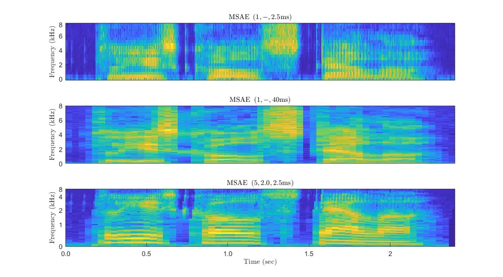
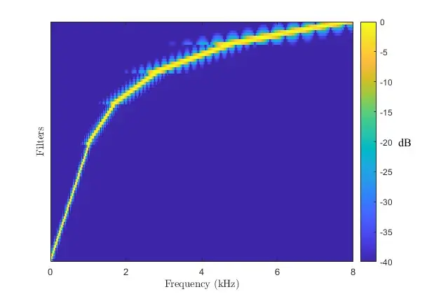

# A Multiscale Autoencoder (MSAE) Framework for End-to-End Neural Network Speech Enhancement

Bengt J. Borgstr$`\ddot{\textrm{o}}`$m    Michael S. Brandstein

###### Abstract

Neural network approaches to single-channel speech enhancement have
received much recent attention. In particular, mask-based architectures
have achieved significant performance improvements over conventional
methods. This paper proposes a multiscale autoencoder (MSAE) for
mask-based end-to-end neural network speech enhancement. The MSAE
performs spectral decomposition of an input waveform within separate
band-limited branches, each operating with a different rate and scale,
to extract a sequence of multiscale embeddings. The proposed framework
features intuitive parameterization of the autoencoder, including a
flexible spectral band design based on the Constant-Q transform.
Additionally, the MSAE is constructed entirely of differentiable
operators, allowing it to be implemented within an end-to-end neural
network, and be discriminatively trained. The MSAE draws motivation both
from recent multiscale network topologies and from traditional
multiresolution transforms in speech processing. Experimental results
show the MSAE to provide clear performance benefits relative to
conventional single-branch autoencoders. Additionally, the proposed
framework is shown to outperform a variety of state-of-the-art
enhancement systems, both in terms of objective speech quality metrics
and automatic speech recognition accuracy.

###### Index Terms: 

Speech Enhancement, End-to-End Neural Networks, Multiscale
Representations, Mutliresolution Transforms

## I Introduction

⁰⁰ 0 DISTRIBUTION STATEMENT A. Approved for public release. Distribution
is unlimited. This material is based upon work supported by the
Department of Defense under Air Force Contract No. FA8702-15-D-0001. Any
opinions, findings, conclusions or recommendations expressed in this
material are those of the author(s) and do not necessarily reflect the
views of the Department of Defense. $`\copyright`$ 2023 Massachusetts
Institute of Technology. Delivered to the U.S. Government with Unlimited
Rights, as defined in DFARS Part 252.227-7013 or 7014 (Feb 2014).
Notwithstanding any copyright notice, U.S. Government rights in this
work are defined by DFARS 252.227-7013 or DFARS 252.227-7014 as detailed
above. Use of this work other than as specifically authorized by the
U.S. Government may violate any copyrights that exist in this work.

When captured in realistic acoustic environments, speech signals
typically suffer from distortions such as additive noise and
reverberation. For human listeners, this can lead to reduced
intelligibility \[1\] and increased listener fatigue \[2\]. It can also
result in performance degradation for automated speech applications such
as speech and speaker recognition \[3, 4, 5, 6, 7\]. Speech enhancement
can be employed to improve the perceptual quality of captured signals,
and to curb these negative effects. For many decades, speech enhancement
relied on statistical model-based techniques \[8, 9, 10, 11\]. Recently,
however, deep neural networks (DNNs) have achieved impressive
performance improvements due to their high modelling capacity \[12, 13,
14, 15, 16, 17, 18, 19, 20, 21, 22, 23, 24, 25, 26, 27, 28, 29, 30, 31,
32, 33, 34, 35, 36\].

Neural network speech enhancement systems can be categorized into
generative and mask-based approaches. Generative systems are
regression-based and synthesize the enhanced waveform using a set of
learned filters, generally operating without much constraint on the
output \[13, 14, 23, 32, 34, 35, 36\]. While they can freely synthesize
output waveforms and potentially reconstruct speech signal components
that have been attenuated due to channel effects, they can also result
in distorted speech signals or unnatural residual noise. Mask-based
approaches, on the other hand, are constrained to apply a multiplicative
mask in a time-frequency space in order to suppress interfering signal
components \[12, 15, 16, 17, 18, 19, 20, 21, 22, 24, 25, 26, 27, 28, 29,
30, 31, 33\]. While this constraint can help avoid distorted speech, it
also limits the ability of the system to reconstruct any signals
components not present in the original waveform.

This paper focuses on mask-based approaches to neural network speech
enhancement. In such systems, an encoder first transforms the input
signal into an embedding space. A multiplicative mask is then applied to
suppress signal components from interfering sources. Finally, a decoder
synthesizes the output waveform. A crucial component of mask-based
end-to-end enhancement networks is the autoencoder which maps input
signals into an embedding space which is effective at separating speech
and noise components. Some prior studies have relied on mappings such as
the Short-Time Fourier Transform (STFT) or Discrete Cosine Transform
(DCT) \[37, 20, 22, 38, 30, 39\], while others have explored trainable
encoders and decoders \[28, 29, 12\].

The human cochlea is well known to implement a complex set of auditory
filters that reflect a broad trade-off between frequency precision and
temporal resolution \[40\], extracting a multiscale representation of
speech signals. The resulting filterbank conveys a non-uniform
time-frequency tiling with a general emphasis on frequency resolution at
the lower end of the auditory range and finer temporal resolution at the
upper end. For decades speech scientists have successfully exploited the
ear’s frequency characteristics to great effect. The input features to
the vast majority of speech-derived analysis methods include some form
of frequency scale manipulation (e.g. mel and bark scale warping) that
emulates the cochlea’s spectral properties. Similarly, but to a lesser
degree, the ear’s temporal characteristics have been mimicked via a
multiplicity of analysis window durations that allow for the detection
of transient events without sacrificing the required frequency
resolution. The narrow-band and wide-band spectrogram\[41\] represent
two extremes of time-frequency trade-off, while methods such as the
multi-resolution short-time Fourier Transform\[42\], Constant-Q
transform\[43\], and wavelet filtering \[44\] implement filtering
schemes that reflect the cochlea’s temporal-spectral properties to some
degree.

In the field of deep learning, several recent studies have explored
neural network topologies with multiscale representations \[45, 46, 47,
48\]. Such approaches typically aggregate representations across network
layers in order to simultaneously model information at different scales.
Multiscale network architectures have been shown highly successful for
tasks such as image classification and segmentation \[45, 46, 47\].
Additionally, \[48\] and \[49\] showed the effectiveness of multiscale
networks in modeling speech for the task of speaker verification.

This paper proposes the multiscale autoencoder (MSAE) for mask-based
end-to-end neural network speech enhancement, which is motivated both by
recent multiscale network topologies and traditional multiresolution
transforms in speech processing. The framework provides the encoder and
decoder mappings required by mask-based approaches, and is not specific
to the architecture used for mask estimation. The MSAE performs spectral
decomposition of an input waveform within separate band-limited
branches, each operating with a different rate and scale, to extract a
sequence of embeddings. The proposed framework features intuitive
parameterization of the autoencoder, including a flexible spectral band
design based on the Constant-Q transform. Additionally, the MSAE is
constructed entirely of differentiable operators, allowing it to be
implemented within an end-to-end neural network, and discriminatively
trained for the task of speech enhancement.

To assess the performance of the proposed MSAE framework, it is combined
with an example mask estimator based on the $`U`$-Net architecture
\[50\] to form the MSAE-UNet end-to-end enhancement system. The paper
provides experimental results comparing the performance of MSAE-UNet to
several state-of-the-art methods in terms of objective speech quality
metrics, and shows the proposed system to significantly outperform them.
Additionally, the paper presents experimental results for automatic
speech recognition using enhancement as a pre-processing step, and again
clearly shows the benefit of the proposed framework.

This paper is organized as follows. Section II provides an overview of
mask-based end-to-end speech enhancement systems. The MSAE framework is
presented in Section III. Section IV then introduces an example mask
estimation architecture, that when integrated in the proposed
autoencoder framework forms the end-to-end MSAE-UNet. Experimental
results are presented in VI and Section VII provides conclusions.

## II Mask-Based End-to-end Enhancement

Let $`\mathbf{s}\in\mathbb{R}^{D}`$ be a clean speech waveform, where

```math
\displaystyle\mathbf{s}=\left[s\left(1\right),\ldots,s\left(D\right)\right]^{T}. \tag{1}
```

Let an observed speech waveform, $`\mathbf{x}\in\mathbb{R}^{D}`$, be
similarly defined. Here, the observed signal is captured in a real-world
environment, and may suffer from distortions such as additive noise and
reverberation. In this paper, speech enhancement is defined as the task
of inferring the clean waveform, $`\mathbf{s}`$, from the observed
version, $`\mathbf{x}`$, yielding the estimate
$`\hat{\mathbf{s}}\in\mathbb{R}^{D}`$.

This paper focuses on a mask-based approach to end-to-end neural network
speech enhancement. Specifically, we use the b-Net framework from
\[12\], illustrated in Figure 1, and named for its likeness to the
lower-case letter. The general network architecture is delineated by its
application of a multiplicative mask in a general, possibly learned,
embedding space. Similar networks have been explored in the context of
source separation \[51, 28\] as well as signal enhancement \[12\]. The
b-Net structure can be interpreted as a generalization of statistical
model-based speech enhancement methods \[8, 9, 10, 11\]. With these
earlier systems the short-time magnitude spectrogram is extracted from
the noisy input waveform, manipulated via a multiplicative mask, and the
output waveform is then generated from the enhanced spectrogram through
overlap-and-add synthesis using the original noisy phase signal. With
b-Net, the Fourier analysis and overlap-and-add synthesis are replaced
by generalized encoder and decoder mappings.


Fig. 1: Overview of the b-Net Architecture \[12\]. Note that with the
masking mechanism disabled, the b-Net results in an autoencoder.

Within the b-Net framework, as can be observed in Figure 1, an encoder
network extracts a set of embeddings from the input according to the
generalized mapping

```math
\displaystyle\mathbf{Z}=\mathcal{E}\left(\mathbf{x}\right), \tag{2}
```

where $`\mathbf{Z}`$ is a tensor of size $`T\times K\times C`$. Here,
the first axis corresponds to time, and $`T`$ denotes the number of
frames extracted from the input waveform. The second axis corresponds to
frequency, and $`K`$ denotes the number of bins used in the frequency
representation. Finally, $`C`$ represents the number of channels in the
feature map $`\mathbf{Z}`$. Enhancement is performed via multiplicative
masking in the embedding space defined by $`\mathcal{E}`$, so that
interfering signal components are appropriately attenuated. A mask
estimation network extracts this multiplicative mask according to

```math
\displaystyle\mathbf{M}=\mathcal{M}\left(\mathbf{Z}\right), \tag{3}
```

where $`\mathbf{M}`$ is a tensor of the same size as $`\mathbf{Z}`$, and
contains values in the range $`\left[0,1\right]`$. Enhanced versions of
the embeddings are obtained via element-wise multiplication according to

```math
\displaystyle\hat{\mathbf{Z}}=\mathbf{M}\otimes\mathbf{Z}, \tag{4}
```

where $`\otimes`$ denotes the Kronecker product. Finally, a decoder
network extracts the output waveform from the enhanced embeddings
according to the generalized mapping

```math
\displaystyle\hat{\mathbf{s}} \displaystyle=\mathcal{D}\left(\hat{\mathbf{Z}}\right). \tag{5}
```

Note that the overall operation of the b-Net framework can be expressed
concisely as

```math
\displaystyle\hat{\mathbf{s}}=\mathcal{D}\left(\mathcal{M}\left(\mathcal{E}\left(\mathbf{x}\right)\right)\otimes\mathcal{E}\left(\mathbf{x}\right)\right). \tag{6}
```

A key feature of the b-Net architecture is the ability to disable the
masking mechanism. This results in an autoencoder path expressed as

```math
\displaystyle\hat{\mathbf{x}}=\mathcal{D}\left(\mathcal{E}\left(\mathbf{x}\right)\right), \tag{7}
```

where $`\hat{\mathbf{x}}`$ is the reconstructed version of the input
$`\mathbf{x}`$. Typically the autoencoder path is able to produce an
accurate reconstruction of the input, leading to the approximation

```math
\displaystyle\mathbf{x}\approx\mathcal{D}\left(\mathcal{E}\left(\mathbf{x}\right)\right). \tag{8}
```

Note that in general, end-to-end architectures do not contain an
analogous autoencoder path, such as in Fully Convolutional Networks
(FCNs) \[21, 24, 26\]. The existence of this path allows the user to
dynamically control the level of noise suppression via a minimum gain
level by adapting (6) so that

```math
\displaystyle\hat{\mathbf{s}}=\mathcal{D}\left(\max\left\{G_{min},\mathcal{M}\left(\mathcal{E}\left(\mathbf{x}\right)\right)\right\}\otimes\mathcal{E}\left(\mathbf{x}\right)\right), \tag{9}
```

where $`G_{min}\in\left[0,1\right]`$ can be tuned during inference
\[12\]. In this way, the user can efficiently navigate the inherent
trade-off between noise suppression and speech quality. In \[12\], it
was shown that dynamic control of the level of noise suppression can
provide benefits in enhancement performance, both for objective speech
quality metrics and for subjective listening tests.

The focus of this paper is the design of the autoencoder path defined in
(7). Several studies have used the Short-Time Fourier Transform (STFT)
to define encoder and decoder mappings \[37, 20, 38, 30\], while other
work has relied on the Discrete Cosine Transform (DCT) \[22, 39\].
Finally, trainable $`1`$-dimensional Convolutional Neural Network (CNN)
layers have showed promise for learning an embedding space for effective
masking-based speech enhancement \[28, 29, 12\]. In the following
section, the MSAE is developed to provide a multirate and multiscale
embedding space for mask-based speech enhancement.

## III The Multiscale Autoencoder

This section presents the Multiscale Autoencoder. First, definitions are
provided for the analysis operator, $`\mathcal{A}`$, and synthesis
operator, $`\mathcal{S}`$, which represent the basic building blocks of
the MSAE. Next, the encoder network is described, which performs
spectral decomposition of an input waveform within separate band-limited
branches, each operating with a different rate and scale. Finally, the
decoder network is described, which synthesizes the output waveform from
the encoder output. Note that the encoder and decoder networks can be
constructed entirely using standard neural network operations, allowing
discriminative training of autoencoder parameters.

### III-A The Analysis Operator

The analysis operator, $`\mathcal{A}`$, performs a band-limited spectral
decomposition of the input waveform $`\mathbf{x}`$, outputting a tensor
$`\mathbf{Y}`$. It is parameterized by the tuple
$`\left(N,\omega_{1},\omega_{2}\right)`$, were $`N`$ is the duration of
the analysis window in samples, and
$`\left[\omega_{1},\omega_{2}\right]`$ is the range of normalized
frequencies included in the analysis.

The analysis operator relies on an invertible transform, either fixed or
learned, to perform spectral analysis. The DFT represents one possible
instantiation of the analysis operator and is used in this study, but
other transforms, e.g. the DCT, can also be used. Let
$`\mathbf{F}=\left[\mathbf{f}_{1},\ldots,\mathbf{f}_{N}\right]`$ be the
$`N`$-dimensional DFT transform. Define $`\mathbf{W}`$ to contain the
basis vectors of $`\mathbf{F}`$ which correspond to the intended
spectral range $`\left[\omega_{1},\omega_{2}\right]`$, i.e.

```math
\displaystyle\mathbf{W}=\left[\mathbf{f}_{\lceil N\omega_{1}/2\rceil},\ldots,\mathbf{f}_{\lfloor N\omega_{2}/2\rfloor}\right]\in\mathbb{R}^{N\times K_{W}}, \tag{10}
```

where
$`K_{W}=\lfloor N\omega_{2}/2\rfloor-\lceil N\omega_{1}/2\rceil+1`$. To
perform spectral analysis, the $`\mathcal{A}`$ operator applies $`4`$
parallel $`1`$-dimensional CNN layers, using the kernels
$`\mathfrak{Re}\left(\mathbf{W}\right)`$,
$`\mathfrak{Re}\left(-\mathbf{W}\right)`$,
$`\mathfrak{Im}\left(\mathbf{W}\right)`$, and
$`\mathfrak{Im}\left(-\mathbf{W}\right)`$, respectively. Each layer uses
a stride of $`N/2`$ and Rectified Linear Unit (ReLU) activation
functions, resulting in parallel tensors of shape
$`\lfloor 2D/N\rfloor\times K_{W}`$. The outputs of the CNN layers are
then concatenated to form the tensor $`\mathbf{Y}`$ with shape
$`\lfloor 2D/N\rfloor\times K_{W}\times 4`$. Since $`\mathbf{x}`$ is a
real-valued signal, its spectrum is conjugate-symmetric. For the sake of
computational efficiency, the kernel $`\mathbf{W}`$ in (10) therefore
only contains DFT basis functions in the normalized frequency range
$`\left[0,1\right]`$, since the remainder of the spectrum can be
reconstructed from these basis functions.

Note that the motivation for using $`4`$ CNN layers is to enable
representation of complex numbers as a vector of non-negative values.
However, for the sake of efficiency, the $`4`$ CNN layers can be
implemented as $`2`$ CNN layers with kernels
$`\mathfrak{Re}\left(\mathbf{W}\right)`$ and
$`\mathfrak{Im}\left(\mathbf{W}\right)`$. The outputs can then be
expanded to $`4`$ parallel layers by separately considering non-negative
and negative values of each, prior to the ReLU activations.

For improved spectral properties, windowing functions can be leveraged
when constructing the kernel in (10). That is, a window
$`\mathbf{h}\in\mathbb{R}^{N}`$ can be applied to the DFT basis
functions as
$`\mathbf{f}_{k}\leftarrow\mathbf{h}\otimes\mathbf{f}_{k}`$. Note that
the chosen windowing function should provide unity overlap-and-add when
used in conjunction with the synthesis operator \[52\]. In this study,
the square-root of the Hanning window is used.

### III-B The Synthesis Operator

The synthesis operator, $`\mathcal{S}`$, generates a band-limited
waveform $`\mathbf{x}`$ from the tensor $`\mathbf{Y}`$. It applies a
$`1`$-dimensional Transpose CNN layer to each of the $`4`$ slices in
$`\mathbf{Y}`$, using the corresponding kernels defined in Section
III-A. A stride of $`N/2`$ is used for each layer, and the outputs are
summed to form $`\mathbf{x}`$. Note that when identically parameterized,
the analysis operator inverts the synthesis operator, i.e.

```math
\displaystyle\mathbf{Y}=\mathcal{A}\left(\mathcal{S}\left(\mathbf{Y};N,\omega_{1},\omega_{2}\right);N,\omega_{1},\omega_{2}\right). \tag{11}
```

Note that $`\mathbf{W}`$ in (10) only contains DFT basis functions
within the normalized frequency range $`\left[0,1\right]`$, omitting the
other half of the spectrum. Since $`\mathbf{x}`$ is a real-valued
signal, its spectrum is conjugate-symmetric, and the spectrum can be
reconstructed by simply scaling certain DFT basis functions during
synthesis. Specifically, when constructing $`\mathbf{W}`$ in the
synthesis operator, all basis functions $`\mathbf{f}_{k}`$ are scaled by
$`2`$, except for those corresponding to the DC and Nyquist frequencies.

### III-C The Encoder Network

Having defined the analysis and synthesis operators, the encoder and
decoder networks can be presented. The encoder performs spectral
decomposition of an input waveform $`\mathbf{x}`$ within separate
band-limited branches, each operating with a different rate and scale,
and outputs a tensor, $`\mathbf{Z}`$, providing the mapping in (2). The
network relies on the analysis operator $`\mathcal{A}`$ for spectral
processing. The encoder network is parameterized by the number of
branches, $`B`$, and the duration of the base analysis window in
samples, $`N_{o}`$. Additionally, the encoder network is parameterized
by the normalized frequency ranges which split the input spectrum into
$`B`$ roughly orthogonal bands, requiring the $`B+1`$ band edges
$`\omega_{b}`$ for $`0\leq b\leq B`$.

Figure 2 provides an overview of the encoder network. The input waveform
$`\mathbf{x}`$ is first processed by $`B`$ parallel analysis operators,
resulting in spectral decomposition tensors $`\mathbf{Y}_{b}`$, each
operating at a different frame rate, and each of shape

```math
\displaystyle\lfloor 2^{-\left(B-b-1\right)}D/N_{o}\rfloor \tag{12}
```

```math
\displaystyle\ \ \ \times\left(\lfloor 2^{B-b-1}N_{o}\omega_{b}\rfloor-\lceil 2^{B-b-1}N_{o}\omega_{b-1}\rceil+1\right)\times 4.
```

Next, tensors $`\mathbf{Y}_{b}`$ are upsampled by rate $`2^{B-b}`$ in
time, via frame repetition, resulting in tensors $`\mathbf{Z}_{b}`$ all
operating at the same base frame rate. Finally, tensors
$`\mathbf{Z}_{b}`$ are concatenated along the $`2^{nd}`$ axis, resulting
in the output tensor $`\mathbf{Z}`$, containing a multi-scale spectral
decomposition of input $`\mathbf{x}`$. The shape of $`\mathbf{Z}`$ is
$`\lfloor 2D/N_{o}\rfloor\times K_{T}\times 4`$, where

```math
\displaystyle K_{T}=B+\sum^{B}_{b=1}\left(\lfloor 2^{B-b-1}N_{o}\omega_{b}\rfloor-\lceil 2^{B-b-1}N_{o}\omega_{b-1}\rceil\right). \tag{13}
```


Fig. 2: The Encoder Network of the MSAE: The analysis operator
$`\mathcal{A}`$ is defined in Section III-A, the $`\uparrow K`$ operator
denotes nearest-neighbor upsampling in time by rate $`K`$, and stacked
blocks denote tensor concatenation along the $`2^{nd}`$ axis.

### III-D The Decoder Network

The decoder network, illustrated in Figure 3, synthesizes the output
waveform $`\hat{\mathbf{x}}`$ from the encoder output $`\mathbf{Z}`$,
according to (6). First, $`\mathbf{Z}`$ is split into branch-specific
tensors $`\mathbf{Z}_{b}`$. Next, Max-Pooling in time is applied to
each, with pool size $`2^{B-b}`$ and stride $`2^{B-b}`$, yielding
tensors $`\mathbf{Y}_{b}`$. Finally, the synthesis operator
$`\mathcal{S}`$ is utilized to generate the reconstructed waveform
according to

```math
\displaystyle\hat{\mathbf{x}}=\sum^{B}_{b=1}\mathcal{S}\left(\mathbf{Y}_{b};2^{B-b}N_{o},\omega_{b-1},\omega_{b}\right). \tag{14}
```

Note that besides the trivial case of $`B=1`$, the MSAE does not provide
perfect reconstruction, which is due to adjacent DFT basis functions at
branch edges having different dimensions and therefore not being
strictly orthogonal. However, distortion due to reconstruction error was
deemed perceptually negligible for MSAE configurations used during
experimentation, leading to the approximation in (8).


Fig. 3: The Decoder Network of the MSAE: The synthesis operator
$`\mathcal{S}`$ is defined in Section III-B, the $`\downarrow K`$
operator denotes Max-Pooling in time with pool size $`K`$ and stride
$`K`$, and stacked blocks denote tensor concatenation along the
$`2^{nd}`$ axis.

### III-E The Design of Spectral Bands

The spectral bands of the MSAE can be designed in various ways. For
example, the spectrum can be split into $`B`$ bands of uniform width. In
this paper, however, we use a generalized Constant-Q design \[43\],
where the quality factor $`Q`$ is defined as the ratio of band center
frequency to band width,

```math
\displaystyle Q=\frac{\omega_{b}+\omega_{b-1}}{2\left(\omega_{b}-\omega_{b-1}\right)}, \tag{15}
```

and is constant across bands. Rearranging (15) leads to the recursive
expression

```math
\displaystyle\omega_{b-1}=\rho^{-1}\omega_{b}, \tag{16}
```

where

```math
\displaystyle\rho=\frac{2Q+1}{2Q-1}, \tag{17}
```

for $`Q>0.5`$. If the uppermost band edge is set to the Nyquist
frequency, i.e. $`\omega_{B}=1`$, then (16) leads to the band edge
design

```math
\displaystyle\omega_{b}=\left\{\begin{array}[]{ll}\rho^{-B+b}&\textrm{if}\ \ 0<b\leq B\\
0&\textrm{if}\ \ b=0\end{array}\right..
```

Note that if $`Q=1.5`$, then $`\rho=2`$, representing a dyadic
decomposition.

Using the Constant-Q band design, MSAE configurations can be fully
parameterized by the tuple ($`B`$,$`Q`$,$`N_{o}`$). However, in the
remainder of the paper signals will be assumed to have a sampling
frequency of $`F_{s}=16`$kHz, and configurations will instead be
specified by the tuple ($`B`$,$`Q`$,$`T_{o}`$), where
$`T_{o}=N_{o}/F_{s}`$, which allows for more intuition when comparing
MSAE configurations. Additionally, for MSAE systems with $`B=1`$, the
band design is irrelevant, and the $`-`$ symbol will be used to specify
quality factor.

The embedding space defined by the MSAE encoder differs from
conventional time-frequency representations with respect to two main
characteristics. First, the multiscale processing of the MSAE provides
the ability to capture improved spectral resolution in lower frequency
bands, while simultaneously achieving greater temporal resolution in
higher frequency regions. Second, since the longer analysis windows used
to model low frequency regions provide higher spectral resolution, the
time-frequency representation defined by the MSAE naturally includes a
warped frequency axis with more emphasis applied to lower frequency
bands. A magnitude spectral representation of the tensor $`\mathbf{Z}`$
can be derived by calculating the root-mean-square (RMS) along the
$`3^{rd}`$ axis, yielding a $`T\times K`$ matrix. Figure 4 provides
example magnitude spectral representations of $`\mathbf{Z}`$ for various
MSAE configurations, for a clean speech signal from the VCTK Noisy and
Reverberant set \[53\] with the transcription ”Please call Stella.” The
top panel shows the $`\left(1,-,2.5\textrm{ms}\right)`$ configuration,
which corresponds to conventional wideband processing with an analysis
window duration of $`2.5`$ms. The second panel shows the
$`\left(1,-,40\textrm{ms}\right)`$ configuration, which corresponds to
conventional narrowband processing with an analysis window duration of
$`40`$ms. Finally, the bottom panel provides the
$`\left(5,2.0,2.5\textrm{ms}\right)`$ configuration, which corresponds
to five bands spanning analysis window durations between $`2.5`$ms and
$`40`$ms.



Fig. 4: Magnitude spectral representations of $`\mathbf{Z}`$ for various
MSAE configurations, for a clean speech signal from the VCTK Noisy and
Reverberant set \[53\] with the transcription ”Please call Stella”: The
top panel shows the $`\left(1,-,2.5\textrm{ms}\right)`$ configuration,
which corresponds to conventional wideband processing with an analysis
window duration of $`2.5`$ms. The second panel shows the
$`\left(1,-,40\textrm{ms}\right)`$ configuration, which corresponds to
conventional narrowband processing with an analysis window duration of
$`40`$ms. Finally, the bottom panel provides the
$`\left(5,2.0,2.5\textrm{ms}\right)`$ configuration, which operates with
five bands spanning analysis window durations between $`2.5`$ms and
$`40`$ms.

As can be observed in Figure 4, the wideband time-frequency
representation of the top panel captures fine temporal patterns such as
the plosives $`/k/`$ and $`/t/`$ at $`0.75`$s and $`1.5`$s,
respectively. Conversely, the narrowband representation of the second
panel achieves better resolution of harmonics and formant frequencies,
e.g. the $`/a/`$ vowel at $`2.0`$s. The multiscale representation in the
bottom panel, however, achieves both wideband representation in higher
frequency regions, and narrowband representation in lower frequency
regions. Additionally, it can be observed that the multiscale embedding
space in the bottom panel results in a warped frequency scale. This
frequency warping can also be observed in Figure 5, which illustrates
the frequency responses of the $`1`$-dimensional CNN filters utilized by
the $`\left(5,2.0,2.5\textrm{ms}\right)`$ MSAE. In Figure 5, it can be
observed that a greater number of CNN filters is allocated to lower
frequency ranges. Additionally, due to the longer analysis windows
applied in the lower frequency bands, the corresponding filters show a
narrower passband.



Fig. 5: Frequency responses of the $`1`$-dimensional CNN filters
utilized by the MSAE with $`\left(5,2.0,2.5\textrm{ms}\right)`$
configuration.

### III-F The MSAE as a Trainable Network

The MSAE encoder and decoder networks are composed of differentiable
operations, and can be constructed entirely using standard neural
network blocks. This allows the kernels $`\mathbf{W}`$ to be trained
jointly with the mask estimation network for the task of speech
enhancement. Note that the kernels can be initialized according to (10),
and allowed to adapt during the overall network training process.
Additionally, the tensors $`\mathbf{W}`$ can be overcomplete, i.e.
$`K_{W}>\lfloor N\omega_{2}/2\rfloor-\lceil N\omega_{1}/2\rceil+1`$,
providing greater modeling capacity in the spectral decomposition
performed by the encoder network. In this case, an overcompleteness
factor, $`\kappa`$, is defined such that

```math
\displaystyle K_{W}=\lfloor\kappa\left(\lfloor N\omega_{2}/2\rfloor-\lceil N\omega_{1}/2\rceil+1\right)\rfloor. \tag{20}
```

In this study, for $`\kappa>1`$, the tensor $`\mathbf{W}`$ was
initialized with DFT basis vectors with interpolated center frequencies.

## IV Mask Estimation

The role of the mask estimator within the $`b`$-Net framework is to map
$`\mathbf{Z}`$ to a tensor $`\mathbf{M}`$ via (3), which is used as a
multiplicative mask to perform speech enhancement in the embedding space
defined by the encoder. The proposed MSAE framework is not specific to
the architecture of the mask estimation network, and is instead
compatible with the generalized mapping given in (3). However, in order
to assess the performance of the MSAE framework, this study leverages an
example mask estimation network based on the $`U`$-Net architecture from
\[50\], which is described in this section. During experimentation, when
the example U-Net mask estimation architecture is combined with the
proposed MSAE framework, the resulting end-to-end enhancement system is
referred to as the MSAE-UNet.

An overview of the mask estimation network used in this study is
provided in Figure 6. As a basic component, the CNN Block is defined as
the following series of operations: a $`2`$-dimensional CNN layer, Batch
Normalization \[54\], and non-linear activation functions which are
ReLUs unless otherwise stated. This block is parameterized by the
dimensions of the CNN filters, the number of input channels, and the
number of output channels. Configurations of CNN Blocks are expressed as
tuples of these parameters, e.g. $`\left(3\times 3,32,64\right)`$.


Fig. 6: Overview of the Mask Estimation Network: $`\mathbf{Z}`$ is the
set of embeddings extracted from the input waveform via (2), and
$`\mathbf{M}`$ is the multiplicative mask used for enhancement in (6).

As can be observed in Figure 6, the mask estimation network first
applies Frequency-wise Normalization. This includes the element-wise
$`\log\left(\mathbf{Z}+1\right)`$ operator, followed by mean- and
variance-normalization across time frames and channels, resulting in
zero-mean and unit-variance feature map distributions per frequency bin.
Frequency-wise Normalization is designed to promote invariance to domain
shifts in the input signals, and is based on the Cepstral Extraction
operator in \[12\]. A CNN Block is then applied to expand the feature
map to $`16`$ channels prior to processing by the U-Net architecture,

The mask estimation network next utilizes a U-Net structure. As can be
observed in Figure 6, a contraction path first applies a series of
Contraction Blocks, defined in Figure 7, in order to increase the
spectral and temporal context captured in the feature map. Max-Pooling
using a $`2\times 2`$ window size and a $`2\times 2`$ stride is first
applied, halving the dimensions of the feature map. A CNN Block is then
applied to double the number of channels, followed by two more CNN
Blocks. The Contraction Blocks also provide a second output, which is a
skip connection from the input. The contracting path includes $`4`$
levels, resulting in an output feature map with $`256`$ channels.


Fig. 7: Overview of the Contraction Block: For a general Input shape of
$`T_{i}\times K_{i}\times C_{i}`$, the Skip Connection has shape
$`T_{i}\times K_{i}\times C_{i}`$ and the Output has shape
$`T_{i}/2\times K_{i}/2\times 2C_{i}`$.

The mask estimation network also includes an expansion path which
applies a series of Expansion Blocks, defined in Figure 8, in order to
reconstruct the original resolution of the feature map. Within each
Expansion Block, a CNN Block is first applied to halve the number of
channels, followed by nearest-neighbor upsampling with a $`2\times 2`$
window. The feature map is then concatenated with the skip connection
from the corresponding level in the contraction path, doubling the
number of channels. A CNN Block is then applied to halve the number of
channels in the feature map, followed by two additional CNN Blocks.
After the expansion path, a CNN Block with Sigmoid activation functions
is applied to generate a mask tensor $`\mathbf{M}`$ which is of the same
shape as $`\mathbf{Z}`$ and contains output values in the range
$`\left[0,1\right]`$ which are appropriate for multiplicative masking.


Fig. 8: Overview of the Expansion Block: For a general Input shape of
$`T_{i}\times K_{i}\times C_{i}`$, the Skip Connection and Output have
shape $`2T_{i}\times 2K_{i}\times C_{i}/2`$.

As Figure 6 illustrates, the modeling capacity of the mask estimation
network can be improved with the inclusion of base-level processing
between the U-Net’s contraction and expansion paths. The example
architecture here utilizes a base-level network consisting of $`5`$
Squeeze-and-Excitation Residual Network (SE-ResNet) blocks \[55\]. These
blocks, detailed in Figure 9, combine Squeeze-and-Excitation (SE)
channel calibration with a Residual Network (ResNet) topology \[56\],
and have been shown to be effective in a variety of tasks.


Fig. 9: Overview of the Squeeze-and-Excitation Residual Network
(SE-ResNet) Block: The Input and Output have the same shape, and
$`C_{i}`$ denotes the number of channels in the Input feature map.

## V The MSAE-UNet Training Process

This section presents the training process of the MSAE-UNet.
Specifically, the derivation of target signals is discussed.
Additionally, the generation of parallel training data is outlined.
Finally, the training loss is described.

### V-A Designing Target Signals

Typically, end-to-end systems are trained with parallel data in which
known clean speech is corrupted with additive noise; the system learns
the inverse mapping from $`\mathbf{x}`$ to $`\mathbf{s}`$ through
minimization of some distance measure
$`d\left(\mathbf{s},\hat{\mathbf{s}}\right)`$. However, in many
realistic environments, speech signals are captured in the presence of
reverberation in addition to additive noise and other distortions. While
recent end-to-end speech enhancement systems have been shown successful
at suppressing additive noise \[21, 16, 17, 18, 26, 31\], few studies
have successfully addressed suppression of reverberation with an
end-to-end system \[19, 12\]. Training an end-to-end enhancement system
to learn the mapping from $`\mathbf{x}`$ to $`\mathbf{s}`$ in the
presence of reverberation may be difficult due to the phase distortion
caused by convolutional noise.

In this study we utilize the target signal design proposed in \[12\],
which enables the enhancement system to learn joint suppression of
additive and convolutional distortion. Let $`\mathbf{v}`$ be the
reverberated-only version of $`\mathbf{s}`$, which excludes any further
distortion present in $`\mathbf{x}`$. The STFT of $`\mathbf{s}`$ is
given by $`\mathbf{S}_{m,l}`$ where $`m`$ and $`l`$ are the frequency
channel and frame indices. Let $`\mathbf{V}_{m,l}`$ be defined
similarly. An enhanced version of $`\mathbf{V}`$ can be obtained using
an oracle Wiener Filter,

```math
\mathbf{S}^{*}_{m,l}=\max\left\{\min\left\{\frac{\left|\mathbf{S}_{m,l}\right|^{2}}{\left|\mathbf{V}_{m,l}\right|^{2}},1\right\},0\right\}\mathbf{V}_{m,l}. \tag{21}
```

The corresponding waveform, $`\mathbf{s}^{*}`$, can be synthesized via
the inverse STFT. The signal $`\mathbf{s}^{*}`$ then represents a
version of the reverberant signal $`\mathbf{v}`$ with the majority of
late reflections suppressed, but with the phase distortion introduced by
early reflections still present. This allows an end-to-end system to be
trained to perform joint suppression of noise and reverberation by
learning a mapping from $`\mathbf{x}`$ to $`\mathbf{s}^{*}`$ through the
minimization of some distance measure
$`d\left(\mathbf{s}^{*},\hat{\mathbf{s}}\right)`$.

### V-B Generating Training Data

Training an end-to-end system requires parallel data consisting of the
original (clean) signal, $`\mathbf{s}`$, and its corrupted, observed
counterpart, $`\mathbf{x}`$. Utilizing the target signals discussed in
Section V-A also requires the reverberated-only version, $`\mathbf{v}`$.
In practice, field recorded data of this nature is relatively limited
and not of sufficient quantity or scope to be useful for (at least
initial) training purposes. As a result, considerable care has been
taken to synthetically generate realistic parallel data representing a
broad range of operational conditions.

Our in-house training material was dynamically generated from an
extensive corpus of speech sources, reverberant channels, and noise
conditions. The clean speech consists of 456 hours of audio collected
from multiple publicly available corpora (e.g. the Linguistic Data
Consortium (LDC), LibriSpeech\[57\], TIMIT\[58\]). Currently 2458 unique
talkers are utilized, representing a spectrum of languages and ages.
Clean speech signals, $`\mathbf{s}`$, are randomly selected from this
set. The generator then applies a room impulse response to produce
$`\mathbf{v}`$, and has the capacity to incorporate varying room impulse
responses (currently 1708) derived from a number of sources (including
\[59, 60, 61\]) to recreate a generalized ensemble of enclosure sizes
and types. Additive noise is then added to produce the observed signal
$`\mathbf{x}`$. The noise conditions are delineated as background (i.e.
ambient) and non-stationary. The 250+ hours of noise samples (collected
primarily from the MUSAN\[62\], Voice-Home\[60\], Noisex\[63\], and
AudiSet\[58\]), represent 218 distinct background and 88756
non-stationary noise conditions. In an effort to further expand the
scope of observed material, the room impulse responses and additive
noise signals are perturbed by random rate-resampling and
spectral-shaping. Additionally, the resulting mixed signal is subjected
to multiple potential modifications associated with the signal
acquisition process, such as clipping, quantization, and the presence of
interceding communications channel.

### V-C Training Loss

Training an end-to-end speech enhancement system requires a distance
measure which operates on time-domain samples. Initial studies on
end-to-end enhancement systems optimized network parameters to minimize
the mean square-error (MSE) between the output waveform,
$`\hat{\mathbf{s}}`$, and the clean waveform, $`\mathbf{s}`$,

```math
\displaystyle d_{MSE}\left(\mathbf{s},\hat{\mathbf{s}}\right)=\frac{1}{D}\sum^{D}_{n=1} \displaystyle\biggl(s\left(n\right)-\hat{s}\left(n\right)\biggr)^{2}. \tag{22}
```

However, the MSE does not take into account properties of human
perception of speech, and may not result in an enhanced signal which
optimizes perceptual quality. Recent studies have proposed loss
functions which address these issues \[16, 15, 21, 25, 27, 31\]. In this
study, however, we leverage the perceptually-motivated MSE (pMSE)
distance proposed in \[12\].

The MSE loss from (22) can be generalized to include the effects of both
signal pre-emphasis \[52\] and $`\mu`$-law amplitude companding \[64\],
leading to

```math
\displaystyle d_{pMSE} \displaystyle\left(\mathbf{s},\hat{\mathbf{s}}\right)= \tag{23}
```

```math
\displaystyle\frac{1}{D}\sum^{D}_{n=1}\biggl(f_{\mu}\left(s\left(n\right)-\beta s\left(n-1\right)\right)\biggr.
```

```math
\displaystyle\ \ \ \ \ \ \ \ \ \ \ \ \biggl.-f_{\mu}\left(\hat{s}\left(n\right)-\beta\hat{s}\left(n-1\right)\right)\biggr)^{2},
```

where $`\beta`$ is the pre-emphasis constant, and the $`\mu`$-law
companding function is given by

```math
\displaystyle f_{\mu}\bigl(s\left(n\right)\bigr)=\textrm{sign}\bigl(s\left(n\right)\bigr)\frac{\log\left(1+\mu\left|s\left(n\right)\right|\right)}{\log\left(1+\mu\right)}. \tag{24}
```

Equation (23) offers a generalized distance measure which can be tuned
to account for various properties of human perception via the parameters
$`\beta`$ and $`\mu`$. Note that for settings $`\beta=0.0`$ and
$`\mu\rightarrow 0.0`$, the proposed measure is equivalent to the
standard MSE in (22). More details regarding the motivation for the pMSE
cost can be found in \[12\].

Note that several studies have proposed the use of spectral-based cost
functions which don’t take into account the phase signal \[65, 66, 31,
32\]. During our experimentation, we found that while the inclusion of
such spectral-based components in the overall training loss provided
some advantage with the objective speech quality measures, they also
lead to the inclusion of ’buzzy’ artifacts in the resulting speech,
particularly in the higher frequencies. For this reason the time-domain
pMSE loss, which offers both a degree of perceptual modelling as well as
a sensitivity to speech phase distortion, was utilized exclusively in
this study.

In \[12\], a dual-path loss was proposed for mask-based end-to-end
enhancement systems in order to ensure that the autencoder path provides
high quality reconstruction when encoder and decoder filters are
trained. The dual-path loss is given by
$`d_{pMSE}\left(\mathbf{s},\hat{\mathbf{s}}\right)+d_{pMSE}\left(\mathbf{x},\hat{\mathbf{x}}\right)`$,
where the additional second term enforces the approximation from (8). In
this study, the dual-path loss was utilized whenever MSAE kernels were
learnable, as discussed in Section III-F.

The construction of training data can have significant impact on the
behavior of the resulting neural network enhancement systems. For
example, the ratio of active speech to inactive speech within the data
can change the system’s emphasis on speech quality versus noise
suppression. To better control this tradeoff during training, a prior
probability of active speech can be induced by weighting individual
training waveforms. It is straightforward to determine whether a clean
reference sample contains a significant amount of active speech. For a
given training batch, let $`M_{1}`$ and $`M_{0}`$ denote the total
number of samples that are determined to correspond to active speech and
inactive speech, respectively. To introduce an effective prior,
$`\pi\in\left[0,1\right]`$, active speech and inactive speech segments
can be weighted by $`\pi\left(M_{0}+M_{1}\right)/M_{1}`$ and
$`\left(1-\pi\right)\left(M_{0}+M_{1}\right)/M_{0}`$, respectively. In
this way, using a large $`\pi`$ focuses network training on speech
quality, whereas a small value puts more emphasis on noise suppression.

## VI Experimental Results

This section presents experimental results for speech enhancement using
MSAE-Unet, both in terms of objective speech quality metrics and
automatic speech recognition performance. During experimentation, a
variety of MSAE configurations are analyzed. For all systems, input
waveforms are split into windows of dimension $`D=20480`$, corresponding
to $`1.28`$ sec, with $`50\%`$ overlap, before processing. Output
waveforms are then reconstructed using overlap-and-add. All windows are
scaled to unit variance prior to enhancement, and gains are reintroduced
after network processing. Networks are trained using target signals
generated according to Section V-A. Parallel training data is generated
as discussed in Section V-B. Networks are optimized by minimizing the
pMSE loss described in Section V-C, using an active speech prior of
$`\pi=0.75`$. In all testing, the minimum gain, $`G_{min}`$, is set to
$`-50`$dB, which is observed to provide a good trade-off between noise
suppression and speech quality during informal listening.

### VI-A Objective Speech Quality

Speech enhancement experiments are performed on the Voice Cloning
Toolkit (VCTK) Noisy and Reverberant Corpus \[53\], a parallel
clean-corrupted set comprised of $`824`$ speech files with synthetically
added reverberation and background noise. To assess performance, a
variety of objective speech quality metrics are used. Specifically,
results are reported in terms of Perceptual Evaluation of Speech Quality
(PESQ) \[67\] and Short-time Objective Intelligibility (STOI) \[68\].
Results are also reported in terms of the Composite Signal (CSIG),
Composite Background (CBAK), and Composite Overall (COVL) quality scores
from \[69\], which are weighted combinations of various signal quality
measures where the weightings are trained to correlate with subjective
listening tests. Finally, the relative improvement in COVL compared to
the unprocessed signal is provided to offer more clarity. In all tables,
bold entries denote the best result for each metric.

#### VI-A1 The Effect of Analysis Window Duration

The first set of experiments aim at exploring the effect of analysis
window duration in neural network speech enhancement systems. Table I
provides speech quality measures on the VCTK Noisy and Reverberant
Corpus for MSAE-UNet with the single-branch MSAE configuration,
$`\left(1,-,T_{o}\right)`$, and varying $`T_{o}`$. Note that short
window durations, e.g. $`T_{o}=5`$ms, correspond to conventional
wideband analysis in the autoencoder, whereas long windows, e.g.
$`T_{o}=40`$ms, correspond to conventional narrowband analysis. From
Table I, it can be observed that analysis window duration has a
significant impact on speech quality metrics, with the best performance
achieved for intermediate durations. With respect to COVL, an analysis
window duration of $`T_{o}=10`$ms maximizes the quality of enhanced
speech. These results show the sensitivity of neural network speech
enhancement to the design of analysis windows, and motivates the MSAE
framework which can represent separate frequency bands with appropriate
window durations.

| MSAE Confirguration |       |                | PESQ               | STOI               | CSIG               | CBAK               | COVL               | $`\Delta`$COVL $`\left(\%\right)`$ |
| ------------------- | ----- | -------------- | ------------------ | ------------------ | ------------------ | ------------------ | ------------------ | ---------------------------------- |
| $`B`$               | $`Q`$ | $`T_{o}`$ (ms) |                    |                    |                    |                    |                    |                                    |
| $`1`$               | $`-`$ | $`2.5`$        | $`1.586`$          | $`84.24`$          | $`2.327`$          | $`1.884`$          | $`1.868`$          | $`44.4`$                           |
|                     |       | $`5`$          | $`1.609`$          | $`\mathbf{85.22}`$ | $`2.346`$          | $`1.921`$          | $`1.893`$          | $`46.3`$                           |
|                     |       | $`10`$         | $`1.637`$          | $`85.17`$          | $`\mathbf{2.355}`$ | $`1.961`$          | $`\mathbf{1.920}`$ | $`\mathbf{48.4}`$                  |
|                     |       | $`20`$         | $`\mathbf{1.639}`$ | $`85.01`$          | $`2.308`$          | $`\mathbf{1.978}`$ | $`1.904`$          | $`47.1`$                           |
|                     |       | $`40`$         | $`1.581`$          | $`83.99`$          | $`2.100`$          | $`1.902`$          | $`1.757`$          | $`35.8`$                           |
|                     |       | $`80`$         | $`1.527`$          | $`81.19`$          | $`1.903`$          | $`1.832`$          | $`1.618`$          | $`25.0`$                           |

TABLE I: The Effect of Analysis Window Duration in End-to-end Neural
Network Speech Enhancement: Results on the VCTK Noisy and Reverberant
Corpus are reported for mask-based enhancement systems with
single-branch autoencoders, corresponding to MSAE frameworks with
$`\left(1,-,T_{o}\right)`$ configurations and varying analysis window
durations $`T_{o}`$.

#### VI-A2 The Multi-Branch MSAE Framework

The next set of experiments aim at assessing the benefits of the
proposed MSAE framework within mask-based enhancement systems. An
important parameter of the MSAE is the number of branches, $`B`$. Table
II provides speech quality measures on the VCTK Noisy and Reverberant
Corpus for MSAE-UNet with the multi-branch MSAE configuration,
$`\left(B,1.5,2.5\textrm{ms}\right)`$, and varying number of branches.
All systems use a default dyadic spectral band design, corresponding to
the quality factor $`Q=1.5`$. It can be observed that speech quality
improves significantly for MSAE configurations with multiple branches,
when compared to the single-branch system, with the best performance
achieved for $`B=5`$. Specifically, the $`B=5`$ MSAE provides an
additional $`16\%`$ relative improvement in COVL compared to the
single-branch autoencoder. These results clearly show the benefit of the
proposed multiscale autoencoder, relative to conventional systems.

| MSAE Confirguration |         |                | PESQ               | STOI               | CSIG               | CBAK               | COVL               | $`\Delta`$COVL $`\left(\%\right)`$ |
| ------------------- | ------- | -------------- | ------------------ | ------------------ | ------------------ | ------------------ | ------------------ | ---------------------------------- |
| $`B`$               | $`Q`$   | $`T_{o}`$ (ms) |                    |                    |                    |                    |                    |                                    |
| $`1`$               | $`1.5`$ | $`2.5`$        | $`1.586`$          | $`84.24`$          | $`2.327`$          | $`1.884`$          | $`1.868`$          | $`44.4`$                           |
| $`2`$               |         |                | $`1.609`$          | $`84.50`$          | $`2.413`$          | $`1.917`$          | $`1.928`$          | $`49.0`$                           |
| $`3`$               |         |                | $`1.679`$          | $`84.93`$          | $`2.517`$          | $`1.971`$          | $`2.024`$          | $`56.4`$                           |
| $`4`$               |         |                | $`1.740`$          | $`85.65`$          | $`2.582`$          | $`2.034`$          | $`2.094`$          | $`61.8`$                           |
| $`5`$               |         |                | $`\mathbf{1.783}`$ | $`86.10`$          | $`\mathbf{2.595}`$ | $`\mathbf{2.051}`$ | $`\mathbf{2.121}`$ | $`\mathbf{63.9}`$                  |
| $`6`$               |         |                | $`1.763`$          | $`86.14`$          | $`2.493`$          | $`2.041`$          | $`2.059`$          | $`59.1`$                           |
| $`7`$               |         |                | $`1.756`$          | $`\mathbf{86.50}`$ | $`2.443`$          | $`2.034`$          | $`2.026`$          | $`56.6`$                           |

TABLE II: The Effect of Using Multiple Branches in the MSAE Framework:
Results on the VCTK Noisy and Reverberant Corpus are reported for
multi-branch MSAE configurations, $`\left(B,1.5,2.5\textrm{ms}\right)`$,
with varying number of branches $`B`$.

#### VI-A3 Spectral Band Design within the MSAE

The MSAE is also parameterized by the Constant-Q band design. The next
experiments explore the role of the quality factor, $`Q`$, in
enhancement performance. Table III provides speech quality measures on
the VCTK Noisy and Reverberant Corpus for the MSAE configuration
$`\left(5,Q,2.5\textrm{ms}\right)`$, for different values of $`Q`$. It
can be observed that relative to a dyadic band design, speech quality
can be improved by tuning the quality factor to $`Q=2.0`$, which
corresponds to narrower bands and a higher degree to frequency warping
than that illustrated in Figure 5. Specifically, the improved band
design provides an additional $`2\%`$ relative improvement in COVL.

| MSAE Confirguration |         |                | PESQ               | STOI               | CSIG               | CBAK               | COVL               | $`\Delta`$COVL $`\left(\%\right)`$ |
| ------------------- | ------- | -------------- | ------------------ | ------------------ | ------------------ | ------------------ | ------------------ | ---------------------------------- |
| $`B`$               | $`Q`$   | $`T_{o}`$ (ms) |                    |                    |                    |                    |                    |                                    |
| $`5`$               | $`1.0`$ | $`2.5`$        | $`1.691`$          | $`85.30`$          | $`2.459`$          | $`1.978`$          | $`2.000`$          | $`54.6`$                           |
|                     | $`1.5`$ |                | $`1.783`$          | $`86.10`$          | $`\mathbf{2.595}`$ | $`2.051`$          | $`2.121`$          | $`63.9`$                           |
|                     | $`2.0`$ |                | $`\mathbf{1.805}`$ | $`\mathbf{86.62}`$ | $`2.591`$          | $`\mathbf{2.071}`$ | $`\mathbf{2.131}`$ | $`\mathbf{64.7}`$                  |
|                     | $`2.5`$ |                | $`1.790`$          | $`86.54`$          | $`2.553`$          | $`2.058`$          | $`2.103`$          | $`62.5`$                           |

TABLE III: The Effect of Spectral Band Design in the MSAE Framework:
Results on the VCTK Noisy and Reverberant Corpus are reported for
various values of $`Q`$ in the Constant-Q band design.

#### VI-A4 Trainable MSAE Filters

The final set of experiments explore the use of trainable encoder and
decoder filters within the MSAE framework. As discussed in Section
III-F, the MSAE encoder and decoder networks are composed of
differentiable operations, and can be constructed entirely using
standard neural network blocks, allowing the kernels $`\mathbf{W}`$ to
be trained jointly with the mask estimation network. Table IV compares
speech enhancement performance of the MSAE-UNet with the
$`\left(5,2.0,2.5\textrm{ms}\right)`$ MSAE configuration, with fixed and
learned kernels. In the latter case, the overcompleteness factor,
$`\kappa`$, is specified. In the table, it can be observed that allowing
MSAE filters to adapt during training provides performance improvements
across speech quality metrics. Specifically, the use of learned filters
and an overcompleteness factor $`\kappa=1.5`$ provides an additional
$`6\%`$ relative improvement in COVL. Note that in the remainder of this
section, only results for this MSAE-UNet configuration will be reported.

|                     |         |                    |                    |                    |                    |                    |                   |           |           |                                    |
| ------------------- | ------- | ------------------ | ------------------ | ------------------ | ------------------ | ------------------ | ----------------- | --------- | --------- | ---------------------------------- |
| MSAE Confirguration |         |                    | $`\mathbf{W}`$     |                    | PESQ               | STOI               | CSIG              | CBAK      | COVL      | $`\Delta`$COVL $`\left(\%\right)`$ |
| $`B`$               | $`Q`$   | $`T_{o}`$ (ms)     | Parameters         | $`\kappa`$         |                    |                    |                   |           |           |                                    |
| $`5`$               | $`2.0`$ | $`2.5`$            | Fixed              | $`-`$              | $`1.805`$          | $`86.62`$          | $`2.591`$         | $`2.071`$ | $`2.131`$ | $`64.7`$                           |
| Adapted             | $`1.0`$ | $`1.815`$          | $`86.28`$          | $`2.666`$          | $`2.064`$          | $`2.180`$          | $`68.5`$          |           |           |                                    |
|                     | $`1.5`$ | $`\mathbf{1.834}`$ | $`87.07`$          | $`\mathbf{2.700}`$ | $`\mathbf{2.074}`$ | $`\mathbf{2.206}`$ | $`\mathbf{70.5}`$ |           |           |                                    |
|                     | $`2.0`$ | $`1.816`$          | $`\mathbf{87.24}`$ | $`2.690`$          | $`2.071`$          | $`2.192`$          | $`69.4`$          |           |           |                                    |

TABLE IV: The Effect of Learnable Encoder and Decoder Filters in the
MSAE Framework: Results on the VCTK Noisy and Reverberant Corpus are
reported for the MSAE configuration
$`\left(5,2.0,2.5\textrm{ms}\right)`$, where the kernels $`\mathbf{W}`$
are either fixed according to (10), or adapted during network training.
In the case of adaptation, the overcompleteness factor, $`\kappa`$, is
specified.

#### VI-A5 An Ablation Study

In order to give a clear summary of the previous experiments, Table V
provides an ablation study of neural network speech enhancement using
the MSAE framework. The table first includes objective speech quality
metrics for the original degraded signals in the VCTK Noisy and
Reverberant Corpus. The next row provides results for a baseline
mask-based enhancement system which uses a single-branch autoencoder
with a $`10`$ms anaylsis window, and is trained to learn the mapping
from noisy signals $`\mathbf{x}`$ to clean signals $`\mathbf{s}`$, using
the standard MSE loss. Each successive row then provides results when
cumulatively adding an additional feature to the enhancement system.

In Table V, the poor results of the baseline system may be due to the
use of clean target signals. The presence of potentially severe
reverberation in the training data may introduce a high degree of phase
distortion, making it difficult for an end-to-end system to learn the
mapping from the noisy signal $`\mathbf{x}`$ to the clean signal
$`\mathbf{s}`$. In the third row, Wiener-filtered target signals
described in Section V-A are instead used during training, leading to a
sigificant improvement in enhancement performance. In the fourth row,
the conventional MSE loss is replaced by the perceptual MSE during
training, as discussed in Section V-C, leading to further performance
improvements.

In Table V, the fifth row provides results for a multi-branch MSAE.
Specifically, the $`\left(5,1.5,2.5\textrm{ms}\right)`$ MSAE
configuration with fixed $`\mathbf{W}`$ filters is used, providing
further performance improvements. Next, the Constant-Q spectral band
design within the MSAE was tuned from a dyadic decomposition to a
quality factor of $`Q=2.0`$, yielding the results in the sixth row of
the table. Finally, the seventh row provides results for the use of
adapted MSAE kernels, providing a slight performance improvement in
certain objective metrics.

| System                                        | PESQ               | STOI               | CSIG               | CBAK               | COVL               | $`\Delta`$COVL $`\left(\%\right)`$ |
| --------------------------------------------- | ------------------ | ------------------ | ------------------ | ------------------ | ------------------ | ---------------------------------- |
| Original                                      | $`1.218`$          | $`63.79`$          | $`1.553`$          | $`1.357`$          | $`1.294`$          | $`0.0`$                            |
| Baseline System                               | $`1.433`$          | $`78.84`$          | $`1.465`$          | $`1.755`$          | $`1.351`$          | $`4.4`$                            |
| Wiener Filtered Target Signals (Section V-A)  | $`1.517`$          | $`83.45`$          | $`1.997`$          | $`1.815`$          | $`1.675`$          | $`29.4`$                           |
| Perceptual MSE Training Loss (Section V-C)    | $`1.613`$          | $`84.86`$          | $`2.414`$          | $`1.931`$          | $`1.934`$          | $`49.5`$                           |
| Multiscale Autoencoder (Section III-C, III-D) | $`1.783`$          | $`86.10`$          | $`2.595`$          | $`2.051`$          | $`2.121`$          | $`63.9`$                           |
| Spectral Band Design (Section III-E)          | $`1.805`$          | $`86.62`$          | $`2.591`$          | $`2.071`$          | $`2.131`$          | $`64.7`$                           |
| Learned Autoencoder Filters (Section III-F)   | $`\mathbf{1.834}`$ | $`\mathbf{87.07}`$ | $`\mathbf{2.700}`$ | $`\mathbf{2.074}`$ | $`\mathbf{2.206}`$ | $`\mathbf{70.5}`$                  |

TABLE V: An Ablation Study of End-to-end Mask-Based Systems with the
MSAE Framework: The first row provides quality measures for the original
signals in the VCTK Noisy and Reverberant Corpus. Each successive row
provides results when cumulatively adding an additional feature to the
enhancement system.

#### VI-A6 Comparison to State-of-the-Art Enhancement Systems

Finally, the MSAE-Unet was compared to state-of-the-art neural network
speech enhancement systems, and a variety of baselines was chosen to
assess the performance of the proposed system. First, the MetricGAN+
\[34\] system uses a Bidirectional Long Short Term Memory (BLSTM)
architecture \[13\], trained within a Generative Adversarial Network
(GAN) \[70\] framework using a perceptually-motivated loss. Next, the
Mimic system \[23\] uses a neural network architecture, and is trained
jointly to both minimize the MSE loss and to improve senone
classification of the enhanced speech. Finally, the DEMUCS system \[32\]
uses a U-Net architecture, and is trained with a composite time-domain
and spectral-domain loss. Note that the MetricGAN+ and Mimic models are
provided by the SpeechBrain Toolkit \[71\], and were trained with data
from the VoiceBank \[72\] and Deep Noise Suppression (DNS) \[73\]
corpora. The DEMUCS model was trained on the VCTK Noisy \[14\] and DNS
corpora. Table VI provides a performance comparison of MSAE-UNet with
the baseline systems on the VCTK Noisy and Reverberant Corpus.
Additionally, it includes the number of trainable parameters in each
model studied. As can be observed, the proposed system achieves
significant performance improvements across speech quality metrics.
Specifically, the MSAE-UNet provides additional relative improvements in
COVL of $`12\%`$-$`24\%`$ compared to the baseline systems. This is
especially noteworthy considering the small size of MSAE-UNet relative
to the Mimic and DEMUCS models.

| System                | $`\#`$Params | PESQ               | STOI               | CSIG               | CBAK               | COVL               | $`\Delta`$COVL $`\left(\%\right)`$ |
| --------------------- | ------------ | ------------------ | ------------------ | ------------------ | ------------------ | ------------------ | ---------------------------------- |
| Original              | $`-`$        | $`1.218`$          | $`63.79`$          | $`1.553`$          | $`1.357`$          | $`1.294`$          | $`0.0`$                            |
| MetricGAN$`+`$ \[34\] | $`1.9`$ M    | $`1.807`$          | $`79.05`$          | $`2.219`$          | $`1.813`$          | $`1.895`$          | $`46.4`$                           |
| Mimic \[23\]          | $`22.3`$ M   | $`1.564`$          | $`81.69`$          | $`2.660`$          | $`1.900`$          | $`2.045`$          | $`58.0`$                           |
| DEMUCS \[32\]         | $`60.3`$ M   | $`1.634`$          | $`84.46`$          | $`2.588`$          | $`1.964`$          | $`2.055`$          | $`58.8`$                           |
| MSAE-UNet             | $`6.7`$ M    | $`\mathbf{1.834}`$ | $`\mathbf{87.07}`$ | $`\mathbf{2.700}`$ | $`\mathbf{2.074}`$ | $`\mathbf{2.206}`$ | $`\mathbf{70.5}`$                  |

TABLE VI: Speech Enhancement Performance on the VCTK Noisy and
Reverberant Corpus

### VI-B Automatic Speech Recognition

Enhancement can not only improve the perceptual quality of distorted
speech, alleviating listener fatigue, but can also improve performance
of applications such as automated speech recognition (ASR). This section
provides experimentation using enhancement as pre-processing for speech
recognition. In order to provide general results, two ASR models are
studied, namely Deep Speech \[74\] and the Large variant of Whisper
\[75\], both representing state-of-the-art end-to-end neural network
approaches. Experiments are performed on the VCTK Noisy and Reverberant
Corpus and the Voices Obscured in Complex Environmental Settings
(VOiCES) Corpus \[61\]. The latter is a large set of far-field audio
collected by replaying speech and noise distractor signals within
various reverberant rooms. The corpus captures a wide range of acoustic
environments by varying room dimensions, noise types, microphone types,
and microphone placements. Throughout experimentation, results are
reported as Word Error Rate (WER), calculated using the NIST Scoring
Toolkit (SCTK) \[76\].

Table VII provides ASR results for the Deep Speech and Whisper models,
when using enhancement as a pre-processing step. It can be observed that
with the Deep Speech model, the baseline enhancement systems generally
result in performance degradation relative to the original signals. This
degradation is especially large for the VOiCES Corpus. The MSAE-UNet
system, however, provides ASR improvements for both benchmarks. For the
Whisper model, the baseline enhancement systems again lead to
performance degradation in many cases. The MSAE-UNet system, however,
provides clear performance improvements for the VCTK benchmark, and
minor degradation for the VOiCES Corpus.

| System                | Deep Speech       |                   | Whisper           |                   |
| --------------------- | ----------------- | ----------------- | ----------------- | ----------------- |
|                       | VCTK              | VOiCES            | VCTK              | VOiCES            |
| Original              | $`50.2`$          | $`46.5`$          | $`31.3`$          | $`\mathbf{26.0}`$ |
| MetricGAN$`+`$ \[34\] | $`60.0`$          | $`76.7`$          | $`36.9`$          | $`52.6`$          |
| Mimic \[23\]          | $`53.8`$          | $`86.9`$          | $`34.6`$          | $`72.9`$          |
| DEMUCS \[32\]         | $`47.9`$          | $`60.9`$          | $`31.6`$          | $`52.2`$          |
| MSAE-UNet             | $`\mathbf{43.6}`$ | $`\mathbf{37.0}`$ | $`\mathbf{26.3}`$ | $`29.9`$          |

TABLE VII: ASR Performance on the VOiCES and VCTK Noisy and Reverberant
Corpora: Results are reported for the Whisper (Large) and the Deep
Speech models, in terms of Word Error Rate $`\left(\%\right)`$.

## VII Conclusion

This paper proposed the multiscale autoencoder (MSAE) for mask-based
end-to-end neural network speech enhancement. This framework provides
the encoder and decoder mappings for such networks, and is not specific
to the mask estimation architecture. The MSAE performs spectral
decomposition of an input waveform within separate band-limited
branches, each operating with a different rate and scale, to extract a
sequence of multiscale embeddings. The proposed framework features
intuitive parameterization of the autoencoder, including a flexible
spectral band design based on the Constant-Q transform. Additionally,
the MSAE is constructed entirely of differentiable operators, allowing
it to be implemented within an end-to-end neural network, and
discriminatively trained for the task of speech enhancement. To assess
the performance of the proposed MSAE framework, it was integrated with
an example mask estimator based on the $`U`$-Net architecture. The
resulting end-to-end enhancement system was shown to outperform several
state-of-the-art speech enhancement methods both in terms of objective
speech quality metrics and automatic speech recognition accuracy.

## References

- \[1\] P. C. Loizou and G. Kim, “Reasons why current speech-enhancement
  algorithms do not improve speech intelligibility and suggested
  solutions,” IEEE Transactions on Audio, Speech, and Language
  Processing, vol. 19, no. 1, pp. 47–56, 2010.
- \[2\] A. A. Zekveld, S. E. Kramer, and J. M. Festen, “Cognitive load
  during speech perception in noise: The influence of age, hearing loss,
  and cognition on the pupil response,” Ear and hearing, vol. 32, no. 4,
  pp. 498–510, 2011.
- \[3\] B. J. Borgström and A. McCree, “The linear prediction inverse
  modulation transfer function (LP-IMTF) filter for spectral
  enhancement, with applications to speaker recognition,” in ICASSP,
  2012, pp. 4065–4068.
- \[4\] T. Virtanen, R. Singh, and B. Raj, Techniques for noise
  robustness in automatic speech recognition, John Wiley & Sons, 2012.
- \[5\] M. I. Mandasari, M. McLaren, and D. A. van Leeuwen, “The effect
  of noise on modern automatic speaker recognition systems,” in ICASSP,
  2012, pp. 4249–4252.
- \[6\] J. Li, L. Deng, Y. Gong, and R. Haeb-Umbach, “An overview of
  noise-robust automatic speech recognition,” IEEE/ACM Transactions on
  Audio, Speech, and Language Processing, vol. 22, no. 4, pp.
  745–777, 2014.
- \[7\] S.O. Sadjadi and J.H.L. Hansen, “Blind spectral weighting for
  robust speaker identification under reverberation mismatch,” IEEE/ACM
  transactions on audio, speech, and language processing, vol. 22, no.
  5, pp. 937–945, 2014.
- \[8\] R. McAulay and M. Malpass, “Speech enhancement using a
  soft-decision noise suppression filter,” IEEE Transactions on
  Acoustics, Speech, and Signal Processing, vol. 28, no. 2, pp.
  137–145, 1980.
- \[9\] Y. Ephraim and D. Malah, “Speech enhancement using a
  minimum-mean square error short-time spectral amplitude estimator,”
  IEEE Transactions on acoustics, speech, and signal processing, vol.
  32, no. 6, pp. 1109–1121, 1984.
- \[10\] Y. Ephraim and D. Malah, “Speech enhancement using a minimum
  mean-square error log-spectral amplitude estimator,” IEEE Transactions
  on acoustics, speech, and signal processing, vol. 33, no. 2, pp.
  443–445, 1985.
- \[11\] I. Cohen, “Optimal speech enhancement under signal presence
  uncertainty using log-spectral amplitude estimator,” IEEE Signal
  Processing Letters, vol. 9, no. 4, pp. 113–116, 2002.
- \[12\] B. J. Borgström and M. S. Brandstein, “Speech enhancement via
  attention masking network (SEAMNET): An end-to-end system for joint
  suppression of noise and reverberation,” IEEE/ACM Transactions on
  Audio, Speech, and Language Processing, vol. 29, pp. 515–526, 2021.
- \[13\] F. Weninger, H. Erdogan, S. Watanabe, E. Vincent, J. Le Roux,
  J. R. Hershey, and B. Schuller, “Speech enhancement with LSTM
  recurrent neural networks and its application to noise-robust ASR,” in
  Latent Variable Analysis and Signal Separation, 2015, pp. 91–99.
- \[14\] C. Valentini-Botinhao, X. Wang, S. Takaki, and J. Yamagishi,
  “Speech enhancement for a noise-robust text-to-speech synthesis system
  using deep recurrent neural networks.,” in Interspeech, 2016, vol. 8,
  pp. 352–356.
- \[15\] Y. Zhao, B. Xu, R. Giri, and T. Zhang, “Perceptually guided
  speech enhancement using deep neural networks,” in ICASSP, 2018, pp.
  5074–5078.
- \[16\] A. Pandey and D. Wang, “A new framework for supervised speech
  enhancement in the time domain,” in Interspeech, 2018, pp. 1136–1140.
- \[17\] C. Macartney and T. Weyde, “Improved speech enhancement with
  the wave-u-net,” arXiv preprint arXiv:1811.11307, 2018.
- \[18\] F. G. Germain, Q. Chen, and V. Koltun, “Speech denoising with
  deep feature losses,” Interspeech, pp. 2723–2727, 2019.
- \[19\] Y. Luo and N. Mesgarani, “Real-time single-channel
  dereverberation and separation with time-domain audio separation
  network,” Proc. Interspeech 2018, pp. 342–346, 2018.
- \[20\] M. H. Soni, N. Shah, and H. A. Patil, “Time-frequency
  masking-based speech enhancement using generative adversarial
  network,” in ICASSP, 2018, pp. 5039–5043.
- \[21\] S.-W. Fu, T.-W. Wang, Y. Tsao, X. Lu, and H. Kawai, “End-to-end
  waveform utterance enhancement for direct evaluation metrics
  optimization by fully convolutional neural networks,” IEEE/ACM
  Transactions on Audio, Speech, and Language Processing, vol. 26, no.
  9, pp. 1570–1584, 2018.
- \[22\] Y. Koizumi, N. Harada, Y. Haneda, Y. Hioka, and K. Kobayashi,
  “End-to-end sound source enhancement using deep neural network in the
  modified discrete cosine transform domain,” in ICASSP, 2018, pp.
  706–710.
- \[23\] D. Bagchi, P. Plantinga, A. Stiff, and E. Fosler-Lussier,
  “Spectral feature mapping with mimic loss for robust speech
  recognition,” in ICASSP, 2018, pp. 5609–5613.
- \[24\] A. Pandey and D. Wang, “A new framework for cnn-based speech
  enhancement in the time domain,” IEEE/ACM Transactions on Audio,
  Speech, and Language Processing, vol. 27, no. 7, pp. 1179–1188, 2019.
- \[25\] Szu-Wei Fu, Chien-Feng Liao, and Yu Tsao, “Learning with
  learned loss function: Speech enhancement with quality-net to improve
  perceptual evaluation of speech quality,” IEEE Signal Processing
  Letters, vol. 27, pp. 26–30, 2019.
- \[26\] R. Giri, U. Isik, and A. Krishnaswamy, “Attention wave-u-net
  for speech enhancement,” in WASPAA, 2019, pp. 249–253.
- \[27\] Z. Xu, S. Elshamy, Z. Zhao, and T. Fingscheidt, “Components
  loss for neural networks in mask-based speech enhancement,” arXiv
  preprint arXiv:1908.05087, 2019.
- \[28\] Y. Luo and N. Mesgarani, “Conv-tasnet: surpassing ideal
  time–frequency magnitude masking for speech separation,” IEEE/ACM
  Transactions on Audio, Speech, and Language Processing, vol. 27, no.
  8, pp. 1256–1266, 2019.
- \[29\] J. Casebeer, U. Isik, S. Venkataramani, and A. Krishnaswamy,
  “Efficient trainable front-ends for neural speech enhancement,” in
  ICASSP, 2020, pp. 6639–6643.
- \[30\] Z. Xu, S. Elshamy, and T. Fingscheidt, “Using separate losses
  for speech and noise in mask-based speech enhancement,” in ICASSP,
  2020, pp. 7519–7523.
- \[31\] M. Kolbæk, Z.-H. Tan, S. H. Jensen, and J. Jensen, “On loss
  functions for supervised monaural time-domain speech enhancement,”
  IEEE/ACM Transactions on Audio, Speech, and Language Processing, vol.
  28, pp. 825–838, 2020.
- \[32\] A. Defossez, G. Synnaeve, and Y. Adi, “Real time speech
  enhancement in the waveform domain,” 2020.
- \[33\] A. Li, W. Liu, C. Zheng, C. Fan, and X. Li, “Two heads are
  better than one: A two-stage complex spectral mapping approach for
  monaural speech enhancement,” IEEE/ACM Transactions on Audio, Speech,
  and Language Processing, vol. 29, pp. 1829–1843, 2021.
- \[34\] S.-W. Fu, C. Yu, T.-A. Hsieh, P. Plantinga, M. Ravanelli,
  X. Lu, and Y. Tsao, “Metricgan+: An improved version of metricgan for
  speech enhancement,” 2021.
- \[35\] C. Subakan, M. Ravanelli, S. Cornell, M. Bronzi, and J. Zhong,
  “Attention is all you need in speech separation,” 2021.
- \[36\] Q. Zhang, X. Qian, Z. Ni, A. Nicolson, E. Ambikairajah, and
  H. Li, “A time-frequency attention module for neural speech
  enhancement,” IEEE/ACM Transactions on Audio, Speech, and Language
  Processing, vol. 31, pp. 462–475, 2022.
- \[37\] D. S. Williamson, Y. Wang, and D. Wang, “Complex ratio masking
  for monaural speech separation,” IEEE/ACM transactions on audio,
  speech, and language processing, vol. 24, no. 3, pp. 483–492, 2015.
- \[38\] K. Tan and D. Wang, “Learning complex spectral mapping with
  gated convolutional recurrent networks for monaural speech
  enhancement,” IEEE/ACM Transactions on Audio, Speech, and Language
  Processing, vol. 28, pp. 380–390, 2019.
- \[39\] Q. Li, F. Gao, H. Guan, and K. Ma, “Real-time monaural speech
  enhancement with short-time discrete cosine transform,” 2021.
- \[40\] B. Olshausen and K. O’Connor, “A new window on sound,” Nature
  Neuroscience, vol. 5, pp. 292–4, 05 2002.
- \[41\] A. V. Oppenheim, “Speech spectrograms using the fast fourier
  transform,” IEEE spectrum, vol. 7, no. 8, pp. 57–62, 1970.
- \[42\] J. O. Smith, Spectral Audio Signal Processing, 2011, online
  book, 2011 edition.
- \[43\] J. C. Brown, “Calculation of a constant Q spectral transform,”
  The Journal of the Acoustical Society of America, vol. 89, pp.
  425–434, 1991.
- \[44\] S. Mallat, A Wavelet Tour of Signal Processing: The Sparse Way,
  Elsevier Science, 2008.
- \[45\] S. Xie, R. Girshick, P. Dollár, Z. Tu, and K. He, “Aggregated
  residual transformations for deep neural networks,” in CVPR, 2017, pp.
  1492–1500.
- \[46\] G. Huang, Z. Liu, L. van der Maaten, and K. Q. Weinberger,
  “Densely connected convolutional networks,” 2018.
- \[47\] F. Yu, D. Wang, E. Shelhamer, and T. Darrell, “Deep layer
  aggregation,” 2019.
- \[48\] B. Desplanques, J. Thienpondt, and K. Demuynck, “Ecapa-tdnn:
  Emphasized channel attention, propagation and aggregation in tdnn
  based speaker verification,” arXiv preprint arXiv:2005.07143, 2020.
- \[49\] J. Villalba, B. J. Borgström, S. Kataria, M. Rybicka, C. D.
  Castillo, J. Cho, L. P. García-Perera, P. A. Torres-Carrasquillo, and
  N. Dehak, “Advances in Cross-Lingual and Cross-Source Audio-Visual
  Speaker Recognition: The JHU-MIT System for NIST SRE21,” in Odyssey,
  2022, pp. 213–220.
- \[50\] O. Ronneberger, P. Fischer, and T. Brox, “U-Net: Convolutional
  networks for biomedical image segmentation,” in Proc. MICCAI, 2015,
  pp. 234–241.
- \[51\] S. Venkataramani, J. Casebeer, and P. Smaragdis, “End-to-end
  source separation with adaptive front-ends,” in 2018 52nd Asilomar
  Conference on Signals, Systems, and Computers. IEEE, 2018, pp.
  684–688.
- \[52\] T. F. Quatieri, Discrete-Time Speech Signal Processing:
  Principles and Practice, Pearson Education, 2008.
- \[53\] C. Valentini-Botinhao and J. Yamagishi, “Speech enhancement of
  noisy and reverberant speech for text-to-speech,” IEEE/ACM
  Transactions on Audio, Speech, and Language Processing, vol. 26, no.
  8, pp. 1420–1433, 2018.
- \[54\] S. Ioffe and C. Szegedy, “Batch normalization: Accelerating
  deep network training by reducing internal covariate shift,” in ICML,
  2015, pp. 448–456.
- \[55\] J. Hu, L. Shen, and G. Sun, “Squeeze-and-excitation networks,”
  in XCVPR, 2018, pp. 7132–7141.
- \[56\] K. He, X. Zhang, S. Ren, and J. Sun, “Deep residual learning
  for image recognition,” in Proceedings of the IEEE conference on
  computer vision and pattern recognition, 2016, pp. 770–778.
- \[57\] V. Panayotov, G. Chen, D. Povey, and S. Khudanpur,
  “Librispeech: An asr corpus based on public domain audio books,” in
  ICASSP, 2015, pp. 5206–5210.
- \[58\] J. S. Garofolo, L. F. Lamel, W. M. Fisher, J. G. Fiscus, and
  D. S. Pallett, “DARPA TIMIT acoustic-phonetic continous speech corpus
  CD-ROM. NIST speech disc 1-1.1,” Feb. 1993.
- \[59\] M. Jeub, M. Schafer, and P. Vary, “A binaural room impulse
  response database for the evaluation of dereverberation algorithms,”
  in International Conference on Digital Signal Processing, 2009, pp.
  1–5.
- \[60\] N. Bertin, E. Camberlein, E. Vincent, R. Lebarbenchon,
  S. Peillon, E. Lamandé, S. Sivasankaran, F. Bimbot, I. Illina, A. Tom,
  S. Fleury, and E. Jamet, “A French corpus for distant-microphone
  speech processing in real homes,” in Interspeech, 2016.
- \[61\] C. Richey, M. A. Barrios, Z. Armstrong, C. Bartels, H. Franco,
  M. Graciarena, A. Lawson, M. K. Nandwana, A. Stauffer, J. van Hout,
  P. Gamble, J. Hetherly, C. Stephenson, and K. Ni, “Voices obscured in
  complex environmental settings (voices) corpus,” 2018.
- \[62\] D. Snyder, G. Chen, and D. Povey, “Musan: A music, speech, and
  noise corpus,” 2015.
- \[63\] A. Varga and H. J. M. Steeneken, “Assessment for automatic
  speech recognition: Ii. noisex-92: A database and an experiment to
  study the effect of additive noise on speech recognition systems,”
  Speech Communication, vol. 12, no. 3, pp. 247–251, 1993.
- \[64\] N. S. Jayant, “Digital coding of speech waveforms: PCM, DPCM,
  and DM quantizers,” Proceedings of the IEEE, vol. 62, no. 5, pp.
  611–632, 1974.
- \[65\] D.-L. Wang and J. Chen, “Supervised speech separation based on
  deep learning: An overview,” IEEE/ACM Transactions on Audio, Speech,
  and Language Processing, vol. 26, no. 10, pp. 1702–1726, 2018.
- \[66\] M. Kolbaek, Z.-H. Tan, and J. Jensen, “On the relationship
  between short-time objective intelligibility and short-time
  spectral-amplitude mean-square error for speech enhancement,” IEEE/ACM
  Transactions on Audio, Speech, and Language Processing, vol. 27, no.
  2, pp. 283–295, 2019.
- \[67\] A. W. Rix, J. G. Beerends, M. P. Hollier, and A. P. Hekstra,
  “Perceptual evaluation of speech quality (PESQ)- a new method for
  speech quality assessment of telephone networks and codecs,” in
  ICASSP, 2001, vol. 2, pp. 749–752.
- \[68\] C. H. Taal, R. C. Hendriks, R. Heusdens, and J. Jensen, “A
  short-time objective intelligibility measure for time-frequency
  weighted noisy speech,” in ICASSP, 2010, pp. 4214–4217.
- \[69\] Y. Hu and P. C. Loizou, “Subjective comparison and evaluation
  of speech enhancement algorithms,” Speech Communication, vol. 49, no.
  7-8, pp. 588–601, 2007.
- \[70\] I. Goodfellow, J. Pouget-Abadie, M. Mirza, B. Xu, David
  Warde-F., S. Ozair, A. Courville, and Y. Bengio, “Generative
  adversarial networks,” Communications of the ACM, vol. 63, no. 11, pp.
  139–144, 2020.
- \[71\] M. Ravanelli, T. Parcollet, P. Plantinga, A. Rouhe, S. Cornell,
  L. Lugosch, C. Subakan, N. Dawalatabad, A. Heba, J. Zhong, J.-C. Chou,
  S.-L. Yeh, S.-W. Fu, C.-F. Liao, E. Rastorgueva, F. Grondin, W. Aris,
  H. Na, Y. Gao, R. De Mori, and Y. Bengio, “SpeechBrain: A
  general-purpose speech toolkit,” 2021.
- \[72\] C. Veaux, J. Yamagishi, and S. King, “The voice bank corpus:
  Design, collection and data analysis of a large regional accent speech
  database,” in International Conference Oriental COCOSDA, 2013, pp.
  1–4.
- \[73\] C. K. A. Reddy, V. Gopal, R. Cutler, E. Beyrami, R. Cheng,
  H. Dubey, S. Matusevych, R. Aichner, A. Aazami, S. Braun, et al., “The
  interspeech 2020 deep noise suppression challenge: Datasets,
  subjective testing framework, and challenge results,” arXiv preprint
  arXiv:2005.13981, 2020.
- \[74\] A. Hannun, C. Case, J. Casper, B. Catanzaro, G. Diamos,
  E. Elsen, R. Prenger, S. Satheesh, S. Sengupta, and A. Coates, “Deep
  speech: Scaling up end-to-end speech recognition,” arXiv preprint
  arXiv:1412.5567, 2014.
- \[75\] A. Radford, J. W. Kim, T. Xu, G. Brockman, C. McLeavey, and
  I. Sutskever, “Robust speech recognition via large-scale weak
  supervision,” arXiv preprint arXiv:2212.04356, 2022.
- \[76\] J. Fiscus, “SCTK, the NIST scoring toolkit,” 2021.
