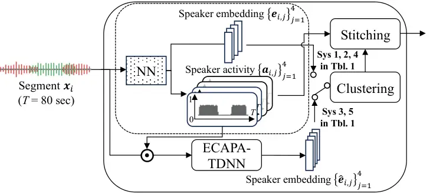
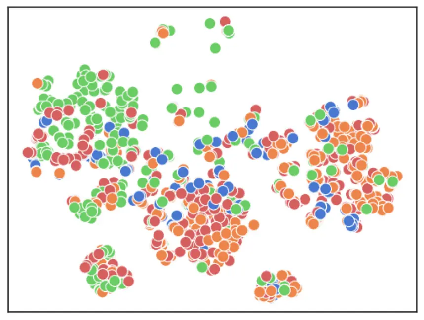
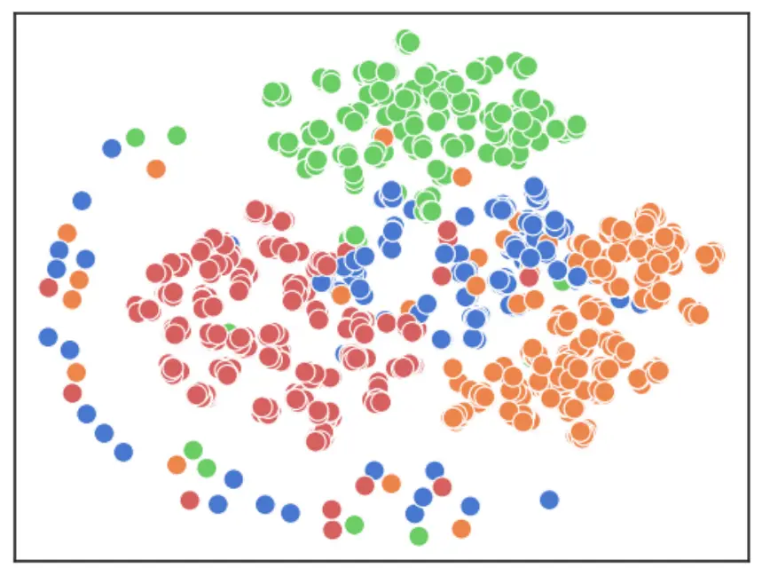
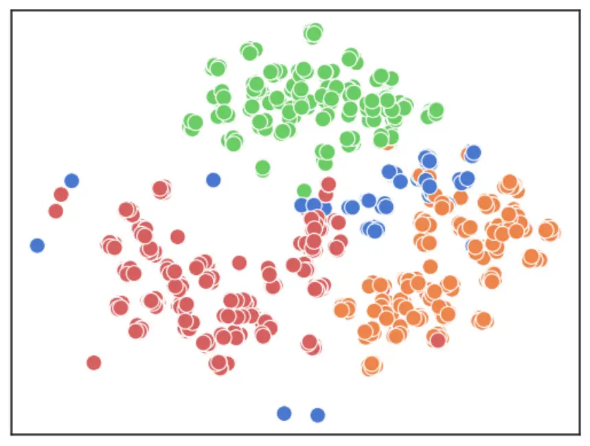

# NTT speaker diarization system for CHiME-7: multi-domain, multi-microphone End-to-end and vector clustering diarization

Naohiro Tawara    Marc Delcroix    Atsushi Ando    Atsunori Ogawa

###### Abstract

This paper details our speaker diarization system designed for
multi-domain, multi-microphone casual conversations. The proposed
diarization pipeline uses weighted prediction error (WPE)-based
dereverberation as a front end, then applies end-to-end neural
diarization with vector clustering (EEND-VC) to each channel separately.
It integrates the diarization result obtained from each channel using
diarization output voting error reduction plus overlap (DOVER-LAP). To
harness the knowledge from the target domain and results integrated
across all channels, we apply self-supervised adaptation for each
session by retraining the EEND-VC with pseudo-labels derived from
DOVER-LAP. The proposed system was incorporated into NTT’s submission
for the distant automatic speech recognition task in the CHiME-7
challenge. Our system achieved 65 % and 62 % relative improvements on
development and eval sets compared to the organizer-provided VC-based
baseline diarization system, securing third place in diarization
performance.

###### Index Terms: 

speaker diarization, end-to-end neural diarization, vector clustering,
CHiME-7 challenge

^(†)^(†)address: NTT Corporation, Japan

## 1 Introduction

⁰⁰footnotetext: ©2023 IEEE. Personal use of this material is permitted.
Permission from IEEE must be obtained for all other uses, in any current
or future media, including reprinting/republishing this material for
advertising or promotional purposes, creating new collective works, for
resale or redistribution to servers or lists, or reuse of any
copyrighted component of this work in other works

In multi-party conversational speech analysis, speaker diarization plays
an essential role in determining who speaks and when within the
recordings. Notably, it forms an important part of the preprocessing
pipeline for the automatic speech recognition (ASR) system used in
multi-party conversations \[1, 2\].

In natural multi-party settings, conversations are characterized by
their large diversity, such as dynamic speaker turn-taking, highly
overlapped speech, and a broad range of linguistic artifacts and
speaking styles. Conversations are usually recorded under varying
conditions, such as background noises, reverberations, and multiple
device configurations that include varying numbers of microphones,
positions, and types of devices. The recently proposed CHiME-7
challenge \[2\] is a typical example of such challenging conditions
consisting of natural conversations recorded with various distributed
array microphones in diverse rooms.

The diversity in natural conversation makes the speaker diarization task
extremely challenging, attracting considerable research effort \[3\].
Various diarization approaches have been proposed, including vector
clustering (VC) \[4\], target speaker voice activity detection
(TS-VAD) \[5\], end-to-end neural diarization (EEND) \[6, 7\], and EEND
combined with VC (EEND-VC) \[8, 9\].

The VC-based approach is the most popular baseline system in many
benchmarks. It accomplishes diarization by extracting speaker embeddings
for short segments and then clustering them to assign speaker labels to
each segment. However, it assumes a single speaker in each segment,
limiting the system performance on highly overlapping recordings.

The recently introduced TS-VAD \[5\] addresses the issue of overlapping
speech by utilizing a neural network that directly estimates speaker
activities from a recording and speaker embeddings. TS-VAD and its
variants have achieved state-of-the-art performance in many diarization
benchmarks \[5, 10\]. However, TS-VAD requires an initial diarization to
obtain speaker embeddings, and the VC-based approach is still required
as pre-processing for TS-VAD.

EEND \[6, 7\] is another widely-used neural diarization approach that
directly estimates the speech activity for each speaker within a
recording. While EEND can estimate speech activity without requiring
speaker embeddings, it faces challenges when applied to an arbitrarily
large number of speakers or long-duration recordings \[7\]. EEND-VC \[8,
9\] is a hybrid approach of VC and EEND that was introduced to combine
the strengths of both frameworks. It first performs EEND on the speech
segment to estimate the speaker activities and embeddings. Then, it
performs VC on the estimated speaker embeddings to stitch together the
speaker activities of the same speaker across different segments.
EEND-VC can handle overlapping speech like EEND while accommodating an
arbitrary number of speakers and long recordings like VC. The primary
limitation of neural network-based approaches, including EEND-VC, is
their tendency to overfit the training data, making it challenging to
generalize to new conditions that may involve varying noise and
recording devices. Thus, fine-tuning the model using data from the
target domain is essential \[6\]. However, obtaining sufficient data in
the target domain is not always feasible.

To tackle these issues, we introduce a novel EEND-VC-based speaker
diarization system designed for highly overlapping, multi-domain, and
multi-microphone conditions. Our system starts by applying multi-channel
weighted prediction error (WPE)-based dereverberation \[11\] and then
applies EEND-VC to individual channels. Then, the system integrates the
dirization result with diarization output voting error reduction plus
overlap (DOVER-LAP) \[12\]. Finally, the system retrains the EEND-VC
model using the channel-integrated diarization result in a
self-supervised adaptation (SSA) \[13\] manner and conducts another
round of estimation with the adapted models. Our proposed system is
incorporated into NTT’s submission for the distant automatic speech
recognition (DASR) task in the CHiME-7 challenge, outperforming the
challenge baseline with a relative diarization error rate (DER)
improvement of 65 %. It achieved the third position in the CHiME-7
challenge, showing the potential for EEND-VC.

This paper describes our system in detail and provides a thorough
analysis. The highlights of our findings are three-fold. First, our
analysis reveals that the embeddings from EEND-VC suffer from a large
speaker confusion on highly overlapping segments. However, we also show
that this issue can be mitigated by incorporating the pretrained speaker
embedding model, such as ECAPA-TDNN \[14\]. Second, we show that the
performance of EEND-VC is highly dependent on the segment length. While
sufficiently long segments (e.g., 80 seconds) are necessary to capture
speaker characteristics, overly long segments can lead to intra-segment
speaker permutation errors in activity estimation. We experimentally
show that constrained clustering plays an important role in reducing the
influence of this permutation error. Third, we show the effectiveness of
DOVER-LAP-based channel integration along with the SSA approach,
indicating that this not only refines the results on individual channels
but also elevates the overall system performance.

## 2 System description

Figure 1: Proposed multi-channel speaker diarization system.



Figure 2: Schematic diagram of EEND-VC with ECAPA-TDNN. The part
enclosed by dotted lines corresponds to the original EEND-VC. Only NN
parameters are retrained in SSA.

Figure 1 presents the overview of our diarization system. First, it
applies multi-channel WPE-based dereverberation \[11\] and EEND-VC \[6\]
to each channel separately. Then, it combines the results using
DOVER-LAP \[12\]. Finally, it performs SSA \[13\] on each session and
each microphone to retrain the EEND-VC model using labels obtained by
DOVER-LAP. We provide details of each module in the following
subsections.

### 2.1 EEND-VC-based diarization

Figure 2 shows the EEND-VC architecture. It first divides the entire
recordings into segments $`\bm{x}_{i}\in{\mathcal{R}}^{T}`$, and then
estimates both local speaker activities
$`\{\bm{a}_{i,j}\in[0,1]^{T}\}_{j=1}^{S}`$ and the local speaker
embeddings $`\bm{e}_{i}=\{\bm{e}_{i,j}\in{\mathcal{R}}^{D}\}_{j=1}^{S}`$
for each segment as

```math
\{\bm{a}_{i},\bm{e}_{i}\}={\rm NN}(\bm{x}_{i}), \tag{1}
```

where $`{\rm NN}`$ denotes the encoder in EEND-VC, and $`S`$, $`T`$, and
$`D`$ denote the number of local speakers, segment size, and embedding
dimensions, respectively.

In the upcoming experimental section, we will show that the segment size
$`T`$ significantly impacts the system’s overall performance. Notably,
utilizing long sentences improves performance by providing a greater
non-overlapping region within each segment, yielding more informative
speaker embeddings. Our framework assumes that the maximum number of
speakers throughout the recording is predetermined and does not exceed
the number of local speakers $`S`$, as stipulated by the CHiME-7
challenge regulation. This enables us to process longer segments than
that in conventional studies \[8, 9\]. We use a segment size of 80
seconds.

In addition, our experiments will also observe that the EEND-VC system
suffers from a large speaker confusion on highly overlapped segments. To
tackle this issue, we incorporate a pre-trained ECAPA-TDNN model \[14\]
into the EEND-VC system. Specifically, we employed ECAPA-TDNN to extract
the speaker embeddings $`\hat{\bm{e}}_{i,j}`$ for $`j`$-th speaker using
the speech activity estimated by EEND-VC as

```math
\hat{\bm{e}}_{i,j}={\rm ECAPA}(\bm{a}_{i,j}\odot\bm{x}_{i}). \tag{2}
```

Finally, EEND-VC performs clustering of speaker embeddings to stitch the
segments together to form the diarization results. In the EEND-VC-based
approach, each segment may contain multiple speaker embeddings, which
should be of different speakers. Accordingly, we need to introduce
constraints during the clustering process: embeddings from the same
segment must not be grouped into the same cluster. Cop-Kmeans
clustering \[15\] is suitable for this purpose, as it can strictly
impose this constraint. However, estimating the number of speakers with
this method is challenging. Instead, we adopt the following two-step
clustering procedure. First, we apply constraint agglomerative
hierarchical clustering (cAHC) \[16\] to estimate the number of speakers
under a soft constraint. We estimate the number of speakers as the
minimum between the cluster count determined by cAHC and a predefined
maximum number of speakers. We then perform a second round of clustering
using COP-K-means, which allows for stricter constraints, with the
number of clusters fixed to the estimated number of speakers.

### 2.2 Multi-channel integration

When multiple channels are available, several channel integration
approaches can be employed. For example, exploiting fine spatial
information such as spatial feature clustering or augmenting EEND with
multi-channel features \[17, 18\] can provide important clues to
discriminate speakers. However, it requires speaker tracking when the
speakers frequently move and may also be sensitive to the array
topology. An alternative is the late fusion approach, which integrates
the diarization results estimated on each channel independently \[19\].
Late fusion cannot exploit fine spatial information but may be more
robust to speaker movements and changes in the array topology because it
processes each channel independently.

We opt for the latter option in this paper and perform the diarization
on each channel independently using EEND-VC described in Section 2.1.
Then, we combine the diarization results of all the available channels
using DOVER-LAP \[12\]. For DOVER-LAP, we use the Hungarian algorithm to
find the best permutation between the diarization results of the
different channels and then combine them using a voting scheme. Some
channels may encounter difficulties such as obstacles and failure of
recording. This voting scheme can potentially mitigate the impact of
these outlier results.

### 2.3 Semi-supervised adaptation

To obtain further improvement, we adapt the EEND-VC to the individual
channel of the target session with SSA as proposed in \[13\].
Specifically, we first apply our systems to test data and obtain the
diarization result, which will serve as pseudo-labels for adaptation.
Here, we use DOVER-LAP to combine all microphones’ results as described
in section 2.2, which provides more reliable pseudo-labels. Then, we
retrain the model for each channel in each session using each test data
using the estimated label. We repeat this process multiple times to
obtain further improvement.

|      |               |         |     |      |      |                  |     |      |      |         |     |      |      |       |
| ---- | ------------- | ------- | --- | ---- | ---- | ---------------- | --- | ---- | ---- | ------- | --- | ---- | ---- | ----- |
|      |               | CHiME-6 |     |      |      | DiPCo (S26, S29) |     |      |      | Mixer 6 |     |      |      | Macro |
| ID   | Model         | CF      | FA  | MI   | DER  | CF               | FA  | MI   | DER  | CF      | FA  | MI   | DER  | DER   |
|      | Baseline      | 14.5    | 3.2 | 22.3 | 40.0 | 13.0             | 4.7 | 12.0 | 29.8 | 1.7     | 1.0 | 13.8 | 16.6 | 28.8  |
| Sys1 | EEND-VC       | 15.1    | 3.6 | 17.9 | 36.6 | 6.9              | 4.1 | 9.7  | 20.7 | 0.6     | 1.7 | 8.0  | 10.3 | 22.5  |
| Sys2 | Sys1 + WPE    | 17.9    | 3.6 | 16.6 | 38.0 | 7.0              | 3.3 | 9.1  | 19.5 | 0.2     | 1.8 | 7.8  | 9.8  | 22.4  |
| Sys3 | Sys2 w/ ECAPA | 8.9     | 3.8 | 13.3 | 28.9 | 5.6              | 3.8 | 9.2  | 18.5 | 0.2     | 1.5 | 4.2  | 9.9  | 19.1  |
| Sys4 | Sys3 + SSA    | 10.7    | 4.5 | 15.5 | 30.7 | 5.8              | 3.1 | 9.4  | 18.2 | 0.2     | 1.9 | 7.7  | 9.7  | 19.5  |
| Sys5 | Sys4 w/ ECAPA | 7.7     | 5.1 | 14.9 | 27.7 | 5.2              | 3.1 | 9.6  | 17.9 | 0.8     | 2.0 | 7.6  | 10.4 | 18.7  |

Table 1: Diarization results on the DEV set in terms of confusion (CF),
false alarm (FA), missed (MI), and DER computed with dscore
toolkit \[20\] with a collar of 0.25 sec. The best DERs for each
scenario are highlighted.

## 3 Experiments

We evaluated our system using the CHiME-7 dataset \[2\], following the
DASR task regulation.

### 3.1 Data resource

The CHiME-7 dataset comprises three subsets taken from CHiME-6 \[1\],
DiPCo \[21\], and Mixer 6 Speech \[22\]. Each subset encompasses a
specific scenario, reflecting potential real-world applications. These
scenarios differ in array topologies: 6 far-field Kinect 4-mic
microphones arrays (CHiME-6), five far-field devices with a 7-mic
circular array (DiPCo), or a heterogeneous combination of 14 microphones
(Mixer 6), as well as in diverse situations, such as dinner parties
(CHiME-6 and DiPCo) and interviews (Mixer 6). The number of speakers in
each session is not provided, but we can use the information that the
maximum number of speakers in each session is up to four. The use of
external data is restricted to a limited extent, with allowances made
for specific external data sources and pre-trained models. More detailed
data description and challenge regulations can be found in \[2\].

### 3.2 Experimental Setup

|                 | Main       | CHiME-6 | DiPCO | Mixer 6 | Macro |
| --------------- | ---------- | ------- | ----- | ------- | ----- |
| Team            | Approach   | DER     | DER   | DER     | DER   |
| USTC-NERCSLIP   | TS-VAD     | 25.1    | 16.4  | 6.1     | 15.9  |
| IOA-CAS-Speech  | TS-VAD     | 27.3    | 22.4  | 7.3     | 19.0  |
| NTT (Sys5)      | Clustering | 31.3    | 21.1  | 5.9     | 19.4  |
| NTT (Sys3)      | Clustering | 32.3    | 22.6  | 5.8     | 20.2  |
| NTT (Sys2)      | Clustering | 39.1    | 22.7  | 5.8     | 22.5  |
| Univ. Cambridge | Clustering | 48.2    | 25.6  | 10.3    | 28.0  |
| Baseline        | Clustering | 56.3    | 27.9  | 9.3     | 31.2  |

Table 2: Diarization performance comparison with top-5 participants on
EVAL set¹¹ 1 Our result shows a slight improvement over the submitted
model that was optimized for ASR tasks. All results can be found in
https://www.chimechallenge.org/current/task1/results. . The results are
sorted with Macro DER, highlighting each scenario’s best DERs.

We used the pre-trained WavLM-large to obtain the input speech features
as proposed in \[23\]. The outputs from all WavLM’s transformer layers
were averaged using learnable weights, yielding 1024-dimensional input
speech features. We used the EEND-VC model similar to that in \[23\]. It
consisted of six-stacked Transformer-encoder blocks with eight
256-dimensional attention heads. We projected the encoder’s output with
a linear layer into four output streams, each consisting of the
frame-by-frame speaker activity binary decisions and the 256-dimensional
speaker embedding.

We adopted a two-stage approach to train the EEND-VC model. First, we
trained the model using simulated multi-talker recordings of up to four
speakers. These simulated mixtures were generated following the method
described in \[6\], using data from LibriSpeech \[24\], noises from
MUSAN \[25\], and room impulse responses (RIRs) from SLR28 \[26\]. Each
mixture contained up to four speakers and had an average silence
duration of two seconds ($`\beta=2`$) between utterances from the same
speaker. We obtained 100,000 speech mixtures from this process, totaling
12,685 hours and 2,338 speakers. We then fine-tuned the model using
recordings from randomly selected channels in the CHiME-6 and Mixer 6
training sets and a part of the DiPCo development set. We used the
Mixer 6 interview training set, labeled only for interviewees. For
interviewer labels, we applied our early diarization system fine-tuned
on CHiME-6 to lapel recordings. Our training also included sessions S28,
S33, and S34 from the DiPCo development set. The total fine-tuning data
was 82 recordings, 80.3 hours, and 114 speakers.

For the first training stage, we fixed the WavLM parameters and trained
the model for 25 epochs with a learning rate of $`10^{-3}`$, a batch
size of 2048, and a segment size of 15 sec. We used the Adam optimizer
with 25000 warm-up steps. In the second stage, we fine-tuned the whole
model on segments of 80 sec for three epochs with a learning rate of
$`10^{-5}`$ and a batch size of one. For SSA, we retrained the model
using the labels obtained by the DOVER-LAP for each session and
microphone independently for two epochs with a learning rate of
$`10^{-5}`$. We repeated the SSA process twice.

During inference, we applied WPE \[11\] to remove the reverberation
before applying EEND-VC. We computed the WPE filter on the short-time
Fourier transform spectrum with a 64 ms window and a 16 ms shift. We set
the prediction delay and the filter length to two and one, respectively.
For speaker embeddings extraction, we used SpeechBrain’s
ECAPA-TDNN \[27, 14\] pretrained on 7,000+ speakers’ 2,000+ hours
utterances included in VoxCeleb1&2 \[28\].

### 3.3 Results

Table 1 shows the dirization performance on the DEV set in terms of
speaker confusion (CF), false alarm (FA), missed (MI), and DER. The
results for each scenario are reported separately, and the
macro-averaged DER across all scenarios is presented.

The first row in the table represents the result from the CHiME-7
baseline; the others are for our proposed pipeline. Systems 1, 2, and 4
performed the clustering on embeddings obtained by EEND-VC depicted as
$`\bm{e}_{i}`$ in Fig. 2. The other systems relied on ECAPA-TDNN
embeddings depicted as $`\hat{\bm{e}}_{i}`$ in Fig. 2. Notably, except
System 1, all our systems used the WPE-based dereverberation front-end.

The comparison between Systems 1 and 2 indicates that WPE contributed to
reducing MI and FA while slightly deteriorating CF. This was probably
because WPE sharpened segment boundaries but introduced minor
distortions. However, this slight deterioration in CF is inconsequential
because subsequent ECAPA-TDNN-based systems solely leverage segment
information derived from EEND-VC. The comparison between Systems 2 and 3
demonstrates that the Macro DER was reduced by 3.3 points by combining
ECAPA-TDNN embeddings with the EEND-VC framework. Particularly, a
significant reduction of CF was observed in CHiME-6. This result
indicates the limitation of the EEND-VC embeddings, probably due to the
limited speaker variability in the training set. System 4 shows the
result of the adapted model using SSA by retraining the EEND-VC (System 2) using labels derived from System 3. Compared with the pre-SSA
(System 2), SSA substantially decreased CF, improving DER across all
scenarios. Moreover, combining ECAPA-TDNN with System 4 provides a
further improvement, achieving the lowest DER in all scenarios except
for the Mixer 6.

Table 2 lists the diarization results on the evaluation set, including
the top-5 teams¹¹ 1 Our result shows a slight improvement over the
submitted model that was optimized for ASR tasks. All results can be
found in https://www.chimechallenge.org/current/task1/results. . Our
system ranked third in CHiME-6, second in DiPCO, and achieved the
first-place for Mixer6. Regarding the macro DER, our system achieved
third place. Notably, our system delivered the finest performance among
all VC-based systems.

### 3.4 Analysis

|                                                             |                                                             |                                                             |
| ----------------------------------------------------------- | ----------------------------------------------------------- | ----------------------------------------------------------- |
|  |  |  |
| \(a\) EEND-VC                                               | \(b\) ECAPA                                                 | \(c\) ECAPA + SSA                                           |

Figure 3: Visualization of embeddings obtained by our systems on S29.
Each plot corresponds to the embeddings colored by speaker labels.

Figure 3 provides a t-SNE visualization \[29\] of the embeddings
generated by our systems. Individual plots in the figure correspond to
the embeddings of segments extracted by EEND-VC or ECAPA-TDNN. The
embeddings are colored based on the speaker labels determined with
oracle clustering. This figure indicates that ECAPA-TDNN embeddings
exhibit a more distinct separation among speakers than those derived
from EEND-VC. This implies that the ECAPA-TDNN technique provides a
better feature representation for speaker diarization. This figure also
indicates that superior embeddings were obtained by applying SSA.

Figure 4: Session- and channel-wise diarization results for the
ECAPA-TDNN systems, both with and without SSA. Individual plots
represent channel-wise results, while the bars the DOVER-LAP results.

To analyze the effectiveness of DOVER-LAP and SSA, we depict the
channel-wise diarization results of randomly selected sessions derived
from ECAPA-TDNN systems with and without SSA in Fig. 4. Individual plots
represent channel-wise results, while the bars show the DOVER-LAP
results. These results indicate that the DERs were notably worse on
specific channels for the model before applying SSA. Specifically, the
channel-wise results for specific channels in session S26 were
noticeably poorer. This is likely because these channels are located
near obstacles, such as a TV, making diarization extremely challenging.
Despite this, these channel-specific errors were greatly reduced upon
applying SSA, and DOVER-LAP improved these results further. This
improvement is probably attributed to the labels used in SSA, which were
derived from the channel-integrated results. Consequently, adapting the
model to each channel reduced channel-specific errors by leveraging the
insights from other channels’ results.

Figure 5: The macro DER on the DEV set obtained based on EEND-VC and
ECAPA-TDNN embeddings, plotted against segment size.

| Algorithm         | Macro DER | \#unconstraint |
| ----------------- | --------- | -------------- |
| AHC               | 19.8      | 3405           |
| cAHC \[16\]       | 19.7      | 3060           |
| Kmeans            | 20.4      | 3849           |
| COP-Kmeans \[15\] | 19.1      | 0              |

Table 3: Performance comparison of different clustering algorithms in
the ECAPA-TDNN system (System 3). The column \#unconstraint denotes the
segment count not satisfying the clustering constraint.

Figure 5 illustrates the relationship between segment size and the macro
DER of both EEND-VC- and ECAPA-TDNN-based systems before applying SSA
(Systems 2 and 3). The red, blue, and black lines represent the results
of clustering based on EEND-VC, ECAPA-TDNN, and oracle clustering,
respectively. The solid lines depict the results obtained by extracting
embeddings excluding overlapped frames, while the dashed lines depict
the results that included these frames. This result indicates that
longer segments yield superior performance. At the same time, longer
segments deteriorated the performance of the oracle clustering. The
primary reason for this discrepancy is that although longer segments
provide richer speaker information, they also tend to cause
inner-segment speaker permutation errors. Eventually, the optimal
performance was achieved when extracting embeddings from 80-second
segments without overlaps. Notably, clustering with ECAPA-TDNN achieved
a comparative performance to the oracle clustering.

The gap in performance between results derived from clustering and those
from oracle clustering on short segments, shown in Fig. 5, suggests an
intrinsic limitation of the VC-based approach. To examine this issue, we
analyzed the local speaker activities identified by our system. We
observed inner-segment permutation errors, where the activities of
different speakers were mistakenly recognized as those of a single
speaker. This inner-segment speaker permutation error harms the
clustering process because the same speaker’s activity appeared in
different streams of the local speaker activities. The constraint in
clustering introduced in Section 2 is expected to ease this problem. To
validate this, we present the macro DER and the count of samples that
did not meet the constraint using different clustering algorithms,
including AHC, constraint AHC, Kmeans, and COP-Kmeans, in Table 3. This
result indicates that only COP-Kmeans could force all segments to
satisfy the constraint, delivering the best performance. This
underscores the importance of hard clustering constraints in mitigating
the detrimental impact of permutation errors.

## 4 Conclusion

This paper described our EEND-VC-based speaker diarization system
designed for highly overlapping, multi-domain, and multi-microphone
conditions. Our system achieved third place in the CHiME-7 challenge,
providing some findings important for the VC-based approach. In future
works, we plan to investigate applying the more sophisticated clustering
algorithm such as multi-stream VBx \[30\]. We also plan to incorporate
more sophisticated structures such as memory-aware embedding \[31\] into
EEND-VC to obtain better activity and embeddings.

## References

- \[1\] S. Watanabe, M. Mandel, J. Barker, E. Vincent, A. Arora, X.
  Chang, S. Khudanpur, V. Manohar, D. Povey, D. Raj, et al., “CHiME-6
  challenge: Tackling multispeaker speech recognition for unsegmented
  recordings,” in in CHiME-6 Workshop, 2020.
- \[2\] S. Cornell, M. Wiesner, S. Watanabe, D. Raj, X. Chang, P.
  Garcia, Y. Masuyama, Z.-Q. Wang, S. Squartini, and S. Khudanpur, “The
  CHiME-7 DASR Challenge: Distant meeting transcription with multiple
  devices in diverse scenarios,” 2023, arXiv:2306.13734.
- \[3\] T. J. Park, N. Kanda, D. Dimitriadis, K. J. Han, S. Watanabe,
  and S. Narayanan, “A review of speaker diarization: Recent advances
  with deep learning,” Computer Speech & Language, vol. 72, 2021.
- \[4\] G. Sell, D. Snyder, A. McCree, D. Garcia-Romero, J.
  Villalba, M. Maciejewski, V. Manohar, N. Dehak, D. Povey, S. Watanabe,
  et al., “Diarization is hard: Some experiences and lessons learned for
  the JHU team in the inaugural DIHARD challenge.,” in Proc.
  Interspeech, 2018, pp. 2808–2812.
- \[5\] I. Medennikov, M. Korenevsky, T. Prisyach, Y. Khokhlov, M.
  Korenevskaya, I. Sorokin, T. Timofeeva, A. Mitrofanov, A.
  Andrusenko, I. Podluzhny, A. Laptev, and A. Romanenko, “Target-speaker
  voice activity detection: A novel approach for multi-speaker
  diarization in a dinner party scenario,” in Proc. Interspeech, 2020,
  pp. 274–278.
- \[6\] Y. Fujita, N. Kanda, S. Horiguchi, K. Nagamatsu, and S.
  Watanabe, “End-to-end neural speaker diarization with permutation-free
  objectives,” in Proc. Interspeech, 2019, pp. 4300–4304.
- \[7\] S. Horiguchi, Y. Fujita, S. Watanabe, Y. Xue, and K. Nagamatsu,
  “End-to-end speaker diarization for an unknown number of speakers with
  encoder-decoder based attractors,” in Proc. Interspeech, 2020, pp.
  269–273.
- \[8\] K. Kinoshita, M. Delcroix, and N. Tawara, “Integrating
  end-to-end neural and clustering-based diarization: Getting the best
  of both worlds,” in Proc. ICASSP, 2021, pp. 7198–7202.
- \[9\] K. Kinoshita, M. Delcroix, and N. Tawara, “Advances in
  integration of end-to-end neural and clustering-based diarization for
  real conversational speech,” in Proc. Interspeech, 2021, pp.
  3565–3569.
- \[10\] M. Cheng, W. Wang, Y. Zhang, X. Qin, and M. Li,
  “Target-speaker voice activity detection via sequence-to-sequence
  prediction,” in Proc. ICASSP. IEEE, 2023, pp. 1–5.
- \[11\] T. Nakatani, T. Yoshioka, K. Kinoshita, M. Miyoshi, and B.-H.
  Juang, “Speech dereverberation based on variance-normalized delayed
  linear prediction,” IEEE Transactions on Audio, Speech, and Language
  Processing, vol. 18, no. 7, pp. 1717–1731, 2010.
- \[12\] D. Raj, P. Garcia, Z. Huang, S. Watanabe, D. Povey, A.
  Stolcke, and S. Khudanpur, “DOVER-Lap: A method for combining
  overlap-aware diarization outputs,” in Proc. SLT, 2021.
- \[13\] Y. Takashima, Y. Fujita, S. Horiguchi, S. Watanabe, L. P.
  García-Perera, and K. Nagamatsu, “Semi-supervised training with
  pseudo-labeling for end-to-end neural diarization,” in Proc.
  Interspeech, 2021, pp. 3096–3100.
- \[14\] B. Desplanques, J. Thienpondt, and K. Demuynck, “ECAPA-TDNN:
  emphasized channel attention, propagation and aggregation in TDNN
  based speaker verification,” in Proc. Interspeech, 2020, pp.
  3830–3834.
- \[15\] K. Wagstaff, C. Cardie, S. Rogers, S. Schrödl, et al.,
  “Constrained k-means clustering with background knowledge,” in Proc.
  ICML, 2001, vol. 1, pp. 577–584.
- \[16\] I. Davidson and S. S. Ravi, “Using instance-level constraints
  in agglomerative hierarchical clustering: theoretical and empirical
  results,” Data mining and knowledge discovery, vol. 18, pp.
  257–282, 2009.
- \[17\] K. Ishiguro, T. Yamada, S. Araki, T. Nakatani, and H. Sawada,
  “Probabilistic speaker diarization with bag-of-words representations
  of speaker angle information,” IEEE Transactions on Audio, Speech, and
  Language Processing, vol. 20, no. 2, pp. 447–460, 2011.
- \[18\] S. Horiguchi, Y. Takashima, P. Garcia, S. Watanabe, and Y.
  Kawaguchi, “Multi-channel end-to-end neural diarization with
  distributed microphones,” in Proc. ICASSP. IEEE, 2022, pp. 7332–7336.
- \[19\] C. Boeddeker, A. S. Subramanian, G. Wichern, R. Haeb-Umbach,
  and J. L. Roux, “TS-SEP: Joint diarization and separation conditioned
  on estimated speaker embeddings,” 2023, arXiv:2303.03849.
- \[20\] https://github.com/nryant/dscore.
- \[21\] M. Van Segbroeck, A. Zaid, K. Kutsenko, C. Huerta, T.
  Nguyen, X. Luo, B. Hoffmeister, J. Trmal, M. Omologo, and R. Maas,
  “DiPCo–Dinner party corpus,” 2019, arXiv:1909.13447.
- \[22\] L. Brandschain, D. Graff, C. Cieri, K. Walker, C. Caruso,
  and A. Neely, “The Mixer 6 corpus: Resources for cross-channel and
  text independent speaker recognition,” in Proc. LREC, 2010.
- \[23\] S. Chen, C. Wang, Z. Chen, Y. Wu, S. Liu, Z. Chen, J. Li, N.
  Kanda, T. Yoshioka, X. Xiao, J. Wu, L. Zhou, S. Ren, Y. Qian, Y.
  Qian, J. Wu, M. Zeng, X. Yu, and F. Wei, “WavLM: Large-scale
  self-supervised pre-training for full stack speech processing,” IEEE
  Journal of Selected Topics in Signal Processing, vol. 16, no. 6, pp.
  1505–1518, 2022.
- \[24\] V. Panayotov, G. Chen, D. Povey, and S. Khudanpur,
  “Librispeech: An ASR corpus based on public domain audio books,” in
  Proc. ICASSP, 2015, pp. 5206–5210.
- \[25\] D. Snyder, G. Chen, and D. Povey, “MUSAN: A music, speech, and
  noise corpus,” 2015, arXiv:1510.08484.
- \[26\] Room Impulse Response and Noise Database,
  https://www.openslr.org/28/.
- \[27\] M. Ravanelli, T. Parcollet, P. Plantinga, A. Rouhe, S.
  Cornell, L. Lugosch, C. Subakan, N. Dawalatabad, A. Heba, J. Zhong,
  J.-C. Chou, S.-L. Yeh, S.-W. Fu, C.-F. Liao, E. Rastorgueva, F.
  Grondin, W. Aris, H. Na, Y. Gao, R. D. Mori, and Y. Bengio,
  “SpeechBrain: A general-purpose speech toolkit,” 2021,
  arXiv:2106.04624.
- \[28\] A. Nagrani, J. S. Chung, W. Xie, and A. Zisserman, “Voxceleb:
  Large-scale speaker verification in the wild,” Computer Science and
  Language, 2019.
- \[29\] L. Van der Maaten and G. Hinton, “Visualizing data using
  t-sne.,” Journal of machine learning research, vol. 9, no. 11, 2008.
- \[30\] M. Delcroix, N. Tawara, M. Diez, F. Landini, A. Silnova, A.
  Ogawa, T. Nakatani, L. Burget, and S. Araki, “Multi-stream extension
  of variational Bayesian HMM clustering (MS-VBx) for combined
  end-to-end and vector clustering-based diarization,” in Proc.
  Interspeech, 2023, pp. 3477–3481.
- \[31\] M.-K. He, J. Du, Q.-F. Liu, and C.-H. Lee, “ANSD-MA-MSE:
  Adaptive neural speaker diarization using memory-aware multi-speaker
  embedding,” IEEE/ACM Transactions on Audio, Speech, and Language
  Processing, 2023.
