# A Two-Step Approach for Narrowband Source Localization in Reverberant Rooms

Wei-Ting Lai    Lachlan Birnie    Thushara Abhayapala    Amy Bastine   
Shaoheng Xu    Prasanga Samarasinghe

###### Abstract

This paper presents a two-step approach for narrowband source
localization within reverberant rooms. The first step involves
dereverberation by modeling the homogeneous component of the sound field
by an equivalent decomposition of planewaves using Iteratively
Reweighted Least Squares (IRLS), while the second step focuses on source
localization by modeling the dereverberated component as a sparse
representation of point-source distribution using Orthogonal Matching
Pursuit (OMP). The proposed method enhances localization accuracy with
fewer measurements, particularly in environments with strong
reverberation. A numerical simulation in a conference room scenario,
using a uniform microphone array affixed to the wall, demonstrates
real-world feasibility. Notably, the proposed method and microphone
placement effectively localize sound sources within the 2D-horizontal
plane without requiring prior knowledge of boundary conditions and room
geometry, making it versatile for application in different room types.

###### Index Terms: 

Source localization, reverberant environments, sparse representation,
dereverberation

^(†)^(†)address: Audio and Acoustic Signal Processing Group, The
Australian National University, Canberra, Australia

## 1 Introduction

Sound source localization plays a crucial role in various acoustic
applications, such as speech enhancement \[1, 2\], source separation
\[3, 4\], and sound field translation \[5\]. In environments with strong
reverberation, the challenge of source localization experiences a
considerable escalation. Several source localization methods have been
applied to reverberant environments, such as beamforming \[6\], MUSIC
\[7, 8\], SRP-PHAT \[9\], and CLEAN \[10\]. These methods use
statistical properties of signals to estimate source positions. However,
their performance declines significantly when processing narrowband
sources and correlated reflections.

Recently, some sparsity-based methods, such as LASSO \[11\], Orthogonal
Matching Pursuit (OMP) \[12\], and Sparse Bayesian Learning \[13\], have
been introduced to overcome the limitation of narrowband localization by
assuming sparse distribution of sources in spatial domain. Nevertheless,
these methods continue to struggle in strong reverberation due to the
interference of room reflections. Overcoming this challenge often
requires either prior knowledge of room geometry and boundary conditions
\[14\] or the use of sound field decomposition \[15\]. Sound field
decomposition entails separating the sound field into a direct component
and reverberant component and modeling room reflections as a sum of
planewaves or spherical-harmonics \[16\]. For source localization tasks,
the latter approach models room reflections through a sum of planewaves
and estimate the source positions based on the dereverberated sound
field, such as wavefield separation projector processing (WSPP) \[17\]
and sparsity-based spherical harmonics model (S-SH) \[4\]. These
approaches can handle a wide range of scenarios without requiring prior
information. However, these methods demand a large number of microphones
for modeling the reverberant component and are restricted by the
geometry of the microphone array.

In this paper, we propose a similar two-step approach of dereverberation
and sparsity based source localization that uses fewer microphones. We
first dereverberate the sound field captured in a room by modeling the
reverberant component as an equivalent planewave decomposition model
\[16\]. The second step models the dereverberated sound field as
superposition of the sparse point-sources and determine the source
positions based on the sparse equivalent source method \[18\]. We verify
the proposed method through simulations in a conference room scenario,
using a linear microphone array around the middle horizontal plane of
the wall. The proposed placement effectively captures sound field
information, while also not being constrained by room geometry. The
results demonstrate that the two-step approach using separate algorithms
improves source localization with fewer microphones, especially in rooms
with strong reverberation.

## 2 Problem Formulation

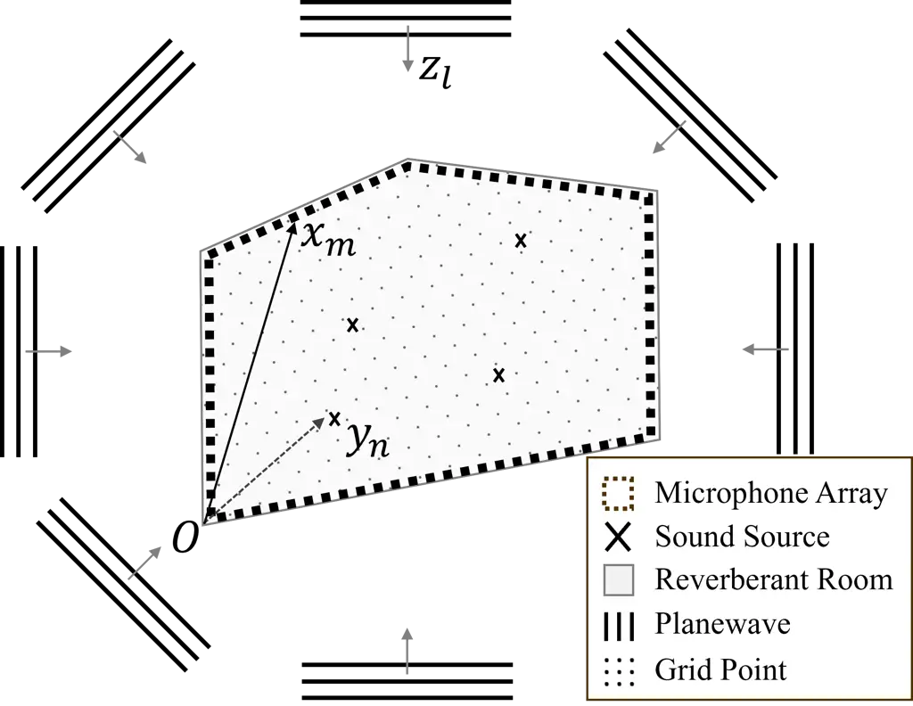

Figure 1: Framework for the proposed method.

Consider $`N`$ sound sources in a reverberant room, along with $`M`$
microphones uniformly placed affixed to the walls, as illustrated in
Fig. 1. The positions of the sound sources and microphones are defined
as $`\boldsymbol{y}_{n}\equiv(x_{n},y_{n},z_{n})`$ for $`n=1,2,\dots,N`$
and $`\boldsymbol{x}_{m}\equiv(x_{m},y_{m},z_{m})`$ for
$`m=1,2,\dots,M`$, respectively, with respect to the coordinate origin
$`O`$ at the front-left-bottom corner of the room. Note, this
configuration indicates that the $`N`$ sources are positioned inside the
microphone array.

The sound pressure received by the $`m^{\text{th}}`$ microphone is:

```math
s(k,\boldsymbol{x}_{m})={\textstyle\sum_{n=1}^{N}}G(k,\boldsymbol{x}_{m},\boldsymbol{y}_{n})\alpha_{n}(k) \tag{1}
```

where $`k=2\pi f/c`$ is the wave number, $`f`$ is frequency, $`c`$ is
the speed of sound, $`s(k,\boldsymbol{x}_{m})`$ represents the pressure,
$`G(k,\boldsymbol{x}_{m},\boldsymbol{y}_{n})`$ denotes the room transfer
function between the $`n^{\text{th}}`$ source and the $`m^{\text{th}}`$
microphone, and $`\alpha_{n}(k)`$ denotes the signal produced by the
$`n^{\text{th}}`$ source. Note that this formulation does not include
additive noise for brevity, which will be considered in the simulation.

Based on sound field decomposition \[15\] and Vekua’s theory \[16, 19\],
any reverberant sound field can be partitioned into a sum of its
particular and homogeneous solutions—equivalent to the direct and
reverberant components, respectively. Within a bounded convex region,
the reverberant sound field component can be well approximated using a
finite number of planewave functions distributed over a spherical
region. Consequently, the sound field can be expressed as a linear
combination of $`N`$ direct-path point-source Green’s function and $`L`$
planewave Green’s function. Equation (1) can thus be decomposed as
follows:

```math
\begin{split}&s(k{,}\boldsymbol{x}_{m})\approx\\
&\underbrace{\sum_{n=1}^{N}G_{0}(k{,}\boldsymbol{x}_{m}{,}\boldsymbol{y}_{n})\alpha_{n}(k)}_{\text{Direct}}{+}\underbrace{\sum_{\ell=1}^{L}W(k{,}\boldsymbol{x}_{m}{,}\hat{\boldsymbol{z}}_{\ell})\beta_{\ell}(k)}_{\text{Reverberant}}\end{split} \tag{2}
```

where
$`G_{0}(k,\boldsymbol{x}_{m},\boldsymbol{y}_{n})=e^{ik\|\boldsymbol{x}_{m}-\boldsymbol{y}_{n}\|}/({4\pi\|\boldsymbol{x}_{m}-\boldsymbol{y}_{n}\|})`$
represents the direct-path Green’s function between the
$`n^{\text{th}}`$ source and the $`m^{\text{th}}`$ microphone in a
free-field environment.
$`W(k,\boldsymbol{x}_{m},\hat{\boldsymbol{z}}_{\ell})=e^{-ik\hat{\boldsymbol{z}}_{\ell}\cdot\boldsymbol{x}_{m}}`$
represents the $`\ell^{\text{th}}`$ planewave Green’s function at
$`m^{\text{th}}`$ microphone, with $`\hat{\boldsymbol{z}}_{\ell}`$
denoting the $`\ell^{\text{th}}`$ planewave’s incident direction for
$`\ell=1,2,\dots,L`$. The coefficient $`\beta_{\ell}(k)`$ represents the
weight of the $`\ell^{\,\text{th}}`$ planewave.

In order to find the source positions, the direct component is modeled
using a dictionary of $`J`$ point-sources within the room based on the
sparse equivalent source method \[18\]. This method assumes that sound
sources exhibit quantity sparsity in spatial domain, indicating
$`N\ll J`$. Finally, equation (2) can be reformulated as follows:

```math
s(k{,}\boldsymbol{x}_{m}){\approx}\sum_{j=1}^{J}G_{0}(k{,}\boldsymbol{x}_{m}{,}\boldsymbol{y}_{j})\alpha_{j}(k){+}\sum_{l=1}^{L}W(k{,}\boldsymbol{x}_{m}{,}\hat{\boldsymbol{z}}_{\ell})\beta_{\ell}(k) \tag{3}
```

where $`G_{0}(k,\boldsymbol{x}_{m},\boldsymbol{y}_{j})`$ denotes the
free-field point-source Green’s function between the $`j^{\text{th}}`$
grid point and the $`m^{\text{th}}`$ microphone. Hence, (3) is
represented in matrix form as:

```math
\boldsymbol{\mathbf{s}}=\mathbf{G}_{0}\boldsymbol{\alpha}+\mathbf{W}\boldsymbol{\beta}, \tag{4}
```

where $`\boldsymbol{\mathbf{s}}\in\mathbb{C}^{M}`$ denotes the measured
pressure from $`M`$ microphones, and
$`\mathbf{G_{0}}\in\mathbb{C}^{M\times J}`$ and
$`\mathbf{W}\in\mathbb{C}^{M\times L}`$ represent the dictionary
matrices for point-sources and planewaves, respectively. The weight
coefficient vectors for point-sources and planewaves are denoted as
$`\boldsymbol{\alpha}\in\mathbb{C}^{J}`$ and
$`\boldsymbol{\beta}\in\mathbb{C}^{L}`$.

Equation (4) is the sound field decomposition model in reverberant
environments. As $`L`$ becomes sufficiently large, most elements of
$`\boldsymbol{\beta}`$ can be approximated as nearly zero. Additionally,
relying on the spatial sparsity assumption for sound source
distribution, the $`\boldsymbol{\alpha}`$ vector tends to also have few
non-zero elements, given that $`N`$ is significantly smaller than $`J`$.
Therefore, the weight coefficients for point-sources
$`\boldsymbol{\alpha}`$ and planewaves $`\boldsymbol{\beta}`$ can be
determined through sparse optimization, as shown below \[4\]:

```math
\underset{\boldsymbol{\alpha},\boldsymbol{\beta}}{\operatorname{argmin}}\|\boldsymbol{\alpha}\|_{1}+\lambda\|\boldsymbol{\beta}\|_{1}\quad\text{ s.t. }\mathbf{s}=\mathbf{G}_{0}\boldsymbol{\alpha}+\mathbf{W}\boldsymbol{\beta}, \tag{5}
```

where $`\lambda`$ is a regularization term.

The objective in this study is to estimate $`\boldsymbol{\alpha}`$ and
determine the corresponding $`N`$ source positions
$`\boldsymbol{y}_{n}`$ by solving (4), while assuming that the number of
sources $`N`$ is known. We propose a two-step process to solve (4) next.

## 3 Two-Step Sparse Localization Method

### 3.1 Dereverberation

For the first step, we estimate the reverberant component and perform
dereverberation. We start by rearranging (4) as:

```math
\boldsymbol{\mathbf{s}}=\boldsymbol{A}\boldsymbol{\gamma} \tag{6}
```

where
$`\boldsymbol{A=[\mathrm{G}_{0},\mathrm{W}]}{\in}\mathbb{C}^{M\times(J+L)}`$,
and
$`\boldsymbol{\gamma}=[\boldsymbol{\alpha},\boldsymbol{\beta}]{\in}\mathbb{C}^{(J+L)}`$.
In this context, we assume $`M{<}(J{+}L)`$, such that the number of
measurements is fewer than the combined total modeled point-sources
(grid points) and planewaves in the dictionary. Hence, the estimation of
$`\boldsymbol{\gamma}`$ is an underdetermined problem.

We consider solving the linear regression problem (6) through
Iteratively Reweighted Least Squares (IRLS) \[20\], exploiting an
$`\ell^{p}`$-norm approach by adding weights to $`\ell^{2}`$-norm
optimization that iteratively refine the solution’s sparsity (where
$`0<p\leq 2`$):

```math
\min_{\gamma}{\textstyle\sum_{i=1}^{\mathcal{L}}}w_{i}\boldsymbol{\gamma}_{i}^{2},\quad\text{ subject to }\mathbf{s}=A\boldsymbol{\gamma} \tag{7}
```

where $`w_{i}=|\boldsymbol{\gamma}_{i}^{(v-1)}|^{p-2}`$ are the weights
computed from the previous iteration $`\boldsymbol{\gamma}^{(v-1)}`$.
Hence, this iterative optimization is a $`\ell^{p}`$ objective function.
The next iteration $`\boldsymbol{\gamma}^{(v)}`$ is as follows:

```math
\boldsymbol{\gamma}^{(v)}=Q_{v}A^{T}(AQ_{v}A^{T})^{-1}\mathbf{s} \tag{8}
```

where $`Q_{v}`$ is the diagonal matrix with
$`1/w_{i}=|\boldsymbol{\gamma}_{i}^{(v-1)}|^{2-p}`$. We obtain the
reverberant component of the sound field from the estimated weight
coefficients of planewaves $`\boldsymbol{\hat{\beta}}`$, which is
extracted from $`\boldsymbol{\hat{\gamma}}`$. Therefore, the
dereverberation process can be represented as:

```math
\boldsymbol{\hat{\mathbf{s}}}_{0}=\boldsymbol{\mathbf{s}}-\mathbf{W}\boldsymbol{\hat{\beta}} \tag{9}
```

where $`\boldsymbol{\hat{\mathbf{s}}}_{0}`$ denotes the estimated direct
component, which we use as the dereverberated sound field component in
the subsequent source localization step.

### 3.2 Source Localization

For the second step, we re-estimate $`\boldsymbol{\alpha}`$ from the
dereverberated component using OMP. Given the spatial sparsity
assumption for sound source distribution, it follows that
$`\boldsymbol{\alpha}`$ is assumed to have $`N`$ non-zero elements.
Hence, we propose using OMP. OMP is a greedy algorithm, adapting an
iterative process to select the most relevant sound source at each step
\[21\]. By forcing inactive weights to zero, OMP improves the accuracy
of source localization estimation. Utilizing the result from (9), we
express the direct sound field component as:

```math
\boldsymbol{\hat{\mathbf{s}}}_{0}=\mathbf{G}_{0}\boldsymbol{\widetilde{\alpha}} \tag{10}
```

where $`\boldsymbol{\widetilde{\alpha}}`$ denotes the estimated
point-source weight vector determined by OMP. In practice, source
positions are found by selecting the weight coefficient with the highest
correlation in each iteration. The OMP algorithm as follows:

Input: measurements $`\hat{\mathbf{s}}_{0}`$, point-source dictionary
$`\mathbf{G}_{0}`$, number of sources $`N`$  
Output: estimated weight coefficients
$`\boldsymbol{\widetilde{\alpha}}`$, estimated source positions
$`\boldsymbol{\widetilde{y}_{n}}`$

$`\Lambda_{0}=\o,\Psi_{0}=\o,\boldsymbol{g_{i}}=\mathbf{G}_{0}[:,i]`$
for $`i\in\{1,2,\ldots,J\}`$

for $`n=1`$ to $`N`$ do

  $`\boldsymbol{\widetilde{y}_{n}}\leftarrow\arg\max_{j\in\{1,2,\ldots,J\}}|\boldsymbol{\langle\hat{\mathbf{s}}_{0}},\boldsymbol{g_{j}}\rangle|`$

  $`\Psi_{n}\leftarrow\Psi_{n-1}\cup\{\boldsymbol{\widetilde{y}_{n}}\}`$

  $`\Lambda_{n}\leftarrow\Lambda_{n-1}\cup\{\boldsymbol{g_{j}}\}`$

  $`\boldsymbol{\hat{\mathbf{s}}}_{0}\leftarrow\boldsymbol{\hat{\mathbf{s}}}_{0}-\Lambda_{n}\Lambda_{n}^{\dagger}\boldsymbol{\hat{\mathbf{s}}}_{0}`$

end for

$`\widetilde{\alpha}_{\Psi_{N}}\leftarrow\Lambda_{N}\Lambda_{N}^{\dagger}\boldsymbol{\hat{\mathbf{s}}}_{0}`$

Algorithm 1 Dereverberated OMP localization

## 4 SIMULATION RESULTS

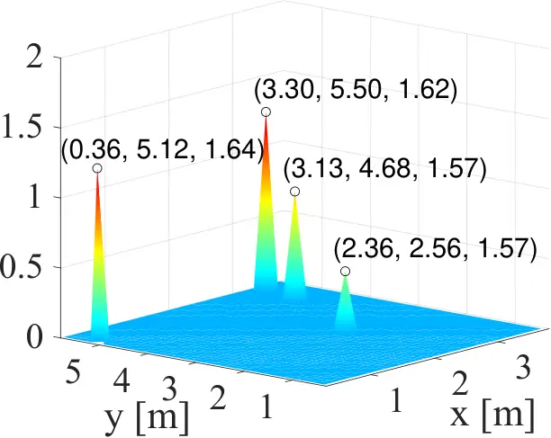

(a)

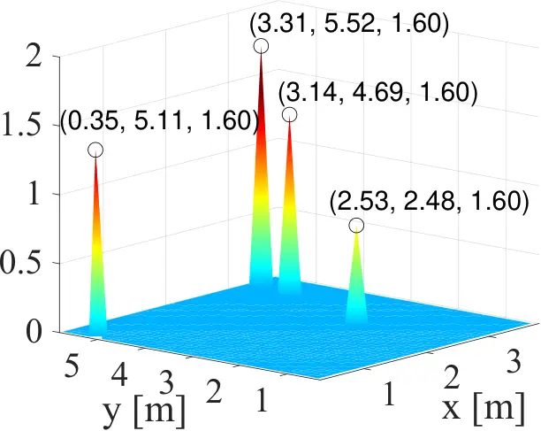

(b)

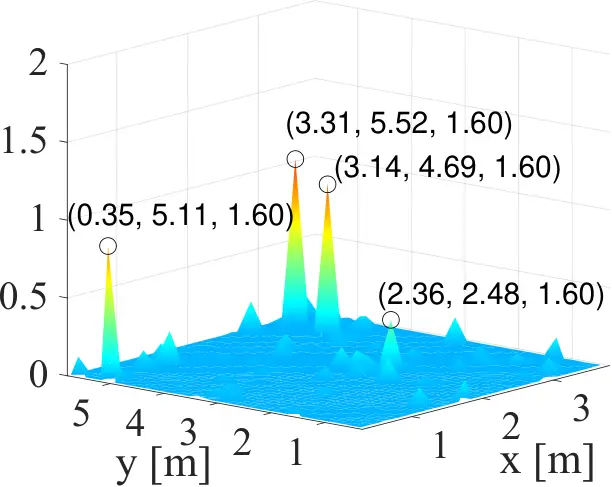

(c)

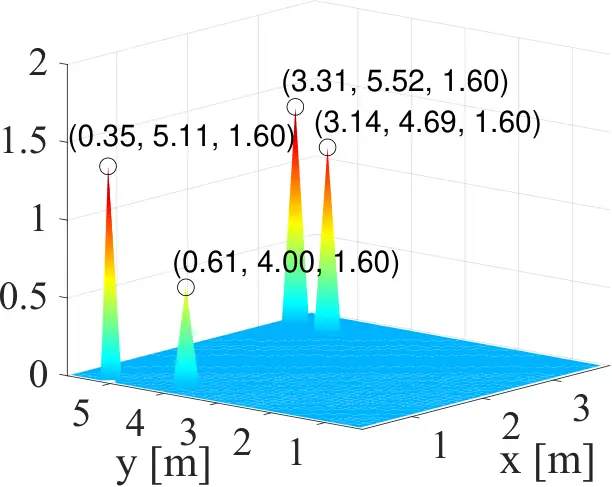

(d)

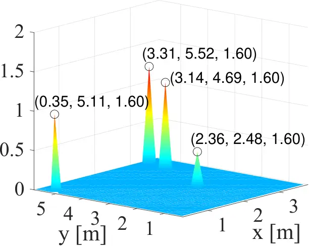

(e)

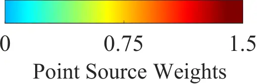

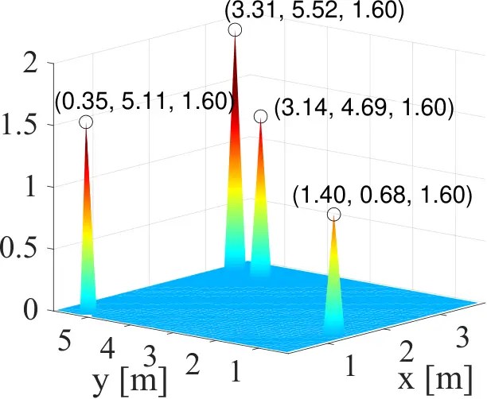

(f)

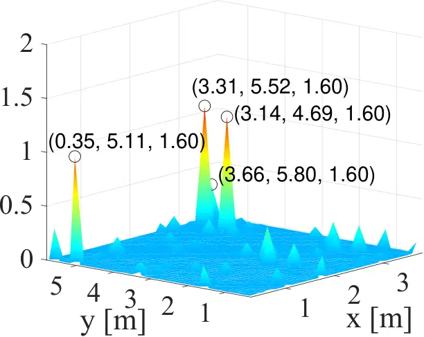

(g)

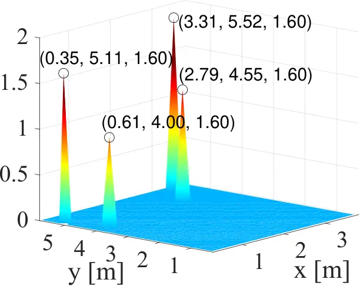

(h)

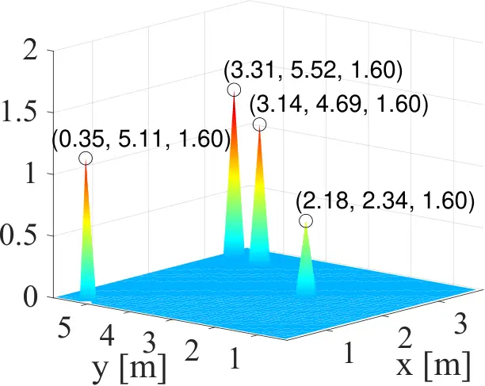

(i)

Figure 2: Point-source weights at $`f=1000`$ Hz in $`xy`$-plane of (a)
ground truth, (b,f) ND-OMP, (c,g) D-IRLS, (d,h) WSPP, and (e,i)
proposed, with (a) to (e) for $`T_{60}=0.75`$ s and (f) to (i) for
$`T_{60}=1.5`$ s.

Figure 3: Average localization errors for the four source locations at
$`f=1000`$ Hz averaged over 100 Monte Carlo tests.

In this section, we evaluate the proposed method in a simulated
reverberant room. To emulate practical scenarios, we focus on a
conference room environment with multiple participants conversing. We
assume that all sound sources are positioned at approximately 1.6 m
height from the ground sitting around the conference table. Therefore,
we evaluate the performance of the proposed method for 2D-horizontal
plane localization as this minimizes the required microphones for a
practical implementation.

We use the RIR generator toolbox \[22\] to simulate a
$`4.1\times 6.2\times 3.9`$ m reverberant room. We note that while here
we model a rectangular shoebox room, our proposed localzation method
does not rely on a known room geometry. We position $`N=4`$ sources
within the height range of $`1.55\leq z\leq 1.65`$ m. Then, we generate
the source signals by convolving the image source RIRs with clean speech
signals. We select two female and two male speech sources taken from the
MS-SNSD dataset \[23\]. The sampling frequency is 16 kHz. The
measurements SNR are 30 dB. The STFT parameters are 16384 for the frame
length with 50% overlap. The frequency bin we select is 1 kHz, as
$`k=18.48`$ while the speed of sound $`c`$ is 340 m/s. Matching the room
geometry, we use a uniform rectangular microphone array with $`M=106`$
microphones, spaced 0.2 m apart, affixed to the perimeter of the walls
at a height of $`z=1.60`$ m. For the reverberant sound field, we select
$`L=3000`$ planewaves and $`J=1600`$ point-sources (grid points) on the
$`z=1.60`$ m plane, following the 2D localization in a conference room
scenario. We assume that the reflection from ceilings and floor are
inactive. This implies that we are simulating a 2D sound field using
\[22\].

For comparison, we evaluate three other methods: non-dereverberation by
OMP (ND-OMP), WSPP \[17\], and simultaneous dereverberation and
localization by IRLS (D-IRLS). Specifically, ND-OMP estimates the source
position directly using OMP without the dereverberation step. WSPP is a
method based on planewave decomposition using OMP, eliminating the
ambient interference by a linear projection operator. D-IRLS estimates
both the direct and reverberant component simultaneously through IRLS,
thereby determining $`\boldsymbol{\alpha}`$ by solving (6). Here, we
select $`L=70`$ planewaves for WSPP and $`L=3000`$ for D-IRLS.

We first evaluate two specific cases, as shown in Fig. 2. We fix the
four source positions as detailed in Fig. 2(a). We select two sets of
wall reflection coefficients to compare the performance at different
reverberation time ($`T_{60}`$): \[$`0.9,0.93,0.94,0.94,0,0`$\] and
\[$`0.99,0.98,0.98,0.99,0,0`$\] with the reflection order of image
source model as 30, equivalent to 0.75 s and 1.5 s $`T_{60}`$,
respectively.

In Fig. 2, we present the estimated weight vector of point-sources
$`\boldsymbol{\widetilde{\alpha}}`$ compared to the true source weights
for both a high and extreme reverberation room. Fig. 2(a) shows the
ground truth. Starting with ND-OMP in (b), we see that this method can
successfully localize the sources without dereverberation when
$`T_{60}`$ is medium. However, the performance in (f) degrades when
$`T_{60}`$ is high owing to interference from room reflections. Although
D-IRLS in (c) and (g) provides a good ability to cancel interference
from room reflections, this method is unstable to obtain a sparse
solution when estimating $`\boldsymbol{\widetilde{\alpha}}`$. In figure
(d) and (h), the WSPP method is typically effective with a grid-point
microphone array \[12\], but struggles in our setup due to its
constrained microphone placements.

The proposed method as observed in (e) and (i) is seen to have the best
performance. The two-step approach offers robust localization by
combining the advantages of IRLS and OMP. IRLS excels at solving
underdetermined systems, so it is not necessary to comply
$`L\simeq 2\lceil kr\rceil+1`$, where $`r`$ is the measurement area
radius, for optimal dereverberation \[16\]. This enhances
dereverberation performance and prevents overfitting of the reverberant
component, allowing flexibility in the number of planewaves to deal with
different frequency bins. OMP then provides a strict sparse solution,
enhancing source localization and enabling source loudness estimation.

In the second evaluation, we compare the average localization errors
(LE) across 100 Monte Carlo test samples for different reverberation
scenarios. We randomly placed the four sources inside the conference
room at a height range $`1.55{\leq}z{\leq}1.65`$ m. The $`T_{60}`$ is
varied from 0.5 to 1.5 s. We define the LE between the estimated and
true source positions to evaluate the performance of the localization
methods as:

```math
\mathbf{LE}={\textstyle\frac{1}{N}}{\textstyle\sum_{n=1}^{N}}\|\boldsymbol{\widetilde{y}_{n}}-\boldsymbol{y}_{n}\|_{2} \tag{11}
```

The results of Fig. 3 show that the proposed method provides robust
source position estimation. As $`T_{60}`$ increases, the method
maintains stable LE values, while the performances of other methods
degrade. However, we note that the average LE of the proposed method at
$`T_{60}=0.5`$ s remains relatively high, primarily due to the magnitude
differences among different sources. Specifically, if the magnitude of
one source is much lower than of the other sources, localizing this
particular source becomes challenging because it might be regarded as
noise when using sparse recovery methods. The presented results
illustrated the robust performance achieved in 2D horizontal-plane
localization. However, it is worth to note that the proposed method can
be extended to 3D scenarios with 3D point-source and planewave
dictionaries, and a 3D microphone array.

## 5 CONCLUSION

In this paper, we have introduced an enhanced method for narrowband
source localization in reverberant environments. Based on sparse
representation and planewave dereverberation, the two-step approach
improves the localization accuracy by estimating the direct and
reverberant component separately. The simulation results show that the
proposed method can effectively localize multiple sources with a reduced
number of measurements, particularly in scenarios with high $`T_{60}`$.
Moreover, our method overcomes the overfitting problem in planewave
decomposition, allowing for a more flexible and straightforward
determination of planewave quantities. The scope of future work includes
resolving the magnitude issue in sparse recovery algorithms and
considering wideband scenarios to reduce microphones further.

## References

- \[1\] Y. Peled and B. Rafaely, “Linearly-constrained minimum-variance
  method for spherical microphone arrays based on plane-wave
  decomposition of the sound field,” IEEE Trans. Audio, Speech, Language
  Process., vol. 21, no. 12, pp. 2532–2540, 2013.
- \[2\] A. Xenaki, J. B. Boldt, and M. G. Christensen, “Sound source
  localization and speech enhancement with sparse bayesian learning
  beamforming,” J. Acoust. Soc. Amer., vol. 143, no. 6, pp.
  3912–3921, 2018.
- \[3\] A. Fahim, P. N. Samarasinghe, and T. D. Abhayapala, “Sound field
  separation in a mixed acoustic environment using a sparse array of
  higher order spherical microphones,” in 2017 Hands-free Speech
  Communications and Microphone Arrays (HSCMA). IEEE, 2017, pp. 151–155.
- \[4\] M. Pezzoli, M. Cobos, F. Antonacci, and A. Sarti,
  “Sparsity-based sound field separation in the spherical harmonics
  domain,” in Proc. IEEE Int. Conf. Acoust., Speech, Signal Process.,
  2022, pp. 1051–1055.
- \[5\] L. McCormack, A. Politis, T. McKenzie, C. Hold, and V. Pulkki,
  “Object-based six-degrees-of-freedom rendering of sound scenes
  captured with multiple ambisonic receivers,” J. Audio Eng. Soc, vol.
  70, no. 5, pp. 355–372, 2022.
- \[6\] B. D. Van Veen and K. M. Buckley, “Beamforming: A versatile
  approach to spatial filtering,” IEEE ASSP Magazine, vol. 5, no. 2, pp.
  4–24, 1988.
- \[7\] E. D. Di Claudio and R. Parisi, “Waves: Weighted average of
  signal subspaces for robust wideband direction finding,” IEEE Trans.
  Signal Process., vol. 49, no. 10, pp. 2179–2191, 2001.
- \[8\] L. Birnie, T. D. Abhayapala, H. Chen, and P. N. Samarasinghe,
  “Sound source localization in a reverberant room using harmonic based
  music,” in Proc. IEEE Int. Conf. Acoust., Speech, Signal Process.,
  2019, pp. 651–655.
- \[9\] J. H. DiBiase, H. F. Silverman, and M. S. Brandstein, “Robust
  localization in reverberant rooms,” in Microphone arrays: signal
  processing techniques and applications, pp. 157–180. Springer, 2001.
- \[10\] J. A. Högbom, “Aperture synthesis with a non-regular
  distribution of interferometer baselines,” Astronomy and Astrophysics
  Supplement, vol. 15, pp. 417, 1974.
- \[11\] R. Tibshirani, “Regression shrinkage and selection via the
  lasso,” Journal of the Royal Statistical Society Series B: Statistical
  Methodology, vol. 58, no. 1, pp. 267–288, 1996.
- \[12\] G. Chardon and L. Daudet, “Source localization in reverberant
  rooms using sparse modeling and narrowband measurements,” arXiv
  preprint arXiv:1307.4894, 2013.
- \[13\] G. Ping, E. Fernandez-Grande, P. Gerstoft, and Z. Chu,
  “Three-dimensional source localization using sparse bayesian learning
  on a spherical microphone array,” J. Acoust. Soc. Amer., vol. 147,
  no. 6, pp. 3895–3904, 2020.
- \[14\] J. Le Roux, P. T. Boufounos, K. Kang, and J. R. Hershey,
  “Source localization in reverberant environments using sparse
  optimization,” in Proc. IEEE Int. Conf. Acoust., Speech, Signal
  Process., 2013, pp. 4310–4314.
- \[15\] S. Koyama and L. Daudet, “Sparse representation of a spatial
  sound field in a reverberant environment,” IEEE J. Selected Topics
  Signal Process., vol. 13, no. 1, pp. 172–184, 2019.
- \[16\] A. Moiola, R. Hiptmair, and I. Perugia, “Plane wave
  approximation of homogeneous helmholtz solutions,” Zeitschrift für
  angewandte Mathematik und Physik, vol. 62, pp. 809–837, 2011.
- \[17\] G. Chardon, T. Nowakowski, J. de Rosny, and L. Daudet, “A blind
  dereverberation method for narrowband source localization,” IEEE J.
  Selected Topics Signal Process., vol. 9, no. 5, pp. 815–824, 2015.
- \[18\] E. Fernandez-Grande, A. Xenaki, and P. Gerstoft, “A sparse
  equivalent source method for near-field acoustic holography,” J.
  Acoust. Soc. Amer., vol. 141, no. 1, pp. 532–542, 2017.
- \[19\] I. N. Vekua, D. E. Brown, and A. B. Tayler, “New methods for
  solving elliptic equations,” North Holland, 1967.
- \[20\] R. Chartrand and W. Yin, “Iteratively reweighted algorithms for
  compressive sensing,” in Proc. IEEE Int. Conf. Acoust., Speech, Signal
  Process., 2008, pp. 3869–3872.
- \[21\] J. A. Tropp and A. C. Gilbert, “Signal recovery from random
  measurements via orthogonal matching pursuit,” IEEE Trans. on
  Information Theory, vol. 53, no. 12, pp. 4655–4666, 2007.
- \[22\] E. A. P. Habets, “Room impulse response generator,” Technische
  Universiteit Eindhoven, Tech. Rep, vol. 2, no. 2.4, pp. 1, 2006.
- \[23\] C. K. A. Reddy, E. Beyrami, J. Pool, R. Cutler, S. Srinivasan,
  and J. Gehrke, “A scalable noisy speech dataset and online subjective
  test framework,” Proc. Interspeech, pp. 1816–1820, 2019.
