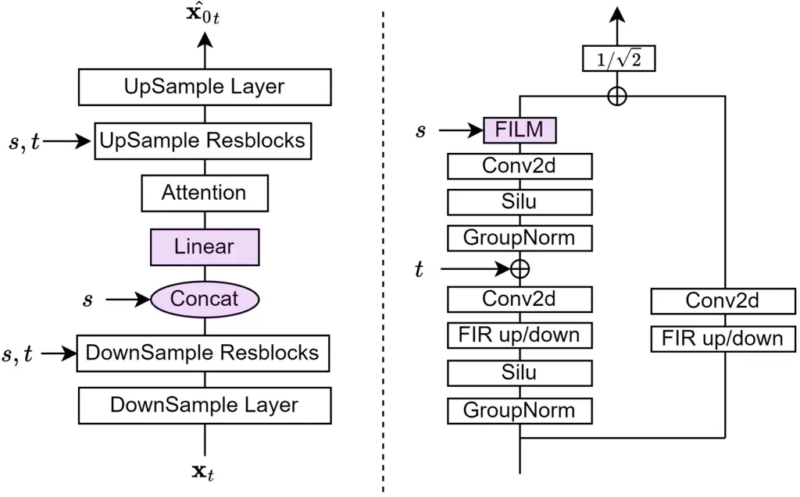
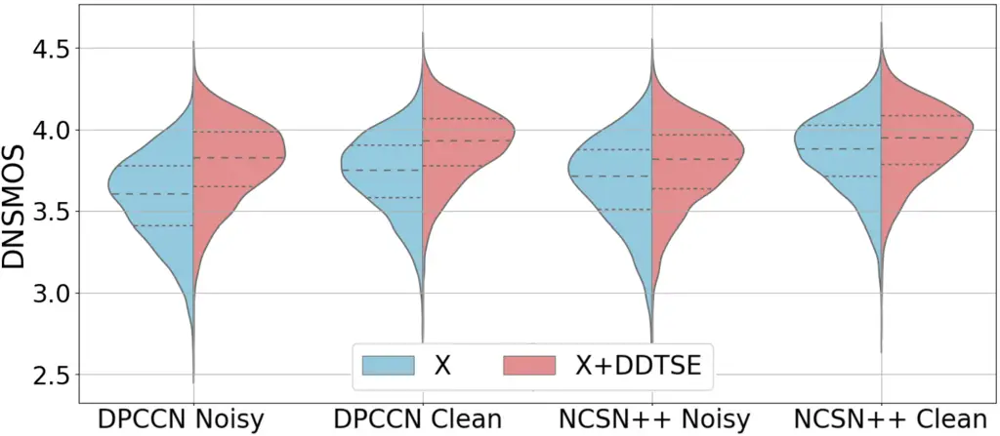

# DDTSE: DISCRIMINATIVE DIFFUSION MODEL FOR TARGET SPEECH EXTRACTION

Leying Zhang, Yao Qian, Linfeng Yu, Heming Wang Hemin Yang, Shujie Liu,
Long Zhou, Yanmin Qian ^(†)^(†)thanks: ^(†) Work done during an
internship at Microsoft.^(†)^(†)thanks: ^(‡) Corresponding author.

###### Abstract

Diffusion models have gained attention in speech enhancement tasks,
providing an alternative to conventional discriminative methods.
However, research on target speech extraction under multi-speaker noisy
conditions remains relatively unexplored. Moreover, the superior quality
of diffusion methods typically comes at the cost of slower inference
speed. In this paper, we introduce the Discriminative Diffusion model
for Target Speech Extraction (DDTSE). We apply the same forward process
as diffusion models and utilize the reconstruction loss similar to
discriminative methods. Furthermore, we devise a two-stage training
strategy to emulate the inference process during model training. DDTSE
not only works as a standalone system, but also can further improve the
performance of discriminative models without additional retraining.
Experimental results demonstrate that DDTSE not only achieves higher
perceptual quality but also accelerates the inference process by 3 times
compared to the conventional diffusion model.

###### Index Terms: 

target speech extraction, speech enhancement, diffusion model,
discriminative model

^(†)^(†)address: ¹Auditory Cognition and Computational Acoustics Lab  
MoE Key Lab of Artificial Intelligence, AI Institute  
Department of Computer Science and Engineering, Shanghai Jiao Tong
University, Shanghai, China  
²Microsoft, USA

## 1 Introduction

The cocktail party effect, also known as “selective hearing”, is the
ability to focus on a single speaker or conversation in a noisy
environment \[1, 2, 3\]. Target Speech Extraction (TSE) aims to emulate
human capability by isolating the clean speech of the target speaker
from a noisy mixture. It serves as a valuable tool for enhancing
downstream tasks like speech recognition and speaker verification,
attracting significant research interests \[4, 5, 6\].

Discriminative and generative models are two different approaches for
speech enhancement and target speech extraction tasks. The former learns
the best mapping between inputs and outputs, while the latter learns the
target distribution, allowing multiple valid estimates \[7\]. TSE
primarily relies on discriminative methods such as DPCCN \[8\],
SpEX \[9\] and Speakerbeam \[10\]. Despite the many advances gained from
past research, discriminative methods occasionally show limited
generalization abilities towards unseen noise types or speakers \[11,
12\].

Generative methods, particularly diffusion methods, have shown potential
in producing natural and diverse speech, thereby attracting significant
interest \[13, 14, 15\]. Previous work, such as SGMSE+ and DiffTSE \[7,
12, 16, 17\], has applied score-based diffusion models on speech
enhancement and target speech extraction. However, the discrepancy
between the forward and reverse processes of diffusion models might lead
to degradation of model performance \[18\]. Moreover, there are few
explorations for the target speech extraction task in multi-speaker
noisy environments with generative models. Furthermore, enhancing
inference efficiency remains a challenge for real-world deployment, due
to the need for dozens or even hundreds of inference steps of diffusion
models.

In this study, we introduce the Discriminative Diffusion Model for
Target Speech Extraction (DDTSE), which combines the forward processes
of the diffusion model and the training objective used in the
discriminative model. We design a two-stage training method and provide
two usage modes. Our extensive experiments reveal that DDTSE surpasses
discriminative methods in perceptual quality, particularly in noisy
conditions. Furthermore, when integrated with existing models, denoted
as X+DDTSE, it consistently surpasses standalone discriminative models
(i.e., X) and demonstrates potential as an effective plug-in
enhancement. In terms of inference efficiency, DDTSE requires only 10
steps for standalone use and 2 steps for X+DDTSE, respectively. The main
contributions of the paper can be summarized as follows:

1\) We introduce DDTSE, an advanced frequency domain TSE model,
utilizing the forward process of the diffusion model and the
reconstruction objective of the discriminative model. It is not only
applicable in multi- and single-speaker scenarios but also effective in
processing environmental noise.

2\) We design a two-stage training process. It learns to extract the
clean speech given to the target speaker embedding in the first stage
and aims to bridge the gap between training and inference in the second
stage.

3\) We provide two usage modes for versatility. DDTSE-only operates as a
standalone system for end-to-end TSE, and X+DDTSE rectifies existing
discriminative models to enhance overall system performance. Audio
samples¹¹ 1 https://vivian556123.github.io/slt2024-ddtse/are available.

## 2 RELATED WORK

### 2.1 Discriminative models

For an extended period, discriminative methods have been the preferred
approach for tasks related to speech enhancement and target speech
extraction, such as DPCCN \[8\] and Speakerbeam \[10\]. These approaches
mainly utilize supervised learning to learn an optimized deterministic
mapping between corrupted speech $`y`$ and the corresponding clean
speech target $`x`$ as in Fig.1c. However, these models may result in
unpleasant speech distortions and limit generalization abilities towards
unseen noise types or speakers \[11\].

### 2.2 Diffusion models

Recently, there are various diffusion models, especially score-based
diffusion models, designed for speech enhancement and target speech
extraction tasks \[7, 12, 15, 16, 17, 19, 20\]. The forward process is
defined through a linear stochastic differential equation (SDE) and
gradually turns data into noise. The reverse process is to sample a
target data point from Gaussian noise and invert this process with a
reverse-time SDE. The forward and reverse process of score-based
diffusion methods is shown in Fig.1a and b.

As introduced in \[12, 20\], the forward process is modeled as the
solution to an SDE as in Eq.1, where $`\mathbf{y}`$ is the spectrogram
of corrupted speech, $`\mathbf{x}_{0}`$ is the spectrogram of target
clean speech, $`\mathbf{x}_{t}`$ is the state of the process at time
$`t\in[0,T]`$, $`\mathbf{f}`$ and $`g`$ are drift and diffusion
coefficient function parameterized by
$`\gamma,\sigma_{\max},\sigma{\min}`$. $`\mathbf{w}`$ is the standard
Wiener process.

```math
\mathrm{d}\mathbf{x}_{t}=\underbrace{\gamma\left(\mathbf{y}-\mathbf{x}_{t}\right)}_{\mathbf{f}\left(\mathbf{x}_{t},\mathbf{y}\right)}\mathrm{d}t+\underbrace{\left[\sigma_{\min}\left(\frac{\sigma_{\max}}{\sigma_{\min}}\right)^{t}\sqrt{2\log\left(\frac{\sigma_{\max}}{\sigma_{\min}}\right)}\right]}_{g(t)}\mathrm{d}\mathbf{w} \tag{1}
```

Eq.1 describes a Gaussian process, the mean and variance of
$`{\mathbf{x}_{t}}_{t\in[0,T]}`$ can be derived as in Eq.2 and 3, when
its initial conditions are known \[21\]. The solution for
$`\mathbf{x}_{t}`$, called perturbation kernel, is shown in Eq.4. In
practice, we sample each $`\mathbf{x}_{t}`$ through Eq.5, and the random
noise is $`\mathbf{z}\sim\mathcal{N}(0,\mathbf{I})`$.

```math
\mu(\mathbf{x}_{0},\mathbf{y},t)=\exp^{-\gamma t}\mathbf{x}_{0}+(1-\exp^{-\gamma t})\mathbf{y} \tag{2}
```

```math
\sigma(t)^{2}=\frac{\sigma_{\min}^{2}\left(\left(\sigma_{\max}/\sigma_{\min}\right)^{2t}-\exp^{-2\gamma t}\right)\log\left(\sigma_{\max}/\sigma_{\min}\right)}{\gamma+\log\left(\sigma_{\max}/\sigma_{\min}\right)} \tag{3}
```

```math
q(\mathbf{x}_{t}|\mathbf{x}_{0},\mathbf{y})=\mathcal{N}(\mathbf{x}_{t};\mu(\mathbf{x}_{0},\mathbf{y},t),\sigma(t)^{2}) \tag{4}
```

```math
\mathbf{x}_{t}=\mu(x_{0},\mathbf{y},t)+\sigma(t)\mathbf{z} \tag{5}
```

For each SDE in the form of Eq.1, the corresponding reverse-time SDE is
defined by Eq.6, where $`\mathrm{d}t`$ is a negative timestep in the
reverse process \[22\]. We can train a neural network to approximate
$`\nabla_{\mathbf{x}_{t}}\log p_{t}(\mathbf{x}_{t}|\mathbf{y})`$, which
is the score of the perturbation kernel. According to \[23, 24\], the
loss function takes the form in Eq.8.

```math
\mathrm{d}\mathbf{x}_{t}=\left[f\left(\mathbf{x}_{\mathbf{t}},\mathbf{y}\right)-g(t)^{2}\nabla_{\mathbf{x}_{t}}\log p_{t}(\mathbf{x}_{t}|\mathbf{y})\right]\mathrm{d}t+g(t)\mathrm{d}\mathbf{w} \tag{6}
```

```math
\mathrm{d}\mathbf{x}_{t}\approx\left[f\left(\mathbf{x}_{\mathbf{t}},\mathbf{y}\right)-g(t)^{2}s_{\theta}\left(\mathbf{x}_{t},\mathbf{y},t\right)\right]\mathrm{d}t+g(t)\mathrm{d}\mathbf{w} \tag{7}
```

```math
\underset{\theta}{\min}\mathbb{E}_{(\mathbf{x}_{0},\mathbf{x}_{t})\sim q(x_{0})q(\mathbf{x}_{t}|\mathbf{x}_{0},\mathbf{y}),s,t}\left[\left\|\mathbf{s}_{\theta}\left(\mathbf{x}_{t},\mathbf{y},t\right)+\frac{\mathbf{z}}{\sigma(t)}\right\|_{2}^{2}\right] \tag{8}
```

These diffusion methods can generate natural speech, however, as shown
in Fig.1a and b, there exists a discrepancy between the terminating
distribution of the forward process (the distribution of $`p_{T}`$ for
$`x`$) and the prior used for solving the reverse process at inference
(the distribution of $`p(y)`$) \[18\]. This is mainly because of the
exponential characteristic of Eq.2 that
$`x_{T}=\mu(x_{0},\mathbf{y},T)\neq\mathbf{y}`$. Moreover, diffusion
models require many inference steps to achieve good performance, and
thus impose computational pressure.

Figure 1: Comparison of score-based diffusion model, discriminative
model and our proposed model. The x-axis represents the timestep. (a)
and (b) are the forward and reverse process of score-based diffusion
model \[11, 12\]. (c) is the inference process of discriminative method
with one-step prediction. (d) is the inference process of our proposed
DDTSE-only mode. The solid gray line is the model prediction in each
step. The dashed gray line and the dotted circles are the results
obtained by adding noise according to Eq.2 and 3.

### 2.3 Combination of discriminative and diffusion models

Given that diffusion and discriminative models each possess advantages
and disadvantages, some researchers focus on combining them. At the
architectural level, StoRM \[11\] and Diffiner \[25\] leverage
pre-processed speech to guide diffusion-based model training. \[26\]
utilizes generative and discriminative decoders and fuses them. However,
they usually require fine-tuning or joint training, and cannot be used
as plug-and-play models. At the objective level, WGSL \[27\] augments
the original diffusion training objective with an L2 reconstruction loss
at each diffusion time-step. To minimize the discrepancy and accelerate
the inference process, \[28\] proposed a two-stage diffusion training
method through BBED SDE \[18\]. In the first stage, it uses the
generative denoising score matching loss, and in the second training
stage it applies the predictive loss.

Inspired by these approaches, we propose DDTSE, which combines the
forward process of the diffusion model and the training objective of the
discriminative model. It not only improves the perceptual speech quality
of discriminative models, but also achieves 3x speedup compared to the
diffusion model for inference. It is applicable for both noisy and clean
multi-speaker or single-speaker speech enhancement and target speech
extraction. Two inference modes enable DDTSE to be utilized
independently or in a rectified manner combined with other
discriminative models, thereby offering a comprehensive solution for
various scenarios.

## 3 METHODOLOGY

### 3.1 Training Method

The objective of TSE is to isolate the target speaker’s clean speech
from a mixture of multiple speakers and ambient noise. Our model
processes the mixture $`\mathbf{y}`$ to retrieve the clean speech
$`\mathbf{x}_{0}`$. We collect an enrollment speech from the target
speaker to extract the speaker embedding $`s`$ for model conditioning.

Our model consists of two processes: the forward process and the reverse
process. The forward process
$`q(\mathbf{x}_{t}|\mathbf{x}_{0},\mathbf{y})`$ is the same as the
score-based diffusion model \[12\], as shown in Fig.1a, defined in Eq.4.
It gradually turns the clean speech $`\mathbf{x}_{0}`$ into the noisy
mixture to simulate speech corruption with timestep $`t\in[0,T]`$. The
reverse process is similar to the discriminative method as shown in
Fig.1c, but it transforms speech with Gaussian noise $`\mathbf{x}_{t}`$
back to clean speech over timesteps, conditioned on the speaker
embedding $`s`$.

Although prior works mainly focus on predicting the score function
during reverse process \[12, 17\], the score-based objective does not
properly measure the perceptual quality of the estimated clean speech
because it resembles the generative loss typically utilized in
unconditional diffusion models rather than supervised speech enhancement
tasks \[27\]. To address this problem, we train the model $`f_{\theta}`$
to predict the clean speech $`\mathbf{x}_{0}`$, conditioned on the
speaker embedding $`s`$ by minimizing the conditional expectation as in
Eq.9:

```math
\min_{\theta}\mathbb{E}_{(\mathbf{x}_{0},\mathbf{x}_{t})\sim q(x_{0})q(\mathbf{x}_{t}|\mathbf{x}_{0},\mathbf{y}),s,t}\left[\|\mathbf{x}_{0}-f_{\theta}(\mathbf{x}_{t},s,t)\|^{2}_{2}\right] \tag{9}
```

In order to minimize the discrepancy caused by the exponential decay in
the forward process, with this training objective, we divide the
training process into two stages.

#### 3.1.1 First training stage

The first stage enables DDTSE to progressively learn to extract the
target speech from the conditioned target speaker embedding. Algorithm 1
shows that at each step of this stage, $`\mathbf{x}_{t}`$ is obtained
through the forward process defined in Eq.4, and then the model predicts
clean speech $`\hat{\mathbf{x}_{0}}_{t}`$. We denote
$`\hat{\mathbf{x}_{0}}_{t}`$ as the predicted clean speech at the
$`t`$th timestep. $`\mu,\sigma`$ are defined in Eq.2 and Eq.3,
respectively. We incorporate $`\lambda(t)>0`$ to control the weight of
loss at different timesteps \[29, 30\]. $`d`$ measures L2 distance.

#### 3.1.2 Second training stage

Similar to conventional diffusion models \[18\], when comparing the
first training stage (Algorithm 1) with the inference process
(Algorithm 3, to be explained later), we observe two key differences.
The first is the discrepancy between the terminating distribution of the
forward process, which is $`p_{T}`$ shown in Fig.1a, and the prior used
for inference, which is the distribution of $`p(y)`$ in Fig.1d.
Secondly, as indicated in blue, the substitution of the real value
$`\mathbf{x}_{0}`$ with the predicted version
$`\hat{\mathbf{x}_{0}}_{t+1}`$ also causes mismatch.

Hence, we design the second training stage, shown in Algorithm 2, to
imitate the inference process during training. This stage incorporates
three strategies. Strategy A simulates the first step prediction from
$`\mathbf{x}_{T}=\mathcal{N}(\mathbf{y},\sigma(t)^{2})`$ to
$`\hat{\mathbf{x_{0}}}_{T}`$, which ameliorates the first discrepancy.
Strategy B further emulates the second step prediction, as described in
Algorithm 3, making our model not only rely on real but also on
predicted values at each reverse step. The probabilities, $`{p_{1}}`$
and $`{p_{2}}`$, of employing these two strategies are increased
linearly with the progression of training epochs, as defined by Eq.10.
Strategy C maintains consistency with the first training stage but
gradually reduces its probability of sampling.

```math
p_{1}=p_{2}=\min(0.45,\frac{\text{current training epoch}}{100}) \tag{10}
```

1:  repeat

2:   Sample $`\mathbf{x}_{0},\mathbf{y}`$, $`t\sim\mathcal{U}[0,1]`$,
$`\mathbf{z}\sim\mathcal{N}(0,\mathbf{I})`$

3:   Update
$`\mathbf{x}_{t}\leftarrow\mu({\color[rgb]{0,1,1}\mathbf{x}_{0}},\mathbf{y},t)+\sigma(t)^{2}\mathbf{z}`$

4:   Update
$`\hat{\mathbf{x}_{0}}_{t}\leftarrow f_{\theta}\left(\mathbf{x}_{t},s,t\right),\lambda(t)\leftarrow\left(e^{t}-1\right)^{-1}`$

5:   Take gradient descent step on
$`\nabla_{\theta}(\lambda(t)d(\hat{\mathbf{x}_{0}}_{t},\mathbf{x}_{0}))`$

6:  until converged

Algorithm 1 First Training Stage

1:  repeat

2:   Sample $`\mathbf{x}_{0},\mathbf{y}`$, $`t\sim\mathcal{U}[0,1]`$,
$`\mathbf{z}\sim\mathcal{N}(0,\mathbf{I}),p\sim\mathcal{U}[0,1]`$

3:   if $`p<p_{1}`$ then

4:    \# Strategy A

5:    Sample $`\mathbf{x}_{t}\sim\mathcal{N}(\mathbf{y},\sigma(t)^{2})`$

6:    Update
$`\hat{\mathbf{x}_{0}}_{t}\leftarrow f_{\theta}\left(\mathbf{x}_{t},s,t\right)`$,
$`\lambda(t)\leftarrow\left(e^{t}-1\right)^{-1}`$

7:   else if $`p_{1}\leq p<p_{1}+p_{2}`$ then

8:    \# Strategy B

9:    Sample $`\mathbf{x}_{t}\sim\mathcal{N}(\mathbf{y},\sigma(t)^{2})`$

10:    Update
$`\hat{\mathbf{x}_{0}}_{t}^{\prime}\leftarrow f_{\theta}\left(\mathbf{x}_{t},s,t\right)`$
,
$`\mathbf{x}_{t}^{\prime}\leftarrow\mu(\hat{\mathbf{x}_{0}}_{t}^{\prime},\mathbf{y},t)+\sigma(t)^{2}\mathbf{z}`$

11:    Update
$`\hat{\mathbf{x}_{0}}_{t}\leftarrow f_{\theta}\left(\mathbf{x}_{t}^{\prime},s,t\right)`$,
$`\lambda(t)\leftarrow\left(e^{t}-1\right)^{-1}`$

12:   else

13:    \# Strategy C

14:    Update
$`\mathbf{x}_{t}\leftarrow\mu(\mathbf{x}_{0},\mathbf{y},t)+\sigma(t)^{2}\mathbf{z}`$

15:    Update
$`\hat{\mathbf{x}_{0}}_{t}\leftarrow f_{\theta}\left(\mathbf{x}_{t},s,t\right)`$
, $`\lambda(t)\leftarrow\left(e^{t}-1\right)^{-1}`$

16:   end if

17:   Take gradient descent step on
$`\nabla_{\theta}(\lambda(t)d(\hat{\mathbf{x}_{0}}_{t},\mathbf{x}_{0}))`$

18:  until converged

Algorithm 2 Second Training Stage

### 3.2 Inference Method

We hope that our model can not only independently realize the TSE task
but also enhance the speech quality beyond the existing TSE model, so we
propose two usage modes for inference.

#### 3.2.1 DDTSE-only

This mode functions as an end-to-end TSE model, delivering high-quality
TSE independently. It combines the one-step prediction of the
discriminative model and the randomness of the diffusion model. The
inference usage mode of DDTSE-only is illustrated in Algorithm 3 and
Figure 1d.

We start by sampling $`\mathbf{x}_{T}`$ from a normal distribution
centered on $`\mathbf{y}`$, and predict target sample
$`\hat{\mathbf{x}_{0}}_{T}`$. The first step is similar to the one-step
generation of discriminative method, and will give a coarse prediction
of the clean speech. We believe that this prediction is close to the
target clean speech, but it is missing in detail.

In order to continue rectifying this coarse prediction, similar to
training, we introduce the forward process of the diffusion model into
the DDTSE inference stage and let the model predict a more accurate
target speech than the previous step. At each step, we perform the
forward process to add random noise to the prediction results of the
previous step $`\hat{\mathbf{x}_{0}}_{t+1}`$ conditioned on
$`\mathbf{y}`$. This simulated forward process and the sample after
adding noise $`\mathbf{x}_{t}`$ are indicated by dashed gray lines and
dotted circles in Figure 1d. Then we predict the clean target sample
$`\hat{\mathbf{x}_{0}}_{t}`$ from the sample with noise
$`\mathbf{x}_{t}`$, as shown in the solid gray lines. This procedure
repeats $`T`$ times. Finally, the clean speech is obtained by performing
iSTFT on $`\hat{\mathbf{x}_{0}}_{0}`$.

1:  Sample $`\mathbf{x}_{T}\sim\mathcal{N}(\mathbf{y},\sigma(T)^{2})`$

2:  Update
$`\hat{\mathbf{x}_{0}}_{T}=f_{\theta}\left(\mathbf{x}_{T},s,T\right)`$

3:  for $`t=T-1,...,0`$ do

4:   Sample $`\mathbf{z}\sim\mathcal{N}(0,\mathbf{I})`$

5:   Update
$`\mathbf{x}_{t}\leftarrow\mu(`$$`\hat{\mathbf{x}_{0}}_{t+1}`$$`,\mathbf{y},t)+\sigma(t)^{2}\mathbf{z}`$

6:   Update
$`\hat{\mathbf{x}_{0}}_{t}\leftarrow f_{\theta}\left(\mathbf{x}_{t},s,t\right)`$

7:  end for

8:  return $`\text{iSTFT}(\hat{\mathbf{x}_{0}}_{0})`$

Algorithm 3 Inference for DDTSE-only

#### 3.2.2 X+DDTSE

Based on an existing discriminative TSE model (denoted as X), X+DDTSE
can achieve higher system performance and speech quality by rectifying
the discriminative model’s output $`\mathbf{x}_{dis}`$. Unlike
DDTSE-only mode, X+DDTSE substitutes the first step prediction
$`\hat{\mathbf{x}_{0}}_{T}`$ in Algorithm 3 with $`\mathbf{x}_{dis}`$ in
Algorithm 4 and conducts the final $`N`$ steps. Since the X’s prediction
is quite accurate, the hyper-parameter $`N`$ is set to a small number,
with the corresponding timesteps $`t`$ close to 0, in order to avoid
introducing much interference in Eq.2. Due to the few steps required,
X+DDTSE serves as an efficient speech quality optimizer that can be
applied to various discriminative models. Moreover, different from
previous work \[11\], X+DDTSE mode can be directly applied without any
fine-tuning for model X, and the required inference steps is reduced
from 50 to 2.

1:  $`\hat{\mathbf{x}_{0}}_{T-N+1}=\mathbf{x}_{dis}`$

2:  for $`t=T-N,...,0`$ do

3:   Sample $`\mathbf{z}\sim\mathcal{N}(0,\mathbf{I})`$

4:   Update
$`\mathbf{x}_{t}\leftarrow\mu(\hat{\mathbf{x}_{0}}_{t+1},\mathbf{y},t)+\sigma(t)^{2}\mathbf{z}`$

5:   Update
$`\hat{\mathbf{x}_{0}}_{t}\leftarrow f_{\theta}\left(\mathbf{x}_{t},s,t\right)`$

6:  end for

7:  return $`\text{iSTFT}(\hat{\mathbf{x}_{0}}_{0})`$

Algorithm 4 Inference for X+DDTSE

#### 3.2.3 Inference with ensemble

We repeat the inference process ten times with different random seeds to
get various speech signals, and then sum and normalize to get the final
waveform, similar to DiffTSE \[17\]. This strategy leverages randomness
and diversity, leading to a more accurate final waveform, as averaging
these outputs can reduce anomalies.

### 3.3 Model architecture



Figure 2: The overall architecture of DDTSE. Left: The model
architecture. Right: The (up/down sample) residual block in this model.

Fig.2 depicts the simplified DDTSE model architecture denoted as
$`f_{\theta}`$ in previous sections. It uses a modified NCSN++
network \[23\] as the backbone, with modified blocks indicated in
purple. The model takes speech STFT spectrogram $`\mathbf{x}_{t}`$ and a
speaker embedding $`s`$ extracted from a pre-trained speaker
verification model as input. The model operates on both real and
imaginary parts of the complex spectrogram. We utilize the SiLU
activation function \[31\]. We modify its residual block, incorporating
the FiLM mechanism of a single linear layer to perceive the target
speaker embedding $`s`$ \[32\]. We also concatenate $`s`$ with the
hidden feature within the U-Net, positioned before the self-attention
layer to enhance the feature fusion ability.

|                         |                         |           |       |       |
| ----------------------- | ----------------------- | --------- | ----- | ----- |
| Scenario                | Model                   | Objective | Noise | Steps |
| Multi Speaker Baseline  | NCSN++ \[23\]           | R         | No    | 1     |
|                         | DPCCN \[8\]             | R         | No    | 1     |
|                         | DiffTSE \[17\]          | S         | Yes   | 30    |
|                         | DiffSep \[33\]+SV\[34\] | S         | Yes   | 30    |
| Single Speaker Baseline | DCCRN \[35\]            | R         | No    | 1     |
|                         | SGMSE+ \[7\]            | S         | Yes   | 30    |
|                         | WGSL \[27\]             | S+R       | Yes   | 30    |
| Ours                    | DDTSE                   | R         | Yes   | 10    |

Table 1: Experimental setup for baselines and our model in standalone
usage mode. We abbreviate score estimation loss as S, and clean speech
reconstruction loss as R.

## 4 EXPERIMENTAL SETUP

Data: We train and evaluate our system on Libri2Mix 16kHz dataset²² 2
https://github.com/JorisCos/LibriMix \[36\], which is derived from
LibriSpeech signals \[37\] and WHAM noise \[38\]. The train-360 set is
used for training, with mix_both subset to train multi-speaker model,
and mix_single subset to train single-speaker model. For evaluation, the
multi-speaker noisy, multi-speaker clean, single-speaker clean scenarios
are mix_both, mix_clean and mix_single test set respectively. The
enrollment speech during inference is another speech of the target
speaker differing from the target speech. All data are transformed into
STFT representation with coefficients in \[7\].

|            |                              |       |        |      |        |      |                              |       |        |      |        |      |
| ---------- | ---------------------------- | ----- | ------ | ---- | ------ | ---- | ---------------------------- | ----- | ------ | ---- | ------ | ---- |
| Model      | Multi-Speaker Noisy Scenario |       |        |      |        |      | Multi-Speaker Clean Scenario |       |        |      |        |      |
|            | PESQ                         | ESTOI | SI-SDR | OVRL | DNSMOS | SIM  | PESQ                         | ESTOI | SI-SDR | OVRL | DNSMOS | SIM  |
| Mixture    | 1.08                         | 0.40  | -2.0   | 1.63 | 2.71   | 0.46 | 1.15                         | 0.54  | 0.0    | 2.65 | 3.41   | 0.54 |
| DiffTSE¹   | /                            | /     | /      | /    | /      | /    | /                            | 0.76  | 9.5    | /    | /      | /    |
| DiffSep+SV | 1.32                         | 0.60  | 4.8    | 2.78 | 3.63   | 0.62 | 1.85                         | 0.79  | 9.6    | 3.14 | 3.83   | 0.83 |
| DDTSE-only | 1.60                         | 0.71  | 7.6    | 3.28 | 3.74   | 0.71 | 1.79                         | 0.78  | 9.9    | 3.30 | 3.79   | 0.73 |
| DPCCN      | 1.74                         | 0.73  | 9.3    | 2.93 | 3.58   | 0.69 | 2.22                         | 0.83  | 13.1   | 3.05 | 3.73   | 0.82 |
|   +DDTSE   | 1.88                         | 0.75  | 9.7    | 3.19 | 3.80   | 0.76 | 2.27                         | 0.85  | 13.3   | 3.29 | 3.91   | 0.82 |
| NCSN++     | 1.55                         | 0.73  | 9.7    | 3.15 | 3.68   | 0.69 | 2.24                         | 0.86  | 13.8   | 3.28 | 3.86   | 0.85 |
|   +DDTSE   | 1.75                         | 0.77  | 10.1   | 3.24 | 3.79   | 0.76 | 2.32                         | 0.87  | 13.9   | 3.32 | 3.92   | 0.85 |

- 1
  Results were reported in  \[17\]

Table 2: Performance comparison in multi-speaker noisy and clean
scenarios. DDTSE and NCSN++ have the same model architecture. All
metrics are the higher the better.

Baselines: Table 1 illustrates the model configuration of our proposed
DDTSE and the baseline models. In the multi-speaker scenario, we
benchmark DDTSE against four baselines: NCSN++, DPCCN, DiffTSE and
DiffSep+SV. We train a discriminative model NCSN++ \[23\], applying the
same architecture as DDTSE. We reproduce DPCCN³³ 3
https://github.com/jyhan03/dpccn \[8\], a widely used discriminative TSE
model. We reproduce DiffSep⁴⁴ 4
https://github.com/fakufaku/diffusion-separation \[33\], a score-based
speech separation model, and cascade a speaker verification model \[34\]
after DiffSep for TSE. DiffTSE is a score-based diffusion model for TSE,
but it is not accessible for independent reproduction. Our comparative
analysis is based on the results reported in the original paper \[17\].
In single speaker scenario, we benchmark against four reproduced
baselines: NCSN++, DCCRN⁵⁵ 5 https://github.com/asteroid-team/asteroid
\[35\] , SGMSE+⁶⁶ 6 https://github.com/sp-uhh/sgmse \[7\], WGSL \[27\].
DCCRN is a conventional discriminative method, while the latter two are
the latest score-based diffusion methods for speech enhancement. We
re-implement WGSL by ourselves. All the speaker embedding extractor
mentioned in this paper is a ResNet34 speaker verification model
pre-trained on VoxCeleb2⁷⁷ 7
https://github.com/wenet-e2e/wespeaker \[34\]. The main distinction
between diffusion-based baseline models and proposed DDTSE lies in the
training objectives, specifically score-based versus predicting clean
data. Compared with discriminative approaches, DDTSE introduce random
noise in both the training and inference stages, which brings more
randomness and improves the perceptual quality of the generated samples.

Settings: Parameters defining the forward process in Eq. 1 is set to
$`\gamma=1.5,\sigma_{min}=0.05,\sigma_{max}=0.5`$. The STFT
representation is processed following \[12\]. We use Adam optimizer and
exponential moving average with a decay of 0.999. We use 8 NVIDIA TESLA
V100 32GB GPUs for training, with a batch size of 3 samples per GPU.
Each sample has 512 STFT frames. We train the first stage with a
learning rate of 1e-4 for 500 epochs and the second stage with a
learning rate of 5e-5 for 12 epochs. DDTSE-only executes 10 inference
steps with linearly decreased timesteps from 1 to 0. X+DDTSE performs
the last 2 steps out of a total of 10. We select the best-performing
model on 20 randomly chosen samples from the dev-set for evaluation.

Evaluation metrics: We evaluate the model performance with both
intrusive and non-intrusive speech quality metrics, i.e. with or without
clean reference signal \[39\]. Intrusive metrics include Perceptual
Evaluation of Speech Quality (PESQ) \[40\], Extended Short-Time
Objective Intelligibility (ESTOI) \[41\], Scale-invariant
Signal-to-Distortion Ratio (SI-SDR) \[42\]. Non-intrusive metrics, such
as OVRL and DNSMOS \[43, 44\], are used to assess speech quality without
clean reference. We use a ResNet34 model pre-trained on VoxCeleb2 to
extract speaker embedding for all experiments, and we calculate the
cosine speaker similarity (SIM) between speaker embedding of the
enhanced speech and the target speech  \[34\]. All metrics are the
higher the better.

## 5 RESULTS AND ANALYSIS

### 5.1 Performance in multi-speaker scenarios

Table 2 shows the performance of DDTSE against both discriminative and
generative baselines in scenarios involving multiple speakers under both
noisy and clean conditions.

In the multi-speaker noisy scenario, DDTSE-only outperforms DiffSep+SV
on all the metrics. It also demonstrates superior performance on the
metrics of OVRL and DNSMOS by comparing with discriminative models,
i.e., DPCCN and NCSN++. Notably, the X+DDTSE mode exhibits the highest
performance on all the metrics except OVRL. X+DDTSE also improves
speaker similarity score (SIM), suggesting a more accurate preservation
of individual speaker characteristics during extraction.

In the multi-speaker clean scenario, DDTSE-only surpasses the
score-based DiffTSE on the metrics of ESTOI and SI-SDR. Remarkably,
DDTSE-only model achieves this by only using a third of the reverse
iteration steps, comparing the step number reported in  \[17\]. This
indicates significant enhancements in both signal quality and
efficiency. However, it’s observed that the SIM obtained by the
DDTSE-only model is the lowest among all the TSE models. This could
potentially suggest less discrimination on speaker characteristics when
compared to other models, which we will further address in our
subsequent work.



Figure 3: Comparison of DNSMOS distribution between X+DDTSE and
corresponding discriminative model (X) DPCCN and NCSN++ in noisy and
clean scenarios. Values are the higher the better.

Fig.3 shows the DNSMOS score distributions of various models. We observe
that when combined with DPCCN and NCSN++, both models exhibit further
improvements in non-intrusive speech quality. Moreover, X+DDTSE mode
consistently enhances the performance in both noisy and clean
conditions. This suggests that the DDTSE model has potential as a plugin
in speech enhancement and extraction tasks.

|              |      |       |        |      |        |
| ------------ | ---- | ----- | ------ | ---- | ------ |
| Model        | PESQ | ESTOI | SI-SDR | OVRL | DNSMOS |
| Noisy speech | 1.16 | 0.56  | 3.5    | 1.75 | 2.63   |
| NCSN++       | 1.85 | 0.82  | 12.7   | 3.11 | 3.59   |
| SGMSE+       | 1.99 | 0.82  | 11.1   | 3.12 | 3.60   |
| WGSL         | 1.86 | 0.79  | 10.8   | 3.08 | 3.50   |
| DDTSE-only   | 2.03 | 0.83  | 12.6   | 3.33 | 3.84   |
| DDTSE-only²  | 2.01 | 0.82  | 12.2   | 3.25 | 3.75   |
| DCCRN        | 2.03 | 0.81  | 13.3   | 2.98 | 3.64   |
|   +DDTSE     | 2.24 | 0.83  | 13.7   | 3.15 | 3.77   |
|   +DDTSE²    | 2.20 | 0.83  | 13.7   | 3.18 | 3.80   |

- 2
  This model is trained on multi-speaker data

Table 3: Performance comparison for speech enhancement in single speaker
scenario. All metrics are the higher the better.

### 5.2 Performance in single-speaker scenario

Our proposed methods can be generalized to general speech enhancement
task. In the single-speaker scenario, speech extraction can be performed
without requiring additional enrollment speech. We directly extract
speaker embedding $`s`$ from noisy speech $`\mathbf{y}`$. This is made
possible due to the noise robustness of the speaker extractor \[34\].
The performance comparison in the single-speaker scenario is presented
in Table 3. It indicates that the DDTSE-only model outperforms all other
diffusion and discriminative models on all metrics, with the exception
of SI-SDR. However, SI-SDR is improved to its highest value when DCCRN
is integrated into the X+DDTSE model. This further highlights the
potential of DDTSE in enhancing performance when used in conjunction
with other models. Furthermore, the DDTSE model trained on multi-speaker
data achieves comparable performance as the model trained on
single-speaker data, indicating the generalization and robustness of
DDTSE model. We can also employ enrollment speech, as in multi-speaker
scenarios, but this only results in a marginal performance gain.

### 5.3 Ablation study

Table 4 provides an analysis of the individual contributions from the
first training stage (T1), the second training stage (T2) and the
inference with ensemble strategy (Ensem). These results indicate that
with the same total training epochs, by omitting T2 (S1) worsens all
metrics, highlighting the necessity for the second training stage. S2
shows that Ensem improves intrusive metrics but slightly reduces
non-intrusive quality, suggesting that averaging speech with diversity
may introduce undesired distortion. Only training with T1 or T2, as
shown by S3 and S4, results in a performance decrease on intrusive
metrics. Only training with T2 (S4) also causes speaker similarity
degradation.

Moreover, we experimentally find that T2 cannot be trained for too many
epochs. Strategy A, introduced in Section 3.1.2, provides one-step
coarse prediction of the clean speech at the initial timestep, but it is
not precise in detail. Strategy B integrates this prediction into
diffusion forward process and deduces a more accurate result. If these
strategies are over-presented as training time increases, the resulting
estimation errors will lead to sub-optimal performance \[15, 45\].
Consequently, we limit the training of the second stage to only 12
epochs, as outlined in Section 4.

|     |     |     |       |       |        |      |        |      |
| --- | --- | --- | ----- | ----- | ------ | ---- | ------ | ---- |
| \#  | T1  | T2  | Ensem | ESTOI | SI-SDR | OVRL | DNSMOS | SIM  |
| S0  | ✓   | ✓   | ✓     | 0.71  | 7.6    | 3.28 | 3.74   | 0.71 |
| S1  | ✓   | ✗   | ✓     | 0.69  | 6.8    | 3.21 | 3.67   | 0.70 |
| S2  | ✓   | ✓   | ✗     | 0.69  | 6.7    | 3.34 | 3.82   | 0.71 |
| S3  | ✓   | ✗   | ✗     | 0.67  | 5.7    | 3.28 | 3.73   | 0.70 |
| S4  | ✗   | ✓   | ✗     | 0.66  | 6.1    | 3.27 | 3.79   | 0.61 |

Table 4: Ablation Study of DDTSE-only in multi-speaker noisy scenario.
T1 and T2 are the first and second training stages. Ensem is the
Inference with ensemble strategy.

|            |       |       |       |        |      |        |      |
| ---------- | ----- | ----- | ----- | ------ | ---- | ------ | ---- |
| Model      | Steps | RTF   | ESTOI | SI-SDR | OVRL | DNSMOS | SIM  |
| DDTSE only | 1     | 0.093 | 0.45  | 0.9    | 2.77 | 3.09   | 0.44 |
|            | 5     | 0.273 | 0.64  | 4.9    | 3.20 | 3.59   | 0.66 |
|            | 10    | 0.501 | 0.67  | 5.7    | 3.28 | 3.73   | 0.70 |
|            | 15    | 0.728 | 0.68  | 5.9    | 3.29 | 3.78   | 0.71 |
|            | 20    | 0.954 | 0.68  | 5.9    | 3.28 | 3.80   | 0.71 |
|            | 30    | 1.415 | 0.67  | 5.6    | 3.24 | 3.81   | 0.71 |
| X+ DDTSE   | 1     | 0.093 | 0.73  | 9.4    | 3.01 | 3.65   | 0.71 |
|            | 2     | 0.139 | 0.75  | 9.4    | 3.18 | 3.81   | 0.76 |
|            | 3     | 0.183 | 0.75  | 9.4    | 3.26 | 3.84   | 0.76 |
|            | 4     | 0.234 | 0.76  | 9.2    | 3.29 | 3.83   | 0.75 |

Table 5: Comparison with varying inference steps of DDTSE-only and
X+DDTSE modes in multi-speaker noisy scenario.

### 5.4 Inference speed

Table 5 presents the Real-Time-Factor (RTF), speech quality, and speaker
similarity of the generated speech across various inference steps. The
RTF=$`\frac{\text{processing time}}{\text{speech duration}}`$ is
measured on a single V100 and serves as an efficiency indicator. We
notice that the performance improvements of the DDTSE-only along with
the increasing number of steps tend to plateau beyond 10 steps.
Furthermore, in the X+DDTSE mode, where X means DPCCN, we can achieve
robust performance from as few as 2 steps, showcasing rapid processing
without sacrificing quality and further eliminating the constraints of
slow processing speeds of diffusion models. Utilizing our proposed DDTSE
inference algorithm, we achieve significant reductions in the number of
inference steps. According to the steps reported in  \[12\] and  \[11\],
our approaches decrease the steps from 30 to 10 for the DDTSE-only mode,
and from 50 to 2 for the X+DDTSE mode, respectively.

## 6 CONCLUSION

We present DDTSE, which combines discriminative training objective and
diffusion forward process, designed for target speech extraction and
enhancement in multi-speaker and single-speaker scenarios under both
noisy and clean conditions. Experimental results demonstrate its
effectiveness and efficiency, both as a standalone model and as an
additional rectified model. In the next steps, we will further
investigate its potential in other speech generation tasks.

## 7 ACKNOWLEDGMENTS

This work was supported in part by China STI 2030-Major Projects under
Grant No. 2021ZD0201500, in part by China NSFC projects under Grants
62122050 and 62071288, and in part by Shanghai Municipal Science and
Technology Commission Project under Grant 2021SHZDZX0102.

## References

- \[1\] Adelbert W Bronkhorst, “The cocktail party phenomenon: A review
  of research on speech intelligibility in multiple-talker conditions,”
  Acta Acustica united with Acustica, vol. 86, no. 1, pp. 117–128, 2000.
- \[2\] Katerina Zmolikova, Marc Delcroix, Tsubasa Ochiai, Keisuke
  Kinoshita, Jan Černockỳ, and Dong Yu, “Neural target speech
  extraction: An overview,” IEEE Signal Processing Magazine, vol. 40,
  no. 3, pp. 8–29, 2023.
- \[3\] Yan-min Qian, Chao Weng, Xuan-kai Chang, Shuai Wang, and Dong
  Yu, “Past review, current progress, and challenges ahead on the
  cocktail party problem,” Frontiers of Information Technology &
  Electronic Engineering, vol. 19, pp. 40–63, 2018.
- \[4\] Marc Delcroix, Katerina Zmolikova, Keisuke Kinoshita, Atsunori
  Ogawa, and Tomohiro Nakatani, “Single channel target speaker
  extraction and recognition with speaker beam,” in ICASSP. IEEE, 2018,
  pp. 5554–5558.
- \[5\] Leying Zhang, Zhengyang Chen, and Yanmin Qian, “Enroll-aware
  attentive statistics pooling for target speaker verification,” 2022,
  pp. 311–315.
- \[6\] Quan Wang, Hannah Muckenhirn, Kevin Wilson, Prashant Sridhar,
  Zelin Wu, John Hershey, Rif A Saurous, Ron J Weiss, Ye Jia, and
  Ignacio Lopez Moreno, “Voicefilter: Targeted voice separation by
  speaker-conditioned spectrogram masking,” in Proc. INTERSPEECH
  2019, 2019.
- \[7\] Jean-Marie Lemercier, Julius Richter, Simon Welker, and Timo
  Gerkmann, “Analysing diffusion-based generative approaches versus
  discriminative approaches for speech restoration,” in ICASSP. IEEE,
  2023, pp. 1–5.
- \[8\] Jiangyu Han, Yanhua Long, Lukáš Burget, and Jan Černockỳ,
  “Dpccn: Densely-connected pyramid complex convolutional network for
  robust speech separation and extraction,” in ICASSP. IEEE, 2022, pp.
  7292–7296.
- \[9\] Chenglin Xu, Wei Rao, Eng Siong Chng, and Haizhou Li, “Spex:
  Multi-scale time domain speaker extraction network,” IEEE/ACM
  transactions on audio, speech, and language processing, vol. 28, pp.
  1370–1384, 2020.
- \[10\] Kateřina Žmolíková, Marc Delcroix, Keisuke Kinoshita, Tsubasa
  Ochiai, Tomohiro Nakatani, Lukáš Burget, and Jan Černockỳ,
  “Speakerbeam: Speaker aware neural network for target speaker
  extraction in speech mixtures,” IEEE Journal of Selected Topics in
  Signal Processing, vol. 13, no. 4, pp. 800–814, 2019.
- \[11\] Jean-Marie Lemercier, Julius Richter, Simon Welker, and Timo
  Gerkmann, “Storm: A diffusion-based stochastic regeneration model for
  speech enhancement and dereverberation,” IEEE/ACM Transactions on
  Audio, Speech, and Language Processing, 2023.
- \[12\] Julius Richter, Simon Welker, Jean-Marie Lemercier, Bunlong
  Lay, and Timo Gerkmann, “Speech enhancement and dereverberation with
  diffusion-based generative models,” IEEE/ACM Transactions on Audio,
  Speech, and Language Processing, 2023.
- \[13\] Linfeng Yu, Wangyou Zhang, Chenpeng Du, Leying Zhang, Zheng
  Liang, and Yanmin Qian, “Generation-based target speech extraction
  with speech discretization and vocoder,” in ICASSP. IEEE, 2024, pp.
  12612–12616.
- \[14\] Huy Phan, Ian V McLoughlin, Lam Pham, Oliver Y Chén, Philipp
  Koch, Maarten De Vos, and Alfred Mertins, “Improving gans for speech
  enhancement,” IEEE Signal Processing Letters, vol. 27, pp.
  1700–1704, 2020.
- \[15\] Wenxin Tai, Yue Lei, Fan Zhou, Goce Trajcevski, and Ting Zhong,
  “Dose: Diffusion dropout with adaptive prior for speech enhancement,”
  Advances in Neural Information Processing Systems, vol. 36, 2024.
- \[16\] Simon Welker, Julius Richter, and Timo Gerkmann, “Speech
  enhancement with score-based generative models in the complex stft
  domain,” in Proc. Interspeech 2022, pp. 2928–2932.
- \[17\] Naoyuki Kamo, Marc Delcroix, and Tomohiro Nakatan, “Target
  speech extraction with conditional diffusion model,” arXiv preprint
  arXiv:2308.03987, 2023.
- \[18\] Bunlong Lay, Simon Welker, Julius Richter, and Timo Gerkmann,
  “Reducing the prior mismatch of stochastic differential equations for
  diffusion-based speech enhancement,” 2023.
- \[19\] Hao Yen, François G Germain, Gordon Wichern, and Jonathan
  Le Roux, “Cold diffusion for speech enhancement,” in ICASSP. IEEE,
  2023, pp. 1–5.
- \[20\] Theodor Nguyen, Guangzhi Sun, Xianrui Zheng, Chao Zhang, and
  Philip C Woodland, “Conditional diffusion model for target speaker
  extraction,” arXiv preprint arXiv:2310.04791, 2023.
- \[21\] Simo Särkkä and Arno Solin, Applied stochastic differential
  equations, vol. 10, Cambridge University Press, 2019.
- \[22\] Brian DO Anderson, “Reverse-time diffusion equation models,”
  Stochastic Processes and their Applications, vol. 12, no. 3, pp.
  313–326, 1982.
- \[23\] Yang Song, Jascha Sohl-Dickstein, Diederik P Kingma, Abhishek
  Kumar, Stefano Ermon, and Ben Poole, “Score-based generative modeling
  through stochastic differential equations,” in International
  Conference on Learning Representations, 2021.
- \[24\] Pascal Vincent, “A connection between score matching and
  denoising autoencoders,” Neural computation, vol. 23, no. 7, pp.
  1661–1674, 2011.
- \[25\] Ryosuke Sawata, Naoki Murata, Yuhta Takida, Toshimitsu Uesaka,
  Takashi Shibuya, Shusuke Takahashi, and Yuki Mitsufuji, “A versatile
  diffusion-based generative refiner for speech enhancement,” in Proc.
  INTERSPEECH 2023, 2023.
- \[26\] Hao Shi, Kazuki Shimada, Masato Hirano, Takashi Shibuya,
  Yuichiro Koyama, Zhi Zhong, Shusuke Takahashi, Tatsuya Kawahara, and
  Yuki Mitsufuji, “Diffusion-based speech enhancement with joint
  generative and predictive decoders,” in ICASSP. IEEE, 2024, pp.
  12951–12955.
- \[27\] Jean-Eudes Ayilo, Mostafa Sadeghi, and Romain Serizel,
  “Diffusion-based speech enhancement with a weighted
  generative-supervised learning loss,” in ICASSP. IEEE, 2024, pp.
  12506–12510.
- \[28\] Bunlong Lay, Jean-Marie Lermercier, Julius Richter, and Timo
  Gerkmann, “Single and few-step diffusion for generative speech
  enhancement,” in ICASSP. IEEE, 2024, pp. 626–630.
- \[29\] Jonathan Ho, Ajay Jain, and Pieter Abbeel, “Denoising diffusion
  probabilistic models,” Advances in neural information processing
  systems, vol. 33, pp. 6840–6851, 2020.
- \[30\] Yibin Lu, Zhongjian Wang, and Guillaume Bal, “Understanding the
  diffusion models by conditional expectations,” arXiv preprint
  arXiv:2301.07882, 2023.
- \[31\] Stefan Elfwing, Eiji Uchibe, and Kenji Doya, “Sigmoid-weighted
  linear units for neural network function approximation in
  reinforcement learning,” Neural networks, vol. 107, pp. 3–11, 2018.
- \[32\] Ethan Perez, Florian Strub, Harm De Vries, Vincent Dumoulin,
  and Aaron Courville, “Film: Visual reasoning with a general
  conditioning layer,” in Proceedings of the AAAI conference on
  artificial intelligence, 2018, vol. 32.
- \[33\] Robin Scheibler, Youna Ji, Soo-Whan Chung, Jaeuk Byun, Soyeon
  Choe, and Min-Seok Choi, “Diffusion-based generative speech source
  separation,” in ICASSP. IEEE, 2023, pp. 1–5.
- \[34\] Hongji Wang, Chengdong Liang, Shuai Wang, Zhengyang Chen,
  Binbin Zhang, Xu Xiang, Yanlei Deng, and Yanmin Qian, “Wespeaker: A
  research and production oriented speaker embedding learning toolkit,”
  in ICASSP. IEEE, 2023, pp. 1–5.
- \[35\] Yanxin Hu, Yun Liu, Shubo Lv, Mengtao Xing, Shimin Zhang, Yihui
  Fu, Jian Wu, Bihong Zhang, and Lei Xie, “Dccrn: Deep complex
  convolution recurrent network for phase-aware speech enhancement,” in
  Proc. INTERSPEECH 2020, 2020.
- \[36\] Joris Cosentino, Manuel Pariente, Samuele Cornell, Antoine
  Deleforge, and Emmanuel Vincent, “Librimix: An open-source dataset for
  generalizable speech separation,” arXiv preprint
  arXiv:2005.11262, 2020.
- \[37\] Vassil Panayotov, Guoguo Chen, Daniel Povey, and Sanjeev
  Khudanpur, “Librispeech: an asr corpus based on public domain audio
  books,” in 2015 IEEE international conference on acoustics, speech and
  signal processing (ICASSP). IEEE, 2015, pp. 5206–5210.
- \[38\] Gordon Wichern, Joe Antognini, Michael Flynn, Licheng Richard
  Zhu, Emmett McQuinn, Dwight Crow, Ethan Manilow, and Jonathan Le Roux,
  “Wham!: Extending speech separation to noisy environments,” in Proc.
  INTERSPEECH 2019, 2019.
- \[39\] Hannes Gamper, Chandan KA Reddy, Ross Cutler, Ivan J Tashev,
  and Johannes Gehrke, “Intrusive and non-intrusive perceptual speech
  quality assessment using a convolutional neural network,” in 2019 IEEE
  Workshop on Applications of Signal Processing to Audio and Acoustics.
  IEEE, 2019, pp. 85–89.
- \[40\] Antony W Rix, John G Beerends, Michael P Hollier, and Andries P
  Hekstra, “Perceptual evaluation of speech quality (pesq)-a new method
  for speech quality assessment of telephone networks and codecs,” in
  2001 International Conference on acoustics, speech, and signal
  processing. Proceedings (Cat. No. 01CH37221). IEEE, 2001, vol. 2, pp.
  749–752.
- \[41\] Jesper Jensen and Cees H Taal, “An algorithm for predicting the
  intelligibility of speech masked by modulated noise maskers,” IEEE/ACM
  Transactions on Audio, Speech, and Language Processing, vol. 24, no.
  11, pp. 2009–2022, 2016.
- \[42\] Jonathan Le Roux, Scott Wisdom, Hakan Erdogan, and John R
  Hershey, “Sdr–half-baked or well done?,” in ICASSP. IEEE, 2019, pp.
  626–630.
- \[43\] Chandan KA Reddy, Vishak Gopal, and Ross Cutler, “Dnsmos: A
  non-intrusive perceptual objective speech quality metric to evaluate
  noise suppressors,” in ICASSP. IEEE, 2021, pp. 6493–6497.
- \[44\] Chandan KA Reddy, Vishak Gopal, and Ross Cutler, “Dnsmos p.
  835: A non-intrusive perceptual objective speech quality metric to
  evaluate noise suppressors,” in ICASSP. IEEE, 2022, pp. 886–890.
- \[45\] Rongjie Huang, Zhou Zhao, Huadai Liu, Jinglin Liu, Chenye Cui,
  and Yi Ren, “Prodiff: Progressive fast diffusion model for
  high-quality text-to-speech,” in Proceedings of the 30th ACM
  International Conference on Multimedia, 2022, pp. 2595–2605.
