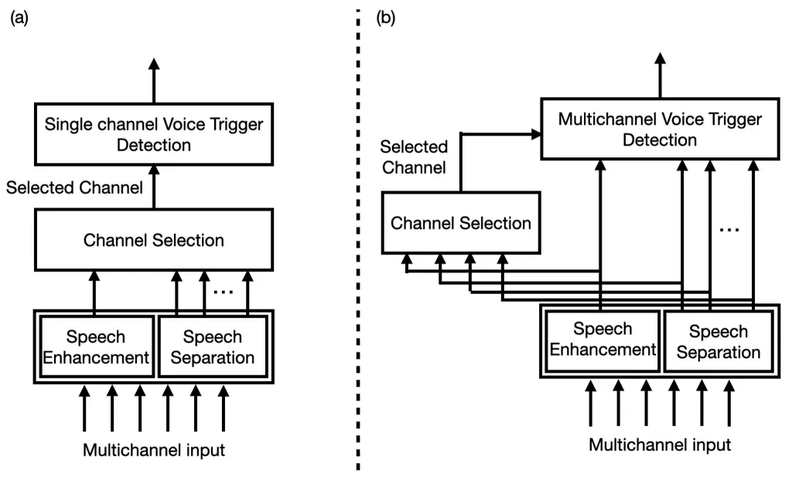
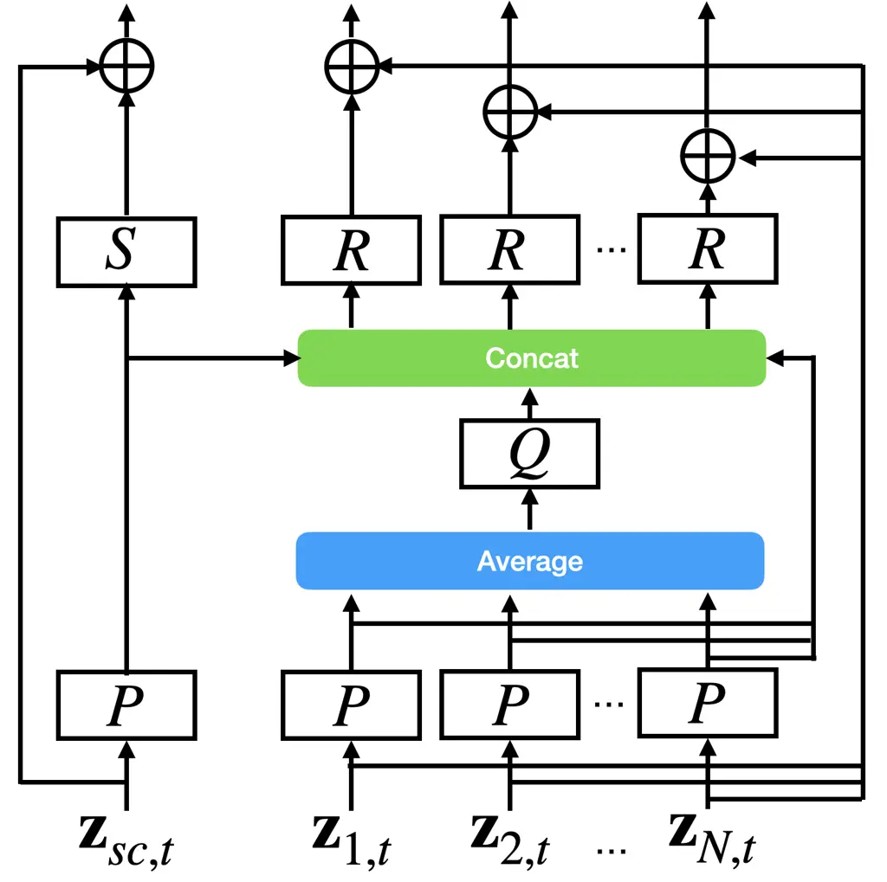

# Multichannel Voice Trigger Detection based on Transform-average-concatenate

Takuya Higuchi    Avamarie Brueggeman\* ^(†)^(†)thanks: \*Work performed
at Apple.    Masood Delfarah    Stephen Shum

###### Abstract

Voice triggering (VT) enables users to activate their devices by just
speaking a trigger phrase. A front-end system is typically used to
perform speech enhancement and/or separation, and produces multiple
enhanced and/or separated signals. Since conventional VT systems take
only single-channel audio as input, channel selection is performed. A
drawback of this approach is that unselected channels are discarded,
even if the discarded channels could contain useful information for VT.
In this work, we propose multichannel acoustic models for VT, where the
multichannel output from the frond-end is fed directly into a VT model.
We adopt a transform-average-concatenate (TAC) block and modify the TAC
block by incorporating the channel from the conventional channel
selection so that the model can attend to a target speaker when multiple
speakers are present. The proposed approach achieves up to $`30\%`$
reduction in the false rejection rate compared to the baseline channel
selection approach.

###### Index Terms: 

Voice triggering, keyword spotting, multichannel acoustic modeling

^(†)^(†)address: ¹Apple, USA  
²The University of Texas at Dallas, USA

## 1 Introduction

Voice trigger detection is an essential task for a voice assistant
system, allowing a user to activate the voice assistant by simply
speaking a wake word. Noise robustness is an important aspect of
successful voice triggering (VT). A front-end speech enhancement and/or
separation system is commonly used to improve the noise robustness
\[1\]. Speech separation is especially useful for VT and other
downstream tasks when multiple speakers are present in a recording
because a typical acoustic model cannot deal with speech mixtures.

However, multiple separated and enhanced signals from the front-end
system cannot directly be input to a typical VT system because the VT
system takes only a single channel input. A simple solution to address
this is channel selection, where one channel is selected from the
multiple channels before VT \[2\]. A downside of this approach is that
unselected channels are discarded even though they might contain useful
information for VT. For example, if the front-end system wrongly
suppresses a part of a target speech and introduces distortions in the
selected channel, the suppressed part of the target speech could be
contained in the other channels.

We present a novel multichannel acoustic model for VT, where the
multiple separated/enhanced channels from the front-end system are
directly fed into a VT acoustic model. We adopt a recently-proposed
transform-average-concatenate (TAC) block \[3\] to perform inter channel
processing within the acoustic model. In addition, we combine the
selected channel in the TAC block so that the model is informed of the
channel of most interest for VT. We conduct experimental evaluations on
a far-field VT task, where the proposed multichannel approach
outperforms a single channel baseline VT with channel selection by up to
$`30\%`$ relative in terms of the false rejection rate (FRR).

## 2 Related work

Multichannel acoustic modeling has been investigated for far-field
automatic speech recognition \[4\]. Sainath et al. proposed using
convolutional neural networks (CNNs) on multichannel time domain signals
\[5, 6\] to directly learn both spatial and spectral characteristics
from training data. A similar approach has also been used for keyword
spotting \[7\]. More recently, attention based approaches have been
proposed for multichannel acoustic modeling \[8, 9\], where
cross-channel attention is performed to learn from inter-channel
characteristics. Although these approaches are end-to-end optimized for
the target tasks, the model complexity and compute cost usually increase
due to the joint spatial and spectral modeling, which is unsuitable for
on-device applications such as VT. Moreover, there is no mechanism to
differentiate a target speaker from interference speakers in these
approaches.

Other types of multichannel approaches have also been proposed for
keyword spotting, where multichannel features are concatenated \[10\] or
attention based weighted sum is performed on the multichannel features
\[11, 12\]. Although these operations are simple and computationally
light, they may not be enough to model inter-channel characteristics.

Multichannel modeling has also been explored for neural network-based
speech enhancement and separation. A TAC block is proposed for simple
yet effective multichannel modeling for speech enhancement and
separation \[3, 13, 14\]. The TAC block is defined with simple
channel-wise transformations, pooling and concatenation operations.

Our proposed multichannel VT modeling is based on the TAC block because
it employs simple and light-weight operations for non-linear
inter-channel modeling. For the multichannel input, we use the output of
the front-end system, i.e., enhanced and separated signals similarly to
the prior work \[11, 12\]. This allows us to exploit the existing
front-end system and use potentially more informative signals for VT
than the raw multi-microphone signals, while the model performs
non-linear inter-channel operations with the TAC block in contrast to
\[11, 12\]. Moreover, we incorporate channel selection to allow the
model to focus on the target speaker (See Section 4.2).

## 3 Baseline system



Figure 1: (a) A conventional single channel voice trigger detection. (b)
The proposed multichannel voice trigger detection with channel
selection.

Figure 2 (a) shows the flowchart of a baseline system \[2\]. A front-end
system consists of a speech enhancement module and a speech separation
module. The enhancement module produces a single-channel enhanced speech
signal, whereas the separation module produces $`(N-1)`$-channel output
for $`N-1`$ separated signals. The separation module is especially
useful when observed signals contain multiple speech signals, such as
target speaker and TV noise. Then $`N`$ signals from both modules are
fed into a VT system.

The VT system employs a two-stage approach \[15, 16, 17\] to save
run-time cost on-device. A small VT model (1st pass model) is always-on
and takes streaming audio of each channel from the front-end. Once we
detect an audio segment with a VT score exceeding a certain threshold,
the audio segment is fed to a larger VT model and re-examined to reduce
false activations. Since the VT models take only a single-channel audio,
channel selection is performed using the 1st pass model \[2\].

The 1st pass model processes each channel from the front-end system, and
produces a VT score independently. Then, the channel with the highest
1st pass VT score is selected and fed into the 2nd pass model that has
more complexity and is more accurate than the 1st pass model. This
approach has an advantage when multiple speakers are present, because
one channel containing a keyword phrase can be selected among multiple
separated speech signals. However, a drawback of this approach is that
unselected channels are discarded and not used for the 2nd pass model,
whereas noise and interference signals in the discarded channels could
also be useful for accurate VT in the 2nd stage. In addition, the speech
enhancement or separation module could suppress the target speech and
introduce distortions when there is no interference speech and/or
background noise, which can be ineffective for VT.

## 4 Proposed multichannel VT modeling

In this paper, we propose multichannel acoustic models that can take the
multichannel output from the front-end system. Figure 2 (b) shows the
flowchart of our proposed system. While the 1st pass model still
performs VT on each channel separately, the proposed 2nd pass acoustic
model takes all the channels. In addition, the selected channel obtained
with the conventional channel selection is also fed to the model in
order to keep the advantage of the conventional approach on speech
mixtures. We adopt and modify a recently-proposed TAC block for
combining the multiple channels in a VT acoustic model.

### 4.1 Transform-average-concatenate (TAC)

Let us consider $`N`$ channel signals from the front-end system that
performs speech enhancement and separation. Let
$`\mathbf{Z}_{i}\in\mathbb{R}^{T\times F}`$ denote a time series of a
$`F`$-dimensional feature from channel $`i`$. We first apply a linear
layer and the parametric rectified linear unit (PReLU) activation
function \[18\] to $`\mathbf{z}_{i,t}`$:

```math
\displaystyle\mathbf{h}_{i,t}=P(\mathbf{z}_{i,t}), \tag{1}
```

where $`\mathbf{z}_{i,t}`$ denotes the feature vector at time $`t`$ for
channel $`i`$ and $`P(\cdot)`$ denotes the linear transformation
followed by the PReLU activation. Then, $`\mathbf{h}_{i,t}`$ is averaged
across the channels and fed into another linear layer with the PReLU
activation function as:

```math
\displaystyle\mathbf{h}^{avg}_{t}=Q(\frac{1}{N}\sum_{i}\mathbf{h}_{i,t}). \tag{2}
```

Then $`\mathbf{h}^{avg}_{t}`$ is concatenated with $`\mathbf{h}_{i,t}`$
and fed into a third linear layer and the PReLU activation function as:

```math
\displaystyle\hat{\mathbf{h}}_{i,t}=R([\mathbf{h}_{i,t};\mathbf{h}^{avg}_{t}]). \tag{3}
```

Finally, a residual connection is applied to obtain an output of the TAC
block as:

```math
\displaystyle\hat{\mathbf{z}}_{i,t}=\mathbf{z}_{i,t}+\hat{\mathbf{h}}_{i,t}. \tag{4}
```

These operations enable learning inter-channel characteristics with the
simple channel-wise transformations and the pooling operation. Note that
all the operations in the TAC block is permutation invariant between the
channels by design for microphone-array agnostic modeling, which allows
us to feed the arbitrary number of separated/enhanced signals into the
TAC block.



Figure 2: The modified TAC block with the selected channel.

### 4.2 Modified TAC with selected channel

Although the permutation-invariant operations enable mic-array-agnostic
speech separation in the previous literature \[14\], its
permutation-invariant nature would be problematic when one of the
channels is of more interest for VT. For example, the front-end system
performs speech separation and produces multiple channels which contain
either target or interference speech at each channel. A VT model should
attend to the target speech to perform VT detection. However, the TAC
block processes every channel equally, which confuses the VT model
during training and inference when multiple speakers are present.

To address this, we propose exploiting the selected channel obtained
with the conventional channel selection approach. Figure 2 shows the
proposed block obtained by modifying the conventional TAC block. Let
$`\mathbf{z}_{sc,t}`$ denote a feature vector of the selected channel.
The modified TAC block takes a feature vector $`\mathbf{z}_{i,t}`$ for
channel $`i(=1,...,N)`$ as well as $`\mathbf{z}_{sc,t}`$. We first apply
eq. (1) to $`\mathbf{z}_{sc,t}`$ as with $`\mathbf{z}_{i,t}`$:

```math
\displaystyle\mathbf{h}_{sc,t}=P(\mathbf{z}_{sc,t}), \tag{5}
```

while the average operation is performed on
$`\mathbf{h}_{i,t}(i=1,...,N)`$ using eq. (2). Then,
$`\mathbf{h}_{sc,t}`$ is concatenated with $`\mathbf{h}_{i,t}`$ and
$`\mathbf{h}^{avg}_{t}`$, and fed into a linear layer and the PReLU
activation function as:

```math
\displaystyle\hat{\mathbf{h}}_{i,t}=R([\mathbf{h}_{i,t};\mathbf{h}^{avg}_{t};\mathbf{h}_{sc,t}]). \tag{6}
```

This operation distinguishes the selected channel from the other
channels and encourages the model to learn from the selected channel.
Finally, another linear layer and the PReLU activation function is
applied to $`\mathbf{h}_{sc,t}`$ to reduce the dimensionality to
dimensionality of the input before the residual connection:

```math
\displaystyle\hat{\mathbf{z}}_{sc,t}=\mathbf{z}_{sc,t}+S(\mathbf{h}_{sc,t}), \tag{7}
```

while $`\hat{\mathbf{z}}_{i,t}`$ $`(i=1,...,N)`$ is obtained with eq.
(3).

### 4.3 Acoustic modeling with self-attention layers

The TAC block was combined with self-attention layers in \[14\], where
self-attention is performed for each output channel of TAC blocks. This
approach drastically increases a run-time computation cost because a
quadratic self-attention operation is repeated for each channel, which
is unsuitable for VT that should be run on-device with low latency. To
alleviate this, we apply an average pooling layer before feeding a
multichannel output from the TAC block to the self-attention layers for
temporal and spectral modeling.

## 5 Experimental evaluation

We evaluated the effectiveness of the proposed approach on a far-field
VT task. Since some practical use cases (e.g., the presence of
playback/interference speakers) are not well-represented in common
public datasets, we used our in-house dataset for evaluation. The
proposed approach was compared with a conventional single channel VT
that used channel selection. It should be noted that a simple
concatenation of multichannel features used in \[10\] did not outperform
the single channel baseline in our preliminary experiments.

### 5.1 Data

For training, we used $`\sim 2.3`$ million human-transcribed single
channel utterances. Multichannel reverberant signals were simulated by
convolving measured room impulse responses (RIRs), which were recorded
in various rooms and microphone locations with a six channel
microphone-array. In addition, roughly $`20\%`$ of utterances were
augmented by convolving simulated four-channel RIRs and then adding
multichannel non-speech noise signals or multichannel playback. Then we
combined these three types of utterances to obtain a simulated
multichannel training dataset. Finally, the multichannel signals were
fed into the front-end system to obtain one enhanced signal and three
separated signals for each utterance.

For evaluation, we used an in-house dataset, where positive samples were
collected in controlled conditions from 100 participants. Each
participant spoke the keyword phrase to the smart speaker with six
microphones. Note that there was a mismatch in microphone arrays used
for a part of training data and test data, which was compensated for by
the front-end that always produced four channels. The recordings were
made in various rooms in four different acoustic conditions: quiet (no
playback, no noise), external noise, e.g., from TV or appliances, music
playing from the device at medium volume, and music playing at loud
volume. 1300 such positive samples were collected. For negative data, we
collected 2000 hours of audio by playing podcasts, audiobooks, etc,
which did not contain the keyword phrase. The negative samples were also
recorded with the smart speaker. The same front-end system was applied
to the evaluation dataset to obtain enhanced and separated signals for
each sample.

### 5.2 Settings

For the front-end, we used echo cancellation and dereverberation
followed by a mask-based beamformer for speech enhancement and blind
source separation. See \[2\] for more details of the front-end. The
speech separation module produced three separated signals, and so we
obtained four channel signals in total from the front-end. It should be
noted that our proposed model architecture can be used with any
front-end that produces a multichannel output.

For the 1st pass VT and channel selection, we used 5x64 fully-connected
deep neural networks (DNNs). The 5x64 DNNs predicted a frame-wise
posterior for 20 classes: 18 phoneme classes for the keyword, one for
silence and one for other speech. Then a hidden Markov model (HMM)
decoder produced a VT score and alignment for a trigger phrase based on
the posteriors in a streaming fashion. This 1st pass model was run on
the four channels separately and produced four VT scores. Then, a
trigger segment in the channel with the highest score was input to the
larger VT model in the second stage for the baseline.

For the VT models in the second stage, we used a Transformer encoder
\[19, 20\] as an acoustic model. The baseline single channel model
consisted of six Transformer encoder blocks, each of which had a
multi-head self-attention layer with 256 hidden units and 4 heads,
followed by a feed-forward layer with 1024 hidden units. Finally a
linear layer transformed the output from the Transformer blocks to
logits for 54 phoneme labels and one blank label for a Connectionist
Temporal Classification (CTC) loss \[21\]. A VT score was obtained by
computing a decoding score for the wake word. The baseline model used
40-dimensional log-mel filter bank features with $`\pm`$ 3 context
frames as input.

For the proposed multichannel model, we simply prepended one
original/modified TAC block and an average pooling layer to the baseline
model. The modified TAC block had $`3\times 256`$ hidden units for $`P`$
and $`Q`$, and $`280`$ units for $`R`$ and $`S`$. We used the log-mel
filter bank features from the four channels as input. Since our training
data was not a keyword specific dataset on which the channel selection
could be performed, we used the channel from the speech enhancement
module as a pseudo selected channel during training. We also compared
with a standard TAC block where the modified TAC block with the selected
channel was replaced with the TAC that took only the four channels
without knowing which one was the selected channel. The numbers of model
parameters for the baseline, the proposed models with the standard and
modified TAC were $`4.8M`$, $`6.1M`$ and $`6.5M`$, respectively. It
should be noted that simply increasing the model size of the baseline
single channel model did not improve a VT performance in our preliminary
experiments.

All the models were trained with the CTC loss using the Adam optimizer
\[22\]. The learning rate was initially set at $`0.0005`$, then
gradually decreased by a factor of $`4`$ after $`10`$th epoch, until we
finished training after $`28`$ epochs. We used $`32`$ GPUs for each
model training and the batch size was set at $`128`$ at each GPU.

### 5.3 Results

|                               |       |       |                 |               |         |
| ----------------------------- | ----- | ----- | --------------- | ------------- | ------- |
|                               | quiet | noisy | medium playback | loud playback | overall |
| baseline                      | 4.48  | 6.75  | 5.23            | 15.32         | 7.74    |
| proposed                      | 2.25  | 10.7  | 3.78            | 12.46         | 7.20    |
| proposed (+ selected channel) | 3.12  | 7.12  | 4.55            | 14.62         | 7.16    |

Table 1: False rejection rates \[$`\%`$\] for different conditions at an
operating point of 1 FA/100 hrs.

Table 1 shows FRRs with a threshold that gives $`0.01`$ FA/hr on the
overall dataset for each model. In the quiet condition, the proposed
multichannel models outperformed the baseline with a large margin. This
could be because the speech enhancement and separation were unnecessary
in this case and would introduce distortions to the target speech in the
selected channel, while the proposed models compensated the distortions
by looking at all four channels (plus the selected one). In the music
playback conditions, we observed moderate improvements with the proposed
models. This could be because the multichannel models could learn echo
residuals more effectively from the multichannel signals, where
different front-end processing was applied at each channel. In the noisy
condition, the vanilla TAC regressed compared to the baseline. We found
that failure cases contained speech interference from TV. This is
reasonable because there is no cue for the vanilla TAC to determine the
target speaker when multiple speakers are present in the separated
signals. By incorporating the selected channel, the proposed approach
achieved a similar performance on the noisy condition while
outperforming the baseline on the other conditions. The proposed
approach with the selected channel achieved $`30\%`$, $`13\%`$ and
$`4.6\%`$ relative reductions in FRRs on the quiet, medium and loud
volume playback conditions, respectively, and a $`7.5\%`$ FRR reduction
on the overall dataset compared to the single channel baseline. These
results show the effectiveness of the proposed approaches.

## 6 Conclusions

In this paper, we propose multichannel acoustic modeling for VT based on
the TAC block. The multichannel acoustic model directly takes
multichannel enhanced and separated signals from the front-end and
produces a VT score. We further modify the original TAC block by
incorporating the selected channel to deal with speech mixtures. The
experimental results show that the proposed multichannel model
outperforms the single channel baseline in the quiet and playback
conditions, and achieves a similar performance in the noisy condition.

## 7 Acknowledgement

We thank Mehrez Souden for his feedback on the paper and the helpful
discussions.

## References

- \[1\] Reinhold Haeb-Umbach, et al., “Speech processing for digital
  home assistants: Combining signal processing with deep-learning
  techniques,” IEEE Signal Processing Magazine, vol. 36, no. 6, pp.
  111–124, 2019.
- \[2\] Audio Software Engineering and Siri Speech Team, “Optimizing
  Siri on HomePod in far-field settings,” Machine Learning Journal, vol.
  1, no. 12, 2018, Available:
  https://machinelearning.apple.com/research/optimizing-siri-on-homepod-in-far-field-settings.
- \[3\] Yi Luo, et al., “End-to-end microphone permutation and number
  invariant multi-channel speech separation,” in ICASSP 2020-2020 IEEE
  International Conference on Acoustics, Speech and Signal Processing
  (ICASSP). IEEE, 2020, pp. 6394–6398.
- \[4\] Tara N. Sainath, et al., “Multichannel signal processing with
  deep neural networks for automatic speech recognition,” IEEE/ACM
  Transactions on Audio, Speech, and Language Processing, vol. 25, no.
  5, pp. 965–979, 2017.
- \[5\] Tara N. Sainath, et al., “Speaker location and microphone
  spacing invariant acoustic modeling from raw multichannel waveforms,”
  in 2015 IEEE Workshop on Automatic Speech Recognition and
  Understanding (ASRU), 2015, pp. 30–36.
- \[6\] Tara N Sainath, et al., “Factored spatial and spectral
  multichannel raw waveform CLDNNs,” in 2016 IEEE International
  Conference on Acoustics, Speech and Signal Processing (ICASSP). IEEE,
  2016, pp. 5075–5079.
- \[7\] Xuan Ji, et al., “An end-to-end far-field keyword spotting
  system with neural beamforming,” in 2021 IEEE Automatic Speech
  Recognition and Understanding Workshop (ASRU). IEEE, 2021, pp.
  892–899.
- \[8\] Rong Gong, et al., “Self-attention channel combinator frontend
  for end-to-end multichannel far-field speech recognition,” arXiv
  preprint arXiv:2109.04783, 2021.
- \[9\] Feng-Ju Chang, et al., “End-to-end multi-channel transformer for
  speech recognition,” in ICASSP 2021-2021 IEEE International Conference
  on Acoustics, Speech and Signal Processing (ICASSP). IEEE, 2021, pp.
  5884–5888.
- \[10\] Jilong Wu, et al., “Small Footprint Multi-channel Keyword
  Spotting,” in Proc. The Speaker and Language Recognition Workshop
  (Odyssey 2020), 2020, pp. 391–395.
- \[11\] Xuan Ji, et al., “Integration of multi-look beamformers for
  multi-channel keyword spotting,” in ICASSP 2020 - 2020 IEEE
  International Conference on Acoustics, Speech and Signal Processing
  (ICASSP), 2020, pp. 7464–7468.
- \[12\] Meng Yu, et al., “End-to-end multi-look keyword spotting,”
  arXiv preprint arXiv:2005.10386, 2020.
- \[13\] Hassan Taherian, et al., “One model to enhance them all: array
  geometry agnostic multi-channel personalized speech enhancement,” in
  ICASSP 2022-2022 IEEE International Conference on Acoustics, Speech
  and Signal Processing (ICASSP). IEEE, 2022, pp. 271–275.
- \[14\] Takuya Yoshioka, et al., “Vararray: Array-geometry-agnostic
  continuous speech separation,” in ICASSP 2022-2022 IEEE International
  Conference on Acoustics, Speech and Signal Processing (ICASSP). IEEE,
  2022, pp. 6027–6031.
- \[15\] Alexander Gruenstein, et al., “A cascade architecture for
  keyword spotting on mobile devices,” arXiv preprint
  arXiv:1712.03603, 2017.
- \[16\] Siri Team, “Hey Siri: An On-device DNN-powered Voice Trigger
  for Apple’s Personal Assistant,” Machine Learning Journal, vol. 1, no.
  10, 2017, Available:
  https://machinelearning.apple.com/research/hey-siri.
- \[17\] Siddharth Sigtia, et al., “Efficient voice trigger detection
  for low resource hardware.,” in Interspeech, 2018, pp. 2092–2096.
- \[18\] Kaiming He, et al., “Delving deep into rectifiers: Surpassing
  human-level performance on imagenet classification,” in Proceedings of
  the IEEE international conference on computer vision, 2015, pp.
  1026–1034.
- \[19\] Ashish Vaswani, et al., “Attention is all you need,” Advances
  in neural information processing systems, vol. 30, 2017.
- \[20\] Saurabh Adya, et al., “Hybrid transformer/ctc networks for
  hardware efficient voice triggering,” Proc. Interspeech 2020, pp.
  3351–3355, 2020.
- \[21\] Alex Graves, et al., “Connectionist temporal classification:
  labelling unsegmented sequence data with recurrent neural networks,”
  in Proceedings of the 23rd international conference on Machine
  learning, 2006, pp. 369–376.
- \[22\] Diederik P Kingma and Jimmy Ba, “Adam: A method for stochastic
  optimization,” arXiv preprint arXiv:1412.6980, 2014.
