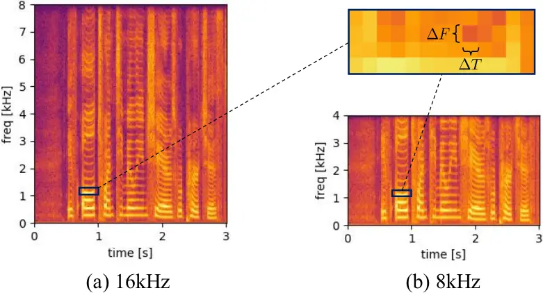

# Toward Universal Speech Enhancement For Diverse Input Conditions

Wangyou Zhang ^(†)^(†)thanks: The experiments were done using the PI
supercomputer at Shanghai Jiao Tong University and the PSC Bridges2
system via ACCESS allocation CIS210014, supported by National Science
Foundation grants \#2138259, \#2138286, \#2138307, \#2137603, and
\#2138296. Wangyou Zhang and Yanmin Qian were supported in part by China
STI 2030-Major Projects under Grant No. 2021ZD0201500, in part by China
NSFC projects under Grants 62122050 and 62071288, and in part by
Shanghai Municipal Science and Technology Major Project under Grant
2021SHZDZX0102.    Kohei Saijo    Zhong-Qiu Wang    Shinji Watanabe   
Yanmin Qian

###### Abstract

The past decade has witnessed substantial growth of data-driven speech
enhancement (SE) techniques thanks to deep learning. While existing
approaches have shown impressive performance in some common datasets,
most of them are designed only for a single condition (e.g.,
single-channel, multi-channel, or a fixed sampling frequency) or only
consider a single task (e.g., denoising or dereverberation). Currently,
there is no universal SE approach that can effectively handle diverse
input conditions with a single model. In this paper, we make the first
attempt to investigate this line of research. First, we devise a single
SE model that is independent of microphone channels, signal lengths, and
sampling frequencies. Second, we design a universal SE benchmark by
combining existing public corpora with multiple conditions. Our
experiments on a wide range of datasets show that the proposed single
model can successfully handle diverse conditions with strong
performance.

###### Index Terms: 

Universal speech enhancement, sampling-frequency-independent,
microphone-number-invariant

^(†)^(†)address: ¹Shanghai Jiao Tong University, China   ²Waseda
University, Japan   ³Carnegie Mellon University, USA

Figure 1: Overview of the proposed versatile SE model. The kernel size
and feature maps of convolutional layers are annotated in gray.

## 1 Introduction

Speech enhancement (SE) is a task of improving the quality and
intelligibility of the speech signal in a noisy and potentially
reverberant environment. Broadly speaking, speech enhancement can be
divided into several subtasks such as denoising, dereverberation, echo
cancellation, and speech separation \[1\]. The first three mainly focus
on single-source conditions, while speech separation tries to separate
each speaker’s speech from the multi-source mixture recording. In this
paper, we are primarily interested in the first two subtasks. Therefore,
in the remainder of the paper, “speech enhancement” refers to denoising
and dereverberation.

In recent years, deep learning-based SE techniques have achieved
promising performance in various scenarios. These technique can be
roughly classified into three categories: masking- \[2, 3, 4\],
mapping- \[5, 6, 7, 8\], and generation-based methods \[9, 10, 11, 12,
13, 14\]. Masking-based methods estimate a mask either in the
time-frequency domain or in the time domain for eliminating noise and
reverberation, while mapping-based methods directly estimate the
clean-speech representation in the corresponding domain.
Generation-based methods try to reconstruct the clean speech using
generation techniques such as generative adversarial networks
(GANs) \[9, 11\], diffusion models \[12, 13\], and resynthesis-based
models \[10, 14\]. These approaches can provide impressive performance
in a condition similar to the training setup. However, most of the
existing approaches are designed only for a single input condition, such
as single-channel input, multi-channel input, or input with a fixed
sampling frequency. Recently, there are some attempts to address
multiple input conditions with a single model. For example, the
Transform-Average-Concatenate (TAC) \[15, 16\] method and a triple-path
model \[17\] are proposed to handle multi-channel signals with a
variable number of microphones configured in diverse array geometries.
In \[18\], a continuous speech separation (CSS) approach is proposed to
handle arbitrarily-long input with a fixed-length sliding window.
Sampling-frequency-independent models are proposed in \[19, 20, 21\] to
handle single-channel input with different sampling frequencies.
Nevertheless, these approaches only consider a limited range of input
conditions. To the best of our knowledge, there does not exist a
_single-model_ approach proposed to handle speech enhancement for
single-channel, multi-channel, and arbitrarily long speech signals with
different sampling frequencies altogether.

As a step towards universal SE which can handle arbitrary input, in this
paper, we aim to devise a single SE model that can handle the
aforementioned input conditions without compromising the performance. We
propose an unconstrained speech enhancement and separation network
(USES) by carefully integrating several techniques.¹¹ 1 We validate the
speech separation and enhancement abilities separately. Here,
“unconstrained” means the model is not constrained to be used only in a
fixed input condition. This single model can accept various forms of
input, including 1) single-channel, 2) multi-channel with 3) different
array geometries, 4) variable lengths, and 5) variable sampling
frequencies. We also empirically show that the proposed model can be
trained on 8 kHz data alone and then tested on data with much higher
sampling frequencies (e.g., 48 kHz). The versatility of this model
further inspires us to build a universal SE benchmark to test the
performance on various input conditions. We combine five commonly-used
corpora (VoiceBank+DEMAND \[22\], DNS1 \[23\], CHiME-4 \[24\],
REVERB \[25\], and WHAMR! \[26\]) to train a single SE model that covers
a wide range of acoustic scenarios. The model is then tested on the
corresponding test sets with five metrics to comprehensively demonstrate
its capability of handling diverse conditions. Our experiments on
various datasets show that the proposed model can successfully cope with
different input conditions with strong performance. The proposed model
will be released²² 2
[https://github.com/espnet/espnet](https://github.com/espnet/espnet) in
the ESPnet toolkit \[27\]. We expect this work to attract more attention
toward building universal SE models, which can also benefit many
downstream speech tasks such as automatic speech recognition (ASR) and
speech translation.

## 2 Proposed Model

In this section, we first describe the overall architecture of the
proposed model. Then, we introduce the key components for handling each
of the variable conditions that make our model versatile.

### 2.1 Overview

The overall architecture of the proposed model is illustrated in Fig. 1.
We base our proposed approach on a recently proposed dual-path network
called time-frequency domain path scanning network (TFPSNet) \[28\]. It
is one of the top-performing speech separation models in the
time-frequency (T-F) domain, and we believe that it can achieve strong
performance in speech enhancement as well. As will be shown in
Section 2.2, this model is a natural fit for handling different sampling
frequencies. Without loss of generality, we assume that the input signal
contains $`{}C`$ microphone channels, where C can be 1 or more. The
encoder consists of a short-time Fourier transform (STFT) module and a
subsequent 2D convolutional layer . The former converts each input
channel into a complex spectrum with shape $`2\times F\times T`$, where
2 denotes the real and imaginary parts, $`{}F`$ is the number of
frequencies, and $`{}T`$ the number of frames. The latter processes each
microphone channel independently and projects each T-F bin into a
$`D`$-dimensional embedding for multi-path modeling. The encoded
representations are then processed by channel-wise layer normalization
and projected to a bottleneck dimension $`{}N`$ by a point-wise
convolutional layer . The bottleneck features are processed by $`{}K`$
stacked multi-path blocks , which outputs a single-channel
representation of the same shape. The parametric rectification linear
unit (PReLU) activation is applied to the output, which is later
projected back to $`{}D`$-dimensional by a point-wise convolutional
layer . Finally, the output is converted to the complex-valued spectrum
via 2D transposed convolution (TrConv, ) and then to waveform via
inverse STFT (iSTFT). We call the proposed method unconstrained speech
enhancement and separation (USES) as it can be used in diverse input
conditions.³³ 3 While we mainly focus on speech enhancement in this
paper, we also show in Section 3.3 that this model works well for speech
separation.

Compared to TFPSNet, we make modifications to the encoder and decoder,
following the observations in a recent paper \[29\]. Specifically, we
adopt the complex spectral mapping method instead of complex-valued
masking in TFPSNet, as it is shown to produce better performance \[29\].
Therefore, the original convolutional layers for mask estimation are
replaced with a single 2D convolutional layer . The projection layers in
the encoder and decoder are also replaced with 2D convolutional and
transposed convolutional layers, respectively. The multi-path block is
mostly the same as that in TFPSNet, containing a transformer layer for
frequency sequence modeling and another for temporal sequence modeling,
as shown in Fig. 3 (b). The transformer layers are the same as those
in \[30, 28\]. The main differences include 1) we do not include any T-F
path modeling (along the anti-diagonal direction) as we found it not so
helpful in the preliminary experiments; 2) we additionally insert a TAC
module for channel modeling (Sec 2.3).

Figure 2: STFT with fixed-duration window and hop sizes (e.g., 32 ms and
16 ms) will generate spectra with the same frequency and temporal
resolution for different sampling frequencies.

| Dataset                                                                                    | Train (hr)  | Dev (hr)   | Test (hr)     | Sampling Freq. | \#Ch | T60 (ms)                        | Train. SNR (dB)          |
| ------------------------------------------------------------------------------------------ | ----------- | ---------- | ------------- | -------------- | ---- | ------------------------------- | ------------------------ |
| [VoiceBank+DEMAND](https://datashare.ed.ac.uk/handle/10283/2791) \[22\]                    | 8.8         | 0.6        | 0.6           | 48kHz          | 1    | \-                              | \-                       |
|                                                                                            |             |            | (A) 0.42      |                |      | (A) -                           |                          |
| [DNS1](https://github.com/microsoft/DNS-Challenge/tree/interspeech2020/master) (v1) \[23\] | (A) 90      | (A) 10     | (R) 0.42      | 16kHz          | 1    | (R) 300$`\scriptstyle\sim`$1300 | 0$`\scriptstyle\sim`$40  |
| [DNS1](https://github.com/microsoft/DNS-Challenge/tree/interspeech2020/master) (v2) \[23\] | \(A\) 2700  | \(A\) 300  | Same as above | 16kHz          | 1    | Same as above                   | -5$`\scriptstyle\sim`$15 |
|                                                                                            |             |            | (Simu) 2.3    |                |      |                                 |                          |
| [CHiME-4](http://spandh.dcs.shef.ac.uk/chime_challenge/chime2016/) \[24\]                  | (Simu) 14.7 | (Simu) 2.9 | (Real) 2.2    | 16kHz          | 5    | -                               | $`\scriptstyle\sim`$5    |
| [REVERB](https://reverb2014.dereverberation.com) \[25\]                                    | (Simu) 15.5 | (Simu) 3.2 | (Simu) 4.8    | 16kHz          | 8    | (Simu) 250, 500, 700            | 20                       |
|                                                                                            |             |            | (Real) 0.7    |                |      | (Real) 700                      |                          |
|                                                                                            | (A) 58.0    | (A) 14.7   | (A) 9.0       |                |      | (A) -                           |                          |
| [WHAMR!](https://wham.whisper.ai) \[26\]                                                   | (R) 58.0    | (R) 14.7   | (R) 9.0       | 16kHz          | 2    | (R) 100$`\scriptstyle\sim`$1000 | -6$`\scriptstyle\sim`$3  |

Table 1: Detailed information of the corpora used in our SE experiments.
“#Ch” denotes the number of microphone channels in the data. “T60”
denotes the reverberation time. “Train. SNR” represents signal-to-noise
ratio in the training data. “(Simu)” and “(Real)” denote the synthetic
and recorded data, while “A” and “R” in parentheses represent anechoic
and reverberant, respectively.

### 2.2 Sampling-Frequency-Independent design

We follow the basic idea in \[20\] for sampling-frequency-independent
(SFI) model design. Namely, we rely on the STFT/iSTFT to obtain
consistent T-F representations across different sampling frequencies
(SFs). Since the frequency response of STFT filterbanks shifts linearly
for all center frequencies \[31\], it can be easily extended to handle
different SFs. As shown in Fig. 2, if we use fixed-duration STFT window
and hop sizes (e.g., 32 and 16 ms) for different SFs, the resultant
spectra will have constant T-F resolution. As a result, the STFT spectra
of the same signal sampled at different SFs will have the same number of
frames and different numbers of frequency bins, while the resolution is
always consistent. We can leverage this property to build an SFI model
easily as long as the model is capable of handling inputs with two
variable dimensions, time and frequency.

Interestingly, the time-frequency domain dual-path models such as
TFPSNet⁴⁴ 4 However, this property is not noticed in the original
paper \[28\]. and the proposed USES model _inherently satisfy this
requirement_ and can be directly used for SFI modeling without any
modification. This is because these models treat the SE process as
decoupled frequency sequence modeling and temporal sequence modeling ,
as illustrated in Fig. 1 (b), and the transformer layers can naturally
process variable-length frequency sequences when different SFs are
processed. In summary, the proposed model is inherently capable of SFI
modeling, and all we need is to adaptively adjust the STFT/iSTFT window
and hop sizes (to have fixed duration) according to the input SF.

Compared to our method, the SFI convolutional encoder/decoder design
in \[19\] is constrained by the maximum frequency range defined in the
latent analog filter, which thus limits the highest sampling frequency
it can handle⁵⁵ 5 Our preliminary trial also shows it is less
generalizable than STFT.. Another recently proposed SFI method in \[21\]
requires hand-crafted subband division and always resamples the input
signal to a pre-defined sampling frequency (e.g., 48 kHz). Both methods
have to be trained with data of different SFs to cover the whole
frequency range the model is designed for. In contrast, our proposed
model can be trained with 8 kHz data alone, and then applied to much
higher SFs such as 48 kHz. This also greatly speeds up the training
process and reduces the memory consumption during training.

### 2.3 Microphone-Channel-Independent design

We adopt the well-developed TAC technique \[15\] to achieve
channel-independent modeling. As shown in Fig. 1 (c), the basic idea of
TAC is to project representations of each channel to a hidden dimension
$`{}H`$ separately , concatenate the channel-averaged representation
with each channel’s representation , and finally project them back to
the original dimension . The channel number invariance is learned
_implicitly_ during training. Similarly to \[16\], we insert the TAC
module in the first $`{}K_{s}`$ multi-path blocks for spatial modeling,
and then merge the multi-channel representations into single-channel for
the rest $`({\hyperlink{symbol:K}{K}}-{\hyperlink{symbol:K_s}{K_{s}}})`$
multi-path blocks. Instead of averaging the intermediate representations
from all channels after the first K s blocks as in \[16\], we only take
the representation at the reference microphone channel and discard the
rest. This is based on the intuition that the information from different
channels should be already fused together after the first K s blocks. In
addition, taking the reference channel allows the model to learn to
produce estimates time-aligned with the reference channel, which is
often preferable in practice.

### 2.4 Signal-Length-Independent design

Inspired by the success of the memory transformer \[32\] in natural
language processing for long sequences, we extend the proposed model to
handle arbitrarily long input signals following a similar design. As
shown in Fig. 3, we only make a minimal modification to the proposed
model by adding a group of memory tokens \[mem\] of dimension
$`1\times N\times 1\times G`$, where $`{}G`$ is the group size. These
learnable memory tokens are simply concatenated as a prefix with the
feature sequence (output of in Fig. 1) along the temporal dimension via
shape broadcasting. The concatenated feature is then fed into K
multi-path blocks for enhancement, in which the transformer layers could
_implicitly_ learn to utilize such information via sequence modeling.
The first G frames in the output representation correspond to the
processed memory tokens, which are regarded as a summary of the
information contained in the current input signal. These new memory
tokens can be then used as the prefix for processing the subsequent
input segment. Thus, we can segment the long-form input into
non-overlapping short segments and process each one-by-one without
suffering from significant computation and memory costs. Different from
CSS \[18\], we do not need an overlapped sliding window here, as the
history information can be retrieved from the output memory tokens from
the previous segment.

Furthermore, the learnable memory tokens can be extended to serve as an
indicator of different input conditions, similar to the role of prompts
in various recent studies \[33, 34\]. To verify this possibility, we
design two independent groups of memory tokens (\[mem₁\] and \[mem₂\])
for indicating denoising with and without dereverberation. As shown in
Fig. 3, we apply them accordingly to the reverberant and anechoic data
in the extensive SE experiments in Section 3.5.

Figure 3: Memory token-based long sequence modeling.

## 3 Experiments

### 3.1 Data

Speech separation: We evaluate the speech separation performance on the
commonly-used WSJ0-2mix benchmark \[35\] and its spatialized (anechoic)
version \[36\] (min mode). Each dataset consists of a 30-hour training
set, a 10-hour development set, and a 5-hour test set of 2-speaker clean
speech mixtures sampled at 8 kHz. The signal-to-interference ratio (SIR)
ranges from -10 to 10 dB. The spatialized version contains 8 microphone
channels, with the microphone arrangement sampled randomly.

Speech enhancement in a single condition: We train our proposed model on
the 16 kHz DNS1 data \[23\] alone to show its capability in a single
condition. Following existing SE works \[3, 4\], we simulate $`3000`$
hours of non-reverberant data in total, with $`2700`$ and $`300`$ hours
for training and development, respectively. The SE performance is then
evaluated on the non-blind test set without reverberation, which is
around $`0.42`$ hours. The detailed information can be found in Table 1
(2nd row).

Speech enhancement in diverse conditions: To better show the capability
of the proposed SE model, we build a comprehensive dataset that can
serve as a universal SE benchmark. The new dataset combines data from
five widely-used corpora, as shown in Table 1, where DNS1 (v2) is not
used here to mitigate the data imbalance problem. The total amount of
training data is $`\scriptstyle\sim`$245 hours. This dataset covers a
wide range of conditions, including single-channel, multi-channel
(2ch-8ch), wide-band (16kHz), full-band (48kHz), anechoic, reverberant,
and variable-length input in both simulated and real-recorded scenarios.

### 3.2 Model and training configurations

In all our experiments, the proposed USES model consists of
$`{\hyperlink{symbol:K}{K}}=6`$ multi-path blocks, with a TAC module in
the first $`{\hyperlink{symbol:K_s}{K_{s}}}=3`$ blocks for spatial
modeling. The STFT/iSTFT window and hop sizes are always 32 and 16 ms,
respectively. Following TFPSNet \[28\], the embedding dimension D is set
to $`256`$ and the bottleneck dimension N to $`64`$. The transformer
layers in the multi-path blocks have the same configuration as
in \[28\]. The hidden dimension H in each TAC module is $`192`$. When
processing multi-channel data, we always take the first channel as the
reference channel. When the memory tokens in Section 2.4 are applied, we
empirically set the number of memory tokens G to $`20`$, and divide the
input signal into non-overlapping segments of $`\scriptstyle\sim`$1s
long (64 frames). The total number of model parameters is around 3.1
millon. The pre-trained models and configurations will be released later
in ESPnet \[27\] for reproducibility.

Our experiments are done based on the ESPnet toolkit \[27\]. The models
are trained using the Adam optimizer, and the learning rate increases
linearly to 4e-4 in the first $`X`$ steps and then decreases by half
when the validation performance does not improve for two consecutive
epochs. We set $`X`$ to 4000 and 25000 for speech separation and
enhancement experiments, respectively. During training, we divide the
samples into 4-second chunks to reduce memory costs. The batch size of
all experiments is 4. We also limit the number of samples for each epoch
to 8000. When training on multi-channel data, we shuffle the channel
permutation of each sample and randomly select the number of channels
(up to 4 channels) to increase diversity. We always apply variance
normalization to the input signal and revert the variance in the model’s
output. For speech separation, all models are trained until convergence
(up to 150 epochs) using the SI-SNR loss \[37\]; and for speech
enhancement, we train all models for up to 20 epochs⁶⁶ 6 For DNS1 data
alone, we only train for up to 5 epochs due to the large amount of data,
which are enough for the model to converge. using the loss function
proposed in \[38\]. The loss function is a scale-invariant
multi-resolution $`L_{1}`$ loss in the frequency domain plus a
time-domain $`L_{1}`$ loss term. We set the STFT window sizes of the
multi-resolution $`L_{1}`$ loss to {256, 512, 768, 1024} and the
time-domain loss weight to 0.5. In each experiment, the model with the
best validation performance is selected for evaluation.

We evaluate the SE models with the metrics below: wide-band PESQ
(PESQ-WB) \[39\], STOI \[40\], scale-invariant signal-to-noise ratio
(SI-SNR) \[37\], signal-to-distortion ratio (SDR) \[41\], DNSMOS
(OVRL)⁷⁷ 7
[https://github.com/microsoft/DNS-Challenge/blob/master/DNSMOS/DNSMOS/sig_bak_ovr.onnx](https://github.com/microsoft/DNS-Challenge/blob/master/DNSMOS/DNSMOS/sig_bak_ovr.onnx) \[42\],
and word error rate (WER). Except for WER, a higher value indicates
better performance for all metrics. The Whisper Large v2 model⁸⁸ 8
[https://huggingface.co/openai/whisper-large-v2](https://huggingface.co/openai/whisper-large-v2) \[43\]
is used for WER evaluation.

|                           |         |                        |     |                   |
| ------------------------- | ------- | ---------------------- | --- | ----------------- |
| Model                     | SI-SNRi | ( 8 kHz  /    16 kHz ) |     |                   |
| WSJ0-2mix test data       |         |                        |     |                   |
| TFPSNet \[28\]            |         | 21.1                   | /   | \-                |
| TFPSNet (reproduced)      |         | 21.0                   | /   | 12.0 (resampling) |
|   + SFI STFT/iSTFT        |         | \-                     | /   | 19.7              |
| USES (1ch)                |         | 20.3                   | /   | 19.8              |
|   + mem tokens (1ch)      |         | 20.9                   | /   | 19.3              |
| 1ch spatialized test data |         |                        |     |                   |
| USES (1-2ch)              |         | 18.9                   | /   | 18.4              |
|   + mem tokens (1-6ch)    |         | 19.9                   | /   | 18.3              |
| 2ch spatialized test data |         |                        |     |                   |
| USES (1-2ch)              |         | 24.6                   | /   | 24.2              |
|   + mem tokens (1-6ch)    |         | 36.1                   | /   | 35.0              |

Table 2: Speech separation performance on WSJ0-2mix and its spatialized
version (min mode). All models are trained only on 8 kHz data, and
tested on 8 kHz and 16 kHz data.

### 3.3 Evaluation of speech separation performance

We first examine the effectiveness of the three components proposed in
Section 2 by evaluating the speech separation performance on WSJ0-2mix,
which makes the comparison with the top-performing TFPSNet \[28\]
convenient. In addition, the datasets are not large, making it easy to
investigate different setups. We train the model on 8 kHz mixture data,
and evaluate the performance on both 8 and 16 kHz test data. Table 2
reports the SI-SNR improvement (SI-SNRi) of models trained on a single
channel (denoted as 1ch) and on a variable number of channels (denoted
as 1-2ch and 1-6ch). From the first section in Table 2, we observe that
the proposed SFI approach can successfully preserve strong separation
performance for the reproduced TFPSNet⁹⁹ 9 Different from \[28\], our
reproduction replaces all T-F path scanning transformers with the
time-path scanning transformer. on 16 kHz data. In comparison, first
downsampling 16 kHz mixtures to 8 kHz, then applying TFPSNet trained at
8 kHz for separation, and finally upsampling the separation results to
16 kHz (denoted as “resampling” in the second row) suffer from severe
SI-SNR degradation. The proposed USES model also obtains similar
performance to TFPSNet on WSJ0-2mix, as our major modifications focus on
the invariance to sampling frequencies, microphone channels, and signal
lengths. While applying memory tokens does not change the performance
significantly, it enables the model to process variable-length inputs
with a constant memory cost during inference.

|                   |            | PESQ-WB $`\uparrow`$ |      |      |       | STOI ($`\times 100`$) $`\uparrow`$ |      |      |       | SDR (dB) $`\uparrow`$ |      |      |       | DNSMOS OVRL $`\uparrow`$ |      |      |       | WER (%) $`\downarrow`$ |      |      |       |
| ----------------- | ---------- | -------------------- | ---- | ---- | ----- | ---------------------------------- | ---- | ---- | ----- | --------------------- | ---- | ---- | ----- | ------------------------ | ---- | ---- | ----- | ---------------------- | ---- | ---- | ----- |
| Test set          | Condition  | noisy                | excl | USES | USES⁺ | noisy                              | excl | USES | USES⁺ | noisy                 | excl | USES | USES⁺ | noisy                    | excl | USES | USES⁺ | noisy                  | excl | USES | USES⁺ |
| VoiceBank+DEMAND  | 1ch, 48kHz | -                    | -    | -    | -     | 92.1                               | 92.8 | 93.1 | 95.8  | 8.4                   | 11.0 | 11.0 | 17.3  | 2.70                     | 3.10 | 3.14 | 3.15  | 4.4                    | 4.2  | 3.2  | 2.3   |
| VoiceBank+DEMAND  | 1ch, 16kHz | 1.98                 | 3.08 | 3.11 | 3.06  | 92.1                               | 95.3 | 95.0 | 95.9  | 8.5                   | 20.4 | 21.5 | 21.8  | 2.70                     | 3.16 | 3.19 | 3.18  | 4.4                    | 2.7  | 3.1  | 2.8   |
| DNS1 (w/o reverb) | 1ch, 16kHz | 1.58                 | 3.16 | 3.23 | 3.35  | 91.5                               | 97.4 | 97.8 | 98.1  | 9.1                   | 19.9 | 19.6 | 20.5  | 2.48                     | 3.29 | 3.32 | 3.33  | 7.2                    | 6.2  | 6.4  | 5.9   |
| DNS1 (reverb)     | 1ch, 16kHz | 1.82                 | 1.51 | 2.75 | 2.92  | 86.6                               | 68.5 | 89.9 | 89.5  | 9.2                   | 2.2  | 13.4 | 14.0  | 1.39                     | 2.28 | 2.36 | 2.30  | 19.1                   | 75.7 | 28.9 | 30.4  |
| CHiME-4 (Simu)    | 5ch, 16kHz | 1.27                 | 3.16 | 2.95 | 2.95  | 87.0                               | 98.3 | 97.8 | 97.9  | 7.54                  | 20.6 | 18.3 | 19.1  | 2.08                     | 3.22 | 3.22 | 3.24  | 5.8                    | 4.2  | 4.4  | 4.1   |
| REVERB (Simu)     | 8ch, 16kHz | 1.48                 | 1.82 | 2.09 | 2.08  | 85.2                               | 88.1 | 89.8 | 89.8  | 8.7                   | 10.5 | 11.9 | 12.2  | 2.10                     | 2.84 | 2.98 | 2.98  | 4.9                    | 4.7  | 4.6  | 4.6   |
| WHAMR! (anechoic) | 2ch, 16kHz | 1.11                 | 2.62 | 2.55 | 2.69  | 76.0                               | 96.8 | 96.4 | 96.7  | -2.8                  | 16.3 | 15.8 | 16.2  | 1.69                     | 3.34 | 3.33 | 3.33  | 8.4                    | 6.0  | 6.2  | 6.2   |
| WHAMR! (reverb)   | 2ch, 16kHz | 1.11                 | 2.57 | 2.51 | 2.33  | 73.1                               | 96.4 | 96.0 | 94.7  | -1.8                  | 14.6 | 13.8 | 12.9  | 1.41                     | 3.32 | 3.32 | 3.28  | 9.3                    | 6.5  | 6.5  | 6.9   |

Table 4: Speech enhancement performance of the proposed model in diverse
conditions. The models are by default trained only on 8 kHz data, and
tested with the original sampling frequencies. “noisy” denotes the
performance of the input noisy speech, while “excl” and “USES” denote
those of the enhanced speech by corpus-exclusive SE and the proposed
single SE models, respectively. “USES⁺” denotes the proposed SE model
trained for 5 more epochs (25 epochs in total) with variable SFs (8, 16
and 24 kHz, achieved via downsampling) on the same data. On REVERB and
WHAMR! (reverb), the models always do denoising and dereverberation by
applying the corresponding memory tokens \[mem₁\]; for other data, only
denoising is performed. The best and second best results are made bold
and underlined, respectively.

|                          |                      |                                    |                          |
| ------------------------ | -------------------- | ---------------------------------- | ------------------------ |
| Model                    | PESQ-WB $`\uparrow`$ | STOI ($`\times 100`$) $`\uparrow`$ | SI-SNR (dB) $`\uparrow`$ |
| Noisy                    | 1.58                 | 91.5                               | 9.07                     |
| GaGNet \[3\] (causal)    | 3.17                 | 97.1                               | 18.9                     |
| FRCRN \[4\] (causal)     | 3.23                 | 97.7                               | 19.8                     |
| MFNet \[8\] (non-causal) | 3.43                 | 98.0                               | 20.3                     |
| Proposed (DNS1 v1)       | 3.16                 | 97.4                               | 19.9                     |
| Proposed (DNS1 v2)       | 3.46                 | 98.1                               | 21.2                     |

Table 3: Speech enhancement performance on DNS1 non-blind test set
(without reverberation). All models are trained on 16 kHz data. Our
models are non-causal.

For experiments on the spatialized WSJ0-2mix data, we can see that the
model achieves very similar performance on both 8 and 16 kHz data.
Although the single-channel SI-SNR performance degrades
$`\scriptstyle\sim`$1.4 dB, the multi-channel performance becomes much
better, even with only 2 input channels. Further applying the memory
tokens and increasing the input channels during training can improve the
performance, especially for the multi-channel case.

### 3.4 Evaluation of SE performance in a single condition

Given the success of the universal properties of USES in a controlled
experimental condition in Section 3.3, this subsection compares the SE
performance of the proposed model with memory tokens to existing methods
on the DNS1 non-blind test data. Our models are respectively trained on
the simulated DNS1 v1 and v2 data without reverberation, as described in
Table 1. Due to the large amount of training data and limited time, we
only train the proposed model for $`\scriptstyle\sim`$0.5 epochs on DNS1
v2 data, covering around 45% of the entire training set. For DNS1 v1
data, we train the model for 5 epochs, which is around 3.7 passes of the
entire training set¹⁰¹⁰ 10 The training of both models is well converged
with our setup.. The SE performance is presented in Table 3, where we
compare our proposed model with the top-performing methods on DNS1 data.
We can see that although our models are only trained for very limited
steps, they can still achieve very competitive performance compared to
the existing SE methods. The model trained on DNS1 v2 data achieves a
new state-of-the-art performance while only trained for
$`\scriptstyle\sim`$0.5 epochs. However, it should be noted that our
proposed model and MFNet \[8\] are non-causal, while the other listed
models are causal. Therefore, we cannot make a fair comparison here.
Nevertheless, this result at least demonstrates the effectiveness of the
proposed method in the standard SE task.

### 3.5 Evaluation of SE performance in diverse conditions

Finally, we present the SE performance across different conditions.
Here, we adopt the same architecture as in Section 3.4 as the base
model, and train two groups of memory tokens as mentioned in Section 2.4
to control whether dereverberation is applied or not. During training,
we always resample the data to 8 kHz to reduce memory costs, and
evaluate the performance on the original data. For the VoiceBank+DEMAND
48 kHz test data, the original and enhanced audios are resampled to 16
kHz before evaluating STOI, DNSMOS, and WER. We can see in Table 4 that,
in all conditions, the proposed single SE model (USES columns) achieves
strong enhancement performance that is on par with or better than the
corresponding corpus-exclusive SE model (excl columns). Note that the
DNS1 (reverb) test data represents an unseen noisy-reverberant condition
during training. In this condition, the proposed SE model achieves much
better performance, which shows the benefit of training on diverse data
using the proposed model. However, we can see that, on the 48 kHz
VoiceBank+DEMAND test set, both SE models suffer from SDR degradation.
Our investigation implies that it is caused by the greatly increased
frequency bins in 48 kHz (129$`\rightarrow`$769), as the model is only
trained on 8 kHz. To mitigate this mismatch, we continue training the
proposed SE model for 5 more epochs (USES⁺ columns) with variable SFs on
the same data. We can see that increasing the SF diversity consistently
improves the SE performance in different conditions, which shows the
capacity of our model. The enhanced audios are available on our demo
page:
[https://Emrys365.github.io/Universal-SE-demo/](https://Emrys365.github.io/Universal-SE-demo/).

For ASR performance evaluation on different datasets¹¹¹¹ 11 For DNS1
test data, we prepare the transcription manually as the reference, which
is available at
[github.com/Emrys365/DNS_text](https://github.com/Emrys365/DNS_text).,
we use the same Whisper Large model without external language models.
The same text normalization \[43\] is applied to both reference
transcripts and Whisper outputs. As shown in Table 4, the proposed SE
model achieves similar ASR performance to the corpus-exclusive SE model
in most conditions. We further evaluate the performance on two
real-recorded datasets in Table 5. On the REVERB (Real) data, the SE
models perform well in terms of both enhancement and ASR. On the CHiME-4
(Real) data, we notice that some microphone channels contain much
noisier signals, which cannot be well processed by the TAC module
inherently, as it simply averages all channels for fusion. Therefore, we
only conduct single-channel SE on the reference channel (CH5) in this
case. The proposed SE model achieves much better performance than the
corpus-exclusive model, coinciding with the observation in Table 4. Note
that on DNS1 (reverb) and CHiME-4 (Real), the SE model does not improve
the ASR performance, which is a commonly observed phenomenon \[44, 45,
46\] due to the introduced artifacts by enhancement in mismatched
conditions.

|                    |                          |      |       |       |                        |      |       |     |
| ------------------ | ------------------------ | ---- | ----- | ----- | ---------------------- | ---- | ----- | --- |
| Test set           | DNSMOS OVRL $`\uparrow`$ |      |       |       | WER (%) $`\downarrow`$ |      |       |     |
| noisy              | excl                     | USES | USES⁺ | noisy | excl                   | USES | USES⁺ |     |
| CHiME-4 (Real)^(∗) | 1.46                     | 2.94 | 3.07  | 3.12  | 6.7                    | 11.0 | 7.4   | 7.1 |
| REVERB (Real)      | 1.57                     | 2.25 | 3.11  | 3.07  | 5.8                    | 5.4  | 5.1   | 5.0 |

- \*
  Single-channel SE on CH5 is used in CHiME-4 (Real). (See Section 3.5)

Table 5: DNSMOS and ASR results on real-recorded data.

## 4 Conclusion

In this paper, we have devised a single speech enhancement model USES
that can handle denoising and dereverberation in diverse input
conditions altogether, including variable microphone channels, sampling
frequencies, signal lengths, and different environments. Experiments on
a wide range of datasets show that the proposed model can achieve very
competitive performance for both speech separation and speech
enhancement tasks. We further design a benchmark for evaluating the
universal SE performance across various conditions, which also reveals
some less-explored aspects in the SE literature such as the
generalizability across different domains. We hope this contribution can
attract more efforts toward building universal SE models for real-world
speech applications.

## References

- \[1\] J. Benesty _et al._, _Springer handbook of speech
  processing_. Springer, 2008, vol. 1.
- \[2\] D. S. Williamson _et al._, “Time-frequency masking in the
  complex domain for speech dereverberation and denoising,” _IEEE/ACM
  Trans. ASLP._, vol. 25, no. 7, pp. 1492–1501, 2017.
- \[3\] A. Li _et al._, “Glance and gaze: A collaborative learning
  framework for single-channel speech enhancement,” _Applied Acoustics_,
  vol. 187, p. 108499, 2022.
- \[4\] S. Zhao _et al._, “FRCRN: Boosting feature representation using
  frequency recurrence for monaural speech enhancement,” in _ICASSP_,
  2022, pp. 9281–9285.
- \[5\] Y. Xu _et al._, “A regression approach to speech enhancement
  based on deep neural networks,” _IEEE/ACM Trans. ASLP._, vol. 23,
  no. 1, pp. 7–19, 2014.
- \[6\] Z.-Q. Wang _et al._, “Complex spectral mapping for single-and
  multi-channel speech enhancement and robust ASR,” _IEEE/ACM Trans.
  ASLP._, vol. 28, pp. 1778–1787, 2020.
- \[7\] A. Li _et al._, “Taylor, can you hear me now? a Taylor-unfolding
  framework for monaural speech enhancement,” in _Proc. IJCAI_, 2022,
  pp. 4193–4200.
- \[8\] L. Liu _et al._, “A mask free neural network for monaural speech
  enhancement,” in _Interspeech_, 2023, pp. 2468–2472.
- \[9\] S. Pascual _et al._, “SEGAN: Speech enhancement generative
  adversarial network,” in _Interspeech_, 2017, pp. 3642–3646.
- \[10\] S. Maiti and M. I. Mandel, “Speech denoising by parametric
  resynthesis,” in _ICASSP_, 2019, pp. 6995–6999.
- \[11\] S.-W. Fu _et al._, “MetricGAN+: An improved version of
  MetricGAN for speech enhancement,” in _Interspeech_, 2021, pp.
  201–205.
- \[12\] Y.-J. Lu _et al._, “Conditional diffusion probabilistic model
  for speech enhancement,” in _ICASSP_, 2022, pp. 7402–7406.
- \[13\] J. Serrà _et al._, “Universal speech enhancement with
  score-based diffusion,” _arXiv preprint arXiv:2206.03065_, 2022.
- \[14\] R. Mira _et al._, “LA-VocE: Low-SNR audio-visual speech
  enhancement using neural vocoders,” in _ICASSP_, 2023, pp. 1–5.
- \[15\] Y. Luo _et al._, “End-to-end microphone permutation and number
  invariant multi-channel speech separation,” in _ICASSP_, 2020, pp.
  6394–6398.
- \[16\] T. Yoshioka _et al._, “VarArray: Array-geometry-agnostic
  continuous speech separation,” in _ICASSP_, 2022, pp. 6027–6031.
- \[17\] A. Pandey _et al._, “Time-domain ad-hoc array speech
  enhancement using a triple-path network,” in _Interspeech_, 2022, pp.
  729–733.
- \[18\] Z. Chen _et al._, “Continuous speech separation: Dataset and
  analysis,” in _ICASSP_, 2020, pp. 7284–7288.
- \[19\] K. Saito _et al._, “Sampling-frequency-independent audio source
  separation using convolution layer based on impulse invariant method,”
  in _Proc. EUSIPCO_, 2021, pp. 321–325.
- \[20\] J. Paulus and M. Torcoli, “Sampling frequency independent
  dialogue separation,” in _Proc. EUSIPCO_, 2022, pp. 160–164.
- \[21\] J. Yu and Y. Luo, “Efficient monaural speech enhancement with
  universal sample rate band-split RNN,” in _ICASSP_, 2023, pp. 1–5.
- \[22\] C. Valentini-Botinhao _et al._, “Speech enhancement for a
  noise-robust text-to-speech synthesis system using deep recurrent
  neural networks,” in _Interspeech_, 2016, pp. 352–356.
- \[23\] C. K. Reddy _et al._, “The INTERSPEECH 2020 deep noise
  suppression challenge: Datasets, subjective testing framework, and
  challenge results,” in _Interspeech_, 2020, pp. 2492–2496.
- \[24\] E. Vincent _et al._, “An analysis of environment, microphone
  and data simulation mismatches in robust speech recognition,”
  _Computer Speech & Language_, vol. 46, pp. 535–557, 2017.
- \[25\] K. Kinoshita _et al._, “The REVERB challenge: A common
  evaluation framework for dereverberation and recognition of
  reverberant speech,” in _Proc. IEEE WASPAA_, 2013, pp. 1–4.
- \[26\] M. Maciejewski _et al._, “WHAMR!: Noisy and reverberant
  single-channel speech separation,” in _ICASSP_, 2019, pp. 696–700.
- \[27\] C. Li _et al._, “ESPnet-SE: End-to-end speech enhancement and
  separation toolkit designed for ASR integration,” in _Proc. IEEE SLT_,
  2021, pp. 785–792.
- \[28\] L. Yang _et al._, “TFPSNet: Time-frequency domain path scanning
  network for speech separation,” in _ICASSP_, 2022, pp. 6842–6846.
- \[29\] Z.-Q. Wang _et al._, “TF-GridNet: Making time-frequency domain
  models great again for monaural speaker separation,” in _ICASSP_,
  2023, pp. 1–5.
- \[30\] J. Chen _et al._, “Dual-path transformer network: Direct
  context-aware modeling for end-to-end monaural speech separation,” in
  _Interspeech_, 2020, pp. 2642–2646.
- \[31\] S. Cornell _et al._, “Learning filterbanks for end-to-end
  acoustic beamforming,” in _ICASSP_, 2022, pp. 6507–6511.
- \[32\] M. S. Burtsev _et al._, “Memory transformer,” _arXiv preprint
  arXiv:2006.11527_, 2020.
- \[33\] X. L. Li and P. Liang, “Prefix-Tuning: Optimizing continuous
  prompts for generation,” in _Proc. ACL/IJCNLP_, 2021, pp. 4582–4597.
- \[34\] K.-W. Chang _et al._, “An exploration of prompt tuning on
  generative spoken language model for speech processing tasks,” in
  _Interspeech_, 2022, pp. 5005–5009.
- \[35\] J. R. Hershey _et al._, “Deep clustering: Discriminative
  embeddings for segmentation and separation,” in _ICASSP_, 2016, pp.
  31–35.
- \[36\] Z.-Q. Wang _et al._, “Multi-channel deep clustering:
  Discriminative spectral and spatial embeddings for speaker-independent
  speech separation,” in _ICASSP_, 2018, pp. 1–5.
- \[37\] J. Le Roux _et al._, “SDR—half-baked or well done?” in
  _ICASSP_, 2019, pp. 626–630.
- \[38\] Y.-J. Lu _et al._, “Towards low-distortion multi-channel speech
  enhancement: The ESPnet-SE submission to the L3DAS22 challenge,” in
  _ICASSP_, 2022, pp. 9201–9205.
- \[39\] A. W. Rix _et al._, “Perceptual evaluation of speech quality
  (PESQ)—a new method for speech quality assessment of telephone
  networks and codecs,” in _ICASSP_, vol. 2, 2001, pp. 749–752.
- \[40\] C. H. Taal _et al._, “An algorithm for intelligibility
  prediction of time–frequency weighted noisy speech,” _IEEE Trans.
  ASLP._, vol. 19, no. 7, pp. 2125–2136, 2011.
- \[41\] E. Vincent _et al._, “Performance measurement in blind audio
  source separation,” _IEEE Trans. ASLP._, vol. 14, no. 4, pp.
  1462–1469, 2006.
- \[42\] C. K. Reddy _et al._, “DNSMOS P.835: A non-intrusive perceptual
  objective speech quality metric to evaluate noise suppressors,” in
  _ICASSP_, 2022, pp. 886–890.
- \[43\] A. Radford _et al._, “Robust speech recognition via large-scale
  weak supervision,” _arXiv preprint arXiv:2212.04356_, 2022.
- \[44\] W. Zhang _et al._, “Closing the gap between time-domain
  multi-channel speech enhancement on real and simulation conditions,”
  in _Proc. IEEE WASPAA_, 2021, pp. 146–150.
- \[45\] H. Sato _et al._, “Learning to enhance or not: Neural
  network-based switching of enhanced and observed signals for
  overlapping speech recognition,” in _ICASSP_, 2022, pp. 6287–6291.
- \[46\] K. Iwamoto _et al._, “How bad are artifacts?: Analyzing the
  impact of speech enhancement errors on ASR,” in _Interspeech_, 2022,
  pp. 5418–5422.
