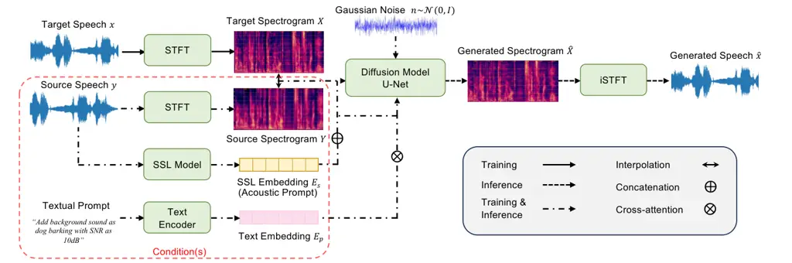
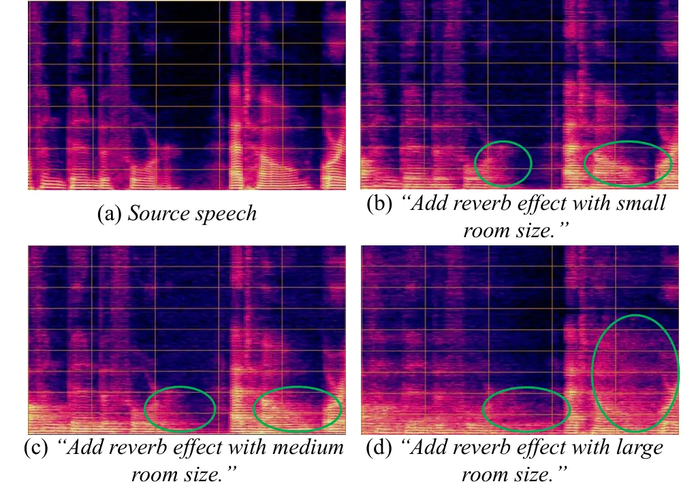

# uSee: Unified Speech Enhancement and Editing with Conditional Diffusion Models

Muqiao Yang^(1†), Chunlei Zhang², Yong Xu², Zhongweiyang Xu³, Heming
Wang⁴, Bhiksha Raj^(1,5), Dong Yu² ^(†)^(†)thanks: ^(†)Work performed
during internship at Tencent AI Lab.

###### Abstract

Speech enhancement aims to improve the quality of speech signals in
terms of quality and intelligibility, and speech editing refers to the
process of editing the speech according to specific user needs. In this
paper, we propose a Unified Speech Enhancement and Editing (uSee) model
with conditional diffusion models to handle various tasks at the same
time in a generative manner. Specifically, by providing multiple types
of conditions including self-supervised learning embeddings and proper
text prompts to the score-based diffusion model, we can enable
controllable generation of the unified speech enhancement and editing
model to perform corresponding actions on the source speech. Our
experiments show that our proposed uSee model can achieve superior
performance in both speech denoising and dereverberation compared to
other related generative speech enhancement models, and can perform
speech editing given desired environmental sound text description,
signal-to-noise ratios (SNR), and room impulse responses (RIR). Demos of
the generated speech are available at
[https://muqiaoy.github.io/usee](https://muqiaoy.github.io/usee).

###### Index Terms: 

Speech Enhancement, Speech Editing, Diffusion Models, Generative Models

^(†)^(†)address: ¹ Carnegie Mellon University, ² Tencent AI Lab  
³ University of Illinois Urbana-Champaign, ⁴ The Ohio State University,
⁵ MBZUAI

## 1 Introduction

Speech enhancement is a critical front-end component in speech
processing, aiming to recover the clean speech signals that are
potentially corrupted by acoustic noises or reverberation \[1\]. Many
real-world applications, including automatic speech recognition (ASR),
speaker verification (SV), and telecommunication systems \[2, 3, 4\],
rely on the accuracy and reliability of the captured speech signal. In
this context, speech enhancement plays a pivotal role in developing
advanced algorithms and techniques to enhance the quality and
intelligibility of speech signals, making them more suitable for
subsequent processing and analysis.

Deep Neural Network (DNN) based speech enhancement methods have been
widely investigated with mapping-based and masking-based methods \[5, 6,
7\]. Mapping-based methods provide targets as the time-frequency (T-F)
domain representation of the clean speech, so that the DNN learns to
predict the mapping from noisy to clean signal as a regression problem
\[8, 9\]. On the other hand, masking-based methods build the training
targets of the DNN as a binary T-F mask to decide whether each portion
is noise or speech, thus making it a classification problem \[10\].
However, there still exists room for improvement in such techniques,
especially when addressing real-world recording scenarios. One major
challenge is that multiple types of distortions may happen in the real
world, such as background noise, reverberation, and interference, etc.,
all of which can degrade the quality of the acquired audio.
Generation-based speech enhancement models have gathered increasing
attention in the community, given their capability to generate realistic
speech by matching its overall distribution to clean speech instead of
optimizing the DNN with a point-wise objective function \[11, 12\].
However, most of them are still designed to solve one single enhancement
task, and may not generalize to multiple types of distortions in real
applications \[13\].

Besides speech enhancement, the demand for speech editing has surged
across various applications, including short video editing, immersive
media experiences, etc \[14, 13\]. Speech editing refers to the process
of performing editing operations on speech according to user
instructions, e.g., adding background sound or reverberation effects to
the source speech. This motivates the emergence of some generation-based
speech editing systems, which leverage text transcriptions to edit
speech according to specific user needs \[15, 16\]. Nevertheless, most
existing approaches focus on only one specific editing task, restricting
the model from generating edited speech with flexible human
instructions. Wang et al. \[14\] proposed an audio editing tool for
multiple tasks, but they are mainly focused on audio tasks instead of
speech editing, so they did not provide fine-grained control like
signal-to-noise ratios (SNR) or room sizes via text instructions.
Meanwhile, some text-to-audio generation methods are proposed in \[17,
18\].

In this work, we propose a Unified Speech Enhancement and Editing (uSee)
model that can perform speech denoising, dereverberation and controlled
speech editing, given source speech and companion text prompt
instructions. The backbone of the proposed model is based on stochastic
differential equations (SDE) for score-based conditional diffusion
models \[19\]. By treating both speech enhancement and speech editing as
generation tasks, our uSee model enables controllable speech generation
conditioned on specific acoustic and textual prompts. In summary, our
uSee model makes contributions as follows. First, we investigate the
effect of the linear and exponential interpolation between source and
target spectrograms as a condition of the diffusion model. Moreover, the
proposed model can manipulate its generation behavior by acoustic
prompts containing self-supervised learning (SSL) embeddings from the
source speech, and textual prompts describing the semantic information
of requirements desired by users. By combining multiple conditions as
the conditional input, our uSee model presents the capability of
controllable speech generation for both speech enhancement and speech
editing tasks. Our experiments demonstrate that the proposed uSee model
can not only effectively generate enhanced speech by removing background
noise and reverberation, but also generate edited speech with specific
background sound types, signal-to-noise ratios (SNR), and room impulse
responses (RIR) described by a textual condition.



Figure 1: Overview of the proposed unified speech enhancement and
editing (uSee) model.

## 2 Related Works

Among generation-based speech enhancement models, diffusion models have
been studied in an increasing number of works \[20, 21\]. The concept of
the diffusion process is to continuously add random noise perturbations
to data from a prior distribution, and then a network is trained to
learn to reverse the diffusion process to recover desired data samples
from the noise. Lu et al. \[12\] used a conditional diffusion
probabilistic model to synthesize enhanced speech in the time domain.
Richter et al. \[22\] proposed an SDE-based diffusion process in the
complex T-F domain, where a score matching objective is applied to
estimate the score of the perturbed data distribution. In speech
editing, Wang et al. \[14\] presented an audio edit tool with a
diffusion model to generate edited speech according to human
instructions. However, existing studies mostly focus on only one or
limited aspects of tasks. There has been no prior research on a unified
model to handle various speech enhancement and editing tasks at the same
time, where both acoustic and textual information are provided as
conditions to enable fine-grained control of the generation process.

## 3 Method

In this section, we will introduce how conditional diffusion models work
with speech enhancement and editing in our proposed uSee model. We will
first begin by illustrating the overall architecture of our proposed
method and then describe the score-based conditional diffusion process.
Then we summarize how controllable generations can be achieved with
different conditions in our uSee model.

### 3.1 Pipeline Overview

The process of speech enhancement and editing can be regarded as
conditional generation tasks in nature, where the corrupted speech in
speech enhancement or the clean speech in speech editing is provided
with the generation model as conditions. For the purpose of simplicity,
we will name such raw speech segments in input conditions as source
speech, and the resulting speech that the user desires as target speech.
Note that target speech is only accessible during training. We denote
target speech as $`x`$ and source speech as $`y`$.

We illustrate the overview of the architecture of our proposed uSee
model in Figure 1. The network architecture of the diffusion model is
based on a multi-resolution U-Net structure \[23\]. For data
representation, we first employ short-time Fourier Transform (STFT) to
convert source speech $`y`$ and target speech $`x`$ into T-F domain
representations, and use the resulting spectrogram $`X`$ and $`Y`$ as
the input and conditions to the diffusion model. Note that the target
speech $`x`$ is only available during the training process, denoted by
solid arrows. During the forward process at each time step, a Gaussian
white noise will be continuously added to the target spectrogram $`X`$.
As the output of the conditional diffusion model during inference, an
estimated spectrogram $`\hat{X}`$ will be iteratively generated through
the reverse process, such that the raw target spectrogram is expected to
be recovered. As the final step, an inverse STFT (iSTFT) is further
applied to $`\hat{X}`$ to convert it back to the generated speech
$`\hat{x}`$. This step only happens during the inference stage, denoted
by dashed arrows.

### 3.2 Controllable Speech Generation via Conditional Inputs

Controlling the behavior of generative models is important to make them
applicable in real-world applications. To demonstrate the necessity of
all conditions to achieve high-quality controllable generation, we
further investigate the effect of different combinations of conditions
in our uSee model, as shown in the block of Condition(s) in Figure 1.
The integration of multiple conditions plays a pivotal role in achieving
fine-grained control over the generation process, allowing us to
manipulate various aspects of the generated speech, such as noise
reduction, reverberation removal, and the introduction of specific
background sounds and RIRs.

Source Spectrograms. As we have mentioned in Section 3.1, both speech
enhancement and editing tasks can be considered as conditional
generation of target speech given a source speech input. Source
spectrograms are a critical component in the conditional controls, as
they provide the basic information for the model to generate the target
speech. Since the reverse process of a diffusion model is to recover
clean speech from a Gaussian noise with iterative steps, the condition
that each step depends on should not be identical. An interpolation
between source and target spectrograms with changing weights across
steps can be used as the condition, where the weight of source
spectrograms is higher in earlier steps, and becomes gradually lower in
later steps. We have also investigated different interpolations such as
linear and exponential interpolation, which we will show in Section 4.

Acoustic Prompts. We apply an SSL embedding $`E_{s}`$ from the source
speech as one of the conditions to the diffusion model. The SSL
embedding is expected to provide further guidance to achieve
controllable generation during the condition-dependent trajectory from
$`y`$ to $`x_{0}`$. Here, we employ the STFT with the same configuration
as the HuBERT \[24\] pretraining, where the hop length is $`320`$.
Therefore, the mixture of spectrogram and SSL embeddings from the same
source-target speech segment pairs will consist of the same number of
frames within one fixed window length, and we concatenate them in a
frame-by-frame correspondence.

Textual Prompts. In addition to the acoustic prompts from the SSL
embeddings, we further introduce textual prompts to the diffusion model
to enable more fine-grained control of the generation process. For
example, in speech enhancement, we may want to use textual prompts to
inform the model whether to perform speech denoising or speech
dereverberation to the source speech, or even both. Moreover, in speech
editing, we will want to control the specific background sound type, SNR
and RIR to be simulated, and the detailed instruction can be included in
the format of textual prompts. We employ a text encoder to extract the
text embeddings $`E_{p}`$ from the textual prompts. The text embeddings
will be utilized multiple times inside the U-Net structure, where the
diffusion model applies cross-attention mechanism to use the text
information to steer the process to generate the audio containing the
specific information in the textual prompts. A more detailed
illustration is shown in Figure 2. At the output level of each residual
block in the U-Net, a cross-attention layer will be applied between the
text embedding $`E_{p}`$ and the input $`Z`$. Note that $`Z`$ has
already contained the information from acoustic prompts before the
cross-attention layers. By doing so, the generated spectrogram
$`\hat{Z}`$ is expected to accommodate semantic information contained in
the text prompts, thus achieving the fine-grained controllable
generation.

Figure 2: Illustration of cross-attention layers for textual prompts as
conditions in the diffusion model.

### 3.3 Score-based Conditional Diffusion

We build the backbone of our model based on score-based diffusion
models, where the idea is to use stochastic differential equations to
estimate the score of the perturbed data in generative modeling. In our
uSee model, we incorporate a combination of conditions into the forward
process and reverse process in the score-based diffusion model, such
that the model can be enabled with controllable generation to generate
enhanced or edited speech.

#### 3.3.1 Forward Process

During training, the forward process of score-based diffusion is to
progressively add increasing levels of Gaussian noise to the target
speech $`x`$ in the form of SDE. Given a diffusion process with $`T`$
steps, following \[19\], the forward process can be defined as
$`\{x_{t}\}_{t=0}^{T}`$ that can be modeled in the form of SDE:

```math
{\mathrm{d}}x_{t}=f(x_{t},t){\mathrm{d}}t+g(t){\mathrm{d}}\omega \tag{1}
```

where $`f`$ and $`g`$ are the drift and diffusion coefficients, and
$`\omega`$ denotes the standard Wiener process. Different from the
interpolation between noisy speech $`y`$ and clean speech $`x`$ in
\[12\], here the drift $`f(x_{t},t)=\gamma(y-x_{t})`$ where $`\gamma`$
is to control the level of transition between $`x`$ and $`y`$. The
diffusion coefficient
$`g(t)=\sigma_{\mathrm{min}}(\frac{\sigma_{\mathrm{max}}}{\sigma_{\mathrm{min}}})^{t}\sqrt{2\log(\frac{\sigma_{\mathrm{max}}}{\sigma_{\mathrm{min}}})}`$
is to control the variance schedule of the Gaussian white noise to be
added, and $`\sigma_{\mathrm{max}}`$ and $`\sigma_{\mathrm{min}}`$ are
both hyperparameters. Overall, the SDE defines the Gaussian process
$`\{x_{t}\}_{t=0}^{T}`$. By default, the distribution from which each
state is sampled can be defined as

```math
\displaystyle x_{0}\sim P_{0}(x), \tag{2}
```

```math
\displaystyle x_{t}\sim P_{0t}(x_{t}|x_{0},y)=\mathcal{N}(x_{t};\mu(x_{0},y,t),\sigma(t)^{2}\mathbf{I})
```

where $`P_{0}`$ is the distribution for raw target speech, and $`P_{t}`$
is called the perturbation kernel given an arbitrary time step
$`t\in[0,T]`$. $`I`$ denotes the identity matrix. According to \[25\],
the closed form solution for the mean $`\mu(x_{0},y,t)`$ and variance
$`\sigma(t)^{2}`$ can be derived as:

```math
\displaystyle\mu(x_{0},y,t)=e^{-\gamma t}x_{0}+(1-e^{-\gamma t})y \tag{3}
```

```math
\displaystyle\sigma(t)^{2}=\frac{\sigma_{\mathrm{min}}^{2}((\frac{\sigma_{\mathrm{max}}}{\sigma_{\mathrm{min}}})^{2t}-e^{-2\gamma t})\log(\frac{\sigma_{\mathrm{max}}}{\sigma_{\mathrm{min}}})}{\gamma+\log(\frac{\sigma_{\mathrm{max}}}{\sigma_{\mathrm{min}}})}
```

By applying the drift coefficient $`f`$ in Equation 2, the mean of the
distribution at each step $`x_{t}`$ achieves the exponential decay from
$`x_{0}`$ to $`y`$ in the forward process as shown in Equation 3. At
each time step $`t`$, $`x_{t}=\mu(x_{0},y,t)+z\cdot\sigma(t)^{2}`$ will
be sampled based on the marginal probability density function and then
used as the conditional input to the diffusion model, where
$`z\in\mathcal{N}(0,\mathbf{I})`$. We will further demonstrate the
performance comparison between the linear interpolation and the
exponential interpolation in Section 4.

#### 3.3.2 Reverse Process

The objective of the reverse process of diffusion is to recover the
corrupted target speech $`x_{t}`$ back to the raw target speech
$`x_{0}`$. Specifically, in score-based conditional diffusion, a score
model $`s_{\boldsymbol{\theta}}`$ is trained to estimate
$`\nabla\log P_{0t}(x_{t}|x_{0},y,c)`$, the gradient of the log
probability density of the perturbation kernel at step $`t`$, such that
the reverse process can be modeled from $`P_{0t}`$ to $`P_{0}`$. Here
$`c`$ refers to the additional condition that the model is conditioned
on at time step $`t`$. According to \[26\], the SDE in the forward
process defined in Equation 1 has the reverse-time SDE as:

```math
\displaystyle{\mathrm{d}}x_{t} \displaystyle=[f(x_{t},t)-g(t)^{2}\nabla\log P_{0t}(x_{t}|x_{0},y,c)]{\mathrm{d}}t+g(t){\mathrm{d}}\hat{\omega} \tag{4}
```

```math
\displaystyle=[f(x_{t},t)-g(t)^{2}s_{\boldsymbol{\theta}}(x_{t},y,t,c)]{\mathrm{d}}t+g(t){\mathrm{d}}\hat{\omega}
```

which needs to be solved by numerical SDE solvers like annealed Langevin
Dynamics \[27\]. For the condition $`c`$, here we employ self-supervised
learning (SSL) embeddings $`E_{s}`$ extracted from HuBERT \[24\] on the
source speech, such that it provides additional guidance to the
generation process in terms of phonetic and acoustic information.

During the inference process, since the model has no access to the
ground-truth target speech $`x`$, we first begin the initial state
$`x_{T}`$ by sampling as
$`x_{T}\sim\mathcal{N}(x_{T};y,\sigma(T)^{2}\mathbf{I})`$. Then the
reverse process can be iteratively solved from $`t=T`$ to $`t=0`$.
Similar to the forward process, across time steps, the mean of the
distribution also experiences an exponential decay from $`y`$ to
$`\hat{x}`$, where $`\hat{x}`$ is the generated estimate of the source
speech.

## 4 Experiments

| Model                  | WB-PESQ | NB-PESQ | STOI | DNSMOS \[28\] |
| ---------------------- | ------- | ------- | ---- | ------------- |
| Noisy                  | 1.46    | 2.05    | 0.61 | 3.26          |
| cDiffuSE \[12\]        | 1.75    | 2.47    | 0.69 | 3.48          |
| SGMSE \[22\]           | 1.91    | 2.66    | 0.72 | 3.65          |
| uSee (ours)            |         |         |      |               |
|    linear interp.      | 1.76    | 2.49    | 0.67 | 3.50          |
|    exponential interp. | 2.01    | 2.72    | 0.71 | 3.68          |
|    + acoustic prompts  | 2.15    | 2.86    | 0.77 | 3.80          |
|    + textual prompts   | 2.20    | 2.88    | 0.80 | 3.86          |

Table 1: Quantitative evaluation results on joint speech denoising and
dereverberation of our uSee model with different conditions.

### 4.1 Datasets and Simulation

Since the objective of our uSee model is unified and multi-fold, we
would like to enable infinite variants of our source and target speech
by simulating them with different sets of clean speech, environmental
noises, and RIRs. We choose the clean speech set as LibriTTS \[29\],
noise set as the balanced training set from AudioSet \[30\], and RIR
dataset as the Room Impulse Response and Noise Database \[31\]. Clean
speech is resampled to 16kHz before simulation. For speech enhancement
tasks, we first consider denoising and deverberation as separate
subtasks. We simulate noisy audios with clean speech and a random noise
type via a specific SNR, and reverberant audios with clean speech and a
randomly sampled RIR from large, medium, and small rooms. For speech
editing, we apply a similar simulation process, while the source speech
is the clean speech and the target speech is referred to as the mixture
of clean speech and specific types of background sound or
reverberations.

### 4.2 Implementation Details

During speech simulation, we add to the clean speech with either a
background sound or a room impulse response. If the clean speech is
shorter than the background sound, instead of clipping the sound, we
will randomly insert the clean speech into one interval of the
background sound. The motivation is that we will utilize text
information to generate speech with specific sound types, and in this
way, the information representing the sound type will be fully
preserved. If the clean speech is longer, the background sound will be
repeated until it reaches the same length as the clean speech.

The additive background sound is mixed with SNR ranging from
$`[0,15]`$dB, and the RIR is selected from rooms with different volumes
including large, medium, and small sizes. We associate each pair of
simulated source and target speech with a textual prompt. The textual
prompt describes whether the objective is to remove noise, remove
reverberation, add background sound, or add room impulse responses to
the source speech. For example, as shown in Figure 1, one prompt could
be “Add background sound as dog barking with SNR as 10dB”. This
indicates that the objective of this command is to add dog barking as
background sound to the source speech, such that the SNR is desired to
be $`10`$dB.

For the conditions, we choose the SSL model as HuBERT \[24\] and the
text encoder as T5 \[32\]. We extract the output from the last layer of
HuBERT as our SSL embeddings, which will be the acoustic prompts. We
will evaluate and compare the performance of different models with
conditions used in our uSee model in Section 4.3.

### 4.3 Experimental Results and Analysis

To demonstrate the effectiveness of our proposed uSee model on various
tasks, we will show the evaluation results of speech enhancement and
editing separately. For speech enhancement, the quantitative evaluation
results are shown in Table 1. We report evaluation metrics including
both intrusive metrics such as PESQ and STOI, and non-intrusive metric
DNSMOS \[28\]. Notably, our uSee model demonstrates superior performance
when compared to other diffusion-based generative speech enhancement
models, such as cDiffuSE \[12\] and SGMSE \[22\], across all evaluated
metrics. Furthermore, we conduct ablation experiments to investigate the
impact of different conditions to the diffusion model. The results show
that both acoustic and textual prompts have an effect on boosting the
speech enhancement performance of uSee model individually. Consequently,
the optimal performance is achieved through exponential interpolation,
utilizing SSL embeddings as the acoustic prompt and text embeddings as
the textual prompt.



Figure 3: Qualitative demos of edited speech generated by uSee model.
Controllable generation is enabled by the textual prompts in the
captions to control the room size of RIRs.

For speech editing, we present the qualitative results of the generated
speech in Figure 3. We choose to demonstrate that uSee model can achieve
controllable generation by showing the spectrograms where various text
instructions are applied to the same source speech. The specific text
prompts are included in the caption of Figure 3, with instructions to
introduce reverberation effects with RIRs of different room sizes. From
the figure, we can observe that the lengths of reverberant tails in the
spectrograms are different according to the text prompts. Examples of
reverberant tail differences are highlighted in the green circles.
Specifically, Figure 3(a) is one example of a source speech, and Figure
3(b) prompts the uSee model to add an RIR with small room size to the
source speech. Therefore, a short trail of energy can be observed at the
end of the harmonics. Accordingly, if the text prompts are changed to
add reverberation effect with medium and large room sizes, as Figure
3(c) and (d) show, the length of the reverberant tails are increasingly
longer compared to small room size. Since the only difference between
the examples lies in the text prompts, we effectively demonstrate the
controllable generation of speech editing in our uSee model. In fact,
our uSee model can achieve more fine-grained reverberation simulation by
conditioning on different RT60s. More demos of the generated speech,
e.g., adding background sounds, are available at our project
[website](https://muqiaoy.github.io/usee).

## 5 Conclusion

This paper presents uSee, a unified speech enhancement and editing
framework with a score-based conditional diffusion model. By providing
the uSee model with conditions including both acoustic and textual
prompts, we show the capability of controllable generation for both
speech enhancement and editing tasks. For speech enhancement, the
proposed uSee model can yield good performance on speech denoising and
dereverberation to generate high-quality speech. In addition, it also
demonstrates a fine-grained control of speech editing to add background
sound or reverberation effects according to user-defined prompts.

## References

- \[1\] Philipos C Loizou, Speech enhancement: theory and practice, CRC
  press, 2007.
- \[2\] Jiatong Shi, Chunlei Zhang, Chao Weng, Shinji Watanabe, Meng Yu,
  and Dong Yu, “Improving rnn transducer with target speaker extraction
  and neural uncertainty estimation,” in ICASSP 2021-2021 IEEE
  International Conference on Acoustics, Speech and Signal Processing
  (ICASSP). IEEE, 2021, pp. 6908–6912.
- \[3\] Jiatong Shi, Chunlei Zhang, Chao Weng, Shinji Watanabe, Meng Yu,
  and Dong Yu, “An investigation of neural uncertainty estimation for
  target speaker extraction equipped rnn transducer,” Computer Speech &
  Language, vol. 73, pp. 101327, 2022.
- \[4\] Chunlei Zhang, Meng Yu, Chao Weng, and Dong Yu, “Towards robust
  speaker verification with target speaker enhancement,” in ICASSP
  2021-2021 IEEE International Conference on Acoustics, Speech and
  Signal Processing (ICASSP). IEEE, 2021, pp. 6693–6697.
- \[5\] Yanxin Hu, Yun Liu, Shubo Lv, Mengtao Xing, Shimin Zhang, Yihui
  Fu, Jian Wu, Bihong Zhang, and Lei Xie, “Dccrn: Deep complex
  convolution recurrent network for phase-aware speech enhancement,”
  arXiv preprint arXiv:2008.00264, 2020.
- \[6\] Alexandre Defossez, Gabriel Synnaeve, and Yossi Adi, “Real time
  speech enhancement in the waveform domain,” arXiv preprint
  arXiv:2006.12847, 2020.
- \[7\] Yi Luo and Nima Mesgarani, “Conv-tasnet: Surpassing ideal
  time–frequency magnitude masking for speech separation,” IEEE/ACM
  transactions on audio, speech, and language processing, vol. 27, no.
  8, pp. 1256–1266, 2019.
- \[8\] Xugang Lu, Yu Tsao, Shigeki Matsuda, and Chiori Hori, “Speech
  enhancement based on deep denoising autoencoder.,” in Interspeech,
  2013, vol. 2013, pp. 436–440.
- \[9\] Yong Xu, Jun Du, Li-Rong Dai, and Chin-Hui Lee, “A regression
  approach to speech enhancement based on deep neural networks,”
  IEEE/ACM Transactions on Audio, Speech, and Language Processing, vol.
  23, no. 1, pp. 7–19, 2014.
- \[10\] Arun Narayanan and DeLiang Wang, “Ideal ratio mask estimation
  using deep neural networks for robust speech recognition,” in 2013
  IEEE International Conference on Acoustics, Speech and Signal
  Processing. IEEE, 2013, pp. 7092–7096.
- \[11\] Santiago Pascual, Antonio Bonafonte, and Joan Serra, “Segan:
  Speech enhancement generative adversarial network,” arXiv preprint
  arXiv:1703.09452, 2017.
- \[12\] Yen-Ju Lu, Zhong-Qiu Wang, Shinji Watanabe, Alexander Richard,
  Cheng Yu, and Yu Tsao, “Conditional diffusion probabilistic model for
  speech enhancement,” in ICASSP 2022-2022 IEEE International Conference
  on Acoustics, Speech and Signal Processing (ICASSP). IEEE, 2022, pp.
  7402–7406.
- \[13\] Xiaofei Wang, Manthan Thakker, Zhuo Chen, Naoyuki Kanda,
  Sefik Emre Eskimez, Sanyuan Chen, Min Tang, Shujie Liu, Jinyu Li, and
  Takuya Yoshioka, “Speechx: Neural codec language model as a versatile
  speech transformer,” arXiv preprint arXiv:2308.06873, 2023.
- \[14\] Yuancheng Wang, Zeqian Ju, Xu Tan, Lei He, Zhizheng Wu, Jiang
  Bian, and Sheng Zhao, “Audit: Audio editing by following instructions
  with latent diffusion models,” arXiv preprint arXiv:2304.00830, 2023.
- \[15\] Daxin Tan, Liqun Deng, Yu Ting Yeung, Xin Jiang, Xiao Chen, and
  Tan Lee, “Editspeech: A text based speech editing system using partial
  inference and bidirectional fusion,” in 2021 IEEE Automatic Speech
  Recognition and Understanding Workshop (ASRU). IEEE, 2021, pp.
  626–633.
- \[16\] Jaesung Tae, Hyeongju Kim, and Taesu Kim, “Editts: Score-based
  editing for controllable text-to-speech,” arXiv preprint
  arXiv:2110.02584, 2021.
- \[17\] Haohe Liu, Qiao Tian, Yi Yuan, Xubo Liu, Xinhao Mei, Qiuqiang
  Kong, Yuping Wang, Wenwu Wang, Yuxuan Wang, and Mark D Plumbley,
  “Audioldm 2: Learning holistic audio generation with self-supervised
  pretraining,” arXiv preprint arXiv:2308.05734, 2023.
- \[18\] Felix Kreuk, Gabriel Synnaeve, Adam Polyak, Uriel Singer,
  Alexandre Défossez, Jade Copet, Devi Parikh, Yaniv Taigman, and Yossi
  Adi, “Audiogen: Textually guided audio generation,” arXiv preprint
  arXiv:2209.15352, 2022.
- \[19\] Yang Song, Jascha Sohl-Dickstein, Diederik P Kingma, Abhishek
  Kumar, Stefano Ermon, and Ben Poole, “Score-based generative modeling
  through stochastic differential equations,” arXiv preprint
  arXiv:2011.13456, 2020.
- \[20\] Jonathan Ho, Ajay Jain, and Pieter Abbeel, “Denoising diffusion
  probabilistic models,” Advances in neural information processing
  systems, vol. 33, pp. 6840–6851, 2020.
- \[21\] Jiaming Song, Chenlin Meng, and Stefano Ermon, “Denoising
  diffusion implicit models,” arXiv preprint arXiv:2010.02502, 2020.
- \[22\] Julius Richter, Simon Welker, Jean-Marie Lemercier, Bunlong
  Lay, and Timo Gerkmann, “Speech enhancement and dereverberation with
  diffusion-based generative models,” IEEE/ACM Transactions on Audio,
  Speech, and Language Processing, 2023.
- \[23\] Olaf Ronneberger, Philipp Fischer, and Thomas Brox, “U-net:
  Convolutional networks for biomedical image segmentation,” in Medical
  Image Computing and Computer-Assisted Intervention–MICCAI 2015: 18th
  International Conference, Munich, Germany, October 5-9, 2015,
  Proceedings, Part III 18. Springer, 2015, pp. 234–241.
- \[24\] Wei-Ning Hsu, Benjamin Bolte, Yao-Hung Hubert Tsai, Kushal
  Lakhotia, Ruslan Salakhutdinov, and Abdelrahman Mohamed, “Hubert:
  Self-supervised speech representation learning by masked prediction of
  hidden units,” IEEE/ACM Transactions on Audio, Speech, and Language
  Processing, vol. 29, pp. 3451–3460, 2021.
- \[25\] Simo Särkkä and Arno Solin, Applied stochastic differential
  equations, vol. 10, Cambridge University Press, 2019.
- \[26\] Brian DO Anderson, “Reverse-time diffusion equation models,”
  Stochastic Processes and their Applications, vol. 12, no. 3, pp.
  313–326, 1982.
- \[27\] Yang Song and Stefano Ermon, “Generative modeling by estimating
  gradients of the data distribution,” Advances in neural information
  processing systems, vol. 32, 2019.
- \[28\] Chandan KA Reddy, Vishak Gopal, and Ross Cutler, “Dnsmos: A
  non-intrusive perceptual objective speech quality metric to evaluate
  noise suppressors,” in ICASSP 2021-2021 IEEE International Conference
  on Acoustics, Speech and Signal Processing (ICASSP). IEEE, 2021, pp.
  6493–6497.
- \[29\] Heiga Zen, Viet Dang, Rob Clark, Yu Zhang, Ron J Weiss, Ye Jia,
  Zhifeng Chen, and Yonghui Wu, “Libritts: A corpus derived from
  librispeech for text-to-speech,” arXiv preprint
  arXiv:1904.02882, 2019.
- \[30\] Jort F Gemmeke, Daniel PW Ellis, Dylan Freedman, Aren Jansen,
  Wade Lawrence, R Channing Moore, Manoj Plakal, and Marvin Ritter,
  “Audio set: An ontology and human-labeled dataset for audio events,”
  in 2017 IEEE international conference on acoustics, speech and signal
  processing (ICASSP). IEEE, 2017, pp. 776–780.
- \[31\] Tom Ko, Vijayaditya Peddinti, Daniel Povey, Michael L Seltzer,
  and Sanjeev Khudanpur, “A study on data augmentation of reverberant
  speech for robust speech recognition,” in 2017 IEEE International
  Conference on Acoustics, Speech and Signal Processing (ICASSP). IEEE,
  2017, pp. 5220–5224.
- \[32\] Colin Raffel, Noam Shazeer, Adam Roberts, Katherine Lee, Sharan
  Narang, Michael Matena, Yanqi Zhou, Wei Li, and Peter J Liu,
  “Exploring the limits of transfer learning with a unified text-to-text
  transformer,” The Journal of Machine Learning Research, vol. 21, no.
  1, pp. 5485–5551, 2020.
