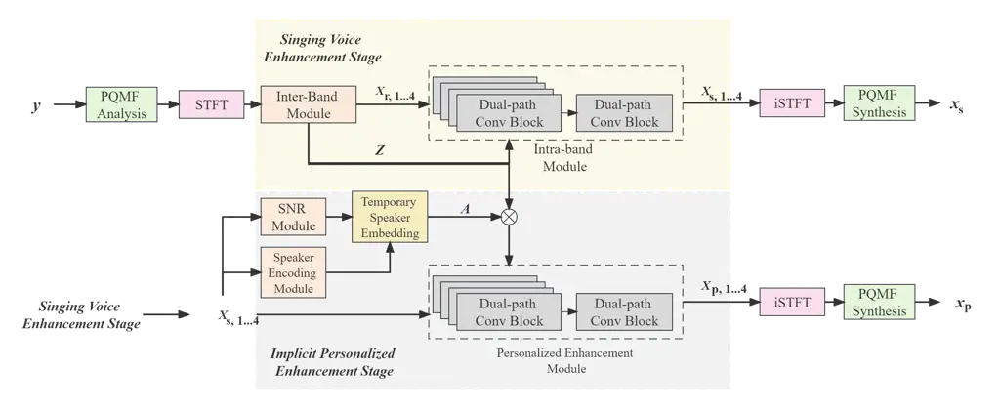
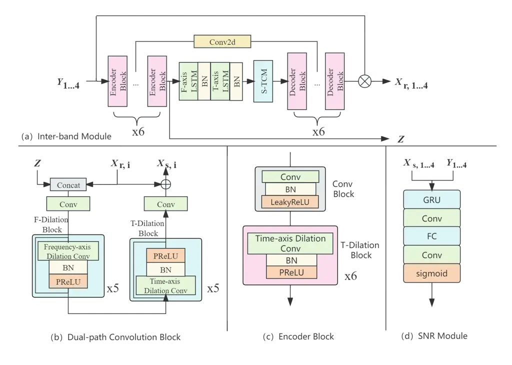
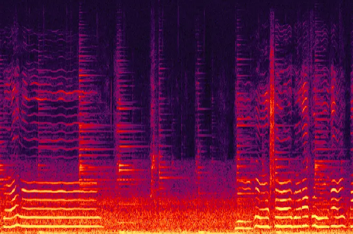
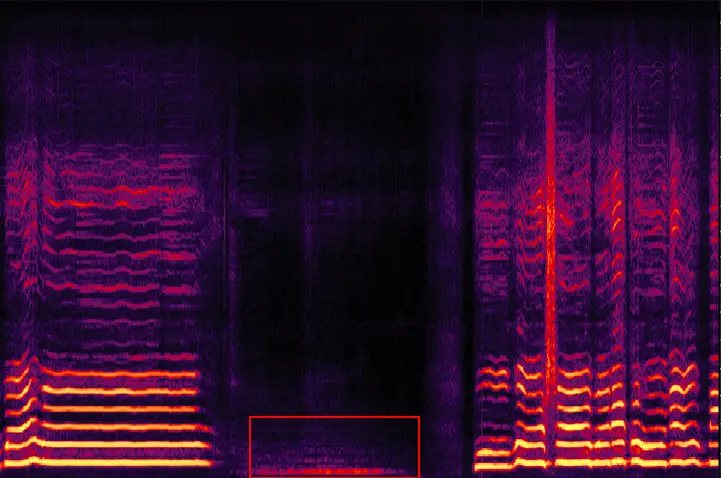
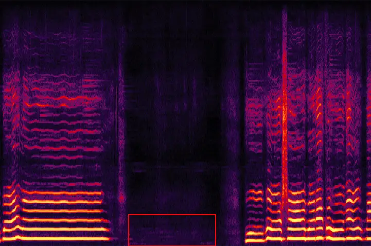
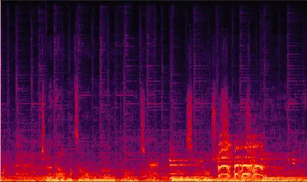
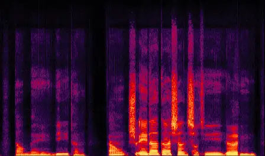
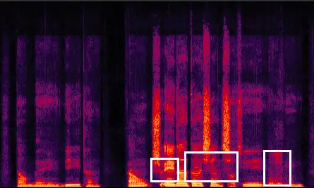

# MBTFNet: Multi-Band Temporal-Frequency Neural Network For Singing Voice Enhancement

Weiming Xu¹, Zhouxuan Chen², Zhili Tan², Shubo Lv¹, Runduo Han¹,
Wenjiang Zhou², Weifeng Zhao², Lei Xie^(1∗) ^(†)^(†)thanks: \*
Corresponding author.

###### Abstract

A typical neural speech enhancement (SE) approach mainly handles speech
and noise mixtures, which is not optimal for singing voice enhancement
scenarios where singing is often mixed with vocal-correlated accompanies
and singing has substantial differences from speaking. Music source
separation (MSS) models treat vocals and various accompaniment
components equally, which may reduce performance compared to the model
that only considers vocal enhancement. In this paper, we propose a novel
multi-band temporal-frequency neural network (MBTFNet) for singing voice
enhancement, which particularly removes background music, noise and even
backing vocals from singing recordings. MBTFNet combines inter and
intra-band modeling for better processing of full-band signals.
Dual-path modeling in the temporal and frequency axis and temporal
dilation blocks are introduced to expand the receptive field of the
model. Particularly for removing backing vocals, we propose an implicit
personalized enhancement (IPE) stage based on signal-to-noise ratio
(SNR) estimation, which further improves the performance of MBTFNet.
Experiments show that our proposed model significantly outperforms
several state-of-the-art SE and MSS models.

###### Index Terms: 

singing-voice enhancement, implicit personalized enhancement, MBTFNet

^(†)^(†)address: ¹Audio, Speech and Language Processing Group
(ASLP@NPU),  
Northwestern Polytechnical University, Xi’an, China  
²Lyra Lab, Tencent Music Entertainment, Shenzhen, China

## 1 Introduction

With easy access to the internet, user-generated content (UGC) has
become popular on platforms like TikTok, YouTube, and various karaoke
apps. Among UGC, singing recordings provided by users are proliferating.
However, these recordings are often accompanied by background noise,
reverberation, and accompaniment, as they are recorded in ordinary daily
environments. To improve the listening quality and enable further
processing such as remixing and singing transcription, the interference
needs to be removed.

Recent advances in neural speech enhancement (SE) and music source
separation (MSS) can be sensibly leveraged to remove the above
interference in the singing recordings. Mask-based time-frequency (TF)
domain approaches are prevalent in speech enhancement. In these
approaches, a neural network is designed to estimate a mask in TF domain
from simulated clean-noisy speech pairs. The mask is then applied to the
noisy signal at runtime to obtain the clean signal. Early approaches
only considered the magnitude part of the noisy signal until the complex
ratio mask (CRM) \[1\] was proposed with explicit consideration of
phase. Then complex-valued neural network approaches have become popular
for their superior denoising performance. These approaches explicitly
model the real and imaginary parts of the speech spectrum typically by a
U-net-shaped encoder-decoder structure \[2, 3, 4, 5, 6\]. Research
interests have gradually shifted from wide-band (16 kHz) to
super-wide-band and full-band \[7, 8, 9\], triggered by the deep noise
suppression challenge (DNS) series \[10, 11, 12\]. However, increasing
the sampling rate leads to a higher modeling complexity. To address this
challenge, S-DCCRN \[13\] divides the frequency bands into two parts and
performs intra-band and inter-band modeling respectively. MTFAANet \[7\]
expands the receptive fields of the time-axis and frequency-axis with
the specifically designed T-F convolution module (TFCM) to model the
challenging full-band signal. HGCN \[14\] and HGCN+ \[9\] particularly
focus on speech harmonics recovery by a harmonic gated compensation
network. Recently, personalized speech enhancement (PSE) or target
speaker extraction has received a lot of attention \[15, 16, 17, 18\].
In these approaches, enrollment speech from a target speaker can be
adopted as a prior feed to the denoising network, leading to superior
performance, especially in the case of overlapping speech.

With a similar rationale, the goal of music source separation (MSS) is
to particularly separate vocals from background music. In this area,
complex-valued U-nets are also dominant \[19, 20, 21, 22, 23, 24\].
Since the harmonic components that need to be separated between vocals
and other instrumental components have a specific frequency band
distribution, a sub-band division strategy is usually employed to make
the model more focused on a certain frequency band and source type. As a
typical approach, ResUNetDecouple \[21\] uses a very deep structure, a
residual UNet architecture with up to 143 layers, and achieves
state-of-the-art separation performance on the popular MUSDB18 \[25\]
dataset.

Although both speaking and singing originate from the same human vocal
system, they have substantial differences in phoneme usage, tonality,
diction, breathing, and volume. For example, singing has a higher
average intensity level than speech and always features a wider
intensity variation than speech. Likewise, singing occurs at higher
frequency levels than speaking and within a wider range of frequencies.
Differently in pronunciation with speaking, in singing, we always extend
the vowels to the greatest length possible because they carry most of
the sound, but consonants are usually shortened as they are much harder
to project. Singing has a specific rhythm and melody to adhere to.
Sustained notes and vibrato differentiates it from speech. Sometimes in
singing, the lead vocal is also accompanied by backing vocals. On the
other hand, the background music associated with singing also has unique
characteristics. As a coherent background, musical accompaniments mostly
are harmonic, broadband, and highly correlated with singing.

In this paper, we present a neural network approach designed
specifically for enhancing singing voices. Our goal is to remove musical
accompaniments, various types of noise, and even backing vocals. Our
work is inspired by the recent advances in SE and MSS reviewed above,
but it makes substantial improvements that target the unique
characteristics of singing. Specifically, we propose a novel multi-band
temporal-frequency neural network (MBTFNet) with the following designs:

- •
  We design an inter-band and intra-band modeling structure to make it
  easier in distinguishing harmonic structures of vocals and background
  music at the frequency scale.
- •
  To better distinguish fine-grained harmonic structures between vocals
  and background music at a temporal scale, we introduce time-axis
  dilation block (TDB), dual-path RNN (DPRNN) \[26\] and squeezed-TCM
  (STCM) \[5\] to expand the receptive field of the singing enhancement
  model.
- •
  Inspired by the recent advances in personalized speech enhancement, we
  propose an implicit personalized singing enhancement module as a
  secondary stage to further remove residuals and backing vocals. Using
  a signal-to-noise ratio (SNR) estimator, the module can dynamically
  leverage the singer’s singing as a speaker embedding without requiring
  explicit voice enrollment from the singer.

Experiments show that the proposed MBTFNet outperforms several
state-of-the-art SE and MSS models in singing voice enhancement by a
large margin. With the help of the implicit personalized enhancement
module, a further performance gain can be obtained including the
challenging case for backing vocal removal.

## 2 MBTFNet

The noisy singing signal can be described as:

```math
Y(t,f)=X(t,f)+N(t,f)+M(t,f)+B(t,f) \tag{1}
```

where $`Y(t,f)`$, $`X(t,f)`$, $`B(t,f)`$, $`M(t,f)`$ and $`N(t,f)`$
represent the noisy signal, clean singing voice, backing vocal voice,
background music and noise TF-bins, respectively. In our scenario, the
goal is to extract the clean singing voice $`X(t,f)`$ from the input
noisy signal $`Y(t,f)`$. In the singing voice enhancement (SVE) stage,
we introduce the multi-band temporal-frequency neural network (MBTFNet),
consisting of both inter and intra-band modeling, to remove the
background music $`M(t,f)`$ and noise $`N(t,f)`$ from the input signal
$`Y(t,f)`$. For the rest part, we further eliminate the backing vocal
signal $`B(t,f)`$ by an implicit personalized enhancement (IPE) stage.
Fig. 1 shows the overall structure of MBTFNet with SVE and IPE stages.



Figure 1: The overall network structure of MBTFNet.



Figure 2: The design of the inter-band module (a), the dual-path
convolution block (b), the encoder block (c), and the SNR module (d).

### 2.1 Inter- and Intra-Band Modeling

Different from noise, background music has lots of harmonic structure
correlated with vocals, which causes difficulty in singing voice
enhancement.

The complexity of directly modeling full-band signals is large, and the
harmonic components of musical instrument are often distributed within a
specific frequency band. So we design an inter-band and intra-band
modeling structure. Meanwhile, larger receptive field modules are
introduced to better distinguish harmonic structures between vocals and
music. The overall process is shown in Fig. 1, where the input audio
signal $`y`$ is first decomposed into $`C`$ sub-band signals using
Pseudo Quadrature Mirror Filter (PQMF) \[27\]. The complex-valued
spectrogram $`Y_{i}\in\mathbb{C}^{F\times T}`$, $`i=1,...,C`$ are
computed by STFT, where $`F`$ and $`T`$ are the frequency and time
index, and then fed into the inter-band module to get the rough enhanced
result, $`X_{r,i}`$. Similarly to general speech enhancement models,
this module learns the common characteristic of different sub-bands.
Specifically, it adopts the U-Net structure, as shown in Fig. 2(a). The
encoder block consists of a conv block and multiple stacked time-axis
dilation blocks (TDB) which help to expand the receptive field. TDB
consists of a convolution layer with time-axis dilation, a batch norm
layer, and a PReLU layer, as shown in Fig. 2(c). The output of the
stacked encoder blocks, $`Z\in\mathbb{C}^{N\times K\times T}`$, contains
the full-band information and thus will be used in the subsequent
intra-band module and personalized enhancement module, where $`N`$ and
$`K`$ are transformed from $`C`$ and $`F`$ by encoder blocks. The
decoder block has a similar structure to the encoder, where the
convolution layer in the conv block is replaced by a transpose
convolution layer. For the stacked TDBs, the higher one has a higher
number of dilation, in order to make the higher layer have a larger
receptive field. Specifically speaking, the number of dilation is
$`2^{n}`$, where $`n`$ is the layer index beginning from 1.

In order to fully utilize the full-band information, each rough enhanced
sub-band $`X_{r,i}`$ is concatenated with the full-band feature $`Z`$,
as the input of dual-path convolution blocks (DPCB). The intra-band
module aims to learn the unique characteristic of each band, thus it
consists of $`C`$ DPCBs. Each DPCB focus on the harmonic components of
musical instrument in its corresponding sub-band, which makes the
learning process easier and the elimination ability better. DPCB is
stacked by two types of layers, namely the time-axis dilation
convolution layer and the frequency-axis dilation convolution layer,
which helps to extract features of each sub-band adequately, as shown in
Fig. 2(b). The higher dilation block has a higher number of dilation, as
the $`2^{n}`$ setup above.

After removing the background music and noise in each band, another DPCB
is used to merge the enhanced sub-bands as $`X_{s,i}`$, as shown in
Fig. 1.

### 2.2 Implicit Personalized Enhancement

To further eliminate the backing vocals and the residual harmonics of
background music, we design an implicit personalized enhancement (IPE)
stage to extract the voice of the lead vocalist. It consists of an SNR
module \[28\], a speaker encoding module (SEM) and a personalized
enhancement module (PEM). The SNR module is responsible for evaluating
the cleanliness of $`Y(t,f)`$, and the SEM extracts the speaker
embedding from the previous enhancement result $`X_{s,i}`$. The PEM
further removes the backing vocals and the residual harmonics of
background music according to the cleanliness and the speaker
information above.

The SNR module is shown in Fig. 2(d), which is composed of a GRU layer,
a convolution layer, and a sigmoid layer. The SEM is a pre-trained
ECAPA-TDNN \[29\]. The PEM has roughly the same structure as the
intra-band module, and an additional convolution layer is added to map
the output $`a\in\mathbb{R}^{192}`$ of SEM to
$`A\in\mathbb{R}^{N\times K}`$. $`A`$ is multiplied by $`Z`$ and
combined with $`X_{\text{s}}`$ as the input of PEM to get
$`X_{\text{p}}`$.

Temporary speaker embedding $`E`$ is updated using the SNR module and
SEM. The SNR module aims to estimate the cleanliness score $`S`$ of
$`y`$. The cleanliness score $`S`$ at time $`t`$, $`S_{t}`$, can be
obtained from $`X`$ and $`Y`$ as
$`S_{t}=\log_{10}({\sum_{f}|X_{t,f}|}/{\sum_{f}|Y_{t,f}|})`$ and it is
normalized by its mean and variance in the entire training set.

For inference, we update the temporary speaker embedding when the model
predicted cleanliness score $`\hat{S}`$ is high enough. A higher
$`\hat{S}`$ means a more reliable speaker embedding. The update rule is
shown in Algorithm 1. The weight $`\alpha`$ and SNR threshold
$`\lambda`$ in Algorithm 1 are hyper-parameters.

Input: $`X_{s},\lambda`$

Result: $`E`$

1 $`E\leftarrow\vec{1}`$;

2 while _chunk in chunks_ do

    3
$`\bar{\hat{S}}\leftarrow\frac{1}{T}\sum_{t}\text{SNR}(X_{s,t},Y_{t})`$;

    4 if _$`\bar{\hat{S}}>=\lambda`$_ then

       5 $`E\leftarrow\alpha E+(1-\alpha)\text{SEM}(X_{s})`$;

    6 end if

7 end while

Algorithm 1 Update temporary speaker embedding $`E`$ in inference.

During training, we use a clean enrollment to estimate the speaker
embedding, therefore we assume it is always clean enough and do not
require SNR threshold $`\lambda`$. The hyper-parameter $`\lambda`$ for
inference can be set manually. In our experiments, it is learned as the
mean of $`\bar{\hat{S}}`$ in Algorithm 1 during training and referring
to it as $`\lambda_{t}`$.

## 3 Training Objective

For the SVE stage, we combine the SI-SNR \[30\] loss
$`\mathbb{L}_{\text{SI-SNR}}`$ with complex mean square error (cMSE)
loss $`\mathbb{L}_{\text{cMSE}}`$ as the loss function:
$`\mathbb{L}_{\text{SVE}}=\mathbb{L}_{\text{SI-SNR}}(X,X_{s})+\mathbb{L}_{\text{cMSE}}(X,X_{s})`$.

For the IPE stage training, the frozen well-trained inter and intra-band
modules of MBTFNet are required. Then the model needs to learn both SNR
estimation and personalized enhancement. The SNR score loss
$`\mathbb{L}_{\text{SNR}}`$ is defined as the mean square error (MSE)
between the ground truth $`S`$ and the model predicted score
$`\hat{S}`$.

The final loss function of the IPE stage is:

```math
\begin{split}\mathbb{L}_{\text{IPE}}&=\mathbb{L}_{\text{SI-SNR}}(X,X_{p})+\mathbb{L}_{\text{cMSE}}(X,X_{p})\\
&+10\mathbb{L}_{\text{SNR}}(S,\hat{S}).\end{split} \tag{2}
```

## 4 Experiment

### 4.1 Datasets

We utilize the clean vocals and accompaniments from the MUSDB18HQ \[25\]
dataset, which consists of 100 training tracks and 50 test tracks. For
our experimental noise set, we employ the noise set of Deep Noise
Suppression 2022 (DNS2022) \[12\] and randomly select 60 hours for
training noise and 10 hours for test noise.

The training pairs are simulated by dynamically mixing the vocal and its
corresponding accompaniment with a random SNR ranging from -5 to 15dB,
and then mixing the mixture and noise with a random SNR ranging from -5
to 15 dB. To simulate the test set, we apply the same rules to each
vocal track of the MUSDB18HQ test set. Each test vocal track is used to
simulate 5 mixture audio, resulting in a total of 250 audio tracks.

MUSDB18HQ is a classic music separation dataset, but some of its vocal
tracks contain both lead vocals and backing vocals. This can cause
issues during the training and testing of the IPE stage. Therefore, we
use the M4Singer \[31\] dataset for the IPE stage experiments. M4Singer
is an unaccompanied singing dataset that includes 10 male and 10 female
singers, with a total of 700 vocals. Vocals from 8 males and 7 females
are used in the training, while the remaining vocals are used for
testing. We apply the same rules as the MUSDB18HQ test set to generate
the without-backing test set. We then mix the without-backing test set
with vocals to generate the random-backing test sets. The random-backing
test sets select random vocals as the backing vocals, which can result
in gaps with the real audio. To address this, we refer to \[32\] and
propose a selection method to simulate the selected-backing test set. We
randomly select 10 vocal tracks and choose the one with the highest
cross-correlation of chroma features with the lead vocal, then randomly
raise or lower the backing vocal by two semitones, and then mix them
with a random SNR ranging from 5 to 10 dB to generate desired audio.

### 4.2 Training Setup and Baselines

All training and test data are at a 44.1kHz sampling rate. A frame of 20
ms with a shift of 10 ms is used for STFT computation. We vary the
learning rate during training as

```math
lr=d^{-0.5}\cdot\min(\text{step}^{-0.5},\text{step}\cdot\text{warmup\_steps}^{-1.5}) \tag{3}
```

where $`d=1\mathrm{e}{-3}`$ and warmup_steps=5000. All models in Table 1
were trained using the Adam optimizer under identical conditions to
suppress both noise and music until no further improvement was observed.
The detailed configuration of MBTFNet is as follows, and the other
models for comparative experiments on MUSDB18HQ are configured according
to their papers. The SEM uses a pre-trained ECAPA-TDNN model and fixes
the weights in experiments.

The PQMF splits the signal into 4 sub-band signals. The inter-band
module has 6 encoder blocks and decoder blocks, the channel of encoder
blocks are \[8, 64, 64, 64, 128, 128\], and the kernel size of encoder
blocks are (5, 2). Each encoder block contains 6 TDBs and all the kernel
size in TDB is (3,3). The decoder block is the same as the encoder
block. The layer number of the frequency-axis and time-axis is 2, and
their rnn-units are 256 with 1 STCM layer. The intra-band module
consists of 4 DPCBs. Each DPCB has 5 FDBs and 5 TDBs, and their kernel
size is (3,3).

The ECAPA-TDNN configures with 1024 channels. In the SNR Module, the
number of GRU layers is 2 and the rnn-units are 256, followed by a
convolution layer with an input channel of 1, an output channel of 2,
and a kernel size of (3, 3). The DPCB in PEM is the same as the
intra-band module.

When conducting experiments on the M4Singer dataset, we first train the
SVE part for 100 epochs, then freeze it to train the IPE part for 50
epochs. When training the IPE part, the mixture has a backing vocal with
a probability of 0.5, and corresponding enrollment audio is provided.

### 4.3 Experimental Results and Discussion

We first conduct model comparison and ablation experiments on the
MUSDB18HQ simulation test set, using SI-SNR and PESQ as objective
metrics, and the experimental results are shown in Table 1. MBTFNet
(causal) achieves the highest metrics among experiment speech
enhancement models, where SI-SNR and PESQ are 1.39dB and 0.14 higher
than the second-best S-DCCRN, respectively. MBTFNet (no causal) is
better than the music separation model ResUNetDecouple, where SI-SNR and
PESQ are 1.63dB and 0.32 higher, respectively.

MBTFNet-A, MBTFNet-B and MBTFNet-C are ablation experiments, where
MBTFNet-A means that the full-band signal is directly modeled without
PQMF, MBTFNet-B means that all sub-bands are modeled in one Intra-band
Module, and MBTFNet-C means that the Intra-band Module is removed. We
keep the parameters of MBTFNet-A and MBTFNet-B consistent with MBTFNet.
Ablation experiments show that modeling each sub-band individually
improves the performance of MBTFNet.

|                        |                |            |             |      |
| ---------------------- | -------------- | ---------- | ----------- | ---- |
| Model                  | Causal         | Param. (M) | SI-SNR (dB) | PESQ |
| Noisy                  | \-             | \-         | 0.49        | 1.79 |
| HGCN+ \[9\]            | $`\checkmark`$ | 7.03       | 7.25        | 2.49 |
| S-DCCRN \[13\]         | $`\checkmark`$ | 2.04       | 7.43        | 2.60 |
| MBTFNet                | $`\checkmark`$ | 4.08       | 8.82        | 2.74 |
| ResUNetDecouple \[21\] | ✗              | 103        | 7.97        | 2.63 |
| MBTFNet-A              | ✗              | 8.57       | 8.62        | 2.80 |
| MBTFNet-B              | ✗              | 8.54       | 8.49        | 2.86 |
| MBTFNet-C              | ✗              | 8.43       | 9.11        | 2.94 |
| MBTFNet                | ✗              | 8.54       | 9.60        | 2.95 |

Table 1: Comparison with various models on MUSDB18HQ simulation test
set.

After verifying the model performance of MBTFNet on the MUSDB18HQ
simulation test set, we continue to experiment with the IPE on the
M4Singer simulation test set. The experiment tests three values of
$`\lambda`$: 0, $`\lambda_{t}`$, and 1. When $`\lambda`$=0, every
$`X_{s}`$ is accepted to update the speaker embedding. When
$`\lambda`$=1, $`X_{s}`$ is not accepted to update the speaker
embedding, making two-stage MBTFNet degenerate into one-stage MBTFNet.
$`\lambda_{t}`$ is obtained during training. The experiments are
conducted on three types of test sets: without-backing,
selected-backing, and random-backing. The results are shown in Table 2.
Where Noisy, IPE, and PE respectively represent no enhancement, implicit
personalized enhancement, and personalized enhancement. First, we
compare the IPE at different values of $`\lambda`$. Among all
$`\lambda`$ values tested, $`\lambda_{t}`$ achieves the highest metrics
in all three test sets. Compared to $`\lambda`$=1,
$`\lambda`$=$`\lambda_{t}`$ achieves a further improvement on the test
set. This demonstrates that using the IPE can further remove residual
noise generated by the SVE stage. $`\lambda`$=0 receives the lowest
metrics, which indicates that the SNR estimator contributes to the IPE
stage.

Second, we compare the performance of temporary speaker embedding with
directly provided speaker enrollments obtained from the same singer’s
other songs, which we refer to as personalized enhancement (PE). The
explicit speaker enrollment is extracted from a random 20-second segment
by the same singer in the test set. As shown in Table 2, IPE has better
performance than PE. The reason is that the speaker module designed for
speech undergoes a reduction in its effectiveness when applied in the
singing scene. In the case of PE, there may be a mismatch between the
extracted speaker characteristics from the enrollment and test audio, as
they are obtained from different songs, leading to a decrease in the
performance of personalized enhancement. In our proposed IPE module, the
temporary speaker embedding is extracted from the previous part of the
test audio, thus the speaker characteristic suffers from less mismatch.

Fig. 3 shows the spectra of $`\lambda`$ valued 1 and $`\lambda_{t}`$ in
the without-backing (above) and selected-backing (below) test set. In
the without-backing samples, there are some piano accompaniment
residuals if only using the SVE stage, but these residuals are further
eliminated in the IPE stage. In the second group of samples (below), the
backing vocalist is eliminated by the IPE stage.

|       | Use SEM        | $`\lambda`$     | without-backing |      | selected-backing |      | random-backing |      |
| ----- | -------------- | --------------- | --------------- | ---- | ---------------- | ---- | -------------- | ---- |
|       |                |                 | SI-SNR          | PESQ | SI-SNR           | PESQ | SI-SNR         | PESQ |
| Noisy |                | \-              | 0.56            | 1.17 | -1.28            | 1.13 | -1.23          | 1.15 |
| IPE   | ✗              | 1               | 14.17           | 3.06 | 7.54             | 2.60 | 7.48           | 2.59 |
| IPE   | Auto           | $`\lambda_{t}`$ | 14.50           | 3.07 | 7.95             | 2.68 | 8.01           | 2.69 |
| IPE   | $`\checkmark`$ | 0               | 13.13           | 3.00 | 6.92             | 2.53 | 6.98           | 2.52 |
| PE    | $`\checkmark`$ | \-              | 13.14           | 2.93 | 7.73             | 2.62 | 7.82           | 2.67 |

Table 2: Performance on personalized singing voice enhancement for
MBTFNet on M4Singer simulation test set. When $`\lambda=1`$, no speaker
embedding is updated by SEM; when $`\lambda=\lambda_{t}`$, the speaker
embedding is automatically updated if the enhanced speech is clean
enough; when $`\lambda=0`$, the speaker embedding is always updated.













Figure 3: MBTFNet samples on the without-backing (above) and
selected-backing (below) test set. The input audio (left) contains
noise, accompaniment, etc. The output of the SVE stage (middle) only has
some accompaniment residuals, and the output of the IPE stage (right)
further removes them.

## 5 Conclusions

This paper has focused on singing voice enhancement, designing a novel
Multi-Band Temporal-Frequency Neural Network (MBTFNet) to particularly
address the challenges in the singing scene. By further introducing an
implicit personalized enhancement (IPE) stage with an automatic speaker
enrollment strategy, MBTFNet gets a stronger ability to distinguish the
target singer from background music and backing vocals. Our proposed
model achieves the best metrics in the MUSDB18HQ simulation test set as
compared with SOTA SE and MSS models and obtains significant improvement
on the M4singer simulation test set by using the IPE stage.

## References

- \[1\] Donald S Williamson, Yuxuan Wang, and DeLiang Wang, “Complex
  ratio masking for monaural speech separation,” IEEE/ACM transactions
  on audio, speech, and language processing, vol. 24, no. 3, pp.
  483–492, 2015.
- \[2\] Olaf Ronneberger, Philipp Fischer, and Thomas Brox, “U-net:
  Convolutional networks for biomedical image segmentation,” in Medical
  Image Computing and Computer-Assisted Intervention–MICCAI 2015: 18th
  International Conference, Munich, Germany, October 5-9, 2015,
  Proceedings, Part III 18. Springer, 2015, pp. 234–241.
- \[3\] Hyeong-Seok Choi, Jang-Hyun Kim, Jaesung Huh, Adrian Kim,
  Jung-Woo Ha, and Kyogu Lee, “Phase-aware speech enhancement with deep
  complex u-net,” in International Conference on Learning
  Representations, 2019.
- \[4\] Yanxin Hu, Yun Liu, Shubo Lv, Mengtao Xing, Shimin Zhang, Yihui
  Fu, Jian Wu, Bihong Zhang, and Lei Xie, “DCCRN: Deep Complex
  Convolution Recurrent Network for Phase-Aware Speech Enhancement,” in
  Interspeech, 2020, pp. 2472–2476.
- \[5\] A. Li, W. Liu, C. Zheng, C. Fan, and X. Li, “Two heads are
  better than one: A two-stage complex spectral mapping approach for
  monaural speech enhancement,” IEEE/ACM, 2021.
- \[6\] Ke Tan, Xueliang Zhang, and DeLiang Wang, “Real-time speech
  enhancement using an efficient convolutional recurrent network for
  dual-microphone mobile phones in close-talk scenarios,” in ICASSP
  2019-2019 IEEE International Conference on Acoustics, Speech and
  Signal Processing (ICASSP). IEEE, 2019, pp. 5751–5755.
- \[7\] Guochang Zhang, Libiao Yu, Chunliang Wang, and Jianqiang Wei,
  “Multi-scale temporal frequency convolutional network with axial
  attention for speech enhancement,” in ICASSP 2022-2022 IEEE
  International Conference on Acoustics, Speech and Signal Processing
  (ICASSP). IEEE, 2022, pp. 9122–9126.
- \[8\] Shengkui Zhao, Bin Ma, Karn N Watcharasupat, and Woon-Seng Gan,
  “Frcrn: Boosting feature representation using frequency recurrence for
  monaural speech enhancement,” in ICASSP 2022-2022 IEEE International
  Conference on Acoustics, Speech and Signal Processing (ICASSP). IEEE,
  2022, pp. 9281–9285.
- \[9\] Tianrui Wang, Weibin Zhu, Yingying Gao, Yanan Chen, Junlan Feng,
  and Shilei Zhang, “Harmonic gated compensation network plus for icassp
  2022 dns challenge,” in ICASSP 2022-2022 IEEE International Conference
  on Acoustics, Speech and Signal Processing (ICASSP). IEEE, 2022, pp.
  9286–9290.
- \[10\] Chandan KA Reddy, Vishak Gopal, Ross Cutler, Ebrahim Beyrami,
  Roger Cheng, Harishchandra Dubey, Sergiy Matusevych, Robert Aichner,
  Ashkan Aazami, Sebastian Braun, et al., “The INTERSPEECH 2020 Deep
  Noise Suppression Challenge: Datasets, Subjective Testing Framework,
  and Challenge Results,” in Proc. Interspeech 2020, 2020, pp.
  2492–2496.
- \[11\] Chandan KA Reddy, Harishchandra Dubey, Kazuhito Koishida, Arun
  Nair, Vishak Gopal, Ross Cutler, Sebastian Braun, Hannes Gamper,
  Robert Aichner, and Sriram Srinivasan, “INTERSPEECH 2021 Deep Noise
  Suppression Challenge,” in Proc. Interspeech 2021, 2021, pp.
  2796–2800.
- \[12\] Harishchandra Dubey, Vishak Gopal, Ross Cutler, Ashkan Aazami,
  Sergiy Matusevych, Sebastian Braun, Sefik Emre Eskimez, Manthan
  Thakker, Takuya Yoshioka, Hannes Gamper, et al., “Icassp 2022 deep
  noise suppression challenge,” in ICASSP 2022-2022 IEEE International
  Conference on Acoustics, Speech and Signal Processing (ICASSP). IEEE,
  2022, pp. 9271–9275.
- \[13\] Shubo Lv, Yihui Fu, Mengtao Xing, Jiayao Sun, Lei Xie, Jun
  Huang, Yannan Wang, and Tao Yu, “S-dccrn: Super wide band dccrn with
  learnable complex feature for speech enhancement,” in ICASSP 2022-2022
  IEEE International Conference on Acoustics, Speech and Signal
  Processing (ICASSP). IEEE, 2022, pp. 7767–7771.
- \[14\] Tianrui Wang, Weibin Zhu, Yingying Gao, Junlan Feng, and Shilei
  Zhang, “Hgcn: Harmonic gated compensation network for speech
  enhancement,” in ICASSP 2022-2022 IEEE International Conference on
  Acoustics, Speech and Signal Processing (ICASSP). IEEE, 2022, pp.
  371–375.
- \[15\] Ritwik Giri, Shrikant Venkataramani, Jean-Marc Valin, Umut
  Isik, and Arvindh Krishnaswamy, “Personalized PercepNet: Real-Time,
  Low-Complexity Target Voice Separation and Enhancement,” in Proc.
  Interspeech 2021, 2021, pp. 1124–1128.
- \[16\] Yukai Ju, Wei Rao, Xiaopeng Yan, Yihui Fu, Shubo Lv, Luyao
  Cheng, Yannan Wang, Lei Xie, and Shidong Shang, “Tea-pse:
  Tencent-ethereal-audio-lab personalized speech enhancement system for
  icassp 2022 dns challenge,” in ICASSP 2022-2022 IEEE International
  Conference on Acoustics, Speech and Signal Processing (ICASSP). IEEE,
  2022, pp. 9291–9295.
- \[17\] Quan Wang, Hannah Muckenhirn, Kevin Wilson, Prashant Sridhar,
  Zelin Wu, John Hershey, Rif A Saurous, Ron J Weiss, Ye Jia, and
  Ignacio Lopez Moreno, “Voicefilter: Targeted voice separation by
  speaker-conditioned spectrogram masking,” in Interspeech, 2018.
- \[18\] Meng Ge, Chenglin Xu, Longbiao Wang, Eng Siong Chng, Jianwu
  Dang, and Haizhou Li, “SpEx+: A Complete Time Domain Speaker
  Extraction Network,” in Proc. Interspeech 2020, 2020, pp. 1406–1410.
- \[19\] Fabian-Robert Stöter, Stefan Uhlich, Antoine Liutkus, and Yuki
  Mitsufuji, “Open-unmix-a reference implementation for music source
  separation,” Journal of Open Source Software, vol. 4, no. 41, pp.
  1667, 2019.
- \[20\] Alexandre Défossez, Nicolas Usunier, Léon Bottou, and Francis
  Bach, “Music source separation in the waveform domain,” arXiv preprint
  arXiv:1911.13254, 2019.
- \[21\] Qiuqiang Kong, Yin Cao, Haohe Liu, Keunwoo Choi, and Yuxuan
  Wang, “Decoupling magnitude and phase estimation with deep resunet for
  music source separation,” in International Society for Music
  Information Retrieval Conference, 2021.
- \[22\] Tingle Li, Jiawei Chen, Haowen Hou, and Ming Li, “Sams-net: A
  sliced attention-based neural network for music source separation,” in
  2021 12th International Symposium on Chinese Spoken Language
  Processing (ISCSLP). IEEE, 2021, pp. 1–5.
- \[23\] Yi Luo and Jianwei Yu, “Music source separation with band-split
  rnn,” arXiv preprint arXiv:2209.15174, 2022.
- \[24\] Haohe Liu, Qiuqiang Kong, and Jiafeng Liu, “Cws-presunet: Music
  source separation with channel-wise subband phase-aware resunet,”
  arXiv preprint arXiv:2112.04685, 2021.
- \[25\] Zafar Rafii, Antoine Liutkus, Fabian-Robert Stöter,
  Stylianos Ioannis Mimilakis, and Rachel Bittner, “The musdb18 corpus
  for music separation,” 2017.
- \[26\] Yi Luo, Zhuo Chen, and Takuya Yoshioka, “Dual-path rnn:
  efficient long sequence modeling for time-domain single-channel speech
  separation,” in ICASSP 2020-2020 IEEE International Conference on
  Acoustics, Speech and Signal Processing (ICASSP). IEEE, 2020, pp.
  46–50.
- \[27\] P. P. Vaidyanathan, “Multirate systems and filter banks,”
  Prentice Hall Signal Processing Series, 1993.
- \[28\] Shubo Lv, Yanxin Hu, Shimin Zhang, and Lei Xie, “DCCRN+:
  Channel-Wise Subband DCCRN with SNR Estimation for Speech
  Enhancement,” in Proc. Interspeech 2021, 2021, pp. 2816–2820.
- \[29\] Brecht Desplanques, Jenthe Thienpondt, and Kris Demuynck,
  “ECAPA-TDNN: Emphasized Channel Attention, Propagation and Aggregation
  in TDNN Based Speaker Verification,” in Proc. Interspeech 2020, 2020,
  pp. 3830–3834.
- \[30\] Jonathan Le Roux, Scott Wisdom, Hakan Erdogan, and John R
  Hershey, “Sdr–half-baked or well done?,” in ICASSP 2019-2019 IEEE
  International Conference on Acoustics, Speech and Signal Processing
  (ICASSP). IEEE, 2019, pp. 626–630.
- \[31\] Lichao Zhang, Ruiqi Li, Shoutong Wang, Liqun Deng, Jinglin Liu,
  Yi Ren, Jinzheng He, Rongjie Huang, Jieming Zhu, Xiao Chen, et al.,
  “M4singer: A multi-style, multi-singer and musical score provided
  mandarin singing corpus,” in Thirty-sixth Conference on Neural
  Information Processing Systems Datasets and Benchmarks Track, 2022.
- \[32\] Siyuan Yuan, Zhepei Wang, Umut Isik, Ritwik Giri, Jean-Marc
  Valin, Michael M Goodwin, and Arvindh Krishnaswamy, “Improved singing
  voice separation with chromagram-based pitch-aware remixing,” in
  ICASSP 2022-2022 IEEE International Conference on Acoustics, Speech
  and Signal Processing (ICASSP). IEEE, 2022, pp. 111–115.
