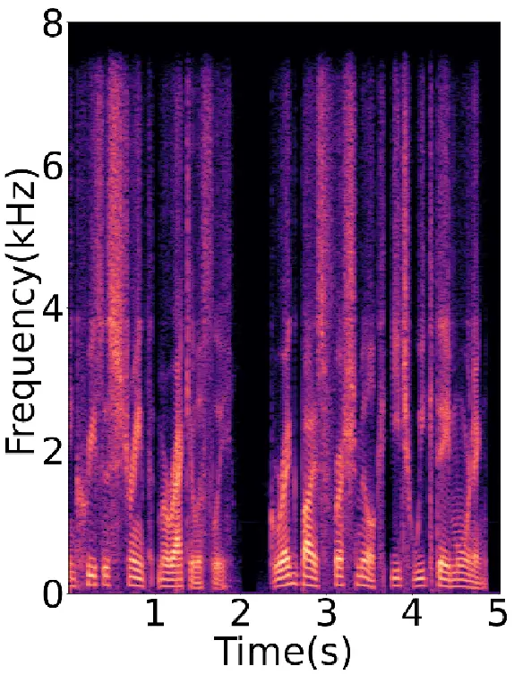
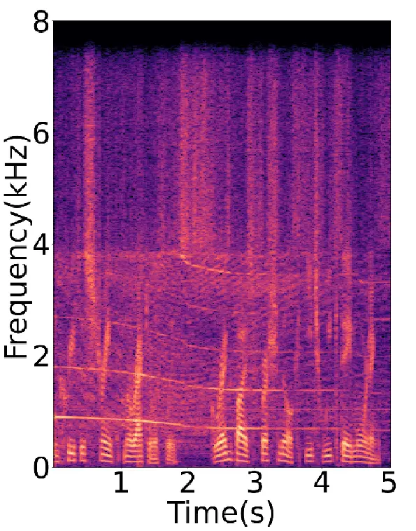
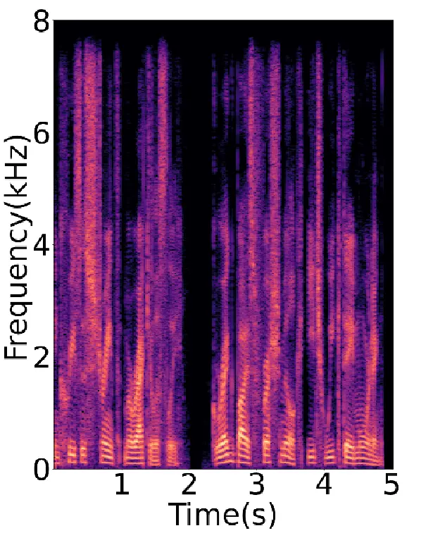
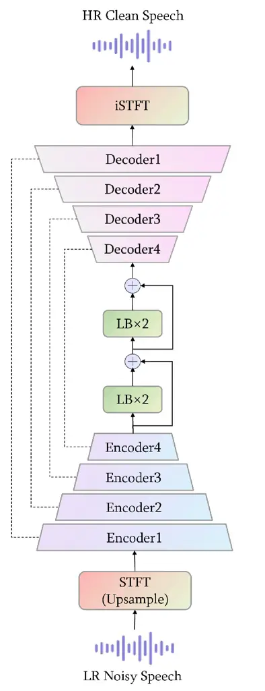
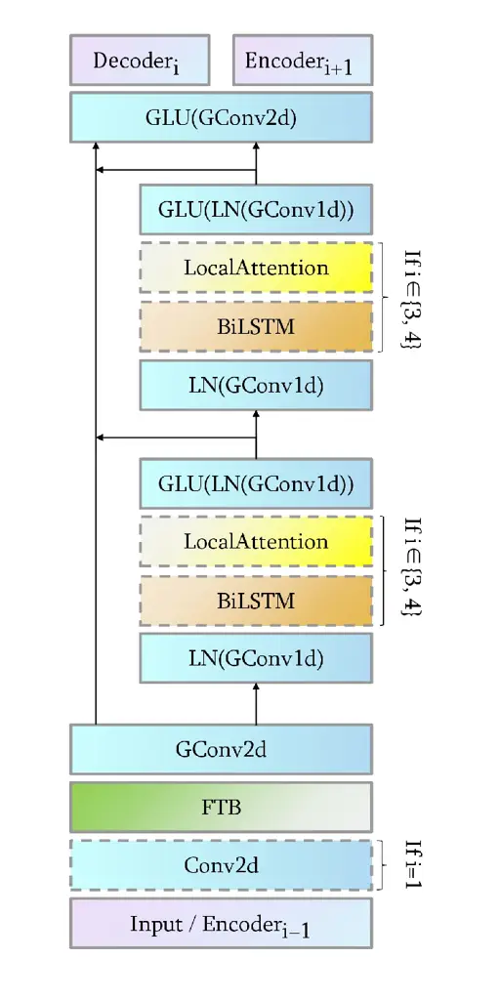
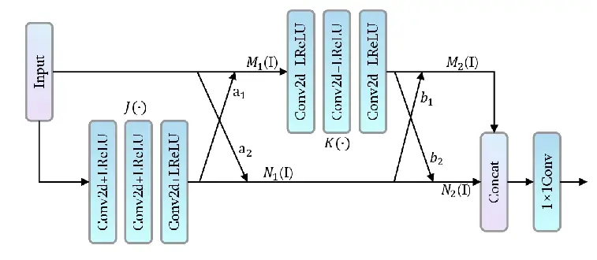

# SUPER DENOISE NET: SPEECH SUPER RESOLUTION WITH NOISE CANCELLATION IN LOW SAMPLING RATE NOISY ENVIRONMENTS

Junkang Yang    Hongqing Liu    Lu Gan    Yi Zhou

###### Abstract

Speech super-resolution (SSR) aims to predict a high resolution (HR)
speech signal from its low resolution (LR) corresponding part. Most
neural SSR models focus on producing the final result in a noise-free
environment by recovering the spectrogram of high-frequency part of the
signal and concatenating it with the original low-frequency part.
Although these methods achieve high accuracy, they become less effective
when facing the real-world scenario, where unavoidable noise is present.
To address this problem, we propose a Super Denoise Net (SDNet), a
neural network for a joint task of super-resolution and noise reduction
from a low sampling rate signal. To that end, we design gated
convolution and lattice convolution blocks to enhance the repair
capability and capture information in the time-frequency axis,
respectively. The experiments show our method outperforms baseline
speech denoising and SSR models on DNS 2020 no-reverb test set with
higher objective and subjective scores.

###### Index Terms: 

Speech super-resolution, bandwidth extension, speech enhancement, joint
task

^(†)^(†)address: ¹ School of Communications and Information
Engineering,  
Chongqing University of Posts and Telecommunications (CQUPT), Chongqing,
China  
² Intelligent Speech and Audio Research Lab (ISARL), CQUPT, Chongqing,
China  
³ Department of Electrical and Electronics Engineering, Brunel
University, London, U.K.

## 1 Introduction

Speech super-resolution (SSR) is the task to reconstructing the
high-frequency part of the speech signal from its low-frequency part,
which can be considered as bandwidth extension (BWE) in frequency
domain. As one of the important tasks in the front-end of speech
processing, SSR is widely applied in wireless communication, speech
recognition \[1\], text-to-speech \[2\], to name a few.

After decades of developments, a large number of SSR neural models have
been proposed. Early methods based on deep neural network (DNN) \[3\]
show an acceptable performance by directly simulating the nonlinear
relationship between the high frequency part and the low frequency part
to improve the speech quality. The convolutional structures and
Recurrent Neural Networks (RNN) have also been adopted in subsequent
research \[4, 5\], and these works extend the receptive field with less
computational cost, addressing the lack of features captured by
feed-forward convolutional models as well as the problem of vanishing
gradients. In terms of feature dimensions, most models choose to operate
in the raw waveform domain or in the frequency domain using short-time
Fourier Transform (STFT) as input features. In recent works, generative
models such as generative adversarial networks and diffusion-based
approaches have achieved good results \[6, 2, 7, 8\].







Figure 1: Spectrograms of reconstructed and original signals. (a)
Reconstruction from the clean input. (b) Recovery from the noisy input.
(c) Original high-resolution ground truth.

Although SSR has achieved considerable progress, few studies have
focused on the task of SSR in noisy environments, i.e., bandwidth
extension along with the noise suppression. Existing frequency domain
based work basically keeps the low-frequency part and predicts only the
high-frequency part, and finally concatenates the two parts in series.
In a noise-free environment, this concept can achieve good results, but
when noise exists in the low-frequency part, it not only fails to remove
the noise, but also produces the biased prediction of high-frequency
part due to noise interference. This situation is illustrated in Figure
1, where the noisy high-resolution signal is generated due to the noise,
see 1(b). Since most of the training data do not contain noise, the
robustness of the model in noisy environments is bound to be greatly
reduced. In \[9\], the authors proposed an algorithm of robust BWE
algorithm for speech with additive noise, transforming the narrowband
spectral envelope into a wideband one in mel frequency cepstral
coefficients (MFCC) domain. In \[10\], the authors introduced a
multi-stage model, each of which focuses on noise reduction, corpus
matching, and bandwidth extension, respectively. By predicting the
intermediate representation at analyze stage and reconstructing the
entire spectrogram with a GAN at synthesis stage, this concept \[11\]
can be used for general speech restoration, including SSR, denoising,
dereverberation and inpainting. In \[12\], authors combine UNet+AFiLM
\[5\] and an improved DTLN \[13\] to form a two-stage system. The
authors in \[14\] simultaneously estimate the missing components and the
noise distribution in degraded speech signal with a DNN.





Figure 2: Architectures of (a) Network and (b) Encoder

To improve the performance of SSR in noisy environments, we propose
Super Denoise Net (SDNet), a neural network that removes noise while
extending the bandwidth. Inspired by image restoration \[15, 16\], we
introduce gated convolution to enhance the generative capability of the
network, and set lattice convolution blocks in the bottleneck layer to
gain more information in the time-frequency domain. We train the model
with large datasets containing noises. The experiments show our method
substantially outperforms existing SSR models in evaluation metrics such
as Perceptual Evaluation of Speech Quality (PESQ), Short-Time Objective
Intelligibility (STOI), and DNSMOS, and even outperforms some models
only focusing on noise reduction. Additionally, the ablation study
demonstrates the impacts of our design on model performance.

## 2 Methods

### 2.1 Problem Settings

In this paper, we address the problem of recovering HR clean speech from
LR noisy speech. Given a HR clear speech $`y\in R^{T}`$, where $`T`$ is
the length, after downsampling $`s`$ times and adding noise at the same
sampling rate with the same length, the LR noisy speech
$`x_{noisy}\in R^{\frac{T}{s}}`$ is generated. Our goal is to design a
function $`f`$ that can efficiently predict $`y`$ from the observation
$`x_{noisy}`$, i.e., $`\hat{y}=f(x_{noisy})\approx{y}`$. The same
representation as above will be used in the formulas below.

### 2.2 Network Architecture

Our model uses a U-shaped structure similar to \[17\], containing
encoders, decoders, and lattice convolution blocks (LBs) as bottleneck
layers. The residual connections are set between encoders and decoders,
also between the lattice convolution blocks. Model architecture is
visualized in Figure 2 (a). Due to space limit, we provide parameter
settings, input size, and output size for each layer at our demo page¹¹
1 [https://sdnetdemo.github.io/](https://sdnetdemo.github.io/).

Upsample. The network operates in the spectral domain, and Short-time
Fourier Transform (STFT) to the waveform input is required. Since the
network predicts the full spectrogram, the signal needs to be upsampled
at this stage to ensure that the input and output spectral are of the
same scale. We follow the upsample method in \[17\], using a window
length and hop length that is $`\frac{1}{s}`$ of those at the iSTFT
stage while keeping the FFT bins constant. The window length, hop
length, and FFT bins of iSTFT are 512, 512, and 64. We also move the
complex part to the channel dimension at STFT stage.

Encoder and decoder. As illustrated in Figure 2, there are 4 layers in
encoder and decoder each. The input of encoder is the spectrogram of
upsampled waveform and it will be reshaped at the first encoder layer
with a 2D convolution. After that, a frequency transform block (FTB)
\[18\] is applied to capture the non-local correlations in spectrogram
along the frequency axis. Unlike previous work, we utilize gated
convolution (GConv) \[15\] instead of ordinary convolution in the later
structure, which enhances the model generation by learning a dynamic
feature selection mechanism for each channel and each spatial location.
Inside the encoder, there are two residual branches with two 1D gated
convolutions at the beginning and end. In the middle, there are LSTM and
temporal-based attention modules to capture long-distance relations.
Followed by each encoder layer is a decoder layer that recovers the
latent vectors equal to the size of spectrogram before passing the
encoder. Its structure is the same as \[17\]. It is worth noting that
there is concatenated residual connection between each encoder and
decoder layer, while between two residual branches within the encoder
layer, it is a summation residual connection.



Figure 3: Lattice convolution block (LB).

Bottleneck layers. The bottleneck layers include 4 lattice convolution
blocks (LBs), which were first proposed in image restoration task
\[16\]. As shown in Figure 3, each LB includes paired butterfly-style
structures. The input passes two branches that contain several
convolution layers and LeakyReLU activation layer is followed for each
layer. The two branches interact with each other through learnable
combination coefficients. Specifically, given an input feature $`I`$,
the first combination is

```math
M_{1}(I)=I+a_{1}J(I), \tag{1}
```

```math
N_{1}(I)=a_{2}I+J(I), \tag{2}
```

where $`J(\cdot)`$ denotes to the implicit non-linear function of
several layers shown in Figure 3. Similarly, the second combination is

```math
M_{2}(I)=b_{1}N_{1}+K(M_{1}(I)), \tag{3}
```

```math
N_{2}(I)=N_{1}+b_{2}K(M_{1}(I)). \tag{4}
```

Afterwards, the output of two branches are merged in channel dimension
and then compressed through a 1×1 convolution layer. The final output is

```math
\begin{split}O&=Conv(Concat(M_{2}(I),N_{2}(I))).\end{split} \tag{5}
```

The combination coefficients are mainly determined in the following way.
The mean and standard deviation in channel dimension are first obtained
by global mean pooling in the upper branch and global standard deviation
pooling in the lower branch. Then, those statistics in the two branches
are passed through two fully connected layers, each followed by ReLU and
Sigmoid activation functions, respectively. Finally, the outputs of the
two branches are averaged to obtain the combined coefficients. The LB
structure can dynamically adjust the dominance of different branches to
fit different data through learnable combination coefficients, and its
number of parameters is small. The combination of gated convolutions and
lattice blocks could offer a blend of structured interpolation with
adaptive, long-range context modeling, making it a potentially powerful
tool for enhancing speech signals.

### 2.3 Loss Function

We draw on the training methods of \[19\] and \[17\], where the model is
trained using an adversarial approach. We also use a multi-scale STFT
loss with FFT bins $`\in\left\{512,1024,2048\right\}`$ and hop length
$`\in\left\{50,120,240\right\}`$ to jointly train the model. The window
lengths are $`\left\{240,600,1200\right\}`$. On the other hand, the
multi-scale adversarial and feature losses in time domain is added in.
The total loss can be expressed as

```math
\mathcal{L}=\mathcal{L}_{MSTFT}+\mathcal{L}_{adv}+\mathcal{L}_{f}, \tag{6}
```

where $`\mathcal{L}_{MSTFT}`$, $`\mathcal{L}_{adv}`$ and
$`\mathcal{L}_{f}`$ are multi-scale STFT loss, adversarial loss, and
feature loss.

## 3 Experiments

### 3.1 Dataset

We use the dataset provided by Deep Noise Suppression (DNS) Challenge at
ICASSP 2023 \[20\] to generate training data containing noise. We
synthesize clean and noisy speech pairs with 500 hours by randomly
mixing the speech and noise, and each sample lasts for 5 seconds. The
SNR of all samples are at -5 - 20 dB and the sampling rate is 16 kHz. We
then downsample all the noisy speech by a factor of $`s=2`$, i.e.,
turning the paired data into 8 kHz noisy speech and 16 kHz clean speech.
For validation, we separate %10 (50 hours) of total data as validation
set. For testing, the no reverb test set of DNS Challenge 2020 \[21\] is
used and the noisy samples are also downsampled if neccessary.

### 3.2 Baselines

Our model is a multitasking model, so we selected baselines from SSR
models, noise reduction models, and models that consider both tasks. For
SSR models, we compare our model to WSRGlow \[22\] and NU-Wave 2 \[6\].
For denoising models, our model is compared with DCCRN \[23\],
FullSubNet \[24\], and DPT-FSNet \[25\]. For multitasking models, the
baselines are VoiceFixer \[11\] and the network proposed in \[12\]. In
our ablation studies, we retrain AERO \[17\] with the training set
mentioned in section 3.1 as the baseline.

### 3.3 Evaluation Metrics

|                      |        |                         |       |      |          |        |      |
| -------------------- | ------ | ----------------------- | ----- | ---- | -------- | ------ | ---- |
| Method               | Task   | Sampling Rate of Source | Noise | PESQ | STOI (%) | DNSMOS | MOS  |
| Noisy                | —      | 16 kHz                  | ✓     | 2.45 | 91.5     | 2.48   | —    |
| WSRGlow \[22\]       | $`S`$  | 8 kHz                   | ✕     | 4.24 | 99.4     | 3.36   | —    |
| WSRGlow \[22\]       |        |                         | ✓     | 2.44 | 91.0     | 2.47   | —    |
| NU-Wave 2 \[6\]      |        |                         | ✕     | 4.22 | 99.4     | 3.20   | —    |
| NU-Wave 2 \[6\]      |        |                         | ✓     | 2.48 | 91.0     | 2.34   | —    |
| DCCRN \[23\]         | $`D`$  | 16 kHz                  | ✓     | 3.17 | 92.9     | —      | —    |
| FullSubNet \[24\]    |        |                         |       | 3.28 | 95.3     | —      | —    |
| DPT-FSNet \[25\]     |        |                         |       | 3.28 | 95.3     | —      | —    |
| VoiceFixer \[11\]    | $`SD`$ | 8 kHz                   | ✓     | 2.79 | 92.0     | 3.24   | 3.83 |
| UNet + I-DTLN \[12\] |        |                         |       | 2.78 | 91.3     | 2.93   | 3.01 |
| Proposed             |        |                         |       | 3.52 | 97.2     | 3.36   | 4.38 |

Table 1: Performance evaluations, where $`S`$ means super-resolution
only, $`D`$ indicates denoise only, and $`SD`$ means super-resolution
and denoise.

| Mothod                  | PESQ  | STOI (%) |
| ----------------------- | ----- | -------- |
| AERO (retrained) \[17\] | 3.469 | 96.6     |
|       + GConv           | 3.377 | 96.6     |
|       + LBs             | 3.477 | 96.7     |
|       + Both            | 3.522 | 97.2     |

Table 2: Ablation studies on network achitechture.

To evaluate the quality of the generated speech, both objective and
subjective evaluation metrics were used. The objective evaluation
metrics used were PESQ \[26\], STOI \[27\], and DNSMOS \[28\], where
DNSMOS was shown to be highly correlated with human evaluation habits
\[28\]. The subjective evaluation metrics is Mean Opinion Score (MOS)
\[29\]. We randomly selected 50 samples from the test set and asked 15
people to provide MOS values. For all evaluation metrics, the higher
score represents the better listening experience.

### 3.4 Results

For all the models on denoise task only, we have referred to the results
provided in \[30\]. As for other models, except the model in \[12\] and
\[17\], we use the hyperparameters offered by the author to generate the
target speech to evaluate the results. Since the authors did not provide
the source code, we have re-implemented the method proposed in \[12\] to
obtain the results.

Our experiments show that previous SSR models can achieve high PESQ
scores and almost perfect STOI scores in noise-free environment,
indicating that the generated speech is fully understandable. At the
same time, the experiment also verified that when noise is present,
their performance degrade sharply, and the generated speech may not even
sound as good as the original noisy speech. In noisy environments,
recent multitasking models have performed better on objective metrics,
but based on the MOS scores provided by the participants, people still
feel hard to know the information in speech. The results of our proposed
model are superior to all baseline models in both subjective and
objective evaluation indicators. Surprisingly, the proposed model even
outperformed baseline models that only target denoising task.

We also tested our model with real-world data, and the results showed
that the noise in these speeches was effectively suppressed and the
human voice was much clearer. Due to spcae limit, we provide the audio
samples at our demo page. The demo contains 10 samples from the test set
as well as some voice clips taken from early English interviews or
speeches.

### 3.5 Ablation Studies

In order to study the impact of network components on network
performance, we conducted ablation studies by gradually adding each
component to the original model. The experiments show that the original
model actually achieves a decent result after training with a new
dataset due to the approach of predicting all bands. However, when gated
convolutions are introduced alone, the performance of network declines
due to the absence of inverse components, which makes the first half of
the network bloated. When LBs only is added, a small amount of
improvements is produced, and when both components act together, the
model achieves the best results.

## 4 Conclusion & Future Work

In this paper, we proposed SDNet, a U-shaped encoder-decoder neural
network to jointly handle SSR and noise suppression tasks in low
sampling rate noisy environments. Our method predicts both high- and
low-frequency parts of the signal and presents a strong generation
capability. We have demonstrated through experiments that our model
outperforms all baseline models in both objective and subjective
evaluation metrics. The ablation studies have verified that our use of
gated convolutions and LBs enhances the performance of the model. In our
future work, we will focus on this joint task processing at higher
resolutions, such as from 8 kHz to 24 kHz and/or from 16 kHz to 48 kHz.
In terms of data, we will consider adding music and other personalized
dataset.

## References

- \[1\] David Haws and Xiaodong Cui, “Cyclegan bandwidth extension
  acoustic modeling for automatic speech recognition,” in Proc. ICASSP,
  2019, pp. 6780–6784.
- \[2\] Reo Yoneyama, Ryuichi Yamamoto, and Kentaro Tachibana,
  “Nonparallel high-quality audio super resolution with domain
  adaptation and resampling cyclegans,” in Proc. ICASSP, 2023, pp. 1–5.
- \[3\] Kehuang Li and Chin-Hui Lee, “A deep neural network approach to
  speech bandwidth expansion,” in Proc. ICASSP, 2015, pp. 4395–4399.
- \[4\] Volodymyr Kuleshov, S Zayd Enam, and Stefano Ermon, “Audio super
  resolution using neural networks,” arXiv preprint
  arXiv:1708.00853, 2017.
- \[5\] Nathanaël Carraz Rakotonirina, “Self-attention for audio
  super-resolution,” in Proc. MLSP, 2021, pp. 1–6.
- \[6\] Seungu Han and Junhyeok Lee, “Nu-wave 2: A general neural audio
  upsampling model for various sampling rates,” in Proc. Interspeech,
  2022, pp. 4401–4405.
- \[7\] Chenhao Shuai, Chaohua Shi, Lu Gan, and Hongqing Liu, “mdctGAN:
  Taming transformer-based GAN for speech super-resolution with Modified
  DCT spectra,” in Proc. Interspeech, 2023, pp. 5112–5116.
- \[8\] Jean-Marie Lemercier, Julius Richter, Simon Welker, and Timo
  Gerkmann, “Analysing diffusion-based generative approaches versus
  discriminative approaches for speech restoration,” in Proc. ICASSP,
  2023, pp. 1–5.
- \[9\] Michael L Seltzer, Alex Acero, and Jasha Droppo, “Robust
  bandwidth extension of noise-corrupted narrowband speech,” in Ninth
  European conference on speech communication and technology.
  Citeseer, 2005.
- \[10\] Hyunson Seo, Hong-Goo Kang, and Frank Soong, “A maximum a
  posterior-based reconstruction approach to speech bandwidth expansion
  in noise,” in Proc. ICASSP, 2014, pp. 6087–6091.
- \[11\] Haohe Liu, Xubo Liu, Qiuqiang Kong, Qiao Tian, Yan Zhao,
  DeLiang Wang, Chuanzeng Huang, and Yuxuan Wang, “VoiceFixer: A Unified
  Framework for High-Fidelity Speech Restoration,” in Proc. Interspeech,
  2022, pp. 4232–4236.
- \[12\] Che-Wen Chen, Wei-Chun Wang, Yang-Yen Ou, and Jhing-Fa Wang,
  “Deep learning audio super resolution and noise cancellation system
  for low sampling rate noise environment,” in Proc. ICOT, 2022, pp.
  1–5.
- \[13\] Nils L. Westhausen and Bernd T. Meyer, “Dual-Signal
  Transformation LSTM Network for Real-Time Noise Suppression,” in Proc.
  Interspeech, 2020, pp. 2477–2481.
- \[14\] Taieba Taher, Nursadul Mamun, and Md. Azad Hossain, “A joint
  bandwidth expansion and speech enhancement approach using deep neural
  network,” in Proc. ECCE, 2023, pp. 1–4.
- \[15\] Jiahui Yu, Zhe Lin, Jimei Yang, Xiaohui Shen, Xin Lu, and
  Thomas Huang, “Free-form image inpainting with gated convolution,” in
  Proceedings of the IEEE/CVF international conference on computer
  vision, 2019, pp. 4471–4480.
- \[16\] Xiaotong Luo, Yanyun Qu, Yuan Xie, Yulun Zhang, Cuihua Li, and
  Yun Fu, “Lattice network for lightweight image restoration,” IEEE
  Transactions on Pattern Analysis and Machine Intelligence, vol. 45,
  no. 4, pp. 4826–4842, 2022.
- \[17\] Moshe Mandel, Or Tal, and Yossi Adi, “Aero: Audio super
  resolution in the spectral domain,” in Proc. ICASSP, 2023, pp. 1–5.
- \[18\] Dacheng Yin, Chong Luo, Zhiwei Xiong, and Wenjun Zeng, “Phasen:
  A phase-and-harmonics-aware speech enhancement network,” in
  Proceedings of the AAAI Conference on Artificial Intelligence, 2020,
  vol. 34, pp. 9458–9465.
- \[19\] Alexandre Défossez, Gabriel Synnaeve, and Yossi Adi, “Real time
  speech enhancement in the waveform domain,” in Proc. Interspeech,
  2020, pp. 3291–3295.
- \[20\] Dubey et al., “Deep speech enhancement challenge at icassp
  2023,” in ICASSP, 2023.
- \[21\] Reddy et al., “The interspeech 2020 deep noise suppression
  challenge: Datasets, subjective testing framework, and challenge
  results,” in Proc. Interspeech, 2020, pp. 2492–2496.
- \[22\] Kexun Zhang, Yi Ren, Changliang Xu, and Zhou Zhao, “WSRGlow: A
  Glow-Based Waveform Generative Model for Audio Super-Resolution,” in
  Proc. Interspeech, 2021, pp. 1649–1653.
- \[23\] Yanxin Hu, Yun Liu, Shubo Lv, Mengtao Xing, Shimin Zhang, Yihui
  Fu, Jian Wu, Bihong Zhang, and Lei Xie, “DCCRN: Deep Complex
  Convolution Recurrent Network for Phase-Aware Speech Enhancement,” in
  Proc. Interspeech, 2020, pp. 2472–2476.
- \[24\] Xiang Hao, Xiangdong Su, Radu Horaud, and Xiaofei Li,
  “Fullsubnet: A full-band and sub-band fusion model for real-time
  single-channel speech enhancement,” in Proc. ICASSP, 2021, pp.
  6633–6637.
- \[25\] Feng Dang, Hangting Chen, and Pengyuan Zhang, “Dpt-fsnet:
  Dual-path transformer based full-band and sub-band fusion network for
  speech enhancement,” in Proc. ICASSP, 2022, pp. 6857–6861.
- \[26\] ITU-T Recommendation, “Perceptual evaluation of speech quality
  (pesq): An objective method for end-to-end speech quality assessment
  of narrow-band telephone networks and speech codecs,” Rec. ITU-T P.
  862, 2001.
- \[27\] Cees H. Taal, Richard C. Hendriks, Richard Heusdens, and Jesper
  Jensen, “An algorithm for intelligibility prediction of time–frequency
  weighted noisy speech,” IEEE Transactions on Audio, Speech, and
  Language Processing, vol. 19, no. 7, pp. 2125–2136, 2011.
- \[28\] Chandan KA Reddy, Vishak Gopal, and Ross Cutler, “Dnsmos: A
  non-intrusive perceptual objective speech quality metric to evaluate
  noise suppressors,” in ICASSP, 2021.
- \[29\] ITU-T P. 835, “Subjective test methodology for evaluating
  speech communication systems that include noise suppression
  algorithm,” ITU-T Recommendation, 2003.
- \[30\] Yi Li, Yang Sun, Wenwu Wang, and Syed Mohsen Naqvi, “U-shaped
  transformer with frequency-band aware attention for speech
  enhancement,” IEEE/ACM Transactions on Audio, Speech, and Language
  Processing, vol. 31, pp. 1511–1521, 2023.
