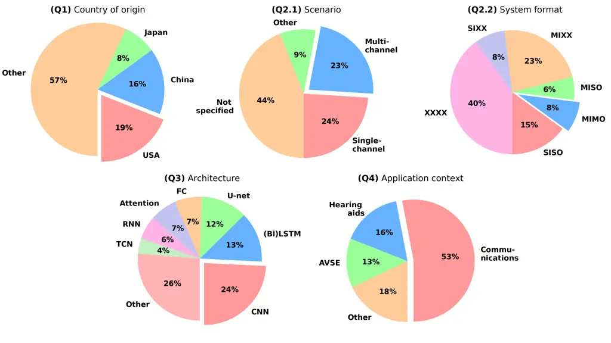
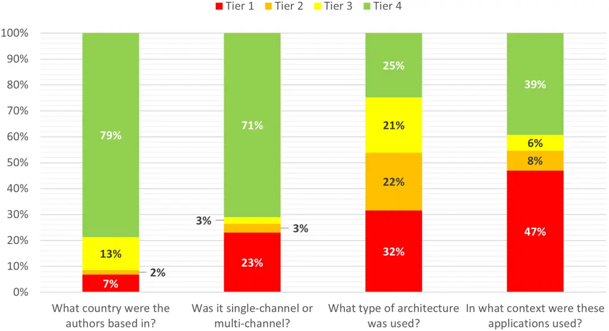

# An experiment on an automated literature survey of data-driven speech enhancement methods

 Arthur dos Santos Affiliation: Universidade Estadual de Campinas
Affiliation: Campinas, Brazil Email: [a264372@dac.unicamp.br](mailto:)

  

 Jayr Pereira Affiliation: NeuralMind Affiliation: Campinas, Brazil
Email: [jayr.pereira@neuralmind.ai](mailto:)   

 Rodrigo Nogueira Affiliation: NeuralMind Affiliation: Campinas, Brazil
Email: [rodrigo.nogueira@neuralmind.ai](mailto:)   

 Bruno Masiero Affiliation: Universidade Estadual de Campinas
Affiliation: Campinas, Brazil Email: [masiero@unicamp.br](mailto:)   

 Shiva Sander-Tavallaey Affiliation: ABB Corporate Research, Västerås,
Sweden Affiliation: KTH Royal Institute of Technology, Stockholm, Sweden
Affiliation: shiva.sander-tavallaey@se.abb.com, tssander@kth.se   

 Elias Zea Affiliation: KTH Royal Institute of Technology
Affiliation: Stockholm, Sweden Email: [zea@kth.se](mailto:)

###### Abstract

The increasing number of scientific publications in acoustics, in
general, presents difficulties in conducting traditional literature
surveys. This work explores the use of a generative pre-trained
transformer (GPT) model to automate a literature survey of 116 articles
on data-driven speech enhancement methods. The main objective is to
evaluate the capabilities and limitations of the model in providing
accurate responses to specific queries about the papers selected from a
reference human-based survey. While we see great potential to automate
literature surveys in acoustics, improvements are needed to address
technical questions more clearly and accurately.

   

A Preprint

|     |
| --- |
|     |

*Keywords* speech enhancement methods $`\cdot`$ data-driven acoustics
$`\cdot`$ literature survey $`\cdot`$ natural language processing
$`\cdot`$ large language models

## 1 Introduction

A recent study has shown an increasing publication rate after analyzing
45 million scientific articles produced in the past six decades  (Park
et al., 2023). In the context of applications of data-driven methods in
acoustics alone, as shown in the Scopus¹¹ 1
[https://www.scopus.com/](https://www.scopus.com/) search in Fig. 1, the
number of articles in the first half of 2023 had exceeded the total
number of articles in the entire year of 2019. Given this growth in the
literature, the acoustics community faces the limitations of traditional
survey methods. At the same time, the remarkable advancements in the
field of natural language processing (NLP) and large language models
(LLMs) in recent years—leading to the “boom” of the generative
pre-trained transformer (GPT) (Stokel-Walker and Noorden, 2023), offers
a unique opportunity to guide and advance knowledge in acoustics through
automated large-scale text processing. This can provide more accessible
information for researchers, practitioners, and engineers interested in
data-driven methods for acoustics and vibration in the broader sense.

Figure 1: Four decades of articles on applications of data-driven
methods in acoustics. The results have been obtained from a Scopus
search on August 2, 2023.

Recent literature surveys in acoustics have reviewed the theory and
applications of machine learning (ML) in acoustics (Bianco et al.,
2019), sound source localization (SSL) using deep learning
methods (Grumiaux et al., 2022), as well as noise-induced hearing loss
in several contexts (Neitzel and Fligor, 2019; Radziwon et al., 2019;
Malowski et al., 2022). The survey by Gannot et al. analyzed $`393`$
papers on speech enhancement and source separation through four
queries (Gannot et al., 2017): what is the acoustic impulse response
model, what is the spatial filter design, what is the parameter
estimation algorithm, and what is the post-filtering technique? Other
related review papers have covered more specific applications of
acoustics, such as source-range estimation for underwater
acoustics (Song and Byun, 2022), SSL for wireless acoustic sensor
networks (Cobos et al., 2017), the LOCATA challenge for source
localization and tracking (Evers et al., 2020), and 15 years of SSL in
robotics applications (Argentieri et al., 2015).

Writing a literature survey can be viewed as the art of _making a long
story short_, which can be pretty laborious. Typically, it starts by
selecting a topic of interest and elaborating a list of questions. Then,
a search for relevant literature items must be fulfilled, which,
nowadays, can be facilitated by search engines and databases that assess
the credibility and reliability of sources (e.g., Scopus, Google
Scholar,²² 2 [https://scholar.google.com/](https://scholar.google.com/)
etc.). This is followed by processing the selected literature,
organizing items into categories based on their similarities and
differences, analyzing them, and noting essential trends, patterns,
knowledge gaps, etc. To do so, several tools exist to provide
researchers with ways to document the whole process, with mechanisms to
build quality assessment checklists, data extraction forms, among others
(e.g., Covidence,³³ 3
[https://www.covidence.org/](https://www.covidence.org/) Parsif.al,⁴⁴ 4
[https://parsif.al/](https://parsif.al/) Rayyan,⁵⁵ 5
[https://www.rayyan.ai/](https://www.rayyan.ai/) etc.). However, until
now, one has to read through all the literature.

Reading a scientific paper typically involves scanning the text for the
research problem, assumptions, methods, evaluations, and main findings;
interpreting relevant mathematical terminology; understanding the
structure and organization of the text; and synthesizing information to
form a coherent understanding of it as a whole (Pain, 2016). Thus, the
time taken to read an academic paper varies depending on various
factors, such as its length, the complexity of the topic, and the
reader’s familiarity with the subject matter. Assuming that a familiar
reader has a typical reading speed of approximately $`200`$–$`300`$
words per minute (Frank, 1990), it would take roughly $`1`$–$`2`$ hours
to read a $`10`$-page academic paper. Math-intensive documents might
take even longer. Therefore, scanning 100 articles would take
approximately one month of uninterrupted work to read through the
literature.

The usage of LLMs for automated text summarization and generation is
relatively new and has had applications in medicine and news
enterprises. A relevant study to this work was published recently by
Tang et al. (Tang et al., 2023), who performed zero-shot medical
evidence summarization generated with GPT-3.5 and ChatGPT and compared
them to human-generated summarization. Similar methodologies have been
applied to, for example, compare abstracts generated by ChatGPT to real
abstracts from medical journals (Gao et al., 2023), identify and assess
key research questions in gastroenterology (Lahat et al., 2023), and
answer multiple-choice questions about human genetics (Duong and
Solomon, 2023). LLMs have also been used for automatic news
summarization (Syed et al., 2020; Goyal et al., 2023). A common element
in these studies is that LLM-based methodologies have substantial
potential in medical and news applications, but more work is needed to
increase the accuracy and fidelity.

In this paper, we employ a GPT model to query a literature corpus
comprising $`116`$ texts on data-driven speech enhancement methods. The
main goal is to speed up literature surveys. The structure of this paper
is as follows: Section 2 describes the methodology, including the
literature corpus, a short description of the GPT model, and the queries
posed to the model. Section 3 presents the results of the GPT model and
a comparison with a reference (human-based) survey (dos Santos et al.,
2022). Lastly, conclusions are drawn in Sec. 4.

## 2 Methodology

### 2.1 Text corpus

In this study, the corpus consists of 116 articles published in the
English language between January and December $`2021`$, matching the
search strings “audio enhancement” OR “dereverberation” AND in the
context of “machine learning” OR “deep learning,” from various
databases, including the AES E-Library,⁶⁶ 6
[https://www.aes.org/e-lib/](https://www.aes.org/e-lib/) ACM Digital
Library,⁷⁷ 7 [https://dl.acm.org/](https://dl.acm.org/) Google Scholar,
IEEE Digital Library,⁸⁸ 8
[https://ieeexplore.ieee.org/](https://ieeexplore.ieee.org/) JASA,⁹⁹ 9
[https://asa.scitation.org/journal/jas](https://asa.scitation.org/journal/jas)
MDPI,¹⁰¹⁰ 10 [https://www.mdpi.com/](https://www.mdpi.com/)
ResearchGate,¹¹¹¹ 11
[https://www.researchgate.net/](https://www.researchgate.net/) Research
Square,¹²¹² 12
[https://www.researchsquare.com/](https://www.researchsquare.com/)
ScienceDirect,¹³¹³ 13
[https://www.sciencedirect.com/](https://www.sciencedirect.com/)
Springer,¹⁴¹⁴ 14
[https://link.springer.com/](https://link.springer.com/) arXiv,¹⁵¹⁵ 15
[https://arxiv.org/](https://arxiv.org/) and some repositories of higher
education institutions and subsidiary research departments of
corporations.

Conference, journal, and challenge papers, book series and chapters,
extended abstracts, technical notes, M.Sc. theses, and Ph.D.
dissertations were included in the search. The average number of pages
per article was $`8`$, varying from $`2`$ to $`30`$ (except for the
M.Sc. and Ph.D. monographies, which varied from $`31`$ to $`118`$). For
the complete list of texts reviewed, please refer to this external
link¹⁶¹⁶ 16
[https://drive.google.com/file/d/1rpRiSjyNpHIF9GzNzy8qTQEmKHLMzDkN/](https://drive.google.com/file/d/1rpRiSjyNpHIF9GzNzy8qTQEmKHLMzDkN/).

### 2.2 Generative pre-trained transformer model

First released in 2018 (Radford et al., 2018) and then continuously
updated, the generative pre-trained transformer (GPT) is a large
autoregressive language model designed to generate human-like responses
to natural language input. It can be used for various tasks, including
chatbots, language translation, and text summarization. Its ability to
generate coherent text has made it a valuable tool for researchers and
developers in NLP and ML applications. For example, it is possible today
to ask ChatGPT or Bard to summarize a scientific paper or generate a
list of sources for a literature survey on a specific topic. However, it
has been seen that generated responses are often partially (sometimes
entirely) fake (Alkaissi and McFarlane, 2023), and the answering
accuracy can deteriorate when the answer to the query lies in the middle
of the context (Liu et al., 2023). Therefore, we have focused on
applying the underlying GPT model, not on the direct usage of chatbots.

In this study, we used the large language model of Open AI
GPT3.5-turbo-16k¹⁷¹⁷ 17
[https://platform.openai.com/docs/models/gpt-3-5](https://platform.openai.com/docs/models/gpt-3-5)
to process the research papers and extract relevant information. This
allows us to explore the model’s ability to handle long contexts (i.e.,
16k tokens or up to about 50 pages of pure text, assuming an average of
300 tokens/page), enabling a comprehensive analysis of an entire
scientific paper. This is in contrast to previous studies on automatic
literature summarization (Tang et al., 2023), which examined scientific
abstracts. It should be stressed that articles in PDF in acoustics most
often translate into fewer pages of pure text due to figures, tables,
etc. We utilize the GPT model’s ability to answer questions to help us
address specific inquiries about the papers. First, we convert the PDF
files into text using the PyPDF2 library¹⁸¹⁸ 18
[https://pypi.org/project/PyPDF2/](https://pypi.org/project/PyPDF2/).
Next, we prompt the GPT model with each paper’s full text and specific
questions to obtain comprehensive answers. This iterative process is
performed for every paper to address the four queries presented in the
following section. Compared to the human pace, this methodology requires
much less time to analyze academic papers and provide an answer to the
question posed.

### 2.3 Queries

Four questions are considered in this study: two relatively “simple” and
two relatively “hard”:

- •
  Query 1 (Q1): What country were the authors based in? The output of
  this question is a list of the authors’ countries of affiliation.
- •
  Query 2 (Q2): Was it single-channel or multi-channel scenario? The
  output of this question is either one of the two classes (single or
  multi), and we are interested in determining the probability of the
  GPT obtaining the class right.
- •
  Query 3 (Q3): What type of architecture was used? This question is
  relatively more difficult than the previous one, requiring domain
  knowledge for proper comprehension. This question relates to
  determining the data-driven model used in the studies. Thus, the
  output of this question is a string, and we are interested in knowing
  the probability that the GPT will produce the string as accurately as
  possible.
- •
  Query 4 (Q4): In what context were these applications used (e.g.,
  hearing aids, communication, speech enhancement)? This is the most
  challenging question posed to the GPT in this study, which involves
  determining the application area of speech enhancement considered in
  previous studies. Thus, the output of this question is a string, and
  we are interested in determining the probability that the GPT will
  produce the string as accurately as possible.

## 3 Results

### 3.1 Outputs from questions

These four questions were selected from our reference literature
survey (dos Santos et al., 2022), whose answers are taken as ground
truth. Section 3.1.1 summarizes the answers presented in (dos Santos
et al., 2022), whereas Sec. 3.1.2 compares the answers produced by the
GPT model with the answers in the reference survey.

#### 3.1.1 Human-based survey

Authors’ affiliations include higher education institutions, subsidiary
research departments of corporations (e.g., Adobe, Facebook, Google,
Microsoft), and semi-private and fully financed government research
institutions. The main contributors were the United States of America
(USA), China, and Japan, as illustrated in Figure 2 (Q1), with 28
countries represented. Other contributing countries include South Korea,
Germany, the United Kingdom (UK), India, Switzerland, France, Denmark,
the Netherlands, Canada, Ireland, Italy, Norway, Spain, Taiwan, Vietnam,
Austria, Brazil, Chile, Greece, Hong Kong, Israel, Malaysia, Pakistan,
Poland, and Singapore.

Not all corpora account for multi-channel scenarios. Among the reviewed
articles, only $`23\%`$ explicitly addressed multi-channel scenarios,
whereas $`24\%`$ focused on single-channel scenarios, as illustrated in
Figure 2 (Q2.1). Other scenarios include binaural, Ambisonics, and
stereo signals. However, most articles did not specify this information.
For articles with a complete system format or configuration details,
most are single-input-single-output (SISO) systems, followed by
multiple-input-multiple-output (MIMO) and multiple-input-single-output
(MISO) systems, as shown in Figure 2 (Q2.2). Other formats include
multiple-input systems without a specified output format (MIXX),
single-input systems without a specified output format (SIXX), and
systems with completely unspecified input-output formats (XXXX).

The most commonly used model architectures are $`1`$-D and $`2`$-D
Convolutional Neural Networks (CNN), uni- or bi-directional Long
Short-Term Memory (LSTM) blocks, U-net, Fully Connected (FC)
architectures, attention networks, recurrent neural networks (RNN), and
temporal convolutional networks (TCN), as illustrated in Figure 2 (Q3).
Other architectures include adversarial, convolutional, encoder/decoder,
feedforward, geometrical, neural beamformer, recurrent, reinforcement
learning, Seq2Seq, and statistical/probabilistic models.

Applications are often joint, including speech enhancement,
dereverberation, noise suppression, speech recognition, and source
separation. These applications focus mainly on communication, hearing
aids, and audio-visual speech enhancement (AVSE), as illustrated in
Figure 2 (Q4). Additional applications include suppressing nonlinear
distortions, enhancing heavily compressed signals in speech and musical
domains, audio inpainting applied to both speech and music signals, law
enforcement and forensic scenarios, acoustic-to-articulatory inversion,
input-to-output mapping of auditory models, studio recordings, and
selective noise suppression.

Figure 2: Simplified pie-charts for the human-based survey (dos Santos
et al., 2022).

#### 3.1.2 Machine-based survey

Because the GPT model is designed to generate human-like responses to
natural language input, even if prompted with the same questions posed
by humans, its answers are expected to vary from those of humans. To
quantify the extent to which these variations differ from the desired
responses, a tier list was elaborated as follows to compare the
machine-based results with the human ground truth:

- •
  Tier 1 - No answer / Completely wrong / Not a pertinent answer: the
  model fails to provide any response or provides a completely incorrect
  or irrelevant answer (e.g., the author failed to mention, yet GPT
  prompts a specific answer);
- •
  Tier 2 - Marginally correct: the model provides a response that
  contains at least some correct information;
- •
  Tier 3 - Mostly correct with minor errors or omissions: the model
  produces the majority of the information correctly but might miss a
  few details or make minor mistakes;
- •
  Tier 4 - Perfectly correct: the model produces completely accurate and
  correct responses.

The first author, who also conducted the reference human-based survey,
performed the tier-based assessment of responses to the survey questions
(Q1–Q4 in Sec.  2.3). This choice has been taken to prevent the need for
an analysis of the subjective interpretation of the machine-generated
responses, which is beyond the scope of this paper. It is worth noting
that evaluating more technical questions, such as Q3 and Q4, requires
domain knowledge of speech enhancement and data-driven methods. However,
assessing responses to more straightforward questions like Q1 and Q2
requires little to no domain knowledge.

Figure 3 illustrates the stacked bar charts containing the tier
distribution for each question after comparing the machine-based
responses with the human-based responses. For full results of the raw
human-based survey in comparison with machine outputs for Q1-Q4, please
refer to this external link¹⁹¹⁹ 19
[https://drive.google.com/drive/folders/1jfud4LVkwBQd8KhWKHxXUAkaxZCO9igu?usp=sharing](https://drive.google.com/drive/folders/1jfud4LVkwBQd8KhWKHxXUAkaxZCO9igu?usp=sharing).
In what follows, the results are analyzed in more detail.

Figure 3: Stacked bar charts for the machine-based answers to the four
questions using the corpus of 116 papers.

### 3.2 Analysis of results

From Fig. 3, most answers are either perfectly correct or have minor
errors for Q1 (“What country were the authors based in?”), which is a
simple question that can be answered based on authors’ affiliations. In
this case, the errors could be related to the fact that the country of
affiliation was not included or correctly linked to their names in the
provided metadata.

Table 1 illustrates examples of human-based ground-truth versus
machine-based responses for Q1. It can be seen that some machine-based
answers are more concise than others, specifically, stating only the
country versus starting a sentence with “The authors were based in…”
This reflects the coherent and diverse capacity of the GPT model to
respond to such a question. We strongly suspect that the model’s
accuracy can be improved by providing only the article’s metadata as
context instead of the complete text, thus minimizing potential issues
due to the length of the context (Liu et al., 2023).

|        | Human-based ground truth | Machine-based responses                                                                                                  |
| ------ | ------------------------ | ------------------------------------------------------------------------------------------------------------------------ |
| Tier 1 | Germany, UK              | The authors were based in the USA and China.                                                                             |
| Tier 2 | China, USA, Denmark      | China                                                                                                                    |
| Tier 3 | Germany, Canada          | Germany                                                                                                                  |
| Tier 4 | UK, Switzerland          | The authors were based in the UK (specifically, the University of Edinburgh) and Switzerland (specifically, ETH Zurich). |

Table 1: Examples of human-based ground truth versus machine-based
responses for Q1.

Regarding Q2 (“Was it single-channel or multi-channel scenario?”), most
predictions are perfectly correct; however, there is an increase in
completely inaccurate answers compared to Q1. This is partially due to
cases with no specified response (the authors failed to mention) and the
GPT model prompting a response (Alkaissi and McFarlane, 2023) instead of
stating that it could not find that information in the text provided. In
addition, there are cases where the speech enhancement method could be
used for multi-channel purposes, yet the authors chose not to.
Interestingly, the GPT model may assign these cases as single- and
multi-channel scenarios.

Table 2 illustrates examples of human-based ground-truth versus
machine-based responses for Q2. The examples show that the GPT model
provides nuanced answers for the different tiers, including “The
proposed system includes…” or “The approach described in the paper is…”
This reflects the complexity of the text generation capabilities of the
GPT used in this experiment. As pointed out in Sec. 2.3, the prompt is a
classification question: whether the approach is of a single-channel or
multi-channel class. However, when looking at the Tier 2 example in
Table 2, the authors discussed a single-channel approach \[see Ref. 107
in (dos Santos et al., 2022)\]; however, it can also be applied in
multi-channel scenarios, which is the machine response. Similarly, for
Tier 3, the GPT model does not explicitly produce the result “Binaural”
or “Monoaural”. However, it responds that the approach belongs to the
multi-channel class. Making the question more precise may help to
improve the model’s accuracy further.

|        | Human-based ground truth | Machine-based responses                                                        |
| ------ | ------------------------ | ------------------------------------------------------------------------------ |
| Tier 1 | Not specified            | The approach described in the paper was a single-channel approach.             |
| Tier 2 | Single-channel           | The proposed system includes both single-channel and multi-channel approaches. |
| Tier 3 | Binaural, Monaural       | The proposed method is a multichannel approach.                                |
| Tier 4 | Multi-channel            | The approach described in the paper is a multi-channel approach.               |

Table 2: Examples of human-based ground truth versus machine-based
responses for Q2.

For question Q3 (“What type of architecture was used?”), there is an
observable balance between all tiers. One of the most common reasons for
completely wrong answers is that the GPT model identifies the name of
the “trade” architecture as the type of architecture (e.g., “VGGNet”
instead of “fully connected, CNN”). We suspect this can be improved by
fine-tuning the GPT model to determine the underlying architecture
instead of its variant name. Another common error is simply outputting
the answer “DNN” (e.g., “the network architecture is a DNN”) instead of
detailing its type. Once again, we strongly suspect that providing the
GPT model with the necessary context would prevent these mistakes. At
any rate, most answers are partially correct, i.e., either it got
something or almost everything right, which, together with the wrong
answers, reduces the quantity of perfectly correct answers.

Table 3 presents examples of human-based ground-truth predictions versus
machine-based predictions for Q3. Interestingly, for Tier 3, it can be
seen that the GPT model not only (nearly) produces the right
architecture type of CNN, but it also adds “variable dilation factors.”
Based on our observations with other papers on the survey, this
extracted additional information, if accurate, holds significant value
and analysis depth in the context of large-scale surveys.

|        | Human-based ground truth                                     | Machine-based responses                                                                                            |
| ------ | ------------------------------------------------------------ | ------------------------------------------------------------------------------------------------------------------ |
| Tier 1 | Fully connected, LSTM                                        | The network architecture used in the proposed method is a deep neural network (DNN).                               |
| Tier 2 | Attention Network, Autoencoder, Conformer Network, CNN, LSTM | The network architecture used in the study is a conformer-based architecture.                                      |
| Tier 3 | CNN, RNN                                                     | The network architecture used in the study is a convolutional neural network (CNN) with variable dilation factors. |
| Tier 4 | CNN                                                          | The network architecture used in the study was Convolutional Neural Networks (CNNs).                               |

Table 3: Examples of human-based ground truth versus machine-based
responses for Q3.

Finally, for question Q4 (“In what context were these applications
used?”), most answers were perfectly correct or entirely incoherent.
This is because, in most cases, the authors do not mention the context
of their applications in the full texts. This adds a higher degree of
complexity to the GPT model to infer the application from partially
incomplete information, something a human with domain knowledge might
infer more accurately at this point. Still, it is interesting that the
GPT model considers the broader field of study (e.g., dereverberation
and speech enhancement) as an application context and attempts to answer
the query nonetheless. Table 4 illustrates examples of human-based
ground-truth versus machine-based predictions for Q4. As can be seen,
the Tier 4 response example is remarkably similar to the human response.
However, for Tier 1, the GPT model answers even though the human has
found that it is not specified in the text. Further examination and
understanding must rely on the GPT model to answer these queries more
accurately.

|        | Human-based ground truth                                                                                                              | Machine-based responses                                                                                                                                                                                                                                                                                                                           |
| ------ | ------------------------------------------------------------------------------------------------------------------------------------- | ------------------------------------------------------------------------------------------------------------------------------------------------------------------------------------------------------------------------------------------------------------------------------------------------------------------------------------------------- |
| Tier 1 | Not specified                                                                                                                         | The applications of the Neural Beamforming Front-End described in the paper include real-time audio signal enhancement for human-computer interaction, telecommunication, web conferencing, and pro-audio applications.                                                                                                                           |
| Tier 2 | Voice-Over-IP applications                                                                                                            | The applications of high fidelity speech regeneration with application to speech enhancement include speech enhancement for better communication and collaboration, particularly in the context of physical distancing during the COVID-19 pandemic.                                                                                              |
| Tier 3 | Podcasts, video voice-overs, and audiobooks that require studio-quality audio with full bandwidth and balanced equalization (EQ)      | The applications of signal processing to audio and acoustics discussed in the paper are focused on speech enhancement, specifically improving the quality of real-world consumer-grade recordings to sound like studio recordings. This can be beneficial for various content creation tasks such as podcasts, video voice-overs, and audiobooks. |
| Tier 4 | Law-enforcement related audio recordings where it’s difficult to understand the speech of one specific speaker amongst all the others | The applications mentioned in the text are related to law enforcement and investigations involving audio recordings.                                                                                                                                                                                                                              |

Table 4: Examples of human-based ground truth versus machine-based
responses for Q4.

## 4 Conclusions

In this experiment, we demonstrate the capabilities and limitations of a
generative pre-trained transformer (GPT) model to survey a collection of
scientific papers on data-driven speech enhancement methods. To the best
of the authors’ knowledge, this is the first study that examines the use
of large language models to automate a literature survey in acoustics.
In essence, the GPT model poses four queries to a corpus of $`116`$
articles, and the machine-generated answers are compared to a
human-based ground truth survey. Our findings indicate that simple
questions can be answered with significant accuracy. In contrast, more
nuanced technical questions require improving the accuracy and clarity
of the questions or careful contextualization and fine-tuning of the
model. In the future, we hope this paper stimulates the adoption of
artificially intelligent systems to aid humans in surveying larger
corpora (e.g., thousands of articles) in acoustics.

## 5 Acknowledgments

This study was partially sponsored by the São Paulo Research Foundation
(FAPESP) under grants \#2017/08120-6, \#2019/22795-1, and
\#2022/16168-7. We also thank Prof. Roberto Lotufo and Prof. Renato
Lopes for their valuable discussions and suggestions.

## References

- Park et al. \[2023\] Michael Park, Erin Leahey, and Russell J. Funk.
  Papers and patents are becoming less disruptive over time. _Nature_,
  613(7942):138–144, 2023.
- Stokel-Walker and Noorden \[2023\] C. Stokel-Walker and R. V. Noorden.
  What ChatGPT and generative AI mean for science. _Nature_,
  614:214–216, 2023.
  doi:[10.1038/d41586-023-00340-6](https://doi.org/10.1038/d41586-023-00340-6).
- Bianco et al. \[2019\] Michael J. Bianco, Peter Gerstoft, James Traer,
  Emma Ozanich, Marie A. Roch, Sharon Gannot, and Charles-Alban
  Deledalle. Machine learning in acoustics: Theory and applications.
  _The Journal of the Acoustical Society of America_, 146(5):3590–3628,
  11 2019. ISSN 0001-4966.
  doi:[10.1121/1.5133944](https://doi.org/10.1121/1.5133944).
- Grumiaux et al. \[2022\] Pierre-Amaury Grumiaux, Srđan Kitić, Laurent
  Girin, and Alexandre Guérin. A survey of sound source localization
  with deep learning methods. _The Journal of the Acoustical Society of
  America_, 152(1):107–151, 07 2022. ISSN 0001-4966.
  doi:[10.1121/10.0011809](https://doi.org/10.1121/10.0011809).
- Neitzel and Fligor \[2019\] Richard L. Neitzel and Brian J. Fligor.
  Risk of noise-induced hearing loss due to recreational sound: Review
  and recommendations. _The Journal of the Acoustical Society of
  America_, 146(5):3911–3921, 11 2019. ISSN 0001-4966.
  doi:[10.1121/1.5132287](https://doi.org/10.1121/1.5132287).
- Radziwon et al. \[2019\] Kelly E. Radziwon, Adam Sheppard, and
  Richard J. Salvi. Psychophysical changes in temporal processing in
  chinchillas with noise-induced hearing loss: A literature review. _The
  Journal of the Acoustical Society of America_, 146(5):3733–3742,
  11 2019. ISSN 0001-4966.
  doi:[10.1121/1.5132292](https://doi.org/10.1121/1.5132292).
- Malowski et al. \[2022\] Sonstrom Malowski, Kristine Gollihugh,
  Lindsay H. Malyuk, Heather Le Prell, and G. Colleen. Auditory changes
  following firearm noise exposure, a review. _The Journal of the
  Acoustical Society of America_, 151(3):1769–1791, 03 2022. ISSN
  0001-4966.
  doi:[10.1121/10.0009675](https://doi.org/10.1121/10.0009675).
- Gannot et al. \[2017\] Sharon Gannot, Emmanuel Vincent, Shmulik
  Markovich-Golan, and Alexey Ozerov. A consolidated perspective on
  multimicrophone speech enhancement and source separation. _IEEE/ACM
  Transactions on Audio, Speech, and Language Processing_,
  25(4):692–730, 2017.
  doi:[10.1109/TASLP.2016.2647702](https://doi.org/10.1109/TASLP.2016.2647702).
- Song and Byun \[2022\] H. C. Song and Gihoon Byun. An overview of
  array invariant for source-range estimation in shallow water. _The
  Journal of the Acoustical Society of America_, 151(4):2336–2352,
  04 2022. doi:[10.1121/10.0009828](https://doi.org/10.1121/10.0009828).
- Cobos et al. \[2017\] Maximo Cobos, Fabio Antonacci, Anastasios
  Alexandridis, Athanasios Mouchtaris, and Bowon Lee. A survey of sound
  source localization methods in wireless acoustic sensor networks.
  _Wireless Communications and Mobile Computing_, 2017:3956282, 2017.
- Evers et al. \[2020\] Christine Evers, Heinrich W. Löllmann, Heinrich
  Mellmann, Alexander Schmidt, Hendrik Barfuss, Patrick A. Naylor, and
  Walter Kellermann. The LOCATA challenge: Acoustic source localization
  and tracking. _IEEE/ACM Transactions on Audio, Speech and Language
  Processing_, 28:1620–1643, jun 2020. ISSN 2329-9290.
  doi:[10.1109/TASLP.2020.2990485](https://doi.org/10.1109/TASLP.2020.2990485).
- Argentieri et al. \[2015\] S. Argentieri, P. Danès, and P. Souères. A
  survey on sound source localization in robotics: From binaural to
  array processing methods. _Computer Speech and Language_,
  34(1):87–112, 2015.
- Pain \[2016\] Elisabeth Pain. How to (seriously) read a scientific
  paper. _Science_, March 21 2016.
  doi:[10.1126/science.caredit.a1600047](https://doi.org/10.1126/science.caredit.a1600047).
- Frank \[1990\] Stanley D. Frank. _Remember Everything You Read: The
  Evelyn Wood Seven-day Speed Reading and Learning Program_. Times
  Book, 1990.
- Tang et al. \[2023\] Liyan Tang, Zhaoyi Sun, Betina Idnay, Jordan G.
  Nestor, Ali Soroush, Pierre A. Elias, Ziyang Xu, Ying Ding, Greg
  Durrett, Justin F. Rousseau, Chunhua Weng, and Yifan Peng. Evaluating
  large language models on medical evidence summarization. _npj Digital
  Medicine_, 6(1):158, 2023.
- Gao et al. \[2023\] Catherine A. Gao, Frederick M. Howard, Nikolay S.
  Markov, Emma C. Dyer, Siddhi Ramesh, Yuan Luo, and Alexander T.
  Pearson. Comparing scientific abstracts generated by ChatGPT to real
  abstracts with detectors and blinded human reviewers. _npj Digital
  Medicine_, 6(1):75, 2023.
- Lahat et al. \[2023\] Adi Lahat, Eyal Shachar, Benjamin Avidan, Zina
  Shatz, Benjamin S. Glicksberg, and Eyal Klang. Evaluating the use of
  large language model in identifying top research questions in
  gastroenterology. _Scientific Reports_, 13(1):4164, 2023.
- Duong and Solomon \[2023\] Dat Duong and Benjamin D. Solomon. Analysis
  of large-language model versus human performance for genetics
  questions. _European Journal of Human Genetics_, 2023.
- Syed et al. \[2020\] Shahbaz Syed, Roxanne El Baff, Johannes Kiesel,
  Khalid Al Khatib, Benno Stein, and Martin Potthast. News editorials:
  Towards summarizing long argumentative texts. In _Proceedings of the
  28th International Conference on Computational Linguistics_, pages
  5384–5396, Barcelona, Spain (Online), December 2020. International
  Committee on Computational Linguistics.
  doi:[10.18653/v1/2020.coling-main.470](https://doi.org/10.18653/v1/2020.coling-main.470).
- Goyal et al. \[2023\] Tanya Goyal, Junyi Jessy Li, and Greg Durrett.
  News summarization and evaluation in the era of GPT-3, 2023.
- dos Santos et al. \[2022\] Arthur dos Santos, Bruno Masiero, and Pedro
  Oliveira. A retrospective on multichannel speech and audio enhancement
  using machine and deep learning techniques. In _Proc. 23rd
  International Congress on Acoustics (ICA)_, Gyeongju, South Korea,
  October 2022.
- Radford et al. \[2018\] Alec Radford, Karthik Narasimhan, Benjamin H.
  Fisch, and et al. Improving language understanding by generative
  pre-training. _OpenAI Preprint_, 2018.
- Alkaissi and McFarlane \[2023\] Hussam Alkaissi and Samy I McFarlane.
  Artificial Hallucinations in ChatGPT: Implications in Scientific
  Writing. _Cureus_, 15(2):e35179, 2023.
  doi:[10.7759/cureus.35179](https://doi.org/10.7759/cureus.35179).
- Liu et al. \[2023\] Nelson F. Liu, Kevin Lin, John Hewitt, Ashwin
  Paranjape, Michele Bevilacqua, Fabio Petroni, and Percy Liang. Lost in
  the middle: How language models use long contexts.
  _arXiv:2307.03172_, 2023. arXiv:2307.03172 \[cs.CL\].
