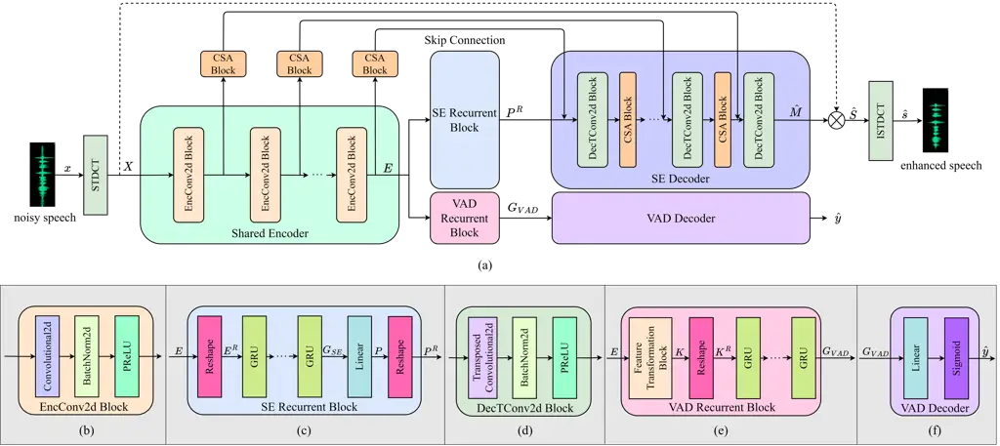
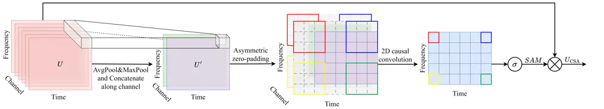

# VSANet: Real-time speech enhancement based on voice activity detection and causal spatial attention

Yuewei Zhang    Huanbin Zou    Jie Zhu ^(†)^(†)thanks: ^(∗) Equally
contribute to this work.^(†)^(†)thanks: ^(†) Corresponding author
(Email: zhujie@sjtu.edu.cn).

###### Abstract

The deep learning-based speech enhancement (SE) methods always take the
clean speech’s waveform or time-frequency spectrum feature as the
learning target, and train the deep neural network (DNN) by reducing the
error loss between the DNN’s output and the target. This is a
conventional single-task learning paradigm, which has been proven to be
effective, but we find that the multi-task learning framework can
improve SE performance. Specifically, we design a framework containing a
SE module and a voice activity detection (VAD) module, both of which
share the same encoder, and the whole network is optimized by the
weighted loss of the two modules. Moreover, we design a causal spatial
attention (CSA) block to promote the representation capability of DNN.
Combining the VAD aided multi-task learning framework and CSA block, our
SE network is named VSANet. The experimental results prove the benefits
of multi-task learning and the CSA block, which give VSANet an excellent
SE performance.

###### Index Terms: 

speech enhancement, voice activity detection, multi-task learning,
causal spatial attention block

^(†)^(†)address: ¹ Department of Electronic Engineering, Shanghai Jiao
Tong University, Shanghai, China  
² Tencent Video Cloud, Shanghai, China

## 1 Introduction

Speech enhancement (SE) is a fundamental task in speech signal
processing, whose purpose is suppressing environmental noise, thereby
improving the perceptual quality and intelligibility of speech. SE has
been widely applied in various fields, such as speech communication,
automatic speech recognition (ASR), and hearing assistant devices.
Traditional SE methods \[1, 2\] always depend on specific prior
assumptions and manual experience. However, their performance tends to
be unsatisfactory in scenarios with highly non-stationary noise and low
signal-to-noise (SNR).

Recently, the deep neural network (DNN) has achieved great success in
the SE task. DNN-based SE algorithms can be divided into two categories:
the time domain methods \[3, 4\] and the time-frequency (TF) domain
methods \[5, 6, 7\], with the latter being more commonly used. The TF
domain methods first convert the one-dimensional (1D) noisy speech into
a two-dimensional (2D) noisy TF spectrum using a TF transformation
technique. The DNN is then employed to process the 2D noisy spectrum and
perform noise suppression, resulting in an enhanced spectrum. Finally,
the enhanced spectrum is converted back to 1D enhanced speech using the
corresponding inverse TF transformation method. TF domain methods can be
further categorized into mapping methods \[8, 9\] and masking methods
\[6, 10\]. Mapping methods directly estimate the enhanced spectrum,
while masking methods estimate the spectrum mask. In this paper, we
adopt the masking method for SE and we utilize the convolutional
recurrent network (CRN) \[5\] as the backbone of our SE network, which
follows an encoder-decoder (ED) structure. Meanwhile, we employ
short-time discrete cosine transform (STDCT) \[11\] instead of the
commonly used short-time Fourier transform (STFT) for TF transformation
\[12, 13\]. This choice avoids the phase estimation problem associated
with STFT-based methods and reduces the model complexity.

Meanwhile, conventional SE approaches typically follow a single-task
optimization paradigm, where the sole objective of the DNN is to predict
the enhanced speech. However, many studies have demonstrated that a
multi-task learning scheme achieves superior performance compared to
single-task learning \[14, 15\]. The idea behind multi-task learning is
to share the representation extracted by a public network to jointly
optimize several related tasks. The knowledge learned from one subtask
can assist in the learning of other subtasks. Multi-task learning has
been widely used in speech signal processing \[16\], computer vision
\[17\], and natural language processing \[18\]. In the context of SE,
some previous works have also explored similar strategies. \[19\]
proposed simultaneous estimation of speech and noise spectrum, which
were then used to predict the spectrum mask. And \[20\] introduced a
similar idea. In \[21\], the authors took the speech presence
probability (SPP) as an auxiliary task to improve the SE performance.

In this paper, we propose a multi-task learning framework that combines
the voice activity detection (VAD) task with the SE task. As an
important front-end processing module for many applications such as ASR
\[22\] and speaker verification \[23\], VAD aims to distinguish speech
segments from noise segments. Prior works \[24, 25\] have already
attempted to combine the SE task and VAD task to construct a multi-task
learning framework. However, these works predominantly employed the SE
network as a preprocessing or auxiliary module to improve VAD accuracy.
In contrast, we believe that VAD can also benefit SE. Specifically,
correct labeling of speech and noise segments can help the SE network to
completely suppress the signal of noise segments. Besides, it also
enables the SE network to focus on the feature learning of speech
segments, facilitating better suppression of additive noise and better
preservation of speech components in speech segments. Therefore, we
consider VAD as the secondary task in our multi-task learning framework
to assist the learning of SE task. Meanwhile, the two tasks’ networks
share the same encoder, and the loss function of the overall framework
is a weighted sum of the two tasks’ losses. Experimental results
demonstrate that incorporating the VAD task further improves the
performance of the original SE network.

Besides, the attention mechanism \[26\] has been proven to significantly
improve the performance of various DNN-based tasks. Inspired by the
attention mechanism of human perception, researchers have developed
different types of attention modules. These attention modules guide the
DNN to focus on important features while disregarding unnecessary
information, thereby boosting the feature extraction, representation,
and modeling capabilities of DNN. In our CRN-based SE model, both the
encoder and decoder process 2D TF spectrum features. However, the useful
feature information of speech is not uniformly distributed across the 2D
TF feature maps. Thus, we propose to use a lightweight spatial attention
block to assist in high-level feature extraction in the encoder and
feature reconstruction in the decoder. In addition, we strictly
guarantee the causality of our spatial attention block, ensuring the
causality and real-time processing of our SE model. Our ablation study
confirms the benefits of our designed causal spatial attention (CSA)
block to the SE model’s performance.

Our contributions can be summarized as follows:

- •
  We adopt STDCT for TF transformation, resulting in a real-valued
  spectrum. This approach avoids the phase estimation problem in
  STFT-based methods, which can be difficult and computationally
  expensive.
- •
  We integrate the SE task with the VAD task to create a multi-task
  learning framework. In this framework, the VAD network is used to aid
  the learning of the SE network, so as to further improve the SE
  performance.
- •
  We design a CSA block, which improves the performance of the CRN-based
  SE model while ensuring the causality of the model.

Since we introduce a VAD aided multi-task learning framework with CSA
block to achieve SE, the overall network is abbreviated as VSANet.

## 2 Method

### 2.1 Signal Model with Discrete Cosine Transform

The purpose of SE is to estimate the clean speech $`s(n)`$ ($`n`$ is the
discrete time index) from the noisy speech $`x(n)`$, which is polluted
by additive noise $`z(n)`$ as

```math
x(n)=s(n)+z(n) \tag{1}
```

In our chosen TF domain method for SE, the first step is to transform
the noisy speech signal $`x(n)`$ into the TF spectrum. To achieve this,
we utilize the STDCT, a real-valued TF transformation that contains
implicit phase information. The definition of discrete cosine transform
(DCT) \[11\] is

```math
X(\mu)=c(\mu)\sqrt{\frac{2}{N}}\sum_{n=0}^{N-1}x(n)\cos\left[\frac{\pi\mu(2n+1)}{2N}\right] \tag{2}
```

and the corresponding inverse DCT is

```math
x(n)=\sqrt{\frac{2}{N}}\sum_{\mu=0}^{N-1}c(\mu)X(\mu)\cos\left[\frac{\pi\mu(2n+1)}{2N}\right] \tag{3}
```

where $`\mu\in{[0,1,...,N-1]}`$ represents $`N`$ frequency bins from low
to high, $`n\in{[0,1,...,N-1]}`$ represents $`N`$ different time
indexes, and $`c(\mu)`$ in Eq. (2) and Eq. (3) is defined as

```math
c(\mu)=\left\{\begin{array}[]{rlrl}\frac{1}{\sqrt{2}},&\mu=0\\
1,&\mu=1,2,\ldots,N-1\end{array}\right. \tag{4}
```

Considering the short-time stationary characteristics of speech, we
always divide it into overlapping short-time frames. These speech frames
are then processed using a specific window function. Finally, the DCT is
applied to each frame. This process allows us to obtain the STDCT
spectrum of speech.

Thus, the TF domain form of Eq. (1) can be written as

```math
X=S+Z \tag{5}
```

where the $`X`$, $`S`$ and $`Z`$ are the STDCT spectrum of $`x`$, $`s`$
and $`z`$, respectively.



Figure 1: (a) Overall architecture of VSANet. (b) The detail of
EncConv2d block. (c) The detail of speech enhancement (SE) recurrent
block. (d) The detail of DecTConv2d block. (e) The detail of voice
activity detection (VAD) recurrent block. (f) The detail of VAD decoder.

### 2.2 Multi-task Learning Network Architecture

The overall architecture of our multi-task learning framework is
depicted in Fig. 1(a), comprising a SE module and a VAD module. In
multi-task learning, parameter sharing achieves a regularization among
highly correlated subtasks, leading to better generalization and
performance \[27\]. However, excessive parameter sharing among subtasks
may hinder the learning process of individual subtasks. Therefore, we
adopt a strategy where the SE and VAD modules only share the same
encoder, while the remaining network structure is designed as a parallel
dual-branch topology. In the following sections, we will introduce the
details of the two subtasks, including the network structure,
calculation process, and learning target.

#### 2.2.1 Speech Enhancement Module

Our SE module utilizes a CRN-based structure. As shown in Fig. 1(a), it
consists of a shared encoder, a SE recurrent block, and a SE decoder.
The input noisy speech $`x`$ is initially transformed into the TF
spectrum $`X\in{\mathbb{R}^{1\times{F}\times{T}}}`$, where $`F`$ and
$`T`$ represent the frequency and frame dimensions, respectively. The TF
spectrum $`X`$ is fed into the shared encoder, which includes multiple
2D convolutional (EncConv2d) blocks. The detail of the EncConv2d block
is illustrated in Fig. 1(b). Each EncConv2d block contains a 2D
convolutional layer, a 2D batch normalization layer, and a PReLU layer.
The purpose of the shared encoder is to extract high-level features from
the noisy spectrum, resulting in the feature map
$`E\in{\mathbb{R}^{C^{\prime}\times{F^{\prime}}\times{T}}}`$. Similar to
the previous works \[6\], we ensure a constant time resolution of the
feature information throughout the module’s computation. Then, a SE
recurrent block, consisting mainly of multiple gated recurrent unit
(GRU) layers, receives the feature map from the encoder and models the
temporal correlation in speech features. Fig. 1(c) illustrates the
structure of the SE recurrent block. Specifically, the encoded feature
map $`E`$ is reshaped to
$`E^{R}\in{\mathbb{R}^{T\times{C^{\prime}F^{\prime}}}}`$ so that the GRU
layers can capture the inter-frame context from $`E^{R}`$. In addition,
to ensure the processed result of the SE recurrent block has the same
shape as the input $`E`$, the GRU layers’ output, denoted as
$`G_{SE}\in{\mathbb{R}^{T\times{H}}}`$, is further mapped to
$`P\in{\mathbb{R}^{T\times{H^{\prime}}}}`$ using a linear layer. Here,
we set $`H^{\prime}=C^{\prime}F^{\prime}`$, allowing us to reshape the
output $`P`$ to
$`P^{R}\in{\mathbb{R}^{C^{\prime}\times{F^{\prime}}\times{T}}}`$, which
aligns with the shape of $`E`$. Next, a SE decoder is designed to
reconstruct the low-resolution features $`P^{R}`$ back to the original
input spectrum size. As shown in Fig. 1(a), the SE decoder is composed
of several 2D transposed convolutional (DecTConv2d) blocks and CSA
blocks. The principles of the CSA block will be introduced in detail in
section 2.3, and the structure of the DecTConv2d block is illustrated in
Fig 1(d). Each DecTConv2d block comprises a 2D transposed convolutional
layer, a 2D batch normalization layer, and a PReLU layer. Note that the
non-linear activation function of the last DecTConv2d block is adjusted
to a modified Tanh function like \[28\]. Finally, the output of the SE
decoder, denoted as $`\hat{M}\in{\mathbb{R}^{1\times{F}\times{T}}}`$, is
an estimation for the learning target $`M`$ of the SE module. While the
learning target $`M`$ corresponds to the DCT ideal ratio mask (DCTIRM)
and can be derived as

```math
M=\frac{S}{X} \tag{6}
```

As a result, the enhanced STDCT spectrum is

```math
\hat{S}=\hat{M}\cdot{X} \tag{7}
```

and the enhanced speech $`\hat{s}`$ is

```math
\hat{s}=\mathrm{ISTDCT}(\hat{S}) \tag{8}
```

where $`\mathrm{ISTDCT}(\cdot)`$ represents the inverse STDCT operation.



Figure 2: Causal spatial attention (CSA) block. For the calculation
process of the 2D causal convolution, the bold boxes with four different
colours identify four different inputs and their corresponding outputs
during this process.

#### 2.2.2 Voice Activity Detection Module

In contrast to the symmetric ED architecture of the SE module, the VAD
module adopts an asymmetric setting. As illustrated in Fig. 1(a), the
VAD module shares the encoder with the SE module and also includes a VAD
recurrent block and a VAD decoder. Fig. 1(e) depicts the detail of the
VAD recurrent block. Specifically, the output $`E`$ from the shared
encoder is fed into a feature transformation block, which has the same
structure as the EncConv2d block used in the shared encoder. Similar to
the SE task, the transformed feature map
$`K\in{\mathbb{R}^{C^{\prime\prime}\times{F^{\prime\prime}}\times{T}}}`$
is reshaped to
$`K^{R}\in{\mathbb{R}^{T\times{C^{\prime\prime}F^{\prime\prime}}}}`$ and
subsequently processed by several GRU layers. Although the GRU layers of
the VAD module are not shared with the SE module, they have the same
purpose of capturing the temporal dependencies in speech. Next, the
output $`G_{VAD}\in{\mathbb{R}^{T\times{H^{\prime\prime}}}}`$ from the
VAD recurrent block is fed into the VAD decoder. As shown in Fig. 1(f),
the VAD decoder consists of a linear layer and a Sigmoid activation
function layer. The linear layer maps the feature vector
$`G_{VAD}[t,:]\in{\mathbb{R}^{1\times{H^{\prime\prime}}}}`$ at each
frame $`t`$ to a value $`\hat{v}_{t}\in{\mathbb{R}^{1}}`$, and the
Sigmoid function $`\sigma`$ further limits the range of $`\hat{v}_{t}`$
to $`(0,1)`$ as

```math
\hat{y}_{t}=\sigma(\hat{v}_{t}) \tag{9}
```

Therefore, the VAD module finally generates the probability-like soft
decision scores
$`\hat{\boldsymbol{y}}=[\hat{y}_{0},\hat{y}_{1},...,\hat{y}_{T-1}]\in{(0,1)^{T}}`$
at the frame level. Correspondingly, the learning target of the VAD
module is the ground-truth VAD label
$`\boldsymbol{y}=[y_{0},y_{1},...,y_{T-1}]`$, where each element
$`y_{t}\in{\{0,1\}}`$.

### 2.3 Causal Spatial Attention

We adopt the spatial attention mechanism \[26\] to guide the network to
focus on important regions of the feature map. Meanwhile, to guarantee
the network’s causal configuration for real-time SE, we introduce a
causal spatial attention (CSA) block. The CSA block exclusively relies
on the current and past feature information to generate the attention
map for the current frame.

The CSA block is illustrated in Fig. 2. To compute the spatial attention
weights, we first apply 2D average-pooling and max-pooling operations
along the channel dimension to the input feature map
$`U\in{\mathbb{R}^{C_{i}\times{F_{i}}\times{T_{i}}}}`$. The two pooled
single-channel feature maps are denoted as
$`U_{\text{avg}}\in{\mathbb{R}^{1\times{F_{i}}\times{T_{i}}}}`$ and
$`U_{\text{max}}\in{\mathbb{R}^{1\times{F_{i}}\times{T_{i}}}}`$,
respectively. We then concatenate $`U_{\text{avg}}`$ and
$`U_{\text{max}}`$ to obtain a dual-channel feature map
$`U^{\prime}\in{\mathbb{R}^{2\times{F_{i}}\times{T_{i}}}}`$. In previous
works, a 2D convolutional layer with a kernel size of
$`k_{F}\times{k_{T}}`$ is typically applied to $`U^{\prime}`$,
generating a spatial attention map
$`SAM\in{\mathbb{R}^{1\times{F_{a}}\times{T_{a}}}}`$. To ensure that
$`SAM`$ has the same width and height as $`U`$(i.e., $`F_{i}=F_{a}`$,
$`T_{i}=T_{a}`$), symmetric zero-padding is commonly employed on
$`U^{\prime}`$ before the convolution operation. However, symmetric
zero-padding introduces non-causality. Thus, we propose to use an
asymmetric zero-padding operation in the time dimension of
$`U^{\prime}`$. Specifically, when padding zeros in the time dimension
of $`U^{\prime}`$, we only pad $`(k_{T}-1)`$ zeros on its starting side.
As the zero-padding in the frequency dimension does not affect
causality, it still employs symmetric zero-padding. In a word, the
computation of the $`SAM`$ can be expressed as

```math
U^{\prime}=[\text{AvgPool}(U);\text{MaxPool}(U)] \tag{10}
```

```math
SAM=\sigma(f^{k_{F}\times{k_{T}}}(\text{AsymPad}(U^{\prime}))) \tag{11}
```

where $`[;]`$ represents concatenation along the channel dimension,
$`\sigma`$ is the Sigmoid function, and
$`f^{k_{F}\times{k_{T}}}(\cdot)`$ denotes the convolution operation with
an output channel of 1 and a kernel size of $`k_{F}\times{k_{T}}`$.

Eventually, the input feature map $`U`$ is multiplied with $`SAM`$ to
obtain the final refined feature map as

```math
U_{\text{CSA}}=SAM\otimes{U} \tag{12}
```

where $`\otimes`$ represents the element-wise multiplication. During the
multiplication operation, the attention weight is broadcasted along the
channel dimension.

As shown in Fig 1(a), we incorporate the CSA block into the SE decoder
and the skip connection paths to improve the feature representation
capability of the SE module.

### 2.4 Joint Loss Function

In our multi-task learning framework, the total loss function
$`\mathcal{L}`$ contains both SE loss $`\mathcal{L}_{\mathrm{SE}}`$ and
VAD loss $`\mathcal{L}_{\mathrm{VAD}}`$. $`\mathcal{L}`$ is the weighted
sum of the two loss components as

```math
\mathcal{L}=\lambda_{1}\mathcal{L}_{\mathrm{SE}}+\lambda_{2}\mathcal{L}_{\mathrm{VAD}} \tag{13}
```

where $`\lambda_{1}`$ and $`\lambda_{2}`$ are the weights for the SE
loss and VAD loss, respectively.

The loss function $`\mathcal{L}_{\mathrm{SE}}`$ of the SE module is a
joint loss as

```math
\mathcal{L}_{\mathrm{SE}}=\mathcal{L}_{T}(s,\hat{s})+\alpha\mathcal{L}_{TF}(M,\hat{M}) \tag{14}
```

where $`\mathcal{L}_{T}(s,\hat{s})`$ represents the L1 norm loss between
the clean speech $`s`$ and the enhanced speech $`\hat{s}`$, and
$`\mathcal{L}_{TF}(M,\hat{M})`$ denotes the mean square error (MSE) loss
between the target DCTIRM $`M`$ and the estimated mask $`\hat{M}`$.
$`\alpha`$ is the weight.

As for the $`\mathcal{L}_{\mathrm{VAD}}`$ of the VAD module, it is the
binary cross entropy (BCE) loss between the ground-truth VAD label
$`\boldsymbol{y}`$ and the probability-like soft decision score
$`\hat{\boldsymbol{y}}`$, i.e.,

```math
\mathcal{L}_{\mathrm{VAD}}=\mathcal{L}_{\mathrm{BCE}}(\boldsymbol{y},\hat{\boldsymbol{y}}) \tag{15}
```

In this paper, we set the above weights as $`\lambda_{1}=1`$,
$`\lambda_{2}=0.1`$, and $`\alpha=1`$.

## 3 Experiments

### 3.1 Dataset

All experiments are conducted on the publicly available VoiceBank+DEMAND
dataset \[29\]. The clean speech in this dataset is derived from the
VoiceBank corpus \[30\], where 28 speakers’ recordings are used for
training and the other 2 speakers’ recordings are used for testing. The
training set consists of 11,572 clean-noisy speech pairs. Each clean
speech is mixed with one of 10 noise types, including 2 artificially
generated noises and 8 real noise recordings from the Demand database
\[31\]. The mixed SNRs in the training set are {0dB,5dB,10dB,15dB}. The
test set contains 824 speech pairs. The noisy utterances are generated
by mixing the clean speech with 5 unseen noise types from the Demand
database. The mixed SNRs in the test set are
{2.5dB,7.5dB,12.5dB,17.5dB}. All utterances are resampled to 16 kHz.

### 3.2 Experimental Setup

In the experiments, we employ the Hamming window for STDCT. The window
length and hop size are 32ms and 8ms, respectively. We use a 512-point
STDCT, resulting in a frequency dimension of 512 for the STDCT spectrum.

In our VSANet, all the convolutional and transposed convolutional layers
of the shared encoder, SE decoder, and the feature transformation block
of the VAD module have the same setting. The kernel size and stride in
frequency and time dimensions are set as (5,2) and (2,1), respectively.
To ensure causality in the time dimension, asymmetric zero-padding is
applied. The shared encoder consists of five EncConv2d blocks, and the
output channel of each convolutional layer in the shared encoder is
{16,32,64,128,256}. The SE recurrent block contains three GRU layers
with hidden nodes of {128,64,32}. Following the GRU layers, there is a
$`32\times 4096`$ linear layer. The SE decoder is symmetric to the share
encoder and consists of five DecTConv2d blocks. The output channel of
each transposed convolutional layers is {128,64,32,16,1}. For the CSA
block, the value of $`k_{F}`$ and $`k_{T}`$ are set as 7 and 15,
respectively. In the VAD module, the output channel of the convolutional
layer in the feature transformation block is 8. The hidden nodes of the
VAD recurrent block’s GRU layers is {32,16,8}. In addition, the linear
layer in the VAD decoder is set as $`8\times 1`$.

All the models are trained by RMSprop optimizer. The initial learning
rate is 2e-4 and it decays by 0.5 if the performance does not improve
for 6 consecutive epochs. The batch size and the total training epochs
are 16 and 80, respectively.

|                |         |      |      |      |     |
| -------------- | ------- | ---- | ---- | ---- | --- |
|                | WB-PESQ | CSIG | CBAK | COVL |     |
| noisy          | 1.97    | 3.35 | 2.44 | 2.63 |     |
| DCTCRN \[12\]  | 2.85    | 4.14 | 3.45 | 3.52 |     |
| DCTCRN+VAD     | 2.92    | 4.18 | 3.49 | 3.55 |     |
| DCTCRN+CSA     | 2.91    | 4.16 | 3.49 | 3.55 |     |
| DCTCRN+VAD+CSA | 2.98    | 4.21 | 3.51 | 3.60 |     |
| (i.e.,VSANet)  |         |      |      |      |     |

Table 1: Ablation study on VoiceBank+DEMAND test set

| Model              | Year | Input             | Cau. | Param. (M) | WB-PESQ | CSIG | CBAK | COVL |
| ------------------ | ---- | ----------------- | ---- | ---------- | ------- | ---- | ---- | ---- |
| noisy              | \-   | \-                | \-   | \-         | 1.97    | 3.35 | 2.44 | 2.63 |
| RNNoise \[32\]     | 2018 | Magnitude         | ✔   | 0.06       | 2.29    | \-   | \-   | \-   |
| CRN \[5\]          | 2018 | Magnitude         | ✔   | \-         | 2.56    | 3.51 | 2.98 | 3.02 |
| DCCRN \[6\]        | 2020 | Complex           | ✔   | 3.7        | 2.68    | 3.88 | 3.18 | 3.27 |
| PercepNet \[33\]   | 2020 | Magnitude         | ✔   | 8          | 2.73    | \-   | \-   | \-   |
| DeepMMSE \[34\]    | 2020 | Magnitude         | ✔   | \-         | 2.77    | 4.14 | 3.32 | 3.46 |
| DCCRN+ \[35\]      | 2021 | Complex           | ✔   | 3.3        | 2.84    | \-   | \-   | \-   |
| DEMUCS \[4\]       | 2021 | Time              | ✔   | 128        | 2.93    | 4.22 | 3.25 | 3.52 |
| FullSubNet+ \[36\] | 2022 | Complex&Magnitude | ✔   | 8.67       | 2.88    | 3.86 | 3.42 | 3.57 |
| LFSFNet \[37\]     | 2022 | Magnitude         | ✔   | 3.1        | 2.91    | \-   | \-   | \-   |
| GaGNet \[38\]      | 2022 | Complex           | ✔   | 5.94       | 2.94    | 4.26 | 3.45 | 3.59 |
| VSANet (ours)      | 2023 | STDCT spectrum    | ✔   | 3.1        | 2.98    | 4.21 | 3.51 | 3.60 |

Table 2: Performance comparison with other state-of-the-art systems on
VoiceBank+DEMAND test set under causal implementation. ”-” indicates the
result is not provided in the related paper.

### 3.3 Ablation Study

To demonstrate the benefits of the VAD aided multi-task learning scheme
and the CSA block to SE performance, we compare our proposed VASNet with
the baseline model called DCTCRN \[12\]. DCTCRN uses STDCT for TF
transformation and adopts the CRN structure as the network backbone. In
order to control the experimental variables and ensure the reliability
of the subsequent ablation study, the encoder, recurrent block, and
decoder of DCTCRN are exactly the same as the SE module in our VSANet.
The learning target of DCTCRN is also the DCTIRM as defined in Eq. (6),
and the enhanced speech is also reconstructed by Eq. (7) and Eq. (8).
Moreover, DCTCRN employs the joint loss $`\mathcal{L}_{\mathrm{SE}}`$ as
its loss function. Following the same training strategy as VSANet, we
train DCTCRN on the VoiceBank+DEMAND dataset and evaluate its
performance using four objective metrics, including WB-PESQ \[39\],
CSIG, CBAK, and COVL \[40\]. The results are presented in Table 1.

Based on DCTCRN, we respectively introduce the VAD aided multi-task
learning scheme and the CSA block, so as to prove the effectiveness of
the two ideas.

VAD aided multi-task learning Different from previous SE models, we have
designed a dual-branch network for multi-task learning, where one branch
is responsible for the SE task and the other for the VAD task. Indeed,
the VAD task and the SE task exhibit a strong correlation, where the
precise localization of speech segments by the VAD module proves helpful
in enhancing the SE module’s ability to suppress noise segments
effectively and improve the quality of speech components. Specifically,
the VAD aided SE model tends to preserve the original speech components
when reducing the noise of the speech segments. As for the non-speech
segments, it shows a stronger noise suppression capability to completely
reduce the noise components. In Table 1, we denote the VAD aided
multi-task learning scheme as DCTCRN+VAD, and the corresponding results
confirm its effectiveness. With the assistance of VAD, the WB-PESQ,
CSIG, CBAK, and COVL of our DCTCRN increase by 0.07, 0.04, 0.04, and
0.03, respectively.

CSA Block In Table 1, we introduce the CSA block to DCTCRN, denoted as
DCTCRN+CSA. The CSA block aids the network in identifying important
positions within the feature map, enabling it to analyze the key feature
information. As a result, the experimental results demonstrate that the
CSA block leads to performance improvements of 0.06 on WB-PESQ, 0.02 on
CSIG, 0.04 on CBAK, and 0.03 on COVL.

Our VSANet combines the above two improvements, and its evaluation
results are also presented in Table 1. It can be found that by
integrating the two proposed methods, the SE performance of our model is
further significantly improved. Specifically, the two contributions
result in a total improvement of 0.14 on WB-PESQ, 0.07 on CSIG, 0.06 on
CBAK, and 0.08 on COVL.

### 3.4 Comparison with the State-of-the-Art Methods

We also compare our VSANet with other state-of-the-art (SOTA) methods,
and the results are shown in Table 2. To objectively demonstrate the
performance benefits of our VSANet, all the benchmark methods are also
implemented causally. Meanwhile, these benchmarks cover both time domain
and TF domain methods. The TF domain methods utilize various types of
spectrum features as input, including STFT magnitude spectrum and STFT
complex spectrum. It can be observed that with the same CRN structure
and smaller model size, the performance of our DCTCRN (as shown in Table

1. is better than that of DCCRN \[6\], which illustrates the advantage
   of STDCT over STFT.

Overall, our VSANet achieves the best scores on WB-PESQ, CBAK, and COVL,
demonstrating its superior performance. Although the CSIG score of our
VSANet is slightly lower than that of DEMUCS \[4\] and GaGNet \[38\], it
is essential to note that our VSANet has a distinct advantage in terms
of parameter size, with only 3.1M parameters, which is smaller than many
existing methods. In addition, since our VSANet is causal, the algorithm
delay is just one frame length, i.e., 32ms, which meets the real-time
processing requirement \[41\]. We have also deployed our VSANet on
Intel(R) Xeon(R) Platinum 8255C CPU@2.50GHz, and the real-time factor is
0.15.

## 4 Conclusion

In this paper, we present a VAD aided multi-task learning framework and
a CSA block to improve the performance of the STDCT-based SE method. We
design a dual-branch network to simultaneously handle the SE and VAD
tasks for noisy speech. The SE and VAD modules share the same encoder,
but they have different recurrent blocks and decoders. During training,
we optimize the SE and VAD modules jointly, leading to improved SE
performance compared to ordinary single-task learning. In addition, we
introduce a CSA block, which helps the network focus on important
feature information, thereby enhancing its feature extraction and
analysis capabilities. Meanwhile, the CSA block is designed to be
causal, ensuring real-time SE. The ablation study confirms the
effectiveness of the CSA block. Finally, we combine the above two
innovations to propose the VSANet, which achieves superior real-time SE
performance with a small model size. In the future, we plan to explore
even more effective multi-task learning schemes, and we also plan to
expand our methods to other related works, such as speech
dereverberation and separation.

## 5 Acknowledge

This work was supported by the special funds of Shenzhen Science and
Technology Innovation Commission under Grant No.
CJGJZD20220517141400002.

## References

- \[1\] S. Boll, “Suppression of acoustic noise in speech using spectral
  subtraction,” IEEE Transactions on Acoustics, Speech, and Signal
  Processing, vol. 27, no. 2, pp. 113–120, 1979.
- \[2\] Y. Ephraim and D. Malah, “Speech enhancement using a minimum
  mean-square error log-spectral amplitude estimator,” IEEE Transactions
  on Acoustics, Speech, and Signal Processing, vol. 33, no. 2, pp.
  443–445, 1985.
- \[3\] Santiago Pascual, Antonio Bonafonte, and Joan Serrà, “Segan:
  Speech enhancement generative adversarial network,” 2017.
- \[4\] Alexandre Défossez, Gabriel Synnaeve, and Yossi Adi, “Real Time
  Speech Enhancement in the Waveform Domain,” in Proc. Interspeech 2020,
  2020, pp. 3291–3295.
- \[5\] Ke Tan and DeLiang Wang, “A Convolutional Recurrent Neural
  Network for Real-Time Speech Enhancement,” in Proc. Interspeech 2018,
  2018, pp. 3229–3233.
- \[6\] Yanxin Hu, Yun Liu, Shubo Lv, Mengtao Xing, Shimin Zhang, Yihui
  Fu, Jian Wu, Bihong Zhang, and Lei Xie, “DCCRN: Deep Complex
  Convolution Recurrent Network for Phase-Aware Speech Enhancement,” in
  Proc. Interspeech 2020, 2020, pp. 2472–2476.
- \[7\] Huanbin Zou and Jie Zhu, “Dctcn: Deep complex temporal
  convolutional network for real time speech enhancement,” in 2021 11th
  International Conference on Intelligent Control and Information
  Processing (ICICIP), 2021, pp. 112–118.
- \[8\] Ke Tan and DeLiang Wang, “Complex spectral mapping with a
  convolutional recurrent network for monaural speech enhancement,” in
  ICASSP 2019 - 2019 IEEE International Conference on Acoustics, Speech
  and Signal Processing (ICASSP), 2019, pp. 6865–6869.
- \[9\] Ke Tan and DeLiang Wang, “Learning complex spectral mapping with
  gated convolutional recurrent networks for monaural speech
  enhancement,” IEEE/ACM Transactions on Audio, Speech, and Language
  Processing, vol. 28, pp. 380–390, 2020.
- \[10\] Szu-Wei Fu, Chien-Feng Liao, Yu Tsao, and Shou-De Lin,
  “MetricGAN: Generative adversarial networks based black-box metric
  scores optimization for speech enhancement,” in Proceedings of the
  36th International Conference on Machine Learning, Kamalika Chaudhuri
  and Ruslan Salakhutdinov, Eds. 09–15 Jun 2019, vol. 97 of Proceedings
  of Machine Learning Research, pp. 2031–2041, PMLR.
- \[11\] N. Ahmed, T. Natarajan, and K.R. Rao, “Discrete cosine
  transform,” IEEE Transactions on Computers, vol. C-23, no. 1, pp.
  90–93, 1974.
- \[12\] Qinglong Li, Fei Gao, Haixin Guan, and Kaichi Ma, “Real-time
  monaural speech enhancement with short-time discrete cosine
  transform,” arXiv preprint arXiv:2102.04629, 2021.
- \[13\] Fei Gao and Haixin Guan, “Low-power convolutional recurrent
  neural network for monaural speech enhancement,” in 2021 Asia-Pacific
  Signal and Information Processing Association Annual Summit and
  Conference (APSIPA ASC), 2021, pp. 559–563.
- \[14\] Qiang Ye and P.W. Munro, “Improving a neural network classifier
  ensemble with multi-task learning,” in The 2006 IEEE International
  Joint Conference on Neural Network Proceedings, 2006, pp. 5164–5170.
- \[15\] Qiuhua Liu, Xuejun Liao, Hui Li, Jason R. Stack, and Lawrence
  Carin, “Semisupervised multitask learning,” IEEE Transactions on
  Pattern Analysis and Machine Intelligence, vol. 31, no. 6, pp.
  1074–1086, 2009.
- \[16\] Soumi Maiti, Yushi Ueda, Shinji Watanabe, Chunlei Zhang, Meng
  Yu, Shi-Xiong Zhang, and Yong Xu, “Eend-ss: Joint end-to-end neural
  speaker diarization and speech separation for flexible number of
  speakers,” in 2022 IEEE Spoken Language Technology Workshop (SLT),
  2023, pp. 480–487.
- \[17\] An-An Liu, Yu-Ting Su, Wei-Zhi Nie, and Mohan Kankanhalli,
  “Hierarchical clustering multi-task learning for joint human action
  grouping and recognition,” IEEE Transactions on Pattern Analysis and
  Machine Intelligence, vol. 39, no. 1, pp. 102–114, 2017.
- \[18\] Richeng Duan, Tatsuya Kawahara, Masatake Dantsujii, and Jinsong
  Zhang, “Pronunciation error detection using dnn articulatory model
  based on multi-lingual and multi-task learning,” in 2016 10th
  International Symposium on Chinese Spoken Language Processing
  (ISCSLP), 2016, pp. 1–5.
- \[19\] Chengyu Zheng, Xiulian Peng, Yuan Zhang, Sriram Srinivasan, and
  Yan Lu, “Interactive speech and noise modeling for speech
  enhancement,” Proceedings of the AAAI Conference on Artificial
  Intelligence, vol. 35, no. 16, pp. 14549–14557, May 2021.
- \[20\] Geon Woo Lee and Hong Kook Kim, “Multi-task learning u-net for
  single-channel speech enhancement and mask-based voice activity
  detection,” Applied Sciences, vol. 10, no. 9, 2020.
- \[21\] Lei Wang, Jie Zhu, and Ina Kodrasi, “Multi-task single channel
  speech enhancement using speech presence probability as a secondary
  task training target,” in 2021 29th European Signal Processing
  Conference (EUSIPCO), 2021, pp. 296–300.
- \[22\] George E. Dahl, Dong Yu, Li Deng, and Alex Acero,
  “Context-dependent pre-trained deep neural networks for
  large-vocabulary speech recognition,” IEEE Transactions on Audio,
  Speech, and Language Processing, vol. 20, no. 1, pp. 30–42, 2012.
- \[23\] Youngmoon Jung, Yeunju Choi, and Hoirin Kim, “Self-adaptive
  soft voice activity detection using deep neural networks for robust
  speaker verification,” in 2019 IEEE Automatic Speech Recognition and
  Understanding Workshop (ASRU), 2019, pp. 365–372.
- \[24\] Qing Wang, Jun Du, Xiao Bao, Zi-Rui Wang, Li-Rong Dai, and
  Chin-Hui Lee, “A universal VAD based on jointly trained deep neural
  networks,” in Proc. Interspeech 2015, 2015, pp. 2282–2286.
- \[25\] Xu Tan and Xiao-Lei Zhang, “Speech enhancement aided end-to-end
  multi-task learning for voice activity detection,” in ICASSP 2021 -
  2021 IEEE International Conference on Acoustics, Speech and Signal
  Processing (ICASSP), 2021, pp. 6823–6827.
- \[26\] Sanghyun Woo, Jongchan Park, Joon-Young Lee, and In So Kweon,
  “Cbam: Convolutional block attention module,” in Proceedings of the
  European Conference on Computer Vision (ECCV), September 2018.
- \[27\] Yu Zhang and Qiang Yang, “An overview of multi-task learning,”
  National Science Review, vol. 5, no. 1, pp. 30–43, 09 2017.
- \[28\] Chuang Geng and Lei Wang, “End-to-end speech enhancement based
  on discrete cosine transform,” in 2020 IEEE International Conference
  on Artificial Intelligence and Computer Applications (ICAICA), 2020,
  pp. 379–383.
- \[29\] Cassia Valentini-Botinhao, Xin Wang, Shinji Takaki, and Junichi
  Yamagishi, “Speech Enhancement for a Noise-Robust Text-to-Speech
  Synthesis System Using Deep Recurrent Neural Networks,” in Proc.
  Interspeech 2016, 2016, pp. 352–356.
- \[30\] Christophe Veaux, Junichi Yamagishi, and Simon King, “The voice
  bank corpus: Design, collection and data analysis of a large regional
  accent speech database,” in 2013 International Conference Oriental
  COCOSDA held jointly with 2013 Conference on Asian Spoken Language
  Research and Evaluation (O-COCOSDA/CASLRE), 2013, pp. 1–4.
- \[31\] Joachim Thiemann, Nobutaka Ito, and Emmanuel Vincent, “The
  Diverse Environments Multi-channel Acoustic Noise Database (DEMAND): A
  database of multichannel environmental noise recordings,” Proceedings
  of Meetings on Acoustics, vol. 19, no. 1, pp. 035081, 06 2013.
- \[32\] Jean-Marc Valin, “A hybrid dsp/deep learning approach to
  real-time full-band speech enhancement,” in 2018 IEEE 20th
  International Workshop on Multimedia Signal Processing (MMSP), 2018,
  pp. 1–5.
- \[33\] Jean-Marc Valin, Umut Isik, Neerad Phansalkar, Ritwik Giri,
  Karim Helwani, and Arvindh Krishnaswamy, “A Perceptually-Motivated
  Approach for Low-Complexity, Real-Time Enhancement of Fullband
  Speech,” in Proc. Interspeech 2020, 2020, pp. 2482–2486.
- \[34\] Qiquan Zhang, Aaron Nicolson, Mingjiang Wang, Kuldip K.
  Paliwal, and Chenxu Wang, “Deepmmse: A deep learning approach to
  mmse-based noise power spectral density estimation,” IEEE/ACM
  Transactions on Audio, Speech, and Language Processing, vol. 28, pp.
  1404–1415, 2020.
- \[35\] Shubo Lv, Yanxin Hu, Shimin Zhang, and Lei Xie, “Dccrn+:
  Channel-wise subband dccrn with snr estimation for speech
  enhancement,” 2021.
- \[36\] Jun Chen, Zilin Wang, Deyi Tuo, Zhiyong Wu, Shiyin Kang, and
  Helen Meng, “Fullsubnet+: Channel attention fullsubnet with complex
  spectrograms for speech enhancement,” in ICASSP 2022 - 2022 IEEE
  International Conference on Acoustics, Speech and Signal Processing
  (ICASSP), 2022, pp. 7857–7861.
- \[37\] Zhuangqi Chen and Pingjian Zhang, “Lightweight Full-band and
  Sub-band Fusion Network for Real Time Speech Enhancement,” in Proc.
  Interspeech 2022, 2022, pp. 921–925.
- \[38\] Andong Li, Chengshi Zheng, Lu Zhang, and Xiaodong Li, “Glance
  and gaze: A collaborative learning framework for single-channel speech
  enhancement,” Applied Acoustics, vol. 187, pp. 108499, 2022.
- \[39\] A.W. Rix, J.G. Beerends, M.P. Hollier, and A.P. Hekstra,
  “Perceptual evaluation of speech quality (pesq)-a new method for
  speech quality assessment of telephone networks and codecs,” in 2001
  IEEE International Conference on Acoustics, Speech, and Signal
  Processing. Proceedings (Cat. No.01CH37221), 2001, vol. 2, pp. 749–752
  vol.2.
- \[40\] Yi Hu and Philipos C. Loizou, “Evaluation of objective quality
  measures for speech enhancement,” IEEE Transactions on Audio, Speech,
  and Language Processing, vol. 16, no. 1, pp. 229–238, 2008.
- \[41\] Chandan K.A. Reddy, Vishak Gopal, Ross Cutler, Ebrahim Beyrami,
  Roger Cheng, Harishchandra Dubey, Sergiy Matusevych, Robert Aichner,
  Ashkan Aazami, Sebastian Braun, Puneet Rana, Sriram Srinivasan, and
  Johannes Gehrke, “The INTERSPEECH 2020 Deep Noise Suppression
  Challenge: Datasets, Subjective Testing Framework, and Challenge
  Results,” in Proc. Interspeech 2020, 2020, pp. 2492–2496.
