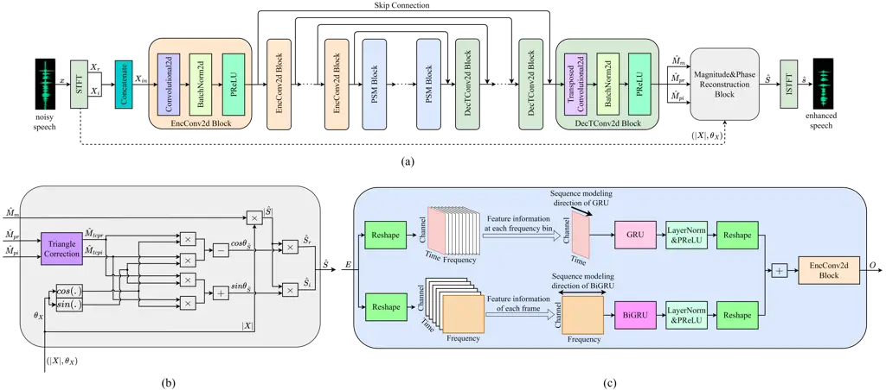

# Magnitude-and-Phase-aware speech enhancement with parallel sequence modeling

Yuewei Zhang    Huanbin Zou    Jie Zhu ^(†)^(†)thanks: ^(∗) Equally
contribute to this work.^(†)^(†)thanks: ^(†) Corresponding author
(Email: zhujie@sjtu.edu.cn).

###### Abstract

In speech enhancement (SE), phase estimation is important for perceptual
quality, so many methods take clean speech’s complex short-time Fourier
transform (STFT) spectrum or the complex ideal ratio mask (cIRM) as the
learning target. To predict these complex targets, the common solution
is to design a complex neural network, or use a real network to
separately predict the real and imaginary parts of the target. But in
this paper, we propose to use a real network to estimate the magnitude
mask and normalized cIRM, which not only avoids the significant increase
of the model complexity caused by complex networks, but also shows
better performance than previous phase estimation methods. Meanwhile, we
devise a parallel sequence modeling (PSM) block to improve the RNN block
in the convolutional recurrent network (CRN)-based SE model. We name our
method as magnitude-and-phase-aware and PSM-based CRN (MPCRN). The
experimental results illustrate that our MPCRN has superior SE
performance.

###### Index Terms: 

speech enhancement, magnitude mask, normalized complex ideal ratio mask,
parallel sequence modeling

^(†)^(†)address: ¹ Department of Electronic Engineering, Shanghai Jiao
Tong University, Shanghai, China  
² Tencent Video Cloud, Shanghai, China

## 1 Introduction

In the real world, the clean speech is often contaminated by various
types of environmental noise, leading to an noticeable decline in the
perceptual quality and intelligibility of the speech. As a result,
speech enhancement (SE) technique has become an important front-end
speech signal processing step for numerous applications, such as voice
communication, automatic speech recognition (ASR), and hearing aid
devices. The primary objective of SE is to suppress the noise signal
while preserving the valuable speech components. Traditional SE methods
include spectral subtraction \[1\], wiener filtering \[2\],
probabilistic modeling-based method \[3\], etc. These methods heavily
rely on specific prior assumptions and parameter settings, which limits
their performance, particularly in the case of non-stationary noise
pollution and low signal-to-noise ratio (SNR). In the past few years,
many deep neural network (DNN)-based SE methods \[4, 5, 6, 7, 8, 9\]
have been proposed, demonstrating excellent performance compared to the
traditional approaches.

While some works have attempted to directly enhance noisy speech in the
time domain \[4, 5\], a majority of recent studies have opted to tackle
the SE task in the time-frequency (TF) domain \[6, 7, 8, 9\]. TF domain
methods tend to outperform the time-domain methods. One of the main
advantages of TF domain methods is that their input contains more
feature information, particularly the spectral features. Specifically,
TF domain methods first transform the one-dimensional (1D) waveform into
a two-dimensional (2D) spectrum using a short-time Fourier transform
(STFT). The resulting 2D spectrum is then fed into a DNN for SE
processing. Conventional TF domain methods \[6, 7\] typically estimate
the magnitude mask or directly the magnitude spectrum of the clean
speech, and then reuse the original noisy speech’s phase to reconstruct
the enhanced speech. However, it has been demonstrated that phase
recovery plays an important role in further improving the performance of
SE \[10\].

Nevertheless, predicting the clean speech’s phase is challenging due to
its lack of structural characteristics. Consequently, many works
struggle to resolve the phase estimation problem in the SE task. For
instance, \[11\] proposed a dual-branch network to separately estimate
the magnitude and phase spectrum. In another approach, \[12\] introduced
a dual-branch network to simultaneously estimate the real and imaginary
parts of STFT spectrum. Additionally, complex neural network has also
been employed to directly predict the complex ideal ratio mask (cIRM)
\[8, 13\]. However, these previous methods suffer from three main
shortcomings. Firstly, both the dual-branch network and the complex
network increase the parameter size and computational complexity of the
SE model. The increase of model complexity is apparent and
understandable in the case of the dual-branch network. As for the
complex network, it replaces the ordinary real-valued convolutional
layers, recurrent layers, and normalization layers in DNN with their
complex-valued counterparts, which doubles the model size and quadruples
computational operations. Therefore, this can be a disadvantage in terms
of efficiency and practicality. Secondly, the approach that uses a real
network to separately estimate the real and imaginary parts of the
complex STFT spectrum or the cIRM has limited performance, since this
method requires the network to learn the real and imaginary parts
without prior knowledge \[8\]. Thirdly, without the explicit magnitude
and phase optimizations, implicitly enhancing the noisy speech in the
complex STFT spectrum domain leads to the compensation problem \[14\]
between the magnitude and phase. As a result, this approach is
susceptible to signal shifts in the time domain and adversely impacts
the quality of the enhanced speech.

In this paper, we propose a novel approach where the target magnitude
and phase are estimated separately using the magnitude mask and
normalized cIRM. These two new targets are easier for neural networks to
predict. Meanwhile, the decoupling of the magnitude and phase estimation
also improves the robustness of our method to temporal signal shifts. In
addition, it has been observed that the real and imaginary parts of the
audio’s STFT spectrum exhibit similar structural characteristics to its
magnitude spectrum. Based on this insight, we employ a convolutional
recurrent network (CRN)-based SE network with a single-branch network
topology to simultaneously estimate the magnitude mask and normalized
cIRM. Specifically, we utilize a parameter sharing strategy in which the
output channel of the SE network’s last decoder layer is set as 3. This
configuration enables the simultaneous prediction of the magnitude mask,
as well as the real and imaginary parts of the normalized cIRM. This
strategy not only reduces the model size and computational complexity
but also realizes a network regularization. Experimental comparisons
with the previous phase-aware methods demonstrate the effectiveness and
superiority of our proposed scheme.

Besides, we improve the recurrent module in the conventional CRN
structure. The previous recurrent module only captures local and global
dependencies along the time dimension, neglecting the speech’s spectral
correlation in the frequency dimension. To address this limitation, we
introduce a parallel sequence modeling (PSM) block as a replacement for
the recurrent neural network (RNN) layer in the recurrent module. The
PSM block adopts the parallel gated recurrent unit (GRU) and
bidirectional gated recurrent unit (BiGRU) to perform sequence modeling
along the input feature’s time and frequency dimensions, respectively.
Subsequently, we employ a feature fusion network to integrate the two
processed feature information and generate the fused result. The
ablation study proves the performance benefits of our proposed PSM
block.

In a nutshell, our contributions can be summarized as follows:

- •
  We propose to decouple the magnitude and phase estimation by
  simultaneously predicting the magnitude mask and normalized cIRM,
  which reduces the parameter size, computational complexity, and
  learning difficulty for the neural network, and finally yields an
  excellent SE performance.
- •
  We introduce a PSM block to capture the sequential dynamics of speech
  features along both the time and frequency dimensions, which further
  improves the performance of the CRN-based SE model.

Combining the magnitude-and-phase-aware scheme and the proposed PSM
block to improve the previous CRN-based model, we name our method as
MPCRN.

The rest of the paper is organized as follows. Section 2 introduces the
detailed architecture and principles of our proposed MPCRN. Section 3
provides the experimental configurations, evaluation metrics, and
experimental results. Section 4 concludes the paper and discusses future
research directions.



Figure 1: (a) Overall structure of MPCRN. (b) The diagram of
magnitude&phase reconstruction block. (c) The diagram of parallel
sequence modeling (PSM) block.

## 2 Method

### 2.1 Signal Model

In the time domain, the noisy speech $`x(n)`$ (where $`n`$ represents
the discrete time index) can be formulated as

```math
x(n)=s(n)+z(n) \tag{1}
```

where $`s(n)`$ and $`z(n)`$ represent the clean speech and noise.
Applying the STFT to both side of Eq. (1), we obtain

```math
X_{m,f}=S_{m,f}+Z_{m,f} \tag{2}
```

where $`X_{m,f},S_{m,f},Z_{m,f}\in\mathbb{C}`$ are the STFT spectrum of
noisy speech, clean speech, and additive noise. The $`m`$ and $`f`$
index the time frame and the frequency bin. In the following content, we
omit the time and frequency indexes for brevity. In the Cartesian
coordinates, Eq. (2) can be written as

```math
X_{r}+jX_{i}=(S_{r}+Z_{r})+j(S_{i}+Z_{i}) \tag{3}
```

In this work, we adopt the masking-based SE method, thus, the learning
target of DNN can be expressed as

```math
\displaystyle M \displaystyle=M_{r}+jM_{i}=\frac{S}{X}=\frac{S_{r}+jS_{i}}{X_{r}+jX_{i}} \tag{4}
```

where $`M\in\mathbb{C}`$ is just the cIRM.

### 2.2 Overall Network Architecture

The overall network architecture of MPCRN is depicted in Fig. 1(a).
Similar to CRN, MPCRN follows an encoder-decoder (ED) structure. The
encoder is designed to extract high-level features from the input TF
spectrum of the noisy speech, while the decoder aims to reconstruct the
spectrum mask with the same resolution as the input spectrum.
Additionally, there is a recurrent module between the encoder and
decoder. The role of this recurrent module is to suppress the noise
components within the extracted speech features and preserve the desired
speech components.

In our work, we transform the input noisy speech $`x`$ by STFT and take
the concatenated $`X_{in}=Con(X_{r},X_{i})`$ as the network input. The
encoder consists of several 2D convolutional (EncConv2d) blocks, each
composed of a 2D convolutional layer, a 2D batch normalization layer,
and a PReLU layer. Following the encoder, the recurrent module comprises
several of our proposed PSM blocks. These blocks replace the
conventional RNN layers and provide a better modeling sequence
capability. The details of our PSM block will be introduced in Section
2.4. Next, the decoder, which has a symmetric structure to the encoder,
includes several 2D transposed convolutional (DecTConv2d) blocks. Each
DecTConv2d block contains a 2D transposed convolutional layer, a 2D
batch normalization layer, and a PReLU layer. The decoder generates the
predicted magnitude mask $`\hat{M}_{m}`$ and normalized cIRM
$`e^{j\theta_{\hat{M}}}=\hat{M}_{pr}+j\hat{M}_{pi}`$. These predictions
are then combined with the noisy magnitude $`|X|`$ and phase
$`\theta_{X}`$ using a magnitude&phase reconstruction block. The details
of how this block performs magnitude and phase estimation for the
enhanced speech will be presented in Section 2.3. Finally, the
magnitude&phase reconstruction block outputs the enhanced STFT spectrum
$`\hat{S}`$, from which the enhanced speech $`\hat{s}`$ can be obtained
by inverse STFT (ISTFT).

### 2.3 Magnitude and Phase Estimation

To achieve both magnitude and phase estimation for enhanced speech,
previous masking-based SE methods always attempt to estimate the cIRM
$`M`$ in Cartesian coordinates. In these methods, the prediction target
is a complex value, and existing approaches either employ a complex
network to directly estimate the cIRM or estimate the real part
$`M_{r}`$ and imaginary part $`M_{i}`$ of the cIRM separately.

Different from the previous methods, we propose to decouple the
magnitude and phase estimation and predict the cIRM in polar
coordinates. The equivalent form of Eq. (2) in polar coordinates is

```math
|X|e^{j\theta_{X}}=|S|e^{j\theta_{S}}+|Z|e^{j\theta_{Z}} \tag{5}
```

where $`|\cdot|`$ and $`\theta_{(\cdot)}`$ represent the magnitude and
phase components.

Meanwhile, the cIRM $`M`$ in Eq. (4) can also be rewritten as

```math
M=|M|e^{j\theta_{M}}=\frac{S}{X}=\frac{|S|e^{j\theta_{S}}}{|X|e^{j\theta_{X}}}=\frac{|S|}{|X|}e^{j(\theta_{S}-\theta_{X})} \tag{6}
```

where $`|M|`$ and $`\theta_{M}`$ are the magnitude and phase masks, and
they can be obtained as

```math
|M|=\frac{|S|}{|X|} \tag{7}
```

```math
e^{j\theta_{M}}=e^{j(\theta_{S}-\theta_{X})} \tag{8}
```

By this way, the prediction targets of the DNN are transformed into the
magnitude mask $`|M|`$ and the phase mask $`\theta_{M}`$. Similar to the
previous magnitude-only SE method \[6\], our MPCRN generates a bounded
magnitude mask estimation $`\hat{M}_{m}\in(0,1)`$. However, directly
estimating the phase mask is difficult due to the non-structural
characteristics of speech phase. In our work, we choose to equally
estimate $`e^{j\theta_{M}}`$, which corresponds to the normalized cIRM.
Specifically, our MPCRN outputs two bounded tensors as
$`\hat{M}_{pr}\in(-1,1)`$ and $`\hat{M}_{pi}\in(-1,1)`$, which are
respectively the estimations for $`cos(\theta_{M})`$ and
$`sin(\theta_{M})`$. Thus, the normalized cIRM is estimated as

```math
e^{j\theta_{\hat{M}}}=\hat{M}_{pr}+j\hat{M}_{pi} \tag{9}
```

where $`\theta_{\hat{M}}`$ is the estimated phase mask.

In order to predict the aforementioned $`\hat{M}_{m}`$, $`\hat{M}_{pr}`$
and $`\hat{M}_{pi}`$, we set the output channel of the 2D transposed
convolutional layer in the last DecTConv2d block to 3. Then, we apply
the Sigmoid function to the tensor of the first output channel,
resulting in $`\hat{M}_{m}`$. Similarly, we apply the Tanh function to
the tensors of the second and third output channels, yielding
$`\hat{M}_{pr}`$ and $`\hat{M}_{pi}`$, respectively.

Combining the predicted masks (including the magnitude mask estimation
$`\hat{M}_{m}`$ and the normalized cIRM estimation
$`\hat{M}_{pr}+j\hat{M}_{pi}`$) and the noisy spectrum (including the
noisy magnitude $`|X|`$ and the noisy phase $`\theta_{X}`$), we can
obtain the enhanced spectrum $`\hat{S}`$. This process is achieved
through the magnitude&phase reconstruction block, as illustrated in Fig.
1(b). The detailed calculation process of this block is described below.

According to Eq. (7), the enhanced magnitude $`|\hat{S}|`$ can be
obtained as

```math
|\hat{S}|=\hat{M}_{m}\cdot|X| \tag{10}
```

The enhanced phase is derived from the normalized cIRM and the noisy
phase. Firstly, since the $`\hat{M}_{pr}`$ and $`\hat{M}_{pi}`$ are
respectively the estimations for $`cos(\theta_{M})`$ and
$`sin(\theta_{M})`$, they should satisfy the condition
$`\hat{M}_{pr}^{2}+\hat{M}_{pi}^{2}=1`$. But in practice, it is hard to
guarantee this condition, because $`\hat{M}_{pr}`$ and $`\hat{M}_{pi}`$
are the outputs of DNN. Therefore, we modify $`\hat{M}_{pr}`$ and
$`\hat{M}_{pi}`$ using triangle correction, i.e.,

```math
\hat{M}_{tcpr}=\frac{\hat{M}_{pr}}{\sqrt{{\hat{M}_{pr}}^{2}+{\hat{M}_{pi}}^{2}}} \tag{11}
```

```math
\hat{M}_{tcpi}=\frac{\hat{M}_{pi}}{\sqrt{{\hat{M}_{pr}}^{2}+{\hat{M}_{pi}}^{2}}} \tag{12}
```

Thus, the estimated cIRM in Eq. (9) should also be modified as

```math
e^{j\theta_{\hat{M}}}=\hat{M}_{tcpr}+j\hat{M}_{tcpi} \tag{13}
```

According to Eq. (8), the enhanced phase $`\theta_{\hat{S}}`$ can be
obtained as

```math
\displaystyle e^{j\theta_{\hat{S}}} \displaystyle=e^{j\theta_{\hat{M}}}\cdot{e^{j\theta_{X}}} \tag{14}
```

```math
\displaystyle=(\hat{M}_{tcpr}+j\hat{M}_{tcpi})\cdot{(cos(\theta_{X})+jsin(\theta_{X}))}
```

Extracting the real and imaginary terms on both sides of Eq. (14) yields

```math
cos(\theta_{\hat{S}})=\hat{M}_{tcpr}\cdot{cos(\theta_{X})}-\hat{M}_{tcpi}\cdot{sin(\theta_{X})} \tag{15}
```

```math
sin(\theta_{\hat{S}})=\hat{M}_{tcpr}\cdot{sin(\theta_{X})}+\hat{M}_{tcpi}\cdot{cos(\theta_{X})} \tag{16}
```

Based on the results of Eq. (10) and Eq. (15, 16), the real and
imaginary parts of the enhanced spectrum can be derived as

```math
\hat{S}_{r}=|\hat{S}|\cdot{cos(\theta_{\hat{S}})} \tag{17}
```

```math
\hat{S}_{i}=|\hat{S}|\cdot{sin(\theta_{\hat{S}})} \tag{18}
```

### 2.4 Parallel Sequence Modeling Block

The conventional CRN architecture incorporates multiple RNN layers
between the encoder and decoder to capture temporal correlations in the
speech features and serve for noise reduction. However, modeling the
local and global spectral dependencies among different frequency bins in
speech are also crucial for SE. Therefore, we introduce the sequence
modeling along the frequency dimension to further enhance the SE
performance. To achieve this, we design a PSM block to replace the
previous RNN layer in the CRN architecture.

The details of our proposed PSM block is illustrated in Fig. 1(c). This
block consists of two main parts: a dual-branch sequence modeling
network and a feature fusion network. Once the input feature $`E`$ is
fed into the PSM block, the dual-branch network captures the sequential
context of the input feature along both the time and frequency
dimensions simultaneously.

For temporal sequence modeling, we reshape the input feature $`E`$ to
ensure that the subsequent GRU layer can model the correlation among
different speech frames. The GRU layer is followed by a layer
normalization and a PReLU function, which is beneficial to the
generalization and representation capability of the network. The result
after PReLU function is reshaped again, so that the processed feature
after temporal sequence modeling has the same dimensional order as the
original input $`E`$.

For spectral sequence modeling, we reshape $`E`$ in another way, so as
to use a BiGRU layer to model the frequency dynamics of the input
feature at each frame. Since this sequence modeling process does not
influence the causal inference, we adopt BiGRU instead of GRU, as it
yields better performance. Same as the temporal branch, there is also a
layer normalization, a PReLU function, and a reshape operation after the
BiGRU, and their purposes are consistent to the temporal branch.

The feature fusion network receives the output features from the above
two branches. It adds the two output features together and subsequently
processes the sum through an EncConv2d block. This EncConv2d block
contains a $`1\times 1`$ convolutional layer, whose purpose is to
further integrate the features from the previous two branches and adjust
the number of channels in the output feature. Finally, the result after
this EncConv2d block is just the output $`O`$ of our PSM block, and the
output $`O`$ has the same shape as the input $`E`$.

### 2.5 Loss Function

Similar to previous works \[8, 15\], we optimize our MPCRN by signal
approximation (SA) \[16\], which aims to minimize the error between the
enhanced speech and the clean speech. Thus, our loss function is
formulated as

```math
\mathcal{L}_{\text{mag}}=\left\|\sqrt{\hat{S}_{r}^{2}+\hat{S}_{i}^{2}}-\sqrt{S_{r}^{2}+S_{i}^{2}}\right\|_{F}^{2} \tag{19}
```

```math
\mathcal{L}_{\text{RI}}=\left\|\hat{S}_{r}-S_{r}\right\|_{F}^{2}+\left\|\hat{S}_{i}-S_{i}\right\|_{F}^{2} \tag{20}
```

```math
\mathcal{L}=\alpha_{1}\mathcal{L}_{\text{mag}}+\alpha_{2}\mathcal{L}_{\text{RI}} \tag{21}
```

where $`\mathcal{L}_{\text{mag}}`$ and $`\mathcal{L}_{\text{RI}}`$ are
the magnitude spectral loss and the complex spectral loss.
$`\left\|\cdot\right\|_{F}^{2}`$ denotes the mean square error (MSE)
loss. In Eq. (21), the total loss $`\mathcal{L}`$ is the weighted sum of
$`\mathcal{L}_{\text{mag}}`$ and $`\mathcal{L}_{\text{RI}}`$. In our
work, we set the weights of the two loss items as
$`\alpha_{1}=\alpha_{2}=1`$.

## 3 Experiments

### 3.1 Dataset

We adopt the widely used VoiceBank+DEMAND dataset \[17\] to evaluate our
method. This dataset includes 11,572 clean-noisy utterance pairs for
training and another 824 clean-noisy utterance pairs for testing. For
the training set, the clean audios are selected from 28 speakers’
recordings of the Voice Bank corpus \[18\]. These clean audios are mixed
with noise (including 2 types of artificially generated noise and 8
types of noise recordings from the Demand database \[19\]) at the mixed
SNRs of {0dB,5dB,10dB,15dB}. For the test set, the clean audios are from
2 unseen speakers’ recordings of the Voice Bank corpus, and they are
mixed with 5 unseen types of noise from the Demand database at the mixed
SNRs of {2.5dB,7.5dB,12.5dB,17.5dB}. All utterances are resampled to
16KHz. During the model training process, all utterances are chunked to
3 seconds.

### 3.2 Experimental Setup

We employ a Hamming window to implement the STFT in our experiment. The
window length and hop size are set as 32ms and 8ms, resulting in a 75%
overlap between consecutive frames. We use a 512-point FFT to compute
the STFT spectrum, so the frequency dimension of the obtained STFT
spectrum is 257.

In our MPCRN architecture, the encoder, recurrent module, and decoder
respectively include five EncConv2d blocks, three PSM blocks, and five
DecTConv2d blocks. For all the convolutional and transposed
convolutional layers in the encoder and decoder, we set the kernel size
as (5,2) in the frequency and time dimensions, and the stride is (2,1).
The output channel of each convolutional layer in the encoder is
{16,32,64,128,256}, while the output channel of each transposed
convolutional layer is {128,64,32,16,3}. In each PSM block, the hidden
units of the GRU layer and the BiGRU layer are the same. And the hidden
units of the three PSM blocks are {128,64,32}, respectively. It is worth
noting that we ensure causality in our MPCRN by using asymmetric
zero-padding in all the convolutional and transposed convolutional
layers. This enables our method to achieve real-time SE.

During the training stage, we utilize the RMSprop optimizer with an
initial learning rate of 2e-4. The learning rate decays by 0.5 if the
model performance does not improve for 6 consecutive epochs. We conduct
a total of 100 epochs for model training, with a batch size of 16.

### 3.3 Ablation Study

The model performance is evaluated by the wide-band perceptual
evaluation of speech quality (WB-PESQ) \[20\] and three MOS metrics
(i.e., CSIG, CBAK, and COVL) \[21\].

We conduct an ablation study to demonstrate the effectiveness of our
magnitude-and-phase-aware scheme and PSM block. The results of ablation
study are presented in Table 1.

|               | WB-PESQ | CSIG | CBAK | COVL |
| ------------- | ------- | ---- | ---- | ---- |
| noisy         | 1.97    | 3.35 | 2.44 | 2.63 |
| MPCRN-R       | 2.80    | 4.00 | 3.41 | 3.39 |
| MPCRN-C       | 2.80    | 3.97 | 3.42 | 3.38 |
| MPCRN-E       | 2.86    | 4.08 | 3.45 | 3.47 |
| MPCRN-w/o-PSM | 2.81    | 4.02 | 3.43 | 3.41 |
| MPCRN         | 2.96    | 4.16 | 3.50 | 3.56 |

Table 1: Ablation study on VoiceBank+DEMAND test set

| Methods          | Year | Input     | WB-PESQ | CSIG | CBAK | COVL | Model Size (M) |
| ---------------- | ---- | --------- | ------- | ---- | ---- | ---- | -------------- |
| noisy            | \-   | \-        | 1.97    | 3.35 | 2.44 | 2.63 | \-             |
| RNNoise \[6\]    | 2018 | Magnitude | 2.29    | \-   | \-   | \-   | 0.06           |
| NSNet2 \[22\]    | 2021 | Magnitude | 2.47    | 3.23 | 2.99 | 2.90 | 6.17           |
| ERNN \[23\]      | 2020 | Magnitude | 2.54    | 3.74 | 2.65 | 3.13 | 0.79           |
| CRN \[7\]        | 2018 | Magnitude | 2.56    | 3.51 | 2.98 | 3.02 | \-             |
| DCCRN \[8\]      | 2020 | Complex   | 2.68    | 3.88 | 3.18 | 3.27 | 3.7            |
| PercepNet \[24\] | 2020 | Magnitude | 2.73    | \-   | \-   | \-   | 8              |
| DeepMMSE \[9\]   | 2020 | Magnitude | 2.77    | 4.14 | 3.32 | 3.46 | \-             |
| LFSFNet \[25\]   | 2022 | Magnitude | 2.91    | \-   | \-   | \-   | 3.1            |
| DEMUCS \[5\]     | 2021 | Time      | 2.93    | 4.22 | 3.25 | 3.52 | 128            |
| GaGNet \[26\]    | 2022 | Complex   | 2.94    | 4.26 | 3.45 | 3.59 | 5.94           |
| MPCRN            | 2023 | Complex   | 2.96    | 4.16 | 3.50 | 3.56 | 2.09           |

Table 2: Performance comparison with other advanced systems on
VoiceBank+DEMAND test set under causal implementation. Unreported values
of related work are indicated as ”-”.

Many existing methods \[8, 13\] estimate the enhanced spectrum
$`\hat{S}=\hat{S}_{r}+j\hat{S}_{i}`$ in Cartesian coordinates.
Typically, these methods utilize a DNN to predict the cIRM
$`\hat{M}=\hat{M}_{r}+j\hat{M}_{i}`$. Subsequently, the cIRM is combined
with the input noisy spectrum $`X=X_{r}+jX_{i}`$ to obtain the enhanced
spectrum $`\hat{S}`$. Furthermore, as described in DCCRN \[8\], there
are three multiplicative patterns to derive $`\hat{S}`$, which are named
DCCRN-R, DCCRN-C, and DCCRN-E. To prove the superiority of our
magnitude-and-phase-aware scheme over previous methods, we have also
modified the predicting target of our MPCRN to cIRM, and calculated
$`\hat{S}`$ using the same three patterns as in DCCRN. Correspondingly,
we denote the three ablation experiments as MPCRN-R, MPCRN-C, and
MPCRN-E, which can be expressed as followings.

- •
  MPCRN-R:

  ```math
  \hat{S}=(X_{r}\cdot{\hat{M}_{r}})+j(X_{i}\cdot{\hat{M}_{i}}) \tag{22}
  ```

- •
  MPCRN-C:

  ```math
  \hat{S}=(X_{r}\cdot{\hat{M}_{r}}-X_{i}\cdot{\hat{M}_{i}})+j(X_{r}\cdot{\hat{M}_{i}}+X_{i}\cdot{\hat{M}_{r}}) \tag{23}
  ```

- •
  MPCRN-E:

  ```math
  \hat{S}=|X|\cdot{\sqrt{\hat{M}_{r}^{2}+\hat{M}_{i}^{2}}}\cdot{e^{\theta_{X}+arctan2(\hat{M}_{i},\hat{M}_{r})}} \tag{24}
  ```

In addition, we have also conducted the experiment without the PSM
block, using only the ordinary GRU layer for sequence modeling. This
configuration is denoted as MPCRN-w/o-PSM.

The evaluation results in Table 1 demonstrate that our MPCRN outperforms
MPCRN-R, MPCRN-C, and MPCRN-E across all the evaluation metrics. This
result confirms the advantages of our proposed magnitude-and-phase-aware
scheme. In other words, taking the magnitude mask and normalized cIRM as
the predicting targets yields superior performance compared to previous
cIRM-based methods. Furthermore, we can also observe that MPCRN achieves
better evaluation results than MPCRN-w/o-PSM, which verifies the benefit
of our proposed PSM block.

### 3.4 Comparison with Other Advanced Systems

We further compare our MPCRN with other advanced methods as shown in
Table 2. To ensure a fair model comparison, all the benchmarks are
causal. Meanwhile, these benchmarks adopt various inputs and techniques,
and they have demonstrated excellent performance during their respective
evaluation periods. Thus, the comparison with these benchmarks will
effectively highlight the superiority of our method.

From the comparison results in Table 2, we can find that our MPCRN
outperforms the previous methods on most of the metrics. Notably, our
method achieves the highest scores on WB-PESQ and CBAK, indicating its
superiority in terms of perceptual speech quality and background noise
reduction. Although DEMUCS \[5\] performs better on CSIG, and GaGNet
\[26\] performs better on CSIG and COVL, both of them have much more
parameters than our MPCRN. Meanwhile, the computational operations of
our MPCRN are 2.02 GMACs/s. We have also conducted an real-time factor
test on Intel(R) Xeon(R) Platinum 8255C CPU@2.50GHz and the result is
only 0.12, which is satisfactory. Thus, the low model complexity is
another advantage of our MPCRN.

In addition, since our MPCRN is causal, the inference delay is one frame
duration, i.e., 32ms. Therefore, our model also satisfies the
requirement for real-time denoising \[27\].

In a word, our MPCRN is a lightweight real-time SE model, and it
demonstrates excellent performance compared to other advanced systems.

## 4 Conclusion

In this work, we have introduced MPCRN, a novel approach for real-time
SE task. Our method addresses the phase estimation problem by
representing the predicting target in the polar coordinates, namely the
magnitude mask and normalized cIRM. The experimental results illustrate
that our method outperforms the conventional phase-aware schemes.
Additionally, our MPCRN model exhibits significantly fewer parameters
compared to previous methods, as we adopt a CRN-based network to
simultaneously estimate the magnitude mask and normalized cIRM.
Furthermore, we have also proposed a PSM block to replace the RNN layer
in the CRN architecture. This block effectively captures the sequential
correlations of speech features in both time and frequency dimensions,
which is demonstrated to be better than the ordinary RNN layer. In the
future, our study should involve other tasks, such as speech
dereverberation and speech separation.

## 5 Acknowledge

This work was supported by the special funds of Shenzhen Science and
Technology Innovation Commission under Grant No.
CJGJZD20220517141400002.

## References

- \[1\] S. Boll, “Suppression of acoustic noise in speech using spectral
  subtraction,” IEEE Transactions on Acoustics, Speech, and Signal
  Processing, vol. 27, no. 2, pp. 113–120, 1979.
- \[2\] J.S. Lim and A.V. Oppenheim, “Enhancement and bandwidth
  compression of noisy speech,” Proceedings of the IEEE, vol. 67, no.
  12, pp. 1586–1604, 1979.
- \[3\] Hagai Attias, John Platt, Alex Acero, and Li Deng, “Speech
  denoising and dereverberation using probabilistic models,” in Advances
  in Neural Information Processing Systems, T. Leen, T. Dietterich, and
  V. Tresp, Eds. 2000, vol. 13, MIT Press.
- \[4\] Santiago Pascual, Antonio Bonafonte, and Joan Serrà, “Segan:
  Speech enhancement generative adversarial network,” 2017.
- \[5\] Alexandre Défossez, Gabriel Synnaeve, and Yossi Adi, “Real Time
  Speech Enhancement in the Waveform Domain,” in Proc. Interspeech 2020,
  2020, pp. 3291–3295.
- \[6\] Jean-Marc Valin, “A hybrid dsp/deep learning approach to
  real-time full-band speech enhancement,” in 2018 IEEE 20th
  International Workshop on Multimedia Signal Processing (MMSP), 2018,
  pp. 1–5.
- \[7\] Ke Tan and DeLiang Wang, “A Convolutional Recurrent Neural
  Network for Real-Time Speech Enhancement,” in Proc. Interspeech 2018,
  2018, pp. 3229–3233.
- \[8\] Yanxin Hu, Yun Liu, Shubo Lv, Mengtao Xing, Shimin Zhang, Yihui
  Fu, Jian Wu, Bihong Zhang, and Lei Xie, “DCCRN: Deep Complex
  Convolution Recurrent Network for Phase-Aware Speech Enhancement,” in
  Proc. Interspeech 2020, 2020, pp. 2472–2476.
- \[9\] Qiquan Zhang, Aaron Nicolson, Mingjiang Wang, Kuldip K. Paliwal,
  and Chenxu Wang, “Deepmmse: A deep learning approach to mmse-based
  noise power spectral density estimation,” IEEE/ACM Transactions on
  Audio, Speech, and Language Processing, vol. 28, pp. 1404–1415, 2020.
- \[10\] Kuldip Paliwal, Kamil Wójcicki, and Benjamin Shannon, “The
  importance of phase in speech enhancement,” Speech Communication, vol.
  53, no. 4, pp. 465–494, 2011.
- \[11\] Dacheng Yin, Chong Luo, Zhiwei Xiong, and Wenjun Zeng, “Phasen:
  A phase-and-harmonics-aware speech enhancement network,” Proceedings
  of the AAAI Conference on Artificial Intelligence, vol. 34, no. 05,
  pp. 9458–9465, Apr. 2020.
- \[12\] Ke Tan and DeLiang Wang, “Complex spectral mapping with a
  convolutional recurrent network for monaural speech enhancement,” in
  ICASSP 2019 - 2019 IEEE International Conference on Acoustics, Speech
  and Signal Processing (ICASSP), 2019, pp. 6865–6869.
- \[13\] Hyeong-Seok Choi, Janghyun Kim, Jaesung Huh, Adrian Kim,
  Jung-Woo Ha, and Kyogu Lee, “Phase-aware speech enhancement with deep
  complex u-net,” in International Conference on Learning
  Representations, 2019.
- \[14\] Zhong-Qiu Wang, Gordon Wichern, and Jonathan Le Roux, “On the
  compensation between magnitude and phase in speech separation,” IEEE
  Signal Processing Letters, vol. 28, pp. 2018–2022, 2021.
- \[15\] Ke Tan and DeLiang Wang, “Learning complex spectral mapping
  with gated convolutional recurrent networks for monaural speech
  enhancement,” IEEE/ACM Transactions on Audio, Speech, and Language
  Processing, vol. 28, pp. 380–390, 2020.
- \[16\] Felix Weninger, John R. Hershey, Jonathan Le Roux, and Björn
  Schuller, “Discriminatively trained recurrent neural networks for
  single-channel speech separation,” in 2014 IEEE Global Conference on
  Signal and Information Processing (GlobalSIP), 2014, pp. 577–581.
- \[17\] Cassia Valentini-Botinhao, Xin Wang, Shinji Takaki, and Junichi
  Yamagishi, “Investigating rnn-based speech enhancement methods for
  noise-robust text-to-speech.,” in SSW, 2016, pp. 146–152.
- \[18\] Christophe Veaux, Junichi Yamagishi, and Simon King, “The voice
  bank corpus: Design, collection and data analysis of a large regional
  accent speech database,” in 2013 International Conference Oriental
  COCOSDA held jointly with 2013 Conference on Asian Spoken Language
  Research and Evaluation (O-COCOSDA/CASLRE), 2013, pp. 1–4.
- \[19\] Joachim Thiemann, Nobutaka Ito, and Emmanuel Vincent, “The
  diverse environments multi-channel acoustic noise database: A database
  of multichannel environmental noise recordings,” The Journal of the
  Acoustical Society of America, vol. 133, no. 5, pp. 3591–3591,
  05 2013.
- \[20\] A.W. Rix, J.G. Beerends, M.P. Hollier, and A.P. Hekstra,
  “Perceptual evaluation of speech quality (pesq)-a new method for
  speech quality assessment of telephone networks and codecs,” in 2001
  IEEE International Conference on Acoustics, Speech, and Signal
  Processing. Proceedings (Cat. No.01CH37221), 2001, vol. 2, pp. 749–752
  vol.2.
- \[21\] Yi Hu and Philipos C. Loizou, “Evaluation of objective quality
  measures for speech enhancement,” IEEE Transactions on Audio, Speech,
  and Language Processing, vol. 16, no. 1, pp. 229–238, 2008.
- \[22\] Sebastian Braun, Hannes Gamper, Chandan K.A. Reddy, and Ivan
  Tashev, “Towards efficient models for real-time deep noise
  suppression,” in ICASSP 2021 - 2021 IEEE International Conference on
  Acoustics, Speech and Signal Processing (ICASSP), 2021, pp. 656–660.
- \[23\] Daiki Takeuchi, Kohei Yatabe, Yuma Koizumi, Yasuhiro Oikawa,
  and Noboru Harada, “Real-time speech enhancement using equilibriated
  rnn,” in ICASSP 2020 - 2020 IEEE International Conference on
  Acoustics, Speech and Signal Processing (ICASSP), 2020, pp. 851–855.
- \[24\] Jean-Marc Valin, Umut Isik, Neerad Phansalkar, Ritwik Giri,
  Karim Helwani, and Arvindh Krishnaswamy, “A Perceptually-Motivated
  Approach for Low-Complexity, Real-Time Enhancement of Fullband
  Speech,” in Proc. Interspeech 2020, 2020, pp. 2482–2486.
- \[25\] Zhuangqi Chen and Pingjian Zhang, “Lightweight Full-band and
  Sub-band Fusion Network for Real Time Speech Enhancement,” in Proc.
  Interspeech 2022, 2022, pp. 921–925.
- \[26\] Andong Li, Chengshi Zheng, Lu Zhang, and Xiaodong Li, “Glance
  and gaze: A collaborative learning framework for single-channel speech
  enhancement,” Applied Acoustics, vol. 187, pp. 108499, 2022.
- \[27\] Chandan K.A. Reddy, Vishak Gopal, Ross Cutler, Ebrahim Beyrami,
  Roger Cheng, Harishchandra Dubey, Sergiy Matusevych, Robert Aichner,
  Ashkan Aazami, Sebastian Braun, Puneet Rana, Sriram Srinivasan, and
  Johannes Gehrke, “The INTERSPEECH 2020 Deep Noise Suppression
  Challenge: Datasets, Subjective Testing Framework, and Challenge
  Results,” in Proc. Interspeech 2020, 2020, pp. 2492–2496.
