# Dual-Branch Knowledge Distillation for Noise-Robust Synthetic Speech DetectionThanks: This work is supported by the STI2030-Major Projects (No.2021ZD0201500), the National Natural Science Foundation of China (NSFC) (No.62101553, No.62201002, No.62322120), Distinguished Youth Foundation of Anhui Scientific Committee (No.2208085J05), Special Fund for Key Program of Science and Technology of Anhui Province (No.202203a07020008), Open Fund of Key Laboratory of Flight Techniques and Flight Safety, CACC (No.FZ2022KF15), the Open Research Projects of Zhejiang Lab (No.2021KH0AB06), Cloud Ginger XR-1. _(Corresponding authors: Jianhua Tao; Ruibo Fu; Zhao Lv.)_ Cunhang Fan, Mingming Ding, and Zhao Lv are with the Anhui Province Key Laboratory of Multimodal Cognitive Computation, School of Computer Science and Technology, Anhui University, Hefei 230601, China (e-mail:cunhang.fan@ahu.edu.cn; e21301171@stu.ahu.edu.cn; kjlz@ahu.edu.cn). Ruibo Fu, Jiangyan Yi, and Zhengqi Wen are with the NLPR Lab, CASIA, Beijing 100190, China (e-mail: ruibo.fu@nlpr.ia.ac.cn; jiangyan.yi@nlpr.ia.ac.cn; zqwen@nlpr.ia.ac.cn). Jianhua Tao is with the Department of Automation, Tsinghua University Beijing National Research Center for Information Science and Technology, Tsinghua University (e-mail: jhtao@tsinghua.edu.cn).

PubID: pubid: 0000–0000/00\$00.00 © 2021 IEEE

Cunhang Fan Affiliation: ,  , Mingming Ding Affiliation: , Jianhua Tao
Affiliation: ,  , Ruibo Fu Affiliation: ,  , Jiangyan Yi Affiliation: ,
 , Zhengqi Wen, Zhao Lv Affiliation: ,  

###### Abstract

Most research in synthetic speech detection (SSD) focuses on improving
performance on standard noise-free datasets. However, in actual
situations, noise interference is usually present, causing significant
performance degradation in SSD systems. To improve noise robustness,
this paper proposes a dual-branch knowledge distillation synthetic
speech detection (DKDSSD) method. Specifically, a parallel data flow of
the clean teacher branch and the noisy student branch is designed, and
interactive fusion module and response-based teacher-student paradigms
are proposed to guide the training of noisy data from both the data
distribution and decision-making perspectives. In the noisy student
branch, speech enhancement is introduced initially for denoising, aiming
to reduce the interference of strong noise. The proposed interactive
fusion combines denoised features and noisy features to mitigate the
impact of speech distortion and ensure consistency with the data
distribution of the clean branch. The teacher-student paradigm maps the
student’s decision space to the teacher’s decision space, enabling noisy
speech to behave similarly to clean speech. Additionally, a joint
training method is employed to optimize both branches for achieving
global optimality. Experimental results based on multiple datasets
demonstrate that the proposed method performs effectively in noisy
environments and maintains its performance in cross-dataset experiments.
Source code is available at *https://github.com/fchest/DKDSSD*.

###### Index Terms: 

Synthetic speech detection, noise-robust, knowledge distillation,
interactive fusion.

## I Introduction

Speech synthesis technology has developed rapidly in recent years.
High-quality text-to-speech synthesis \[1\] applies advanced deep
learning frameworks and has been able to generate synthesis speech that
is nearly indistinguishable from real speech. This synthesis speech not
only poses a serious security threat to the biometric verification
system \[2\], but it may also interfere with the dissemination of
internet information. Therefore, to ensure network security, it is
crucial to improve the detection capabilities of synthesis speech.

Many studies focus on improving model performance under clean
conditions. The ASVspoof series of challenges \[3, 4, 5\] has
contributed high-quality noise-free datasets. Some works explore
discriminative subbands \[6, 7, 8, 9, 10\] to improve the representation
ability of features. Additionally, there are more works \[11, 12, 13\]
that tend to utilize original waveforms for end-to-end detection,
thereby avoiding the information loss associated with hand-crafted
features. Recent classification networks \[14, 15\] are predominantly
based on convolutional neural network and exhibit strong modeling
capabilities for features. Although the above models demonstrate
excellent performance on standard datasets, they cannot often generalize
to noisy environments.

In earlier studies, it has been shown that additive noise \[16\] can
significantly degrade the performance of detectors trained on pure
speech, so it is necessary to improve noise robustness. Recently, there
have also been related competitions. The ADD 2022 \[17\] competition
proposes a low-quality fake audio detection track, and the ASVspoof 2021
\[18\] logical access (LA) track also introduces channel noise
interference. When dealing with noisy data, data augmentation \[19, 20,
21, 22\] is a widely employed method, which can effectively improve the
features representation ability of the model. Multi-condition
training\[23\] is based on the principle of data augmentation, utilizing
noisy data for training to improve the model’s perception of noise (as
shown in Fig. 1(a)). In addition, the large-scale speech pre-training
model \[24\] has been fine-tuned for the SSD task in \[25\]. Adversarial
training \[21\] seeks noise-invariant features by adding a gradient
inversion layer into the classifier. However, data augmentation and
pre-trained models exhibit limitations in generalizing to unknown noise
types, and the use of adversarial strategies may increase training
instability.

Another approach is to introduce speech enhancement to learn noise masks
\[26, 27\], thereby enhancing the acoustic conditions. As illustrated in
Fig. 1(b), speech enhancement serves as the front-end, and is cascaded
with the SSD model\[28\], or the two modules are jointly trained \[29,
30\]. However, the cascade method faces challenges in achieving global
optimization, and speech enhancement in the joint training method may
lead to unavoidable speech distortion problems.

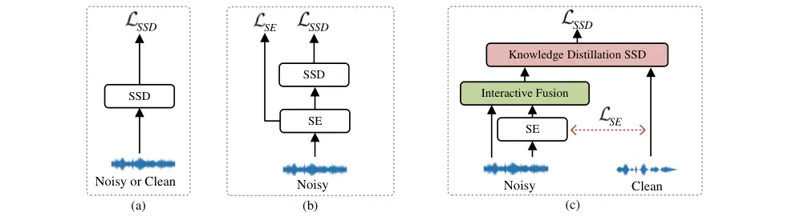

Fig. 1: The structure of (a) traditional synthetic speech detection,
using clean speech training or using noisy speech for multi-condition
training (MCT); (b) cascade or joint training with a speech enhancement
front end for noisy scenarios; (c) The overall joint training structure
of the proposed dual-branch knowledge distillation synthetic speech
detection system. The teacher model requires clean speech as input and
is trained in parallel with the student model.

To improve the performance in noisy scenes, this paper proposes a
dual-branch knowledge distillation method for noise-robust synthetic
speech detection (DKDSSD). We propose interactive fusion and
response-based teacher-student paradigms, design parallel flows for
noisy and clean data, and utilize a clean teacher model to guide the
training of noisy data. Speech enhancement is applied at the front-end
for denoising, but it inevitably introduces speech distortion due to
estimation errors. Therefore, it’s essential for enhanced features to
retain only the information that is useful downstream. The proposed
interactive fusion module can adaptively combine the beneficial
information of the original noisy features and the denoised features to
generate noise-robust features. Knowledge distillation promotes students
to learn the classification ability of clean teachers. It involves
mapping the decision space of the student model to that of the teacher.
Additionally, joint training is used to optimize the entire structure so
that the teacher-student network reaches the global optimum. The main
contributions of this work are summarized as follows:

- $`\bullet`$
  Knowledge distillation from clean scenes to noisy scenes is proposed,
  utilizing response-based knowledge distillation loss to constrain the
  noisy branch to learn the final prediction of the clean teacher.
- $`\bullet`$
  Interactive fusion is proposed to enable the channel interaction of
  denoised and noisy features, and fuse them at the spatial level,
  adaptively reducing noise interference and balancing distortion
  issues.
- $`\bullet`$
  Extensive experiments are conducted on multiple simulated noisy
  datasets and official datasets, and the results show that our proposed
  method outperforms the cascade system or joint training method, while
  maintaining performance on clean scenes. In cross-dataset experiments,
  the proposed method exhibits the best generalization.

The rest of this paper is structured as follows. Section II introduces
the related work, Section III describes the proposed DKDSSD method,
Section IV gives the details of the experimental setup, and Section V
discusses the experimental results and presents visual analyses. Finally
concludes in Section VI.

## II Related Works

### II-A Noise Robustness

Under additional noise and reverberation conditions\[16\], SSD trained
on clean speech has the problem of insufficient generalization. In
\[31\], different front-end features and traditional speech enhancement
techniques are applied, but they did not significantly improve accuracy.
Speech enhancement \[32, 33\] aims to restore a clean spectrum from
noisy speech and can be used as a front-end \[34, 35, 36\] to preprocess
speech and reduce the interference of strong noise. However, in previous
work \[37, 38, 39\], we find that speech enhancement produces
unavoidable estimation errors, and unknown artifacts \[40\] may be more
harmful than noise. To alleviate this phenomenon, the study \[41\]
proposes to switch the input between the enhanced signal and the
original signal according to the level of signal-to-noise ratio (SNR) to
balance noise and distortion. Some works \[42, 43, 44, 45, 46\] propose
to fuse the two states of speech to reduce the recognition error rate.
In the SSD task, the original speech contains artifacts from the
synthesis method. Therefore, we propose interactive fusion with original
speech, which can preserve artifacts while denoising, thereby generating
noise-robust embedding.

### II-B Knowledge Distillation

Knowledge distillation \[47\] is a prevalent method for compressing
models. It can effectively train smaller student models from larger
teacher models \[9\], speeding up inference. Even without the need for
compression, knowledge distillation can improve the performance of the
student model by transferring knowledge \[48\] from the teacher model.
Applying knowledge distillation for continuous learning \[49, 50\] can
enhance domain generalization without compromising the retention of
source domain knowledge. In addition, a method based on integral
knowledge fusion is proposed in \[51\] to achieve generalized synthetic
speech detection. Recent research \[52\] applies knowledge distillation
to anti-spoofing detection in noisy environments, transferring feature
knowledge from clean teacher to noisy student. In experimental setups
involving music and white noise, the model achieved significant
performance improvements in high SNR scenarios. However, the
experimental results indicate that feature distillation fails in low SNR
scenarios, highlighting the risks of forcibly aligning feature spaces.
We believe that when the difference between the two feature spaces is
relatively large, it is more reasonable to choose the response-based
distillation. The proposed interactive fusion method can adaptively
combine useful information. This ensures that the distribution space of
the input data for the student model remains consistent with that of the
teacher model.

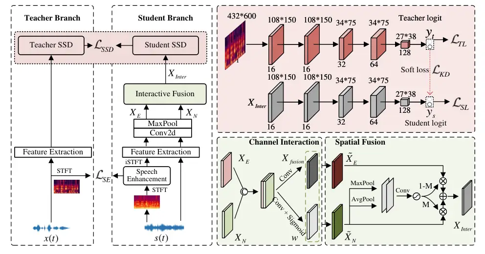

Fig. 2: The structure and details of the dual-branch knowledge
distillation synthetic speech detection system. Green boxes represent
interactive fusion, and red boxes represent knowledge distillation. The
teacher model classifier has the same structure as the student model.
$`C`$ indicates the concatenation operation, $`\otimes`$ means
element-wise multiplication.

## III The proposed method

As illustrated in Fig. 2, our proposed method comprises dual branches of
the teacher-student model. The teacher branch is trained using clean
speech, while the student branch is trained using noisy speech. At the
front end of the student branch, adaptive interactive fusion with noisy
speech is conducted after speech enhancement, aiming to mitigate noise
interferences, address speech distortion, and facilitate noisy speech in
learning the initial data distribution of clean speech. During
classification, the student’s output logit is mapped to the teacher’s
logit via distillation loss, which enables the student to acquire the
decision-making capacity of the teacher model. Using joint training to
simultaneously optimize the entire structure, enabling the interactive
fusion modules to generate features that are more beneficial to the SSD
task.

### III-A Speech Enhancement

The purpose of speech enhancement is to remove the noise from the noisy
speech and estimate the target clean speech, which can only be trained
using parallel clean and noisy data. We choose some datasets as clean
datasets, and add noise to them to form corresponding simulated noisy
datasets, details can be found in Section IV. A noisy speech can be
expressed as:

```math
s(t)=x(t)+n(t) \tag{1}
```

where $`s(t)`$, $`x(t)`$ and $`n(t)`$ denote source noisy, clean and
noise time-domain speech, respectively. We perform the short-time
Fourier transform (STFT) on the source noisy speech to obtain the
magnitude spectrum $`S(f,t)`$ as the input feature, $`(f,t)`$ denotes
the index of frequency-time bins. And use the magnitude spectrum
$`X(f,t)`$ corresponding to the clean speech as the training target:

```math
\displaystyle S(f,t),\varphi(f,t)=\operatorname{STFT}(s(t)) \tag{2}
```

```math
\displaystyle\widehat{X}(f,t)=\operatorname{SE}(S(f,t),X(f,t)) \tag{3}
```

```math
\displaystyle\widehat{x}(t)=\operatorname{iSTFT}(\widehat{X}(f,t)\cdot\varphi(f,t)) \tag{4}
```

where $`\text{SE}(\cdot)`$ denotes speech enhancement network,
$`\widehat{X}(f,t)`$ represents the output enhanced magnitude feature.
After SE, $`\widehat{X}(f,t)`$ is multiplied with the phase spectrum
$`\varphi(f,t)`$ of the noisy speech, and the inverse short-time Fourier
transform (iSTFT) is applied to generate the enhanced speech
$`\widehat{x}(t)`$ in the time domain. Use mean square error (MSE) as
the loss function, defined as follows:

```math
\mathcal{L}_{SE}=\frac{1}{FT}\sum_{t=1}^{T}\sum_{f=1}^{F}|\widehat{X}(f,t)-X(f,t)|^{2} \tag{5}
```

After denoising, $`\widehat{X}(f,t)`$ is free from most noise
interference. However, since MSE loss tends to emphasize the
minimization of magnitude errors and ignores the details of the speech
signal, it usually causes speech distortion problems. Therefore, we
propose an interactive fusion module to trade off between denoising and
retaining information.

### III-B Interactive Fusion

The purpose of speech enhancement is to restore a clean magnitude
spectrum. However, due to inconsistent training targets, it is often
challenging to avoid distortion issues. Directly classifying features
extracted from denoised speech can adversely affect downstream tasks. We
believe this is because distorted speech lacks fine structure, which can
either destroy original artifacts or introduce new unknown artifacts.
Some studies observe that artifacts \[40\] have a particularly negative
impact on downstream tasks, while the impact of noise is relatively
limited. To guide the noisy branch to learn a similar data distribution
as the teacher branch, we propose interactive fusion module, which fuses
the original noise spectrum with the denoised spectrum. It is a
trainable embedded module that is optimized together with the classifier
during training.

Considering that SSD pays more attention to the details of frequency and
usually requires features with a high-frequency resolution, we use a
longer window length to re-extract the logarithmic amplitude spectrum
features from the time domain feature $`\widehat{x}(t)`$ generated by
the SE module. According to the more robust characteristics of the
low-frequency band, the frequency region of the logarithmic magnitude
spectrum (LMS) feature is directly sliced and the first half is taken to
obtain the low-frequency feature:

```math
\widehat{X}(f,t)=log(abs(\operatorname{STFT}(\widehat{x}(t))))_{0-4KHz}\\
 \tag{6}
```

To capture more spectral information and local features, and to align
with the features of the teacher branch, interactive fusion is divided
into two parts: channel interaction and spatial fusion. We perform
$`7\times 7`$ convolution and pooling on the LMS features extracted from
the source speech $`s(t)`$ and $`\widehat{x}(t)`$ to generate
multi-channel frequency-time features $`{X}_{N}`$ and $`{X}_{E}`$. Both
features are expanded to 16-channel features, requiring interaction of
information across all channels initially. They are concatenated in the
channel dimension: $`X_{concat}=\mathcal{C}\left(X_{E},X_{N}\right)`$.
Generate fusion feature $`X_{fusion}`$ and fusion weight $`w`$ based on
$`X_{concat}`$, the formula is as follows:

```math
\displaystyle X_{fusion}=conv1\left(X_{concat}\right) \tag{7}
```

```math
\displaystyle w=\sigma\left(conv2\left(X_{concat}\right)\right) \tag{8}
```

where $`conv1`$ and $`conv2`$ denote distinct $`3\times 3`$
convolutional layers, and $`\sigma`$ represents the sigmoid activation
function. Thus, the enhanced feature $`\widetilde{X}_{E}`$ and noisy
feature $`\widetilde{X}_{N}`$ after preliminary interaction are
expressed as:

```math
\displaystyle\widetilde{X}_{E}={X}_{fusion}+w\otimes{X}_{E} \tag{9}
```

```math
\displaystyle\widetilde{X}_{N}={X}_{fusion}+w\otimes{X}_{N} \tag{10}
```

Given our aim to preserve as much useful information as possible during
denoising, in this step, we need to concentrate on the interactive
feature $`{X}_{fusion}`$, which contains all the information. The matrix
$`w`$ is utilized to weight the enhanced features and noisy features.

After obtaining the interactive features, spatial information fusion
needs to be performed. In the context of speech features, spatial
information refers to frequency-time domain features. Unlike the
interaction in the previous step, this fusion step focuses more on
determining the importance of each point in the frequency-time space.
Noisy features contain more information, therefore, the spatial mask
matrix is calculated based on the noisy features. To aggregate spatial
information, average pooling is commonly employed. This technique
smooths the entire feature map to derive overall features. Conversely,
max pooling retains the most important features in the feature map,
capturing salient features. Therefore, we utilize both pooling
operations. Perform maximum pooling and average pooling on
$`\widetilde{X}_{N}`$ separately, then concatenate the resulting feature
maps in the channel dimension. Next, obtain the mask matrix $`M`$ after
applying convolution and sigmoid activation. Finally, fuse
$`\widetilde{X}_{E}`$ and $`\widetilde{X}_{N}`$ according to this mask
to obtain the final interactive feature $`{X}_{Inter}`$:

```math
{X}_{Inter}=(1-M)\otimes\widetilde{X}_{E}+M\otimes\widetilde{X}_{N} \tag{11}
```

The interactive fusion module adaptively combines features through
channel interaction and spatial information fusion, respectively,
meeting the requirements of denoising and distortion alleviation. We
posit that enhanced feature serves to provide information for speech
segments that would otherwise be silent, while noisy feature serves to
mitigate speech distortion in segments with human voices. This assertion
is further supported by the feature visualization (Fig. 5) in the
experimental section and the statistical analysis (Fig. 6) of the mask
matrix.

Fig. 3: Schematic diagram of the structure of the teacher-student model.
The teacher and student are trained in parallel, and the classification
loss is calculated with the ground truth label respectively, and the
loss of the soft targets between the teacher and the student is
calculated at the same time. The degree of softening is controlled via
the temperature hyperparameter T.

### III-C Knowledge Distillation

Knowledge distillation guides student branch learning from the
perspective of neural responses. As illustrated in Fig. 3, both the
teacher and the student engage in online distillation, with parameters
updated simultaneously. The neural response of the last output layer of
the teacher model is softened, and the distillation loss is then
calculated based on the soft targets of both the teacher and the
student. The input data for the teacher and student models are
different, and distillation at the feature level may lead to convergence
difficulties. Soft logit represents a class probability distribution,
thus response-based distillation enables students to directly mimic the
teacher’s final prediction. Since there is no need to reduce the number
of model parameters and the network structures of teachers and students
are the same, we use SeNet34 \[7\] as the backbone. This model
demonstrates excellent performance on the ASVspoof 2019 LA evaluation
set. During training, the teacher model utilizes clean speech $`x(t)`$,
while the student model employs the fused feature $`X_{Inter}`$ as
input.

Hard Loss. Hard loss refers to the loss computed between model
predictions and labels. Let $`y_{t}`$ and $`y_{s}`$ denote the logit of
the last output layer of the teacher and student models, respectively.
The loss between the ground truth label $`L`$ is computed using
A-softmax \[53\]. The hard loss for both the student model and teacher
model can be expressed as follows:

```math
\displaystyle\mathcal{L}_{SL}=\operatorname{Asoftmax}\left(y_{s},L\right) \tag{12}
```

```math
\displaystyle\mathcal{L}_{TL}=\operatorname{Asoftmax}\left(y_{t},L\right) \tag{13}
```

Soft Loss. Soft loss refers to the distillation loss computed between
the softened logits of the teacher and the student. The hyperparameter
$`\tau`$ represents the distillation temperature, which regulates the
degree of softening in the logits output by the teacher network. The
larger $`\tau`$ is, the higher the degree of softening and the smoother
the transition between categories. Higher temperatures lead to smoother
probability distributions, facilitating the transfer of more knowledge,
but they may also decrease the accuracy of the student model. The
softened logit $`y^{{}^{\prime}}_{s}=y_{s}/\tau`$ of the student aims to
match the soft output $`y^{{}^{\prime}}_{t}=y_{t}/\tau`$ of the teacher
model via a Kullback–Leibler divergence (KL):

```math
\displaystyle\mathcal{L}_{KD}=\tau^{2}\operatorname{KLD}\left(softmax(y^{{}^{\prime}}_{s}),softmax(y^{{}^{\prime}}_{t})\right) \tag{14}
```

Response-based knowledge enables the student to predict like the
teacher. The loss of the entire synthetic speech detection network
consists of both the soft loss and the hard loss, where $`\alpha`$ is
used to control the trade-off between student loss and KD loss:

```math
\displaystyle\mathcal{L}_{SSD}=(1-\alpha)\mathcal{L}_{SL}+\alpha\mathcal{L}_{KD}+\mathcal{L}_{TL} \tag{15}
```

During knowledge distillation, significant disparities in ability may
necessitate the intervention of a teacher assistant \[54\] to facilitate
effective learning for students. Therefore, we employ an online
distillation method, where teacher and student learn simultaneously and
update parameters concurrently. The advantage of online distillation
lies in the minimization of the gap between the prediction results of
teachers and students, which facilitates the student model in better
imitating the behavior of the teacher model. If the teacher uses
pre-training, it may pose challenges for the student model to accurately
mimic the teacher’s predictions on data with a significant ability gap,
such as low SNR.

### III-D Joint Training

As the front-end module of the student branch, the training objective of
speech enhancement is to reconstruct a clean spectrum. If this module is
pre-trained or optimized independently, it may inadvertently remove
original artifacts or introduce imperceptible noise because its
objective differs from the final classification task. To enable SE to
estimate target speech beneficial for SSD, we integrate SE and SSD for
joint training. The loss function of joint training is formulated as:

```math
\displaystyle\mathcal{L}=\mathcal{L}_{SSD}+\mathcal{L}_{SE} \tag{16}
```

During the backpropagation process, the speech enhancement module is
influenced by the synthetic speech detection network, and joint training
facilitates mutual feedback between the models, leading to global
optimization.

## IV Experiments

[TABLE]

TABLE I: The noisy datasets structure used by all systems except the
Noise-Free baseline system.

### IV-A Datasets

#### IV-A1 Clean Datasets

The ASVspoof 2019 challenge offers a large-scale dataset comprising two
subsets: LA and PA. Both subsets consist of pure human voices without
noise. For this study, we selected the LA subset as the primary
experimental dataset. The ASVspoof 2019 dataset continues to be a
prominent resource, prompting us to conduct experiments based on it. The
issue of silence \[55\] observed in ASVspoof 2019 also persists in
ASVspoof 2021, an aspect we have not yet addressed. Our experiments are
focus on enhancing performance in noisy environments. In future
investigations, we plan to explore performance improvements following
the removal of silent segments. To investigate generalization, the
ASVspoof2015 is selected for cross-dataset experiments. Therefore, the
original datasets of ASVspoof 2015 and ASVspoof 2019 LA are regarded as
clean datasets.

#### IV-A2 Noisy Datasets

In this paper, the experimental scenario simulates noisy conditions by
artificially introducing noise to the ASVspoof 2019 LA dataset. For both
the training and development sets, we add random noise during training,
with the SNR interval ranging from 0 to 20 dB. The noise is sourced from
the 100 Nonspeech Sounds \[56\] dataset ¹¹ 1
http://web.cse.ohio-state.edu/pnl/corpus/HuNonspeech/HuCorpus.html. For
the test set, we randomly select noise from the NOISEX-92 corpus \[57\]
and add noise to the evaluation set. The SNR is randomly chosen from the
set {0, 5, 10, 15, 20}dB. The resulting new noisy evaluation dataset is
named unseen. Then, we randomly select noise from the 100 Nonspeech
Sounds dataset and add it to the evaluation set, named seen, as shown in
Table I. It is a widely used dataset \[56\]. The specific contents of
the dataset are as follows: N1-N17: Crowd noise; N18-N29: Machine noise;
N30-N43: Alarm and siren; N44-N46: Traffic and car noise; N47-N55:
Animal sound; N56-N69: Water sound; N70-N78: Wind; N79-N82: Bell;
N83-N85: Cough; N86: Clap; N87: Snore; N88: Click; N88-N90: Laugh;
N91-N92: Yawn; N93: Cry; N94: Shower; N95: Tooth brushing; N96-N97:
Footsteps; N98: Door moving; N99-N100: Phone dialing. In cross-dataset
experiments, we apply the same procedure to the ASVspoof 2015 dataset.
The test set of ASVspoof 2021 LA already contains channel noise.
Therefore, ASVspoof 2015 and ASVspoof 2019 LA produce two noisy test
sets: unseen and seen. Additionally, the test set of the ASVspoof 2021
LA dataset itself serves as a noisy dataset. Table III illustrates the
composition of the noisy datasets used by all systems (except
Noise-Free).

#### IV-A3 Experimental Datasets

In the experiment, we initially evaluate the ASVspoof 2019 LA clean set,
the unseen noisy dataset, and the seen noisy dataset. Subsequently, we
conduct offline speech enhancement on both the unseen and clean sets of
ASVspoof 2019 LA and test the models “Noise-Free”, “MCT1” and “MCT2” on
the above datasets. Next, we conduct cross-dataset experiments on the
original clean test set, the unseen noisy dataset, and the seen noisy
dataset of ASVspoof 2015, respectively. Additionally, cross-dataset
experiments are also conducted on the ASVspoof 2021 LA test set. For the
ablation experiment, we select the unseen dataset of ASVspoof 2019 LA as
the set.

### IV-B Experimental Setup

#### IV-B1 Baselines

In this work, to study the effectiveness of the proposed method, we
choose SENet-34 \[7\] as the backbone SSD network for all baseline
models. The speech enhancement module uses a convolutional recurrent
neural (CRN) model \[58\]. Details of the different baselines used for
comparison in this work can be found in Table II. The first three models
are traditional structures, consistent with Fig. 1(a). The structures of
“Cascade” and “Joint” are consistent with Fig. 1(b). The “Cascade”
system simply concatenates the speech enhancement model and the
synthetic speech detection model. During training, the loss of the
speech enhancement part is backpropagated independently, resulting in
less correlation between the frontend and backend. Conversely, the
“Joint” system jointly trains the speech enhancement model and the
synthetic speech detection model. During actual training, both tasks
need to be accomplished, and backpropagation is performed
simultaneously. This approach affects the learning of shared parameters
and is beneficial for optimizing the speech enhancement part towards the
final objective. Compared to the “Joint” system, the structure of
“DKDSSD” differs in that it adopts a dual-branch knowledge distillation
structure and the interactive fusion module.

| Systems name       | Details                                                                                                              |
| ------------------ | -------------------------------------------------------------------------------------------------------------------- |
| Noise-Free \[7\]   | System trained with only clean data.                                                                                 |
| MCT1 \[23\]        | System trained with half noisy speech and half clean.                                                                |
| MCT2 \[23\]        | System trained with completely noisy speech.                                                                         |
| Cascade \[29\]     | Cascaded system of SSD and SE, trained with noisy speech. The system is optimized using SSD training objective only. |
| Joint \[28\]       | Multitask-based joint training system of SSD and SE, trained with noisy speech.                                      |
| DKDSSD $`\dagger`$ | Proposed dual-branch system, trained with pairs of clean and noisy speech.                                           |

TABLE II: The configuration of different systems in this work.
“$`\dagger`$” means proposed.

#### IV-B2 Implementation Details

For SE, we use 161-dimensional magnitude spectrums as input features,
and the time frames are set to 600. For SSD, to extract log magnitude
spectrogram features, we set the blackman window length and hop length
of STFT to 1728 and 130, respectively. The speech is truncated or
spliced so that the number of frames of all input features remains the
same as 600 frames. Due to the study in \[7, 59\], the low sub-band log
magnitude spectrogram feature is used in our work, so all the input
features of synthetic speech detection maintain the same shape of 433 × 600. Additionally, Adam is the optimizer of both SE and SSD, with the
hyperparameter $`\alpha`$ set to 0.05 and the temperature $`\tau`$ set
to 3. These hyperparameters are determined after several experiments. We
train each system for 32 epochs, and the model with the lowest loss on
the development set is selected as the final model for evaluation. For
the DKDSSD model, the teacher model and the student model are trained in
parallel during training, and only the student model is used for
inference. We evaluate the performance of all systems using the equal
error rate (EER), a metric that reflects the ability to detect synthetic
speech. Additionally, the min tandem detection cost function (t-DCF) is
used as the evaluation metric for ASVspoof 2021, which is officially
considered a more important metric on this dataset.

|                    |       |       |       |       |       |       |        |       |       |       |       |       |       |
| ------------------ | ----- | ----- | ----- | ----- | ----- | ----- | ------ | ----- | ----- | ----- | ----- | ----- | ----- |
| Systems            | seen  |       |       |       |       |       | unseen |       |       |       |       |       | clean |
|                    | 0dB   | 5dB   | 10dB  | 15dB  | 20dB  | AVG.  | 0dB    | 5dB   | 10dB  | 15dB  | 20dB  | AVG.  | AVG.  |
| Noise-Free \[7\]   | 44.91 | 39.70 | 26.30 | 19.90 | 18.46 | 27.98 | 55.53  | 53.40 | 34.12 | 21.81 | 19.36 | 36.04 | 2.21  |
| MCT1 \[23\]        | 7.91  | 5.16  | 4.14  | 3.83  | 2.99  | 5.01  | 14.04  | 11.02 | 7.46  | 5.69  | 3.76  | 8.59  | 2.43  |
| MCT2 \[23\]        | 6.72  | 4.39  | 3.52  | 3.42  | 2.86  | 4.27  | 12.03  | 9.10  | 5.57  | 4.37  | 3.08  | 7.16  | 3.37  |
| Cascade \[29\]     | 7.53  | 6.13  | 5.04  | 4.45  | 4.57  | 5.74  | 12.10  | 8.49  | 6.22  | 5.27  | 4.10  | 7.60  | 4.01  |
| Joint \[28\]       | 6.80  | 4.89  | 3.73  | 3.89  | 3.52  | 4.74  | 10.33  | 7.94  | 5.50  | 4.51  | 3.41  | 6.92  | 3.29  |
| DKDSSD $`\dagger`$ | 5.26  | 3.82  | 2.83  | 2.93  | 2.39  | 3.55  | 8.52   | 6.53  | 4.58  | 3.41  | 2.95  | 5.40  | 3.28  |

TABLE III: Results in terms of EER(%) for ASVspoof 2019 seen, unseen and
clean set. “AVG.” is not the average of the EERs for the 5 SNR cases,
but a result of the total evaluation set. The EER of each SNR is
calculated separately. “$`\dagger`$” means proposed.

|                  |        |       |       |       |       |       |       |
| ---------------- | ------ | ----- | ----- | ----- | ----- | ----- | ----- |
| Systems          | unseen |       |       |       |       |       | clean |
| 0dB              | 5dB    | 10dB  | 15dB  | 20dB  | AVG.  | AVG.  |       |
| Noise-Free \[7\] | 37.11  | 30.27 | 19.83 | 18.68 | 18.19 | 23.48 | 15.66 |
| MCT1 \[23\]      | 21.23  | 18.03 | 15.71 | 13.67 | 11.92 | 16.14 | 9.00  |
| MCT2 \[23\]      | 29.83  | 25.73 | 20.56 | 15.34 | 11.01 | 20.92 | 8.67  |

TABLE IV: Results in terms of EER(%) for ASVspoof 2019 unseen set and
clean set. It represents the result of performing SE on the set first
and then testing, reflecting the benefits and limitations of SE.

|              |      |            |       |       |         |       |        |            |      |            |       |       |         |       |        |
| ------------ | ---- | ---------- | ----- | ----- | ------- | ----- | ------ | ---------- | ---- | ---------- | ----- | ----- | ------- | ----- | ------ |
| Noise        | SNR  | Noise-Free | MCT1  | MCT2  | Cascade | Joint | DKDSSD | Noise      | SNR  | Noise-Free | MCT1  | MCT2  | Cascade | Joint | DKDSSD |
| white        | 0    | 67.42      | 9.10  | 6.42  | 8.32    | 7.40  | 6.37   | m109       | 0    | 68.96      | 9.23  | 10.80 | 10.28   | 9.39  | 6.88   |
|              | 5    | 66.79      | 7.61  | 5.93  | 6.08    | 6.94  | 4.91   |            | 5    | 32.64      | 8.91  | 6.75  | 7.12    | 7.94  | 6.11   |
|              | 10   | 53.04      | 4.35  | 2.62  | 5.24    | 3.46  | 2.62   |            | 10   | 20.00      | 5.74  | 5.04  | 5.74    | 4.33  | 4.18   |
|              | 15   | 21.48      | 2.79  | 2.94  | 5.42    | 3.72  | 2.79   |            | 15   | 18.47      | 5.05  | 3.38  | 5.05    | 3.43  | 2.50   |
|              | 20   | 19.73      | 3.56  | 3.76  | 4.53    | 3.76  | 2.03   |            | 20   | 18.67      | 2.83  | 1.85  | 2.83    | 3.75  | 2.83   |
|              | AVG. | 21.48      | 5.74  | 4.47  | 5.81    | 4.88  | 3.61   |            | AVG. | 30.58      | 6.49  | 5.64  | 6.71    | 5.64  | 4.79   |
| f16          | 0    | 72.95      | 11.64 | 8.81  | 10.36   | 9.07  | 7.93   | hfchannel  | 0    | 67.76      | 6.59  | 5.66  | 7.53    | 6.70  | 4.78   |
|              | 5    | 69.21      | 9.56  | 9.51  | 7.46    | 6.20  | 6.36   |            | 5    | 66.11      | 4.18  | 3.29  | 4.13    | 5.75  | 2.46   |
|              | 10   | 32.50      | 5.94  | 3.62  | 5.99    | 4.30  | 3.48   |            | 10   | 37.36      | 1.76  | 1.76  | 3.56    | 2.59  | 1.66   |
|              | 15   | 17.69      | 6.34  | 3.34  | 3.56    | 3.62  | 3.34   |            | 15   | 17.20      | 3.65  | 4.57  | 5.48    | 5.48  | 2.89   |
|              | 20   | 19.04      | 4.15  | 3.02  | 3.94    | 4.04  | 3.07   |            | 20   | 15.64      | 2.63  | 1.75  | 2.63    | 2.68  | 1.75   |
|              | AVG. | 41.08      | 8.23  | 6.29  | 6.46    | 5.88  | 5.13   |            | AVG. | 40.67      | 3.58  | 3.19  | 4.76    | 4.60  | 3.01   |
| machinegun   | 0    | 19.80      | 8.72  | 7.92  | 13.89   | 9.93  | 7.02   | buccaneer1 | 0    | 71.48      | 15.22 | 12.41 | 13.35   | 11.21 | 9.44   |
|              | 5    | 19.78      | 7.14  | 3.70  | 8.94    | 5.29  | 3.40   |            | 5    | 75.24      | 10.63 | 7.14  | 7.87    | 8.01  | 6.02   |
|              | 10   | 18.46      | 5.16  | 4.30  | 6.01    | 5.06  | 3.34   |            | 10   | 58.00      | 7.43  | 5.77  | 6.86    | 5.77  | 4.31   |
|              | 15   | 19.03      | 5.78  | 3.31  | 6.82    | 5.82  | 3.27   |            | 15   | 23.97      | 5.34  | 4.48  | 2.82    | 3.58  | 2.57   |
|              | 20   | 16.94      | 4.30  | 2.59  | 3.47    | 3.42  | 3.27   |            | 20   | 16.68      | 2.52  | 3.37  | 3.47    | 3.37  | 3.31   |
|              | AVG. | 19.48      | 6.19  | 4.24  | 9.48    | 6.66  | 3.86   |            | AVG. | 44.90      | 9.16  | 7.41  | 8.09    | 7.04  | 5.07   |
| factory2     | 0    | 68.95      | 13.01 | 8.04  | 9.02    | 9.02  | 6.86   | factory1   | 0    | 68.78      | 13.54 | 9.67  | 11.38   | 10.52 | 9.72   |
|              | 5    | 45.47      | 11.09 | 7.29  | 7.90    | 7.95  | 6.18   |            | 5    | 71.31      | 11.06 | 7.92  | 8.73    | 8.89  | 7.70   |
|              | 10   | 20.09      | 7.89  | 5.27  | 7.03    | 6.13  | 4.37   |            | 10   | 43.26      | 7.14  | 4.29  | 5.39    | 4.49  | 3.59   |
|              | 15   | 20.70      | 5.06  | 5.96  | 5.96    | 5.16  | 3.97   |            | 15   | 21.26      | 5.29  | 3.49  | 3.54    | 3.49  | 2.51   |
|              | 20   | 21.18      | 3.81  | 3.45  | 3.86    | 3.45  | 3.61   |            | 20   | 20.81      | 4.11  | 3.28  | 4.79    | 3.28  | 3.23   |
|              | AVG. | 34.41      | 5.93  | 8.62  | 7.03    | 6.51  | 5.35   |            | AVG. | 43.36      | 8.37  | 5.95  | 7.21    | 6.64  | 5.60   |
| destroyerops | 0    | 76.19      | 14.18 | 11.69 | 10.93   | 9.69  | 8.64   | pink       | 0    | 70.80      | 15.11 | 10.62 | 12.28   | 11.48 | 10.57  |
|              | 5    | 65.44      | 10.94 | 10.84 | 9.20    | 8.60  | 7.01   |            | 5    | 75.65      | 12.58 | 8.80  | 7.09    | 8.30  | 8.00   |
|              | 10   | 27.38      | 7.36  | 6.33  | 5.30    | 6.43  | 5.25   |            | 10   | 55.45      | 7.28  | 6.19  | 5.58    | 6.35  | 5.37   |
|              | 15   | 17.25      | 4.38  | 3.60  | 4.22    | 3.60  | 2.11   |            | 15   | 21.81      | 5.21  | 5.21  | 5.21    | 4.22  | 5.21   |
|              | 20   | 19.97      | 4.33  | 1.92  | 3.49    | 3.44  | 3.44   |            | 20   | 19.84      | 4.87  | 2.51  | 4.15    | 3.18  | 2.31   |
|              | AVG. | 46.40      | 8.64  | 8.45  | 7.68    | 7.01  | 5.60   |            | AVG. | 44.55      | 9.07  | 6.76  | 7.10    | 6.91  | 6.32   |
| babble       | 0    | 77.86      | 16.89 | 16.28 | 15.38   | 14.63 | 12.08  | leopard    | 0    | 18.31      | 15.59 | 13.78 | 12.78   | 9.16  | 9.11   |
|              | 5    | 59.40      | 13.30 | 12.40 | 11.55   | 11.05 | 8.55   |            | 5    | 17.91      | 13.03 | 11.18 | 7.95    | 8.11  | 6.62   |
|              | 10   | 26.95      | 10.71 | 6.25  | 5.38    | 6.04  | 5.38   |            | 10   | 19.96      | 12.60 | 8.20  | 8.00    | 8.65  | 7.02   |
|              | 15   | 18.20      | 7.72  | 6.55  | 6.86    | 6.76  | 5.54   |            | 15   | 18.51      | 7.70  | 3.90  | 6.04    | 5.85  | 4.87   |
|              | 20   | 17.77      | 3.94  | 3.00  | 3.73    | 3.83  | 2.80   |            | 20   | 20.83      | 4.97  | 4.97  | 6.42    | 3.47  | 4.97   |
|              | AVG. | 44.29      | 11.15 | 11.52 | 10.25   | 9.75  | 6.97   |            | AVG. | 19.13      | 11.66 | 9.12  | 8.28    | 7.55  | 6.54   |

TABLE V: Results in EER(%) for all baseline models on the ASVspoof 2019
unseen set. The 5 types of SNR conditions under all 12 noisy scenarios
are counted separately. The unseen data set is randomly generated by
adding noise with different SNRs. The number of real and fake audio for
each type of noise is basically the same.

## V Experimental Results

### V-A Results on ASVspoof 2019 LA

#### V-A1 Effectiveness and Limitation of SE

We first analyze the effectiveness and limitations of SE. From Table IV,
we observe that the SE process significantly improves the performance of
the “Noise-Free” in noisy conditions, while the performance of “MCT1”
and “MCT2” degrades. For the “Noise-Free” trained only on clean speech,
noise poses the biggest distraction, and denoising leads to performance
improvement. However, for MCT systems, distortion proves to be more
disruptive than noise. On the clean set, denoising degrades the
performance of “MCT1”, “MCT2” and “Noise-Free” significantly. This is
because for clean data, SE is unnecessary. while SE is beneficial for
reconstructing speech from noisy conditions, processing distortion often
introduces unseen artifacts. Therefore, it becomes essential to address
the distortion problem alongside denoising.

#### V-A2 Comparison with Other Baselines

Table III shows the results of all SSD systems. We can observe that
models trained only in clean conditions lack noise robustness,
especially in the case of low SNR. Therefore, it is necessary to improve
the generalization of SSD systems to deal with more complex real-world
situations. The overall performance of the “MCT1” model is much better
than that of the “Noise-Free”, and it is more stable when the noise is
strong because it is trained with both clean and noisy speech together.
Multi-condition training allows neural networks to model more
discriminative feature representations, thereby improving detection
ability under noisy conditions. However, due to the overfitting of
noise, the performance of multi-condition training on the clean data set
is degraded, and the degradation of “MCT2”, trained with only noisy
data, is more obvious.

“Cascade” uses speech enhancement as the front end, which has a
significant performance improvement compared to the system without SE,
but it is not as good as the performance of “MCT2”. This is because the
cascade method only optimizes the synthetic speech detection and does
not optimize the speech enhancement. When joint training is used for
multi-task learning, the “Joint” system is further improved on the basis
of the cascaded system, which shows that joint training is beneficial to
promote the global optimization of the overall structure. In clean
conditions, it also performs well. The reason is that the models can
share information and influence each other.

All systems degrade significantly on unseen noisy datasets, indicating
that unseen noise remains a difficult problem to deal with. Our proposed
“DKDSSD” system achieves the lowest EER of 3.55% and 5.40% on the seen
and unseen datasets, respectively, and performs best in all SNR
situations, indicating that our proposed method can effectively improve
the detection ability in noisy scenes and has better generalization in
unseen noisy situations.

#### V-A3 Result For All Unseen Noisy Conditions

Table V shows the EER of the five models in all noisy scenarios. It can
be observed that DKDSSD performs best in almost all types of noise when
the SNR is lower than 20dB, indicating that “DKDSSD” has strong noise
robustness. When the SNR is 20dB, the performance of “MCT2” is second
only to “DKDSSD”, because “MCT2” also models the noise during training,
and maintains a certain perception ability for unseen noise. However,
when the SNR is low, the performance is not as good as the model with a
speech enhancement module. Among them, babble is the most difficult
noise to detect, because babble contains ambiguous human voice. It is in
the same frequency band as the speaker’s fundamental frequency, which
will pollute the original spectrum, and it is difficult for speech
enhancement methods to reconstruct speech. The overall performance of
“DKDSSD” is balanced, but it performs poorly under non-stationary noise
with poor periodicities such as babble and leopard, and the noise with a
relatively uniform frequency spectrum such as white noise is easier to
remove.

### V-B Cross-Dataset Results

To demonstrate the generalization of our proposed model, we conduct
cross-dataset tests on two datasets: ASVspoof 2021 LA test set and
ASVspoof 2015 test set. It means that the training and development
datasets are both ASVspoof 2019 LA, and only tested on two out-of-domain
datasets. Among them, ASVspoof 2021 LA is the official dataset, since
this dataset itself has been compressed and encoded with some telephone
channel noise, we have not made any changes. We performed noise
simulation on the data of the ASVspoof 2015 test. The experimental
results are divided into three categories: seen, unseen, and clean. The
types of seen and unseen noise and the SNR are consistent with the
ASVspoof 2019 test dataset in Table I. Clean means the test dataset
without any processing.

#### V-B1 Results on ASVspoof 2015

Table VI shows the results of the ASVspoof 2015 test dataset. The
“Noise-Free” model performs poorly under all three conditions, which
shows that the distribution of the dataset in 2015 is very different
from that in 2019. Even under clean conditions without noise,
“Noise-Free” can only achieve an EER of 33.96%. However, the “DKDSSD”
model still shows the best generalization ability and achieves the
lowest EER in the three three types scenarios. We can see that all
models perform better on seen datasets because the additive noise of
seen datasets is known at training time. When faced with unseen noise,
the model experiences performance degradation. This is because the
speech enhancement model struggles to handle unseen noise, thus
introducing unseen artifacts, consequently impacting SSD tasks.

#### V-B2 Results on ASVspoof 2021 LA

Table VII shows the results of the ASVspoof 2021 LA test dataset. In
addition to the 5 baselines, two official best baselines (B03, B04) and
two new models are also listed. Among them, “AASIST” is a SOTA single
model on ASVspoof2019. We used the open-source code of “AASIST” to
conduct cross-dataset experiments on ASVspoof 2021 LA test sets.
“Noise-Free” has the worst generalization because this test set takes
into account phone encoding and transmission, which is completely unseen
during training. “MCT1” and “MCT2” perform better, because these two
models add noise during the training process, which is equivalent to
doing data augmentation so that they have a perception of phone noise.
From the results, it can be observed that the baseline with speech
enhancement has better generalization, and “DKDSSD” achieved the lowest
EER of 4.35%. It shows that the proposed model can not only cope with
general additive noise but also maintain generalization to telephone
transmission channel noise.

|                    |       |       |       |       |       |       |        |       |       |       |       |       |       |
| ------------------ | ----- | ----- | ----- | ----- | ----- | ----- | ------ | ----- | ----- | ----- | ----- | ----- | ----- |
| Systems            | seen  |       |       |       |       |       | unseen |       |       |       |       |       | clean |
|                    | 0dB   | 5dB   | 10dB  | 15dB  | 20dB  | AVG.  | 0dB    | 5dB   | 10dB  | 15dB  | 20dB  | AVG.  | AVG.  |
| Noise-Free \[7\]   | 46.19 | 45.94 | 44.92 | 44.61 | 41.30 | 45.32 | 46.55  | 49.14 | 48.94 | 47.01 | 41.40 | 46.74 | 33.96 |
| MCT1 \[23\]        | 18.39 | 15.05 | 12.42 | 11.58 | 10.97 | 14.45 | 25.07  | 19.98 | 15.31 | 13.43 | 11.81 | 17.64 | 9.33  |
| MCT2 \[23\]        | 16.68 | 13.43 | 11.17 | 9.59  | 9.16  | 12.64 | 24.31  | 17.07 | 13.09 | 11.14 | 10.20 | 16.04 | 7.85  |
| Cascade \[29\]     | 15.82 | 11.15 | 9.70  | 8.81  | 8.94  | 11.40 | 21.32  | 14.75 | 11.76 | 10.22 | 9.73  | 14.34 | 8.50  |
| Joint \[28\]       | 15.51 | 11.71 | 10.03 | 9.20  | 9.43  | 11.81 | 20.08  | 15.14 | 12.40 | 10.77 | 9.34  | 14.59 | 8.92  |
| DKDSSD $`\dagger`$ | 14.10 | 10.57 | 8.88  | 8.03  | 7.71  | 10.53 | 19.92  | 14.30 | 11.34 | 9.82  | 8.27  | 13.61 | 7.76  |

TABLE VI: Results in terms of EER(%) for ASVspoof 2015 seen, unseen and
clean set. “AVG.” is not the average of the EERs for the 5 SNR cases,
but a result of total evaluate set. The EER of each SNR is calculated
separately. “$`\dagger`$” means proposed.

|                        |       |           |
| ---------------------- | ----- | --------- |
| Systems                | EER   | min t-DCF |
| AASIST \[15\]          | 10.51 | 0.4884    |
| LFCC-LCNN (B03) \[18\] | 9.26  | 0.3445    |
| RawNet2 (B04) \[18\]   | 9.50  | 0.4257    |
| BTS-E \[60\]           | 8.75  | 0.3893    |
| SE-Rawformer \[61\]    | 4.53  | 0.3088    |
| Noise-Free \[7\]       | 15.33 | 0.3655    |
| MCT1 \[23\]            | 5.93  | 0.3157    |
| MCT2 \[23\]            | 5.8   | 0.3304    |
| Cascade \[29\]         | 5.28  | 0.3072    |
| Joint \[28\]           | 4.82  | 0.2969    |
| DKDSSD $`\dagger`$     | 4.35  | 0.2839    |

TABLE VII: Results in terms of EER(%) for ASVspoof 2021 LA dataset. B03
and B04 are the official two best baselines, AASIST, BTS-E, and
SE-Rawformer are famous models with excellent performance on the 2019
and 2021 datasets.

|                    |        |      |      |      |      |        |         |
| ------------------ | ------ | ---- | ---- | ---- | ---- | ------ | ------- |
| Systems            | Unseen |      |      |      |      |        |         |
| 0dB                | 5dB    | 10dB | 15dB | 20dB | AVG. | params |         |
| DKDSSD $`\dagger`$ | 8.52   | 6.53 | 4.58 | 3.41 | 2.95 | 5.40   | 21.06 M |
| w/o joint training | 11.48  | 8.70 | 5.82 | 4.44 | 3.56 | 7.18   | 21.06 M |
| w/o IF             | 10.52  | 7.48 | 5.36 | 4.51 | 3.56 | 6.87   | 20.26M  |
| w/o KD             | 12.04  | 8.85 | 5.63 | 4.23 | 3.33 | 7.57   | 19.72M  |

TABLE VIII: The EER(%) results of the ablation study on the model
itself, conducted on the ASVspoof 2019 unseen dataset. ”w/o” indicates
without. IF is the interaction fusion module, KD is the knowledge
distillation framework.

### V-C Ablation Study

#### V-C1 The Ablation Study Results of The Model Itself

Table VIII presents the results of the ablation experiments. We mainly
analyze the results of the unseen dataset, because the unseen noise is
more challenging. When joint training is not used, speech enhancement
and synthetic speech detection become independent tasks, which greatly
affects the optimization of the two tasks and may lead to falling into a
local optimum, thus resulting in an increase in EER from 5.40% to 7.18%.
Joint training facilitates the common optimization of all models in the
system. When there are multiple modules that need to be optimized, joint
training is an effective strategy.

The teacher model can guide the student branch to learn a distribution
similar to clean data, and when the teacher branch is lost (w/o KD), the
remaining noisy branch cannot generate noise-robust features due to the
lack of clean teacher supervision. The interactive fusion module cannot
adaptively fuse noisy speech without the constraint of distillation
loss, and may introduce unseen artifacts. This resulted in the worst EER
performance (7.57%) in the Table VIII.

The role of the interactive fusion module is to adaptively fuse the
denoising spectrum and the noisy spectrum, which can absorb the
beneficial information of the noisy spectrum and alleviate speech
distortion. When there is no interactive fusion, the system directly
feeds the enhanced spectrum into the back-end classifier for
identification. The biggest disturbance to the classification task is
the unseen artifact caused by the distortion, which affects the data
distribution of the data.

#### V-C2 The Ablation Study Results of Replacing Modules

Table IX shows the ablation experimental results on the ASVspoof 2019
unseen set after replacing the module of DKDSSD. For the convenience of
demonstrating the performance of each module, “DKDSSD” is denoted as
“CRN+IF+KD+SeNet”, where CRN represents the front-end speech enhancement
model, IF is the interaction fusion module, KD is the knowledge
distillation framework, and SeNet is the back-end spoofing detection
classifier. Observation adding (OA) \[40\] is a confirmed simple and
effective fusion method, which reduces the impact of distortion by
superimposing the original noisy speech in proportion. TSSD \[13\] is a
network that performs well in modeling time-domain features on
ASVspoof2019. It uses raw waveforms as features to avoid information
loss. Diffusion \[62\] is a diffusion-based generative model, and using
pre-trained models from Diffusion is tested to see if mature pre-trained
models are more advantageous for downstream tasks.

|                             |        |       |       |       |       |       |         |
| --------------------------- | ------ | ----- | ----- | ----- | ----- | ----- | ------- |
| Systems                     | Unseen |       |       |       |       |       |         |
|                             | 0dB    | 5dB   | 10dB  | 15dB  | 20dB  | AVG.  | params  |
| CRN+IF+KD+SeNet $`\dagger`$ | 8.52   | 6.53  | 4.58  | 3.41  | 2.95  | 5.40  | 21.06 M |
| CRN+IF+PKD+SeNet            | 10.03  | 7.07  | 4.83  | 3.75  | 3.15  | 5.95  | 21.06 M |
| CRN+OA\[40\]+KD+SeNet       | 10.11  | 7.14  | 4.84  | 3.94  | 2.86  | 6.37  | 20.26M  |
| CRN+KD+TSSD\[13\]           | 11.33  | 6.19  | 5.36  | 5.06  | 4.43  | 6.53  | 18.28M  |
| CRN+TSSD\[13\]              | 16.84  | 10.46 | 6.55  | 5.41  | 5.25  | 10.12 | 17.93M  |
| Diffuision\[62\]+SeNet      | 20.84  | 19.87 | 20.88 | 20.83 | 21.45 | 21.75 | 66.93M  |
| Diffuision\[62\]+IF+SeNet   | 13.21  | 10.68 | 7.99  | 6.87  | 4.86  | 8.62  | 67.73M  |

TABLE IX: The EER(%) results of the ablation study on replacing modules,
conducted on the ASVspoof 2019 unseen dataset. “$`\dagger`$” represents
proposed DKDSSD

Impact of Knowledge Distillation Methods. The knowledge distillation
(KD) method we employ involves training the teacher model and the
student model together, known as online distillation. PKD denotes
pre-training the teacher model first, referred to as offline
distillation, involving a two-stage training process. Experimentally,
after pre-training the teacher model separately (“CRN+IF+PKD+SeNet”),
the results are not as good as our proposed “DKDSSD”
(“CRN+IF+KD+SeNet”). We speculate that this is because there are
significant differences in predictions between the pre-trained teacher
model and the student model (due to different training data), hindering
the learning process of the student. Simultaneously training the teacher
and student models helps to narrow this gap. Offline distillation
typically requires large-scale teacher models to guide the students, and
there is always a gap in capabilities between large teachers and small
students, with students often heavily relying on the teacher. Our
teacher-student network has the same structure and a small parameter
count, making it more suitable for online distillation. In online
distillation, teachers and students learn together, and the gap in their
abilities remains small throughout training.

Impact of Interaction Fusion. To demonstrate the necessity of fusing
noisy speech, we replaced the interactive fusion method with the OA
method \[40\]. OA is a confirmed simple and effective fusion method that
reduces the influence of distortion by linearly superimposing enhanced
speech and original noisy speech in proportion. Specifically, we
linearly combine enhanced speech and original noisy speech in a ratio of
0.7:0.3. This hyperparameter setting is based on the optimal
experimental results reported in \[40\]. It can be observed that
although there is a slight performance decrease compared to the methods
using interactive fusion, OA still achieves good performance, indicating
that the original noisy speech contains information conducive to
detection. Our proposed interactive fusion method can adaptively learn
the optimal fusion mask matrix through multiple training epochs, thus
performing better.

Impact of Classifier. Experiments “CRN+KD+TSSD” and “CRN+TSSD” in
Table IX are conducted for end-to-end models. TSSD, which performs well
in modeling time-domain features on ASVspoof2019, is an end-to-end
model. It uses raw waveforms as features to avoid information loss. From
the experimental results, the performance of TSSD is not as good as our
proposed “DKDSSD” (“CRN+IF+KD+SeNet”). The drawback of manually
extracting features lies in the loss of phase information, as the
original waveform contains both phase and magnitude spectrum
information. Although DKDSSD employs manually extracted features that
lose phase information, the interaction fusion module (IF) effectively
compensates for this loss. In our previous work, we explored how to
fully utilize phase features and found that subband fusion methods based
on complex spectra perform excellently. However, we have not yet studied
complex spectral features in terms of noise resistance, which will be
our future work. Additionally, TSSD with knowledge distillation (KD)
shows relatively better performance, indicating that the training
framework of knowledge distillation is useful.

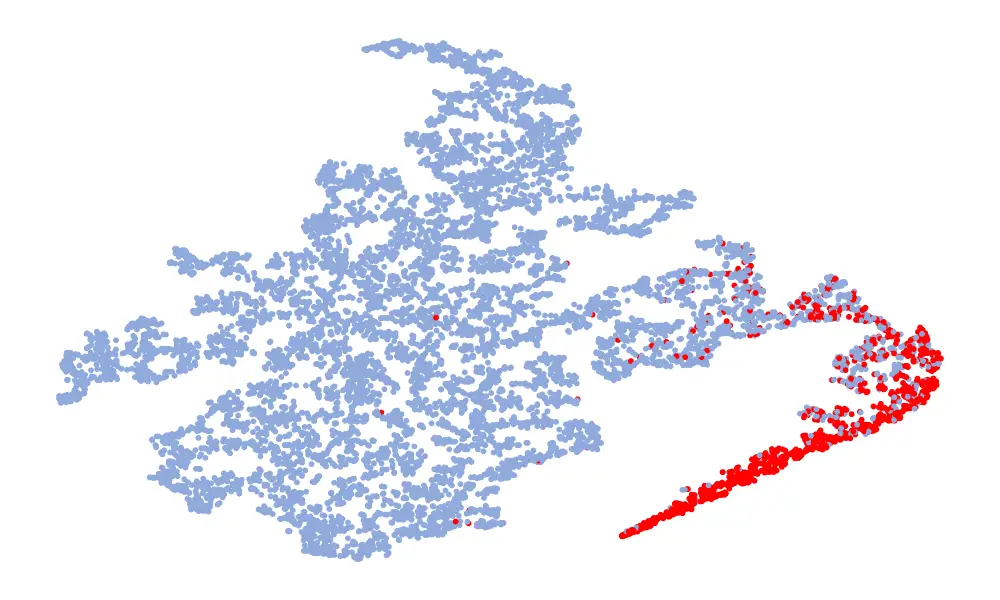

(a) DKDSSD

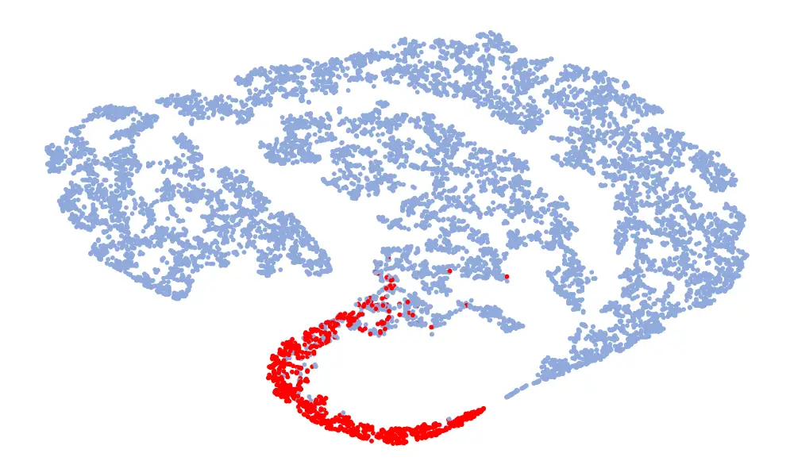

(b) DKDSSD

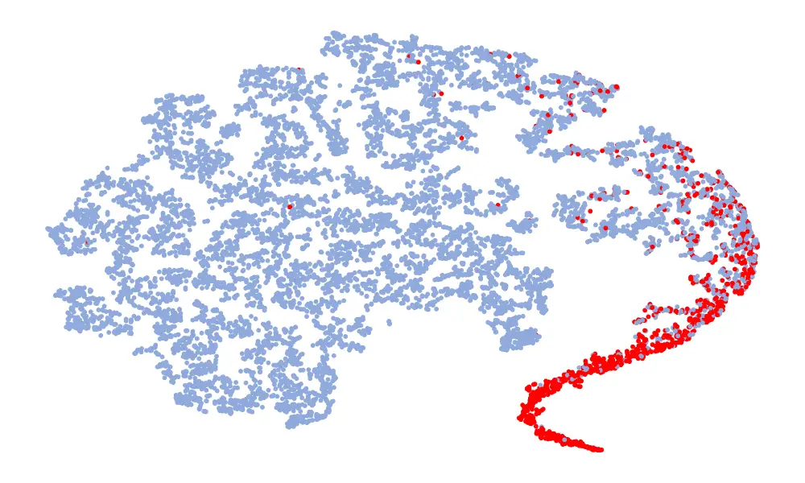

(c) Cascade

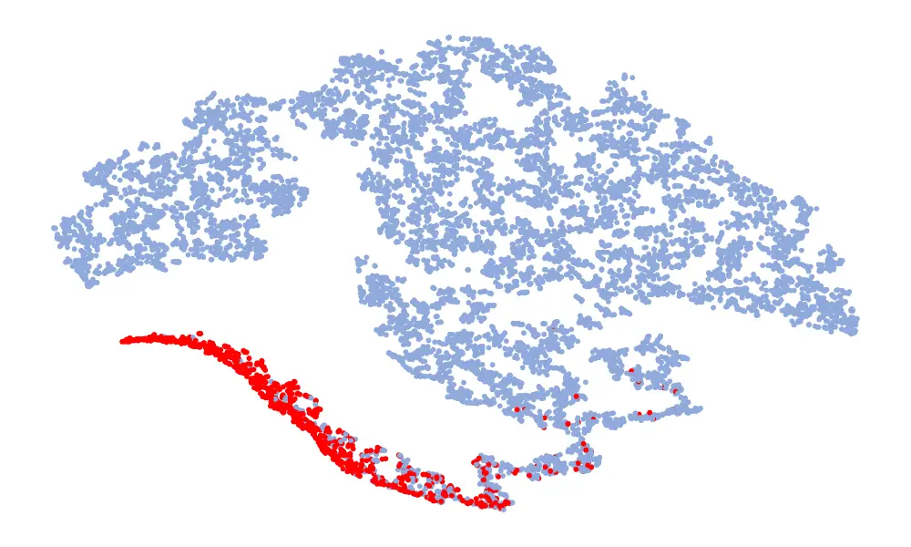

(d) Cascade

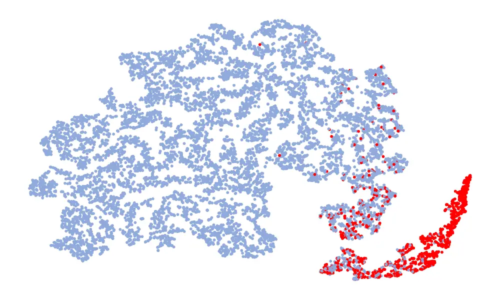

(e) Joint

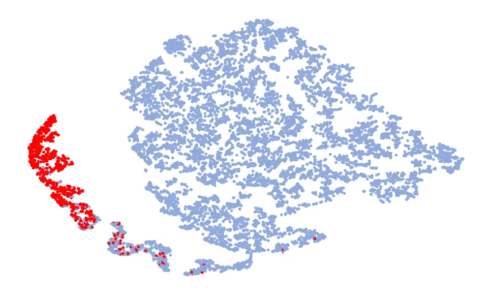

(f) Joint

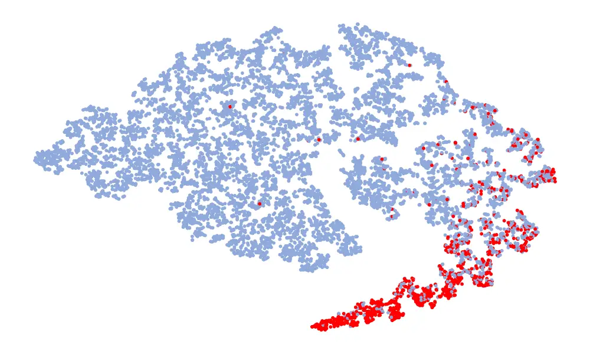

(g) MCT1

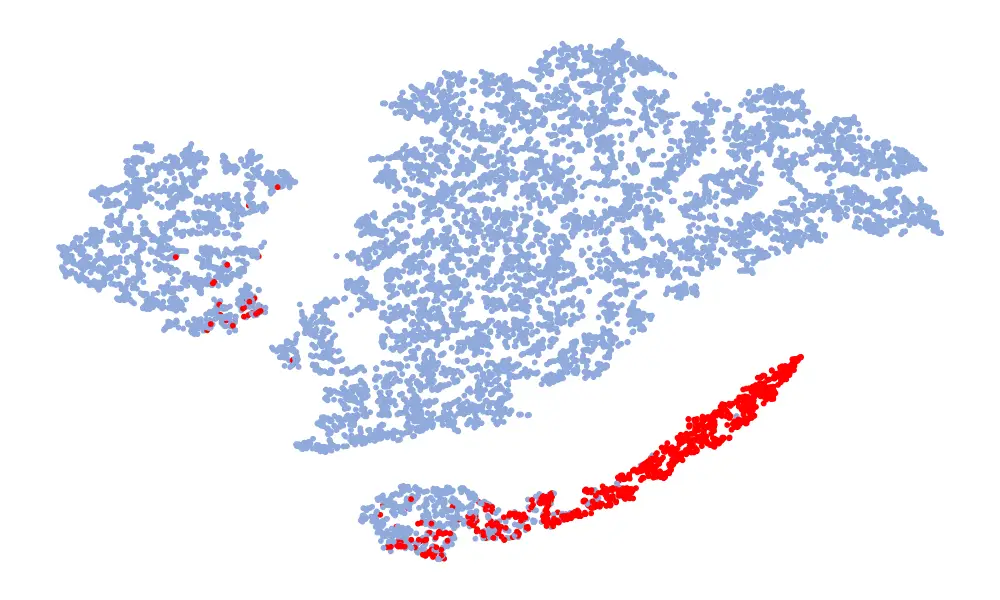

(h) MCT1

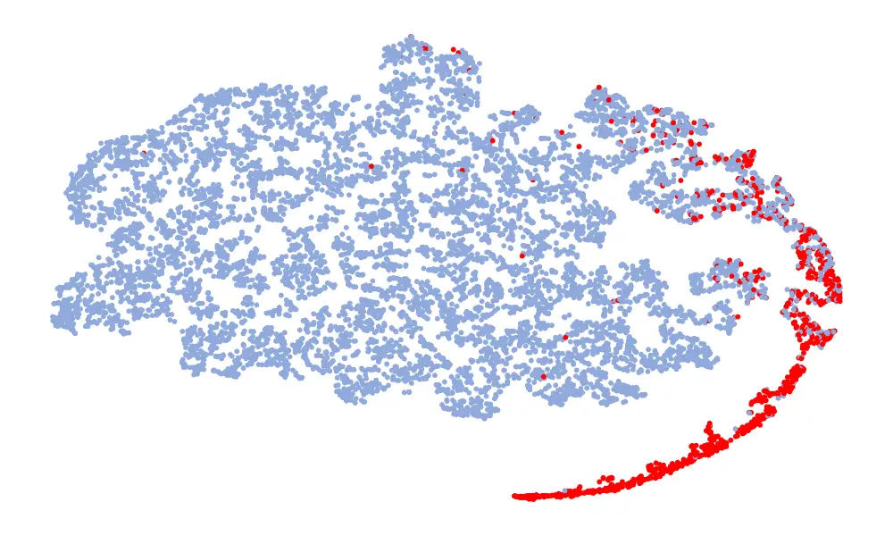

(i) MCT2

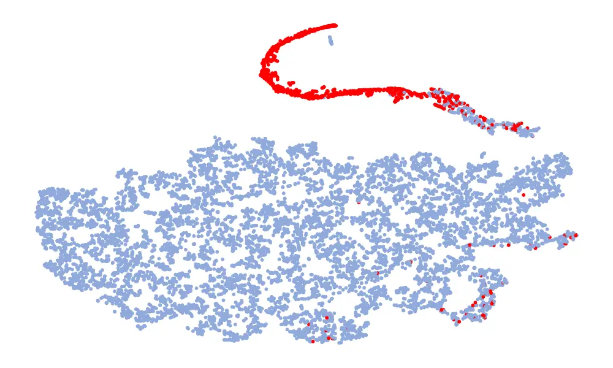

(j) MCT2

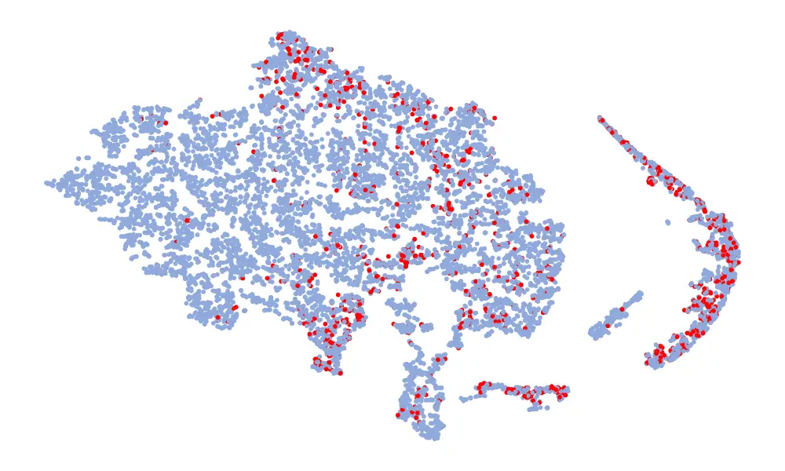

(k) Noise-Free

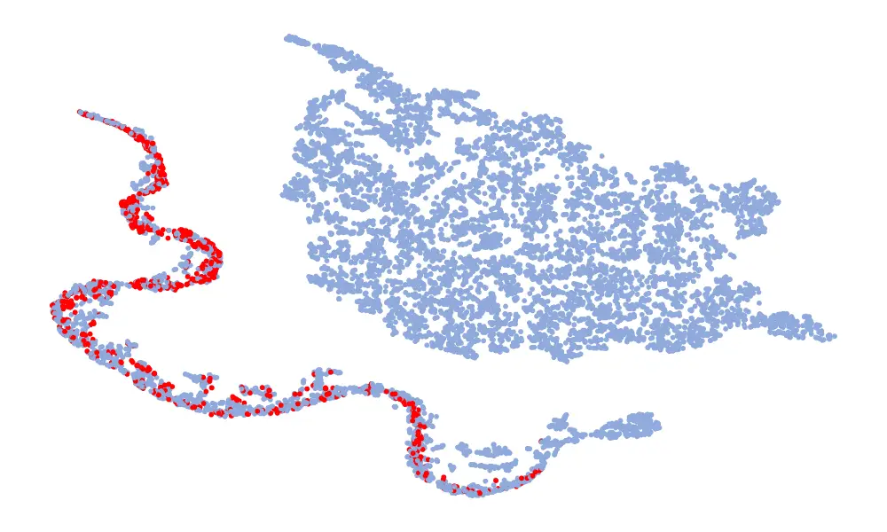

(l) Noise-Free

Fig. 4: The t-SNE plots of all baseline models on the ASVspoof 2019
unseen test set (left column) and ASVspoof 2021 LA test set (right
column).

Impact of Pre-Trained SE Model. Diffusion is a diffusion-based
generative model trained on the WSJ0 \[63\], CHiME3 \[64\], and
VoiceBank-DEMAND \[65\]. It performs best on datasets containing real
noise. We used the pre-trained model of Diffusion for speech enhancement
to test whether mature pre-trained models are more advantageous for
downstream tasks. From the Table IX, it can be observed that
“Diffusion+SeNet” performs consistently poorly under all SNR conditions,
with results hovering around 20%. Upon listening to the denoised speech
by the diffusion model, we found its speech enhancement effect to be
superior, effectively filtering out almost all noise. However, due to
the lack of interaction between the pre-trained model and the downstream
detection task, there exists an issue of excessive denoising. Speech
distortion complicates the distinction between real and fake features,
likely contributing to the poor performance. Incorporating the
interactive fusion module (“Diffusion+IF+SeNet”) lead to a significant
performance improvement, reducing the average EER from 21.75% to 8.62%.
We chose to train a speech enhancement model instead of using an
existing pre-trained model. Because for downstream tasks, what is needed
is to preserve the effective features of artifacts, not just reduce
noise. Although pre-trained speech enhancement front-ends demonstrate
strong performance, they require joint optimization with downstream
tasks for effective spoofing detection. Other studies, such as \[66\],
have also shown that a pre-trained frontend may not always be the
optimal solution. From a parameter perspective, pre-trained models
typically result in larger model sizes, which can significantly slow
down inference speed and pose challenges for deployment.

### V-D Visual Analysis

First, we used t-distributed Stochastic Neighbor Embedding (t-SNE) to
reduce the dimensionality of the last layer features of all 6 models and
visualize the feature distribution on both the ASVspoof2019 unseen
dataset and ASVspoof2021 dataset. Secondly, to analyze the role of the
interactive fusion module, we visualized the spectrum features before
and after fusion, as well as the fusion weight matrix learned by the
interactive fusion module. Finally, statistical analysis was performed
on the fusion weight matrix.

#### V-D1 Visualization of Feature Embeddings

Fig. 4 is a visualization of features, and the features taken are
128-dimensional features before classification. The red in the figure
represents the real speech, and the blue represents the fake speech. The
left column is the t-SNE of the 6 models on the ASVspoof 2019 unseen
data set, and the right column is the t-SNE of the model on the ASVspoof 2021. Considering the Noise-Free model (Fig. 4 (f), (l)), it can be seen
that the feature spaces of the real speech and the fake speech overlap,
and the noise seriously interferes with the distribution of the data. On
the whole, in the t-SNE visualization, the distribution of real data
appears relatively concentrated, whereas the distribution of fake data
appears more scattered due to various types of attacks. Although the
feature embedding distributions of different models for real speech are
similar, the distribution for fake speech varies considerably. This
difference may be attributed to noise interference, which can obscure
artifacts and alter the feature distribution. Compared to other models,
the t-SNE visualization of the “DKDSSD” model shows clearer separation
between red and blue clusters, indicating stronger capabilities in real
and fake classification.

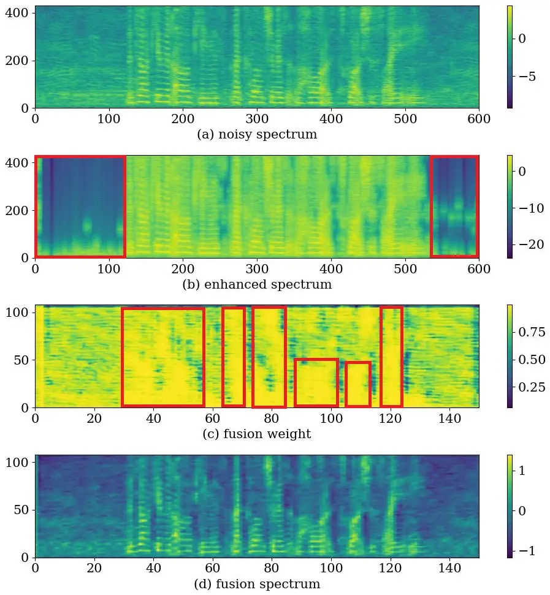

Fig. 5: A feature visualization of LA_E_2178426_snr15_babble.wav. This
speech is generated by LA_E_2178426.wav in ASVspoof 2019 by
superimposing babble noise with an SNR of 15dB. From top to bottom are
the logarithmic magnitude spectrum of the noisy speech and the enhanced
speech, the fusion weight matrix, and the mean value of the fused
16-channel features.

#### V-D2 Visualization of Features and Weight of Interactive Fusion

Fig. 5 is a feature visualization of a single speech
(LA_E_2178426_snr15_babble.wav). This speech is generated by
LA_E_2178426.wav in ASVspoof 2019 by superimposing destroyer noise with
an SNR of 15dB. The number of channels of the feature after the
interactive fusion is 16, and the fourth line of the figure is obtained
after averaging the dimension of the channel. It can be observed that in
areas with human voices (the red box part in Fig. 5 (c)), the noisy
spectrum occupies a larger weight, while in areas without human voices,
the enhanced spectrum has a larger weight. This suggests that the
interactive fusion module tends to absorb vocal segments in noisy speech
and retain more enhanced features in other areas. In the enhanced
features, there is almost no noise in the silent segment (the red box in
Fig. 5 (b)). After interactive fusion, the speech features (Fig. 5 (d))
present a clearer structure than the noisy spectrum, are less affected
by noise, and reduce speech distortion. These results demonstrate that
the interactive fusion module can adaptively absorb human speech
segments while preserving the less noise-contaminated state of enhanced
features.

#### V-D3 Visualization of Fusion Weight Statistics for Interactive Fusion

Fig. 6 shows box plots of the maximum value, minimum value, mean,
median, and all mask values from left to right. It can be observed that
the majority of mask values are distributed between 0.8 and 1. These
mask values represent the weights occupied by the original noisy
features during fusion. It implies that during fusion, the model tends
to absorb more of the original noisy spectrum. We speculate that this is
because the original speech contains more information and suffers from
no distortion issues. The primary role of the enhanced spectrum is to
provide information about the non-speech regions. And in a piece of
speech, the human voice usually occupies the main part. It confirms that
the interactive fusion module tends to absorb human voice segments from
the noisy speech and retains more enhanced features in non-speech
regions.

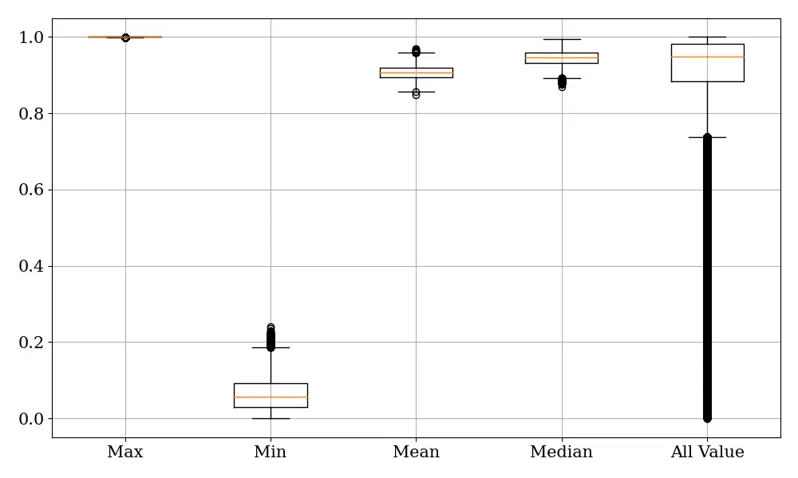

Fig. 6: Boxplot of statistical values for interactive fusion weight
matrices. From left to right are the maximum value, minimum value, mean
value, median value, and all mask values.

## VI Conclusions

This paper proposes a dual-branch synthetic speech detection method
based on knowledge distillation to address the problem of insufficient
robustness in noisy scenes. Interactive fusion and knowledge
distillation are proposed to guide the training of noisy data, prompting
it to behave like clean speech. Interactive fusion adaptively combines
noisy data with enhanced data by leveraging channel interaction and
spatial information fusion, prompting student branches to generate
features that are not disturbed by noise. Knowledge distillation can
constrain the decision of the student model through the teacher-student
paradigm, mapping the decision space of the noisy student branch to the
decision space of the clean teacher branch, allowing students to make
final predictions like teachers. Experimental results show that our
proposed DKDSSD outperforms other baseline models, especially in low SNR
scenarios, and also shows strong generalization in cross-dataset
experiments. After visualizing the fusion weight matrices, we observe
that noisy speech plays a major role, while the enhanced features
contribute information that would otherwise be silent segments. In the
future, we will pay more attention to the role of silent segments in
detecting synthetic speech.

## References

- \[1\] X. Tan, T. Qin, F. Soong, and T.-Y. Liu, “A survey on neural
  speech synthesis,” _arXiv preprint arXiv:2106.15561_, 2021.
- \[2\] Z. Wu, N. Evans, T. Kinnunen, J. Yamagishi, F. Alegre, and
  H. Li, “Spoofing and countermeasures for speaker verification: A
  survey,” _speech communication_, vol. 66, pp. 130–153, 2015.
- \[3\] Z. Wu, T. Kinnunen, N. Evans, J. Yamagishi, C. Hanilçi,
  M. Sahidullah, and A. Sizov, “Asvspoof 2015: the first automatic
  speaker verification spoofing and countermeasures challenge,” in
  _Sixteenth annual conference of the international speech communication
  association_, 2015.
- \[4\] T. Kinnunen, M. Sahidullah, H. Delgado, M. Todisco, N. Evans,
  J. Yamagishi, and K. A. Lee, “The ASVspoof 2017 Challenge: Assessing
  the Limits of Replay Spoofing Attack Detection,” in _Proc. Interspeech
  2017_, 2017, pp. 2–6.
- \[5\] M. Todisco, X. Wang, V. Vestman, M. Sahidullah, H. Delgado,
  A. Nautsch, J. Yamagishi, N. Evans, T. H. Kinnunen, and K. A. Lee,
  “ASVspoof 2019: Future Horizons in Spoofed and Fake Audio Detection,”
  in _Proc. Interspeech 2019_, 2019, pp. 1008–1012.
- \[6\] J. Yang, R. K. Das, and H. Li, “Significance of subband features
  for synthetic speech detection,” _IEEE Transactions on Information
  Forensics and Security_, vol. 15, pp. 2160–2170, 2019.
- \[7\] Y. Zhang, W. Wang, and P. Zhang, “The Effect of Silence and
  Dual-Band Fusion in Anti-Spoofing System,” in _Proc. Interspeech
  2021_, 2021, pp. 4279–4283.
- \[8\] Y. Wang, X. Wang, H. Nishizaki, and M. Li, “Low pass filtering
  and bandwidth extension for robust anti-spoofing countermeasure
  against codec variabilities,” in _2022 13th International Symposium on
  Chinese Spoken Language Processing (ISCSLP)_. IEEE, 2022, pp. 438–442.
- \[9\] J. Xue, C. Fan, J. Yi, C. Wang, Z. Wen, D. Zhang, and Z. Lv,
  “Learning from yourself: A self-distillation method for fake speech
  detection,” in _ICASSP 2023-2023 IEEE International Conference on
  Acoustics, Speech and Signal Processing (ICASSP)_. IEEE, 2023, pp.
  1–5.
- \[10\] H. Ling, L. Huang, J. Huang, B. Zhang, and P. Li,
  “Attention-based convolutional neural network for asv spoofing
  detection,” _Proc. Interspeech 2021_, pp. 4289–4293, 2021.
- \[11\] H. Tak, J. Patino, M. Todisco, A. Nautsch, N. Evans, and
  A. Larcher, “End-to-end anti-spoofing with rawnet2,” in _ICASSP
  2021-2021 IEEE International Conference on Acoustics, Speech and
  Signal Processing (ICASSP)_. IEEE, 2021, pp. 6369–6373.
- \[12\] H. Tak, J.-W. Jung, J. Patino, M. Kamble, M. Todisco, and
  N. Evans, “End-to-end spectro-temporal graph attention networks for
  speaker verification anti-spoofing and speech deepfake detection,” in
  _ASVSPOOF 2021, Automatic Speaker Verification and Spoofing
  Countermeasures Challenge_. ISCA, 2021, pp. 1–8.
- \[13\] G. Hua, A. B. J. Teoh, and H. Zhang, “Towards end-to-end
  synthetic speech detection,” _IEEE Signal Processing Letters_,
  vol. 28, pp. 1265–1269, 2021.
- \[14\] X. Li, N. Li, C. Weng, X. Liu, D. Su, D. Yu, and H. Meng,
  “Replay and synthetic speech detection with res2net architecture,” in
  _ICASSP 2021-2021 IEEE International Conference on Acoustics, Speech
  and Signal Processing (ICASSP)_. IEEE, 2021, pp. 6354–6358.
- \[15\] J.-w. Jung, H.-S. Heo, H. Tak, H.-j. Shim, J. S. Chung, B.-J.
  Lee, H.-J. Yu, and N. Evans, “Aasist: Audio anti-spoofing using
  integrated spectro-temporal graph attention networks,” in _ICASSP
  2022-2022 IEEE International Conference on Acoustics, Speech and
  Signal Processing (ICASSP)_. IEEE, 2022, pp. 6367–6371.
- \[16\] X. Tian, Z. Wu, X. Xiao, E. S. Chng, and H. Li, “An
  investigation of spoofing speech detection under additive noise and
  reverberant conditions.” in _Proc. Interspeech 2016_, 2016, pp.
  1715–1719.
- \[17\] J. Yi, R. Fu, J. Tao, S. Nie, H. Ma, C. Wang, T. Wang, Z. Tian,
  Y. Bai, C. Fan _et al._, “Add 2022: the first audio deep synthesis
  detection challenge,” in _ICASSP 2022-2022 IEEE International
  Conference on Acoustics, Speech and Signal Processing (ICASSP)_. IEEE,
  2022, pp. 9216–9220.
- \[18\] J. Yamagishi, X. Wang, M. Todisco, M. Sahidullah, J. Patino,
  A. Nautsch, X. Liu, K. A. Lee, T. Kinnunen, N. Evans, and H. Delgado,
  “ASVspoof 2021: accelerating progress in spoofed and deepfake speech
  detection,” in _Proc. 2021 ASVspoof Workshop_, 2021, pp. 47–54.
- \[19\] A. Cohen, I. Rimon, E. Aflalo, and H. H. Permuter, “A study on
  data augmentation in voice anti-spoofing,” _Speech Communication_,
  vol. 141, pp. 56–67, 2022.
- \[20\] T. Chen, A. Kumar, P. Nagarsheth, G. Sivaraman, and E. Khoury,
  “Generalization of audio deepfake detection,” in _Proc. Odyssey 2020
  The Speaker and Language Recognition Workshop_, 2020, pp. 132–137.
- \[21\] Y. Zhang, G. Zhu, F. Jiang, and Z. Duan, “An Empirical Study on
  Channel Effects for Synthetic Voice Spoofing Countermeasure Systems,”
  in _Proc. Interspeech 2021_, 2021, pp. 4309–4313.
- \[22\] R. Yan, C. Wen, S. Zhou, T. Guo, W. Zou, and X. Li, “Audio
  deepfake detection system with neural stitching for add 2022,” in
  _ICASSP 2022-2022 IEEE International Conference on Acoustics, Speech
  and Signal Processing (ICASSP)_. IEEE, 2022, pp. 9226–9230.
- \[23\] Y. Qian, N. Chen, H. Dinkel, and Z. Wu, “Deep feature
  engineering for noise robust spoofing detection,” _IEEE/ACM
  Transactions on Audio, Speech, and Language Processing_, vol. 25,
  no. 10, pp. 1942–1955, 2017.
- \[24\] A. Babu, C. Wang, A. Tjandra, K. Lakhotia, Q. Xu, N. Goyal,
  K. Singh, P. von Platen, Y. Saraf, J. Pino _et al._, “Xls-r:
  Self-supervised cross-lingual speech representation learning at
  scale,” _arXiv preprint arXiv:2111.09296_, 2021.
- \[25\] X. Wang and J. Yamagishi, “Investigating self-supervised front
  ends for speech spoofing countermeasures,” _arXiv preprint
  arXiv:2111.07725_, 2021.
- \[26\] A. Gomez-Alanis, A. M. Peinado, J. A. Gonzalez, and A. M.
  Gomez, “A gated recurrent convolutional neural network for robust
  spoofing detection,” _IEEE/ACM Transactions on Audio, Speech, and
  Language Processing_, vol. 27, no. 12, pp. 1985–1999, 2019.
- \[27\] G. Dişken, “Differential convolutional network for noise mask
  estimation,” _Applied Acoustics_, vol. 211, p. 109568, 2023.
- \[28\] D. Ma, N. Hou, H. Xu, E. S. Chng _et al._, “Multitask-based
  joint learning approach to robust asr for radio communication speech,”
  in _2021 Asia-Pacific Signal and Information Processing Association
  Annual Summit and Conference (APSIPA ASC)_. IEEE, 2021, pp. 497–502.
- \[29\] A. S. Subramanian, X. Wang, M. K. Baskar, S. Watanabe,
  T. Taniguchi, D. Tran, and Y. Fujita, “Speech enhancement using
  end-to-end speech recognition objectives,” in _WASPAA 2019_. IEEE,
  2019, pp. 234–238.
- \[30\] X. Wang, B. Zeng, S. Hongbin, Y. Wan, and M. Li, “Robust Audio
  Anti-spoofing Countermeasure with Joint Training of Front-end and
  Back-end Models,” 2023, pp. 4004–4008.
- \[31\] C. Hanilci, T. Kinnunen, M. Sahidullah, and A. Sizov, “Spoofing
  detection goes noisy: An analysis of synthetic speech detection in the
  presence of additive noise,” _Speech Communication_, vol. 85, pp.
  83–97, 2016.
- \[32\] Q. Zhang, X. Qian, Z. Ni, A. Nicolson, E. Ambikairajah, and
  H. Li, “A time-frequency attention module for neural speech
  enhancement,” _IEEE/ACM Transactions on Audio, Speech, and Language
  Processing_, vol. 31, pp. 462–475, 2022.
- \[33\] C. Zheng, H. Zhang, W. Liu, X. Luo, A. Li, X. Li, and B. C.
  Moore, “Sixty years of frequency-domain monaural speech enhancement:
  From traditional to deep learning methods,” _Trends in Hearing_,
  vol. 27, p. 23312165231209913, 2023.
- \[34\] D. Cai, W. Cai, and M. Li, “Within-sample variability-invariant
  loss for robust speaker recognition under noisy environments,” in
  _ICASSP 2020-2020 IEEE International Conference on Acoustics, Speech
  and Signal Processing (ICASSP)_. IEEE, 2020, pp. 6469–6473.
- \[35\] S. Shon, H. Tang, and J. Glass, “Voiceid loss: Speech
  enhancement for speaker verification,” _Proc. Interspeech 2019_, pp.
  2888–2892, 2019.
- \[36\] K. Kinoshita, T. Ochiai, M. Delcroix, and T. Nakatani,
  “Improving noise robust automatic speech recognition with
  single-channel time-domain enhancement network,” in _ICASSP 2020-2020
  IEEE International Conference on Acoustics, Speech and Signal
  Processing (ICASSP)_. IEEE, 2020, pp. 7009–7013.
- \[37\] C. Fan, H. Zhang, J. Yi, Z. Lv, J. Tao, T. Li, G. Pei, X. Wu,
  and S. Li, “Specmnet: Spectrum mend network for monaural speech
  enhancement,” _Applied Acoustics_, vol. 194, p. 108792, 2022.
- \[38\] C. Fan, J. Yi, J. Tao, Z. Tian, B. Liu, and Z. Wen, “Gated
  recurrent fusion with joint training framework for robust end-to-end
  speech recognition,” _IEEE/ACM Transactions on Audio, Speech, and
  Language Processing_, vol. 29, pp. 198–209, 2020.
- \[39\] C. Fan, M. Ding, J. Yi, J. Li, and Z. Lv, “Two-stage deep
  spectrum fusion for noise-robust end-to-end speech recognition,”
  _Applied Acoustics_, vol. 212, p. 109547, 2023.
- \[40\] K. Iwamoto, T. Ochiai, M. Delcroix, R. Ikeshita, H. Sato,
  S. Araki, and S. Katagiri, “How bad are artifacts?: Analyzing the
  impact of speech enhancement errors on ASR,” in _Proc. Interspeech
  2022_, 2022, pp. 5418–5422.
- \[41\] H. Sato, T. Ochiai, M. Delcroix, K. Kinoshita, N. Kamo, and
  T. Moriya, “Learning to enhance or not: Neural network-based switching
  of enhanced and observed signals for overlapping speech recognition,”
  in _ICASSP 2022-2022 IEEE International Conference on Acoustics,
  Speech and Signal Processing (ICASSP)_. IEEE, 2022, pp. 6287–6291.
- \[42\] A. Pandey, C. Liu, Y. Wang, and Y. Saraf, “Dual application of
  speech enhancement for automatic speech recognition,” in _2021 IEEE
  Spoken Language Technology Workshop (SLT)_. IEEE, 2021, pp. 223–228.
- \[43\] Y. Wang, J. Li, H. Wang, Y. Qian, C. Wang, and Y. Wu,
  “Wav2vec-switch: Contrastive learning from original-noisy speech pairs
  for robust speech recognition,” in _ICASSP 2022-2022 IEEE
  International Conference on Acoustics, Speech and Signal Processing
  (ICASSP)_. IEEE, 2022, pp. 7097–7101.
- \[44\] Q.-S. Zhu, J. Zhang, Z.-Q. Zhang, M.-H. Wu, X. Fang, and L.-R.
  Dai, “A noise-robust self-supervised pre-training model based speech
  representation learning for automatic speech recognition,” in _ICASSP
  2022-2022 IEEE International Conference on Acoustics, Speech and
  Signal Processing (ICASSP)_. IEEE, 2022, pp. 3174–3178.
- \[45\] C. Zorilă and R. Doddipatla, “Speaker reinforcement using
  target source extraction for robust automatic speech recognition,” in
  _ICASSP 2022-2022 IEEE International Conference on Acoustics, Speech
  and Signal Processing (ICASSP)_. IEEE, 2022, pp. 6297–6301.
- \[46\] Y. Hu, N. Hou, C. Chen, and E. S. Chng, “Interactive feature
  fusion for end-to-end noise-robust speech recognition,” in _ICASSP
  2022-2022 IEEE International Conference on Acoustics, Speech and
  Signal Processing (ICASSP)_. IEEE, 2022, pp. 6292–6296.
- \[47\] J. Gou, B. Yu, S. J. Maybank, and D. Tao, “Knowledge
  distillation: A survey,” _International Journal of Computer Vision_,
  vol. 129, pp. 1789–1819, 2021.
- \[48\] M. Zhu, K. Han, C. Zhang, J. Lin, and Y. Wang, “Low-resolution
  visual recognition via deep feature distillation,” in _ICASSP
  2019-2019 IEEE International Conference on Acoustics, Speech and
  Signal Processing (ICASSP)_. IEEE, 2019, pp. 3762–3766.
- \[49\] Z. Li and D. Hoiem, “Learning without forgetting,” _IEEE
  transactions on pattern analysis and machine intelligence_, vol. 40,
  no. 12, pp. 2935–2947, 2017.
- \[50\] M. Kim, S. Tariq, and S. S. Woo, “Fretal: Generalizing deepfake
  detection using knowledge distillation and representation learning,”
  in _Proceedings of the IEEE/CVF Conference on Computer Vision and
  Pattern Recognition_. IEEE, 2021, pp. 1001–1012.
- \[51\] Y. Ren, H. Peng, L. Li, X. Xue, Y. Lan, and Y. Yang,
  “Generalized voice spoofing detection via integral knowledge
  amalgamation,” _IEEE/ACM Transactions on Audio, Speech, and Language
  Processing_, vol. 31, pp. 2461–2475, 2023.
- \[52\] P. Liu, Z. Zhang, and Y. Yang, “End-to-end spoofing speech
  detection and knowledge distillation under noisy conditions,” in _2021
  International Joint Conference on Neural Networks (IJCNN)_. IEEE,
  2021, pp. 1–7.
- \[53\] W. Liu, Y. Wen, Z. Yu, M. Li, B. Raj, and L. Song, “Sphereface:
  Deep hypersphere embedding for face recognition,” in _Proceedings of
  the IEEE/CVF Conference on Computer Vision and Pattern
  Recognition_. IEEE, 2017, pp. 6738–6746.
- \[54\] S. I. Mirzadeh, M. Farajtabar, A. Li, N. Levine, A. Matsukawa,
  and H. Ghasemzadeh, “Improved knowledge distillation via teacher
  assistant,” in _Proceedings of the AAAI Conference on Artificial
  Intelligence_, vol. 34, no. 04, 2020, pp. 5191–5198.
- \[55\] N. Müller, F. Dieckmann, P. Czempin, R. Canals, K. Böttinger,
  and J. Williams, “Speech is Silver, Silence is Golden: What do
  ASVspoof-trained Models Really Learn?” in _Proc. 2021 Edition of the
  Automatic Speaker Verification and Spoofing Countermeasures
  Challenge_, 2021, pp. 55–60.
- \[56\] G. Hu and D. Wang, “A tandem algorithm for pitch estimation and
  voiced speech segregation,” _IEEE Transactions on Audio, Speech, and
  Language Processing_, vol. 18, no. 8, pp. 2067–2079, 2010.
- \[57\] A. Varga and H. J. Steeneken, “Assessment for automatic speech
  recognition: Ii. noisex-92: A database and an experiment to study the
  effect of additive noise on speech recognition systems,” _Speech
  communication_, vol. 12, no. 3, pp. 247–251, 1993.
- \[58\] K. Tan and D. Wang, “A convolutional recurrent neural network
  for real-time speech enhancement.” vol. 2018, 2018, pp. 3229–3233.
- \[59\] J. Xue, C. Fan, Z. Lv, J. Tao, J. Yi, C. Zheng, Z. Wen,
  M. Yuan, and S. Shao, “Audio deepfake detection based on a combination
  of f0 information and real plus imaginary spectrogram features,” in
  _DDAM 2022_, 2022, pp. 19–26.
- \[60\] T.-P. Doan, L. Nguyen-Vu, S. Jung, and K. Hong, “Bts-e: Audio
  deepfake detection using breathing-talking-silence encoder,” in
  _ICASSP 2023-2023 IEEE International Conference on Acoustics, Speech
  and Signal Processing (ICASSP)_. IEEE, 2023, pp. 1–5.
- \[61\] X. Liu, M. Liu, L. Wang, K. A. Lee, H. Zhang, and J. Dang,
  “Leveraging positional-related local-global dependency for synthetic
  speech detection,” in _ICASSP 2023-2023 IEEE International Conference
  on Acoustics, Speech and Signal Processing (ICASSP)_. IEEE, 2023, pp.
  1–5.
- \[62\] J. Richter, S. Welker, J.-M. Lemercier, B. Lay, and
  T. Gerkmann, “Speech enhancement and dereverberation with
  diffusion-based generative models,” _IEEE/ACM Transactions on Audio,
  Speech, and Language Processing_, vol. 31, pp. 2351–2364, 2023.
- \[63\] J. Garofalo, D. Graff, D. Paul, and D. Pallett, “Csr-i (wsj0)
  complete,” _Linguistic Data Consortium, Philadelphia_, 2007.
- \[64\] J. Barker, R. Marxer, E. Vincent, and S. Watanabe, “The third
  ‘chime’speech separation and recognition challenge: Dataset, task and
  baselines,” in _2015 IEEE Workshop on Automatic Speech Recognition and
  Understanding (ASRU)_. IEEE, 2015, pp. 504–511.
- \[65\] C. Valentini-Botinhao, X. Wang, S. Takaki, and J. Yamagishi,
  “Investigating rnn-based speech enhancement methods for noise-robust
  text-to-speech.” in _SSW_, 2016, pp. 146–152.
- \[66\] X. Wang, B. Zeng, H. Suo, Y. Wan, and M. Li, “Robust audio
  anti-spoofing countermeasure with joint training of front-end and
  back-end models,” in _Proc. Interspeech 2023_, vol. 2023, 2023, pp.
  4004–4008.

|                                                                                 |                                                                                                                                                                                                                                                                                                                                                                                                                                                                                                                                                                        |
| ------------------------------------------------------------------------------- | ---------------------------------------------------------------------------------------------------------------------------------------------------------------------------------------------------------------------------------------------------------------------------------------------------------------------------------------------------------------------------------------------------------------------------------------------------------------------------------------------------------------------------------------------------------------------- |
| ![[Uncaptioned image]](arxiv-2310-08869v2--c6d693d920cb.figures/figure-17.webp) | Cunhang Fan (Member, IEEE) received the Ph.D degree with the National Laboratory of Pattern Recognition (NLPR), Institute of Automation, Chinese Academy of Sciences (CASIA), Beijing, China, in 2021, and the B.S. degree from the Beijing University of Chemical Technology (BUCT), Beijing, China, in 2016. He is currently an associate professor with the School of Computer Science and Technology, Anhui University, Heifei, China. His current research interests include speech enhancement, fake speech detection, speech recognition and speech processing. |

|                                                                                 |                                                                                                                                                                                                                                                                                                         |
| ------------------------------------------------------------------------------- | ------------------------------------------------------------------------------------------------------------------------------------------------------------------------------------------------------------------------------------------------------------------------------------------------------- |
| ![[Uncaptioned image]](arxiv-2310-08869v2--c6d693d920cb.figures/figure-18.webp) | Mingming Ding received a B.S. degree in civil engineering from Anhui Jianzhu University in 2018. She is currently currently studying for a M.S. degree in computer science and technology from Anhui University. Her main interests include speech enhancement, speech anti-spoofing and deep learning. |

|                                                                                 |                                                                                                                                                                                                                                                                                                                                                                                                                                                                                                                                                                                                                                                                                                                                                                                                                                                                                                                                                                                                                                                                        |
| ------------------------------------------------------------------------------- | ---------------------------------------------------------------------------------------------------------------------------------------------------------------------------------------------------------------------------------------------------------------------------------------------------------------------------------------------------------------------------------------------------------------------------------------------------------------------------------------------------------------------------------------------------------------------------------------------------------------------------------------------------------------------------------------------------------------------------------------------------------------------------------------------------------------------------------------------------------------------------------------------------------------------------------------------------------------------------------------------------------------------------------------------------------------------- |
| ![[Uncaptioned image]](arxiv-2310-08869v2--c6d693d920cb.figures/figure-19.webp) | Jianhua Tao (Senior Member, IEEE) received the M.S. degree from Nanjing University, Nanjing, China, in 1996, and the Ph.D. degree from Tsinghua University, Beijing, China, in 2001. He is currently a Professor with Department of Automation, Tsinghua University, Beijing, China. He has authored or coauthored more than 300 papers on major journals and proceedings including the IEEE TASLP, IEEE TAFFC, IEEE TIP, IEEE TSMCB, Information Fusion, etc. His current research interests include speech recognition and synthesis, affective computing, and pattern recognition. He is the Board Member of ISCA, the chairperson of ISCA SIG-CSLP, the Chair or Program Committee Member for several major conferences, including Interspeech, ICPR, ACII, ICMI, ISCSLP, etc. He was the subject editor for the Speech Communication, and is an Associate Editor for Journal on Multimodal User Interface and International Journal on Synthetic Emotions. He was the recipient of several awards from important conferences, including Interspeech, NCMMSC, etc. |

|                                                                                 |                                                                                                                                                                                                                                                                                                                                                                                                                                                                                                                                                                                                                                                                                                                                                                                                                                                                     |
| ------------------------------------------------------------------------------- | ------------------------------------------------------------------------------------------------------------------------------------------------------------------------------------------------------------------------------------------------------------------------------------------------------------------------------------------------------------------------------------------------------------------------------------------------------------------------------------------------------------------------------------------------------------------------------------------------------------------------------------------------------------------------------------------------------------------------------------------------------------------------------------------------------------------------------------------------------------------- |
| ![[Uncaptioned image]](arxiv-2310-08869v2--c6d693d920cb.figures/figure-20.webp) | Ruibo Fu (Member, IEEE) is an assistant professor in the National Laboratory of Pattern Recognition, Institute of Automation, Chinese Academy of Sciences, Beijing. He obtained B.E. from Beijing University of Aeronautics and Astronautics in 2015 and Ph.D. from the Institute of Automation, Chinese Academy of Sciences in 2020. His research interest is speech synthesis and transfer learning. He has published more than 20 papers in international conferences and journals such as ICASSP and INTERSPEECH and has won the best paper award twice in NCMMSC 2017 and 2019. He won the first prize in the personalized speech synthesis competition held by the Ministry of Industry and Information Technology twice in 2019 and 2020. He also won the first prize in the ICASSP2021 Multi-Speaker Multi-Style Voice Cloning Challenge (M2VoC) Challenge. |

|                                                                                 |                                                                                                                                                                                                                                                                                                                                                                                                                                                                                                                                                                                                                                                    |
| ------------------------------------------------------------------------------- | -------------------------------------------------------------------------------------------------------------------------------------------------------------------------------------------------------------------------------------------------------------------------------------------------------------------------------------------------------------------------------------------------------------------------------------------------------------------------------------------------------------------------------------------------------------------------------------------------------------------------------------------------- |
| ![[Uncaptioned image]](arxiv-2310-08869v2--c6d693d920cb.figures/figure-21.webp) | Jiangyan Yi (Member, IEEE) received the Ph.D. degree from the University of Chinese Academy of Sciences, Beijing, China, in 2018, and the M.A. degree from the Graduate School of Chinese Academy of Social Sciences, Beijing, in 2010. During 2011 to 2014, she was a Senior R&D Engineer with Alibaba Group. She is currently an Associate Professor with the State Key Laboratory of Multimodal Artificial Intelligence Systems, Institute of Automation, Chinese Academy of Sciences. Her research interests include speech signal processing, speech recognition and synthesis, fake audio detection, audio forensics, and transfer learning. |

|                                                                                 |                                                                                                                                                                                                                                                                                                                                                                                                                                                                                                                                |
| ------------------------------------------------------------------------------- | ------------------------------------------------------------------------------------------------------------------------------------------------------------------------------------------------------------------------------------------------------------------------------------------------------------------------------------------------------------------------------------------------------------------------------------------------------------------------------------------------------------------------------ |
| ![[Uncaptioned image]](arxiv-2310-08869v2--c6d693d920cb.figures/figure-22.webp) | Zhengqi Wen (Member, IEEE) received the B.S.degree from the University of Science and Technology of China, Hefei, China, in 2008, and the Ph.D. degree from the Chinese Academy of Sciences, Beijing, China, in 2013, both in pattern recognition and intelligent system. He is currently an Associate Professor with the National Laboratory of Pattern Recognition Institute of Automation, Chinese Academy of Sciences. His current research interests include speech processing, speech recognition, and speech synthesis. |

|                                                                                 |                                                                                                                                                                                                                                                                                                                                                                                                                                                                                                                               |
| ------------------------------------------------------------------------------- | ----------------------------------------------------------------------------------------------------------------------------------------------------------------------------------------------------------------------------------------------------------------------------------------------------------------------------------------------------------------------------------------------------------------------------------------------------------------------------------------------------------------------------- |
| ![[Uncaptioned image]](arxiv-2310-08869v2--c6d693d920cb.figures/figure-23.webp) | Zhao Lv (Member, IEEE) received his Ph.D. degree in Computer Application Technology from Anhui University, Hefei, China, in 2011. He was a visiting scholar with the University of Utah, Salt Lake City, USA, from 2017 to 2018. He is currently a professor in the School of Computer Science and Technology at Anhui University, Hefei, China. His research interests include intelligent information processing and pattern recognition regarding biomedical signals (EEG, EOG, etc.) as well as speech signal processing. |
