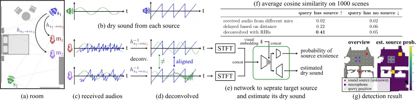
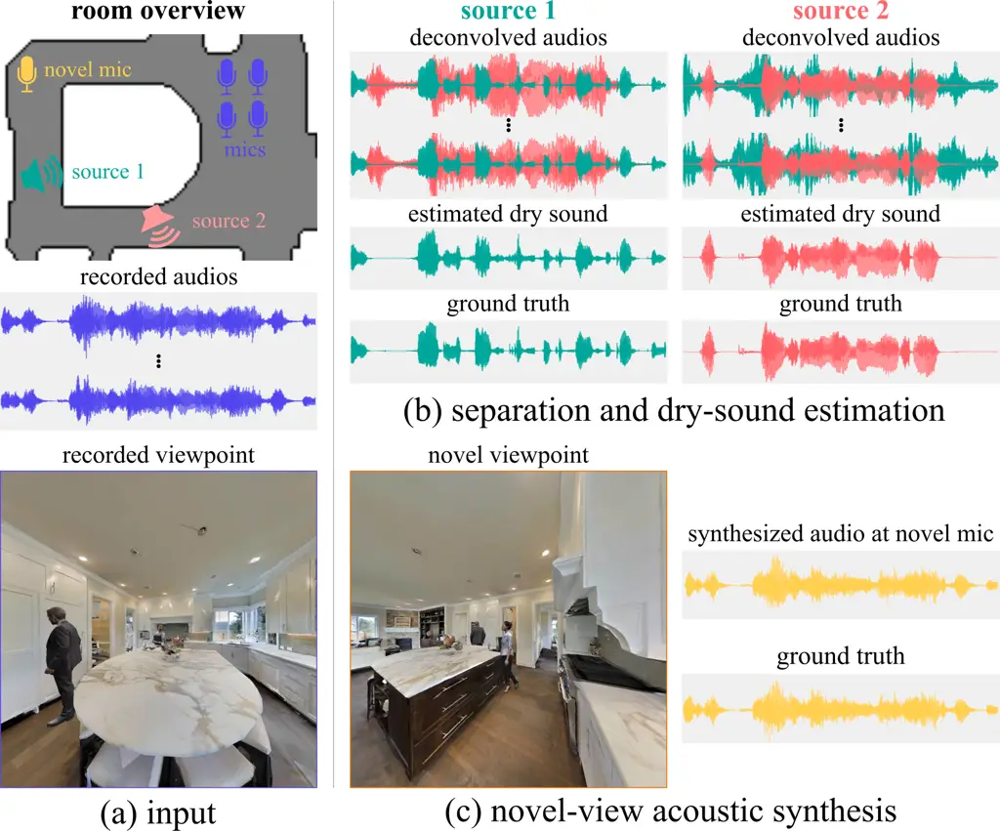

# Novel-view Acoustic Synthesis From 3D Reconstructed Rooms

Byeongjoo Ahn    Karren Yang    Brian Hamilton    Jonathan Sheaffer   
Anurag Ranjan    Miguel Sarabia    Oncel Tuzel    Jen-Hao Rick Chang

###### Abstract

We investigate the benefit of combining blind audio recordings with 3D
scene information for novel-view acoustic synthesis. Given audio
recordings from 2–4 microphones and the 3D geometry and material of a
scene containing multiple unknown sound sources, we estimate the sound
anywhere in the scene. We identify the main challenges of novel-view
acoustic synthesis as sound source localization, separation, and
dereverberation. While naively training an end-to-end network fails to
produce high-quality results, we show that incorporating room impulse
responses (RIRs) derived from 3D reconstructed rooms enables the same
network to jointly tackle these tasks. Our method outperforms existing
methods designed for the individual tasks, demonstrating its
effectiveness at utilizing 3D visual information. In a simulated study
on the Matterport3D-NVAS dataset, our model achieves near-perfect
accuracy on source localization, a PSNR of $`26.44\text{\,}\mathrm{dB}`$
and a SDR of $`14.23\text{\,}\mathrm{dB}`$ for source separation and
dereverberation, resulting in a PSNR of $`25.55\text{\,}\mathrm{dB}`$
and a SDR of $`14.20\text{\,}\mathrm{dB}`$ on novel-view acoustic
synthesis. We release our code and model on our project website at
[https://github.com/apple/ml-nvas3d](https://github.com/apple/ml-nvas3d).
Please wear headphones when listening to the results.

###### keywords

novel-view acoustic synthesis, source localization, source separation,
dereverberation

^(†)^(†)address: Apple^(†)^(†)email: {byeongjoo, karren_yang,
jenhao_chang}@apple.com

## 1 Introduction

Recent advancements in novel-view synthesis and 3D reconstruction \[1,
2, 3\] have enabled users to explore scenes freely, viewing them from
positions not captured during recordings. However, a significant
limitation of these approaches is the absence of sound, restricting the
immersive experience. In contrast to novel-view image synthesis, the
non-stationary nature of sound and the low resolution of microphones
make novel-view acoustic synthesis a challenging problem \[4\].

In this work, we investigate novel-view acoustic synthesis in 3D
reconstructed and calibrated rooms. We build upon recent developments in
3D reconstruction \[1\] and acoustic calibration techniques \[5, 6, 7\]
and assume the availability of high-quality room geometry and acoustic
material information. We also assume to have audio recordings from a
limited microphone array (2–4 receivers) at known locations in the
scene. However, we have no knowledge about the sound sources, including
their number, locations, and content. Under this setting, our goal is to
enable users moving freely in the scene to hear realistic spatial audio
renderings of the unknown sound sources recorded by the microphones.

Novel-view acoustic synthesis remains challenging despite having 3D
reconstructed rooms. The main problem is the lack of knowledge of the
sound sources. If we knew all information about the sound sources,
including their locations and dry sound, given that we have a 3D
reconstructed room (with room geometry and acoustic materials), we could
synthesize audio at any new location using standard acoustic
renderers \[8, 9, 10, 11\]. In other words, the key to novel-view
acoustic synthesis is acoustic-scene reconstruction, i.e., estimating
the positions (sound localization) and the content (sound separation and
dereverberation) of the sound sources from blind audio recordings.
However, the limited number and resolution of microphones and the
mixture of different reverberant sound in same audios makes these
problems difficult, particularly if the semantics are similar (i.e., two
people speaking) or the sounds arrive from close directions. Existing
methods relying on time-delay cues cannot pinpoint the locations of
multiple sound sources in a complex 3D scene \[12\]. Simply training a
neural network also fails to generate high-quality results, as will be
shown in Section 4.



Figure 1: Model overview and motivation. Given a 3D reconstructed room
(a) and audio recordings from microphones (c), our method simultaneously
performs sound source localization, separation, and dereverberation to
estimate the locations and dry sound of individual sound sources. (d,f)
Our method utilizes a key observation that deconvolving audio recordings
with the impulse response from a specific source location aligns sound
emitted at that location across input recordings while keeping sound
from other locations uncorrelated. Utilizing the aligned audios (while
still mixed and reverberant) makes the problem easier for neural
networks to perform said tasks. (e) We use a network to isolate target
audio from the mixture of sounds and mitigate deconvolution artifacts.
(g) Our source detection result on an example scene. Our network
accurately identify where the sound sources are.

Our key observation is that the echoes caused by the multipath
reflection of sound contain valuable information for acoustic scene
reconstruction. Specifically, as shown in Fig. 1, we propose to assist
the network by deconvolving audio recordings from individual microphones
(c) with RIRs from a specific location. This operation aligns the sound
emitted from that location across microphone channels while keeping
sound from other locations uncorrelated (d). Note that the deconvolved
audios still contain mixed and reverberant sound from all sources — only
the sound component originated from the location specified by the RIR
will be aligned and dereverberated in the individual recordings. This is
a strong cue that enables neural network to predict whether an audio
source exists at that location and perform sound separation and estimate
the corresponding dry sound. Iterating this approach over all candidate
source locations enables us to reconstruct the acoustic scene with high
spatial resolution (g) and render it from novel viewpoints using an
acoustic renderer \[9\]. Additionally, if we incorporate semantic visual
cues (i.e., RGB images), we can further enhance source localization. We
thoroughly study the benefits of the proposed method, as well as the use
of visual cues, in experiments on the Matterport3D-NVAS dataset.

#### Contributions

Our method advances novel-view acoustic synthesis by leveraging RIRs for
source localization, separation, and dereverberation. Our technique can
reconstruct acoustic scenes with semantically indistinguishable sources,
such as two guitars in the same room. Additionally, as shown in our
experiments, our model generalizes well to new scenes, as scene-specific
information is encoded in the deconvolved audios. We release our
pretrained model and code in [our project
website](https://github.com/apple/ml-nvas3d).

## 2 Related Work

Our approach relies on RIR estimation techniques that operate on 3D
reconstructed rooms \[5, 6, 7, 13, 14, 15\]. These techniques estimate
or render RIRs by using both room geometry and estimated acoustic
material properties.

There are extensive studies separately addressing the tasks of sound
localization \[16\], separation \[17, 18, 19, 20, 21, 22\], and
dereverberation \[23\]. These generally do not take 3D scene information
into account, which is useful for novel-view acoustic synthesis.
Although the active audio-visual separation method \[24\] provides
separation with 3D localization, it requires 3D embodied agents moving
within the space.

Conceptually, our method is related to beamforming techniques \[25, 26,
12, 27, 28, 29, 30, 31, 32\], where the objective is to isolate the
source at a query location, typically in non-reverberant scenarios
(e.g., open spaces), relying on the directionality of sound.
Thiergart et al. \[31\] and McCormack et al. \[32\] utilize multiple
microphone arrays or ambisonic microphones to triangulate the sound
sources, assuming that any time-frequency tile in the spectrograms of
the microphone arrays is from a single direct sound source. In
comparison, our method utilizes 3D scene geometry and performs
dereverberation simultaneously. Our method supports complex acoustic
scenes that contains sound sources with similar spectrograms (e.g., two
guitars) playing concurrently, and it uses a small number (2-4) of
omni-directional microphones.

Chen et al. \[33\] propose a self-supervised learning method to estimate
camera rotation and sound source direction given an image and the
binaural audio before camera rotation, and the image and a mono audio
after camera rotation. Compared to our method, their proposed method
focuses on estimating sound source direction with respect to the camera
view and does not enable novel-view acoustic synthesis that allows free
movement of the listeners.

Politis et al. \[34\] propose an acoustic synthesis method that
spatially interpolates the recorded audios from microphone arrays
distributed across the scene. However, the location of the sound sources
and listeners should be near the microphone arrays. In comparison, our
method supports sound sources and listeners to be far away from the
microphones.

Recently, Chen et al. \[4\] introduced ViGAS, a pioneering end-to-end
approach for novel-view acoustic synthesis, using images to synthesize
binaural audio. While their method supports novel listener locations
away from input microphone and offers valuable insights, it does not
address sound separation and is demonstrated only for a single source.
It also does not utilize 3D scene geometry. In contrast, our method
leverages 3D scene geometry for sound localization and separation,
enabling it to handle multiple sources.

## 3 Method

Our method decomposes novel-view acoustic synthesis into two
subproblems: (i) acoustic scene reconstruction, which involves 3D source
localization, separation, and dereverberation, and (ii) novel-view
acoustic rendering. We begin by introducing each problem and then
present our approach.

### 3.1 Problem formulation

#### Acoustic scene reconstruction

Given recorded audio $`y_{m}(t)`$ from $`M`$ microphones and a 3D
reconstructed room containing $`S`$ sound sources, we estimate the dry
sound emitted by each source $`\{x_{s}\}_{s=1}^{S}`$, and their
locations $`{\mathcal{P}}\,{=}\,\{{\mathbf{p}}_{s}\}_{s=1}^{S}`$. The
recorded audio from microphone located at
$`\{{\mathbf{r}}_{m}\}_{m=1}^{M}`$ is

```math
y_{m}(t)=\sum_{s=1}^{S}{h_{{\mathbf{p}}_{s}\rightarrow{\mathbf{r}}_{m}}}(t)\ast x_{s}(t)+\psi_{m}(t), \tag{1}
```

where $`{h_{{\mathbf{p}}_{s}\rightarrow{\mathbf{r}}_{m}}}`$ denotes the
RIR from $`{\mathbf{p}}_{s}`$ to $`{\mathbf{r}}_{m}`$, and
$`\psi_{m}(t)`$ is the noise. Here we assume the RIRs are given from a
3D room reconstruction \[5, 13, 6, 7, 14, 15\].

#### Novel-view acoustic rendering

Once the acoustic scene is known, novel-view acoustic rendering is
straightforward as it can be achieved by simply convolving the dry sound
results with corresponding RIRs (e.g., rendered by standard acoustic
renderers \[9\]) for novel viewpoints. The audio $`y(t)`$ from novel
microphone located at $`{\mathbf{r}}`$ is given by:

```math
y(t)=\sum_{s=1}^{S}h_{{\mathbf{p}}_{s}\rightarrow{\mathbf{r}}}(t)\ast x_{s}(t). \tag{2}
```

### 3.2 Our approach

#### Overview

We reconstruct the acoustic scene by querying potential 3D source
locations within a room. Our goal is to determine: (i) the existence of
a source at a query location and (ii) if present, its associated dry
sound. By iterating this process across potential source locations, we
effectively localize, separate, and dereverberate all sources in the
room.

Specifically, for a set of candidate source locations, denoted as
$`{\mathcal{Q}}\,{=}\,\{{\mathbf{q}}_{n}\}_{n=1}^{N}`$, which includes
the actual source locations $`{\mathcal{P}}`$ (i.e.,
$`{\mathcal{P}}\subset{\mathcal{Q}}`$), the network provides two
outputs: (i) a detection estimate $`{\hat{d}}`$, indicating the presence
of a source, $`\mathbf{1}_{\mathcal{P}}({\mathbf{q}}_{n})`$, and (ii) an
estimation $`{\hat{x}}_{n}(t)`$ of the isolated dry sound $`x_{s}(t)`$
at the query point $`{\mathbf{q}}_{n}`$ when a positive detection is
made. Then, novel-view acoustic synthesis is achieved by

```math
y(t)=\sum_{n=1}^{N}h_{{\mathbf{q}}_{n}\rightarrow{\mathbf{r}}}(t)\ast\left({\hat{x}}_{n}(t)\ \mathbf{1}({\hat{d}}>0.5)\right). \tag{3}
```

#### Deconvolution and cleaning

One challenge for processing multichannel audios from microphones at
different locations is that the audios do not align across the channels.
The delay and echo received by individual channels depend on source and
microphone locations (e.g., see Fig. 1c) and can change dramatically
across scenes. Thus, a U-Net \[35\], which performs well on
single-channel source separation, fails with multiple channels when
applied directly (see Section 4).

Our key observation is that after deconvolving individual recorded
audios with the RIR from a specific 3D location to a microphone, the
sound emitted from the location (if any) would align across microphones.
Specifically, given a query point $`{\mathbf{q}}_{n}`$ and microphone
$`m`$, we deconvolve the recorded audio $`y_{m}(t)`$ with the RIR
$`{h_{{\mathbf{q}}_{n}\rightarrow{\mathbf{r}}_{m}}}(t)`$. In the
frequency domain, the deconvolved audio can be represented as

```math
Z_{nm}(w)=\sum_{s=1}^{S}\frac{{H_{{\mathbf{p}}_{s}\rightarrow{\mathbf{r}}_{m}}}(w)}{{H_{{\mathbf{q}}_{n}\rightarrow{\mathbf{r}}_{m}}}(w)}\ X_{s}(w)+\frac{\Psi_{m}(w)}{{H_{{\mathbf{q}}_{n}\rightarrow{\mathbf{r}}_{m}}}(w)}, \tag{4}
```

where $`X_{s}`$, $`{H_{{\mathbf{p}}_{s}\rightarrow{\mathbf{r}}_{m}}}`$,
$`{H_{{\mathbf{q}}_{n}\rightarrow{\mathbf{r}}_{m}}}`$, and $`\Psi_{m}`$
represent the Fourier transform of $`x_{s}`$,
$`{h_{{\mathbf{p}}_{s}\rightarrow{\mathbf{r}}_{m}}}`$,
$`{h_{{\mathbf{q}}_{n}\rightarrow{\mathbf{r}}_{m}}}`$, and $`\psi_{m}`$,
respectively.

When $`{\mathbf{q}}_{n}`$ corresponds to source $`i`$ (i.e.,
$`{\mathbf{q}}_{n}={\mathbf{p}}_{i}`$), we have
$`Z_{nm}(w)=X_{i}(w)+\sum_{s\neq i}\frac{{H_{{\mathbf{p}}_{s}\rightarrow{\mathbf{r}}_{m}}}(w)}{{H_{{\mathbf{q}}_{n}\rightarrow{\mathbf{r}}_{m}}}(w)}X_{s}(w)+\frac{\Psi_{m}(w)}{{H_{{\mathbf{q}}_{n}\rightarrow{\mathbf{r}}_{m}}}(w)}`$,
or $`Z_{nm}(w)=X_{i}(w)`$ + noise. Notice that $`X_{i}`$ is independent
to $`m`$, which means that the deconvolved audios for individual
microphones, $`\{Z_{nm}\}_{m=1}^{M}`$, consistently contain
$`X_{i}(w)`$, the dry sound emitted by source $`i`$. Sound from other
sources are unaligned and become noise-like. When $`{\mathbf{q}}_{n}`$
contains no sound source, no such alignment would exist. Fig. 1f shows
the average cosine similarity between two microphone audios across
$`1000`$ scenes with sources composed of speech and music. Deconvolution
with RIRs significantly increases the similarity between two microphone
channels when $`{\mathbf{q}}_{n}`$ is a sound source and maintains low
similarity otherwise.

Taking deconvolved audios as inputs, the neural network’s job becomes
separating the audios that are aligned across channels from the noise—a
much easier job for a U-net than separating and dereverberating audios
with arbitrary delay and echo. In practice, we use Wiener
deconvolution \[36\] in our implementation to mitigate artifacts.

Our approach, which integrates deconvolution and cleaning, shares
insights with image deblurring techniques that combine deconvolution
with neural networks to reduce artifacts \[37\]. Additionally, our
method can be related to the basic delay-and-sum strategy in
beamforming \[27, 28\], but with key modifications: the traditional
‘delay’ is substituted with RIR-based deconvolution, and the ‘sum’ is
replaced by a neural network to enable a more refined separation.

#### Utilizing visual information

While our framework primarily relies on auditory cues across
microphones, we can additionally utilize visual information.
Specifically, we input the RGB environment map at the query location
rendered from the 3D reconstructed room to the neural network. When
combined with deconvolved audio, it enhances the source detection and
the final synthesis result, as shown in Section 4.

#### Training

For a query point $`{\mathbf{q}}`$, our loss is composed of the Binary
Cross-Entropy (BCE) for sound source detection and the Mean Squared
Error (MSE) between the Short-Time Fourier Transforms (STFT) of the
estimated dry sound $`{\hat{x}}`$ and the ground truth dry sound
$`x_{s}`$ when $`{\mathbf{q}}`$ coincides a sound source:

```math
\mathcal{L}({\mathbf{q}}_{n})=\lambda\,\text{BCE}(\hat{d},d)+d\,\|\text{STFT}(\hat{x}_{n})-\text{STFT}(x_{s})\|_{2}^{2}, \tag{5}
```

where $`\lambda`$ is the detection weight, $`d`$ is the ground truth for
source presence (1 if present), and $`{\hat{d}}`$ is the estimated
probability of source existence. The MSE term is active solely for
queries with a source. We use a U-Net architecture from
VisualVoice \[35\] for source separation. For source detection, we add a
3-layer CNN decoder, which takes the latent vector of the U-Net as
input. For audio-visual experiments, we use a pretrained ResNet-18 to
encode image features, which are concatenated with audio features at the
latent space.

## 4 Results

#### Dataset

Following Chen et al. \[4\], we create a simulated Matterport3D-NVAS
dataset by using SoundSpaces \[8, 9\] to render RIRs from Matterport3D
scenes \[38\], which are split into 51/11/11 rooms for
train/validation/test sets. For sound sources, we incorporate speech
recordings from the LibriSpeech dataset \[39\] and audio from 12 MIDI
instrument classes (bass, brass, chromatic percussion, drums, guitar,
organ, piano, pipe, reed, strings, synth lead, synth pad) from the Slakh
dataset \[40\], all sampled at 48kHz. We simulate RIRs between every
pair of points on a $`1\text{\,}\mathrm{m}`$ resolution grid and
randomly choose the placements of sound sources. We use all of the grid
points as potential sound source locations (i.e., query points). For
audio-visual experiments, we include a male or female mesh for
LibriSpeech, and a guitar mesh for all instruments in Slakh. For each
scene, we randomly sample two source locations, paired with two random
audios from LibriSpeech or Slakh.

Method Detection Dry sound Reverberant sound NVAS AUROC$`\,\uparrow`$
PSNR$`\,\uparrow`$ SDR$`\,\uparrow`$ PSNR$`\,\uparrow`$
SDR$`\,\uparrow`$ PSNR$`\,\uparrow`$ SDR$`\,\uparrow`$ Comparisons (M=4)
Receiver audio $`0.507`$ $`11.82`$ $`-4.01`$ $`13.13`$ $`0.29`$ $`8.67`$
$`3.39`$ DSP w/o RIRs (delay-and-sum) $`0.739`$ $`13.06`$ $`-0.97`$
$`12.34`$ $`0.06`$ $`4.94`$ $`3.59`$ DSP w/ RIRs (deconv-and-sum)
$`0.879`$ $`15.79`$ $`2.06`$ $`16.40`$ $`2.69`$ $`9.81`$ $`6.09`$ DL
Baselines $`0.892`$ $`16.54`$ $`4.07`$ $`23.87`$ $`5.32`$ $`22.77`$
$`2.88`$ Ours $`0.996`$ $`26.28`$ $`14.14`$ $`25.43`$ $`13.01`$
$`22.92`$ $`12.64`$ Ablation studies Ours (M=3) $`0.985`$ $`25.57`$
$`13.34`$ $`25.01`$ $`12.60`$ $`21.42`$ $`12.08`$ Ours (M=2) $`0.987`$
$`24.09`$ $`11.68`$ $`24.02`$ $`11.41`$ $`19.92`$ $`10.28`$ Ours (M=1)
$`0.711`$ $`16.29`$ $`1.07`$ $`16.82`$ $`1.91`$ $`4.78`$ $`0.17`$ Ours
w/o deconv. (M=4) $`0.500`$ $`10.95`$ $`-7.92`$ $`10.85`$ $`-7.75`$
$`12.53`$ $`-\infty`$ Ours w/o deconv. (M=4) + visual $`1.000`$
$`11.01`$ $`-8.34`$ $`10.91`$ $`-8.14`$ $`11.38`$ $`-2.36`$ Ours (M=4) +
visual $`1.000`$ $`26.44`$ $`14.23`$ $`25.64`$ $`13.16`$ $`25.55`$
$`14.20`$ Ours (M=3) + visual $`1.000`$ $`26.00`$ $`13.80`$ $`25.38`$
$`12.95`$ $`24.93`$ $`13.65`$ Ours (M=2) + visual $`1.000`$ $`24.23`$
$`11.80`$ $`24.12`$ $`11.51`$ $`23.67`$ $`12.60`$ Ours (M=1) + visual
$`1.000`$ $`16.37`$ $`1.28`$ $`17.14`$ $`2.50`$ $`16.50`$ $`6.04`$

Table 1: Quantitative results. We evaluate our proposed method’s
capabilities of source localization (shown as detection), source
separation (shown as reverberant sound), dereverberation (shown as dry
sound) and novel-view acoustic synthesis (shown as NVAS).

#### Tasks and metrics

We evaluate our method on novel-view acoustic synthesis, as well as on
the intermediate tasks of source detection, separation and
dereverberation (for acoustic scene reconstruction). For detection, we
compute the area under the ROC curve (AUROC) based on source detection
accuracy on the grid query points. For the other tasks, we use Peak
Signal-to-Noise Ratio (PSNR) and Source-to-Distortion Ratio (SDR) \[41\]
for evaluation.

#### Baselines and ablations

Our method simultaneously tackles source localization, separation, and
dereverberation. We compare with baselines designed for individual
tasks.

DSP baselines: Receiver signals are aligned using time-delay (DSP w/o
RIRs) or deconvolution (DSP w/ RIRs). Thresholding based on cosine
similarity is used for detection, and summation of signals is used for
dry sound estimation. Reverberant sound and novel-view sound are
obtained by convolving dry sounds with their corresponding RIRs.

DL baselines: We compare with recent learning-based methods designed for
individual tasks—the network in \[16\] for detection, Demucs \[17\] for
dry sound estimation, FUSS \[42\] for sound separation / reverberant
sound estimation, and ViGAS \[4\] for novel-view acoustic synthesis
(NVAS). Demucs and FUSS use only a single microphone as input, and
Demucs is evaluated only on speech enhancement. ViGAS does not support
multiple sources in our data, thus we adapted their reported metrics to
ours using their code.

Ablations: We evaluate the effect of deconvolution, visual information,
and the number of microphones.

#### Acoustic scene reconstruction

Table 1 shows the quantitative comparison. Our method, which combines 3D
scene information (via deconvolution with RIRs) with a learned network,
outperforms all baselines on sound localization, separation, and
dereverberation.

First, we demonstrate that it is important to deconvolve the input
audios to the network. Without deconvolution, the same network fails on
individual tasks (Ours v. Ours w/o deconv), and in general, there is a
performance gap between models with and without deconvolution (i.e.,
compare Ours v. DL Baselines and DSP w/ RIRs v. DSP w/o RIRs). Without
deconvolution, the task is very challenging since in addition to
separate the sound from individual sources, the network needs to
identify the time delays, which depends on the combination of microphone
configurations, source locations, and the scene geometry.

Second, while deconvolution alone may be sufficient for dereverberating
audios containing a single sound source, our experiments involve
multiple overlapping sound sources, causing significant artifacts in the
deconvolved receiver signals. Training a neural network to identify the
aligned components within the deconvolved audios and map to the desired
output is critical to performance (i.e., compare Ours v. DSP w/ RIRs).
We include the source-separated dry sound results in the supplemental
material.

Last, our method enables pinpointing multiple sound sources within
complex 3D scenes, achieving near-perfect AUROC for detection, whereas
existing methods are only capable of estimating directions and distances
without consideration of scene geometry \[16\].



Figure 2: Qualitative examples. (a) Receiver audio is recorded and (b)
deconvolved with simulated RIRs. Leveraging the alignment from
deconvolved audios, our method efficiently extracts dry sound, resulting
in (c) synthesized audio from a novel viewpoint closely resembling true
audio.

#### Novel-view acoustic synthesis

By localizing sound sources and estimating their dry sound, we
effectively reconstruct the 3D acoustic scene. We subsequently
resynthesize the audio anywhere in the scene using a standard renderer
(SoundSpaces \[9\]). Our approach outperforms ViGAS \[4\], which uses
visual information and operates on single sound sources. Adding visual
information further improves our results by boosting source detection
accuracy and improving estimated dry sound (i.e., compare
Ours v. Ours+visual). Fig. 2 shows waveforms of the results for dry
sound estimation and novel-view acoustic synthesis. Our method
effectively separates the dry sound from deconvolved audio and
synthesizes novel-view audio consistent with ground truth. Please wear
headphones and listen to the binaural NVAS results on our website.

## 5 Conclusion

We investigated and introduced a method for novel-view acoustic
synthesis which leverages advancements in 3D reconstruction and acoustic
rendering. Our approach reconstructs an acoustic scene by jointly
solving source localization, separation, and dereverberation, which
allows us to realistically render immersive audio for users moving
freely in a scene. By deconvolving RIRs, our method utilizes 3D scene
information and produces high quality source-separated dry sound that
enables high quality novel-view acoustic synthesis compared to existing
deep learning baselines.

#### Limitations

We model sound sources as omni-directional point sources for simplicity.
Our method relies on the availability of RIRs, and its performance can
be influenced by the quality of the estimated RIRs.

#### Acknowledgement

We thank Dirk Schroeder and David Romblom for insightful discussions and
feedback, Changan Chen for the assistance with SoundSpaces.

## References

- \[1\] B. Mildenhall, P. Srinivasan, M. Tancik, J. Barron,
  R. Ramamoorthi, and R. Ng, “Nerf: Representing scenes as neural
  radiance fields for view synthesis,” in ECCV, 2020.
- \[2\] M. Tancik, E. Weber, E. Ng, R. Li, B. Yi, J. Kerr, T. Wang,
  A. Kristoffersen, J. Austin, K. Salahi, A. Ahuja, D. McAllister, and
  A. Kanazawa, “Nerfstudio: A modular framework for neural radiance
  field development,” in SIGGRAPH, 2023.
- \[3\] J.-H. R. Chang, W.-Y. Chen, A. Ranjan, K. M. Yi, and O. Tuzel,
  “Pointersect: Neural rendering with cloud-ray intersection,” in
  CVPR, 2023.
- \[4\] C. Chen, A. Richard, R. Shapovalov, V. K. Ithapu, N. Neverova,
  K. Grauman, and A. Vedaldi, “Novel-view acoustic synthesis,” in
  CVPR, 2023.
- \[5\] C. Schissler, C. Loftin, and D. Manocha, “Acoustic
  classification and optimization for multi-modal rendering of
  real-world scenes,” TVCG, vol. 24, no. 3, 2017.
- \[6\] A. Ratnarajah, S.-X. Zhang, M. Yu, Z. Tang, D. Manocha, and
  D. Yu, “Fast-rir: Fast neural diffuse room impulse response
  generator,” in ICASSP, 2022.
- \[7\] A. Ratnarajah, Z. Tang, R. Aralikatti, and D. Manocha, “Mesh2ir:
  Neural acoustic impulse response generator for complex 3d scenes,” in
  ACM International Conference on Multimedia, 2022.
- \[8\] C. Chen, U. Jain, C. Schissler, S. V. A. Gari, Z. Al-Halah,
  V. K. Ithapu, P. Robinson, and K. Grauman, “Soundspaces: Audio-visual
  navigation in 3d environments,” in ECCV, 2020.
- \[9\] C. Chen, C. Schissler, S. Garg, P. Kobernik, A. Clegg,
  P. Calamia, D. Batra, P. Robinson, and K. Grauman, “Soundspaces 2.0: A
  simulation platform for visual-acoustic learning,” NeurIPS, 2022.
- \[10\] T. Funkhouser, I. Carlbom, G. Elko, G. Pingali, M. Sondhi, and
  J. West, “A beam tracing approach to acoustic modeling for interactive
  virtual environments,” in Conference on Computer graphics and
  interactive techniques, 1998.
- \[11\] C. Schissler, R. Mehra, and D. Manocha, “High-order diffraction
  and diffuse reflections for interactive sound propagation in large
  environments,” TOG, vol. 33, no. 4, 2014.
- \[12\] U. Michel, “History of acoustic beamforming,” in Berlin
  Beamforming Conference, 2006.
- \[13\] Z. Tang, N. J. Bryan, D. Li, T. R. Langlois, and D. Manocha,
  “Scene-aware audio rendering via deep acoustic analysis,” TVCG,
  vol. 26, no. 5, 2020.
- \[14\] A. Ratnarajah and D. Manocha, “Listen2scene: Interactive
  material-aware binaural sound propagation for reconstructed 3d
  scenes,” arXiv:2302.02809, 2023.
- \[15\] A. Luo, Y. Du, M. Tarr, J. Tenenbaum, A. Torralba, and C. Gan,
  “Learning neural acoustic fields,” NeurIPS, 2022.
- \[16\] M. Sarabia, E. Menyaylenko, A. Toso, S. Seto, Z. Aldeneh,
  S. Pirhosseinloo, L. Zappella, B.-J. Theobald, N. Apostoloff, and
  J. Sheaffer, “Spatial LibriSpeech: An Augmented Dataset for Spatial
  Audio Learning,” in Interspeech, 2023.
- \[17\] S. Rouard, F. Massa, and A. Défossez, “Hybrid transformers for
  music source separation,” in ICASSP, 2023.
- \[18\] S. Mo and P. Morgado, “A closer look at weakly-supervised
  audio-visual source localization,” NeurIPS, 2022.
- \[19\] H. Zhao, C. Gan, A. Rouditchenko, C. Vondrick, J. McDermott,
  and A. Torralba, “The sound of pixels,” in ECCV, 2018.
- \[20\] H. Zhao, C. Gan, W.-C. Ma, and A. Torralba, “The sound of
  motions,” in ICCV, 2019.
- \[21\] A. Ephrat, I. Mosseri, O. Lang, T. Dekel, K. Wilson,
  A. Hassidim, W. T. Freeman, and M. Rubinstein, “Looking to listen at
  the cocktail party: A speaker-independent audio-visual model for
  speech separation,” ToG, vol. 37, no. 4, 2018.
- \[22\] D. Michelsanti, Z.-H. Tan, S.-X. Zhang, Y. Xu, M. Yu, D. Yu,
  and J. Jensen, “An overview of deep-learning-based audio-visual speech
  enhancement and separation,” IEEE/ACM Transactions on Audio, Speech,
  and Language Processing, vol. 29, 2021.
- \[23\] C. Chen, W. Sun, D. Harwath, and K. Grauman, “Learning
  audio-visual dereverberation,” in ICASSP, 2023.
- \[24\] S. Majumder and K. Grauman, “Active audio-visual separation of
  dynamic sound sources,” in ECCV, 2022.
- \[25\] A. A. Nair, A. Reiter, C. Zheng, and S. Nayar, “Audiovisual
  zooming: what you see is what you hear,” in ACM International
  Conference on Multimedia, 2019.
- \[26\] S. Gannot, E. Vincent, S. Markovich-Golan, and A. Ozerov, “A
  consolidated perspective on multimicrophone speech enhancement and
  source separation,” IEEE/ACM Transactions on Audio, Speech, and
  Language Processing, vol. 25, no. 4, 2017.
- \[27\] H. Teutsch, Modal array signal processing: principles and
  applications of acoustic wavefield decomposition. Springer, 2007,
  vol. 348.
- \[28\] B. D. Van Veen and K. M. Buckley, “Beamforming: A versatile
  approach to spatial filtering,” IEEE assp magazine, vol. 5,
  no. 2, 1988.
- \[29\] P. Stoica, R. L. Moses et al., Spectral analysis of
  signals. Pearson Prentice Hall Upper Saddle River, NJ, 2005, vol. 452.
- \[30\] H. L. Van Trees, Detection, estimation, and modulation theory:
  Part IV. John Wiley & Sons, Incorporated, 2002.
- \[31\] O. Thiergart, G. Del Galdo, M. Taseska, and E. A. P. Habets,
  “Geometry-based spatial sound acquisition using distributed microphone
  arrays,” IEEE Transactions on Audio, Speech, and Language Processing,
  vol. 21, no. 12, pp. 2583–2594, 2013.
- \[32\] L. McCormack, A. Politis, T. McKenzie, C. Hold, and V. Pulkki,
  “Object-based six-degrees-of-freedom rendering of sound scenes
  captured with multiple ambisonic receivers,” J. Audio Eng. Soc,
  vol. 70, no. 5, pp. 355–372, 2022. \[Online\]. Available:
  [http://www.aes.org/e-lib/browse.cfm?elib=21739](http://www.aes.org/e-lib/browse.cfm?elib=21739)
- \[33\] Z. Chen, S. Qian, and A. Owens, “Sound localization from
  motion: Jointly learning sound direction and camera rotation,” in
  ICCV, 2023, pp. 7897–7908.
- \[34\] A. Politis, L. Pajunen, J. Leppänen, S. Mate, and A. Eronen,
  “Wide-area 6dof rendering of multi-point ambisonic recordings based on
  interpolation of spatial parameters,” in 2023 IEEE Workshop on
  Applications of Signal Processing to Audio and Acoustics (WASPAA),
  2023, pp. 1–5.
- \[35\] R. Gao and K. Grauman, “Visualvoice: Audio-visual speech
  separation with cross-modal consistency,” in CVPR, 2021.
- \[36\] N. Wiener, “Extrapolation, interpolation, and smoothing of
  stationary time series, with engineering applications,” 1964.
- \[37\] L. Xu, J. S. Ren, C. Liu, and J. Jia, “Deep convolutional
  neural network for image deconvolution,” NeurIPS, 2014.
- \[38\] A. Chang, A. Dai, T. Funkhouser, M. Halber, M. Niessner,
  M. Savva, S. Song, A. Zeng, and Y. Zhang, “Matterport3d: Learning from
  rgb-d data in indoor environments,” 3DV, 2017.
- \[39\] V. Panayotov, G. Chen, D. Povey, and S. Khudanpur,
  “Librispeech: an asr corpus based on public domain audio books,” in
  ICASSP, 2015.
- \[40\] E. Manilow, G. Wichern, P. Seetharaman, and J. Le Roux,
  “Cutting music source separation some Slakh: A dataset to study the
  impact of training data quality and quantity,” in WASPAA, 2019.
- \[41\] E. Vincent, R. Gribonval, and C. Févotte, “Performance
  measurement in blind audio source separation,” IEEE Transactions on
  Audio, Speech, and Language Processing, vol. 14, no. 4, 2006.
- \[42\] S. Wisdom, H. Erdogan, D. P. Ellis, R. Serizel, N. Turpault,
  E. Fonseca, J. Salamon, P. Seetharaman, and J. R. Hershey, “What’s all
  the fuss about free universal sound separation data?” in ICASSP, 2021.
