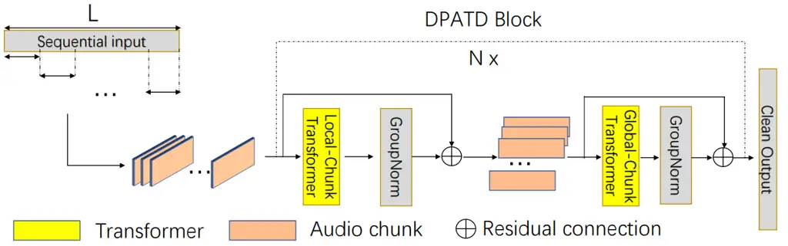
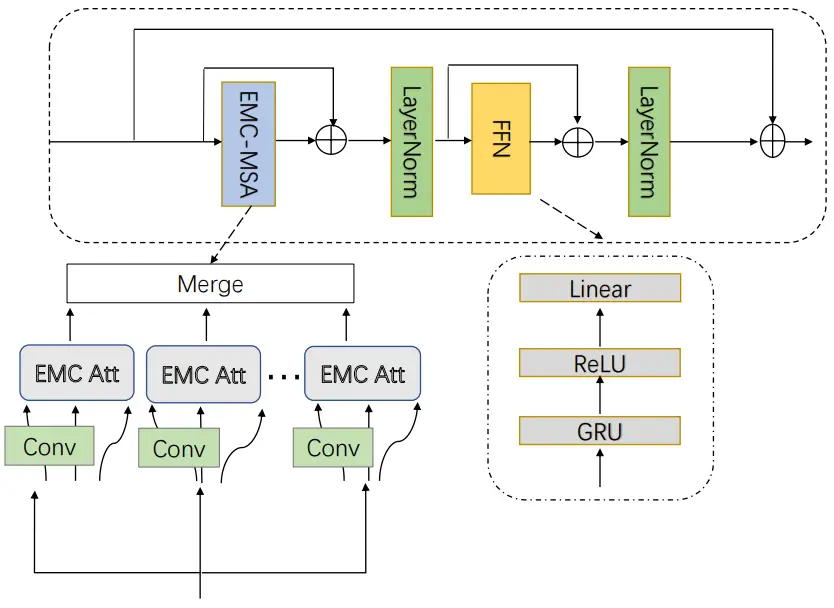
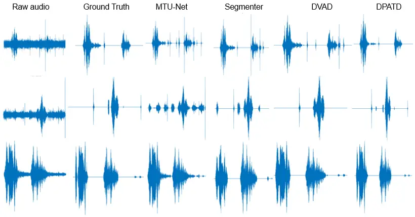

# DPATD: Dual-Phase Audio Transformer for Denoising

Junhui Li¹, Pu Wang², Jialu Li³, Xinzhe Wang⁴, Youshan Zhang ⁵
Affiliation: ¹²Department of Mathematics, School of Science, University
of Science and Technology, Liaoning, Anshan, China  
⁴School of business administration, University of Science and
Technology, Liaoning, Anshan, China  
Email: ¹Junhui_lee@foxmail.com, ²120203803006@stu.ustl.edu.cn,
⁴1946378145@qq.com Affiliation: ³School of public policy, Cornell
University, Ithaca, NY, USA. Email: jl4284@cornell.edu
Affiliation: ⁵Department of Artificial Intelligence and Computer
Science, Yeshiva University, New York, NY, USA  
Email: youshan.zhang@yu.edu

###### Abstract

Recent high-performance transformer-based speech enhancement models
demonstrate that time domain methods could achieve similar performance
as time-frequency domain methods. However, time-domain speech
enhancement systems typically receive input audio sequences consisting
of a large number of time steps, making it challenging to model
extremely long sequences and train models to perform adequately. In this
paper, we utilize smaller audio chunks as input to achieve efficient
utilization of audio information to address the above challenges. We
propose a dual-phase audio transformer for denoising (DPATD), a novel
model to organize transformer layers in a deep structure to learn clean
audio sequences for denoising. DPATD splits the audio input into smaller
chunks, where the input length can be proportional to the square root of
the original sequence length. Our memory-compressed explainable
attention is efficient and converges faster compared to the frequently
used self-attention module. Extensive experiments demonstrate that our
model outperforms state-of-the-art methods.

###### Index Terms: 

Audio denoising, transformer, audio chunks

## I Introduction

Speech signals are inevitably accompanied by various types of background
noise in daily environments, such as automatic speech recognition
systems, hearing aids, vehicles and mobile phones, aircraft cockpits,
and multi-party conferencing devices \[1\]. In the field of speech
communication, constructing efficient models to eliminate background
noise is still a difficult challenge. The goal of speech enhancement
learning is to find a transformation that makes clean speech readily
available from the original audio. Recent achievements in transfer
learning from extensive generative language models serve as a major
source of inspiration for our work. There are two main challenges: (1)
audio signals are continuous while textual representations are discrete;
and (2) the decoder is responsible for generating text that is very
different from traditional speech representation. Our efforts focus on
directly creating an audio-denoising model that can learn efficiently
and applied to a variety of datasets.

The transformer was originally proposed for natural language processing
(NLP) tasks \[2\] and has recently become popular in the fields of
computer vision (CV) \[3\] and audio processing (AP) \[4\]. The
transformer model can effectively solve the long-term dependency problem
and can run well in parallel, showing good performance on many natural
language processing tasks. Transformer-based methods also show promising
performance in audio denoising. Yu et al. \[5\] proposed a dual-branch
federative magnitude and phase estimation framework, named DBT-Net, for
monaural speech enhancement, aiming at recovering the coarse- and
fine-grained regions of the overall spectrum in parallel. Wang et
al. \[6\] proposed a two-stage transformer neural network for end-to-end
speech denoising in the time domain. Yu et al. \[7\] proposed a
cognitive computing-based speech enhancement model termed SETransformer
to improve speech quality in unknown noisy environments, which takes
advantage of the LSTM and multi-head attention mechanisms. Dand et
al. \[8\] proposed a dual-path transformer-based full-band and sub-band
fusion network (DPT-FSNet) for speech enhancement in the frequency
domain.

Speech typically requires long-range sequence modeling, convolutional
neural networks necessitate a greater number of convolutional layers to
expand the receptive field and thus continuously increase model
complexity. In many natural language processing and visual tasks,
self-attention transformer-based neural networks outperform deep
learning models, which are constructed based on convolutional neural
networks (CNNs) \[9\]. Additionally, RNN models can be commonly utilized
for modeling long-term sequences with sequential information, such as
the Long Short-Term Memory (LSTM) and Gated Recurrent Unit (GRU) \[10\].
However, RNN-based models are unable to be processed in parallel due to
the temporal structure of RNNs, leading to suboptimal computational
efficiency and increased complexity. Recent studies have demonstrated
that a self-attention methodology can be used for audio denoising, which
will relieve the challenges associated with modeling long-sequence
speech signals \[4\]. The ability to learn efficiently from raw audio is
crucial for constructing speech models for speech enhancement.

Inspired by the capability of the transformer in sequence modeling, we
aim to develop an efficient transformer approach that enhances audio
quality by learning general and meaningful speech features. We propose a
dual-phase audio transformer for denoising (DPATD) that incorporates
explainable attention and memory-compressed attention. The intuition is
to divide the input audio into shorter chunks and interleave dual-phase
transformers, a local-chunk transformer and a global-chunk transformer
for local and global modeling, respectively. Additionally, to solve
low-occupancy or unneeded shared memory reads and writes on the GPU, we
employ FlashAttention-2, a unique attention algorithm with superior work
partitioning \[11\]. The contributions of this work are threefold:

1.  1.  We propose a dual-phase audio transformer that facilitates the
        modeling of audio signals by organizing transformer layers. It first
        segments the input audio into shorter chunks and employs dual-phase
        transformers in an interleaved manner, namely, a local-chunk
        transformer for local modeling and a global-chunk transformer for
        global modeling.
2.  2.  We develop a novel transformer block that combines explainable
        attention and memory-compressed attention to conserve memory
        resources and provide interpretable attention maps that are
        noise-resistant and align with informative input patterns naturally.
3.  3.  Our extensive experiments on two benchmark datasets demonstrate that
        the DPATD outperforms state-of-the-art methods across all evaluation
        criteria while maintaining a relatively low model complexity.



Fig. 1: System flowchart of the DPATD model. The segmentation stage
splits an audio input into chunks without overlaps and concatenates them
to form a 2-D tensor. The transformer block, which consists of
local-chunk and global-chunk transformers, is applied to individual
chunks in parallel to process information. Multiple blocks are stacked
to increase the total depth of the network. A 2-D output of the last
block is converted back to an audio output.

## II Related work

Traditional speech denoising techniques. Traditional speech denoising
techniques primarily rely on statistical techniques that can be utilized
to build relevant denoising models and extract clean audio from noisy
input signals. The denoising performance can be improved by the Wiener
filter \[12\]. Linden et al. \[13\] decomposed a spectral graph into a
spectral basis matrix and an encoding matrix. After the different sound
sources are reconstructed based on the clustering of the basis matrix
and the corresponding encoding information, the noise components are
removed to facilitate more accurate monitoring of biological sounds.
Paliwal and Basu  \[14\] proposed a Kalman filtering method to improve
speech enhancement performance. Ali et al. \[15\] focused on the
denoising of phonocardiogram (PCG) signals using different families of
discrete wavelet transforms, thresholding types and techniques, and
signal decomposition levels.

Deep learning for speech enhancement. Different speech enhancement
models based on deep neural networks have steadily taken center stage
with the advancement of deep learning technology. Based on different
model inputs, current voice augmentation techniques for DNNs can be
broadly divided into two groups: time-domain (T) techniques and
time-frequency domain (TF) techniques. Time-domain techniques employ an
end-to-end model that directly estimates clean waveforms using audio
data in the time domain as raw waveform inputs. The architecture
foundation for time-domain approaches is WaveNet \[16\]. The majority of
speech enhancement techniques currently focus on the time-frequency
domain of speech. The TF techniques use the short-time Fourier transform
(STFT) and the inverse short-time Fourier transform (ISTFT). The latest
frequency-domain model, Band-Split RNN, explicitly splits the
spectrogram of the mixture into subbands and performs interleaved
band-level and sequence-level modeling for speech enhancement \[17\].

## III Motivation

Most existing deep learning-based audio denoising methods study the
magnitude spectrum of images for audio denoising. However, these methods
can be constrained by computing power or limited filtering image
regions, resulting in low denoising performance. The transformer
applications in audio enhancement are still limited. Inspired by neural
network approaches to text, our model encodes audio information and is
trained to understand what clean audio should look like. Basically, we
regard the audio signal as an ”audio sequence” and further segment it
into smaller chunks. The attention of each audio chunk will be
calculated based on other chunks in the given audio sequence.

## IV Model

In this section, we first review the audio denoising task, provide the
motivation for our model, then conduct an in-depth analysis of the
architecture of our dual-phase audio transformer for denoising (DPATD).
Our model first splits the input audio into several audio chunks and
encodes the audio sequence. Sequentially, generated sequence vectors are
fed into a dual-phase transformer to train to minimize the difference
between denoised audio and clean audio. Finally, we get the denoised
audio as shown in Fig. 1.

We assume that the mixture speech signal $`y(t)`$ is a linear sum of the
clean speech signal $`x(t)`$ and noise $`\varepsilon(t)`$, and the noisy
speech $`y(t)`$ can be typically expressed as Eq. (1):

```math
y(t)=x(t)+\varepsilon(t). \tag{1}
```

### IV-A Segmentation

Our DPATD framework first splits the input audio into several local
chunks,then calculates both representations and their relationship. The
segmentation stage encodes the audio sequence using patch embedding with
the maximum audio sequence size. The smaller utterances are zero-padded
to match the size of the maximum audio sequence. Given a sequence of
acoustic input vectors $`Y(y_{1},y_{2},\cdots,y_{L})\in R^{1\times L}`$
where $`L`$ is the audio sequence length, the segmentation stage splits
$`Y`$ into chunks of length $`K`$ and hop size $`P`$. Every sample in
$`Y`$ appears and only appears in chunks, generating $`M`$ equal size
chunks $`D_{m}\in R^{1\times K},m=1,\cdots,M`$. All chunks are then
concatenated together to form a 2-D tensor
$`T=[D_{1},\cdots,D_{M}]\in R^{K\times M}`$. Positional embeddings are
added to patch embeddings to preserve positional information. We use
standard learnable 1D position embeddings since the audio input is an
ordered sequence. The segmentation output tensor $`T`$ is then passed to
the stack of $`N`$ transformer blocks. Each block converts a 2-D tensor
input to another tensor with the same shape. We denote the input tensor
for block $`\textbf{Z}=1,\cdots,Z`$ as $`T_{z}\in R^{K\times M}`$, where
$`T_{1}=T.`$ The segmentation phase of the model is shown in Fig. 1.

### IV-B Dual-Phase Audio Transformer

Basic Architecture. Since the input noisy audio and the output enhanced
audio have the same length, we introduce a simple but effective
modification to the transformer for audio sequences by removing the
encoder module (almost reducing model parameters by half for a given
hyper-parameter set). Each transformer block contains two sub-modules.
As shown in Fig. 2, the first module is a Memory-Compressed Explainable
Multi-Heads Attention (MCE-MSA). This attention consists of explainable
multi-heads attention and memory-compressed attention. The second module
is a simple, position-wise, fully connected feed-forward network. In
addition, inspired by the effectiveness of RNNs in tracking ordered
sequential information, we replace the first fully connected layer of
the feed-forward network with a GRU layer to learn more positional
information. A residual connection was employed around each of the two
sub-modules, followed by layer normalization.



Fig. 2: The architecture of the DPAT block. The Explainable Multi-Head
Attention (E-MHA) module is capable of providing interpretable attention
maps that are noise-resistant and align with informative input patterns
naturally. We utilize a strided convolution to limit the dot products
between $`Q`$ and $`K`$. We replace the first fully connected layer of
the feed-forward network with a GRU layer to learn more positional
information.

### IV-C Explainable Memory-Compressed Attention.

Memory-Compressed Attention To handle longer sequences, we modify the
multi-head attention to reduce memory usage by limiting the dot products
between $`Q`$ and $`K`$ in Eq. (3). To achieve this goal, we take
advantages of a strided convolution with convolution kernels of size 3
with stride 3. Since the memory cost of attention is constant for each
block, this alteration allows us to maintain the linear relationship
between the number of activations and the length of the sequence \[18\].

Explainable Multi-Heads Attention. In our work, attention blocks employ
$`h=8`$ heads (the number of parallel attention layers) and map the
input $`h`$ times to get $`Q`$, $`K`$, and $`V`$ representations,
respectively, as described in Eq. (2). Given an input $`Y`$, each head
$`H_{h}`$ holds an explainable attention weight
$`A_{h}\in\mathcal{R}^{N\times d}`$ that represents the relative
importance of input features. $`A_{h}`$ aims to learn explainable
features for the output through the MCE-MSA mechanism.

```math
Q_{i}=YW^{Q}_{i},\ K_{i}=YW^{K}_{i},\ V_{i}=YW^{V}_{i}, \tag{2}
```

where $`Y\in R^{d\times k}`$ is the input with sequence of length $`L`$
and dimension $`d`$, $`i=1,2,\cdots,h`$ and
$`Q_{i},K_{i},V_{i}\in R^{l\times d/h}`$ are the mapped queries, keys
and values respectively.
$`W^{Q}_{i},W^{K}_{i},W^{V}_{i}\in R^{d\times d/h}`$ denote the $`i`$-th
linear transformation matrix for queries, keys, and values,
respectively.

The self-attention operation is constructed by Eq. (3). $`W`$ implies
how much attention is paid to each token.

```math
Att(Q,K,V)=softmax(\frac{QK^{T}}{\sqrt{d_{k}}})V=softmax(W)V. \tag{3}
```

The attention weight $`A`$ is defined as:

```math
A=\mathcal{L}(W+b)^{T}, \tag{4}
```

where $`b`$ is a trainable bias term, which is introduced as an initial
alignment for the input patterns. $`\mathcal{L}`$ is a non-linear
function that scales the L2 norm of its input.

In follows, the self-attention feature $`P`$ is formally expressed as:

```math
P=A^{T}V, \tag{5}
```

According to Eq. (4), $`\|A\|\leq 1`$. There $`P`$ in Eq. (5) is
upper-bounded as follows:

```math
P=\|A\|\||V|\|cos(A,V)\leq\|V\|. \tag{6}
```

When Eq. (6) is optimized, the attention weight $`A`$ is proportional to
$`V`$. In order to achieve maximal output, $`A`$ is driven to align with
the discriminative features in $`V`$, instead of the uninformative
noise. Therefore, $`P`$ can only achieve this upper bound if all
possible solutions of $`v\in V`$ are encoded as eigenvectors in the
weight $`A`$. This maximization suggests that with the attention weight
$`A`$, we will obtain an inherently explainable decomposition of input
patterns.

In our work, whole sequential explainable and memory-compressed
transformer blocks are computed as:

```math
\displaystyle S^{l}=MCE-MSA(Z^{l-1}), \tag{7}
```

```math
\displaystyle Z^{l}=LayerNorm(Z+S^{l}), \tag{8}
```

```math
\displaystyle FFN(Z^{l})=ReLU(GRU(Z^{l})W_{1}+b_{1})W_{2}+b_{2}, \tag{9}
```

```math
\displaystyle Output=LN(Z^{l}+FFN(Z^{l})), \tag{10}
```

where $`LayerNorm(\cdot)`$ is the LayerNorm layer, $`FFN(\cdot)`$
denotes the output of the position-wise feed-forward network, and
$`W_{1}\in R^{d_{ff}\times d},b_{1}\in R^{d}`$ and $`d_{f}f=4\times d`$.

### IV-D Dual-phase Audio Transformer module

The dual-phase audio transformer module consists of four stacked
dual-chunk transformer blocks. Each block converts an input 2-D tensor
into another tensor with the same shape. We propose a dual-phase
transformer block based on explainable and memory-compressed attention.
As shown in Fig.1, it has a local-chunk transformer and a global-chunk
transformer, which extract local and global information, respectively.
More specifically, the input is a 2-D tensor ($`[K,S]`$), and the
local-chunk transformer is first applied to individual chunks to
parallelly process inter information, which performs on the last
dimension $`F`$ of the input tensor. Then, the global-chunk transformer
is used to fuse the information of the output from the local-chunk
transformer to learn global dependency, which is implemented on the
dimension of the tensor. Besides, each transformer is followed by the
group normalization operation and utilizes residual connections.

Decoder. We use the patch-expanding layer in the decoder to upsample the
extracted deep features. The 2-D convolution with a filter size of
(1, 1) recovers the channel dimension of the enhanced speech feature
into 1 and produces the enhanced speech waveform by an overlap-add
method.

Loss Function. The time-domain loss is based on the mean square error
(MSE) between the input clean audio $`(x_{1},x_{2},\cdots,x_{N})`$ and
the predicted audio$`(\hat{x}_{1},\hat{x}_{2},\cdots,\hat{x}_{N})`$. The
model is optimized by minimizing the MSE, which is defined as:

```math
Loss=\frac{1}{N}\sum_{i-1}^{N-1}(x_{i}-\hat{x}_{i})^{2}, \tag{11}
```

where $`N`$ denotes the number of samples.

The overall training algorithm is shown in Alg. 1.

1:  Input: Mixture audio signals $`Y=\{y_{i}\}_{i=1}^{N}`$ and clean
audio input $`X=\{x_{i}\}_{i=1}^{N}`$, where $`N`$ is the total sample
number of audios.

2:  Output: Denoised audio signals: $`\hat{X}`$

3:  Segmentation splits the input audio into a 2-D tensor
$`T=[D_{1},\cdots,D_{M}]`$ using 1-D CNNs.

4:  for $`iter=1`$ to $`I`$ do

5:   Derive batch-wise data: $`Y^{k}`$ and $`X^{k}`$ sampled from
$`B(Y)`$ and $`B(X)`$

6:   Optimize our audio generation model DPATD using Eq. (11)

7:  end for

8:  Output the denoised audio signals

Algorithm 1 DPATD: Dual-Phase Audio Transformer for Denoising. Batch of
audio input: $`B(Y)=\{Y^{1},...,Y^{n_{B}}\}`$, and their clean audio
input $`B(X)=\{X^{1},...,X^{n_{B}}\}`$, where $`{n_{B}}`$ is the total
number of batch. $`I`$ is the number of iterations

## V Experimental Procedures

### V-A Dataset

VCTK+DEMAND dataset. We validate the effectiveness of our proposed model
on a standard speech dataset  \[19\]. The clean speech datasets are
selected from the Voice Bank Corpus, including a training set of 11572
utterances from 28 speakers and a test set of 872 utterances from 2
speakers.

BirdSoundsDenoising. This dataset uses a variety of natural noises, such
as wind, rain, waterfalls, etc., in place of the normal intentionally
generated noise \[20\]. In particular, the dataset contains 14,120
audios from one second to fifteen seconds and is a large-scale dataset
of bird sounds collected, containing 10,000/1,400/2,720 in training,
validation, and testing sets, respectively.



Fig. 3: Denoising results comparisons. Raw audio is the original noisy
audio.

### V-B Implementation details

We train the DPATD model for 100 epochs on mini-batches of 8 random
samples, where the segment chunk size is set to 1000. We used the Adam
optimization scheme with a maximum learning rate of 2.5e-4. Since the
layernorm layer is extensively used throughout the model, a simple
weight initialization of $`N(0,0.02)`$ was adequate. For the activation
function, we used the Gaussian Error Linear Unit (GELU). We used the
learned position embeddings instead of the sinusoidal version proposed
in the original work. With a single NVIDIA GTX 3060 GPU and PyTorch to
implement our model, it took around 180 hours of GPU time to train our
model. The smaller utterances in a batch are zero-padded to the largest
size of utterances. A dynamic strategy is used to adjust the learning
rate during the training stage \[21\].

Model configurations. The configuration of our model structure partially
follows the original transformer architecture. We trained a 12-layer
decoder-only transformer with self-attention heads (1000 dimensional
states and 12 attention heads). Here, we focus on explainable and memory
compression attention to effectively compute and conserve memory. For
the position-wise feed-forward networks, we used 4000-dimensional inner
states. Consider the sum of the input audio length in a signal block
denoted by $`K\times S`$ where the hop size is set to be the same as the
embedding size. It is simple to see that $`S=[L/K]`$ where $`[\cdot]`$
is the ceiling function. To achieve the minimum total input length
$`K+S=K+[L/K]`$, $`K`$ is selected such that $`K\approx sqrt(5L)`$. This
gives us sublinear input length$`(O(sqrt(L))`$ rather than the original
linear input length $`(O(L))`$.

|                    |            |         |          |         |        |         |          |         |
| ------------------ | ---------- | ------- | -------- | ------- | ------ | ------- | -------- | ------- |
| Networks           | Validation |         |          |         | Test   |         |          |         |
|                    | $`F1`$     | $`IoU`$ | $`Dice`$ | $`SDR`$ | $`F1`$ | $`IoU`$ | $`Dice`$ | $`SDR`$ |
| U²-Net \[22\]      | 60.8       | 45.2    | 60.6     | 7.85    | 60.2   | 44.8    | 59.9     | 7.70    |
| MTU-NeT \[23\]     | 69.1       | 56.5    | 69.0     | 8.17    | 68.3   | 55.7    | 68.3     | 7.96    |
| Segmenter \[24\]   | 72.6       | 59.6    | 72.5     | 9.24    | 70.8   | 57.7    | 70.7     | 8.52    |
| SegNet \[25\]      | 77.5       | 66.9    | 77.5     | 9.55    | 76.1   | 65.3    | 76.2     | 9.43    |
| DVAD \[20\]        | 82.6       | 73.5    | 82.6     | 10.33   | 81.6   | 72.3    | 81.6     | 9.96    |
| R-CED \[26\]       | $`-`$      | $`-`$   | $`-`$    | 2.38    | $`-`$  | $`-`$   | $`-`$    | 1.93    |
| Noise2Noise \[27\] | $`-`$      | $`-`$   | $`-`$    | 2.40    | $`-`$  | $`-`$   | $`-`$    | 1.96    |
| TS-U-Net \[28\]    | $`-`$      | $`-`$   | $`-`$    | 2.48    | $`-`$  | $`-`$   | $`-`$    | 1.98    |
| DPATD              | $`-`$      | $`-`$   | $`-`$    | 10.49   | $`-`$  | $`-`$   | $`-`$    | 10.43   |

TABLE I: Results comparisons of different methods ($`F1,IoU`$, and
$`Dice`$ scores are multiplied by 100. “$`-`$” means not applicable.

### V-C Result

Tab. II shows the comparison results of the VCTK+DEMAND dataset. Our
model surpasses most waveform-based approaches now in use in terms of
the PESQ score and achieves performance that is equivalent to other
methods in other evaluation metrics. For the BirdSoundsDenoising
dataset, we report the performance of eight state-of-the-art baselines.
The results are shown in Tab. I, where the bold text indicates the best
outcomes for each statistic. The results demonstrate that our model
outperforms other state-of-the-art methods in terms of the SDR. Results
of F1, IoU, and Dice are not included because these metrics are used for
the audio image segmentation task \[29, 30\]. The comparisons of raw
bird audio, ground truth labeled denoised audio, and denoised audio of
other models are shown in Fig. 3. Additionally, our model bears more
resemblance to the labeled denoised signal. As a consequence, our model
enhances the audio-denoising capabilities of the BirdSoundDenoising
dataset.

| Methods             | Domain | PESQ | STOI  | CSIG | CBAK | COVL |
| ------------------- | ------ | ---- | ----- | ---- | ---- | ---- |
| PGGAN \[31\]        | T      | 2.81 | 0.944 | 3.99 | 3.59 | 3.36 |
| DCCRGAN \[32\]      | TF     | 2.82 | 0.949 | 4.01 | 3.48 | 3.40 |
| S-DCCRN \[33\]      | TF     | 2.84 | 0.940 | 4.03 | 2.97 | 3.43 |
| TSTNN \[6\]         | T      | 2.96 | 0.950 | 4.33 | 3.53 | 3.67 |
| PHASEN \[34\]       | TF     | 2.99 | $`-`$ | 4.18 | 3.45 | 3.50 |
| DEMUCS \[35\]       | T      | 3.07 | 0.95  | 4.31 | 3.40 | 3.63 |
| SE-Conformer \[36\] | T      | 3.13 | 0.95  | 4.45 | 3.55 | 3.82 |
| MetricGAN+ \[37\]   | TF     | 3.15 | 0.927 | 4.14 | 3.12 | 3.52 |
| MANNER \[38\]       | T      | 3.21 | 0.950 | 4.53 | 3.65 | 3.91 |
| CMGAN \[39\]        | T      | 3.41 | 0.96  | 4.63 | 3.94 | 4.12 |
| DPATD               | T      | 3.55 | 0.97  | 4.78 | 3.96 | 4.22 |

TABLE II: Comparison results on the VoiceBank-DEMAND dataset. “$`-`$”
means not applicable.

Ablation study. First, we examine the performance of our method by
comparing it with different transformer layers and the effect of chunks
in segmentation. In order to further demonstrate the effectiveness of
our proposed transformer block, we also designed another architecture
for comparison. In this architecture, we use different transformer
blocks rather than the 12 blocks in the DPATD, and we increase or reduce
the number of heads. In addition, we also set chunk sizes at 500 and
2000, while only 1000 in our DPATD. From Tab.III, a 12-transformer-block
DPATD has better scores than other models. As shown in Tab.III, the
chunk has only a slight influence on the performance, and we use
chunk=1000 by default for its efficiency.

| Heads | 6    | 8    | 12   | 16   |
| ----- | ---- | ---- | ---- | ---- |
| PESQ  | 2.99 | 3.23 | 3.45 | 3.15 |
|       |      |      |      |      |

| Chunks | 500  | 1000 | 2000 |
| ------ | ---- | ---- | ---- |
| PESQ   | 3.26 | 3.45 | 3.38 |
|        |      |      |      |

TABLE III: Effect of layers and chunks in transformer block in the
DPATD.

## VI Conclusion

In this study, we present a framework for using a dual-phase audio
transformer for denoising (DPATD) to provide robust speech enhancement.
The DPATD splits the audio input into non-overlapping chunks in the
segmentation stage, which are then passed as input to the transformer
model. In a DPAT block, the local-chunk transformer and global-chunk
transformer process the local chunks and all the chunks, respectively.
We modified the transformer model using explainable multi-head attention
and memory-compressed attention. Extensive experiments on datasets have
demonstrated the effectiveness and superiority of the proposed DPATD
architecture. Finally, our method is still computationally demanding,
and future directions of the work could improve on these limitations.

## References

- \[1\] Wenbin Jiang, Zhijun Liu, Kai Yu, and Fei Wen. Speech
  enhancement with neural homomorphic synthesis. In ICASSP 2022-2022
  IEEE International Conference on Acoustics, Speech and Signal
  Processing (ICASSP), pages 376–380. IEEE, 2022.
- \[2\] Ashish Vaswani, Noam Shazeer, Niki Parmar, Jakob Uszkoreit,
  Llion Jones, Aidan N Gomez, Łukasz Kaiser, and Illia Polosukhin.
  Attention is all you need. Advances in neural information processing
  systems, 30, 2017.
- \[3\] Zhengsu Chen, Lingxi Xie, Jianwei Niu, Xuefeng Liu, Longhui Wei,
  and Qi Tian. Visformer: The vision-friendly transformer. In
  Proceedings of the IEEE/CVF international conference on computer
  vision, pages 589–598, 2021.
- \[4\] Cem Subakan, Mirco Ravanelli, Samuele Cornell, Mirko Bronzi, and
  Jianyuan Zhong. Attention is all you need in speech separation. In
  ICASSP 2021-2021 IEEE International Conference on Acoustics, Speech
  and Signal Processing (ICASSP), pages 21–25. IEEE, 2021.
- \[5\] Guochen Yu, Andong Li, Hui Wang, Yutian Wang, Yuxuan Ke, and
  Chengshi Zheng. Dbt-net: Dual-branch federative magnitude and phase
  estimation with attention-in-attention transformer for monaural speech
  enhancement. IEEE/ACM Transactions on Audio, Speech, and Language
  Processing, 30:2629–2644, 2022.
- \[6\] Kai Wang, Bengbeng He, and Wei-Ping Zhu. Tstnn: Two-stage
  transformer based neural network for speech enhancement in the time
  domain. In ICASSP 2021-2021 IEEE International Conference on
  Acoustics, Speech and Signal Processing (ICASSP), pages 7098–7102.
  IEEE, 2021.
- \[7\] Weiwei Yu, Jian Zhou, HuaBin Wang, and Liang Tao. Setransformer:
  Speech enhancement transformer. Cognitive Computation, pages
  1–7, 2022.
- \[8\] Feng Dang, Hangting Chen, and Pengyuan Zhang. Dpt-fsnet:
  Dual-path transformer based full-band and sub-band fusion network for
  speech enhancement. In ICASSP 2022-2022 IEEE International Conference
  on Acoustics, Speech and Signal Processing (ICASSP), pages 6857–6861.
  IEEE, 2022.
- \[9\] Hu Cao, Yueyue Wang, Joy Chen, Dongsheng Jiang, Xiaopeng Zhang,
  Qi Tian, and Manning Wang. Swin-unet: Unet-like pure transformer for
  medical image segmentation. In Computer Vision–ECCV 2022 Workshops:
  Tel Aviv, Israel, October 23–27, 2022, Proceedings, Part III, pages
  205–218. Springer, 2023.
- \[10\] Yi Luo, Zhuo Chen, and Takuya Yoshioka. Dual-path rnn:
  efficient long sequence modeling for time-domain single-channel speech
  separation. In ICASSP 2020-2020 IEEE International Conference on
  Acoustics, Speech and Signal Processing (ICASSP), pages 46–50.
  IEEE, 2020.
- \[11\] Tri Dao. Flashattention-2: Faster attention with better
  parallelism and work partitioning. arXiv preprint
  arXiv:2307.08691, 2023.
- \[12\] Marwa A Abd El-Fattah, Moawad I Dessouky, Alaa M Abbas,
  Salaheldin M Diab, El-Sayed M El-Rabaie, Waleed Al-Nuaimy, Saleh A
  Alshebeili, and Fathi E Abd El-samie. Speech enhancement with an
  adaptive wiener filter. International Journal of Speech Technology,
  17:53–64, 2014.
- \[13\] Tzu-Hao Lin, Shih-Hua Fang, and Yu Tsao. Improving biodiversity
  assessment via unsupervised separation of biological sounds from
  long-duration recordings. Scientific reports, 7(1):4547, 2017.
- \[14\] K Paliwal and Anjan Basu. A speech enhancement method based on
  kalman filtering. In ICASSP’87. IEEE International Conference on
  Acoustics, Speech, and Signal Processing, volume 12, pages 177–180.
  IEEE, 1987.
- \[15\] Mohammed Nabih Ali, EL-Sayed A El-Dahshan, and Ashraf H Yahia.
  Denoising of heart sound signals using discrete wavelet transform.
  Circuits, Systems, and Signal Processing, 36:4482–4497, 2017.
- \[16\] Daniel Stoller, Sebastian Ewert, and Simon Dixon. Wave-u-net: A
  multi-scale neural network for end-to-end audio source separation.
  arXiv preprint arXiv:1806.03185, 2018.
- \[17\] Jianwei Yu and Yi Luo. Efficient monaural speech enhancement
  with universal sample rate band-split rnn. In ICASSP 2023-2023 IEEE
  International Conference on Acoustics, Speech and Signal Processing
  (ICASSP), pages 1–5. IEEE, 2023.
- \[18\] Peter J Liu, Mohammad Saleh, Etienne Pot, Ben Goodrich, Ryan
  Sepassi, Lukasz Kaiser, and Noam Shazeer. Generating wikipedia by
  summarizing long sequences. arXiv preprint arXiv:1801.10198, 2018.
- \[19\] Cassia Valentini-Botinhao, Xin Wang, Shinji Takaki, and Junichi
  Yamagishi. Speech enhancement for a noise-robust text-to-speech
  synthesis system using deep recurrent neural networks. In Interspeech,
  volume 8, pages 352–356, 2016.
- \[20\] Youshan Zhang and Jialu Li. Birdsoundsdenoising: Deep visual
  audio denoising for bird sounds. In Proceedings of the IEEE/CVF Winter
  Conference on Applications of Computer Vision, pages 2248–2257, 2023.
- \[21\] Jingjing Chen, Qirong Mao, and Dong Liu. Dual-path transformer
  network: Direct context-aware modeling for end-to-end monaural speech
  separation. arXiv preprint arXiv:2007.13975, 2020.
- \[22\] Xuebin Qin, Zichen Zhang, Chenyang Huang, Masood Dehghan,
  Osmar R Zaiane, and Martin Jagersand. U2-net: Going deeper with nested
  u-structure for salient object detection. Pattern recognition,
  106:107404, 2020.
- \[23\] Hongyi Wang, Shiao Xie, Lanfen Lin, Yutaro Iwamoto, Xian-Hua
  Han, Yen-Wei Chen, and Ruofeng Tong. Mixed transformer u-net for
  medical image segmentation. In ICASSP 2022-2022 IEEE International
  Conference on Acoustics, Speech and Signal Processing (ICASSP), pages
  2390–2394. IEEE, 2022.
- \[24\] Robin Strudel, Ricardo Garcia, Ivan Laptev, and Cordelia
  Schmid. Segmenter: Transformer for semantic segmentation. In
  Proceedings of the IEEE/CVF international conference on computer
  vision, pages 7262–7272, 2021.
- \[25\] Vijay Badrinarayanan, Alex Kendall, and Roberto Cipolla.
  Segnet: A deep convolutional encoder-decoder architecture for image
  segmentation. IEEE transactions on pattern analysis and machine
  intelligence, 39(12):2481–2495, 2017.
- \[26\] Se Rim Park and Jinwon Lee. A fully convolutional neural
  network for speech enhancement. arXiv preprint arXiv:1609.07132, 2016.
- \[27\] Madhav Mahesh Kashyap, Anuj Tambwekar, Krishnamoorthy Manohara,
  and S Natarajan. Speech denoising without clean training data: A
  noise2noise approach. arXiv preprint arXiv:2104.03838, 2021.
- \[28\] Eloi Moliner and Vesa Välimäki. A two-stage u-net for
  high-fidelity denoising of historical recordings. In ICASSP 2022-2022
  IEEE International Conference on Acoustics, Speech and Signal
  Processing (ICASSP), pages 841–845. IEEE, 2022.
- \[29\] Junhui Li, Pu Wang, and Youshan Zhang. Deeplabv3+ vision
  transformer for visual bird sound denoising. IEEE Access, 2023.
- \[30\] Youshan Zhang and Jialu Li. Complex Image Generation
  SwinTransformer Network for Audio Denoising. In Proc. INTERSPEECH
  2023, pages 186–190, 2023.
- \[31\] Yihao Li, Meng Sun, and Xiongwei Zhang. Perception-guided
  generative adversarial network for end-to-end speech enhancement.
  Applied Soft Computing, 128:109446, 2022.
- \[32\] Huixiang Huang, Renjie Wu, Jingbiao Huang, Jucai Lin, and Jun
  Yin. Dccrgan: Deep complex convolution recurrent generator adversarial
  network for speech enhancement. In 2022 International Symposium on
  Electrical, Electronics and Information Engineering (ISEEIE), pages
  30–35. IEEE, 2022.
- \[33\] Shubo Lv, Yihui Fu, Mengtao Xing, Jiayao Sun, Lei Xie, Jun
  Huang, Yannan Wang, and Tao Yu. S-dccrn: Super wide band dccrn with
  learnable complex feature for speech enhancement. In ICASSP 2022-2022
  IEEE International Conference on Acoustics, Speech and Signal
  Processing (ICASSP), pages 7767–7771. IEEE, 2022.
- \[34\] Dacheng Yin, Chong Luo, Zhiwei Xiong, and Wenjun Zeng. Phasen:
  A phase-and-harmonics-aware speech enhancement network. In Proceedings
  of the AAAI Conference on Artificial Intelligence, volume 34, pages
  9458–9465, 2020.
- \[35\] Alexandre Défossez, Gabriel Synnaeve, and Yossi Adi. Real time
  speech enhancement in the waveform domain. 2020.
- \[36\] Eesung Kim and Hyeji Seo. Se-conformer: Time-domain speech
  enhancement using conformer. In Interspeech, pages 2736–2740, 2021.
- \[37\] Szu-Wei Fu, Cheng Yu, Tsun-An Hsieh, Peter Plantinga, Mirco
  Ravanelli, Xugang Lu, and Yu Tsao. Metricgan+: An improved version of
  metricgan for speech enhancement. arXiv preprint
  arXiv:2104.03538, 2021.
- \[38\] Hyun Joon Park, Byung Ha Kang, Wooseok Shin, Jin Sob Kim, and
  Sung Won Han. Manner: Multi-view attention network for noise erasure.
  In ICASSP 2022-2022 IEEE International Conference on Acoustics, Speech
  and Signal Processing (ICASSP), pages 7842–7846. IEEE, 2022.
- \[39\] Ruizhe Cao, Sherif Abdulatif, and Bin Yang. Cmgan:
  Conformer-based metric gan for speech enhancement. arXiv preprint
  arXiv:2203.15149, 2022.
