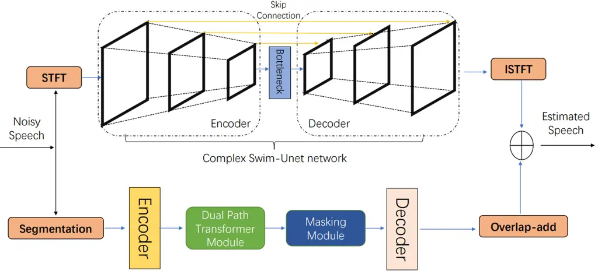
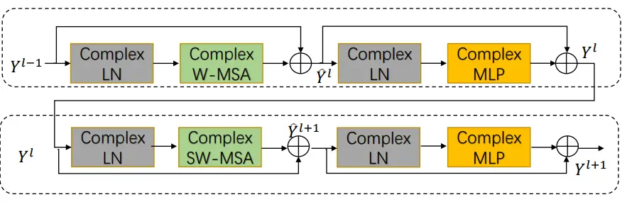
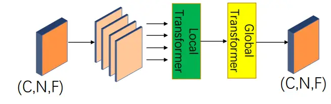
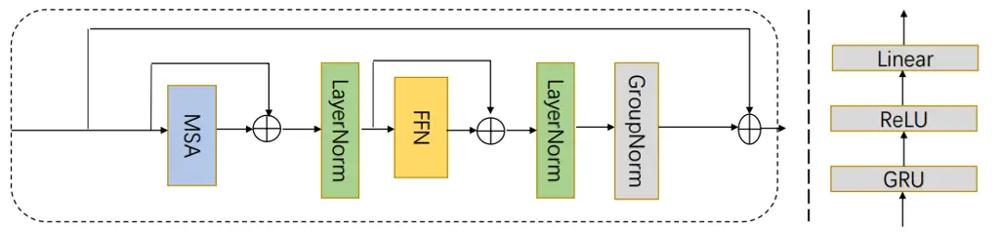
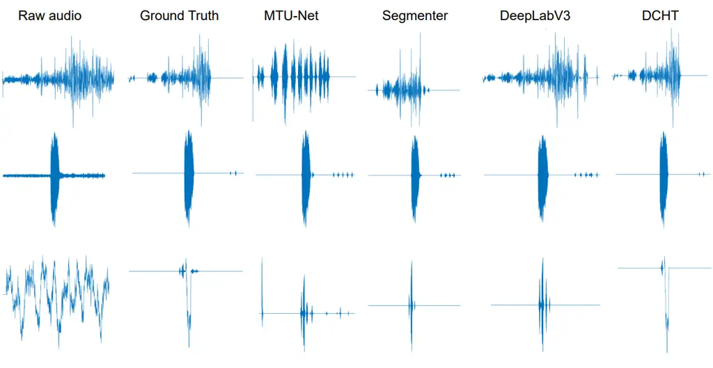

# DCHT: Deep Complex Hybrid Transformer for Speech Enhancement

Jialu Li¹, Junhui Li², Pu Wang³, Youshan Zhang ⁴ Affiliation: ¹School of
public policy, Cornell University, Ithaca, NY, USA. Email:
jl4284@cornell.edu Affiliation: ²²Department of Mathematics, School of
Science, University of Science and Technology, Liaoning, Anshan, China  
Email: ²120203803006@stu.ustl.edu.cn, ³Junhui_lee@foxmail.com
Affiliation:  Affiliation: ⁴Department of Artificial Intelligence and
Computer Science, Yeshiva University, New York, NY, USA  
Email: youshan.zhang@yu.edu

###### Abstract

Most of the current deep learning-based approaches for speech
enhancement only operate in the spectrogram or waveform domain. Although
a cross-domain transformer combining waveform- and spectrogram-domain
inputs has been proposed, its performance can be further improved. In
this paper, we present a novel deep complex hybrid transformer that
integrates both spectrogram and waveform domains approaches to improve
the performance of speech enhancement. The proposed model consists of
two parts: a complex Swin-Unet in the spectrogram domain and a dual-path
transformer network (DPTnet) in the waveform domain. We first construct
a complex Swin-Unet network in the spectrogram domain and perform speech
enhancement in the complex audio spectrum. We then introduce improved
DPT by adding memory-compressed attention. Our model is capable of
learning multi-domain features to reduce existing noise on different
domains in a complementary way. The experimental results on the
BirdSoundsDenoising dataset and the VCTK+DEMAND dataset indicate that
our method can achieve better performance compared to state-of-the-art
methods.

###### Index Terms: 

complex deep neural network, speech enhancement, hybrid transformer

## I Introduction

Speech enhancement (SE) is a challenging task in the field of voice
communication since it aims to recover enhanced speech from speech
interference with background noise in life. Many voice communication
systems may be influenced by background noise, including automatic
speech recognition, vehicles, and multi-party conferencing
equipment\[1\]. In response to this issue, a variety of speech
enhancement algorithms have been proposed to somewhat minimize noise
interference. To address issues such as performance degradation or the
challenge of modeling realistic and complicated circumstances, these
speech enhancement methods still need to be improved.

Recently, deep neural networks (DNNs) have demonstrated potential for
speech enhancement. DNNs for speech enhancement is a crucial front-end
approach that takes noisy speech as an input and creates an enhanced
speech output for better speech quality and intelligibility. In general,
current methods for speech enhancement can be classified into two main
categories based on the type of model input. The first category utilizes
raw time-domain waveforms, while the latter relies on time-frequency
(TF) domain representations. Time-domain methods generally use an
end-to-end model to directly estimate and output a clean waveform by
taking audio data in the time domain as raw waveform input \[2\]. For TF
domain methods, they first apply a short-time Fourier transform (STFT)
algorithm to transform the input mixed signal into a complex-valued
spectrogram, which is subsequently decomposed into its magnitude and
phase components. Conventional TF domain techniques utilize the
magnitude as a training target while ignoring the phase. Estimated audio
signals are then reconstructed via the inverse short-time Fourier
transform (ISTFT). However, the frameworks of the time domain are unable
to accurately capture speech phonetics in the frequency domain due to
the absence of direct frequency representation \[3\]. Besides, most
TF-domain methods only take magnitude as input to real-valued parametric
models while ignoring complex-valued phases due to the difficulty in
estimation, which may limit performance.

In this paper, we investigate the potential of fully end-to-end speech
enhancement systems that combine the fragmented benefits of time-domain
and TF-domain audio representations, which specialize in tackling
specific types of noise. We design a novel speech enhancement
transformer framework that involves two speech signal processing
modules: a proposed variant of Swin-Unet, named Deep Complex Swin-Unet
(DCSUnet), in the time-frequency domain, and an improved dual-path
transformer network (DPTnet) in the time-domain. We also introduce a
novel cross-domain loss function combining both time- and time-frequency
domain losses. Our contributions are as follows:

- •
  We propose a novel complex transformer architecture, deep complex
  Swin-Unet, which combines the advantages of both complex-valued
  networks and Swin-Net, achieving state-of-the-art performance. We
  extend the transformer network operator to the complex domain so that
  it can efficiently model the correlation between the elements of real
  and imaginary parts of the complex sequence features for a potentially
  richer representation.
- •
  We improve DPTnet by adding memory-compressed attention and propose a
  hybrid network that combines complex Swin-Net with improved DPTnet
  named DCHT. The model has a new loss function and performs better than
  other state-of-the-art audio denoising algorithms on the Voice
  Bank+DEMAND dataset and the BirdSoundsDenoising dataset.
- •
  Our model utilizes time- and TF-domain representation as input to
  exploit multi-scale features and effectively extract both time-domain
  and TF-domain information. The model considers the noise phase
  information from DCSUnet and extracts local and global audio
  information from improved DPTnet to exploit the new research
  techniques for speech enhancement.

## II Related Work

Time-frequency Domain Speech Enhancement. Most speech enhancement
techniques operate in the time-frequency domain. The complex-valued
phase has mostly been ignored, and the majority of methods only estimate
the speech magnitude spectrum with reused noisy phase data \[4\].
Recently, applying complex spectrograms with complex-valued neural
network blocks has become popular because it offers a rich
representation. Deep complex U-Net was proposed by incorporating
advanced U-Net structures and complex-valued blocks to deal with
complex-valued spectrograms \[5\]. Particularly, the Deep Complex
Convolution Recurrent Network (DCCRN) was designed to simulate
complex-valued operations using complex networks \[6\]. Complex-valued
transformers have also been designed for speech enhancement. Tan et
al. \[7\] presented a complex transformer module with sparse attention
to low-SNR speech enhancement tasks. Zhang and Li \[8\] converted the
audio denoising problem into an image generation task and proposed a
complex image generation SwinTransformer network for audio denoising.

Time Domain Speech Enhancement. The time-domain speech enhancement
approach is a method that operates directly on the time-domain mixture
speech waveform to predict the clean speech waveform \[9\]. Dario et
al. \[10\] proposed an end-to-end learning method for speech denoising
based on Wavenet. Baby and Verhulst \[11\] introduced a conditional
generative adversarial network with a gradient penalty for improved
speech enhancement performance. With the popularity of attention
mechanisms, Kong et al. \[12\] presented CleanUNet for speech
enhancement, which utilized an encoder-decoder architecture combined
with self-attention blocks to refine its bottleneck representations.
Transformer can now process input audio sequences in parallel, much like
natural language processing. Yu et al. \[13\] proposed a speech
enhancement transformer (SETransformer) that takes advantage of Long
Short Term Memory (LSTM) and multi-head attention mechanisms to improve
speech quality.

Hybrid Domain Speech Enhancement. Recently, there has been a trend where
speech enhancement models combine time and TF domains. Kim et al. \[14\]
proposed a two-steam neural network with both TF domain and time-domain
branches to separate music stems. Using a bi-U-Net structure, Alexandre
et al.  \[15\] refined the Demucs architecture and built an end-to-end
hybrid source separation model blending time and TF domains to improve
the quality of music source separation. Furthermore, Simon et al.
 \[16\] introduced a transformer architecture to model the hybrid
transform Demucs network for Music Source Separation (MSS) tasks based
on Hybrid Demucs.

## III Method

We first introduce hybrid transformer models, followed by describing
deep complex Swin-Unet and improved DPTNet, respectively. Before getting
into details, we assume that the mixture of a speech signal $`y(t)`$ is
the linear sum of the clean speech signal $`x(t)`$ and the noise speech
signal $`\varepsilon(t)`$, so the noisy speech $`y(t)`$ can be expressed
as:

```math
y(t)=x(t)+\varepsilon(t), \tag{1}
```

A sequence of a mixture signal and a clean signal is defined as
$`Y=\{y_{i}\}_{i=1}^{N}`$ and $`X=\{x_{i}\}_{i=1}^{N}`$, where $`N`$ is
the total number of speech signals. Typically, each of the corresponding
time-frequency $`(k,f)`$ noise reduction operates in the time-frequency
domain  \[17\]:

```math
Y_{k,f}=X_{k,f}+\epsilon_{k,f}, \tag{2}
```

where $`Y_{k,f},X_{k,f},\epsilon_{k,f}`$ is the STFT representation of
the time domain signal $`y(t)`$, $`x(t)`$, $`\varepsilon(t)`$ and $`k`$,
$`f`$ are the time frame index and frequency bins index. In polar
coordinates,  (2) becomes:

```math
|Y_{k,f}|e^{i\theta_{Y_{k,f}}}=|X_{k,f}|e^{\theta_{X_{k,f}}}+|N_{k,f}|e^{i\theta_{\epsilon_{k,f}}}, \tag{3}
```

where $`|\cdot|`$ denotes the magnitude response and $`\theta`$ denotes
the phase response. The imaginary unit is represented by $`i`$.

A complex-valued convolutional filter is defined as $`W=A+iB`$ with
real-valued matrices $`A`$ and $`B`$, which represent the real and
imaginary part of a complex convolution kernel, respectively. At the
same time, we can get complex output from the complex convolution
operation on complex vector $`h=x+iy`$ with $`W`$:
$`W\times h=(A\times x-B\times y)+i(B\times x+A\times y)`$.

### III-A Hybrid Transformer Model

In this section, we introduce the overall structure of the DCHT model.
The overall progress of the proposed model is presented in Figure. 1.
The proposed model, which extends transformer network architecture with
multi-domain representation, comprises two SE approaches: the complex
Swin-Unet and improved DPTnet. The complex Swin-Unet module consists of
an encoder, a bottleneck, a decoder, and skip connections. The basic
unit of Swin-Unet is the Swin Transformer Block. The proposed complex
Swin transformer block is a refined transformer architecture applied in
the TF domain. The output of the spectral branch is transformed into a
waveform using ISTFT before summed with the output of the temporal
branch, giving the actual prediction of the model. The improved DPTnet
introduces direct context awareness in the speech sequences modeling by
combining memory compression attention, which is efficient for long
speech sequence modeling. It learns the order information of the speech
sequences without positional encoding by incorporating gated recurrent
units (GRU). The 1-D signal from the waveform branch and the 2-D signal
from the spectral branch are treated simultaneously. With these
modifications, we performed the experiments in Section IV.



Fig. 1: A overall progress of our proposed hybrid transformer
architecture for speech enhancement.

### III-B Complex Swin-Unet Module

The architecture of the original Swin-Unet is based on the Swin
Transformer, which exhibits outstanding performance on computer vision
tasks. The modifications made to the original Swin transformer are as
follows: The convolutional layers of the Swin transformer blocks are
replaced by complex convolutional layers. Complex normalization, complex
dropout, and complex linear layers are also implemented to the
transformer. To accept complex input and output features, we modified
real-value Layernormalization (each token is independently normalized)
and real-value softmax into complex Layernormalization and complex
softmax. For the activation function, we modified the real-value GeLU
into the complex-value GeLU. We use the encoder to extract the
hierarchical feature representations from the transformed patch tokens
using complex Swin transformer blocks and patch merging layers. The
symmetric decoder reshapes each stage feature map and restores the
resolution of the feature maps to the input resolution. Skip connections
are used to combine multiscale information from the encoder and context
features from the decoder to improve the reconstruction of the denoised
images.

In practice, the target has to be estimated. Choosing an appropriate
training target is crucial for supervised learning since it is directly
related to the underlying computational target. The target magnitude
spectrum of clean speech is a commonly used training target in typical
mapping-based approaches. We consider the complex short-time spectrogram
of the noisy speech $`Y`$, the noise $`N`$, and the clean speech $`X`$,
obtained via the discrete Fourier transform of windowed frames of the
raw signals. The estimated speech spectrogram $`\hat{Y}_{k,f}`$ is
computed by multiplying the estimated mask $`\hat{M}_{k,f}`$ to the
input spectrogram $`X_{k,f}`$ as Eq. (4). More formally, we need to
train a prediction model $`F`$ to predict the mask, and the output is
$`\hat{M}_{k,f}=F(X_{k,f})`$. When the mask connection is not applied,
the network directly outputs the estimated complex spectrum, i.e.,
$`\hat{Y}_{k,f}=F_{k,f}`$.

```math
\hat{Y}_{k,f}=\hat{M}_{k,f}\cdot X_{k,f}=|\hat{M}_{k,f}|\cdot|X_{k,f}|\cdot e^{i(\theta_{\hat{M}_{k,f}}+\theta_{X_{k,f}})}. \tag{4}
```

By applying an additional bounding process, the proposed complex-valued
mask $`\hat{M}_{k,f}`$ is expressed as follows:

```math
\displaystyle\hat{M}_{k,f}=|\hat{M}_{k,f}|\cdot e^{i\theta_{M_{k,f}}}=\hat{M}_{k,f}^{mag}\cdot\hat{M}_{k,f}^{phase}, \tag{5}
```

```math
\displaystyle\hat{M}_{k,f}^{mag}=tanh(|F_{k,f}|),\hat{M}_{k,f}^{phase}=F_{k,f}/|F_{k,f}|.
```

Complex Swin Transformer Block The complex Swin transformer block (CSTB)
is responsible for feature representation learning. Unlike the
conventional multi-head self-attention-based transformer, the Swin
Transformer \[18\] has a hierarchical architecture whose representation
is computed using shifted-windows multi-head self-attention. In
Figure. 2, each CSTB mainly consists of two successive units: the
complex window multi-head self-attention (complex W-MSA) unit and the
complex shifted-window multi-head self-attention (complex SW-MSA) unit.
Each complex LayerNorm (complex LN) is implemented before the complex
MSA module, and each complex 2-layer MLP with complex non-linearity GELU
and the remaining connections are implemented before and after each
module.



Fig. 2: The architecture of Complex Swin Transformer block module.

On the basis of the shifted window partitioning mechanism, the whole
sequential complex Swin transformer blocks are computed as:

```math
\displaystyle\hat{Y}^{L} \displaystyle=complex\quad W-MSA(cLN(Y^{L-1}))+Y^{L-1}, \tag{6}
```

```math
\displaystyle Y^{L} \displaystyle=complex\ MLP(cLN(\hat{Y}^{L}))+\hat{Y}^{L},
```

```math
\displaystyle\hat{Y}^{L+1} \displaystyle=complex\ SW-MSA(cLN(Y^{L}))+Y^{L},
```

```math
\displaystyle Y^{L+1} \displaystyle=complex\ MLP(cLN(\hat{Y}^{L+1}))+\hat{Y}^{L+1}.
```

### III-C Improve Dual-path Transformer module

In this section, we use the improve Dual-path transformer neural network
to train the raw speech waveform input \[19\]. This network is suggested
for processing long-distance speech sequences. It is inspired by the
transformer’s ability to interpret sequences and the dual-path network’s
ability to gather contextual data \[20\]. DPTnet consists of an encoder,
a DPTnet module (DPTM), a mask module, and a decoder, as shown in
Figure 1. DPTM is composed of four stacked dual-path transformer blocks
to efficiently extract local and global information. Due to its few
trainable parameters, the model complexity of DPTnet is significantly
lower.



(a) The Improve Dual-path transformer block.



(b) Transformer architecture

Fig. 3: (a) The Improve Dual-path transformer block module; (b)
Transformer architecture.

Dual-Path Transformer Block. In the DPTnet extraction module, we
substitute the Dual-Path Transformer Block (DPTB) for the traditional
transformer block. As shown in Figure 3(a), DPTB is between the encoder
and decoder, which has a local transformer and a global transformer to
extract local and global contextual information from long-range speech
sequences. The input is a 3-D tensor$`([C,N,F^{\prime}])`$, and in order
to process local information in parallel, the local transformer is first
applied to individual chunks. This process works on the input tensor’s
final dimension $`F^{\prime}`$. Subsequently, the global transformer is
employed to combine the data from the local transformer’s output in
order to ascertain global dependency, which is applied to the tensor’s
dimension $`N`$. For the DPTB structure, the transformer only uses the
encoder part since the input mixtures and output-enhanced sequences have
the same length in speech denoising. Since the speech sequence is
time-dependent, the transformer structure in DPTB removes the positional
encoding part. As shown in Figure 3(b), the first fully connected layers
of feed-forward and linear normalization are replaced with a GRU layer
and layer normalization, respectively. The procedures are defined as
follows:

```math
\displaystyle\hat{z}_{i} \displaystyle=LayerNorm(MSA(z_{i-1})+z_{i-1}), \tag{7}
```

```math
\displaystyle z_{i} \displaystyle=LayerNorm(\hat{z}_{i}+ReLU(GRU(\hat{z}_{i})W+b)).
```

### III-D Cross-domain Loss Function

In this study, our composite model integrates T-F and time streams to
extract a set of complementary audio features. Therefore, our loss
function consists of time-domain loss and TF-domain loss to fully
utilize both feature information. Inspired by the L1 norm of a complex
number in  \[21\], we take the STFT of the audio and use L1 loss over
the L1 norm of the STFT coefficients. The frequency-domain loss is given
by:

```math
\displaystyle loss_{L_{1},TF}(y,\hat{y}) \displaystyle=\frac{1}{TF}\sum_{t=0}^{T-1}\sum_{t=0}^{F-1}[(|y_{r}(t,f)|-|\hat{y}_{r}(t,f)|) \tag{8}
```

```math
\displaystyle+(|y_{i}(t,f)|-|\hat{y}_{i}(t,f)|)],
```

where $`y`$ and $`\hat{y}`$ denote the spectrum of the clean speech and
the spectrum of the enhanced speech, respectively. $`r`$ and $`i`$ are
the real and imaginary parts of the complex spectrogram. $`T`$ and $`F`$
are the number of frames and the number of frequency bins, respectively.

The time-domain loss is based on the energy-conserving loss function
proposed, which simultaneously considers clean speech and noise signals.
The time-domain loss is defined as follows:

```math
loss_{L_{1},T}(y,\hat{y},x,n)=\|y-\hat{y}\|_{1}+\|n-\hat{n}\|_{1}, \tag{9}
```

where $`y`$ and $`\hat{y}`$ are the samples of the clean speech and the
enhanced speech, respectively. $`\hat{n}=x-\hat{y}`$ represents the
estimated noise and $`\|\cdot\|`$ denotes $`L_{1}`$ norm.

To properly balance the contribution of these two loss terms and address
the scale insensitivity problem, we weigh ($`\alpha`$) each term
proportionally to the energy of each speech. The final form of the loss
function is as follows:

```math
\displaystyle loss_{Total}(y,\hat{y})=\alpha loss_{L_{1},TF}+(1-\alpha)loss_{L_{1},T}. \tag{10}
```

## IV Experiments

### IV-A Dataset

VCTK+DEMAND dataset. We validate the effectiveness of our proposed model
on a small-scale standard speech dataset from \[22\]. In this widely
used noisy speech database, clean speech datasets are selected from the
Voice Bank Corpus \[23\], including a training set of 11,572 utterances
from 28 speakers and a test set of 872 utterances from 2 speakers.

BirdSoundsDenoising. We also train our proposed model on
BirdSoundsDenoising. This dataset replaces the usual artificially added
noise with natural noises, including wind, waterfalls, rain, etc. In
particular, the dataset contains 14,120 audios from one second to
fifteen seconds and is a large-scale dataset of bird sounds collected,
containing 10,000/1,400/2,720 in training, validation, and testing
datasets, respectively \[24\].

| Methods           | Domain | PESQ | STOI  | CSIG | CBAK | COVL |
| ----------------- | ------ | ---- | ----- | ---- | ---- | ---- |
| CP-GAN \[25\]     | T      | 2.64 | 0.942 | 3.93 | 3.33 | 3.28 |
| PGGAN \[26\]      | T      | 2.81 | 0.944 | 3.99 | 3.59 | 3.36 |
| DCCRGAN \[27\]    | TF     | 2.82 | 0.949 | 4.01 | 3.48 | 3.40 |
| S-DCCRN \[28\]    | TF     | 2.84 | 0.940 | 4.03 | 2.97 | 3.43 |
| DCU-Net \[5\]     | TF     | 2.93 | 0.930 | 4.10 | 3.77 | 3.52 |
| PHASEN \[29\]     | TF     | 2.99 | $`-`$ | 4.18 | 3.45 | 3.50 |
| MetricGAN+ \[30\] | TF     | 3.15 | 0.927 | 4.14 | 3.12 | 3.52 |
| TSTNN \[19\]      | T      | 2.96 | 0.950 | 4.33 | 3.53 | 3.67 |
| MANNER \[31\]     | T      | 3.21 | 0.950 | 4.53 | 3.65 | 3.91 |
| DCHT              | T+TF   | 3.41 | 0.954 | 4.78 | 3.82 | 4.22 |

TABLE I: Comparison results on the VoiceBank-DEMAND dataset. “$`-`$”
means not applicable.

### IV-B Implementation details

Our model is an end-to-end trainable model without any pre-trained
networks and implemented by PyTorch with a single NVIDIA GTX 3060 GPU.
All the utterances are resampled to 16 kHz. Each frame has a size of 512
samples (32ms) with an overlap of 256 samples (16ms). Within a batch,
the smaller utterances are zero-padded to match the size of the largest
utterance. We select the best model using the validation dataset.

At the training stage, we train our model for 100 epochs and optimize it
using the Adam algorithm. We use gradient clipping with a maximum of
L2-norm of 5 to avoid gradient explosion \[19\]. For learning rate, we
use the dynamic strategies during the training stage \[32\].

### IV-C Evaluation metrics

We evaluate the proposed speech enhancement model on the VCTK+DEMAND
dataset using several objective metrics: PESQ, STOI, CSIG, CBAK, and
COVL, for overall quality evaluation. A structure similarity is also
used. For evaluation on the Birdsoundsdenoising dataset, we apply
signal-to-distortion ratio (SDR) \[24\] to evaluate our model.

| Networks         | Validation |         |          |         | Test   |         |          |         |
| ---------------- | ---------- | ------- | -------- | ------- | ------ | ------- | -------- | ------- |
|                  | $`F1`$     | $`IoU`$ | $`Dice`$ | $`SDR`$ | $`F1`$ | $`IoU`$ | $`Dice`$ | $`SDR`$ |
| U²-Net \[33\]    | 60.8       | 45.2    | 60.6     | 7.85    | 60.2   | 44.8    | 59.9     | 7.70    |
| MTU-NeT \[34\]   | 69.1       | 56.5    | 69.0     | 8.17    | 68.3   | 55.7    | 68.3     | 7.96    |
| Segmenter \[35\] | 72.6       | 59.6    | 72.5     | 9.24    | 70.8   | 57.7    | 70.7     | 8.52    |
| U-Net \[36\]     | 75.7       | 64.3    | 75.7     | 9.44    | 74.4   | 62.9    | 74.4     | 8.92    |
| SegNet \[37\]    | 77.5       | 66.9    | 77.5     | 9.55    | 76.1   | 65.3    | 76.2     | 9.43    |
| DVAD \[24\]      | 82.6       | 73.5    | 82.6     | 10.33   | 81.6   | 72.3    | 81.6     | 9.96    |
| DCHT             | -          | -       | -        | 10.49   | -      | -       | -        | 10.43   |

TABLE II: Results comparisons of different methods ($`F1,IoU`$, and
$`Dice`$ scores are multiplied by 100. “$`-`$” means not applicable.



Fig. 4: Results comparison on VCTK+DEMAND dataset. Raw audio is the
original mixture of audio. Ground Truth is the clean audio.

### IV-D Results

We compare our proposed model with several state-of-the-art baseline
models. The results on the BirdSoundsDenoising dataset are shown in
Table II \[38\], with the best results in each metric highlighted in
boldface. The second to fifth columns are the results of validation, and
the latter results are of testing. The results demonstrate that our
model outperforms other state-of-the-art methods in terms of SDR. Since
these metrics are employed for the audio image segmentation task, the
results of F1, IoU, and Dice are ignored \[39\].

We also conduct extra experiments on the VCTK+DEMAND dataset. As shown
in Table  I, the proposed method is compared with other methods in terms
of PESQ, STOL, CSIG, CBAK, COVL, and SSIM. The results indicate that our
proposed model outperforms other DNNs-based models and achieves
state-of-the-art performance in metrics. The comparisons of raw bird
audio, ground truth labeled clean audio, and the estimation audio from
several models are displayed in Figure 4. Our model produces results
more similar to the labeled clean signal.

### IV-E Ablation Studies

Experimental results in the previous subsection show that our method
improves SE performance. To further verify the effectiveness of our
proposed model and show the importance of each component of our model,
we perform an ablation study by gradually replacing the components in
our model. We designed three experiments labeled the DPTnet-only model,
the DCSUnet-only model, and the full model. Table III shows ablation
results for the DPTnet-only model and the CSwinUnet-only model,
comparing to the full model. Note that the model performance degrades
significantly without the CSwin-Unet module.

|    Model             | Metric |
| -------------------- | ------ |
| ComplexSwinUnet-only | 60.8   |
| Improve DPTNET-only  | 69.1   |
| Full Model           | 72.6   |

TABLE III: Ablation Results.

## V Conclusion

In this paper, we propose a deep complex hybrid transformer for speech
enhancement. The DCHT model combines two types of methods: the deep
complex Swin-Unet transformer and the dual-path transformer neural
network, performing in parallel to exploit a complementary set of
features for speech enhancement. The deep complex Swin-Unet transformer
improves the Swin-Unet networks for complex-valued spectrum modeling.
Similarly, the improved DPTnet applies memory-compress attention to
reduce memory usage. The proposed DCHT model is evaluated and compared
with several current mainstream deep learning-based SE methods using
different datasets. The experimental results show that our model can
better remove noise in speech and show significant improvements in
evaluation metrics.

## References

- \[1\] Yen-Ju Lu, Zhong-Qiu Wang, Shinji Watanabe, Alexander Richard,
  Cheng Yu, and Yu Tsao. Conditional diffusion probabilistic model for
  speech enhancement. In ICASSP 2022-2022 IEEE International Conference
  on Acoustics, Speech and Signal Processing (ICASSP), pages 7402–7406.
  IEEE, 2022.
- \[2\] Santiago Pascual, Antonio Bonafonte, and Joan Serra. Segan:
  Speech enhancement generative adversarial network. arXiv preprint
  arXiv:1703.09452, 2017.
- \[3\] Ruizhe Cao, Sherif Abdulatif, and Bin Yang. Cmgan:
  Conformer-based metric gan for speech enhancement. arXiv preprint
  arXiv:2203.15149, 2022.
- \[4\] A Jansson, E Humphrey, N Montecchio, R Bittner, A Kumar, and
  T Weyde. Singing voice separation with deep u-net convolutional
  networks. In 18th International Society for Music Information
  Retrieval Conference, pages 23–27, 2017.
- \[5\] Hyeong-Seok Choi, Jang-Hyun Kim, Jaesung Huh, Adrian Kim,
  Jung-Woo Ha, and Kyogu Lee. Phase-aware speech enhancement with deep
  complex u-net. In International Conference on Learning
  Representations, 2019.
- \[6\] Yanxin Hu, Yun Liu, Shubo Lv, Mengtao Xing, Shimin Zhang, Yihui
  Fu, Jian Wu, Bihong Zhang, and Lei Xie. Dccrn: Deep complex
  convolution recurrent network for phase-aware speech enhancement.
  arXiv preprint arXiv:2008.00264, 2020.
- \[7\] Kaijun Tan, Wenyu Mao, Xiaozhou Guo, Huaxiang Lu, Chi Zhang,
  Zhanzhong Cao, and Xingang Wang. Cst: Complex sparse transformer for
  low-snr speech enhancement. Sensors, 23(5):2376, 2023.
- \[8\] Youshan Zhang and Jialu Li. Complex image generation
  swintransformer network for audio denoising. In Interspeech, 2023.
- \[9\] Craig Macartney and Tillman Weyde. Improved speech enhancement
  with the wave-u-net. arXiv preprint arXiv:1811.11307, 2018.
- \[10\] Dario Rethage, Jordi Pons, and Xavier Serra. A wavenet for
  speech denoising. In 2018 IEEE International Conference on Acoustics,
  Speech and Signal Processing (ICASSP), pages 5069–5073. IEEE, 2018.
- \[11\] Deepak Baby and Sarah Verhulst. Sergan: Speech enhancement
  using relativistic generative adversarial networks with gradient
  penalty. In ICASSP 2019-2019 IEEE International Conference on
  Acoustics, Speech and Signal Processing (ICASSP), pages 106–110.
  IEEE, 2019.
- \[12\] Zhifeng Kong, Wei Ping, Ambrish Dantrey, and Bryan Catanzaro.
  Speech denoising in the waveform domain with self-attention. In ICASSP
  2022-2022 IEEE International Conference on Acoustics, Speech and
  Signal Processing (ICASSP), pages 7867–7871. IEEE, 2022.
- \[13\] Weiwei Yu, Jian Zhou, HuaBin Wang, and Liang Tao.
  Setransformer: speech enhancement transformer. Cognitive Computation,
  pages 1–7, 2022.
- \[14\] Minseok Kim, Woosung Choi, Jaehwa Chung, Daewon Lee, and
  Soonyoung Jung. Kuielab-mdx-net: A two-stream neural network for music
  demixing. arXiv preprint arXiv:2111.12203, 2021.
- \[15\] Alexandre Défossez. Hybrid spectrogram and waveform source
  separation. arXiv preprint arXiv:2111.03600, 2021.
- \[16\] Simon Rouard, Francisco Massa, and Alexandre Défossez. Hybrid
  transformers for music source separation. arXiv preprint
  arXiv:2211.08553, 2022.
- \[17\] Andong Li, Minmin Yuan, Chengshi Zheng, and Xiaodong Li. Speech
  enhancement using progressive learning-based convolutional recurrent
  neural network. Applied Acoustics, 166:107347, 2020.
- \[18\] Ze Liu, Yutong Lin, Yue Cao, Han Hu, Yixuan Wei, Zheng Zhang,
  Stephen Lin, and Baining Guo. Swin transformer: Hierarchical vision
  transformer using shifted windows. In Proceedings of the IEEE/CVF
  international conference on computer vision, pages 10012–10022, 2021.
- \[19\] Kai Wang, Bengbeng He, and Wei-Ping Zhu. Tstnn: Two-stage
  transformer based neural network for speech enhancement in the time
  domain. In ICASSP 2021-2021 IEEE International Conference on
  Acoustics, Speech and Signal Processing (ICASSP), pages 7098–7102.
  IEEE, 2021.
- \[20\] Yi Luo, Zhuo Chen, and Takuya Yoshioka. Dual-path rnn:
  efficient long sequence modeling for time-domain single-channel speech
  separation. In ICASSP 2020-2020 IEEE International Conference on
  Acoustics, Speech and Signal Processing (ICASSP), pages 46–50.
  IEEE, 2020.
- \[21\] Sebastian Braun and Ivan Tashev. A consolidated view of loss
  functions for supervised deep learning-based speech enhancement. In
  2021 44th International Conference on Telecommunications and Signal
  Processing (TSP), pages 72–76. IEEE, 2021.
- \[22\] Cassia Valentini-Botinhao, Xin Wang, Shinji Takaki, and Junichi
  Yamagishi. Speech enhancement for a noise-robust text-to-speech
  synthesis system using deep recurrent neural networks. In Interspeech,
  volume 8, pages 352–356, 2016.
- \[23\] Christophe Veaux, Junichi Yamagishi, and Simon King. The voice
  bank corpus: Design, collection and data analysis of a large regional
  accent speech database. In 2013 international conference oriental
  COCOSDA held jointly with 2013 conference on Asian spoken language
  research and evaluation (O-COCOSDA/CASLRE), pages 1–4. IEEE, 2013.
- \[24\] Youshan Zhang and Jialu Li. Birdsoundsdenoising: Deep visual
  audio denoising for bird sounds. In Proceedings of the IEEE/CVF Winter
  Conference on Applications of Computer Vision, pages 2248–2257, 2023.
- \[25\] Gang Liu, Ke Gong, Xiaodan Liang, and Zhiguang Chen. Cp-gan:
  Context pyramid generative adversarial network for speech enhancement.
  In ICASSP 2020-2020 IEEE International Conference on Acoustics, Speech
  and Signal Processing (ICASSP), pages 6624–6628. IEEE, 2020.
- \[26\] Yihao Li, Meng Sun, and Xiongwei Zhang. Perception-guided
  generative adversarial network for end-to-end speech enhancement.
  Applied Soft Computing, 128:109446, 2022.
- \[27\] Huixiang Huang, Renjie Wu, Jingbiao Huang, Jucai Lin, and Jun
  Yin. Dccrgan: Deep complex convolution recurrent generator adversarial
  network for speech enhancement. In 2022 International Symposium on
  Electrical, Electronics and Information Engineering (ISEEIE), pages
  30–35. IEEE, 2022.
- \[28\] Shubo Lv, Yihui Fu, Mengtao Xing, Jiayao Sun, Lei Xie, Jun
  Huang, Yannan Wang, and Tao Yu. S-dccrn: Super wide band dccrn with
  learnable complex feature for speech enhancement. In ICASSP 2022-2022
  IEEE International Conference on Acoustics, Speech and Signal
  Processing (ICASSP), pages 7767–7771. IEEE, 2022.
- \[29\] Dacheng Yin, Chong Luo, Zhiwei Xiong, and Wenjun Zeng. Phasen:
  A phase-and-harmonics-aware speech enhancement network. In Proceedings
  of the AAAI Conference on Artificial Intelligence, volume 34, pages
  9458–9465, 2020.
- \[30\] Szu-Wei Fu, Cheng Yu, Tsun-An Hsieh, Peter Plantinga, Mirco
  Ravanelli, Xugang Lu, and Yu Tsao. Metricgan+: An improved version of
  metricgan for speech enhancement. arXiv preprint
  arXiv:2104.03538, 2021.
- \[31\] Hyun Joon Park, Byung Ha Kang, Wooseok Shin, Jin Sob Kim, and
  Sung Won Han. Manner: Multi-view attention network for noise erasure.
  In ICASSP 2022-2022 IEEE International Conference on Acoustics, Speech
  and Signal Processing (ICASSP), pages 7842–7846. IEEE, 2022.
- \[32\] Ashish Vaswani, Noam Shazeer, Niki Parmar, Jakob Uszkoreit,
  Llion Jones, Aidan N Gomez, Łukasz Kaiser, and Illia Polosukhin.
  Attention is all you need. Advances in neural information processing
  systems, 30, 2017.
- \[33\] Xuebin Qin, Zichen Zhang, Chenyang Huang, Masood Dehghan,
  Osmar R Zaiane, and Martin Jagersand. U2-net: Going deeper with nested
  u-structure for salient object detection. Pattern recognition,
  106:107404, 2020.
- \[34\] Hongyi Wang, Shiao Xie, Lanfen Lin, Yutaro Iwamoto, Xian-Hua
  Han, Yen-Wei Chen, and Ruofeng Tong. Mixed transformer u-net for
  medical image segmentation. In ICASSP 2022-2022 IEEE International
  Conference on Acoustics, Speech and Signal Processing (ICASSP), pages
  2390–2394. IEEE, 2022.
- \[35\] Robin Strudel, Ricardo Garcia, Ivan Laptev, and Cordelia
  Schmid. Segmenter: Transformer for semantic segmentation. In
  Proceedings of the IEEE/CVF international conference on computer
  vision, pages 7262–7272, 2021.
- \[36\] Olaf Ronneberger, Philipp Fischer, and Thomas Brox. U-net:
  Convolutional networks for biomedical image segmentation. In Medical
  Image Computing and Computer-Assisted Intervention–MICCAI 2015: 18th
  International Conference, Munich, Germany, October 5-9, 2015,
  Proceedings, Part III 18, pages 234–241. Springer, 2015.
- \[37\] Vijay Badrinarayanan, Alex Kendall, and Roberto Cipolla.
  Segnet: A deep convolutional encoder-decoder architecture for image
  segmentation. IEEE transactions on pattern analysis and machine
  intelligence, 39(12):2481–2495, 2017.
- \[38\] Junhui Li, Pu Wang, and Youshan Zhang. Deeplabv3+ vision
  transformer for visual bird sound denoising. IEEE Access, 2023.
- \[39\] Youshan Zhang and Jialu Li. Complex Image Generation
  SwinTransformer Network for Audio Denoising. In Proc. INTERSPEECH
  2023, pages 186–190, 2023.
