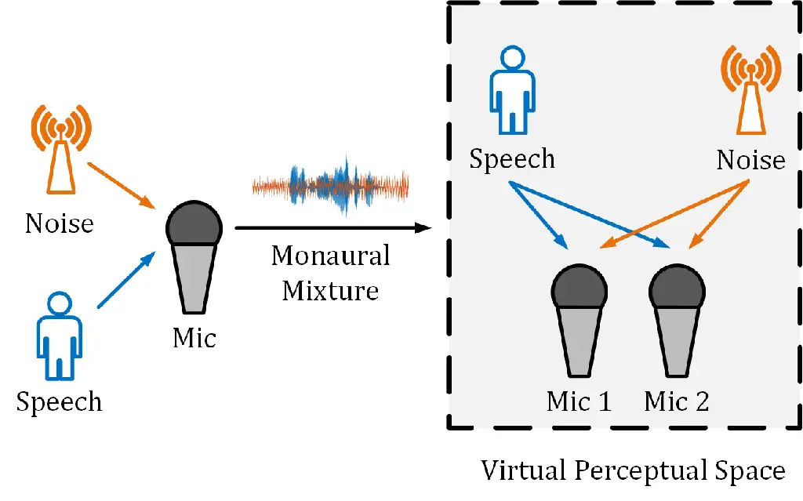
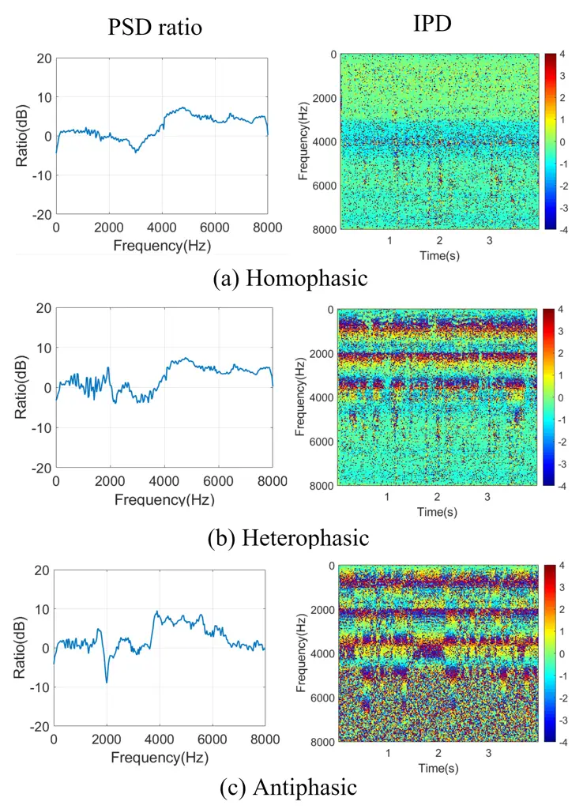
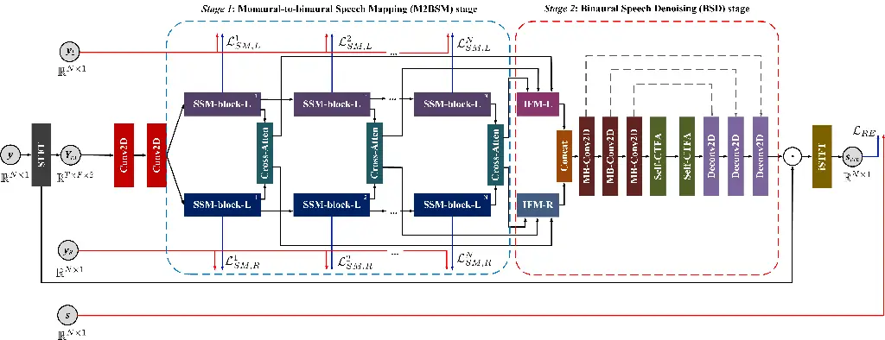
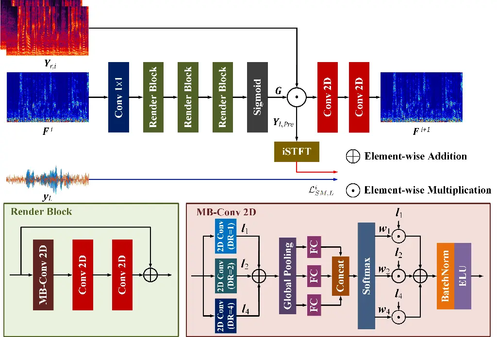
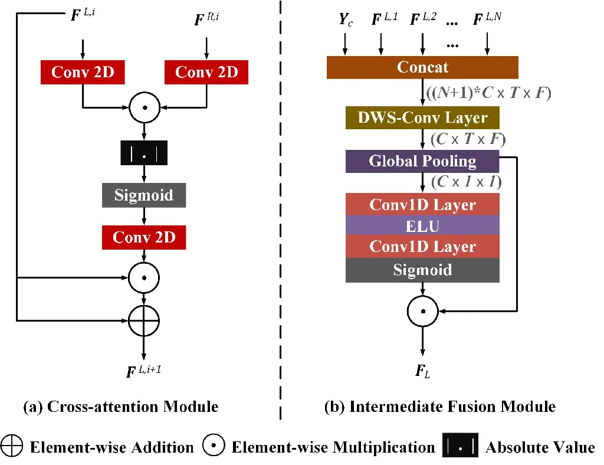
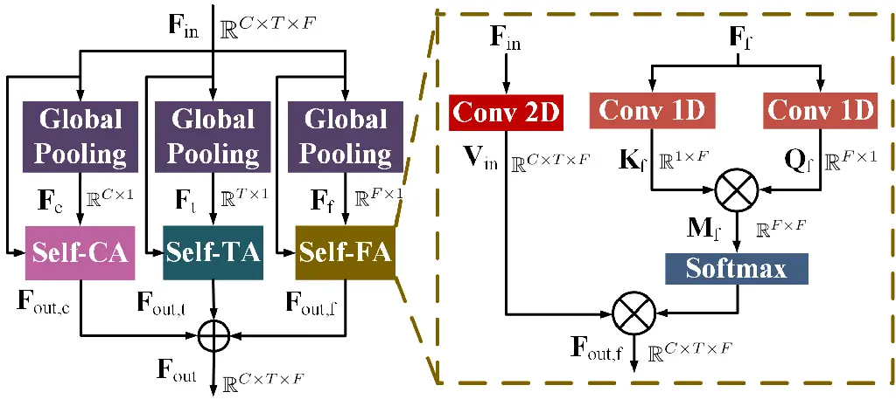
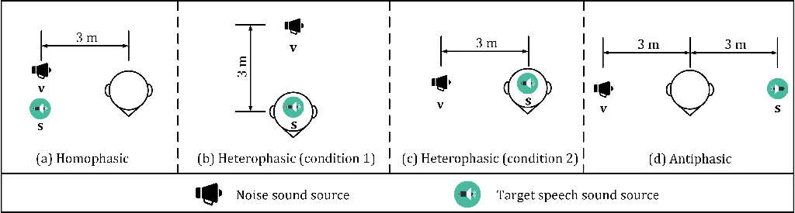

# SE Territory: Monaural Speech Enhancement Meets the Fixed Virtual Perceptual Space Mapping

Xinmeng Xu    Yuhong Yang    Weiping Tu

###### Abstract

Monaural speech enhancement has achieved remarkable progress recently.
However, its performance has been constrained by the limited spatial
cues available at a single microphone. To overcome this limitation, we
introduce a strategy to map monaural speech into a fixed simulation
space for better differentiation between target speech and noise.
Concretely, we propose SE-TerrNet, a novel monaural speech enhancement
model featuring a virtual binaural speech mapping network via a
two-stage multi-task learning framework. In the first stage, monaural
noisy input is projected into a virtual space using supervised speech
mapping blocks, creating binaural representations. These blocks
synthesize binaural noisy speech from monaural input via an ideal
binaural room impulse response. The synthesized output assigns speech
and noise sources to fixed directions within the perceptual space. In
the second stage, the obtained binaural features from the first stage
are aggregated. This aggregation aims to decrease pattern discrepancies
between the mapped binaural and original monaural features, achieved by
implementing an intermediate fusion module. Furthermore, this stage
incorporates the utilization of cross-attention to capture the injected
virtual spatial information to improve the extraction of the target
speech. Empirical studies highlight the effectiveness of virtual spatial
cues in enhancing monaural speech enhancement. As a result, the proposed
SE-TerrNet significantly surpasses the recent monaural speech
enhancement methods in terms of both speech quality and intelligibility.

¹National Engineering Research Center For Multimedia Software, Wuhan
University

²Hubei Luojia Laboratory

## Introduction

Speech enhancement (SE) stands as a crucial and formidable challenge in
the realm of speech applications. Its core objective is to extract clean
speech from noisy input signals (Loizou 2007; Getzmann, Jasny, and
Falkenstein 2017). Occupying a pivotal role in various speech-related
systems, SE finds applications spanning from speech recognition
front-ends to hearing aids tailored for individuals with hearing
impairments (Ma, Petridis, and Pantic 2022; Shon, Tang, and Glass 2019;
Wang 2017). SE methods can be classified into two distinct categories
based on the number of sensors or microphones utilized: monaural
(single-channel) and multi-channel (array-based) SE methods.

The monaural SE methods supply a simple but effective solution to the SE
tasks by processing speech signals from a single microphone. In recent
years, a plethora of monaural SE algorithms have emerged, falling into
two primary categories: statistical-based algorithms and
data-driven-based methods. The former encompasses techniques like
spectral subtraction (Boll 1979), Wiener filtering (Lim and Oppenheim
1979), minimum mean-square error (MMSE) estimator (Ephraim and Malah
1984), and the optimally modified log-spectral amplitude speech
estimator (Cohen and Berdugo 2001). On the other hand, data-driven-based
SE algorithms, primarily utilizing deep neural networks (DNNs), have
gained prominence. DNN-based approaches treat SE as a supervised
learning problem (Yin et al. 2020; Xu et al. 2021; Zheng et al. 2021),
enabling them to learn discriminative patterns of speech and noise
interference from training data. Despite their ability to capture speech
features in both time and frequency domains, DNN-based methods still
face limitations in performance, as extracting more discriminative
patterns from single-channel recordings remains challenging (Li et al.
2011; Hu and Loizou 2007a).



Figure 1: Demonstration of virtual perceptual space mapping, which aims
to map monaural speech to a binaural speech, in which the desired speech
and noise are set to be in an ideal and fixed direction that contains
more discriminative spatial cues. We achieve virtual perceptual space
mapping by utilizing an ideal binaural room impulse response (BRIR)
originating from the corresponding monaural mixture.

The preceding discussion pertains exclusively to monaural SE tasks.
However, exploiting spatial information can lead to further advancements
in SE performance (Wang, Wang, and Wang 2020; Xu, Gu, and Zou 2022;
Chakrabarty and Habets 2019). With access to multiple microphones, both
the spectral and spatial characteristics of speech and noise sources can
be harnessed, leading to a procedure that integrates spatiotemporal
information. Consequently, multi-channel SE frameworks exhibit reduced
speech distortion compared to monaural SE methods, making them more
suitable for real-world scenarios. Nonetheless, training a multi-channel
SE model with robust generalization capabilities demands a significant
number of noisy/clean speech pairs to effectively capture the variations
in the spatial distribution features of audio signals (Zhang and Li
2021; Zhang et al. 2021). Meeting this rigorous requirement for training
data may prove time-consuming and resource-intensive.

Through the above analysis, monaural and multi-channel have unique
drawbacks but can complement each other in many aspects. For instance,
monaural SE systems require only a single microphone to collect audio
data, which is cost-effective and do not need a large amount of training
data to cover the variations in spatial distribution features of noisy
speech. But multi-channel SE systems can extract spatial information
that is an effective cue to enhance the SE performance from their input
signals. These motivate us to design a novel SE method, which takes the
monaural speech signal as input while relishing the spatial information.
In order to achieve monaural SE by using spatial information, two
problems need to be solved, (1) How to produce the spatial information
for a monaural speech without obeying the paradox that spatial
information can be self-generated from the one-channel audio recording,
and (2) how to fully extract the more discriminative patterns of speech
and noises with the produced spatial information.

To address these challenges, we draw inspiration from spatial audio
mapping techniques (Pan et al. 2021; Wang et al. 2020; Jin et al. 2020)
and introduce a strategy that involves mapping the monaural speech
mixture into a predetermined virtual perceptual space to enhance speech
enhancement performance. Illustrated in Figure 1, this virtual
perceptual space is pre-established, where the intended speech and noise
components are positioned in an ideal and fixed direction. To achieve
this goal, we introduce a novel monaural SE model with a virtual
binaural speech mapping network named SE-TerrNet. This is a two-stage
network that is trained within a multi-task learning framework.
Concretely, the first stage renders the monaural speech into the virtual
perceptual space by sequentially employing several supervised speech
mapping (SSM) blocks to progressively learn the binaural noisy speech
synthesized from monaural input using an ideal type of binaural room
impulse response. The second stage aggregates the binaural features from
each SSM block in the first stage and extracts the spatial information
by using the proposed intermediate fusion and cross-attention modules,
respectively, to achieve the SE task. Note that the mapped speech in the
virtual perceptual space only contains a single type of pre-defined
spatial distribution feature, and the binaural room impulse response of
the spatial distribution is a prior knowledge in our method, which
avoids the paradox that monaural speech can self-generate spatial
information.

This paper makes several notable contributions that are summarized as
follows:

- •
  We introduce SE-TerrNet, a two-stage monaural SE algorithm that
  operates within a multi-task learning framework. This model
  incorporates spatial information through virtual perceptual space
  mapping.
- •
  We propose novel modules: an intermediate fusion module and a
  cross-attention module. These modules serve to aggregate the binaural
  features generated by each SSM block in the initial stage and
  effectively capture spatial information respectively.
- •
  To assess the efficacy of SE-TerrNet, we conduct comprehensive
  ablation studies using publicly available speech data. The results
  highlight that SE-TerrNet outperforms existing state-of-the-art
  methods. Notably, the integration of antiphasic binaural presentation
  space mapping enhances SE-TerrNet’s superiority over alternative
  approaches.



Figure 2: Illustrative instances of power spectral density (PSD) ratio
and inter-channel phase difference (IPD) in distinct presentation
scenarios: (a) Homophasic, (b) Heterophasic, and (c) Antiphasic.



Figure 3: Illustration of the proposed SE-TerrNet framework for monaural
speech enhancement.

## Related Works

### Monaural Speech Enhancement

In the realm of monaural speech enhancement (SE), the central objective
involves processing noisy speech from a solitary channel while directly
aiming to eliminate noise components. Initial methodologies primarily
centered on discerning speech and noise patterns within short time
windows, a strategy termed local processing. Convolutional neural
networks (CNNs) gained prominence in SE tasks due to their efficacy in
handling local patterns like harmonics in speech spectrograms, yielding
commendable performance in sequential modeling (Bai, Kolter, and Koltun
2018; Park and Lee 2017). Nevertheless, speech is imbued with
non-linguistic long-range dependencies, spanning attributes like gender,
dialect, speaking style, and emotional state (Bai, Kolter, and Koltun
2018; Park and Lee 2017). To capture more informative speech features,
diverse strategies have emerged, including recurrent neural networks
(RNNs) (Sun et al. 2017; Gao et al. 2018), convolutional recurrent
networks (CRNs) (Hu et al. 2020; Tan and Wang 2018), and transformer
neural networks (Xu and Hao 2022; Kim, El-Khamy, and Lee 2020). Although
these frameworks excel in single-channel settings, they encounter
challenges when transposed to real-world scenarios. Many of these
methods introduce speech distortion to reduce noise, thereby
compromising their generalizability. Additionally, they overlook the
potential of harnessing spatial information, a key principle of the
human auditory system. To summarize, while monaural SE methodologies
have made notable strides, the demand persists for approaches that
adeptly capture long-range dependencies, harness spatial information,
and sustain robust performance in realistic environments.

### Binaural Presentation of Noisy Speech

In the realm of psychoacoustic research (Licklider 1948), the binaural
presentation of noisy speech has been categorized into three distinct
scenarios: antiphasic, heterophasic, and homophasic. Notably, the
antiphasic presentation, involving a $`180^{\circ}`$ phase difference
between speech and noise, yields the highest level of speech
intelligibility. Following this, the heterophasic presentation,
encompassing speech and noise within a phase range of $`0^{\circ}`$ to
$`180^{\circ}`$, is the next in line in terms of speech intelligibility.
On the other hand, the homophasic presentation, where speech and noise
are rendered in phase at $`0^{\circ}`$ (akin to monaural presentation),
exhibits the lowest speech intelligibility. Furthermore, the power
spectral density (PSD) ratio and inter-channel phase difference (IPD) of
these three scenarios are visually depicted in Figure 2. It is notable
that the binaural speech signals within the antiphasic presentation
scenario exhibit the highest rate of change in PSD ratio and the most
pronounced inter-channel phase difference. These observations correspond
well with the principle that the antiphasic presentation leads to the
highest speech intelligibility, surpassing both the heterophasic and
homophasic (monaural) presentations (Pan et al. 2021; Licklider 1948).
In our work, we effectively utilize the antiphasic binaural presentation
to establish a virtual perceptual space, enhancing the clarity of
spatial information within our research context.

## Proposed Scheme

### Overview

The basic idea behind SE-TerrNet is to render monaural noisy speech into
an ideal and fixed virtal perceptual space, i.e., antiphasic binaural
presentation, for obtaining more discriminative spatial information to
improve the performance of SE models. As shown in Figure 3, the proposed
SE-TerrNet consists of 2 stages, (1) the monaural-to-binaural speech
mapping (M2BSM) stage, including several SSM blocks, for progressively
fixed virtual perceptual space mapping and (2) the binaural speech
denoising (BSD) stage for noise reduction and target speech
reconstruction.

Initially, the network receives an input in the form of
$`\textbf{Y}_{r,i}\in\mathbb{R}^{T\times F\times 2}`$, a complex-valued
spectrogram obtained through short-time Fourier transform (STFT), where
$`T`$ signifies the number of time steps, and $`F`$ represents the
number of frequency bands. This $`\textbf{Y}_{r,i}`$ is then directed
through consecutive 2D convolutional blocks. Each block comprises a 2D
convolutional layer, followed by batch normalization and an exponential
linear unit (ELU), yielding the intermediate feature
$`\textbf{Y}_{c}\in\mathbb{R}^{T\times F\times C_{c}}`$ with $`C_{c}`$
denoting output convolution channels.

Subsequently, $`\textbf{Y}_{c}`$ is input to M2BSM stage. This stage is
designed with two streams: $`L`$ for the left channel and stream $`R`$
for the right channel, for binaural speech mapping. These streams share
the same network architecture but possess distinct parameters. Multiple
SSM blocks are stacked within the M2BSM stage to gradually transform
monaural input into the virtual perceptual space. A cross-attention
block is introduced to enhance network performance by effectively
utilizing spatial information from binaural data. The outputs of each
SSM block, after being processed by cross-attention, are fed into
intermediate fusion modules (IFMs) to aggregate features. These IFMs
contribute to feature alignment, as the output of earlier SSM blocks
aligns more with the input, while later SSM blocks contain more evident
spatial information. The IFM outputs (IFM-L for the left channel and
IFM-R for the right channel) are then concatenated and forwarded to the
BSD stage. This stage follows an encoder-decoder framework for speech
denoising and reconstruction.

Finally, the outcome $`\textbf{S}_{out}`$, achieved by multiplying the
BSD stage output with $`\textbf{Y}_{r,i}`$, s fed into an inverse STFT
(ISTFT) to convert the feature back into the enhanced time-domain
signal, $`\textbf{s}_{pre}\in\mathbb{R}`$. The SE-TerrNet, which is
structured with two stages within a multi-task learning framework, is
trained using a combination of two loss functions. To begin, the
training objective for the M2BSM stage employs the signal-distortion
index (Pan et al. 2021).For the $`i^{th}`$ left channel SSM block, this
loss, denoted as follows:

```math
\mathcal{L}^{i}_{\textit{SM,L}}=10\log_{10}\Big\{\frac{E\big\{[y_{L}(n)-\hat{y}^{(i)}_{L}(n)]^{2}\big\}}{E[y^{2}_{L}(n)]}\Big\}. \tag{1}
```

A corresponding signal-distortion index for the $`i^{th}`$ right channel
SSM block, $`l^{i}{sm-R}`$, is defined in a similar manner as
Equation 1. The simulation of the target binaural noisy speech involves
the following expressions:

```math
\displaystyle y_{L}(n)=x(n)*h_{x,L}(n)+v(n)*h_{v,L}(n), \tag{2}
```

```math
\displaystyle y_{R}(n)=x(n)*h_{x,R}(n)+v(n)*h_{v,R}(n). \tag{3}
```

Here, $`x(n)`$ and $`v(n)`$ represent scaled speech and noise, while
$`h_{x,L}(n)`$, $`h_{x,R}(n)`$, $`h_{v,L}(n)`$, and $`h_{v,R}(n)`$
denote the acoustic impulse responses from the desired speech and noise
rendering positions to the left and right ears. The M2BSM stage’s
training objective becomes a summation:

```math
\mathcal{L}_{\textit{SM}}=\sum^{N}_{i=1}\Big(\mathcal{L}^{i}_{\textit{SM,L}}+\mathcal{L}^{i}_{\textit{SM,R}}\Big), \tag{4}
```

The second loss focuses on training the BSD stage, minimizing the SI-SNR
loss between the estimated clean speech $`s_{pre}`$ and the ground truth
clean speech $`s`$, defined as $`\mathcal{L}{RE}`$. The final total loss
is given by:

```math
\mathcal{L}_{\textit{total}}=\gamma\mathcal{L}_{\textit{SM}}+\mathcal{L}_{\textit{RE}}, \tag{5}
```

Due to the differing scales of these two losses, the parameter
$`\gamma`$ is set empirically to 0.01.



Figure 4: Block diagram of $`i^{th}`$ SSM block in the stream of the
left channel.

### Monaural to Binaural Speech Mapping Stage

We design the M2BSM stage that contains several SSM block pairs for
mapping the left and right channels of the binaural speech. The
schematic diagram of $`i`$th left-channel SSM-block is shown in
Figure 4. SSM takes the incoming feature $`\textbf{F}^{i}`$ from the
previous layer as input and adopts a $`1\times 1`$ convolutional layer,
several render blocks (3 is the default), and a sigmoid activation
function to generate the rendering vector G. Next, G is multiplied to
the monaural noisy spectrogram to obtain the mapped (left-channel)
spectrogram $`\textbf{Y}_{L,Pre}\in\mathbb{R}^{T\times F\times 2}`$.
Then, an ISTFT is used to transform $`Y_{L,pre}`$ back to time-domain
signal $`\textbf{y}_{L,Pre}\in\mathbb{R}^{N\times 1}`$. The supervision
information is provided using simulated binaural signal, as Equation 2
and 3, where the loss function is presented as Equation 4. Finally, the
predicted virtual perceptual space mapped feature vector,
$`\textbf{F}^{i+1}`$ is obtained from $`\textbf{Y}_{L,Pre}`$ processed
by two 2D convolutional layers followed by a layer normalization and an
ELU function.



Figure 5: Block diagram of (a) $`i^{th}`$ cross-attention module in the
stream of the left channel and (b) intermediate fusion module for
left-channel features aggregation.

The rendering block serves as the central component of the SSM block,
comprising a multi-branch 2D convolutional (MB-Conv 2D) block and two
additional convolution blocks. The MB-Conv 2D block, specifically
designed for this approach, consists of three branches, each utilizing
convolutional layers with varying dilation rates. This configuration
enables the generation of feature maps with distinct receptive field
sizes. Additionally, channel-wise attention is applied independently to
the outputs of these three branches, and their results are combined.
This approach allows for the extraction of features through a continuum
of local to non-local operations, leading to increased flexibility.
Moreover, it achieves enlargement of the receptive field without
incurring significant computational overhead, thanks to the parallel
structure of the three dilated convolutional layers employing the same
kernel size (Ding et al. 2019). As a result, the rendering block
optimizes the feature extraction process while effectively managing
computational resources.



Figure 6: The architecture of Self Channel-Time-Frequency Attention
(Self-CTFA) Module.

### Binaural Speech Denoising (BSD) Stage

The main objective of the BSD stage is to utilize spatial information
for noise reduction and speech reconstruction. It takes the aggregated
binaural features as input, generating the target RI-spectrograms,
$`\textbf{S}_{out}`$. A cross-attention mechanism is designed to extract
cross-channel features from each SSM block output pair. Furthermore, an
intermediate fusion module (IFM) consolidates features from these
cross-attention modules, forming the aggregated binaural features.

In Figure 5 5 (a), cross-attention starts by passing binaural signal
features through separate 2D convolutional layers (kernel size 1) with
tanh activation, bounding inputs within \[-1, 1\] (Giri, Isik, and
Krishnaswamy 2019). The signals are then element-wise multiplied,
emphasizing regions with gradual temporal variations and high power. The
resulting mask is transformed back using 2D convolution (kernel size 1)
and a sigmoid function. This mask is applied to the input feature, with
a residual connection addressing gradient vanishing (Giri, Isik, and
Krishnaswamy 2019). This cross-attention mechanism facilitates
extracting relevant information from binaural signals for further
enhancement in the proposed method. In Figure 5 (b), IFM first
concatenates the features from all cross-attention with
$`\textbf{Y}_{c}`$ and then feeds the concatenation into depth-wise
separable (DWS) convolution layer for independent channel processing
(Chollet 2017). Next, IFM adopts a channel attention module (Zhang
et al. 2018) consisting of a global pooling operation and two 1-D
convolutional layers adaptively select the channels of output feature of
DWS-convolution to get the aggregated feature.

Aggregated binaural features from cross-attention and IFM are used in
the BSD stage. The BSD stage concatenates features of the left and right
channels, employing an encoder-decoder denoising network, in which three
MB-convolution blocks are performed as the encoder, three
deconvolutional blocks are performed as the decoder, and skip
connections are inserted between the encoder and the decoder. Two
self-channel-time-frequency attention (Self-CTFA) modules enhance the
bottleneck, as depicted in Figure 6. Each Self-CTFA module takes
$`\textbf{F}_{in}\in\mathbb{R}^{T\times F\times C}`$ as input,
generating energy distributions for channel, time, and frequency
dimensions. Attention feature maps $`\textbf{M}_{c}`$,
$`\textbf{M}_{t}`$, and $`\textbf{M}_{f}`$ are created through query-key
interactions and softmax. Subsequently, feature vectors
$`\textbf{V}{in}`$ are multiplied with attention maps. A feed-forward
network with bidirectional GRU produces self-CTFA module outputs.

## Experiment

### Datasets

Training Data: The training dataset is formulated via a multi-step
procedure integrating the WSJ0-SI 84 speech dataset (Garofalo et al.
1993), which encompasses 7138 utterances from 83 speakers (42 males and
41 females), the DNS-Challenge noise dataset (Reddy et al. 2020), and
selected binaural room impulse responses (BRIR) from MCIRs (Hadad et al.
2014). These MCIRs utilize eight-microphone linear arrays featuring
distinct inter-microphone spacings, while the BRIRs are recorded under
three reverberation durations (0.16, 0.36, and 0.61 seconds). The
process of generating training data entails three crucial phases:

- •
  Trimming: The length of chosen noise samples ($`v(n)`$) is adapted to
  align with the length of corresponding clean speech samples
  ($`x(n)`$), ensuring uniform durations for both noisy and clean
  speech.
- •
  Speech Level Scaling: The speech intensity is adjusted within the
  range of -35 dB to -15 dB before noise introduction, as formulated:

  ```math
  \hat{x}(n)=\nu\cdot x(n), \tag{6}
  ```

  where $`\nu=10^{\epsilon/20}/\sigma_{x}`$, $`\epsilon`$ is randomly
  chosen from the range $`-35:1:-15`$ dB, and
  $`\sigma_{x}=\sqrt{E[x^{2}(n)]}`$.

- •
  Noise Level Scaling: Prior to addition to $`\hat{x}(n)`$, noise is
  scaled to control the signal-to-noise ratio (SNR), as defined by:

  ```math
  \hat{v}(n)=\vartheta\cdot v(n), \tag{7}
  ```

  where
  $`\vartheta=10^{\frac{-\texttt{SNR}}{10}\sigma^{2}_{\hat{x}}/\sigma^{2}_{v}}`$,
  $`\sigma^{2}_{\hat{x}}=E[\hat{x}^{2}(n)]`$,
  $`\sigma^{2}_{v}=E[v^{2}(n)]`$, and SNR is randomly selected from the
  range $`-15:1:-15`$ dB.



Figure 7: Illustration of 4 different direction perceptions of binaural
presentation.

Post these three phases, the noisy monaural speech is generated as:

```math
y(n)=\hat{x}(n)+\hat{v}(n). \tag{8}
```

Additionally, the signals of the left and right channels for noisy
binaural speech are generated using Equations 2 and  3.

Testing Data: To generate the test dataset, we solely require the speech
and noise datasets. Our experimentation involves the evaluation of
SE-TerrNet on two distinct datasets:

- •
  Voice Bank + DEMAND (Valentini-Botinhao et al. 2016): This dataset
  consists of 840 utterances sourced from 84 speakers in the Voice Bank
  dataset (Veaux, Yamagishi, and King 2013). The dataset is augmented
  with unfamiliar varieties of non-stationary noises extracted from
  DEMAND (Joachim Thiemann and Vincent 2013).
- •
  AVSpeech + AudioSet: In this dataset, we merge 800 utterances from the
  AVSpeech dataset (Ephrat et al. 2018) with randomly selected noise
  excerpts from AudioSet (Gemmeke et al. 2017). The linear combination
  is defined as
  $`\text{Mix}_{i}=\text{Speech}_{j}+0.3\times\text{Noise}_{k}`$, where
  $`\text{Speech}_{j}`$ and $`\text{Noise}_{k}`$ denote 4-second
  segments randomly chosen from the speech and noise datasets,
  respectively.

### Implementation Details

Within our experimental framework, we gauge the effectiveness of our
approach through the assessment of two key objective metrics: short-term
objective intelligibility (STOI) (Taal et al. 2010) and perceptual
evaluation of speech quality (PESQ) (Rix et al. 2001)—both of which play
a pivotal role in our ablation study. Moreover, for a comprehensive
model evaluation, we incorporate CSIG (Hu and Loizou 2007b), CBAK (Hu
and Loizou 2007b), and COVL (Hu and Loizou 2007b) as additional
performance metrics. Enhanced scores across these metrics are indicative
of improved audio quality. To implement our method, we harness the
PyTorch framework. Our preprocessing involves resampling all audio
samples to a consistent 16kHz frequency. For the computation of the
short-time Fourier transform (STFT), a Hann window is utilized,
featuring a length of 25ms, a hop length of 10ms, and an FFT size of 512. This configuration results in an input audio feature representation
of dimensions $`251\times 257\times 2`$.

### Ablation Study

| \# of SSM block pairs | STOI (%) | PESQ | Params. |
| --------------------- | -------- | ---- | ------- |
| 1                     | 94.27    | 3.09 | 4.20 M  |
| 2                     | 94.85    | 3.16 | 5.26 M  |
| 3                     | 95.71    | 3.25 | 6.31 M  |
| 4                     | 95.94    | 3.27 | 7.37 M  |
| 5                     | 96.08    | 3.27 | 8.43 M  |

Table 1: Ablation study on the number of SSM block pairs.

Number of SSM block pairs.  The SSM block pairs in the M2BSM stage are
designed for progressively mapping the monaural speech into the
pre-defined virtual perceptual space. To trade off the STOI and PESQ
scores of SE-TerrNet between different SSM block pairs in the M2BSM
stage, we train the SE-TerrNet with varying numbers of SSM block pairs
in the M2BSM stage. Table1 shows the results, indicating that larger
models perform better. Using 3 SSM block pairs yields significant gains
of 0.18 PESQ and 1.44$`\%`$ STOI compared to 1 learning block. However,
4 SSM blocks show only marginal improvement with more parameters. We
choose 3 SSM block pairs as the final model, striking a good balance
between computation costs and accuracy for comparison with other
methods.

| Binaural Presentation      | PESQ | STOI(%) |
| -------------------------- | ---- | ------- |
| Homophasic                 | 2.98 | 92.52   |
| Heterophasic (condition 1) | 3.11 | 93.14   |
| Heterophasic (condition 2) | 3.12 | 93.06   |
| Antiphasic                 | 3.25 | 95.71   |

Table 2: Ablation study of binaural presentation

Impact of different binaural presentation.  In theory, distinct binaural
presentation conditions yield varying degrees of discriminative spatial
information. The antiphasic presentation, where speech and noise are
rendered in opposite directions, provides the most discriminative
spatial cues. Conversely, the heterophasic presentation situates speech
centrally in the listener’s head and noise on the sides. In contrast,
the homophasic presentation delivers the least discriminative spatial
information since both speech and noise are perceived in the same
region. To accommodate these various presentation conditions, we trained
four networks accordingly, as depicted in Figure 7. The outcomes
presented in Table 2 validate that our approach aligns with the
fundamental principles of binaural presentation for noisy speech. This
also underscores the efficacy of the M2BSE-Net in mapping monaural
speech into the predefined virtual perceptual space while effectively
utilizing spatial information to enhance overall performance. By
incorporating diverse binaural presentation conditions, we optimize the
utilization of discriminative spatial cues, resulting in improved speech
enhancement outcomes.

|             |                |                |                |                |                |                |
| ----------- | -------------- | -------------- | -------------- | -------------- | -------------- | -------------- |
| Case Index  | 0              | 1              | 2              | 3              | 4              | 5              |
| MB-Conv     | $`\checkmark`$ | $`\times`$     | $`\times`$     | $`\checkmark`$ | $`\checkmark`$ | $`\checkmark`$ |
| Conv (DR=1) | $`\times`$     | $`\checkmark`$ | $`\times`$     | $`\times`$     | $`\times`$     | $`\times`$     |
| Conv (DR=4) | $`\times`$     | $`\times`$     | $`\checkmark`$ | $`\times`$     | $`\times`$     | $`\times`$     |
| Self-CTFA   | $`\checkmark`$ | $`\checkmark`$ | $`\checkmark`$ | $`\times`$     | $`\checkmark`$ | $`\checkmark`$ |
| SA          | $`\times`$     | $`\times`$     | $`\times`$     | $`\checkmark`$ | $`\times`$     | $`\times`$     |
| CA          | $`\checkmark`$ | $`\checkmark`$ | $`\checkmark`$ | $`\checkmark`$ | $`\times`$     | $`\checkmark`$ |
| IFM         | $`\checkmark`$ | $`\checkmark`$ | $`\checkmark`$ | $`\checkmark`$ | $`\checkmark`$ | $`\times`$     |
| STOI (%)    | 95.71          | 94.84          | 94.74          | 96.04          | 94.27          | 94.33          |
| PESQ        | 3.25           | 3.17           | 3.16           | 3.27           | 3.18           | 3.13           |
| Param. (M)  | 6.31           | 6.38           | 6.31           | 6.94           | 5.64           | 5.85           |

Table 3: Ablation study on different components of BSD stage. “DR”
indicates dilation rate, “SA” indicates self-attention, and “CA”
indicates cross-attention.

Impact of different components in the BSD stage.  We present the
validation results in Table 3 to investigate the effectiveness of
different components within the BSD stage, focusing on PESQ, STOI, and
the number of parameters. Notably, Case 0 represents the basic BSD stage
with default settings. In this analysis, we contrast the proposed BSD
stage with various modules: (1) Case 1: replacing the MB-Convolution
with a convolution block featuring a dilation rate of 1, (2) Case 2:
replacing the MB-Convolution with a convolution block having a dilation
rate of 4, (3) Case 3: replacing the self-CTFA with self-attention (SA)
(Vaswani et al. 2017), (4) Case 4: removing the cross-attention module,
and (5) Case 5: discarding IFMs and concatenating features from the last
SSM block pairs processed by cross-attention into the denoising network.

| Method     | PESQ | CSIG | CBAK | COVL | Param.  |
| ---------- | ---- | ---- | ---- | ---- | ------- |
| Noise      | 1.97 | 3.35 | 2.44 | 2.63 | \-      |
| SEGAN      | 2.16 | 3.48 | 2.94 | 2.80 | \-      |
| DEMUCS     | 3.07 | 4.31 | 3.40 | 3.63 | 60.80 M |
| DCCRN      | 2.68 | 3.88 | 3.18 | 3.27 | 3.67 M  |
| TFT-Net    | 2.75 | 3.93 | 3.44 | 3.34 | 5.81 M  |
| PHASEN     | 2.99 | 4.21 | 3.55 | 3.62 | 6.83 M  |
| SN-Net     | 3.12 | 4.39 | 3.60 | 3.77 | 8.14 M  |
| FAF-Net    | 3.19 | 4.13 | 3.38 | 3.66 | \-      |
| SE-TerrNet | 3.25 | 4.58 | 3.71 | 3.98 | 6.31 M  |

Table 4: Model Comparison on VoiceBank + DEMAND.

Comparing Case 0, Case 1, and Case 2, we note that the convolution block
with a dilation rate of 1 performs comparably to the MB-convolution
block, albeit with higher computational complexity. Conversely, the
convolution block with a dilation rate of 4 maintains a lower
computational complexity, albeit at the cost of performance. Comparing
Case 0 and Case 3, we observe that the self-CTFA module significantly
improves system performance while exhibiting notably lower computational
complexity than SA. Lastly, the comparisons between Case 0 and both Case
4 and Case 5 underscore the indispensability and effectiveness of the
proposed cross-attention module and IFM.

| Method      | SSNR (dB) | PESQ | STOI(%) |
| ----------- | --------- | ---- | ------- |
| Conv-TasNet | 13.26     | 2.92 | 83.14   |
| DCCRN       | 13.94     | 2.89 | 85.83   |
| PHASEN      | 15.89     | 3.04 | 87.94   |
| U-Former    | 15.34     | 3.06 | 88.87   |
| CASE-Net    | 16.47     | 3.11 | 89.33   |
| SE-TerrNet  | 17.24     | 3.19 | 89.69   |

Table 5: Model comparison on AVSpeech + AudioSet.

### Model Comparison

VoiceBank + DEMAND. In our assessment using the compact yet widely
recognized dataset, we performed a direct comparative analysis of the
proposed SE-TerrNet against seven cutting-edge techniques. Among these,
three adopt U-shaped network architectures, namely SEGAN (Pascual,
Bonafonte, and Serrà 2017), DEMUCS (Défossez, Synnaeve, and Adi 2020),
and DCCRN (Hu et al. 2020), while the remaining four employ cylindrical
network architectures, encompassing TFT-Net (Tang et al. 2021), PHASEN
(Yin et al. 2020), SN-Net (Zheng et al. 2021), and FAF-Net (Yue et al.
2022). The outcomes, detailed in Table 4, unequivocally demonstrate that
SE-TerrNet outperforms all other methods across all evaluation metrics,
all the while maintaining a favorable computational complexity.
Importantly, the results for the selected baseline models are directly
extracted from their respective research papers, ensuring a fair and
dependable comparison. The exceptional performance of SE-TerrNet on this
dataset serves as a robust validation of its stature as a top-tier
speech enhancement approach.

AVSpeech + AudioSet. We conducted a comparison of our method with five
other recent approaches on this large dataset. The compared methods
include Conv-TasNet (Luo and Mesgarani 2019), DCCRN (Hu et al. 2020),
PHASEN (Yin et al. 2020), U-former (Xu and Hao 2022), and CASE-Net (Xu,
Tu, and Yang 2023). Conv-TasNet is a time-domain method, DCCRN and
U-Former are two U-shaped networks, and CASE-Net is a monaural SE model
by leveraging speech local and non-local features. For a fair
comparison, we train these baseline models on WSJ0-SI 84 + DNS Challenge
datasets and evaluate them on AVSpeech + AudioSet datasets. The results
in Table 5 demonstrate that the proposed SE-TerrNet outperforms all
these five methods. The outstanding performance exhibited on a large
dataset underscores the generalizability of our method to diverse
speakers and a wide range of noisy environments.

## Conclusion

In this paper, we propose a novel SE-TerrNet for monaural SE. The
proposed SE-TerrNet aims to overcome the challenge that spatial
information is unavailable in monaural speech signals. To address this
issue, we map the monaural speech signals into the pre-defined virtual
perceptual space. In particular, we design SE-TerrNet following a
2-stage framework. The first stage maps the monaural speech into a
virtual perceptual space by sequentially employing several SSM block
pairs that allow for progressively achieving binaural signal mapping.
The second stage performs speech denoising and reconstruction based on
binaural speech representation inputs with meticulously designed
cross-attention and IFM. It is important to highlight that binaural
signal mapping is achieved by utilizing a binaural room impulse response
(BRIR) within an antiphasic binaural presentation originating from the
corresponding monaural mixture. Our experimental results demonstrate the
superiority of the proposed method over prior arts.

## References

- Bai, Kolter, and Koltun (2018) Bai, S.; Kolter, J. Z.; and
  Koltun, V. 2018. An empirical evaluation of generic convolutional and
  recurrent networks for sequence modeling. _arXiv preprint
  arXiv:1803.01271_.
- Boll (1979) Boll, S. 1979. Suppression of acoustic noise in speech
  using spectral subtraction. _IEEE Transactions on acoustics, speech,
  and signal processing_, 27(2): 113–120.
- Chakrabarty and Habets (2019) Chakrabarty, S.; and Habets, E. A. 2019.
  Time-frequency masking based online multi-channel speech enhancement
  with convolutional recurrent neural networks. _IEEE Journal of
  Selected Topics in Signal Processing_, 13(4): 787–799.
- Chollet (2017) Chollet, F. 2017. Xception: Deep learning with
  depthwise separable convolutions. In _Proceedings of the IEEE
  conference on computer vision and pattern recognition_, 1251–1258.
- Cohen and Berdugo (2001) Cohen, I.; and Berdugo, B. 2001. Speech
  enhancement for non-stationary noise environments. _Signal
  processing_, 81(11): 2403–2418.
- Défossez, Synnaeve, and Adi (2020) Défossez, A.; Synnaeve, G.; and
  Adi, Y. 2020. Real Time Speech Enhancement in the Waveform Domain.
  _Proc. Interspeech 2020_, 3291–3295.
- Ding et al. (2019) Ding, X.; Guo, Y.; Ding, G.; and Han, J. 2019.
  Acnet: Strengthening the kernel skeletons for powerful cnn via
  asymmetric convolution blocks. In _Proceedings of the IEEE/CVF
  international conference on computer vision_, 1911–1920.
- Ephraim and Malah (1984) Ephraim, Y.; and Malah, D. 1984. Speech
  enhancement using a minimum-mean square error short-time spectral
  amplitude estimator. _IEEE Transactions on acoustics, speech, and
  signal processing_, 32(6): 1109–1121.
- Ephrat et al. (2018) Ephrat, A.; Mosseri, I.; Lang, O.; Dekel, T.;
  Wilson, K.; Hassidim, A.; Freeman, W. T.; and Rubinstein, M. 2018.
  Looking to listen at the cocktail party: a speaker-independent
  audio-visual model for speech separation. _ACM Transactions on
  Graphics (TOG)_, 37(4): 1–11.
- Gao et al. (2018) Gao, T.; Du, J.; Dai, L.-R.; and Lee, C.-H. 2018.
  Densely connected progressive learning for lstm-based speech
  enhancement. In _2018 IEEE International Conference on Acoustics,
  Speech and Signal Processing (ICASSP)_, 5054–5058. IEEE.
- Garofalo et al. (1993) Garofalo, J.; Graff, D.; Paul, D.; and
  Pallett, D. 1993. Continuous speech recognition (CSR-I) Wall Street
  Journal (WSJ0) news, complete. _Linguistic data consortium,
  philadelphia_.
- Gemmeke et al. (2017) Gemmeke, J. F.; Ellis, D. P.; Freedman, D.;
  Jansen, A.; Lawrence, W.; Moore, R. C.; Plakal, M.; and
  Ritter, M. 2017. Audio set: An ontology and human-labeled dataset for
  audio events. In _2017 IEEE international conference on acoustics,
  speech and signal processing (ICASSP)_, 776–780. IEEE.
- Getzmann, Jasny, and Falkenstein (2017) Getzmann, S.; Jasny, J.; and
  Falkenstein, M. 2017. Switching of auditory attention in
  “cocktail-party” listening: ERP evidence of cueing effects in younger
  and older adults. _Brain and cognition_, 111: 1–12.
- Giri, Isik, and Krishnaswamy (2019) Giri, R.; Isik, U.; and
  Krishnaswamy, A. 2019. Attention wave-u-net for speech enhancement. In
  _2019 IEEE Workshop on Applications of Signal Processing to Audio and
  Acoustics (WASPAA)_, 249–253. IEEE.
- Hadad et al. (2014) Hadad, E.; Heese, F.; Vary, P.; and
  Gannot, S. 2014. Multichannel audio database in various acoustic
  environments. In _2014 14th International Workshop on Acoustic Signal
  Enhancement (IWAENC)_, 313–317. IEEE.
- Hu et al. (2020) Hu, Y.; Liu, Y.; Lv, S.; Xing, M.; Zhang, S.; Fu, Y.;
  Wu, J.; Zhang, B.; and Xie, L. 2020. DCCRN: Deep Complex Convolution
  Recurrent Network for Phase-Aware Speech Enhancement. _Proc.
  Interspeech 2020_, 2472–2476.
- Hu and Loizou (2007a) Hu, Y.; and Loizou, P. C. 2007a. A comparative
  intelligibility study of single-microphone noise reduction algorithms.
  _The Journal of the Acoustical Society of America_, 122(3): 1777–1786.
- Hu and Loizou (2007b) Hu, Y.; and Loizou, P. C. 2007b. Evaluation of
  objective quality measures for speech enhancement. _IEEE Transactions
  on audio, speech, and language processing_, 16(1): 229–238.
- Jin et al. (2020) Jin, J.; Chen, J.; Benesty, J.; Wang, Y.; and
  Huang, G. 2020. Heterophasic binaural differential beamforming for
  speech intelligibility improvement. _IEEE Transactions on Vehicular
  Technology_, 69(11): 13497–13509.
- Joachim Thiemann and Vincent (2013) Joachim Thiemann, N. I.; and
  Vincent, E. 2013. DEMAND: a collection of multichannel recordings of
  acoustic noise in diverse environments. In _Supported by Inria under
  the Associate Team Program VERSAMUS_.
- Kim, El-Khamy, and Lee (2020) Kim, J.; El-Khamy, M.; and Lee, J. 2020.
  T-gsa: Transformer with gaussian-weighted self-attention for speech
  enhancement. In _ICASSP 2020-2020 IEEE International Conference on
  Acoustics, Speech and Signal Processing (ICASSP)_, 6649–6653. IEEE.
- Li et al. (2011) Li, J.; Yang, L.; Zhang, J.; Yan, Y.; Hu, Y.; Akagi,
  M.; and Loizou, P. C. 2011. Comparative intelligibility investigation
  of single-channel noise-reduction algorithms for Chinese, Japanese,
  and English. _The Journal of the Acoustical Society of America_,
  129(5): 3291–3301.
- Licklider (1948) Licklider, J. 1948. The influence of interaural phase
  relations upon the masking of speech by white noise. _The Journal of
  the Acoustical Society of America_, 20(2): 150–159.
- Lim and Oppenheim (1979) Lim, J. S.; and Oppenheim, A. V. 1979.
  Enhancement and bandwidth compression of noisy speech. _Proceedings of
  the IEEE_, 67(12): 1586–1604.
- Loizou (2007) Loizou, P. C. 2007. _Speech enhancement: theory and
  practice_. CRC press.
- Luo and Mesgarani (2019) Luo, Y.; and Mesgarani, N. 2019. Conv-tasnet:
  Surpassing ideal time-frequency magnitude masking for speech
  separation. _IEEE/ACM transactions on audio, speech, and language
  processing_, 27(8): 1256–1266.
- Ma, Petridis, and Pantic (2022) Ma, P.; Petridis, S.; and
  Pantic, M. 2022. Visual speech recognition for multiple languages in
  the wild. _Nature Machine Intelligence_, 1–10.
- Pan et al. (2021) Pan, N.; Wang, Y.; Chen, J.; and Benesty, J. 2021. A
  single-input/binaural-output antiphasic speech enhancement method for
  speech intelligibility improvement. _IEEE Signal Processing Letters_,
  28: 1445–1449.
- Park and Lee (2017) Park, S. R.; and Lee, J. W. 2017. A Fully
  Convolutional Neural Network for Speech Enhancement. _Proc.
  Interspeech 2017_, 1993–1997.
- Pascual, Bonafonte, and Serrà (2017) Pascual, S.; Bonafonte, A.; and
  Serrà, J. 2017. SEGAN: Speech Enhancement Generative Adversarial
  Network. _Proc. Interspeech 2017_, 3642–3646.
- Reddy et al. (2020) Reddy, C. K.; Gopal, V.; Cutler, R.; Beyrami, E.;
  Cheng, R.; Dubey, H.; Matusevych, S.; Aichner, R.; Aazami, A.; Braun,
  S.; et al. 2020. The INTERSPEECH 2020 Deep Noise Suppression
  Challenge: Datasets, Subjective Testing Framework, and Challenge
  Results. _Proc. Interspeech 2020_, 2492–2496.
- Rix et al. (2001) Rix, A. W.; Beerends, J. G.; Hollier, M. P.; and
  Hekstra, A. P. 2001. Perceptual evaluation of speech quality (PESQ)-a
  new method for speech quality assessment of telephone networks and
  codecs. In _2001 IEEE international conference on acoustics, speech,
  and signal processing. Proceedings (Cat. No. 01CH37221)_, volume 2,
  749–752. IEEE.
- Shon, Tang, and Glass (2019) Shon, S.; Tang, H.; and Glass, J. 2019.
  VoiceID Loss: Speech Enhancement for Speaker Verification. _Proc.
  Interspeech 2019_, 2888–2892.
- Sun et al. (2017) Sun, L.; Du, J.; Dai, L.-R.; and Lee, C.-H. 2017.
  Multiple-target deep learning for LSTM-RNN based speech enhancement.
  In _2017 Hands-free Speech Communications and Microphone Arrays
  (HSCMA)_, 136–140. IEEE.
- Taal et al. (2010) Taal, C. H.; Hendriks, R. C.; Heusdens, R.; and
  Jensen, J. 2010. A short-time objective intelligibility measure for
  time-frequency weighted noisy speech. In _2010 IEEE international
  conference on acoustics, speech and signal processing_, 4214–4217.
  IEEE.
- Tan and Wang (2018) Tan, K.; and Wang, D. 2018. A convolutional
  recurrent neural network for real-time speech enhancement. In
  _Interspeech_, volume 2018, 3229–3233.
- Tang et al. (2021) Tang, C.; Luo, C.; Zhao, Z.; Xie, W.; and
  Zeng, W. 2021. Joint time-frequency and time domain learning for
  speech enhancement. In _Proceedings of the Twenty-Ninth International
  Conference on International Joint Conferences on Artificial
  Intelligence_, 3816–3822.
- Valentini-Botinhao et al. (2016) Valentini-Botinhao, C.; Wang, X.;
  Takaki, S.; and Yamagishi, J. 2016. Investigating RNN-based speech
  enhancement methods for noise-robust Text-to-Speech. In _SSW_,
  146–152.
- Vaswani et al. (2017) Vaswani, A.; Shazeer, N.; Parmar, N.; Uszkoreit,
  J.; Jones, L.; Gomez, A. N.; Kaiser, Ł.; and Polosukhin, I. 2017.
  Attention is all you need. _Advances in neural information processing
  systems_, 30.
- Veaux, Yamagishi, and King (2013) Veaux, C.; Yamagishi, J.; and
  King, S. 2013. The voice bank corpus: Design, collection and data
  analysis of a large regional accent speech database. In _2013
  international conference oriental COCOSDA_, 1–4. IEEE.
- Wang (2017) Wang, D. 2017. Deep learning reinvents the hearing aid.
  _IEEE spectrum_, 54(3): 32–37.
- Wang et al. (2020) Wang, Y.; Chen, J.; Benesty, J.; Jin, J.; and
  Huang, G. 2020. Binaural heterophasic superdirective beamforming.
  _Sensors_, 21(1): 74.
- Wang, Wang, and Wang (2020) Wang, Z.-Q.; Wang, P.; and Wang, D. 2020.
  Complex spectral mapping for single-and multi-channel speech
  enhancement and robust ASR. _IEEE/ACM transactions on audio, speech,
  and language processing_, 28: 1778–1787.
- Xu, Gu, and Zou (2022) Xu, X.; Gu, R.; and Zou, Y. 2022. Improving
  Dual-Microphone Speech Enhancement by Learning Cross-Channel Features
  with Multi-Head Attention. In _ICASSP 2022-2022 IEEE International
  Conference on Acoustics, Speech and Signal Processing (ICASSP)_,
  6492–6496. IEEE.
- Xu and Hao (2022) Xu, X.; and Hao, J. 2022. U-Former: Improving
  Monaural Speech Enhancement with Multi-head Self and Cross Attention.
  In _2022 26th International Conference on Pattern Recognition (ICPR)_,
  663–369.
- Xu, Tu, and Yang (2023) Xu, X.; Tu, W.; and Yang, Y. 2023. CASE-Net:
  Integrating local and non-local attention operations for speech
  enhancement. _Speech Communication_, 148: 31–39.
- Xu et al. (2021) Xu, X.; Wang, Y.; Xu, D.; Peng, Y.; Zhang, C.; Jia,
  J.; and Chen, B. 2021. Multi-Stage Progressive Speech Enhancement
  Network. In _Proc. Interspeech 2021_, 2691–2695.
- Yin et al. (2020) Yin, D.; Luo, C.; Xiong, Z.; and Zeng, W. 2020.
  Phasen: A phase-and-harmonics-aware speech enhancement network. In
  _Proceedings of the AAAI Conference on Artificial Intelligence_,
  volume 34, 9458–9465.
- Yue et al. (2022) Yue, H.; Duo, W.; Peng, X.; and Yang, J. 2022.
  Reference-based speech enhancement via feature alignment and fusion
  network. In _Proceedings of the AAAI Conference on Artificial
  Intelligence_, volume 36, 11648–11656.
- Zhang and Li (2021) Zhang, S.; and Li, X. 2021. Microphone Array
  Generalization for Multichannel Narrowband Deep Speech Enhancement. In
  _Proc. Interspeech 2021_, 666–670.
- Zhang et al. (2021) Zhang, W.; Shi, J.; Li, C.; Watanabe, S.; and
  Qian, Y. 2021. Closing the gap between time-domain multi-channel
  speech enhancement on real and simulation conditions. In _2021 IEEE
  Workshop on Applications of Signal Processing to Audio and Acoustics
  (WASPAA)_, 146–150. IEEE.
- Zhang et al. (2018) Zhang, Y.; Li, K.; Li, K.; Wang, L.; Zhong, B.;
  and Fu, Y. 2018. Image super-resolution using very deep residual
  channel attention networks. In _Proceedings of the European conference
  on computer vision (ECCV)_, 286–301.
- Zheng et al. (2021) Zheng, C.; Peng, X.; Zhang, Y.; Srinivasan, S.;
  and Lu, Y. 2021. Interactive speech and noise modeling for speech
  enhancement. In _Proceedings of the AAAI Conference on Artificial
  Intelligence_, volume 35, 14549–14557.
